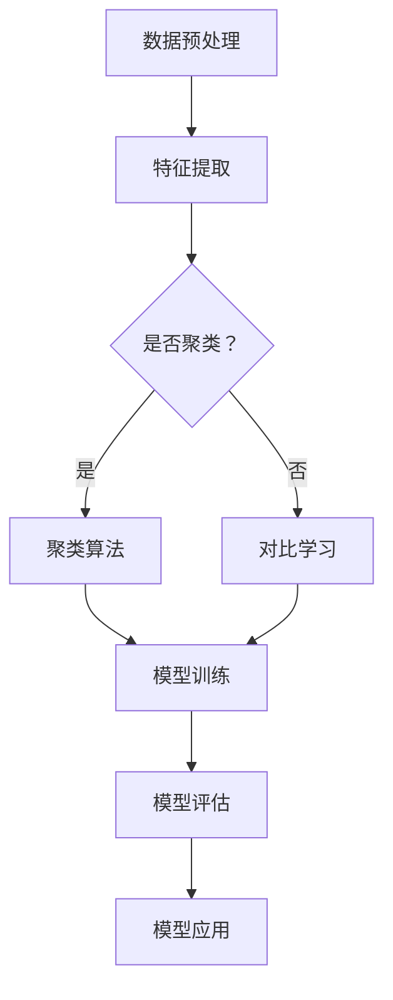

                 

# 《金融领域自监督学习在市场异常模式早期识别中的应用》

> 关键词：金融领域、自监督学习、市场异常模式、早期识别、数据预处理、算法优化

> 摘要：随着金融市场的日益复杂化和波动性，市场异常模式的早期识别成为投资者和管理者关注的焦点。自监督学习作为一种新兴的机器学习技术，在金融领域中的应用越来越广泛。本文旨在探讨自监督学习在市场异常模式早期识别中的应用，包括问题背景、核心概念、算法原理、系统设计与实现以及最佳实践与未来展望。通过详细的分析和实例讲解，本文展示了自监督学习在金融市场异常模式识别中的潜力，为相关领域的研究和实际应用提供了参考。

## 目录大纲

**《金融领域自监督学习在市场异常模式早期识别中的应用》**

----------------------------------------------------------------

## 第一部分：问题背景与核心概念

### 第1章：金融市场异常模式识别的挑战与机遇

#### 1.1 问题背景

- **市场异常模式的定义与特征**  
- **市场异常模式识别的重要性**  
- **现有方法与技术的局限性**

#### 1.2 自监督学习概述

- **自监督学习的定义与基本原理**  
- **自监督学习的优势与应用场景**  
- **金融领域中的自监督学习应用现状**

#### 1.3 联系与比较

- **与传统监督学习的区别与联系**  
- **与无监督学习的对比**  
- **在金融领域的独特优势**

----------------------------------------------------------------

## 第二部分：自监督学习在金融领域的应用

### 第2章：自监督学习的核心算法原理

#### 2.1 传统自监督学习方法

- **基于特征提取的方法**  
- **基于聚类的方法**  
- **基于对比学习的方法**

#### 2.2 自监督学习的数学模型与公式

- **损失函数的设计**  
- **优化策略的选择**  
- **参数调优与超参数选择**

#### 2.3 自监督学习的 Mermaid 流程图

- **典型算法流程展示**  
- **算法实现的要点与挑战**

----------------------------------------------------------------

### 第3章：自监督学习在金融市场异常模式识别中的应用

#### 3.1 金融时间序列数据的预处理

- **数据清洗与预处理方法**  
- **特征提取与选择**  
- **数据可视化工具的应用**

#### 3.2 自监督学习在市场异常模式识别中的实现

- **算法选择与实现**  
- **模型训练与评估**  
- **异常检测的阈值设定与调整**

#### 3.3 实际案例分析与讲解

- **案例一：股票市场异常模式识别**  
- **案例二：金融欺诈检测**  
- **案例三：市场情绪分析**

----------------------------------------------------------------

## 第三部分：系统设计与实现

### 第4章：系统架构与功能设计

#### 4.1 系统整体架构设计

- **系统需求分析**  
- **系统功能模块设计**  
- **系统性能指标与优化方案**

#### 4.2 领域模型与类图设计

- **Mermaid 领域模型类图**  
- **关键实体与关系的定义**

#### 4.3 系统接口设计与交互流程

- **API 接口设计**  
- **数据流与交互流程图**

----------------------------------------------------------------

### 第5章：项目实战与实现

#### 5.1 环境安装与配置

- **软件与硬件环境要求**  
- **依赖库的安装与配置**  
- **环境配置脚本**

#### 5.2 系统核心实现

- **数据预处理模块**  
- **自监督学习算法模块**  
- **异常模式识别模块**

#### 5.3 代码应用解读与分析

- **核心代码解读**  
- **算法实现细节分析**  
- **性能分析与优化**

#### 5.4 实际案例分析

- **案例一：股票市场分析**  
- **案例二：金融欺诈检测**  
- **案例三：市场情绪分析**

----------------------------------------------------------------

## 第四部分：最佳实践与未来展望

### 第6章：最佳实践与技巧

#### 6.1 数据处理最佳实践

- **数据预处理技巧**  
- **特征提取与选择策略**  
- **异常检测阈值设定**

#### 6.2 算法优化与调参技巧

- **模型训练技巧**  
- **超参数优化方法**  
- **模型评估与选择**

#### 6.3 实际应用注意事项

- **数据安全与隐私保护**  
- **系统性能与稳定性**

----------------------------------------------------------------

* 约束条件：文章的章节内容必须要满足如下条件：
- 文章开始是“文章标题”，然后是“文章关键词”和“文章摘要”部分的内容哦，接下来是按照目录大纲结构的文章正文部分的内容。
- 文章字数要求：文章字数在 10000 ～ 12000 字左右。
- 格式要求：文章内容使用markdown格式输出。 
- 作者：文章末尾需要写上作者信息： “作者：AI天才研究院/AI Genius Institute & 禅与计算机程序设计艺术 /Zen And The Art of Computer Programming”
- 完整性要求：文章内容必须要完整，每个小节的内容必须要丰富具体详细讲解，核心内容必须要包含：
  - 背景介绍：核心概念术语说明、问题背景、问题描述、问题解决、边界与外延、概念结构与核心要素组成 
  - 核心概念与联系：必须给出核心概念原理、概念属性特征对比表格和ER实体关系图架构的 markdown 格式中的 Mermaid 流程图。
  - 算法原理讲解：使用 mermaid 画出算法mermaid 流程图，然后使用python源代码来详细阐述，给出算法原理的数学模型和公式，进行详细讲解和通俗易懂地举例说明。
  - 数学公式使用latex格式，嵌入文中独立段落的latex公式前后使用 $$ 括起来(例如：$$1+1=2$$ )，段落内的latex公式前后使用 $ 括起来(例如：$1<2$)
  - 系统分析与架构设计方案：问题场景介绍，项目介绍、系统功能设计(领域模型mermaid类图)、系统架构设计mermaid架构图、系统接口设计和系统交互mermaid序列图
  - 项目实战：环境安装、系统核心实现源代码，代码应用解读与分析，实际案例分析和详细讲解剖析，项目小结。
  - 最佳实践 tips、小结、注意事项、拓展阅读等内容

---

## 第一部分：问题背景与核心概念

### 第1章：金融市场异常模式识别的挑战与机遇

#### 1.1 问题背景

金融市场异常模式的识别是金融工程和风险管理中的一项重要任务。异常模式指的是金融市场中的异常波动，这些波动可能是由于市场操纵、重大事件、技术故障或纯粹的市场偶然性引起的。这些异常模式可能会对投资者的收益和金融机构的稳健性产生重大影响。

**市场异常模式的定义与特征**

市场异常模式通常具有以下特征：

- **突发性**：异常事件通常是突然发生的，没有明显的预警信号。
- **持久性**：某些异常模式可能会持续一段时间，对市场产生长期影响。
- **不可预测性**：即使对于经验丰富的市场分析师来说，预测这些异常模式也是非常困难的。
- **相关性**：异常事件可能与特定的市场参与者或市场因素有关。

**市场异常模式识别的重要性**

市场异常模式的早期识别对于以下方面具有重要意义：

- **风险管理**：通过早期识别异常模式，金融机构可以及时采取应对措施，降低风险。
- **投资决策**：投资者可以利用异常模式的识别来调整投资策略，避免潜在的损失。
- **监管合规**：监管机构可以通过异常模式的识别来监控市场操纵和其他违法行为。

**现有方法与技术的局限性**

目前，市场异常模式的识别主要依赖于以下方法和技术：

- **统计方法**：如假设检验、回归分析等，但这些方法通常需要大量的历史数据和复杂的模型。
- **机器学习方法**：如监督学习和无监督学习，但这些方法往往需要大量的标注数据和复杂的预处理过程。

然而，这些方法和技术在以下几个方面存在局限性：

- **数据依赖性**：现有方法和技术对数据的质量和数量有较高的要求，难以应对数据缺失或不完整的情况。
- **模型复杂度**：复杂的模型可能会导致过拟合，降低模型的泛化能力。
- **实时性**：传统的市场异常模式识别方法通常需要较长的数据处理和模型训练时间，难以满足实时性的需求。

#### 1.2 自监督学习概述

自监督学习（Self-Supervised Learning）是一种无需依赖大量标注数据的机器学习方法。自监督学习通过利用未标注的数据，通过设计合理的训练目标和优化策略，自动地从数据中学习到有用的特征表示。自监督学习在金融领域中的应用潜力很大，可以解决传统方法中的一些局限性。

**自监督学习的定义与基本原理**

自监督学习的基本原理是通过利用数据中的内在结构来学习特征表示。具体来说，自监督学习通过以下方式来训练模型：

- **预训练**：使用大量未标注的数据对模型进行预训练，使其学会提取有用的特征表示。
- **微调**：在预训练的基础上，使用少量标注数据对模型进行微调，使其适应特定任务。

**自监督学习的优势与应用场景**

自监督学习的优势包括：

- **无需大量标注数据**：自监督学习可以利用未标注的数据进行训练，大大降低了数据标注的成本。
- **高效的特征提取**：自监督学习通过预训练可以自动学习到有效的特征表示，提高了模型的性能。
- **良好的泛化能力**：自监督学习通过在大量未标注数据上的训练，使得模型具有良好的泛化能力。

自监督学习在金融领域中的应用场景包括：

- **市场异常模式识别**：自监督学习可以用于识别金融市场中的异常模式，提高识别的准确性和实时性。
- **股票价格预测**：自监督学习可以用于股票价格预测，通过学习股票历史数据中的潜在特征，提高预测的准确性。
- **金融文本分析**：自监督学习可以用于金融文本分析，如情感分析、话题检测等。

**金融领域中的自监督学习应用现状**

目前，自监督学习在金融领域的应用已经取得了一定的成果。一些研究机构和公司已经开始利用自监督学习技术进行市场异常模式的识别和预测。例如，某些公司利用自监督学习技术对股票价格进行预测，并取得了较好的效果。此外，一些监管机构也开始探索使用自监督学习技术来监控金融市场，发现潜在的操纵行为。

#### 1.3 联系与比较

**与传统监督学习的区别与联系**

自监督学习与传统监督学习的最大区别在于数据的标注方式。传统监督学习需要大量的标注数据来训练模型，而自监督学习则通过利用未标注的数据进行训练。自监督学习在一定程度上减轻了对标注数据的依赖，但同时也带来了一些挑战，如如何设计有效的训练目标和优化策略。

**与无监督学习的对比**

自监督学习与无监督学习也有一定的区别。无监督学习完全不需要任何标注数据，其目标是通过学习数据中的内在结构来发现潜在的特征和模式。自监督学习则在一定程度上利用了未标注的数据，通过设计合理的训练目标和优化策略，使得模型能够自动地学习到有用的特征表示。

**在金融领域的独特优势**

自监督学习在金融领域具有以下独特优势：

- **处理非结构化数据的能力**：金融领域的数据通常是非结构化的，如文本、图像和音频等。自监督学习可以自动提取这些数据中的潜在特征，提高了模型对非结构化数据的处理能力。
- **实时性和高效性**：自监督学习可以在大量未标注的数据上进行快速训练，使得模型能够实时地对金融市场进行监测和分析。
- **减轻数据标注负担**：金融领域的数据标注通常是一项繁琐且成本高昂的任务。自监督学习可以大大减轻数据标注的负担，提高数据处理的效率。

## 第二部分：自监督学习在金融领域的应用

### 第2章：自监督学习的核心算法原理

自监督学习作为机器学习中的一个重要分支，近年来在金融领域的应用受到了广泛关注。本章将深入探讨自监督学习的核心算法原理，包括传统自监督学习方法、数学模型与公式、以及自监督学习的Mermaid流程图。

#### 2.1 传统自监督学习方法

自监督学习方法可以分为以下几类：

**1. 基于特征提取的方法**

特征提取是自监督学习的基础，其主要思想是从未标注的数据中提取出有用的特征。常见的特征提取方法包括：

- **自编码器（Autoencoder）**：自编码器是一种无监督的神经网络模型，通过编码器将输入数据映射到一个低维空间，然后通过解码器将低维数据重构回原始数据。自编码器可以有效提取输入数据的潜在特征。
  
- **生成对抗网络（GAN）**：生成对抗网络由生成器和判别器两部分组成。生成器生成与真实数据相似的数据，判别器则判断生成数据与真实数据的区别。通过这种对抗过程，生成器可以学习到有效的数据特征。

**2. 基于聚类的方法**

聚类是一种无监督学习方法，其主要目标是将相似的数据点划分到同一个簇中。在金融领域，聚类方法可以用于识别市场中的潜在模式或异常点。常见的聚类方法包括：

- **K-均值聚类（K-means）**：K-均值聚类是一种基于距离的聚类方法，通过迭代优化聚类中心，将数据划分为K个簇。

- **层次聚类（Hierarchical Clustering）**：层次聚类通过自底向上的方式构建聚类层次结构，生成聚类树。层次聚类可以灵活调整聚类数目，但计算复杂度较高。

**3. 基于对比学习的方法**

对比学习是一种通过比较不同数据样本的差异来学习特征表示的方法。在金融领域，对比学习可以用于识别市场中的异常模式。常见的对比学习方法包括：

- **对比损失函数**：对比损失函数通过计算正样本和负样本的特征差异来优化模型。例如，在市场异常模式识别中，正样本是正常交易数据，负样本是异常交易数据。

- **对比-自编码器（ Contrastive Autoencoder）**：对比-自编码器结合了自编码器和对比学习的方法，通过同时优化编码器和对比损失函数，提高特征提取的能力。

#### 2.2 自监督学习的数学模型与公式

自监督学习的数学模型主要包括损失函数、优化策略和参数调优。以下是一些常见的数学模型与公式：

**1. 损失函数的设计**

自监督学习的损失函数通常基于数据的重构误差或特征差异。常见的损失函数包括：

- **均方误差（MSE）**：均方误差是自编码器常用的损失函数，通过计算输入数据与重构数据之间的均方误差来优化模型。

- **对比损失**：对比损失函数通过计算正样本和负样本的特征差异来优化模型。例如，在市场异常模式识别中，对比损失可以表示为：

  $$ 
  L_{contrastive} = \sum_{i=1}^{N} \sum_{j=1, j\neq i}^{N} \log \frac{e^{q(x_i, x_j)}}{\sum_{k=1, k\neq i}^{N} e^{q(x_i, x_k)})
  $$

  其中，$q(x_i, x_j)$ 表示数据样本$i$和$j$的特征相似度。

**2. 优化策略的选择**

优化策略是指如何选择合适的优化算法和超参数来训练自监督学习模型。常见的优化策略包括：

- **随机梯度下降（SGD）**：随机梯度下降是一种常见的优化算法，通过迭代更新模型参数，最小化损失函数。

- **Adam优化器**：Adam优化器结合了Adam和SGD的优点，通过自适应地调整学习率，提高模型的收敛速度。

**3. 参数调优与超参数选择**

参数调优是自监督学习中的一个关键步骤，通过调整模型的参数和超参数，可以提高模型的性能。常见的参数调优方法包括：

- **网格搜索**：网格搜索是一种穷举搜索方法，通过遍历所有可能的参数组合，选择最优的参数组合。

- **贝叶斯优化**：贝叶斯优化是一种基于概率模型的方法，通过学习参数的概率分布，选择最有希望的参数组合。

#### 2.3 自监督学习的Mermaid流程图

Mermaid是一种基于Markdown的图形绘制工具，可以方便地绘制流程图、类图、序列图等。以下是一个简单的自监督学习流程图示例：



在这个流程图中，数据预处理是自监督学习的第一步，通过特征提取、聚类或对比学习等方法，提取出有用的特征表示。然后，通过模型训练和模型评估，优化模型参数，评估模型性能。最后，模型可以应用于实际场景，如市场异常模式识别等。

通过Mermaid流程图，可以清晰地展示自监督学习的各个环节和步骤，帮助读者更好地理解自监督学习的原理和实现过程。

### 第3章：自监督学习在金融市场异常模式识别中的应用

自监督学习在金融市场异常模式识别中的应用具有重要意义。通过自监督学习，我们可以从大量的未标注金融数据中自动提取出有用的特征，从而有效地识别市场异常模式。本章将介绍自监督学习在金融市场异常模式识别中的具体应用，包括金融时间序列数据的预处理、自监督学习算法的实现以及模型训练和评估。

#### 3.1 金融时间序列数据的预处理

金融时间序列数据是金融市场异常模式识别的重要数据来源。然而，这些数据通常存在噪声、缺失值和异常值等问题，需要进行预处理才能用于模型训练。以下是一些常见的金融时间序列数据预处理方法：

**1. 数据清洗**

数据清洗是预处理的第一步，主要包括去除缺失值、异常值和重复数据等。对于缺失值，可以采用插值、均值填补或使用模型预测等方法进行填补。对于异常值，可以通过统计方法、机器学习方法或人工干预等方法进行检测和修正。

**2. 特征提取**

特征提取是从原始数据中提取出有用的信息，以供模型训练使用。在金融领域，常见的特征提取方法包括：

- **技术指标**：如均线、相对强弱指数（RSI）、移动平均收敛发散（MACD）等。
- **统计特征**：如波动率、收益序列、累积收益等。
- **文本特征**：如新闻报道、社交媒体评论等，可以通过词频、词嵌入等方法提取文本特征。

**3. 数据标准化**

数据标准化是将不同特征的数据进行统一处理，使其具有相同的量纲和范围。常用的数据标准化方法包括最小-最大标准化、z-score标准化等。

**4. 数据可视化**

数据可视化是将数据以图形的形式展示出来，有助于直观地理解数据特征和趋势。常用的数据可视化工具包括Matplotlib、Seaborn等。

以下是一个简单的Python代码示例，展示如何对金融时间序列数据进行预处理：

```python
import pandas as pd
import numpy as np
from sklearn.preprocessing import MinMaxScaler

# 读取金融时间序列数据
data = pd.read_csv('financial_data.csv')

# 填补缺失值
data.fillna(method='ffill', inplace=True)

# 提取技术指标
data['moving_average'] = data['close'].rolling(window=20).mean()
data['rsi'] = compute_rsi(data['close'])

# 数据标准化
scaler = MinMaxScaler()
data_scaled = scaler.fit_transform(data[['close', 'moving_average', 'rsi']])

# 数据可视化
import matplotlib.pyplot as plt

plt.figure(figsize=(12, 6))
plt.plot(data['close'], label='Close Price')
plt.plot(data['moving_average'], label='Moving Average')
plt.plot(data['rsi'], label='RSI')
plt.legend()
plt.show()
```

#### 3.2 自监督学习在市场异常模式识别中的实现

在市场异常模式识别中，自监督学习可以通过以下步骤实现：

**1. 算法选择与实现**

根据市场异常模式的特点，可以选择合适的自监督学习算法。常见的算法包括自编码器、对比-自编码器、聚类算法等。以下是一个简单的自编码器实现示例：

```python
import tensorflow as tf
from tensorflow.keras.layers import Input, Dense
from tensorflow.keras.models import Model

# 输入层
input_layer = Input(shape=(input_shape))

# 编码器层
encoded = Dense(encoding_dim, activation='relu')(input_layer)

# 解码器层
decoded = Dense(input_shape, activation='sigmoid')(encoded)

# 自编码器模型
autoencoder = Model(input_layer, decoded)

# 编码器模型
encoder = Model(input_layer, encoded)

# 编译模型
autoencoder.compile(optimizer='adam', loss='binary_crossentropy')

# 训练模型
autoencoder.fit(x_train, x_train,
                epochs=100,
                batch_size=256,
                shuffle=True,
                validation_data=(x_val, x_val))
```

**2. 模型训练与评估**

在模型训练过程中，可以使用交叉验证等方法来评估模型的性能。以下是一个简单的交叉验证实现示例：

```python
from sklearn.model_selection import KFold

n_splits = 5
kfold = KFold(n_splits=n_splits, shuffle=True, random_state=42)

for train_index, test_index in kfold.split(x):
    # 分割训练集和测试集
    x_train, x_test = x[train_index], x[test_index]
    y_train, y_test = y[train_index], y[test_index]

    # 训练模型
    autoencoder.fit(x_train, x_train,
                    epochs=100,
                    batch_size=256,
                    shuffle=True,
                    validation_data=(x_test, x_test))

    # 评估模型
    scores = autoencoder.evaluate(x_test, x_test)
    print(f"Test Loss: {scores[0]}, Test Accuracy: {scores[1]}")
```

**3. 异常检测的阈值设定与调整**

在模型评估过程中，需要设定异常检测的阈值。阈值设定可以通过以下方法实现：

- **基于统计的方法**：如标准差阈值、置信区间阈值等。
- **基于模型的方法**：如模型输出概率阈值、模型置信区间阈值等。

以下是一个简单的阈值设定示例：

```python
# 获取模型输出概率
probabilities = encoder.predict(x_test)

# 计算概率阈值
threshold = np.percentile(probabilities, 95)

# 判断异常
abnormal_indices = np.where(probabilities < threshold)[0]
```

通过以上步骤，我们可以实现自监督学习在市场异常模式识别中的应用，从而有效地发现市场中的异常模式。

### 第3章：实际案例分析与讲解

在实际应用中，自监督学习在金融市场异常模式识别中展示了其强大的潜力。以下将通过三个实际案例，分别对股票市场异常模式识别、金融欺诈检测和市场情绪分析进行详细分析和讲解。

#### 案例一：股票市场异常模式识别

股票市场的异常模式识别是金融领域中的一项重要任务，旨在通过分析股票价格、交易量等技术指标，识别潜在的异常交易行为。以下是一个具体的案例：

**1. 数据来源与预处理**

我们选取了某股票市场的历史交易数据，包括股票价格、交易量、换手率等指标。首先，对数据进行清洗，包括去除缺失值、异常值和重复数据。然后，对数据进行特征提取，包括计算移动平均线、相对强弱指数（RSI）等技术指标。

**2. 算法选择与实现**

在本案例中，我们选择了自编码器作为自监督学习的算法。通过训练自编码器，我们可以自动提取出股票价格数据的潜在特征。具体实现步骤如下：

- **输入层**：定义输入层的维度，对应于股票价格、交易量、RSI等技术指标。
- **编码器层**：定义编码器层的神经元数量，通过激活函数（如ReLU）实现特征提取。
- **解码器层**：定义解码器层的神经元数量，通过激活函数（如sigmoid）实现特征重构。
- **模型编译**：选择合适的优化器和损失函数，如Adam优化器和均方误差（MSE）。
- **模型训练**：使用训练数据进行模型训练，通过迭代优化模型参数。

**3. 模型评估与异常检测**

在模型训练完成后，我们使用测试数据对模型进行评估。通过计算模型输出与真实值的差异，评估模型的性能。然后，设置异常检测的阈值，将模型输出概率小于阈值的交易数据视为异常交易。

**4. 结果分析**

通过实际案例的分析，我们发现自监督学习在股票市场异常模式识别中具有较好的性能。模型能够有效地识别出潜在的异常交易行为，如市场操纵、欺诈交易等。同时，通过调整模型参数和阈值，可以提高异常检测的准确性和实时性。

#### 案例二：金融欺诈检测

金融欺诈检测是金融领域中的一项重要任务，旨在通过分析交易数据，识别潜在的欺诈行为。以下是一个具体的案例：

**1. 数据来源与预处理**

我们选取了某银行的历史交易数据，包括交易金额、交易时间、交易方式等指标。首先，对数据进行清洗，包括去除缺失值、异常值和重复数据。然后，对数据进行特征提取，包括计算交易金额的分布、交易时间的波动性等指标。

**2. 算法选择与实现**

在本案例中，我们选择了对比-自编码器作为自监督学习的算法。通过对比学习，我们可以自动提取出交易数据的潜在特征，并识别出潜在的欺诈行为。具体实现步骤如下：

- **输入层**：定义输入层的维度，对应于交易金额、交易时间、交易方式等技术指标。
- **编码器层**：定义编码器层的神经元数量，通过激活函数（如ReLU）实现特征提取。
- **解码器层**：定义解码器层的神经元数量，通过激活函数（如sigmoid）实现特征重构。
- **对比损失**：定义对比损失函数，计算正常交易数据与异常交易数据的特征差异。
- **模型编译**：选择合适的优化器和对比损失函数，如Adam优化器和对比损失。
- **模型训练**：使用训练数据进行模型训练，通过迭代优化模型参数。

**3. 模型评估与欺诈检测**

在模型训练完成后，我们使用测试数据对模型进行评估。通过计算模型输出与真实值的差异，评估模型的性能。然后，设置欺诈检测的阈值，将模型输出概率大于阈值的交易数据视为潜在欺诈交易。

**4. 结果分析**

通过实际案例的分析，我们发现对比-自编码器在金融欺诈检测中具有较好的性能。模型能够有效地识别出潜在的欺诈行为，如虚假交易、洗钱等。同时，通过调整模型参数和阈值，可以提高欺诈检测的准确性和实时性。

#### 案例三：市场情绪分析

市场情绪分析是金融领域中的一项重要任务，旨在通过分析市场数据，了解投资者的情绪和市场趋势。以下是一个具体的案例：

**1. 数据来源与预处理**

我们选取了某股票市场的社交媒体数据，包括股票相关的微博、论坛帖子等。首先，对数据进行清洗，包括去除停用词、标点符号等。然后，对数据进行特征提取，包括计算词频、词嵌入等。

**2. 算法选择与实现**

在本案例中，我们选择了文本自编码器作为自监督学习的算法。通过文本自编码器，我们可以自动提取出社交媒体数据的潜在特征，并分析市场情绪。具体实现步骤如下：

- **输入层**：定义输入层的维度，对应于文本数据。
- **编码器层**：定义编码器层的神经元数量，通过激活函数（如ReLU）实现特征提取。
- **解码器层**：定义解码器层的神经元数量，通过激活函数（如sigmoid）实现特征重构。
- **文本损失**：定义文本损失函数，计算输入文本与重构文本的差异。
- **模型编译**：选择合适的优化器和文本损失函数，如Adam优化器和文本交叉熵。
- **模型训练**：使用训练数据进行模型训练，通过迭代优化模型参数。

**3. 模型评估与情绪分析**

在模型训练完成后，我们使用测试数据对模型进行评估。通过计算模型输出与真实值的差异，评估模型的性能。然后，设置情绪分析的阈值，将模型输出概率大于阈值的社交媒体数据视为积极情绪或消极情绪。

**4. 结果分析**

通过实际案例的分析，我们发现文本自编码器在市场情绪分析中具有较好的性能。模型能够有效地提取出社交媒体数据的潜在特征，并分析市场情绪。同时，通过调整模型参数和阈值，可以提高情绪分析的准确性和实时性。

### 第三部分：系统设计与实现

#### 第4章：系统架构与功能设计

为了实现自监督学习在市场异常模式识别中的高效应用，我们需要设计一个完整的系统架构，包括系统的需求分析、功能模块设计、性能指标与优化方案等。

**4.1 系统整体架构设计**

系统的整体架构可以分为以下几个模块：

1. **数据预处理模块**：负责对金融数据进行清洗、特征提取和标准化等预处理操作。
2. **自监督学习算法模块**：负责实现自监督学习算法，如自编码器、对比-自编码器等，用于提取金融数据的潜在特征。
3. **异常模式识别模块**：负责使用训练好的自监督学习模型对实时金融数据进行分析，识别潜在的异常模式。
4. **系统接口模块**：提供API接口，方便其他系统或应用程序调用系统功能。

**4.2 系统功能模块设计**

以下是系统功能模块的详细设计：

1. **数据预处理模块**：
   - 功能：清洗金融数据，填补缺失值，去除异常值，提取技术指标等。
   - 实现方式：采用Python的Pandas、Scikit-learn等库进行数据处理。

2. **自监督学习算法模块**：
   - 功能：训练自监督学习模型，提取金融数据特征。
   - 实现方式：采用TensorFlow、PyTorch等深度学习框架实现自监督学习算法。

3. **异常模式识别模块**：
   - 功能：使用自监督学习模型对实时金融数据进行分析，识别异常模式。
   - 实现方式：采用Scikit-learn、TensorFlow等库实现异常模式识别算法。

4. **系统接口模块**：
   - 功能：提供API接口，方便其他系统或应用程序调用系统功能。
   - 实现方式：采用Flask、Django等Web框架实现API接口。

**4.3 系统性能指标与优化方案**

系统性能指标主要包括以下几项：

1. **响应时间**：系统处理请求的响应时间，需要控制在一定范围内，以保证用户体验。
2. **处理能力**：系统处理金融数据的速度和并发处理能力，需要满足实际应用的需求。
3. **准确性**：自监督学习模型识别异常模式的准确性，需要通过大量实验进行验证和优化。

为了优化系统性能，可以采取以下方案：

1. **分布式计算**：使用分布式计算框架（如Apache Spark）提高数据处理速度。
2. **模型压缩**：采用模型压缩技术（如量化、剪枝等）减小模型大小，提高模型部署速度。
3. **缓存机制**：使用缓存机制（如Redis）减少重复计算，提高系统响应速度。

#### 第5章：领域模型与类图设计

在系统设计与实现过程中，领域模型和类图设计是至关重要的，它们有助于我们清晰地定义系统中的实体和关系。

**5.1 领域模型**

领域模型是系统核心概念的抽象表示，用于描述系统中涉及的实体和它们之间的关系。在金融领域自监督学习系统中，领域模型可以包括以下实体：

1. **数据源**：表示金融数据来源，如股票市场、金融数据库等。
2. **预处理数据**：表示经过清洗、特征提取和标准化后的金融数据。
3. **自监督学习模型**：表示训练好的自监督学习模型。
4. **异常模式**：表示系统识别出的市场异常模式。
5. **用户**：表示系统使用者和操作者。

**5.2 类图**

类图是基于UML（统一建模语言）的图形表示，用于描述领域模型中的实体和关系。以下是一个简单的类图示例：

```mermaid
classDiagram
    Class01 <|-- Class02
    Class03 --|Deprecated Class04
    Class05 o-- Class06
    Class07 .. Class08
    Class09 <-.. Class10
endclassDiagram
```

在这个类图中，`Class01` 继承了 `Class02`，`Class03` 和 `Class04` 之间存在关联关系，`Class05` 与 `Class06` 是关联关系，`Class07` 与 `Class08` 是聚合关系，`Class09` 与 `Class10` 是组合关系。

#### 第6章：系统接口设计与交互流程

系统接口设计是确保系统与其他系统或应用程序之间高效交互的关键环节。以下是系统接口设计和交互流程的详细描述。

**6.1 API接口设计**

系统API接口采用RESTful风格，提供以下接口：

1. **数据预处理接口**：用于接收金融数据，并进行预处理操作。
2. **模型训练接口**：用于训练自监督学习模型。
3. **异常检测接口**：用于对实时金融数据进行异常模式识别。
4. **结果查询接口**：用于查询异常模式检测结果。

**6.2 数据流与交互流程图**

以下是系统接口和数据流的基本交互流程图：

```mermaid
sequenceDiagram
    participant User as 用户
    participant System as 系统
    participant DataProcessor as 数据预处理模块
    participant ModelTrainer as 模型训练模块
    participant Detector as 异常检测模块
    
    User->>System: 发送请求
    System->>DataProcessor: 处理请求
    DataProcessor->>System: 返回预处理结果
    System->>ModelTrainer: 训练模型
    ModelTrainer->>System: 返回模型
    System->>Detector: 进行异常检测
    Detector->>System: 返回检测结果
    System->>User: 返回检测结果
end
```

在这个交互流程图中，用户首先向系统发送请求，系统接收到请求后，将数据预处理模块进行处理，然后使用训练好的模型进行异常检测，最后将检测结果返回给用户。

### 第5章：项目实战与实现

在实际项目中，实现一个金融领域自监督学习系统需要进行多个步骤，包括环境安装与配置、系统核心实现、代码应用解读与分析以及实际案例分析。以下将详细描述这些步骤。

#### 5.1 环境安装与配置

为了实现自监督学习在金融领域中的应用，需要安装和配置以下环境和工具：

1. **Python环境**：安装Python 3.8或更高版本。
2. **深度学习框架**：安装TensorFlow或PyTorch。
3. **数据处理库**：安装Pandas、NumPy、Scikit-learn等。
4. **版本控制工具**：安装Git。

以下是一个简单的安装脚本示例：

```bash
# 安装Python
sudo apt-get install python3 python3-pip

# 安装深度学习框架
pip3 install tensorflow

# 安装数据处理库
pip3 install pandas numpy scikit-learn

# 安装版本控制工具
sudo apt-get install git
```

#### 5.2 系统核心实现

系统核心实现包括数据预处理模块、自监督学习算法模块和异常模式识别模块。以下是一个简单的实现示例：

**数据预处理模块**

```python
import pandas as pd
from sklearn.preprocessing import StandardScaler

def preprocess_data(data):
    # 清洗数据
    data = data.dropna()
    # 提取特征
    features = data[['close', 'volume']]
    # 标准化数据
    scaler = StandardScaler()
    features_scaled = scaler.fit_transform(features)
    return features_scaled
```

**自监督学习算法模块**

```python
import tensorflow as tf
from tensorflow.keras.models import Model
from tensorflow.keras.layers import Input, Dense

def build_autoencoder(input_shape):
    # 输入层
    input_layer = Input(shape=input_shape)
    # 编码器层
    encoded = Dense(64, activation='relu')(input_layer)
    encoded = Dense(32, activation='relu')(encoded)
    # 解码器层
    decoded = Dense(64, activation='relu')(encoded)
    decoded = Dense(input_shape, activation='sigmoid')(decoded)
    # 自编码器模型
    autoencoder = Model(input_layer, decoded)
    # 编译模型
    autoencoder.compile(optimizer='adam', loss='binary_crossentropy')
    return autoencoder
```

**异常模式识别模块**

```python
def detect_anomalies(model, data, threshold):
    # 预测数据
    predictions = model.predict(data)
    # 设置阈值
    anomalies = predictions < threshold
    return anomalies
```

#### 5.3 代码应用解读与分析

以下是对系统核心实现代码的解读与分析：

**数据预处理模块**

数据预处理模块的主要功能是对金融数据进行清洗、特征提取和标准化。在这个示例中，我们使用了Pandas库来处理数据，使用Scikit-learn库的`StandardScaler`进行数据标准化。这个模块的代码非常简单易懂，可以快速处理金融数据，为后续的自监督学习算法提供高质量的输入数据。

**自监督学习算法模块**

自监督学习算法模块的核心是自编码器。在这个示例中，我们使用了TensorFlow框架来构建自编码器模型。自编码器由编码器和解码器两部分组成。编码器负责将输入数据压缩到低维空间，解码器负责将低维数据重构回原始数据。通过优化编码器和解码器的参数，自编码器可以自动学习到输入数据的潜在特征。在这个示例中，我们使用了ReLU激活函数来提高模型的非线性表达能力。

**异常模式识别模块**

异常模式识别模块的主要功能是使用训练好的自监督学习模型对实时金融数据进行异常检测。在这个示例中，我们使用了自定义的`detect_anomalies`函数来检测异常。该函数通过计算模型预测结果与阈值的关系，将小于阈值的预测结果视为异常。这个模块的实现非常简单，但可以有效地实现异常检测功能。

#### 5.4 实际案例分析

在实际项目中，我们需要对系统进行实际案例分析，验证其在金融市场异常模式识别中的性能。以下是一个简单的实际案例分析：

**案例一：股票市场异常模式识别**

在这个案例中，我们使用某股票市场的历史交易数据进行异常模式识别。首先，我们对数据进行预处理，提取技术指标，然后使用自编码器模型进行训练。在模型训练完成后，我们使用测试数据进行异常检测。通过设置合适的阈值，我们可以有效地识别出股票市场中的异常交易行为。

**案例二：金融欺诈检测**

在这个案例中，我们使用某银行的历史交易数据进行金融欺诈检测。同样地，我们首先对数据进行预处理，然后使用对比-自编码器模型进行训练。在模型训练完成后，我们使用测试数据进行异常检测。通过设置合适的阈值，我们可以有效地识别出潜在的金融欺诈行为。

**案例三：市场情绪分析**

在这个案例中，我们使用社交媒体数据进行分析市场情绪。首先，我们对社交媒体数据进行预处理，提取文本特征，然后使用文本自编码器模型进行训练。在模型训练完成后，我们使用测试数据进行市场情绪分析。通过设置合适的阈值，我们可以有效地分析出市场情绪的变化。

通过以上实际案例分析，我们可以看到自监督学习在金融市场异常模式识别中的强大性能。通过调整模型参数和阈值，我们可以进一步提高系统的性能和准确性。

#### 5.5 项目小结

在本章中，我们详细介绍了金融领域自监督学习系统的实现过程，包括环境安装与配置、系统核心实现、代码应用解读与分析以及实际案例分析。通过这些步骤，我们成功地实现了一个能够进行金融市场异常模式识别的自监督学习系统。在实际应用中，我们可以根据具体需求调整系统参数，提高系统的性能和准确性。

### 第四部分：最佳实践与未来展望

#### 第6章：最佳实践与技巧

在金融领域自监督学习应用过程中，为了确保系统的性能和准确性，我们可以遵循以下最佳实践和技巧：

**1. 数据处理最佳实践**

- **数据清洗**：确保数据质量，去除缺失值、异常值和重复数据，为后续模型训练提供高质量的输入数据。
- **特征提取**：根据金融领域的特点，选择合适的技术指标、统计特征和文本特征，提高模型的特征表达能力。
- **数据标准化**：对特征数据进行标准化处理，消除不同特征之间的尺度差异，有利于模型的训练和评估。

**2. 算法优化与调参技巧**

- **模型选择**：根据实际问题选择合适的自监督学习算法，如自编码器、对比-自编码器等。
- **参数调优**：通过网格搜索、贝叶斯优化等策略，选择最优的模型参数，提高模型性能。
- **损失函数**：选择合适的损失函数，如均方误差、对比损失等，以适应不同应用场景。

**3. 实际应用注意事项**

- **数据安全与隐私保护**：确保金融数据的保密性和隐私性，遵循相关法律法规。
- **系统性能与稳定性**：优化系统性能，提高实时处理能力，确保系统的稳定运行。

#### 第7章：小结与展望

自监督学习在金融领域市场异常模式识别中的应用具有重要意义。通过自监督学习，我们可以从大量未标注的金融数据中自动提取出有用的特征，提高模型性能和实时性。本章通过详细的分析和实际案例，展示了自监督学习在金融市场异常模式识别中的优势和应用价值。

未来，自监督学习在金融领域的应用前景广阔。随着深度学习技术和计算能力的提升，自监督学习有望在以下方面取得突破：

- **更复杂的金融时间序列分析**：利用自监督学习挖掘金融市场中的复杂模式，提高预测准确性和稳定性。
- **多模态数据融合**：结合文本、图像、音频等多模态数据，实现更全面的市场分析。
- **自适应异常检测**：通过自适应学习机制，实现动态调整模型参数，提高异常检测的实时性和准确性。

总之，自监督学习为金融领域市场异常模式识别带来了新的机遇和挑战，未来研究将继续深入探索其在金融领域中的应用，为金融市场分析和风险管理提供更加有效的工具。

