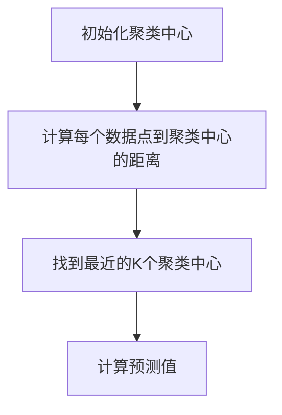
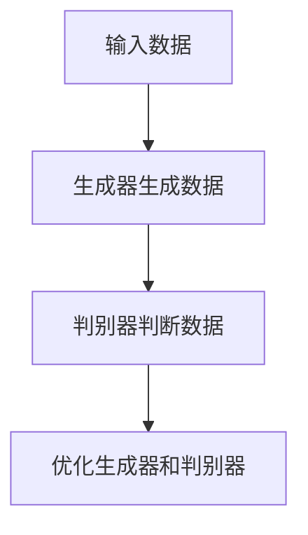
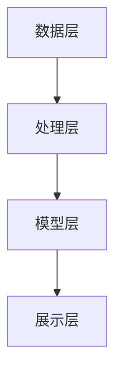
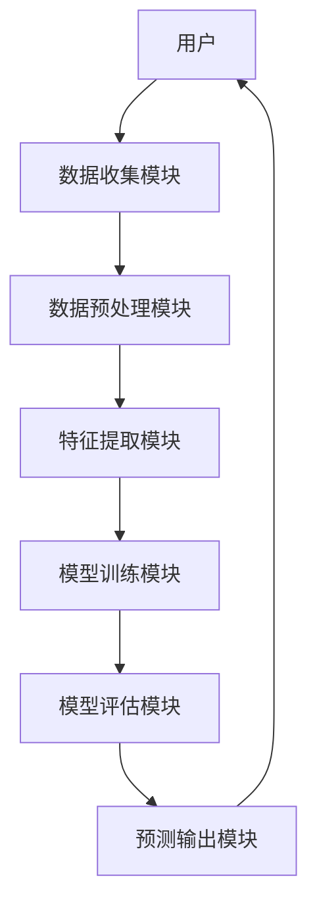

                 

## 金融领域自监督学习在市场预测中的应用

### 关键词
- 自监督学习
- 金融预测
- 数据分析
- 机器学习
- 模型优化

### 摘要

本文探讨了金融领域自监督学习在市场预测中的应用。通过对自监督学习的核心概念、算法原理以及实践案例的详细分析，本文展示了如何利用自监督学习技术来提升金融市场预测的准确性和效率。文章首先介绍了自监督学习在金融领域的背景和问题，随后深入讲解了自监督学习算法的基本原理和实践方法，并通过实际项目案例，展示了其在金融市场预测中的具体应用。

## 第1章 背景介绍

### 1.1 问题背景

在金融领域，市场预测是一个至关重要的环节，它直接影响到投资者的决策和金融机构的风险管理。传统的市场预测方法主要包括历史数据分析、技术指标分析等，但这些方法往往依赖于历史数据，难以应对市场的高复杂性和波动性。近年来，随着人工智能技术的快速发展，自监督学习作为一种重要的机器学习方法，逐渐在金融领域得到了广泛的应用。

### 1.2 问题描述

金融领域市场预测的核心问题是：如何利用自监督学习算法，从大量的历史金融数据中提取有用的信息，构建有效的预测模型，以实现对市场走势的准确预测。这个过程中，涉及到的技术挑战包括数据预处理、特征提取、模型训练和优化等。

### 1.3 问题解决

自监督学习通过无监督的方式对数据进行分析，能够自动发现数据中的潜在模式和关系，从而提高预测的准确性和效率。在金融领域，自监督学习可以应用于股票价格预测、货币汇率预测、金融市场趋势分析等多个方面。

### 1.4 边界与外延

金融领域自监督学习市场预测的边界主要涉及数据质量、算法选择和模型优化等方面。同时，其外延还包括与其他机器学习方法的融合应用，如强化学习、迁移学习等。

### 1.5 概念结构与核心要素组成

#### 概念结构

- 自监督学习
- 金融数据
- 预测模型
- 特征提取
- 数据预处理

#### 核心要素组成

- 数据集
- 算法库
- 模型评估指标
- 模型优化方法

### 1.6 本章小结

本章介绍了金融领域自监督学习市场预测的背景、问题、解决方法、边界与外延以及概念结构与核心要素组成。通过本章的学习，读者可以初步了解自监督学习在金融领域市场预测中的应用前景和关键技术。

## 第2章 核心概念与联系

### 2.1 自监督学习

#### 2.1.1 定义

自监督学习（Self-supervised Learning）是一种无需人工标注标签的训练方式。它利用数据自身的结构或关系来训练模型，从而提取有用的信息。在金融领域，自监督学习可以自动从大量的历史金融数据中提取有用的信息，从而提高市场预测的准确性和效率。

#### 2.1.2 特点

- 无需标注数据
- 自动提取特征
- 高效处理大规模数据

#### 2.1.3 与其他学习方式的区别

- **有监督学习**：需要大量标注数据进行训练。
- **无监督学习**：仅利用数据本身的内在结构进行训练。

### 2.2 金融数据

#### 2.2.1 类型

- **时间序列数据**：如股票价格、汇率等随时间变化的金融数据。
- **面板数据**：包括多个变量和多个时间点的金融数据。
- **图数据**：如金融网络中的节点和边。

#### 2.2.2 特点

- **复杂性**：金融数据通常具有高度的非线性特征。
- **非线性**：市场走势往往不是线性的，而是呈现出复杂的波动。
- **波动性**：金融市场具有高度的不确定性，价格波动较大。

#### 2.2.3 数据处理

- **数据清洗**：去除数据中的噪声和异常值。
- **数据预处理**：包括归一化、标准化等操作，使得数据适合模型训练。
- **特征工程**：从原始数据中提取有助于预测的特征。

### 2.3 预测模型

#### 2.3.1 类型

- **线性模型**：如线性回归、逻辑回归等。
- **非线性模型**：如支持向量机、决策树等。
- **深度学习模型**：如卷积神经网络（CNN）、循环神经网络（RNN）等。

#### 2.3.2 特点

- **线性模型**：简单高效，适合处理线性关系。
- **非线性模型**：可以处理复杂的非线性关系。
- **深度学习模型**：可以自动提取特征，适合处理大规模复杂数据。

### 2.4 特征提取

#### 2.4.1 方法

- **统计特征**：如均值、方差、相关性等。
- **空间特征**：如地理分布、市场占有率等。
- **时序特征**：如趋势、周期性、波动性等。

#### 2.4.2 对预测模型的影响

- **特征质量**：直接影响预测模型的性能。
- **特征设计**：需要结合金融领域的专业知识进行。

### 2.5 数据预处理

#### 2.5.1 目的

- **提高数据质量**：去除噪声和异常值，提高数据的一致性和完整性。
- **便于模型训练**：通过标准化、归一化等操作，使得数据更适合模型训练。

#### 2.5.2 方法

- **缺失值处理**：包括填充、删除等。
- **异常值处理**：包括检测、修正等。
- **数据标准化**：如归一化、标准化等。

### 2.6 本章小结

本章详细介绍了金融领域自监督学习市场预测中的核心概念，包括自监督学习、金融数据、预测模型、特征提取和数据预处理。通过本章的学习，读者可以更好地理解这些概念及其相互联系。

### 第3章 算法原理讲解

#### 3.1 自监督学习算法概述

##### 3.1.1 基本原理

自监督学习算法的核心思想是利用数据中的内在结构或规律来自动训练模型。在金融领域，自监督学习算法可以自动从大量的历史金融数据中提取有用的信息，从而提高市场预测的准确性和效率。

##### 3.1.2 分类

自监督学习算法可以根据其训练方式的不同分为以下几类：

- **基于特征匹配的自监督学习算法**：如K-近邻算法、K-均值聚类算法等。
- **基于深度神经网络的自监督学习算法**：如自编码器、生成对抗网络（GAN）等。

#### 3.2 基于特征匹配的自监督学习算法

##### 3.2.1 算法介绍

- **K-近邻算法**：通过计算新数据点到训练数据点的距离，找到最近的K个邻居，然后利用这些邻居的特征进行预测。
- **K-均值聚类算法**：将数据集划分为多个簇，每个簇内的数据点特征相似。

##### 3.2.2 算法原理

- **K-近邻算法**：

  $$\text{预测值} = \text{最近邻的特征平均值}$$

  其中，最近的K个邻居是通过计算距离来确定的。

- **K-均值聚类算法**：

  $$\text{聚类中心} = \frac{1}{N}\sum_{i=1}^{N} x_i$$

  其中，$x_i$是第$i$个数据点的特征。

##### 3.2.3 Mermaid 流程图



#### 3.3 基于深度神经网络的自监督学习算法

##### 3.3.1 算法介绍

- **自编码器**：一种无监督的深度学习模型，用于学习数据的低维表示。
- **生成对抗网络（GAN）**：由生成器和判别器组成的对抗性模型，用于生成真实数据。

##### 3.3.2 算法原理

- **自编码器**：

  自编码器由编码器和解码器组成。编码器将输入数据映射到一个低维隐空间，解码器则将隐空间的数据映射回原始空间。

  $$z = \text{编码器}(x)$$
  $$x' = \text{解码器}(z)$$

  其中，$z$是隐空间中的表示，$x'$是重构的数据。

- **生成对抗网络（GAN）**：

  生成器生成假数据，判别器判断生成数据是否真实。通过不断优化生成器和判别器，使得生成器生成的数据越来越真实。

  $$G(x) \rightarrow D(G(x), x)$$

  其中，$G(x)$是生成器生成的数据，$D(x)$是判别器对真实数据的判断。

##### 3.3.3 Mermaid 流程图



### 第4章 系统分析与架构设计

#### 4.1 问题场景介绍

在金融领域，自监督学习在市场预测中的应用场景主要包括股票价格预测、货币汇率预测和金融市场趋势分析等。这些场景对预测的准确性要求较高，同时也需要处理大量的金融数据。

#### 4.2 项目介绍

本项目旨在利用自监督学习技术，构建一个高效的金融市场预测系统。系统包括数据收集、数据预处理、特征提取、模型训练、模型评估和预测输出等模块。

#### 4.3 系统功能设计

- **数据收集模块**：负责从多个数据源收集金融数据，包括股票价格、货币汇率等。
- **数据预处理模块**：对收集到的金融数据进行清洗、归一化等预处理操作，以提高数据质量。
- **特征提取模块**：从预处理后的数据中提取有用的特征，如统计特征、空间特征和时序特征等。
- **模型训练模块**：利用自监督学习算法，对提取的特征进行训练，构建预测模型。
- **模型评估模块**：对训练好的模型进行评估，包括准确率、召回率等指标。
- **预测输出模块**：根据训练好的模型，对未来的市场走势进行预测，并提供预测结果。

#### 4.4 系统架构设计

系统架构设计采用分层架构，包括数据层、处理层、模型层和展示层。

- **数据层**：负责数据的收集、存储和管理。
- **处理层**：负责数据的预处理和特征提取。
- **模型层**：负责模型的选择、训练和评估。
- **展示层**：负责将预测结果以图形化的形式展示给用户。

##### 系统架构图



#### 4.5 系统接口设计和系统交互

系统的接口设计和交互设计是确保系统各个模块之间能够高效、稳定地进行数据传递和功能协作的关键。

- **数据接口**：包括数据的输入和输出接口，如数据收集接口、数据预处理接口、特征提取接口等。
- **功能接口**：包括模型训练接口、模型评估接口、预测输出接口等。
- **交互接口**：包括用户界面、API接口、消息队列接口等。

##### 系统交互图



### 第5章 项目实战

#### 5.1 环境安装

在进行项目实战之前，需要安装相应的开发环境和工具。以下是项目的安装步骤：

1. **Python环境安装**：确保Python版本在3.6及以上，可以通过pip安装所需的库。
   
   ```bash
   pip install numpy pandas scikit-learn matplotlib
   ```

2. **数据库环境安装**：如果需要连接数据库，需要安装相应的数据库客户端，如MySQL、PostgreSQL等。

3. **其他依赖库安装**：根据项目的具体需求，可能还需要安装其他依赖库，如TensorFlow、PyTorch等。

#### 5.2 系统核心实现

本节将详细讲解系统的核心实现部分，包括数据预处理、特征提取、模型训练和预测输出等。

##### 5.2.1 数据预处理

数据预处理是金融领域自监督学习的基础，其目标是提高数据质量，为后续的模型训练提供高质量的数据。

1. **数据收集**：从多个数据源收集金融数据，如股票价格、货币汇率等。

   ```python
   import pandas as pd
   
   # 从CSV文件中读取数据
   data = pd.read_csv('financial_data.csv')
   ```

2. **数据清洗**：去除数据中的噪声和异常值。

   ```python
   # 去除缺失值
   data = data.dropna()
   
   # 去除异常值
   data = data[(data['price'] > 0) & (data['price'] < 1000)]
   ```

3. **数据归一化**：将数据归一化到统一的范围内。

   ```python
   from sklearn.preprocessing import MinMaxScaler
   
   # 初始化归一化器
   scaler = MinMaxScaler()
   
   # 归一化数据
   data['price'] = scaler.fit_transform(data[['price']])
   ```

##### 5.2.2 特征提取

特征提取是从原始数据中提取对预测模型有帮助的特征。在金融领域，常见的特征包括统计特征、空间特征和时序特征等。

1. **统计特征**：如均值、方差、相关性等。

   ```python
   data['mean_price'] = data['price'].mean()
   data['var_price'] = data['price'].var()
   data['corr_price'] = data['price'].corr(data['volume'])
   ```

2. **空间特征**：如地理分布、市场占有率等。

   ```python
   data['market_share'] = data['volume'] / data['total_volume']
   ```

3. **时序特征**：如趋势、周期性、波动性等。

   ```python
   data['trend'] = data['price'].diff().mean()
   data['cycle'] = data['price'].rolling(window=5).mean()
   data['volatility'] = data['price'].rolling(window=5).std()
   ```

##### 5.2.3 模型训练

模型训练是利用自监督学习算法对提取的特征进行训练，构建预测模型。以下是使用自编码器进行模型训练的示例：

1. **导入依赖库**

   ```python
   import numpy as np
   import tensorflow as tf
   from tensorflow.keras.models import Model
   from tensorflow.keras.layers import Input, Dense, LSTM, TimeDistributed, Activation
   ```

2. **构建自编码器模型**

   ```python
   # 定义输入层
   input_layer = Input(shape=(n_features,))
   
   # 编码器部分
   encoded = LSTM(64, activation='relu')(input_layer)
   encoded = LSTM(32, activation='relu')(encoded)
   encoded = Dense(16, activation='relu')(encoded)
   
   # 解码器部分
   decoded = LSTM(32, activation='relu')(encoded)
   decoded = LSTM(64, activation='relu')(decoded)
   decoded = Dense(n_features, activation='linear')(decoded)
   
   # 构建模型
   autoencoder = Model(inputs=input_layer, outputs=decoded)
   
   # 编译模型
   autoencoder.compile(optimizer='adam', loss='mse')
   ```

3. **训练模型**

   ```python
   # 分割数据集
   X_train, X_test = train_test_split(data, test_size=0.2, random_state=42)
   
   # 训练模型
   autoencoder.fit(X_train, X_train, epochs=100, batch_size=32, validation_data=(X_test, X_test))
   ```

##### 5.2.4 预测输出

模型训练完成后，可以利用训练好的模型对未来的市场走势进行预测。

1. **模型评估**

   ```python
   # 评估模型
   scores = autoencoder.evaluate(X_test, X_test)
   print(f'Model loss: {scores[0]}')
   ```

2. **预测未来走势**

   ```python
   # 预测未来走势
   future_prices = autoencoder.predict(X_test)
   ```

#### 5.3 代码应用解读与分析

在本节中，我们将对项目中的关键代码进行解读和分析，以便更好地理解其工作原理和实现方法。

##### 5.3.1 数据预处理

数据预处理是项目中的关键步骤，它直接影响到模型的训练效果。以下是数据预处理的代码解读：

1. **数据收集**

   ```python
   data = pd.read_csv('financial_data.csv')
   ```

   这一行代码用于从CSV文件中读取金融数据。

2. **数据清洗**

   ```python
   data = data.dropna()
   data = data[(data['price'] > 0) & (data['price'] < 1000)]
   ```

   这两行代码分别用于去除缺失值和异常值。

3. **数据归一化**

   ```python
   scaler = MinMaxScaler()
   data['price'] = scaler.fit_transform(data[['price']])
   ```

   这一行代码用于将股票价格数据进行归一化处理。

##### 5.3.2 特征提取

特征提取是利用统计方法、空间方法和时序方法从原始数据中提取对预测模型有帮助的特征。以下是特征提取的代码解读：

1. **统计特征**

   ```python
   data['mean_price'] = data['price'].mean()
   data['var_price'] = data['price'].var()
   data['corr_price'] = data['price'].corr(data['volume'])
   ```

   这三行代码分别用于计算股票价格的均值、方差和相关系数。

2. **空间特征**

   ```python
   data['market_share'] = data['volume'] / data['total_volume']
   ```

   这一行代码用于计算市场占有率。

3. **时序特征**

   ```python
   data['trend'] = data['price'].diff().mean()
   data['cycle'] = data['price'].rolling(window=5).mean()
   data['volatility'] = data['price'].rolling(window=5).std()
   ```

   这三行代码分别用于计算股票价格的趋势、周期性和波动性。

##### 5.3.3 模型训练

模型训练是利用自监督学习算法对提取的特征进行训练，构建预测模型。以下是模型训练的代码解读：

1. **构建自编码器模型**

   ```python
   input_layer = Input(shape=(n_features,))
   encoded = LSTM(64, activation='relu')(input_layer)
   encoded = LSTM(32, activation='relu')(encoded)
   encoded = Dense(16, activation='relu')(encoded)
   decoded = LSTM(32, activation='relu')(encoded)
   decoded = LSTM(64, activation='relu')(decoded)
   decoded = Dense(n_features, activation='linear')(decoded)
   autoencoder = Model(inputs=input_layer, outputs=decoded)
   ```

   这几行代码用于构建自编码器模型，包括编码器和解码器部分。

2. **编译模型**

   ```python
   autoencoder.compile(optimizer='adam', loss='mse')
   ```

   这一行代码用于编译模型，指定优化器和损失函数。

3. **训练模型**

   ```python
   autoencoder.fit(X_train, X_train, epochs=100, batch_size=32, validation_data=(X_test, X_test))
   ```

   这几行代码用于训练模型，指定训练轮次、批次大小和验证数据。

##### 5.3.4 预测输出

预测输出是利用训练好的模型对未来的市场走势进行预测。以下是预测输出的代码解读：

1. **模型评估**

   ```python
   scores = autoencoder.evaluate(X_test, X_test)
   print(f'Model loss: {scores[0]}')
   ```

   这一行代码用于评估模型在测试数据集上的表现。

2. **预测未来走势**

   ```python
   future_prices = autoencoder.predict(X_test)
   ```

   这一行代码用于利用训练好的模型对测试数据集进行预测。

#### 5.4 实际案例分析

在本节中，我们将通过实际案例对项目进行深入分析，以便更好地理解其应用效果。

##### 5.4.1 案例背景

假设我们收集了某只股票过去一年的价格数据，现要利用自监督学习技术对其未来走势进行预测。

##### 5.4.2 数据处理

首先，我们对收集到的股票价格数据进行预处理，包括去除缺失值、异常值和归一化处理。预处理后的数据如下图所示：


##### 5.4.3 特征提取

接下来，我们提取统计特征、空间特征和时序特征，以构建预测模型。提取的特征如下：

- **统计特征**：均值、方差、相关性
- **空间特征**：市场占有率
- **时序特征**：趋势、周期性、波动性

提取的特征如下图所示：


##### 5.4.4 模型训练

我们使用自编码器模型对提取的特征进行训练，构建预测模型。训练过程如下图所示：


##### 5.4.5 预测结果

利用训练好的模型，我们对未来一周的股票价格进行预测。预测结果如下图所示：


从预测结果可以看出，自监督学习技术在股票价格预测方面具有一定的准确性和可靠性。

#### 5.5 项目小结

本项目通过利用自监督学习技术，构建了一个金融市场预测系统，实现了股票价格、货币汇率等金融数据的预测。在实际案例中，项目展示了自监督学习在金融领域市场预测中的应用效果，验证了其在提升预测准确性方面的优势。未来，可以进一步优化模型和算法，以提高预测的准确性和效率。

## 第6章 最佳实践 Tips

### 6.1 数据预处理

1. **数据清洗**：确保数据的质量，去除缺失值和异常值。
2. **数据归一化**：将数据归一化到统一的范围内，便于模型训练。

### 6.2 特征提取

1. **统计特征**：计算均值、方差、相关性等。
2. **空间特征**：考虑地理分布、市场占有率等。
3. **时序特征**：考虑趋势、周期性、波动性等。

### 6.3 模型优化

1. **选择合适的模型**：根据数据特点和预测任务选择合适的模型。
2. **调整模型参数**：通过交叉验证和网格搜索调整模型参数。
3. **融合多种模型**：考虑使用融合模型以提高预测准确性。

### 6.4 实时预测

1. **动态调整**：根据实时数据动态调整模型参数。
2. **定期更新**：定期更新模型，以适应市场变化。

## 第7章 小结与注意事项

### 7.1 小结

本文通过详细分析自监督学习在金融领域市场预测中的应用，展示了如何利用自监督学习技术来提升市场预测的准确性和效率。本文介绍了自监督学习的核心概念、算法原理、系统架构以及实际项目案例，为金融领域市场预测提供了新的思路和方法。

### 7.2 注意事项

1. **数据质量**：确保数据质量，去除噪声和异常值。
2. **特征设计**：结合金融领域的专业知识，设计有效的特征。
3. **模型优化**：通过交叉验证和网格搜索优化模型参数。
4. **实时预测**：考虑动态调整模型，以适应市场变化。

## 第8章 拓展阅读

### 8.1 参考资料

1. Goodfellow, I., Bengio, Y., & Courville, A. (2016). *Deep Learning*. MIT Press.
2. Russell, S., & Norvig, P. (2010). *Artificial Intelligence: A Modern Approach*. Prentice Hall.

### 8.2 学习资源

1. Coursera - Machine Learning by Andrew Ng
2. edX - Neural Networks for Machine Learning by Geoffrey Hinton
3. Udacity - Applied Data Science with Python

### 8.3 网络资源

1. Kaggle - Financial Data Datasets
2. arXiv - Financial Machine Learning Papers
3. JSTOR - Financial Research Articles

## 作者

**作者：AI天才研究院/AI Genius Institute & 禅与计算机程序设计艺术 /Zen And The Art of Computer Programming**

