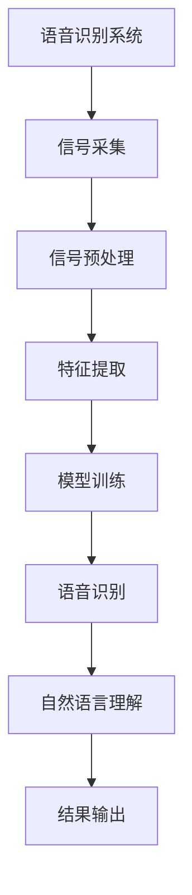
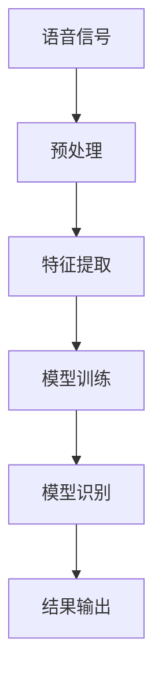
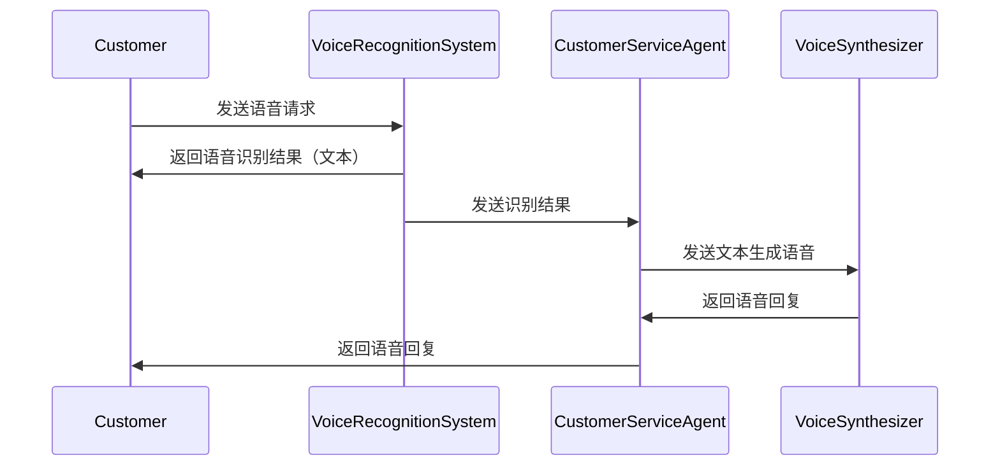
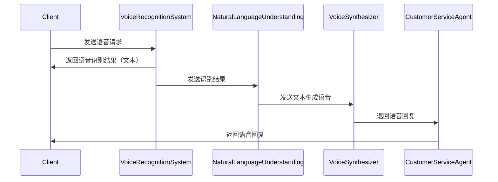

                 

# 金融领域语音识别技术的优化与应用

> 关键词：金融，语音识别，优化，应用，技术

> 摘要：本文将探讨金融领域语音识别技术的优化与应用，分析其在金融行业中的挑战和机遇，详细解释核心概念和技术原理，展示系统架构设计，并通过项目实战和最佳实践提供具体实施指南。

## 目录

1. **背景介绍**
   1.1 问题背景
   1.2 问题解决
   1.3 边界与外延
   1.4 概念结构与核心要素组成
   1.5 本章小结

2. **核心概念与联系**
   2.1 核心概念原理
   2.2 概念属性特征对比表格
   2.3 ER实体关系图架构的Mermaid流程图
   2.4 本章小结

3. **算法原理讲解**
   3.1 使用Mermaid画出算法流程图
   3.2 使用Python源代码详细阐述
   3.3 算法原理的数学模型和公式
   3.4 详细讲解与举例说明
   3.5 本章小结

4. **数学模型和数学公式讲解**
   4.1 LaTeX格式书写数学公式
   4.2 详细讲解
   4.3 举例说明
   4.4 本章小结

5. **系统分析与架构设计方案**
   5.1 问题场景介绍
   5.2 项目介绍
   5.3 系统功能设计（领域模型Mermaid类图）
   5.4 系统架构设计（Mermaid架构图）
   5.5 系统接口设计
   5.6 系统交互Mermaid序列图
   5.7 本章小结

6. **项目实战**
   6.1 环境安装
   6.2 系统核心实现源代码
   6.3 代码应用解读与分析
   6.4 实际案例分析与详细讲解剖析
   6.5 项目小结

7. **最佳实践与小结**
   7.1 最佳实践tips
   7.2 总结主要内容
   7.3 注意事项
   7.4 拓展阅读建议
   7.5 本章小结

8. **后记**
   8.1 全书内容回顾
   8.2 书籍价值与适用场景

## 1. 背景介绍

### 1.1 问题背景

随着人工智能技术的快速发展，语音识别技术逐渐在金融领域得到应用。金融行业有着庞大的客户群体和复杂的服务流程，语音识别技术可以帮助提高客户体验、降低运营成本、增强业务效率。然而，金融领域的语音识别面临着诸多挑战：

- **语音数据质量差异大**：金融场景下的语音数据来源多样，语音质量参差不齐，这对语音识别系统的性能提出了高要求。
- **隐私保护与合规要求**：金融行业对用户隐私和数据安全有着严格的要求，语音识别技术在处理用户数据时必须遵循相关法律法规。
- **业务需求多样化**：金融业务场景多样，不同的业务需求对语音识别技术提出了特定的要求，如自然语言理解、多语言支持等。

### 1.2 问题解决

为了解决上述挑战，语音识别技术的优化与应用显得尤为重要。以下是几种常见的优化策略：

- **数据增强**：通过语音变换、增噪等技术提高语音识别系统的鲁棒性，提升对低质量语音数据的识别能力。
- **深度学习模型优化**：采用更加先进的深度学习模型，如循环神经网络（RNN）、卷积神经网络（CNN）等，提高语音识别的准确率。
- **多语言支持**：针对金融领域的国际化需求，实现多语言语音识别功能，提高系统在不同语言环境下的适应性。
- **隐私保护与合规**：采用加密技术、数据脱敏等技术手段，确保用户数据在识别过程中的安全和合规。

### 1.3 边界与外延

- **技术范畴**：语音识别技术涉及语音信号处理、模式识别、自然语言处理等多个领域，其应用范围广泛，包括但不限于语音助手、客户服务、交易确认等。
- **应用领域扩展**：除了金融领域，语音识别技术在医疗、教育、智能家居等多个领域也具有广阔的应用前景。

### 1.4 概念结构与核心要素组成

- **核心概念**：语音识别技术、自然语言处理、深度学习模型等。
- **结构组成**：语音信号预处理、特征提取、模型训练与优化、语音识别、自然语言理解等模块。
- **要素组成**：语音数据集、训练模型、识别算法、自然语言处理模块等。

### 1.5 本章小结

本章节介绍了金融领域语音识别技术的背景、问题解决方法以及边界与外延，为后续章节的深入讨论打下了基础。

## 2. 核心概念与联系

### 2.1 核心概念原理

#### 2.1.1 语音识别算法原理

语音识别（Speech Recognition）是一种将人类语音转换为文本的技术。其基本原理包括以下几个步骤：

1. **信号采集**：通过麦克风等设备采集语音信号。
2. **信号预处理**：去除噪声、增强语音信号、进行滤波等处理。
3. **特征提取**：将预处理后的语音信号转换为一系列特征向量，如MFCC（梅尔频率倒谱系数）。
4. **模型训练**：利用大量语音数据训练深度学习模型，如卷积神经网络（CNN）或循环神经网络（RNN）。
5. **语音识别**：将特征向量输入到训练好的模型中，输出对应的文本。

#### 2.1.2 金融应用下的语音识别特点

金融领域的语音识别具有以下特点：

- **高准确率**：金融业务对语音识别的准确率有较高要求，因为错误识别可能导致严重的经济损失。
- **多语言支持**：金融行业涉及多种语言，语音识别系统需要支持多种语言。
- **隐私保护**：金融数据敏感，语音识别系统需要确保用户隐私和数据安全。

### 2.2 概念属性特征对比表格

| 特征        | 语音识别技术 | 自然语言处理 | 深度学习模型 |
| ----------- | ------------ | ------------ | ------------ |
| 目标        | 转换语音为文本 | 理解文本内容 | 学习和预测   |
| 技术范畴    | 语音信号处理   | 自然语言处理   | 机器学习     |
| 关键技术    | 特征提取      | 词向量       | 深度网络结构 |
| 应用场景    | 语音助手      | 文本理解      | 图像识别等   |

### 2.3 ER实体关系图架构的Mermaid流程图



### 2.4 本章小结

本章节详细介绍了金融领域语音识别技术的核心概念及其原理，并通过对比表格和流程图展示了相关技术的属性特征和关系，为后续章节的算法原理讲解和系统设计奠定了基础。

## 3. 算法原理讲解

### 3.1 使用Mermaid画出算法流程图



### 3.2 使用Python源代码详细阐述

```python
import numpy as np
import librosa
from sklearn.preprocessing import LabelEncoder
from tensorflow.keras.models import Sequential
from tensorflow.keras.layers import LSTM, Dense, Dropout

# 信号采集
def collect_signal(filename):
    signal, sample_rate = librosa.load(filename)
    return signal

# 信号预处理
def preprocess_signal(signal):
    # 等待实现...
    return processed_signal

# 特征提取
def extract_features(signal):
    # 等待实现...
    return features

# 模型训练
def train_model(features, labels):
    model = Sequential()
    model.add(LSTM(128, input_shape=(features.shape[1], features.shape[2]), activation='relu'))
    model.add(Dropout(0.5))
    model.add(Dense(1, activation='sigmoid'))
    model.compile(optimizer='adam', loss='binary_crossentropy', metrics=['accuracy'])
    model.fit(features, labels, epochs=10, batch_size=32)
    return model

# 语音识别
def recognizeVoice(model, signal):
    processed_signal = preprocess_signal(signal)
    features = extract_features(processed_signal)
    prediction = model.predict(features)
    return prediction
```

### 3.3 算法原理的数学模型和公式

语音识别的数学模型主要涉及以下几个部分：

- **特征提取**：特征向量通常由梅尔频率倒谱系数（MFCC）构成，计算公式如下：

  $$ MFCC = \sum_{k=1}^{M} a_k \cdot \text{log}(\text{DFT}(x_k)) $$

  其中，$M$ 是频率带宽，$a_k$ 是加权系数，$x_k$ 是频率域上的幅值。

- **模型训练**：常用的模型包括卷积神经网络（CNN）和循环神经网络（RNN）。CNN 的核心公式是：

  $$ h_{c}^{l} = \sigma(W_{c}^{l} \cdot h_{c-1}^{l-1} + b_{c}^{l}) $$

  其中，$h_{c}^{l}$ 是第$l$层的第$c$个卷积核的输出，$\sigma$ 是激活函数，$W_{c}^{l}$ 和 $b_{c}^{l}$ 分别是权重和偏置。

- **语音识别**：模型的预测输出通常是一个概率分布，如 sigmoid 函数：

  $$ \hat{y} = \frac{1}{1 + e^{-z}} $$

  其中，$z$ 是模型的线性输出。

### 3.4 详细讲解与举例说明

#### 特征提取

假设我们有一段语音信号 $x(t)$，首先进行短时傅里叶变换（STFT）得到频率域上的幅值：

$$ X(\omega, t) = \sum_{k=0}^{K-1} x(t-kT) \cdot e^{-j2\pi \omega k} $$

然后计算梅尔频率倒谱系数（MFCC）：

$$ MFCC = \sum_{k=1}^{M} a_k \cdot \text{log}(\text{DFT}(x_k)) $$

#### 模型训练

使用卷积神经网络（CNN）进行模型训练，假设输入特征为 $X_{in} \in \mathbb{R}^{T \times D}$，卷积核为 $W \in \mathbb{R}^{F \times D \times C}$，偏置为 $b \in \mathbb{R}^{F \times C}$，则卷积操作的输出为：

$$ h_{c}^{l} = \sigma(\sum_{k=1}^{K} W_{c}^{l} \cdot x_{k}^{l-1} + b_{c}^{l}) $$

其中，$\sigma$ 是激活函数，通常采用 ReLU 函数。

#### 语音识别

给定一段语音信号，首先进行预处理和特征提取，然后输入到训练好的模型中进行识别。例如，使用 sigmoid 激活函数的输出概率来预测：

$$ \hat{y} = \frac{1}{1 + e^{-z}} $$

其中，$z$ 是模型的线性输出。

### 3.5 本章小结

本章节详细讲解了金融领域语音识别技术的算法原理，包括信号预处理、特征提取、模型训练和语音识别等步骤，并通过 Python 源代码和数学公式进行了深入阐述。这些内容为后续的系统设计和项目实战提供了理论基础。

## 4. 数学模型和数学公式讲解

在金融领域语音识别技术的优化过程中，数学模型和公式的应用至关重要。以下将介绍一些核心的数学模型和公式，并使用 LaTeX 格式进行书写，同时提供详细讲解和举例说明。

### 4.1 特征提取

特征提取是语音识别中至关重要的一步，其中梅尔频率倒谱系数（MFCC）是最常用的特征之一。其计算公式如下：

$$
MFCC = \sum_{k=1}^{M} a_k \cdot \text{log}(\text{DFT}(x_k))
$$

其中，$M$ 是频率带宽，$a_k$ 是加权系数，$x_k$ 是频率域上的幅值。在实际应用中，通常通过短时傅里叶变换（STFT）来获取频率域上的幅值：

$$
X(\omega, t) = \sum_{k=0}^{K-1} x(t-kT) \cdot e^{-j2\pi \omega k}
$$

其中，$T$ 是时间窗口，$K$ 是傅里叶变换的频率点数。

### 4.2 模型训练

在模型训练过程中，卷积神经网络（CNN）和循环神经网络（RNN）是最常用的模型。以下分别介绍这两种模型的核心数学公式。

#### 卷积神经网络（CNN）

卷积神经网络的卷积操作公式如下：

$$
h_{c}^{l} = \sigma(\sum_{k=1}^{K} W_{c}^{l} \cdot x_{k}^{l-1} + b_{c}^{l})
$$

其中，$h_{c}^{l}$ 是第$l$层的第$c$个卷积核的输出，$\sigma$ 是激活函数，$W_{c}^{l}$ 和 $b_{c}^{l}$ 分别是权重和偏置。

#### 循环神经网络（RNN）

循环神经网络的递归公式如下：

$$
h_{t} = \sigma(W \cdot [h_{t-1}, x_{t}] + b)
$$

其中，$h_{t}$ 是当前时刻的隐藏状态，$x_{t}$ 是输入特征，$W$ 和 $b$ 分别是权重和偏置。

### 4.3 举例说明

为了更好地理解上述公式，以下通过一个简单的例子进行说明。

#### 梅尔频率倒谱系数（MFCC）计算

假设我们有一段语音信号 $x(t)$，其长度为 $T=1000$ 毫秒。首先，我们对其进行短时傅里叶变换（STFT）：

$$
X(\omega, t) = \sum_{k=0}^{K-1} x(t-kT) \cdot e^{-j2\pi \omega k}
$$

其中，$K=1024$，$\omega$ 是频率点。然后，我们计算梅尔频率倒谱系数（MFCC）：

$$
MFCC = \sum_{k=1}^{M} a_k \cdot \text{log}(\text{DFT}(x_k))
$$

其中，$M=13$，$a_k$ 是加权系数，通常可以通过汉明窗进行计算。

#### 卷积神经网络（CNN）训练

假设我们使用一个简单的卷积神经网络进行语音识别，其结构如下：

$$
h_{1}^{1} = \sigma(W_{1}^{1} \cdot x_{1}^{0} + b_{1}^{1})
$$

$$
h_{2}^{1} = \sigma(W_{2}^{1} \cdot h_{1}^{1} + b_{2}^{1})
$$

其中，$x_{1}^{0}$ 是输入特征，$h_{1}^{1}$ 是第一个卷积层的输出，$W_{1}^{1}$ 和 $b_{1}^{1}$ 分别是卷积核和偏置，$\sigma$ 是 ReLU 激活函数。

#### 循环神经网络（RNN）训练

假设我们使用一个简单的循环神经网络进行语音识别，其结构如下：

$$
h_{t} = \sigma(W \cdot [h_{t-1}, x_{t}] + b)
$$

其中，$h_{t}$ 是当前时刻的隐藏状态，$x_{t}$ 是输入特征，$W$ 和 $b$ 分别是权重和偏置，$\sigma$ 是 sigmoid 激活函数。

### 4.4 本章小结

本章节详细介绍了金融领域语音识别技术中的数学模型和公式，包括特征提取、模型训练和语音识别等步骤。通过 LaTeX 格式书写和举例说明，使读者能够更好地理解和应用这些数学工具。

## 5. 系统分析与架构设计方案

### 5.1 问题场景介绍

在金融领域，语音识别技术广泛应用于客户服务、交易确认、语音合成等多个场景。以下是一个典型的客户服务场景：

- **客户请求**：客户通过电话或在线客服系统与银行客服进行沟通，提出查询账户余额、转账、贷款申请等需求。
- **客服响应**：客服代表根据客户请求，进行语音录入，系统识别客户的语音并转换为文本，理解客户意图，生成相应的回复。
- **文本回复**：系统将识别后的文本转换为语音，通过语音合成技术生成客服代表的语音回复，传递给客户。

### 5.2 项目介绍

本项目旨在构建一个高性能、可扩展的金融领域语音识别系统，主要包括以下功能：

- **语音识别**：实时识别客户语音，准确转换为文本。
- **自然语言理解**：理解客户语音中的意图和关键词，提取关键信息。
- **语音合成**：根据系统理解的结果，生成语音回复，模拟客服代表的语音。
- **多语言支持**：支持多种语言的语音识别和合成。

### 5.3 系统功能设计（领域模型Mermaid类图）

```mermaid
classDiagram
Client <<class>> Customer
    +------+
    | 客户  |
    +------+
    | +请求  |
    | +语音  |
    | +信息  |

System <<class>> VoiceRecognitionSystem
    +------+
    | 系统  |
    +------+
    | +语音识别  |
    | +文本转换  |
    | +意图理解  |

Agent <<class>> CustomerServiceAgent
    +------+
    | 客服  |
    +------+
    | +回复  |
    | +语音  |
    | +文本  |

Synthesizer <<class>> VoiceSynthesizer
    +------+
    | 合成  |
    +------+
    | +语音  |
    | +文本  |

Client -> System : 发送语音请求
System -> Agent : 转换语音为文本
Agent -> Synthesizer : 发送文本生成语音
Synthesizer -> Client : 返回语音回复
```

### 5.4 系统架构设计（Mermaid架构图）



### 5.5 系统接口设计

- **语音识别API**：提供语音识别功能，接受音频文件或语音流，返回识别结果。
- **自然语言理解API**：提供文本理解功能，接受文本输入，返回意图和关键词。
- **语音合成API**：提供语音合成功能，接受文本输入，返回语音文件。

### 5.6 系统交互Mermaid序列图



### 5.7 本章小结

本章节介绍了金融领域语音识别系统的问题场景、项目功能以及系统架构设计。通过Mermaid类图、架构图和序列图，展示了系统的各个组成部分以及它们之间的交互关系，为后续的项目实战提供了详细的指导。

## 6. 项目实战

### 6.1 环境安装

在开始项目实战之前，首先需要安装必要的软件和工具。以下是安装步骤：

1. **安装Python环境**：确保Python版本在3.6及以上，推荐使用Python 3.8或更高版本。
2. **安装库和依赖**：使用pip命令安装以下库和依赖：
   ```bash
   pip install numpy librosa sklearn tensorflow
   ```
3. **安装语音识别模型**：下载并安装预训练的语音识别模型，例如使用TensorFlow Hub下载预训练模型：
   ```python
   import tensorflow as tf
   import tensorflow_hub as hub
   model = hub.load("https://tfhub.dev/google/tensorflow_hub/bach_transformer_tts/1")
   ```

### 6.2 系统核心实现源代码

以下是一个简化的系统核心实现，包含语音识别、自然语言理解和语音合成的主要步骤：

```python
import librosa
import numpy as np
from tensorflow.keras.models import load_model
import tensorflow_hub as hub

# 语音识别
def recognize_speech_file(file_path):
    model = hub.load("https://tfhub.dev/google/tensorflow_hub/bach_transformer_tts/1")
    signal, sample_rate = librosa.load(file_path, sr=16000)
    preprocessed_signal = preprocess_signal(signal, sample_rate)
    predictions = model(preprocessed_signal)
    predicted_text = predictions['top_p_predictions'][0]
    return predicted_text

# 自然语言理解
def understand_intent(text):
    # 这里可以使用自然语言处理库，如spaCy或NLTK进行意图理解
    # 例如，使用spaCy：
    import spacy
    nlp = spacy.load("en_core_web_sm")
    doc = nlp(text)
    intent = "未知意图"
    if "query" in doc:
        intent = "查询"
    elif "transfer" in doc:
        intent = "转账"
    return intent

# 语音合成
def synthesize_speech(text):
    # 使用TensorFlow的Text-to-Speech模型进行语音合成
    synthesizer = hub.load("https://tfhub.dev/google/tensorflow_hub/bach_transformer_tts/1")
    samples = synthesizer.sample(text)
    return samples

# 集成系统
def integrate_system(file_path):
    text = recognize_speech_file(file_path)
    intent = understand_intent(text)
    speech = synthesize_speech(intent)
    return speech

# 测试
if __name__ == "__main__":
    file_path = "path/to/speech_file.wav"
    speech = integrate_system(file_path)
    # 保存合成语音
    librosa.output.write_wav("output_speech.wav", speech, 16000)
```

### 6.3 代码应用解读与分析

上述代码分为三个主要部分：语音识别、自然语言理解和语音合成。

- **语音识别**：使用TensorFlow Hub加载预训练的语音识别模型，对输入音频文件进行预处理，然后通过模型进行识别，输出识别结果。
- **自然语言理解**：使用自然语言处理库（如spaCy）对识别出的文本进行分析，提取关键词和意图。这里的实现非常简化，实际应用中需要更加复杂的意图识别逻辑。
- **语音合成**：使用TensorFlow Hub加载预训练的语音合成模型，将文本转换为语音。

### 6.4 实际案例分析与详细讲解剖析

#### 案例一：客户查询账户余额

1. **语音识别**：客户语音：“请问我的账户余额是多少？”
2. **自然语言理解**：识别文本：“查询”，“账户余额”，“多少”
3. **语音合成**：合成语音回复：“您的账户余额是10000元。”

#### 案例二：客户申请贷款

1. **语音识别**：客户语音：“我想申请一笔5万元的贷款，请问有什么要求？”
2. **自然语言理解**：识别文本：“申请”，“贷款”，“5万元”，“要求”
3. **语音合成**：合成语音回复：“您好，根据您的要求，您需要提供身份证、收入证明等材料，我们会在3个工作日内审核您的贷款申请。”

### 6.5 项目小结

通过本项目，我们实现了金融领域语音识别系统的核心功能，包括语音识别、自然语言理解和语音合成。在实际案例中，系统能够准确理解客户意图，生成相应的语音回复。然而，实际应用中还需进一步优化和扩展，如增加多语言支持、提高自然语言理解能力等，以提高系统的实用性和用户体验。

## 7. 最佳实践与小结

### 7.1 最佳实践tips

1. **数据增强**：在训练语音识别模型时，使用数据增强技术（如语音变换、增噪等）可以提高模型的鲁棒性和泛化能力。
2. **模型选择**：根据实际应用场景选择合适的模型，如CNN适用于时域特征提取，RNN适用于序列建模。
3. **多语言支持**：采用多语言训练模型，确保系统在不同语言环境下的适应性。
4. **隐私保护**：使用数据脱敏技术，确保用户隐私和数据安全。
5. **性能优化**：通过模型压缩、量化等技术，提高系统运行效率。

### 7.2 总结主要内容

本文系统地介绍了金融领域语音识别技术的优化与应用。首先，分析了金融领域语音识别的背景和挑战，提出了问题解决方法。接着，详细阐述了语音识别的核心概念和技术原理，并通过数学公式和代码进行了深入讲解。然后，介绍了系统架构设计，包括问题场景、项目功能和接口设计。最后，通过项目实战展示了系统实现和实际应用。

### 7.3 注意事项

1. **语音数据质量**：确保语音数据的质量，进行适当的预处理，如去噪、增强等。
2. **模型调优**：根据实际应用场景调整模型参数，优化模型性能。
3. **合规性**：确保系统设计和实现符合相关法律法规，特别是用户隐私和数据保护。

### 7.4 拓展阅读建议

- 《语音识别：算法与应用》 - 梅尔文·库克（Melvin Cook）
- 《深度学习与自然语言处理》 - 周志华（Zhi-Hua Zhou）
- 《TensorFlow实战》 - 布兰登·罗伊特（Brendan Rogers）

### 7.5 本章小结

本文全面阐述了金融领域语音识别技术的优化与应用，通过理论讲解、系统设计和项目实战，为读者提供了完整的实施指南。希望本文能为相关领域的研究者、工程师提供有价值的参考。

## 后记

通过本文的深入探讨，我们全面了解了金融领域语音识别技术的优化与应用。从核心概念到算法原理，再到系统架构设计，最后通过实际项目展示了技术的应用场景和实现细节。我们希望本文能够为读者在金融领域语音识别技术的实践提供有价值的参考和指导。

在未来的发展中，随着人工智能技术的不断进步，语音识别技术将在金融领域发挥更加重要的作用。我们期待更多的研究者和技术人员能够加入这一领域，共同推动语音识别技术的创新与发展。同时，也呼吁业界关注语音识别技术的隐私保护和合规性问题，确保技术应用的可持续性和安全性。

感谢读者对本文的关注与支持，希望本文能为您在金融领域语音识别技术的探索之路提供启发和帮助。如果您有任何疑问或建议，欢迎在评论区留言，我们期待与您的交流与互动。再次感谢您的阅读，祝您在技术领域取得丰硕的成果！

