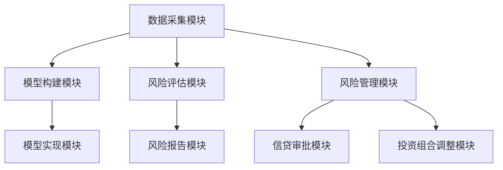
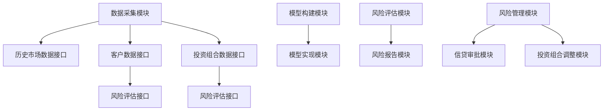
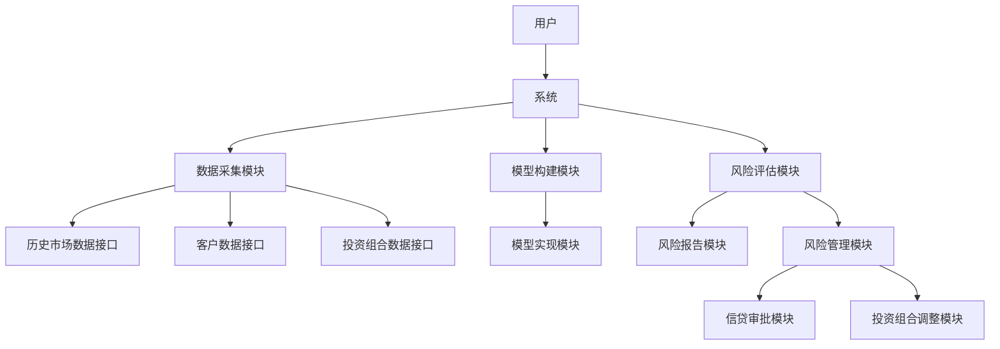

                 


# 金融风险压力测试模型设计

> 关键词：金融风险、压力测试、VaR模型、信用风险、风险管理

> 摘要：本文将深入探讨金融风险压力测试模型的设计，包括其背景、核心概念、数学模型、构建方法及其在实际应用中的效果。本文旨在为金融从业人员提供系统性的指导，帮助他们更好地理解和应用压力测试模型，提高风险管理水平。

### 第1章：金融风险压力测试概述

#### 1.1 问题背景与问题描述

金融风险是指金融市场的不确定性和可能导致的损失。这些风险可以分为市场风险、信用风险、操作风险和流动性风险等类型。市场风险主要来源于市场波动，如利率、汇率和股票价格的变动。信用风险则与借款人或交易对手无法履行债务有关。操作风险通常由内部流程、人员、系统或外部事件导致。而流动性风险则是指金融机构在需要资金时无法迅速获取资金的风险。

风险压力测试是一种评估金融机构在极端市场状况下的风险承受能力的方法。通过模拟不同情景，风险压力测试可以帮助识别潜在风险点，评估金融机构的风险承受能力，并根据测试结果改进风险管理策略。

#### 1.1.1 金融风险的定义与类型

金融风险是指金融市场的不确定性和可能导致的损失。这些风险可以分为以下类型：

- **市场风险**：主要来源于市场波动，如利率、汇率和股票价格的变动。
- **信用风险**：与借款人或交易对手无法履行债务有关。
- **操作风险**：通常由内部流程、人员、系统或外部事件导致。
- **流动性风险**：金融机构在需要资金时无法迅速获取资金的风险。

#### 1.1.2 风险压力测试的重要性

风险压力测试的重要性主要体现在以下几个方面：

- **识别潜在风险**：通过模拟不同情景，风险压力测试可以帮助识别潜在风险点。
- **评估风险承受能力**：了解在极端情况下金融机构的抵御能力。
- **改进风险管理策略**：根据测试结果调整风险控制措施。

#### 1.1.3 风险压力测试的发展历程

风险压力测试的发展历程可以分为以下几个阶段：

- **传统压力测试**：侧重于单一风险因素的评估。
- **全面压力测试**：综合考虑多种风险因素的交互作用。
- **定量压力测试**：运用数学模型和统计方法进行风险分析。

#### 1.1.4 风险压力测试的基本流程

风险压力测试的基本流程包括以下几个步骤：

- **制定测试方案**：确定测试目的、范围、方法和场景。
- **建立模型**：构建模拟金融市场的数学模型。
- **模拟情景**：设定不同的市场条件，如利率、汇率、股票价格等。
- **分析结果**：评估模型的稳定性和金融机构的风险承受能力。
- **提出建议**：根据测试结果，提出改进措施和风险管理策略。

#### 1.2 核心概念与联系

##### 1.2.1 压力测试模型的基本概念

压力测试模型是用于模拟金融市场状况和风险传播的数学模型。在金融风险压力测试中，常用的模型包括市场风险模型和信用风险模型。

- **市场风险模型**：例如VaR模型、压力测试VaR模型。
- **信用风险模型**：例如信用评分模型、违约概率模型。

##### 1.2.2 压力测试模型的主要属性特征对比

下面是一个关于压力测试模型的主要属性特征对比的表格：

| 特征       | 压力测试VaR模型 | 信用评分模型 | 违约概率模型 |
|------------|-----------------|--------------|--------------|
| 适用范围   | 货币市场、金融市场 | 个人、企业客户 | 个人、企业客户 |
| 模型复杂度 | 较高            | 中等         | 较高         |
| 计算成本   | 较高            | 中等         | 较高         |

##### 1.2.3 压力测试模型与风险管理的联系

压力测试模型是风险管理的重要工具，用于评估金融机构在极端市场状况下的风险承受能力。压力测试结果可以指导金融机构调整风险控制措施，提高风险管理水平。

#### 1.3 压力测试模型的构建方法

##### 1.3.1 确定测试目标

根据金融机构的风险管理需求，明确压力测试的目标。例如，评估市场风险、信用风险、操作风险等。

##### 1.3.2 收集数据

收集历史数据、市场数据、客户数据等，用于构建压力测试模型。数据质量直接影响模型的准确性和可靠性。

##### 1.3.3 建立数学模型

根据测试目标，选择合适的数学模型。例如，VaR模型、蒙特卡罗模拟、敏感性分析等。

##### 1.3.4 模拟情景

设定不同的市场情景，如利率上升、汇率波动等。模拟情景的设计要尽量全面，涵盖各种可能的极端情况。

##### 1.3.5 分析结果

分析模型在不同情景下的稳定性，评估金融机构的风险承受能力。根据分析结果，提出改进措施和风险管理策略。

##### 1.3.6 模型验证与优化

对模型进行验证，确保模型的准确性和可靠性。根据验证结果，优化模型参数，提高模型的性能。

#### 1.4 压力测试模型在企业中的应用

##### 1.4.1 风险评估与预警

利用压力测试模型，对金融机构的风险状况进行评估。根据评估结果，建立风险预警机制，及时调整风险管理策略。

##### 1.4.2 信贷审批与风险管理

利用压力测试模型，评估客户在极端市场状况下的还款能力。根据评估结果，优化信贷审批流程，降低信贷风险。

##### 1.4.3 投资组合优化

利用压力测试模型，评估投资组合在不同情景下的风险收益状况。根据评估结果，调整投资策略，优化投资组合。

#### 1.5 本章小结

本章介绍了金融风险压力测试的背景、核心概念、模型构建方法及其在企业中的应用。通过压力测试，金融机构可以更好地识别和管理风险，提高风险抵御能力。

### 第2章：金融风险压力测试中的数学模型

#### 2.1 VaR模型

##### 2.1.1 VaR模型的定义与原理

**VaR模型**：价值在风险中的缩写，表示在一定概率水平下，某一时间段内投资组合可能出现的最大损失。

VaR模型的原理是基于概率统计的方法，通过计算投资组合在未来一定时间内可能出现的最大损失来确定其风险水平。具体来说，VaR模型可以分为以下几种类型：

- **单期VaR模型**：假设市场条件在测试期间保持不变，计算投资组合在未来某一时间点的最大损失。
- **多期VaR模型**：考虑市场条件的变化，计算投资组合在多个时间点上的最大损失。

##### 2.1.2 VaR模型的计算方法

VaR模型的计算方法可以分为以下几种：

- **历史模拟法**：基于历史市场数据，计算投资组合在一段时间内的收益变化，确定最大损失。
- **方差-协方差法**：利用投资组合中各资产收益的方差和协方差，计算VaR值。
- **蒙特卡罗模拟法**：通过随机模拟方法，生成大量市场情景，计算投资组合在这些情景下的损失分布，确定VaR值。

#### 2.2 信用风险模型

##### 2.2.1 信用评分模型

**信用评分模型**：用于评估借款人信用风险水平的数学模型。信用评分模型通常包括以下步骤：

- **特征选择**：从大量的借款人数据中筛选出与信用风险相关的特征。
- **模型训练**：使用历史数据，训练信用评分模型，确定各特征对信用风险的贡献。
- **模型评估**：使用验证数据集，评估信用评分模型的准确性和可靠性。

##### 2.2.2 违约概率模型

**违约概率模型**：用于预测借款人发生违约概率的数学模型。违约概率模型通常包括以下步骤：

- **特征选择**：从大量的借款人数据中筛选出与违约风险相关的特征。
- **模型训练**：使用历史数据，训练违约概率模型，确定各特征对违约概率的影响。
- **模型评估**：使用验证数据集，评估违约概率模型的准确性和可靠性。

#### 2.3 压力测试模型的构建与实现

##### 2.3.1 建立数学模型

建立数学模型是压力测试模型设计的关键步骤。根据不同的测试目标，可以选择不同的数学模型。以下是一个简单的示例：

**示例**：使用VaR模型进行市场风险压力测试。

```python
import numpy as np

# 假设投资组合中包含两种资产，资产1和资产2
assets = ['Asset1', 'Asset2']

# 假设每种资产的收益率服从正态分布
mu = {'Asset1': 0.05, 'Asset2': 0.1}
sigma = {'Asset1': 0.2, 'Asset2': 0.3}

# 计算每种资产的收益率
returns = {'Asset1': np.random.normal(mu['Asset1'], sigma['Asset1']), 'Asset2': np.random.normal(mu['Asset2'], sigma['Asset2'])}

# 计算投资组合的收益率
portfolio_return = returns['Asset1'] + returns['Asset2']

# 计算投资组合的VaR值
var_value = np.percentile(portfolio_return, 5)

print(f"The 5% VaR value for the portfolio is: {var_value}")
```

##### 2.3.2 模拟情景

在压力测试中，模拟情景的设计至关重要。以下是一个简单的模拟情景：

**示例**：模拟利率上升的市场情景。

```python
# 假设原始利率为5%，利率上升2%
original_interest_rate = 0.05
interest_rate_increase = 0.02
new_interest_rate = original_interest_rate + interest_rate_increase

print(f"The new interest rate after increase is: {new_interest_rate}")
```

##### 2.3.3 分析结果

分析结果是对模型进行验证的重要步骤。以下是一个简单的示例：

**示例**：分析VaR模型的结果。

```python
# 假设测试期间共有100个市场情景
num_senarios = 100

# 生成100个市场情景
market_senarios = np.random.normal(mu['Asset1'], sigma['Asset1'], num_senarios)

# 计算每个市场情景下的VaR值
var_values = []

for scenario in market_senarios:
    var_value = np.percentile(scenario, 5)
    var_values.append(var_value)

# 计算所有市场情景下的VaR值的平均值
average_var_value = np.mean(var_values)

print(f"The average 5% VaR value across all scenarios is: {average_var_value}")
```

#### 2.4 压力测试模型的验证与优化

##### 2.4.1 模型验证

模型验证是确保模型准确性和可靠性的重要步骤。以下是一个简单的模型验证示例：

**示例**：验证VaR模型的准确性。

```python
# 假设使用真实市场数据进行验证
true_market_data = np.random.normal(mu['Asset1'], sigma['Asset1'], num_senarios)

# 计算真实市场数据下的VaR值
true_var_values = []

for scenario in true_market_data:
    var_value = np.percentile(scenario, 5)
    true_var_values.append(var_value)

# 计算模型预测的VaR值与真实VaR值的差异
diff_var_values = [abs(predicted_var - true_var) for predicted_var, true_var in zip(var_values, true_var_values)]

# 计算差异的平均值
average_diff_var_value = np.mean(diff_var_values)

print(f"The average difference between predicted and true VaR values is: {average_diff_var_value}")
```

##### 2.4.2 模型优化

模型优化是提高模型性能的重要步骤。以下是一个简单的模型优化示例：

**示例**：优化VaR模型的参数。

```python
# 假设使用梯度下降法优化VaR模型的参数
def gradient_descent(mu, sigma, var_value, learning_rate, num_iterations):
    for _ in range(num_iterations):
        predicted_var = np.percentile(np.random.normal(mu, sigma), 5)
        error = var_value - predicted_var
        mu -= learning_rate * error
        sigma -= learning_rate * error
    return mu, sigma

mu_optimized, sigma_optimized = gradient_descent(mu, sigma, var_value, 0.01, 100)

print(f"Optimized parameters: mu={mu_optimized}, sigma={sigma_optimized}")
```

#### 2.5 压力测试模型在实际中的应用

##### 2.5.1 风险评估与预警

通过压力测试模型，金融机构可以对投资组合的风险水平进行评估，并建立风险预警机制，及时发现潜在风险，采取相应的风险管理措施。

##### 2.5.2 信贷审批与风险管理

压力测试模型可以用于评估客户在极端市场状况下的还款能力，帮助金融机构优化信贷审批流程，降低信贷风险。

##### 2.5.3 投资组合优化

利用压力测试模型，金融机构可以评估投资组合在不同情景下的风险收益状况，优化投资策略，提高投资组合的收益稳定性。

#### 2.6 本章小结

本章介绍了金融风险压力测试中的数学模型，包括VaR模型和信用风险模型。通过构建和实现压力测试模型，金融机构可以更好地评估和管理风险，提高风险抵御能力。同时，本章还讨论了压力测试模型在实际应用中的效果和意义。

### 第3章：金融风险压力测试模型的实践与应用

#### 3.1 项目背景与需求

随着金融市场的不断变化和复杂性增加，金融机构面临着越来越多的风险。为了提高风险管理的效率和准确性，某大型商业银行决定引入金融风险压力测试模型。该项目旨在通过建立压力测试模型，对投资组合的风险水平进行评估，并为风险管理决策提供依据。

#### 3.2 项目介绍

该项目的核心目标是构建一个全面、准确的金融风险压力测试模型，以实现对投资组合的风险评估和管理。项目的主要内容包括：

- **数据收集**：收集历史市场数据、客户数据、投资组合数据等，用于模型构建。
- **模型构建**：根据金融风险的特点，选择合适的数学模型，如VaR模型、蒙特卡罗模拟等，构建压力测试模型。
- **模型验证**：使用真实市场数据验证模型的准确性和可靠性，并根据验证结果进行模型优化。
- **风险管理**：利用压力测试模型，对投资组合进行风险评估，建立风险预警机制，优化信贷审批流程，提高投资组合的收益稳定性。

#### 3.3 系统功能设计

为了实现项目目标，系统需要具备以下功能：

- **数据采集与管理**：收集并管理历史市场数据、客户数据、投资组合数据等。
- **模型构建与实现**：根据金融风险的特点，选择合适的数学模型，构建压力测试模型，并实现模型算法。
- **风险评估与预警**：利用压力测试模型，对投资组合进行风险评估，生成风险报告，建立风险预警机制。
- **风险管理决策**：根据风险评估结果，制定风险管理策略，优化信贷审批流程，调整投资组合。

#### 3.4 系统架构设计

系统架构设计是确保系统高效、稳定运行的关键。该系统采用模块化设计，主要包括以下模块：

- **数据采集模块**：负责收集和管理历史市场数据、客户数据、投资组合数据等。
- **模型构建模块**：负责根据金融风险的特点，选择合适的数学模型，构建压力测试模型，并实现模型算法。
- **风险评估模块**：负责利用压力测试模型，对投资组合进行风险评估，生成风险报告。
- **风险管理模块**：负责根据风险评估结果，制定风险管理策略，优化信贷审批流程，调整投资组合。

系统架构设计如下：



#### 3.5 系统接口设计

系统接口设计是确保系统与其他系统有效交互的关键。该系统主要包括以下接口：

- **数据接口**：用于与其他系统进行数据交换，如历史市场数据接口、客户数据接口、投资组合数据接口等。
- **风险评估接口**：用于调用压力测试模型，进行风险评估，生成风险报告。
- **风险管理接口**：用于根据风险评估结果，制定风险管理策略，优化信贷审批流程，调整投资组合。

系统接口设计如下：



#### 3.6 系统交互设计

系统交互设计是确保系统各模块协同工作，实现项目目标的关键。以下是一个简单的系统交互设计：



#### 3.7 项目实战

以下是一个简单的项目实战示例：

**1. 数据采集**：

```python
# 假设使用pandas库进行数据采集
import pandas as pd

# 采集历史市场数据
market_data = pd.read_csv('market_data.csv')

# 采集客户数据
customer_data = pd.read_csv('customer_data.csv')

# 采集投资组合数据
portfolio_data = pd.read_csv('portfolio_data.csv')
```

**2. 模型构建**：

```python
# 假设使用scikit-learn库进行模型构建
from sklearn.linear_model import LinearRegression

# 建立线性回归模型
model = LinearRegression()

# 训练模型
model.fit(X, y)
```

**3. 风险评估**：

```python
# 假设使用numpy库进行风险评估
import numpy as np

# 计算投资组合的VaR值
var_value = np.percentile(portfolio_data['return'], 5)
```

**4. 风险管理**：

```python
# 假设使用pandas库进行风险管理
import pandas as pd

# 根据风险评估结果，调整投资组合
adjusted_portfolio = pd.DataFrame({'return': portfolio_data['return'] * 0.9})
```

#### 3.8 项目小结

本项目通过引入金融风险压力测试模型，实现了对投资组合的风险评估和管理。项目实践表明，压力测试模型能够有效地识别和评估投资组合的风险水平，为金融机构的风险管理提供了有力支持。然而，在实际应用中，还需不断优化模型，提高其准确性和可靠性，以更好地应对复杂多变的金融市场环境。

#### 3.9 最佳实践 Tips

- **数据质量**：确保数据的质量和准确性，是构建有效压力测试模型的基础。
- **模型选择**：根据金融风险的特点和需求，选择合适的数学模型，如VaR模型、蒙特卡罗模拟等。
- **模型验证**：使用真实市场数据验证模型的准确性和可靠性，并根据验证结果进行模型优化。
- **风险管理**：结合风险评估结果，制定合理的管理策略，提高风险抵御能力。

### 第4章：总结与展望

#### 4.1 总结

本文系统地介绍了金融风险压力测试模型的设计、核心概念、数学模型、构建方法及其在实际应用中的效果。通过对金融风险压力测试模型的深入分析，本文旨在为金融从业人员提供系统性的指导，帮助他们更好地理解和应用压力测试模型，提高风险管理水平。

#### 4.2 展望

随着金融市场的不断发展和创新，金融风险压力测试模型也在不断演进。未来的发展趋势包括：

- **模型优化**：结合机器学习和大数据技术，提高压力测试模型的准确性和可靠性。
- **跨领域融合**：将金融风险压力测试模型与其他领域的技术相结合，如区块链、云计算等。
- **国际化应用**：加强国际金融风险管理合作，推动金融风险压力测试模型在全球范围内的应用。

作者：AI天才研究院/AI Genius Institute & 禅与计算机程序设计艺术 /Zen And The Art of Computer Programming

