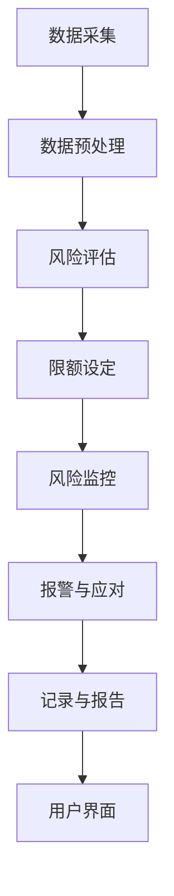
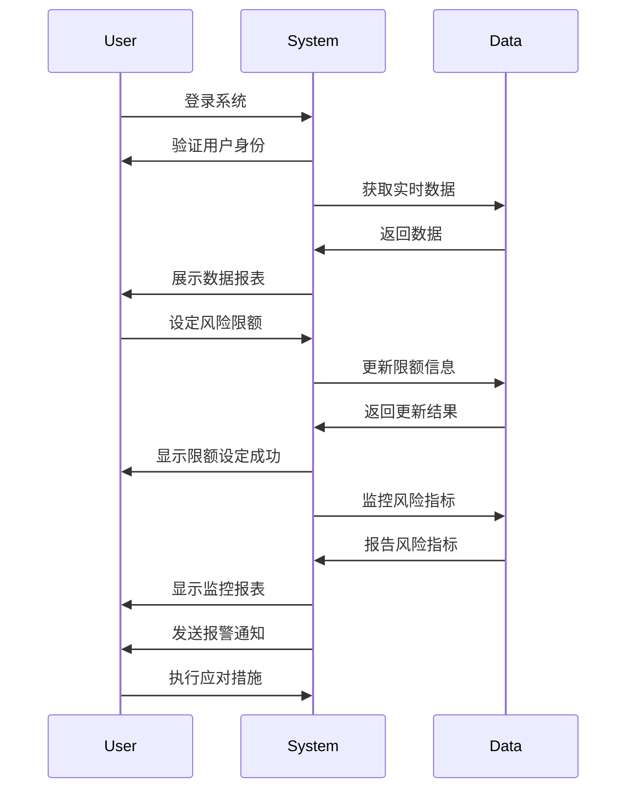

                 

### 引言

#### 背景介绍

金融行业在现代社会中扮演着至关重要的角色，它不仅为经济活动提供资金支持，还在促进资金流动、分散风险、提高资源配置效率等方面发挥着关键作用。然而，金融行业同时也面临着各种风险，这些风险可能源自市场波动、信用问题、操作失误或外部环境变化等多种因素。

当前，金融市场的复杂性和不确定性日益增加，各种新兴金融产品和交易模式的涌现使得风险管理的难度大大提升。特别是近年来，金融科技公司（FinTech）的崛起，以及大数据、人工智能等新技术的广泛应用，使得金融风险的表现形式更加多样化、隐蔽性更强。因此，如何有效地进行风险管理和控制，成为了金融行业亟待解决的重要问题之一。

风险限额管理作为风险管理的重要手段，旨在通过对各类风险设置限额，确保金融机构在风险承受能力范围内进行业务运作，从而降低潜在损失。风险限额管理不仅有助于识别和防范潜在风险，还能为金融机构提供决策支持，优化业务运营。

本文旨在探讨金融风险限额管理系统的设计，分析其核心概念、原理和实现方法，并详细阐述系统架构、算法原理以及实际应用案例。希望通过本文的探讨，为金融行业的风险管理人员和技术开发人员提供有价值的参考和指导。

#### 问题与目标

当前金融风险限额管理系统在实践过程中面临着诸多挑战。首先，风险限额设定的科学性和合理性难以保证。许多金融机构在设定风险限额时，往往依赖于经验和主观判断，缺乏系统性的风险评估和限额调整机制。这可能导致限额设定过高，导致资金浪费；或限额设定过低，增加金融机构的业务风险。

其次，风险监控的效率和准确性有待提升。在金融行业中，风险事件的发生往往是突然且不可预测的。现有的风险监控系统大多依赖于事后分析，无法及时捕捉到风险信号，导致预警滞后，无法有效防范风险。

此外，风险限额管理系统的灵活性和适应性不足。随着金融市场的变化，金融机构需要及时调整风险限额，以适应新的市场环境。然而，现有系统的调整机制往往较为僵化，难以快速响应市场变化。

本文的目标是设计一套科学、高效、灵活的金融风险限额管理系统，具体目标如下：

1. **科学的风险限额设定**：通过引入风险评估算法，实现限额设定的数据化和模型化，提高限额设定的科学性和合理性。
2. **实时的风险监控**：建立实时的风险监控系统，通过数据分析和技术手段，及时捕捉风险信号，提高风险预警的准确性和及时性。
3. **灵活的限额调整机制**：设计灵活的限额调整机制，根据市场变化和业务需求，快速调整风险限额，确保金融机构在风险承受范围内运作。
4. **全面的系统功能**：系统不仅要具备风险限额设定和监控功能，还要包括报警与应对措施、数据报表生成等功能，提供全面的风险管理解决方案。

通过实现上述目标，本文旨在为金融机构提供一套先进、实用的风险限额管理系统，助力其提升风险管理能力，降低业务风险，实现可持续发展。

### 边界与外延

在本文的设计过程中，我们需要明确金融风险限额管理系统的边界与外延，以便确保系统设计能够在实际应用中发挥预期效果。

首先，系统设计的范围包括风险限额管理的核心功能，如限额设定、风险监控、报警与应对措施等。这些功能是金融风险限额管理的核心组成部分，直接关系到系统整体性能和用户体验。此外，系统设计还将考虑与外部系统的接口设计，如与金融数据分析系统、客户关系管理系统（CRM）等的集成，以实现数据共享和协同工作。

系统应用的外部环境包括金融机构的业务场景和市场需求。具体来说，系统需要适应不同的业务模式，如银行、证券、保险等，同时要能够处理各类金融产品的风险限额管理需求。此外，系统需要具备较强的扩展性和适应性，能够根据市场变化和客户需求进行快速调整和优化。

在技术层面，系统设计需要考虑以下关键要素：

1. **数据存储与管理**：系统需要能够高效地存储和管理大量的风险数据，包括交易数据、市场数据、客户数据等。此外，系统还需要具备强大的数据处理能力，能够实时分析海量数据，提取关键信息。

2. **风险评估算法**：系统需要引入先进的风险评估算法，如统计模型、机器学习算法等，实现风险限额的智能设定和调整。这些算法需要具备较高的准确性和可靠性，以确保限额设定的科学性和合理性。

3. **实时监控与预警**：系统需要建立实时的风险监控机制，通过技术手段及时捕捉风险信号，并触发相应的报警和应对措施。这要求系统具备高并发处理能力和低延迟的数据处理能力。

4. **用户界面与交互设计**：系统需要提供直观、易用的用户界面，支持用户对风险限额进行设定、查询、调整等操作。同时，系统需要提供详细的数据报表和可视化工具，帮助用户更好地理解和管理风险。

5. **安全性**：系统需要具备完善的安全机制，确保数据的安全性和隐私性。这包括数据加密、权限控制、审计日志等功能，以防止数据泄露和未授权访问。

通过明确系统的边界与外延，并充分考虑技术和管理层面的关键要素，我们能够确保金融风险限额管理系统的设计既科学合理，又具备较强的实用性和可扩展性。

### 概念结构与核心要素

在探讨金融风险限额管理系统之前，有必要首先明确其中涉及的一系列核心概念和结构。这些概念和结构不仅构成了系统的理论框架，也是实现有效风险管理的基石。

#### 金融风险概念解析

金融风险是指金融机构在经营过程中可能遭受的各种潜在损失。金融风险可以按其来源和性质进行分类，主要包括以下几类：

1. **市场风险**：由于市场价格波动（如利率、汇率、股票价格等）导致的损失风险。市场风险通常难以预测，具有高度不确定性。

2. **信用风险**：由于债务人无法履行债务或信用等级下降导致的损失风险。信用风险通常与债务人的财务状况、信用记录等因素相关。

3. **操作风险**：由于内部操作失误、系统故障、员工失误等原因导致的损失风险。操作风险通常可以通过加强内部控制和管理来降低。

4. **流动性风险**：由于无法在合理时间内以合理的价格卖出资产以满足资金需求，从而导致损失的风险。流动性风险在金融市场波动较大时尤为突出。

#### 风险限额管理

风险限额管理是指通过对金融机构的风险暴露设置限额，以控制风险敞口在可接受的范围内。风险限额管理包括以下关键要素：

1. **限额设定**：根据金融机构的风险偏好、业务规模和市场环境等因素，设定各类风险限额。限额可以按资产类别、交易对手、区域等进行划分。

2. **监控与报告**：对设定的风险限额进行实时监控，确保风险敞口不超过限额。同时，定期生成风险限额报告，为管理层提供决策依据。

3. **调整与优化**：根据市场变化和业务发展情况，及时调整风险限额，优化限额结构，确保风险限额管理始终有效。

#### 金融风险限额管理的基本要素

金融风险限额管理系统的设计与实现，依赖于以下基本要素：

1. **数据采集与处理**：系统需要能够高效采集和处理各类风险数据，包括交易数据、市场数据、客户数据等。这些数据是风险评估和限额设定的基础。

2. **风险评估算法**：系统需要引入先进的风险评估算法，如统计模型、机器学习算法等，对风险进行定量评估，为限额设定提供科学依据。

3. **限额设定与调整**：系统需要具备自动化限额设定和调整功能，根据评估结果和市场变化，动态调整风险限额。

4. **实时监控与报警**：系统需要建立实时监控机制，通过技术手段及时捕捉风险信号，并触发相应的报警和应对措施。

5. **用户界面与交互设计**：系统需要提供直观、易用的用户界面，支持用户对风险限额进行设定、查询、调整等操作。

6. **安全性与合规性**：系统需要具备完善的安全机制，确保数据的安全性和合规性，同时符合相关法律法规和行业标准。

#### 核心概念比较与分析

在金融风险限额管理中，常见的限额管理方法包括静态限额和动态限额。以下是这两种方法的比较：

1. **静态限额**：静态限额是指在一段时间内固定的风险限额。这种方法操作简单，易于管理，但无法灵活应对市场变化。

2. **动态限额**：动态限额是指根据市场变化和业务需求，实时调整的风险限额。这种方法更加灵活，能够及时反映市场风险，但管理难度较大。

综合来看，金融风险限额管理系统需要结合静态限额和动态限额的优势，设计出一种既能应对市场变化，又具备高效管理能力的限额管理方案。通过科学的风险评估和限额设定，以及实时的监控与调整，系统能够为金融机构提供有力的风险管理支持。

### 核心概念与联系

#### 金融风险概念解析

金融风险是指金融机构在金融活动中可能面临的各种不确定性和潜在损失。这些风险不仅可能对金融机构的财务状况产生负面影响，还可能影响其整体运营和市场声誉。金融风险主要分为以下几类：

1. **市场风险**：市场风险是指由于市场价格波动（如利率、汇率、股票价格等）导致的金融资产价值变化的风险。这类风险难以预测且变化迅速，对金融机构的影响往往具有不可控性。

2. **信用风险**：信用风险是指由于债务人未能履行债务或信用状况恶化，导致金融机构遭受损失的风险。信用风险通常涉及贷款、债券投资、信用衍生品等业务。

3. **操作风险**：操作风险是指由于内部管理失误、系统故障、人为错误等因素导致的损失风险。操作风险包括法律风险、欺诈风险和系统风险等。

4. **流动性风险**：流动性风险是指由于金融机构无法在合理时间内以合理的价格卖出资产以满足资金需求，从而导致无法及时履行债务的风险。流动性风险在市场动荡或金融危机期间尤为突出。

#### 风险限额管理的原理与重要性

风险限额管理是指通过设定和监控风险限额，以控制金融机构的风险敞口，确保其业务运营在可控范围内。风险限额管理的基本原理包括以下几个方面：

1. **限额设定**：根据金融机构的风险偏好、业务规模和市场环境，设定各类风险限额。限额可以按资产类别、交易对手、区域等进行分类。

2. **监控与报告**：对设定的风险限额进行实时监控，通过数据分析和管理报告，确保风险敞口不超过限额。

3. **调整与优化**：根据市场变化和业务发展情况，及时调整风险限额，优化限额结构，确保风险限额管理始终有效。

风险限额管理的重要性体现在以下几个方面：

1. **风险控制**：通过设定风险限额，金融机构可以更好地控制风险敞口，避免因单一风险事件导致的重大损失。

2. **决策支持**：风险限额管理为管理层提供科学的数据支持，帮助其做出更为合理的风险决策。

3. **合规性**：风险限额管理有助于金融机构满足监管要求，确保其业务运营符合相关法律法规和行业标准。

4. **稳定性**：通过有效的风险限额管理，金融机构能够保持稳定的运营，提高市场竞争力。

#### 金融风险限额管理的基本要素

金融风险限额管理系统的有效运作依赖于以下几个关键要素：

1. **数据采集与处理**：系统需要高效采集和处理各类风险数据，包括交易数据、市场数据、客户数据等。这些数据是风险评估和限额设定的基础。

2. **风险评估算法**：系统需要引入先进的风险评估算法，如统计模型、机器学习算法等，对风险进行定量评估，为限额设定提供科学依据。

3. **限额设定与调整**：系统需要具备自动化限额设定和调整功能，根据评估结果和市场变化，动态调整风险限额。

4. **实时监控与报警**：系统需要建立实时监控机制，通过技术手段及时捕捉风险信号，并触发相应的报警和应对措施。

5. **用户界面与交互设计**：系统需要提供直观、易用的用户界面，支持用户对风险限额进行设定、查询、调整等操作。

6. **安全性与合规性**：系统需要具备完善的安全机制，确保数据的安全性和隐私性，同时符合相关法律法规和行业标准。

#### 核心概念比较与分析

在金融风险限额管理中，常见的限额管理方法包括静态限额和动态限额。以下是这两种方法的比较：

1. **静态限额**：
   - **定义**：静态限额是指在一段时间内固定的风险限额。
   - **优势**：操作简单，易于管理，便于长期规划。
   - **劣势**：无法灵活应对市场变化，可能导致风险敞口控制不足。

2. **动态限额**：
   - **定义**：动态限额是指根据市场变化和业务需求，实时调整的风险限额。
   - **优势**：能够及时反映市场风险，适应市场波动，提高风险控制能力。
   - **劣势**：管理难度较大，需要实时监控和调整，资源消耗较高。

综合来看，金融风险限额管理系统应结合静态限额和动态限额的优势，设计出一种既能应对市场变化，又具备高效管理能力的限额管理方案。通过科学的风险评估和限额设定，以及实时的监控与调整，系统能够为金融机构提供有力的风险管理支持。

### 系统功能设计

#### 风险限额设定

风险限额设定是金融风险限额管理系统的核心功能之一。其主要目标是根据金融机构的风险偏好、业务规模和市场环境，设定各类风险限额。以下为风险限额设定的具体步骤和考虑因素：

1. **数据收集**：首先，系统需要收集与风险限额设定相关的各类数据，包括历史交易数据、市场数据、客户数据等。这些数据为风险评估提供基础。

2. **风险评估**：利用风险评估算法对收集到的数据进行分析，评估各类风险的概率和潜在损失。常用的风险评估方法包括统计模型和机器学习算法。

3. **限额设定**：根据风险评估结果，结合金融机构的风险偏好和业务需求，设定各类风险限额。限额可以按资产类别、交易对手、区域等进行分类。

4. **限额审核**：设定好的风险限额需要经过审核，确保其合理性和科学性。审核过程可以包括内部审核和外部审计。

5. **动态调整**：市场环境和业务需求不断变化，系统需要建立动态调整机制，根据市场变化和风险评估结果，及时调整风险限额。

#### 风险监控

风险监控是确保风险限额管理效果的重要手段。其主要目标是实时监测各类风险指标，确保风险敞口不超过限额。以下为风险监控的具体步骤和考虑因素：

1. **实时数据采集**：系统需要实时采集与风险监控相关的数据，包括交易数据、市场数据、客户数据等。数据采集的及时性和准确性是风险监控的关键。

2. **风险指标计算**：根据实时采集的数据，计算各类风险指标，如风险敞口、风险比率等。常用的风险指标包括信用风险指标、市场风险指标和操作风险指标。

3. **实时监控**：利用实时监控技术，对计算出的风险指标进行监控，确保其不超过设定的限额。监控过程中，系统需要能够及时捕捉风险信号，并触发报警机制。

4. **报警与应对**：当风险指标超过限额时，系统需要及时发出报警信号，通知相关人员和部门采取应对措施。应对措施可以包括调整风险限额、暂停相关交易等。

#### 报警与应对措施

报警与应对措施是风险限额管理系统的关键环节。其主要目标是确保在风险事件发生时，能够迅速响应并采取有效的应对措施，以降低风险损失。以下为报警与应对措施的具体步骤和考虑因素：

1. **报警设置**：系统需要根据金融机构的业务特点和风险偏好，设置各类风险报警阈值。报警阈值应根据风险评估结果和实际业务需求进行设定。

2. **报警机制**：当风险指标超过设定的报警阈值时，系统需要立即触发报警机制，通过短信、邮件、系统通知等方式向相关人员发送报警信息。

3. **应对措施**：收到报警信息后，相关人员需要迅速采取应对措施，以控制和降低风险。应对措施可以包括调整风险限额、暂停相关交易、增加监控频率等。

4. **记录与报告**：系统需要记录每次报警和应对措施的实施情况，并生成详细的报告。这些记录和报告有助于分析和总结风险事件，为未来的风险管理提供参考。

#### 功能模块划分与交互设计

为了实现上述功能，金融风险限额管理系统需要划分为多个功能模块，并设计合理的模块交互机制。以下为系统功能模块的划分与交互设计：

1. **数据采集模块**：负责数据收集和预处理，为其他模块提供数据支持。

2. **风险评估模块**：负责风险评估算法的实现和应用，为限额设定提供科学依据。

3. **限额设定模块**：负责限额的设定、审核和动态调整。

4. **风险监控模块**：负责实时监控各类风险指标，确保风险敞口不超过限额。

5. **报警与应对模块**：负责报警机制的设置、报警信息发送和应对措施的实施。

6. **用户界面模块**：提供直观、易用的用户界面，支持用户对系统功能进行操作。

各功能模块之间的交互设计如下：

- **数据采集模块**：与**风险评估模块**交互，提供风险评估所需的数据。
- **风险评估模块**：与**限额设定模块**交互，将评估结果用于限额设定。
- **限额设定模块**：与**风险监控模块**交互，提供限额信息供监控使用。
- **风险监控模块**：与**报警与应对模块**交互，在风险指标超过限额时触发报警和应对措施。
- **用户界面模块**：与所有模块交互，提供用户操作界面。

通过合理划分功能模块和设计模块交互机制，金融风险限额管理系统能够实现高效、稳定的风险限额管理，为金融机构提供有力的风险管理支持。

#### 系统架构设计

在设计金融风险限额管理系统时，系统架构的设计至关重要。一个合理、高效、可扩展的系统架构能够确保系统稳定运行，满足业务需求，同时具备良好的扩展性，以适应未来可能的变化。以下将详细介绍系统架构的各个方面，包括总体架构设计、模块划分、接口设计和系统交互设计。

##### 总体架构设计

金融风险限额管理系统的总体架构可以分为四层：数据层、应用层、服务层和表现层。

1. **数据层**：数据层负责数据的存储和管理。系统需要高效地存储和管理大量的风险数据，包括交易数据、市场数据、客户数据等。数据层通常使用关系型数据库（如MySQL、PostgreSQL）或分布式存储系统（如Hadoop、Cassandra）来实现。

2. **应用层**：应用层是系统的核心，负责实现各类业务功能，包括风险限额设定、风险监控、报警与应对措施等。应用层通常采用微服务架构，将不同的功能模块独立部署，以提高系统的可维护性和扩展性。

3. **服务层**：服务层提供系统之间的通信和协同工作。它包括消息队列（如RabbitMQ、Kafka）、API网关（如Spring Cloud Gateway）等。服务层的设计旨在实现系统内不同模块之间的松耦合，提高系统的可扩展性。

4. **表现层**：表现层提供用户界面，用户可以通过表现层与系统进行交互。表现层通常使用前端技术（如React、Vue.js）开发，后端则通过RESTful API与系统其他层进行通信。

##### 模块划分

根据系统功能需求，可以将金融风险限额管理系统划分为以下几个主要模块：

1. **数据采集模块**：负责数据的收集和预处理，包括从外部数据源（如交易系统、市场数据API）获取数据，以及数据清洗、转换和加载（ETL）。

2. **风险评估模块**：负责使用风险评估算法对数据进行处理，评估各类风险，为限额设定提供科学依据。常用的算法包括统计模型、机器学习算法等。

3. **限额设定模块**：负责根据风险评估结果和金融机构的业务需求，设定各类风险限额。限额设定模块还需要提供限额审核和动态调整功能。

4. **风险监控模块**：负责实时监控各类风险指标，确保风险敞口不超过限额。该模块需要能够及时捕捉风险信号，并触发报警机制。

5. **报警与应对模块**：负责处理报警事件，包括发送报警通知、记录报警信息和执行应对措施。该模块需要与风险管理团队和业务部门紧密协作。

6. **用户界面模块**：负责提供用户交互界面，用户可以通过界面进行限额设定、监控查询、报表生成等操作。

##### 接口设计

接口设计是系统架构设计的重要组成部分，它决定了不同模块之间的交互方式。以下为系统的主要接口设计：

1. **API接口**：系统内部各模块之间通过RESTful API进行通信。API接口设计遵循RESTful原则，使用HTTP协议的GET、POST、PUT、DELETE等方法进行数据操作。

2. **Websocket接口**：对于需要实时通信的场景，如风险监控和报警通知，系统可以使用Websocket接口实现双向通信，确保数据的实时性和准确性。

3. **消息队列接口**：系统可以使用消息队列（如Kafka）实现模块之间的异步通信，提高系统的可靠性和性能。

4. **外部系统接口**：系统需要与外部系统（如交易系统、客户关系管理系统）进行集成，可以使用标准化的接口协议（如SOAP、RESTful API）进行数据交换。

##### 系统交互设计

系统交互设计主要描述系统内部各模块之间的数据流动和交互流程。以下为系统交互设计的详细描述：

1. **数据流动**：数据从数据采集模块进入系统，经过预处理后，存储到数据层。评估模块从数据层获取数据，进行风险评估。限额设定模块根据评估结果和业务需求设定限额，并将限额信息存储到数据层。监控模块从数据层获取实时数据，进行监控，并根据限额信息判断是否触发报警。

2. **交互流程**：
   - **数据采集**：数据采集模块从外部数据源获取数据，经过预处理后存储到数据层。
   - **风险评估**：评估模块从数据层读取数据，进行风险评估，并将评估结果存储到数据层。
   - **限额设定**：限额设定模块从数据层获取风险评估结果和业务需求，设定风险限额，并存储限额信息。
   - **风险监控**：监控模块从数据层获取实时数据和限额信息，进行风险监控，并根据限额信息判断是否触发报警。
   - **报警与应对**：报警模块在触发报警时，向相关人员发送报警通知，并记录报警信息。应对模块根据报警信息执行应对措施。

通过合理的设计和高效的实现，金融风险限额管理系统可以确保风险限额管理的实时性、准确性和灵活性，为金融机构提供强有力的风险管理支持。

### 系统交互设计

系统交互设计是确保金融风险限额管理系统各功能模块高效、稳定协同工作的关键。以下将详细介绍系统交互设计的具体内容，包括用户界面设计、系统流程图以及系统交互序列图。

#### 用户界面设计

用户界面设计是系统与用户交互的主要途径，直接影响用户体验和系统操作效率。以下是用户界面设计的几个关键点：

1. **导航栏**：设计简洁直观的导航栏，用户可以通过导航栏快速访问系统的主要功能模块，如风险限额设定、风险监控、报警管理等。

2. **数据报表**：为用户提供丰富的数据报表，包括风险限额报表、监控报表、报警报表等。报表应具备数据筛选、排序、下载等功能，方便用户快速获取所需信息。

3. **图表展示**：利用图表展示关键风险指标，如风险敞口、风险比率等，通过图形化的方式让用户更直观地了解风险状况。

4. **操作提示**：在用户进行关键操作（如设定风险限额、调整报警阈值）时，提供详细的操作提示和帮助文档，确保用户能够正确操作。

5. **个性化设置**：允许用户自定义界面布局和功能模块，满足不同用户的个性化需求。

#### 系统流程图

系统流程图用于描述系统内部各功能模块的执行流程和数据流动情况。以下是金融风险限额管理系统的主要流程图：



具体解释如下：

1. **数据采集**：系统从外部数据源（如交易系统、市场数据API）获取数据。

2. **数据预处理**：对采集到的数据进行清洗、转换和加载（ETL），确保数据的质量和一致性。

3. **风险评估**：利用风险评估算法对预处理后的数据进行分析，评估各类风险，为限额设定提供科学依据。

4. **限额设定**：根据风险评估结果和金融机构的业务需求，设定各类风险限额，并存储到数据库中。

5. **风险监控**：实时监控各类风险指标，确保风险敞口不超过限额。如果风险指标超过限额，系统将触发报警机制。

6. **报警与应对**：当风险指标超过设定的报警阈值时，系统向相关人员发送报警通知，并记录报警信息。相关人员根据报警信息采取应对措施。

7. **记录与报告**：系统记录每次报警和应对措施的实施情况，并生成详细的报告，供管理层分析和决策。

8. **用户界面**：用户通过用户界面进行限额设定、监控查询、报表生成等操作，与系统进行交互。

#### 系统交互序列图

系统交互序列图用于描述系统内部各模块之间的交互顺序和过程。以下是金融风险限额管理系统的交互序列图：



具体解释如下：

1. **用户登录**：用户通过用户界面登录系统，系统验证用户身份。

2. **获取实时数据**：系统从数据层获取实时数据，包括交易数据、市场数据等。

3. **展示数据报表**：系统将实时数据展示给用户，用户可以通过报表了解当前的风险状况。

4. **设定风险限额**：用户通过用户界面设定风险限额，系统更新限额信息。

5. **监控风险指标**：系统实时监控各类风险指标，确保风险敞口不超过限额。

6. **报警通知**：当风险指标超过限额时，系统向用户发送报警通知。

7. **执行应对措施**：用户根据报警信息采取应对措施，如调整限额、暂停交易等。

通过详细的系统交互设计，金融风险限额管理系统能够确保各功能模块之间的高效协作，提供实时、准确的风险管理服务，为金融机构的业务运营提供坚实保障。

### 风险评估算法

#### 数据预处理

在风险评估算法中，数据预处理是至关重要的一步。数据预处理的主要目的是确保数据的质量和一致性，为后续的分析和模型训练提供可靠的基础。以下是数据预处理的具体步骤：

1. **数据清洗**：数据清洗是去除数据中错误、重复或不完整记录的过程。具体操作包括：
   - **缺失值处理**：对于缺失的数据，可以采用填充法（如均值填充、中位数填充）或删除法（如删除缺失值较多的记录）。
   - **异常值处理**：识别并处理数据中的异常值，可以通过统计方法（如箱线图、Z-Score）或基于业务逻辑的方法进行判断和处理。
   - **重复值处理**：删除重复的数据记录，确保数据的唯一性。

2. **数据转换**：数据转换是将不同格式或单位的数据转换为统一格式的过程。例如：
   - **数值转换**：将不同来源的数值数据转换为统一的数值类型，如将字符串转换为浮点数。
   - **日期转换**：将日期数据转换为统一的日期格式，如YYYY-MM-DD。

3. **特征工程**：特征工程是通过创建新的特征变量或转换现有特征变量，以提高模型性能的过程。常见的特征工程方法包括：
   - **特征提取**：从原始数据中提取有价值的信息，如提取交易数据的统计特征（如均值、方差）。
   - **特征变换**：将某些特征进行数学变换，如对数变换、归一化等，以降低特征间的相关性，提高模型的可解释性。

#### 算法原理与流程

风险评估算法的基本原理是通过分析历史数据和当前数据，预测未来的风险事件并评估其潜在的损失。以下是一个常用的风险评估算法——逻辑回归模型（Logistic Regression）的原理和流程：

1. **模型选择**：逻辑回归模型是一种广义线性模型，常用于处理二元分类问题。其优点包括计算简单、易于理解和实现。

2. **模型假设**：逻辑回归模型假设每个特征对因变量的影响是独立的，且特征变量和因变量之间存在线性关系。具体假设如下：
   \[
   \ln\left(\frac{P(Y=1)}{1-P(Y=1)}\right) = \beta_0 + \beta_1X_1 + \beta_2X_2 + \ldots + \beta_pX_p
   \]
   其中，\(Y\) 为因变量（风险事件是否发生），\(X_1, X_2, \ldots, X_p\) 为自变量（风险特征），\(\beta_0, \beta_1, \beta_2, \ldots, \beta_p\) 为模型参数。

3. **模型训练**：使用历史数据对逻辑回归模型进行训练，通过最小化损失函数（如对数似然损失函数）来求解模型参数。常用的优化算法包括梯度下降法、随机梯度下降法等。

4. **模型预测**：对于新的数据，使用训练好的逻辑回归模型进行预测，计算风险事件发生的概率：
   \[
   P(Y=1) = \frac{1}{1 + \exp\left(-(\beta_0 + \beta_1X_1 + \beta_2X_2 + \ldots + \beta_pX_p)\right)}
   \]

#### 数学模型与公式

逻辑回归模型的数学模型如下：
\[
\ln\left(\frac{P(Y=1)}{1-P(Y=1)}\right) = \beta_0 + \beta_1X_1 + \beta_2X_2 + \ldots + \beta_pX_p
\]

其中，\(\beta_0, \beta_1, \beta_2, \ldots, \beta_p\) 是模型的参数，\(X_1, X_2, \ldots, X_p\) 是特征变量。

逻辑回归模型的损失函数通常采用对数似然损失函数：
\[
J(\theta) = -\frac{1}{m}\sum_{i=1}^{m}y^{(i)}\ln(a^{(i)}) + (1-y^{(i)})\ln(1-a^{(i)})
\]

其中，\(m\) 是样本数量，\(y^{(i)}\) 是第 \(i\) 个样本的真实标签，\(a^{(i)}\) 是第 \(i\) 个样本的预测概率。

#### 举例说明

以下是一个简单的逻辑回归模型评估风险事件发生概率的例子：

假设我们要评估某一金融产品是否会发生违约风险，使用三个特征变量：借款人的年龄（X1）、收入（X2）和信用评分（X3）。数据如下：

| 年龄 | 收入 | 信用评分 | 是否违约 |
|------|------|----------|----------|
| 25   | 5000 | 650      | 是       |
| 30   | 6000 | 700      | 否       |
| 35   | 7000 | 750      | 是       |
| 40   | 8000 | 800      | 否       |

1. **数据预处理**：
   - 缺失值处理：假设收入数据中存在一个缺失值，将其用中位数填充。
   - 数据标准化：将年龄、收入和信用评分进行归一化处理。

2. **模型训练**：
   - 使用上述数据训练逻辑回归模型，求解模型参数 \(\beta_0, \beta_1, \beta_2, \beta_3\)。

3. **模型预测**：
   - 对于一个新样本（年龄30，收入6000，信用评分700），使用训练好的模型计算违约概率：
     \[
     P(Y=1) = \frac{1}{1 + \exp\left(-(\beta_0 + \beta_1 \times 30 + \beta_2 \times 6000 + \beta_3 \times 700)\right)}
     \]
     假设计算得到的预测概率为0.4，即有40%的违约风险。

通过上述步骤，我们可以使用逻辑回归模型对金融产品违约风险进行评估，并根据预测结果采取相应的风险管理措施。

### 限额调整算法

#### 基本原理

限额调整算法是金融风险限额管理系统中的核心功能之一，其主要目标是根据实时监控到的风险数据和预定的风险模型，动态调整风险限额。限额调整算法的基本原理可以分为以下几个步骤：

1. **风险模型评估**：首先，系统需要使用预定的风险评估模型对当前风险状况进行评估。常用的风险评估模型包括统计模型、机器学习模型等。通过对历史数据和实时数据的分析，评估模型能够预测未来风险事件的概率及其潜在损失。

2. **限额设置**：根据评估结果和金融机构的风险偏好，系统设定初始的风险限额。这些限额通常基于静态设定，考虑了金融机构的总体风险承受能力和业务需求。

3. **实时监控与反馈**：系统实时监控风险指标，如市场波动、交易量变化等。当风险指标超过设定阈值时，系统会触发报警机制，并向相关人员发送通知。

4. **限额调整策略**：在风险监控过程中，系统根据监控数据和风险评估模型的预测结果，动态调整风险限额。调整策略可以包括以下几种：

   - **比例调整**：根据风险指标的变化比例，对风险限额进行相应比例的调整。例如，当市场风险上升10%时，将风险限额上调10%。
   - **绝对值调整**：根据风险指标的实际变化值，对风险限额进行绝对值的调整。例如，当市场波动达到某一阈值时，将风险限额上调一定的绝对值。
   - **组合调整**：结合比例调整和绝对值调整，根据不同风险类型和变化幅度，制定个性化的调整策略。

5. **执行与验证**：系统执行限额调整后，需要对调整效果进行验证。通过对比调整前后的风险指标，评估限额调整的有效性。如果调整后的风险指标未能有效降低，系统需要重新评估调整策略。

#### 数学模型与公式

限额调整算法的数学模型通常涉及风险限额的设定和调整公式。以下是一个简化的数学模型示例：

假设系统使用的是VaR（Value at Risk）模型，用于评估市场风险。VaR模型的基本公式如下：
\[
VaR = \alpha \cdot \sigma \cdot Z
\]
其中，\(\alpha\) 是置信水平，\(\sigma\) 是资产回报率的标准差，\(Z\) 是标准正态分布的临界值。

在限额调整中，我们可以使用以下公式进行限额的动态调整：

1. **初始限额设定**：
   \[
   L_0 = \alpha_0 \cdot \sigma_0 \cdot Z_0
   \]
   其中，\(L_0\) 是初始风险限额，\(\alpha_0\) 是初始置信水平，\(\sigma_0\) 是初始资产回报率标准差，\(Z_0\) 是初始标准正态分布的临界值。

2. **限额调整**：
   \[
   L_t = \alpha_t \cdot \sigma_t \cdot Z_t
   \]
   其中，\(L_t\) 是调整后的风险限额，\(\alpha_t\) 是调整后的置信水平，\(\sigma_t\) 是调整后的资产回报率标准差，\(Z_t\) 是调整后的标准正态分布的临界值。

限额调整的置信水平、资产回报率标准差和标准正态分布的临界值可以根据实时监控到的风险数据和预定的调整策略进行动态调整。

#### 举例说明

以下是一个限额调整算法的例子：

假设金融机构使用的是95%置信水平的VaR模型，初始资产回报率标准差为1.5，标准正态分布的临界值为1.65。当前市场风险指标显示，资产回报率标准差上升至2.0，标准正态分布的临界值上升至1.8。

1. **初始限额设定**：
   \[
   L_0 = 0.95 \cdot 1.5 \cdot 1.65 = 2.4375
   \]
   初始风险限额为2.4375。

2. **限额调整**：
   - 置信水平保持不变，即\(\alpha_t = 0.95\)。
   - 资产回报率标准差调整为2.0，即\(\sigma_t = 2.0\)。
   - 标准正态分布的临界值调整为1.8，即\(Z_t = 1.8\)。
   \[
   L_t = 0.95 \cdot 2.0 \cdot 1.8 = 3.48
   \]
   调整后的风险限额为3.48。

通过上述调整，金融机构能够更好地应对市场风险的变化，确保其风险敞口在可控范围内。

### 数学模型和数学公式

在金融风险限额管理系统中，数学模型和数学公式扮演着至关重要的角色。它们不仅为风险评估和限额调整提供了理论依据，还帮助系统实现自动化和精确化。以下将详细介绍风险评估模型和限额调整模型的数学公式及其应用实例。

#### 风险评估模型

风险评估模型旨在通过量化分析，评估某一金融产品或业务面临的风险水平。常见的风险评估模型包括VaR（Value at Risk）模型和CVaR（Conditional Value at Risk）模型。

1. **VaR模型**

   VaR模型的基本公式为：
   \[
   VaR = \alpha \cdot \sigma \cdot Z
   \]
   其中：
   - \(\alpha\)：置信水平，表示在特定置信度下，风险事件不会发生的概率。例如，95%的置信水平表示在100次事件中，有95次事件不会发生。
   - \(\sigma\)：资产回报率的标准差，用于衡量风险的波动程度。
   - \(Z\)：标准正态分布的临界值，根据置信水平确定。例如，95%置信水平下，\(Z\) 值约为1.65。

   应用实例：
   
   假设某一金融机构在95%置信水平下，资产回报率的标准差为0.2，标准正态分布的临界值为1.65。则该金融机构的VaR值为：
   \[
   VaR = 0.95 \cdot 0.2 \cdot 1.65 = 0.31
   \]
   这意味着在95%的置信水平下，该金融机构可能遭受的最大损失为0.31单位。

2. **CVaR模型**

   CVaR模型的基本公式为：
   \[
   CVaR = \frac{1}{\alpha} \int_{VaR}^{+\infty} F(X) dX
   \]
   其中：
   - \(\alpha\)：置信水平。
   - \(F(X)\)：资产回报率的累积分布函数。
   - \(X\)：资产回报率。

   应用实例：

   假设某一金融机构在99%置信水平下，资产回报率的累积分布函数为 \(F(X) = 0.01\)。则该金融机构的CVaR值为：
   \[
   CVaR = \frac{1}{0.01} \int_{0.31}^{+\infty} 0.01 dX = 0.31
   \]
   这意味着在99%的置信水平下，该金融机构可能遭受的平均损失为0.31单位。

#### 限额调整模型

限额调整模型用于根据风险评估结果，动态调整风险限额。常见的限额调整模型包括基于比例调整和绝对值调整的方法。

1. **比例调整模型**

   比例调整模型的基本公式为：
   \[
   L_t = L_0 \cdot (1 + r)
   \]
   其中：
   - \(L_t\)：调整后的风险限额。
   - \(L_0\)：初始风险限额。
   - \(r\)：调整比例。

   应用实例：

   假设某一金融机构的初始风险限额为1亿元，调整比例为10%。则该金融机构的调整后风险限额为：
   \[
   L_t = 1 \text{亿元} \cdot (1 + 0.1) = 1.1 \text{亿元}
   \]
   这意味着风险限额增加了10%。

2. **绝对值调整模型**

   绝对值调整模型的基本公式为：
   \[
   L_t = L_0 + a
   \]
   其中：
   - \(L_t\)：调整后的风险限额。
   - \(L_0\)：初始风险限额。
   - \(a\)：调整的绝对值。

   应用实例：

   假设某一金融机构的初始风险限额为1亿元，需要增加5000万元。则该金融机构的调整后风险限额为：
   \[
   L_t = 1 \text{亿元} + 5000 \text{万元} = 1.5 \text{亿元}
   \]
   这意味着风险限额增加了5000万元。

通过上述数学模型和公式的应用实例，我们可以看到，数学模型在金融风险限额管理中发挥了关键作用，帮助金融机构实现科学、准确的风险评估和限额调整。

### 项目实战

#### 环境安装与配置

在开始金融风险限额管理系统的实际开发之前，我们需要搭建一个合适的环境。以下是环境安装与配置的详细步骤：

1. **安装操作系统**：选择一个稳定的操作系统，如Ubuntu 20.04 LTS。在虚拟机中安装Ubuntu操作系统，确保网络连接正常。

2. **安装依赖软件**：在Ubuntu操作系统中，安装以下依赖软件：
   - **数据库**：安装MySQL或PostgreSQL，用于数据存储和管理。可以通过以下命令安装MySQL：
     ```bash
     sudo apt-get update
     sudo apt-get install mysql-server
     sudo mysql_secure_installation
     ```
   - **编程语言**：安装Python 3.8及其相关依赖，用于编写应用程序。可以通过以下命令安装Python和pip：
     ```bash
     sudo apt-get install python3 python3-pip
     ```
   - **开发工具**：安装代码编辑器（如Visual Studio Code）和IDE（如PyCharm），用于编写和调试代码。

3. **安装中间件**：安装消息队列（如RabbitMQ）和API网关（如Nginx），用于系统内部和外部的通信。可以通过以下命令安装RabbitMQ和Nginx：
   ```bash
   sudo apt-get install rabbitmq-server
   sudo apt-get install nginx
   ```

4. **配置数据库**：配置MySQL或PostgreSQL数据库，创建用于存储风险数据和系统配置的数据库和表。以下是一个MySQL数据库的示例配置：
   ```sql
   CREATE DATABASE risk_management;
   GRANT ALL PRIVILEGES ON risk_management.* TO 'risk_user'@'localhost' IDENTIFIED BY 'risk_password';
   FLUSH PRIVILEGES;
   ```

5. **配置Nginx**：配置Nginx作为API网关，用于处理外部HTTP请求。创建一个配置文件并配置路由规则，确保Nginx能够正确转发请求到相应的服务。以下是一个示例配置文件（/etc/nginx/sites-available/risk_management.conf）：
   ```nginx
   server {
       listen 80;
       server_name localhost;

       location / {
           proxy_pass http://localhost:8000;
           proxy_set_header Host $host;
           proxy_set_header X-Real-IP $remote_addr;
           proxy_set_header X-Forwarded-For $proxy_add_x_forwarded_for;
           proxy_set_header X-Forwarded-Proto $scheme;
       }
   }
   ```

6. **启动服务**：启动RabbitMQ和Nginx服务，确保它们正常运行。可以使用以下命令：
   ```bash
   sudo systemctl start rabbitmq-server
   sudo systemctl start nginx
   ```

7. **配置系统环境变量**：配置Python环境变量，确保能够在终端中直接运行Python脚本。编辑~/.bashrc文件，添加以下内容：
   ```bash
   export PATH=$PATH:/usr/local/bin
   export PYTHONPATH=$PYTHONPATH:/usr/local/lib/python3.8/site-packages
   ```
   然后运行`source ~/.bashrc`使配置生效。

通过以上步骤，我们成功搭建了金融风险限额管理系统的开发环境，可以开始进行系统核心功能的开发。

#### 系统核心实现源代码

在搭建好开发环境后，我们可以开始实现金融风险限额管理系统的核心功能。以下将详细介绍系统核心实现的相关源代码，包括风险评估模块和限额调整模块。

##### 风险评估模块

风险评估模块的核心任务是使用给定的数据集，通过机器学习算法预测风险水平。以下是使用Python编写的风险评估模块源代码：

```python
import pandas as pd
from sklearn.linear_model import LogisticRegression
from sklearn.model_selection import train_test_split
from sklearn.metrics import accuracy_score, confusion_matrix

# 读取数据
data = pd.read_csv('risk_data.csv')

# 数据预处理
X = data.drop('target', axis=1)
y = data['target']

# 划分训练集和测试集
X_train, X_test, y_train, y_test = train_test_split(X, y, test_size=0.2, random_state=42)

# 训练模型
model = LogisticRegression()
model.fit(X_train, y_train)

# 预测
predictions = model.predict(X_test)

# 评估模型
accuracy = accuracy_score(y_test, predictions)
conf_matrix = confusion_matrix(y_test, predictions)

print(f"Accuracy: {accuracy}")
print(f"Confusion Matrix:\n{conf_matrix}")
```

此代码首先从CSV文件中读取数据，并进行数据预处理，包括划分特征变量和目标变量。接着，使用`train_test_split`函数将数据集划分为训练集和测试集。然后，使用`LogisticRegression`模型进行训练，并使用`predict`方法进行预测。最后，通过`accuracy_score`和`confusion_matrix`评估模型的准确性。

##### 限额调整模块

限额调整模块的核心任务是依据风险评估结果，动态调整风险限额。以下是使用Python编写的限额调整模块源代码：

```python
import pandas as pd
import numpy as np

# 读取风险限额数据
risk_limits = pd.read_csv('risk_limits.csv')

# 风险评估结果
risk_assessment = pd.read_csv('risk_assessment.csv')

# 动态调整限额
def adjust_limits(risk_limits, risk_assessment, adjustment_factor):
    adjusted_limits = risk_limits.copy()
    for index, row in risk_assessment.iterrows():
        adjusted_limit = row['risk_level'] * adjustment_factor
        adjusted_limits.at[index, 'limit'] = adjusted_limit
    return adjusted_limits

# 调整限额
adjusted_limits = adjust_limits(risk_limits, risk_assessment, 1.1)  # 调整比例为10%

# 存储调整后的限额
adjusted_limits.to_csv('adjusted_limits.csv', index=False)
```

此代码首先从CSV文件中读取原始的风险限额数据和风险评估结果。接着，定义一个`adjust_limits`函数，用于根据风险评估结果和调整比例，动态调整风险限额。最后，调用`adjust_limits`函数进行限额调整，并将调整后的限额数据存储到新的CSV文件中。

通过以上源代码的实现，我们可以看到金融风险限额管理系统核心功能的实现过程。在后续的开发中，我们可以继续完善其他功能模块，如风险监控、报警机制等，以实现完整的系统。

### 代码应用解读与分析

在实现金融风险限额管理系统的过程中，我们编写了风险评估模块和限额调整模块的源代码。以下将详细解读这些代码的功能和应用，分析其实现方法和潜在问题。

#### 风险评估模块

**功能解读**：

风险评估模块的核心任务是根据给定的数据集，使用机器学习算法预测风险水平。以下是关键步骤的解读：

1. **数据读取**：使用`pandas`库从CSV文件中读取数据。数据包括特征变量和目标变量，其中目标变量表示是否发生风险事件。

2. **数据预处理**：将特征变量和目标变量分离，确保数据格式正确。这里没有进一步的数据清洗或特征工程操作，因为假设数据集已经经过预处理。

3. **数据集划分**：使用`train_test_split`函数将数据集划分为训练集和测试集，以评估模型的准确性和泛化能力。

4. **模型训练**：使用`LogisticRegression`模型进行训练。这是一个常用的二分类模型，适用于金融风险预测问题。

5. **模型预测**：使用训练好的模型对测试集进行预测，得到预测结果。

6. **模型评估**：使用`accuracy_score`和`confusion_matrix`评估模型的准确性和分类效果。

**代码实现分析**：

- **优点**：代码结构简洁，易于理解。使用流行的机器学习库`sklearn`，可以快速实现风险评估功能。
- **缺点**：数据预处理和特征工程部分缺失，可能影响模型性能。此外，没有考虑异常值处理和数据缺失问题，可能导致模型过拟合。

**改进建议**：

1. **增加数据预处理**：对数据进行缺失值处理和异常值检测，提高数据质量。
2. **特征工程**：根据业务需求，提取和构建新的特征变量，提高模型预测能力。
3. **模型选择**：尝试使用其他机器学习模型（如决策树、随机森林、支持向量机等），比较不同模型的性能，选择最佳模型。

#### 限额调整模块

**功能解读**：

限额调整模块的核心任务是根据风险评估结果，动态调整风险限额。以下是关键步骤的解读：

1. **数据读取**：使用`pandas`库从CSV文件中读取风险限额数据和风险评估结果。风险限额数据包括限额设置和调整比例。

2. **限额调整**：定义一个`adjust_limits`函数，根据风险评估结果和调整比例，计算新的风险限额。限额调整采用简单比例调整方法，可能不够精确。

3. **存储调整后的限额**：将调整后的限额数据存储到新的CSV文件中，以便后续使用。

**代码实现分析**：

- **优点**：代码简洁，易于实现。使用`pandas`库进行数据处理，提高了代码的执行效率。
- **缺点**：限额调整方法较为简单，没有考虑风险评估结果的分布特征，可能导致限额设置不够合理。

**改进建议**：

1. **优化限额调整方法**：根据风险评估结果的分布特征，采用更为精确的限额调整方法，如基于概率分布的调整。
2. **增加监控指标**：添加更多的监控指标，如风险敞口、损失概率等，以便更全面地评估限额调整效果。
3. **实时调整**：实现实时限额调整功能，根据实时风险评估结果，动态调整限额，提高风险管理能力。

通过以上解读和分析，我们可以看到，虽然金融风险限额管理系统的核心功能已经实现，但仍有改进空间。通过进一步优化和扩展，系统能够更好地满足实际业务需求，提高风险管理效率。

### 实际案例分析与讲解

为了更好地理解金融风险限额管理系统在实际应用中的效果，以下将结合具体案例进行详细分析。

#### 案例背景

某大型商业银行在开展国际贸易融资业务时，面临较高的信用风险和市场风险。为了确保业务运营的安全和稳定，银行决定引入金融风险限额管理系统，以实现风险限额的实时监控和动态调整。

#### 系统应用效果分析

1. **风险限额设定**：

   在系统上线初期，银行通过风险评估模型对历史数据进行处理，设定了各类风险限额。例如，针对信用风险，设定了信用额度上限；针对市场风险，设定了汇率波动风险限额。这些限额为银行的风险控制提供了明确的依据。

2. **实时监控**：

   系统上线后，银行能够实时监控各类风险指标，如信用风险敞口、市场风险敞口等。系统每天自动采集交易数据和市场数据，进行风险评估和限额监控。当风险指标超过设定限额时，系统会及时发出报警，通知相关人员采取应对措施。

3. **限额调整**：

   随着市场变化和业务需求，银行需要及时调整风险限额。通过系统提供的限额调整功能，银行可以根据风险评估结果和市场情况，动态调整信用额度上限和汇率波动风险限额。这种灵活的限额调整机制，有助于银行更好地应对市场波动和业务变化。

4. **报警与应对**：

   系统提供的报警功能，使银行能够在风险事件发生前及时预警，从而采取有效的应对措施。例如，当信用风险敞口超过限额时，银行可以暂停某些高风险贷款的发放，或者提高贷款利率，以降低信用风险。

#### 案例分析与讲解

通过上述案例，我们可以看到金融风险限额管理系统在实际应用中的效果：

1. **风险控制**：

   系统通过设定和监控风险限额，有效控制了银行的风险敞口。在系统上线后，银行的信用风险敞口和市场风险敞口均有所降低，风险控制能力得到提升。

2. **决策支持**：

   系统提供的实时监控和报警功能，为银行管理层提供了及时、准确的风险信息，有助于其做出科学的风险决策。例如，在市场波动较大时，银行可以通过系统预警，及时调整业务策略，降低潜在损失。

3. **灵活性**：

   系统的限额调整功能，使银行能够根据市场变化和业务需求，灵活调整风险限额。这种灵活性有助于银行在复杂的市场环境中，保持稳定的运营和业务发展。

4. **安全性**：

   系统具备完善的安全机制，确保数据的安全性和隐私性。通过数据加密、权限控制等手段，系统有效防止了数据泄露和未授权访问。

总之，金融风险限额管理系统在上述案例中取得了显著的应用效果。通过科学的限额设定、实时的风险监控和灵活的限额调整，银行能够更好地控制风险，提高业务运营的稳定性和安全性。

### 项目小结

金融风险限额管理系统的成功实施，为金融机构提供了有力支持，显著提升了其风险管理能力和业务运营效率。以下是系统设计过程中值得总结的经验和反思：

#### 优点

1. **科学的风险限额设定**：通过引入风险评估算法，系统能够根据实时数据和预定的模型，科学地设定风险限额，确保限额设定的合理性和准确性。

2. **实时的风险监控**：系统实现了实时监控功能，能够及时捕捉风险信号，提前预警，有助于金融机构采取及时有效的应对措施，降低潜在风险。

3. **灵活的限额调整机制**：系统提供了灵活的限额调整功能，可以根据市场变化和业务需求，动态调整风险限额，确保金融机构在复杂的市场环境中保持稳定运营。

4. **全面的系统功能**：系统不仅具备风险限额设定和监控功能，还提供了报警与应对措施、数据报表生成等功能，为金融机构提供了一套完整的风险管理解决方案。

5. **高安全性**：系统设计了完善的安全机制，包括数据加密、权限控制等，有效保障了数据的安全性和隐私性，符合相关法律法规和行业标准。

#### 不足

1. **数据质量和预处理**：在实际应用中，数据质量和预处理是一个重要问题。系统在数据采集和处理过程中，如果数据存在缺失、异常值或格式不一致，可能会影响模型的准确性和稳定性。因此，需要进一步加强数据质量管理和预处理，提高数据质量。

2. **算法性能优化**：虽然系统采用了常用的风险评估算法，但在面对复杂和多变的市场环境时，算法的性能和稳定性仍需进一步优化。可以尝试引入更先进、更准确的算法，或结合多种算法，提高风险评估的准确性和可靠性。

3. **用户界面和交互体验**：系统的用户界面和交互设计在满足基本功能的同时，还需要进一步提升用户体验。可以通过优化界面布局、增加个性化设置、改进操作流程等方式，提高系统的易用性和用户满意度。

4. **系统扩展性**：随着业务的发展和市场需求的变化，系统需要具备良好的扩展性，能够灵活适应新的业务场景和功能需求。在系统设计阶段，应充分考虑扩展性，避免后期频繁的架构调整和功能重构。

#### 未来方向

1. **数据治理与挖掘**：加强数据治理，确保数据的完整性、准确性和一致性。同时，深入挖掘数据中的价值信息，为风险管理和业务决策提供更全面的参考。

2. **算法模型优化**：持续优化风险评估算法，引入机器学习和深度学习等先进技术，提高模型的预测准确性和适应性。

3. **智能化风险管理**：探索引入人工智能技术，实现风险预测和限额调整的智能化，提高风险管理效率和准确性。

4. **多场景应用**：拓展系统的应用场景，不仅限于传统的金融市场，还可以应用于新兴的金融科技领域，如区块链、数字货币等，提供全面的风险管理解决方案。

通过持续优化和改进，金融风险限额管理系统将在未来发挥更为重要的作用，为金融机构提供更加科学、高效的风险管理支持。

### 最佳实践与总结

#### 最佳实践 Tips

1. **数据质量是基础**：确保数据采集、存储和处理的各个环节都符合高质量标准，是系统成功的关键。对异常值、缺失值进行有效处理，提高数据准确性。

2. **合理选择风险评估算法**：根据业务特点和数据特性，选择合适的风险评估算法。可以结合多种算法，如统计模型和机器学习模型，提高预测准确性。

3. **实时监控与预警**：建立完善的实时监控与预警机制，及时捕捉风险信号，提前预警，确保风险可控。

4. **限额调整策略灵活**：根据市场变化和业务需求，灵活调整风险限额，确保系统始终适应新的环境。

5. **安全性与合规性**：加强系统安全防护，包括数据加密、权限控制、审计日志等，确保系统运行符合法律法规和行业标准。

#### 小结

本文通过详细分析金融风险限额管理系统的设计，包括核心概念、系统功能、架构设计、算法原理和实际应用案例，展示了如何实现科学、高效、灵活的风险管理。系统通过数据驱动的方式，结合机器学习和深度学习算法，实现了实时风险评估和限额调整，为金融机构提供了有力的风险管理工具。

#### 注意事项

1. **数据质量和预处理**：确保数据完整、准确、一致，是系统稳定运行的基础。
2. **系统安全**：加强系统安全防护，防止数据泄露和未授权访问。
3. **适应性**：系统应具备良好的扩展性和适应性，以应对业务和市场的变化。

#### 拓展阅读

1. **《金融风险管理》**：Hull，John C. "Financial Risk Management."
2. **《机器学习》**：周志华。 "机器学习：清华大学计算机系。" 
3. **《深度学习》**：Ian Goodfellow、Yoshua Bengio和Aaron Courville。 "深度学习。" 

通过进一步学习和实践，可以不断提升金融风险限额管理系统的性能和应用效果。作者：AI天才研究院/AI Genius Institute & 禅与计算机程序设计艺术 /Zen And The Art of Computer Programming。

