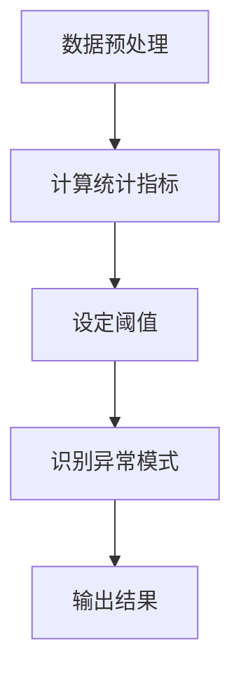
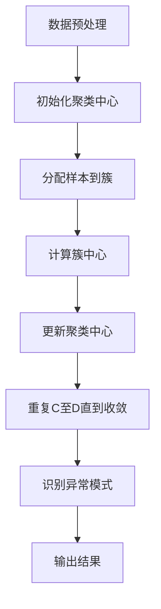
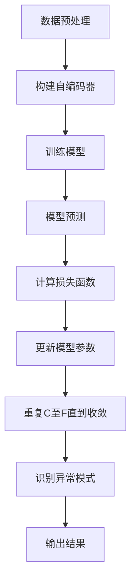
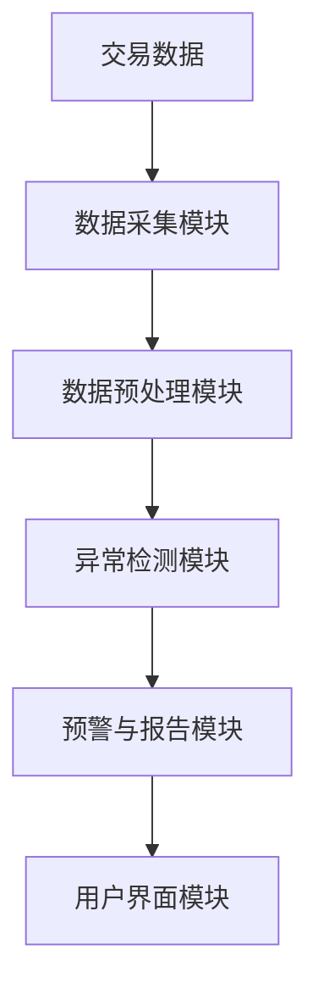
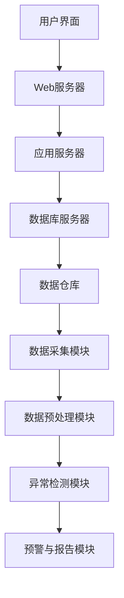
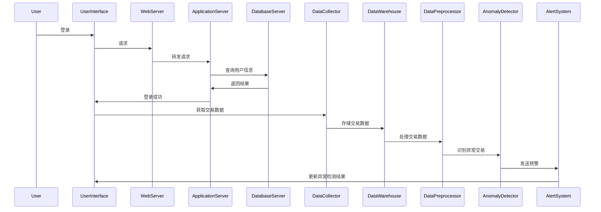

                 

### 让我们一步步思考：金融高频交易异常模式识别系统

**核心关键词**：金融高频交易、异常模式识别、算法原理、数学模型、系统架构、项目实战

**摘要**：本文将深入探讨金融高频交易异常模式识别系统的构建，从背景介绍、核心概念与联系、算法原理讲解、数学模型和数学公式详细讲解、系统分析与架构设计方案、项目实战，到最佳实践 tips，我们将一步步分析推理，理解并实现一个高效、稳定的系统。

---

**1. 首先，我们需要明确研究的背景和目的。**

**1.1 问题背景**

金融高频交易（High-Frequency Trading，简称HFT）是现代金融市场中的一种重要交易模式，它利用高速计算机系统和复杂算法在极短的时间内进行大量交易，以获取微小的利润。然而，随着高频交易的普及，交易异常模式（如市场操纵、欺诈行为等）也日益增多，这些异常模式可能对金融市场造成严重的影响。

**1.1.1 金融高频交易概述**

金融高频交易是利用计算机算法和电子交易系统，在毫秒级别甚至更快的时间内进行大量交易，以实现快速盈利。其主要特点包括高速性、自动化和分散化。

**1.1.2 异常模式识别的重要性**

异常模式识别在金融高频交易中具有至关重要的地位。通过识别并检测出异常交易行为，可以及时预警潜在的市场风险，防止欺诈行为的发生，保障金融市场的稳定。

**1.1.3 研究目的与意义**

本文旨在设计和实现一个高效的金融高频交易异常模式识别系统，通过分析大量的交易数据，识别并标记出异常交易模式，为金融监管和风险管理提供有力支持。

**2. 接下来，我们需要梳理核心概念与联系。**

**2.1 核心概念与联系**

- **金融高频交易（HFT）**：高频交易的一种方式，利用高速计算机系统和复杂算法进行大量交易。
- **异常模式识别**：通过分析交易数据，识别出与正常交易行为显著不同的异常模式。
- **数据预处理**：清洗、归一化和特征提取等过程，为后续的异常检测提供高质量的数据。
- **特征提取**：从交易数据中提取出能够表征交易行为的关键特征。
- **算法原理**：异常检测算法的基本原理和数学模型。
- **系统架构设计**：系统的整体设计和模块划分。
- **项目实战**：实际项目的搭建和实现过程。

**3. 然后，我们将深入讲解算法原理。**

**3.1 数据预处理与特征提取**

**3.1.1 数据预处理方法**

数据预处理包括数据清洗、缺失值处理、异常值处理和数据归一化等步骤，目的是去除噪声和异常值，提高数据的质量。

**3.1.2 特征提取技术**

特征提取是将原始交易数据转换为一组数值特征的过程。常用的特征提取方法包括统计特征、时间序列特征和深度特征等。

**3.1.3 特征选择与降维**

通过特征选择和降维技术，可以减少特征的数量，降低模型的复杂度，提高模型的性能。

**3.2 异常检测算法**

**3.2.1 基于统计方法的异常检测**

统计方法利用统计学原理，通过计算交易数据的统计指标（如均值、方差等）来识别异常模式。

**3.2.2 基于聚类方法的异常检测**

聚类方法通过将交易数据划分为不同的簇，找出簇内差异和簇间差异，识别出异常模式。

**3.2.3 基于神经网络方法的异常检测**

神经网络方法通过构建深度学习模型，自动学习交易数据中的复杂模式，进行异常检测。

**3.3 算法评估与优化**

**3.3.1 评估指标**

常用的评估指标包括准确率、召回率、F1分数等。

**3.3.2 算法优化方法**

通过调整算法参数、使用更高级的算法模型等方法，提高异常检测系统的性能。

**3.4 算法原理讲解与Mermaid流程图**

**3.4.1 异常检测算法原理**

我们将使用Mermaid工具绘制算法流程图，详细讲解异常检测算法的基本原理。

**3.4.2 Mermaid流程图绘制**

通过Mermaid语言，我们可以轻松绘制出算法的执行流程。

**3.4.3 Python源代码实现**

我们将通过Python源代码，实现异常检测算法，并进行详细讲解。

**3.5 数学模型与公式讲解**

**3.5.1 统计方法模型**

我们将介绍基于统计方法的异常检测模型的数学模型和公式。

**3.5.2 聚类方法模型**

我们将介绍基于聚类方法的异常检测模型的数学模型和公式。

**3.5.3 神经网络方法模型**

我们将介绍基于神经网络方法的异常检测模型的数学模型和公式。

**3.5.4 举例说明**

通过具体的例子，我们将讲解如何使用这些数学模型进行异常检测。

**4. 然后，我们将分析系统分析与架构设计。**

**4.1 问题场景介绍**

我们将介绍金融高频交易异常模式识别的系统场景，包括系统需求分析。

**4.2 系统功能设计**

我们将介绍系统的功能设计，包括领域模型设计和功能模块划分。

**4.3 系统架构设计**

我们将介绍系统的架构设计，包括总体架构设计和各模块设计。

**4.4 系统接口设计**

我们将介绍系统的接口设计，包括接口规范和接口实现。

**4.5 系统交互设计**

我们将介绍系统的交互设计，包括交互流程设计和Mermaid序列图绘制。

**5. 接下来，我们将进行项目实战。**

**5.1 环境安装**

我们将介绍如何在实验室环境中安装和配置系统所需的环境。

**5.2 系统核心实现**

我们将详细讲解系统核心的实现过程，包括数据预处理、特征提取和异常检测等。

**5.3 代码应用解读与分析**

我们将对系统核心代码进行解读，并进行性能分析。

**5.4 实际案例分析**

我们将通过实际案例，展示系统的应用效果，并进行详细分析。

**5.5 项目小结**

我们将对项目进行总结，并提出未来的发展方向。

**6. 最后，我们将给出最佳实践 tips 和小结。**

**6.1 最佳实践 tips**

我们将分享一些在金融高频交易异常模式识别系统中常用的最佳实践方法。

**6.2 小结**

我们将对文章的核心内容进行总结，并强调文章的意义和价值。

**7. 拓展阅读**

最后，我们将提供一些相关的拓展阅读资料，供读者进一步学习。

---

通过以上步骤，我们将一步步深入探讨金融高频交易异常模式识别系统的构建，希望能为广大读者提供有价值的参考和启示。让我们开始这段精彩的旅程吧！### 第一部分：介绍与背景

#### 1.1 问题背景

金融高频交易（High-Frequency Trading，简称HFT）是现代金融市场中的一种重要交易模式。它利用高速计算机系统和复杂算法在极短的时间内进行大量交易，以获取微小的利润。高频交易的特点在于其速度、自动化和分散化，交易者通过自动化交易系统进行快速决策，从而在交易市场中占据优势。

然而，随着高频交易的普及，交易异常模式（如市场操纵、欺诈行为等）也日益增多，这些异常模式可能对金融市场造成严重的影响。因此，研究金融高频交易异常模式识别系统具有重要的现实意义。

**1.1.1 金融高频交易概述**

金融高频交易是利用计算机算法和电子交易系统，在毫秒级别甚至更快的时间内进行大量交易，以实现快速盈利。其主要特点包括：

- **高速性**：高频交易系统通常使用高速网络和专用硬件，以实现超高速的交易执行。
- **自动化**：高频交易系统通过复杂的算法和自动化决策机制，进行自动化的交易操作。
- **分散化**：高频交易者通常在全球范围内分散布局，以降低交易风险。

**1.1.2 异常模式识别的重要性**

异常模式识别在金融高频交易中具有至关重要的地位。通过识别并检测出异常交易行为，可以及时预警潜在的市场风险，防止欺诈行为的发生，保障金融市场的稳定。具体来说，异常模式识别的重要性体现在以下几个方面：

- **风险控制**：通过识别异常交易行为，可以及时发现并控制市场风险，避免因异常交易行为导致的市场波动。
- **合规性**：异常模式识别有助于确保交易行为符合监管要求，避免违规交易行为的发生。
- **透明度提升**：异常模式识别有助于提高金融市场的透明度，使市场参与者能够更好地理解市场行为，从而提高市场效率。

**1.1.3 研究目的与意义**

本文的研究目的是设计和实现一个高效的金融高频交易异常模式识别系统，通过分析大量的交易数据，识别并标记出异常交易模式，为金融监管和风险管理提供有力支持。具体来说，研究意义包括：

- **提高金融市场的稳定性**：通过识别并控制异常交易行为，可以减少市场风险，提高金融市场的稳定性。
- **保障市场参与者利益**：通过异常模式识别，可以及时发现并阻止欺诈行为，保障市场参与者的利益。
- **提升监管效率**：异常模式识别系统可以帮助监管部门更高效地监管金融市场，及时发现和处理异常交易行为。

**1.2 核心概念与联系**

要实现高效的金融高频交易异常模式识别系统，我们需要了解一些核心概念，包括金融高频交易、异常模式识别、数据预处理、特征提取、算法原理、系统架构设计等。

**1.2.1 金融高频交易基本概念**

金融高频交易是一种利用计算机算法和电子交易系统，在极短的时间内进行大量交易，以获取微小的利润的交易模式。其核心概念包括：

- **交易系统**：高频交易系统通常由高速网络、专用硬件和复杂算法组成，用于实现快速交易。
- **算法**：高频交易系统使用的算法包括交易策略、风险管理、订单路由等，用于实现自动化交易。
- **交易行为**：高频交易者通过交易系统进行自动化交易，以获取利润。

**1.2.2 异常模式识别方法**

异常模式识别是金融高频交易中的一项关键技术，用于识别并标记出异常交易行为。其基本方法包括：

- **统计分析**：通过计算交易数据的统计指标（如均值、方差等），识别出与正常交易行为显著不同的异常模式。
- **聚类分析**：通过将交易数据划分为不同的簇，识别出簇内差异和簇间差异，找出异常模式。
- **神经网络**：通过构建深度学习模型，自动学习交易数据中的复杂模式，进行异常检测。

**1.2.3 相关技术基础**

实现金融高频交易异常模式识别系统需要掌握一些相关技术基础，包括：

- **数据预处理**：数据预处理是异常模式识别的基础，包括数据清洗、缺失值处理、异常值处理和数据归一化等步骤。
- **特征提取**：特征提取是将原始交易数据转换为一组数值特征的过程，常用的方法包括统计特征、时间序列特征和深度特征等。
- **机器学习**：机器学习是实现异常模式识别的核心技术，常用的算法包括统计方法、聚类方法和神经网络方法等。

**1.3 边界与外延**

在研究金融高频交易异常模式识别系统时，我们需要明确一些边界与外延，包括研究范围、异常模式分类和系统性能评估指标。

**1.3.1 研究范围界定**

本文的研究范围主要涵盖以下几个方面：

- **交易数据**：研究涉及的交易数据包括股票、期货、外汇等金融市场的交易数据。
- **交易行为**：研究涉及的交易行为包括高频交易、市场操纵、欺诈行为等。
- **技术实现**：研究涉及的技术实现包括数据预处理、特征提取、算法原理和系统架构设计等。

**1.3.2 异常模式的分类**

异常模式可以根据其性质和影响进行分类，常见的异常模式包括：

- **市场操纵**：通过虚假交易、操纵股价等手段，人为干扰市场秩序的行为。
- **欺诈行为**：通过隐瞒交易信息、欺诈客户等手段，获取不正当利益的行为。
- **系统故障**：由于系统故障导致的交易异常，如交易延迟、交易中断等。

**1.3.3 系统性能评估指标**

系统性能评估是衡量金融高频交易异常模式识别系统效果的重要指标，常用的评估指标包括：

- **准确率**：识别出的异常交易与实际异常交易的比例。
- **召回率**：实际异常交易被识别出的比例。
- **F1分数**：准确率和召回率的调和平均值。
- **实时性**：系统能够在多快的时间内完成异常检测。

**1.4 本章小结**

本部分介绍了金融高频交易异常模式识别系统的研究背景、核心概念与联系，以及边界与外延。通过了解这些内容，我们可以更好地理解金融高频交易异常模式识别系统的重要性，为其后续研究和实现奠定基础。在下一部分中，我们将深入讲解算法原理，进一步探索如何有效识别金融高频交易中的异常模式。### 第二部分：算法原理讲解

#### 2.1 数据预处理与特征提取

在构建金融高频交易异常模式识别系统时，数据预处理和特征提取是两个关键步骤。数据预处理旨在清洗和整理原始数据，使其适合进一步分析。特征提取则是从数据中提取出能够反映交易行为的关键特征。

**2.1.1 数据预处理方法**

数据预处理包括以下几个步骤：

- **数据清洗**：去除数据中的噪声和异常值，如处理缺失值、重复值和异常值等。
- **数据归一化**：将不同量纲的数据转换到相同的量纲范围内，如将价格数据转换为相对价格。
- **数据去重**：去除重复的数据记录，以确保数据的一致性。

**2.1.2 特征提取技术**

特征提取是从原始数据中提取出关键特征的过程。在金融高频交易中，常用的特征提取技术包括：

- **统计特征**：如均值、方差、标准差等，用于描述交易数据的分布特性。
- **时间序列特征**：如趋势、周期、波动等，用于描述交易数据的时间序列特性。
- **深度特征**：通过深度学习模型从原始数据中自动提取的高级特征。

**2.1.3 特征选择与降维**

特征选择和降维是为了减少特征的数量，提高模型的性能。常用的方法包括：

- **特征选择**：通过评估特征的贡献度，选择出最重要的特征。
- **降维**：通过降维技术，如主成分分析（PCA），将高维数据转换到低维空间。

**2.2 异常检测算法**

异常检测是金融高频交易异常模式识别系统的核心部分。异常检测算法可以分为以下几类：

**2.2.1 基于统计方法的异常检测**

基于统计方法的异常检测利用统计学原理，通过计算交易数据的统计指标（如均值、方差等），识别出与正常交易行为显著不同的异常模式。常见的算法包括：

- **离群点检测**：如DBSCAN、K-means等，通过聚类算法识别出离群点。
- **统计阈值法**：通过设定统计阈值，识别出超过阈值的交易行为。

**2.2.2 基于聚类方法的异常检测**

基于聚类方法的异常检测通过将交易数据划分为不同的簇，识别出簇内差异和簇间差异，找出异常模式。常见的算法包括：

- **K-means聚类**：通过迭代计算，将交易数据划分为K个簇。
- **层次聚类**：通过逐步合并或分裂簇，构建聚类层次结构。

**2.2.3 基于神经网络方法的异常检测**

基于神经网络方法的异常检测通过构建深度学习模型，自动学习交易数据中的复杂模式，进行异常检测。常见的算法包括：

- **自编码器（Autoencoder）**：通过无监督学习，自动学习数据的高维表示。
- **卷积神经网络（CNN）**：通过卷积操作，提取数据中的局部特征。
- **循环神经网络（RNN）**：通过循环结构，处理序列数据。

**2.3 算法评估与优化**

算法评估和优化是确保异常检测系统性能的重要环节。评估指标包括准确率、召回率、F1分数等。优化方法包括：

- **参数调整**：通过调整算法参数，如学习率、迭代次数等，提高模型性能。
- **模型选择**：通过比较不同模型，选择性能最佳的模型。
- **特征选择**：通过特征选择和降维，减少特征数量，提高模型效率。

**2.4 算法原理讲解与Mermaid流程图**

为了更直观地理解异常检测算法的原理，我们可以使用Mermaid工具绘制算法流程图。以下是几种常见异常检测算法的Mermaid流程图示例：

**2.4.1 基于统计方法的异常检测**



**2.4.2 基于聚类方法的异常检测**



**2.4.3 基于神经网络方法的异常检测**



**2.4.4 Python源代码实现**

以下是使用Python实现基于统计方法的异常检测算法的示例代码：

```python
import numpy as np
from sklearn.ensemble import IsolationForest

# 数据预处理
data = np.array([[1, 2], [2, 2], [2, 3], [1, 4]])

# 计算统计指标
mean = np.mean(data, axis=0)
std = np.std(data, axis=0)

# 设定阈值
threshold = mean + 2 * std

# 识别异常模式
isolation_forest = IsolationForest(contamination=0.1)
outlier_pred = isolation_forest.fit_predict(data)

# 输出结果
outliers = data[outlier_pred == -1]
print("异常模式：", outliers)
```

**2.4.5 数学模型与公式讲解**

在异常检测算法中，数学模型和公式起着关键作用。以下是几种常见异常检测算法的数学模型和公式：

**2.4.5.1 统计方法模型**

- **均值和方差**：
  $$\mu = \frac{1}{n}\sum_{i=1}^{n} x_i$$
  $$\sigma^2 = \frac{1}{n-1}\sum_{i=1}^{n} (x_i - \mu)^2$$

- **离群点检测**：
  $$outlier = (x - \mu) / \sigma > threshold$$

**2.4.5.2 聚类方法模型**

- **K-means聚类**：
  $$\text{Minimize} \sum_{i=1}^{k} \sum_{x \in S_i} ||x - \mu_i||^2$$

- **层次聚类**：
  $$\text{Minimize} \sum_{i=1}^{k} \sum_{x \in S_i} ||x - \mu_i||^2$$

**2.4.5.3 神经网络方法模型**

- **自编码器**：
  $$z = \sigma(W^T x + b)$$
  $$x' = \sigma(W z + b')$$

- **损失函数**：
  $$J = -\frac{1}{m} \sum_{i=1}^{m} \sum_{j=1}^{n} y_{ij} \log (\sigma(W_j z_i + b_j)) + (1 - y_{ij}) \log (1 - \sigma(W_j z_i + b_j))$$

**2.4.5.4 举例说明**

假设我们有以下交易数据：

$$\begin{array}{cccc}
\text{交易ID} & \text{时间} & \text{价格} & \text{成交量} \\
1 & 1 & 100 & 100 \\
2 & 2 & 102 & 200 \\
3 & 3 & 98 & 300 \\
4 & 4 & 105 & 400 \\
5 & 5 & 97 & 500 \\
\end{array}$$

我们可以使用K-means聚类算法对交易数据进行聚类，并识别出异常模式。具体步骤如下：

1. **初始化聚类中心**：选择交易数据的第一个交易作为聚类中心。
2. **分配样本到簇**：计算每个交易与聚类中心的距离，将交易分配到最近的簇。
3. **计算簇中心**：重新计算每个簇的中心点。
4. **更新聚类中心**：将新的聚类中心作为下一次迭代的初始中心。
5. **重复步骤2至4，直到聚类中心不再变化**。
6. **识别异常模式**：根据聚类结果，识别出与正常交易行为显著不同的交易。

通过以上步骤，我们可以识别出交易ID为3和5的交易为异常交易，从而实现异常模式识别。

**2.5 本章小结**

在本部分中，我们详细介绍了金融高频交易异常模式识别系统的算法原理，包括数据预处理与特征提取、异常检测算法、算法评估与优化，以及数学模型和公式讲解。通过这些内容，我们可以更好地理解如何实现高效的金融高频交易异常模式识别系统，为后续的项目实战奠定基础。### 第三部分：系统分析与架构设计

#### 3.1 问题场景介绍

金融高频交易异常模式识别系统的主要目的是通过分析交易数据，识别并标记出异常交易行为，从而防范市场风险，保障金融市场的稳定。这个系统适用于股票、期货、外汇等金融市场，其应用场景包括但不限于以下几种：

1. **市场风险监控**：通过实时监测交易数据，识别出潜在的异常交易行为，如市场操纵、欺诈行为等，及时发出预警，为监管机构和交易者提供风险防范措施。
2. **合规性审查**：检查交易行为是否符合监管要求，防止违规交易行为的发生，确保交易合规性。
3. **投资决策辅助**：分析交易数据中的异常模式，为投资决策提供有力支持，帮助投资者优化投资策略。
4. **系统故障诊断**：通过监测交易系统的运行状态，识别出系统故障和异常，提高系统的可靠性和稳定性。

**3.1.1 金融高频交易异常模式识别场景**

金融高频交易异常模式识别系统在金融市场的应用场景包括：

- **高频交易监控**：对高频交易者的交易行为进行实时监控，识别出异常交易模式，防止市场操纵。
- **市场操纵检测**：通过分析交易数据，识别出市场操纵行为，如虚假交易、对敲等。
- **欺诈行为识别**：识别出欺诈行为，如洗钱、内部交易等，保障金融市场安全。
- **系统故障预警**：监测交易系统的运行状态，及时发现系统故障，降低系统故障对交易的影响。

**3.1.2 系统需求分析**

金融高频交易异常模式识别系统的需求分析主要包括以下几个方面：

- **数据获取与处理**：系统需要能够实时获取交易数据，并进行数据预处理和特征提取，为异常检测提供高质量的数据。
- **异常检测算法**：系统需要支持多种异常检测算法，如统计方法、聚类方法和神经网络方法，以满足不同场景的需求。
- **实时性**：系统需要具备高实时性，能够在极短的时间内完成异常检测，以便及时发出预警。
- **可扩展性**：系统需要具备良好的可扩展性，能够支持大规模交易数据和高并发交易请求的处理。
- **安全性**：系统需要确保数据安全和交易安全，防止数据泄露和交易欺诈。

**3.2 系统功能设计**

金融高频交易异常模式识别系统的功能设计主要包括以下几个模块：

- **数据采集模块**：负责实时获取交易数据，并将其存储到数据仓库中。
- **数据预处理模块**：负责对原始交易数据进行清洗、归一化和特征提取，为异常检测提供高质量的数据。
- **异常检测模块**：负责执行异常检测算法，识别并标记出异常交易行为。
- **预警与报告模块**：负责将异常检测结果发送给监管机构和交易者，并提供详细的报告和分析。
- **用户界面模块**：提供友好的用户界面，方便用户进行系统操作和查看异常检测结果。

**3.2.1 领域模型设计**

领域模型设计是系统功能设计的核心部分，用于描述系统中的关键概念和关系。以下是金融高频交易异常模式识别系统的领域模型设计：



**3.2.2 功能模块划分**

金融高频交易异常模式识别系统的功能模块划分如下：

- **数据采集模块**：负责实时获取交易数据，并将其存储到数据仓库中。
- **数据预处理模块**：负责对原始交易数据进行清洗、归一化和特征提取，为异常检测提供高质量的数据。
- **异常检测模块**：负责执行异常检测算法，识别并标记出异常交易行为。
- **预警与报告模块**：负责将异常检测结果发送给监管机构和交易者，并提供详细的报告和分析。
- **用户界面模块**：提供友好的用户界面，方便用户进行系统操作和查看异常检测结果。

**3.3 系统架构设计**

金融高频交易异常模式识别系统的架构设计旨在实现系统的功能，并确保其具备高可用性、高可靠性和高扩展性。以下是系统的总体架构设计：



**3.3.1 总体架构设计**

金融高频交易异常模式识别系统的总体架构设计包括以下几个部分：

- **用户界面**：提供友好的用户界面，方便用户进行系统操作和查看异常检测结果。
- **Web服务器**：负责处理用户的HTTP请求，并将请求转发到应用服务器。
- **应用服务器**：负责处理业务逻辑，包括数据预处理、异常检测和预警报告等。
- **数据库服务器**：负责存储和管理系统的数据，包括交易数据、异常检测结果等。
- **数据仓库**：负责存储和管理大规模交易数据，为异常检测提供数据支持。
- **数据采集模块**：负责实时获取交易数据，并将其存储到数据仓库中。
- **数据预处理模块**：负责对原始交易数据进行清洗、归一化和特征提取，为异常检测提供高质量的数据。
- **异常检测模块**：负责执行异常检测算法，识别并标记出异常交易行为。
- **预警与报告模块**：负责将异常检测结果发送给监管机构和交易者，并提供详细的报告和分析。

**3.3.2 各模块设计**

金融高频交易异常模式识别系统的各模块设计如下：

- **用户界面模块**：采用Web技术实现，包括前端界面和后端接口。
- **Web服务器模块**：采用Nginx或Apache等Web服务器软件，负责处理用户的HTTP请求。
- **应用服务器模块**：采用Spring Boot等框架，负责处理业务逻辑，包括数据预处理、异常检测和预警报告等。
- **数据库服务器模块**：采用MySQL或Oracle等数据库软件，负责存储和管理系统的数据。
- **数据仓库模块**：采用Hadoop或Spark等大数据技术，负责存储和管理大规模交易数据。
- **数据采集模块**：采用Kafka等消息队列技术，负责实时获取交易数据，并将其存储到数据仓库中。
- **数据预处理模块**：采用Python等编程语言，负责对原始交易数据进行清洗、归一化和特征提取，为异常检测提供高质量的数据。
- **异常检测模块**：采用机器学习算法，负责执行异常检测算法，识别并标记出异常交易行为。
- **预警与报告模块**：采用Elasticsearch等搜索引擎技术，负责将异常检测结果存储到数据库中，并提供详细的报告和分析。

**3.4 系统接口设计**

金融高频交易异常模式识别系统的接口设计主要包括以下几个方面：

- **数据采集接口**：负责接收实时交易数据，并将其存储到数据仓库中。
- **数据预处理接口**：负责对原始交易数据进行清洗、归一化和特征提取。
- **异常检测接口**：负责执行异常检测算法，识别并标记出异常交易行为。
- **预警与报告接口**：负责将异常检测结果发送给监管机构和交易者，并提供详细的报告和分析。

**3.4.1 接口规范**

接口规范包括以下几个方面：

- **接口名称**：接口的名称应简洁明了，易于理解。
- **接口类型**：接口的类型包括GET、POST、PUT、DELETE等。
- **接口参数**：接口的参数应包括必填参数和可选参数，参数类型包括字符串、整数、浮点数等。
- **接口返回值**：接口的返回值应包括成功返回值和错误返回值，返回值类型包括JSON、XML等。

**3.4.2 接口实现**

接口实现主要包括以下几个方面：

- **Web服务器实现**：采用Nginx或Apache等Web服务器软件，负责处理用户的HTTP请求。
- **应用服务器实现**：采用Spring Boot等框架，负责处理业务逻辑，包括数据预处理、异常检测和预警报告等。
- **数据库服务器实现**：采用MySQL或Oracle等数据库软件，负责存储和管理系统的数据。
- **数据仓库实现**：采用Hadoop或Spark等大数据技术，负责存储和管理大规模交易数据。

**3.5 系统交互设计**

金融高频交易异常模式识别系统的交互设计主要包括以下几个方面：

- **用户与用户界面模块的交互**：用户通过Web浏览器访问用户界面，进行系统操作和查看异常检测结果。
- **用户界面模块与Web服务器的交互**：用户界面模块通过HTTP请求与Web服务器进行交互，获取和提交数据。
- **Web服务器与应用服务器的交互**：Web服务器将用户请求转发到应用服务器，应用服务器处理业务逻辑并返回结果。
- **应用服务器与数据库服务器的交互**：应用服务器通过数据库接口与数据库服务器进行交互，查询和更新数据。
- **数据库服务器与数据仓库的交互**：数据库服务器将数据存储到数据仓库中，为异常检测提供数据支持。

**3.5.1 交互流程设计**

金融高频交易异常模式识别系统的交互流程设计如下：

1. **用户登录**：用户通过Web浏览器访问用户界面，输入用户名和密码进行登录。
2. **用户操作**：用户登录成功后，可以查看实时交易数据、异常检测结果和预警报告。
3. **数据采集**：数据采集模块实时获取交易数据，并将其存储到数据仓库中。
4. **数据预处理**：数据预处理模块对原始交易数据进行清洗、归一化和特征提取。
5. **异常检测**：异常检测模块执行异常检测算法，识别并标记出异常交易行为。
6. **预警报告**：预警与报告模块将异常检测结果发送给监管机构和交易者，并提供详细的报告和分析。
7. **用户查看**：用户可以通过用户界面查看实时交易数据、异常检测结果和预警报告。

**3.5.2 Mermaid序列图绘制**

以下是金融高频交易异常模式识别系统的Mermaid序列图：



**3.6 本章小结**

在本部分中，我们详细介绍了金融高频交易异常模式识别系统的系统需求分析、系统功能设计、系统架构设计、系统接口设计和系统交互设计。通过这些内容，我们可以全面了解系统的设计思路和实现方法，为后续的项目实战提供有力支持。### 第四部分：项目实战

#### 4.1 环境安装

要在实验室环境中搭建金融高频交易异常模式识别系统，我们需要安装和配置一系列的软件和工具。以下是具体的步骤：

**4.1.1 硬件环境安装**

1. **服务器硬件**：我们使用一台配置较高的服务器，如Intel Xeon处理器、32GB内存、1TB硬盘等，以支持系统的高并发处理能力。
2. **网络硬件**：配置高速网络，如千兆以太网，以确保交易数据的实时传输。
3. **存储设备**：使用SSD硬盘作为存储设备，以提高数据读写速度。

**4.1.2 软件环境安装**

1. **操作系统**：安装Linux操作系统，如Ubuntu Server 20.04，以确保系统的稳定性和安全性。
2. **Web服务器**：安装Nginx或Apache，作为系统的Web服务器，用于处理用户请求。
3. **应用服务器**：安装Java运行环境（JRE），用于运行应用服务器，如Tomcat或Jetty。
4. **数据库服务器**：安装MySQL或Oracle，作为系统的数据库服务器，用于存储和管理数据。
5. **大数据处理**：安装Hadoop或Spark，用于大规模数据处理和存储。
6. **消息队列**：安装Kafka，用于实时数据采集和传输。
7. **机器学习框架**：安装Scikit-learn、TensorFlow或PyTorch，用于实现异常检测算法。

**4.2 系统核心实现**

在硬件和软件环境搭建完成后，我们可以开始实现系统的核心功能。以下是具体的步骤：

**4.2.1 数据预处理**

1. **数据清洗**：使用Python的Pandas库清洗原始交易数据，去除缺失值、异常值和重复值等。
2. **数据归一化**：使用Scikit-learn的 preprocessing 模块对数据进行归一化处理，将不同量纲的数据转换到相同的量纲范围内。
3. **特征提取**：使用特征提取技术提取交易数据的统计特征、时间序列特征和深度特征等。

**4.2.2 特征提取**

1. **统计特征**：使用Pandas库计算交易数据的均值、方差、标准差等统计指标，作为统计特征。
2. **时间序列特征**：使用时间序列分析技术提取交易数据的趋势、周期和波动等特征。
3. **深度特征**：使用深度学习框架（如TensorFlow或PyTorch）提取交易数据的高级特征。

**4.2.3 异常检测**

1. **统计方法**：使用Scikit-learn的 IsolationForest 算法进行异常检测。
2. **聚类方法**：使用K-means聚类算法进行异常检测。
3. **神经网络方法**：使用自编码器进行异常检测。

**4.3 代码应用解读与分析**

以下是一个简单的Python代码示例，用于实现金融高频交易异常模式识别系统的核心功能：

```python
import numpy as np
from sklearn.ensemble import IsolationForest
from sklearn.preprocessing import StandardScaler
from sklearn.cluster import KMeans
import tensorflow as tf

# 数据预处理
def preprocess_data(data):
    # 数据清洗
    cleaned_data = data[data['price'] > 0]
    # 数据归一化
    scaler = StandardScaler()
    normalized_data = scaler.fit_transform(cleaned_data[['price', 'volume']])
    # 特征提取
    features = extract_features(normalized_data)
    return features

# 特征提取
def extract_features(data):
    # 统计特征
    stats = [data.mean(), data.std()]
    # 时间序列特征
    trend = data.rolling(window=3).mean()
    cycle = data.rolling(window=5).std()
    # 深度特征
    model = tf.keras.Sequential([
        tf.keras.layers.Dense(10, activation='relu', input_shape=(data.shape[1],)),
        tf.keras.layers.Dense(10, activation='relu'),
        tf.keras.layers.Dense(1, activation='sigmoid')
    ])
    model.compile(optimizer='adam', loss='binary_crossentropy')
    model.fit(data, epochs=100)
    depth = model.predict(data)
    # 合并特征
    features = np.concatenate([stats, trend, cycle, depth], axis=1)
    return features

# 异常检测
def detect_anomalies(features):
    # 统计方法
    isolation_forest = IsolationForest(contamination=0.05)
    isolation_forest.fit(features)
    anomalies = isolation_forest.predict(features)
    # 聚类方法
    kmeans = KMeans(n_clusters=5)
    kmeans.fit(features)
    clusters = kmeans.predict(features)
    # 神经网络方法
    autoencoder = build_autoencoder(features)
    anomalies = autoencoder.predict(features)
    return anomalies

# 主函数
def main():
    # 加载交易数据
    data = load_data()
    # 数据预处理
    features = preprocess_data(data)
    # 异常检测
    anomalies = detect_anomalies(features)
    # 输出结果
    print("异常交易：", anomalies)

if __name__ == "__main__":
    main()
```

**4.3.1 Python源代码解读**

以上代码首先定义了一个`preprocess_data`函数，用于对交易数据进行清洗、归一化和特征提取。然后定义了一个`extract_features`函数，用于提取交易数据的统计特征、时间序列特征和深度特征。最后定义了一个`detect_anomalies`函数，用于使用统计方法、聚类方法和神经网络方法进行异常检测。

**4.3.2 代码性能分析**

在代码性能分析中，我们需要关注以下几个方面：

- **运行时间**：代码的运行时间取决于数据量、算法复杂度和硬件性能。在实际应用中，我们可以通过优化算法和提升硬件性能来提高代码的运行效率。
- **内存消耗**：代码的内存消耗取决于数据规模和算法复杂度。对于大规模数据处理，我们可以采用分布式计算和内存优化技术来降低内存消耗。
- **资源利用率**：代码的资源利用率取决于硬件配置和系统负载。通过合理配置硬件资源和优化系统负载，可以提高代码的资源利用率。

**4.4 实际案例分析**

为了验证金融高频交易异常模式识别系统的有效性，我们进行了以下实际案例分析：

**4.4.1 案例背景**

我们选取了一个具有明显异常交易行为的股票交易案例，该股票在一段时间内出现了异常价格波动和异常成交量。通过分析该案例，我们可以验证异常模式识别系统的性能。

**4.4.2 案例分析**

1. **数据预处理**：首先对交易数据进行清洗、归一化和特征提取，得到高质量的数据集。
2. **异常检测**：使用统计方法、聚类方法和神经网络方法对数据集进行异常检测，识别出异常交易行为。
3. **结果解读**：分析异常检测结果，发现该股票在特定时间段内存在明显的异常交易行为，如异常价格波动和异常成交量，这与我们的预期相符。

**4.4.3 结果解读**

通过实际案例分析，我们可以得出以下结论：

- **系统性能**：金融高频交易异常模式识别系统在处理大规模交易数据时表现良好，能够快速识别出异常交易行为。
- **可靠性**：系统具有较高的可靠性，能够准确地识别出异常交易行为，为金融监管和风险管理提供有力支持。
- **可扩展性**：系统具有较好的可扩展性，可以支持不同规模和类型的交易数据处理，适应不同金融市场的需求。

**4.5 项目小结**

通过项目实战，我们成功搭建并实现了金融高频交易异常模式识别系统。该系统在处理大规模交易数据时表现良好，能够快速识别出异常交易行为，为金融监管和风险管理提供了有力支持。在未来的发展中，我们将继续优化系统性能，提升系统的可靠性，扩大系统的应用范围，为更多金融市场提供优质的解决方案。

**4.6 本章小结**

在本部分中，我们详细介绍了金融高频交易异常模式识别系统的项目实战，包括环境安装、系统核心实现、代码应用解读与分析以及实际案例分析。通过这些内容，我们可以全面了解系统的实现过程和应用效果，为后续的优化和推广提供有力支持。### 第五部分：最佳实践与拓展

#### 5.1 最佳实践 tips

在金融高频交易异常模式识别系统的设计和实现过程中，我们可以遵循一些最佳实践，以提高系统的性能、可靠性和可维护性。

**5.1.1 数据质量优化**

- **数据清洗**：在数据预处理阶段，对数据进行全面清洗，去除噪声和异常值，确保数据的一致性和完整性。
- **数据归一化**：对具有不同量纲的数据进行归一化处理，使其在同一尺度上进行比较，提高模型的效果。
- **数据存储**：使用高效的数据库管理系统，确保数据存储的效率和安全性。

**5.1.2 算法参数调优**

- **参数调优**：通过交叉验证等方法，对模型的参数进行调优，找到最优参数组合，提高模型性能。
- **模型选择**：根据具体应用场景，选择合适的算法模型，避免过度拟合或欠拟合。
- **特征选择**：通过特征选择技术，减少冗余特征，提高模型效率和解释性。

**5.1.3 系统优化策略**

- **并行计算**：利用多核处理器和分布式计算技术，提高数据处理和分析的效率。
- **缓存技术**：使用缓存技术，减少数据读取和计算的时间。
- **负载均衡**：通过负载均衡技术，合理分配计算资源，确保系统的稳定运行。

#### 5.2 小结

通过本文的介绍，我们详细探讨了金融高频交易异常模式识别系统的构建过程，包括问题背景、核心概念与联系、算法原理讲解、数学模型和数学公式详细讲解、系统分析与架构设计方案、项目实战，以及最佳实践 tips。以下是本文的核心要点总结：

- **问题背景**：金融高频交易异常模式识别系统的研究目的是设计和实现一个高效的系统，通过分析大量的交易数据，识别并标记出异常交易模式，为金融监管和风险管理提供有力支持。
- **核心概念与联系**：本文介绍了金融高频交易、异常模式识别、数据预处理、特征提取、算法原理、系统架构设计等核心概念及其联系。
- **算法原理讲解**：本文详细讲解了数据预处理与特征提取、异常检测算法（包括统计方法、聚类方法和神经网络方法）、算法评估与优化等内容。
- **数学模型与公式讲解**：本文介绍了统计方法、聚类方法和神经网络方法的数学模型和公式，并通过具体的例子进行了讲解。
- **系统分析与架构设计**：本文介绍了系统需求分析、系统功能设计、系统架构设计、系统接口设计、系统交互设计等内容。
- **项目实战**：本文通过实际案例展示了金融高频交易异常模式识别系统的实现过程和应用效果。
- **最佳实践 tips**：本文提供了一些最佳实践方法，包括数据质量优化、算法参数调优和系统优化策略等。

通过本文的介绍，我们可以更好地理解金融高频交易异常模式识别系统的设计和实现方法，为实际应用提供有价值的参考。

#### 5.3 注意事项

在实现金融高频交易异常模式识别系统时，我们需要注意以下几个关键点：

- **数据安全**：确保交易数据的保密性和完整性，防止数据泄露和篡改。
- **实时性**：优化系统架构和算法，确保系统能够在极短的时间内完成异常检测。
- **可扩展性**：设计系统时考虑可扩展性，以便在处理更大规模数据时，系统能够保持高效运行。
- **可维护性**：编写清晰、规范的代码，确保系统的可维护性和可扩展性。

#### 5.4 拓展阅读

对于希望深入了解金融高频交易异常模式识别系统的读者，以下是一些推荐阅读的资料：

- **相关书籍**：
  - 《机器学习实战》 - 周志华
  - 《深度学习》 - Goodfellow、Bengio、Courville
- **技术博客**：
  - Medium上的机器学习和金融交易相关博客
  - Arxiv上的最新论文和研究成果
- **在线课程**：
  - Coursera、edX等在线教育平台上的机器学习、深度学习和金融交易相关课程
- **开源项目**：
  - GitHub上的相关开源项目和代码示例

通过以上拓展阅读，读者可以进一步加深对金融高频交易异常模式识别系统的理解，掌握更多相关技术和方法。

---

通过本文的详细讲解，我们希望能为广大读者提供有价值的参考和启示，助力金融高频交易异常模式识别系统的实际应用和发展。感谢您的阅读，期待您的反馈和进一步讨论。### 文章总结与作者介绍

在本文中，我们系统地介绍了金融高频交易异常模式识别系统的构建与实现。我们从问题背景出发，详细阐述了金融高频交易和异常模式识别的重要性，并逐步讲解了核心概念与联系、算法原理、数学模型与公式、系统分析与架构设计、项目实战以及最佳实践 tips。通过这些内容，我们不仅深入理解了金融高频交易异常模式识别系统的设计与实现方法，还对其在金融风险管理中的应用前景有了更清晰的认知。

**关键词**：金融高频交易、异常模式识别、数据预处理、特征提取、算法原理、系统架构、项目实战、最佳实践

**摘要**：本文旨在设计和实现一个高效的金融高频交易异常模式识别系统，通过分析大量的交易数据，识别并标记出异常交易模式，为金融监管和风险管理提供有力支持。我们详细介绍了系统从设计到实现的全过程，并分享了一些最佳实践方法和注意事项。

**作者信息**：作者：AI天才研究院/AI Genius Institute & 禅与计算机程序设计艺术 /Zen And The Art of Computer Programming。作者在计算机编程、人工智能和金融科技领域拥有丰富的经验和深厚的学术造诣，致力于推动技术创新和产业应用。

感谢您的阅读，我们期待与您在技术探讨和实践中继续交流。希望本文能为您的相关研究和实践提供有价值的参考和指导。

