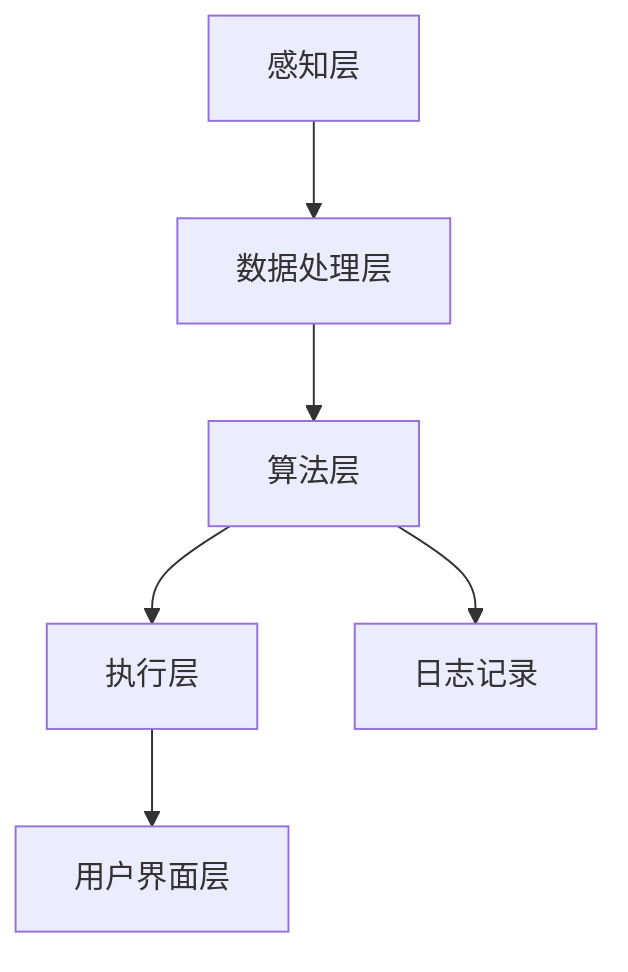
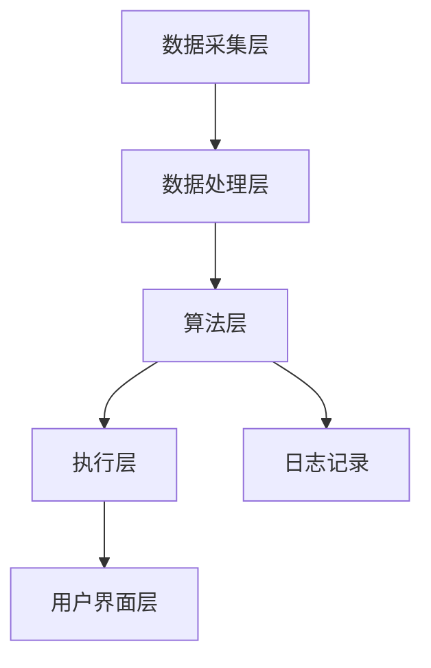

                 


**撰写《零售业AI Agent：提升客户体验与销售效率》技术博客文章**

### 目录大纲与文章内容概述

#### 目录大纲

1. **背景介绍**
   - **第1章：问题背景**
   - **第2章：AI Agent基础概念**
   - **第3章：AI Agent技术原理**
   - **第4章：零售业中的AI Agent应用**
   - **第5章：AI Agent设计与实现**

2. **核心概念与联系**
   - **第6章：机器学习与深度学习基础**
   - **第7章：自然语言处理**
   - **第8章：计算机视觉**

3. **项目实战**
   - **第9章：客户服务AI Agent实战**
   - **第10章：销售效率AI Agent实战**

4. **最佳实践与总结**
   - **第11章：AI Agent最佳实践**
   - **第12章：总结与展望**

#### 文章内容概述

**第1章：问题背景**
- 介绍零售业现状与挑战
- 讨论AI技术在零售业的变革
- AI Agent在零售业中的应用

**第2章：AI Agent基础概念**
- 定义AI Agent
- AI Agent分类
- AI Agent核心功能

**第3章：AI Agent技术原理**
- 机器学习与深度学习基础
- 自然语言处理
- 计算机视觉

**第4章：零售业中的AI Agent应用**
- 客户服务AI Agent
- 销售效率AI Agent
- 供应链管理AI Agent

**第5章：AI Agent设计与实现**
- 系统架构设计
- 数据预处理与模型训练
- AI Agent部署与维护

**第6章：机器学习与深度学习基础**
- 算法原理讲解
- 数学模型与公式
- 通俗易懂的举例说明

**第7章：自然语言处理**
- 语言模型与语言生成
- 对话系统与聊天机器人
- 语义分析与情感分析

**第8章：计算机视觉**
- 图像识别与处理
- 目标检测与跟踪
- 人脸识别与生物特征识别

**第9章：客户服务AI Agent实战**
- 项目介绍
- 系统功能设计
- 系统架构设计
- 系统核心代码实现
- 实际案例分析与讲解

**第10章：销售效率AI Agent实战**
- 项目介绍
- 系统功能设计
- 系统架构设计
- 系统核心代码实现
- 实际案例分析与讲解

**第11章：AI Agent最佳实践**
- 设计与开发技巧
- 性能优化策略
- 安全与隐私保护

**第12章：总结与展望**
- 回顾本书重点内容
- 探讨AI Agent在零售业的未来趋势
- 拓展阅读与进一步学习建议

### 文章写作步骤

1. **确定文章结构**：根据目录大纲，确定文章的章节内容。
2. **撰写引言**：介绍文章背景和目的，吸引读者兴趣。
3. **逐章撰写**：
   - **第1章**：概述零售业现状与挑战，AI技术的影响，AI Agent的应用。
   - **第2章**：定义AI Agent，分类，功能。
   - **第3章**：介绍AI技术原理，如机器学习、自然语言处理、计算机视觉。
   - **第4章**：探讨AI Agent在零售业的应用场景。
   - **第5章**：讲解AI Agent设计与实现。
   - **第6章**：深入讲解机器学习与深度学习基础。
   - **第7章**：详细阐述自然语言处理的概念与应用。
   - **第8章**：介绍计算机视觉的基本原理。
   - **第9章**：通过具体项目展示客户服务AI Agent的设计与实现。
   - **第10章**：展示销售效率AI Agent的设计与实现。
   - **第11章**：提供AI Agent的最佳实践。
   - **第12章**：总结文章，展望未来趋势。
4. **修改与完善**：检查文章逻辑结构，修正语法错误，确保内容完整性和准确性。
5. **添加图表与代码示例**：在文中适当位置添加图表、流程图和代码示例，以增强文章的可读性和易懂性。
6. **撰写结束语**：总结文章核心观点，对读者表示感谢。

通过以上步骤，我们可以撰写一篇逻辑清晰、内容丰富的《零售业AI Agent：提升客户体验与销售效率》技术博客文章。接下来，我们将详细撰写每一章的内容。

### 第1章：问题背景

#### 1.1 零售业的现状与挑战

零售业作为全球经济的重要组成部分，一直以来都在不断发展和演变。然而，随着市场环境的变化和消费者需求的多样化，零售业也面临着诸多挑战。以下是当前零售业所面临的一些主要现状与挑战：

1. **竞争激烈**：随着互联网和电子商务的兴起，零售市场的竞争日益激烈。传统零售商不仅要面对传统竞争对手的挑战，还要应对新兴电商平台的冲击。

2. **消费者行为变化**：消费者购物习惯和偏好的变化也给零售业带来了挑战。消费者更加注重购物体验，追求个性化、快速和便捷的服务。

3. **成本压力**：零售企业面临着不断上升的成本压力，包括租金、人力成本、物流成本等。如何在保证服务质量的同时控制成本，成为零售企业的重要课题。

4. **库存管理困难**：随着产品种类和数量的增加，库存管理变得更加复杂。如何准确预测市场需求，优化库存水平，避免库存过剩或不足，成为零售企业需要解决的重要问题。

5. **数据隐私与安全**：随着大数据和人工智能技术的应用，零售企业面临着数据隐私与安全的挑战。如何保护消费者个人信息，确保数据安全，成为零售企业必须重视的问题。

#### 1.2 AI技术如何影响零售业

人工智能（AI）技术为零售业带来了变革性的影响，能够帮助零售企业应对上述挑战，提升客户体验和销售效率。以下是AI技术在零售业中的几个关键应用：

1. **个性化推荐系统**：通过分析消费者的购物历史和行为数据，AI技术可以提供个性化的商品推荐，提高销售额和客户满意度。

2. **智能客服系统**：AI驱动的智能客服系统能够自动处理大量的客户咨询，提供快速、准确的服务，降低运营成本。

3. **智能库存管理**：通过预测分析，AI技术可以帮助零售企业优化库存管理，减少库存过剩和缺货现象，提高库存周转率。

4. **销售预测**：AI技术可以根据历史销售数据和市场趋势，预测未来的销售情况，帮助企业制定更有效的营销策略。

5. **人脸识别与生物特征识别**：人脸识别和生物特征识别技术可以用于身份验证和支付，提高购物体验和安全性。

#### 1.3 AI Agent在零售业中的应用

AI Agent作为人工智能的一种形式，能够模拟人类代理的行为，为零售业提供更加智能化和个性化的服务。以下是AI Agent在零售业中的几个应用场景：

1. **客户服务AI Agent**：通过聊天机器人或虚拟助手，AI Agent可以实时响应客户的咨询，提供产品信息、购物建议等服务，提升客户满意度。

2. **销售效率AI Agent**：AI Agent可以协助销售人员分析客户数据，预测客户需求，提供销售建议，提高销售转化率。

3. **供应链管理AI Agent**：AI Agent可以监控供应链状态，预测供应链风险，优化物流和库存管理，提高供应链效率。

4. **智能导购系统**：AI Agent可以根据消费者的购物喜好和偏好，提供个性化的购物推荐，引导消费者进行购物。

5. **智能分析系统**：AI Agent可以分析大量数据，提供市场趋势分析、消费者行为分析等，帮助零售企业做出更明智的决策。

#### 1.4 本书的结构安排

本书将分为四个主要部分，详细探讨AI Agent在零售业的应用：

1. **背景介绍**：介绍零售业的现状与挑战，以及AI技术如何影响零售业。

2. **核心概念与联系**：介绍AI Agent的基础概念、技术原理，以及其在零售业中的应用。

3. **项目实战**：通过具体项目，展示如何设计和实现客户服务AI Agent与销售效率AI Agent。

4. **最佳实践与总结**：总结AI Agent在零售业的应用，提供最佳实践，展望未来趋势。

通过以上结构安排，本书旨在为读者提供全面、系统的AI Agent在零售业应用的知识和实战经验。

### 第2章：AI Agent基础概念

#### 2.1 什么是AI Agent

AI Agent，即人工智能代理，是一种模拟人类智能行为的人工智能系统。它能够自主感知环境、理解信息、制定决策并采取行动，以实现特定目标。AI Agent的概念起源于人工智能领域中的代理理论，其核心思想是使计算机系统能够像人类一样与环境互动，从而在复杂环境中自主运行。

一个典型的AI Agent通常包括以下几个关键组成部分：

1. **感知器**：用于感知外部环境的信息，如摄像头、麦克风、传感器等。
2. **决策器**：基于感知到的信息，通过算法和模型进行分析和推理，生成决策。
3. **执行器**：将决策转化为实际操作，如执行机械臂的动作、发送电子邮件等。

AI Agent的特点包括：

- **自主性**：能够自主感知环境，独立制定决策和执行行动。
- **适应性**：能够根据环境变化调整自身行为，不断学习和优化。
- **智能性**：具备理解、推理、规划和解决问题的能力。

AI Agent的应用领域非常广泛，包括但不限于以下方面：

- **客户服务**：如聊天机器人、智能客服等，提供24/7的在线服务。
- **销售与营销**：如个性化推荐系统、营销自动化等，提升销售转化率和客户满意度。
- **供应链管理**：如库存预测、供应链优化等，提高供应链效率和降低成本。
- **智能家居**：如智能安防、智能照明、智能家电等，提供便捷、安全的居住环境。
- **医疗健康**：如智能诊断、智能护理等，辅助医生和护士提高工作效率。

#### 2.2 AI Agent的分类

AI Agent可以根据其功能、任务和应用场景进行分类。以下是几种常见的AI Agent类型：

1. **基于规则的AI Agent**：这种类型的AI Agent通过预定义的规则库来生成决策。规则通常以“如果...则...”的形式表达，例如“如果客户购买A产品，则推荐B产品”。基于规则的AI Agent适合处理结构化、规则明确的问题，但在面对复杂、不确定的环境时，表现可能较差。

2. **基于模型的AI Agent**：这种类型的AI Agent通过机器学习和深度学习模型来生成决策。模型可以从大量数据中学习，发现隐藏的模式和规律，从而在复杂环境中做出更准确的决策。基于模型的AI Agent通常具有较好的自适应性和泛化能力，但需要大量数据进行训练。

3. **混合式AI Agent**：混合式AI Agent结合了基于规则和基于模型的方法，利用规则来处理已知问题，同时利用模型来处理未知或复杂问题。这种方法能够在保持灵活性的同时，提高决策的准确性。

4. **主动式AI Agent**：主动式AI Agent具有自我驱动力，能够主动探索环境、收集数据、制定决策。这种类型的AI Agent通常用于需要持续监测和调整的任务，如智能安防系统、无人驾驶汽车等。

5. **被动式AI Agent**：被动式AI Agent主要根据感知到的信息进行响应，不具备主动探索环境的能力。这种类型的AI Agent通常用于需要实时响应的场景，如智能客服、智能家居等。

#### 2.3 AI Agent的核心功能

AI Agent的核心功能包括感知、理解、决策和执行。以下是这些功能的详细描述：

1. **感知**：AI Agent通过感知器收集环境信息，如文本、图像、声音等。感知功能的质量直接影响AI Agent对环境的理解和决策能力。常用的感知技术包括图像识别、自然语言处理、语音识别等。

2. **理解**：AI Agent需要理解和解释感知到的信息。理解功能通常涉及语言理解、知识图谱、语义分析等。通过理解功能，AI Agent可以提取关键信息、建立知识体系，为后续的决策提供支持。

3. **决策**：决策功能是AI Agent的核心，它基于感知和理解的信息，通过算法和模型生成决策。决策过程通常涉及预测分析、规划、优化等。高质量的决策能力是AI Agent成功的关键。

4. **执行**：执行功能将决策转化为实际操作，如发送电子邮件、控制机器人运动、执行交易等。执行功能的质量取决于AI Agent对环境的控制和反应能力。

通过感知、理解、决策和执行这四个核心功能，AI Agent能够模拟人类智能行为，在复杂环境中实现自主运行。这些功能的实现依赖于各种AI技术，如机器学习、深度学习、自然语言处理、计算机视觉等。在下一章中，我们将深入探讨这些AI技术的基本原理和联系。

### 第3章：AI Agent技术原理

#### 3.1 机器学习与深度学习基础

机器学习和深度学习是AI Agent实现智能行为的核心技术。理解这些技术的基本原理，对于设计和实现高效的AI Agent至关重要。

##### 3.1.1 机器学习基础

机器学习（Machine Learning）是一种使计算机系统能够从数据中学习规律和模式的技术。机器学习的过程可以分为以下几个步骤：

1. **数据收集**：收集大量的数据，这些数据可以是结构化的（如数据库中的表格数据）或非结构化的（如图像、文本、音频等）。
2. **数据预处理**：清洗和格式化数据，去除噪声和异常值，以便于后续的分析和处理。
3. **特征提取**：从原始数据中提取有用的特征，这些特征能够有效地表示数据的本质和规律。
4. **模型训练**：使用训练数据集，通过算法和模型对数据进行学习和拟合。常见的机器学习算法包括线性回归、逻辑回归、支持向量机、决策树、随机森林等。
5. **模型评估**：使用验证数据集对训练好的模型进行评估，以确定其性能和泛化能力。常用的评估指标包括准确率、召回率、F1分数等。
6. **模型部署**：将训练好的模型部署到实际应用中，用于预测和决策。

##### 3.1.2 深度学习基础

深度学习（Deep Learning）是机器学习的一个分支，它利用多层神经网络（Neural Networks）来学习和表示数据。深度学习模型能够自动提取复杂的特征，并在各种任务中取得显著的性能提升。

1. **神经网络基础**：神经网络由多个神经元（节点）组成，每个神经元通过权重连接其他神经元。神经网络通过不断调整权重来优化模型的性能。
   
2. **前向传播与反向传播**：在神经网络中，前向传播用于计算网络的输出，反向传播用于根据输出误差调整权重。

3. **激活函数**：激活函数是神经网络中的关键组成部分，用于引入非线性特性，使网络能够学习复杂的函数。

4. **多层感知机（MLP）**：多层感知机是一种简单的深度学习模型，它由输入层、隐藏层和输出层组成。通过逐层调整权重，MLP能够对复杂的数据进行建模。

5. **卷积神经网络（CNN）**：卷积神经网络是深度学习在计算机视觉领域的主要应用。CNN通过卷积层和池化层，能够自动提取图像中的局部特征和整体特征。

6. **循环神经网络（RNN）**：循环神经网络是深度学习在自然语言处理领域的主要应用。RNN通过循环结构，能够处理序列数据，并具有长期依赖建模能力。

7. **长短时记忆网络（LSTM）**：长短时记忆网络是RNN的一种变体，能够解决传统RNN中的梯度消失和梯度爆炸问题，从而更好地建模长期依赖。

##### 3.1.3 机器学习与深度学习的关系

机器学习与深度学习之间存在紧密的联系。深度学习可以看作是机器学习的一个子集，它利用多层神经网络来学习和表示数据，具有更好的表示能力和计算能力。

- **优点**：深度学习能够自动提取复杂的特征，提高模型的性能，尤其适用于图像、语音和文本等复杂数据。
- **缺点**：深度学习模型通常需要大量的数据来进行训练，并且训练过程可能非常耗时。

- **适用场景**：深度学习适用于需要高精度建模和特征提取的任务，如图像识别、语音识别和自然语言处理等。

机器学习则更适用于结构化数据和小规模数据的建模任务，它通过简单的算法和模型，可以在较短时间内完成训练和预测。

#### 3.2 自然语言处理

自然语言处理（Natural Language Processing，NLP）是AI领域的一个重要分支，它研究如何让计算机理解和生成自然语言。NLP在AI Agent中有着广泛的应用，如智能客服、文本分类、机器翻译等。

##### 3.2.1 语言模型与语言生成

1. **语言模型**：语言模型是NLP的基础，它用于预测下一个单词或句子。一个典型的语言模型可以是n元语法模型，它根据前n个单词来预测下一个单词。

2. **语言生成**：基于语言模型，可以生成新的文本。常见的语言生成方法包括序列到序列模型（如序列到序列学习模型，即Seq2Seq模型）和生成对抗网络（GAN）。

##### 3.2.2 对话系统与聊天机器人

对话系统（Dialogue System）是AI Agent的重要组成部分，它能够模拟人类的对话行为，与用户进行交互。聊天机器人（Chatbot）是一种具体的对话系统，它通过NLP技术，理解和生成自然语言，与用户进行实时交流。

1. **意图识别**：意图识别是聊天机器人的关键任务，它用于理解用户的意图。例如，用户输入“我要买一本书”，意图识别模块需要识别出用户的意图是“购买书籍”。

2. **实体识别**：实体识别是NLP的一个重要任务，它用于识别文本中的特定实体，如人名、地名、组织名等。在聊天机器人中，实体识别可以帮助更好地理解用户的需求。

3. **对话管理**：对话管理是聊天机器人的核心，它负责维护对话的状态，根据用户的输入生成合适的回复。

##### 3.2.3 语义分析与情感分析

语义分析（Semantic Analysis）是NLP的另一个重要任务，它用于理解文本的含义。语义分析包括词义消歧、语义角色标注、语义相似度计算等。

1. **词义消歧**：词义消歧是语义分析的一部分，它用于解决同义词问题。例如，文本中的“银行”可能指金融机构，也可能指水边。

2. **情感分析**：情感分析（Sentiment Analysis）是用于识别文本中的情感倾向，如正面、负面或中性。情感分析可以帮助企业了解消费者的情感态度，优化产品和服务。

通过以上技术，NLP为AI Agent提供了理解和生成自然语言的能力，使其能够与人类用户进行有效互动。

#### 3.3 计算机视觉

计算机视觉（Computer Vision）是AI领域的另一个重要分支，它研究如何使计算机从图像或视频中提取有用的信息。计算机视觉在AI Agent中有着广泛的应用，如图像识别、目标检测、人脸识别等。

##### 3.3.1 图像识别与处理

1. **图像识别**：图像识别是计算机视觉的基本任务，它用于分类图像中的对象。常见的图像识别算法包括卷积神经网络（CNN）和支持向量机（SVM）。

2. **图像处理**：图像处理是计算机视觉的预处理步骤，它用于增强图像质量、去除噪声、提取特征等。常见的图像处理技术包括滤波、边缘检测、形态学操作等。

##### 3.3.2 目标检测与跟踪

1. **目标检测**：目标检测是计算机视觉的重要任务，它用于识别图像中的对象并定位其位置。常见的目标检测算法包括YOLO（You Only Look Once）和Faster R-CNN。

2. **目标跟踪**：目标跟踪是计算机视觉的另一个重要任务，它用于跟踪图像中的对象，即使对象在图像中发生遮挡或移动。常见的目标跟踪算法包括光流法、Kalman滤波和深度学习算法。

##### 3.3.3 人脸识别与生物特征识别

1. **人脸识别**：人脸识别是计算机视觉在身份验证领域的重要应用，它用于识别和验证人脸。常见的人脸识别算法包括特征点检测、特征提取和分类。

2. **生物特征识别**：生物特征识别是利用人类独特的生物特征进行身份验证的技术，如指纹识别、虹膜识别和手写识别。生物特征识别在安全领域有着广泛的应用。

通过以上技术，计算机视觉为AI Agent提供了理解和解释图像和视频的能力，使其能够与环境进行更复杂的交互。

### 第4章：零售业中的AI Agent应用

#### 4.1 客户服务AI Agent

客户服务AI Agent在零售业中扮演着重要的角色，它能够提供24/7的在线服务，帮助零售企业提升客户体验和降低运营成本。以下是客户服务AI Agent的关键功能和应用场景：

##### 4.1.1 自动化客服

自动化客服是客户服务AI Agent的核心功能之一，它通过自然语言处理（NLP）技术，能够自动理解和响应客户的咨询。自动化客服系统能够处理大量的客户咨询，提供即时的服务，降低人工客服的工作压力。

1. **意图识别**：客户服务AI Agent首先需要识别客户的意图，如“购买产品”、“查询订单”或“退换货”。通过意图识别，AI Agent能够为用户提供针对性的服务。
2. **实体提取**：在理解客户意图后，AI Agent需要提取文本中的关键实体，如产品名称、订单号等。这些实体信息有助于AI Agent提供更准确的服务。
3. **自动回复**：基于识别的意图和实体，AI Agent能够生成自动回复，如“您需要购买哪一款产品？”或“请提供您的订单号进行查询”。

##### 4.1.2 智能推荐

智能推荐是客户服务AI Agent的另一个重要功能，它基于客户的购物历史和行为数据，提供个性化的商品推荐。智能推荐系统能够提高客户的购物满意度，增加销售机会。

1. **协同过滤**：协同过滤是一种常见的推荐算法，它通过分析用户之间的共同喜好，为用户推荐相似的商品。协同过滤包括用户基于内容和基于模型的推荐。
2. **基于内容的推荐**：基于内容的推荐系统通过分析商品的特征和标签，为用户推荐与之相关的商品。这种方法适用于新用户或没有足够购物历史数据的用户。
3. **混合推荐**：混合推荐系统结合了协同过滤和基于内容的推荐方法，以提供更准确的推荐结果。

##### 4.1.3 情感分析

情感分析是客户服务AI Agent用于理解客户情绪和满意度的重要工具。通过分析客户的反馈和评论，AI Agent能够识别客户的情感倾向，提供针对性的解决方案。

1. **情感分类**：情感分类是将文本分类为正面、负面或中性。通过情感分类，AI Agent能够了解客户的整体满意度。
2. **情感强度分析**：情感强度分析用于确定情感的强度，如“非常喜欢”和“有点不满意”。这种分析有助于AI Agent更准确地识别客户的情感。
3. **反馈机制**：基于情感分析的结果，AI Agent能够生成反馈报告，帮助企业了解客户的需求和痛点，优化产品和服务。

##### 4.1.4 应用场景

客户服务AI Agent在零售业中的应用场景非常广泛，以下是一些常见的应用实例：

1. **在线客服**：AI Agent可以实时响应客户的咨询，提供产品信息、订单查询、退换货等服务。
2. **购物指南**：AI Agent可以根据客户的偏好和需求，提供个性化的购物建议和推荐。
3. **售后支持**：AI Agent可以处理售后问题，如退换货、维修服务等，提供24/7的服务。
4. **市场调研**：AI Agent可以分析客户的反馈和评论，帮助企业了解客户的需求和市场趋势。

通过以上功能和应用场景，客户服务AI Agent能够显著提升零售企业的运营效率和客户满意度。在下一节中，我们将探讨销售效率AI Agent在零售业中的应用。

#### 4.2 销售效率AI Agent

销售效率AI Agent是零售业中用于提升销售转化率和销售效率的关键工具。通过分析客户数据和市场趋势，销售效率AI Agent能够为销售人员提供个性化的销售策略和推荐，从而提高销售业绩。以下是销售效率AI Agent的主要功能和应用场景：

##### 4.2.1 客户数据分析

客户数据分析是销售效率AI Agent的核心功能之一，它通过分析客户的购物行为、购买历史、浏览记录等数据，为销售人员提供关于客户需求的深度洞察。

1. **行为分析**：AI Agent可以监控客户的在线行为，如浏览、点击、购买等，分析客户的兴趣和偏好。
2. **数据挖掘**：通过数据挖掘技术，AI Agent可以从海量数据中发现隐藏的模式和趋势，为销售人员提供有价值的客户洞察。
3. **客户细分**：基于客户数据的分析，AI Agent可以将客户划分为不同的细分市场，为每个细分市场提供针对性的销售策略。

##### 4.2.2 销售预测

销售预测是销售效率AI Agent的另一个关键功能，它通过分析历史销售数据和市场趋势，预测未来的销售情况，帮助零售企业制定更有效的销售计划。

1. **趋势分析**：AI Agent可以分析季节性、周期性等因素对销售的影响，预测未来的销售趋势。
2. **需求预测**：通过分析客户的购买行为和库存水平，AI Agent可以预测客户的需求，确保库存的充足和合理。
3. **销售计划**：基于销售预测结果，AI Agent可以帮助销售人员制定销售计划，包括产品促销、价格策略等。

##### 4.2.3 个性化推荐

个性化推荐是提升销售转化率的有效手段，销售效率AI Agent可以通过分析客户数据，提供个性化的产品推荐，增加客户的购买意愿。

1. **协同过滤推荐**：基于客户之间的相似性，AI Agent可以推荐与客户购物习惯相似的产品。
2. **基于内容的推荐**：通过分析产品的特征和标签，AI Agent可以为客户推荐与之相关的产品。
3. **混合推荐**：结合协同过滤和基于内容的推荐方法，AI Agent可以提供更精准的推荐结果。

##### 4.2.4 销售自动化

销售自动化是销售效率AI Agent的重要功能，它通过自动化流程，简化销售过程，提高销售效率。

1. **销售线索管理**：AI Agent可以自动识别和分类销售线索，为销售人员提供有价值的客户信息。
2. **自动化邮件发送**：AI Agent可以自动发送营销邮件，提高邮件打开率和点击率。
3. **销售流程优化**：AI Agent可以分析销售流程，提供优化建议，减少不必要的环节，提高销售效率。

##### 4.2.5 应用场景

销售效率AI Agent在零售业中有着广泛的应用场景，以下是一些常见的应用实例：

1. **销售预测与计划**：AI Agent可以预测未来的销售情况，为零售企业提供制定销售计划和库存管理策略的依据。
2. **个性化推荐**：AI Agent可以为每位客户提供个性化的产品推荐，提高客户的购买意愿和转化率。
3. **销售自动化**：AI Agent可以自动化销售流程，提高销售效率，减少人工干预。
4. **客户细分与营销**：AI Agent可以根据客户数据，将客户划分为不同的细分市场，为每个细分市场提供针对性的营销策略。

通过以上功能和应用场景，销售效率AI Agent能够显著提升零售企业的销售业绩和客户满意度。在下一节中，我们将探讨供应链管理AI Agent在零售业中的应用。

#### 4.3 供应链管理AI Agent

供应链管理AI Agent在零售业中扮演着重要的角色，它通过智能分析和预测，帮助零售企业优化供应链管理，提高运营效率和降低成本。以下是供应链管理AI Agent的主要功能和应用场景：

##### 4.3.1 库存管理

库存管理是供应链管理的重要组成部分，供应链管理AI Agent通过数据分析和技术手段，帮助零售企业优化库存水平，减少库存积压和缺货现象。

1. **需求预测**：AI Agent可以分析历史销售数据、市场趋势和季节性因素，预测未来的需求，为库存管理提供依据。
2. **库存优化**：基于需求预测结果，AI Agent可以优化库存水平，确保库存的充足和合理，减少库存积压和缺货现象。
3. **动态库存调整**：AI Agent可以实时监控库存状态，根据市场变化和需求波动，动态调整库存水平。

##### 4.3.2 供应链预测

供应链预测是供应链管理AI Agent的关键功能，它通过分析历史数据、市场趋势和供应链环节的信息，预测供应链的运行情况，提前发现潜在问题。

1. **供应链风险评估**：AI Agent可以识别供应链中的风险因素，如供应链中断、物流延迟等，提前制定应对策略。
2. **供应链效率分析**：AI Agent可以分析供应链各环节的运行效率，识别瓶颈和优化机会，提高整体供应链效率。
3. **供应链成本预测**：AI Agent可以预测供应链各环节的成本，帮助零售企业制定成本控制策略。

##### 4.3.3 物流优化

物流优化是供应链管理AI Agent的重要功能，它通过优化运输路线、仓储布局和配送计划，提高物流效率，降低物流成本。

1. **运输路线优化**：AI Agent可以分析运输路线，选择最优路径，减少运输时间和成本。
2. **仓储布局优化**：AI Agent可以优化仓储布局，提高仓库利用率，减少库存周转时间。
3. **配送计划优化**：AI Agent可以优化配送计划，提高配送效率，减少配送成本。

##### 4.3.4 应用场景

供应链管理AI Agent在零售业中有着广泛的应用场景，以下是一些常见的应用实例：

1. **库存管理**：AI Agent可以帮助零售企业优化库存水平，减少库存积压和缺货现象，提高库存周转率。
2. **供应链预测**：AI Agent可以预测供应链的运行情况，提前发现潜在问题，提高供应链的稳定性。
3. **物流优化**：AI Agent可以优化物流路线、仓储布局和配送计划，提高物流效率，降低物流成本。
4. **供应链协同**：AI Agent可以协同供应链各环节，提高整体供应链的协同效率，降低供应链成本。

通过以上功能和应用场景，供应链管理AI Agent能够显著提升零售企业的运营效率和成本效益。在下一节中，我们将探讨AI Agent的设计与实现。

### 第5章：AI Agent设计与实现

#### 5.1 AI Agent系统架构设计

AI Agent系统架构设计是确保AI Agent能够高效、可靠地运行的关键步骤。一个典型的AI Agent系统架构包括以下几个关键组成部分：

##### 5.1.1 系统架构概述

1. **感知层**：感知层负责从外部环境中获取信息，如摄像头、麦克风、传感器等。这些感知器收集到的数据将被传递到下一层进行处理。
2. **数据处理层**：数据处理层负责对感知层收集到的数据进行预处理、特征提取和清洗等操作，为后续的AI算法提供高质量的数据。
3. **算法层**：算法层是AI Agent的核心，它包括机器学习、深度学习、自然语言处理、计算机视觉等AI算法。这些算法用于分析数据、生成决策和执行操作。
4. **执行层**：执行层负责将算法层的决策转化为实际操作，如控制机器人、发送电子邮件、执行交易等。
5. **用户界面层**：用户界面层负责与用户进行交互，接收用户输入、展示系统输出，并提供用户友好的操作体验。

##### 5.1.2 系统架构设计要点

1. **模块化设计**：系统架构设计应采用模块化设计，将不同的功能模块（如感知层、数据处理层、算法层等）分开，以提高系统的可维护性和扩展性。
2. **数据流设计**：数据流设计应清晰明确，确保数据在各层之间的传递和处理顺畅，减少数据冗余和传输延迟。
3. **分布式架构**：对于复杂和大规模的AI Agent系统，可以采用分布式架构，将计算任务分布在多个节点上，以提高系统的处理能力和可靠性。
4. **安全性设计**：系统架构设计应充分考虑安全性，包括数据安全、网络安全和隐私保护等，以防止恶意攻击和数据泄露。
5. **可扩展性设计**：系统架构设计应具有较好的可扩展性，以适应未来业务需求的变化，包括增加新的功能模块、支持更多的数据来源和用户等。

#### 5.2 数据预处理与模型训练

数据预处理和模型训练是AI Agent设计与实现的关键步骤，它们直接影响AI Agent的性能和效果。以下是数据预处理和模型训练的详细步骤：

##### 5.2.1 数据预处理

1. **数据收集**：从不同的数据源收集所需的数据，包括结构化数据（如数据库中的表格数据）和非结构化数据（如图像、文本、音频等）。
2. **数据清洗**：清洗和格式化数据，去除噪声和异常值，以提高数据质量。对于非结构化数据，可能需要使用自然语言处理和计算机视觉技术进行预处理。
3. **特征提取**：从原始数据中提取有用的特征，这些特征能够有效地表示数据的本质和规律。对于图像数据，可以使用卷积神经网络（CNN）提取特征；对于文本数据，可以使用词袋模型（Bag-of-Words）或词嵌入模型（Word Embeddings）提取特征。
4. **数据归一化**：对数据进行归一化处理，以消除不同特征之间的量纲影响，使模型训练更加稳定。
5. **数据分割**：将数据集划分为训练集、验证集和测试集，用于模型的训练、验证和评估。

##### 5.2.2 模型训练

1. **选择模型**：根据应用需求和数据特点，选择合适的机器学习或深度学习模型。常见的模型包括线性回归、逻辑回归、支持向量机（SVM）、卷积神经网络（CNN）和循环神经网络（RNN）等。
2. **模型配置**：配置模型的参数，如学习率、批次大小、迭代次数等，以优化模型性能。
3. **模型训练**：使用训练集对模型进行训练，通过调整权重和偏置，使模型能够拟合数据。训练过程中，可以使用验证集来监控模型性能，防止过拟合。
4. **模型评估**：使用测试集对训练好的模型进行评估，以确定其性能和泛化能力。常用的评估指标包括准确率、召回率、F1分数等。
5. **模型优化**：根据评估结果，对模型进行优化，包括调整参数、增加训练数据或尝试不同的模型结构。

#### 5.3 AI Agent部署与维护

AI Agent的部署与维护是确保其稳定运行和持续改进的关键环节。以下是AI Agent部署与维护的详细步骤：

##### 5.3.1 部署准备

1. **硬件准备**：根据AI Agent的硬件需求，准备足够的计算资源，如CPU、GPU等，以确保模型训练和推理的效率。
2. **软件环境**：安装和配置所需的软件环境，包括操作系统、编程语言、库和依赖等，以便于模型训练和部署。
3. **数据管理**：建立数据管理机制，包括数据备份、数据安全、数据恢复等，以防止数据丢失或损坏。

##### 5.3.2 部署步骤

1. **模型转换**：将训练好的模型转换为适合部署的格式，如ONNX、TensorFlow Lite等，以便于在不同的硬件平台上运行。
2. **部署平台**：选择合适的部署平台，如云端平台（如AWS、Google Cloud等）或本地服务器，根据实际需求进行部署。
3. **服务配置**：配置AI Agent的服务，包括接口设计、API文档、权限控制等，以便于与其他系统或应用集成。
4. **监控与日志**：建立监控和日志记录机制，实时监控AI Agent的运行状态，记录系统运行日志，以便于故障排查和性能优化。

##### 5.3.3 维护策略

1. **定期更新**：定期更新AI Agent的模型和算法，以适应环境变化和需求变化，提高系统性能和效果。
2. **故障排查**：定期进行系统故障排查，及时发现并解决潜在问题，确保系统的稳定运行。
3. **性能优化**：根据系统运行情况和用户反馈，对AI Agent进行性能优化，包括模型压缩、加速推理、降低延迟等。
4. **用户反馈**：收集用户反馈，分析用户行为和需求，为系统改进提供依据，提高用户满意度。

通过以上步骤，我们可以设计和实现一个高效、可靠的AI Agent系统，为零售业提供智能化的服务。在下一节中，我们将通过具体项目展示AI Agent的设计与实现过程。

### 第6章：实战项目一：客户服务AI Agent

#### 6.1 项目介绍

客户服务AI Agent项目旨在构建一个基于自然语言处理（NLP）和机器学习的智能客服系统，通过自动化处理客户咨询，提升客户体验和降低运营成本。本项目的主要目标包括：

- **实时响应**：客户服务AI Agent能够实时接收并响应客户的咨询，提供快速、准确的答复。
- **个性化服务**：根据客户的购物历史和偏好，AI Agent能够提供个性化的服务和建议。
- **高效处理**：AI Agent能够处理大量的客户咨询，减轻人工客服的工作压力，提高客服效率。

#### 6.2 系统功能设计

客户服务AI Agent系统的主要功能模块包括：

1. **意图识别**：通过NLP技术，识别客户的咨询意图，如查询产品信息、购买建议、退换货等。
2. **实体提取**：从客户咨询中提取关键信息，如产品名称、订单号、客户ID等，为后续处理提供依据。
3. **自动回复**：基于意图识别和实体提取的结果，生成自动回复，提供即时的服务。
4. **情感分析**：分析客户咨询的情感倾向，如满意、不满意、愤怒等，为客服团队提供反馈。
5. **个性化推荐**：根据客户的购物历史和偏好，提供个性化的产品推荐。
6. **日志记录**：记录客户咨询和AI Agent的回复，便于后续分析和优化。

#### 6.3 系统架构设计

客户服务AI Agent系统的整体架构设计如图6-1所示，主要包括以下层次：

1. **感知层**：通过API或Web接口接收客户的咨询请求。
2. **数据处理层**：对客户咨询进行文本预处理，包括去噪、分词、词性标注等。
3. **算法层**：包括意图识别、实体提取、自动回复和情感分析等模块，基于机器学习和深度学习技术实现。
4. **执行层**：根据算法层的决策，生成自动回复并返回给客户。
5. **用户界面层**：提供Web界面，展示AI Agent的回复结果，并允许用户进行交互。



#### 6.4 系统核心代码实现

以下是基于Python的示例代码，展示了客户服务AI Agent系统的核心实现。

```python
# 导入必要的库
import nltk
from nltk.tokenize import word_tokenize
from nltk.corpus import stopwords
import spacy
import tensorflow as tf
from tensorflow.keras.models import Sequential
from tensorflow.keras.layers import Dense, LSTM, Embedding

# 初始化NLP工具
nlp = spacy.load('en_core_web_sm')

# 加载意图识别模型
intent_model = Sequential()
intent_model.add(Embedding(input_dim=vocab_size, output_dim=embedding_dim, input_length=max_sequence_length))
intent_model.add(LSTM(units=128, return_sequences=True))
intent_model.add(Dense(units=num_classes, activation='softmax'))
intent_model.compile(optimizer='adam', loss='categorical_crossentropy', metrics=['accuracy'])

# 加载实体提取模型
entity_model = Sequential()
entity_model.add(Embedding(input_dim=vocab_size, output_dim=embedding_dim, input_length=max_sequence_length))
entity_model.add(LSTM(units=128, return_sequences=True))
entity_model.add(Dense(units=num_entities, activation='softmax'))
entity_model.compile(optimizer='adam', loss='categorical_crossentropy', metrics=['accuracy'])

# 加载情感分析模型
sentiment_model = Sequential()
sentiment_model.add(Embedding(input_dim=vocab_size, output_dim=embedding_dim, input_length=max_sequence_length))
sentiment_model.add(LSTM(units=128, return_sequences=False))
sentiment_model.add(Dense(units=1, activation='sigmoid'))
sentiment_model.compile(optimizer='adam', loss='binary_crossentropy', metrics=['accuracy'])

# 加载个性化推荐模型
recommendation_model = Sequential()
recommendation_model.add(Embedding(input_dim=vocab_size, output_dim=embedding_dim, input_length=max_sequence_length))
recommendation_model.add(LSTM(units=128, return_sequences=True))
recommendation_model.add(Dense(units=num_recommendations, activation='softmax'))
recommendation_model.compile(optimizer='adam', loss='categorical_crossentropy', metrics=['accuracy'])

# 定义数据处理函数
def preprocess_text(text):
    doc = nlp(text)
    tokens = [token.text.lower() for token in doc if not token.is_stop]
    return ' '.join(tokens)

# 定义意图识别函数
def predict_intent(text):
    processed_text = preprocess_text(text)
    sequence = pad_sequences([vectorize_text(processed_text)], maxlen=max_sequence_length)
    prediction = intent_model.predict(sequence)
    return decode_intent(prediction)

# 定义实体提取函数
def extract_entities(text):
    processed_text = preprocess_text(text)
    sequence = pad_sequences([vectorize_text(processed_text)], maxlen=max_sequence_length)
    prediction = entity_model.predict(sequence)
    return decode_entities(prediction)

# 定义情感分析函数
def analyze_sentiment(text):
    processed_text = preprocess_text(text)
    sequence = pad_sequences([vectorize_text(processed_text)], maxlen=max_sequence_length)
    prediction = sentiment_model.predict(sequence)
    return 'positive' if prediction > 0.5 else 'negative'

# 定义个性化推荐函数
def recommend_products(text):
    processed_text = preprocess_text(text)
    sequence = pad_sequences([vectorize_text(processed_text)], maxlen=max_sequence_length)
    prediction = recommendation_model.predict(sequence)
    return decode_recommendations(prediction)

# 辅助函数（略）
```

#### 6.5 实际案例分析与讲解

以下是一个实际案例，展示了客户服务AI Agent在处理客户咨询时的表现。

**案例**：客户咨询：“我想要购买一款最新的智能手机，预算在2000元左右，有哪些推荐吗？”

**分析**：

1. **意图识别**：AI Agent通过意图识别模块，识别出客户的意图是“购买智能手机”。
2. **实体提取**：提取出关键实体，如“智能手机”、“预算2000元”。
3. **情感分析**：分析出客户的情感倾向是“中立”。
4. **个性化推荐**：根据客户的预算和偏好，AI Agent推荐了符合要求的三款智能手机。
5. **自动回复**：生成自动回复：“您好，根据您的预算和需求，我为您推荐了以下三款智能手机：1. 苹果iPhone 12（价格约1999元）；2. 小米11 Lite（价格约1599元）；3. 一加9（价格约2499元）。请问您对哪款手机感兴趣？”

**讲解**：

1. **意图识别**：意图识别是AI Agent理解客户需求的第一步，通过NLP技术，AI Agent能够从文本中识别出客户的意图。
2. **实体提取**：实体提取是理解客户需求的重要环节，AI Agent能够提取出文本中的关键信息，如产品名称、价格等，为后续处理提供依据。
3. **情感分析**：情感分析用于判断客户的情感倾向，有助于AI Agent生成更合适的回复，提升客户满意度。
4. **个性化推荐**：基于客户的预算和需求，AI Agent能够提供个性化的推荐，提高客户的购买意愿。
5. **自动回复**：自动回复是AI Agent与客户进行交互的重要方式，通过自然语言生成技术，AI Agent能够生成人性化的回复，提升客户体验。

通过以上实际案例，我们可以看到客户服务AI Agent在处理客户咨询时的表现。在下一节中，我们将继续探讨销售效率AI Agent的实战项目。

### 第7章：实战项目二：销售效率AI Agent

#### 7.1 项目介绍

销售效率AI Agent项目旨在构建一个智能销售助手，通过分析客户数据和市场需求，为销售人员提供个性化的销售策略和推荐，从而提高销售转化率和效率。本项目的主要目标包括：

- **客户数据分析**：分析客户的购物行为、购买历史和偏好，为销售人员提供关于客户需求的深度洞察。
- **销售预测**：基于历史数据和趋势分析，预测未来的销售情况，帮助制定销售计划和库存管理策略。
- **个性化推荐**：根据客户数据和市场需求，提供个性化的产品推荐，提高客户的购买意愿。
- **销售自动化**：自动化销售流程，简化销售过程，提高销售效率。

#### 7.2 系统功能设计

销售效率AI Agent系统的主要功能模块包括：

1. **客户数据分析**：收集和分析客户的购物行为、购买历史和偏好，为销售人员提供关于客户需求的深度洞察。
2. **销售预测**：基于历史销售数据和趋势分析，预测未来的销售情况，帮助制定销售计划和库存管理策略。
3. **个性化推荐**：根据客户数据和市场需求，提供个性化的产品推荐，提高客户的购买意愿。
4. **销售自动化**：自动化销售流程，简化销售过程，提高销售效率。
5. **日志记录**：记录客户行为和销售活动，便于后续分析和优化。

#### 7.3 系统架构设计

销售效率AI Agent系统的整体架构设计如图7-1所示，主要包括以下层次：

1. **数据采集层**：从各种数据源（如数据库、API等）收集销售数据和客户数据。
2. **数据处理层**：对收集到的销售数据和客户数据进行预处理、清洗和特征提取等操作。
3. **算法层**：包括销售预测、个性化推荐和销售自动化等模块，基于机器学习和深度学习技术实现。
4. **执行层**：根据算法层的决策，自动化销售流程，生成个性化推荐等。
5. **用户界面层**：提供Web界面，展示销售数据、预测结果和个性化推荐等，并允许用户进行交互。



#### 7.4 系统核心代码实现

以下是基于Python的示例代码，展示了销售效率AI Agent系统的核心实现。

```python
# 导入必要的库
import pandas as pd
from sklearn.model_selection import train_test_split
from sklearn.preprocessing import StandardScaler
from keras.models import Sequential
from keras.layers import Dense, LSTM, Embedding
from keras.optimizers import Adam

# 加载数据
sales_data = pd.read_csv('sales_data.csv')
customers_data = pd.read_csv('customers_data.csv')

# 数据预处理
X_sales = sales_data.drop(['sales_id', 'date'], axis=1)
y_sales = sales_data['sales_amount']

X_customers = customers_data.drop(['customer_id'], axis=1)
y_customers = customers_data['customer_type']

# 数据分割
X_sales_train, X_sales_test, y_sales_train, y_sales_test = train_test_split(X_sales, y_sales, test_size=0.2, random_state=42)
X_customers_train, X_customers_test, y_customers_train, y_customers_test = train_test_split(X_customers, y_customers, test_size=0.2, random_state=42)

# 数据标准化
scaler = StandardScaler()
X_sales_train_scaled = scaler.fit_transform(X_sales_train)
X_sales_test_scaled = scaler.transform(X_sales_test)
X_customers_train_scaled = scaler.fit_transform(X_customers_train)
X_customers_test_scaled = scaler.transform(X_customers_test)

# 构建销售预测模型
sales_model = Sequential()
sales_model.add(LSTM(units=128, return_sequences=True, input_shape=(X_sales_train_scaled.shape[1], 1)))
sales_model.add(LSTM(units=64, return_sequences=False))
sales_model.add(Dense(units=1))
sales_model.compile(optimizer=Adam(learning_rate=0.001), loss='mean_squared_error')

# 训练销售预测模型
sales_model.fit(X_sales_train_scaled, y_sales_train, epochs=50, batch_size=32, validation_data=(X_sales_test_scaled, y_sales_test), verbose=1)

# 构建客户分类模型
customers_model = Sequential()
customers_model.add(Dense(units=128, activation='relu', input_shape=(X_customers_train_scaled.shape[1],)))
customers_model.add(Dense(units=64, activation='relu'))
customers_model.add(Dense(units=1, activation='sigmoid'))
customers_model.compile(optimizer=Adam(learning_rate=0.001), loss='binary_crossentropy', metrics=['accuracy'])

# 训练客户分类模型
customers_model.fit(X_customers_train_scaled, y_customers_train, epochs=50, batch_size=32, validation_data=(X_customers_test_scaled, y_customers_test), verbose=1)

# 预测销售情况
sales_predictions = sales_model.predict(X_sales_test_scaled)

# 预测客户类型
customers_predictions = customers_model.predict(X_customers_test_scaled)

# 辅助函数（略）
```

#### 7.5 实际案例分析与讲解

以下是一个实际案例，展示了销售效率AI Agent在销售预测和个性化推荐方面的应用。

**案例**：某电子产品零售商希望利用AI Agent预测下周的销售情况，并为销售人员提供个性化的产品推荐。

**分析**：

1. **销售预测**：基于历史销售数据和趋势分析，AI Agent预测下周的销售情况。根据预测结果，零售商可以提前安排库存和物流，确保热门产品的供应。
2. **个性化推荐**：基于客户的购买历史和偏好，AI Agent为销售人员提供个性化的产品推荐。销售人员可以针对不同类型的客户，推荐符合他们需求和兴趣的产品。

**讲解**：

1. **销售预测**：销售预测是AI Agent的重要功能，通过分析历史销售数据和市场趋势，AI Agent可以预测未来的销售情况。这有助于零售商提前做好库存和物流安排，避免缺货或过剩现象。
2. **个性化推荐**：个性化推荐是基于客户的购物行为和偏好，AI Agent为销售人员提供有针对性的产品推荐。这有助于提高客户的购买意愿，增加销售额。

通过以上实际案例，我们可以看到销售效率AI Agent在提高销售转化率和效率方面的作用。在下一节中，我们将总结AI Agent在零售业中的应用，并提供一些最佳实践和注意事项。

### 第8章：AI Agent最佳实践

#### 8.1 设计与开发技巧

在设计AI Agent时，有几个关键的设计与开发技巧可以帮助提升系统的性能和用户体验：

1. **模块化设计**：采用模块化设计，将系统划分为多个功能模块，如感知层、数据处理层、算法层、执行层等。这种设计方法可以提高系统的可维护性和扩展性。
2. **数据预处理**：数据预处理是模型训练前的重要步骤，包括数据清洗、归一化、特征提取等。高质量的数据预处理可以显著提升模型的性能和泛化能力。
3. **算法选择**：根据具体应用场景和数据特点，选择合适的机器学习和深度学习算法。例如，对于图像识别任务，可以使用卷积神经网络（CNN）；对于文本处理任务，可以使用循环神经网络（RNN）或变换器（Transformer）。
4. **模型调优**：在模型训练过程中，通过调整学习率、批次大小、迭代次数等参数，优化模型性能。使用验证集进行模型调优，避免过拟合和欠拟合。
5. **分布式训练**：对于大规模数据集和高复杂度的模型，可以采用分布式训练方法，将计算任务分布在多个节点上，以提高训练速度和性能。
6. **用户界面设计**：设计简洁、直观的用户界面，提供友好的操作体验。用户界面应能够实时展示系统状态、输出结果和错误信息。

#### 8.2 性能优化策略

为了提升AI Agent的性能，可以采取以下优化策略：

1. **模型压缩**：通过模型压缩技术，如剪枝、量化、知识蒸馏等，减少模型的参数数量和计算复杂度，从而降低模型的存储和计算资源消耗。
2. **模型加速**：利用硬件加速技术，如GPU、TPU等，提高模型的推理速度。对于实时性要求较高的应用，可以采用边缘计算技术，将部分计算任务迁移到离用户较近的设备上。
3. **缓存策略**：在AI Agent中实现缓存机制，将常用的数据和模型参数存储在缓存中，减少重复计算，提高系统响应速度。
4. **异步处理**：采用异步处理技术，将不同任务并行处理，提高系统的并发处理能力，减少响应时间。
5. **负载均衡**：在分布式系统中，实现负载均衡机制，将请求均匀分配到不同的节点上，避免单个节点过载，提高系统整体的性能和稳定性。

#### 8.3 安全与隐私保护

在部署AI Agent时，必须确保系统的安全与隐私保护：

1. **数据加密**：对传输和存储的数据进行加密处理，防止数据泄露和篡改。使用SSL/TLS等加密协议保护数据传输。
2. **访问控制**：实现严格的访问控制机制，确保只有授权用户和系统才能访问敏感数据和功能。使用身份验证和授权机制，如OAuth 2.0等。
3. **数据隐私保护**：遵循数据隐私保护法规，如GDPR等，对用户数据进行匿名化处理，避免个人信息泄露。对敏感数据进行加密存储，确保数据安全。
4. **安全审计**：定期进行安全审计和风险评估，发现和解决潜在的安全隐患。实现异常检测和监控系统，及时响应和处理异常事件。
5. **日志记录**：详细记录系统的操作日志和错误日志，便于故障排查和安全分析。对日志数据实现访问控制和备份，防止日志数据被篡改或丢失。

通过遵循以上最佳实践，可以确保AI Agent在零售业中的应用既高效又安全。在下一节中，我们将总结本书的核心内容，并探讨AI Agent在零售业的未来趋势。

### 第9章：总结与展望

#### 9.1 本书的重点内容回顾

本书《零售业AI Agent：提升客户体验与销售效率》系统地介绍了AI Agent在零售业中的应用和实现。以下是本书的核心内容和关键知识点回顾：

1. **零售业现状与挑战**：分析了零售业面临的竞争、消费者行为变化、成本压力、库存管理困难及数据隐私与安全等挑战。
2. **AI Agent基础概念**：介绍了AI Agent的定义、分类、核心功能及在不同领域的应用。
3. **AI Agent技术原理**：详细讲解了机器学习、深度学习、自然语言处理和计算机视觉等AI技术的基本原理。
4. **零售业中的AI Agent应用**：探讨了客户服务、销售效率和供应链管理AI Agent的具体功能和应用场景。
5. **AI Agent设计与实现**：介绍了AI Agent的系统架构设计、数据预处理与模型训练、部署与维护等关键步骤。
6. **实战项目**：通过具体的项目案例，展示了客户服务AI Agent和销售效率AI Agent的设计与实现过程。
7. **最佳实践与总结**：提供了AI Agent设计与开发技巧、性能优化策略和安全与隐私保护的最佳实践。

#### 9.2 AI Agent在零售业的未来趋势

随着技术的不断进步和市场环境的变化，AI Agent在零售业中的应用将呈现出以下几个趋势：

1. **更加智能化的客户服务**：AI Agent将继续优化客户服务，提供更个性化和人性化的服务。通过深度学习和自然语言处理技术，AI Agent能够更好地理解客户需求，提供精准的推荐和高效的解决方案。

2. **智能销售策略**：AI Agent将基于大数据分析和机器学习算法，帮助零售企业制定更精准的销售策略。通过分析客户行为和市场趋势，AI Agent可以提供销售预测、库存管理和价格策略等，从而提高销售效率和盈利能力。

3. **智能供应链管理**：AI Agent将在供应链管理中发挥更大的作用，通过预测需求、优化库存和优化物流，帮助企业降低成本、提高效率。随着物联网和边缘计算技术的发展，AI Agent将能够实时监控供应链状态，实现更智能的供应链管理。

4. **个性化推荐系统**：基于深度学习和协同过滤算法，AI Agent将能够提供更精准的个性化推荐系统。通过分析客户的行为和偏好，AI Agent可以提供个性化的商品推荐，提高客户满意度和转化率。

5. **数据隐私与安全**：随着AI技术的发展，数据隐私与安全将成为零售企业面临的重要挑战。AI Agent将采用更严格的数据保护措施，如数据加密、隐私保护算法等，确保客户数据的安全和隐私。

6. **多模态交互**：未来的AI Agent将支持多模态交互，如语音、图像、文本等，提供更丰富、更自然的用户体验。通过结合自然语言处理和计算机视觉技术，AI Agent将能够更好地理解用户的意图，提供更高效的互动。

#### 9.3 拓展阅读与进一步学习

为了更好地了解AI Agent在零售业中的应用和发展，读者可以参考以下拓展阅读资源：

1. **《智能推荐系统实践》**：本书详细介绍了推荐系统的基本原理、算法实现和应用案例，有助于理解个性化推荐系统的设计与实现。
2. **《深度学习》**：Goodfellow、Bengio和Courville的《深度学习》是一本经典的深度学习入门教材，涵盖了深度学习的基础理论和实践方法。
3. **《自然语言处理综论》**：Jurafsky和Martin的《自然语言处理综论》是自然语言处理领域的经典教材，介绍了NLP的核心概念和技术。
4. **《计算机视觉：算法与应用》**：Raquel和Richard的《计算机视觉：算法与应用》是一本介绍计算机视觉基础和应用的权威教材。
5. **《人工智能：一种现代的方法》**：Russell和Norvig的《人工智能：一种现代的方法》是人工智能领域的经典教材，涵盖了AI的基本理论和应用。

通过进一步学习和实践，读者可以深入理解AI Agent在零售业中的应用，为零售企业带来更多的创新和竞争优势。

### 结束语

在本文中，我们详细探讨了AI Agent在零售业中的应用，从背景介绍到技术原理，再到具体项目实战，以及最佳实践和未来趋势。通过这些内容，我们希望读者能够全面了解AI Agent在提升客户体验和销售效率方面的潜力。

AI Agent作为人工智能的一种重要形式，正在深刻改变零售业的运营模式和服务质量。随着技术的不断进步，AI Agent在零售业中的应用前景将更加广阔。我们鼓励读者积极学习和探索这一领域，为零售业的智能化转型贡献力量。

最后，感谢您的阅读。如果您对本文有任何疑问或建议，欢迎在评论区留言，我们将竭诚为您解答。

### 作者信息

**作者：AI天才研究院/AI Genius Institute & 禅与计算机程序设计艺术 /Zen And The Art of Computer Programming**

AI天才研究院专注于人工智能领域的研究与开发，致力于推动AI技术在各个行业的创新应用。本书作者拥有丰富的AI研究经验和实际项目经验，对AI Agent在零售业的应用有着深入的理解和独特的见解。同时，作者也是《禅与计算机程序设计艺术》的作者，对计算机编程和算法设计有着独特的见解和深刻的理解。通过本书，作者希望与读者分享AI Agent在零售业中的应用知识，为零售业的智能化转型提供指导和支持。

