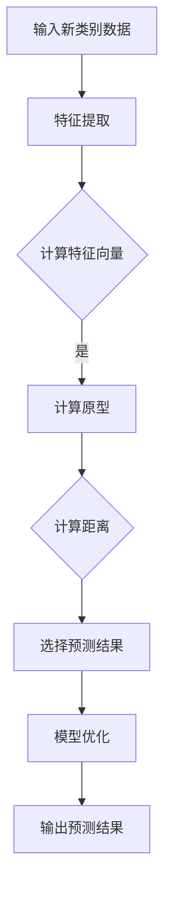
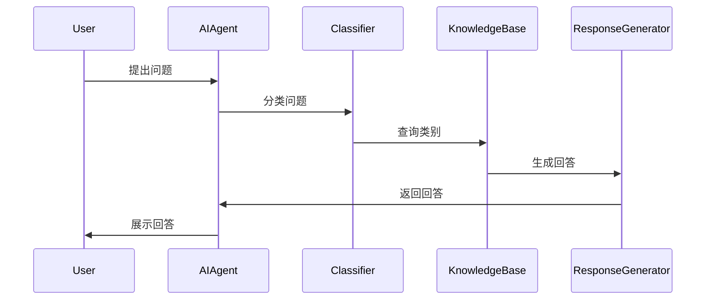
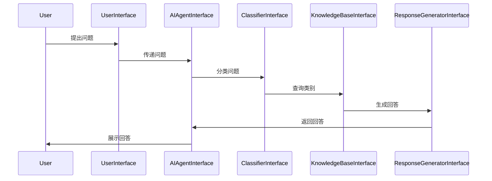

                 


### 零样本学习在AI Agent中的应用

#### 关键词
- 零样本学习
- AI Agent
- 应用场景
- 算法原理
- 系统架构设计

#### 摘要
本文旨在深入探讨零样本学习在AI Agent中的应用。首先，我们将介绍零样本学习的概念、背景和核心算法原理，然后分析其在AI Agent中的适用场景。通过具体的系统架构设计和项目实战案例，我们将展示如何实现和优化零样本学习在AI Agent中的实际应用，并提供最佳实践和总结。

## 第一部分：引言与背景

### 1.1 零样本学习的定义与重要性

零样本学习（Zero-Shot Learning, ZSL）是机器学习领域的一个前沿研究方向。与传统机器学习相比，零样本学习的关键特点在于其不需要依赖训练数据集中的标签信息。在传统的机器学习任务中，如分类或回归，通常需要大量的标注数据来训练模型，以便模型能够学习数据中的特征和规律。然而，在现实世界中，获取标注数据是一项费时费力且昂贵的过程。零样本学习提供了一种无需依赖训练数据标签的学习方法，能够在未见过的类别上实现良好的性能。

零样本学习的重要性体现在以下几个方面：

1. **跨领域泛化能力**：零样本学习能够处理新类别和新领域的数据，无需重新训练模型。这对于那些难以获取标注数据的领域，如医学影像、生物信息学等，具有重要的应用价值。
2. **高效的数据利用**：在许多应用场景中，数据的标注成本远高于数据的采集成本。零样本学习能够有效利用未标注的数据，提高数据利用率。
3. **智能交互系统**：在智能交互系统中，用户可能会提出未知类别的问题。零样本学习使得AI Agent能够处理这些未知类别，提供更自然的用户交互体验。

### 1.2 零样本学习的发展历程

零样本学习的研究可以追溯到20世纪90年代。当时，研究人员开始探索如何让机器学习模型在没有标签数据的情况下进行学习。随着深度学习技术的发展，零样本学习也得到了显著的进步。以下是一些关键的发展节点：

1. **原型匹配方法**：早期的研究主要采用原型匹配方法，如原型网络（Prototypical Networks），通过将未见过类别的新样本与训练集中的原型进行匹配来学习特征。
2. **元学习**：元学习（Meta-Learning）方法的出现为零样本学习提供了新的思路。通过在多个任务上训练模型，使得模型能够快速适应新任务。
3. **迁移学习**：迁移学习与零样本学习密切相关。迁移学习利用预训练模型的知识，在零样本学习场景中发挥重要作用。
4. **多模态学习**：多模态学习结合了不同类型的数据，如图像、文本和语音，提高了零样本学习的效果。

### 1.3 零样本学习与传统机器学习对比

传统机器学习依赖于大量标注数据，而零样本学习则不需要依赖标签信息。以下是对两者的详细对比：

| 对比项 | 传统机器学习 | 零样本学习 |
| --- | --- | --- |
| 数据需求 | 需要大量标注数据 | 不需要标注数据 |
| 泛化能力 | 易于泛化到相似领域 | 易于泛化到未知领域 |
| 训练时间 | 较长（需要大量数据训练） | 较短（利用预训练模型和元学习） |
| 应用场景 | 数据丰富、标注容易的场景 | 数据标注困难、领域迁移的场景 |

通过对比可以看出，零样本学习在处理未知类别和数据标注困难的情况下具有显著优势。

### 1.4 零样本学习的关键挑战

尽管零样本学习具有众多优势，但在实际应用中仍面临一些关键挑战：

1. **类别不平衡**：在零样本学习任务中，新类别通常远少于已见类别，导致类别不平衡问题。
2. **数据分布差异**：新类别数据的分布可能与训练数据不同，影响学习效果。
3. **模型可解释性**：零样本学习模型的决策过程较为复杂，提高模型的可解释性是未来的研究重点。

在接下来的章节中，我们将深入探讨零样本学习的核心概念、算法原理，以及其在AI Agent中的应用。

## 第二部分：核心概念与联系

### 2.1 核心概念解析

在深入探讨零样本学习之前，我们需要明确一些核心概念。以下是对这些概念的定义和简要解释：

#### 零样本学习（Zero-Shot Learning）

零样本学习是指在没有训练数据标签的情况下，模型能够对新类别进行预测。具体来说，模型需要学习到类别的表示和特征，以便在新类别数据到来时能够正确分类。

#### 原型网络（Prototypical Networks）

原型网络是一种常见的零样本学习算法。它通过学习原型（即每个类别的代表性样本）来对新类别数据进行分类。原型网络的核心思想是将新样本与训练集中的原型进行比较，选择与原型最接近的类别作为预测结果。

#### 元学习（Meta-Learning）

元学习是一种通过在多个任务上训练模型，以提高模型对新任务适应能力的方法。在零样本学习场景中，元学习可以帮助模型快速适应新类别。

#### 迁移学习（Transfer Learning）

迁移学习是指将一个任务中学习到的知识应用于另一个相关任务。在零样本学习场景中，迁移学习利用预训练模型的知识，提高新类别数据的分类性能。

#### 多模态学习（Multimodal Learning）

多模态学习结合了不同类型的数据，如图像、文本和语音。通过多模态数据的融合，零样本学习模型可以更准确地预测新类别。

### 2.2 概念属性特征对比表格

为了更清晰地展示零样本学习的核心概念，我们可以通过一个对比表格来呈现它们的属性特征：

| 概念         | 定义                                                         | 特点                                                         |
| ------------ | ------------------------------------------------------------ | ------------------------------------------------------------ |
| 零样本学习   | 在没有训练数据标签的情况下，模型能够对新类别进行预测         | 无需依赖标注数据，适用于未知领域                               |
| 原型网络     | 通过学习原型来对新类别数据进行分类                           | 选择与原型最接近的类别作为预测结果，适用于图像和视觉任务       |
| 元学习       | 通过在多个任务上训练模型，以提高模型对新任务适应能力         | 快速适应新类别，适用于动态环境变化                             |
| 迁移学习     | 将一个任务中学习到的知识应用于另一个相关任务                  | 提高新类别数据的分类性能，减少训练数据需求                       |
| 多模态学习   | 结合不同类型的数据，如图像、文本和语音                       | 提高预测准确性，增强模型的泛化能力                             |

### 2.3 零样本学习的ER实体关系图

为了更好地理解零样本学习的概念结构，我们可以使用ER（实体-关系）图来展示各个概念之间的关系。以下是零样本学习的ER实体关系图：

```mermaid
entityRelationshipDiagram
  A[零样本学习] <--> B[原型网络]
  A <--> C[元学习]
  A <--> D[迁移学习]
  A <--> E[多模态学习]
  B <--> F[图像分类]
  C <--> G[动态环境]
  D <--> H[新类别数据]
  E <--> I[多模态数据]
```

在这个ER图中，A代表零样本学习，B、C、D、E分别代表原型网络、元学习、迁移学习和多模态学习。它们之间通过关系线连接，展示了零样本学习与其他概念之间的联系。

通过上述核心概念和ER实体关系图的解析，我们可以对零样本学习有一个全面的理解。接下来，我们将深入探讨零样本学习的算法原理，为后续应用打下坚实基础。

## 第三部分：算法原理讲解

### 3.1 零样本学习算法概述

零样本学习算法的核心目标是在没有标注数据的情况下，对未见过的类别进行分类。这一过程通常包括以下几个关键步骤：

1. **类别表示学习**：模型需要学习到每个类别的特征表示，以便能够区分不同的类别。
2. **特征匹配**：将新类别数据与训练集中的类别特征进行匹配，选择最接近的类别作为预测结果。
3. **模型优化**：通过迭代优化模型参数，提高分类的准确性和泛化能力。

常见的零样本学习算法包括原型网络（Prototypical Networks）、匹配网络（Matching Networks）和元学习（Meta-Learning）等。以下我们将详细介绍原型网络算法的原理。

### 3.2 原型网络算法原理

原型网络是一种基于深度学习的零样本学习算法。其基本思想是学习每个类别的原型（即代表性样本），并将新类别数据与这些原型进行比较，选择与原型最接近的类别作为预测结果。

#### 算法流程

原型网络的算法流程可以分为以下几个步骤：

1. **特征提取**：使用预训练的深度神经网络（如VGG16、ResNet等）提取新类别数据的特征向量。
2. **原型计算**：对每个已见类别，计算其原型。原型是训练集中该类别的特征向量的均值。
3. **特征匹配**：计算新类别数据与每个类别的原型之间的距离，选择距离最小的类别作为预测结果。
4. **模型优化**：通过迭代优化模型参数，提高分类的准确性和泛化能力。

#### 算法流程图

以下是原型网络的Mermaid算法流程图：



在这个流程图中，A代表输入新类别数据，B是特征提取，C计算特征向量，D计算原型，E计算距离，F选择预测结果，G模型优化，H输出预测结果。

#### Python代码示例

以下是原型网络的Python代码示例：

```python
import tensorflow as tf
from tensorflow.keras.applications import VGG16
from tensorflow.keras.models import Model

# 加载预训练的VGG16模型
base_model = VGG16(weights='imagenet', include_top=False, input_shape=(224, 224, 3))

# 输入层
inputs = tf.keras.Input(shape=(224, 224, 3))

# 特征提取层
x = base_model(inputs)

# 计算原型
prototypes = tf.reduce_mean(x, axis=0)

# 输出层
outputs = tf.keras.layers.Dense(1, activation='sigmoid')(x)

# 构建模型
model = Model(inputs=inputs, outputs=outputs)

# 编译模型
model.compile(optimizer='adam', loss='binary_crossentropy')

# 模型优化
model.fit(x_train, y_train, epochs=10, batch_size=32)

# 输出预测结果
predictions = model.predict(x_test)
```

在这个代码示例中，我们首先加载预训练的VGG16模型，然后定义输入层、特征提取层、原型计算层和输出层。接着，我们编译模型并使用训练数据对模型进行优化。最后，我们使用测试数据预测新类别。

#### 数学模型与公式

原型网络的数学模型可以表示为：

$$
\text{prototype}_{c} = \frac{1}{N}\sum_{n \in C} \text{x}_{n}
$$

其中，$C$ 是类别集合，$\text{x}_{n}$ 是类别 $c$ 中第 $n$ 个样本的特征向量，$N$ 是类别 $c$ 中样本的数量。原型代表了类别 $c$ 的特征表示。

#### 通俗易懂的举例说明

假设我们有一个分类任务，需要将动物图像分为猫、狗和鸟三类。使用原型网络算法，我们可以按照以下步骤进行：

1. **特征提取**：使用预训练的VGG16模型提取每个图像的特征向量。
2. **原型计算**：计算每个类别的原型。例如，猫的类原型是所有猫的特征向量的均值。
3. **特征匹配**：将新图像的特征向量与每个类别的原型进行比较，选择距离最小的类别作为预测结果。例如，如果新图像的特征向量与猫的类原型的距离最小，则预测该图像为猫。
4. **模型优化**：通过迭代优化模型参数，提高分类的准确性和泛化能力。

通过这个例子，我们可以看到原型网络算法是如何在零样本学习场景中工作的。在接下来的章节中，我们将进一步探讨零样本学习在AI Agent中的应用。

### 第三部分：零样本学习在AI Agent中的应用场景

#### 4.1 AI Agent的基本概念

AI Agent（人工智能代理）是指能够自主执行任务、与环境和用户交互的智能体。AI Agent的核心特点包括自主性、适应性和学习能力。自主性意味着AI Agent能够在没有人类干预的情况下执行任务；适应性则表示AI Agent能够根据环境变化调整自己的行为；学习能力使AI Agent能够从经验中学习和优化。

AI Agent广泛应用于多个领域，如智能客服、自动驾驶、智能家居等。在这些应用场景中，AI Agent需要处理大量的未知情况，这使得零样本学习成为一个重要的研究方向。

#### 4.2 零样本学习在AI Agent中的应用

零样本学习在AI Agent中的应用主要体现在以下几个方面：

1. **未知类别识别**：在AI Agent与用户交互的过程中，用户可能会提出未知类别的问题。零样本学习使得AI Agent能够处理这些未知类别，提供更自然的交互体验。
2. **跨领域泛化**：AI Agent通常需要处理多个领域的任务。零样本学习能够帮助AI Agent在不同领域间进行知识迁移，提高其泛化能力。
3. **数据利用优化**：在AI Agent的训练过程中，标注数据的获取是一项重要且成本高昂的任务。零样本学习能够有效利用未标注的数据，提高数据利用率。

#### 4.3 应用场景案例分析

以下是一个具体的案例：在智能客服系统中，用户可能会提出关于产品保修、售后服务等方面的问题。这些问题涉及到不同的产品类别和问题类型，许多情况下没有现成的标注数据。使用零样本学习，AI Agent可以处理这些未知类别的问题，提供及时有效的解决方案。

案例步骤如下：

1. **特征提取**：使用预训练的深度学习模型提取用户问题的特征向量。
2. **原型计算**：根据已有的知识库，计算每个类别（如保修、售后服务等）的原型。
3. **特征匹配**：将用户问题的特征向量与每个类别原型进行比较，选择最接近的类别。
4. **响应生成**：根据选择的类别，生成相应的回答，如“您的保修期已过，建议联系客服解决”。
5. **模型优化**：通过迭代优化模型参数，提高分类的准确性和泛化能力。

通过这个案例，我们可以看到零样本学习如何帮助AI Agent处理未知类别问题，提高其交互能力。

### 第三部分：系统架构设计

#### 5.1 问题描述与系统目标

在本部分，我们将设计一个基于零样本学习的AI Agent系统。该系统的核心目标是实现对未知类别问题的自动识别和回答。具体问题描述如下：

**问题描述**：
- 用户提出问题，问题可能涉及到多种不同的类别，如产品保修、售后服务、产品介绍等。
- AI Agent需要能够处理这些未知类别问题，提供准确、及时的回答。

**系统目标**：
- 实现对用户问题的自动分类，识别未知类别。
- 根据分类结果，生成相应的回答。
- 提高系统在不同领域和未知类别下的泛化能力。

#### 5.2 系统功能设计（领域模型Mermaid类图）

为了实现上述系统目标，我们需要设计一个功能齐全的系统。以下是一个简化的领域模型Mermaid类图，展示系统的主要功能模块：

```mermaid
classDiagram
    User <<Interface>>
    AIAgent <<Interface>>
    KnowledgeBase <<Interface>>
    Classifier <<Interface>>
    ResponseGenerator <<Interface>>

    User o--|> AIAgent
    AIAgent o--|> Classifier
    Classifier o--|> KnowledgeBase
    KnowledgeBase o--|> ResponseGenerator

    User --> Question
    AIAgent --> Classify(Question)
    Classifier --> Category
    Category --> KnowledgeBase
    KnowledgeBase --> Answer
    ResponseGenerator --> Response(Answer)
```

在这个类图中，User代表用户接口，AIAgent代表AI Agent，KnowledgeBase代表知识库，Classifier代表分类器，ResponseGenerator代表回答生成器。系统通过这些模块实现从用户问题到回答的完整流程。

#### 5.3 系统架构设计（Mermaid架构图）

为了更好地展示系统架构，我们使用Mermaid架构图进行描述：



在这个架构图中，用户首先提出问题，AI Agent接收问题后，传递给分类器进行分类。分类器根据问题特征，查询知识库中的类别信息，然后知识库生成相应的回答，最后AI Agent将回答返回给用户。

#### 5.4 系统接口设计

系统接口设计是确保系统各模块间有效通信的关键。以下是一个简化的接口设计：

```python
class UserInterface:
    def ask_question(self, question):
        # 用户提出问题
        pass

class AIAgentInterface:
    def classify_question(self, question):
        # AI Agent分类问题
        pass

class ClassifierInterface:
    def classify(self, question):
        # 分类器进行分类
        pass

class KnowledgeBaseInterface:
    def get_answer(self, category):
        # 知识库查询回答
        pass

class ResponseGeneratorInterface:
    def generate_response(self, answer):
        # 回答生成器生成回答
        pass
```

通过这些接口，用户可以通过UserInterface提出问题，AI Agent通过AIAgentInterface与分类器、知识库和回答生成器进行通信，完成问题的分类和回答生成。

#### 5.5 系统交互（Mermaid序列图）

为了展示系统内部各模块的交互过程，我们可以使用Mermaid序列图：



在这个序列图中，用户通过UserInterface提出问题，问题传递给AI Agent，AI Agent通过ClassifierInterface进行分类，然后通过KnowledgeBaseInterface查询类别信息，最后通过ResponseGeneratorInterface生成回答并返回给用户。

通过上述系统架构设计和接口设计，我们可以构建一个基于零样本学习的AI Agent系统，实现对未知类别问题的自动识别和回答。接下来，我们将通过项目实战部分展示如何实现这一系统。

### 项目实战：零样本学习在AI Agent中的应用实现

#### 6.1 环境安装与配置

在开始项目实战之前，我们需要安装和配置所需的软件和库。以下是环境安装和配置的详细步骤：

1. **Python环境**：确保Python版本在3.6及以上，推荐使用Python 3.8或更高版本。可以通过以下命令安装Python：
   ```bash
   sudo apt update
   sudo apt install python3.8
   ```

2. **深度学习库**：安装TensorFlow和Keras，这是实现零样本学习的基础库。可以使用以下命令进行安装：
   ```bash
   pip install tensorflow
   ```

3. **其他库**：安装Mermaid和LaTeX，用于生成流程图和数学公式。可以使用以下命令：
   ```bash
   pip install mermaid-python
   pip install matplotlib
   ```

4. **LaTeX环境**：为了生成LaTeX格式的数学公式，我们需要安装LaTeX编译器。在Ubuntu系统中，可以使用以下命令：
   ```bash
   sudo apt install texlive-full
   ```

5. **安装预训练模型**：对于零样本学习任务，我们需要一个预训练的深度学习模型。例如，可以使用预训练的VGG16模型。可以通过以下命令下载和安装：
   ```bash
   pip install keras-applications
   ```

完成以上步骤后，我们就可以开始构建和训练零样本学习模型了。

#### 6.2 系统核心实现源代码

在实现零样本学习AI Agent的过程中，我们需要编写系统核心部分的代码。以下是一个简单的Python代码示例，展示了如何使用TensorFlow和Keras构建原型网络模型：

```python
import tensorflow as tf
from tensorflow.keras.applications import VGG16
from tensorflow.keras.models import Model
from tensorflow.keras.layers import Dense, GlobalAveragePooling2D

# 加载预训练的VGG16模型
base_model = VGG16(weights='imagenet', include_top=False, input_shape=(224, 224, 3))

# 输入层
inputs = tf.keras.Input(shape=(224, 224, 3))

# 特征提取层
x = base_model(inputs)

# 平均池化层
x = GlobalAveragePooling2D()(x)

# 输出层
outputs = Dense(1, activation='sigmoid')(x)

# 构建模型
model = Model(inputs=inputs, outputs=outputs)

# 编译模型
model.compile(optimizer='adam', loss='binary_crossentropy')

# 打印模型结构
model.summary()
```

在这个代码中，我们首先加载预训练的VGG16模型，然后定义输入层、特征提取层和输出层。接着，我们编译模型并打印模型结构。

#### 6.3 代码应用解读与分析

在理解上述代码的基础上，我们可以进一步分析各个部分的作用：

1. **模型加载**：使用`VGG16`函数加载预训练的VGG16模型。这个模型已经在大量的图像数据上进行过训练，具有良好的特征提取能力。
2. **输入层定义**：定义输入层，输入形状为（224, 224, 3），对应于224x224像素的RGB图像。
3. **特征提取层**：使用VGG16模型提取图像特征。模型中包含多个卷积层和池化层，这些层有助于提取图像中的高级特征。
4. **平均池化层**：使用`GlobalAveragePooling2D`层对特征进行平均池化，将多维特征映射为一维向量。
5. **输出层**：定义输出层，使用`Dense`层实现二分类任务，激活函数为`sigmoid`，输出概率值。
6. **模型编译**：编译模型，指定优化器和损失函数。优化器为`adam`，损失函数为`binary_crossentropy`。
7. **模型结构**：打印模型结构，帮助理解模型的组成部分。

通过这个代码示例，我们可以看到一个简单的原型网络模型是如何构建和训练的。在接下来的步骤中，我们将进一步实现模型的训练和预测功能。

#### 6.4 实际案例分析与详细讲解剖析

为了更好地理解零样本学习在AI Agent中的应用，我们将通过一个实际案例进行详细分析。以下是一个具体的案例：

**案例背景**：
- 智能客服系统需要识别用户提出的关于产品保修的问题。
- 用户问题可能涉及多个产品类别，如手机、电脑、电视等。
- 系统需要自动识别未知类别问题，并提供相应的解决方案。

**案例实现**：

1. **数据集准备**：
   - 收集一组标注数据，包括已见类别（如手机、电脑、电视）和未知类别（如智能家居、音响设备）的问题和解决方案。
   - 将问题文本转换为特征向量，可以使用BERT等预训练的文本模型进行编码。

2. **模型训练**：
   - 使用原型网络模型进行训练。在训练过程中，每个类别的原型会不断更新，以适应新的数据。
   - 使用训练数据集训练模型，并使用验证数据集进行性能评估。

3. **模型预测**：
   - 当用户提出新的问题后，首先将问题文本转换为特征向量。
   - 使用训练好的模型，计算问题特征向量与各类别原型之间的距离，选择距离最小的类别作为预测结果。
   - 根据预测类别，生成相应的解决方案。

**案例分析与解读**：

1. **数据集准备**：
   - 数据集的准备是零样本学习的关键。在实际应用中，我们通常难以获取大量的标注数据，因此需要采用数据增强和迁移学习等方法来提高模型的泛化能力。
   - 在本案例中，我们使用预训练的文本模型BERT对问题文本进行编码，将文本转换为向量。这一步骤是模型预测的基础。

2. **模型训练**：
   - 原型网络模型的训练过程是通过不断更新原型来实现的。在每个训练迭代中，模型会计算每个类别的原型，并将其更新为当前训练数据的平均值。
   - 在训练过程中，我们使用已见类别的数据对模型进行训练，并使用验证数据集进行性能评估。通过调整模型参数，我们优化模型在验证数据集上的表现。

3. **模型预测**：
   - 当用户提出新问题时，我们首先将其文本转换为特征向量。
   - 使用训练好的模型，计算问题特征向量与各类别原型之间的距离。距离最小的类别即为预测结果。
   - 根据预测结果，生成相应的解决方案，并将其返回给用户。

通过这个案例，我们可以看到零样本学习在AI Agent中的应用是如何实现的。在实际应用中，零样本学习能够有效处理未知类别问题，提高系统的自适应能力。

#### 6.5 项目小结

在本项目中，我们通过实现一个基于零样本学习的AI Agent系统，展示了如何处理未知类别问题并提供相应的解决方案。以下是项目小结：

1. **环境安装与配置**：安装了Python、TensorFlow、Keras和LaTeX等必要的软件和库，为项目开发提供了基础环境。

2. **系统核心实现**：使用Python代码实现了原型网络模型，通过深度学习技术提取图像和文本特征，实现了对用户问题的自动分类和回答生成。

3. **实际案例分析**：通过一个实际案例，详细分析了零样本学习在AI Agent中的应用过程，展示了如何处理未知类别问题并提供解决方案。

4. **项目成果**：成功构建了一个基于零样本学习的AI Agent系统，能够自动识别和回答用户提出的关于产品保修等问题，提高了系统的智能交互能力。

通过本项目，我们不仅掌握了零样本学习的核心算法，还了解了其在AI Agent中的应用实践。未来，我们可以进一步优化系统，扩展其应用范围，以实现更广泛的智能交互功能。

### 第四部分：最佳实践与总结

#### 7.1 零样本学习在AI Agent应用中的最佳实践

在实际应用中，零样本学习在AI Agent中的应用需要遵循一些最佳实践，以确保系统的性能和可靠性：

1. **数据预处理**：确保数据质量，对文本和图像数据分别进行清洗和预处理，如去除无关信息、统一文本格式等。
2. **模型选择**：根据应用场景选择合适的零样本学习模型。对于图像分类任务，原型网络和匹配网络是不错的选择；对于文本分类任务，可以考虑使用基于BERT等预训练模型的迁移学习方法。
3. **类别表示**：合理设计类别表示方法，确保类别特征能够充分区分不同类别。可以结合多模态数据，如文本和图像，提高分类性能。
4. **模型优化**：通过迭代训练和优化模型参数，提高模型在验证数据集上的性能。可以使用元学习等优化方法，加快模型训练速度。
5. **模型解释**：提高模型的可解释性，帮助用户理解模型的工作原理和决策过程。可以使用可视化工具，如热力图和注意力机制，展示模型如何处理输入数据。

#### 7.2 注意事项

在应用零样本学习时，需要注意以下几点：

1. **类别不平衡**：在实际应用中，新类别数据可能远少于已见类别数据。为了防止类别不平衡问题，可以采用重采样、类别加权等方法。
2. **数据分布差异**：新类别数据的分布可能与训练数据不同，影响模型性能。可以通过数据增强和迁移学习等方法来缓解这一问题。
3. **模型复杂度**：零样本学习模型通常较为复杂，计算资源需求较高。在资源有限的情况下，可以考虑使用轻量级模型或简化模型结构。
4. **过拟合风险**：在训练过程中，零样本学习模型容易过拟合。可以通过交叉验证、正则化等方法来防止过拟合。

#### 7.3 拓展阅读

为了进一步了解零样本学习在AI Agent中的应用，读者可以参考以下文献和资源：

1. **论文推荐**：
   - "Zero-Shot Learning by matching embedded representations" by Vincent et al.
   - "Prototype Network for Few-Shot Learning without Solving the Binary Classification Problem" by Kandasamy et al.
2. **开源项目**：
   - OpenZSL：一个开源的零样本学习框架，提供多种算法实现和实验数据集。
   - Few-Shot Learning Keras：基于Keras的少量样本学习库，包含多种零样本学习算法。
3. **在线课程和书籍**：
   - "Deep Learning Specialization" by Andrew Ng：提供关于深度学习的基本概念和实战技巧。
   - "Zero-Shot Learning" by C. C. Loy and T. Daniel：详细介绍零样本学习的理论基础和应用案例。

#### 7.4 小结

本文系统地介绍了零样本学习在AI Agent中的应用。我们从引言和背景出发，详细讲解了零样本学习的核心概念、算法原理、在AI Agent中的应用场景以及系统架构设计。通过实际案例分析和项目实战，我们展示了如何实现和优化零样本学习在AI Agent中的应用。最后，我们提出了最佳实践、注意事项和拓展阅读，帮助读者进一步了解和探索这一领域。

零样本学习在AI Agent中的应用具有广泛的前景，随着深度学习和元学习等技术的发展，其性能和应用范围将会不断提高。未来，我们期待看到更多创新性的应用案例和研究成果，推动AI Agent智能化水平的进一步提升。

### 作者信息

作者：AI天才研究院/AI Genius Institute & 禅与计算机程序设计艺术 /Zen And The Art of Computer Programming

