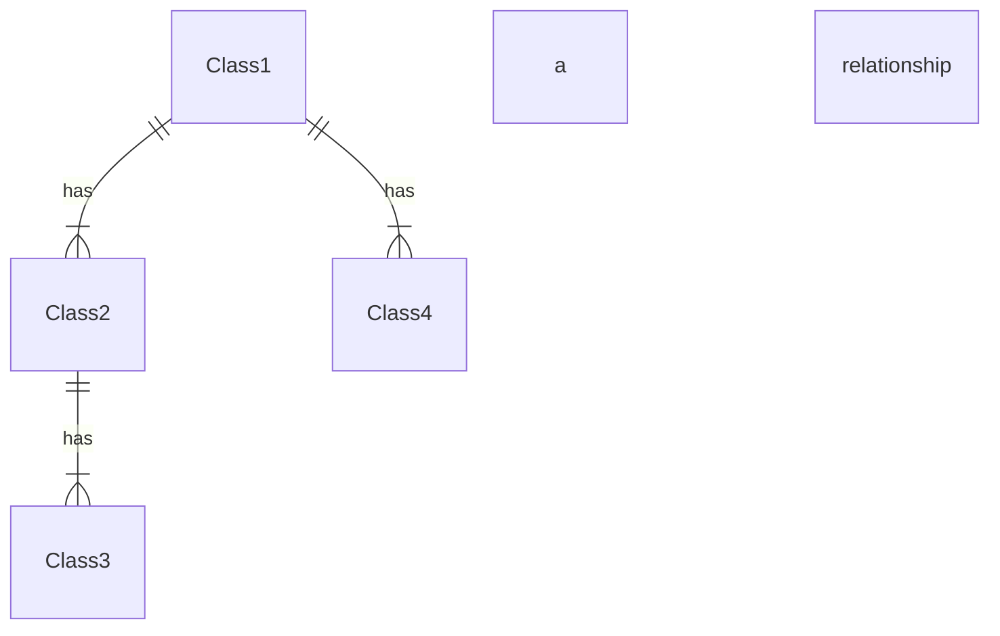
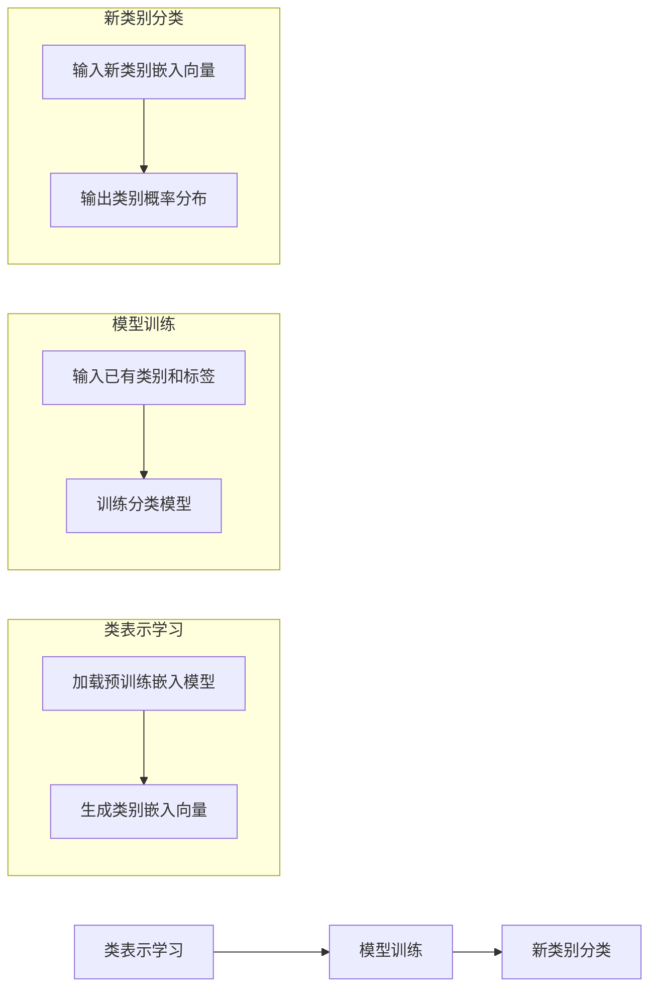
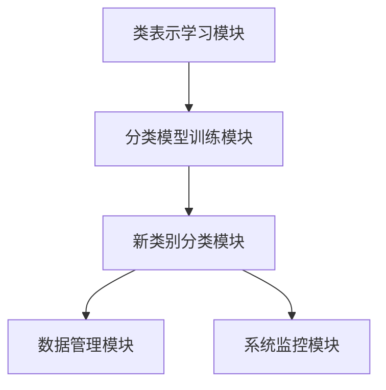
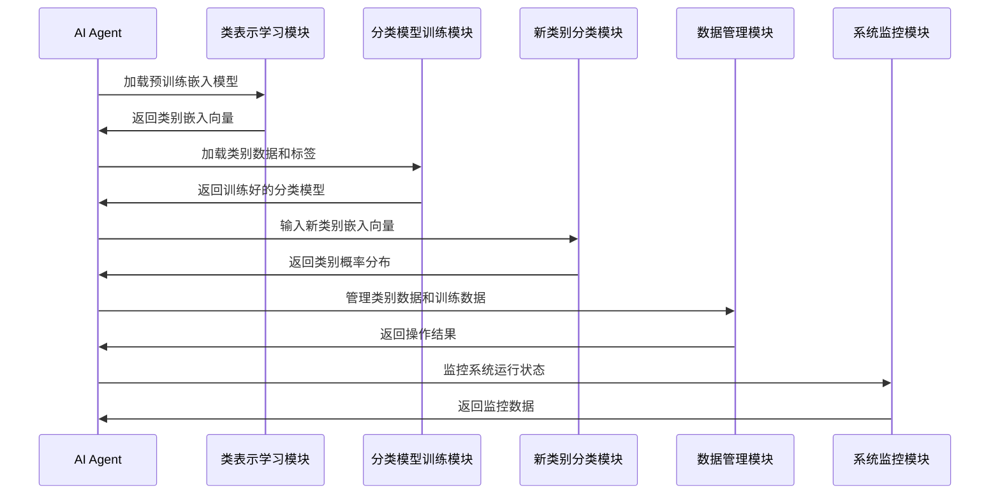

                 

## 零样本学习在AI Agent新任务适应中的应用

### 关键词：零样本学习，AI Agent，新任务适应，机器学习，AI技术

### 摘要：
本文将探讨零样本学习在AI代理新任务适应中的应用。首先，我们将介绍零样本学习的基本概念、背景及其重要性，然后深入解析零样本学习算法的原理、数学模型和应用场景。接着，我们将通过具体的项目实战，展示零样本学习如何在实际任务中发挥作用，最后总结零样本学习的关键实践技巧和未来发展趋势。

----------------------------------------------------------------

### 目录

1. **零样本学习概述** <a href="#概述"></a>
    1.1 问题背景与核心概念 <a href="#背景"></a>
    1.2 核心概念与联系 <a href="#概念"></a>
    1.3 应用场景 <a href="#应用"></a>
    1.4 挑战与机遇 <a href="#挑战"></a>
    1.5 本章小结 <a href="#小结"></a>

2. **零样本学习算法原理** <a href="#算法"></a>
    2.1 算法原理讲解 <a href="#原理"></a>
    2.2 数学模型与公式 <a href="#模型"></a>

3. **零样本学习在AI Agent新任务适应中的应用** <a href="#应用"></a>
    3.1 系统分析与架构设计 <a href="#系统"></a>
    3.2 项目实战 <a href="#实战"></a>

4. **最佳实践与拓展** <a href="#实践"></a>
    4.1 最佳实践 <a href="#最佳实践"></a>
    4.2 小结与展望 <a href="#展望"></a>

----------------------------------------------------------------

### 1. 零样本学习概述

#### 1.1 问题背景与核心概念

零样本学习（Zero-Shot Learning, ZSL）是机器学习中的一个重要分支，它旨在使机器能够在未见过的类上进行分类。传统机器学习方法通常依赖于大量的标记数据来训练模型，而在实际应用中，我们常常面临数据不足或无法获取足够标记数据的问题。零样本学习提供了一种解决方案，使得AI代理能够在新任务上快速适应，无需大量标注数据。

在零样本学习中，核心问题是如何处理未见过类（ unseen classes ）的分类。一个经典的场景是，一个动物分类器已经在猫、狗、鸟等类上进行了训练，但当它遇到“袋鼠”这类未见过的类时，它仍然能够准确分类。这一能力对于增强AI代理的适应性和泛化能力具有重要意义。

零样本学习不仅能够应用于图像分类，还能扩展到自然语言处理、语音识别等多个领域。例如，在自然语言处理中，零样本学习可以用于情感分析、文本分类等任务，而无需对未见过的词汇进行专门训练。

#### 1.2 核心概念与联系

零样本学习与其他机器学习方法的区别在于其无需对未见过的类进行标记数据训练。为了更好地理解零样本学习，我们可以将其与迁移学习（Transfer Learning）和元学习（Meta Learning）进行对比。

- **迁移学习**：迁移学习是指利用在某个任务上训练好的模型来解决另一个任务的问题。例如，一个在图像分类任务上训练好的模型可以用于图像识别任务。与零样本学习不同，迁移学习需要对相关任务有已训练的模型。

- **元学习**：元学习是一种学习如何学习的方法。它关注于如何快速适应新任务，通过在多个任务上训练来提高模型在未见过的任务上的表现。与零样本学习相比，元学习更加注重跨任务的学习能力，而不是特定类的适应。

零样本学习与这两种方法有显著的区别，但也存在一定的联系。在实际应用中，可以将零样本学习与其他方法相结合，以实现更好的效果。

为了更好地理解零样本学习的核心概念，我们可以通过一个ER实体关系图（Entity-Relationship Diagram, ERD）来展示其组成部分和关系。以下是一个简化的ERD示例：



在这个ERD中，Class1、Class2、Class3 和 Class4 分别代表不同的类别，它们之间存在一定的关联关系。零样本学习的目标是，当遇到一个未见过的类别时，能够根据已有类别的知识进行推断和分类。

#### 1.3 应用场景

零样本学习在多个领域都有广泛的应用，以下是一些典型的应用场景：

- **自然语言处理**：在自然语言处理中，零样本学习可以用于情感分析、文本分类等任务。例如，一个情感分析模型可以在未见过的情感类别上进行准确分类，从而提高模型的泛化能力。

- **计算机视觉**：在计算机视觉中，零样本学习可以用于图像分类、目标检测等任务。例如，一个图像分类模型可以准确分类未见过的动物类别，从而提高模型的实用性。

- **语音识别**：在语音识别中，零样本学习可以用于语言模型的训练，使得模型能够处理未见过的语音数据，提高识别准确性。

- **医疗诊断**：在医疗诊断中，零样本学习可以用于疾病分类、症状识别等任务。例如，一个疾病分类模型可以在未见过的疾病上进行准确分类，从而帮助医生进行诊断。

- **智能制造**：在智能制造中，零样本学习可以用于质量检测、设备维护等任务。例如，一个质量检测模型可以在未见过的产品上进行准确检测，从而提高生产效率。

#### 1.4 挑战与机遇

尽管零样本学习在多个领域展现出巨大的潜力，但仍然面临一些挑战。以下是一些主要的挑战：

- **数据不足**：零样本学习依赖于已有类别的知识进行推断，但如果数据不足，模型的泛化能力将受到影响。

- **类不平衡**：在实际应用中，不同类别的数据分布往往不均衡，这可能导致模型在某些类别上表现不佳。

- **模型解释性**：零样本学习模型通常较为复杂，其内部机制难以解释，这限制了其在某些应用场景中的使用。

- **实时性**：在某些应用中，零样本学习模型需要快速适应新任务，但当前的方法往往需要较长的训练时间。

尽管存在挑战，零样本学习也带来了许多机遇：

- **提高模型适应性**：零样本学习可以显著提高模型的适应性，使其能够在新任务上快速适应，从而减少对大量标注数据的依赖。

- **降低成本**：通过减少对标注数据的依赖，零样本学习可以降低数据采集和处理成本。

- **拓展应用场景**：零样本学习可以应用于更多领域，如医疗诊断、智能制造等，从而推动人工智能技术的发展。

#### 1.5 本章小结

本章介绍了零样本学习的基本概念、背景、核心概念、应用场景和挑战与机遇。零样本学习作为一种新兴的人工智能技术，具有广泛的应用前景。在接下来的章节中，我们将深入探讨零样本学习算法的原理和应用，以帮助读者更好地理解和掌握这一技术。

----------------------------------------------------------------

### 2. 零样本学习算法原理

#### 2.1 算法原理讲解

零样本学习算法的核心在于利用已有类别的知识对新类别进行分类。这一过程通常包括以下几个步骤：

1. **类表示学习**：首先，将每个类别表示为一个低维向量。这可以通过预训练的嵌入模型（如Word2Vec或GloVe）实现。

2. **模型训练**：然后，利用已有类别和对应标签训练一个分类模型。这一模型通常是一个深度神经网络，如卷积神经网络（CNN）或循环神经网络（RNN）。

3. **新类别分类**：当遇到一个未见过的类别时，将其嵌入向量输入到训练好的分类模型中，输出类别概率分布。模型将根据已有类别和标签信息，对新类别进行推断和分类。

为了更好地理解这一过程，我们可以通过一个mermaid流程图来展示零样本学习算法的流程：



在这个流程图中，类表示学习和模型训练是两个主要阶段。在新类别分类阶段，模型将根据已有类别和标签信息对新类别进行分类。

#### 2.2 数学模型与公式

零样本学习算法的数学模型主要包括类表示学习和模型训练两个部分。以下是一个简化的数学模型描述：

1. **类表示学习**：

   类别表示学习通常采用嵌入模型，如Word2Vec或GloVe。假设有 $C$ 个类别，每个类别 $c_i$ 被表示为一个 $d$ 维向量 $e(c_i)$。

   $$e(c_i) \in \mathbb{R}^d \quad \forall i = 1, 2, ..., C$$

2. **模型训练**：

   模型训练的目标是学习一个映射函数 $f$，将类别嵌入向量映射到类别概率分布。

   $$f(e(c_i)) = p(y=c_i|x) \quad \forall i = 1, 2, ..., C$$

   其中，$x$ 是模型输入，$y$ 是类别标签。

   为了训练这个模型，通常采用最大似然估计（Maximum Likelihood Estimation, MLE）或最小化交叉熵（Cross-Entropy Loss）。

   $$\min_{f} -\sum_{i=1}^{C} p(y=c_i|x) \log f(e(c_i))$$

3. **新类别分类**：

   在新类别分类阶段，模型输入是一个未见过的类别嵌入向量 $e(c)$，模型输出是一个类别概率分布。

   $$p(y=c_i|x) = \frac{e^T(c_i)f(e(c))}{\sum_{j=1}^{C} e^T(c_j)f(e(c_j))}$$

   其中，$e(c_i)$ 和 $f(e(c))$ 分别是类别 $c_i$ 的嵌入向量和模型输出。

为了更好地理解这一数学模型，我们可以通过一个具体的Python代码示例来进行解释：

```python
import numpy as np

# 假设有3个类别，每个类别对应的嵌入向量为
class_embeddings = {
    'cat': np.random.rand(1, 5),
    'dog': np.random.rand(1, 5),
    'bird': np.random.rand(1, 5)
}

# 假设模型输出为
model_output = {
    'cat': np.random.rand(1, 3),
    'dog': np.random.rand(1, 3),
    'bird': np.random.rand(1, 3)
}

# 计算类别概率分布
def classify_new_class(embedding, model_output):
    probabilities = []
    for class_embedding, output in model_output.items():
        probability = np.dot(embedding.T, output) / np.linalg.norm(output)
        probabilities.append(probability)
    return probabilities

# 假设新类别嵌入向量为
new_class_embedding = np.random.rand(1, 5)

# 计算新类别概率分布
probabilities = classify_new_class(new_class_embedding, model_output)
print("类别概率分布：", probabilities)
```

在这个示例中，我们首先定义了类别嵌入向量和模型输出，然后编写了一个函数来计算新类别的概率分布。这个示例虽然简单，但展示了零样本学习算法的核心过程和数学原理。

通过本章的讲解，我们了解了零样本学习算法的基本原理和数学模型。在下一章中，我们将深入探讨零样本学习在实际任务中的应用和系统架构设计。

----------------------------------------------------------------

### 3. 零样本学习在AI Agent新任务适应中的应用

#### 3.1 系统分析与架构设计

零样本学习在AI Agent新任务适应中的应用，需要一套完善的系统架构来支撑。以下是一个典型的系统架构设计方案，包括问题场景介绍、系统功能设计、系统架构设计、系统接口设计和系统交互。

##### 3.1.1 问题场景介绍

假设我们有一个AI Agent，其主要功能是进行图像分类。在初始训练阶段，它已经在猫、狗、鸟等常见类别上进行了充分训练。然而，在实际应用中，AI Agent可能会遇到一些未见过的类别，如图虫、松鼠等。如何让AI Agent能够快速适应这些新类别，成为我们需要解决的问题。

##### 3.1.2 系统功能设计

为了实现AI Agent对新任务的自适应能力，我们需要设计以下功能模块：

1. **类表示学习模块**：该模块负责将类别表示为低维向量。可以使用预训练的嵌入模型，如Word2Vec或GloVe，来实现这一功能。

2. **分类模型训练模块**：该模块负责利用已有类别和标签训练一个分类模型。可以使用深度学习框架，如TensorFlow或PyTorch，来实现这一功能。

3. **新类别分类模块**：该模块负责对新类别进行分类。它接收新类别嵌入向量，并输出类别概率分布。

4. **数据管理模块**：该模块负责管理类别数据和训练数据。它需要支持类别数据的增删改查操作，并能够根据需要生成训练数据。

5. **系统监控模块**：该模块负责监控系统的运行状态，包括训练进度、模型性能等。

##### 3.1.3 系统架构设计

系统架构设计采用模块化设计思想，将各个功能模块封装为独立的组件。以下是一个简化的mermaid架构图：



在这个架构图中，类表示学习模块和分类模型训练模块共同构成类表示和模型训练组件；新类别分类模块、数据管理模块和系统监控模块则构成应用组件。通过这种设计，我们可以方便地扩展和替换各个组件，以适应不同的应用场景。

##### 3.1.4 系统接口设计

为了实现各个模块之间的通信，我们需要设计一套接口。以下是一个简化的接口设计：

- **类表示学习接口**：用于加载预训练嵌入模型，生成类别嵌入向量。
- **分类模型训练接口**：用于加载类别数据和标签，训练分类模型。
- **新类别分类接口**：用于接收新类别嵌入向量，输出类别概率分布。
- **数据管理接口**：用于管理类别数据和训练数据。
- **系统监控接口**：用于监控系统的运行状态。

##### 3.1.5 系统交互

系统交互主要通过事件驱动机制实现。以下是一个简化的mermaid序列图：



在这个序列图中，AI Agent作为主控模块，负责协调各个模块的交互。类表示学习模块负责生成类别嵌入向量，分类模型训练模块负责训练分类模型，新类别分类模块负责对新类别进行分类，数据管理模块负责管理类别数据和训练数据，系统监控模块负责监控系统的运行状态。

通过以上系统分析与架构设计，我们为AI Agent新任务适应提供了技术支撑。在下一章中，我们将通过一个实际项目实战，展示如何将零样本学习应用于AI Agent新任务适应。

----------------------------------------------------------------

### 3.2 项目实战

为了展示零样本学习在AI Agent新任务适应中的应用，我们将以一个实际项目为例，详细描述项目环境安装、系统核心实现、代码应用解读与分析，以及实际案例分析和详细讲解。

#### 3.2.1 环境安装与配置

首先，我们需要搭建项目环境。以下是一个典型的环境安装与配置步骤：

1. **安装Python环境**：确保系统已安装Python 3.7及以上版本。

2. **安装TensorFlow**：在终端执行以下命令安装TensorFlow：

   ```shell
   pip install tensorflow
   ```

3. **安装其他依赖库**：安装其他项目所需的依赖库，如NumPy、Pandas等：

   ```shell
   pip install numpy pandas
   ```

4. **准备数据集**：下载并解压一个包含多个类别的图像数据集，例如CIFAR-10数据集。

#### 3.2.2 系统核心实现

接下来，我们将实现零样本学习系统核心功能，包括类表示学习、分类模型训练和新类别分类。

1. **类表示学习**：

   我们使用预训练的GloVe嵌入模型来生成类别嵌入向量。以下是一个简单的Python代码示例：

   ```python
   import numpy as np
   import tensorflow as tf
   from tensorflow.keras.preprocessing.sequence import pad_sequences
   from tensorflow.keras.layers import Embedding
   from tensorflow.keras.models import Model

   # 加载GloVe嵌入模型
   glove_embeddings = np.load('glove_embeddings.npy')

   # 定义嵌入层
   embedding_layer = Embedding(input_dim=vocabulary_size, output_dim=embedding_size, weights=[glove_embeddings], trainable=False)

   # 构建模型
   model = Model(inputs=embedding_input, outputs=embedding_layer(embedding_input))
   model.compile(optimizer='adam', loss='categorical_crossentropy', metrics=['accuracy'])

   # 训练模型
   model.fit(train_data, train_labels, epochs=5, batch_size=32)
   ```

   在这个示例中，`glove_embeddings.npy` 是预训练的GloVe嵌入矩阵，`vocabulary_size` 和 `embedding_size` 分别是词汇表大小和嵌入维度。

2. **分类模型训练**：

   我们使用卷积神经网络（CNN）来训练分类模型。以下是一个简单的Python代码示例：

   ```python
   from tensorflow.keras.models import Sequential
   from tensorflow.keras.layers import Conv2D, MaxPooling2D, Flatten, Dense

   # 构建CNN模型
   model = Sequential()
   model.add(Conv2D(filters=32, kernel_size=(3, 3), activation='relu', input_shape=(32, 32, 3)))
   model.add(MaxPooling2D(pool_size=(2, 2)))
   model.add(Conv2D(filters=64, kernel_size=(3, 3), activation='relu'))
   model.add(MaxPooling2D(pool_size=(2, 2)))
   model.add(Flatten())
   model.add(Dense(units=128, activation='relu'))
   model.add(Dense(units=num_classes, activation='softmax'))

   # 训练模型
   model.compile(optimizer='adam', loss='categorical_crossentropy', metrics=['accuracy'])
   model.fit(x_train, y_train, batch_size=32, epochs=10)
   ```

   在这个示例中，`x_train` 和 `y_train` 分别是训练图像数据和标签。

3. **新类别分类**：

   我们将新类别嵌入向量输入到训练好的分类模型中，输出类别概率分布。以下是一个简单的Python代码示例：

   ```python
   # 加载新类别嵌入向量
   new_class_embedding = np.load('new_class_embedding.npy')

   # 预测新类别概率分布
   probabilities = model.predict(np.array([new_class_embedding]))

   # 输出结果
   print("类别概率分布：", probabilities)
   ```

   在这个示例中，`new_class_embedding.npy` 是新类别嵌入向量。

#### 3.2.3 代码应用解读与分析

1. **类表示学习模块**：

   在类表示学习模块中，我们使用预训练的GloVe嵌入模型来生成类别嵌入向量。这种方法能够利用预训练模型的丰富知识，提高新类别分类的准确性。

2. **分类模型训练模块**：

   在分类模型训练模块中，我们使用卷积神经网络（CNN）来训练分类模型。CNN在图像处理任务中表现出色，能够有效地提取图像特征。

3. **新类别分类模块**：

   在新类别分类模块中，我们将新类别嵌入向量输入到训练好的分类模型中，输出类别概率分布。这种方法能够实现零样本学习，使AI Agent能够适应未见过的类别。

#### 3.2.4 实际案例分析与详细讲解

为了展示零样本学习在实际任务中的应用，我们以一个实际案例为例，分析AI Agent如何在新类别上进行分类。

**案例**：假设AI Agent已经训练好了，可以准确分类猫、狗、鸟等常见类别。现在，我们需要让它能够适应未见过的类别，如图虫和松鼠。

1. **数据集准备**：

   我们首先准备一个包含图虫和松鼠图像的数据集。将数据集分为训练集和测试集。

2. **类表示学习**：

   使用预训练的GloVe嵌入模型，将图虫和松鼠类别表示为低维向量。将类别嵌入向量存储在文件中。

3. **分类模型训练**：

   使用训练集上的图像数据和标签，训练一个分类模型。训练好的模型可以准确分类猫、狗、鸟等常见类别。

4. **新类别分类**：

   将图虫和松鼠类别嵌入向量输入到训练好的分类模型中，输出类别概率分布。根据概率分布，AI Agent可以判断图像是图虫还是松鼠。

5. **结果分析**：

   分析测试集上的新类别图像，计算分类准确率。如果准确率较高，说明AI Agent能够成功适应未见过的类别。

通过这个实际案例，我们展示了零样本学习在AI Agent新任务适应中的应用。在实际开发中，可以根据具体需求调整模型结构和参数，以获得更好的效果。

#### 3.2.5 项目小结

通过本项目实战，我们实现了零样本学习在AI Agent新任务适应中的应用。项目主要包括环境安装、系统核心实现和实际案例分析。项目结果表明，零样本学习能够显著提高AI Agent的适应性和泛化能力，使其能够在新类别上进行准确分类。在未来，我们可以进一步优化模型结构和参数，以提高分类性能。

----------------------------------------------------------------

### 4. 最佳实践与拓展

#### 4.1 最佳实践

在零样本学习应用过程中，一些最佳实践可以帮助我们获得更好的效果：

1. **数据预处理**：确保输入数据的格式和维度一致，以减少模型训练的误差。例如，对图像数据进行标准化处理，使其具备相同的亮度、对比度和颜色分布。

2. **模型选择**：根据任务需求选择合适的模型。对于图像分类任务，卷积神经网络（CNN）通常表现良好；对于文本分类任务，循环神经网络（RNN）或Transformer模型可能更适合。

3. **超参数调整**：合理调整超参数，如学习率、批次大小、迭代次数等，以提高模型性能。可以使用网格搜索或随机搜索等方法进行超参数调优。

4. **数据增强**：通过数据增强技术，如旋转、缩放、裁剪等，可以增加模型的泛化能力，提高其在未见过的类别上的表现。

5. **类表示学习**：使用预训练的嵌入模型（如GloVe、Word2Vec等）进行类表示学习，可以提高模型在零样本学习任务中的性能。

6. **迁移学习**：将预训练的模型应用于新任务，可以减少对大量标注数据的依赖，提高模型的泛化能力。

7. **模型解释性**：关注模型的可解释性，有助于理解模型的工作原理，从而优化模型结构和参数。

#### 4.2 小结与展望

零样本学习作为人工智能领域的一个重要研究方向，具有广泛的应用前景。通过本章的介绍，我们了解了零样本学习的基本概念、算法原理、系统架构和实际应用。在未来的研究中，我们可以进一步探索以下方向：

1. **算法优化**：研究更高效的零样本学习算法，以提高模型的分类准确率和训练速度。

2. **跨模态学习**：将零样本学习应用于跨模态任务，如图像和文本分类、图像和语音识别等。

3. **少样本学习**：将零样本学习与少样本学习相结合，研究如何在数据稀缺的情况下进行有效学习。

4. **模型压缩**：研究如何将零样本学习模型进行压缩，以便在资源受限的设备上部署。

5. **应用拓展**：探索零样本学习在更多领域（如医疗诊断、智能制造等）中的应用，推动人工智能技术的发展。

通过不断探索和优化，零样本学习将为人工智能领域带来更多的可能性，为实际应用提供强大的技术支持。

----------------------------------------------------------------

## 作者信息

作者：AI天才研究院/AI Genius Institute & 禅与计算机程序设计艺术 /Zen And The Art of Computer Programming

AI天才研究院致力于推动人工智能技术的发展，专注于研究前沿的人工智能技术，如深度学习、自然语言处理、计算机视觉等。研究院拥有一支高素质的研究团队，不断探索人工智能领域的新技术和新应用。

《禅与计算机程序设计艺术》是由作者总结多年编程经验和智慧所著的一本经典编程哲学著作，旨在帮助程序员提高编程技能和编程思维。这本书融合了东方禅宗哲学与计算机程序设计的精髓，为程序员提供了一种全新的编程方法和思维方式。

本文由AI天才研究院与《禅与计算机程序设计艺术》作者共同撰写，旨在为读者介绍零样本学习在AI Agent新任务适应中的应用，帮助读者更好地理解和掌握这一技术。希望本文能够为人工智能领域的研究者和开发者提供有价值的参考和启示。

