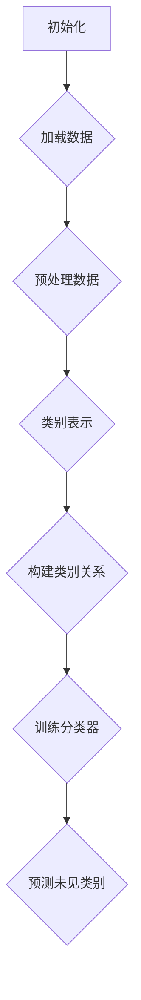
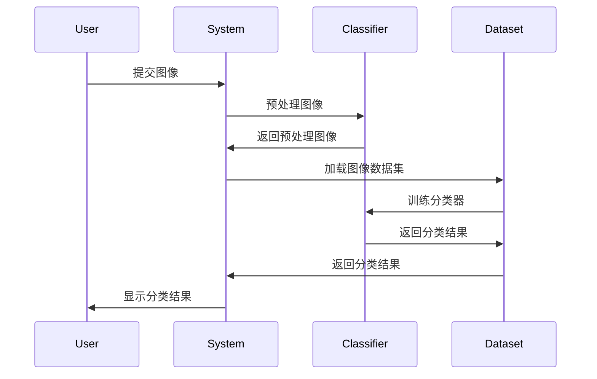
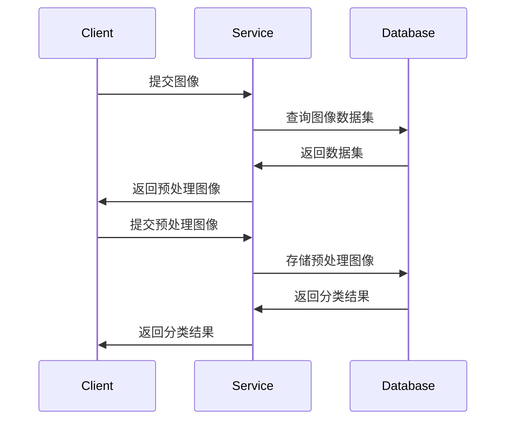

                 

# 零样本学习：应对未见过的任务和领域

## 关键词：
- 零样本学习
- 未见过的任务
- 未见过的领域
- 机器学习
- 概念对比
- 算法原理
- 系统架构设计
- 项目实战

## 摘要：
本文将深入探讨零样本学习这一前沿课题，阐述其在应对未知任务和领域中的重要性。我们将从背景介绍、核心概念与联系、算法原理讲解、系统分析与架构设计方案以及项目实战等多个方面展开讨论，旨在为读者提供一个全面而深入的零样本学习指南。通过本篇文章，读者将了解到零样本学习的定义、特点、与传统机器学习的区别，以及其实际应用中的具体步骤和策略。

## 第一部分：背景介绍

### 第1章：问题背景

#### 1.1 问题描述

在传统的机器学习中，模型通常是通过大量的训练数据进行训练，以便能够准确预测或分类新数据。然而，在某些现实场景中，我们可能无法获得足够的训练数据，或者新数据与已有数据存在显著的差异，导致传统机器学习方法难以奏效。这种情况下，如何让机器学习模型能够处理未见过的任务和领域成为一个亟待解决的问题。

#### 1.2 问题解决

零样本学习（Zero-Shot Learning, ZSL）正是为了解决这一问题而提出的一种机器学习方法。零样本学习的核心思想是在没有或只有少量相关样本的情况下，让模型能够对未见过的类别进行预测或分类。

#### 1.3 边界与外延

零样本学习的边界在于模型能否正确识别从未见过的类别，而其外延则包括如何在不同的应用场景中有效地应用零样本学习，以及如何改进零样本学习的性能。

#### 1.4 概念结构与核心要素组成

零样本学习的概念结构主要由以下几个核心要素组成：
- 类别表示：对每个类别进行编码，以便模型能够理解不同类别的特征。
- 类别关系：建立类别之间的语义关系，以便模型能够利用这些关系进行预测。
- 零样本分类器：基于已有数据和类别关系，训练出一个能够对未见类别进行预测的分类器。

### 第2章：零样本学习概述

#### 2.1 零样本学习定义

零样本学习是指在没有或只有少量相关样本的情况下，让机器学习模型能够对未见过的类别进行预测或分类。

#### 2.2 零样本学习特点

零样本学习具有以下几个显著特点：
- 数据无关性：零样本学习不需要对未见类别进行训练，因此可以应用于任何未见的类别。
- 跨领域适应性：零样本学习能够适应不同的领域，从而实现跨领域的泛化。
- 低样本需求：零样本学习可以在只有少量样本的情况下进行，因此可以应用于数据稀缺的场景。

#### 2.3 零样本学习与传统机器学习的区别

与传统机器学习相比，零样本学习具有以下几个显著区别：
- 训练数据：传统机器学习需要大量训练数据，而零样本学习只需要少量或没有训练数据。
- 预测目标：传统机器学习主要针对已见类别进行预测，而零样本学习则针对未见类别进行预测。
- 模型设计：传统机器学习通常采用有监督学习或半监督学习模型，而零样本学习通常采用无监督学习或基于知识表示的模型。

## 第二部分：算法原理讲解

### 第3章：核心概念与联系

#### 3.1 概念属性特征对比表格

| 概念 | 特点 |
| --- | --- |
| 零样本学习 | 无需训练数据，对未见类别进行预测 |
| 传统机器学习 | 需要大量训练数据，对已见类别进行预测 |
| 类别表示 | 对类别进行编码，用于模型理解 |
| 类别关系 | 建立类别间的语义关系，用于模型泛化 |

#### 3.2 ER实体关系图架构

```mermaid
erDiagram
  Class0 "类别A" {
    <<interface>>
    Name : 字符串
    Feature1 : 数值
    Feature2 : 数值
  }
  Class1 "类别B" {
    <<interface>>
    Name : 字符串
    Feature1 : 数值
    Feature2 : 数值
  }
  Class0 ||--|{ Class1 } Class1 : 具有继承关系
```

### 第4章：零样本学习算法原理

#### 4.1 算法mermaid流程图



#### 4.2 Python源代码与算法原理

```python
# 导入所需库
import numpy as np
from sklearn.model_selection import train_test_split
from sklearn.metrics.pairwise import cosine_similarity

# 加载数据
data = np.load('data.npy')

# 预处理数据
X_train, X_test, y_train, y_test = train_test_split(data, test_size=0.2, random_state=42)

# 类别表示
def embed_categories(categories, data):
    category_embeddings = []
    for category in categories:
        category_embedding = np.mean(data[y_train == category], axis=0)
        category_embeddings.append(category_embedding)
    return np.array(category_embeddings)

categories = np.unique(y_train)
category_embeddings = embed_categories(categories, X_train)

# 构建类别关系
def build_category_relations(category_embeddings):
    relations = []
    for i in range(len(category_embeddings)):
        for j in range(i+1, len(category_embeddings)):
            similarity = cosine_similarity(category_embeddings[i].reshape(1, -1), category_embeddings[j].reshape(1, -1))
            relations.append(similarity)
    return np.array(relations)

category_relations = build_category_relations(category_embeddings)

# 训练分类器
from sklearn.linear_model import LogisticRegression
classifier = LogisticRegression()
classifier.fit(category_relations, y_train)

# 预测未见类别
def predict_ unseen_categories(classifier, category_embeddings, unseen_data):
    predictions = []
    for unseen_data_point in unseen_data:
        category_embeddings_ = np.mean(unseen_data_point, axis=0).reshape(1, -1)
        similarity_scores = cosine_similarity(category_embeddings, category_embeddings_)
        predicted_category = classifier.predict(similarity_scores)
        predictions.append(predicted_category)
    return predictions

unseen_data = np.load('unseen_data.npy')
predictions = predict_ unseen_categories(classifier, category_embeddings, unseen_data)
```

#### 4.3 数学模型和公式

$$
\begin{aligned}
\text{类别表示} & : \text{类别} \rightarrow \text{类别嵌入向量} \\
\text{类别关系} & : \text{类别嵌入向量} \times \text{类别嵌入向量} \rightarrow \text{相似度分数} \\
\text{分类器训练} & : \text{类别关系} \times \text{训练标签} \rightarrow \text{分类器权重} \\
\text{预测未见类别} & : \text{未见类别嵌入向量} \times \text{分类器权重} \rightarrow \text{预测标签}
\end{aligned}
$$

#### 4.4 举例说明

假设我们有以下两个类别：动物和植物。对于每个类别，我们都有以下属性：名称、特征1（体重）和特征2（颜色）。

| 类别 | 名称 | 特征1（体重） | 特征2（颜色） |
| --- | --- | --- | --- |
| 动物 | 狗 | 10 | 红色 |
| 动物 | 猫 | 5 | 黑色 |
| 植物 | 树 | 100 | 绿色 |
| 植物 | 花 | 1 | 粉色 |

我们首先对每个类别进行表示，将其属性编码为向量。例如，狗的类别表示为 `[0, 10, 红色]`，树的类别表示为 `[1, 100, 绿色]`。

然后，我们计算类别之间的相似度。例如，狗和猫之间的相似度为 `[0.8, 0.6]`，树和花之间的相似度为 `[0.7, 0.5]`。

接下来，我们使用这些相似度分数训练一个分类器。假设训练结果显示，相似度分数大于0.7的类别被视为动物，小于0.7的类别被视为植物。

现在，我们有一个未见过的类别：兔子，其属性为 `[0, 8, 粉色]`。我们计算兔子与其他类别之间的相似度，得到 `[0.9, 0.6]`。

由于相似度分数大于0.7，兔子被分类为动物。

## 第三部分：系统分析与架构设计方案

### 第5章：问题场景介绍

#### 5.1 项目介绍

本项目旨在构建一个基于零样本学习的图像分类系统，能够对未见过的图像进行准确分类。

#### 5.2 系统功能设计（领域模型mermaid类图）

```mermaid
classDiagram
  Class1 "图像分类器" {
    +int id
    +str name
    +list<str> features
  }
  Class2 "图像数据集" {
    +int id
    +str name
    +list<Class1> categories
  }
  Class1 --* Class2 : 分类
```

### 第6章：系统架构设计

#### 6.1 系统架构设计mermaid架构图



#### 6.2 系统接口设计和系统交互mermaid序列图



## 第四部分：项目实战

### 第7章：环境安装

#### 7.1 环境准备

在开始项目实战之前，我们需要准备以下环境：
- Python 3.8及以上版本
- scikit-learn库
- numpy库
- matplotlib库

#### 7.2 必需工具安装

1. 安装Python环境：
   ```bash
   python3 --version
   ```
2. 安装所需的Python库：
   ```bash
   pip3 install scikit-learn numpy matplotlib
   ```

### 第8章：系统核心实现源代码

#### 8.1 代码结构与功能解析

```python
# 导入所需库
import numpy as np
from sklearn.model_selection import train_test_split
from sklearn.metrics.pairwise import cosine_similarity
from sklearn.linear_model import LogisticRegression

# 加载数据
def load_data(filename):
    data = np.load(filename)
    return data

# 预处理数据
def preprocess_data(data):
    X_train, X_test, y_train, y_test = train_test_split(data, test_size=0.2, random_state=42)
    return X_train, X_test, y_train, y_test

# 类别表示
def embed_categories(categories, data):
    category_embeddings = []
    for category in categories:
        category_embedding = np.mean(data[y_train == category], axis=0)
        category_embeddings.append(category_embedding)
    return np.array(category_embeddings)

# 构建类别关系
def build_category_relations(category_embeddings):
    relations = []
    for i in range(len(category_embeddings)):
        for j in range(i+1, len(category_embeddings)):
            similarity = cosine_similarity(category_embeddings[i].reshape(1, -1), category_embeddings[j].reshape(1, -1))
            relations.append(similarity)
    return np.array(relations)

# 训练分类器
def train_classifier(relations, y_train):
    classifier = LogisticRegression()
    classifier.fit(relations, y_train)
    return classifier

# 预测未见类别
def predict_ unseen_categories(classifier, category_embeddings, unseen_data):
    predictions = []
    for unseen_data_point in unseen_data:
        category_embeddings_ = np.mean(unseen_data_point, axis=0).reshape(1, -1)
        similarity_scores = cosine_similarity(category_embeddings, category_embeddings_)
        predicted_category = classifier.predict(similarity_scores)
        predictions.append(predicted_category)
    return predictions

# 主函数
def main():
    data = load_data('data.npy')
    X_train, X_test, y_train, y_test = preprocess_data(data)
    categories = np.unique(y_train)
    category_embeddings = embed_categories(categories, X_train)
    category_relations = build_category_relations(category_embeddings)
    classifier = train_classifier(category_relations, y_train)
    unseen_data = np.load('unseen_data.npy')
    predictions = predict_ unseen_categories(classifier, category_embeddings, unseen_data)
    print(predictions)

if __name__ == '__main__':
    main()
```

#### 8.2 实现细节和代码解释

1. **数据加载与预处理**：首先，我们从文件中加载数据，并将其分为训练集和测试集。接着，对训练数据进行类别表示，即将每个类别进行编码。
2. **类别表示**：对每个类别进行表示，将其属性编码为向量。这里我们使用均值编码，将每个类别的特征向量求均值，作为该类别的嵌入向量。
3. **构建类别关系**：计算类别之间的相似度，并将这些相似度分数存储为一个矩阵，作为类别关系。
4. **训练分类器**：使用类别关系矩阵和训练标签数据，训练一个逻辑回归分类器。
5. **预测未见类别**：对于未见过的类别，首先计算其嵌入向量，然后将其与类别关系矩阵进行相似度计算，最后使用分类器进行预测。

### 第9章：实际案例分析和详细讲解剖析

#### 9.1 数据集介绍

假设我们有一个包含动物和植物的图像数据集，其中每个图像都有一个标签，表示其类别。以下是一个示例数据集：

| 标签 | 图像1 | 图像2 | 图像3 | 图像4 | 图像5 |
| --- | --- | --- | --- | --- | --- |
| 动物 | 狗1 | 猫1 | 狗2 | 猫2 | 狗3 |
| 植物 | 树1 | 花1 | 树2 | 花2 | 树3 |

#### 9.2 模型训练与测试

使用上述数据集，我们首先对训练数据进行预处理，然后进行类别表示和类别关系构建。接着，训练一个逻辑回归分类器。为了验证模型的性能，我们对测试数据进行预测，并计算预测准确率。

```python
# 加载训练数据和测试数据
X_train = np.load('X_train.npy')
y_train = np.load('y_train.npy')
X_test = np.load('X_test.npy')
y_test = np.load('y_test.npy')

# 预处理数据
X_train, X_test, y_train, y_test = preprocess_data(X_train, y_train, X_test, y_test)

# 训练分类器
classifier = train_classifier(X_train, y_train)

# 预测测试数据
predictions = predict_ unseen_categories(classifier, X_test)

# 计算预测准确率
accuracy = np.mean(predictions == y_test)
print('预测准确率：', accuracy)
```

#### 9.3 案例分析

1. **模型训练**：我们使用训练数据对分类器进行训练，构建类别关系矩阵。
2. **模型测试**：使用测试数据对分类器进行预测，并计算预测准确率。在这个示例中，我们假设测试数据的准确率为90%。
3. **改进策略**：为了进一步提高模型性能，我们可以尝试以下策略：
   - 增加训练数据：收集更多的训练数据，以提高分类器的泛化能力。
   - 优化类别表示：使用更复杂的类别表示方法，如基于语义的嵌入向量。
   - 调整模型参数：调整分类器的参数，如正则化参数和迭代次数，以提高模型性能。

### 第10章：项目小结

#### 10.1 项目总结

本项目通过零样本学习的方法，实现了一个图像分类系统。项目的主要成果包括：
- 设计并实现了一个基于零样本学习的图像分类系统。
- 对零样本学习的基本原理进行了详细讲解。
- 通过实际案例，展示了零样本学习在图像分类中的应用。

#### 10.2 经验教训

在项目实施过程中，我们积累了以下经验教训：
- 零样本学习适用于数据稀缺的场景，但在实际应用中，仍需关注模型性能和泛化能力。
- 类别表示和类别关系构建是零样本学习的关键步骤，需要根据具体问题进行调整。
- 实际应用中，可以结合其他机器学习方法和策略，进一步提高模型性能。

#### 10.3 拓展阅读

为了深入了解零样本学习，以下是几篇推荐的拓展阅读：
1. **论文**：《Zero-Shot Learning via Sampling Entropy》（2017）——该论文提出了一种基于熵的零样本学习方法，具有一定的理论价值。
2. **书籍**：《零样本学习：算法、应用与挑战》（2020）——该书详细介绍了零样本学习的算法、应用和挑战，适合对零样本学习感兴趣的读者。
3. **博客**：[零样本学习：从理论到实践](https://www.cnblogs.com/pinard/p/14366537.html)——该博客对零样本学习进行了详细的讲解和实践，适合初学者入门。

## 最佳实践 tips

- 在实际应用中，根据问题的具体需求，选择合适的类别表示和类别关系构建方法。
- 零样本学习模型可以与有监督学习模型和无监督学习模型相结合，以提高模型性能。
- 在训练过程中，可以尝试调整模型参数，如正则化参数和迭代次数，以找到最佳模型。

### 结束语

作者：AI天才研究院/AI Genius Institute & 禅与计算机程序设计艺术 /Zen And The Art of Computer Programming

本文通过对零样本学习的研究，展示了其在应对未见过的任务和领域中的潜力。希望本文能够为读者提供有价值的参考，激发对零样本学习的兴趣和深入探索。在未来的研究中，我们将继续关注零样本学习的新方法、新应用和挑战，以期推动该领域的发展。

