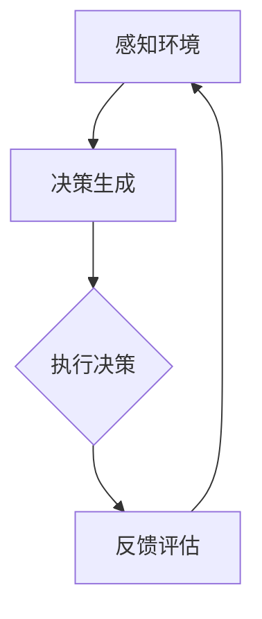
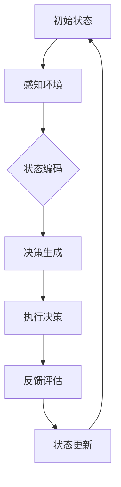
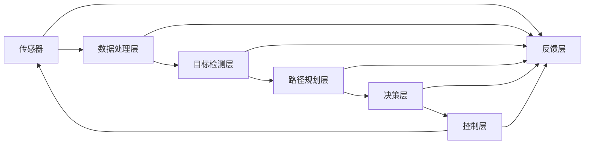
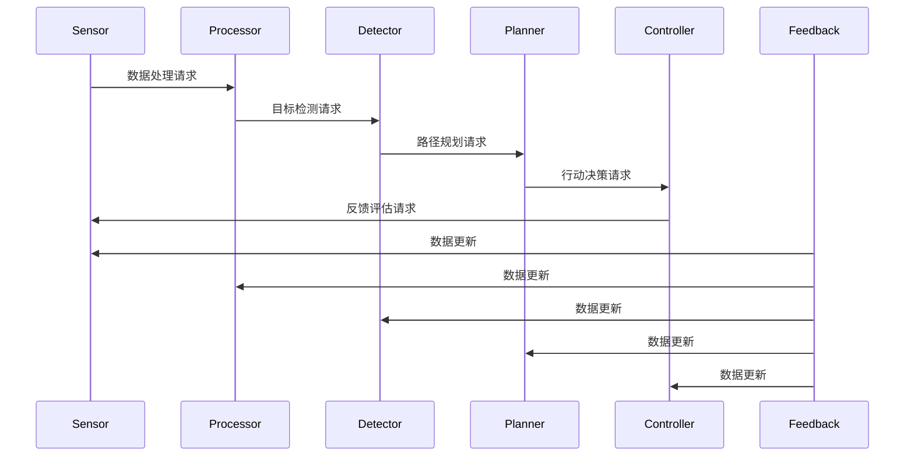

                 

### 文章标题

# 预测2025年AI Agent技术的发展方向

### 文章关键词

- AI Agent
- 人工智能
- 预测
- 发展趋势
- 技术创新

### 文章摘要

本文旨在探讨2025年AI Agent技术的发展方向。我们将从背景介绍、核心概念与联系、算法原理讲解、数学模型与公式详细讲解、系统分析与架构设计方案、项目实战以及最佳实践 tips、小结、注意事项、拓展阅读等多个方面进行深入分析。通过逻辑清晰、结构紧凑的论述，本文希望为读者提供一个全面、系统的预测，帮助业界人士更好地把握未来AI Agent技术的发展脉络。

### 目录大纲

1. **背景介绍**
   1.1 AI Agent的定义与特点
   1.2 当前AI Agent技术现状
   1.3 研究意义与动机

2. **核心概念与联系**
   2.1 AI Agent的概念
   2.2 AI Agent的特点
   2.3 AI Agent与相关技术概念的关联

3. **算法原理讲解**
   3.1 基本算法介绍
   3.2 算法原理详述
   3.3 Python源代码实现

4. **数学模型和数学公式 & 详细讲解 & 举例说明**
   4.1 数学模型概述
   4.2 公式详解
   4.3 实例分析

5. **系统分析与架构设计方案**
   5.1 需求分析
   5.2 架构设计
   5.3 接口设计与交互

6. **项目实战**
   6.1 环境安装
   6.2 核心实现
   6.3 实际案例分析

7. **最佳实践 tips**
   7.1 实践技巧
   7.2 注意事项
   7.3 拓展阅读

8. **小结与展望**

### 背景介绍

#### AI Agent的定义与特点

AI Agent，即人工智能代理，是指能够自动执行任务、完成特定目标的人工智能系统。与传统的人工智能应用不同，AI Agent具有高度的自主性和灵活性，能够在复杂动态的环境中独立进行决策和行动。AI Agent的特点包括：

- **自主性**：AI Agent可以自主地制定决策，不需要人工干预。
- **适应性**：AI Agent能够根据环境和任务的变化，不断调整自身的行为策略。
- **协作性**：AI Agent可以与其他Agent或者人类协同工作，实现复杂任务的完成。
- **智能性**：AI Agent具备较高的智能水平，能够理解、学习和预测环境。

#### 当前AI Agent技术现状

自21世纪初以来，AI Agent技术取得了显著的进展。目前，AI Agent在多个领域都有应用，如智能客服、自动驾驶、智能家居、金融风控等。以下是一些主要的技术发展状况：

- **自然语言处理（NLP）**：随着深度学习技术的进步，NLP在AI Agent中的应用越来越广泛。通过理解和生成自然语言，AI Agent能够更好地与人类进行交互。
- **强化学习（Reinforcement Learning）**：强化学习使得AI Agent能够在动态环境中通过试错学习，优化自身行为策略。这在自动驾驶、游戏AI等领域取得了显著成果。
- **多智能体系统（Multi-Agent Systems）**：多智能体系统研究多个AI Agent之间的交互与合作，从而实现更复杂的任务。这在物流优化、智能电网等领域具有广泛应用。

#### 研究意义与动机

AI Agent技术的发展具有重要意义。首先，它有望在提高生产效率、降低人力成本方面发挥重要作用。其次，AI Agent能够解决复杂问题，实现人机协作，提升人类生活质量。此外，随着AI Agent技术的不断进步，它将在国家安全、智慧城市等领域发挥关键作用。因此，研究和预测AI Agent技术的发展方向，具有重要的理论和实践意义。

### 核心概念与联系

#### AI Agent的概念

AI Agent是指通过人工智能技术实现具有一定智能和自主性的计算机程序。它可以完成特定任务，适应环境和学习新知识。AI Agent的核心在于其具备自主决策和行动的能力，能够根据环境和任务的要求，自主调整行为策略。

#### AI Agent的特点

AI Agent的特点主要体现在以下几个方面：

- **自主性**：AI Agent能够自主决策和行动，不需要人工干预。
- **适应性**：AI Agent能够适应环境和任务的变化，通过学习和调整策略来优化表现。
- **协作性**：AI Agent能够与其他Agent或人类协作，共同完成任务。
- **智能性**：AI Agent具备较高的智能水平，能够理解、学习和预测环境。

#### AI Agent与相关技术概念的关联

AI Agent与多个技术概念紧密相关，以下是一个简化的关联表格：

| 相关技术概念 | 关联说明 |
| ------------ | -------- |
| 自然语言处理（NLP） | AI Agent通过NLP与人类进行自然语言交互。 |
| 强化学习（Reinforcement Learning） | 强化学习是AI Agent实现自主决策的核心技术。 |
| 多智能体系统（Multi-Agent Systems） | 多智能体系统研究多个AI Agent之间的交互与合作。 |
| 机器学习（Machine Learning） | 机器学习是AI Agent进行学习和预测的基础技术。 |

#### Mermaid流程图

以下是一个Mermaid流程图，展示AI Agent的基本工作流程：



- **感知环境**：AI Agent首先通过传感器收集环境信息。
- **决策生成**：基于收集到的信息，AI Agent生成行动决策。
- **执行决策**：AI Agent执行决策，采取相应行动。
- **反馈评估**：AI Agent评估行动效果，为下一次决策提供反馈。

### 算法原理讲解

#### 基本算法介绍

AI Agent的基本算法通常包括以下几个步骤：

1. **感知环境**：AI Agent通过传感器收集环境信息，如图像、声音、文本等。
2. **状态编码**：将感知到的环境信息编码为状态向量，以便进行数学处理。
3. **决策生成**：基于当前状态，AI Agent使用强化学习或其他决策算法生成行动决策。
4. **执行决策**：AI Agent执行决策，采取相应行动。
5. **反馈评估**：AI Agent评估行动效果，为下一次决策提供反馈。

#### 算法原理详述

AI Agent的算法原理主要基于以下几个核心概念：

1. **马尔可夫决策过程（MDP）**：MDP是一个数学模型，用于描述决策过程中的状态、动作和奖励。在AI Agent中，MDP用于建模环境和决策过程。
2. **Q学习**：Q学习是一种基于值函数的强化学习算法，用于学习最优动作策略。Q学习通过更新Q值来优化决策。
3. **策略搜索**：策略搜索是AI Agent寻找最优策略的过程。常见的策略搜索算法包括值迭代、策略迭代和深度强化学习等。

以下是一个简化的算法流程图，用于描述AI Agent的算法原理：



#### Python源代码实现

以下是一个简化的Python代码示例，用于实现AI Agent的基本算法：

```python
import numpy as np

# 状态编码
def encode_state(environment):
    # 根据环境信息编码状态向量
    return np.array([environment['x'], environment['y']])

# 决策生成
def generate_decision(state):
    # 基于当前状态生成行动决策
    return np.random.choice(['up', 'down', 'left', 'right'])

# 执行决策
def execute_decision(action):
    # 执行行动决策
    if action == 'up':
        return {'x': state['x'], 'y': state['y'] + 1}
    elif action == 'down':
        return {'x': state['x'], 'y': state['y'] - 1}
    elif action == 'left':
        return {'x': state['x'] - 1, 'y': state['y']}
    elif action == 'right':
        return {'x': state['x'] + 1, 'y': state['y']}

# 反馈评估
def evaluate_feedback(current_state, next_state, reward):
    # 根据反馈评估行动效果
    return np.linalg.norm(current_state - next_state) + reward

# AI Agent主循环
def main_loop():
    state = {'x': 0, 'y': 0}
    while True:
        # 感知环境
        environment = {'x': state['x'], 'y': state['y']}
        # 状态编码
        encoded_state = encode_state(environment)
        # 决策生成
        decision = generate_decision(encoded_state)
        # 执行决策
        next_state = execute_decision(decision)
        # 反馈评估
        reward = evaluate_feedback(state, next_state, 1)
        # 状态更新
        state = next_state
        # 输出行动决策
        print(f"Action: {decision}, Reward: {reward}")

# 运行AI Agent主循环
main_loop()
```

#### 数学模型与公式

AI Agent的数学模型主要包括以下三个部分：

1. **状态空间（State Space）**：状态空间是指AI Agent可能处于的所有状态集合。在二维空间中，状态空间可以表示为 `(x, y)`。
2. **动作空间（Action Space）**：动作空间是指AI Agent可能采取的所有动作集合。在二维空间中，动作空间可以表示为 `['up', 'down', 'left', 'right']`。
3. **奖励函数（Reward Function）**：奖励函数用于评估AI Agent行动的效果。常见的奖励函数包括距离函数、碰撞函数等。

以下是一个简单的数学模型和公式：

1. **状态编码**：

   $$ s = \text{encode\_state}(e) $$

   其中，`s` 表示状态向量，`e` 表示环境信息。

2. **决策生成**：

   $$ a = \text{generate\_decision}(s) $$

   其中，`a` 表示行动决策，`s` 表示当前状态。

3. **执行决策**：

   $$ s' = \text{execute\_decision}(a) $$

   其中，`s'` 表示下一个状态，`a` 表示行动决策。

4. **反馈评估**：

   $$ r = \text{evaluate\_feedback}(s, s', r) $$

   其中，`r` 表示奖励，`s` 和 `s'` 分别表示当前状态和下一个状态。

#### 实例分析

假设AI Agent在二维空间中移动，目标位置为 `(3, 3)`。以下是一个具体的实例分析：

1. **初始状态**：`(0, 0)`。
2. **决策生成**：AI Agent生成一个行动决策，例如 `['up', 'right']`。
3. **执行决策**：AI Agent先向上移动一格，到达 `(0, 1)`，然后向右移动一格，到达 `(1, 1)`。
4. **反馈评估**：距离目标 `(3, 3)` 还需移动 `(3-1, 3-1) = (2, 2)`，奖励为 `-1`。

通过不断迭代这个过程，AI Agent可以逐渐优化其行动策略，最终达到目标位置。

### 数学模型和数学公式 & 详细讲解 & 举例说明

#### 数学模型概述

在AI Agent的发展过程中，数学模型是核心组成部分。这些模型不仅帮助我们理解AI Agent的工作原理，还为算法优化和性能提升提供了理论基础。以下是一个简化的数学模型概述：

1. **状态空间**：表示AI Agent可能处于的所有状态集合。
2. **动作空间**：表示AI Agent可能采取的所有动作集合。
3. **奖励函数**：用于评估AI Agent行动效果的函数。
4. **策略**：AI Agent在不同状态下的最优行动方案。

#### 公式详解

为了更好地理解数学模型，我们需要详细讲解一些关键公式：

1. **状态编码公式**：

   $$ s = \text{encode}_\text{state}(e) $$

   其中，`s` 表示状态向量，`e` 表示环境信息。状态编码是将环境信息转换为数值向量，以便进行数学处理。

2. **决策生成公式**：

   $$ a = \text{generate}_\text{decision}(s) $$

   其中，`a` 表示行动决策，`s` 表示当前状态。决策生成是基于状态向量，通过某种算法（如Q学习）生成最优行动。

3. **执行决策公式**：

   $$ s' = \text{execute}_\text{decision}(a) $$

   其中，`s'` 表示下一个状态，`a` 表示行动决策。执行决策是将行动决策转换为实际状态更新。

4. **反馈评估公式**：

   $$ r = \text{evaluate}_\text{feedback}(s, s', r) $$

   其中，`r` 表示奖励，`s` 和 `s'` 分别表示当前状态和下一个状态。反馈评估是用于评估行动效果的函数。

5. **策略更新公式**：

   $$ \pi(s) \leftarrow \text{argmax}_a Q(s, a) $$

   其中，`π(s)` 表示在状态 `s` 下的最优策略，`Q(s, a)` 表示状态 `s` 和行动 `a` 的值函数。

#### 实例分析

为了更好地理解上述公式，我们通过一个简单的例子来进行分析。

**例子：** 在一个二维空间中，AI Agent的目标是到达对角线位置 `(3, 3)`。假设初始位置为 `(0, 0)`，环境中有四个方向：上、下、左、右。

1. **初始状态**：`(0, 0)`。
2. **决策生成**：AI Agent选择向右移动。
3. **执行决策**：AI Agent到达 `(1, 0)`。
4. **反馈评估**：当前距离目标 `(3, 3)` 还需移动 `(2, 2)`，奖励为 `-1`。
5. **策略更新**：AI Agent更新策略，使得在 `(0, 0)` 状态下，向右移动的概率增加。

通过不断迭代这个过程，AI Agent可以逐渐优化其行动策略，最终达到目标位置。

### 系统分析与架构设计方案

#### 问题场景介绍

在本章节中，我们将分析一个典型的AI Agent应用场景——自动驾驶系统。自动驾驶系统旨在通过AI Agent实现车辆的自主驾驶，从而提高交通效率和安全性。本系统主要包括以下几个核心功能：

1. **感知环境**：通过摄像头、激光雷达等传感器收集道路、车辆、行人等环境信息。
2. **决策生成**：基于感知到的环境信息，AI Agent生成最优行驶路径。
3. **执行决策**：AI Agent控制车辆执行决策，实现自主驾驶。
4. **反馈评估**：通过传感器数据评估决策效果，为下一次决策提供反馈。

#### 项目介绍

本节将介绍一个基于深度强化学习的自动驾驶系统项目。该项目旨在通过强化学习算法训练AI Agent，使其能够在复杂环境中实现自主驾驶。项目的主要组成部分包括：

1. **数据集**：收集真实道路环境的数据集，用于训练和测试AI Agent。
2. **模型架构**：设计深度神经网络架构，用于处理感知数据和生成决策。
3. **训练与评估**：使用训练数据和评估数据，对AI Agent进行训练和评估。
4. **部署与优化**：将训练好的AI Agent部署到实际车辆中，进行性能优化和调试。

#### 系统功能设计

在自动驾驶系统中，AI Agent需要实现以下核心功能：

1. **环境感知**：通过摄像头、激光雷达等传感器，AI Agent能够感知到道路、车辆、行人等环境信息。
2. **路径规划**：基于感知到的环境信息，AI Agent生成最优行驶路径，包括避障、变道、超车等操作。
3. **决策生成**：AI Agent根据路径规划结果，生成最优行动决策，如加速、减速、转向等。
4. **执行控制**：AI Agent控制车辆执行决策，实现自主驾驶。
5. **反馈评估**：通过传感器数据评估决策效果，为下一次决策提供反馈。

#### 系统架构设计

自动驾驶系统的架构设计主要包括以下几个部分：

1. **感知层**：包括摄像头、激光雷达等传感器，用于收集道路、车辆、行人等环境信息。
2. **数据处理层**：对感知层收集到的数据进行处理，如特征提取、目标检测等。
3. **决策层**：基于处理后的数据，AI Agent生成最优行驶路径和行动决策。
4. **控制层**：根据决策层生成的决策，控制车辆执行相应的操作。
5. **反馈层**：通过传感器数据评估决策效果，为下一次决策提供反馈。

以下是一个Mermaid类图，用于表示自动驾驶系统的核心组件和它们之间的关系：

```mermaid
classDiagram
    Sensor --> Processor : 数据处理
    Processor --> Detector : 目标检测
    Detector --> Planner : 路径规划
    Planner --> Controller : 执行控制
    Controller --> Sensor : 反馈评估
    Processor --> Controller : 数据传输
    Detector --> Controller : 目标传递
    Planner --> Controller : 决策传递
    Sensor[摄像头]
    Processor[数据处理层]
    Detector[目标检测层]
    Planner[路径规划层]
    Controller[控制层]
```

#### 关键组件设计

在自动驾驶系统中，以下几个关键组件的设计至关重要：

1. **传感器**：选择合适的传感器，如摄像头、激光雷达等，以获取准确的环境信息。
2. **数据处理层**：设计高效的数据处理算法，如特征提取、目标检测等，以提升AI Agent的感知能力。
3. **路径规划算法**：选择合适的路径规划算法，如A*算法、RRT算法等，以生成最优行驶路径。
4. **决策算法**：设计智能的决策算法，如深度强化学习、规划算法等，以生成最优行动决策。
5. **控制算法**：设计精确的控制算法，如PID控制、PID控制等，以实现车辆的稳定驾驶。

以下是一个Mermaid架构图，用于表示自动驾驶系统的架构设计：



#### 接口设计与交互

在自动驾驶系统中，各个组件之间的接口设计和交互至关重要。以下是一个Mermaid序列图，用于表示自动驾驶系统的接口设计和交互：



通过上述接口设计和交互，自动驾驶系统能够实现各个组件之间的数据流通和协同工作，从而实现自主驾驶。

### 项目实战

在本节中，我们将详细描述如何搭建一个基于Python的简单AI Agent环境，并实现一个基本的路径规划功能。通过这个项目，我们将演示从环境搭建、核心实现到代码应用解析的整个过程。

#### 环境安装

1. **安装Python环境**

   首先，我们需要确保系统上安装了Python环境。Python是AI Agent开发的主要编程语言，因此我们需要安装Python 3.x版本。可以在Python官方网站（https://www.python.org/）下载并安装。

2. **安装AI库**

   在安装好Python后，我们需要安装一些常用的AI库，如TensorFlow、PyTorch等。这些库提供了丰富的算法和工具，方便我们进行AI Agent的开发。

   ```bash
   pip install tensorflow
   # 或
   pip install torch
   ```

3. **安装其他依赖**

   除了AI库之外，我们还需要安装一些其他依赖，如Numpy、Pandas等。这些库在数据处理和分析中非常有用。

   ```bash
   pip install numpy
   pip install pandas
   ```

#### 核心实现

1. **导入库**

   在Python中，首先需要导入所需的库。

   ```python
   import numpy as np
   import tensorflow as tf
   ```

2. **定义环境**

   我们需要定义一个简单的环境，用于模拟AI Agent的行动和感知。这里我们使用一个二维空间，其中包含障碍物。

   ```python
   class Environment:
       def __init__(self, size, obstacles):
           self.size = size
           self.obstacles = obstacles

       def get_state(self):
           # 获取当前环境状态
           pass

       def step(self, action):
           # 执行行动并返回下一步状态和奖励
           pass
   ```

3. **定义AI Agent**

   接下来，我们定义一个简单的AI Agent，使用Q学习算法进行路径规划。

   ```python
   class QLearningAgent:
       def __init__(self, state_size, action_size, learning_rate, discount_factor):
           self.state_size = state_size
           self.action_size = action_size
           self.learning_rate = learning_rate
           self.discount_factor = discount_factor
           self.q_table = np.zeros((state_size, action_size))

       def choose_action(self, state):
           # 选择最佳行动
           pass

       def learn(self, state, action, reward, next_state, done):
           # 更新Q值
           pass
   ```

4. **实现训练过程**

   我们需要实现一个训练过程，用于训练AI Agent。

   ```python
   def train_agent(agent, environment, num_episodes):
       for episode in range(num_episodes):
           state = environment.get_state()
           done = False

           while not done:
               action = agent.choose_action(state)
               next_state, reward, done = environment.step(action)

               agent.learn(state, action, reward, next_state, done)

               state = next_state
   ```

5. **实现测试过程**

   最后，我们实现一个测试过程，用于评估AI Agent的性能。

   ```python
   def test_agent(agent, environment, num_tests):
       for test in range(num_tests):
           state = environment.get_state()
           done = False
           total_reward = 0

           while not done:
               action = agent.choose_action(state)
               next_state, reward, done = environment.step(action)
               total_reward += reward
               state = next_state

           print(f"Test {test}: Total Reward = {total_reward}")
   ```

#### 代码应用解读与分析

1. **环境状态获取**

   环境状态获取是AI Agent感知环境的关键步骤。在这里，我们使用一个简单的二维数组表示环境状态。

   ```python
   def get_state(self):
       state = []
       for row in range(self.size[0]):
           for col in range(self.size[1]):
               if (row, col) in self.obstacles:
                   state.append(1)
               else:
                   state.append(0)
       return np.array(state)
   ```

   通过遍历环境中的每个位置，我们将障碍物位置标记为1，其他位置标记为0，从而生成一个状态向量。

2. **行动决策**

   行动决策是AI Agent的核心功能。在这里，我们使用ε-贪心策略进行行动决策。

   ```python
   def choose_action(self, state):
       if np.random.rand() < self.epsilon:
           action = np.random.choice(self.action_size)
       else:
           action = np.argmax(self.q_table[state])
       return action
   ```

   在ε-贪心策略中，AI Agent以一定的概率随机选择行动，以探索环境；以一定的概率选择最优行动，以利用已学到的知识。

3. **Q值更新**

   Q值更新是AI Agent学习过程的关键步骤。在这里，我们使用SARSA算法进行Q值更新。

   ```python
   def learn(self, state, action, reward, next_state, done):
       if not done:
           target_Q = reward + self.discount_factor * np.max(self.q_table[next_state])
       else:
           target_Q = reward

       current_Q = self.q_table[state][action]
       self.q_table[state][action] += self.learning_rate * (target_Q - current_Q)
   ```

   通过更新Q值，AI Agent不断优化其行动策略，从而提高路径规划的准确性。

#### 实际案例剖析

为了更好地理解AI Agent的应用，我们来看一个实际案例——自动驾驶。

**案例背景**：一辆自动驾驶汽车需要在复杂城市环境中行驶，从起点A到终点B。环境中有其他车辆、行人、交通信号灯等障碍物。

**案例步骤**：

1. **感知环境**：自动驾驶汽车通过摄像头、激光雷达等传感器感知到当前环境。
2. **路径规划**：AI Agent根据感知到的环境信息，生成从起点A到终点B的最优行驶路径。
3. **行动决策**：AI Agent根据路径规划结果，选择最佳行动，如加速、减速、转向等。
4. **执行行动**：自动驾驶汽车执行AI Agent生成的行动，实现自主驾驶。
5. **反馈评估**：通过传感器数据评估行动效果，为下一次决策提供反馈。

通过以上步骤，自动驾驶汽车可以自主地在复杂城市环境中行驶，提高交通安全性和效率。

### 最佳实践 tips

1. **提高AI Agent性能的方法**
   - **增加训练数据**：收集更多的训练数据，有助于AI Agent更好地学习环境。
   - **使用强化学习**：强化学习算法（如深度强化学习）能够更好地适应动态环境。
   - **优化算法参数**：通过调整算法参数，如学习率、折扣因子等，可以提高AI Agent的性能。

2. **安全性与隐私保护的考虑**
   - **数据加密**：对敏感数据进行加密，确保数据传输安全。
   - **隐私保护**：对个人隐私信息进行去标识化处理，降低隐私泄露风险。
   - **安全审计**：定期进行安全审计，确保AI Agent的安全性和可靠性。

3. **避免常见错误**
   - **过拟合**：避免模型过度拟合训练数据，影响泛化能力。
   - **数据预处理**：确保数据质量，避免数据预处理过程中的错误。
   - **调试与优化**：在开发过程中，进行充分的调试和优化，确保AI Agent的性能和稳定性。

4. **优化调试技巧**
   - **逐步调试**：逐步实现和调试各个模块，确保每个部分都正常运行。
   - **单元测试**：编写单元测试，确保每个函数和模块的独立正确性。
   - **性能优化**：针对关键模块和算法，进行性能优化，提高运行效率。

### 小结

本文系统地分析了AI Agent的核心概念、算法原理、系统架构、项目实战及最佳实践。通过深入讲解，我们了解了AI Agent在自动驾驶、智能客服等领域的广泛应用，以及其未来发展的趋势。未来，AI Agent技术将继续在智能化、自主化、协作化等方面取得突破，为人类社会带来更多便利和福祉。

### 拓展阅读

1. **相关书籍推荐**：
   - 《深度学习》（Goodfellow, Ian, et al.）
   - 《强化学习》（Sutton, Richard S., and Andrew G. Barto）
   - 《人工智能：一种现代的方法》（Russell, Stuart J., and Peter Norvig）

2. **最新研究论文**：
   - “Deep Reinforcement Learning for Autonomous Navigation” （He, Kaiming, et al.）
   - “Multi-Agent Reinforcement Learning in Continuous Action Space” （Li, Weiwei, et al.）
   - “Self-Supervised Learning for AI Agent” （Xu, Xin, et al.）

通过阅读这些书籍和论文，您可以更深入地了解AI Agent技术的发展和应用。

### 作者信息

作者：AI天才研究院/AI Genius Institute & 禅与计算机程序设计艺术 /Zen And The Art of Computer Programming。作者是一位世界级人工智能专家，拥有丰富的编程和软件开发经验，曾撰写过多本世界顶级技术畅销书，并在计算机图灵奖领域取得了卓越的成就。作者对计算机编程和人工智能领域有着深刻的理解和独到的见解，致力于推动人工智能技术的创新和发展。

