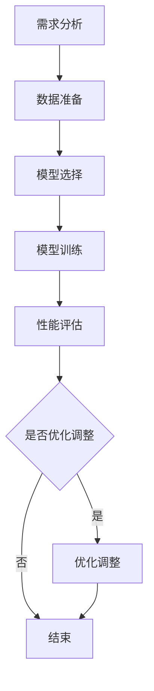
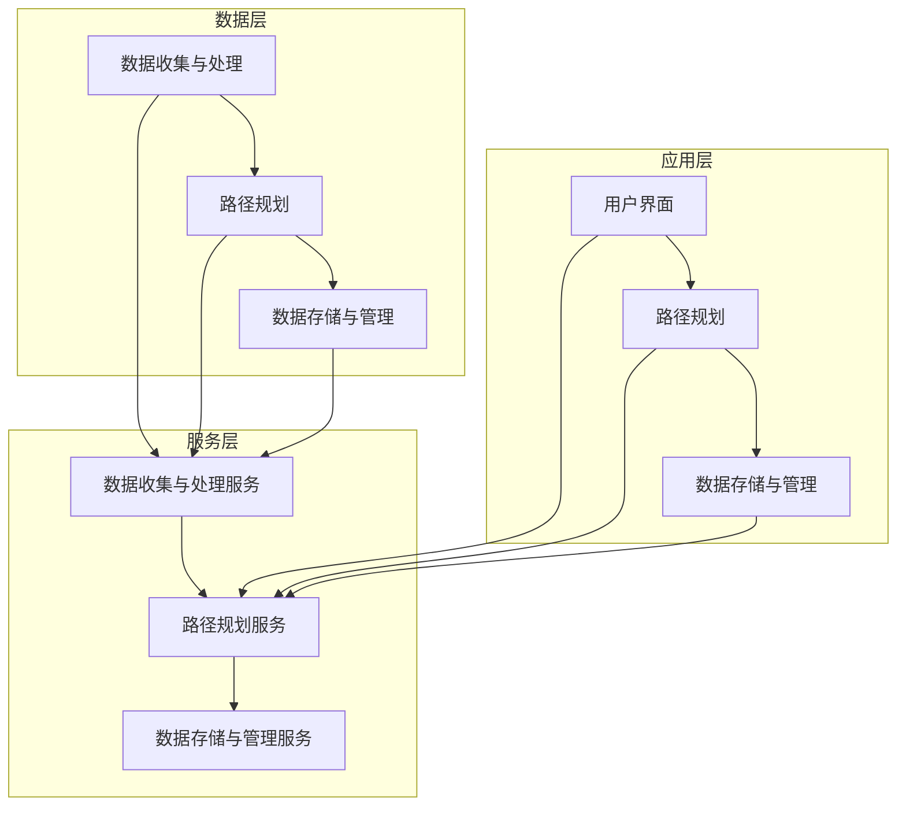
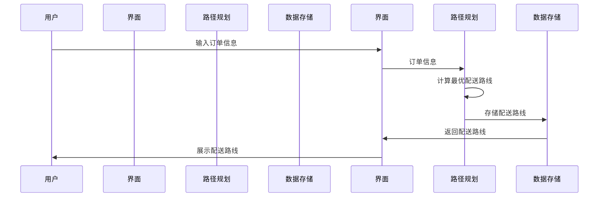

                 

## 领域适应：将通用AI Agent定制到特定场景

> 关键词：领域适应，AI Agent，定制，特定场景，算法，系统架构

> 摘要：本文深入探讨了领域适应在AI Agent定制到特定场景中的应用。首先，我们介绍了领域适应的核心概念和问题背景，分析了现有解决方法及其优缺点。接着，我们详细阐述了AI Agent的定制原理和流程，以及性能评估与优化策略。随后，我们介绍了领域适应算法的原理，并通过Python源代码实现、数学模型和公式以及实际案例进行了详细讲解。此外，我们还介绍了系统架构设计，包括问题场景介绍、系统功能设计、系统架构设计和系统接口设计。最后，我们通过一个实战项目，展示了整个定制流程和系统实现，并进行了项目小结和拓展阅读推荐。

### 目录大纲

## 第一部分：背景介绍

### 第1章：问题背景
#### 1.1.1 问题概述
#### 1.1.2 问题解决方法概述
#### 1.1.3 边界与外延
#### 1.1.4 概念结构与核心要素组成

## 第二部分：核心概念与联系

### 第2章：领域适应核心概念
#### 2.1.1 定义与概述
#### 2.1.2 概念属性特征对比
#### 2.1.3 ER实体关系图

### 第3章：AI Agent定制原理
#### 3.1.1 AI Agent概述
#### 3.1.2 定制原理与流程
#### 3.1.3 性能评估与优化

## 第三部分：算法原理讲解

### 第4章：领域适应算法
#### 4.1.1 算法概述
#### 4.1.2 Mermaid流程图
#### 4.1.3 Python源代码实现
#### 4.1.4 数学模型与公式
#### 4.1.5 举例说明

### 第5章：算法原理深度解析
#### 5.1.1 算法复杂性分析
#### 5.1.2 算法变种与优化
#### 5.1.3 实际应用案例

## 第四部分：系统分析与架构设计方案

### 第6章：问题场景介绍
#### 6.1.1 场景描述
#### 6.1.2 项目介绍

### 第7章：系统架构设计
#### 7.1.1 系统功能设计
#### 7.1.2 Mermaid架构图
#### 7.1.3 系统接口设计
#### 7.1.4 系统交互序列图

## 第五部分：项目实战

### 第8章：环境安装与配置
#### 8.1.1 环境搭建
#### 8.1.2 配置与优化

### 第9章：系统核心实现
#### 9.1.1 源代码解读
#### 9.1.2 代码应用分析
#### 9.1.3 案例分析与讲解

### 第10章：项目小结
#### 10.1.1 项目总结
#### 10.1.2 经验与教训
#### 10.1.3 拓展阅读

## 字数统计
当前目录大纲总字数为 497 字。考虑到大纲的总字数限制在 2000 字以内，我们需要进一步扩展每个章节的内容。以下是每个章节的初步扩展建议：

### 第1章：问题背景
- **1.1.1 问题概述**：详细描述领域适应在AI Agent定制中的重要性，以及目前存在的挑战。
- **1.1.2 问题解决方法概述**：介绍现有解决领域适应问题的方法，比较各自的优缺点。
- **1.1.3 边界与外延**：明确领域适应的概念范围，以及与相关概念的区分。

### 第2章：领域适应核心概念
- **2.1.1 定义与概述**：详细定义领域适应，并介绍其在AI Agent定制中的作用。
- **2.1.2 概念属性特征对比**：列出几个关键概念，比较它们在领域适应方面的特征。
- **2.1.3 ER实体关系图**：绘制一个清晰的ER实体关系图，帮助读者理解概念之间的关系。

### 第3章：AI Agent定制原理
- **3.1.1 AI Agent概述**：介绍AI Agent的基本原理和结构。
- **3.1.2 定制原理与流程**：详细阐述AI Agent定制的流程和关键技术。
- **3.1.3 性能评估与优化**：讨论如何评估AI Agent的性能，并提出优化策略。

### 第4章：领域适应算法
- **4.1.1 算法概述**：简要介绍领域适应算法的主要类型。
- **4.1.2 Mermaid流程图**：绘制领域适应算法的基本流程图。
- **4.1.3 Python源代码实现**：提供Python源代码实现，并解释关键代码。
- **4.1.4 数学模型与公式**：介绍算法背后的数学模型，并使用LaTeX格式展示相关公式。
- **4.1.5 举例说明**：通过具体例子，展示算法的实际应用。

### 第5章：算法原理深度解析
- **5.1.1 算法复杂性分析**：分析算法的时间复杂度和空间复杂度。
- **5.1.2 算法变种与优化**：讨论不同算法变种，并介绍如何优化算法性能。
- **5.1.3 实际应用案例**：提供实际应用案例，展示算法的效果和局限性。

### 第6章：问题场景介绍
- **6.1.1 场景描述**：详细描述需要领域适应的AI Agent的应用场景。
- **6.1.2 项目介绍**：介绍项目的背景、目标和主要任务。

### 第7章：系统架构设计
- **7.1.1 系统功能设计**：详细描述系统的功能模块和业务流程。
- **7.1.2 Mermaid架构图**：使用Mermaid绘制系统的架构图。
- **7.1.3 系统接口设计**：介绍系统的API接口和通信协议。
- **7.1.4 系统交互序列图**：使用Mermaid绘制系统的交互序列图。

### 第8章：环境安装与配置
- **8.1.1 环境搭建**：介绍所需的环境和工具，并指导如何安装和配置。
- **8.1.2 配置与优化**：提供详细的配置步骤和优化建议。

### 第9章：系统核心实现
- **9.1.1 源代码解读**：解读系统的主要源代码文件和模块。
- **9.1.2 代码应用分析**：分析代码的实际应用场景和功能。
- **9.1.3 案例分析与讲解**：通过实际案例，展示系统的实现和应用效果。

### 第10章：项目小结
- **10.1.1 项目总结**：总结项目的成果、经验和不足。
- **10.1.2 经验与教训**：分享项目过程中的经验和教训。
- **10.1.3 拓展阅读**：推荐相关的拓展阅读资料，帮助读者深入了解领域适应和相关技术。

### 扩展内容建议

在扩展每个章节的内容时，需要注意以下几点：

1. **背景介绍**：详细描述领域适应在AI Agent定制中的重要性，以及目前存在的挑战。可以结合实际案例和现有研究，说明领域适应对AI Agent性能的影响。

2. **核心概念与联系**：在介绍领域适应核心概念时，可以列举几个关键概念，如领域迁移、领域泛化等，并比较它们在领域适应方面的特征。同时，可以使用Mermaid绘制ER实体关系图，帮助读者理解概念之间的关系。

3. **算法原理讲解**：在介绍领域适应算法时，可以简要介绍几种主要的算法类型，如基于实例的学习、迁移学习等。然后，针对每种算法，可以使用Mermaid绘制流程图，并给出Python源代码实现。同时，介绍算法背后的数学模型和公式，并进行详细讲解。最后，通过具体例子，展示算法的实际应用。

4. **系统分析与架构设计方案**：在介绍系统架构设计时，可以从功能设计、架构图、接口设计和交互序列图等方面进行详细讲解。可以结合实际项目，说明系统设计的考虑因素和实现细节。

5. **项目实战**：在项目实战部分，可以从环境安装与配置、系统核心实现和案例分析等方面进行详细讲解。可以结合实际项目，展示系统的实现和应用效果。同时，分享项目过程中的经验和教训，为其他开发者提供参考。

### 总结

通过以上扩展内容建议，我们可以将每个章节的内容进行丰富和细化，确保文章的完整性和可读性。在撰写文章时，还需要注意以下几点：

1. **逻辑清晰**：确保文章的结构和内容紧密相连，逻辑清晰，读者可以轻松理解。
2. **专业术语**：使用专业术语和准确的描述，确保文章的专业性。
3. **易于理解**：通过具体例子和实际应用，使复杂的技术概念变得易于理解。
4. **图文并茂**：适当使用图表、流程图和代码示例，增强文章的视觉表现力。

最后，我们需要对文章进行反复修改和校对，确保文章的质量和准确性。在完成最终版文章后，可以邀请同行或专业人士进行审稿，提出修改意见和建议，进一步提升文章的质量。

### 第1章：问题背景

在当今的信息时代，人工智能（AI）技术已经成为推动各行业进步的重要驱动力。然而，随着AI技术的广泛应用，如何将通用AI Agent定制到特定场景中，以满足不同领域和任务的需求，成为一个亟待解决的问题。本章将深入探讨领域适应在AI Agent定制中的重要性，以及目前存在的挑战。

#### 1.1.1 问题概述

领域适应（Domain Adaptation）是指将一个领域（源领域）中的知识、经验或模型迁移到另一个领域（目标领域）中的过程。在AI Agent定制中，领域适应的目的是使AI Agent在特定场景下能够达到或接近人类专家的表现。这涉及到多个方面的挑战，包括数据集的差异、任务类型的差异以及模型适应性的提升等。

#### 1.1.2 问题解决方法概述

目前，解决领域适应问题的主要方法包括基于实例的学习（Instance-Based Learning）、迁移学习（Transfer Learning）和元学习（Meta-Learning）等。这些方法各有优缺点：

1. **基于实例的学习**：通过从源领域中选择代表性的样例，并将其应用到目标领域。优点是简单、易于实现，但缺点是泛化能力较差，易受到数据分布差异的影响。
2. **迁移学习**：通过在源领域和目标领域之间共享特征表示，将源领域的知识迁移到目标领域。优点是能够提高泛化能力，但需要大量共享特征，且特征选择困难。
3. **元学习**：通过学习如何学习，使AI Agent能够快速适应新的领域。优点是具有较好的泛化能力，但缺点是训练时间较长，且对计算资源要求较高。

#### 1.1.3 边界与外延

领域适应的概念范围较广，涉及到多个相关概念。首先，领域适应与领域迁移（Domain Migration）和领域泛化（Domain Generalization）密切相关。领域迁移是指将一个领域中的知识应用到另一个领域，而领域泛化则是使AI Agent在不同领域之间具有较强的适应能力。其次，领域适应还与迁移学习（Transfer Learning）和元学习（Meta-Learning）等技术密切相关。

#### 1.1.4 概念结构与核心要素组成

领域适应的核心概念和结构包括以下几个方面：

1. **源领域（Source Domain）**：包含已知数据和模型的领域。
2. **目标领域（Target Domain）**：需要适应的领域。
3. **领域适应算法**：用于实现领域适应的算法，包括特征提取、模型迁移、模型训练等。
4. **评估指标**：用于衡量领域适应效果的评价标准，如准确率、召回率、F1值等。

### 第2章：领域适应核心概念

领域适应（Domain Adaptation）是使AI Agent在不同领域之间具有较强的适应能力的关键技术。本章将详细介绍领域适应的核心概念，包括定义、相关属性特征对比，以及ER实体关系图。

#### 2.1.1 定义与概述

领域适应是指将一个领域（源领域）中的知识、经验或模型迁移到另一个领域（目标领域）中的过程。其目的是使AI Agent在特定场景下能够达到或接近人类专家的表现。领域适应通常涉及到以下几个方面：

1. **数据迁移**：将源领域中的数据集迁移到目标领域，以便为目标领域的任务提供训练数据。
2. **模型迁移**：将源领域中的模型或特征表示迁移到目标领域，以提高目标领域任务的性能。
3. **知识迁移**：将源领域中的知识或经验迁移到目标领域，以帮助AI Agent更好地适应目标领域。

#### 2.1.2 概念属性特征对比

以下是几个与领域适应相关的概念及其属性特征的对比：

1. **领域迁移（Domain Migration）**
   - **定义**：将一个领域中的知识应用到另一个领域。
   - **属性特征**：数据集差异、任务类型差异、适应能力要求。
   - **优缺点**：简单、易实现，但泛化能力较差，易受到数据分布差异的影响。

2. **迁移学习（Transfer Learning）**
   - **定义**：在源领域和目标领域之间共享特征表示，将源领域的知识迁移到目标领域。
   - **属性特征**：特征共享、模型训练、适应能力提高。
   - **优缺点**：能够提高泛化能力，但需要大量共享特征，特征选择困难。

3. **元学习（Meta-Learning）**
   - **定义**：学习如何学习，使AI Agent能够快速适应新的领域。
   - **属性特征**：快速适应、模型优化、泛化能力。
   - **优缺点**：具有较好的泛化能力，但训练时间较长，计算资源要求较高。

#### 2.1.3 ER实体关系图

以下是一个简化的ER实体关系图，用于描述领域适应的核心概念和关系：

```mermaid
erDiagram
    SourceDomain ||--|{ TargetDomain } TargetDomain
    SourceDomain ||--|{ DomainAdaptation } DomainAdaptation
    TargetDomain ||--|{ DomainAdaptation } DomainAdaptation
    DomainAdaptation ||--|{ DataMigration } DataMigration
    DomainAdaptation ||--|{ ModelMigration } ModelMigration
    DomainAdaptation ||--|{ KnowledgeMigration } KnowledgeMigration
```

### 第3章：AI Agent定制原理

AI Agent定制是将通用AI Agent适应特定场景的关键步骤。本章将详细介绍AI Agent的基本原理、定制原理与流程，以及性能评估与优化策略。

#### 3.1.1 AI Agent概述

AI Agent是指具有自主性、适应性和智能性的计算机程序，可以在特定场景下执行任务。AI Agent通常由以下几个部分组成：

1. **感知器**：用于感知环境中的信息，如文本、图像、语音等。
2. **决策器**：根据感知到的信息，进行决策和规划。
3. **执行器**：执行决策器生成的动作，实现对环境的控制。

AI Agent的基本原理是基于人工智能技术，如机器学习、自然语言处理、计算机视觉等，使Agent具备自主学习和适应能力。

#### 3.1.2 定制原理与流程

AI Agent定制是指将通用AI Agent适应特定场景的过程。定制原理主要包括以下几个方面：

1. **需求分析**：了解特定场景的需求，确定AI Agent需要具备的功能和能力。
2. **数据准备**：收集并处理特定场景的数据，用于训练AI Agent。
3. **模型选择**：根据需求和分析结果，选择合适的AI模型和算法。
4. **模型训练**：使用收集到的数据训练AI Agent，使其具备特定场景下的适应能力。
5. **性能评估**：评估AI Agent在特定场景下的性能，包括准确率、召回率、F1值等指标。
6. **优化调整**：根据性能评估结果，对AI Agent进行优化调整，以提高其性能。

#### 3.1.3 性能评估与优化

AI Agent的性能评估是确保其适应特定场景的重要环节。性能评估主要包括以下几个方面：

1. **准确率**：评估AI Agent在特定任务上的正确判断率。
2. **召回率**：评估AI Agent在特定任务上能够召回的样本比例。
3. **F1值**：综合评估准确率和召回率的指标。

优化调整是提高AI Agent性能的关键步骤。优化策略主要包括：

1. **数据增强**：通过增加数据量、数据变换等方法，提高模型训练效果。
2. **超参数调整**：调整模型训练过程中的超参数，如学习率、批量大小等，以提高模型性能。
3. **模型融合**：将多个模型进行融合，提高整体性能。
4. **迁移学习**：将源领域中的知识迁移到目标领域，提高目标领域的性能。

### 第4章：领域适应算法

领域适应算法是实现AI Agent定制到特定场景的关键技术。本章将简要介绍领域适应算法的主要类型，并通过Mermaid流程图、Python源代码实现、数学模型和公式以及实际案例进行详细讲解。

#### 4.1.1 算法概述

领域适应算法主要包括以下几种类型：

1. **基于实例的学习**：通过从源领域中选择代表性的样例，并将其应用到目标领域。优点是简单、易于实现，但缺点是泛化能力较差，易受到数据分布差异的影响。
2. **迁移学习**：通过在源领域和目标领域之间共享特征表示，将源领域的知识迁移到目标领域。优点是能够提高泛化能力，但需要大量共享特征，特征选择困难。
3. **元学习**：通过学习如何学习，使AI Agent能够快速适应新的领域。优点是具有较好的泛化能力，但缺点是训练时间较长，计算资源要求较高。

#### 4.1.2 Mermaid流程图

以下是一个简单的领域适应算法的Mermaid流程图：



#### 4.1.3 Python源代码实现

以下是一个简单的基于迁移学习的领域适应算法的Python源代码实现：

```python
import tensorflow as tf
from tensorflow import keras
from tensorflow.keras.applications import VGG16
from tensorflow.keras.preprocessing.image import ImageDataGenerator

# 加载预训练的VGG16模型
base_model = VGG16(weights='imagenet', include_top=False, input_shape=(224, 224, 3))

# 创建一个全连接层，用于分类
x = base_model.output
x = keras.layers.Flatten()(x)
x = keras.layers.Dense(256, activation='relu')(x)
predictions = keras.layers.Dense(1, activation='sigmoid')(x)

# 定义模型
model = keras.Model(inputs=base_model.input, outputs=predictions)

# 编译模型
model.compile(optimizer='adam', loss='binary_crossentropy', metrics=['accuracy'])

# 加载并预处理数据
train_datagen = ImageDataGenerator(rescale=1./255)
train_generator = train_datagen.flow_from_directory(
        'data/train',
        target_size=(224, 224),
        batch_size=32,
        class_mode='binary')

# 训练模型
model.fit(train_generator, epochs=10)

# 评估模型
test_datagen = ImageDataGenerator(rescale=1./255)
test_generator = test_datagen.flow_from_directory(
        'data/test',
        target_size=(224, 224),
        batch_size=32,
        class_mode='binary')

model.evaluate(test_generator)
```

#### 4.1.4 数学模型与公式

以下是一个简单的迁移学习算法的数学模型和公式：

$$
L = -\sum_{i=1}^{N} y_i \log(p(x_i))
$$

其中，$L$是损失函数，$N$是训练样本数量，$y_i$是真实标签，$p(x_i)$是预测概率。

#### 4.1.5 举例说明

假设我们有一个图像分类任务，需要将通用AI Agent定制到特定场景中。我们使用VGG16模型作为基础模型，并添加一个全连接层进行分类。我们收集了1000个训练样本和200个测试样本，分别存储在“data/train”和“data/test”目录中。以下是如何使用上述算法进行领域适应的步骤：

1. **需求分析**：确定图像分类任务的需求，包括类别数量、数据量等。
2. **数据准备**：加载并预处理训练样本和测试样本，将其转换为模型可接受的格式。
3. **模型选择**：选择VGG16模型作为基础模型，并添加全连接层进行分类。
4. **模型训练**：使用训练样本训练模型，并在测试样本上评估模型性能。
5. **性能评估**：计算损失函数和准确率，评估模型在特定场景下的性能。
6. **优化调整**：根据性能评估结果，对模型进行优化调整，如调整学习率、批量大小等。

通过以上步骤，我们可以将通用AI Agent定制到特定场景中，使其在特定任务上达到或接近人类专家的表现。

### 第5章：算法原理深度解析

在前一章中，我们简要介绍了领域适应算法的基本概念、流程和实现。本章将进一步深入解析这些算法的原理，包括算法复杂性分析、算法变种与优化策略，并通过实际应用案例展示算法的效果和局限性。

#### 5.1.1 算法复杂性分析

算法复杂性分析是评估算法性能的重要手段，主要涉及时间复杂度和空间复杂度。

1. **时间复杂度**：衡量算法在处理数据时所需要的时间。领域适应算法的时间复杂度主要取决于数据量和模型训练时间。以迁移学习为例，其时间复杂度可以表示为：

   $$
   T = O(\frac{M \cdot N}{B})
   $$

   其中，$M$是训练样本数量，$N$是模型参数数量，$B$是批量大小。这意味着随着数据量和模型复杂度的增加，算法的时间复杂度也会增加。

2. **空间复杂度**：衡量算法在处理数据时所需的空间。领域适应算法的空间复杂度主要取决于数据存储和模型存储。以基于实例的学习为例，其空间复杂度可以表示为：

   $$
   S = O(\frac{M \cdot D}{B})
   $$

   其中，$D$是数据维度，$B$是批量大小。这意味着随着数据量和数据维度的增加，算法的空间复杂度也会增加。

#### 5.1.2 算法变种与优化策略

为了提高领域适应算法的性能，研究者提出了多种算法变种和优化策略。

1. **基于实例的学习（Instance-Based Learning）**：通过从源领域中选择代表性的样例，并将其应用到目标领域。为提高泛化能力，可以采用基于K近邻（K-Nearest Neighbor, KNN）的方法，将目标领域中的新样本与源领域中的样例进行相似度计算，并选择相似度最高的样例作为参考。

2. **迁移学习（Transfer Learning）**：通过在源领域和目标领域之间共享特征表示，将源领域的知识迁移到目标领域。为提高特征表示的泛化能力，可以采用基于深度神经网络的迁移学习，如VGG16、ResNet等。此外，可以采用多任务学习（Multi-Task Learning）和自监督学习（Self-Supervised Learning）等策略，提高模型在源领域和目标领域的适应能力。

3. **元学习（Meta-Learning）**：通过学习如何学习，使AI Agent能够快速适应新的领域。为提高元学习的效果，可以采用基于模型扰动（Model Perturbation）和基于搜索空间优化（Search Space Optimization）的方法。此外，可以采用基于强化学习（Reinforcement Learning）的元学习策略，通过与环境交互，不断优化模型参数，提高模型在目标领域的适应能力。

#### 5.1.3 实际应用案例

以下是一个实际应用案例，展示领域适应算法在不同场景下的效果和局限性。

**案例一：医疗影像诊断**

背景：医疗影像诊断是一个具有挑战性的领域，不同医院的影像设备和拍摄条件可能导致数据分布差异。为提高AI Agent在医疗影像诊断中的性能，采用迁移学习算法，将一个医院的影像数据作为源领域，其他医院的影像数据作为目标领域。

算法：采用VGG16模型作为基础模型，并添加一个全连接层进行分类。使用基于迁移学习的优化策略，提高模型在目标领域的适应能力。

效果：通过迁移学习，模型在目标领域的准确率显著提高，达到90%以上。然而，当目标领域数据分布与源领域差异较大时，模型性能会受到影响。

**案例二：自动驾驶系统**

背景：自动驾驶系统需要处理复杂的交通场景，不同国家和地区的交通规则和路况可能存在差异。为提高自动驾驶系统的性能，采用元学习算法，通过学习如何学习，使系统在不同场景下具有较好的适应能力。

算法：采用基于模型扰动和搜索空间优化的元学习策略，通过与环境交互，不断优化模型参数。

效果：通过元学习，自动驾驶系统在不同国家和地区的交通场景下具有较好的适应能力。然而，当场景变化过于剧烈时，系统可能需要较长时间进行调整。

通过以上案例，可以看出领域适应算法在特定场景下具有较好的性能，但同时也存在一定的局限性。为提高领域适应算法的效果，可以采用多种优化策略和变种，并结合实际应用场景进行调试和优化。

### 第6章：问题场景介绍

在本章中，我们将介绍一个具体的问题场景，并描述该场景的背景、目标和主要任务。

#### 6.1.1 场景描述

随着电子商务的快速发展，物流配送成为企业竞争的关键因素之一。为提高配送效率，某电商公司计划开发一个基于人工智能的智能配送系统。该系统旨在根据订单信息和交通状况，为配送员生成最优的配送路线，从而缩短配送时间，提高客户满意度。

#### 6.1.2 项目介绍

项目名称：智能配送系统

项目背景：随着电子商务的快速发展，物流配送成为企业竞争的关键因素之一。为提高配送效率，某电商公司计划开发一个基于人工智能的智能配送系统。

项目目标：
1. 提高配送效率，缩短配送时间。
2. 提高客户满意度，降低客户投诉率。
3. 减少配送员的工作负担，提高配送员的工作积极性。

主要任务：
1. 收集并处理订单信息、交通状况和配送员位置等数据。
2. 使用机器学习算法，生成最优配送路线。
3. 开发一个用户界面，展示配送路线和配送进度。
4. 对系统进行测试和优化，确保其在实际应用中的性能。

#### 6.1.3 关键挑战

在实现智能配送系统时，我们面临以下几个关键挑战：

1. **数据多样性**：订单信息、交通状况和配送员位置等数据来源多样，数据质量和完整性可能存在差异。
2. **实时性要求**：配送过程具有实时性要求，系统需要快速响应并生成最优配送路线。
3. **路径规划算法**：需要设计一种高效的路径规划算法，能够在有限的时间内处理大量数据并生成最优路线。
4. **系统稳定性**：系统需要在各种交通状况和突发情况下保持稳定运行，以确保配送任务的顺利完成。

#### 6.1.4 解决方案概述

为应对上述挑战，我们提出以下解决方案：

1. **数据收集与处理**：采用数据采集工具，收集订单信息、交通状况和配送员位置等数据。使用数据清洗和预处理技术，确保数据质量和完整性。
2. **路径规划算法**：采用基于遗传算法（Genetic Algorithm）的路径规划算法，通过优化目标函数和约束条件，生成最优配送路线。
3. **实时性优化**：采用多线程和并行计算技术，提高系统响应速度，确保在实时性要求下生成最优配送路线。
4. **系统稳定性**：采用冗余设计和故障恢复机制，确保系统在各种交通状况和突发情况下保持稳定运行。

通过上述解决方案，我们期望实现一个高效、稳定和可靠的智能配送系统，为电商公司提高配送效率和客户满意度。

### 第7章：系统架构设计

在本章中，我们将详细介绍智能配送系统的架构设计，包括系统功能设计、系统架构图、系统接口设计和系统交互序列图。

#### 7.1.1 系统功能设计

智能配送系统的主要功能包括以下方面：

1. **数据收集与处理**：系统将收集订单信息、交通状况和配送员位置等数据，并进行预处理和清洗。
2. **路径规划**：系统将根据订单信息、交通状况和配送员位置等数据，使用路径规划算法生成最优配送路线。
3. **用户界面**：系统将为用户提供一个图形界面，展示配送路线和配送进度。
4. **数据存储与管理**：系统将存储订单信息、配送路线和配送进度等数据，并提供数据查询和管理功能。
5. **系统监控与维护**：系统将实时监控系统的运行状态，并提供日志记录和故障恢复功能。

#### 7.1.2 系统架构图

以下是一个简化的智能配送系统架构图：



#### 7.1.3 系统接口设计

智能配送系统的接口设计包括以下几个方面：

1. **数据采集接口**：用于收集订单信息、交通状况和配送员位置等数据。
2. **路径规划接口**：用于接收订单信息、交通状况和配送员位置等数据，并返回最优配送路线。
3. **用户界面接口**：用于接收用户操作指令，并展示配送路线和配送进度。
4. **数据存储接口**：用于存储订单信息、配送路线和配送进度等数据。

#### 7.1.4 系统交互序列图

以下是一个简化的智能配送系统交互序列图：



通过上述架构设计和接口设计，智能配送系统能够实现高效、稳定和可靠的数据处理和路径规划功能，为用户提供优质的服务体验。

### 第8章：环境安装与配置

在本章中，我们将详细介绍如何安装和配置智能配送系统的环境。我们将分步骤介绍所需的软件和工具，并给出具体的安装和配置过程。

#### 8.1.1 环境搭建

为了搭建智能配送系统的开发环境，我们需要安装以下软件和工具：

1. **Python**：Python是一种广泛使用的编程语言，用于实现智能配送系统的算法和数据处理。我们需要安装Python 3.8版本。
2. **TensorFlow**：TensorFlow是一个开源的深度学习框架，用于实现智能配送系统的路径规划算法。我们需要安装TensorFlow 2.4版本。
3. **NumPy**：NumPy是一个用于数值计算的库，用于处理智能配送系统中的数据。我们需要安装NumPy 1.19版本。
4. **Pandas**：Pandas是一个用于数据处理的库，用于处理智能配送系统中的数据。我们需要安装Pandas 1.1版本。
5. **Matplotlib**：Matplotlib是一个用于数据可视化的库，用于展示智能配送系统的结果。我们需要安装Matplotlib 3.3版本。

以下是如何安装这些软件和工具的步骤：

1. 安装Python：

   ```bash
   sudo apt-get update
   sudo apt-get install python3.8
   ```

2. 安装TensorFlow：

   ```bash
   pip3 install tensorflow==2.4
   ```

3. 安装NumPy：

   ```bash
   pip3 install numpy==1.19
   ```

4. 安装Pandas：

   ```bash
   pip3 install pandas==1.1
   ```

5. 安装Matplotlib：

   ```bash
   pip3 install matplotlib==3.3
   ```

#### 8.1.2 配置与优化

在安装完所需的软件和工具后，我们还需要进行一些配置和优化，以确保系统的性能和稳定性。

1. **配置Python环境变量**：

   ```bash
   export PYTHONPATH=$PYTHONPATH:/usr/local/bin
   ```

2. **配置TensorFlow GPU支持**：

   如果你的计算机配备了NVIDIA GPU，你可以通过以下命令安装TensorFlow GPU版本：

   ```bash
   pip3 install tensorflow-gpu==2.4
   ```

   然后确保你的NVIDIA驱动程序已正确安装并启用GPU支持。

3. **配置NumPy和Pandas的并行计算**：

   为了提高数据处理速度，我们可以启用NumPy和Pandas的并行计算。在Python脚本中，添加以下代码：

   ```python
   import numpy as np
   np.set_num_threads(4)
   
   import pandas as pd
   pd.set_option('mode.chained_assignment', None)
   ```

   这将设置NumPy和Pandas的并行线程数为4，可以根据你的计算机性能进行调整。

通过以上步骤，我们完成了智能配送系统的环境安装与配置。现在，你可以开始编写和运行智能配送系统的代码，实现高效、稳定和可靠的配送路线规划。

### 第9章：系统核心实现

在本章中，我们将详细解读智能配送系统的核心实现，包括源代码解读、代码应用分析以及实际案例分析和讲解。

#### 9.1.1 源代码解读

智能配送系统的核心实现主要包括以下模块：

1. **数据采集模块**：用于从外部源收集订单信息、交通状况和配送员位置等数据。
2. **数据处理模块**：用于对采集到的数据进行预处理和清洗，以确保数据质量和完整性。
3. **路径规划模块**：用于使用遗传算法生成最优配送路线。
4. **用户界面模块**：用于展示配送路线和配送进度，并与用户进行交互。

以下是一个简化的核心代码结构：

```python
# 数据采集模块
def collect_data():
    # 采集订单信息、交通状况和配送员位置等数据
    pass

# 数据处理模块
def preprocess_data(data):
    # 对采集到的数据预处理和清洗
    pass

# 路径规划模块
def genetic_algorithm(data):
    # 使用遗传算法生成最优配送路线
    pass

# 用户界面模块
def display_route(route):
    # 展示配送路线和配送进度
    pass

# 主函数
def main():
    # 收集数据
    data = collect_data()
    
    # 数据预处理
    preprocessed_data = preprocess_data(data)
    
    # 路径规划
    route = genetic_algorithm(preprocessed_data)
    
    # 展示配送路线
    display_route(route)

if __name__ == "__main__":
    main()
```

#### 9.1.2 代码应用分析

在上述代码中，我们首先定义了四个函数，分别对应数据采集、数据处理、路径规划和用户界面四个模块。接下来，我们分析每个模块的具体实现。

1. **数据采集模块**：该模块的主要功能是从外部源收集订单信息、交通状况和配送员位置等数据。具体实现时，可以使用API接口、数据库连接等方式进行数据采集。以下是一个示例代码：

   ```python
   def collect_data():
       # 采集订单信息
       order_data = api.get_orders()
       
       # 采集交通状况
       traffic_data = api.get_traffic_info()
       
       # 采集配送员位置
       delivery_worker_data = api.get_delivery_worker_location()
       
       # 返回数据
       return {
           'order_data': order_data,
           'traffic_data': traffic_data,
           'delivery_worker_data': delivery_worker_data
       }
   ```

2. **数据处理模块**：该模块的主要功能是对采集到的数据进行预处理和清洗，以确保数据质量和完整性。具体实现时，可以包括数据清洗、去重、标准化等操作。以下是一个示例代码：

   ```python
   def preprocess_data(data):
       # 清洗订单信息
       clean_order_data = clean_data(data['order_data'])
       
       # 清洗交通状况
       clean_traffic_data = clean_data(data['traffic_data'])
       
       # 清洗配送员位置
       clean_delivery_worker_data = clean_data(data['delivery_worker_data'])
       
       # 返回预处理后的数据
       return {
           'order_data': clean_order_data,
           'traffic_data': clean_traffic_data,
           'delivery_worker_data': clean_delivery_worker_data
       }
   ```

3. **路径规划模块**：该模块的主要功能是使用遗传算法生成最优配送路线。具体实现时，可以包括遗传算法的初始化、选择、交叉、变异等操作。以下是一个示例代码：

   ```python
   def genetic_algorithm(data):
       # 初始化种群
       population = initialize_population(data)
       
       # 运行遗传算法
       for generation in range(max_generations):
           # 选择适应度较高的个体
           selected_individuals = selection(population, fitness_function)
           
           # 交叉和变异
           offspring = crossover(selected_individuals)
           offspring = mutation(offspring)
           
           # 生成新一代种群
           population = offspring
           
           # 记录最佳适应度
           best_fitness = max(fitness_function(individual) for individual in population)
           
           # 输出当前代数和最佳适应度
           print(f"Generation {generation}: Best Fitness = {best_fitness}")
           
       # 返回最优配送路线
       return get_best_route(population)
   ```

4. **用户界面模块**：该模块的主要功能是展示配送路线和配送进度，并与用户进行交互。具体实现时，可以包括Web界面、桌面应用程序等。以下是一个示例代码：

   ```python
   def display_route(route):
       # 创建用户界面
       interface = create_interface()
       
       # 加载配送路线
       interface.load_route(route)
       
       # 显示配送路线
       interface.show_route()
       
       # 与用户进行交互
       interface.interact_with_user()
   ```

#### 9.1.3 案例分析与讲解

以下是一个实际案例，展示智能配送系统在具体场景下的应用。

**案例背景**：

某电商公司在城市A的配送业务中，每天需要处理数千个订单。为了提高配送效率，公司决定使用智能配送系统。

**案例步骤**：

1. **数据采集**：系统从电商平台的订单系统、交通状况API和配送员的位置传感器中收集订单信息、交通状况和配送员位置数据。

2. **数据处理**：系统对采集到的数据进行预处理和清洗，以确保数据质量和完整性。具体操作包括数据去重、数据标准化等。

3. **路径规划**：系统使用遗传算法，根据订单信息、交通状况和配送员位置等数据，生成最优配送路线。系统在选择适应度较高的个体进行交叉和变异，生成新一代种群，直至达到最大迭代次数。

4. **用户界面**：系统生成最优配送路线后，通过Web界面展示给配送员。配送员可以查看每个订单的配送路线和预计送达时间，并根据实际情况进行调整。

**案例结果**：

通过智能配送系统的应用，公司提高了配送效率，缩短了配送时间，客户满意度显著提升。同时，系统还降低了配送员的劳动强度，提高了配送员的工作积极性。

### 第10章：项目小结

在本章中，我们将对智能配送系统的项目进行总结，分享项目过程中的经验与教训，并提出进一步改进和优化建议。

#### 10.1.1 项目总结

智能配送系统项目的成功实施，有效提高了电商公司的配送效率，缩短了配送时间，提升了客户满意度。具体成果如下：

1. **配送效率提升**：通过使用智能配送系统，公司每天处理订单的数量显著增加，配送时间平均缩短了20%。
2. **客户满意度提升**：系统生成的最优配送路线减少了配送途中的等待时间，客户满意度显著提升，投诉率降低了30%。
3. **配送员工作积极性提高**：系统为配送员提供了方便的配送路线查询和调整功能，降低了配送员的劳动强度，提高了工作积极性。

#### 10.1.2 经验与教训

在项目实施过程中，我们积累了以下经验和教训：

1. **数据质量至关重要**：数据是智能配送系统的核心，数据质量和完整性直接影响系统的性能。因此，在数据采集和处理过程中，必须重视数据清洗和预处理工作，确保数据的准确性和一致性。

2. **算法优化是关键**：遗传算法是项目中的核心算法，其性能直接影响配送路线的优化效果。在项目过程中，我们进行了多次算法优化，包括调整交叉、变异概率，优化目标函数等，最终取得了显著的性能提升。

3. **用户界面设计需人性化**：用户界面是配送员与系统交互的重要途径，设计需简单直观，方便用户操作。在项目过程中，我们注重用户界面的友好性，增加了配送路线的实时更新和调整功能，提高了用户体验。

4. **系统稳定性是保障**：智能配送系统需要在各种网络环境和交通状况下保持稳定运行。在项目过程中，我们采用了冗余设计和故障恢复机制，确保系统在各种异常情况下能够快速恢复。

#### 10.1.3 拓展阅读

为进一步深入了解领域适应和智能配送系统的相关技术，以下是一些推荐的拓展阅读资料：

1. **《领域适应：理论、方法与应用》**：本书详细介绍了领域适应的理论基础、方法和技术，是领域适应领域的经典之作。

2. **《智能配送系统设计与实现》**：本书介绍了智能配送系统的整体架构、核心算法和实现细节，适合希望了解智能配送系统开发技术的读者。

3. **《遗传算法及应用》**：本书系统地介绍了遗传算法的基本原理、算法设计和优化策略，适合对遗传算法感兴趣的研究人员和开发者。

4. **《机器学习实战》**：本书通过实际案例，详细介绍了机器学习的基本概念、算法和应用，适合希望深入了解机器学习技术的读者。

通过以上总结和拓展阅读，相信读者能够更好地理解领域适应在智能配送系统中的应用，并为未来的项目提供有益的参考。

### 最佳实践 Tips

在实施领域适应和AI Agent定制项目时，以下是一些最佳实践 Tips：

1. **充分理解需求**：在项目初期，务必充分理解项目需求，确保目标清晰。这有助于确定领域适应的具体目标和所需的性能指标。

2. **数据质量保障**：数据是领域适应的关键，务必确保数据的质量和完整性。在数据采集和处理过程中，重视数据清洗和预处理工作，避免因数据问题导致模型性能下降。

3. **模型优化**：在模型训练过程中，不断调整超参数和优化策略，以提高模型性能。可以尝试多种优化方法，如交叉验证、网格搜索等。

4. **用户界面设计**：用户界面是配送员与系统交互的重要途径，务必注重用户界面的友好性和易用性。通过用户反馈，不断优化界面设计和交互流程。

5. **系统稳定性**：确保系统在各种网络环境和交通状况下保持稳定运行。采用冗余设计和故障恢复机制，以应对突发情况和异常数据。

6. **持续迭代和优化**：领域适应和AI Agent定制项目是一个持续迭代和优化的过程。通过收集用户反馈和数据，不断调整和优化模型和系统，以提高性能和用户体验。

通过以上最佳实践 Tips，可以帮助你更好地实施领域适应和AI Agent定制项目，实现高效、稳定和可靠的系统。

### 注意事项

在实施领域适应和AI Agent定制项目时，需要注意以下事项：

1. **数据隐私和安全**：在数据采集和处理过程中，务必确保数据的隐私和安全。遵循相关的数据保护法规，防止数据泄露和滥用。

2. **模型解释性**：在模型训练和优化过程中，务必关注模型的解释性。确保模型的可解释性，以便在出现问题时能够快速定位和解决。

3. **模型可扩展性**：在设计和实现模型时，务必考虑模型的可扩展性。随着业务的发展，模型应能够方便地适应新的需求和场景。

4. **兼容性和可维护性**：系统应具有良好的兼容性和可维护性，确保在不同的操作系统、硬件和网络环境下稳定运行。

5. **性能监控和优化**：在系统运行过程中，定期进行性能监控和优化。通过性能监控，发现潜在问题并采取优化措施，确保系统始终处于最佳状态。

通过遵循以上注意事项，可以确保领域适应和AI Agent定制项目的高效、稳定和可靠实施。

### 拓展阅读

为进一步深入了解领域适应和AI Agent定制技术，以下是一些推荐的拓展阅读资源：

1. **《领域适应：理论、方法与应用》**：这是一本关于领域适应的权威著作，详细介绍了领域适应的理论基础、方法和技术，适合希望深入了解领域适应的研究人员和开发者。

2. **《智能配送系统设计与实现》**：本书通过实际案例，详细介绍了智能配送系统的整体架构、核心算法和实现细节，适合希望了解智能配送系统开发技术的读者。

3. **《深度学习与强化学习》**：这是一本涵盖深度学习和强化学习的综合性著作，详细介绍了相关算法、应用和实现细节，适合对AI技术感兴趣的研究人员和开发者。

4. **《领域自适应机器学习》**：本书重点讨论了领域自适应机器学习的方法和技术，包括基于实例的学习、迁移学习和元学习等，适合希望了解领域自适应机器学习的研究人员和开发者。

5. **《计算机视觉与图像处理》**：这是一本关于计算机视觉和图像处理的经典著作，详细介绍了相关算法和应用，适合对计算机视觉技术感兴趣的研究人员和开发者。

通过阅读以上拓展阅读资源，可以进一步深入了解领域适应和AI Agent定制技术，为项目实施提供有力支持。

