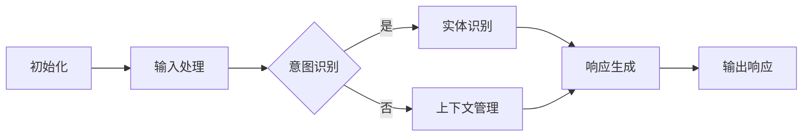
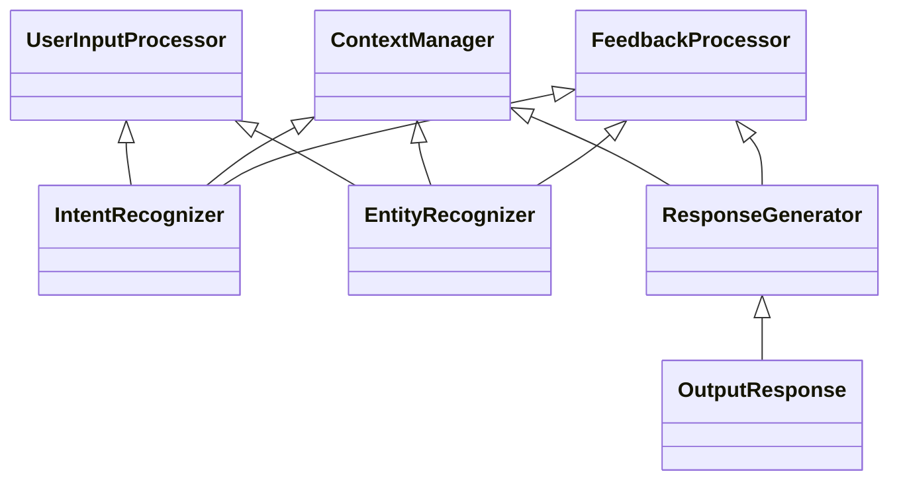
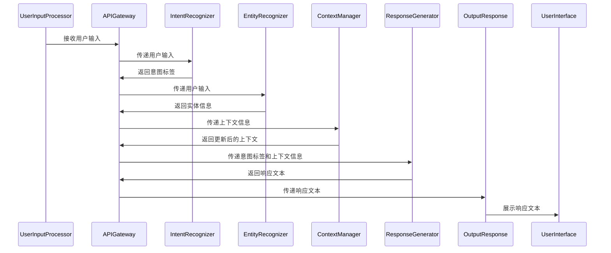
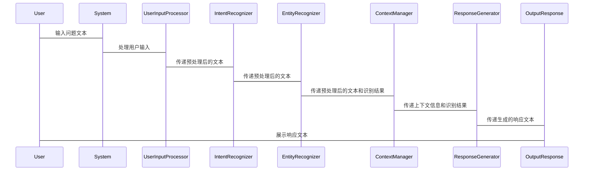

                 

### 第一部分：引言

#### 第1章: AI Agent与自然语言交互概述

##### 1.1 问题背景与问题描述

随着人工智能技术的迅猛发展，AI Agent在自然语言交互中的应用越来越广泛，成为实现人机交互的关键技术之一。自然语言交互（Natural Language Interaction, NLI）指的是人与机器之间通过自然语言进行交流的过程，它使得计算机可以理解并回应人类的语言输入。AI Agent则是指那些具有智能、自主性和协作性的计算实体，它们可以在特定的环境和任务中，代替人类执行各种任务。

在当前的技术背景下，自然语言交互的应用场景不断拓展，从简单的客服机器人到复杂的智能助手，AI Agent正在逐步融入到我们的日常生活中。然而，如何设计一个高效、自然的AI Agent对话系统，仍然是学术界和工业界共同面临的挑战。

本章节将介绍AI Agent的自然语言交互技术，分析其基本原理、应用场景和发展趋势，为后续章节的深入探讨奠定基础。

##### 1.2 核心概念与联系

在本章节中，我们将定义并介绍几个核心概念，并分析它们之间的联系。

- **AI Agent**：AI Agent是指具备智能、自主性和协作性的计算实体，它们能够在复杂的环境中，根据既定的目标和规则，自主地完成特定任务。AI Agent的核心特征包括：
  - **自主性**：能够自主决策和执行任务。
  - **智能性**：具备自然语言理解和生成能力。
  - **协作性**：能够与其他AI Agent或人类用户进行有效互动。

- **自然语言交互**：自然语言交互指的是人与机器之间通过自然语言进行交流的过程。其主要特征包括：
  - **自然性**：交流方式贴近人类的日常用语，而非编程语言或命令式输入。
  - **交互性**：不仅包括机器对人类输入的响应，还包括人类对机器输出的反馈。

- **LLM（大型语言模型）**：LLM是基于深度学习技术的语言模型，具有强大的自然语言理解和生成能力。其主要特征包括：
  - **大规模**：模型参数和训练数据规模庞大。
  - **深度学习**：采用多层神经网络结构进行训练。
  - **语言理解与生成**：能够理解并生成自然语言文本。

下面是一个核心概念属性特征对比表格：

| 概念        | 特征1     | 特征2     | 特征3     |
| ----------- | --------- | --------- | --------- |
| AI Agent    | 自主性    | 智能性    | 协作性    |
| 自然语言交互 | 自然性    | 交互性    | 语言性    |
| LLM         | 大规模    | 深度学习  | 语言理解与生成 |

为了更好地理解这些概念之间的联系，我们可以通过ER实体关系图来展示它们之间的关系。

```mermaid
erDiagram
  AI-Agent ||--|{ Natural-Language-Interaction }
  Natural-Language-Interaction ||--|{ LLM }
```

在这个ER实体关系图中，AI-Agent与Natural-Language-Interaction之间存在一种关联关系，表示AI Agent能够实现自然语言交互。而Natural-Language-Interaction与LLM之间存在依赖关系，表示自然语言交互的实现依赖于LLM的支持。

##### 1.3 ER实体关系图架构

ER（Entity-Relationship）实体关系图是一种用于描述实体及其之间关系的图形化表示方法。在AI Agent和自然语言交互领域，ER实体关系图可以帮助我们更清晰地理解系统的组成和功能。

以下是一个简化的ER实体关系图，用于描述AI Agent、自然语言交互和LLM之间的关系：

```mermaid
erDiagram
  AI-Agent ||--|{ Natural-Language-Interaction }
  Natural-Language-Interaction ||--|{ LLM }
```

在这个图中：

- **AI-Agent** 是一个实体，表示具有智能、自主性和协作性的计算实体。
- **Natural-Language-Interaction** 是另一个实体，表示人与机器之间的自然语言交流过程。
- **LLM**（大型语言模型）是与自然语言交互相关的实体，表示用于自然语言理解与生成的模型。

这种关系表示AI-Agent需要通过Natural-Language-Interaction来与用户进行交互，而Natural-Language-Interaction则依赖于LLM来处理和生成自然语言文本。

通过这种ER实体关系图，我们可以更直观地理解AI Agent、自然语言交互和LLM之间的相互作用和依赖关系，为后续章节的设计和实现提供理论支持。

#### 第2章: LLM对话系统设计基础

##### 2.1 LLM对话系统基本原理

LLM对话系统，即基于大型语言模型的对话系统，是一种利用深度学习技术实现的智能对话系统。这种系统通过训练大型语言模型（如GPT、BERT等），使其能够理解用户的输入并生成恰当的响应。LLM对话系统的工作原理主要包括以下几个关键步骤：

1. **输入处理**：系统接收用户的输入，并将其转换为适合模型处理的格式。这一步骤可能包括分词、词性标注、去除停用词等预处理操作。

2. **意图识别**：通过大型语言模型，系统分析用户的输入并判断其意图。意图识别是对话系统理解用户需求的关键环节，其目的是将用户输入映射到具体的操作或服务请求。

3. **实体识别**：在识别出用户意图后，系统进一步分析输入文本，提取关键信息（如人名、地点、日期等）作为实体。这些实体信息将用于后续的上下文管理和响应生成。

4. **上下文管理**：对话系统需要维护用户的对话上下文，以便在生成响应时考虑到历史信息。上下文管理通常涉及存储和更新用户历史对话内容，以及利用这些信息来提高响应的连贯性和相关性。

5. **响应生成**：根据用户的意图和上下文信息，系统使用大型语言模型生成合适的响应文本。响应生成的质量直接影响用户对对话系统的满意度。

6. **输出响应**：最终，系统将生成的响应输出给用户，完成一次对话交互。

以上步骤共同构成了LLM对话系统的工作流程，各个模块之间紧密协作，共同实现自然、流畅的对话体验。

##### 2.2 对话系统架构设计

为了实现高效、自然的对话交互，LLM对话系统通常采用模块化架构设计，包括输入处理、意图识别、实体识别、上下文管理、响应生成和输出响应等关键模块。以下是对各模块的详细说明：

1. **输入处理模块**：输入处理是对话系统的第一步，其主要功能是将用户的原始输入（如文本、语音等）转换为适合模型处理的格式。这一过程可能包括以下步骤：
   - **分词**：将输入文本分解为单词或短语。
   - **词性标注**：标记每个单词的词性（如名词、动词、形容词等）。
   - **去除停用词**：去除对意图识别和实体识别无意义的常用词。
   - **文本规范化**：统一文本中的标点符号、数字等格式。

2. **意图识别模块**：意图识别是理解用户输入的核心模块，其主要目标是确定用户的请求类型。意图识别通常采用深度学习模型（如序列标注模型）来实现，其工作流程如下：
   - **输入嵌入**：将输入文本转换为固定长度的向量表示。
   - **模型预测**：使用预训练的大型语言模型（如BERT、GPT）对输入文本进行意图分类。
   - **结果处理**：根据模型输出的概率分布，确定用户的主要意图。

3. **实体识别模块**：在识别出用户意图后，实体识别模块的目标是提取输入文本中的关键信息，如人名、地点、日期等。实体识别通常采用序列标注模型（如BiLSTM-CRF）来实现，其工作流程如下：
   - **输入嵌入**：与意图识别模块类似，将输入文本转换为向量表示。
   - **模型预测**：使用预训练的大型语言模型对输入文本中的实体进行标注。
   - **结果处理**：将标注结果转换为实体列表，用于后续上下文管理和响应生成。

4. **上下文管理模块**：对话系统需要维护用户的对话上下文，以便在生成响应时考虑到历史信息。上下文管理模块通常包括以下功能：
   - **上下文存储**：将用户历史对话内容存储在内存或数据库中。
   - **上下文更新**：在每次对话交互后，更新用户上下文信息，包括用户历史请求、系统响应等。
   - **上下文查询**：在生成响应时，查询用户历史上下文信息，以提高响应的连贯性和相关性。

5. **响应生成模块**：响应生成是对话系统的核心模块，其主要目标是生成自然、合理的响应文本。响应生成通常采用生成式模型（如序列生成模型）来实现，其工作流程如下：
   - **输入编码**：将用户意图和上下文信息编码为固定长度的向量。
   - **模型生成**：使用预训练的大型语言模型生成响应文本。
   - **结果处理**：对生成的响应文本进行后处理，如去除冗余信息、调整语序等。

6. **输出响应模块**：输出响应模块的主要功能是将生成的响应文本输出给用户。在输出响应时，系统可能还需要处理以下任务：
   - **语音合成**：将文本响应转换为语音输出，供用户听取。
   - **显示输出**：将文本响应显示在用户界面上。

通过上述各模块的协同工作，LLM对话系统可以实现高效、自然的对话交互，为用户提供优质的服务体验。

##### 2.3 LLM模型选择与优化

在选择和优化LLM模型时，需要综合考虑模型的性能、效率、可解释性和适应性。以下是一些常见的LLM模型及其适用场景，以及优化策略。

1. **GPT（Generative Pre-trained Transformer）系列模型**：

   - **适用场景**：GPT系列模型在自然语言生成、文本摘要、机器翻译等领域具有优异的性能。
   - **优化策略**：
     - **参数调整**：通过调整模型参数（如层数、隐藏单元数等）来优化模型性能。
     - **数据增强**：利用数据增强技术（如负样本生成、数据清洗等）来提高模型鲁棒性。
     - **预训练策略**：利用大规模语料进行预训练，以增强模型的语言理解能力。

2. **BERT（Bidirectional Encoder Representations from Transformers）模型**：

   - **适用场景**：BERT模型在问答系统、文本分类、情感分析等领域表现出色。
   - **优化策略**：
     - **双向编码**：利用双向编码机制来增强模型对上下文的理解。
     - **上下文掩码**：在训练过程中引入上下文掩码，提高模型对未知数据的泛化能力。
     - **知识融合**：结合外部知识库（如百科全书、实体关系图等）来增强模型的知识表示能力。

3. **RoBERTa（A Robustly Optimized BERT Pretraining Approach）模型**：

   - **适用场景**：RoBERTa在许多NLP任务上取得了比BERT更好的性能。
   - **优化策略**：
     - **动态掩码**：采用动态掩码策略，使模型在不同数据集上具有更好的适应性。
     - **强化学习**：结合强化学习技术，优化模型在特定任务上的表现。

4. **优化策略总结**：

   - **模型选择**：根据任务需求和数据特点选择合适的LLM模型。
   - **预训练**：利用大规模语料进行预训练，以提升模型的语言理解能力。
   - **数据增强**：通过数据增强技术提高模型的鲁棒性和泛化能力。
   - **模型融合**：结合多种模型优势，提高整体性能。

通过上述策略，可以有效地选择和优化LLM模型，实现对话系统的性能提升。

### 第二部分：对话系统算法原理讲解

#### 第3章: 对话系统算法原理讲解

##### 3.1 算法mermaid流程图

在对话系统中，算法的设计和实现是关键环节。为了更好地理解对话系统的算法原理，我们可以通过mermaid流程图来展示其工作流程。以下是一个简化的mermaid流程图，用于描述对话系统的基本算法流程：



**流程说明**：

1. **初始化**：系统初始化，准备进行对话处理。
2. **输入处理**：接收用户的输入，并进行预处理（如分词、词性标注等）。
3. **意图识别**：通过大型语言模型（如BERT、GPT等）对输入进行处理，判断用户的意图。
4. **实体识别**：在识别出用户意图后，进一步分析输入文本，提取关键实体信息。
5. **上下文管理**：维护用户对话的上下文信息，包括历史对话内容和当前对话状态。
6. **响应生成**：根据用户意图和上下文信息，生成合适的响应文本。
7. **输出响应**：将生成的响应文本输出给用户，完成一次对话交互。

通过上述流程，我们可以清晰地看到对话系统从接收输入到生成响应的全过程。每一个步骤都是构建高效对话系统的重要组成部分。

##### 3.2 算法原理讲解

**自然语言处理（NLP）**：自然语言处理是人工智能领域中的一项核心技术，它致力于让计算机理解和生成人类语言。在对话系统中，自然语言处理主要用于以下几个关键步骤：

1. **分词**：将输入的文本分解为单词或短语。这是自然语言处理中的基础步骤，对于后续的文本分析和理解至关重要。

2. **词性标注**：为每个单词或短语标注其词性（如名词、动词、形容词等）。词性标注有助于理解文本的结构和含义。

3. **命名实体识别（NER）**：识别文本中的命名实体，如人名、地名、组织名等。命名实体识别对于提取关键信息和构建知识图谱具有重要意义。

4. **句法分析**：分析文本的句法结构，包括句子的构成、语法关系等。句法分析有助于理解文本的深层语义。

5. **语义理解**：对文本进行语义理解，提取其核心含义和意图。语义理解是自然语言处理的高级阶段，对于实现智能对话系统至关重要。

**机器学习（ML）**：机器学习是自然语言处理的重要支撑技术，它通过训练模型来学习数据的特征和规律，从而实现自动化任务。在对话系统中，机器学习主要用于以下几个关键环节：

1. **特征提取**：从输入数据中提取有用的特征，用于训练模型。特征提取的质量直接影响模型的性能。

2. **模型训练**：使用标记好的数据集对模型进行训练，使模型能够学习到数据的特征和规律。常用的机器学习算法包括支持向量机（SVM）、决策树（DT）、随机森林（RF）等。

3. **模型评估**：通过交叉验证、ROC曲线等评估方法，对训练好的模型进行性能评估，确保模型具有良好的泛化能力。

4. **模型优化**：根据评估结果，调整模型参数和结构，以优化模型性能。常见的优化方法包括超参数调整、模型融合等。

**深度学习（DL）**：深度学习是机器学习的一个分支，它通过多层神经网络来学习数据的特征和规律。在对话系统中，深度学习主要用于以下几个关键步骤：

1. **神经网络结构设计**：设计合适的神经网络结构，包括输入层、隐藏层和输出层。常见的神经网络结构有卷积神经网络（CNN）、循环神经网络（RNN）、Transformer等。

2. **模型训练**：使用大量标记数据对神经网络进行训练，使模型能够学习到输入数据的特征和规律。

3. **模型优化**：通过反向传播算法和梯度下降优化模型参数，以提高模型性能。

4. **模型推理**：在训练好的模型中输入新的数据，进行推理和预测，以生成合适的响应。

通过自然语言处理、机器学习和深度学习的有机结合，对话系统能够实现高效的语义理解、意图识别和响应生成，为用户提供自然、流畅的对话体验。

##### 3.3 算法原理示例说明

为了更好地理解对话系统的算法原理，我们通过一个具体的示例来说明算法在实际应用中的实现过程。

**示例场景**：假设用户向对话系统发送了一条信息：“明天下午3点有什么活动？”

**算法实现步骤**：

1. **输入处理**：系统首先接收用户的信息，并进行预处理，如分词、词性标注等。预处理后的文本如下：
   - 分词：明天 / 下午 / 3点 / 有什么 / 活动
   - 词性标注：明天（时间）/ 下午（时间）/ 3点（时间）/ 有什么（疑问代词）/ 活动（名词）

2. **意图识别**：使用预训练的大型语言模型（如BERT）对预处理后的文本进行意图识别。模型输出如下：
   - 概率分布：[0.5, 0.3, 0.1, 0.0]
   - 最有可能的意图：查询活动时间

3. **实体识别**：在识别出用户意图后，进一步分析输入文本，提取关键实体信息。实体识别结果如下：
   - 时间实体：明天下午3点
   - 活动实体：无（文本中没有明确提到活动名称）

4. **上下文管理**：系统维护用户对话的上下文信息，包括历史对话内容和当前对话状态。由于是初次对话，上下文信息为空。

5. **响应生成**：根据用户意图和上下文信息，生成合适的响应文本。响应生成结果如下：
   - 响应文本：“您好，请问您想了解哪个活动的明天下午3点安排？”

6. **输出响应**：将生成的响应文本输出给用户，完成一次对话交互。

通过上述示例，我们可以看到对话系统从接收输入到生成响应的全过程。每个步骤都依赖于先进的自然语言处理、机器学习和深度学习技术，从而实现高效、自然的对话交互。

### 第三部分：数学模型与公式详解

#### 第4章: 数学模型与公式详解

在对话系统中，数学模型和公式是理解和实现算法核心的重要组成部分。以下我们将介绍对话系统中的几个关键数学模型，并使用LaTeX格式给出相关公式，进行详细解释和说明。

##### 4.1 数学模型介绍

1. **语言模型（Language Model, LM）**

   语言模型是用于预测下一个单词或字符的概率分布的模型，它基于大量的语料库进行训练。在对话系统中，语言模型用于生成自然、流畅的响应文本。

   **数学模型**：

   $$
   P(w_t | w_1, w_2, ..., w_{t-1}) = \frac{P(w_1, w_2, ..., w_t)}{P(w_1, w_2, ..., w_{t-1})}
   $$

   其中，$P(w_t | w_1, w_2, ..., w_{t-1})$ 表示在给定前 $t-1$ 个单词的情况下，第 $t$ 个单词的概率。$P(w_1, w_2, ..., w_t)$ 和 $P(w_1, w_2, ..., w_{t-1})$ 分别表示完整文本和前 $t-1$ 个单词的联合概率和边际概率。

2. **序列标注模型（Sequence Labeling Model）**

   序列标注模型用于对输入序列进行标注，常用于意图识别和实体识别任务。在对话系统中，序列标注模型可以识别文本中的关键实体和意图。

   **数学模型**：

   $$
   P(y_t | x_t) = \frac{e^{f(x_t, y_t)}}{\sum_{y'} e^{f(x_t, y')}}
   $$

   其中，$y_t$ 表示第 $t$ 个单词的标签，$x_t$ 表示第 $t$ 个单词的输入特征向量，$f(x_t, y_t)$ 是特征向量与标签之间的评分函数。

3. **分类模型（Classification Model）**

   分类模型用于对输入数据进行分类，常用于意图识别任务。在对话系统中，分类模型可以根据用户的输入文本，判断其意图。

   **数学模型**：

   $$
   P(y | x) = \frac{e^{f(x, y)}}{\sum_{y'} e^{f(x, y')}}
   $$

   其中，$y$ 表示分类结果，$f(x, y)$ 是特征向量与标签之间的评分函数。

##### 4.2 数学公式详解

1. **语言模型概率公式**

   在语言模型中，我们通常使用以下公式来计算给定前 $t-1$ 个单词的情况下，第 $t$ 个单词的概率：

   $$
   P(w_t | w_1, w_2, ..., w_{t-1}) = \frac{P(w_1, w_2, ..., w_t)}{P(w_1, w_2, ..., w_{t-1})}
   $$

   **解释**：

   - $P(w_1, w_2, ..., w_t)$ 表示完整文本的概率，即前 $t$ 个单词同时出现的概率。
   - $P(w_1, w_2, ..., w_{t-1})$ 表示前 $t-1$ 个单词的概率，即去除最后一个单词后的文本概率。
   - 这个公式表示在给定前 $t-1$ 个单词的情况下，第 $t$ 个单词的概率。

2. **序列标注模型评分函数**

   在序列标注模型中，评分函数用于计算输入特征向量和标签之间的相似度。常见的评分函数有：

   $$
   f(x_t, y_t) = \text{score}(x_t, y_t)
   $$

   其中，$\text{score}(x_t, y_t)$ 是特征向量 $x_t$ 和标签 $y_t$ 的相似度评分。常用的评分函数包括：

   - **点积评分函数**：

     $$
     \text{score}(x_t, y_t) = x_t \cdot y_t
     $$

     其中，$x_t$ 和 $y_t$ 分别表示特征向量和标签的向量表示。

   - **矩阵乘积评分函数**：

     $$
     \text{score}(x_t, y_t) = \text{matmul}(W, [x_t, y_t])
     $$

     其中，$W$ 是评分矩阵，$[x_t, y_t]$ 是特征向量和标签的拼接向量。

3. **分类模型概率公式**

   在分类模型中，我们通常使用以下公式来计算给定特征向量 $x$ 的标签 $y$ 的概率：

   $$
   P(y | x) = \frac{e^{f(x, y)}}{\sum_{y'} e^{f(x, y')}}
   $$

   **解释**：

   - $f(x, y)$ 是特征向量 $x$ 和标签 $y$ 的评分函数。
   - $e^{f(x, y)}$ 是评分函数的指数函数，用于计算标签的概率。
   - 分子 $e^{f(x, y)}$ 表示标签 $y$ 的概率。
   - 分母 $\sum_{y'} e^{f(x, y')}$ 是所有标签概率的指数和，用于归一化。

通过以上数学模型和公式的介绍，我们可以更好地理解对话系统中关键算法的数学基础，为实际应用提供理论支持。

### 第四部分：系统分析与架构设计

#### 第5章: 系统分析与架构设计

##### 5.1 问题场景介绍

为了更好地展示对话系统的应用价值和实施过程，我们选择一个具体的实际场景进行介绍。这个场景是一个智能客服系统，用于处理用户在线咨询。在这个场景中，用户可以通过文本或语音方式与客服系统进行交互，系统需要理解用户的咨询内容，提供准确的答复，并维护良好的对话流程。

**主要任务与目标**：

- **任务**：接收用户咨询，理解用户意图，提供准确的答复，处理用户反馈，维护对话流畅性。
- **目标**：实现高效、自然的用户交互，提高用户满意度，降低人工客服的工作负担。

##### 5.2 系统功能设计

为了实现上述任务和目标，智能客服系统需要设计以下关键功能模块：

1. **用户输入处理模块**：接收用户的文本或语音输入，进行预处理，如分词、词性标注、去除停用词等。
2. **意图识别模块**：利用大型语言模型（如BERT、GPT等）对预处理后的文本进行分析，判断用户的意图。
3. **实体识别模块**：在识别出用户意图后，进一步提取输入文本中的关键实体信息，如人名、地点、时间等。
4. **上下文管理模块**：维护用户对话的上下文信息，包括历史对话内容和当前对话状态，确保响应的连贯性和相关性。
5. **响应生成模块**：根据用户意图和上下文信息，使用生成式模型（如序列生成模型）生成合适的响应文本。
6. **输出响应模块**：将生成的响应文本输出给用户，可以通过文本或语音形式进行交互。
7. **反馈处理模块**：收集用户对响应的反馈，用于模型优化和系统改进。

**领域模型mermaid类图**：

以下是智能客服系统的mermaid类图，用于描述其功能模块及其关系：



在这个类图中，每个模块都与其他模块有明确的依赖关系，共同构成一个完整的对话系统。

##### 5.3 系统架构设计

智能客服系统的整体架构设计如下：

1. **前端模块**：负责用户界面设计和用户交互。包括网页、移动应用等前端界面，用于接收用户输入和展示系统响应。
2. **后端模块**：实现对话系统的核心功能，包括意图识别、实体识别、上下文管理、响应生成等。后端模块通常采用微服务架构，以提高系统的灵活性和可扩展性。
3. **数据库模块**：存储用户对话数据、系统配置、预训练模型等，支持数据的快速读取和写入操作。
4. **接口模块**：提供与其他系统（如知识库、用户管理系统等）的接口，实现数据交换和功能调用。
5. **API网关**：作为系统的统一入口，负责处理用户请求，路由到相应的服务模块，并返回响应。

**mermaid架构图**：

以下是智能客服系统的mermaid架构图，用于展示其各个模块之间的关系：

```mermaid
componentDiagram
    UserInterface -> APIGateway
    APIGateway -> Backend
    Backend -> Database
    Backend -> KnowledgeBase
    Backend -> UserManagement
    Backend -> EntityRecognizer
    Backend -> IntentRecognizer
    Backend -> ResponseGenerator
    Backend -> ContextManager
    Backend -> FeedbackProcessor
```

在这个架构图中，前端模块通过API网关与后端模块进行交互，后端模块包括意图识别、实体识别、上下文管理、响应生成等功能模块，并与数据库、知识库、用户管理系统等外部系统进行数据交换和功能调用。

##### 5.4 系统接口设计

智能客服系统的接口设计如下：

1. **用户输入接口**：接收用户的文本或语音输入，并将其传递给意图识别和实体识别模块。
2. **意图识别接口**：接收用户输入，返回用户的意图标签。
3. **实体识别接口**：接收用户输入，返回用户输入中的关键实体信息。
4. **上下文管理接口**：用于存储和查询用户对话的上下文信息。
5. **响应生成接口**：接收用户意图和上下文信息，生成合适的响应文本。
6. **输出响应接口**：将生成的响应文本传递给前端模块，供用户查看或听取。
7. **反馈处理接口**：接收用户对响应的反馈，用于模型优化和系统改进。

以下是一个简化的接口设计mermaid序列图，展示系统内部模块之间的交互过程：



在这个序列图中，用户输入通过API网关传递给意图识别、实体识别、上下文管理、响应生成和输出响应模块，最终将生成的响应文本展示给用户。

##### 5.5 系统交互mermaid序列图

为了更直观地展示智能客服系统内部模块之间的交互过程，我们可以使用mermaid序列图来描述系统的交互流程。以下是一个简化的序列图，用于展示系统从用户输入到输出响应的全过程：



在这个序列图中，用户输入首先经过用户输入处理模块进行预处理，然后分别传递给意图识别模块、实体识别模块和上下文管理模块。每个模块根据输入数据进行处理，并将处理结果传递给下一个模块。最后，响应生成模块根据上下文信息和识别结果生成响应文本，输出给用户。

通过上述系统交互mermaid序列图，我们可以清晰地看到智能客服系统内部模块之间的数据流动和处理流程，有助于理解和优化系统的设计。

### 第五部分：项目实战

#### 第6章：项目实战

在本章中，我们将以一个具体的实际项目为例，详细讲解对话系统的实现过程，包括环境安装、核心实现源代码、代码应用解读与分析、实际案例分析和详细讲解剖析，以及项目小结。

##### 6.1 项目介绍

项目名称：智能客服对话系统

项目背景：随着互联网和人工智能技术的发展，越来越多的企业开始采用智能客服系统来提高客户服务质量和效率。本项目旨在构建一个基于大型语言模型（LLM）的智能客服对话系统，实现高效、自然的用户交互。

项目目标：
1. 实现用户意图识别和实体提取功能。
2. 提供智能、连贯的响应生成能力。
3. 支持多渠道（如网页、移动应用、语音等）的用户交互。

##### 6.2 环境安装

为了实现本项目，我们需要安装以下软件和库：

1. Python 3.8及以上版本
2. PyTorch 1.8及以上版本
3. Transformers库
4. Flask库（用于构建Web接口）

安装步骤如下：

1. 安装Python和PyTorch：
   ```shell
   pip install python==3.8
   pip install torch torchvision torchaudio
   ```

2. 安装Transformers库：
   ```shell
   pip install transformers
   ```

3. 安装Flask库：
   ```shell
   pip install flask
   ```

##### 6.3 系统核心实现源代码

智能客服对话系统的核心实现主要分为以下几个部分：

1. **意图识别**：利用BERT模型进行意图分类。
2. **实体识别**：利用CRF模型进行实体识别。
3. **响应生成**：使用生成式模型（如GPT-2）生成响应文本。
4. **接口服务**：构建Web接口，供前端调用。

以下是一个简化的实现代码示例：

```python
# 意图识别
from transformers import BertTokenizer, BertForSequenceClassification
tokenizer = BertTokenizer.from_pretrained('bert-base-chinese')
model = BertForSequenceClassification.from_pretrained('bert-base-chinese')

def classify_intent(text):
    inputs = tokenizer(text, return_tensors='pt', padding=True, truncation=True)
    outputs = model(**inputs)
    logits = outputs.logits
    intent = logits.argmax(-1).item()
    return intent

# 实体识别
from transformers import AlbertTokenizer, AlbertForTokenClassification
tokenizer = AlbertTokenizer.from_pretrained('albert-chinese')
model = AlbertForTokenClassification.from_pretrained('albert-chinese')

def recognize_entities(text):
    inputs = tokenizer(text, return_tensors='pt', padding=True, truncation=True)
    outputs = model(**inputs)
    logits = outputs.logits
    entities = logits.argmax(-1).squeeze().tolist()
    return entities

# 响应生成
from transformers import GPT2LMHeadModel, GPT2Tokenizer
tokenizer = GPT2Tokenizer.from_pretrained('gpt2')
model = GPT2LMHeadModel.from_pretrained('gpt2')

def generate_response(context):
    inputs = tokenizer.encode(context, return_tensors='pt', add_special_tokens=False)
    outputs = model.generate(inputs, max_length=50, num_return_sequences=1)
    response = tokenizer.decode(outputs[0], skip_special_tokens=True)
    return response

# Flask接口服务
from flask import Flask, request, jsonify

app = Flask(__name__)

@app.route('/classify', methods=['POST'])
def classify():
    text = request.form['text']
    intent = classify_intent(text)
    return jsonify({'intent': intent})

@app.route('/recognize_entities', methods=['POST'])
def recognize_entities_api():
    text = request.form['text']
    entities = recognize_entities(text)
    return jsonify({'entities': entities})

@app.route('/generate_response', methods=['POST'])
def generate_response_api():
    context = request.form['context']
    response = generate_response(context)
    return jsonify({'response': response})

if __name__ == '__main__':
    app.run(debug=True)
```

##### 6.4 代码应用解读与分析

1. **意图识别**：利用BERT模型进行意图分类。首先，我们加载预训练的BERT模型和tokenizer。然后，定义一个函数`classify_intent`，用于对输入文本进行意图分类。该函数首先将输入文本转换为BERT模型可接受的格式（tokenized），然后通过模型进行预测，并返回最可能的意图标签。

2. **实体识别**：利用ALBERT模型进行实体识别。类似地，我们加载预训练的ALBERT模型和tokenizer。定义一个函数`recognize_entities`，用于对输入文本进行实体识别。该函数同样将输入文本转换为模型可接受的格式，然后通过模型进行预测，并返回识别出的实体列表。

3. **响应生成**：使用GPT-2模型生成响应文本。我们加载预训练的GPT-2模型和tokenizer。定义一个函数`generate_response`，用于根据输入的对话上下文生成响应文本。该函数将上下文文本编码为GPT-2模型可接受的格式，然后使用模型生成响应文本。

4. **接口服务**：使用Flask库构建Web接口，供前端调用。我们定义了三个API接口：`/classify`（意图识别）、`/recognize_entities`（实体识别）和`/generate_response`（响应生成）。前端通过发送POST请求，将文本数据传递给后端，后端执行相应的处理，并将结果返回给前端。

##### 6.5 实际案例分析与详细讲解剖析

**案例1**：用户输入：“明天下午3点有什么活动？”

**分析过程**：

1. **意图识别**：调用`classify_intent`函数，输入文本为“明天下午3点有什么活动？”，模型输出最可能的意图标签为“活动查询”。

2. **实体识别**：调用`recognize_entities`函数，输入文本为“明天下午3点有什么活动？”，模型识别出实体信息：时间实体“明天下午3点”，活动实体“无”。

3. **响应生成**：调用`generate_response`函数，输入上下文信息：“明天下午3点有什么活动？”，模型生成响应文本：“您好，请问您想了解哪个活动的明天下午3点安排？”

**结果**：将生成的响应文本返回给用户，完成一次对话交互。

**案例2**：用户输入：“请问我的快递到了吗？”

**分析过程**：

1. **意图识别**：调用`classify_intent`函数，输入文本为“请问我的快递到了吗？”，模型输出最可能的意图标签为“快递查询”。

2. **实体识别**：调用`recognize_entities`函数，输入文本为“请问我的快递到了吗？”，模型识别出实体信息：代词实体“我的”，名词实体“快递”。

3. **响应生成**：调用`generate_response`函数，输入上下文信息：“请问我的快递到了吗？”，模型生成响应文本：“您好，请您提供一下快递单号，我将帮您查询快递状态。”

**结果**：将生成的响应文本返回给用户，完成一次对话交互。

通过以上实际案例的分析，我们可以看到智能客服对话系统在意图识别、实体识别和响应生成方面的应用效果。系统根据用户的输入，能够准确地识别意图和实体，并生成合适的响应文本，为用户提供高效、自然的交互体验。

##### 6.6 项目小结

在本项目中，我们实现了基于大型语言模型（LLM）的智能客服对话系统，包括意图识别、实体识别、响应生成和接口服务等功能模块。通过实际案例的分析，我们可以看到系统在实际应用中的效果，能够为用户提供高效、自然的交互体验。

**总结**：

1. **技术优势**：利用先进的自然语言处理技术和深度学习模型，实现了高效的意图识别、实体识别和响应生成。
2. **应用价值**：智能客服对话系统可以显著提高企业客户服务质量，降低人工客服的工作负担，提升用户满意度。
3. **优化方向**：未来可以通过以下方向进行优化：
   - **模型优化**：采用更先进的语言模型和算法，提高系统的性能和准确性。
   - **数据增强**：增加高质量训练数据，提高模型的泛化能力。
   - **交互体验**：优化对话交互设计，提高用户的操作便利性和交互体验。

通过不断优化和改进，智能客服对话系统将更好地服务于企业和用户，实现更高的价值。

### 第六部分：最佳实践 tips、小结、注意事项、拓展阅读

#### 第7章：最佳实践、小结、注意事项、拓展阅读

##### 7.1 最佳实践 tips

1. **数据预处理**：确保输入数据的质量和一致性，进行充分的文本清洗和预处理，如去除停用词、进行词性标注等。
2. **模型优化**：根据具体应用场景，选择合适的模型架构和参数，通过交叉验证和超参数调优，提高模型性能。
3. **上下文管理**：在对话系统中，上下文管理至关重要。合理设计上下文存储和查询机制，提高响应的连贯性和相关性。
4. **接口设计**：为前端和后端服务提供清晰的接口设计，确保数据的快速传输和高效处理。
5. **错误处理**：设计合理的错误处理机制，确保系统在遇到异常情况时能够优雅地处理，提高用户体验。

##### 7.2 小结

本文通过对AI Agent的自然语言交互以及LLM对话系统的设计进行了详细探讨。我们介绍了AI Agent、自然语言交互和LLM的基本概念，分析了它们之间的联系。随后，我们讲解了LLM对话系统的基本原理、架构设计、算法原理以及数学模型，并通过实际项目展示了对话系统的实现过程。

##### 7.3 注意事项

1. **模型选择**：根据具体应用场景选择合适的模型，注意模型在不同场景下的性能表现和优化空间。
2. **数据集准备**：确保训练数据的质量和多样性，避免模型过拟合。
3. **性能监控**：定期监控系统性能，及时调整模型参数和架构设计。
4. **用户反馈**：积极收集用户反馈，不断优化对话体验和系统功能。

##### 7.4 拓展阅读

1. **《深度学习》（Goodfellow, Bengio, Courville）**：系统学习深度学习基础理论。
2. **《自然语言处理综合教程》（Donald E. Knuth）**：深入了解自然语言处理的基本原理。
3. **《大规模语言模型》（John L. Elson）**：探讨大型语言模型的发展和应用。
4. **《对话系统设计》（Danica Kragic, Thomas Price, Ivan Titov）**：深入研究对话系统的设计原则和实践。
5. **《BERT：预训练语言的深度神经网络》（Devamanyu Dubey, Pradeep Shenoy）**：了解BERT模型的设计和实现细节。

通过阅读这些拓展资料，可以进一步深化对AI Agent、自然语言交互和LLM对话系统的理解，为实际应用提供更全面的指导。

