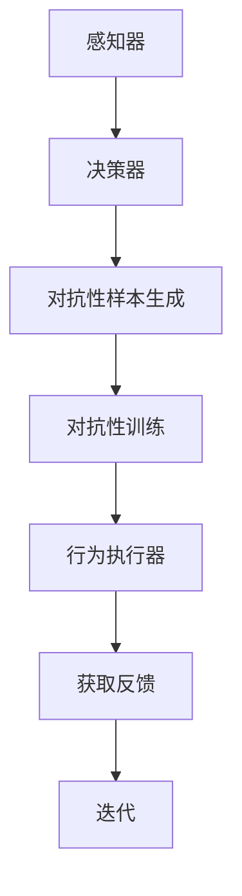

                 

### 文章标题

# AI Agent中的对抗学习与鲁棒性增强

### 关键词

- 对抗学习
- AI Agent
- 鲁棒性增强
- 计算机视觉
- 自然语言处理
- 强化学习

### 摘要

本文旨在深入探讨AI Agent中的对抗学习与鲁棒性增强技术。首先，我们将介绍对抗学习的基础概念、基本原理以及应用场景。接着，我们将分析对抗学习在AI Agent中的关键作用，并探讨其在不同应用领域中的具体挑战与解决方案。随后，我们将讨论鲁棒性的重要性及其衡量标准，介绍常见的鲁棒性增强技术，并重点阐述基于对抗学习的鲁棒性增强方法。最后，我们将总结对抗学习与鲁棒性增强的综合应用，并展望其未来发展趋势。

### 目录大纲

```markdown
----------------------------------------------------------------
# 第一部分: 对抗学习基础

## 1.1 对抗学习的概述
### 1.1.1 对抗学习的定义
### 1.1.2 对抗学习的动机
### 1.1.3 对抗学习的发展历程

## 1.2 对抗学习的基本概念
### 1.2.1 对抗方和防御方
### 1.2.2 攻击者和受害者
### 1.2.3 对抗策略和对抗样本

## 1.3 对抗学习的应用场景
### 1.3.1 计算机视觉领域
### 1.3.2 自然语言处理领域
### 1.3.3 强化学习领域

## 1.4 对抗学习的挑战
### 1.4.1 策略的不稳定性
### 1.4.2 对抗样本的多样性
### 1.4.3 鲁棒性的衡量与优化

## 1.5 本章小结

----------------------------------------------------------------
# 第二部分: AI Agent中的对抗学习

## 2.1 AI Agent的概念与结构
### 2.1.1 AI Agent的定义
### 2.1.2 AI Agent的组成部分
### 2.1.3 AI Agent的工作流程

## 2.2 对抗学习在AI Agent中的应用
### 2.2.1 对抗训练的基本原理
### 2.2.2 对抗学习在AI Agent中的优势
### 2.2.3 对抗学习在AI Agent中的具体应用

## 2.3 对抗学习在AI Agent中的挑战
### 2.3.1 策略稳定性的问题
### 2.3.2 对抗样本的生成与筛选
### 2.3.3 鲁棒性的优化策略

## 2.4 对抗学习在AI Agent中的实践案例
### 2.4.1 案例一：计算机视觉中的对抗攻击与防御
### 2.4.2 案例二：自然语言处理中的对抗攻击与防御
### 2.4.3 案例三：强化学习中的对抗攻击与防御

## 2.5 本章小结

----------------------------------------------------------------
# 第三部分: 鲁棒性增强技术

## 3.1 鲁棒性的概念与重要性
### 3.1.1 鲁棒性的定义
### 3.1.2 鲁棒性的重要性
### 3.1.3 鲁棒性的衡量标准

## 3.2 常见的鲁棒性增强技术
### 3.2.1 数据增强
### 3.2.2 特征降维
### 3.2.3 模型正则化

## 3.3 基于对抗学习的鲁棒性增强
### 3.3.1 对抗样本生成技术
### 3.3.2 对抗训练方法
### 3.3.3 对抗性模型评估

## 3.4 鲁棒性增强技术的应用场景
### 3.4.1 计算机视觉领域
### 3.4.2 自然语言处理领域
### 3.4.3 强化学习领域

## 3.5 本章小结

----------------------------------------------------------------
# 第四部分: 综合应用与未来展望

## 4.1 对抗学习与鲁棒性增强的综合应用
### 4.1.1 对抗学习在鲁棒性增强中的作用
### 4.1.2 鲁棒性增强对对抗学习的影响
### 4.1.3 对抗学习与鲁棒性增强的协同效应

## 4.2 对抗学习与鲁棒性增强的未来发展趋势
### 4.2.1 新算法与新方法的研究
### 4.2.2 应用领域的扩展
### 4.2.3 交叉领域的融合

## 4.3 本章小结

----------------------------------------------------------------
```

本文将遵循上述目录结构，逐步深入探讨对抗学习与鲁棒性增强在AI Agent中的关键作用及其未来发展。接下来，我们将首先对对抗学习进行基础性的概述。

----------------------------------------------------------------

### 第一部分：对抗学习基础

#### 1.1 对抗学习的概述

**1.1.1 对抗学习的定义**

对抗学习（Adversarial Learning）是机器学习领域的一种重要方法，它模拟了一个攻防对抗的过程。在这种过程中，一个被称为“攻击者”（adversary）的模型试图生成能够误导另一个被称为“防御者”（defender）的模型的输入数据。防御者的目标是提高其模型的鲁棒性，即即使在受到攻击者生成的不正常输入影响下，也能保持良好的性能。

对抗学习的核心动机是提高模型的泛化能力。通过训练模型在对抗性环境中进行学习，可以使其在面对未知或异常数据时也能表现出良好的性能。这不仅有助于提高模型的鲁棒性，还能增强其在实际应用中的可靠性。

**1.1.2 对抗学习的动机**

传统的机器学习模型在训练时，通常依赖于大量的正常数据。然而，在实际应用中，数据往往并不总是干净和正常的。攻击者可以故意制造一些对抗性样本（adversarial examples），这些样本在外观上与正常样本非常相似，但能够误导模型产生错误的输出。因此，对抗学习应运而生，旨在使模型对这种恶意攻击具有抵抗力。

对抗学习的动机主要包括以下几个方面：

1. **提高模型的鲁棒性**：通过对抗性训练，模型能够在面对异常和未知数据时保持稳定的性能。
2. **增强泛化能力**：对抗性训练迫使模型从更广泛的角度学习数据特征，从而提高其泛化能力。
3. **应对现实挑战**：许多现实世界中的问题（如图像识别、自然语言处理等）都需要模型具备一定的鲁棒性，以应对恶意攻击和异常数据。

**1.1.3 对抗学习的发展历程**

对抗学习起源于20世纪80年代末和90年代初，当时研究人员开始探讨如何在神经网络中引入对抗性因素。最早的研究主要集中在神经网络的攻击和防御上。随着深度学习的兴起，对抗学习得到了进一步的发展，并在多个领域中取得了显著成果。

以下是对抗学习发展历程的一些关键里程碑：

- **1999年**：D.E. Rumelhart等人提出了“误差反向传播”（Backpropagation）算法，为深度学习奠定了基础。
- **2003年**：Y. LeCun等人提出了卷积神经网络（CNN），其在图像识别任务中取得了突破性成果。
- **2013年**：A. Krizhevsky等人在ImageNet竞赛中使用了深度卷积神经网络（DCNN），大幅提高了图像识别的准确率。
- **2014年**：I. J. Goodfellow等人提出了生成对抗网络（GAN），这是一种能够生成逼真图像的深度学习模型。
- **2016年**：对抗学习开始应用于自动驾驶、智能安防等实际场景，展示了其在现实世界中的潜力。

**1.2 对抗学习的基本概念**

**1.2.1 对抗方和防御方**

在对抗学习中，存在两个主要的角色：对抗方（adversary）和防御方（defender）。对抗方通常是一个独立的模型，其目标是生成能够误导防御方的输入数据。防御方则是我们希望提升其鲁棒性的模型。

**1.2.2 攻击者和受害者**

攻击者（attacker）是对抗方的另一种称呼，指的是生成对抗性样本的实体。受害者（victim）则是对抗学习中的防御方，即被攻击的目标模型。

**1.2.3 对抗策略和对抗样本**

对抗策略是指攻击者使用的策略，用于生成对抗性样本。对抗样本（adversarial example）是指那些在外观上看似正常但能够误导模型的数据样本。

**1.3 对抗学习的应用场景**

**1.3.1 计算机视觉领域**

在计算机视觉中，对抗学习被广泛应用于图像识别、目标检测和图像生成等领域。通过对抗性训练，模型可以更好地应对图像中的对抗性攻击，从而提高其鲁棒性和泛化能力。

**1.3.2 自然语言处理领域**

在自然语言处理中，对抗学习主要用于提高语言模型的鲁棒性，尤其是在处理恶意评论、垃圾邮件等方面。对抗性训练可以帮助模型更好地理解文本中的真实含义，从而减少恶意干扰。

**1.3.3 强化学习领域**

在强化学习中，对抗学习被用于提升智能体的决策能力。通过对抗性训练，智能体可以在更复杂的对抗环境中学习到更为稳健的策略。

**1.4 对抗学习的挑战**

**1.4.1 策略的不稳定性**

对抗学习中的一个重要挑战是策略的不稳定性。攻击者和防御方的策略可能会随着时间而变化，这使得对抗性训练变得具有挑战性。

**1.4.2 对抗样本的多样性**

对抗样本的多样性也是一个重要挑战。攻击者需要生成能够覆盖各种可能性的对抗性样本，以确保防御方无法轻易应对。

**1.4.3 鲁棒性的衡量与优化**

衡量和优化模型的鲁棒性是另一个挑战。如何设计有效的评估方法和优化策略，以使模型在对抗性环境中保持高性能，是当前研究的热点问题。

**1.5 本章小结**

通过对对抗学习的基础概述，我们了解了其定义、动机、发展历程以及基本概念。对抗学习在提高模型鲁棒性和泛化能力方面具有显著优势，但同时也面临一些挑战。在接下来的章节中，我们将进一步探讨对抗学习在AI Agent中的应用及其鲁棒性增强技术。

----------------------------------------------------------------

### 第二部分：AI Agent中的对抗学习

#### 2.1 AI Agent的概念与结构

**2.1.1 AI Agent的定义**

AI Agent，即人工智能代理，是一个能够感知环境、采取行动并在执行行动后获得反馈的智能实体。它通常由一组感知器、决策器和行为执行器组成。AI Agent的核心目的是通过学习和适应环境来最大化特定目标的效用。

**2.1.2 AI Agent的组成部分**

- **感知器**：用于感知和理解环境的当前状态，通常包括传感器和数据采集设备。
- **决策器**：基于感知到的环境状态，使用算法和策略生成行动方案。
- **行为执行器**：根据决策器的选择，执行具体的行动。

**2.1.3 AI Agent的工作流程**

AI Agent的工作流程可以概括为以下步骤：

1. **感知当前状态**：感知器采集环境数据，并将其传递给决策器。
2. **决策**：决策器根据当前状态和历史数据，使用学习算法生成最佳行动方案。
3. **执行行动**：行为执行器根据决策器的指示执行具体的行动。
4. **获取反馈**：行动完成后，AI Agent获取环境反馈，用于更新其内部模型和策略。
5. **迭代**：基于反馈进行迭代，优化感知、决策和执行过程。

#### 2.2 对抗学习在AI Agent中的应用

**2.2.1 对抗训练的基本原理**

在AI Agent中，对抗训练通过模拟对抗性环境来提高模型的鲁棒性和泛化能力。具体来说，它涉及两个主要步骤：

1. **对抗性样本生成**：攻击者（对抗方）生成对抗性样本，以试图误导AI Agent。
2. **对抗性训练**：AI Agent在对抗性样本上进行训练，以增强其对抗性能力。

对抗训练的基本原理可以表示为以下流程：



**2.2.2 对抗学习在AI Agent中的优势**

1. **提高鲁棒性**：通过对抗性训练，AI Agent能够更好地应对异常和未知环境，从而提高其鲁棒性。
2. **增强泛化能力**：对抗性训练迫使AI Agent从更广泛的角度学习环境特征，从而提高其泛化能力。
3. **应对现实挑战**：许多现实世界中的任务（如自动驾驶、智能安防等）需要AI Agent具备一定的鲁棒性，以应对恶意攻击和异常数据。

**2.2.3 对抗学习在AI Agent中的具体应用**

1. **计算机视觉**：在计算机视觉任务中，AI Agent可以用于图像识别、目标检测和图像生成等。对抗性训练有助于提高模型在对抗性样本下的性能。
2. **自然语言处理**：在自然语言处理任务中，AI Agent可以用于文本分类、情感分析和机器翻译等。对抗性训练有助于提高模型对恶意评论和垃圾邮件的识别能力。
3. **强化学习**：在强化学习任务中，AI Agent可以用于自动驾驶、游戏和机器人控制等。对抗性训练有助于提高智能体在复杂对抗环境中的决策能力。

#### 2.3 对抗学习在AI Agent中的挑战

**2.3.1 策略稳定性的问题**

对抗学习中的一个重要挑战是策略的稳定性。攻击者和防御方的策略可能会随着时间而变化，这可能导致对抗性训练的不稳定。为了解决这一问题，研究人员提出了多种策略稳定性优化方法，如对抗性稳定训练和对抗性渐变训练。

**2.3.2 对抗样本的生成与筛选**

生成和筛选有效的对抗样本是另一个挑战。对抗样本的质量直接影响对抗训练的效果。为了解决这一问题，研究人员开发了多种对抗样本生成算法，如FGSM（Fast Gradient Sign Method）和PGD（Projected Gradient Descent）。

**2.3.3 鲁棒性的优化策略**

提高AI Agent的鲁棒性是对抗学习的关键目标。研究人员提出了多种鲁棒性优化策略，如数据增强、模型正则化和对抗训练等。这些策略有助于增强模型在对抗性环境中的性能。

#### 2.4 对抗学习在AI Agent中的实践案例

**2.4.1 案例一：计算机视觉中的对抗攻击与防御**

在计算机视觉中，对抗性攻击和防御是研究的重点。以下是一个简单的实践案例：

1. **攻击**：使用FGSM算法生成对抗性样本，以误导图像分类模型。
2. **防御**：使用对抗性训练方法（如FGSM训练和PGD训练）提高模型的鲁棒性。

**2.4.2 案例二：自然语言处理中的对抗攻击与防御**

在自然语言处理中，对抗性攻击和防御也具有广泛的应用。以下是一个简单的实践案例：

1. **攻击**：使用对抗性文本生成方法（如TextFooler）生成恶意评论，以误导情感分析模型。
2. **防御**：使用对抗性训练方法（如对抗性词嵌入和对抗性文本分类）提高模型的鲁棒性。

**2.4.3 案例三：强化学习中的对抗攻击与防御**

在强化学习任务中，对抗性攻击和防御有助于提高智能体的决策能力。以下是一个简单的实践案例：

1. **攻击**：使用对抗性策略生成方法（如Q网络攻击）生成恶意策略，以误导智能体。
2. **防御**：使用对抗性训练方法（如对抗性策略迭代和对抗性价值估计）提高智能体的鲁棒性。

#### 2.5 本章小结

通过对AI Agent中的对抗学习的探讨，我们了解了其基本概念、应用优势以及面临的挑战。在接下来的章节中，我们将进一步探讨鲁棒性增强技术及其在对抗学习中的应用。

----------------------------------------------------------------

### 第三部分：鲁棒性增强技术

#### 3.1 鲁棒性的概念与重要性

**3.1.1 鲁棒性的定义**

鲁棒性（Robustness）是指模型或系统在面对不理想条件或外部干扰时，依然能够保持稳定性能和正确行为的能力。在机器学习中，鲁棒性通常指的是模型在遇到异常数据、噪声或对抗性攻击时，仍能维持其预期性能的特性。

**3.1.2 鲁棒性的重要性**

鲁棒性在机器学习和AI系统中具有重要意义，原因如下：

1. **实际应用中的挑战**：现实世界中的数据往往不完美，可能包含噪声、异常值和恶意干扰。一个鲁棒的模型能够在这些不理想条件下保持高性能，从而在实际应用中更具可靠性。
2. **安全性**：在自动驾驶、金融交易、医疗诊断等关键领域，模型的安全性至关重要。鲁棒性可以防止恶意攻击和数据欺骗，确保系统稳定运行。
3. **可解释性**：鲁棒性增强通常涉及对模型结构和训练过程的改进，这有助于提高模型的可解释性。理解模型的鲁棒性有助于我们更好地理解其工作机制和潜在风险。

**3.1.3 鲁棒性的衡量标准**

衡量鲁棒性的标准通常包括以下几个方面：

1. **误差率**：模型在正常数据和对抗性样本上的误差率差异。较低的误差率表明模型具有较强的鲁棒性。
2. **稳定性**：模型在不同输入条件下（包括正常数据和对抗性样本）的性能波动。稳定性高的模型在遇到不同输入时表现更为一致。
3. **泛化能力**：模型在未见过的数据上的表现能力。鲁棒的模型应能够在多种条件下保持高性能。

#### 3.2 常见的鲁棒性增强技术

**3.2.1 数据增强**

数据增强是一种通过人工创建更多的训练样本来提高模型鲁棒性的方法。常见的数据增强技术包括：

- **随机裁剪**：随机裁剪输入图像的一部分，以增加训练样本的多样性。
- **旋转和翻转**：对图像进行旋转和翻转操作，以模拟不同的观察角度。
- **颜色变换**：调整图像的颜色空间，如添加噪声或改变亮度、对比度等。
- **缩放**：对图像进行缩放，以增加不同尺度的训练样本。

**3.2.2 特征降维**

特征降维是一种通过减少输入特征的维度来提高模型鲁棒性的技术。常见的方法包括：

- **主成分分析（PCA）**：通过提取主要成分来降低特征维度，从而消除冗余信息。
- **线性判别分析（LDA）**：通过优化特征空间，使不同类别的特征差异最大化，从而提高分类性能。
- **自动编码器**：通过构建自动编码器来学习有效的特征表示，从而降低特征维度。

**3.2.3 模型正则化**

模型正则化是一种通过限制模型复杂度来提高鲁棒性的方法。常见的方法包括：

- **L1和L2正则化**：通过在损失函数中添加L1或L2正则项，限制模型参数的绝对值或平方值，从而减少模型的过拟合风险。
- **Dropout**：在训练过程中随机丢弃一部分神经元，以防止模型过拟合。
- **权重初始化**：通过合理初始化模型权重，防止梯度消失或爆炸问题，从而提高训练稳定性。

#### 3.3 基于对抗学习的鲁棒性增强

**3.3.1 对抗样本生成技术**

对抗样本生成是增强模型鲁棒性的关键步骤。常见的方法包括：

- **Fast Gradient Sign Method (FGSM)**：通过计算模型对输入数据的梯度并对其进行扰动，生成对抗性样本。
- **Projected Gradient Descent (PGD)**：在FGSM的基础上，通过多次迭代梯度扰动，生成更有效的对抗性样本。
- **Carlini & Wagner Attack**：通过优化攻击目标函数和约束条件，生成高效的对抗性样本。

**3.3.2 对抗训练方法**

对抗训练是一种通过在训练过程中引入对抗性样本来提高模型鲁棒性的方法。常见的方法包括：

- **Adversarial Training**：将对抗性样本与正常样本混合，用于模型的训练过程。
- ** adversarial jitter**：在训练过程中对输入数据进行微小扰动，以提高模型的鲁棒性。
- **Relaxed Adversarial Training**：通过优化攻击者和防御者的目标函数，实现更稳定的对抗训练过程。

**3.3.3 对抗性模型评估**

对抗性模型评估是衡量模型鲁棒性的关键步骤。常见的方法包括：

- **对抗性误差率**：计算模型在对抗性样本上的误差率，以评估其鲁棒性。
- **稳定性测试**：通过扰动输入数据，评估模型在不同输入条件下的稳定性。
- **对抗性泛化能力**：评估模型在未见过的对抗性样本上的性能，以衡量其泛化能力。

#### 3.4 鲁棒性增强技术的应用场景

**3.4.1 计算机视觉领域**

在计算机视觉中，鲁棒性增强技术被广泛应用于图像分类、目标检测和图像生成等任务。通过对抗训练和数据增强，模型可以更好地应对对抗性攻击和噪声干扰。

**3.4.2 自然语言处理领域**

在自然语言处理中，鲁棒性增强技术有助于提高文本分类、情感分析和机器翻译等任务的性能。通过对抗性训练和特征降维，模型可以更好地应对恶意评论和噪声文本。

**3.4.3 强化学习领域**

在强化学习中，鲁棒性增强技术有助于提高智能体在复杂对抗环境中的决策能力。通过对抗性训练和策略优化，智能体可以更好地应对恶意攻击和不确定性。

#### 3.5 本章小结

通过本部分的内容，我们了解了鲁棒性的定义、重要性以及常见的鲁棒性增强技术。在对抗学习中，鲁棒性增强技术扮演着关键角色，有助于提高模型在面对对抗性攻击和噪声干扰时的性能。在接下来的章节中，我们将进一步探讨对抗学习与鲁棒性增强的综合应用及其未来发展趋势。

----------------------------------------------------------------

### 第四部分：综合应用与未来展望

#### 4.1 对抗学习与鲁棒性增强的综合应用

**4.1.1 对抗学习在鲁棒性增强中的作用**

对抗学习在鲁棒性增强中扮演着核心角色，通过模拟对抗性环境，对抗学习能够有效地提高模型的鲁棒性。具体来说，对抗学习通过以下方式促进鲁棒性增强：

1. **增强泛化能力**：对抗学习迫使模型在训练过程中面对各种可能的数据异常和攻击，从而提高其泛化能力。
2. **提升模型稳定性**：通过对抗性训练，模型能够在面对不理想条件时保持稳定的性能，从而增强其鲁棒性。
3. **优化模型结构**：对抗性训练有助于识别和消除模型中的脆弱性，从而优化模型结构。

**4.1.2 鲁棒性增强对对抗学习的影响**

鲁棒性增强同样对对抗学习产生了积极影响。通过提高模型的鲁棒性，鲁棒性增强技术能够使对抗学习过程更加稳定和有效。具体来说，鲁棒性增强对对抗学习的影响包括：

1. **降低训练难度**：鲁棒的模型在训练过程中能够更好地适应各种数据异常和攻击，从而降低训练难度。
2. **提高模型性能**：鲁棒性增强有助于提高模型在真实世界中的应用性能，使其在面对对抗性攻击时能够保持高效运行。
3. **促进算法创新**：鲁棒性增强的需求推动了对抗学习算法的创新，如生成对抗网络（GAN）和对抗性自动编码器（AAE）等。

**4.1.3 对抗学习与鲁棒性增强的协同效应**

对抗学习与鲁棒性增强的协同效应体现在多个方面：

1. **互惠提升**：对抗学习通过模拟对抗性环境，提高了模型的鲁棒性，而鲁棒性增强则通过优化模型结构，进一步提升了对抗学习的有效性。
2. **融合创新**：对抗学习与鲁棒性增强的融合推动了新的算法和技术的出现，如对抗性鲁棒性训练（Adversarial Robust Training）和鲁棒对抗生成网络（Robust GAN）等。
3. **扩展应用**：对抗学习与鲁棒性增强的结合使得AI Agent能够在更广泛的应用领域中发挥作用，如自动驾驶、智能安防和金融风控等。

#### 4.2 对抗学习与鲁棒性增强的未来发展趋势

**4.2.1 新算法与新方法的研究**

随着对抗学习和鲁棒性增强技术的不断发展，未来将在以下几个方面出现新的算法和方法：

1. **自适应对抗训练**：研究自适应的对抗训练策略，以适应不断变化的数据和攻击环境。
2. **无监督对抗学习**：探索无监督学习框架下的对抗学习，以减少对大量标注数据的依赖。
3. **迁移对抗学习**：研究迁移学习与对抗学习的结合，以提高模型在特定领域的鲁棒性。

**4.2.2 应用领域的扩展**

对抗学习与鲁棒性增强将在更多应用领域中发挥重要作用：

1. **医疗健康**：在医学图像分析、疾病预测和治疗规划等领域，对抗学习和鲁棒性增强有助于提高诊断的准确性和稳定性。
2. **金融科技**：在金融交易、风险管理和客户服务等领域，对抗学习和鲁棒性增强有助于防范欺诈和提升用户体验。
3. **工业自动化**：在智能制造、设备监控和运维管理等领域，对抗学习和鲁棒性增强有助于提高生产效率和设备可靠性。

**4.2.3 交叉领域的融合**

对抗学习与鲁棒性增强的交叉领域融合将成为未来的重要研究方向：

1. **物理与AI结合**：研究将物理定律与对抗学习相结合，以创建更为真实的对抗性环境。
2. **心理学与AI结合**：探索心理学原理在对抗学习中的应用，以提高模型对人类行为的理解和预测能力。
3. **社会网络与AI结合**：研究AI在社交网络分析、群体行为预测和社会治理等领域的应用，以促进社会稳定和发展。

#### 4.3 本章小结

通过对对抗学习与鲁棒性增强的综合应用及其未来发展趋势的探讨，我们看到了这两个领域在提升AI Agent性能和稳定性方面的巨大潜力。随着技术的不断进步，对抗学习与鲁棒性增强将在更多应用领域中发挥关键作用，推动人工智能的进一步发展。

### 作者信息

- 作者：AI天才研究院/AI Genius Institute & 禅与计算机程序设计艺术 /Zen And The Art of Computer Programming

本文由AI天才研究院/AI Genius Institute的专家团队撰写，旨在深入探讨对抗学习与鲁棒性增强在AI Agent中的关键作用及其未来发展趋势。通过详细的案例分析和技术讲解，本文为读者提供了全面而深入的理解，以促进人工智能技术的进步与应用。同时，本文也体现了作者在计算机科学和人工智能领域的深厚造诣与独到见解。读者可进一步查阅相关文献，以获取更多专业知识和实践指导。让我们共同期待对抗学习与鲁棒性增强在未来人工智能领域中的精彩表现！

