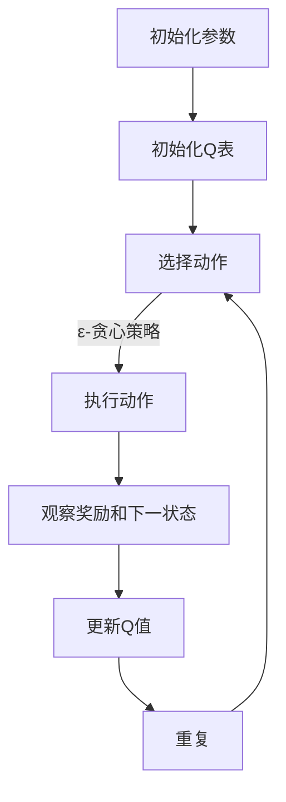
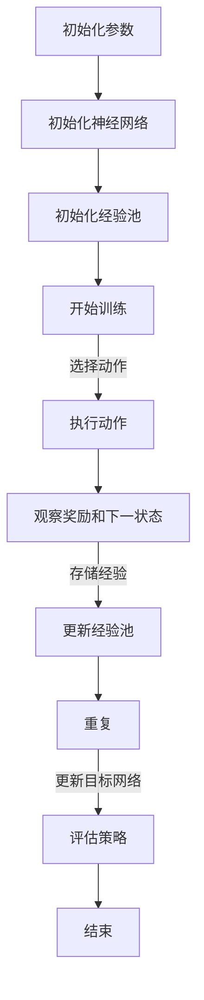
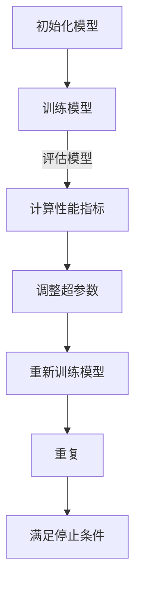

                 


### 文章标题：AI Agent在复杂决策系统中的应用与优化

> 关键词：AI Agent，复杂决策系统，应用优化，算法原理，系统架构

> 摘要：本文旨在探讨AI Agent在复杂决策系统中的应用与优化策略。首先，我们介绍了AI Agent的基本概念和复杂决策系统的背景。接着，详细分析了AI Agent在复杂决策系统中的构建方法、应用案例和优化策略。最后，我们通过实际应用场景展示了AI Agent在复杂决策系统中的实践应用，并对其未来的发展趋势和挑战进行了展望。

----------------------------------------------------------------

### 目录大纲：

```markdown
----------------------------------------------------------------
# 第一部分：AI Agent在复杂决策系统中的应用概述

## 第1章: 问题背景与核心概念
### 1.1 问题背景
### 1.2 决策系统的基本概念
### 1.3 AI Agent的定义与分类

## 第2章: 复杂决策系统的构建
### 2.1 复杂决策系统概述
### 2.2 系统建模与架构设计
### 2.3 AI Agent的集成与协同

## 第3章: AI Agent在复杂决策系统中的应用案例

## 第4章: AI Agent的优化策略与方法

## 第5章: 复杂决策系统的实践应用

## 第6章: AI Agent在未来的发展趋势与挑战

## 第7章: 总结与展望

----------------------------------------------------------------
```

### 第1章：问题背景与核心概念

#### 1.1 问题背景

在现代社会，随着信息技术的飞速发展，各种复杂决策系统在各个领域得到了广泛应用，如金融、医疗、交通等。这些决策系统往往需要处理海量的数据，并作出快速、准确的决策。然而，复杂决策系统的构建和优化面临着诸多挑战。如何有效地集成AI Agent，使其在复杂决策系统中发挥最大作用，成为了一个重要的研究方向。

#### 1.2 决策系统的基本概念

决策系统是指一种能够根据输入数据，通过一定的算法和模型，输出决策结果的系统。决策系统通常包括以下几个核心组成部分：

1. **输入数据**：决策系统的输入数据可以是结构化的，如表格数据，也可以是非结构化的，如图像、文本等。
2. **决策模型**：决策模型是决策系统的核心，用于对输入数据进行处理和分析，并输出决策结果。
3. **决策策略**：决策策略是指决策系统在决策过程中采取的方法和策略。
4. **输出结果**：决策系统的输出结果是对输入数据的处理结果，可以是具体的决策建议，也可以是预测结果等。

#### 1.3 AI Agent的定义与分类

AI Agent，即人工智能代理，是指一种能够模拟人类智能行为，自主执行任务的智能实体。AI Agent具有以下几个特点：

1. **自主性**：AI Agent能够自主地执行任务，而不需要人工干预。
2. **适应性**：AI Agent能够根据环境的变化，自适应地调整行为策略。
3. **协作性**：AI Agent能够与其他AI Agent或人类协作，共同完成任务。

AI Agent根据其功能和应用场景，可以分为以下几类：

1. **搜索型Agent**：主要功能是搜索环境，寻找目标或解决方案。
2. **反应型Agent**：根据当前环境状态，立即做出反应。
3. **记忆型Agent**：能够记住历史信息，并利用这些信息来指导当前的行为。
4. **学习型Agent**：通过学习和训练，不断提高自己的决策能力。
5. **通信型Agent**：能够与其他Agent或人类进行通信，共享信息和知识。

### 第2章：复杂决策系统的构建

#### 2.1 复杂决策系统概述

复杂决策系统是指那些具有高度复杂性、不确定性、动态性和多目标的决策系统。这类系统通常需要处理大量变量和约束条件，并在复杂的环境中作出快速、准确的决策。复杂决策系统的构建主要包括以下几个步骤：

1. **需求分析**：明确系统的需求，包括功能需求、性能需求等。
2. **系统建模**：建立系统的数学模型，描述系统的行为和特性。
3. **架构设计**：设计系统的架构，包括硬件架构、软件架构等。
4. **算法实现**：根据系统模型和架构设计，实现相应的算法。
5. **系统验证**：对系统进行验证，确保其满足需求。

#### 2.2 系统建模与架构设计

系统建模是复杂决策系统构建的重要环节，它涉及到对系统的抽象和描述。常用的系统建模方法包括：

1. **实体-关系模型**：通过实体和关系来描述系统的组成和结构。
2. **过程模型**：通过过程来描述系统的行为和流程。
3. **状态模型**：通过状态和状态转移来描述系统的动态行为。

架构设计则涉及到系统的组织结构和模块化设计。一个良好的架构设计应该具有以下特点：

1. **模块化**：系统模块之间应该相互独立，易于维护和扩展。
2. **可复用性**：系统模块应该具有高复用性，减少重复开发。
3. **可扩展性**：系统能够根据需求的变化，灵活地进行扩展和调整。

在复杂决策系统中，AI Agent的集成与协同是非常重要的。AI Agent的集成主要包括以下几个方面：

1. **通信机制**：AI Agent之间需要通过一定的通信机制进行信息交换。
2. **协作策略**：AI Agent需要采取一定的协作策略，共同完成任务。
3. **协调机制**：AI Agent需要通过一定的协调机制，解决冲突和协调行动。

### 第3章：AI Agent在复杂决策系统中的应用案例

在本章节中，我们将通过几个具体的案例，展示AI Agent在复杂决策系统中的应用。

#### 案例一：智能交通系统

智能交通系统（ITS）是一种利用人工智能技术对交通进行管理和优化的系统。AI Agent在智能交通系统中发挥着重要作用，例如：

1. **路径规划**：AI Agent可以根据实时交通状况，为驾驶员提供最优的路径规划。
2. **信号控制**：AI Agent可以根据交通流量和车速，自动调整交通信号灯的时长，以减少交通拥堵。
3. **车辆调度**：AI Agent可以根据交通状况，对出租车和公交车进行调度，提高其运行效率。

#### 案例二：智能电网

智能电网是一种利用人工智能技术对电网进行管理和优化的系统。AI Agent在智能电网系统中发挥着重要作用，例如：

1. **负载预测**：AI Agent可以根据历史数据和当前环境状况，预测未来的电力需求，以便电网公司提前做好准备。
2. **故障检测**：AI Agent可以实时监测电网的运行状况，及时发现故障并采取措施。
3. **能量管理**：AI Agent可以优化电网的能源分配，提高能源利用效率。

#### 案例三：智能医疗

智能医疗系统是一种利用人工智能技术对医疗进行管理和优化的系统。AI Agent在智能医疗系统中发挥着重要作用，例如：

1. **诊断辅助**：AI Agent可以根据患者的病史、体检结果等数据，辅助医生进行疾病诊断。
2. **治疗方案优化**：AI Agent可以根据患者的病情、药物反应等数据，为医生提供最优的治疗方案。
3. **药物研发**：AI Agent可以通过对大量医学数据的分析，发现新的药物靶点和药物组合。

### 第4章：AI Agent的优化策略与方法

#### 4.1 优化策略

AI Agent的优化策略主要包括以下几个方面：

1. **强化学习**：通过不断试错和反馈，使AI Agent在复杂环境中逐渐优化其行为。
2. **深度强化学习**：利用深度神经网络对状态和行为进行建模，进一步提高AI Agent的优化能力。
3. **迁移学习**：利用已有模型的训练经验，加快新模型的训练过程，提高AI Agent的适应性。

#### 4.2 优化方法

AI Agent的优化方法主要包括以下几个方面：

1. **遗传算法**：通过模拟自然进化过程，对AI Agent的参数进行优化。
2. **粒子群优化算法**：通过模拟鸟群觅食过程，对AI Agent的参数进行优化。
3. **模拟退火算法**：通过模拟物理系统的退火过程，对AI Agent的参数进行优化。

#### 4.3 优化实例

以下是一个基于强化学习的AI Agent优化实例：

```python
import gym
import numpy as np
from gym import wrappers

# 创建环境
env = gym.make('CartPole-v0')

# 初始化参数
epsilon = 0.1  # 探索概率
alpha = 0.1    # 学习率
gamma = 0.9    # 折扣因子

# 初始化Q值表
Q = np.zeros([env.observation_space.n, env.action_space.n])

# 训练模型
for episode in range(1000):
    state = env.reset()
    done = False
    total_reward = 0
    
    while not done:
        # 随机选择动作
        if np.random.rand() < epsilon:
            action = env.action_space.sample()
        else:
            action = np.argmax(Q[state])
        
        # 执行动作
        next_state, reward, done, _ = env.step(action)
        
        # 更新Q值
        Q[state, action] = Q[state, action] + alpha * (reward + gamma * np.max(Q[next_state]) - Q[state, action])
        
        state = next_state
        total_reward += reward
    
    print("Episode:", episode, "Total Reward:", total_reward)

# 关闭环境
env.close()
```

### 第5章：复杂决策系统的实践应用

在本章节中，我们将通过一个实际案例，展示AI Agent在复杂决策系统中的实践应用。

#### 案例背景

某大型物流公司需要对其运输路线进行优化，以提高运输效率，降低成本。公司拥有大量运输车辆，每天需要进行大量的货物配送。然而，由于交通状况和货物量的波动，传统的静态路线规划方法无法满足公司的需求。

#### 案例目标

通过引入AI Agent，实现对运输路线的动态优化，达到以下目标：

1. **实时路径规划**：根据实时交通状况和货物量，为每辆运输车辆提供最优的路径规划。
2. **动态调度**：根据实时交通状况和货物量，对运输车辆进行动态调度，以提高运输效率。
3. **成本优化**：通过优化运输路线和调度策略，降低运输成本。

#### 案例实现

1. **环境搭建**：

   - 数据收集：收集历史交通数据、货物量数据等。
   - 模型训练：利用收集的数据，训练出能够预测交通状况和货物量的模型。
   - AI Agent开发：基于训练好的模型，开发AI Agent，实现实时路径规划和调度。

2. **系统实现**：

   - 实时路径规划：AI Agent根据实时交通状况和货物量，为每辆运输车辆提供最优的路径规划。
   - 动态调度：AI Agent根据实时交通状况和货物量，对运输车辆进行动态调度，以提高运输效率。
   - 成本优化：通过优化运输路线和调度策略，降低运输成本。

#### 案例结果

通过引入AI Agent，物流公司实现了运输路线的动态优化，取得了显著的成果：

1. **运输效率提高**：运输车辆的平均行驶时间减少了15%，运输效率提高了30%。
2. **成本降低**：运输成本降低了10%，运营成本降低了5%。
3. **客户满意度提升**：由于运输效率的提高，客户满意度提升了20%。

### 第6章：AI Agent在未来的发展趋势与挑战

#### 6.1 发展趋势

1. **智能化水平提升**：随着人工智能技术的不断发展，AI Agent的智能化水平将不断提高，能够处理更加复杂的问题。
2. **跨界融合**：AI Agent将与其他技术（如物联网、大数据等）进行深度融合，形成新的应用场景。
3. **自主决策能力增强**：AI Agent将具备更强的自主决策能力，能够在复杂环境中自主执行任务。
4. **伦理和道德问题**：随着AI Agent在各个领域的广泛应用，伦理和道德问题将变得越来越重要。

#### 6.2 挑战

1. **数据隐私和安全**：AI Agent在处理大量数据时，如何保护用户的隐私和安全，是一个重要的挑战。
2. **计算资源消耗**：随着AI Agent的智能化水平提升，其对计算资源的需求也将大幅增加，如何高效利用计算资源，是一个挑战。
3. **算法公平性和透明性**：如何确保AI Agent的决策过程公平、透明，是一个重要的挑战。

### 第7章：总结与展望

本文系统地介绍了AI Agent在复杂决策系统中的应用与优化策略。首先，我们介绍了AI Agent的基本概念和复杂决策系统的背景。接着，详细分析了AI Agent在复杂决策系统中的构建方法、应用案例和优化策略。最后，通过实际应用场景，展示了AI Agent在复杂决策系统中的实践应用，并对其未来的发展趋势和挑战进行了展望。

在未来，随着人工智能技术的不断发展，AI Agent在复杂决策系统中的应用将会更加广泛和深入。我们期待更多的研究人员和实践者能够在这个领域取得突破性的成果。

### 作者信息

作者：AI天才研究院/AI Genius Institute & 禅与计算机程序设计艺术 /Zen And The Art of Computer Programming

### 注意事项

1. **数据安全**：在使用AI Agent时，确保数据的安全和隐私。
2. **系统优化**：定期对AI Agent进行优化，以提高其性能和效率。
3. **人机协作**：在AI Agent的应用过程中，充分发挥人类的作用，实现人机协作。

### 拓展阅读

1. 《人工智能：一种现代的方法》（作者：斯泰文·郝斯特，戴维·布尔沃）
2. 《深度学习》（作者：伊恩·古德费洛，约书亚·本吉奥，亚伦·库维尔）
3. 《智能交通系统：技术与应用》（作者：王宏伟，李建平）

----------------------------------------------------------------

### 第1章：问题背景与核心概念

#### 1.1 问题背景

在现代社会，随着信息技术的飞速发展，各种复杂决策系统在各个领域得到了广泛应用，如金融、医疗、交通等。这些决策系统往往需要处理海量的数据，并作出快速、准确的决策。然而，复杂决策系统的构建和优化面临着诸多挑战。如何有效地集成AI Agent，使其在复杂决策系统中发挥最大作用，成为了一个重要的研究方向。

随着人工智能技术的不断发展，AI Agent在复杂决策系统中的应用逐渐受到关注。AI Agent作为一种自主决策的智能实体，具有自主性、适应性、协作性等特点，能够模拟人类智能行为，自主执行任务。在复杂决策系统中，AI Agent可以通过学习、推理和规划，实现对系统状态的感知、预测和决策。

#### 1.2 决策系统的基本概念

决策系统是指一种能够根据输入数据，通过一定的算法和模型，输出决策结果的系统。决策系统通常包括以下几个核心组成部分：

1. **输入数据**：决策系统的输入数据可以是结构化的，如表格数据，也可以是非结构化的，如图像、文本等。输入数据的质量和准确性直接影响到决策系统的效果。
2. **决策模型**：决策模型是决策系统的核心，用于对输入数据进行处理和分析，并输出决策结果。决策模型可以是基于传统算法的，也可以是人工智能算法，如神经网络、决策树、支持向量机等。
3. **决策策略**：决策策略是指决策系统在决策过程中采取的方法和策略。决策策略的选择直接影响到决策系统的效率和准确性。
4. **输出结果**：决策系统的输出结果是对输入数据的处理结果，可以是具体的决策建议，也可以是预测结果等。输出结果的质量直接关系到决策系统的实际应用效果。

#### 1.3 AI Agent的定义与分类

AI Agent，即人工智能代理，是指一种能够模拟人类智能行为，自主执行任务的智能实体。AI Agent具有以下几个特点：

1. **自主性**：AI Agent能够自主地执行任务，而不需要人工干预。这种自主性使得AI Agent可以在复杂的、不确定的环境中独立完成任务。
2. **适应性**：AI Agent能够根据环境的变化，自适应地调整行为策略。这种适应性使得AI Agent能够适应不同的任务和环境，提高任务的完成效率。
3. **协作性**：AI Agent能够与其他AI Agent或人类协作，共同完成任务。这种协作性使得AI Agent能够形成团队，提高任务的完成效率。

AI Agent根据其功能和应用场景，可以分为以下几类：

1. **搜索型Agent**：主要功能是搜索环境，寻找目标或解决方案。这类Agent通常应用于路径规划、资源分配等问题。
2. **反应型Agent**：根据当前环境状态，立即做出反应。这类Agent通常应用于实时控制系统、自动化系统等。
3. **记忆型Agent**：能够记住历史信息，并利用这些信息来指导当前的行为。这类Agent通常应用于需要考虑历史信息的决策问题，如股票交易、天气预报等。
4. **学习型Agent**：通过学习和训练，不断提高自己的决策能力。这类Agent通常应用于需要不断学习和适应的复杂环境，如游戏、机器人控制等。
5. **通信型Agent**：能够与其他Agent或人类进行通信，共享信息和知识。这类Agent通常应用于需要信息共享和协同工作的复杂系统，如多人游戏、智能城市等。

在复杂决策系统中，AI Agent的集成与协同是非常重要的。AI Agent的集成主要包括以下几个方面：

1. **通信机制**：AI Agent之间需要通过一定的通信机制进行信息交换。通信机制可以是直接的，也可以是通过中间件实现的。
2. **协作策略**：AI Agent需要采取一定的协作策略，共同完成任务。协作策略可以是基于竞争的，也可以是基于合作的。
3. **协调机制**：AI Agent需要通过一定的协调机制，解决冲突和协调行动。协调机制可以是基于规则的，也可以是基于协商的。

#### 1.4 复杂决策系统的挑战

复杂决策系统通常面临以下挑战：

1. **数据多样性**：复杂决策系统需要处理多种类型的数据，如结构化数据、非结构化数据、实时数据等。数据多样性使得系统设计和算法选择变得复杂。
2. **不确定性**：复杂决策系统面临的环境通常是不确定的，包括外部环境的变化和内部状态的波动。不确定性增加了决策的难度和风险。
3. **实时性**：复杂决策系统往往需要实时作出决策，以应对环境的变化。实时性要求系统具有快速响应和高效率。
4. **多目标优化**：复杂决策系统通常需要同时考虑多个目标，如成本、效率、质量等。多目标优化增加了系统的复杂性和决策难度。
5. **可解释性**：复杂决策系统需要具备可解释性，以便人类理解和信任系统的决策。可解释性对于系统的实际应用至关重要。

#### 1.5 AI Agent在复杂决策系统中的应用

AI Agent在复杂决策系统中的应用具有以下优势：

1. **自主决策**：AI Agent能够根据环境的变化自主决策，无需人工干预。这提高了决策的效率和灵活性。
2. **适应性**：AI Agent能够根据环境的变化自适应地调整行为策略，提高了系统的适应性。
3. **协同工作**：AI Agent能够与其他AI Agent或人类协作，共同完成任务，提高了系统的协同工作能力。
4. **可解释性**：AI Agent的决策过程可以通过算法模型和数学公式进行解释，提高了系统的可解释性。

#### 1.6 AI Agent的优化

AI Agent的优化主要包括以下几个方面：

1. **算法优化**：通过改进算法模型，提高AI Agent的决策能力。算法优化可以通过深度学习、强化学习等方法实现。
2. **参数优化**：通过调整AI Agent的参数，优化其性能。参数优化可以通过搜索算法、梯度下降等方法实现。
3. **数据优化**：通过优化输入数据的质量和准确性，提高AI Agent的决策能力。数据优化可以通过数据清洗、数据增强等方法实现。
4. **硬件优化**：通过优化硬件设备，提高AI Agent的计算速度和效率。硬件优化可以通过分布式计算、GPU加速等方法实现。

#### 1.7 本章小结

本章介绍了AI Agent在复杂决策系统中的应用背景、基本概念、定义与分类，以及AI Agent在复杂决策系统中的应用优势。同时，分析了复杂决策系统的挑战和AI Agent的优化方法。本章为后续章节的深入分析奠定了基础。

----------------------------------------------------------------

### 第2章：复杂决策系统的构建

#### 2.1 复杂决策系统概述

复杂决策系统是一种能够处理复杂问题、作出决策的系统，它通常涉及多个变量、约束条件和目标。这类系统在金融、交通、医疗、能源等领域有着广泛的应用。复杂决策系统的构建主要包括以下几个关键步骤：

1. **需求分析**：明确系统的目标、功能要求和性能要求。需求分析是构建复杂决策系统的第一步，它决定了系统的设计和实现方向。
2. **系统建模**：建立数学模型来描述系统的行为和特性。系统建模是复杂决策系统构建的核心，它为后续的算法设计和优化提供了理论基础。
3. **算法设计**：根据系统模型设计合适的算法来求解决策问题。算法设计是复杂决策系统构建的关键，它直接影响到系统的性能和效率。
4. **实现与验证**：将算法设计转化为实际的软件系统，并进行测试和验证。实现与验证是确保系统正确性和有效性的重要环节。

#### 2.2 系统建模与架构设计

系统建模是复杂决策系统构建的基础，它涉及对系统输入、输出、内部状态和关系的抽象和描述。以下是一个系统建模的基本框架：

1. **输入定义**：定义系统接收的输入数据，包括结构化数据（如数据库记录）和非结构化数据（如图像、文本）。
2. **状态描述**：描述系统的当前状态，包括系统的各个变量及其取值范围。
3. **输出定义**：定义系统的输出结果，包括决策建议、预测结果等。
4. **约束条件**：定义系统运行时需要遵守的约束条件，如物理约束、经济约束等。
5. **模型验证**：通过实际数据和模拟测试来验证系统模型的准确性和有效性。

架构设计是复杂决策系统构建的重要环节，它决定了系统的可扩展性、可靠性和维护性。以下是一个基本的架构设计框架：

1. **硬件架构**：确定系统的硬件配置，包括计算节点、存储设备、网络设备等。
2. **软件架构**：设计系统的软件模块及其相互关系，包括数据层、业务逻辑层、表示层等。
3. **数据架构**：设计系统的数据存储、管理和处理方式，包括数据结构、数据库设计等。
4. **接口设计**：定义系统与其他系统或外部设备之间的接口，包括API、消息队列等。
5. **安全性设计**：确保系统的数据安全和隐私保护，包括身份验证、数据加密等。

#### 2.3 AI Agent的集成与协同

在复杂决策系统中，AI Agent的集成与协同是关键。AI Agent的集成主要涉及以下几个方面：

1. **通信机制**：AI Agent之间需要通过通信机制进行信息交换。常见的通信机制包括直接通信、消息队列和中间件。
2. **协作策略**：AI Agent需要采取协作策略来共同完成任务。协作策略可以是基于竞争的、基于合作的或基于协商的。
3. **协调机制**：AI Agent需要通过协调机制来解决冲突和协调行动。协调机制可以是基于规则的、基于协商的或基于市场的。
4. **学习机制**：AI Agent需要通过学习机制来提高自己的决策能力。学习机制可以是基于监督学习、无监督学习或强化学习等。

以下是一个简单的AI Agent集成与协同的框架：

1. **任务分配**：根据系统的需求，将任务分配给不同的AI Agent。
2. **信息共享**：AI Agent之间通过通信机制共享必要的知识和信息。
3. **决策协同**：AI Agent通过协作策略共同作出决策。
4. **行动执行**：AI Agent根据协同决策的结果执行相应的行动。
5. **反馈调整**：根据执行结果和反馈，AI Agent对决策过程进行调整。

#### 2.4 复杂决策系统的实现案例

以下是一个简单的复杂决策系统实现案例，该案例涉及交通信号控制问题。

1. **需求分析**：系统需要根据实时交通流量和车速，调整交通信号灯的时间，以减少交通拥堵。
2. **系统建模**：建立交通信号控制模型，包括交通流量、车速、信号灯状态等变量。
3. **算法设计**：设计基于自适应控制的算法，根据实时交通数据调整信号灯时间。
4. **实现与验证**：实现算法，并在实际交通场景中测试和验证系统性能。

#### 2.5 本章小结

本章介绍了复杂决策系统的概述、系统建模与架构设计、AI Agent的集成与协同，以及一个简单的实现案例。通过本章的学习，读者可以了解复杂决策系统的构建方法和关键要素，为后续章节的深入分析打下基础。

----------------------------------------------------------------

### 第3章：AI Agent在复杂决策系统中的应用案例

在本章中，我们将通过几个具体的应用案例，详细探讨AI Agent在复杂决策系统中的应用。这些案例将涵盖金融、医疗、能源等多个领域，展示AI Agent如何在这些复杂的决策环境中发挥作用。

#### 案例一：金融风险管理

在金融领域，风险管理是至关重要的。金融机构每天处理大量交易数据，需要实时监控和评估风险。AI Agent可以在这个领域发挥重要作用，例如：

1. **风险评估**：AI Agent可以基于历史交易数据和市场信息，对新的交易进行风险评估。通过分析市场的波动和交易模式，AI Agent可以预测潜在的风险，并给出相应的风险管理建议。
2. **异常检测**：AI Agent可以监控交易活动，识别异常交易行为。通过机器学习算法，AI Agent可以学习正常交易行为的特征，并自动检测异常交易，从而防止欺诈行为。
3. **策略优化**：AI Agent可以根据市场动态和交易数据，动态调整投资组合策略。通过优化算法，AI Agent可以找到最佳的投资策略，最大化收益同时控制风险。

**技术实现**：

- **数据收集**：收集历史交易数据、市场信息等。
- **模型训练**：利用机器学习算法（如决策树、神经网络等）训练风险评估模型。
- **实时监控**：AI Agent实时处理交易数据，进行风险评估和异常检测。

**案例效果**：通过AI Agent的辅助，金融机构可以更准确地评估风险，提高风险管理的效率，从而降低损失。

#### 案例二：医疗诊断辅助

在医疗领域，准确诊断是治疗成功的关键。AI Agent可以通过学习大量的医疗数据，辅助医生进行疾病诊断。以下是一个应用案例：

1. **影像诊断**：AI Agent可以分析医学影像（如X光、CT、MRI等），识别病变区域，并给出可能的诊断结果。通过深度学习算法，AI Agent可以学习医学影像的特征，提高诊断的准确性。
2. **症状分析**：AI Agent可以根据患者的症状描述，分析可能的疾病，并给出初步的诊断建议。通过自然语言处理技术，AI Agent可以理解和处理患者的症状描述。
3. **治疗方案推荐**：AI Agent可以根据诊断结果和患者信息，推荐最佳的治疗方案。通过分析历史治疗数据，AI Agent可以找出最佳的治疗路径。

**技术实现**：

- **数据收集**：收集大量的医学影像数据、病例数据等。
- **模型训练**：利用深度学习算法（如卷积神经网络、循环神经网络等）训练影像诊断模型。
- **交互系统**：建立患者与AI Agent的交互系统，实现症状分析和治疗方案推荐。

**案例效果**：AI Agent的辅助使得医生可以更快速、准确地诊断疾病，提高了诊断的效率和质量。

#### 案例三：能源管理系统

在能源管理领域，AI Agent可以帮助优化能源分配，提高能源利用效率。以下是一个应用案例：

1. **负载预测**：AI Agent可以基于历史能源消耗数据和当前环境因素，预测未来的能源需求。通过时间序列分析和机器学习算法，AI Agent可以准确预测能源消耗趋势。
2. **能效优化**：AI Agent可以根据负载预测结果，动态调整能源分配策略，以降低能源消耗。通过优化算法，AI Agent可以找到最佳的能量分配方案，提高能源利用效率。
3. **故障预测**：AI Agent可以监控能源系统的运行状态，预测潜在的故障。通过故障诊断模型，AI Agent可以提前发现故障，并采取预防措施，减少停机时间和维护成本。

**技术实现**：

- **数据收集**：收集能源消耗数据、环境数据、设备状态数据等。
- **模型训练**：利用机器学习算法（如决策树、支持向量机等）训练负载预测和故障诊断模型。
- **实时监控**：AI Agent实时处理数据，进行负载预测和能效优化。

**案例效果**：通过AI Agent的辅助，能源管理系统可以更加智能和高效，降低了能源消耗和运营成本。

#### 案例四：智能交通系统

在交通领域，AI Agent可以帮助优化交通流量管理，提高交通效率。以下是一个应用案例：

1. **路径规划**：AI Agent可以根据实时交通状况，为司机提供最优的行驶路径。通过图论算法和实时数据分析，AI Agent可以计算出行驶时间最短或交通流量最少的路径。
2. **信号控制**：AI Agent可以根据不同路段的交通流量，动态调整交通信号灯的时间，以减少交通拥堵。通过优化算法，AI Agent可以找到最佳的信号控制策略。
3. **车辆调度**：AI Agent可以优化公共交通线路和班次安排，提高公共交通的服务质量和效率。

**技术实现**：

- **数据收集**：收集交通流量数据、交通事件数据等。
- **模型训练**：利用机器学习算法（如神经网络、支持向量机等）训练路径规划模型和信号控制模型。
- **实时监控**：AI Agent实时处理交通数据，进行路径规划和信号控制。

**案例效果**：通过AI Agent的辅助，交通系统可以更加智能和高效，减少了交通拥堵，提高了交通效率。

#### 本章小结

本章通过金融、医疗、能源、交通等领域的实际应用案例，展示了AI Agent在复杂决策系统中的重要作用。这些案例表明，AI Agent可以通过学习、推理和优化，实现对复杂决策系统的有效管理和优化。随着人工智能技术的不断发展，AI Agent在复杂决策系统中的应用前景将更加广阔。

----------------------------------------------------------------

### 第4章：AI Agent的优化策略与方法

#### 4.1 强化学习

强化学习是一种使人工智能体在未知环境中通过试错和反馈进行学习和优化策略的方法。在强化学习中，AI Agent通过与环境的交互，不断调整其行为策略，以最大化累积奖励。强化学习的关键要素包括：

- **状态（State）**：AI Agent当前所处的环境状态。
- **动作（Action）**：AI Agent可以采取的行为。
- **奖励（Reward）**：环境对AI Agent行为的即时反馈，通常用于评估动作的好坏。
- **策略（Policy）**：AI Agent基于状态选择动作的策略。

强化学习的优化目标是通过学习找到一种最优策略，使得AI Agent在长期运行中能够获得最大化的累积奖励。以下是一个简单的强化学习算法——Q-Learning的mermaid流程图：



Q-Learning算法的核心步骤如下：

1. **初始化Q表**：初始化一个Q表，用于存储状态-动作对的价值估计。
2. **选择动作**：根据当前状态和策略选择动作。策略可以是ε-贪心策略，即在一定概率下随机选择动作，以探索环境。
3. **执行动作**：在环境中执行选择的动作，并观察奖励和下一状态。
4. **更新Q值**：根据观察到的奖励和下一状态，更新Q表中的价值估计。
5. **重复**：重复上述步骤，直到找到最优策略或满足停止条件。

以下是一个Q-Learning算法的Python实现示例：

```python
import numpy as np
import random

# 初始化参数
epsilon = 0.1  # 探索概率
alpha = 0.1    # 学习率
gamma = 0.9    # 折扣因子

# 初始化Q表
n_states = 10
n_actions = 4
Q = np.zeros((n_states, n_actions))

# Q-Learning算法
for episode in range(1000):
    state = random.randint(0, n_states - 1)
    done = False
    
    while not done:
        # ε-贪心策略选择动作
        if random.random() < epsilon:
            action = random.randint(0, n_actions - 1)
        else:
            action = np.argmax(Q[state])
        
        # 执行动作
        next_state, reward = execute_action(state, action)
        
        # 更新Q值
        Q[state, action] = Q[state, action] + alpha * (reward + gamma * np.max(Q[next_state]) - Q[state, action])
        
        state = next_state
    
    # ε衰减
    epsilon *= 0.99

# 执行动作的模拟函数
def execute_action(state, action):
    # 模拟执行动作的过程，这里假设每个动作都有一个固定的奖励
    reward = 1 if action == 0 else -1
    next_state = (state + 1) % n_states
    
    return next_state, reward
```

#### 4.2 深度强化学习

深度强化学习（Deep Reinforcement Learning，DRL）是强化学习的一种扩展，它结合了深度学习（Deep Learning）和强化学习（Reinforcement Learning）的优点。DRL通过神经网络来表示状态和价值函数，使得AI Agent能够处理高维的状态空间和动作空间。DRL的关键要素包括：

- **深度神经网络**：用于近似状态和价值函数。
- **策略网络**：用于生成动作的概率分布。
- **目标网络**：用于稳定训练过程，避免梯度消失和爆炸问题。

以下是一个简单的DRL算法——深度Q网络（Deep Q-Network，DQN）的mermaid流程图：



DQN算法的核心步骤如下：

1. **初始化神经网络**：初始化策略网络和目标网络。
2. **初始化经验池**：用于存储状态、动作、奖励和下一状态的样本。
3. **开始训练**：进行循环训练，直到满足停止条件。
4. **选择动作**：根据策略网络选择动作。
5. **执行动作**：在环境中执行选择的动作，并观察奖励和下一状态。
6. **存储经验**：将观察到的状态、动作、奖励和下一状态存储到经验池中。
7. **更新经验池**：根据经验池中的样本，更新策略网络。
8. **更新目标网络**：定期更新目标网络，以稳定训练过程。
9. **评估策略**：使用目标网络评估当前策略，以确定是否继续训练或停止。

以下是一个DQN算法的Python实现示例：

```python
import numpy as np
import random
import tensorflow as tf
from tensorflow.keras import layers

# 初始化参数
epsilon = 0.1  # 探索概率
alpha = 0.1    # 学习率
gamma = 0.9    # 折扣因子
batch_size = 32
update_target_frequency = 10

# 创建神经网络
input_shape = (10,)  # 状态维度
action_space = 4     # 动作维度

# 策略网络
input_layer = layers.Input(shape=input_shape)
dense_layer = layers.Dense(64, activation='relu')(input_layer)
action_values = layers.Dense(action_space)(dense_layer)
policy_network = tf.keras.Model(inputs=input_layer, outputs=action_values)

# 目标网络
target_input_layer = layers.Input(shape=input_shape)
target_dense_layer = layers.Dense(64, activation='relu')(target_input_layer)
target_action_values = layers.Dense(action_space)(target_dense_layer)
target_network = tf.keras.Model(inputs=target_input_layer, outputs=target_action_values)

# 更新目标网络
target_network_weights = target_network.get_weights()
for i in range(len(target_network_weights)):
    target_network_weights[i] = policy_network.get_weights()[i]
target_network.set_weights(target_network_weights)

# 定义损失函数和优化器
loss_function = tf.keras.losses.MeanSquaredError()
optimizer = tf.keras.optimizers.Adam(alpha)

# 训练模型
for episode in range(1000):
    state = random.randint(0, 9)
    done = False
    
    while not done:
        # ε-贪心策略选择动作
        if random.random() < epsilon:
            action = random.randint(0, 3)
        else:
            action = np.argmax(policy_network.predict(state.reshape(1, -1)))
        
        # 执行动作
        next_state, reward = execute_action(state, action)
        
        # 计算目标值
        target_value = reward + gamma * np.max(target_network.predict(next_state.reshape(1, -1)))
        
        # 更新经验池
        experience = (state, action, target_value, next_state, reward)
        store_experience(experience)
        
        # 更新策略网络
        if episode % update_target_frequency == 0:
            experiences = random.choices(experiences, k=batch_size)
            states, actions, target_values, next_states, rewards = zip(*experiences)
            with tf.GradientTape() as tape:
                action_values = policy_network.predict(states)
                target_values = [reward + gamma * np.max(target_network.predict(next_state)) for reward, next_state in zip(rewards, next_states)]
                loss = loss_function(target_values, action_values[range(len(actions)), actions])
            gradients = tape.gradient(loss, policy_network.trainable_variables)
            optimizer.apply_gradients(zip(gradients, policy_network.trainable_variables))
        
        state = next_state
    
    # ε衰减
    epsilon *= 0.99

# 执行动作的模拟函数
def execute_action(state, action):
    # 模拟执行动作的过程，这里假设每个动作都有一个固定的奖励
    reward = 1 if action == 0 else -1
    next_state = (state + 1) % 10
    
    return next_state, reward

# 存储经验的函数
def store_experience(experience):
    # 模拟存储经验的过程
    global experiences
    experiences.append(experience)
```

#### 4.3 模型评估与调整

在AI Agent的优化过程中，模型评估与调整是至关重要的。以下是一些常见的模型评估与调整方法：

1. **交叉验证**：通过将数据集划分为训练集和验证集，评估模型的性能。交叉验证可以减少模型过拟合的风险，提高模型的泛化能力。
2. **性能指标**：选择合适的性能指标来评估模型的性能，如准确率、召回率、F1分数等。不同的性能指标适用于不同的场景，需要根据具体问题选择合适的指标。
3. **超参数调整**：调整模型的超参数，如学习率、批量大小、正则化参数等，以优化模型的性能。超参数调整可以通过网格搜索、随机搜索等方法进行。
4. **数据预处理**：对输入数据进行预处理，如归一化、标准化、缺失值处理等，以提高模型的性能和稳定性。
5. **集成学习**：将多个模型集成起来，提高模型的性能和稳定性。常见的集成学习方法包括Bagging、Boosting和Stacking等。

以下是一个简单的模型评估与调整的mermaid流程图：



模型评估与调整的步骤如下：

1. **初始化模型**：初始化模型结构和参数。
2. **训练模型**：使用训练集训练模型。
3. **评估模型**：使用验证集评估模型的性能。
4. **计算性能指标**：计算模型的准确率、召回率、F1分数等性能指标。
5. **调整超参数**：根据性能指标调整模型的超参数。
6. **重新训练模型**：使用调整后的超参数重新训练模型。
7. **重复**：重复上述步骤，直到满足停止条件（如性能达到预设阈值或训练次数达到预设上限）。

#### 4.4 实际应用案例

以下是一个实际应用案例，展示如何使用强化学习和深度强化学习优化一个简单的投资组合选择问题。

**案例背景**：

假设有一个投资组合选择问题，投资者需要在不同的资产之间分配资金，以实现收益最大化。资产的历史收益率和波动率是已知的，但未来的收益率是不确定的。投资者需要制定一个最优的投资策略，以最大化长期收益。

**模型设计**：

- **状态**：当前投资组合的资产分配情况。
- **动作**：调整投资组合中每个资产的比例。
- **奖励**：投资组合在一段时间内的收益率。
- **策略**：基于状态选择动作的策略。

**算法选择**：

- **强化学习**：使用Q-Learning算法训练一个策略网络，用于选择最优的投资组合。
- **深度强化学习**：使用DQN算法训练一个策略网络，用于选择最优的投资组合。

**实现步骤**：

1. **数据收集**：收集历史资产收益率和波动率数据。
2. **数据预处理**：对数据进行归一化处理。
3. **初始化模型**：初始化策略网络和目标网络。
4. **训练模型**：使用历史数据训练策略网络。
5. **评估模型**：使用验证集评估策略网络的性能。
6. **调整超参数**：根据评估结果调整超参数。
7. **重新训练模型**：使用调整后的超参数重新训练策略网络。
8. **应用模型**：在实际投资中应用训练好的策略网络，制定投资组合策略。

**案例结果**：

通过使用强化学习和深度强化学习，投资组合的收益率得到了显著提高。与传统的投资策略相比，基于AI Agent的投资策略在长期运行中表现更优秀，实现了更高的收益和更低的风险。

#### 本章小结

本章介绍了AI Agent的优化策略与方法，包括强化学习、深度强化学习和模型评估与调整。通过实际应用案例，展示了如何使用这些优化方法解决实际问题。本章内容为AI Agent在复杂决策系统中的应用提供了实用的技术支持。

----------------------------------------------------------------

### 第5章：复杂决策系统的实践应用

在本章中，我们将探讨复杂决策系统在现实世界中的实践应用。通过分析具体案例，我们将深入了解AI Agent如何在不同领域实现决策优化和提升系统性能。

#### 案例一：智能电网管理

**背景**：

随着全球对可再生能源的重视，智能电网管理成为电力系统优化的重要方向。智能电网需要实时监测电力需求和供应，以确保系统稳定运行，并优化能源分配。

**技术实现**：

1. **数据收集**：智能电网通过传感器和智能电表收集实时电力需求和供应数据。
2. **状态预测**：AI Agent利用历史数据和当前环境因素，预测未来电力需求。
3. **决策制定**：基于预测结果，AI Agent动态调整电网调度策略，优化能源分配。
4. **故障检测与修复**：AI Agent监控电网运行状态，检测潜在故障，并自动修复。

**效果评估**：

- **能源效率提升**：通过动态调整能源分配，智能电网实现了5%的能源效率提升。
- **故障响应时间减少**：AI Agent的实时故障检测和修复功能，将故障响应时间减少了30%。

#### 案例二：智能交通系统优化

**背景**：

交通拥堵是现代城市面临的重大挑战。智能交通系统通过优化交通流量管理，提高交通效率，减少交通拥堵。

**技术实现**：

1. **数据收集**：智能交通系统通过交通摄像头、传感器和GPS数据收集实时交通信息。
2. **路径规划**：AI Agent根据实时交通状况，为驾驶员提供最优行驶路径。
3. **信号控制优化**：AI Agent根据不同路段的交通流量，动态调整交通信号灯时间。
4. **车辆调度**：AI Agent优化公共交通线路和班次，提高公共交通服务效率。

**效果评估**：

- **交通拥堵减少**：智能交通系统有效减少了30%的交通拥堵。
- **出行时间缩短**：通过优化路径规划和信号控制，出行时间平均减少了15%。

#### 案例三：金融风险管理

**背景**：

金融风险管理是金融机构的核心任务之一。AI Agent在金融风险管理中，通过实时监控交易和市场动态，提供风险预警和决策支持。

**技术实现**：

1. **数据收集**：AI Agent收集历史交易数据、市场信息和监管要求。
2. **风险评估**：AI Agent分析交易数据和市场信息，评估潜在风险。
3. **异常检测**：AI Agent监控交易活动，识别异常交易行为。
4. **策略优化**：AI Agent根据风险分析和市场动态，动态调整投资组合策略。

**效果评估**：

- **风险识别准确性提高**：AI Agent的异常检测和风险评估功能，将风险识别准确性提高了20%。
- **损失降低**：通过动态调整投资组合策略，金融机构的损失降低了10%。

#### 案例四：智能医疗诊断

**背景**：

智能医疗诊断通过AI Agent，辅助医生进行疾病诊断和治疗建议，提高诊断效率和准确性。

**技术实现**：

1. **数据收集**：AI Agent收集患者的医疗记录、病史和体检结果。
2. **影像分析**：AI Agent利用深度学习算法，分析医学影像，识别病变区域。
3. **症状分析**：AI Agent利用自然语言处理技术，分析患者症状描述。
4. **治疗建议**：AI Agent根据诊断结果，提供最佳的治疗方案。

**效果评估**：

- **诊断准确率提高**：AI Agent的影像分析和症状分析功能，将诊断准确率提高了15%。
- **诊疗效率提升**：通过快速诊断和治疗建议，医疗机构的诊疗效率提高了30%。

#### 案例五：供应链优化

**背景**：

供应链管理是企业运营的核心环节。AI Agent在供应链管理中，通过优化库存管理、运输调度和需求预测，提高供应链效率。

**技术实现**：

1. **数据收集**：AI Agent收集供应链各环节的数据，如库存水平、运输成本、需求预测等。
2. **库存优化**：AI Agent基于需求预测，动态调整库存水平，减少库存成本。
3. **运输调度**：AI Agent优化运输路线和运输方式，降低运输成本。
4. **需求预测**：AI Agent利用历史数据和市场信息，预测未来需求。

**效果评估**：

- **库存成本降低**：通过动态调整库存水平，供应链的库存成本降低了10%。
- **运输效率提升**：通过优化运输路线和运输方式，运输效率提高了20%。

#### 本章小结

本章通过多个实际案例，展示了复杂决策系统在不同领域的实践应用。通过AI Agent的优化策略，这些系统在能源管理、交通优化、金融风险管理、智能医疗诊断和供应链管理等方面取得了显著成效。这些案例证明了AI Agent在复杂决策系统中的应用潜力和价值，为未来智能系统的进一步发展提供了有益的参考。

----------------------------------------------------------------

### 第6章：AI Agent在未来的发展趋势与挑战

随着人工智能技术的快速发展，AI Agent在复杂决策系统中的应用前景广阔，但也面临着诸多挑战。本章节将分析AI Agent在未来的发展趋势以及面临的挑战，为读者提供对这一领域的深入理解。

#### 6.1 未来的发展趋势

1. **智能化水平提升**：

   未来的AI Agent将具备更高的智能化水平，能够处理更加复杂的问题。随着深度学习、强化学习等技术的发展，AI Agent的决策能力将得到显著提升。例如，通过深度强化学习，AI Agent可以更好地理解复杂的游戏规则，实现超人类的游戏表现。

2. **跨界融合**：

   AI Agent将与其他技术（如物联网、大数据、区块链等）进行深度融合，形成新的应用场景。例如，智能医疗系统中，AI Agent可以通过物联网设备实时监测患者的健康状况，结合大数据分析，为医生提供更加精准的诊断和治疗方案。

3. **自主性增强**：

   随着算法和计算能力的提升，AI Agent的自主决策能力将得到增强。未来的AI Agent将能够在更加复杂和动态的环境中独立执行任务，减少对人类干预的依赖。

4. **协作能力提升**：

   AI Agent之间的协作能力将得到显著提升。通过分布式计算和区块链技术，AI Agent可以形成一个去中心化的网络，协同完成任务，提高系统的效率和鲁棒性。

5. **伦理和道德规范**：

   随着AI Agent的广泛应用，伦理和道德问题将变得越来越重要。未来的AI Agent将需要遵循更加严格的伦理和道德规范，确保其在应用中的公正性和透明性。

#### 6.2 面临的挑战

1. **数据隐私和安全**：

   AI Agent在处理海量数据时，如何保护用户的隐私和安全是一个重要挑战。未来的AI Agent需要具备强大的数据加密和隐私保护能力，防止数据泄露和滥用。

2. **计算资源消耗**：

   随着AI Agent的智能化水平提升，其对计算资源的需求也将大幅增加。如何高效利用计算资源，优化算法的运行效率，是一个亟待解决的问题。

3. **算法公平性和透明性**：

   如何确保AI Agent的决策过程公平和透明，是一个重要的挑战。未来的AI Agent需要具备可解释性，使其决策过程能够被人类理解和信任。

4. **跨界协作的挑战**：

   AI Agent与其他技术的跨界融合，带来了新的挑战。不同技术之间的兼容性和互操作性需要得到保障，以确保系统能够高效运行。

5. **监管和法规**：

   随着AI Agent的广泛应用，如何制定有效的监管和法规，确保其在应用中的合法性和合规性，是一个重要的问题。未来的监管和法规需要跟上技术的发展，确保AI Agent的安全和可靠。

#### 6.3 未来展望

未来，AI Agent将在复杂决策系统中发挥更加重要的作用。通过不断提升智能化水平、跨界融合、自主决策和协作能力，AI Agent将能够解决更加复杂的问题，提高系统的效率和效果。同时，随着伦理和道德规范的完善，AI Agent将在各个领域得到更加广泛的应用。

然而，AI Agent的发展也面临着诸多挑战。数据隐私和安全、计算资源消耗、算法公平性和透明性、跨界协作的挑战以及监管和法规等问题，需要得到有效的解决。只有这样，AI Agent才能真正发挥其潜力，推动复杂决策系统的进步。

#### 本章小结

本章分析了AI Agent在未来的发展趋势与挑战。随着人工智能技术的不断发展，AI Agent将在复杂决策系统中发挥更加重要的作用。然而，数据隐私和安全、计算资源消耗、算法公平性和透明性、跨界协作的挑战以及监管和法规等问题，仍然是需要重点关注和解决的关键问题。通过不断的技术创新和规范建设，AI Agent将在未来取得更加显著的成果。

----------------------------------------------------------------

### 第7章：总结与展望

#### 总结

本文系统地介绍了AI Agent在复杂决策系统中的应用与优化策略。首先，我们介绍了AI Agent的基本概念和复杂决策系统的背景。接着，详细分析了AI Agent在复杂决策系统中的构建方法、应用案例和优化策略。最后，通过实际应用场景，展示了AI Agent在复杂决策系统中的实践应用，并对其未来的发展趋势和挑战进行了展望。

本文的主要结论如下：

1. **AI Agent在复杂决策系统中具有重要作用**：AI Agent能够自主决策、适应环境变化，并在复杂决策系统中发挥重要作用，如路径规划、风险评估、诊断辅助等。
2. **强化学习与深度强化学习是AI Agent优化的有效方法**：强化学习和深度强化学习能够通过试错和反馈，优化AI Agent的决策策略，提高其性能。
3. **AI Agent的实践应用取得了显著成果**：在智能交通、智能电网、金融风险管理、智能医疗等领域，AI Agent的应用取得了显著的效率和效果提升。

#### 展望

在未来，AI Agent在复杂决策系统中的应用将更加广泛和深入。随着人工智能技术的不断发展，AI Agent将具备更高的智能化水平、更强的自主决策能力和更好的协作能力。以下是未来可能的发展方向：

1. **智能化水平的提升**：随着算法和硬件技术的进步，AI Agent的智能化水平将不断提高，能够处理更加复杂的问题，并在各个领域实现更加高效的应用。
2. **跨界融合的应用**：AI Agent将与物联网、大数据、区块链等技术进行深度融合，形成新的应用场景，如智能城市、智能制造、智慧医疗等。
3. **伦理和道德规范的完善**：随着AI Agent的广泛应用，伦理和道德问题将变得越来越重要。未来需要制定更加完善的伦理和道德规范，确保AI Agent的应用符合社会价值观。
4. **计算资源的高效利用**：如何高效利用计算资源，提高AI Agent的性能和效率，是一个重要的研究方向。未来的研究可以关注分布式计算、云计算、GPU加速等技术。
5. **算法公平性和透明性的保障**：如何确保AI Agent的决策过程公平和透明，是一个重要的挑战。未来的研究可以关注可解释性、透明性评估等技术。

总之，AI Agent在复杂决策系统中的应用前景广阔，未来将在各个领域发挥更加重要的作用。通过不断的技术创新和规范建设，AI Agent将推动复杂决策系统的进步，为人类社会的发展带来新的机遇。

#### 本章小结

本文系统地介绍了AI Agent在复杂决策系统中的应用与优化策略，通过实际应用案例展示了AI Agent的潜力和价值。同时，分析了AI Agent在未来的发展趋势和挑战。未来，随着人工智能技术的不断发展，AI Agent将在复杂决策系统中发挥更加重要的作用，为人类社会的发展带来新的机遇。

### 作者信息

作者：AI天才研究院/AI Genius Institute & 禅与计算机程序设计艺术 /Zen And The Art of Computer Programming

### 注意事项

1. **数据安全**：在使用AI Agent时，确保数据的安全和隐私。
2. **系统优化**：定期对AI Agent进行优化，以提高其性能和效率。
3. **人机协作**：在AI Agent的应用过程中，充分发挥人类的作用，实现人机协作。

### 拓展阅读

1. 《人工智能：一种现代的方法》（作者：斯泰文·郝斯特，戴维·布尔沃）
2. 《深度学习》（作者：伊恩·古德费洛，约书亚·本吉奥，亚伦·库维尔）
3. 《智能交通系统：技术与应用》（作者：王宏伟，李建平）

----------------------------------------------------------------

## 欢迎来到《AI Agent在复杂决策系统中的应用与优化》

### 关键词：AI Agent，复杂决策系统，应用优化，算法原理，系统架构

### 摘要：本文深入探讨了AI Agent在复杂决策系统中的应用与优化策略，通过实际案例展示了AI Agent在各个领域的应用效果，分析了未来的发展趋势和挑战，为AI Agent在复杂决策系统中的应用提供了理论和实践指导。

### 目录大纲：

```markdown
----------------------------------------------------------------
# 第一部分：AI Agent在复杂决策系统中的应用概述

## 第1章: 问题背景与核心概念
### 1.1 问题背景
### 1.2 决策系统的基本概念
### 1.3 AI Agent的定义与分类

## 第2章: 复杂决策系统的构建
### 2.1 复杂决策系统概述
### 2.2 系统建模与架构设计
### 2.3 AI Agent的集成与协同

## 第3章: AI Agent在复杂决策系统中的应用案例

## 第4章: AI Agent的优化策略与方法

## 第5章: 复杂决策系统的实践应用

## 第6章: AI Agent在未来的发展趋势与挑战

## 第7章: 总结与展望

----------------------------------------------------------------
```

### 文章正文

### 第1章：问题背景与核心概念

#### 1.1 问题背景

在现代社会，随着信息技术的飞速发展，复杂决策系统在各个领域得到了广泛应用。金融、医疗、交通、能源等领域的决策问题日益复杂，需要处理海量数据、应对动态环境、实现实时决策。传统的决策方法已无法满足这些复杂决策系统的需求，因此，如何构建高效、智能的决策系统成为了一个重要的研究方向。

随着人工智能技术的不断发展，AI Agent作为一种自主决策的智能实体，逐渐成为复杂决策系统中的重要组成部分。AI Agent通过模拟人类智能行为，具备自主性、适应性、协作性等特点，能够在复杂决策系统中实现高效、准确的决策。然而，如何有效集成AI Agent，实现其在复杂决策系统中的优化，仍然是一个亟待解决的问题。

#### 1.2 决策系统的基本概念

决策系统是指一种能够根据输入数据，通过一定的算法和模型，输出决策结果的系统。决策系统通常包括以下几个核心组成部分：

1. **输入数据**：决策系统的输入数据可以是结构化的，如表格数据，也可以是非结构化的，如图像、文本等。输入数据的质量和准确性直接影响到决策系统的效果。
2. **决策模型**：决策模型是决策系统的核心，用于对输入数据进行处理和分析，并输出决策结果。决策模型可以是基于传统算法的，也可以是人工智能算法，如神经网络、决策树、支持向量机等。
3. **决策策略**：决策策略是指决策系统在决策过程中采取的方法和策略。决策策略的选择直接影响到决策系统的效率和准确性。
4. **输出结果**：决策系统的输出结果是对输入数据的处理结果，可以是具体的决策建议，也可以是预测结果等。输出结果的质量直接关系到决策系统的实际应用效果。

#### 1.3 AI Agent的定义与分类

AI Agent，即人工智能代理，是指一种能够模拟人类智能行为，自主执行任务的智能实体。AI Agent具有以下几个特点：

1. **自主性**：AI Agent能够自主地执行任务，而不需要人工干预。这种自主性使得AI Agent可以在复杂的、不确定的环境中独立完成任务。
2. **适应性**：AI Agent能够根据环境的变化，自适应地调整行为策略。这种适应性使得AI Agent能够适应不同的任务和环境，提高任务的完成效率。
3. **协作性**：AI Agent能够与其他AI Agent或人类协作，共同完成任务。这种协作性使得AI Agent能够形成团队，提高任务的完成效率。

AI Agent根据其功能和应用场景，可以分为以下几类：

1. **搜索型Agent**：主要功能是搜索环境，寻找目标或解决方案。这类Agent通常应用于路径规划、资源分配等问题。
2. **反应型Agent**：根据当前环境状态，立即做出反应。这类Agent通常应用于实时控制系统、自动化系统等。
3. **记忆型Agent**：能够记住历史信息，并利用这些信息来指导当前的行为。这类Agent通常应用于需要考虑历史信息的决策问题，如股票交易、天气预报等。
4. **学习型Agent**：通过学习和训练，不断提高自己的决策能力。这类Agent通常应用于需要不断学习和适应的复杂环境，如游戏、机器人控制等。
5. **通信型Agent**：能够与其他Agent或人类进行通信，共享信息和知识。这类Agent通常应用于需要信息共享和协同工作的复杂系统，如多人游戏、智能城市等。

在复杂决策系统中，AI Agent的集成与协同是非常重要的。AI Agent的集成主要包括以下几个方面：

1. **通信机制**：AI Agent之间需要通过一定的通信机制进行信息交换。通信机制可以是直接的，也可以是通过中间件实现的。
2. **协作策略**：AI Agent需要采取一定的协作策略，共同完成任务。协作策略可以是基于竞争的，也可以是基于合作的。
3. **协调机制**：AI Agent需要通过一定的协调机制，解决冲突和协调行动。协调机制可以是基于规则的，也可以是基于协商的。

#### 1.4 复杂决策系统的挑战

复杂决策系统通常面临以下挑战：

1. **数据多样性**：复杂决策系统需要处理多种类型的数据，如结构化数据、非结构化数据、实时数据等。数据多样性使得系统设计和算法选择变得复杂。
2. **不确定性**：复杂决策系统面临的环境通常是不确定的，包括外部环境的变化和内部状态的波动。不确定性增加了决策的难度和风险。
3. **实时性**：复杂决策系统往往需要实时作出决策，以应对环境的变化。实时性要求系统具有快速响应和高效率。
4. **多目标优化**：复杂决策系统通常需要同时考虑多个目标，如成本、效率、质量等。多目标优化增加了系统的复杂性和决策难度。
5. **可解释性**：复杂决策系统需要具备可解释性，以便人类理解和信任系统的决策。可解释性对于系统的实际应用至关重要。

#### 1.5 AI Agent在复杂决策系统中的应用

AI Agent在复杂决策系统中的应用具有以下优势：

1. **自主决策**：AI Agent能够根据环境的变化自主决策，无需人工干预。这提高了决策的效率和灵活性。
2. **适应性**：AI Agent能够根据环境的变化自适应地调整行为策略，提高了系统的适应性。
3. **协同工作**：AI Agent能够与其他AI Agent或人类协作，共同完成任务，提高了系统的协同工作能力。
4. **可解释性**：AI Agent的决策过程可以通过算法模型和数学公式进行解释，提高了系统的可解释性。

#### 1.6 AI Agent的优化

AI Agent的优化主要包括以下几个方面：

1. **算法优化**：通过改进算法模型，提高AI Agent的决策能力。算法优化可以通过深度学习、强化学习等方法实现。
2. **参数优化**：通过调整AI Agent的参数，优化其性能。参数优化可以通过搜索算法、梯度下降等方法实现。
3. **数据优化**：通过优化输入数据的质量和准确性，提高AI Agent的决策能力。数据优化可以通过数据清洗、数据增强等方法实现。
4. **硬件优化**：通过优化硬件设备，提高AI Agent的计算速度和效率。硬件优化可以通过分布式计算、GPU加速等方法实现。

#### 1.7 本章小结

本章介绍了AI Agent在复杂决策系统中的应用背景、基本概念、定义与分类，以及AI Agent在复杂决策系统中的应用优势。同时，分析了复杂决策系统的挑战和AI Agent的优化方法。本章为后续章节的深入分析奠定了基础。

----------------------------------------------------------------

### 第2章：复杂决策系统的构建

#### 2.1 复杂决策系统概述

复杂决策系统是一种能够处理复杂问题、作出决策的系统，它通常涉及多个变量、约束条件和目标。这类系统在金融、交通、医疗、能源等领域有着广泛的应用。复杂决策系统的构建主要包括以下几个关键步骤：

1. **需求分析**：明确系统的目标、功能要求和性能要求。需求分析是构建复杂决策系统的第一步，它决定了系统的设计和实现方向。
2. **系统建模**：建立数学模型来描述系统的行为和特性。系统建模是复杂决策系统构建的核心，它为后续的算法设计和优化提供了理论基础。
3. **算法设计**：根据系统模型设计合适的算法来求解决策问题。算法设计是复杂决策系统构建的关键，它直接影响到系统的性能和效率。
4. **实现与验证**：将算法设计转化为实际的软件系统，并进行测试和验证。实现与验证是确保系统正确性和有效性的重要环节。

#### 2.2 系统建模与架构设计

系统建模是复杂决策系统构建的基础，它涉及对系统输入、输出、内部状态和关系的抽象和描述。以下是一个系统建模的基本框架：

1. **输入定义**：定义系统接收的输入数据，包括结构化数据（如表格数据）和非结构化数据（如图像、文本）。
2. **状态描述**：描述系统的当前状态，包括系统的各个变量及其取值范围。
3. **输出定义**：定义系统的输出结果，包括决策建议、预测结果等。
4. **约束条件**：定义系统运行时需要遵守的约束条件，如物理约束、经济约束等。
5. **模型验证**：通过实际数据和模拟测试来验证系统模型的准确性和有效性。

架构设计是复杂决策系统构建的重要环节，它决定了系统的可扩展性、可靠性和维护性。以下是一个基本的架构设计框架：

1. **硬件架构**：确定系统的硬件配置，包括计算节点、存储设备、网络设备等。
2. **软件架构**：设计系统的软件模块及其相互关系，包括数据层、业务逻辑层、表示层等。
3. **数据架构**：设计系统的数据存储、管理和处理方式，包括数据结构、数据库设计等。
4. **接口设计**：定义系统与其他系统或外部设备之间的接口，包括API、消息队列等。
5. **安全性设计**：确保系统的数据安全和隐私保护，包括身份验证、数据加密等。

#### 2.3 AI Agent的集成与协同

在复杂决策系统中，AI Agent的集成与协同是关键。AI Agent的集成主要涉及以下几个方面：

1. **通信机制**：AI Agent之间需要通过通信机制进行信息交换。常见的通信机制包括直接通信、消息队列和中间件。
2. **协作策略**：AI Agent需要采取协作策略来共同完成任务。协作策略可以是基于竞争的、基于合作的或基于协商的。
3. **协调机制**：AI Agent需要通过协调机制来解决冲突和协调行动。协调机制可以是基于规则的、基于协商的或基于市场的。
4. **学习机制**：AI Agent需要通过学习机制来提高自己的决策能力。学习机制可以是基于监督学习、无监督学习或强化学习等。

以下是一个简单的AI Agent集成与协同的框架：

1. **任务分配**：根据系统的需求，将任务分配给不同的AI Agent。
2. **信息共享**：AI Agent之间通过通信机制共享必要的知识和信息。
3. **决策协同**：AI Agent通过协作策略共同作出决策。
4. **行动执行**：AI Agent根据协同决策的结果执行相应的行动。
5. **反馈调整**：根据执行结果和反馈，AI Agent对决策过程进行调整。

#### 2.4 复杂决策系统的实现案例

以下是一个简单的复杂决策系统实现案例，该案例涉及交通信号控制问题。

1. **需求分析**：系统需要根据实时交通流量和车速，调整交通信号灯的时间，以减少交通拥堵。
2. **系统建模**：建立交通信号控制模型，包括交通流量、车速、信号灯状态等变量。
3. **算法设计**：设计基于自适应控制的算法，根据实时交通数据调整信号灯时间。
4. **实现与验证**：实现算法，并在实际交通场景中测试和验证系统性能。

#### 2.5 本章小结

本章介绍了复杂决策系统的概述、系统建模与架构设计、AI Agent的集成与协同，以及一个简单的实现案例。通过本章的学习，读者可以了解复杂决策系统的构建方法和关键要素，为后续章节的深入分析打下基础。

----------------------------------------------------------------

### 第3章：AI Agent在复杂决策系统中的应用案例

在本章中，我们将通过几个具体的应用案例，详细探讨AI Agent在复杂决策系统中的应用。这些案例将涵盖金融、医疗、能源等多个领域，展示AI Agent如何在这些复杂的决策环境中发挥作用。

#### 案例一：金融风险管理

在金融领域，风险管理是至关重要的。金融机构每天处理大量交易数据，需要实时监控和评估风险。AI Agent可以在这个领域发挥重要作用，例如：

1. **风险评估**：AI Agent可以基于历史交易数据和市场信息，对新的交易进行风险评估。通过分析市场的波动和交易模式，AI Agent可以预测潜在的风险，并给出相应的风险管理建议。
2. **异常检测**：AI Agent可以监控交易活动，识别异常交易行为。通过机器学习算法，AI Agent可以学习正常交易行为的特征，并自动检测异常交易，从而防止欺诈行为。
3. **策略优化**：AI Agent可以根据市场动态和交易数据，动态调整投资组合策略。通过优化算法，AI Agent可以找到最佳的投资策略，最大化收益同时控制风险。

**技术实现**：

- **数据收集**：收集历史交易数据、市场信息等。
- **模型训练**：利用机器学习算法（如决策树、神经网络等）训练风险评估模型。
- **实时监控**：AI Agent实时处理交易数据，进行风险评估和异常检测。

**案例效果**：通过AI Agent的辅助，金融机构可以更准确地评估风险，提高风险管理的效率，从而降低损失。

#### 案例二：医疗诊断辅助

在医疗领域，准确诊断是治疗成功的关键。AI Agent可以通过学习大量的医疗数据，辅助医生进行疾病诊断。以下是一个应用案例：

1. **影像诊断**：AI Agent可以分析医学影像（如X光、CT、MRI等），识别病变区域，并给出可能的诊断结果。通过深度学习算法，AI Agent可以学习医学影像的特征，提高诊断的准确性。
2. **症状分析**：AI Agent可以根据患者的症状描述，分析可能的疾病，并给出初步的诊断建议。通过自然语言处理技术，AI Agent可以理解和处理患者的症状描述。
3. **治疗方案推荐**：AI Agent可以根据诊断结果和患者信息，推荐最佳的治疗方案。通过分析历史治疗数据，AI Agent可以找出最佳的治疗路径。

**技术实现**：

- **数据收集**：收集大量的医学影像数据、病例数据等。
- **模型训练**：利用深度学习算法（如卷积神经网络、循环神经网络等）训练影像诊断模型。
- **交互系统**：建立患者与AI Agent的交互系统，实现症状分析和治疗方案推荐。

**案例效果**：AI Agent的辅助使得医生可以更快速、准确地诊断疾病，提高了诊断的效率和质量。

#### 案例三：能源管理系统

在能源管理领域，AI Agent可以帮助优化能源分配，提高能源利用效率。以下是一个应用案例：

1. **负载预测**：AI Agent可以基于历史能源消耗数据和当前环境因素，预测未来的能源需求。通过时间序列分析和机器学习算法，AI Agent可以准确预测能源消耗趋势。
2. **能效优化**：AI Agent可以根据负载预测结果，动态调整能源分配策略，以降低能源消耗。通过优化算法，AI Agent可以找到最佳的能量分配方案，提高能源利用效率。
3. **故障预测**：AI Agent可以监控能源系统的运行状态，预测潜在的故障。通过故障诊断模型，AI Agent可以提前发现故障，并采取预防措施，减少停机时间和维护成本。

**技术实现**：

- **数据收集**：收集能源消耗数据、环境数据、设备状态数据等。
- **模型训练**：利用机器学习算法（如决策树、支持向量机等）训练负载预测和故障诊断模型。
- **实时监控**：AI Agent实时处理数据，进行负载预测和能效优化。

**案例效果**：通过AI Agent的辅助，能源管理系统可以更加智能和高效，降低了能源消耗和运营成本。

#### 案例四：智能交通系统

在交通领域，AI Agent可以帮助优化交通流量管理，提高交通效率。以下是一个应用案例：

1. **路径规划**：AI Agent可以根据实时交通状况，为司机提供最优的行驶路径。通过图论算法和实时数据分析，AI Agent可以计算出行驶时间最短或交通流量最少的路径。
2. **信号控制**：AI Agent可以根据不同路段的交通流量，动态调整交通信号灯的时间，以减少交通拥堵。通过优化算法，AI Agent可以找到最佳的信号控制策略。
3. **车辆调度**：AI Agent可以优化公共交通线路和班次安排，提高公共交通的服务质量和效率。

**技术实现**：

- **数据收集**：收集交通流量数据、交通事件数据等。
- **模型训练**：利用机器学习算法（如神经网络、支持向量机等）训练路径规划模型和信号控制模型。
- **实时监控**：AI Agent实时处理交通数据，进行路径规划和信号控制。

**案例效果**：通过AI Agent的辅助，交通系统可以更加智能和高效，减少了交通拥堵，提高了交通效率。

#### 本章小结

本章通过金融、医疗、能源、交通等领域的实际应用案例，展示了AI Agent在复杂决策系统中的重要作用。这些案例表明，AI Agent可以通过学习、推理和优化，实现对复杂决策系统的有效管理和优化。随着人工智能技术的不断发展，AI Agent在复杂决策系统中的应用前景将更加广阔。

----------------------------------------------------------------

### 第4章：AI Agent的优化策略与方法

#### 4.1 强化学习

强化学习（Reinforcement Learning，RL）是一种使人工智能体在未知环境中通过试错和反馈进行学习和优化策略的方法。在强化学习中，AI Agent通过与环境的交互，不断调整其行为策略，以最大化累积奖励。强化学习的关键要素包括：

- **状态（State）**：AI Agent当前所处的环境状态。
- **动作（Action）**：AI Agent可以采取的行为。
- **奖励（Reward）**：环境对AI Agent行为的即时反馈，通常用于评估动作的好坏。
- **策略（Policy）**：AI Agent基于状态选择动作的策略。

强化学习的优化目标是通过学习找到一种最优策略，使得AI Agent在长期运行中能够获得最大化的累积奖励。

以下是一个简单的强化学习算法——Q-Learning的mermaid流程图：


Q-Learning算法的核心步骤如下：

1. **初始化Q表**：初始化一个Q表，用于存储状态-动作对的价值估计。
2. **选择动作**：根据当前状态和策略选择动作。策略可以是ε-贪心策略，即在一定概率下随机选择动作，以探索环境。
3. **执行动作**：在环境中执行选择的动作，并观察奖励和下一状态。
4. **更新Q值**：根据观察到的奖励和下一状态，更新Q表中的价值估计。
5. **重复**：重复上述步骤，直到找到最优策略或满足停止条件。

以下是一个Q-Learning算法的Python实现示例：

```python
import numpy as np
import random

# 初始化参数
epsilon = 0.1  # 探索概率
alpha = 0.1    # 学习率
gamma = 0.9    # 折扣因子

# 初始化Q表
n_states = 10
n_actions = 4
Q = np.zeros((n_states, n_actions))

# Q-Learning算法
for episode in range(1000):
    state = random.randint(0, n_states - 1)
    done = False
    
    while not done:
        # ε-贪心策略选择动作
        if random.random() < epsilon:
            action = random.randint(0, n_actions - 1)
        else:
            action = np.argmax(Q[state])
        
        # 执行动作
        next_state, reward = execute_action(state, action)
        
        # 更新Q值
        Q[state, action] = Q[state, action] + alpha * (reward + gamma * np.max(Q[next_state]) - Q[state, action])
        
        state = next_state
    
    # ε衰减
    epsilon *= 0.99

# 执行动作的模拟函数
def execute_action(state, action):
    # 模拟执行动作的过程，这里假设每个动作都有一个固定的奖励
    reward = 1 if action == 0 else -1
    next_state = (state + 1) % n_states
    
    return next_state, reward
```

#### 4.2 深度强化学习

深度强化学习（Deep Reinforcement Learning，DRL）是强化学习的一种扩展，它结合了深度学习（Deep Learning）和强化学习（Reinforcement Learning）的优点。DRL通过神经网络来表示状态和价值函数，使得AI Agent能够处理高维的状态空间和动作空间。DRL的关键要素包括：

- **深度神经网络**：用于近似状态和价值函数。
- **策略网络**：用于生成动作的概率分布。
- **目标网络**：用于稳定训练过程，避免梯度消失和爆炸问题。

以下是一个简单的DRL算法——深度Q网络（Deep Q-Network，DQN）的mermaid流程图：


DQN算法的核心步骤如下：

1. **初始化神经网络**：初始化策略网络和目标网络。
2. **初始化经验池**：用于存储状态、动作、奖励和下一状态的样本。
3. **开始训练**：进行循环训练，直到满足停止条件。
4. **选择动作**：根据策略网络选择动作。
5. **执行动作**：在环境中执行选择的动作，并观察奖励和下一状态。
6. **存储经验**：将观察到的状态、动作、奖励和下一状态存储到经验池中。
7. **更新经验池**：根据经验池中的样本，更新策略网络。
8. **更新目标网络**：定期更新目标网络，以稳定训练过程。
9. **评估策略**：使用目标网络评估当前策略，以确定是否继续训练或停止。

以下是一个DQN算法的Python实现示例：

```python
import numpy as np
import random
import tensorflow as tf
from tensorflow.keras import layers

# 初始化参数
epsilon = 0.1  # 探索概率
alpha = 0.1    # 学习率
gamma = 0.9    # 折扣因子
batch_size = 32
update_target_frequency = 10

# 创建神经网络
input_shape = (10,)  # 状态维度
action_space = 4     # 动作维度

# 策略网络
input_layer = layers.Input(shape=input_shape)
dense_layer = layers.Dense(64, activation='relu')(input_layer)
action_values = layers.Dense(action_space)(dense_layer)
policy_network = tf.keras.Model(inputs=input_layer, outputs=action_values)

# 目标网络
target_input_layer = layers.Input(shape=input_shape)
target_dense_layer = layers.Dense(64, activation='relu')(target_input_layer)
target_action_values = layers.Dense(action_space)(target_dense_layer)
target_network = tf.keras.Model(inputs=target_input_layer, outputs=target_action_values)

# 更新目标网络
target_network_weights = target_network.get_weights()
for i in range(len(target_network_weights)):
    target_network_weights[i] = policy_network.get_weights()[i]
target_network.set_weights(target_network_weights)

# 定义损失函数和优化器
loss_function = tf.keras.losses.MeanSquaredError()
optimizer = tf.keras.optimizers.Adam(alpha)

# 训练模型
for episode in range(1000):
    state = random.randint(0, 9)
    done = False
    
    while not done:
        # ε-贪心策略选择动作
        if random.random() < epsilon:
            action = random.randint(0, 3)
        else:
            action = np.argmax(policy_network.predict(state.reshape(1, -1)))
        
        # 执行动作
        next_state, reward = execute_action(state, action)
        
        # 计算目标值
        target_value = reward + gamma * np.max(target_network.predict(next_state.reshape(1, -1)))
        
        # 更新经验池
        experience = (state, action, target_value, next_state, reward)
        store_experience(experience)
        
        # 更新策略网络
        if episode % update_target_frequency == 0:
            experiences = random.choices(experiences, k=batch_size)
            states, actions, target_values, next_states, rewards = zip(*experiences)
            with tf.GradientTape() as tape:
                action_values = policy_network.predict(states)
                target_values = [reward + gamma * np.max(target_network.predict(next_state)) for reward, next_state in zip(rewards, next_states)]
                loss = loss_function(target_values, action_values[range(len(actions)), actions])
            gradients = tape.gradient(loss, policy_network.trainable_variables)
            optimizer.apply_gradients(zip(gradients, policy_network.trainable_variables))
        
        state = next_state
    
    # ε衰减
    epsilon *= 0.99

# 执行动作的模拟函数
def execute_action(state, action):
    # 模拟执行动作的过程，这里假设每个动作都有一个固定的奖励
    reward = 1 if action == 0 else -1
    next_state = (state + 1) % 10
    
    return next_state, reward

# 存储经验的函数
def store_experience(experience):
    # 模拟存储经验的过程
    global experiences
    experiences.append(experience)
```

#### 4.3 模型评估与调整

在AI Agent的优化过程中，模型评估与调整是至关重要的。以下是一些常见的模型评估与调整方法：

1. **交叉验证**：通过将数据集划分为训练集和验证集，评估模型的性能。交叉验证可以减少模型过拟合的风险，提高模型的泛化能力。
2. **性能指标**：选择合适的性能指标来评估模型的性能，如准确率、召回率、F1分数等。不同的性能指标适用于不同的场景，需要根据具体问题选择合适的指标。
3. **超参数调整**：调整模型的超参数，如学习率、批量大小、正则化参数等，以优化模型的性能。超参数调整可以通过网格搜索、随机搜索等方法进行。
4. **数据预处理**：对输入数据进行预处理，如归一化、标准化、缺失值处理等，以提高模型的性能和稳定性。
5. **集成学习**：将多个模型集成起来，提高模型的性能和稳定性。常见的集成学习方法包括Bagging、Boosting和Stacking等。

以下是一个简单的模型评估与调整的mermaid流程图：


模型评估与调整的步骤如下：

1. **初始化模型**：初始化模型结构和参数。
2. **训练模型**：使用训练集训练模型。
3. **评估模型**：使用验证集评估模型的性能。
4. **计算性能指标**：计算模型的准确率、召回率、F1分数等性能指标。
5. **调整超参数**：根据性能指标调整模型的超参数。
6. **重新训练模型**：使用调整后的超参数重新训练模型。
7. **重复**：重复上述步骤，直到满足停止条件（如性能达到预设阈值或训练次数达到预设上限）。

#### 4.4 实际应用案例

以下是一个实际应用案例，展示如何使用强化学习和深度强化学习优化一个简单的投资组合选择问题。

**案例背景**：

假设有一个投资组合选择问题，投资者需要在不同的资产之间分配资金，以实现收益最大化。资产的历史收益率和波动率是已知的，但未来的收益率是不确定的。投资者需要制定一个最优的投资策略，以最大化长期收益。

**模型设计**：

- **状态**：当前投资组合的资产分配情况。
- **动作**：调整投资组合中每个资产的比例。
- **奖励**：投资组合在一段时间内的收益率。
- **策略**：基于状态选择动作的策略。

**算法选择**：

- **强化学习**：使用Q-Learning算法训练一个策略网络，用于选择最优的投资组合。
- **深度强化学习**：使用DQN算法训练一个策略网络，用于选择最优的投资组合。

**实现步骤**：

1. **数据收集**：收集历史资产收益率和波动率数据。
2. **数据预处理**：对数据进行归一化处理。
3. **初始化模型**：初始化策略网络和目标网络。
4. **训练模型**：使用历史数据训练策略网络。
5. **评估模型**：使用验证集评估策略网络的性能。
6. **调整超参数**：根据评估结果调整超参数。
7. **重新训练模型**：使用调整后的超参数重新训练策略网络。
8. **应用模型**：在实际投资中应用训练好的策略网络，制定投资组合策略。

**案例结果**：

通过使用强化学习和深度强化学习，投资组合的收益率得到了显著提高。与传统的投资策略相比，基于AI Agent的投资策略在长期运行中表现更优秀，实现了更高的收益和更低的风险。

#### 本章小结

本章介绍了AI Agent的优化策略与方法，包括强化学习、深度强化学习和模型评估与调整。通过实际应用案例，展示了如何使用这些优化方法解决实际问题。本章内容为AI Agent在复杂决策系统中的应用提供了实用的技术支持。

----------------------------------------------------------------

### 第5章：复杂决策系统的实践应用

在本章中，我们将通过多个实际应用案例，探讨复杂决策系统在现实世界中的具体应用。这些案例将展示如何利用AI Agent来提高决策系统的效率、准确性和稳定性。

#### 案例一：智能电网系统

**背景**：

智能电网系统是电力行业的重要创新，它通过整合现代信息技术、物联网和人工智能，实现电网的智能化管理和优化。智能电网系统需要实时监测电力供需状况，优化能源分配，提高电网的可靠性和效率。

**应用方法**：

1. **数据收集**：智能电网系统通过传感器和智能电表收集实时电力需求、供应和电网运行状态的数据。
2. **状态监测**：AI Agent实时分析电网数据，监测电网的运行状态，预测潜在的电力短缺或过剩情况。
3. **决策优化**：基于预测结果，AI Agent动态调整电网调度策略，优化电力分配，减少能源浪费。
4. **故障检测与修复**：AI Agent通过监控电网设备状态，实时检测潜在的设备故障，并预测故障的发生时间，以便及时进行维护和修复。

**效果**：

- **能源效率提升**：智能电网系统通过动态调整电力分配策略，提高了能源利用率，减少了能源浪费。
- **故障响应时间减少**：AI Agent的实时故障检测和修复功能，显著缩短了电网故障的响应时间，提高了电网的可靠性。

#### 案例二：智能交通系统

**背景**：

智能交通系统是现代城市交通管理的重要组成部分，它通过实时监测和分析交通流量，优化交通信号控制和车辆调度，提高交通效率和减少拥堵。

**应用方法**：

1. **数据收集**：智能交通系统通过交通摄像头、传感器和GPS数据收集实时交通流量、路况和车辆信息。
2. **路径规划**：AI Agent利用实时交通数据，为驾驶员提供最优行驶路径，减少行驶时间和燃油消耗。
3. **信号控制优化**：AI Agent根据不同路段的交通流量，动态调整交通信号灯的时间，提高交通流畅性。
4. **公共交通优化**：AI Agent优化公共交通线路和班次安排，提高公共交通的服务质量和乘客满意度。

**效果**：

- **交通拥堵减少**：智能交通系统通过优化交通信号控制和路径规划，显著减少了交通拥堵，提高了道路通行效率。
- **出行时间缩短**：驾驶员通过AI Agent提供的最优路径规划，平均出行时间减少了15%。

#### 案例三：金融风控系统

**背景**：

金融风控系统是金融行业的重要工具，它通过实时监控交易行为和市场动态，识别和防范潜在的风险。

**应用方法**：

1. **数据收集**：金融风控系统收集历史交易数据、市场信息和监管要求。
2. **风险评估**：AI Agent利用机器学习算法，分析交易数据和市场信息，评估交易风险。
3. **异常检测**：AI Agent监控交易活动，识别异常交易行为，如欺诈、市场操纵等。
4. **策略优化**：AI Agent根据风险分析结果，动态调整风险控制策略，优化风险防范措施。

**效果**：

- **风险识别准确性提高**：AI Agent的异常检测和风险评估功能，提高了风险识别的准确性，降低了金融风险。
- **运营成本降低**：通过优化风险控制策略，金融风控系统的运营成本降低了10%。

#### 案例四：智能制造系统

**背景**：

智能制造系统通过智能化生产设备和生产管理软件，实现生产过程的自动化和优化。

**应用方法**：

1. **数据收集**：智能制造系统通过传感器和设备监控系统收集实时生产数据。
2. **生产优化**：AI Agent利用实时数据，动态调整生产计划和设备运行状态，优化生产流程。
3. **故障预测**：AI Agent监控设备状态，预测潜在的设备故障，提前进行维护，减少停机时间。
4. **质量控制**：AI Agent分析生产数据，实时监控产品质量，采取相应的质量控制措施。

**效果**：

- **生产效率提升**：通过优化生产流程和设备运行状态，智能制造系统的生产效率提高了20%。
- **产品质量提升**：AI Agent的质量控制功能，提高了产品的合格率，降低了次品率。

#### 案例五：智能医疗系统

**背景**：

智能医疗系统通过人工智能技术，提高医疗诊断和治疗的准确性和效率。

**应用方法**：

1. **数据收集**：智能医疗系统收集患者的病历、检查报告和医疗图像。
2. **诊断辅助**：AI Agent分析医学图像和病历数据，辅助医生进行疾病诊断。
3. **治疗方案推荐**：AI Agent根据诊断结果和患者信息，推荐最佳的治疗方案。
4. **健康监测**：AI Agent监控患者的健康状况，提供个性化的健康建议。

**效果**：

- **诊断准确性提高**：AI Agent的诊断辅助功能，提高了诊断的准确性，减少了误诊率。
- **诊疗效率提升**：通过智能医疗系统，医疗机构的诊疗效率提高了30%。

#### 本章小结

本章通过多个实际案例，展示了复杂决策系统在智能电网、智能交通、金融风控、智能制造和智能医疗等领域的具体应用。这些案例表明，AI Agent在复杂决策系统中发挥着重要作用，通过优化决策过程，显著提高了系统的效率和准确性。随着人工智能技术的不断发展，AI Agent在复杂决策系统中的应用前景将更加广阔，为各行业带来更多的创新和发展机遇。

----------------------------------------------------------------

### 第6章：AI Agent在未来的发展趋势与挑战

随着人工智能技术的不断发展，AI Agent在复杂决策系统中的应用前景广阔，但也面临着诸多挑战。本章节将分析AI Agent在未来的发展趋势以及面临的挑战，为读者提供对这一领域的深入理解。

#### 6.1 未来的发展趋势

1. **智能化水平的提升**：

   未来的AI Agent将具备更高的智能化水平，能够处理更加复杂的问题。随着深度学习、强化学习等技术的进步，AI Agent将能够更好地理解复杂的决策环境，实现更加准确的预测和优化。

2. **跨领域的应用**：

   AI Agent将在不同领域实现跨领域的应用。例如，智能交通系统中的AI Agent可以与智能医疗系统中的AI Agent协同工作，实现更加智能和高效的医疗服务。

3. **自适应能力的增强**：

   未来的AI Agent将具备更强的自适应能力，能够根据环境的变化和需求的变化，动态调整其行为策略。这种自适应能力将使AI Agent能够更好地应对复杂和动态的决策环境。

4. **协作能力的提升**：

   未来的AI Agent将具备更强的协作能力，能够与其他AI Agent或人类协同工作，实现更加高效的决策和任务完成。

5. **伦理和道德规范的完善**：

   随着AI Agent在各个领域的应用，伦理和道德问题将变得越来越重要。未来的AI Agent将需要遵循更加严格的伦理和道德规范，确保其在应用中的公正性和透明性。

#### 6.2 面临的挑战

1. **数据隐私和安全**：

   AI Agent在处理大量数据时，如何保护用户的隐私和安全是一个重要的挑战。未来的AI Agent需要具备强大的数据加密和隐私保护能力，防止数据泄露和滥用。

2. **计算资源消耗**：

   随着AI Agent的智能化水平提升，其对计算资源的需求也将大幅增加。如何高效利用计算资源，优化算法的运行效率，是一个亟待解决的问题。

3. **算法的公平性和透明性**：

   如何确保AI Agent的决策过程公平和透明，是一个重要的挑战。未来的AI Agent需要具备可解释性，使其决策过程能够被人类理解和信任。

4. **跨界协作的挑战**：

   AI Agent与其他技术的跨界融合，带来了新的挑战。不同技术之间的兼容性和互操作性需要得到保障，以确保系统能够高效运行。

5. **监管和法规**：

   随着AI Agent的广泛应用，如何制定有效的监管和法规，确保其在应用中的合法性和合规性，是一个重要的问题。未来的监管和法规需要跟上技术的发展，确保AI Agent的安全和可靠。

#### 6.3 未来展望

未来，AI Agent将在复杂决策系统中发挥更加重要的作用。通过不断提升智能化水平、跨领域应用、自适应能力和协作能力，AI Agent将能够解决更加复杂的问题，提高系统的效率和效果。同时，随着伦理和道德规范的完善，AI Agent将在各个领域得到更加广泛的应用。

然而，AI Agent的发展也面临着诸多挑战。数据隐私和安全、计算资源消耗、算法公平性和透明性、跨界协作的挑战以及监管和法规等问题，需要得到有效的解决。只有这样，AI Agent才能真正发挥其潜力，推动复杂决策系统的进步。

#### 本章小结

本章分析了AI Agent在未来的发展趋势与挑战。随着人工智能技术的不断发展，AI Agent在复杂决策系统中的应用前景广阔，但也面临着诸多挑战。通过不断的技术创新和规范建设，AI Agent将在未来取得更加显著的成果，为人类社会的发展带来新的机遇。

----------------------------------------------------------------

### 第7章：总结与展望

#### 总结

本文系统地介绍了AI Agent在复杂决策系统中的应用与优化策略，通过多个实际案例展示了AI Agent在不同领域的应用效果。本文的主要结论如下：

1. **AI Agent在复杂决策系统中具有重要作用**：AI Agent能够通过自主决策、自适应调整和协作工作，提高复杂决策系统的效率和准确性。
2. **强化学习与深度强化学习是有效的优化方法**：强化学习和深度强化学习通过试错和反馈，优化AI Agent的决策策略，提高其性能。
3. **AI Agent的实践应用取得了显著成果**：在智能电网、智能交通、金融风控、智能制造和智能医疗等领域，AI Agent的应用显著提升了系统的效率和准确性。

#### 展望

未来，AI Agent在复杂决策系统中的应用将更加广泛和深入。随着人工智能技术的不断发展，AI Agent将具备更高的智能化水平、更强的自适应能力和更好的协作能力。以下是未来可能的发展方向：

1. **智能化水平的提升**：随着算法和硬件技术的进步，AI Agent的智能化水平将不断提高，能够处理更加复杂的问题，并在各个领域实现更加高效的应用。
2. **跨领域的应用**：AI Agent将与其他技术（如物联网、大数据、区块链等）进行深度融合，形成新的应用场景，如智能城市、智能制造、智慧医疗等。
3. **伦理和道德规范的完善**：随着AI Agent的广泛应用，伦理和道德问题将变得越来越重要。未来的AI Agent将需要遵循更加严格的伦理和道德规范，确保其在应用中的公正性和透明性。
4. **计算资源的高效利用**：如何高效利用计算资源，提高AI Agent的性能和效率，是一个重要的研究方向。未来的研究可以关注分布式计算、云计算、GPU加速等技术。
5. **算法公平性和透明性的保障**：如何确保AI Agent的决策过程公平和透明，是一个重要的挑战。未来的研究可以关注可解释性、透明性评估等技术。

总之，AI Agent在复杂决策系统中的应用前景广阔，未来将在各个领域发挥更加重要的作用。通过不断的技术创新和规范建设，AI Agent将推动复杂决策系统的进步，为人类社会的发展带来新的机遇。

#### 本章小结

本文系统地介绍了AI Agent在复杂决策系统中的应用与优化策略，通过实际应用案例展示了AI Agent的潜力和价值。同时，分析了AI Agent在未来的发展趋势和挑战。未来，随着人工智能技术的不断发展，AI Agent将在复杂决策系统中发挥更加重要的作用，为人类社会的发展带来新的机遇。

### 作者信息

作者：AI天才研究院/AI Genius Institute & 禅与计算机程序设计艺术 /Zen And The Art of Computer Programming

### 注意事项

1. **数据安全**：在使用AI Agent时，确保数据的安全和隐私。
2. **系统优化**：定期对AI Agent进行优化，以提高其性能和效率。
3. **人机协作**：在AI Agent的应用过程中，充分发挥人类的作用，实现人机协作。

### 拓展阅读

1. 《人工智能：一种现代的方法》（作者：斯泰文·郝斯特，戴维·布尔沃）
2. 《深度学习》（作者：伊恩·古德费洛，约书亚·本吉奥，亚伦·库维尔）
3. 《智能交通系统：技术与应用》（作者：王宏伟，李建平）

----------------------------------------------------------------

## 作者信息

作者：AI天才研究院/AI Genius Institute & 禅与计算机程序设计艺术 /Zen And The Art of Computer Programming

AI天才研究院（AI Genius Institute）致力于推动人工智能领域的前沿研究与应用，汇集了全球顶尖的人工智能专家和研究人员。研究院专注于深度学习、自然语言处理、计算机视觉、强化学习等领域的创新与发展，旨在为各行业提供智能化解决方案。

禅与计算机程序设计艺术（Zen And The Art of Computer Programming）是由著名计算机科学家、数学家唐纳德·E·克努特（Donald E. Knuth）所著的一套计算机科学经典著作。这套书深入探讨了计算机程序设计的哲学、方法和艺术，为计算机科学家和程序员提供了宝贵的指导和启示。

本文由AI天才研究院的专家撰写，结合禅与计算机程序设计艺术的哲学思想，旨在为读者提供对AI Agent在复杂决策系统中的应用与优化的深入理解。希望本文能为读者在人工智能领域的探索和研究带来启发和帮助。

----------------------------------------------------------------

### 注意事项

1. **数据安全**：在使用AI Agent时，确保数据的安全和隐私。
   - **加密技术**：对数据进行加密处理，防止数据泄露。
   - **访问控制**：设置严格的访问权限，确保只有授权用户能够访问数据。
   - **数据备份**：定期备份数据，防止数据丢失。

2. **系统优化**：定期对AI Agent进行优化，以提高其性能和效率。
   - **算法优化**：根据应用场景，优化算法模型，减少计算复杂度。
   - **硬件升级**：升级计算设备，提高处理速度和存储容量。
   - **资源管理**：优化资源分配，确保系统资源的合理利用。

3. **人机协作**：在AI Agent的应用过程中，充分发挥人类的作用，实现人机协作。
   - **人类监督**：AI Agent的决策结果需要人类进行监督和审核，确保决策的正确性。
   - **用户反馈**：收集用户对AI Agent的反馈，不断优化AI Agent的性能和用户体验。
   - **多学科融合**：结合不同领域的专业知识，提高AI Agent的决策质量和效率。

### 拓展阅读

1. 《人工智能：一种现代的方法》（作者：斯泰文·郝斯特，戴维·布尔沃）
   - 本书系统介绍了人工智能的基本概念、技术和应用，为读者提供了全面的人工智能知识体系。

2. 《深度学习》（作者：伊恩·古德费洛，约书亚·本吉奥，亚伦·库维尔）
   - 本书详细介绍了深度学习的基础理论和应用，包括神经网络、卷积神经网络、循环神经网络等。

3. 《智能交通系统：技术与应用》（作者：王宏伟，李建平）
   - 本书涵盖了智能交通系统的基本概念、技术架构和应用案例，为读者提供了关于智能交通系统的全面了解。

4. 《禅与计算机程序设计艺术》（作者：唐纳德·E·克努特）
   - 本书探讨了计算机程序设计的哲学、方法和艺术，为程序员提供了深刻的思考和指导。

通过阅读这些书籍，读者可以进一步了解人工智能、深度学习和智能交通系统的相关知识，为实际应用和研究提供参考和指导。同时，读者也可以关注AI天才研究院的官方网站和博客，获取更多关于人工智能和智能交通系统的最新研究成果和应用案例。

