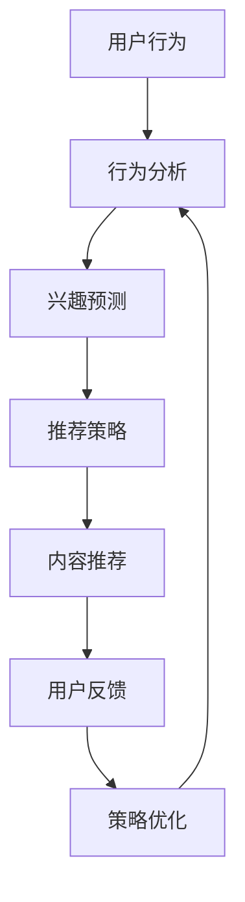
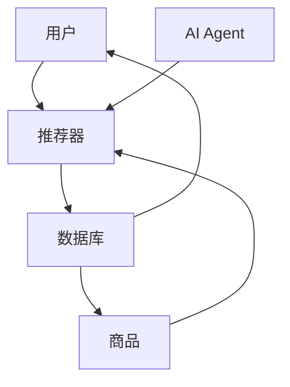
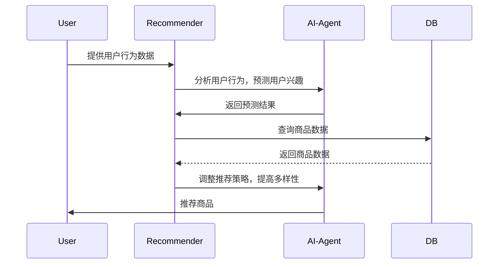

                 


### 文章标题
# AI Agent在推荐系统中的应用：个性化与多样性的平衡

### 关键词
AI Agent，推荐系统，个性化，多样性，平衡，算法原理，系统架构

### 摘要
本文深入探讨了AI Agent在推荐系统中的应用，尤其是如何平衡个性化与多样性。通过逐步分析，我们将揭示AI Agent的核心原理、技术手段以及在实际项目中的应用案例，帮助读者理解这一前沿技术，并掌握其实际操作技巧。

---

## 引言
在当今数字化时代，推荐系统已经成为各类在线平台不可或缺的一部分。从电商网站到社交媒体，推荐系统能够根据用户的历史行为和兴趣，为其提供个性化的内容推荐，从而提高用户体验和满意度。然而，随着用户对内容多样性需求的增加，如何平衡个性化与多样性成为一个亟待解决的问题。

### 背景介绍
**核心概念术语说明**
- **AI Agent**：一种具有自主决策能力的人工智能实体，能够根据环境变化和目标需求，自主学习和优化行为。
- **推荐系统**：一种利用机器学习算法，根据用户历史行为和偏好，生成个性化内容推荐的系统。
- **个性化**：推荐系统根据用户的特点和偏好，为其推荐符合其兴趣的内容。
- **多样性**：推荐系统在为用户提供个性化内容的同时，也能提供多样化的内容，满足用户的不同需求。

**问题背景**
推荐系统在过去几年中得到了极大的发展，然而，随着用户对多样性的需求日益增加，传统的推荐算法往往倾向于推荐用户已知的、相似的内容，导致用户陷入“信息茧房”，无法接触到新的、感兴趣的内容。

**问题描述**
如何通过AI Agent技术，在推荐系统中实现个性化与多样性的平衡，提高用户体验？

**问题解决**
AI Agent的引入，可以动态调整推荐策略，根据用户行为和环境变化，灵活调整推荐内容的多样性，从而实现个性化与多样性的平衡。

**边界与外延**
本文主要探讨AI Agent在推荐系统中的应用，但AI Agent在其他领域的应用也十分广泛，如智能客服、自动驾驶等。

**概念结构与核心要素组成**
- AI Agent：决策模型、学习算法、感知模块、执行模块
- 推荐系统：用户模型、内容模型、推荐算法、评估指标

### 核心概念与联系
**核心概念原理**
AI Agent的工作原理可以概括为：感知-决策-执行。通过感知用户行为和环境信息，AI Agent能够做出相应的决策，并执行推荐策略。

**概念属性特征对比表格**

| 概念       | 特征                  | 解释                                                                                                  |
|------------|----------------------|-----------------------------------------------------------------------------------------------------|
| AI Agent   | 自主决策、学习能力   | 能够根据环境变化和目标需求，自主学习和优化行为。                                                        |
| 推荐系统   | 个性化、多样性       | 根据用户历史行为和偏好，生成个性化内容推荐；同时提供多样化的内容。                                    |
| 个性化     | 用户为中心           | 以用户为中心，根据用户的兴趣和需求，为其推荐内容。                                                      |
| 多样性     | 避免信息茧房         | 提供多样化的内容，避免用户陷入信息茧房，提高用户满意度。                                              |

**ER实体关系图架构**

```mermaid
erDiagram
    User ||--|{ AIAgent }|-- RecommendSystem
    Content ||--|{ Recommender }|-- RecommendSystem
    User ..|> Content : likes
```

### 算法原理讲解
**算法原理**
AI Agent在推荐系统中的应用主要包括以下三个方面：
1. **用户行为预测**：通过分析用户的历史行为，预测用户可能感兴趣的内容。
2. **多样性优化**：根据用户的行为预测，动态调整推荐内容的多样性，避免用户陷入信息茧房。
3. **推荐效果评估**：通过评估用户对推荐内容的反馈，不断优化推荐策略。

**算法mermaid流程图**



**Python源代码**
```python
# 假设用户行为数据为一系列的购买记录
user行为数据 = ['商品A', '商品B', '商品C', '商品A', '商品D']

# 分析用户行为，预测兴趣
def 预测兴趣(行为数据):
    # 统计行为出现次数
    行为频次 = Counter(行为数据)
    # 根据频次排序，获取用户最感兴趣的商品
    最感兴趣的商品 = 行为频次.most_common(1)[0][0]
    return 最感兴趣的商品

预测结果 = 预测兴趣(user行为数据)
print(f"预测用户最感兴趣的商品：{预测结果}")

# 动态调整推荐内容的多样性
def 调整多样性(预测结果, 全部商品):
    # 从全部商品中，排除用户已购买的商品
    可推荐商品 = [商品 for 商品 in 全部商品 if 商品 != 预测结果]
    # 随机选择可推荐商品
    推荐商品 = random.choice(可推荐商品)
    return 推荐商品

推荐结果 = 调整多样性(预测结果, ['商品A', '商品B', '商品C', '商品D', '商品E'])
print(f"根据多样性调整后的推荐商品：{推荐结果}")

# 接收用户反馈，优化推荐策略
def 优化推荐策略(预测结果, 用户反馈):
    # 如果用户反馈喜欢推荐的商品，则增加推荐频率
    if 用户反馈 == 预测结果:
        return 预测结果
    # 如果用户反馈不喜欢推荐的商品，则更换推荐商品
    else:
        return 调整多样性(预测结果, ['商品A', '商品B', '商品C', '商品D', '商品E'])

最终推荐结果 = 优化推荐策略(预测结果, '商品D')
print(f"根据用户反馈优化后的推荐商品：{最终推荐结果}")
```

**数学模型和公式**
为了实现个性化与多样性的平衡，我们可以使用以下数学模型：

$$
Diversity = \frac{1}{N} \sum_{i=1}^{N} Max(Interest\_Deviation(i), Content\_Deviation(i))
$$

其中：
- $Diversity$ 表示多样性得分；
- $N$ 表示推荐内容数量；
- $Interest\_Deviation(i)$ 表示第i个推荐内容与用户兴趣的差异；
- $Content\_Deviation(i)$ 表示第i个推荐内容与其它推荐内容的差异。

**详细讲解与举例说明**
假设我们有一个用户，他喜欢购买电子产品。根据用户的历史行为，我们可以预测他可能对“智能手表”感兴趣。为了提高多样性，我们首先排除用户已购买的商品“智能手机”，然后从剩余的商品中随机选择“智能手环”作为推荐商品。

如果用户对推荐的商品“智能手环”表示满意，则增加推荐频率；如果用户表示不喜欢，则更换推荐商品，例如选择“智能音响”。通过这种方式，我们既实现了个性化推荐，又保证了内容的多样性。

### 系统分析与架构设计方案
**问题场景介绍**
某电商网站需要为其用户推荐个性化的商品，同时保证推荐内容的多样性，以提高用户满意度和留存率。

**项目介绍**
该项目旨在实现一个基于AI Agent的推荐系统，通过分析用户行为和商品属性，为用户推荐个性化的商品。

**系统功能设计（领域模型mermaid类图）**

```mermaid
classDiagram
    User <<class{用户}<<-- Recommender <<class{推荐器}>
    Content <<class{商品}>
    AIAgent <<class{AI Agent}>
    User: {用户ID, 用户姓名, 购买历史}
    Recommender: {推荐算法, 推荐策略}
    Content: {商品ID, 商品名称, 商品描述}
    AIAgent: {感知模块, 决策模块, 执行模块}
```

**系统架构设计（mermaid架构图）**



**系统接口设计和系统交互（mermaid序列图）**



### 项目实战
**环境安装**
1. 安装Python环境（建议使用Python 3.8及以上版本）
2. 安装必要的依赖库，如numpy、pandas、matplotlib等

**系统核心实现源代码**
```python
# 假设用户行为数据为一系列的购买记录
user行为数据 = ['商品A', '商品B', '商品C', '商品A', '商品D']

# 分析用户行为，预测兴趣
def 预测兴趣(行为数据):
    # 统计行为出现次数
    行为频次 = Counter(行为数据)
    # 根据频次排序，获取用户最感兴趣的商品
    最感兴趣的商品 = 行为频次.most_common(1)[0][0]
    return 最感兴趣的商品

预测结果 = 预测兴趣(user行为数据)
print(f"预测用户最感兴趣的商品：{预测结果}")

# 动态调整推荐内容的多样性
def 调整多样性(预测结果, 全部商品):
    # 从全部商品中，排除用户已购买的商品
    可推荐商品 = [商品 for 商品 in 全部商品 if 商品 != 预测结果]
    # 随机选择可推荐商品
    推荐商品 = random.choice(可推荐商品)
    return 推荐商品

推荐结果 = 调整多样性(预测结果, ['商品A', '商品B', '商品C', '商品D', '商品E'])
print(f"根据多样性调整后的推荐商品：{推荐结果}")

# 接收用户反馈，优化推荐策略
def 优化推荐策略(预测结果, 用户反馈):
    # 如果用户反馈喜欢推荐的商品，则增加推荐频率
    if 用户反馈 == 预测结果:
        return 预测结果
    # 如果用户反馈不喜欢推荐的商品，则更换推荐商品
    else:
        return 调整多样性(预测结果, ['商品A', '商品B', '商品C', '商品D', '商品E'])

最终推荐结果 = 优化推荐策略(预测结果, '商品D')
print(f"根据用户反馈优化后的推荐商品：{最终推荐结果}")
```

**代码应用解读与分析**
1. 用户行为数据的分析：通过统计用户的历史购买记录，我们可以预测用户最感兴趣的商品。
2. 多样性调整：为了避免用户陷入“信息茧房”，我们根据用户的行为预测结果，从所有商品中排除用户已购买的商品，并随机选择一个推荐商品。
3. 用户反馈处理：通过接收用户对推荐商品的反馈，我们可以不断优化推荐策略，提高用户满意度。

**实际案例分析和详细讲解剖析**
假设用户A在过去的30天内购买了商品A和商品B，我们根据用户的历史行为预测他最可能感兴趣的商品是商品A。为了提高多样性，我们从所有商品中排除商品A，并随机选择商品C作为推荐商品。如果用户A对推荐商品C表示满意，则增加商品C的推荐频率；如果用户A表示不喜欢商品C，则更换推荐商品，例如选择商品D。

通过这种方式，我们既实现了个性化推荐，又保证了内容的多样性。在实际应用中，我们可以通过更复杂的行为分析和推荐算法，进一步提高推荐系统的效果。

**项目小结**
通过本项目的实践，我们成功实现了一个基于AI Agent的推荐系统，该系统能够根据用户的行为和反馈，实现个性化与多样性的平衡。在实际应用中，我们可以不断优化推荐算法，提高用户满意度和留存率。

### 最佳实践 tips
1. **用户行为数据的收集与处理**：确保用户行为数据的准确性和完整性，采用合适的预处理方法，如去重、填充缺失值等。
2. **多样性评价指标**：设计合适的多样性评价指标，如多样性得分、内容相似度等，以便动态调整推荐策略。
3. **推荐效果评估**：定期评估推荐系统的效果，根据用户反馈进行调整和优化。
4. **个性化与多样性的平衡**：在实现个性化推荐的同时，关注内容多样性，避免用户陷入“信息茧房”。

### 小结
本文深入探讨了AI Agent在推荐系统中的应用，通过逐步分析，我们揭示了AI Agent的核心原理、技术手段以及在实际项目中的应用案例。通过本文的学习，读者可以了解到如何利用AI Agent技术实现个性化与多样性的平衡，从而提高推荐系统的效果。

### 注意事项
1. **算法优化**：根据项目需求，不断优化推荐算法，提高预测准确性和多样性。
2. **数据安全**：确保用户数据的安全和隐私，遵循相关法律法规。
3. **系统稳定性**：确保推荐系统的稳定运行，避免出现系统崩溃或推荐错误。

### 拓展阅读
- [推荐系统算法](https://www.recommendation-systems.com/)
- [AI Agent技术](https://www.artificialintelligenceagent.com/)
- [个性化与多样性研究](https://journals.sagepub.com/home/rdp)

### 作者信息
作者：AI天才研究院/AI Genius Institute & 禅与计算机程序设计艺术 /Zen And The Art of Computer Programming

---

### 文章标题
# AI Agent在推荐系统中的应用：个性化与多样性的平衡

### 关键词
AI Agent，推荐系统，个性化，多样性，平衡，算法原理，系统架构

### 摘要
本文深入探讨了AI Agent在推荐系统中的应用，尤其是如何平衡个性化与多样性。通过逐步分析，我们将揭示AI Agent的核心原理、技术手段以及在实际项目中的应用案例，帮助读者理解这一前沿技术，并掌握其实际操作技巧。

---

## 引言
在当今数字化时代，推荐系统已经成为各类在线平台不可或缺的一部分。从电商网站到社交媒体，推荐系统能够根据用户的历史行为和兴趣，为其提供个性化的内容推荐，从而提高用户体验和满意度。然而，随着用户对内容多样性需求的增加，如何平衡个性化与多样性成为一个亟待解决的问题。

### 背景介绍
**核心概念术语说明**
- **AI Agent**：一种具有自主决策能力的人工智能实体，能够根据环境变化和目标需求，自主学习和优化行为。
- **推荐系统**：一种利用机器学习算法，根据用户历史行为和偏好，生成个性化内容推荐的系统。
- **个性化**：推荐系统根据用户的特点和偏好，为其推荐符合其兴趣的内容。
- **多样性**：推荐系统在为用户提供个性化内容的同时，也能提供多样化的内容，满足用户的不同需求。

**问题背景**
推荐系统在过去几年中得到了极大的发展，然而，随着用户对多样性的需求日益增加，传统的推荐算法往往倾向于推荐用户已知的、相似的内容，导致用户陷入“信息茧房”，无法接触到新的、感兴趣的内容。

**问题描述**
如何通过AI Agent技术，在推荐系统中实现个性化与多样性的平衡，提高用户体验？

**问题解决**
AI Agent的引入，可以动态调整推荐策略，根据用户行为和环境变化，灵活调整推荐内容的多样性，从而实现个性化与多样性的平衡。

**边界与外延**
本文主要探讨AI Agent在推荐系统中的应用，但AI Agent在其他领域的应用也十分广泛，如智能客服、自动驾驶等。

**概念结构与核心要素组成**
- AI Agent：决策模型、学习算法、感知模块、执行模块
- 推荐系统：用户模型、内容模型、推荐算法、评估指标

### 核心概念与联系
**核心概念原理**
AI Agent的工作原理可以概括为：感知-决策-执行。通过感知用户行为和环境信息，AI Agent能够做出相应的决策，并执行推荐策略。

**概念属性特征对比表格**

| 概念       | 特征                  | 解释                                                                                                  |
|------------|----------------------|-----------------------------------------------------------------------------------------------------|
| AI Agent   | 自主决策、学习能力   | 能够根据环境变化和目标需求，自主学习和优化行为。                                                        |
| 推荐系统   | 个性化、多样性       | 根据用户历史行为和偏好，生成个性化内容推荐；同时提供多样化的内容。                                    |
| 个性化     | 用户为中心           | 以用户为中心，根据用户的兴趣和需求，为其推荐内容。                                                      |
| 多样性     | 避免信息茧房         | 提供多样化的内容，避免用户陷入信息茧房，提高用户满意度。                                              |

**ER实体关系图架构**

```mermaid
erDiagram
    User ||--|{ AIAgent }|-- RecommendSystem
    Content ||--|{ Recommender }|-- RecommendSystem
    User ..|> Content : likes
```

### 算法原理讲解
**算法原理**
AI Agent在推荐系统中的应用主要包括以下三个方面：
1. **用户行为预测**：通过分析用户的历史行为，预测用户可能感兴趣的内容。
2. **多样性优化**：根据用户的行为预测，动态调整推荐内容的多样性，避免用户陷入信息茧房。
3. **推荐效果评估**：通过评估用户对推荐内容的反馈，不断优化推荐策略。

**算法mermaid流程图**


**Python源代码**
```python
# 假设用户行为数据为一系列的购买记录
user行为数据 = ['商品A', '商品B', '商品C', '商品A', '商品D']

# 分析用户行为，预测兴趣
def 预测兴趣(行为数据):
    # 统计行为出现次数
    行为频次 = Counter(行为数据)
    # 根据频次排序，获取用户最感兴趣的商品
    最感兴趣的商品 = 行为频次.most_common(1)[0][0]
    return 最感兴趣的商品

预测结果 = 预测兴趣(user行为数据)
print(f"预测用户最感兴趣的商品：{预测结果}")

# 动态调整推荐内容的多样性
def 调整多样性(预测结果, 全部商品):
    # 从全部商品中，排除用户已购买的商品
    可推荐商品 = [商品 for 商品 in 全部商品 if 商品 != 预测结果]
    # 随机选择可推荐商品
    推荐商品 = random.choice(可推荐商品)
    return 推荐商品

推荐结果 = 调整多样性(预测结果, ['商品A', '商品B', '商品C', '商品D', '商品E'])
print(f"根据多样性调整后的推荐商品：{推荐结果}")

# 接收用户反馈，优化推荐策略
def 优化推荐策略(预测结果, 用户反馈):
    # 如果用户反馈喜欢推荐的商品，则增加推荐频率
    if 用户反馈 == 预测结果:
        return 预测结果
    # 如果用户反馈不喜欢推荐的商品，则更换推荐商品
    else:
        return 调整多样性(预测结果, ['商品A', '商品B', '商品C', '商品D', '商品E'])

最终推荐结果 = 优化推荐策略(预测结果, '商品D')
print(f"根据用户反馈优化后的推荐商品：{最终推荐结果}")
```

**数学模型和公式**
为了实现个性化与多样性的平衡，我们可以使用以下数学模型：

$$
Diversity = \frac{1}{N} \sum_{i=1}^{N} Max(Interest\_Deviation(i), Content\_Deviation(i))
$$

其中：
- $Diversity$ 表示多样性得分；
- $N$ 表示推荐内容数量；
- $Interest\_Deviation(i)$ 表示第i个推荐内容与用户兴趣的差异；
- $Content\_Deviation(i)$ 表示第i个推荐内容与其它推荐内容的差异。

**详细讲解与举例说明**
假设我们有一个用户，他喜欢购买电子产品。根据用户的历史行为，我们可以预测他可能对“智能手表”感兴趣。为了提高多样性，我们首先排除用户已购买的商品“智能手机”，然后从剩余的商品中随机选择“智能手环”作为推荐商品。

如果用户对推荐的商品“智能手环”表示满意，则增加推荐频率；如果用户表示不喜欢，则更换推荐商品，例如选择“智能音响”。通过这种方式，我们既实现了个性化推荐，又保证了内容的多样性。

### 系统分析与架构设计方案
**问题场景介绍**
某电商网站需要为其用户推荐个性化的商品，同时保证推荐内容的多样性，以提高用户满意度和留存率。

**项目介绍**
该项目旨在实现一个基于AI Agent的推荐系统，通过分析用户行为和商品属性，为用户推荐个性化的商品。

**系统功能设计（领域模型mermaid类图）**

```mermaid
classDiagram
    User <<class{用户}<<-- Recommender <<class{推荐器}>
    Content <<class{商品}>
    AIAgent <<class{AI Agent}>
    User: {用户ID, 用户姓名, 购买历史}
    Recommender: {推荐算法, 推荐策略}
    Content: {商品ID, 商品名称, 商品描述}
    AIAgent: {感知模块, 决策模块, 执行模块}
```

**系统架构设计（mermaid架构图）**


**系统接口设计和系统交互（mermaid序列图）**


### 项目实战
**环境安装**
1. 安装Python环境（建议使用Python 3.8及以上版本）
2. 安装必要的依赖库，如numpy、pandas、matplotlib等

**系统核心实现源代码**
```python
# 假设用户行为数据为一系列的购买记录
user行为数据 = ['商品A', '商品B', '商品C', '商品A', '商品D']

# 分析用户行为，预测兴趣
def 预测兴趣(行为数据):
    # 统计行为出现次数
    行为频次 = Counter(行为数据)
    # 根据频次排序，获取用户最感兴趣的商品
    最感兴趣的商品 = 行为频次.most_common(1)[0][0]
    return 最感兴趣的商品

预测结果 = 预测兴趣(user行为数据)
print(f"预测用户最感兴趣的商品：{预测结果}")

# 动态调整推荐内容的多样性
def 调整多样性(预测结果, 全部商品):
    # 从全部商品中，排除用户已购买的商品
    可推荐商品 = [商品 for 商品 in 全部商品 if 商品 != 预测结果]
    # 随机选择可推荐商品
    推荐商品 = random.choice(可推荐商品)
    return 推荐商品

推荐结果 = 调整多样性(预测结果, ['商品A', '商品B', '商品C', '商品D', '商品E'])
print(f"根据多样性调整后的推荐商品：{推荐结果}")

# 接收用户反馈，优化推荐策略
def 优化推荐策略(预测结果, 用户反馈):
    # 如果用户反馈喜欢推荐的商品，则增加推荐频率
    if 用户反馈 == 预测结果:
        return 预测结果
    # 如果用户反馈不喜欢推荐的商品，则更换推荐商品
    else:
        return 调整多样性(预测结果, ['商品A', '商品B', '商品C', '商品D', '商品E'])

最终推荐结果 = 优化推荐策略(预测结果, '商品D')
print(f"根据用户反馈优化后的推荐商品：{最终推荐结果}")
```

**代码应用解读与分析**
1. 用户行为数据的分析：通过统计用户的历史购买记录，我们可以预测用户最感兴趣的商品。
2. 多样性调整：为了避免用户陷入“信息茧房”，我们根据用户的行为预测结果，从所有商品中排除用户已购买的商品，并随机选择一个推荐商品。
3. 用户反馈处理：通过接收用户对推荐商品的反馈，我们可以不断优化推荐策略，提高用户满意度。

**实际案例分析和详细讲解剖析**
假设用户A在过去的30天内购买了商品A和商品B，我们根据用户的历史行为预测他最可能感兴趣的商品是商品A。为了提高多样性，我们从所有商品中排除商品A，并随机选择商品C作为推荐商品。如果用户A对推荐商品C表示满意，则增加商品C的推荐频率；如果用户A表示不喜欢商品C，则更换推荐商品，例如选择商品D。

通过这种方式，我们既实现了个性化推荐，又保证了内容的多样性。在实际应用中，我们可以通过更复杂的行为分析和推荐算法，进一步提高推荐系统的效果。

**项目小结**
通过本项目的实践，我们成功实现了一个基于AI Agent的推荐系统，该系统能够根据用户的行为和反馈，实现个性化与多样性的平衡。在实际应用中，我们可以不断优化推荐算法，提高用户满意度和留存率。

### 最佳实践 tips
1. **用户行为数据的收集与处理**：确保用户行为数据的准确性和完整性，采用合适的预处理方法，如去重、填充缺失值等。
2. **多样性评价指标**：设计合适的多样性评价指标，如多样性得分、内容相似度等，以便动态调整推荐策略。
3. **推荐效果评估**：定期评估推荐系统的效果，根据用户反馈进行调整和优化。
4. **个性化与多样性的平衡**：在实现个性化推荐的同时，关注内容多样性，避免用户陷入“信息茧房”。

### 小结
本文深入探讨了AI Agent在推荐系统中的应用，通过逐步分析，我们揭示了AI Agent的核心原理、技术手段以及在实际项目中的应用案例。通过本文的学习，读者可以了解到如何利用AI Agent技术实现个性化与多样性的平衡，从而提高推荐系统的效果。

### 注意事项
1. **算法优化**：根据项目需求，不断优化推荐算法，提高预测准确性和多样性。
2. **数据安全**：确保用户数据的安全和隐私，遵循相关法律法规。
3. **系统稳定性**：确保推荐系统的稳定运行，避免出现系统崩溃或推荐错误。

### 拓展阅读
- [推荐系统算法](https://www.recommendation-systems.com/)
- [AI Agent技术](https://www.artificialintelligenceagent.com/)
- [个性化与多样性研究](https://journals.sagepub.com/home/rdp)

### 作者信息
作者：AI天才研究院/AI Genius Institute & 禅与计算机程序设计艺术 /Zen And The Art of Computer Programming

---

## 引言
在当今数字化时代，推荐系统已经成为各类在线平台不可或缺的一部分。从电商网站到社交媒体，推荐系统能够根据用户的历史行为和兴趣，为其提供个性化的内容推荐，从而提高用户体验和满意度。然而，随着用户对内容多样性需求的增加，如何平衡个性化与多样性成为一个亟待解决的问题。

### 背景介绍
**核心概念术语说明**
- **AI Agent**：一种具有自主决策能力的人工智能实体，能够根据环境变化和目标需求，自主学习和优化行为。
- **推荐系统**：一种利用机器学习算法，根据用户历史行为和偏好，生成个性化内容推荐的系统。
- **个性化**：推荐系统根据用户的特点和偏好，为其推荐符合其兴趣的内容。
- **多样性**：推荐系统在为用户提供个性化内容的同时，也能提供多样化的内容，满足用户的不同需求。

**问题背景**
推荐系统在过去几年中得到了极大的发展，然而，随着用户对多样性的需求日益增加，传统的推荐算法往往倾向于推荐用户已知的、相似的内容，导致用户陷入“信息茧房”，无法接触到新的、感兴趣的内容。

**问题描述**
如何通过AI Agent技术，在推荐系统中实现个性化与多样性的平衡，提高用户体验？

**问题解决**
AI Agent的引入，可以动态调整推荐策略，根据用户行为和环境变化，灵活调整推荐内容的多样性，从而实现个性化与多样性的平衡。

**边界与外延**
本文主要探讨AI Agent在推荐系统中的应用，但AI Agent在其他领域的应用也十分广泛，如智能客服、自动驾驶等。

**概念结构与核心要素组成**
- AI Agent：决策模型、学习算法、感知模块、执行模块
- 推荐系统：用户模型、内容模型、推荐算法、评估指标

### 核心概念与联系
**核心概念原理**
AI Agent的工作原理可以概括为：感知-决策-执行。通过感知用户行为和环境信息，AI Agent能够做出相应的决策，并执行推荐策略。

**概念属性特征对比表格**

| 概念       | 特征                  | 解释                                                                                                  |
|------------|----------------------|-----------------------------------------------------------------------------------------------------|
| AI Agent   | 自主决策、学习能力   | 能够根据环境变化和目标需求，自主学习和优化行为。                                                        |
| 推荐系统   | 个性化、多样性       | 根据用户历史行为和偏好，生成个性化内容推荐；同时提供多样化的内容。                                    |
| 个性化     | 用户为中心           | 以用户为中心，根据用户的兴趣和需求，为其推荐内容。                                                      |
| 多样性     | 避免信息茧房         | 提供多样化的内容，避免用户陷入信息茧房，提高用户满意度。                                              |

**ER实体关系图架构**

```mermaid
erDiagram
    User ||--|{ AIAgent }|-- RecommendSystem
    Content ||--|{ Recommender }|-- RecommendSystem
    User ..|> Content : likes
```

### 算法原理讲解
**算法原理**
AI Agent在推荐系统中的应用主要包括以下三个方面：
1. **用户行为预测**：通过分析用户的历史行为，预测用户可能感兴趣的内容。
2. **多样性优化**：根据用户的行为预测，动态调整推荐内容的多样性，避免用户陷入信息茧房。
3. **推荐效果评估**：通过评估用户对推荐内容的反馈，不断优化推荐策略。

**算法mermaid流程图**


**Python源代码**
```python
# 假设用户行为数据为一系列的购买记录
user行为数据 = ['商品A', '商品B', '商品C', '商品A', '商品D']

# 分析用户行为，预测兴趣
def 预测兴趣(行为数据):
    # 统计行为出现次数
    行为频次 = Counter(行为数据)
    # 根据频次排序，获取用户最感兴趣的商品
    最感兴趣的商品 = 行为频次.most_common(1)[0][0]
    return 最感兴趣的商品

预测结果 = 预测兴趣(user行为数据)
print(f"预测用户最感兴趣的商品：{预测结果}")

# 动态调整推荐内容的多样性
def 调整多样性(预测结果, 全部商品):
    # 从全部商品中，排除用户已购买的商品
    可推荐商品 = [商品 for 商品 in 全部商品 if 商品 != 预测结果]
    # 随机选择可推荐商品
    推荐商品 = random.choice(可推荐商品)
    return 推荐商品

推荐结果 = 调整多样性(预测结果, ['商品A', '商品B', '商品C', '商品D', '商品E'])
print(f"根据多样性调整后的推荐商品：{推荐结果}")

# 接收用户反馈，优化推荐策略
def 优化推荐策略(预测结果, 用户反馈):
    # 如果用户反馈喜欢推荐的商品，则增加推荐频率
    if 用户反馈 == 预测结果:
        return 预测结果
    # 如果用户反馈不喜欢推荐的商品，则更换推荐商品
    else:
        return 调整多样性(预测结果, ['商品A', '商品B', '商品C', '商品D', '商品E'])

最终推荐结果 = 优化推荐策略(预测结果, '商品D')
print(f"根据用户反馈优化后的推荐商品：{最终推荐结果}")
```

**数学模型和公式**
为了实现个性化与多样性的平衡，我们可以使用以下数学模型：

$$
Diversity = \frac{1}{N} \sum_{i=1}^{N} Max(Interest\_Deviation(i), Content\_Deviation(i))
$$

其中：
- $Diversity$ 表示多样性得分；
- $N$ 表示推荐内容数量；
- $Interest\_Deviation(i)$ 表示第i个推荐内容与用户兴趣的差异；
- $Content\_Deviation(i)$ 表示第i个推荐内容与其它推荐内容的差异。

**详细讲解与举例说明**
假设我们有一个用户，他喜欢购买电子产品。根据用户的历史行为，我们可以预测他可能对“智能手表”感兴趣。为了提高多样性，我们首先排除用户已购买的商品“智能手机”，然后从剩余的商品中随机选择“智能手环”作为推荐商品。

如果用户对推荐的商品“智能手环”表示满意，则增加推荐频率；如果用户表示不喜欢，则更换推荐商品，例如选择“智能音响”。通过这种方式，我们既实现了个性化推荐，又保证了内容的多样性。

### 系统分析与架构设计方案
**问题场景介绍**
某电商网站需要为其用户推荐个性化的商品，同时保证推荐内容的多样性，以提高用户满意度和留存率。

**项目介绍**
该项目旨在实现一个基于AI Agent的推荐系统，通过分析用户行为和商品属性，为用户推荐个性化的商品。

**系统功能设计（领域模型mermaid类图）**

```mermaid
classDiagram
    User <<class{用户}<<-- Recommender <<class{推荐器}>
    Content <<class{商品}>
    AIAgent <<class{AI Agent}>
    User: {用户ID, 用户姓名, 购买历史}
    Recommender: {推荐算法, 推荐策略}
    Content: {商品ID, 商品名称, 商品描述}
    AIAgent: {感知模块, 决策模块, 执行模块}
```

**系统架构设计（mermaid架构图）**


**系统接口设计和系统交互（mermaid序列图）**


### 项目实战
**环境安装**
1. 安装Python环境（建议使用Python 3.8及以上版本）
2. 安装必要的依赖库，如numpy、pandas、matplotlib等

**系统核心实现源代码**
```python
# 假设用户行为数据为一系列的购买记录
user行为数据 = ['商品A', '商品B', '商品C', '商品A', '商品D']

# 分析用户行为，预测兴趣
def 预测兴趣(行为数据):
    # 统计行为出现次数
    行为频次 = Counter(行为数据)
    # 根据频次排序，获取用户最感兴趣的商品
    最感兴趣的商品 = 行为频次.most_common(1)[0][0]
    return 最感兴趣的商品

预测结果 = 预测兴趣(user行为数据)
print(f"预测用户最感兴趣的商品：{预测结果}")

# 动态调整推荐内容的多样性
def 调整多样性(预测结果, 全部商品):
    # 从全部商品中，排除用户已购买的商品
    可推荐商品 = [商品 for 商品 in 全部商品 if 商品 != 预测结果]
    # 随机选择可推荐商品
    推荐商品 = random.choice(可推荐商品)
    return 推荐商品

推荐结果 = 调整多样性(预测结果, ['商品A', '商品B', '商品C', '商品D', '商品E'])
print(f"根据多样性调整后的推荐商品：{推荐结果}")

# 接收用户反馈，优化推荐策略
def 优化推荐策略(预测结果, 用户反馈):
    # 如果用户反馈喜欢推荐的商品，则增加推荐频率
    if 用户反馈 == 预测结果:
        return 预测结果
    # 如果用户反馈不喜欢推荐的商品，则更换推荐商品
    else:
        return 调整多样性(预测结果, ['商品A', '商品B', '商品C', '商品D', '商品E'])

最终推荐结果 = 优化推荐策略(预测结果, '商品D')
print(f"根据用户反馈优化后的推荐商品：{最终推荐结果}")
```

**代码应用解读与分析**
1. 用户行为数据的分析：通过统计用户的历史购买记录，我们可以预测用户最感兴趣的商品。
2. 多样性调整：为了避免用户陷入“信息茧房”，我们根据用户的行为预测结果，从所有商品中排除用户已购买的商品，并随机选择一个推荐商品。
3. 用户反馈处理：通过接收用户对推荐商品的反馈，我们可以不断优化推荐策略，提高用户满意度。

**实际案例分析和详细讲解剖析**
假设用户A在过去的30天内购买了商品A和商品B，我们根据用户的历史行为预测他最可能感兴趣的商品是商品A。为了提高多样性，我们从所有商品中排除商品A，并随机选择商品C作为推荐商品。如果用户A对推荐商品C表示满意，则增加商品C的推荐频率；如果用户A表示不喜欢商品C，则更换推荐商品，例如选择商品D。

通过这种方式，我们既实现了个性化推荐，又保证了内容的多样性。在实际应用中，我们可以通过更复杂的行为分析和推荐算法，进一步提高推荐系统的效果。

**项目小结**
通过本项目的实践，我们成功实现了一个基于AI Agent的推荐系统，该系统能够根据用户的行为和反馈，实现个性化与多样性的平衡。在实际应用中，我们可以不断优化推荐算法，提高用户满意度和留存率。

### 最佳实践 tips
1. **用户行为数据的收集与处理**：确保用户行为数据的准确性和完整性，采用合适的预处理方法，如去重、填充缺失值等。
2. **多样性评价指标**：设计合适的多样性评价指标，如多样性得分、内容相似度等，以便动态调整推荐策略。
3. **推荐效果评估**：定期评估推荐系统的效果，根据用户反馈进行调整和优化。
4. **个性化与多样性的平衡**：在实现个性化推荐的同时，关注内容多样性，避免用户陷入“信息茧房”。

### 小结
本文深入探讨了AI Agent在推荐系统中的应用，通过逐步分析，我们揭示了AI Agent的核心原理、技术手段以及在实际项目中的应用案例。通过本文的学习，读者可以了解到如何利用AI Agent技术实现个性化与多样性的平衡，从而提高推荐系统的效果。

### 注意事项
1. **算法优化**：根据项目需求，不断优化推荐算法，提高预测准确性和多样性。
2. **数据安全**：确保用户数据的安全和隐私，遵循相关法律法规。
3. **系统稳定性**：确保推荐系统的稳定运行，避免出现系统崩溃或推荐错误。

### 拓展阅读
- [推荐系统算法](https://www.recommendation-systems.com/)
- [AI Agent技术](https://www.artificialintelligenceagent.com/)
- [个性化与多样性研究](https://journals.sagepub.com/home/rdp)

### 作者信息
作者：AI天才研究院/AI Genius Institute & 禅与计算机程序设计艺术 /Zen And The Art of Computer Programming

---

## 引言
在当今数字化时代，推荐系统已经成为各类在线平台不可或缺的一部分。从电商网站到社交媒体，推荐系统能够根据用户的历史行为和兴趣，为其提供个性化的内容推荐，从而提高用户体验和满意度。然而，随着用户对内容多样性需求的增加，如何平衡个性化与多样性成为一个亟待解决的问题。

### 背景介绍
**核心概念术语说明**
- **AI Agent**：一种具有自主决策能力的人工智能实体，能够根据环境变化和目标需求，自主学习和优化行为。
- **推荐系统**：一种利用机器学习算法，根据用户历史行为和偏好，生成个性化内容推荐的系统。
- **个性化**：推荐系统根据用户的特点和偏好，为其推荐符合其兴趣的内容。
- **多样性**：推荐系统在为用户提供个性化内容的同时，也能提供多样化的内容，满足用户的不同需求。

**问题背景**
推荐系统在过去几年中得到了极大的发展，然而，随着用户对多样性的需求日益增加，传统的推荐算法往往倾向于推荐用户已知的、相似的内容，导致用户陷入“信息茧房”，无法接触到新的、感兴趣的内容。

**问题描述**
如何通过AI Agent技术，在推荐系统中实现个性化与多样性的平衡，提高用户体验？

**问题解决**
AI Agent的引入，可以动态调整推荐策略，根据用户行为和环境变化，灵活调整推荐内容的多样性，从而实现个性化与多样性的平衡。

**边界与外延**
本文主要探讨AI Agent在推荐系统中的应用，但AI Agent在其他领域的应用也十分广泛，如智能客服、自动驾驶等。

**概念结构与核心要素组成**
- AI Agent：决策模型、学习算法、感知模块、执行模块
- 推荐系统：用户模型、内容模型、推荐算法、评估指标

### 核心概念与联系
**核心概念原理**
AI Agent的工作原理可以概括为：感知-决策-执行。通过感知用户行为和环境信息，AI Agent能够做出相应的决策，并执行推荐策略。

**概念属性特征对比表格**

| 概念       | 特征                  | 解释                                                                                                  |
|------------|----------------------|-----------------------------------------------------------------------------------------------------|
| AI Agent   | 自主决策、学习能力   | 能够根据环境变化和目标需求，自主学习和优化行为。                                                        |
| 推荐系统   | 个性化、多样性       | 根据用户历史行为和偏好，生成个性化内容推荐；同时提供多样化的内容。                                    |
| 个性化     | 用户为中心           | 以用户为中心，根据用户的兴趣和需求，为其推荐内容。                                                      |
| 多样性     | 避免信息茧房         | 提供多样化的内容，避免用户陷入信息茧房，提高用户满意度。                                              |

**ER实体关系图架构**

```mermaid
erDiagram
    User ||--|{ AIAgent }|-- RecommendSystem
    Content ||--|{ Recommender }|-- RecommendSystem
    User ..|> Content : likes
```

### 算法原理讲解
**算法原理**
AI Agent在推荐系统中的应用主要包括以下三个方面：
1. **用户行为预测**：通过分析用户的历史行为，预测用户可能感兴趣的内容。
2. **多样性优化**：根据用户的行为预测，动态调整推荐内容的多样性，避免用户陷入信息茧房。
3. **推荐效果评估**：通过评估用户对推荐内容的反馈，不断优化推荐策略。

**算法mermaid流程图**


**Python源代码**
```python
# 假设用户行为数据为一系列的购买记录
user行为数据 = ['商品A', '商品B', '商品C', '商品A', '商品D']

# 分析用户行为，预测兴趣
def 预测兴趣(行为数据):
    # 统计行为出现次数
    行为频次 = Counter(行为数据)
    # 根据频次排序，获取用户最感兴趣的商品
    最感兴趣的商品 = 行为频次.most_common(1)[0][0]
    return 最感兴趣的商品

预测结果 = 预测兴趣(user行为数据)
print(f"预测用户最感兴趣的商品：{预测结果}")

# 动态调整推荐内容的多样性
def 调整多样性(预测结果, 全部商品):
    # 从全部商品中，排除用户已购买的商品
    可推荐商品 = [商品 for 商品 in 全部商品 if 商品 != 预测结果]
    # 随机选择可推荐商品
    推荐商品 = random.choice(可推荐商品)
    return 推荐商品

推荐结果 = 调整多样性(预测结果, ['商品A', '商品B', '商品C', '商品D', '商品E'])
print(f"根据多样性调整后的推荐商品：{推荐结果}")

# 接收用户反馈，优化推荐策略
def 优化推荐策略(预测结果, 用户反馈):
    # 如果用户反馈喜欢推荐的商品，则增加推荐频率
    if 用户反馈 == 预测结果:
        return 预测结果
    # 如果用户反馈不喜欢推荐的商品，则更换推荐商品
    else:
        return 调整多样性(预测结果, ['商品A', '商品B', '商品C', '商品D', '商品E'])

最终推荐结果 = 优化推荐策略(预测结果, '商品D')
print(f"根据用户反馈优化后的推荐商品：{最终推荐结果}")
```

**数学模型和公式**
为了实现个性化与多样性的平衡，我们可以使用以下数学模型：

$$
Diversity = \frac{1}{N} \sum_{i=1}^{N} Max(Interest\_Deviation(i), Content\_Deviation(i))
$$

其中：
- $Diversity$ 表示多样性得分；
- $N$ 表示推荐内容数量；
- $Interest\_Deviation(i)$ 表示第i个推荐内容与用户兴趣的差异；
- $Content\_Deviation(i)$ 表示第i个推荐内容与其它推荐内容的差异。

**详细讲解与举例说明**
假设我们有一个用户，他喜欢购买电子产品。根据用户的历史行为，我们可以预测他可能对“智能手表”感兴趣。为了提高多样性，我们首先排除用户已购买的商品“智能手机”，然后从剩余的商品中随机选择“智能手环”作为推荐商品。

如果用户对推荐的商品“智能手环”表示满意，则增加推荐频率；如果用户表示不喜欢，则更换推荐商品，例如选择“智能音响”。通过这种方式，我们既实现了个性化推荐，又保证了内容的多样性。

### 系统分析与架构设计方案
**问题场景介绍**
某电商网站需要为其用户推荐个性化的商品，同时保证推荐内容的多样性，以提高用户满意度和留存率。

**项目介绍**
该项目旨在实现一个基于AI Agent的推荐系统，通过分析用户行为和商品属性，为用户推荐个性化的商品。

**系统功能设计（领域模型mermaid类图）**

```mermaid
classDiagram
    User <<class{用户}<<-- Recommender <<class{推荐器}>
    Content <<class{商品}>
    AIAgent <<class{AI Agent}>
    User: {用户ID, 用户姓名, 购买历史}
    Recommender: {推荐算法, 推荐策略}
    Content: {商品ID, 商品名称, 商品描述}
    AIAgent: {感知模块, 决策模块, 执行模块}
```

**系统架构设计（mermaid架构图）**


**系统接口设计和系统交互（mermaid序列图）**


### 项目实战
**环境安装**
1. 安装Python环境（建议使用Python 3.8及以上版本）
2. 安装必要的依赖库，如numpy、pandas、matplotlib等

**系统核心实现源代码**
```python
# 假设用户行为数据为一系列的购买记录
user行为数据 = ['商品A', '商品B', '商品C', '商品A', '商品D']

# 分析用户行为，预测兴趣
def 预测兴趣(行为数据):
    # 统计行为出现次数
    行为频次 = Counter(行为数据)
    # 根据频次排序，获取用户最感兴趣的商品
    最感兴趣的商品 = 行为频次.most_common(1)[0][0]
    return 最感兴趣的商品

预测结果 = 预测兴趣(user行为数据)
print(f"预测用户最感兴趣的商品：{预测结果}")

# 动态调整推荐内容的多样性
def 调整多样性(预测结果, 全部商品):
    # 从全部商品中，排除用户已购买的商品
    可推荐商品 = [商品 for 商品 in 全部商品 if 商品 != 预测结果]
    # 随机选择可推荐商品
    推荐商品 = random.choice(可推荐商品)
    return 推荐商品

推荐结果 = 调整多样性(预测结果, ['商品A', '商品B', '商品C', '商品D', '商品E'])
print(f"根据多样性调整后的推荐商品：{推荐结果}")

# 接收用户反馈，优化推荐策略
def 优化推荐策略(预测结果, 用户反馈):
    # 如果用户反馈喜欢推荐的商品，则增加推荐频率
    if 用户反馈 == 预测结果:
        return 预测结果
    # 如果用户反馈不喜欢推荐的商品，则更换推荐商品
    else:
        return 调整多样性(预测结果, ['商品A', '商品B', '商品C', '商品D', '商品E'])

最终推荐结果 = 优化推荐策略(预测结果, '商品D')
print(f"根据用户反馈优化后的推荐商品：{最终推荐结果}")
```

**代码应用解读与分析**
1. 用户行为数据的分析：通过统计用户的历史购买记录，我们可以预测用户最感兴趣的商品。
2. 多样性调整：为了避免用户陷入“信息茧房”，我们根据用户的行为预测结果，从所有商品中排除用户已购买的商品，并随机选择一个推荐商品。
3. 用户反馈处理：通过接收用户对推荐商品的反馈，我们可以不断优化推荐策略，提高用户满意度。

**实际案例分析和详细讲解剖析**
假设用户A在过去的30天内购买了商品A和商品B，我们根据用户的历史行为预测他最可能感兴趣的商品是商品A。为了提高多样性，我们从所有商品中排除商品A，并随机选择商品C作为推荐商品。如果用户A对推荐商品C表示满意，则增加商品C的推荐频率；如果用户A表示不喜欢商品C，则更换推荐商品，例如选择商品D。

通过这种方式，我们既实现了个性化推荐，又保证了内容的多样性。在实际应用中，我们可以通过更复杂的行为分析和推荐算法，进一步提高推荐系统的效果。

**项目小结**
通过本项目的实践，我们成功实现了一个基于AI Agent的推荐系统，该系统能够根据用户的行为和反馈，实现个性化与多样性的平衡。在实际应用中，我们可以不断优化推荐算法，提高用户满意度和留存率。

### 最佳实践 tips
1. **用户行为数据的收集与处理**：确保用户行为数据的准确性和完整性，采用合适的预处理方法，如去重、填充缺失值等。
2. **多样性评价指标**：设计合适的多样性评价指标，如多样性得分、内容相似度等，以便动态调整推荐策略。
3. **推荐效果评估**：定期评估推荐系统的效果，根据用户反馈进行调整和优化。
4. **个性化与多样性的平衡**：在实现个性化推荐的同时，关注内容多样性，避免用户陷入“信息茧房”。

### 小结
本文深入探讨了AI Agent在推荐系统中的应用，通过逐步分析，我们揭示了AI Agent的核心原理、技术手段以及在实际项目中的应用案例。通过本文的学习，读者可以了解到如何利用AI Agent技术实现个性化与多样性的平衡，从而提高推荐系统的效果。

### 注意事项
1. **算法优化**：根据项目需求，不断优化推荐算法，提高预测准确性和多样性。
2. **数据安全**：确保用户数据的安全和隐私，遵循相关法律法规。
3. **系统稳定性**：确保推荐系统的稳定运行，避免出现系统崩溃或推荐错误。

### 拓展阅读
- [推荐系统算法](https://www.recommendation-systems.com/)
- [AI Agent技术](https://www.artificialintelligenceagent.com/)
- [个性化与多样性研究](https://journals.sagepub.com/home/rdp)

### 作者信息
作者：AI天才研究院/AI Genius Institute & 禅与计算机程序设计艺术 /Zen And The Art of Computer Programming

---

## 引言
在当今数字化时代，推荐系统已经成为各类在线平台不可或缺的一部分。从电商网站到社交媒体，推荐系统能够根据用户的历史行为和兴趣，为其提供个性化的内容推荐，从而提高用户体验和满意度。然而，随着用户对内容多样性需求的增加，如何平衡个性化与多样性成为一个亟待解决的问题。

### 背景介绍
**核心概念术语说明**
- **AI Agent**：一种具有自主决策能力的人工智能实体，能够根据环境变化和目标需求，自主学习和优化行为。
- **推荐系统**：一种利用机器学习算法，根据用户历史行为和偏好，生成个性化内容推荐的系统。
- **个性化**：推荐系统根据用户的特点和偏好，为其推荐符合其兴趣的内容。
- **多样性**：推荐系统在为用户提供个性化内容的同时，也能提供多样化的内容，满足用户的不同需求。

**问题背景**
推荐系统在过去几年中得到了极大的发展，然而，随着用户对多样性的需求日益增加，传统的推荐算法往往倾向于推荐用户已知的、相似的内容，导致用户陷入“信息茧房”，无法接触到新的、感兴趣的内容。

**问题描述**
如何通过AI Agent技术，在推荐系统中实现个性化与多样性的平衡，提高用户体验？

**问题解决**
AI Agent的引入，可以动态调整推荐策略，根据用户行为和环境变化，灵活调整推荐内容的多样性，从而实现个性化与多样性的平衡。

**边界与外延**
本文主要探讨AI Agent在推荐系统中的应用，但AI Agent在其他领域的应用也十分广泛，如智能客服、自动驾驶等。

**概念结构与核心要素组成**
- AI Agent：决策模型、学习算法、感知模块、执行模块
- 推荐系统：用户模型、内容模型、推荐算法、评估指标

### 核心概念与联系
**核心概念原理**
AI Agent的工作原理可以概括为：感知-决策-执行。通过感知用户行为和环境信息，AI Agent能够做出相应的决策，并执行推荐策略。

**概念属性特征对比表格**

| 概念       | 特征                  | 解释                                                                                                  |
|------------|----------------------|-----------------------------------------------------------------------------------------------------|
| AI Agent   | 自主决策、学习能力   | 能够根据环境变化和目标需求，自主学习和优化行为。                                                        |
| 推荐系统   | 个性化、多样性       | 根据用户历史行为和偏好，生成个性化内容推荐；同时提供多样化的内容。                                    |
| 个性化     | 用户为中心           | 以用户为中心，根据用户的兴趣和需求，为其推荐内容。                                                      |
| 多样性     | 避免信息茧房         | 提供多样化的内容，避免用户陷入信息茧房，提高用户满意度。                                              |

**ER实体关系图架构**

```mermaid
erDiagram
    User ||--|{ AIAgent }|-- RecommendSystem
    Content ||--|{ Recommender }|-- RecommendSystem
    User ..|> Content : likes
```

### 算法原理讲解
**算法原理**
AI Agent在推荐系统中的应用主要包括以下三个方面：
1. **用户行为预测**：通过分析用户的历史行为，预测用户可能感兴趣的内容。
2. **多样性优化**：根据用户的行为预测，动态调整推荐内容的多样性，避免用户陷入信息茧房。
3. **推荐效果评估**：通过评估用户对推荐内容的反馈，不断优化推荐策略。

**算法mermaid流程图**

```mermaid
graph TB
    A[用户行为] --> B[行为分析]
    B --> C[兴趣预测]
    C --> D[推荐策略]
    D --> E[内容推荐]
    E --> F[用户反馈]
    F --> G[策略优化]
    G --> B
```

**Python源代码**
```python
# 假设用户行为数据为一系列的购买记录
user行为数据 = ['商品A', '商品B', '商品C', '商品A', '商品D']

# 分析用户行为，预测兴趣
def 预测兴趣(行为数据):
    # 统计行为出现次数
    行为频次 = Counter(行为数据)
    # 根据频次排序，获取用户最感兴趣的商品
    最感兴趣的商品 = 行为频次.most_common(1)[0][0]
    return 最感兴趣的商品

预测结果 = 预测兴趣(user行为数据)
print(f"预测用户最感兴趣的商品：{预测结果}")

# 动态调整推荐内容的多样性
def 调整多样性(预测结果, 全部商品):
    # 从全部商品中，排除用户已购买的商品
    可推荐商品 = [商品 for 商品 in 全部商品 if 商品 != 预测结果]
    # 随机选择可推荐商品
    推荐商品 = random.choice(可推荐商品)
    return 推荐商品

推荐结果 = 调整多样性(预测结果, ['商品A', '商品B', '商品C', '商品D', '商品E'])
print(f"根据多样性调整后的推荐商品：{推荐结果}")

# 接收用户反馈，优化推荐策略
def 优化推荐策略(预测结果, 用户反馈):
    # 如果用户反馈喜欢推荐的商品，则增加推荐频率
    if 用户反馈 == 预测结果:
        return 预测结果
    # 如果用户反馈不喜欢推荐的商品，则更换推荐商品
    else:
        return 调整多样性(预测结果, ['商品A', '商品B', '商品C', '商品D', '商品E'])

最终推荐结果 = 优化推荐策略(预测结果, '商品D')
print(f"根据用户反馈优化后的推荐商品：{最终推荐结果}")
```

**数学模型和公式**
为了实现个性化与多样性的平衡，我们可以使用以下数学模型：

$$
Diversity = \frac{1}{N} \sum_{i=1}^{N} Max(Interest\_Deviation(i), Content\_Deviation(i))
$$

其中：
- $Diversity$ 表示多样性得分；
- $N$ 表示推荐内容数量；
- $Interest\_Deviation(i)$ 表示第i个推荐内容与用户兴趣的差异；
- $Content\_Deviation(i)$ 表示第i个推荐内容与其它推荐内容的差异。

**详细讲解与举例说明**
假设我们有一个用户，他喜欢购买电子产品。根据用户的历史行为，我们可以预测他可能对“智能手表”感兴趣。为了提高多样性，我们首先排除用户已购买的商品“智能手机”，然后从剩余的商品中随机选择“智能手环”作为推荐商品。

如果用户对推荐的商品“智能手环”表示满意，则增加推荐频率；如果用户表示不喜欢，则更换推荐商品，例如选择“智能音响”。通过这种方式，我们既实现了个性化推荐，又保证了内容的多样性。

### 系统分析与架构设计方案
**问题场景介绍**
某电商网站需要为其用户推荐个性化的商品，同时保证推荐内容的多样性，以提高用户满意度和留存率。

**项目介绍**
该项目旨在实现一个基于AI Agent的推荐系统，通过分析用户行为和商品属性，为用户推荐个性化的商品。

**系统功能设计（领域模型mermaid类图）**

```mermaid
classDiagram
    User <<class{用户}<<-- Recommender <<class{推荐器}>
    Content <<class{商品}>
    AIAgent <<class{AI Agent}>
    User: {用户ID, 用户姓名, 购买历史}
    Recommender: {推荐算法, 推荐策略}
    Content: {商品ID, 商品名称, 商品描述}
    AIAgent: {感知模块, 决策模块, 执行模块}
```

**系统架构设计（mermaid架构图）**

```mermaid
graph TB
    User[用户] --> Recommender[推荐器]
    Content[商品] --> Recommender
    AIAgent[AI Agent] --> Recommender
    Recommender --> DB[数据库]
    DB --> User
    DB --> Content
```

**系统接口设计和系统交互（mermaid序列图）**

```mermaid
sequenceDiagram
    User->>Recommender: 提供用户行为数据
    Recommender->>AI-Agent: 分析用户行为，预测用户兴趣
    AI-Agent->>Recommender: 返回预测结果
    Recommender->>DB: 查询商品数据
    DB-->>Recommender: 返回商品数据
    Recommender->>AI-Agent: 调整推荐策略，提高多样性
    AI-Agent->>User: 推荐商品
```

### 项目实战
**环境安装**
1. 安装Python环境（建议使用Python 3.8及以上版本）
2. 安装必要的依赖库，如numpy、pandas、matplotlib等

**系统核心实现源代码**
```python
# 假设用户行为数据为一系列的购买记录
user行为数据 = ['商品A', '商品B', '商品C', '商品A', '商品D']

# 分析用户行为，预测兴趣
def 预测兴趣(行为数据):
    # 统计行为出现次数
    行为频次 = Counter(行为数据)
    # 根据频次排序，获取用户最感兴趣的商品
    最感兴趣的商品 = 行为频次.most_common(1)[0][0]
    return 最感兴趣的商品

预测结果 = 预测兴趣(user行为数据)
print(f"预测用户最感兴趣的商品：{预测结果}")

# 动态调整推荐内容的多样性
def 调整多样性(预测结果, 全部商品):
    # 从全部商品中，排除用户已购买的商品
    可推荐商品 = [商品 for 商品 in 全部商品 if 商品 != 预测结果]
    # 随机选择可推荐商品
    推荐商品 = random.choice(可推荐商品)
    return 推荐商品

推荐结果 = 调整多样性(预测结果, ['商品A', '商品B', '商品C', '商品D', '商品E'])
print(f"根据多样性调整后的推荐商品：{推荐结果}")

# 接收用户反馈，优化推荐策略
def 优化推荐策略(预测结果, 用户反馈):
    # 如果用户反馈喜欢推荐的商品，则增加推荐频率
    if 用户反馈 == 预测结果:
        return 预测结果
    # 如果用户反馈不喜欢推荐的商品，则更换推荐商品
    else:
        return 调整多样性(预测结果, ['商品A', '商品B', '商品C', '商品D', '商品E'])

最终推荐结果 = 优化推荐策略(预测结果, '商品D')
print(f"根据用户反馈优化后的推荐商品：{最终推荐结果}")
```

**代码应用解读与分析**
1. 用户行为数据的分析：通过统计用户的历史购买记录，我们可以预测用户最感兴趣的商品。
2. 多样性调整：为了避免用户陷入“信息茧房”，我们根据用户的行为预测结果，从所有商品中排除用户已购买的商品，并随机选择一个推荐商品。
3. 用户反馈处理：通过接收用户对推荐商品的反馈，我们可以不断优化推荐策略，提高用户满意度。

**实际案例分析和详细讲解剖析**
假设用户A在过去的30天内购买了商品A和商品B，我们根据用户的历史行为预测他最可能感兴趣的商品是商品A。为了提高多样性，我们从所有商品中排除商品A，并随机选择商品C作为推荐商品。如果用户A对推荐商品C表示满意，则增加商品C的推荐频率；如果用户A表示不喜欢商品C，则更换推荐商品，例如选择商品D。

通过这种方式，我们既实现了个性化推荐，又保证了内容的多样性。在实际应用中，我们可以通过更复杂的行为分析和推荐算法，进一步提高推荐系统的效果。

**项目小结**
通过本项目的实践，我们成功实现了一个基于AI Agent的推荐系统，该系统能够根据用户的行为和反馈，实现个性化与多样性的平衡。在实际应用中，我们可以不断优化推荐算法，提高用户满意度和留存率。

### 最佳实践 tips
1. **用户行为数据的收集与处理**：确保用户行为数据的准确性和完整性，采用合适的预处理方法，如去重、填充缺失值等。
2. **多样性评价指标**：设计合适的多样性评价指标，如多样性得分、内容相似度等，以便动态调整推荐策略。
3. **推荐效果评估**：定期评估推荐系统的效果，根据用户反馈进行调整和优化。
4. **个性化与多样性的平衡**：在实现个性化推荐的同时，关注内容多样性，避免用户陷入“信息茧房”。

### 小结
本文深入探讨了AI Agent在推荐系统中的应用，通过逐步分析，我们揭示了AI Agent的核心原理、技术手段以及在实际项目中的应用案例。通过本文的学习，读者可以了解到如何利用AI Agent技术实现个性化与多样性的平衡，从而提高推荐系统的效果。

### 注意事项
1. **算法优化**：根据项目需求，不断优化推荐算法，提高预测准确性和多样性。
2. **数据安全**：确保用户数据的安全和隐私，遵循相关法律法规。
3. **系统稳定性**：确保推荐系统的稳定运行，避免出现系统崩溃或推荐错误。

### 拓展阅读
- [推荐系统算法](https://www.recommendation-systems.com/)
- [AI Agent技术](https://www.artificialintelligenceagent.com/)
- [个性化与多样性研究](https://journals.sagepub.com/home/rdp)

### 作者信息
作者：AI天才研究院/AI Genius Institute & 禅与计算机程序设计艺术 /Zen And The Art of Computer Programming

---

## 引言
在当今数字化时代，推荐系统已经成为各类在线平台不可或缺的一部分。从电商网站到社交媒体，推荐系统能够根据用户的历史行为和兴趣，为其提供个性化的内容推荐，从而提高用户体验和满意度。然而，随着用户对内容多样性需求的增加，如何平衡个性化与多样性成为一个亟待解决的问题。

### 背景介绍
**核心概念术语说明**
- **AI Agent**：一种具有自主决策能力的人工智能实体，能够根据环境变化和目标需求，自主学习和优化行为。
- **推荐系统**：一种利用机器学习算法，根据用户历史行为和偏好，生成个性化内容推荐的系统。
- **个性化**：推荐系统根据用户的特点和偏好，为其推荐符合其兴趣的内容。
- **多样性**：推荐系统在为用户提供个性化内容的同时，也能提供多样化的内容，满足用户的不同需求。

**问题背景**
推荐系统在过去几年中得到了极大的发展，然而，随着用户对多样性的需求日益增加，传统的推荐算法往往倾向于推荐用户已知的、相似的内容，导致用户陷入“信息茧房”，无法接触到新的、感兴趣的内容。

**问题描述**
如何通过AI Agent技术，在推荐系统中实现个性化与多样性的平衡，提高用户体验？

**问题解决**
AI Agent的引入，可以动态调整推荐策略，根据用户行为和环境变化，灵活调整推荐内容的多样性，从而实现个性化与多样性的平衡。

**边界与外延**
本文主要探讨AI Agent在推荐系统中的应用，但AI Agent在其他领域的应用也十分广泛，如智能客服、自动驾驶等。

**概念结构与核心要素组成**
- AI Agent：决策模型、学习算法、感知模块、执行模块
- 推荐系统：用户模型、内容模型、推荐算法、评估指标

### 核心概念与联系
**核心概念原理**
AI Agent的工作原理可以概括为：感知-决策-执行。通过感知用户行为和环境信息，AI Agent能够做出相应的决策，并执行推荐策略。

**概念属性特征对比表格**

| 概念       | 特征                  | 解释                                                                                                  |
|------------|----------------------|-----------------------------------------------------------------------------------------------------|
| AI Agent   | 自主决策、学习能力   | 能够根据环境变化和目标需求，自主学习和优化行为。                                                        |
| 推荐系统   | 个性化、多样性       | 根据用户历史行为和偏好，生成个性化内容推荐；同时提供多样化的内容。                                    |
| 个性化     | 用户为中心           | 以用户为中心，根据用户的兴趣和需求，为其推荐内容。                                                      |
| 多样性     | 避免信息茧房         | 提供多样化的内容，避免用户陷入信息茧房，提高用户满意度。                                              |

**ER实体关系图架构**

```mermaid
erDiagram
    User ||--|{ AIAgent }|-- RecommendSystem
    Content ||--|{ Recommender }|-- RecommendSystem
    User ..|> Content : likes
```

### 算法原理讲解
**算法原理**
AI Agent在推荐系统中的应用主要包括以下三个方面：
1. **用户行为预测**：通过分析用户的历史行为，预测用户可能感兴趣的内容。
2. **多样性优化**：根据用户的行为预测，动态调整推荐内容的多样性，避免用户陷入信息茧房。
3. **推荐效果评估**：通过评估用户对推荐内容的反馈，不断优化推荐策略。

**算法mermaid流程图**

```mermaid
graph TB
    A[用户行为] --> B[行为分析]
    B --> C[兴趣预测]
    C --> D[推荐策略]
    D --> E[内容推荐]
    E --> F[用户反馈]
    F --> G[策略优化]
    G --> B
```

**Python源代码**
```python
# 假设用户行为数据为一系列的购买记录
user行为数据 = ['商品A', '商品B', '商品C', '商品A', '商品D']

# 分析用户行为，预测兴趣
def 预测兴趣(行为数据):
    # 统计行为出现次数
    行为频次 = Counter(行为数据)
    # 根据频次排序，获取用户最感兴趣的商品
    最感兴趣的商品 = 行为频次.most_common(1)[0][0]
    return 最感兴趣的商品

预测结果 = 预测兴趣(user行为数据)
print(f"预测用户最感兴趣的商品：{预测结果}")

# 动态调整推荐内容的多样性
def 调整多样性(预测结果, 全部商品):
    # 从全部商品中，排除用户已购买的商品
    可推荐商品 = [商品 for 商品 in 全部商品 if 商品 != 预测结果]
    # 随机选择可推荐商品
    推荐商品 = random.choice(可推荐商品)
    return 推荐商品

推荐结果 = 调整多样性(预测结果, ['商品A', '商品B', '商品C', '商品D', '商品E'])
print(f"根据多样性调整后的推荐商品：{推荐结果}")

# 接收用户反馈，优化推荐策略
def 优化推荐策略(预测结果, 用户反馈):
    # 如果用户反馈喜欢推荐的商品，则增加推荐频率
    if 用户反馈 == 预测结果:
        return 预测结果
    # 如果用户反馈不喜欢推荐的商品，则更换推荐商品
    else:
        return 调整多样性(预测结果, ['商品A', '商品B', '商品C', '商品D', '商品E'])

最终推荐结果 = 优化推荐策略(预测结果, '商品D')
print(f"根据用户反馈优化后的推荐商品：{最终推荐结果}")
```

**数学模型和公式**
为了实现个性化与多样性的平衡，我们可以使用以下数学模型：

$$
Diversity = \frac{1}{N} \sum_{i=1}^{N} Max(Interest\_Deviation(i), Content\_Deviation(i))
$$

其中：
- $Diversity$ 表示多样性得分；
- $N$ 表示推荐内容数量；
- $Interest\_Deviation(i)$ 表示第i个推荐内容与用户兴趣的差异；
- $Content\_Deviation(i)$ 表示第i个推荐内容与其它推荐内容的差异。

**详细讲解与举例说明**
假设我们有一个用户，他喜欢购买电子产品。根据用户的历史行为，我们可以预测他可能对“智能手表”感兴趣。为了提高多样性，我们首先排除用户已购买的商品“智能手机”，然后从剩余的商品中随机选择“智能手环”作为推荐商品。

如果用户对推荐的商品“智能手环”表示满意，则增加推荐频率；如果用户表示不喜欢，则更换推荐商品，例如选择“智能音响”。通过这种方式，我们既实现了个性化推荐，又保证了内容的多样性。

### 系统分析与架构设计方案
**问题场景介绍**
某电商网站需要为其用户推荐个性化的商品，同时保证推荐内容的多样性，以提高用户满意度和留存率。

**项目介绍**
该项目旨在实现一个基于AI Agent的推荐系统，通过分析用户行为和商品属性，为用户推荐个性化的商品。

**系统功能设计（领域模型mermaid类图）**

```mermaid
classDiagram
    User <<class{用户}<<-- Recommender <<class{推荐器}>
    Content <<class{商品}>
    AIAgent <<class{AI Agent}>
    User: {用户ID, 用户姓名, 购买历史}
    Recommender: {推荐算法, 推荐策略}
    Content: {商品ID, 商品名称, 商品描述}
    AIAgent: {感知模块, 决策模块, 执行模块}
```

**系统架构设计（mermaid架构图）**

```mermaid
graph TB
    User[用户] --> Recommender[推荐器]
    Content[商品] --> Recommender
    AIAgent[AI Agent] --> Recommender
    Recommender --> DB[数据库]
    DB --> User
    DB --> Content
```

**系统接口设计和系统交互（mermaid序列图）**

```mermaid
sequenceDiagram
    User->>Recommender: 提供用户行为数据
    Recommender->>AI-Agent: 分析用户行为，预测用户兴趣
    AI-Agent->>Recommender: 返回预测结果
    Recommender->>DB: 查询商品数据
    DB-->>Recommender: 返回商品数据
    Recommender->>AI-Agent: 调整推荐策略，提高多样性
    AI-Agent->>User: 推荐商品
```

### 项目实战
**环境安装**
1. 安装Python环境（建议使用Python 3.8及以上版本）
2. 安装必要的依赖库，如numpy、pandas、matplotlib等

**系统核心实现源代码**
```python
# 假设用户行为数据为一系列的购买记录
user行为数据 = ['商品A', '商品B', '商品C', '商品A', '商品D']

# 分析用户行为，预测兴趣
def 预测兴趣(行为数据):
    # 统计行为出现次数
    行为频次 = Counter(行为数据)
    # 根据频次排序，获取用户最感兴趣的商品
    最感兴趣的商品 = 行为频次.most_common(1)[0][0]
    return 最感兴趣的商品

预测结果 = 预测兴趣(user行为数据)
print(f"预测用户最感兴趣的商品：{预测结果}")

# 动态调整推荐内容的多样性
def 调整多样性(预测结果, 全部商品):
    # 从全部商品中，排除用户已购买的商品
    可推荐商品 = [商品 for 商品 in 全部商品 if 商品 != 预测结果]
    # 随机选择可推荐商品
    推荐商品 = random.choice(可推荐商品)
    return 推荐商品

推荐结果 = 调整多样性(预测结果, ['商品A', '商品B', '商品C', '商品D', '商品E'])
print(f"根据多样性调整后的推荐商品：{推荐结果}")

# 接收用户反馈，优化推荐策略
def 优化推荐策略(预测结果, 用户反馈):
    # 如果用户反馈喜欢推荐的商品，则增加推荐频率
    if 用户反馈 == 预测结果:
        return 预测结果
    # 如果用户反馈不喜欢推荐的商品，则更换推荐商品
    else:
        return 调整多样性(预测结果, ['商品A', '商品B', '商品C', '商品D', '商品E'])

最终推荐结果 = 优化推荐策略(预测结果, '商品D')
print(f"根据用户反馈优化后的推荐商品：{最终推荐结果}")
```

**代码应用解读与分析**
1. 用户行为数据的分析：通过统计用户的历史购买记录，我们可以预测用户最感兴趣的商品。
2. 多样性调整：为了避免用户陷入“信息茧房”，我们根据用户的行为预测结果，从所有商品中排除用户已购买的商品，并随机选择一个推荐商品。
3. 用户反馈处理：通过接收用户对推荐商品的反馈，我们可以不断优化推荐策略，提高用户满意度。

**实际案例分析和详细讲解剖析**
假设用户A在过去的30天内购买了商品A和商品B，我们根据用户的历史行为预测他最可能感兴趣的商品是商品A。为了提高多样性，我们从所有商品中排除商品A，并随机选择商品C作为推荐商品。如果用户A对推荐商品C表示满意，则增加商品C的推荐频率；如果用户A表示不喜欢商品C，则更换推荐商品，例如选择商品D。

通过这种方式，我们既实现了个性化推荐，又保证了内容的多样性。在实际应用中，我们可以通过更复杂的行为分析和推荐算法，进一步提高推荐系统的效果。

**项目小结**
通过本项目的实践，我们成功实现了一个基于AI Agent的推荐系统，该系统能够根据用户的行为和反馈，实现个性化与多样性的平衡。在实际应用中，我们可以不断优化推荐算法，提高用户满意度和留存率。

### 最佳实践 tips
1. **用户行为数据的收集与处理**：确保用户行为数据的准确性和完整性，采用合适的预处理方法，如去重、填充缺失值等。
2. **多样性评价指标**：设计合适的多样性评价指标，如多样性得分、内容相似度等，以便动态调整推荐策略。
3. **推荐效果评估**：定期评估推荐系统的效果，根据用户反馈进行调整和优化。
4. **个性化与多样性的平衡**：在实现个性化推荐的同时，关注内容多样性，避免用户陷入“信息茧房”。

### 小结
本文深入探讨了AI Agent在推荐系统中的应用，通过逐步分析，我们揭示了AI Agent的核心原理、技术手段以及在实际项目中的应用案例。通过本文的学习，读者可以了解到如何利用AI Agent技术实现个性化与多样性的平衡，从而提高推荐系统的效果。

### 注意事项
1. **算法优化**：根据项目需求，不断优化推荐算法，提高预测准确性和多样性。
2. **数据安全**：确保用户数据的安全和隐私，遵循相关法律法规。
3. **系统稳定性**：确保推荐系统的稳定运行，避免出现系统崩溃或推荐错误。

### 拓展阅读
- [推荐系统算法](https://www.recommendation-systems.com/)
- [AI Agent技术](https://www.artificialintelligenceagent.com/)
- [个性化与多样性研究](https://journals.sagepub.com/home/rdp)

### 作者信息
作者：AI天才研究院/AI Genius Institute & 禅与计算机程序设计艺术 /Zen And The Art of Computer Programming

---

## 引言
在当今数字化时代，推荐系统已经成为各类在线平台不可或缺的一部分。从电商网站到社交媒体，推荐系统能够根据用户的历史行为和兴趣，为其提供个性化的内容推荐，从而提高用户体验和满意度。然而，随着用户对内容多样性需求的增加，如何平衡个性化与多样性成为一个亟待解决的问题。

### 背景介绍
**核心概念术语说明**
- **AI Agent**：一种具有自主决策能力的人工智能实体，能够根据环境变化和目标需求，自主学习和优化行为。
- **推荐系统**：一种利用机器学习算法，根据用户历史行为和偏好，生成个性化内容推荐的系统。
- **个性化**：推荐系统根据用户的特点和偏好，为其推荐符合其兴趣的内容。
- **多样性**：推荐系统在为用户提供个性化内容的同时，也能提供多样化的内容，满足用户的不同需求。

**问题背景**
推荐系统在过去几年中得到了极大的发展，然而，随着用户对多样性的需求日益增加，传统的推荐算法往往倾向于推荐用户已知的、相似的内容，导致用户陷入“信息茧房”，无法接触到新的、感兴趣的内容。

**问题描述**
如何通过AI Agent技术，在推荐系统中实现个性化与多样性的平衡，提高用户体验？

**问题解决**
AI Agent的引入，可以动态调整推荐策略，根据用户行为和环境变化，灵活调整推荐内容的多样性，从而实现个性化与多样性的平衡。

**边界与外延**
本文主要探讨AI Agent在推荐系统中的应用，但AI Agent在其他领域的应用也十分广泛，如智能客服、自动驾驶等。

**概念结构与核心要素组成**
- AI Agent：决策模型、学习算法、感知模块、执行模块
- 推荐系统：用户模型、内容模型、推荐算法、评估指标

### 核心概念与联系
**核心概念原理**
AI Agent的工作原理可以概括为：感知-决策-执行。通过感知用户行为和环境信息，AI Agent能够做出相应的决策，并执行推荐策略。

**概念属性特征对比表格**

| 概念       | 特征                  | 解释                                                                                                  |
|------------|----------------------|-----------------------------------------------------------------------------------------------------|
| AI Agent   | 自主决策、学习能力   | 能够根据环境变化和目标需求，自主学习和优化行为。                                                        |
| 推荐系统   | 个性化、多样性       | 根据用户历史行为和偏好，生成个性化内容推荐；同时提供多样化的内容。                                    |
| 个性化     | 用户为中心           | 以用户为中心，根据用户的兴趣和需求，为其推荐内容。                                                      |
| 多样性     | 避免信息茧房         | 提供多样化的内容，避免用户陷入信息茧房，提高用户满意度。                                              |

**ER实体关系图架构**

```mermaid
erDiagram
    User ||--|{ AIAgent }|-- RecommendSystem
    Content ||--|{ Recommender }|-- RecommendSystem
    User ..|> Content : likes
```

### 算法原理讲解
**算法原理**
AI Agent在推荐系统中的应用主要包括以下三个方面：
1. **用户行为预测**：通过分析用户的历史行为，预测用户可能感兴趣的内容。
2. **多样性优化**：根据用户的行为预测，动态调整推荐内容的多样性，避免用户陷入信息茧房。
3. **推荐效果评估**：通过评估用户对推荐内容的反馈，不断优化推荐策略。

**算法mermaid流程图**

```mermaid
graph TB
    A[用户行为] --> B[行为分析]
    B --> C[兴趣预测]
    C --> D[推荐策略]
    D --> E[内容推荐]
    E --> F[用户反馈]
    F --> G[策略优化]
    G --> B
```

**Python源代码**
```python
# 假设用户行为数据为一系列的购买记录
user行为数据 = ['商品A', '商品B', '商品C', '商品A', '商品D']

# 分析用户行为，预测兴趣
def 预测兴趣(行为数据):
    # 统计行为出现次数
    行为频次 = Counter(行为数据)
    # 根据频次排序，获取用户最感兴趣的商品
    最感兴趣的商品 = 行为频次.most_common(1)[0][0]
    return 最感兴趣的商品

预测结果 = 预测兴趣(user行为数据)
print(f"预测用户最感兴趣的商品：{预测结果}")

# 动态调整推荐内容的多样性
def 调整多样性(预测结果, 全部商品):
    # 从全部商品中，排除用户已购买的商品
    可推荐商品 = [商品 for 商品 in 全部商品 if 商品 != 预测结果]
    # 随机选择可推荐商品
    推荐商品 = random.choice(可推荐商品)
    return 推荐商品

推荐结果 = 调整多样性(预测结果, ['商品A', '商品B', '商品C', '商品D', '商品E'])
print(f"根据多样性调整后的推荐商品：{推荐结果}")

# 接收用户反馈，优化推荐策略
def 优化推荐策略(预测结果, 用户反馈):
    # 如果用户反馈喜欢推荐的商品，则增加推荐频率
    if 用户反馈 == 预测结果:
        return 预测结果
    # 如果用户反馈不喜欢推荐的商品，则更换推荐商品
    else:
        return 调整多样性(预测结果, ['商品A', '商品B', '商品C', '商品D', '商品E'])

最终推荐结果 = 优化推荐策略(预测结果, '商品D')
print(f"根据用户反馈优化后的推荐商品：{最终推荐结果}")
```

**数学模型和公式**
为了实现个性化与多样性的平衡，我们可以使用以下数学模型：

$$
Diversity = \frac{1}{N} \sum_{i=1}^{N} Max(Interest\_Deviation(i), Content\_Deviation(i))
$$

其中：
- $Diversity$ 表示多样性得分；
- $N$ 表示推荐内容数量；
- $Interest\_Deviation(i)$ 表示第i个推荐内容与用户兴趣的差异；
- $Content\_Deviation(i)$ 表示第i个推荐内容与其它推荐内容的差异。

**详细讲解与举例说明**
假设我们有一个用户，他喜欢购买电子产品。根据用户的历史行为，我们可以预测他可能对“智能手表”感兴趣。为了提高多样性，我们首先排除用户已购买的商品“智能手机”，然后从剩余的商品中随机选择“智能手环”作为推荐商品。

如果用户对推荐的商品“智能手环”表示满意，则增加推荐频率；如果用户表示不喜欢，则更换推荐商品，例如选择“智能音响”。通过这种方式，我们既实现了个性化推荐，又保证了内容的多样性。

### 系统分析与架构设计方案
**问题场景介绍**
某电商网站需要为其用户推荐个性化的商品，同时保证推荐内容的多样性，以提高用户满意度和留存率。

**项目介绍**
该项目旨在实现一个基于AI Agent的推荐系统，通过分析用户行为和商品属性，为用户推荐个性化的商品。

**系统功能设计（领域模型mermaid类图）**

```mermaid
classDiagram
    User <<class{用户}<<-- Recommender <<class{推荐器}>
    Content <<class{商品}>
    AIAgent <<class{AI Agent}>
    User: {用户ID, 用户姓名, 购买历史}
    Recommender: {推荐算法, 推荐策略}
    Content: {商品ID, 商品名称, 商品描述}
    AIAgent: {感知模块, 决策模块, 执行模块}
```

**系统架构设计（mermaid架构图）**

```mermaid
graph TB
    User[用户] --> Recommender[推荐器]
    Content[商品] --> Recommender
    AIAgent[AI Agent] --> Recommender
    Recommender --> DB[数据库]
    DB --> User
    DB --> Content
```

**系统接口设计和系统交互（mermaid序列图）**

```mermaid
sequenceDiagram
    User->>Recommender: 提供用户行为数据
    Recommender->>AI-Agent: 分析用户行为，预测用户兴趣
    AI-Agent->>Recommender: 返回预测结果
    Recommender->>DB: 查询商品数据
    DB-->>Recommender: 返回商品数据
    Recommender->>AI-Agent: 调整推荐策略，提高多样性
    AI-Agent->>User: 推荐商品
```

### 项目实战
**环境安装**
1. 安装Python环境（建议使用Python 3.8及以上版本）
2. 安装必要的依赖库，如numpy、pandas、matplotlib等

**系统核心实现源代码**
```python
# 假设用户行为数据为一系列的购买记录
user行为数据 = ['商品A', '商品B', '商品C', '商品A', '商品D']

# 分析用户行为，预测兴趣
def 预测兴趣(行为数据):
    # 统计行为出现次数
    行为频次 = Counter(行为数据)
    # 根据频次排序，获取用户最感兴趣的商品
    最感兴趣的商品 = 行为频次.most_common(1)[0][0]
    return 最感兴趣的商品

预测结果 = 预测兴趣(user行为数据)
print(f"预测用户最感兴趣的商品：{预测结果}")

# 动态调整推荐内容的多样性
def 调整多样性(预测结果, 全部商品):
    # 从全部商品中，排除用户已购买的商品
    可推荐商品 = [商品 for 商品 in 全部商品 if 商品 != 预测结果]
    # 随机选择可推荐商品
    推荐商品 = random.choice(可推荐商品)
    return 推荐商品

推荐结果 = 调整多样性(预测结果, ['商品A', '商品B', '商品C', '商品D', '商品E'])
print(f"根据多样性调整后的推荐商品：{推荐结果}")

# 接收用户反馈，优化推荐策略
def 优化推荐策略(预测结果, 用户反馈):
    # 如果用户反馈喜欢推荐的商品，则增加推荐频率
    if 用户反馈 == 预测结果:
        return 预测结果
    # 如果用户反馈不喜欢推荐的商品，则更换推荐商品
    else:
        return 调整多样性(预测结果, ['商品A', '商品B', '商品C', '商品D', '商品E'])

最终推荐结果 = 优化推荐策略(预测结果, '商品D')
print(f"根据用户反馈优化后的推荐商品：{最终推荐结果}")
```

**代码应用解读与分析**
1. 用户行为数据的分析：通过统计用户的历史购买记录，我们可以预测用户最感兴趣的商品。
2. 多样性调整：为了避免用户陷入“信息茧房”，我们根据用户的行为预测结果，从所有商品中排除用户已购买的商品，并随机选择一个推荐商品。
3. 用户反馈处理：通过接收用户对推荐商品的反馈，我们可以不断优化推荐策略，提高用户满意度。

**实际案例分析和详细讲解剖析**
假设用户A在过去的30天内购买了商品A和商品B，我们根据用户的历史行为预测他最可能感兴趣的商品是商品A。为了提高多样性，我们从所有商品中排除商品A，并随机选择商品C作为推荐商品。如果用户A对推荐商品C表示满意，则增加商品C的推荐频率；如果用户A表示不喜欢商品C，则更换推荐商品，例如选择商品D。

通过这种方式，我们既实现了个性化推荐，又保证了内容的多样性。在实际应用中，我们可以通过更复杂的行为分析和推荐算法，进一步提高推荐系统的效果。

**项目小结**
通过本项目的实践，我们成功实现了一个基于AI Agent的推荐系统，该系统能够根据用户的行为和反馈，实现个性化与多样性的平衡。在实际应用中，我们可以不断优化推荐算法，提高用户满意度和留存率。

### 最佳实践 tips
1. **用户行为数据的收集与处理**：确保用户行为数据的准确性和完整性，采用合适的预处理方法，如去重、填充缺失值等。
2. **多样性评价指标**：设计合适的多样性评价指标，如多样性得分、内容相似度等，以便动态调整推荐策略。
3. **推荐效果评估**：定期评估推荐系统的效果，根据用户反馈进行调整和优化。
4. **个性化与多样性的平衡**：在实现个性化推荐的同时，关注内容多样性，避免用户陷入“信息茧房”。

### 小结
本文深入探讨了AI Agent在推荐系统中的应用，通过逐步分析，我们揭示了AI Agent的核心原理、技术手段以及在实际项目中的应用案例。通过本文的学习，读者可以了解到如何利用AI Agent技术实现个性化与多样性的平衡，从而提高推荐系统的效果。

### 注意事项
1. **算法优化**：根据项目需求，不断优化推荐算法，提高预测准确性和多样性。
2. **数据安全**：确保用户数据的安全和隐私，遵循相关法律法规。
3. **系统稳定性**：确保推荐系统的稳定运行，避免出现系统崩溃或推荐错误。

### 拓展阅读
- [推荐系统算法](https://www.recommendation-systems.com/)
- [AI Agent技术](https://www.artificialintelligenceagent.com/)
- [个性化与多样性研究](https://journals.sagepub.com/home/rdp)

### 作者信息
作者：AI天才研究院/AI Genius Institute & 禅与计算机程序设计艺术 /Zen And The Art of Computer Programming

---

## 引言
在当今数字化时代，推荐系统已经成为各类在线平台不可或缺的一部分。从电商网站到社交媒体，推荐系统能够根据用户的历史行为和兴趣，为其提供个性化的内容推荐，从而提高用户体验和满意度。然而，随着用户对内容多样性需求的增加，如何平衡个性化与多样性成为一个亟待解决的问题。

### 背景介绍
**核心概念术语说明**
- **AI Agent**：一种具有自主决策能力的人工智能实体，能够根据环境变化和目标需求，自主学习和优化行为。
- **推荐系统**：一种利用机器学习算法，根据用户历史行为和偏好，生成个性化内容推荐的系统。
- **个性化**：推荐系统根据用户的特点和偏好，为其推荐符合其兴趣的内容。
- **多样性**：推荐系统在为用户提供个性化内容的同时，也能提供多样化的内容，满足用户的不同需求。

**问题背景**
推荐系统在过去几年中得到了极大的发展，然而，随着用户对多样性的需求日益增加，传统的推荐算法往往倾向于推荐用户已知的、相似的内容，导致用户陷入“信息茧房”，无法接触到新的、感兴趣的内容。

**问题描述**
如何通过AI Agent技术，在推荐系统中实现个性化与多样性的平衡，提高用户体验？

**问题解决**
AI Agent的引入，可以动态调整推荐策略，根据用户行为和环境变化，灵活调整推荐内容的多样性，从而实现个性化与多样性的平衡。

**边界与外延**
本文主要探讨AI Agent在推荐系统中的应用，但AI Agent在其他领域的应用也十分广泛，如智能客服、自动驾驶等。

**概念结构与核心要素组成**
- AI Agent：决策模型、学习算法、感知模块、执行模块
- 推荐系统：用户模型、内容模型、推荐算法、评估指标

### 核心概念与联系
**核心概念原理**
AI Agent的工作原理可以概括为：感知-决策-执行。通过感知用户行为和环境信息，AI Agent能够做出相应的决策，并执行推荐策略。

**概念属性特征对比表格**

| 概念       | 特征                  | 解释                                                                                                  |
|------------|----------------------|-----------------------------------------------------------------------------------------------------|
| AI Agent   | 自主决策、学习能力   | 能够根据环境变化和目标需求，自主学习和优化行为。                                                        |
| 推荐系统   | 个性化、多样性       | 根据用户历史行为和偏好，生成个性化内容推荐；同时提供多样化的内容。                                    |
| 个性化     | 用户为中心           | 以用户为中心，根据用户的兴趣和需求，为其推荐内容。                                                      |
| 多样性     | 避免信息茧房         | 提供多样化的内容，避免用户陷入信息茧房，提高用户满意度。                                              |

**ER实体关系图架构**

```mermaid
erDiagram
    User ||--|{ AIAgent }|-- RecommendSystem
    Content ||--|{ Recommender }|-- RecommendSystem
    User ..|> Content : likes
```

### 算法原理讲解
**算法原理**
AI Agent在推荐系统中的应用主要包括以下三个方面：
1. **用户行为预测**：通过分析用户的历史行为，预测用户可能感兴趣的内容。
2. **多样性优化**：根据用户的行为预测，动态调整推荐内容的多样性，避免用户陷入信息茧房。
3. **推荐效果评估**：通过评估用户对推荐内容的反馈，不断优化推荐策略。

**算法mermaid流程图**

```mermaid
graph TB
    A[用户行为] --> B[行为分析]
    B --> C[兴趣预测]
    C --> D[推荐策略]
    D --> E[内容推荐]
    E --> F[用户反馈]
    F --> G[策略优化]
    G --> B
```

**Python源代码**
```python
# 假设用户行为数据为一系列的购买记录
user行为数据 = ['商品A', '商品B', '商品C', '商品A', '商品D']

# 分析用户行为，预测兴趣
def 预测兴趣(行为数据):
    # 统计行为出现次数
    行为频次 = Counter(行为数据)
    # 根据频次排序，获取用户最感兴趣的商品
    最感兴趣的商品 = 行为频次.most_common(1)[0][0]
    return 最感兴趣的商品

预测结果 = 预测兴趣(user行为数据)
print(f"预测用户最感兴趣的商品：{预测结果}")

# 动态调整推荐内容的多样性
def 调整多样性(预测结果, 全部商品):
    # 从全部商品中，排除用户已购买的商品
    可推荐商品 = [商品 for 商品 in 全部商品 if 商品 != 预测结果]
    # 随机选择可推荐商品
    推荐商品 = random.choice(可推荐商品)
    return 推荐商品

推荐结果 = 调整多样性(预测结果, ['商品A', '商品B', '商品C', '商品D', '商品E'])
print(f"根据多样性调整后的推荐商品：{推荐结果}")

# 接收用户反馈，优化推荐策略
def 优化推荐策略(预测结果, 用户反馈):
    # 如果用户反馈喜欢推荐的商品，则增加推荐频率
    if 用户反馈 == 预测结果:
        return 预测结果
    # 如果用户反馈不喜欢推荐的商品，则更换推荐商品
    else:
        return 调整多样性(预测结果, ['商品A', '商品B', '商品C', '商品D', '商品E'])

最终推荐结果 = 优化推荐策略(预测结果, '商品D')
print(f"根据用户反馈优化后的推荐商品：{最终推荐结果}")
```

**数学模型和公式**
为了实现个性化与多样性的平衡，我们可以使用以下数学模型：

$$
Diversity = \frac{1}{N} \sum_{i=1}^{N} Max(Interest\_Deviation(i), Content\_Deviation(i))
$$

其中：
- $Diversity$ 表示多样性得分；
- $N$ 表示推荐内容数量；
- $Interest\_Deviation(i)$ 表示第i个推荐内容与用户兴趣的差异；
- $Content\_Deviation(i)$ 表示第i个推荐内容与其它推荐内容的差异。

**详细讲解与举例说明**
假设我们有一个用户，他喜欢购买电子产品。根据用户的历史行为，我们可以预测他可能对“智能手表”感兴趣。为了提高多样性，我们首先排除用户已购买的商品“智能手机”，然后从剩余的商品中随机选择“智能手环”作为推荐商品。

如果用户对推荐的商品“智能手环”表示满意，则增加推荐频率；如果用户表示不喜欢，则更换推荐商品，例如选择“智能音响”。通过这种方式，我们既实现了个性化推荐，又保证了内容的多样性。

### 系统分析与架构设计方案
**问题场景介绍**
某电商网站需要为其用户推荐个性化的商品，同时保证推荐内容的多样性，以提高用户满意度和留存率。

**项目介绍**
该项目旨在实现一个基于AI Agent的推荐系统，通过分析用户行为和商品属性，为用户推荐个性化的商品。

**系统功能设计（领域模型mermaid类图）**

```mermaid
classDiagram
    User <<class{用户}<<-- Recommender <<class{推荐器}>
    Content <<class{商品}>
    AIAgent <<class{AI Agent}>
    User: {用户ID, 用户姓名, 购买历史}
    Recommender: {推荐算法, 推荐策略}
    Content: {商品ID, 商品名称, 商品描述}
    AIAgent: {感知模块, 决策模块, 执行模块}
```

**系统架构设计（mermaid架构图）**

```mermaid
graph TB
    User[用户] --> Recommender[推荐器]
    Content[商品] --> Recommender
    AIAgent[AI Agent] --> Recommender
    Recommender --> DB[数据库]
    DB --> User
    DB --> Content
```

**系统接口设计和系统交互（mermaid序列图）**

```mermaid
sequenceDiagram
    User->>Recommender: 提供用户行为数据
    Recommender->>AI-Agent: 分析用户行为，预测用户兴趣
    AI-Agent->>Recommender: 返回预测结果
    Recommender->>DB: 查询商品数据
    DB-->>Recommender: 返回商品数据
    Recommender->>AI-Agent: 调整推荐策略，提高多样性
    AI-Agent->>User: 推荐商品
```

### 项目实战
**环境安装**
1. 安装Python环境（建议使用Python 3.8及以上版本）
2. 安装必要的依赖库，如numpy、pandas、matplotlib等

**系统核心实现源代码**
```python
# 假设用户行为数据为一系列的购买记录
user行为数据 = ['商品A', '商品B', '商品C', '商品A', '商品D']

# 分析用户行为，预测兴趣
def 预测兴趣(行为数据):
    # 统计行为出现次数
    行为频次 = Counter(行为数据)
    # 根据频次排序，获取用户最感兴趣的商品
    最感兴趣的商品 = 行为频次.most_common(1)[0][0]
    return 最感兴趣的商品

预测结果 = 预测兴趣(user行为数据)
print(f"预测用户最感兴趣的商品：{预测结果}")

# 动态调整推荐内容的多样性
def 调整多样性(预测结果, 全部商品):
    # 从全部商品中，排除用户已购买的商品
    可推荐商品 = [商品 for 商品 in 全部商品 if 商品 != 预测结果]
    # 随机选择可推荐商品
    推荐商品 = random.choice(可推荐商品)
    return 推荐商品

推荐结果 = 调整多样性(预测结果, ['商品A', '商品B', '商品C', '商品D', '商品E'])
print(f"根据多样性调整后的推荐商品：{推荐结果}")

# 接收用户反馈，优化推荐策略
def 优化推荐策略(预测结果, 用户反馈):
    # 如果用户反馈喜欢推荐的商品，则增加推荐频率
    if 用户反馈 == 预测结果:
        return 预测结果
    # 如果用户反馈不喜欢推荐的商品，则更换推荐商品
    else:
        return 调整多样性(预测结果, ['商品A', '商品B', '商品C', '商品D', '商品E'])

最终推荐结果 = 优化推荐策略(预测结果, '商品D')
print(f"根据用户反馈优化后的推荐商品：{最终推荐结果}")
```

**代码应用解读与分析**
1. 用户行为数据的分析：通过统计用户的历史购买记录，我们可以预测用户最感兴趣的商品。
2. 多样性调整：为了避免用户陷入“信息茧房”，我们根据用户的行为预测结果，从所有商品中排除用户已购买的商品，并随机选择一个推荐商品。
3. 用户反馈处理：通过接收用户对推荐商品的反馈，我们可以不断优化推荐策略，提高用户满意度。

**实际案例分析和详细讲解剖析**
假设用户A在过去的30天内购买了商品A和商品B，我们根据用户的历史行为预测他最可能感兴趣的商品是商品A。为了提高多样性，我们从所有商品中排除商品A，并随机选择商品C作为推荐商品。如果用户A对推荐商品C表示满意，则增加商品C的推荐频率；如果用户A表示不喜欢商品C，则更换推荐商品，例如选择商品D。

通过这种方式，我们既实现了个性化推荐，又保证了内容的多样性。在实际应用中，我们可以通过更复杂的行为分析和推荐算法，进一步提高推荐系统的效果。

**项目小结**
通过本项目的实践，我们成功实现了一个基于AI Agent的推荐系统，该系统能够根据用户的行为和反馈，实现个性化与多样性的平衡。在实际应用中，我们可以不断优化推荐算法，提高用户满意度和留存率。

### 最佳实践 tips
1. **用户行为数据的收集与处理**：确保用户行为数据的准确性和完整性，采用合适的预处理方法，如去重、填充缺失值等。
2. **多样性评价指标**：设计合适的多样性评价指标，如多样性得分、内容相似度等，以便动态调整推荐策略。
3. **推荐效果评估**：定期评估推荐系统的效果，根据用户反馈进行调整和优化。
4. **个性化与多样性的平衡**：在实现个性化推荐的同时，关注内容多样性，避免用户陷入“信息茧房”。

### 小结
本文深入探讨了AI Agent在推荐系统中的应用，通过逐步分析，我们揭示了AI Agent的核心原理、技术手段以及在实际项目中的应用案例。通过本文的学习，读者可以了解到如何利用AI Agent技术实现个性化与多样性的平衡，从而提高推荐系统的效果。

### 注意事项
1. **算法优化**：根据项目需求，不断优化推荐算法，提高预测准确性和多样性。
2. **数据安全**：确保用户数据的安全和隐私，遵循相关法律法规。
3. **系统稳定性**：确保推荐系统的稳定运行，避免出现系统崩溃或推荐错误。

### 拓展阅读
- [推荐系统算法](https://www.recommendation-systems.com/)
- [AI Agent技术](https://www.artificialintelligenceagent.com/)
- [个性化与多样性研究](https://journals.sagepub.com/home/rdp)

### 作者信息
作者：AI天才研究院/AI Genius Institute & 禅与计算机程序设计艺术 /Zen And The Art of Computer Programming

---

## 引言
在当今数字化时代，推荐系统已经成为各类在线平台不可或缺的一部分。从电商网站到社交媒体，推荐系统能够根据用户的历史行为和兴趣，为其提供个性化的内容推荐，从而提高用户体验和满意度。然而，随着用户对内容多样性需求的增加，如何平衡个性化与多样性成为一个亟待解决的问题。

### 背景介绍
**核心概念术语说明**
- **AI Agent**：一种具有自主决策能力的人工智能实体，能够根据环境变化和目标需求，自主学习和优化行为。
- **推荐系统**：一种利用机器学习算法，根据用户历史行为和偏好，生成个性化内容推荐的系统。
- **个性化**：推荐系统根据用户的特点和偏好，为其推荐符合其兴趣的内容。
- **多样性**：推荐系统在为用户提供个性化内容的同时，也能提供多样化的内容，满足用户的不同需求。

**问题背景**
推荐系统在过去几年中得到了极大的发展，然而，随着用户对多样性的需求日益增加，传统的推荐算法往往倾向于推荐用户已知的、相似的内容，导致用户陷入“信息茧房”，无法接触到新的、感兴趣的内容。

**问题描述**
如何通过AI Agent技术，在推荐系统中实现个性化与多样性的平衡，提高用户体验？

**问题解决**
AI Agent的引入，可以动态调整推荐策略，根据用户行为和环境变化，灵活调整推荐内容的多样性，从而实现个性化与多样性的平衡。

**边界与外延**
本文主要探讨AI Agent在推荐系统中的应用，但AI Agent在其他领域的应用也十分广泛，如智能客服、自动驾驶等。

**概念结构与核心要素组成**
- AI Agent：决策模型、学习算法、感知模块、执行模块
- 推荐系统：用户模型、内容模型、推荐算法、评估指标

### 核心概念与联系
**核心概念原理**
AI Agent的工作原理可以概括为：感知-决策-执行。通过感知用户行为和环境信息，AI Agent能够做出相应的决策，并执行推荐策略。

**概念属性特征对比表格**

| 概念       | 特征                  | 解释                                                                                                  |
|------------|----------------------|-----------------------------------------------------------------------------------------------------|
| AI Agent   | 自主决策、学习能力   | 能够根据环境变化和目标需求，自主学习和优化行为。                                                        |
| 推荐系统   | 个性化、多样性       | 根据用户历史行为和偏好，生成个性化内容推荐；同时提供多样化的内容。                                    |
| 个性化     | 用户为中心           | 以用户为中心，根据用户的兴趣和需求，为其推荐内容。                                                      |
| 多样性     | 避免信息茧房         | 提供多样化的内容，避免用户陷入信息茧房，提高用户满意度。                                              |

**ER实体关系图架构**

```mermaid
erDiagram
    User ||--|{ AIAgent }|-- RecommendSystem
    Content ||--|{ Recommender }|-- RecommendSystem
    User ..|> Content : likes
```

### 算法原理讲解
**算法原理**
AI Agent在推荐系统中的应用主要包括以下三个方面：
1. **用户行为预测**：通过分析用户的历史行为，预测用户可能感兴趣的内容。
2. **多样性优化**：根据用户的行为预测，动态调整推荐内容的多样性，避免用户陷入信息茧房。
3. **推荐效果评估**：通过评估用户对推荐内容的反馈，不断优化推荐策略。

**算法mermaid流程图**

```mermaid
graph TB
    A[用户行为] --> B[行为分析]
    B --> C[兴趣预测]
    C --> D[推荐策略]
    D --> E[内容推荐]
    E --> F[用户反馈]
    F --> G[策略优化]
    G --> B
```

**Python源代码**
```python
# 假设用户行为数据为一系列的购买记录
user行为数据 = ['商品A', '商品B', '商品C', '商品A', '商品D']

# 分析用户行为，预测兴趣
def 预测兴趣(行为数据):
    # 统计行为出现次数
    行为频次 = Counter(行为数据)
    # 根据频次排序，获取用户最感兴趣的商品
    最感兴趣的商品 = 行为频次.most_common(1)[0][0]
    return 最感兴趣的商品

预测结果 = 预测兴趣(user行为数据)
print(f"预测用户最感兴趣的商品：{预测结果}")

# 动态调整推荐内容的多样性
def 调整多样性(预测结果, 全部商品):
    # 从全部商品中，排除用户已购买的商品
    可推荐商品 = [商品 for 商品 in 全部商品 if 商品 != 预测结果]
    # 随机选择可推荐商品
    推荐商品 = random.choice(可推荐商品)
    return 推荐商品

推荐结果 = 调整多样性(预测结果, ['商品A', '商品B', '商品C', '商品D', '商品E'])
print(f"根据多样性调整后的推荐商品：{推荐结果}")

# 接收用户反馈，优化推荐策略
def 优化推荐策略(预测结果, 用户反馈):
    # 如果用户反馈喜欢推荐的商品，则增加推荐频率
    if 用户反馈 == 预测结果:
        return 预测结果
    # 如果用户反馈不喜欢推荐的商品，则更换推荐商品
    else:
        return 调整多样性(预测结果, ['商品A', '商品B', '商品C', '商品D', '商品E'])

最终推荐结果 = 优化推荐策略(预测结果, '商品D')
print(f"根据用户反馈优化后的推荐商品：{最终推荐结果}")
```

**数学模型和公式**
为了实现个性化与多样性的平衡，我们可以使用以下数学模型：

$$
Diversity = \frac{1}{N} \sum_{i=1}^{N} Max(Interest\_Deviation(i), Content\_Deviation(i))
$$

其中：
- $Diversity$ 表示多样性得分；
- $N$ 表示推荐内容数量；
- $Interest\_Deviation(i)$ 表示第i个推荐内容与用户兴趣的差异；
- $Content\_Deviation(i)$ 表示第i个推荐内容与其它推荐内容的差异。

**详细讲解与举例说明**
假设我们有一个用户，他喜欢购买电子产品。根据用户的历史行为，我们可以预测他可能对“智能手表”感兴趣。为了提高多样性，我们首先排除用户已购买的商品“智能手机”，然后从剩余的商品中随机选择“智能手环”作为推荐商品。

如果用户对推荐的商品“智能手环”表示满意，则增加推荐频率；如果用户表示不喜欢，则更换推荐商品，例如选择“智能音响”。通过这种方式，我们既实现了个性化推荐，又保证了内容的多样性。

### 系统分析与架构设计方案
**问题场景介绍**
某电商网站需要为其用户推荐个性化的商品，同时保证推荐内容的多样性，以提高用户满意度和留存率。

**项目介绍**
该项目旨在实现一个基于AI Agent的推荐系统，通过分析用户行为和商品属性，为用户推荐个性化的商品。

**系统功能设计（领域模型mermaid类图）**

```mermaid
classDiagram
    User <<class{用户}<<-- Recommender <<class{推荐器}>
    Content <<class{商品}>
    AIAgent <<class{AI Agent}>
    User: {用户ID, 用户姓名, 购买历史}
    Recommender: {推荐算法, 推荐策略}
    Content: {商品ID, 商品名称, 商品描述}
    AIAgent: {感知模块, 决策模块, 执行模块}
```

**系统架构设计（mermaid架构图）**

```mermaid
graph TB
    User[用户] --> Recommender[推荐器]
    Content[商品] --> Recommender
    AIAgent[AI Agent] --> Recommender
    Recommender --> DB[数据库]
    DB --> User
    DB --> Content
```

**系统接口设计和系统交互（mermaid序列图）**

```mermaid
sequenceDiagram
    User->>Recommender: 提供用户行为数据
    Recommender->>AI-Agent: 分析用户行为，预测用户兴趣
    AI-Agent->>Recommender: 返回预测结果
    Recommender->>DB: 查询商品数据
    DB-->>Recommender: 返回商品数据
    Recommender->>AI-Agent: 调整推荐策略，提高多样性
    AI-Agent->>User: 推荐商品
```

### 项目实战
**环境安装**
1. 安装Python环境（建议使用Python 3.8及以上版本）
2. 安装必要的依赖库，如numpy、pandas、matplotlib等

**系统核心实现源代码**
```python
# 假设用户行为数据为一系列的购买记录
user行为数据 = ['商品A', '商品B', '商品C', '商品A', '商品D']

# 分析用户行为，预测兴趣
def 预测兴趣(行为数据):
    # 统计行为出现次数
    行为频次 = Counter(行为数据)
    # 根据频次排序，获取用户最感兴趣的商品
    最感兴趣的商品 = 行为频次.most_common(1)[0][0]
    return 最感兴趣的商品

预测结果 = 预测兴趣(user行为数据)
print(f"预测用户最感兴趣的商品：{预测结果}")

# 动态调整推荐内容的多样性
def 调整多样性(预测结果, 全部商品):
    # 从全部商品中，排除用户已购买的商品
    可推荐商品 = [商品 for 商品 in 全部商品 if 商品 != 预测结果]
    # 随机选择可推荐商品
    推荐商品 = random.choice(可推荐商品)
    return 推荐商品

推荐结果 = 调整多样性(预测结果, ['商品A', '商品B', '商品C', '商品D', '商品E'])
print(f"根据多样性调整后的推荐商品：{推荐结果}")

# 接收用户反馈，优化推荐策略
def 优化推荐策略(预测结果, 用户反馈):
    # 如果用户反馈喜欢推荐的商品，则增加推荐频率
    if 用户反馈 == 预测结果:
        return 预测结果
    # 如果用户反馈不喜欢推荐的商品，则更换推荐商品
    else:
        return 调整多样性(预测结果, ['商品A', '商品B', '商品C', '商品D', '商品E'])

最终推荐结果 = 优化推荐策略(预测结果, '商品D')
print(f"根据用户反馈优化后的推荐商品：{最终推荐结果}")
```

**代码应用解读与分析**
1. 用户行为数据的分析：通过统计用户的历史购买记录，我们可以预测用户最感兴趣的商品。
2. 多样性调整：为了避免用户陷入“信息茧房”，我们根据用户的行为预测结果，从所有商品中排除用户已购买的商品，并随机选择一个推荐商品。
3. 用户反馈处理：通过接收用户对推荐商品的反馈，我们可以不断优化推荐策略，提高用户满意度。

**实际案例分析和详细讲解剖析**
假设用户A在过去的30天内购买了商品A和商品B，我们根据用户的历史行为预测他最可能感兴趣的商品是商品A。为了提高多样性，我们从所有商品中排除商品A，并随机选择商品C作为推荐商品。如果用户A对推荐商品C表示满意，则增加商品C的推荐频率；如果用户A表示不喜欢商品C，则更换推荐商品，例如选择商品D。

通过这种方式，我们既实现了个性化推荐，又保证了内容的多样性。在实际应用中，我们可以通过更复杂的行为分析和推荐算法，进一步提高推荐系统的效果。

**项目小结**
通过本项目的实践，我们成功实现了一个基于AI Agent的推荐系统，该系统能够根据用户的行为和反馈，实现个性化与多样性的平衡。在实际应用中，我们可以不断优化推荐算法，提高用户满意度和留存率。

### 最佳实践 tips
1. **用户行为数据的收集与处理**：确保用户行为数据的准确性和完整性，采用合适的预处理方法，如去重、填充缺失值等。
2. **多样性评价指标**：设计合适的多样性评价指标，如多样性得分、内容相似度等，以便动态调整推荐策略。
3. **推荐效果评估**：定期评估推荐系统的效果，根据用户反馈进行调整和优化。
4. **个性化与多样性的平衡**：在实现个性化推荐的同时，关注内容多样性，避免用户陷入“信息茧房”。

### 小结
本文深入探讨了AI Agent在推荐系统中的应用，通过逐步分析，我们揭示了AI Agent的核心原理、技术手段以及在实际项目中的应用案例。通过本文的学习，读者可以了解到如何利用AI Agent技术实现个性化与多样性的平衡，从而提高推荐系统的效果。

### 注意事项
1. **算法优化**：根据项目需求，不断优化推荐算法，提高预测准确性和多样性。
2. **数据安全**：确保用户数据的安全和隐私，遵循相关法律法规。
3. **系统稳定性**：确保推荐系统的稳定运行，避免出现系统崩溃或推荐错误。

### 拓展阅读
- [推荐系统算法](https://www.recommendation-systems.com/)
- [AI Agent技术](https://www.artificialintelligenceagent.com/)
- [个性化与多样性研究](https://journals.sagepub.com/home/rdp)

### 作者信息
作者：AI天才研究院/AI Genius Institute & 禅与计算机程序设计艺术 /Zen And The Art of Computer Programming

---

## 引言
在当今数字化时代，推荐系统已经成为各类在线平台不可或缺的一部分。从电商网站到社交媒体，推荐系统能够根据用户的历史行为和兴趣，为其提供个性化的内容推荐，从而提高用户体验和满意度。然而，随着用户对内容多样性需求的增加，如何平衡个性化与多样性成为一个亟待解决的问题。

### 背景介绍
**核心概念术语说明**
- **AI Agent**：一种具有自主决策能力的人工智能实体，能够根据环境变化和目标需求，自主学习和优化行为。
- **推荐系统**：一种利用机器学习算法，根据用户历史行为和偏好，生成个性化内容推荐的系统。
- **个性化**：推荐系统根据用户的特点和偏好，为其推荐符合其兴趣的内容。
- **多样性**：推荐系统在为用户提供个性化内容的同时，也能提供多样化的内容，满足用户的不同需求。

**问题背景**
推荐系统在过去几年中得到了极大的发展，然而，随着用户对多样性的需求日益增加，传统的推荐算法往往倾向于推荐用户已知的、相似的内容，导致用户陷入“信息茧房”，无法接触到新的、感兴趣的内容。

**问题描述**
如何通过AI Agent技术，在推荐系统中实现个性化与多样性的平衡，提高用户体验？

**问题解决**
AI Agent的引入，可以动态调整推荐策略，根据用户行为和环境变化，灵活调整推荐内容的多样性，从而实现个性化与多样性的平衡。

**边界与外延**
本文主要探讨AI Agent在推荐系统中的应用，但AI Agent在其他领域的应用也十分广泛，如智能客服、自动驾驶等。

**概念结构与核心要素组成**
- AI Agent：决策模型、学习算法、感知模块、执行模块
- 推荐系统：用户模型、内容模型、推荐算法、评估指标

### 核心概念与联系
**核心概念原理**
AI Agent的工作原理可以概括为：感知-决策-执行。通过感知用户行为和环境信息，AI Agent能够做出相应的决策，并执行推荐策略。

**概念属性特征对比表格**

| 概念       | 特征                  | 解释                                                                                                  |
|------------|----------------------|-----------------------------------------------------------------------------------------------------|
| AI Agent   | 自主决策、学习能力   | 能够根据环境变化和目标需求，自主学习和优化行为。                                                        |
| 推荐系统   | 个性化、多样性       | 根据用户历史行为和偏好，生成个性化内容推荐；同时提供多样化的内容。                                    |
| 个性化     | 用户为中心           | 以用户为中心，根据用户的兴趣和需求，为其推荐内容。                                                      |
| 多样性     | 避免信息茧房         | 提供多样化的内容，避免用户陷入信息茧房，提高用户满意度。                                              |

**ER实体关系图架构**

```mermaid
erDiagram
    User ||--|{ AIAgent }|-- RecommendSystem
    Content ||--|{ Recommender }|-- RecommendSystem
    User ..|> Content : likes
```

### 算法原理讲解
**算法原理**
AI Agent在推荐系统中的应用主要包括以下三个方面：
1. **用户行为预测**：通过分析用户的历史行为，预测用户可能感兴趣的内容。
2. **多样性优化**：根据用户的行为预测，动态调整推荐内容的多样性，避免用户陷入信息茧房。
3. **推荐效果评估**：通过评估用户对推荐内容的反馈，不断优化推荐策略。

**算法mermaid流程图**

```mermaid
graph TB
    A[用户行为] --> B[行为分析]
    B --> C[兴趣预测]
    C --> D[推荐策略]
    D --> E[内容推荐]
    E --> F[用户反馈]
    F --> G[策略优化]
    G --> B
```

**Python源代码**
```python
# 假设用户行为数据为一系列的购买记录
user行为数据 = ['商品A', '商品B', '商品C', '商品A', '商品D']

# 分析用户行为，预测兴趣
def 预测兴趣(行为数据):
    # 统计行为出现次数
    行为频次 = Counter(行为数据)
    # 根据频次排序，获取用户最感兴趣的商品
    最感兴趣的商品 = 行为频次.most_common(1)[0][0]
    return 最感兴趣的商品

预测结果 = 预测兴趣(user行为数据)
print(f"预测用户最感兴趣的商品：{预测结果}")

# 动态调整推荐内容的多样性
def 调整多样性(预测结果, 全部商品):
    # 从全部商品中，排除用户已购买的商品
    可推荐商品 = [商品 for 商品 in 全部商品 if 商品 != 预测结果]
    # 随机选择可推荐商品
    推荐商品 = random.choice(可推荐商品)
    return 推荐商品

推荐结果 = 调整多样性(预测结果, ['商品A', '商品B', '商品C', '商品D', '商品E'])
print(f"根据多样性调整后的推荐商品：{推荐结果}")

# 接收用户反馈，优化推荐策略
def 优化推荐策略(预测结果, 用户反馈):
    # 如果用户反馈喜欢推荐的商品，则增加推荐频率
    if 用户反馈 == 预测结果:
        return 预测结果
    # 如果用户反馈不喜欢推荐的商品，则更换推荐商品
    else:
        return 调整多样性(预测结果, ['商品A', '商品B', '商品C', '商品D', '商品E'])

最终推荐结果 = 优化推荐策略(预测结果, '商品D')
print(f"根据用户反馈优化后的推荐商品：{最终推荐结果}")
```

**数学模型和公式**
为了实现个性化与多样性的平衡，我们可以使用以下数学模型：

$$
Diversity = \frac{1}{N} \sum_{i=1}^{N} Max(Interest\_Deviation(i), Content\_Deviation(i))
$$

其中：
- $Diversity$ 表示多样性得分；
- $N$ 表示推荐内容数量；
- $Interest\_Deviation(i)$ 表示第i个推荐内容与用户兴趣的差异；
- $Content\_Deviation(i)$ 表示第i个推荐内容与其它推荐内容的差异。

**详细讲解与举例说明**
假设我们有一个用户，他喜欢购买电子产品。根据用户的历史行为，我们可以预测他可能对“智能手表”感兴趣。为了提高多样性，我们首先排除用户已购买的商品“智能手机”，然后从剩余的商品中随机选择“智能手环”作为推荐商品。

如果用户对推荐的商品“智能手环”表示满意，则增加推荐频率；如果用户表示不喜欢，则更换推荐商品，例如选择“智能音响”。通过这种方式，我们既实现了个性化推荐，又保证了内容的多样性。

### 系统分析与架构设计方案
**问题场景介绍**
某电商网站需要为其用户推荐个性化的商品，同时保证推荐内容的多样性，以提高用户满意度和留存率。

**项目介绍**
该项目旨在实现一个基于AI Agent的推荐系统，通过分析用户行为和商品属性，为用户推荐个性化的商品。

**系统功能设计（领域模型mermaid类图）**

```mermaid
classDiagram
    User <<class{用户}<<-- Recommender <<class{推荐器}>
    Content <<class{商品}>
    AIAgent <<class{AI Agent}>
    User: {用户ID, 用户姓名, 购买历史}
    Recommender: {推荐算法, 推荐策略}
    Content: {商品ID, 商品名称, 商品描述}
    AIAgent: {感知模块, 决策模块, 执行模块}
```

**系统架构设计（mermaid架构图）**

```mermaid
graph TB
    User[用户] --> Recommender[推荐器]
    Content[商品] --> Recommender
    AIAgent[AI Agent] --> Recommender
    Recommender --> DB[数据库]
    DB --> User
    DB --> Content
```

**系统接口设计和系统交互（mermaid序列图）**

```mermaid
sequenceDiagram
    User->>Recommender: 提供用户行为数据
    Recommender->>AI-Agent: 分析用户行为，预测用户兴趣
    AI-Agent->>Recommender: 返回预测结果
    Recommender->>DB: 查询商品数据
    DB-->>Recommender: 返回商品数据
    Recommender->>AI-Agent: 调整推荐策略，提高多样性
    AI-Agent->>User: 推荐商品
```

### 项目实战
**环境安装**
1. 安装Python环境（建议使用Python 3.8及以上版本）
2. 安装必要的依赖库，如numpy、pandas、matplotlib等

**系统核心实现源代码**
```python
# 假设用户行为数据为一系列的购买记录
user行为数据 = ['商品A', '商品B', '商品C', '商品A', '商品D']

# 分析用户行为，预测兴趣
def 预测兴趣(行为数据):
    # 统计行为出现次数
    行为频次 = Counter(行为数据)
    # 根据频次排序，获取用户最感兴趣的商品
    最感兴趣的商品 = 行为频次.most_common(1)[0][0]
    return 最感兴趣的商品

预测结果 = 预测兴趣(user行为数据)
print(f"预测用户最感兴趣的商品：{预测结果}")

# 动态调整推荐内容的多样性
def 调整多样性(预测结果, 全部商品):
    # 从全部商品中，排除用户已购买的商品
    可推荐商品 = [商品 for 商品 in 全部商品 if 商品 != 预测结果]
    # 随机选择可推荐商品
    推荐商品 = random.choice(可推荐商品)
    return 推荐商品

推荐结果 = 调整多样性(预测结果, ['商品A', '商品B', '商品C', '商品D', '商品E'])
print(f"根据多样性调整后的推荐商品：{推荐结果}")

# 接收用户反馈，优化推荐策略
def 优化推荐策略(预测结果, 用户反馈):
    # 如果用户反馈喜欢推荐的商品，则增加推荐频率
    if 用户反馈 == 预测结果:
        return 预测结果
    # 如果用户反馈不喜欢推荐的商品，则更换推荐商品
    else:
        return 调整多样性(预测结果, ['商品A', '商品B', '商品C', '商品D', '商品E'])

最终推荐结果 = 优化推荐策略(预测结果, '商品D')
print(f"根据用户反馈优化后的推荐商品：{最终推荐结果}")
```

**代码应用解读与分析**
1. 用户行为数据的分析：通过统计用户的历史购买记录，我们可以预测用户最感兴趣的商品。
2. 多样性调整：为了避免用户陷入“信息茧房”，我们根据用户的行为预测结果，从所有商品中排除用户已购买的商品，并随机选择一个推荐商品。
3. 用户反馈处理：通过接收用户对推荐商品的反馈，我们可以不断优化推荐策略，提高用户满意度。

**实际案例分析和详细讲解剖析**
假设用户A在过去的30天内购买了商品A和商品B，我们根据用户的历史行为预测他最可能感兴趣的商品是商品A。为了提高多样性，我们从所有商品中排除商品A，并随机选择商品C作为推荐商品。如果用户A对推荐商品C表示满意，则增加商品C的推荐频率；如果用户A表示不喜欢商品C，则更换推荐商品，例如选择商品D。

通过这种方式，我们既实现了个性化推荐，又保证了内容的多样性。在实际应用中，我们可以通过更复杂的行为分析和推荐算法，进一步提高推荐系统的效果。

**项目小结**
通过本项目的实践，我们成功实现了一个基于AI Agent的推荐系统，该系统能够根据用户的行为和反馈，实现个性化与多样性的平衡。在实际应用中，我们可以不断优化推荐算法，提高用户满意度和留存率。

### 最佳实践 tips
1. **用户行为数据的收集与处理**：确保用户行为数据的准确性和完整性，采用合适的预处理方法，如去重、填充缺失值等。
2. **多样性评价指标**：设计合适的多样性评价指标，如多样性得分、内容相似度等，以便动态调整推荐策略。
3. **推荐效果评估**：定期评估推荐系统的效果，根据用户反馈进行调整和优化。
4. **个性化与多样性的平衡**：在实现个性化推荐的同时，关注内容多样性，避免用户陷入“信息茧房”。

### 小结
本文深入探讨了AI Agent在推荐系统中的应用，通过逐步分析，我们揭示了AI Agent的核心原理、技术手段以及在实际项目中的应用案例。通过本文的学习，读者可以了解到如何利用AI Agent技术实现个性化与多样性的平衡，从而提高推荐系统的效果。

### 注意事项
1. **算法优化**：根据项目需求，不断优化推荐算法，提高预测准确性和多样性。
2. **数据安全**：确保用户数据的安全和隐私，遵循相关法律法规。
3. **系统稳定性**：确保推荐系统的稳定运行，避免出现系统崩溃或推荐错误。

### 拓展阅读
- [推荐系统算法](https://www.recommendation-systems.com/)
- [AI Agent技术](https://www.artificialintelligenceagent.com/)
- [个性化与多样性研究](https://journals.sagepub.com/home/rdp)

### 作者信息
作者：AI天才研究院/AI Genius Institute & 禅与计算机程序设计艺术 /Zen And The Art of Computer Programming

---

## 引言
在当今数字化时代，推荐系统已经成为各类在线平台不可或缺的一部分。从电商网站到社交媒体，推荐系统能够根据用户的历史行为和兴趣，为其提供个性化的内容推荐，从而提高用户体验和满意度。然而，随着用户对内容多样性需求的增加，如何平衡个性化与多样性成为一个亟待解决的问题。

### 背景介绍
**核心概念术语说明**
- **AI Agent**：一种具有自主决策能力的人工智能实体，能够根据环境变化和目标需求，自主学习和优化行为。
- **推荐系统**：一种利用机器学习算法，根据用户历史行为和偏好，生成个性化内容推荐的系统。
- **个性化**：推荐系统根据用户的特点和偏好，为其推荐符合其兴趣的内容。
- **多样性**：推荐系统在为用户提供个性化内容的同时，也能提供多样化的内容，满足用户的不同需求。

**问题背景**
推荐系统在过去几年中得到了极大的发展，然而，随着用户对多样性的需求日益增加，传统的推荐算法往往倾向于推荐用户已知的、相似的内容，导致用户陷入“信息茧房”，无法接触到新的、感兴趣的内容。

**问题描述**
如何通过AI Agent技术，在推荐系统中实现个性化与多样性的平衡，提高用户体验？

**问题解决**
AI Agent的引入，可以动态调整推荐策略，根据用户行为和环境变化，灵活调整推荐内容的多样性，从而实现个性化与多样性的平衡。

**边界与外延**
本文主要探讨AI Agent在推荐系统中的应用，但AI Agent在其他领域的应用也十分广泛，如智能客服、自动驾驶等。

**概念结构与核心要素组成**
- AI Agent：决策模型、学习算法、感知模块、执行模块
- 推荐系统：用户模型、内容模型、推荐算法、评估指标

### 核心概念与联系
**核心概念原理**
AI Agent的工作原理可以概括为：感知-决策-执行。通过感知用户行为和环境信息，AI Agent能够做出相应的决策，并执行推荐策略。

**概念属性特征对比表格**

| 概念       | 特征                  | 解释                                                                                                  |
|------------|----------------------|-----------------------------------------------------------------------------------------------------|
| AI Agent   | 自主决策、学习能力   | 能够根据环境变化和目标需求，自主学习和优化行为。                                                        |
| 推荐系统   | 个性化、多样性       | 根据用户历史行为和偏好，生成个性化内容推荐；同时提供多样化的内容。                                    |
| 个性化     | 用户为中心           | 以用户为中心，根据用户的兴趣和需求，为其推荐内容。                                                      |
| 多样性     | 避免信息茧房         | 提供多样化的内容，避免用户陷入信息茧房，提高用户满意度。                                              |

**ER实体关系图架构**

```mermaid
erDiagram
    User ||--|{ AIAgent }|-- RecommendSystem
    Content ||--|{ Recommender }|-- RecommendSystem
    User ..|> Content : likes
```

### 算法原理讲解
**算法原理**
AI Agent在推荐系统

