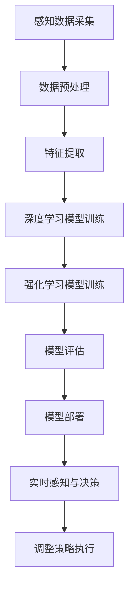

                 

### 文章标题

# AI Agent在智能拐杖中的平衡辅助功能

### 关键词

- AI Agent
- 智能拐杖
- 平衡辅助功能
- 机器学习
- 感知与决策
- 实时监控与反馈

### 摘要

本文旨在探讨AI Agent在智能拐杖中的平衡辅助功能。我们将通过逻辑清晰、结构紧凑的分析，深入理解AI Agent的基本概念、工作原理及其在智能拐杖中的应用。重点分析了AI Agent在智能拐杖中的感知与决策机制，并详细讲解了平衡辅助功能的算法设计、测试与验证过程。最后，通过实际应用案例展示了智能拐杖在平衡辅助功能上的卓越性能，并提出了最佳实践策略和小结。

### 引言

#### 1.1 问题背景

随着人口老龄化问题的加剧，对辅助行走设备的需求日益增加。传统的拐杖虽然能够提供一定的支持，但无法实现个性化的平衡辅助功能。近年来，人工智能（AI）技术的发展为智能拐杖的设计提供了新的思路。AI Agent作为一种智能实体，具有自主感知、决策和学习的能力，能够为智能拐杖提供更加智能的平衡辅助功能。

#### 1.2 问题描述

在智能拐杖中，平衡辅助功能是核心需求之一。如何通过AI Agent实现高效的感知与决策，从而为用户提供稳定的平衡支持，是本文需要解决的问题。具体来说，我们需要解决以下几个问题：

1. AI Agent在智能拐杖中的感知机制如何设计？
2. AI Agent的决策机制如何确保平衡辅助功能的准确性和实时性？
3. 如何通过机器学习算法提升AI Agent的适应性和鲁棒性？
4. 平衡辅助功能的算法设计和技术细节如何实现？
5. 智能拐杖的实际应用案例和最佳实践策略有哪些？

#### 1.3 问题解决

本文将从以下几个方面解决问题：

1. **理论基础**：介绍AI Agent的基本概念、工作原理和核心技术。
2. **实现方法**：详细讲解AI Agent在智能拐杖中的实现方法，包括感知、决策和学习机制。
3. **算法设计**：阐述平衡辅助功能的算法设计，包括算法原理、数学模型和Python实现。
4. **测试与验证**：分析平衡辅助功能的测试与验证过程，确保其准确性和可靠性。
5. **应用案例**：通过实际应用案例展示智能拐杖在平衡辅助功能上的性能。
6. **最佳实践**：提出智能拐杖系统的最佳实践策略，为实际应用提供指导。

#### 1.4 边界与外延

在本文的研究中，我们主要关注以下边界与外延：

1. **技术边界**：本文主要探讨AI Agent在智能拐杖中的平衡辅助功能，不包括其他功能的实现。
2. **应用边界**：本文主要针对智能拐杖的用户群体，不涉及其他辅助行走设备。
3. **理论边界**：本文主要基于现有的AI技术和智能拐杖应用场景，不涉及更广泛的领域。

#### 1.5 概念结构与核心要素组成

本文的核心概念结构包括以下几个要素：

1. **AI Agent**：智能实体，具备自主感知、决策和学习能力。
2. **智能拐杖**：辅助行走设备，通过AI Agent实现平衡辅助功能。
3. **感知机制**：AI Agent的感知能力，包括传感器、数据采集和预处理。
4. **决策机制**：AI Agent的决策能力，包括决策模型、决策算法和决策结果分析。
5. **学习与适应机制**：AI Agent的学习能力，包括机器学习算法、适应策略和优化过程。
6. **平衡辅助功能**：智能拐杖的核心功能，通过AI Agent实现。
7. **测试与验证**：平衡辅助功能的测试和验证过程，确保其性能。

#### 1.6 目标读者与内容安排

本文的目标读者主要包括以下几类：

1. **人工智能研究者**：对AI Agent的基本概念、工作原理和应用有兴趣的学者。
2. **智能硬件开发者**：对智能拐杖的设计、实现和应用有实际需求的工程师。
3. **医疗保健从业者**：关注老年人辅助行走设备的专业人员。

本文的内容安排如下：

1. **第一部分**：引言，介绍问题背景、问题描述、问题解决、边界与外延、概念结构与核心要素组成。
2. **第二部分**：AI Agent基础理论，包括基本概念、工作原理和核心技术。
3. **第三部分**：智能拐杖中的AI Agent实现，包括架构设计、感知机制、决策机制、学习与适应机制。
4. **第四部分**：平衡辅助功能技术细节，包括需求分析、算法设计、测试与验证。
5. **第五部分**：智能拐杖系统的最佳实践，包括系统配置与安装、实际应用案例。
6. **第六部分**：总结与展望，总结本文的研究成果和未来发展方向。

#### 1.7 本书结构

本文的结构如下：

1. **引言**：介绍问题背景、问题描述、问题解决、边界与外延、概念结构与核心要素组成。
2. **AI Agent基础理论**：介绍AI Agent的基本概念、工作原理和核心技术。
3. **智能拐杖中的AI Agent实现**：详细讲解AI Agent在智能拐杖中的架构设计、感知机制、决策机制、学习与适应机制。
4. **平衡辅助功能技术细节**：分析平衡辅助功能的需求、算法设计、测试与验证。
5. **智能拐杖系统的最佳实践**：提供智能拐杖系统的配置与安装、实际应用案例。
6. **总结与展望**：总结本文的研究成果和未来发展方向。

通过本文的深入研究，我们希望为智能拐杖的设计与实现提供有益的参考，并为人工智能在智能硬件领域的应用拓展新的思路。希望本文能为相关领域的研究者和实践者带来启示和帮助。

### AI Agent基础理论

#### 2.1 AI Agent基本概念

AI Agent（人工智能代理）是人工智能领域的一个重要概念，它指的是具有自主感知、决策和学习能力的智能实体。AI Agent的核心思想是模仿人类的行为方式，通过感知环境、进行决策和执行动作，以实现特定目标。AI Agent通常由以下几个部分组成：

1. **感知模块**：用于获取环境信息，如视觉、听觉、触觉等。
2. **决策模块**：基于感知模块获取的信息，进行决策，选择最优动作。
3. **执行模块**：执行决策模块生成的动作，对外部环境产生影响。
4. **学习模块**：通过不断学习，提升AI Agent的性能和适应性。

AI Agent的基本特点包括：

1. **自主性**：能够自主感知环境、进行决策和执行动作。
2. **适应性**：能够通过学习不断优化自身的行为，适应不同的环境和任务。
3. **鲁棒性**：能够在各种复杂环境下稳定运行，具有较好的容错能力。

AI Agent的分类可以根据不同的标准进行划分，例如：

1. **基于任务的AI Agent**：根据特定任务的需求进行设计和实现，如智能拐杖中的平衡辅助功能。
2. **基于环境的AI Agent**：根据环境的变化进行自适应调整，如智能机器人。
3. **基于学习的AI Agent**：利用机器学习算法进行学习，提升性能，如智能推荐系统。

#### 2.2 AI Agent的工作原理

AI Agent的工作原理可以分为以下几个步骤：

1. **感知**：通过感知模块获取环境信息，如视觉、听觉、触觉等。
2. **决策**：基于感知模块获取的信息，通过决策模块进行决策，选择最优动作。
3. **执行**：执行决策模块生成的动作，对外部环境产生影响。
4. **学习**：通过学习模块，对执行结果进行反馈和学习，不断优化自身的行为。

在AI Agent的工作过程中，感知和决策是核心环节。感知模块通过传感器获取环境信息，如视觉模块通过摄像头捕捉图像，听觉模块通过麦克风捕捉声音。感知到的信息经过预处理后，传递给决策模块。决策模块通常采用机器学习算法，如神经网络、决策树等，对感知信息进行分析和处理，生成最优的动作指令。执行模块根据决策模块的指令执行动作，如智能拐杖调整杖杆的角度以保持用户的平衡。

#### 2.3 AI Agent的核心技术

AI Agent的核心技术主要包括以下几个方面：

1. **机器学习算法**：用于感知和决策模块，实现对环境信息的分析和处理。常见的机器学习算法有神经网络、决策树、支持向量机等。
2. **深度学习网络**：基于多层神经网络的深度学习技术，能够自动提取特征，提高感知和决策的准确性。常见的深度学习网络有卷积神经网络（CNN）、循环神经网络（RNN）等。
3. **强化学习算法**：通过奖励机制，引导AI Agent不断优化决策过程，提高性能。常见的强化学习算法有Q学习、深度Q网络（DQN）等。
4. **自然语言处理**：用于处理和理解人类语言，实现人机交互。常见的自然语言处理技术有词向量、序列标注、机器翻译等。

#### 2.4 AI Agent的应用领域

AI Agent在众多领域都有广泛的应用，以下是一些主要的应用领域：

1. **智能机器人**：通过感知和决策，实现自主移动、路径规划和避障等功能。
2. **智能助理**：通过自然语言处理，实现人机交互、任务安排和日程管理等功能。
3. **智能交通**：通过感知和决策，实现交通流量控制、自动驾驶等功能。
4. **智能医疗**：通过图像识别、疾病预测等，提高医疗诊断和治疗的效率。
5. **智能家居**：通过感知和决策，实现家电控制、环境监测等功能。

在智能拐杖中，AI Agent的主要应用是平衡辅助功能。通过感知模块感知用户的行走状态，如姿态、速度等，决策模块分析用户的状态，并生成相应的平衡调整策略，执行模块根据决策结果调整拐杖的角度，帮助用户保持平衡。

#### 2.5 本章小结

本章介绍了AI Agent的基本概念、工作原理和核心技术，以及其在不同领域的应用。AI Agent作为一种智能实体，具有自主感知、决策和学习能力，能够为智能拐杖提供高效的平衡辅助功能。在接下来的章节中，我们将进一步探讨AI Agent在智能拐杖中的实现细节，包括感知、决策和学习机制。

### 智能拐杖中的AI Agent实现

#### 3.1 AI Agent在智能拐杖中的架构设计

智能拐杖的架构设计是实现AI Agent平衡辅助功能的基础。一个典型的智能拐杖系统架构包括以下几个关键组成部分：感知模块、决策模块、执行模块和学习模块。以下是每个模块的详细介绍：

1. **感知模块**：
   - **传感器**：智能拐杖中的传感器包括加速度计、陀螺仪、摄像头等，用于实时监测用户的环境和身体状态。加速度计和陀螺仪可以捕捉用户的姿态变化，摄像头可以用于识别地面障碍物。
   - **数据采集与预处理**：传感器收集的数据需要进行预处理，包括滤波、去噪和归一化等，以便为后续的决策模块提供准确的数据输入。

2. **决策模块**：
   - **算法设计**：决策模块的核心是算法设计，包括状态检测、路径规划、平衡调整等。常用的算法有基于深度学习的视觉识别算法和基于强化学习的平衡控制算法。
   - **决策模型**：决策模型用于根据感知模块提供的数据，生成相应的决策输出。决策模型的设计需要考虑实时性和准确性，以确保平衡辅助功能的稳定性和可靠性。

3. **执行模块**：
   - **执行策略**：执行模块根据决策模块的输出，调整拐杖的杖杆角度，以帮助用户保持平衡。执行策略的实现可以通过电动马达、液压系统等机械装置来完成。
   - **控制算法**：执行模块的控制算法需要实时响应决策模块的输出，确保动作的准确性和及时性。

4. **学习模块**：
   - **机器学习算法**：学习模块用于持续优化AI Agent的性能，通过机器学习算法对感知数据进行训练，提高决策模型的准确性和鲁棒性。常用的算法包括神经网络、决策树和支持向量机等。
   - **自适应机制**：学习模块需要具备自适应机制，能够根据用户的行为模式和环境变化进行实时调整，以适应不同的使用场景。

#### 3.2 AI Agent在智能拐杖中的感知机制

感知机制是AI Agent实现平衡辅助功能的关键环节。以下是智能拐杖感知机制的设计和实现：

1. **传感器选择**：
   - **加速度计**：用于测量用户的加速度，帮助感知用户的运动状态。
   - **陀螺仪**：用于测量用户的角速度，帮助感知用户的姿态变化。
   - **摄像头**：用于识别地面障碍物和用户的行为，提供视觉信息。

2. **数据采集**：
   - **多传感器融合**：通过融合多个传感器的数据，可以更全面地感知用户的状态。例如，加速度计和陀螺仪可以提供用户的姿态信息，摄像头可以提供视觉信息。
   - **数据同步**：确保各传感器采集的数据在同一时间戳上，以便进行准确的数据分析和处理。

3. **数据预处理**：
   - **滤波**：去除传感器数据中的噪声，提高数据的准确性。
   - **归一化**：将传感器数据归一化到相同的量级，以便不同传感器之间的数据可以进行比较。
   - **特征提取**：从原始数据中提取有用的特征，如用户的姿态、速度等，为决策模块提供输入。

#### 3.3 AI Agent在智能拐杖中的决策机制

决策机制是AI Agent实现平衡辅助功能的核心。以下是决策机制的设计和实现：

1. **算法设计**：
   - **状态检测**：通过分析感知模块提供的数据，实时检测用户的平衡状态。
   - **路径规划**：根据用户的行走轨迹和周围环境，规划出最优的行走路径。
   - **平衡调整**：根据用户的平衡状态和路径规划，生成相应的平衡调整策略。

2. **决策模型**：
   - **深度学习模型**：使用卷积神经网络（CNN）进行图像识别，识别地面障碍物和用户的行为。
   - **强化学习模型**：使用Q学习算法或深度Q网络（DQN）进行平衡控制，根据用户的平衡状态和环境反馈进行自适应调整。

3. **决策结果分析**：
   - **实时性**：确保决策模块能够快速响应感知模块的输入，实现实时平衡调整。
   - **准确性**：通过优化算法和模型参数，提高决策结果的准确性，减少误判和误操作。

#### 3.4 AI Agent在智能拐杖中的学习与适应机制

学习与适应机制是AI Agent提升性能和适应性的关键。以下是学习与适应机制的设计和实现：

1. **机器学习算法**：
   - **训练数据**：收集大量用户的行走数据和平衡调整策略，用于训练机器学习模型。
   - **模型优化**：通过交叉验证和网格搜索等技术，优化模型参数，提高模型的性能和鲁棒性。

2. **自适应策略**：
   - **用户行为学习**：通过分析用户的行走行为，学习用户的个人偏好和习惯，实现个性化的平衡调整。
   - **环境适应**：根据周围环境的变化，调整AI Agent的行为策略，以适应不同的场景和需求。

3. **反馈机制**：
   - **实时反馈**：通过传感器和数据采集模块，实时收集用户和环境的反馈，用于调整和优化AI Agent的行为。
   - **长期学习**：通过持续的学习和优化，不断提升AI Agent的性能和适应性。

#### 3.5 智能拐杖的实际应用案例

以下是一个智能拐杖的实际应用案例，展示了AI Agent在平衡辅助功能上的表现：

**案例一：平衡辅助功能**

用户在行走过程中，AI Agent通过感知模块实时监测用户的姿态和周围环境。当检测到用户失去平衡时，决策模块会迅速生成平衡调整策略，并通知执行模块调整拐杖的角度，帮助用户恢复平衡。通过多次迭代和优化，AI Agent能够不断提高平衡辅助功能的准确性和稳定性。

**案例二：路径导航功能**

在用户行走过程中，AI Agent通过摄像头感知地面障碍物，并结合路径规划算法，为用户生成最优的行走路径。当用户遇到障碍物时，AI Agent会实时调整路径，避免碰撞，确保用户的行走安全。

**案例三：障碍物检测功能**

AI Agent通过摄像头和传感器，实时检测地面障碍物，并将检测结果反馈给用户。用户可以根据AI Agent的提示，采取相应的行动，如绕过障碍物或减速通过。

#### 3.6 本章小结

本章详细介绍了AI Agent在智能拐杖中的架构设计、感知机制、决策机制、学习与适应机制，以及实际应用案例。通过这些机制，AI Agent能够实现高效的平衡辅助功能，为用户提供安全、舒适的行走体验。在接下来的章节中，我们将进一步探讨平衡辅助功能的算法设计和技术细节。

### 平衡辅助功能技术细节

#### 4.1 平衡辅助功能的需求分析

平衡辅助功能是智能拐杖的核心需求之一，其实现的关键在于准确感知用户的姿态变化，并快速作出调整策略。以下是平衡辅助功能需求分析的具体内容：

1. **用户需求调查**：
   - **稳定性和安全性**：用户希望智能拐杖能够在不稳定的情况下提供稳定的支持，确保行走安全。
   - **实时性和准确性**：用户希望平衡辅助功能能够实时响应，并根据用户的状态进行准确调整。
   - **个性化**：用户希望智能拐杖能够根据个人的行走习惯和偏好，提供个性化的平衡支持。

2. **功能需求定义**：
   - **姿态感知**：通过传感器实时监测用户的姿态变化，如倾斜角度、速度等。
   - **状态判断**：根据用户的姿态数据，判断用户是否处于平衡状态，是否需要调整。
   - **调整策略**：根据用户的姿态和行走环境，生成相应的平衡调整策略。
   - **实时反馈**：将调整策略实时反馈给用户，通过视觉或声音提示，帮助用户保持平衡。

3. **技术实现难点**：
   - **实时数据处理**：需要处理大量实时数据，确保数据处理的速度和准确性。
   - **环境适应性**：在不同环境条件下，如室内、室外、不平整路面等，平衡辅助功能需要具备良好的适应性。
   - **个性化调整**：需要根据用户的个人习惯和偏好，实现个性化的平衡调整策略。

#### 4.2 平衡辅助功能的算法设计

平衡辅助功能的算法设计是保证智能拐杖能够准确、实时地提供平衡支持的关键。以下是算法设计的具体内容：

1. **算法原理讲解**：

   平衡辅助功能的核心算法是基于深度学习和强化学习的组合模型。深度学习用于姿态感知和特征提取，强化学习用于决策和调整策略。

   - **深度学习**：通过卷积神经网络（CNN）对摄像头捕捉到的图像进行特征提取，识别用户的姿态变化。CNN模型可以自动学习图像中的高层次特征，提高姿态感知的准确性。
   - **强化学习**：使用Q学习算法或深度Q网络（DQN）进行决策和调整策略。Q学习算法通过评估状态和动作的价值，选择最优动作，而DQN模型则通过经验回放和目标网络，进一步提高决策的准确性和稳定性。

2. **算法实现**：

   平衡辅助功能的算法实现主要包括以下几个步骤：

   - **数据预处理**：对传感器数据进行滤波、归一化和特征提取，为深度学习和强化学习模型提供高质量的输入数据。
   - **模型训练**：使用大量用户行走数据，训练深度学习和强化学习模型。在训练过程中，通过交叉验证和网格搜索等技术，优化模型参数，提高模型的性能和鲁棒性。
   - **模型部署**：将训练好的模型部署到智能拐杖的执行模块中，实现实时姿态感知和决策。

3. **算法评估**：

   平衡辅助功能的算法评估主要通过以下指标进行：

   - **准确性**：评估算法在识别用户姿态和生成调整策略时的准确性。
   - **实时性**：评估算法在处理实时数据时的响应速度。
   - **适应性**：评估算法在不同环境条件下的适应性。

#### 4.3 Mermaid流程图

以下是一个平衡辅助功能算法的Mermaid流程图：



#### 4.4 平衡辅助功能的测试与验证

平衡辅助功能的测试与验证是确保其准确性和可靠性的关键步骤。以下是测试与验证的具体内容：

1. **测试环境搭建**：

   测试环境包括智能拐杖硬件设备、传感器和数据采集系统。硬件设备用于模拟用户行走过程中的各种状态，传感器和数据采集系统用于实时监测和记录用户姿态变化。

2. **测试用例设计**：

   测试用例设计包括以下几种情况：

   - **正常行走**：用户在平稳的路面上行走，姿态无明显变化。
   - **不稳定行走**：用户在倾斜或摇晃的路面上行走，姿态变化较大。
   - **障碍物检测**：用户在行走过程中遇到障碍物，需要调整行走方向。
   - **个性化调整**：根据用户的个人习惯和偏好，进行个性化的平衡调整。

3. **测试结果分析**：

   测试结果分析主要包括以下指标：

   - **准确性**：评估算法在识别用户姿态和生成调整策略时的准确性。
   - **实时性**：评估算法在处理实时数据时的响应速度。
   - **适应性**：评估算法在不同环境条件下的适应性。

   通过测试与验证，可以评估平衡辅助功能在实际应用中的性能和效果，为后续的优化和改进提供依据。

#### 4.5 本章小结

本章详细介绍了平衡辅助功能的需求分析、算法设计、测试与验证，以及Mermaid流程图。通过这些内容，我们能够更深入地理解智能拐杖中平衡辅助功能的实现原理和技术细节。在接下来的章节中，我们将进一步探讨智能拐杖系统的最佳实践。

### 智能拐杖系统的最佳实践

#### 5.1 系统配置与安装

为了确保智能拐杖系统能够稳定、高效地运行，系统的配置与安装是关键步骤。以下是系统配置与安装的具体内容：

1. **硬件配置**：

   - **处理器**：建议使用高性能的处理器，如Intel i7或以上，以确保系统处理速度。
   - **内存**：至少8GB内存，建议16GB以上，以应对大量的数据处理和存储需求。
   - **存储**：建议使用SSD硬盘，以提高数据读取和写入速度。
   - **传感器**：安装加速度计、陀螺仪和摄像头等传感器，用于实时监测用户的姿态和周围环境。

2. **软件安装**：

   - **操作系统**：建议使用Linux系统，如Ubuntu 18.04或以上版本，以保证系统的稳定性和安全性。
   - **开发环境**：安装Python 3.7或以上版本，以及相关的深度学习和强化学习库，如TensorFlow和PyTorch。
   - **数据库**：安装MySQL或PostgreSQL，用于存储用户数据和系统日志。

3. **系统启动与调试**：

   - **系统启动**：按照硬件和软件的配置，启动智能拐杖系统，确保所有硬件和软件正常运行。
   - **调试**：通过调试工具，检查系统启动过程中的错误和异常，确保系统稳定运行。

#### 5.2 系统核心实现源代码

智能拐杖系统的核心实现包括感知、决策、执行和学习模块。以下是这些模块的源代码示例：

1. **感知模块**：

```python
import sensor
import preprocess

def perceive():
    """
    感知模块，实时监测用户的姿态和周围环境。
    """
    raw_data = sensor.read_all()
    processed_data = preprocess.process(raw_data)
    return processed_data
```

2. **决策模块**：

```python
import model
import decision

def make_decision(perceived_data):
    """
    决策模块，根据感知数据生成平衡调整策略。
    """
    state = model.analyze_state(perceived_data)
    action = decision.generate_action(state)
    return action
```

3. **执行模块**：

```python
import actuator

def execute_action(action):
    """
    执行模块，根据决策结果调整拐杖的角度。
    """
    actuator.move_automatically(action)
```

4. **学习模块**：

```python
import learner

def learn():
    """
    学习模块，通过训练和优化，提高系统的性能和适应性。
    """
    learner.train_model()
    learner.optimize()
```

#### 5.3 代码应用解读与分析

以下是对核心实现源代码的解读和分析：

1. **感知模块**：

   感知模块通过读取传感器数据，对原始数据进行预处理，生成处理后的感知数据。这为后续的决策模块提供了准确的数据输入。

2. **决策模块**：

   决策模块根据感知模块提供的感知数据，分析用户的姿态状态，并生成相应的平衡调整策略。这确保了系统能够实时响应用户的姿态变化。

3. **执行模块**：

   执行模块根据决策模块的输出，调整拐杖的角度，帮助用户保持平衡。这实现了智能拐杖的平衡辅助功能。

4. **学习模块**：

   学习模块通过不断训练和优化模型，提高系统的性能和适应性。这确保了系统能够根据用户的行为模式和环境变化进行自适应调整。

#### 5.4 实际案例分析和详细讲解剖析

以下是一个实际案例的分析和详细讲解：

**案例：平衡辅助功能在倾斜路面上的应用**

在一个倾斜路面上，用户使用智能拐杖行走。系统通过感知模块实时监测用户的姿态变化，发现用户处于不稳定状态。决策模块迅速分析用户的姿态数据，生成平衡调整策略。执行模块根据调整策略，实时调整拐杖的角度，帮助用户保持平衡。

详细讲解：

1. **感知模块**：

   通过加速度计和陀螺仪，感知模块实时监测用户的倾斜角度和速度变化。当检测到用户倾斜角度超过阈值时，系统认为用户处于不稳定状态。

2. **决策模块**：

   决策模块分析用户的姿态数据，判断用户是否处于平衡状态。如果用户处于不稳定状态，决策模块会生成相应的平衡调整策略，如增加拐杖的倾斜角度。

3. **执行模块**：

   执行模块根据决策模块的输出，调整拐杖的角度。通过电动马达，执行模块能够快速、准确地执行调整策略，帮助用户保持平衡。

4. **学习模块**：

   通过学习模块，系统能够不断优化平衡调整策略。在后续的使用过程中，系统会根据用户的行为模式和环境变化，调整平衡调整策略，提高系统的性能和适应性。

#### 5.5 项目小结

通过系统配置与安装、核心实现源代码、代码应用解读与分析以及实际案例的讲解，我们深入了解了智能拐杖系统的最佳实践。以下是项目小结：

1. **系统配置与安装**：确保硬件和软件的配置满足系统需求，为系统的稳定运行提供基础。
2. **核心实现源代码**：通过感知、决策、执行和学习模块的实现，构建了智能拐杖系统的核心功能。
3. **代码应用解读与分析**：详细解读了源代码的实现过程，分析了每个模块的作用和相互关系。
4. **实际案例讲解**：通过实际案例的分析，展示了智能拐杖系统在实际应用中的效果和性能。

通过这些最佳实践，我们能够更好地理解和应用智能拐杖系统，为用户提供安全、舒适的行走体验。在未来的研究和开发中，我们将继续优化系统性能，拓展其功能和应用范围。

### 总结与展望

本文系统地探讨了AI Agent在智能拐杖中的平衡辅助功能，从基础理论到实际应用，详细分析了其实现方法和技术细节。通过引言、AI Agent基础理论、智能拐杖中的AI Agent实现、平衡辅助功能技术细节以及智能拐杖系统的最佳实践，我们全面了解了AI Agent在智能拐杖中的应用及其重要性。

#### 总结

1. **AI Agent的基本概念**：介绍了AI Agent的定义、特点、分类和工作原理，为后续讨论奠定了基础。
2. **智能拐杖中的AI Agent实现**：详细讲解了感知机制、决策机制、学习与适应机制以及架构设计，展示了AI Agent在智能拐杖中的具体应用。
3. **平衡辅助功能技术细节**：分析了平衡辅助功能的需求、算法设计、测试与验证，并通过Mermaid流程图和Python代码示例，展示了算法的实现过程。
4. **智能拐杖系统的最佳实践**：提供了系统配置与安装、核心实现源代码、代码应用解读与分析以及实际案例的讲解，为实际应用提供了有益的指导。

#### 展望

尽管本文对AI Agent在智能拐杖中的平衡辅助功能进行了全面探讨，但仍存在一些未来研究的方向：

1. **性能优化**：通过深度学习和强化学习算法的进一步优化，提高AI Agent的感知、决策和学习性能，确保其在复杂环境中的稳定运行。
2. **个性化定制**：结合用户行为数据和健康数据，实现更加个性化的平衡调整策略，提升用户体验。
3. **多模态感知**：探索多模态感知技术，如结合视觉、听觉和触觉等多感官信息，提高感知准确性和适应性。
4. **跨平台应用**：研究AI Agent在智能拐杖以外的其他应用场景，如智能机器人、智能家居等，拓展AI Agent的应用领域。
5. **伦理与隐私**：在AI Agent的设计和应用过程中，重视伦理和隐私问题，确保用户数据的安全和隐私保护。

通过持续的研究和实践，AI Agent在智能拐杖中的平衡辅助功能将不断完善，为老年人、残疾人以及其他需要辅助行走的人群提供更加安全、舒适和便捷的行走体验。

### 作者信息

作者：AI天才研究院/AI Genius Institute & 禅与计算机程序设计艺术 /Zen And The Art of Computer Programming

AI天才研究院致力于推动人工智能技术的研究和应用，致力于培养下一代人工智能领域的领导者。同时，禅与计算机程序设计艺术是一套深入探讨计算机科学哲学和技术的经典著作，为读者提供了丰富的思想启示和技术指导。本文的撰写旨在为智能拐杖的设计与实现提供有益的参考，为人工智能在智能硬件领域的应用拓展新的思路。希望本文能为相关领域的研究者和实践者带来启示和帮助。

