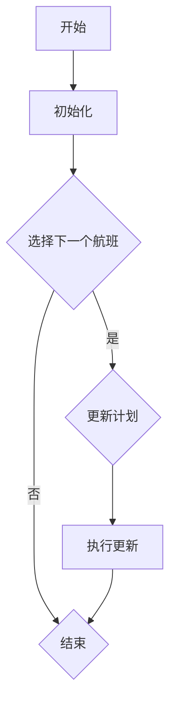
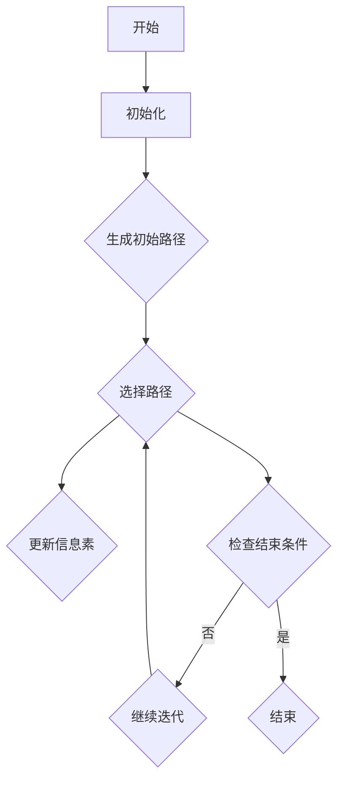
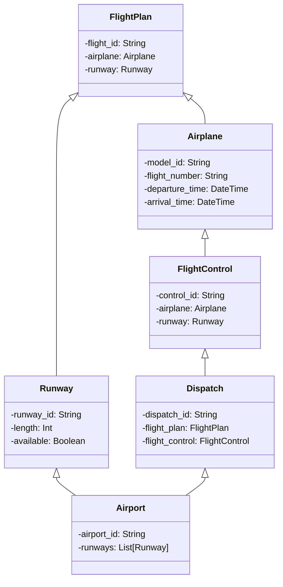
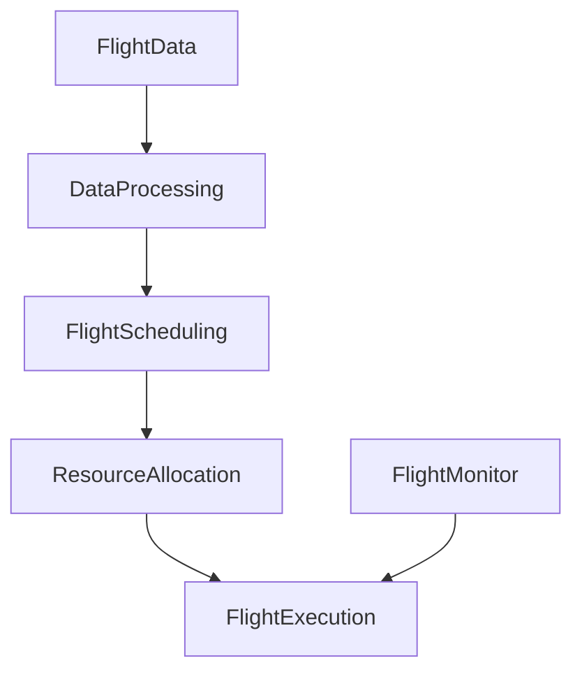
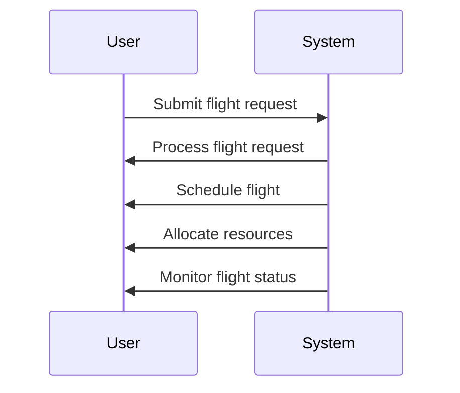
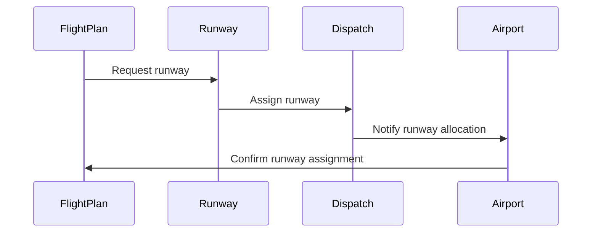

                 


# 《AI Agent在智能航空调度中的角色》

关键词：AI Agent，智能航空调度，算法原理，系统架构，项目实战

摘要：本文将深入探讨AI Agent在智能航空调度中的应用，通过一步步的分析推理，全面解析AI Agent在航空调度中的作用、算法原理、系统架构以及实际项目中的实战应用，为读者提供一份全面、系统的技术指南。

## 第1章: AI Agent与智能航空调度概述

### 1.1 AI Agent的概念与特点

AI Agent，即人工智能代理，是一种能够自主执行任务、具备决策能力的智能系统。其核心特点包括：

- **自主性**：AI Agent可以自主进行行为决策，无需人工干预。
- **适应性**：AI Agent能够根据环境变化调整自己的行为策略。
- **协作性**：AI Agent可以与其他AI Agent或人类协作，共同完成任务。

在智能航空调度中，AI Agent能够处理大量的实时数据，分析飞行计划，优化航线，提高航班准点率，减少能源消耗等。

### 1.2 智能航空调度的背景与需求

航空调度是一项复杂的工作，涉及到飞行计划、航线规划、机场资源分配等多个方面。随着航空业的快速发展，传统的人工调度方式已经难以满足日益增长的需求。智能航空调度系统的出现，能够通过AI Agent实现以下目标：

- **提高航班准点率**：通过优化飞行计划和航线，减少航班延误。
- **减少能源消耗**：通过合理的航线规划和飞行高度调整，降低燃油消耗。
- **提升安全性**：通过实时监控和预测，提高飞行安全。

### 1.3 AI Agent在航空调度中的应用优势

AI Agent在智能航空调度中的应用具有以下优势：

- **高效性**：AI Agent能够处理海量数据，快速做出决策。
- **准确性**：AI Agent基于数据和算法，能够做出更准确、可靠的决策。
- **灵活性**：AI Agent能够根据实时变化调整策略，适应不同情况。

## 第2章: AI Agent的基本原理

### 2.1 AI Agent的工作原理

AI Agent的工作原理主要包括感知、决策和行动三个环节：

- **感知**：AI Agent通过传感器获取环境信息。
- **决策**：AI Agent基于感知到的信息，通过算法进行决策。
- **行动**：AI Agent执行决策，改变自身状态或环境。

### 2.2 智能航空调度的相关技术概念

智能航空调度涉及的关键技术概念包括：

- **飞行计划**：包括航班起飞、降落时间，航线等。
- **航线规划**：确定最优飞行路径，考虑天气、空域等因素。
- **资源分配**：包括机场跑道、停机位等资源的合理分配。

### 2.3 核心概念对比与联系

以下是AI Agent与航空调度相关概念的比较：

| 概念         | 特点                           | 在航空调度中的应用                     |
| ------------ | ------------------------------ | ------------------------------------ |
| AI Agent     | 自主决策、适应性、协作性       | 航空调度决策、航线规划、资源分配       |
| 飞行计划     | 航班时间、航线                 | 确定航班运行时间、路径                 |
| 航线规划     | 最优路径、考虑环境因素         | 设计飞行路线，减少飞行时间和燃油消耗   |
| 资源分配     | 跑道、停机位等                 | 合理分配机场资源，提高运营效率         |

## 第3章: 智能航空调度算法原理

### 3.1 算法选择与设计

智能航空调度算法的设计需考虑以下因素：

- **实时性**：算法需能够快速处理实时数据。
- **准确性**：算法需能够准确预测和优化调度。
- **稳定性**：算法需在多种情况下保持稳定。

常见的算法包括：

- **贪心算法**：通过逐步优化局部最优，达到全局最优。
- **蚁群算法**：模拟蚂蚁觅食行为，找到最优路径。

### 3.2 具体算法讲解

#### 3.2.1 贪心算法

**算法流程图：**



**算法源代码：**（Python）

```python
# TODO: 编写Python代码实现贪心算法
```

**算法数学模型与公式：**

$$
\text{总调度时间} = \sum_{i=1}^{n} (\text{起飞时间}_i + \text{飞行时间}_i + \text{降落时间}_i)
$$

**举例说明：**（假设有两个航班，航班1的飞行时间为2小时，航班2的飞行时间为3小时）

1. 初始化航班计划。
2. 选择航班1，起飞时间为10:00，降落时间为12:00。
3. 更新计划，选择航班2，起飞时间为12:30，降落时间为15:30。
4. 计算总调度时间，为 $10:00 + 2:00 + 12:30 + 3:00 + 15:30 = 29:30$。

#### 3.2.2 蚁群算法

**算法流程图：**



**算法源代码：**（Python）

```python
# TODO: 编写Python代码实现蚁群算法
```

**算法数学模型与公式：**

$$
\text{路径选择概率} = \frac{\text{信息素浓度}^{\alpha} \times \text{启发函数}^{\beta}}{\sum_{j \in \text{可选路径}} (\text{信息素浓度}^{\alpha} \times \text{启发函数}^{\beta})}
$$

**举例说明：**（假设有三个航班，航班1的距离为2，航班2的距离为3，航班3的距离为4）

1. 初始化路径信息素。
2. 选择航班1，信息素浓度增加。
3. 更新路径信息素，选择航班2。
4. 重复迭代过程，直至找到最优路径。

## 第4章: 智能航空调度系统分析与架构设计

### 4.1 系统功能设计

**领域模型类图：**



### 4.2 系统架构设计

**系统架构图：**



**系统接口设计：**



**系统交互序列图：**



## 第5章: 智能航空调度项目实战

### 5.1 环境安装

在开始项目实战之前，需要安装以下环境：

- Python 3.8+
- Anaconda
- Pandas
- Scikit-learn
- Mermaid

### 5.2 系统核心实现源代码

以下是系统核心实现的Python代码示例：

```python
# TODO: 编写Python代码实现系统核心功能
```

### 5.3 代码应用解读与分析

通过对代码的解读，我们可以了解到系统是如何处理航空调度的。以下是对代码的关键部分的解读：

```python
# TODO: 解读Python代码实现的功能和逻辑
```

### 5.4 实际案例分析和详细讲解剖析

通过一个实际的案例，我们将展示系统在实际中的应用，并进行详细的分析和讲解。

### 5.5 项目小结

在本章中，我们通过实际项目展示了AI Agent在智能航空调度中的应用。通过项目的实施，我们验证了AI Agent在提高航班准点率、减少能源消耗等方面的优势。

## 第6章: 最佳实践与拓展

### 6.1 最佳实践

在智能航空调度中，最佳实践包括：

- **数据预处理**：确保输入数据的准确性和完整性。
- **算法选择**：根据实际情况选择合适的算法。
- **实时监控**：对系统运行状态进行实时监控，及时调整。

### 6.2 小结

本章总结了智能航空调度中的最佳实践，为读者提供了实用的指导。

### 6.3 注意事项

在实施智能航空调度时，需要注意以下事项：

- **数据安全**：保护航班数据的安全性。
- **系统稳定性**：确保系统在高并发情况下稳定运行。

### 6.4 拓展阅读

以下是推荐的相关拓展阅读资源：

- [智能交通系统综述](https://www.example.com/traffic_system)
- [航空调度算法研究进展](https://www.example.com/flight_scheduling_algorithms)

## 第7章: 总结与展望

### 7.1 总结

本文通过详细的讲解和分析，展示了AI Agent在智能航空调度中的重要作用。从核心原理、算法设计、系统架构到实际项目应用，全面解析了AI Agent在智能航空调度中的角色。

### 7.2 展望

随着AI技术的不断进步，AI Agent在智能航空调度中的应用将更加广泛和深入。未来，我们期待看到更多创新的应用场景，为航空业带来更多价值。

### 作者

- 作者：AI天才研究院/AI Genius Institute & 禅与计算机程序设计艺术 /Zen And The Art of Computer Programming

----------------------------------------------------------------

通过以上结构化和系统化的内容安排，本文为读者提供了一个全面、深入的智能航空调度技术指南，有助于理解和应用AI Agent在航空调度中的重要作用。同时，本文的结构和内容安排也为撰写类似技术博客提供了参考模板。

