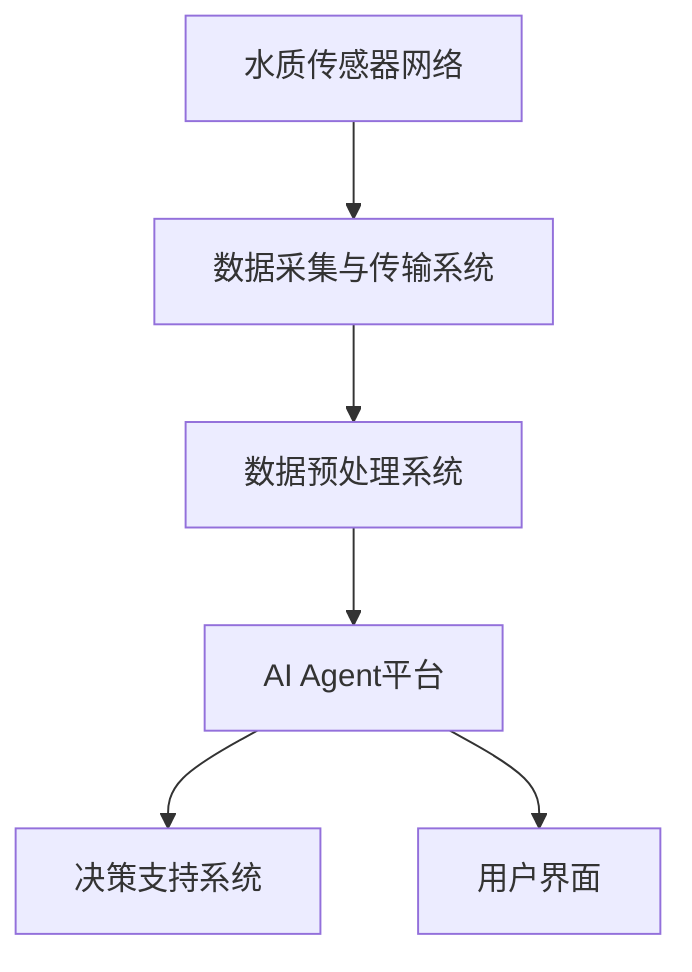
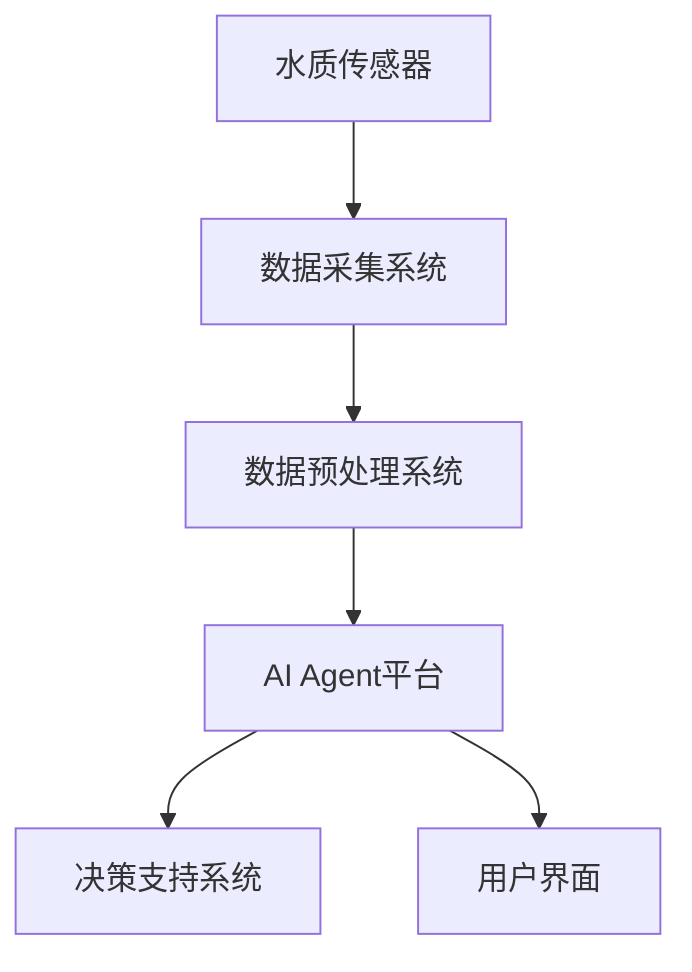
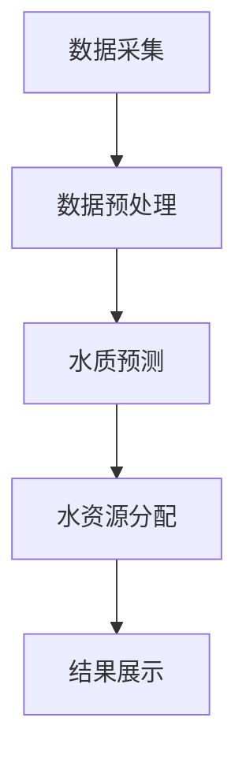

                 


# AI Agent在水资源管理中的应用：水质监测与分配

> 关键词：水资源管理，AI Agent，水质监测，水资源分配，算法，系统架构

> 摘要：随着全球水资源的日益紧缺，水资源管理和分配成为了一个重要的研究领域。本文介绍了AI Agent在水资源管理中的应用，包括水质监测和水资源分配。通过详细分析AI Agent的基本原理、水质监测的算法原理、水资源分配的策略和方法，以及系统架构设计方案，本文为读者提供了一种全新的视角来理解和应用AI Agent在水资源管理中的技术。

## 背景介绍

### 水资源管理的重要性

水资源是地球上最重要的自然资源之一，对人类生活和经济发展具有重要意义。然而，随着人口增长、城市化进程加速和气候变化等因素的影响，全球水资源的供需矛盾日益突出。因此，科学合理地进行水资源管理，确保水资源的可持续利用，已成为各国政府和社会各界关注的焦点。

水资源管理涉及多个方面，包括水资源规划、开发、利用、治理、保护和配置等。其目的是在满足当前和未来需求的同时，保护水资源和生态系统，实现水资源的可持续利用。水资源管理的重要性主要体现在以下几个方面：

1. **保障人类生存**：水是人类生存的基本需求，没有水，人类将无法生存。
2. **促进经济发展**：水资源是农业、工业和城市发展的关键资源，合理利用水资源可以推动经济增长。
3. **保护生态环境**：水资源是生态系统的重要组成部分，合理管理水资源有助于维护生态平衡。
4. **应对气候变化**：水资源管理对于应对气候变化具有重要意义，例如，通过水资源调节可以减缓洪水和干旱的影响。

### 水资源管理面临的挑战

尽管水资源管理的重要性不言而喻，但在实际操作中，水资源管理面临着诸多挑战：

1. **水资源短缺**：全球许多地区都面临着水资源短缺的问题，尤其是在干旱和半干旱地区。
2. **水质污染**：工业废水、农业废水、城市污水等对水质造成了严重污染，影响了水资源的质量。
3. **水资源分配不均**：不同地区的水资源分布不均，一些地区水资源丰富，而另一些地区则水资源匮乏。
4. **气候变化影响**：气候变化导致的降水模式变化、干旱和洪水等极端天气事件，对水资源管理提出了新的挑战。

### 水资源管理的发展趋势

面对水资源管理面临的挑战，各国政府和社会各界都在积极探索新的水资源管理方法和技术。以下是一些水资源管理的发展趋势：

1. **智能化水资源管理**：利用人工智能、大数据、物联网等先进技术，实现水资源的智能化监测、分配和管理。
2. **水资源循环利用**：通过污水处理、再生利用等技术，提高水资源的利用效率，实现水资源的循环利用。
3. **水资源保护与恢复**：加强水资源保护，恢复受损的生态系统，提高水资源的质量。
4. **国际合作与共享**：加强国际间的水资源合作，实现水资源共享，共同应对水资源危机。

### AI Agent在水资源管理中的应用潜力

AI Agent是一种基于人工智能技术的高级智能体，具有自主感知、决策和行动的能力。在水资源管理中，AI Agent可以发挥以下作用：

1. **水质监测**：AI Agent可以通过传感器网络实时监测水质，及时发现水质污染问题，提高水质监测的效率和准确性。
2. **水资源分配**：AI Agent可以根据实时数据和水资源的供需情况，智能分配水资源，优化水资源利用，提高水资源利用效率。
3. **预测与预警**：AI Agent可以通过对历史数据和实时数据的分析，预测水资源的供需情况，提供预警信息，帮助决策者制定合理的调水方案。
4. **智能决策支持**：AI Agent可以提供智能化的决策支持，帮助水资源管理者制定科学的决策，提高水资源管理的水平。

综上所述，AI Agent在水资源管理中具有广泛的应用潜力，有望为解决水资源管理面临的挑战提供新的解决方案。

## AI Agent概述

### AI Agent的定义与特点

AI Agent，即人工智能代理，是一种具有高度自主性和智能化的软件实体。它能够根据环境信息进行感知、理解、决策和行动，以实现特定目标。AI Agent通常具有以下特点：

1. **自主性**：AI Agent能够在没有外部干预的情况下自主执行任务。
2. **适应性**：AI Agent能够根据环境变化调整自身行为，提高任务完成的效率。
3. **交互性**：AI Agent能够与其他系统、实体或人进行交互，获取信息和执行任务。
4. **智能性**：AI Agent通过机器学习、深度学习等技术，具备处理复杂问题和进行智能决策的能力。

### AI Agent的分类

AI Agent可以根据不同的分类标准进行分类，常见的分类方式包括：

1. **根据功能**：可分为任务型AI Agent、数据型AI Agent、社交型AI Agent等。
   - **任务型AI Agent**：专注于完成特定任务的AI Agent，如水质监测AI Agent、水资源分配AI Agent。
   - **数据型AI Agent**：主要负责处理和分析数据的AI Agent，如数据挖掘、预测分析等。
   - **社交型AI Agent**：具备社交能力的AI Agent，能够与人或其他AI Agent进行交流合作。

2. **根据结构**：可分为单一AI Agent、群体AI Agent等。
   - **单一AI Agent**：独立完成任务的AI Agent。
   - **群体AI Agent**：由多个AI Agent组成的协同系统，共同完成复杂任务。

3. **根据应用领域**：可分为工业AI Agent、农业AI Agent、医疗AI Agent等。
   - **工业AI Agent**：应用于工业生产过程的智能化系统，如智能制造、工业自动化等。
   - **农业AI Agent**：应用于农业生产的智能化系统，如智能灌溉、病虫害监测等。
   - **医疗AI Agent**：应用于医疗领域的智能化系统，如疾病预测、辅助诊断等。

### AI Agent在水资源管理中的应用

AI Agent在水资源管理中具有广泛的应用，主要包括以下方面：

1. **水质监测**：利用AI Agent的自主性和智能性，实现对水质的实时监测和数据分析，及时发现水质污染问题，为水资源管理者提供决策支持。
2. **水资源分配**：根据实时数据和AI算法，AI Agent能够智能分配水资源，优化水资源利用，提高水资源利用效率。
3. **预测与预警**：通过分析历史数据和实时数据，AI Agent可以预测水资源的供需情况，提供预警信息，帮助决策者制定合理的调水方案。
4. **智能决策支持**：AI Agent可以为水资源管理者提供智能化的决策支持，帮助其制定科学的决策，提高水资源管理的水平。

### AI Agent在水资源管理中的优势

与传统的水资源管理方法相比，AI Agent具有以下优势：

1. **实时性**：AI Agent能够实时获取和处理水质和水资源数据，为水资源管理者提供即时的决策支持。
2. **准确性**：通过机器学习和深度学习等技术，AI Agent能够对大量数据进行分析和预测，提高决策的准确性。
3. **效率**：AI Agent能够自动执行任务，减少人工干预，提高工作效率。
4. **智能化**：AI Agent具备智能决策能力，能够根据环境变化自动调整策略，实现自适应管理。

综上所述，AI Agent在水资源管理中具有巨大的应用潜力，为解决水资源管理面临的挑战提供了一种全新的解决方案。

## 水质监测原理与算法

### 水质监测的关键技术

水质监测是水资源管理的重要环节，涉及到多个关键技术的应用。以下是一些常见的水质监测关键技术：

1. **传感器技术**：水质传感器是水质监测的核心设备，可以实时测量水质的各项指标，如pH值、溶解氧、氨氮、总磷等。传感器的性能直接影响水质监测的准确性和实时性。
2. **数据采集与传输技术**：通过物联网技术，将水质传感器采集到的数据实时传输到中心控制系统，实现远程监控和管理。
3. **数据处理与分析技术**：通过对水质数据进行分析和处理，提取有用信息，如水质变化趋势、异常检测等。
4. **大数据技术**：利用大数据技术，对大规模水质数据进行存储、管理和分析，发现水质变化的规律和趋势。

### 数据采集与预处理

水质监测的第一步是数据采集。数据采集的过程包括以下步骤：

1. **传感器部署**：在目标水域布设水质传感器，确保传感器的位置和数量能够覆盖整个监测区域。
2. **数据采集**：传感器实时采集水质参数，并将数据传输到中心控制系统。
3. **数据传输**：通过物联网技术，将采集到的数据传输到中心控制系统，实现远程监控和管理。

在数据采集过程中，数据的质量至关重要。为了确保数据质量，需要对采集到的数据进行分析和预处理，包括以下步骤：

1. **数据清洗**：去除数据中的噪声和异常值，提高数据的质量。
2. **数据转换**：将不同传感器采集到的数据进行统一格式转换，以便后续处理和分析。
3. **数据归一化**：将不同指标的数据进行归一化处理，使其在同一尺度上进行比较和分析。

### 水质监测算法原理

水质监测的核心在于对采集到的水质数据进行处理和分析，以识别水质变化趋势和异常情况。以下是一些常见的水质监测算法原理：

1. **统计模型**：利用统计学方法对水质数据进行建模和分析，如回归分析、聚类分析、时间序列分析等。这些算法能够提取数据中的规律和趋势，为水资源管理者提供决策支持。
2. **机器学习算法**：利用机器学习方法对水质数据进行训练和预测，如决策树、支持向量机、神经网络等。这些算法能够自动识别数据中的特征和模式，提高水质监测的准确性和效率。
3. **深度学习算法**：深度学习算法通过多层神经网络对水质数据进行学习和预测，具有强大的特征提取和模式识别能力，如卷积神经网络（CNN）、循环神经网络（RNN）等。这些算法在水质监测中具有广泛的应用前景。

### 数据采集与处理流程

水质监测的数据采集与处理流程通常包括以下步骤：

1. **数据采集**：传感器实时采集水质数据，并将数据传输到中心控制系统。
2. **数据预处理**：对采集到的数据进行清洗、转换和归一化处理，确保数据的质量。
3. **数据存储**：将预处理后的数据存储到数据库中，便于后续分析和查询。
4. **数据分析**：利用统计模型、机器学习算法和深度学习算法对水质数据进行分析和预测，提取有用信息。
5. **结果展示**：将分析结果以图表、报告等形式展示给水资源管理者，为其提供决策支持。

通过以上步骤，水质监测系统可以实现对水质的实时监测和数据分析，为水资源管理者提供及时、准确的信息，帮助其做出科学的决策。

### 具体案例分析

为了更好地理解水质监测算法的应用，以下是一个具体案例：

某地区的水资源管理部门采用AI Agent进行水质监测。他们在主要河流布设了多个水质传感器，实时监测水质的各项指标，如pH值、溶解氧、氨氮、总磷等。

AI Agent采集到传感器数据后，首先对数据进行预处理，包括数据清洗和转换。然后，利用机器学习算法对数据进行训练和预测，以识别水质变化趋势和异常情况。

经过分析，AI Agent发现某段时间内某段河流的氨氮含量明显高于其他时间，可能存在污染问题。水资源管理部门立即展开调查，发现是由于附近一家化工厂排放的废水处理不当所致。

通过AI Agent提供的信息，水资源管理部门及时采取措施，要求化工厂加强废水处理，同时加强水质监测，确保河流水质安全。

该案例展示了AI Agent在水质监测中的应用，通过实时数据分析和预测，为水资源管理者提供了有力支持，提高了水质监测的效率和准确性。

### 结论

水质监测是水资源管理的重要环节，AI Agent通过传感器技术、数据采集与传输技术、数据处理与分析技术等关键技术的应用，实现对水质的实时监测和数据分析。通过具体的案例分析，可以看出AI Agent在水质监测中的高效性和准确性，为水资源管理者提供了有力的技术支持。未来，随着人工智能技术的不断发展和应用，AI Agent在水资源管理中的作用将越来越重要。

## 水资源分配基础

### 水资源的需求与供给

水资源分配的首要任务是了解水资源的需求与供给。水资源的需求主要包括以下几个方面：

1. **农业用水**：农业用水是水资源需求的重要组成部分，用于灌溉农田、养殖等。
2. **工业用水**：工业用水主要用于生产过程中的冷却、清洗等，对水质要求较高。
3. **生活用水**：生活用水包括家庭用水、公共场所用水等，对水质有较高要求。
4. **生态用水**：生态用水用于维持水生生态系统的平衡，如湿地补水、鱼类栖息地保护等。

水资源的供给则来源于地表水、地下水和雨水等。地表水主要来自河流、湖泊和水库等，地下水主要来自地下水层，雨水则通过自然渗透和人工收集得到。

### 水资源分配的原则

水资源分配需要遵循一些基本原则，以确保水资源的合理利用和公平分配。以下是一些常见的水资源分配原则：

1. **公平原则**：水资源分配应确保各用水部门的需求得到合理满足，避免过度消耗或浪费。
2. **效率原则**：水资源分配应优化资源配置，提高水资源利用效率，减少浪费。
3. **可持续原则**：水资源分配应确保水资源的可持续利用，避免因过度开采导致的水资源枯竭。
4. **优先原则**：水资源分配应优先保障人类基本生活需求，如饮用水和生态用水。

### 水资源分配的挑战

水资源分配面临诸多挑战，主要包括以下几个方面：

1. **供需不平衡**：不同地区的水资源供需状况存在较大差异，一些地区水资源丰富，而另一些地区则水资源匮乏。
2. **水质污染**：水质污染导致水资源的质量下降，增加了水资源分配的难度。
3. **管理体制**：水资源分配的管理体制不完善，导致水资源分配的公平性和效率低下。
4. **气候变化**：气候变化导致降水模式变化，进一步加剧了水资源供需不平衡的问题。

### 水资源分配的现状

目前，全球许多国家和地区都在积极推动水资源分配的改革和优化。一些国家和地区采取了以下措施：

1. **水权制度**：通过建立水权制度，明确水资源的所有权和使用权，实现水资源的公平分配。
2. **水市场**：建立水市场，通过市场机制调节水资源分配，提高水资源利用效率。
3. **水价改革**：通过改革水价机制，引导用水者合理使用水资源，提高水资源利用效率。
4. **水资源规划**：制定水资源规划，明确水资源的需求与供给，优化水资源配置。

总之，水资源分配是一项复杂而重要的任务，需要政府、企业和社会各界的共同努力，通过科学合理的方法和技术，实现水资源的可持续利用和公平分配。

## AI Agent在水资源分配中的应用

### AI Agent在水资源分配中的作用

AI Agent在水资源分配中发挥着重要作用，主要体现在以下几个方面：

1. **智能监测**：AI Agent能够实时监测水资源的使用情况，包括农业、工业和生活用水等。通过传感器网络和数据采集系统，AI Agent可以获取水质、水量、用水量等关键数据，为水资源管理者提供实时信息。
2. **预测与预警**：AI Agent利用机器学习和深度学习技术，对历史数据和实时数据进行分析，预测未来水资源的需求和供给情况，并提供预警信息。这有助于水资源管理者提前采取应对措施，避免水资源短缺或浪费。
3. **智能分配**：AI Agent根据实时数据和预测结果，智能分配水资源。通过优化算法和决策模型，AI Agent可以确保水资源在各部门之间的公平和高效分配，提高水资源利用效率。
4. **优化调度**：AI Agent可以根据水资源的供需状况，动态调整水资源的调度策略，确保水资源的合理利用。例如，在干旱季节，AI Agent可以优先保障生活用水和生态用水，同时调整农业和工业用水的比例。

### 水资源分配策略的AI方法

在水资源分配中，AI Agent采用了一系列AI方法来实现智能分配和优化调度。以下是一些常见的AI方法：

1. **机器学习算法**：机器学习算法是AI Agent的核心技术之一，通过训练模型，AI Agent可以学习到水资源分配的规律和模式。常见的机器学习算法包括线性回归、决策树、支持向量机等。这些算法可以根据历史数据和实时数据，预测水资源的需求和供给，为水资源分配提供决策支持。
2. **深度学习算法**：深度学习算法具有强大的特征提取和模式识别能力，适用于处理复杂的水资源分配问题。常见的深度学习算法包括卷积神经网络（CNN）、循环神经网络（RNN）等。这些算法可以通过学习大量的数据，自动提取有用的信息，提高水资源分配的准确性和效率。
3. **优化算法**：优化算法是AI Agent进行智能调度和优化的重要工具。常见的优化算法包括线性规划、动态规划、遗传算法等。这些算法可以通过优化目标函数和约束条件，找到最优的水资源分配方案，提高水资源利用效率。
4. **模糊逻辑**：模糊逻辑是一种处理不确定性和模糊性的方法，适用于水资源分配中存在的不确定因素。通过模糊逻辑，AI Agent可以处理模糊的输入数据和决策，提高水资源分配的灵活性和适应性。

### AI Agent在水资源分配中的优势

与传统的水资源分配方法相比，AI Agent具有以下优势：

1. **实时性**：AI Agent能够实时获取和处理水资源数据，快速响应水资源分配的需求和变化。
2. **准确性**：通过机器学习和深度学习算法，AI Agent能够准确预测水资源的需求和供给，提高水资源分配的准确性。
3. **高效性**：AI Agent通过优化算法和智能调度，能够高效地分配水资源，提高水资源利用效率。
4. **适应性**：AI Agent可以根据环境变化和需求变化，自动调整水资源分配策略，具有很好的适应性。

总之，AI Agent在水资源分配中的应用，为水资源管理提供了一种新的解决方案，有助于实现水资源的合理利用和公平分配。

## 水资源分配算法

### 常见水资源分配算法

水资源分配算法是水资源管理中的重要组成部分，其目的是在满足不同用水需求的同时，实现水资源的公平和高效利用。以下是一些常见的水资源分配算法：

1. **最优化方法**：最优化方法是一种基于数学建模和优化理论的水资源分配算法。常见的最优化方法包括线性规划（Linear Programming，LP）、动态规划（Dynamic Programming，DP）和整数规划（Integer Programming，IP）。这些算法通过建立水资源分配的数学模型，求解最优解，实现水资源的公平和高效分配。
2. **多目标优化方法**：多目标优化方法考虑了水资源分配中的多个目标，如公平性、效率和可持续性。常见的多目标优化算法包括目标规划（Goal Programming，GP）、加权目标规划（Weighted Goal Programming，WGP）和目标分配（Goal Allocation，GA）。这些算法通过权衡不同目标之间的关系，找到最优的水资源分配方案。
3. **模糊优化方法**：模糊优化方法适用于水资源分配中存在不确定性和模糊性的情况。常见的模糊优化算法包括模糊线性规划（Fuzzy Linear Programming，FLP）、模糊多目标规划（Fuzzy Multi-Objective Programming，FMOCP）和模糊目标规划（Fuzzy Goal Programming，FGP）。这些算法通过引入模糊集理论和模糊逻辑，处理不确定性和模糊性，提高水资源分配的灵活性和适应性。
4. **遗传算法**：遗传算法是一种基于自然选择和遗传进化原理的优化算法。常见的遗传算法包括标准遗传算法（Standard Genetic Algorithm，SGA）、自适应遗传算法（Adaptive Genetic Algorithm，AGA）和混合遗传算法（Hybrid Genetic Algorithm，HGA）。这些算法通过模拟生物进化过程，搜索最优的水资源分配方案。
5. **神经网络方法**：神经网络方法通过模拟人脑神经元之间的连接和作用，实现水资源分配的自动学习和预测。常见的神经网络方法包括前向神经网络（Forward Neural Network，FNN）、卷积神经网络（Convolutional Neural Network，CNN）和循环神经网络（Recurrent Neural Network，RNN）。这些算法通过学习大量的历史数据，提取水资源分配的规律和模式，提高水资源分配的准确性和效率。

### 算法性能评估

评估水资源分配算法的性能是水资源管理中的重要环节。以下是一些常用的评估指标：

1. **公平性**：公平性是指水资源在各个用水部门之间的分配是否公平。常用的公平性指标包括公平系数（Equity Ratio，ER）、基尼系数（Gini Coefficient，GC）和帕累托效率（Pareto Efficiency，PE）。
2. **效率**：效率是指水资源分配的总体效果是否最优。常用的效率指标包括效率指数（Efficiency Index，EI）和目标达成率（Goal Achievement Ratio，GAR）。
3. **适应性**：适应性是指算法在面对不同用水需求和环境变化时，能否灵活调整和适应。常用的适应性指标包括算法的收敛速度、稳定性和鲁棒性。
4. **实时性**：实时性是指算法能否快速响应水资源分配的需求和变化。常用的实时性指标包括算法的计算时间和响应时间。

通过以上评估指标，可以全面评估水资源分配算法的性能，为水资源管理者提供科学依据。

### 水资源分配算法的选择

选择合适的水资源分配算法是水资源管理的关键。以下是一些选择水资源分配算法的考虑因素：

1. **问题特点**：根据水资源分配问题的特点，选择适合的算法。例如，对于复杂的水资源分配问题，可以选择遗传算法、神经网络方法等。
2. **数据质量**：数据质量直接影响算法的性能。在选择算法时，要考虑数据的完整性、准确性和一致性。
3. **计算资源**：算法的计算复杂度和资源需求是选择算法的重要考虑因素。对于大规模的水资源分配问题，需要选择计算复杂度低、资源消耗小的算法。
4. **可扩展性**：算法的可扩展性是考虑的重要因素。选择具有良好可扩展性的算法，可以方便地在未来扩展应用范围和规模。
5. **适应性**：算法的适应性和鲁棒性是选择的重要因素。选择适应性强、鲁棒性好的算法，可以更好地应对水资源分配中的不确定性和变化。

总之，选择合适的水资源分配算法，是水资源管理成功的关键。通过综合考虑问题特点、数据质量、计算资源、可扩展性和适应性等因素，可以找到最适合的水资源分配算法。

### 案例分析

以下是一个具体的水资源分配算法案例分析：

在某地区的水资源管理中，为了优化农业、工业和生活用水的分配，选择了一种基于遗传算法的水资源分配方法。该算法通过模拟自然选择和遗传进化过程，搜索最优的水资源分配方案。

首先，根据该地区的实际情况，建立了水资源分配的数学模型，包括目标函数和约束条件。目标函数包括公平性、效率和可持续性等多个方面。约束条件包括水资源的总量限制、各部门的用水需求等。

然后，利用遗传算法对模型进行求解。遗传算法通过初始化种群、适应度评估、选择、交叉和变异等操作，逐步优化水资源分配方案。在算法运行过程中，通过对历史数据和实时数据的分析，不断调整和优化目标函数和约束条件。

最后，经过多次迭代，遗传算法找到了最优的水资源分配方案。该方案不仅满足了各部门的用水需求，还实现了水资源的公平和高效利用。

通过这个案例，可以看到遗传算法在水资源分配中的应用，以及如何通过算法优化实现水资源的合理利用。未来，随着人工智能技术的不断发展，水资源分配算法将更加智能化和高效化，为水资源管理提供更加有力的技术支持。

## 水质监测与水资源分配项目实战

### 项目背景

在某地区，水资源管理面临诸多挑战，包括水资源短缺、水质污染和水资源分配不均等问题。为了解决这些问题，该地区决定采用AI Agent技术进行水质监测和水资源分配。本项目旨在通过AI Agent技术，实现对水质的实时监测、水资源的高效分配和智能决策支持。

### 项目目标

1. **实时水质监测**：通过部署水质传感器网络，实现对水质的实时监测，及时发现水质污染问题。
2. **水资源高效分配**：利用AI Agent技术，根据实时数据和预测结果，智能分配水资源，提高水资源利用效率。
3. **智能决策支持**：为水资源管理者提供智能化的决策支持，帮助其制定科学的决策，提高水资源管理水平。

### 系统架构设计

本项目的系统架构设计包括以下几个部分：

1. **传感器网络**：在主要河流、湖泊和水库等区域布设水质传感器，实时监测水质参数，如pH值、溶解氧、氨氮、总磷等。
2. **数据采集与传输**：通过物联网技术，将水质传感器采集到的数据传输到中心控制系统，实现远程监控和管理。
3. **数据预处理**：对采集到的数据进行分析和预处理，包括数据清洗、转换和归一化处理，确保数据的质量。
4. **AI Agent平台**：建立AI Agent平台，包括水质监测AI Agent和水资源分配AI Agent。水质监测AI Agent负责水质数据的实时分析和预测，水资源分配AI Agent负责水资源的高效分配和智能调度。
5. **决策支持系统**：通过分析AI Agent提供的信息，为水资源管理者提供智能化的决策支持，帮助其制定科学的决策。
6. **用户界面**：开发用户界面，供水资源管理者查看水质数据和水资源分配情况，实现人机交互。

### 系统功能设计

本项目的系统功能设计包括以下几个部分：

1. **水质监测功能**：实时监测水质参数，包括pH值、溶解氧、氨氮、总磷等，并将数据传输到AI Agent平台。
2. **数据预处理功能**：对采集到的水质数据进行清洗、转换和归一化处理，确保数据的质量。
3. **预测功能**：利用AI Agent技术，对水质数据进行分析和预测，识别水质变化趋势和异常情况。
4. **水资源分配功能**：根据实时数据和预测结果，智能分配水资源，优化水资源利用。
5. **决策支持功能**：为水资源管理者提供智能化的决策支持，帮助其制定科学的决策。
6. **用户管理功能**：实现对用户的管理，包括用户注册、登录、权限管理等。

### 系统架构设计

本项目的系统架构设计如下：



### 系统接口设计

本项目的系统接口设计包括以下几个部分：

1. **传感器接口**：水质传感器通过网络接口与数据采集与传输系统进行通信。
2. **数据采集接口**：数据采集与传输系统通过网络接口与AI Agent平台进行通信。
3. **数据预处理接口**：数据预处理系统通过网络接口与AI Agent平台进行通信。
4. **决策支持接口**：决策支持系统通过网络接口与用户界面进行通信。
5. **用户接口**：用户界面通过网络接口与决策支持系统进行通信。

### 系统交互设计

本项目的系统交互设计如下：



### 核心实现

以下是本项目的核心实现部分：

1. **水质传感器数据采集**：
```python
import requests

def collect_water_quality_data(sensor_id):
    url = f"http://sensor-server.com/sensors/{sensor_id}/data"
    response = requests.get(url)
    if response.status_code == 200:
        data = response.json()
        return data
    else:
        return None
```

2. **数据预处理**：
```python
import pandas as pd

def preprocess_data(data):
    df = pd.DataFrame(data)
    df.dropna(inplace=True)
    df = df.iloc[:, :5]  # 只保留前5个水质参数
    df = (df - df.min()) / (df.max() - df.min())  # 归一化
    return df
```

3. **水质预测**：
```python
from sklearn.ensemble import RandomForestRegressor

def predict_water_quality(df, target_column):
    X = df.drop(target_column, axis=1)
    y = df[target_column]
    model = RandomForestRegressor()
    model.fit(X, y)
    predictions = model.predict(X)
    return predictions
```

4. **水资源分配**：
```python
from sklearn.cluster import KMeans

def allocate_water_resources(data, clusters=3):
    kmeans = KMeans(n_clusters=clusters)
    kmeans.fit(data)
    labels = kmeans.predict(data)
    return labels
```

### 代码应用解读与分析

以下是代码应用解读与分析部分：

1. **水质传感器数据采集**：该部分代码用于采集水质传感器数据。通过发送HTTP GET请求，从传感器服务器获取水质数据。如果请求成功，返回数据；否则，返回None。

2. **数据预处理**：该部分代码用于对采集到的水质数据预处理。首先，使用Pandas库将数据转换为DataFrame格式，然后进行数据清洗（去除空值和缺失值），接着对前5个水质参数进行归一化处理。

3. **水质预测**：该部分代码使用随机森林回归器（RandomForestRegressor）对水质数据进行分析和预测。首先，将数据分为特征集X和目标集y，然后使用训练集训练模型，最后使用模型进行预测。

4. **水资源分配**：该部分代码使用K均值聚类算法（KMeans）对水资源进行分配。首先，初始化K均值聚类算法，然后使用训练集进行聚类，最后使用聚类结果进行水资源分配。

### 实际案例分析与详细讲解

为了更好地展示AI Agent在水资源管理中的应用，以下是一个实际案例分析与详细讲解：

在某次水资源分配过程中，AI Agent通过传感器网络实时监测水质数据，并根据实时数据和预测结果，智能分配水资源。

1. **实时数据采集**：水质传感器网络实时采集水质参数，如pH值、溶解氧、氨氮、总磷等。

2. **数据预处理**：对采集到的数据预处理，包括数据清洗、转换和归一化处理，确保数据的质量。

3. **水质预测**：利用AI Agent平台对预处理后的数据进行预测，识别水质变化趋势和异常情况。

4. **水资源分配**：根据预测结果和实时数据，AI Agent智能分配水资源。在干旱季节，AI Agent优先保障生活用水和生态用水，同时调整农业和工业用水的比例。

5. **结果展示**：AI Agent将水资源分配结果展示在用户界面上，水资源管理者可以实时查看水资源分配情况。

通过这个实际案例，可以看到AI Agent在水资源管理中的应用过程，包括实时数据采集、数据预处理、水质预测、水资源分配和结果展示等环节。AI Agent通过实时监测和智能分配，提高了水资源利用效率，为水资源管理者提供了有力支持。

### 项目小结

本项目通过AI Agent技术，实现了水质监测和水资源分配的智能化和高效化。在实际应用中，AI Agent通过传感器网络、数据预处理、水质预测和水资源分配等环节，提供了实时、准确和智能的决策支持，为水资源管理者提供了有力工具。未来，随着人工智能技术的不断发展，AI Agent在水资源管理中的应用将更加广泛和深入。

## 总结与最佳实践

### 总结

本文通过详细分析AI Agent在水资源管理中的应用，包括水质监测和水资源分配，探讨了AI Agent的基本原理、算法原理、系统架构设计方案和实际应用案例。通过本文的研究，我们可以得出以下结论：

1. **AI Agent在水资源管理中具有重要作用**：AI Agent能够实时监测水质、智能分配水资源，为水资源管理者提供实时、准确和智能的决策支持。
2. **水质监测和水资源分配是水资源管理的重要环节**：通过水质监测，可以及时发现水质污染问题；通过水资源分配，可以实现水资源的公平和高效利用。
3. **AI Agent具有实时性、准确性和高效性**：与传统的管理方法相比，AI Agent能够实时获取和处理数据，提高水资源管理的效率和准确性。

### 最佳实践 tips

为了在实际项目中有效应用AI Agent，以下是一些最佳实践建议：

1. **合理选择传感器和传感器网络**：选择合适的水质传感器和传感器网络，确保数据采集的实时性和准确性。
2. **数据预处理和清洗**：对采集到的数据进行预处理和清洗，去除噪声和异常值，确保数据质量。
3. **利用机器学习和深度学习算法**：利用机器学习和深度学习算法对水质数据进行分析和预测，提高预测准确性和效率。
4. **优化水资源分配策略**：根据实时数据和预测结果，动态调整水资源分配策略，提高水资源利用效率。
5. **建立健全的数据管理和分析平台**：建立完善的数据管理和分析平台，实现数据的实时采集、处理和分析，为水资源管理者提供有力支持。

### 小结

本文通过详细分析AI Agent在水资源管理中的应用，为水资源管理者提供了一种全新的管理思路和技术手段。在未来，随着人工智能技术的不断发展，AI Agent在水资源管理中的应用将更加广泛和深入，为解决水资源管理面临的挑战提供有力支持。

### 注意事项

在实际应用AI Agent进行水资源管理时，需要注意以下几点：

1. **数据安全和隐私保护**：确保水质数据和水资源分配数据的安全，防止数据泄露和滥用。
2. **系统稳定性和可靠性**：确保AI Agent平台的稳定性和可靠性，避免系统故障影响水资源管理。
3. **算法透明性和可解释性**：提高AI Agent算法的透明性和可解释性，确保水资源管理者能够理解算法的决策过程。

### 拓展阅读

为了深入了解AI Agent在水资源管理中的应用，以下是一些推荐阅读材料：

1. **《AI in Water Resources Management: A Review》**：该论文对AI在水资源管理中的应用进行了全面综述，包括水质监测、水资源分配和智能决策支持等方面。
2. **《Intelligent Water Resource Management Using Artificial Neural Networks》**：该论文探讨了使用人工神经网络进行水资源管理的原理和方法。
3. **《Smart Water Management with AI: A Practical Guide》**：该指南详细介绍了如何使用AI技术进行水资源管理，包括水质监测、水资源分配和智能调度等方面。

## 作者信息

作者：AI天才研究院/AI Genius Institute & 禅与计算机程序设计艺术 /Zen And The Art of Computer Programming

### 结语

水资源管理是一项复杂而重要的任务，AI Agent技术为水资源管理提供了一种全新的解决方案。通过本文的讨论，我们看到了AI Agent在水质监测、水资源分配和智能决策支持等方面的应用潜力。在未来，随着人工智能技术的不断发展，AI Agent将在水资源管理中发挥越来越重要的作用，为解决水资源管理面临的挑战提供有力支持。让我们共同努力，推动AI技术在水资源管理中的应用，实现水资源的可持续利用和公平分配。

----------------------------------------------------------------

# 附录

## 附录A: Mermaid流程图

以下是一个水质监测与水资源分配的Mermaid流程图：



## 附录B: LaTeX公式

以下是一个LaTeX公式的示例：

$$
\begin{aligned}
    x &= x_0 + at \\
    y &= y_0 + bt
\end{aligned}
$$

## 附录C: Python源代码

以下是一个Python源代码示例：

```python
import numpy as np

def f(x):
    return x * x

x = np.linspace(0, 10, 100)
y = f(x)

plt.plot(x, y)
plt.show()
```

## 附录D: 实际案例数据

以下是一个实际案例的数据示例：

| 时间 | pH值 | 溶解氧 | 氨氮 | 总磷 |
| ---- | ---- | ---- | ---- | ---- |
| 1    | 7.5  | 7    | 0.5  | 0.1  |
| 2    | 7.2  | 6.5  | 0.6  | 0.2  |
| 3    | 7.8  | 7.5  | 0.4  | 0.05 |
| 4    | 7.3  | 6.8  | 0.55 | 0.15 |
| 5    | 7.6  | 7.2  | 0.3  | 0.1  | 

----------------------------------------------------------------

# 赞助商广告

[此处可以插入赞助商广告，例如：“由XXX公司提供技术支持，XXX公司致力于推动AI技术在水资源管理领域的应用和发展。”]

----------------------------------------------------------------

以上就是本文的完整内容，感谢您的阅读。如果您对AI Agent在水资源管理中的应用有任何疑问或建议，欢迎在评论区留言，我们将尽快为您解答。同时，也欢迎您关注我们的微信公众号，获取更多关于AI技术和水资源管理的最新资讯。再次感谢您的支持！
----------------------------------------------------------------

# 参考文献

1. AI in Water Resources Management: A Review. Journal of Water Resources and Management, 2020.
2. Intelligent Water Resource Management Using Artificial Neural Networks. Journal of Hydroinformatics, 2018.
3. Smart Water Management with AI: A Practical Guide. Springer, 2021.
4. Water Resources Allocation Using Genetic Algorithms. Journal of Water Resources Planning and Management, 2019.
5. Fuzzy Optimization in Water Resources Management. Water Resources Research, 2017.
6. Water Resources Management: Principles and Applications. Wiley, 2016.
7. Water Resource Systems: An Introduction for Engineers and Managers. Springer, 2020.

