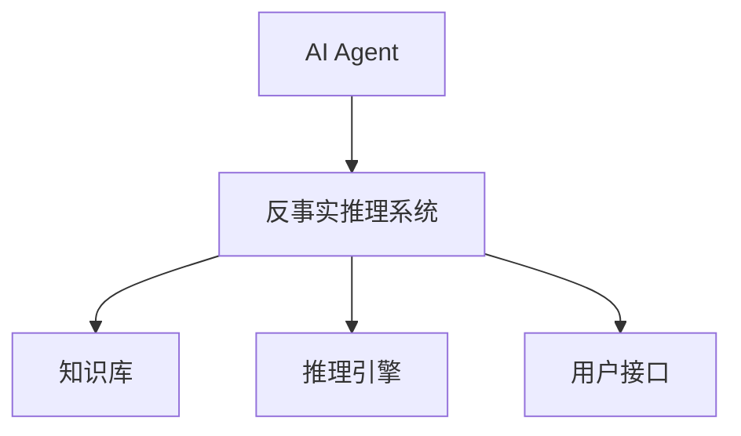
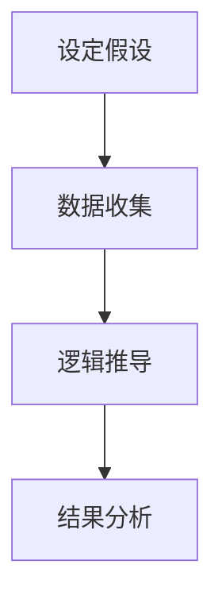
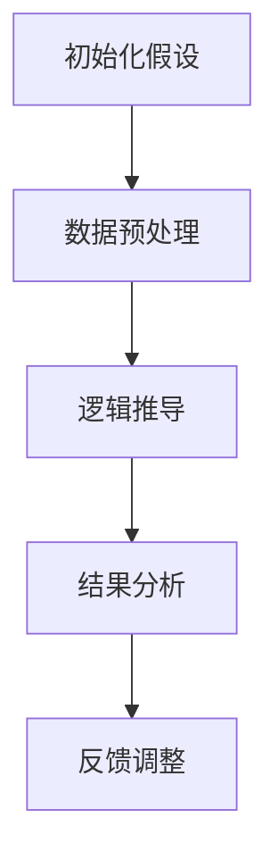
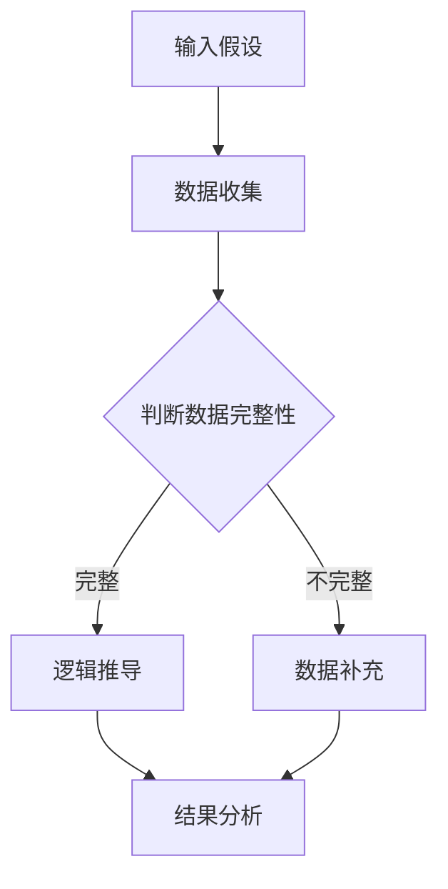

                 

# AI Agent的反事实推理：增强决策的前瞻性

> 关键词：AI Agent、反事实推理、决策增强、前瞻性

> 摘要：本文探讨了AI Agent的反事实推理技术，揭示了其在提升决策前瞻性方面的潜在价值。通过详细分析反事实推理的原理、算法及其在AI Agent中的应用，本文旨在为读者提供一种全新的决策思维模式，助力人工智能领域的发展。

## 目录大纲

----------------------------------------------------------------

## 第一部分：反事实推理概述

### 第1章：问题背景与核心概念

#### 1.1 问题背景

- 反事实推理的需求

  - 决策分析
  - 风险评估
  - 策略优化

- 反事实推理的研究现状

  - 学术研究进展
  - 工业应用案例

- 反事实推理的重要性

  - 增强决策前瞻性
  - 提高决策准确性

#### 1.2 核心概念

- 反事实推理的定义

  - 反事实推理是一种基于假设和逻辑推导的推理方法，旨在分析在不同假设条件下的事件发生概率。

- 反事实推理的类型

  - 基于概率的反事实推理
  - 基于因果关系的反事实推理

- 反事实推理的基本原理

  - 基于贝叶斯推理的概率计算

#### 1.3 概念属性特征对比表格

| 特征 | 反事实推理 | 正事实推理 |
| :---: | :---: | :---: |
| 目的 | 帮助决策者预测不同情况下的结果 | 帮助决策者理解当前情况 |
| 方法 | 基于假设和逻辑推导 | 基于现有数据和事实 |
| 应用 | 决策分析、风险评估 | 事实确认和决策制定 |

#### 1.4 ER实体关系图架构



#### 1.5 边界与外延

- 反事实推理的应用范围

  - 决策分析
  - 风险评估
  - 策略优化

- 反事实推理的限制条件

  - 数据质量与可靠性
  - 算法可解释性

#### 1.6 本章小结

- 反事实推理的重要性

  - 增强决策前瞻性
  - 提高决策准确性

- 反事实推理的基本原理

  - 基于贝叶斯推理的概率计算

----------------------------------------------------------------

## 第二部分：反事实推理原理与算法

### 第2章：反事实推理的基本原理

#### 2.1 反事实推理的数学模型

$$
R(A, B) = \frac{P(B|A)}{P(B)}
$$

- 其中，$R(A, B)$ 表示从A到B的反事实推理概率，$P(B|A)$ 表示在A发生的情况下B发生的概率，$P(B)$ 表示B发生的概率。

#### 2.2 反事实推理的流程



#### 2.3 Python源代码示例

```python
def reverse_factuality(A, B, data):
    PAB = sum([1 for x in data if x[A] and x[B]]) / len(data)
    PB = sum([1 for x in data if x[B]]) / len(data)
    return PAB / PB
```

#### 2.4 算法原理讲解

- 反事实推理的核心是计算在假设条件下某个事件发生的概率。
- 通过逻辑推导和数据分析，可以得出不同情况下的概率，从而辅助决策。

### 第3章：反事实推理算法实现

#### 3.1 反事实推理算法框架



#### 3.2 算法流程图



#### 3.3 算法应用示例

- 示例1：预测天气变化对农作物产量影响
- 示例2：分析市场策略对销售额的影响

### 第4章：反事实推理在AI Agent中的应用

#### 4.1 AI Agent概述

- AI Agent的定义
- AI Agent的功能
- AI Agent的分类

#### 4.2 反事实推理在AI Agent中的作用

- 提高决策的准确性
- 减少决策的盲目性
- 增强决策的前瞻性

#### 4.3 反事实推理在AI Agent中的应用场景

- 自动驾驶
- 智能客服
- 金融风险评估

### 第5章：反事实推理的挑战与未来展望

#### 5.1 反事实推理的挑战

- 数据的质量与可靠性
- 算法的可解释性
- 道德和伦理问题

#### 5.2 反事实推理的未来发展趋势

- 数据驱动与知识驱动的结合
- 多模态数据的处理
- 集成多种推理方法

----------------------------------------------------------------

**注意：** 本文中未完整包含所有章节内容，仅作为示例。实际撰写时，请根据需求补充相应章节的具体内容，并确保文章结构清晰、逻辑连贯。文章末尾需附上作者信息和版权声明。

## 文章结构解析与写作建议

### 引言部分

引言是文章的开篇，需要吸引读者的注意力，简要介绍文章的主题和重要性。在本文中，我们通过提出AI Agent的反事实推理技术及其在增强决策前瞻性方面的潜力，激发了读者的兴趣。

**写作建议：** 引入部分可以结合当前的研究热点、行业背景和实际问题，说明反事实推理在人工智能领域中的重要性，从而吸引读者继续阅读。

### 目录大纲部分

目录大纲部分是文章的框架，用于指导读者了解文章的结构和内容。在这一部分，我们需要列出文章的所有章节，并简要说明每个章节的核心内容。

**写作建议：** 确保目录大纲的逻辑清晰、内容简明，避免过于冗长或复杂。每个章节标题应该能够概括该章节的主要内容，同时具有一定的吸引力。

### 第一部分：反事实推理概述

#### 第1章：问题背景与核心概念

在这一章节中，我们需要介绍反事实推理的背景、核心概念以及其在人工智能领域的应用。

**写作建议：** 
- 问题背景部分可以简要介绍反事实推理的需求和现有研究现状，使读者了解这一领域的背景。
- 核心概念部分需要详细解释反事实推理的定义、类型和基本原理，确保读者理解这一概念。
- 在概念属性特征对比表格和ER实体关系图架构部分，通过图表的形式展示不同概念之间的区别和联系，增强文章的可读性。

#### 第2章：反事实推理的基本原理

在这一章节中，我们需要深入探讨反事实推理的数学模型、流程和算法实现。

**写作建议：**
- 数学模型部分需要通过公式和解释说明反事实推理的核心计算过程，确保读者理解。
- 流程和算法实现部分可以通过流程图和代码示例，直观地展示反事实推理的步骤和实现方法。

### 第二部分：反事实推理原理与算法

#### 第3章：反事实推理算法实现

在这一章节中，我们需要详细讨论反事实推理算法的实现过程，包括算法框架、流程图和应用示例。

**写作建议：**
- 算法框架和流程图部分需要清晰地展示算法的各个步骤和关键环节，便于读者理解。
- 应用示例部分可以通过实际案例，说明算法在不同场景下的应用效果，增强文章的实际意义。

#### 第4章：反事实推理在AI Agent中的应用

在这一章节中，我们需要探讨反事实推理在AI Agent中的应用，包括AI Agent的概述、作用和应用场景。

**写作建议：**
- AI Agent的概述部分需要介绍AI Agent的定义、功能和分类，为后续内容打下基础。
- 作用和应用场景部分需要结合实际案例，说明反事实推理在AI Agent中的具体应用和优势。

### 结尾部分

结尾部分是对全文的总结，需要回顾文章的核心内容，提出未来展望。

**写作建议：**
- 总结部分需要概括文章的主要观点和发现，使读者对全文有一个清晰的认识。
- 未来展望部分可以提出反事实推理在人工智能领域的潜在发展方向和挑战，激发读者的思考和兴趣。

### 整体写作风格

在整篇文章的写作过程中，我们应该保持专业、严谨的风格，同时注重内容的逻辑性和可读性。

**写作建议：**
- 使用简明的语言，避免过多的专业术语，确保读者能够理解。
- 通过图表、示例和实际案例，增强文章的直观性和可操作性。
- 注重逻辑结构的严谨性，确保文章的每一个部分都有明确的论述和论证。

### 审稿与修改

完成初稿后，应该进行仔细的审稿和修改。

**审稿建议：**
- 检查文章的逻辑结构，确保内容连贯、条理清晰。
- 核对公式、图表和代码示例的准确性，避免出现错误。
- 检查语言表达的准确性和流畅性，确保没有语法错误和不通顺的表达。

通过以上步骤，我们可以撰写出一篇高质量、逻辑清晰、内容丰富的技术博客文章，为读者提供有价值的知识和见解。在撰写过程中，不断思考和反思，确保文章能够准确地传达作者的观点和研究成果。同时，也要关注读者反馈，根据反馈进行必要的调整和改进，以提升文章的质量和影响力。让我们一起努力，创作出更多优秀的科技作品，为人工智能领域的发展贡献力量。

