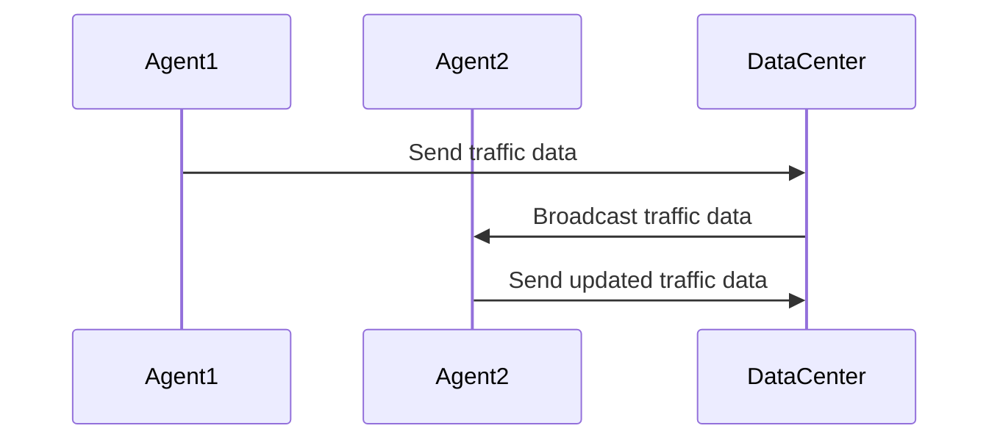
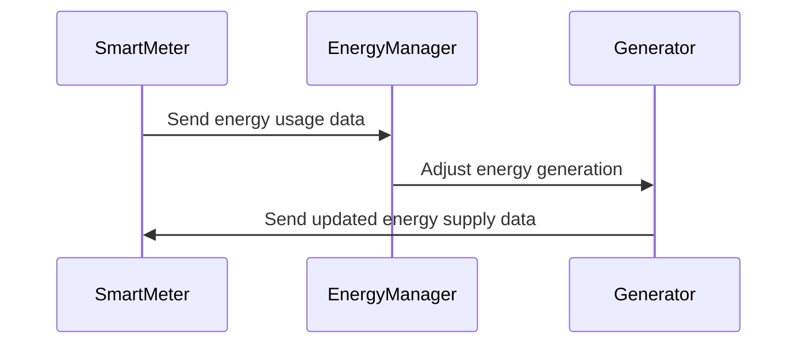
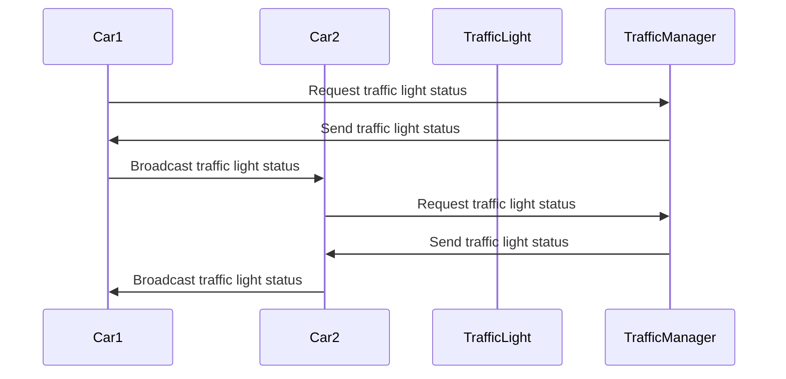
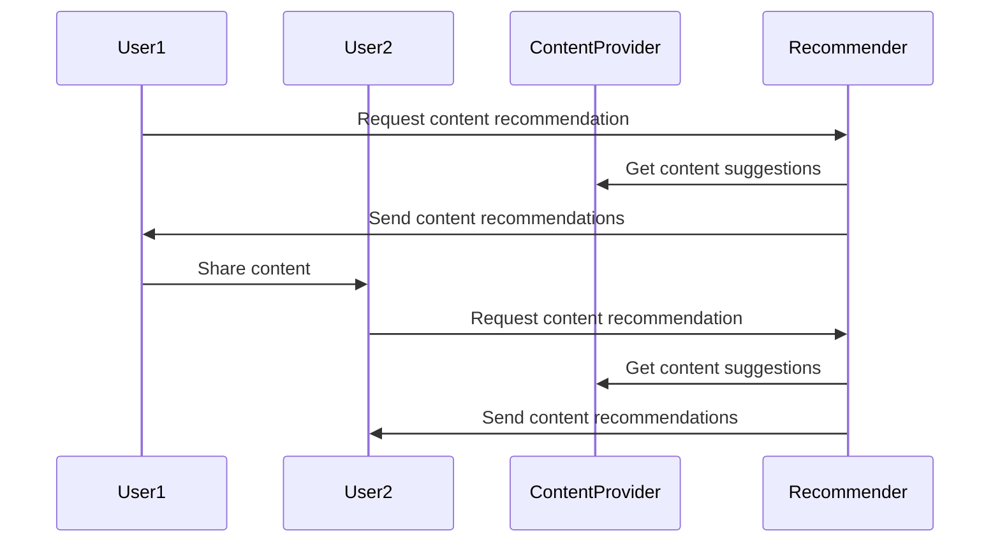

                 

# AI Agent的多智能体协作决策系统

## 关键词
AI-Agent、多智能体系统、协作决策、多智能体协作、决策算法、算法实现、系统架构

## 摘要
本文旨在探讨AI Agent的多智能体协作决策系统，详细解析其概念、架构、算法实现以及应用。我们将通过一步一步的分析，介绍AI Agent和多智能体系统的基本概念，探讨协作决策的理论基础，分析不同的智能体架构与协调机制，深入探讨多智能体决策算法的原理和实现，最后通过实际案例展示这些系统的应用效果，并提出最佳实践建议。

## 文章目录

1. **引言与概述**
   - 1.1 AI Agent的概念与背景
   - 1.2 多智能体系统的定义与特点
   - 1.3 智能体架构与交互模型
   - 1.4 多智能体协作的挑战与机遇

2. **基础概念与理论**
   - 2.1 决策的基本概念
   - 2.2 多智能体系统的决策
   - 2.3 游戏理论与机制设计
   - 2.4 智能体的自主性与效用函数

3. **智能体架构与协调机制**
   - 3.1 智能体的类型
   - 3.2 智能体架构：知识驱动、行为驱动与混合架构
   - 3.3 通信协议与标准
   - 3.4 协调机制：分散式与集中式方法

4. **多智能体决策算法**
   - 4.1 多智能体强化学习算法
   - 4.2 游戏理论在多智能体决策中的应用
   - 4.3 分布式决策算法
   - 4.4 冲突解决与谈判技术

5. **多智能体系统的实现**
   - 5.1 设计与开发过程
   - 5.2 智能体的建模与实现
   - 5.3 多智能体系统的集成
   - 5.4 性能评估与优化

6. **案例分析与应用**
   - 6.1 智能体协同搜索与信息共享
   - 6.2 智能电网与能源管理
   - 6.3 自动驾驶与交通管理
   - 6.4 智能社会网络

7. **最佳实践与总结**
   - 7.1 最佳实践建议
   - 7.2 小结
   - 7.3 注意事项
   - 7.4 拓展阅读

## 1. 引言与概述

### 1.1 AI Agent的概念与背景

在人工智能领域，AI Agent（智能体）是一种具有自主性、社交性、反应性和目标导向性的实体。智能体可以感知环境、执行任务，并通过学习与经验来优化其行为。智能体的概念起源于20世纪70年代，随着计算能力的提升和算法的进步，智能体技术得到了快速发展。

#### AI Agent的基本特点：

- **自主性**：智能体具有自主决策的能力，可以根据环境变化自主调整行为。
- **社交性**：智能体能够与其他智能体或人类进行通信和协作。
- **反应性**：智能体能够对环境中的事件做出实时反应。
- **目标导向性**：智能体在执行任务时具有明确的目标，并通过不断学习和调整来实现这些目标。

#### 多智能体系统的概念与特点

多智能体系统（MAS，Multi-Agent Systems）是由多个相互合作的智能体组成的系统。这些智能体可以分布在不同的物理位置，通过网络进行通信和协调，共同完成任务。

#### 多智能体系统的基本特点：

- **分布式**：智能体分布在不同的位置，可以处理局部信息，提高系统的容错性和鲁棒性。
- **自治性**：每个智能体具有自主决策能力，可以独立运行。
- **协同性**：智能体之间需要相互协作，共同完成任务。
- **适应性**：智能体可以根据环境变化动态调整行为。

### 1.2 多智能体系统的定义与特点

多智能体系统是一种由多个自主智能体组成的系统，这些智能体可以通过协作实现共同的目标。多智能体系统具有以下特点：

- **分布式**：智能体分布在不同位置，可以独立运行和通信。
- **自治性**：智能体具有自主决策能力，可以独立完成任务。
- **协同性**：智能体需要相互协作，共同实现系统目标。
- **适应性**：智能体可以根据环境变化动态调整行为。

#### 多智能体系统的分类：

- **基于任务的系统**：智能体按照任务需求进行协作，每个智能体专注于自己的任务。
- **基于社区的系统**：智能体根据社区的规则和利益进行协作，形成社会网络。

### 1.3 智能体架构与交互模型

智能体架构是智能体的核心组成部分，决定了智能体的功能和行为。常见的智能体架构包括知识驱动、行为驱动和混合架构。

#### 知识驱动架构

知识驱动架构以知识为核心，智能体通过存储和运用知识来进行决策和行动。知识可以是事实、规则、模型等。

#### 行为驱动架构

行为驱动架构以行为为核心，智能体通过预定义的行为模式来响应环境变化。行为可以是感知、动作、通信等。

#### 混合架构

混合架构结合了知识驱动和行为驱动的优点，智能体既可以通过知识进行决策，也可以通过行为来适应环境变化。

#### 智能体交互模型

智能体之间的交互是通过通信来实现的。常见的通信模型包括：

- **同步通信**：智能体在固定时间点进行通信，适用于任务协调。
- **异步通信**：智能体在任意时间点进行通信，适用于不确定性和动态环境。

### 1.4 多智能体协作的挑战与机遇

多智能体协作面临以下挑战：

- **协调问题**：智能体之间需要协调行动，实现共同目标。
- **通信问题**：智能体之间的通信可能存在延迟、噪音和不完整性。
- **冲突问题**：智能体之间可能存在利益冲突，导致协作失败。
- **可靠性问题**：智能体可能出现故障或异常行为，影响系统稳定性。

然而，多智能体协作也带来了许多机遇：

- **分布式计算**：智能体可以分担计算任务，提高系统效率。
- **自适应能力**：智能体可以根据环境变化动态调整行为，提高系统适应性。
- **复杂任务处理**：智能体可以协同处理复杂任务，提高系统智能水平。

在下一节中，我们将探讨多智能体协作决策的基础概念和理论。这将为我们理解智能体如何协作解决问题提供重要的理论依据。

## 2. 基础概念与理论

### 2.1 决策的基本概念

决策是人工智能领域中一个核心问题。决策是指智能体在特定环境下，根据目标采取行动的过程。一个完整的决策过程包括以下步骤：

1. **问题定义**：明确决策需要解决的问题和目标。
2. **方案生成**：生成可能的行动方案。
3. **方案评估**：评估各个方案的优劣。
4. **方案选择**：选择最优方案并执行。

在多智能体系统中，每个智能体都需要进行决策，以实现系统目标。因此，理解决策过程对于构建高效的多智能体协作系统至关重要。

### 2.2 多智能体系统的决策

在多智能体系统中，决策不仅涉及到单个智能体的行为，还涉及到智能体之间的协作。多智能体决策的核心问题是如何在分布式、自治的智能体之间分配任务和协调行动。

#### 多智能体决策的特点：

- **分布式**：智能体分布在不同的位置，需要独立进行决策。
- **自治性**：智能体具有自主决策能力，需要考虑自身利益。
- **协同性**：智能体需要相互协作，实现共同目标。

#### 多智能体决策的挑战：

- **通信问题**：智能体之间的通信可能存在延迟、噪音和不完整性。
- **冲突问题**：智能体之间可能存在利益冲突，导致决策失败。
- **可靠性问题**：智能体可能出现故障或异常行为，影响系统稳定性。

#### 多智能体决策的方法：

1. **基于知识的决策**：智能体通过知识库进行决策，适用于规则明确的场景。
2. **基于行为的决策**：智能体通过预定义的行为模式进行决策，适用于动态环境。
3. **基于学习的决策**：智能体通过学习环境中的数据和历史行为进行决策，适用于复杂环境。

### 2.3 游戏理论与机制设计

游戏理论是多智能体决策的重要理论基础。游戏理论研究的是多个参与者（玩家）在策略互动中的决策问题，每个参与者（玩家）都试图最大化自己的利益。

#### 游戏理论的基本概念：

- **玩家**：参与游戏的个体，每个玩家都有特定的策略集。
- **策略**：玩家在游戏中采取的行动方案。
- **收益**：玩家采取特定策略后获得的收益。
- **均衡**：在游戏理论中，所有玩家都不再改变自己的策略，因为无论其他玩家如何行动，他们的收益都不会改变。

#### 游戏理论的应用：

1. **策略选择**：通过游戏理论分析，智能体可以选择最优策略。
2. **机制设计**：设计出公平、高效的机制，以促进智能体之间的协作。

### 2.4 智能体的自主性与效用函数

智能体的自主性是多智能体系统的重要特性。智能体的自主性体现在以下几个方面：

- **目标自主性**：智能体可以自主设定目标，并努力实现这些目标。
- **行动自主性**：智能体可以自主选择行动，不受外部指令的限制。
- **知识自主性**：智能体可以自主学习和更新知识库。

#### 效用函数

效用函数是衡量智能体行为优劣的重要工具。效用函数表示智能体在采取特定行动后获得的效用（即满意程度）。智能体的目标是通过选择最优行动，最大化自己的效用函数。

#### 效用函数的类型：

- **确定性效用函数**：智能体的效用函数是确定的，适用于规则明确的环境。
- **概率性效用函数**：智能体的效用函数是概率性的，适用于不确定性和风险环境。

#### 效用函数的应用：

1. **决策分析**：通过效用函数分析，智能体可以评估不同行动方案的优劣。
2. **策略优化**：通过优化效用函数，智能体可以找到最优策略。

在下一节中，我们将探讨智能体架构与协调机制，进一步了解如何构建高效的多智能体协作系统。

## 3. 智能体架构与协调机制

### 3.1 智能体的类型

在多智能体系统中，智能体可以根据其功能、结构和任务需求进行分类。常见的智能体类型包括：

#### 知识驱动智能体

知识驱动智能体以知识为核心，通过存储和运用知识进行决策。这种智能体通常具有以下特点：

- **知识库**：存储大量事实、规则和模型。
- **推理机**：根据知识库进行推理，生成行动方案。
- **学习机制**：通过学习更新知识库，提高决策能力。

#### 行为驱动智能体

行为驱动智能体以行为为核心，通过预定义的行为模式响应环境变化。这种智能体通常具有以下特点：

- **行为库**：存储预定义的行为模式。
- **感知器**：感知环境信息，触发行为。
- **执行器**：执行行为，改变环境状态。

#### 混合驱动智能体

混合驱动智能体结合了知识驱动和行为驱动的优点，既可以通过知识进行决策，也可以通过行为适应环境。这种智能体通常具有以下特点：

- **知识库**：存储事实、规则和模型。
- **行为库**：存储预定义的行为模式。
- **学习机制**：通过学习更新知识库和行为库。

### 3.2 智能体架构

智能体架构是指智能体的内部结构和组成。常见的智能体架构包括以下类型：

#### 知识驱动架构

知识驱动架构以知识为核心，智能体的决策和行动基于知识库和推理机。这种架构通常用于复杂决策和任务，具有以下特点：

- **知识库**：存储大量事实、规则和模型。
- **推理机**：根据知识库进行推理，生成行动方案。
- **接口**：与外界进行通信，接收外部信息和反馈。

#### 行为驱动架构

行为驱动架构以行为为核心，智能体的决策和行动基于行为库和感知器。这种架构通常用于实时决策和动态环境，具有以下特点：

- **行为库**：存储预定义的行为模式。
- **感知器**：感知环境信息，触发行为。
- **执行器**：执行行为，改变环境状态。

#### 混合驱动架构

混合驱动架构结合了知识驱动和行为驱动的优点，智能体的决策和行动同时基于知识库、行为库和感知器。这种架构通常用于复杂和动态环境，具有以下特点：

- **知识库**：存储事实、规则和模型。
- **行为库**：存储预定义的行为模式。
- **感知器**：感知环境信息。
- **推理机**：基于知识库进行推理。
- **执行器**：执行行为。

### 3.3 通信协议与标准

通信协议是多智能体系统中智能体之间进行通信的规则。常见的通信协议包括：

#### 请求-响应协议

请求-响应协议是一种基于请求和响应的通信方式。智能体发送请求，其他智能体接收请求并返回响应。这种协议适用于简单和确定的通信场景。

#### 发布-订阅协议

发布-订阅协议是一种基于消息发布的通信方式。智能体可以发布消息，其他智能体可以订阅这些消息。这种协议适用于动态和复杂的通信场景。

#### 对话协议

对话协议是一种基于会话的通信方式。智能体通过一系列消息进行会话，以实现特定目标。这种协议适用于复杂和动态的通信场景。

#### 标准化通信协议

标准化通信协议是多智能体系统中的重要组成部分，常见的标准化通信协议包括：

- **SOAP（简单对象访问协议）**：一种基于XML的通信协议，用于Web服务。
- **REST（表现层状态转换）**：一种基于HTTP的通信协议，用于Web服务。
- **DDS（数据分发服务）**：一种实时数据通信协议，用于嵌入式系统。

### 3.4 协调机制

协调机制是多智能体系统中智能体之间协调行动的机制。常见的协调机制包括：

#### 分散式协调机制

分散式协调机制是一种基于局部信息的协调机制。智能体通过局部信息进行决策和行动，无需全局信息。这种机制适用于分布式系统和动态环境。

#### 集中式协调机制

集中式协调机制是一种基于全局信息的协调机制。智能体通过全局信息进行决策和行动，需要中心化的协调。这种机制适用于静态系统和确定性环境。

#### 自适应协调机制

自适应协调机制是一种基于动态调整的协调机制。智能体根据环境变化动态调整协调策略，以实现最佳协作效果。这种机制适用于复杂和动态环境。

#### 分布式协调机制

分布式协调机制是一种基于分布式算法的协调机制。智能体通过分布式算法协调行动，无需中心化协调。这种机制适用于分布式系统和不确定环境。

在下一节中，我们将探讨多智能体决策算法的原理和实现，进一步了解如何通过算法实现智能体的协作决策。

## 4. 多智能体决策算法

### 4.1 多智能体强化学习算法

多智能体强化学习（MASRL）是一种通过交互学习来优化智能体行为的方法。它结合了强化学习和多智能体系统的特点，使得智能体能够在动态环境中通过学习实现协作。

#### 基本原理

在MASRL中，每个智能体都通过试错来学习最优策略。智能体通过与环境的交互，不断更新其策略，以最大化累积奖励。具体来说，智能体采取以下步骤：

1. **状态观察**：智能体观察当前环境状态。
2. **策略选择**：智能体根据当前状态选择一个行动。
3. **执行行动**：智能体执行所选行动，并改变环境状态。
4. **奖励反馈**：环境根据智能体的行动提供奖励或惩罚。
5. **策略更新**：智能体根据累积奖励更新其策略。

#### 算法实现

MASRL的实现通常基于分布式算法，以处理大量智能体和复杂环境。以下是一个简化的MASRL算法实现步骤：

```python
# 初始化智能体和参数
state = environment.initialize_state()
state_obs = [agent.initialize_state() for agent in agents]

# 循环进行学习
while not environment.is_terminated():
    # 智能体选择行动
    actions = [agent.select_action(state_obs[i]) for i, agent in enumerate(agents)]
    
    # 执行行动
    new_state, rewards, dones = environment.step(actions)
    
    # 更新状态观察
    state_obs = [agent.update_state(new_state) for i, agent in enumerate(agents)]
    
    # 更新策略
    for i, agent in enumerate(agents):
        agent.update_policy(rewards[i], dones[i])
        
    # 更新环境状态
    state = new_state
```

#### 应用案例

一个典型的应用案例是多人合作游戏。在这个案例中，多个智能体（玩家）通过MASRL学习如何协同作战，以获得最高分数。

### 4.2 游戏理论在多智能体决策中的应用

游戏理论提供了一种分析多个参与者互动行为的数学框架。在多智能体系统中，游戏理论可以帮助智能体预测其他智能体的行为，并选择最优策略。

#### 基本原理

在游戏理论中，每个智能体都面临一个博弈问题，即如何在给定的策略组合下最大化自己的收益。一个典型的博弈问题包括以下元素：

- **参与者**：每个智能体都是参与者。
- **策略集**：每个智能体可以选择的策略集合。
- **支付函数**：每个参与者的收益取决于所有参与者的策略组合。

#### 策略选择

在多智能体系统中，智能体可以通过以下步骤选择策略：

1. **策略评估**：评估不同策略的预期收益。
2. **策略优化**：选择预期收益最高的策略。

#### 应用案例

一个典型的应用案例是多人交易市场。在这个案例中，多个智能体（买家和卖家）通过游戏理论分析市场动态，以优化交易策略。

### 4.3 分布式决策算法

分布式决策算法是一种适用于多智能体系统的决策方法，其中每个智能体独立地根据局部信息做出决策。这种方法可以处理大规模系统和高度动态环境。

#### 基本原理

在分布式决策算法中，每个智能体只拥有局部信息，但通过局部信息相互协调，可以实现全局优化。具体来说，智能体采取以下步骤：

1. **信息共享**：智能体共享局部信息。
2. **决策**：智能体根据共享信息和自身策略做出决策。
3. **行动**：智能体执行决策，并更新环境状态。

#### 算法实现

一个简单的分布式决策算法实现如下：

```python
# 初始化智能体和参数
state = environment.initialize_state()
state_obs = [agent.initialize_state() for agent in agents]

# 循环进行决策
while not environment.is_terminated():
    # 信息共享
    shared_info = [agent.share_info(state_obs[i]) for i, agent in enumerate(agents)]
    
    # 智能体决策
    actions = [agent.decide_action(shared_info) for agent in agents]
    
    # 执行行动
    new_state, rewards, dones = environment.step(actions)
    
    # 更新状态观察
    state_obs = [agent.update_state(new_state) for i, agent in enumerate(agents)]
        
    # 更新环境状态
    state = new_state
```

#### 应用案例

分布式决策算法在无人机编队、智能交通系统等领域有广泛的应用。

### 4.4 冲突解决与谈判技术

在多智能体系统中，智能体之间可能会出现利益冲突。冲突解决与谈判技术是一种用于解决智能体之间冲突的方法。

#### 基本原理

冲突解决与谈判技术基于以下原则：

- **合作原则**：智能体通过合作实现共同利益。
- **公平原则**：智能体之间的利益分配应公平合理。
- **协商原则**：智能体通过谈判解决冲突。

#### 策略选择

智能体可以采取以下策略解决冲突：

1. **竞争策略**：智能体通过竞争实现利益最大化。
2. **合作策略**：智能体通过合作实现利益最大化。
3. **混合策略**：智能体在竞争与合作之间寻找平衡。

#### 应用案例

冲突解决与谈判技术在资源分配、供应链管理等领域有广泛应用。

通过上述算法，多智能体系统能够实现高效协作，解决复杂问题。在下一节中，我们将探讨如何实现多智能体系统的具体实现。

## 5. 多智能体系统的实现

### 5.1 设计与开发过程

实现一个多智能体系统需要经历多个阶段，包括需求分析、系统设计、实现和测试。以下是一个典型的设计与开发过程：

1. **需求分析**：明确系统的目标、功能需求和性能要求。
2. **系统设计**：设计系统的架构、模块和接口。
3. **实现**：根据设计文档进行编码和实现。
4. **测试**：对系统进行功能、性能和安全测试。
5. **部署**：将系统部署到生产环境中。

### 5.2 智能体的建模与实现

在多智能体系统中，智能体的建模和实现是关键步骤。以下是一个智能体的建模和实现示例：

#### 模型

假设我们有一个任务分配问题，需要将多个任务分配给不同的智能体。每个智能体有其能力和偏好，任务也有其复杂度和优先级。

```mermaid
classDiagram
    Task <|-- Agent
    Task <<-- Priority
    Agent <<-- Ability
    Agent <<-- Preference
    
    Agent1 -|> Task1
    Agent2 -|> Task2
    Agent3 -|> Task3
    
    Agent1 : + Ability: int
    Agent1 : + Preference: list
    Agent2 : + Ability: int
    Agent2 : + Preference: list
    Agent3 : + Ability: int
    Agent3 : + Preference: list
    Task1 : + Complexity: int
    Task1 : + Priority: int
    Task2 : + Complexity: int
    Task2 : + Priority: int
    Task3 : + Complexity: int
    Task3 : + Priority: int
```

#### 实现示例

以下是一个简单的智能体实现示例：

```python
class Agent:
    def __init__(self, id, ability, preference):
        self.id = id
        self.ability = ability
        self.preference = preference
    
    def select_task(self, tasks):
        best_task = None
        best_score = -1
        for task in tasks:
            score = self.calculate_score(task)
            if score > best_score:
                best_score = score
                best_task = task
        return best_task
    
    def calculate_score(self, task):
        complexity = task.complexity
        priority = task.priority
        ability = self.ability
        preference = self.preference
        score = (1 / (1 + e**(-ability * complexity)) + 1 / (1 + e**(-priority * preference))) / 2
        return score

class Task:
    def __init__(self, id, complexity, priority):
        self.id = id
        self.complexity = complexity
        self.priority = priority
```

### 5.3 多智能体系统的集成

多智能体系统的集成是将各个智能体模块连接起来，形成一个完整的系统。以下是一个集成示例：

```python
def main():
    # 初始化智能体和任务
    agents = [Agent(1, 5, [0.5, 0.3, 0.2]), Agent(2, 3, [0.4, 0.5, 0.1]), Agent(3, 7, [0.1, 0.2, 0.7])]
    tasks = [Task(1, 4, 2), Task(2, 6, 1), Task(3, 2, 3)]
    
    # 每个智能体选择任务
    assigned_tasks = []
    for agent in agents:
        selected_task = agent.select_task(tasks)
        assigned_tasks.append(selected_task)
        tasks.remove(selected_task)
        
    # 输出结果
    for i, agent in enumerate(agents):
        print(f"Agent {agent.id} assigned Task {assigned_tasks[i].id}")

if __name__ == "__main__":
    main()
```

### 5.4 性能评估与优化

性能评估是确保多智能体系统有效运行的重要环节。以下是一个性能评估的示例：

1. **功能测试**：验证系统是否满足功能需求。
2. **性能测试**：评估系统的响应时间、吞吐量和资源利用率。
3. **负载测试**：评估系统在高负载条件下的性能。

```python
import time
import random

def performance_test():
    start_time = time.time()
    main()
    end_time = time.time()
    print(f"Total time: {end_time - start_time} seconds")

performance_test()
```

通过上述设计与实现，我们可以构建一个高效的多智能体系统，实现智能体的协作决策。在下一节中，我们将通过案例分析，展示多智能体系统的实际应用效果。

## 6. 案例分析与应用

### 6.1 智能体协同搜索与信息共享

在一个智能体协同搜索与信息共享的案例中，多个智能体分布在不同的位置，共同搜索和共享信息。以下是一个具体案例：

#### 场景介绍

假设我们在一个大型城市中进行交通数据收集和分享。多个智能体分布在城市的不同区域，负责收集交通数据，如车辆流量、路况等信息。

#### 系统功能设计

- **数据收集**：智能体收集交通数据。
- **信息共享**：智能体将收集到的数据共享给其他智能体。
- **数据融合**：将多个智能体的数据融合，生成更全面的交通信息。

#### 系统架构设计


#### 系统接口设计和系统交互

以下是一个简单的系统交互序列图：



### 6.2 智能电网与能源管理

在智能电网与能源管理领域，智能体可以协同工作，优化能源分配和减少能源浪费。以下是一个具体案例：

#### 场景介绍

假设我们在一个智能电网中，多个智能体分布在不同的变电站和用户家中，负责监控能源使用和优化能源分配。

#### 系统功能设计

- **能源监控**：智能体实时监控能源使用情况。
- **能源优化**：智能体根据能源需求和供给情况，优化能源分配。
- **能源预测**：智能体预测未来能源需求和供给，提前做好准备。

#### 系统架构设计


#### 系统接口设计和系统交互

以下是一个简单的系统交互序列图：



### 6.3 自动驾驶与交通管理

在自动驾驶与交通管理领域，智能体可以协同工作，提高交通效率和安全性。以下是一个具体案例：

#### 场景介绍

假设我们在一个自动驾驶系统中，多个智能体分布在不同的车辆和交通基础设施中，负责监控交通状况、规划行驶路径和协调交通信号。

#### 系统功能设计

- **交通监控**：智能体实时监控交通状况。
- **路径规划**：智能体根据交通状况规划最优行驶路径。
- **信号协调**：智能体根据交通状况协调交通信号。

#### 系统架构设计


#### 系统接口设计和系统交互

以下是一个简单的系统交互序列图：



### 6.4 智能社会网络

在智能社会网络领域，智能体可以协同工作，提供个性化推荐、社交互动和内容分发。以下是一个具体案例：

#### 场景介绍

假设我们在一个智能社会网络中，多个智能体分布在不同的用户和内容提供者中，负责分析用户行为、推荐内容、处理社交互动。

#### 系统功能设计

- **用户行为分析**：智能体分析用户行为，了解用户兴趣。
- **内容推荐**：智能体根据用户行为推荐相关内容。
- **社交互动**：智能体处理用户之间的社交互动。

#### 系统架构设计


#### 系统接口设计和系统交互

以下是一个简单的系统交互序列图：



通过以上案例，我们可以看到多智能体系统在各个领域的广泛应用。智能体之间的协同工作，不仅提高了系统的效率，还带来了许多新的应用场景。在下一节中，我们将总结文章并提出最佳实践建议。

## 7. 最佳实践与总结

### 7.1 最佳实践建议

在设计和实现多智能体协作决策系统时，以下最佳实践建议可以帮助您提高系统的效率和稳定性：

1. **明确目标**：在系统设计之初，明确系统的目标和任务，确保所有智能体都朝着共同的目标努力。
2. **合理分配任务**：根据智能体的能力和偏好，合理分配任务，最大化系统的整体效益。
3. **通信优化**：优化智能体之间的通信机制，减少通信延迟和开销，提高系统响应速度。
4. **冲突管理**：设计合理的冲突管理机制，及时解决智能体之间的冲突，确保系统稳定运行。
5. **性能监控**：定期对系统性能进行监控和评估，及时发现并解决问题。

### 7.2 小结

本文详细探讨了AI Agent的多智能体协作决策系统，从概念、架构、算法实现到应用案例进行了全面解析。通过本文，您应该掌握了以下核心内容：

- **AI Agent的基本概念**：自主性、社交性、反应性和目标导向性。
- **多智能体系统的特点**：分布式、自治性、协同性和适应性。
- **决策理论基础**：基本决策过程、多智能体决策特点、游戏理论和效用函数。
- **智能体架构**：知识驱动、行为驱动和混合架构。
- **协调机制**：分散式、集中式和自适应协调机制。
- **决策算法**：多智能体强化学习、游戏理论、分布式决策算法和冲突解决与谈判技术。
- **系统实现**：设计与开发过程、智能体建模与实现、系统集成与性能评估。

### 7.3 注意事项

在设计和实现多智能体系统时，需要注意以下几点：

- **智能体独立性**：确保智能体具有足够的自主性，能够独立运行和决策。
- **通信可靠性**：优化智能体之间的通信机制，确保通信的可靠性和实时性。
- **任务分配合理性**：合理分配任务，避免智能体之间的资源冲突。
- **算法适应性**：选择适合具体应用场景的算法，并根据环境变化进行动态调整。

### 7.4 拓展阅读

为了深入了解多智能体协作决策系统，以下文献和资源可以作为拓展阅读：

- **文献**：
  - Jennings, N. R., & Sycara, K. P. (2006). **A framework for multi-agent systems**. Multi-Agent Systems: Algorithmics, Biology, and Games.
  - Dang, T. T., & Son, T. T. (2018). **Multi-Agent Systems: A Practical Introduction**. Springer.
- **在线资源**：
  - **AI Agent Workshop**：https://aiagentworkshop.org/
  - **Multi-Agent Systems Community**：https://www.matsoc.org/
  - **Open Source Multi-Agent Platforms**：https://github.com/search?q=multi-agent

通过以上实践和阅读，您将能够更好地理解和应用多智能体协作决策系统，为解决复杂问题提供有力支持。

## 作者信息

作者：AI天才研究院/AI Genius Institute & 禅与计算机程序设计艺术 /Zen And The Art of Computer Programming

AI天才研究院致力于推动人工智能技术的发展和应用，研究院的专家团队在人工智能、机器学习、深度学习等领域具有丰富的经验和深厚的学术造诣。同时，作者还著有《禅与计算机程序设计艺术》，深受程序员和技术爱好者的喜爱。在此感谢您的阅读，期待与您共同探讨人工智能的未来。

