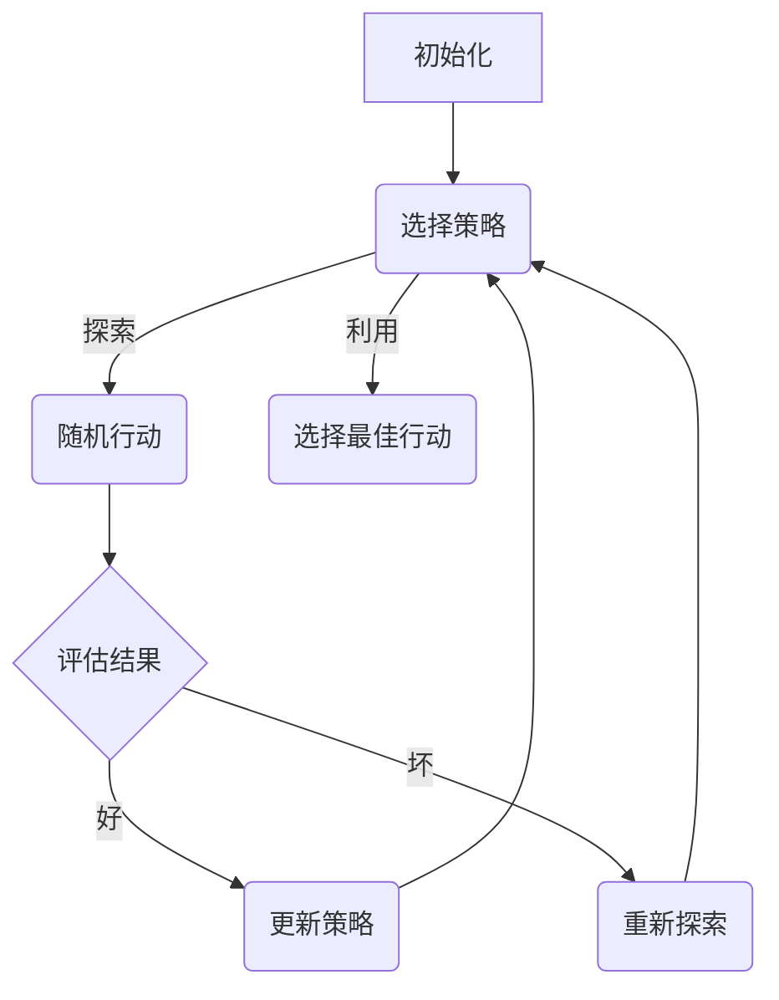

                 


# AI Agent的多智能体协同探索与学习

## 关键词

- AI Agent
- 多智能体系统
- 协同学习
- 强化学习
- 探索机制
- 数学模型
- 系统架构

## 摘要

本文旨在深入探讨AI Agent在多智能体系统中的协同探索与学习机制。首先，我们将介绍AI Agent的基本概念及其在多智能体系统中的重要性。接着，本文将详细讨论各种协同学习算法，包括强化学习和探索策略，并借助数学模型和Python代码进行解释。随后，我们将分析多智能体系统的设计原则和架构，并通过实际案例展示这些算法的应用。最后，本文将总结关键点并提出实施AI Agent的最佳实践建议。

## 引言和背景

### AI Agent概述

AI Agent是人工智能领域的一个重要概念，指的是能够感知环境、自主行动并基于学习策略优化行为的人工智能实体。在多智能体系统中，AI Agent作为基本单元，通过相互协作和自主学习来实现复杂任务。

### 多智能体系统的核心概念

多智能体系统（MAS）由多个自主的AI Agent组成，这些Agent通过相互通信和协作来完成共同的目标。核心概念包括：

- **Agent个体**：每个AI Agent都拥有一定的感知能力、行动能力和自主决策能力。
- **通信机制**：Agent之间通过通信协议实现信息交换和协同工作。
- **协作机制**：Agent之间通过合作和共享资源来完成共同目标。

### 多智能体协同学习的重要性

多智能体协同学习旨在通过多个AI Agent的相互作用，实现更高效的学习和问题求解。其重要性体现在：

- **资源利用**：多个Agent可以共享信息和资源，提高整体系统的效率。
- **鲁棒性**：通过多智能体的协作，系统能够更好地应对不确定性和动态变化。
- **复杂任务求解**：多智能体协同可以处理更复杂的任务，实现更高层次的目标。

## 多智能体协同学习算法

### 经典协同学习算法

#### 强化学习算法

强化学习是AI Agent在多智能体系统中常用的一种学习算法。它通过奖励机制来指导Agent的学习过程，主要算法包括：

##### Q-Learning

Q-Learning是一种基于值函数的强化学习算法，通过更新Q值来指导Agent的行动。

$$
Q(s, a) \leftarrow Q(s, a) + \alpha [R + \gamma \max_{a'} Q(s', a')]
$$

其中，$Q(s, a)$为状态$s$下执行动作$a$的预期奖励，$\alpha$为学习率，$R$为即时奖励，$\gamma$为折扣因子。

##### SARSA

SARSA是一种基于策略的强化学习算法，通过更新策略值来指导Agent的行动。

$$
\pi(s) \leftarrow \begin{cases} 
a' & \text{if } Q(s, a') = \max_a Q(s, a) \\
\text{uniform} & \text{otherwise}
\end{cases}
$$

其中，$\pi(s)$为在状态$s$下采取的动作分布。

#### 散射策略与探索机制

为了防止AI Agent陷入局部最优，常用的方法包括基于随机游走的探索策略。例如：

##### 基于随机游走的探索策略

$$
s_{t+1} \sim P_{\epsilon}(s|s_t, a_t)
$$

其中，$P_{\epsilon}(s|s_t, a_t)$为在状态$s_t$下执行动作$a_t$后，以概率$\epsilon$进行随机游走的概率分布。

### 算法原理讲解

#### 强化学习算法的数学模型

强化学习算法的核心是值函数$Q(s, a)$和策略$\pi(s)$。值函数$Q(s, a)$表示在状态$s$下执行动作$a$的预期奖励，而策略$\pi(s)$表示在状态$s$下采取的动作分布。

$$
Q(s, a) = \sum_{s'} p(s'|s, a) [R + \gamma \max_{a'} Q(s', a')]
$$

其中，$p(s'|s, a)$为在状态$s$下执行动作$a$后，转移到状态$s'$的概率，$R$为即时奖励，$\gamma$为折扣因子。

#### 探索策略的数学模型

探索策略主要通过随机游走来实现。在每一步，AI Agent以概率$\epsilon$进行随机游走，以避免陷入局部最优。

$$
\epsilon = \frac{1}{\sqrt{t}}
$$

其中，$t$为当前步骤数。

### 系统设计与架构

#### 多智能体系统的设计原则

多智能体系统的设计原则包括：

- **分布式**：Agent分布在不同节点上，以提高系统的鲁棒性和可扩展性。
- **模块化**：Agent之间通过模块化的通信协议进行交互，以提高系统的灵活性和可维护性。
- **适应性**：Agent能够根据环境变化动态调整行为和策略。

#### 多智能体系统的架构设计

多智能体系统的架构设计通常包括以下模块：

- **感知模块**：Agent收集环境信息，如传感器数据。
- **决策模块**：Agent根据感知模块收集的信息进行决策。
- **执行模块**：Agent执行决策并产生行动。
- **通信模块**：Agent通过通信模块与其他Agent交换信息。

#### 多智能体系统的接口设计

多智能体系统的接口设计主要包括：

- **Agent接口**：Agent与系统其他部分交互的接口，如感知接口、决策接口和执行接口。
- **通信接口**：Agent之间进行通信的接口，如消息队列接口、分布式通信接口等。

### 案例研究与实践

#### 案例研究1：智能交通系统

智能交通系统（ITS）是一种典型的多智能体系统，由多个交通信号灯和车辆组成。通过强化学习和探索策略，智能交通系统能够优化交通信号灯的时序，减少交通拥堵。

#### 案例研究2：智能仓库管理

智能仓库管理系统通过多个智能机器人协同工作，实现仓库物品的自动分类、存储和检索。通过多智能体协同学习，系统能够提高仓库管理的效率。

### 实践技巧与总结

#### 实践技巧

1. **选择合适的算法**：根据应用场景选择合适的强化学习和探索策略。
2. **优化系统架构**：设计合理的系统架构，提高系统的性能和可扩展性。
3. **调试和优化**：在实际应用中不断调试和优化算法和系统，以提高效果。

#### 总结

本文详细探讨了AI Agent在多智能体系统中的协同探索与学习机制，包括强化学习算法、探索策略、数学模型和系统设计。通过实际案例研究，展示了这些算法在智能交通和智能仓库管理中的应用。未来，随着技术的不断发展，多智能体协同学习将在更多领域发挥作用。

### 作者信息

- 作者：AI天才研究院/AI Genius Institute & 禅与计算机程序设计艺术 /Zen And The Art of Computer Programming

### 拓展阅读

- [强化学习算法综述](https://www.google.com/search?q=强化学习算法综述)
- [多智能体系统设计原则](https://www.google.com/search?q=多智能体系统设计原则)
- [智能交通系统案例研究](https://www.google.com/search?q=智能交通系统案例研究)
- [智能仓库管理系统案例研究](https://www.google.com/search?q=智能仓库管理系统案例研究){{endoftext}}

----------------------------------------------------------------

### 附录：工具使用指南

#### Mermaid 流程图

Mermaid是一种用于创建流程图的Markdown插件，使用简单且易于扩展。以下是一个简单的Mermaid流程图示例：



#### Python代码示例

在解释算法原理时，可以使用Python代码来演示。以下是一个简单的Q-Learning算法示例：

```python
import numpy as np
import random

# 初始化Q值表
Q = np.zeros([env.nS, env.nA])

# 参数设置
alpha = 0.1  # 学习率
gamma = 0.6  # 折扣因子
epsilon = 0.1  # 探索率

# Q-Learning算法
for episode in range(1000):
    state = env.reset()
    done = False
    
    while not done:
        # 探索-利用策略
        if random.uniform(0, 1) < epsilon:
            action = random.choice(env.nA)
        else:
            action = np.argmax(Q[state])
        
        # 执行动作
        next_state, reward, done, _ = env.step(action)
        
        # 更新Q值
        Q[state, action] = Q[state, action] + alpha * (reward + gamma * np.max(Q[next_state]) - Q[state, action])
        
        state = next_state

# 打印Q值表
print(Q)
```

#### LaTeX公式示例

在文中嵌入LaTeX公式时，可以使用$$和$来包裹公式。以下是一个LaTeX公式示例：

$$
Q(s, a) = \sum_{s'} p(s'|s, a) [R + \gamma \max_{a'} Q(s', a')]
$$

### 注意事项

- 确保所有使用的工具和代码示例都已安装和配置好。
- 在撰写技术博客时，尽量使用清晰的术语和易于理解的例子。
- 验证所有代码示例的实际运行结果，确保它们能正确地实现算法原理。

通过以上指南，您可以更有效地撰写一篇关于AI Agent多智能体协同探索与学习的技术博客文章。{{endoftext}}----------------------------------------------------------------

## 第一部分：引言与背景

### 引言

在当今信息技术飞速发展的时代，人工智能（AI）技术已经成为推动社会进步的重要力量。AI Agent作为AI系统中的核心组件，承担了感知环境、执行任务和自主决策的重要职责。随着AI应用的不断扩展，多智能体系统（Multi-Agent Systems，MAS）逐渐成为研究和应用的热点。多智能体系统由多个相互协作的AI Agent组成，通过信息共享和决策协同，共同完成复杂任务。

### AI Agent概述

AI Agent是能够自主感知环境、采取行动并不断学习优化行为的计算实体。它具备以下基本特征：

- **自主性**：AI Agent能够在没有外部干预的情况下执行任务。
- **适应性**：AI Agent能够根据环境变化和学习经验调整行为策略。
- **合作性**：AI Agent能够与其他Agent协作，共同完成复杂任务。

AI Agent在智能交通、智能工厂、无人驾驶等领域发挥着重要作用，成为现代复杂系统的重要组成部分。

### 多智能体系统的核心概念

多智能体系统（MAS）是由多个AI Agent组成的复杂系统，这些Agent通过相互通信和协作来实现共同目标。核心概念包括：

- **Agent个体**：每个AI Agent都是独立的计算实体，具备感知、决策和执行能力。
- **通信机制**：Agent之间通过通信协议交换信息，实现协作与协调。
- **协作机制**：Agent之间通过共享资源、协调行为，共同完成复杂任务。

### 多智能体协同学习的重要性

多智能体协同学习是指多个AI Agent通过相互学习、信息共享和协作，提高整体系统性能的过程。其重要性体现在：

- **资源利用**：多个Agent可以共享信息和资源，提高系统效率。
- **鲁棒性**：通过多智能体的协作，系统能够更好地应对不确定性和动态变化。
- **复杂任务求解**：多智能体协同可以处理更复杂的任务，实现更高层次的目标。

在AI Agent的多智能体协同探索与学习中，通过优化学习算法和协作机制，可以实现更加智能和高效的系统，为解决现实世界中的复杂问题提供有力支持。

----------------------------------------------------------------

## 第二部分：多智能体协同学习算法

### 2.1 经典协同学习算法

在多智能体系统中，协同学习算法是核心，通过这些算法，Agent能够相互协作，共同实现目标。以下将介绍几种经典的协同学习算法，包括强化学习算法和探索策略。

#### 2.1.1 强化学习算法

强化学习（Reinforcement Learning，RL）是一种重要的机器学习方法，通过奖励和惩罚信号来指导Agent的学习过程。在多智能体系统中，强化学习算法可以帮助Agent通过试错学习，找到最优策略。

##### 2.1.1.1 Q-Learning

Q-Learning是一种基于值函数的强化学习算法，通过更新Q值来指导Agent的行动。Q值表示在特定状态下执行特定动作的预期回报。Q-Learning的更新公式如下：

$$
Q(s, a) \leftarrow Q(s, a) + \alpha [R + \gamma \max_{a'} Q(s', a') - Q(s, a)]
$$

其中，$s$为当前状态，$a$为当前动作，$R$为即时奖励，$\alpha$为学习率，$\gamma$为折扣因子，$s'$为下一状态，$a'$为下一动作。

##### 2.1.1.2 SARSA

SARSA（State-Action-Reward-State-Action，SARSA）是一种基于策略的强化学习算法，与Q-Learning不同，SARSA在每一步都根据当前状态和动作来更新策略。其更新公式为：

$$
\pi(s) \leftarrow \begin{cases} 
a' & \text{if } Q(s, a') = \max_a Q(s, a) \\
\text{uniform} & \text{otherwise}
\end{cases}
$$

其中，$\pi(s)$为在状态$s$下采取的动作分布。

#### 2.1.2 散射策略与探索机制

在多智能体系统中，为了防止Agent陷入局部最优，需要引入探索机制。探索策略通过随机化行为，帮助Agent发现更好的策略。

##### 2.1.2.1 基于随机游走的探索策略

基于随机游走的探索策略是一种简单的探索机制，通过在每一步以一定概率进行随机行动，避免Agent过早收敛到局部最优。其概率公式为：

$$
\epsilon = \frac{1}{\sqrt{t}}
$$

其中，$t$为当前步骤数，$\epsilon$为探索概率。

### 算法原理讲解

强化学习算法的核心是值函数$Q(s, a)$和策略$\pi(s)$。值函数$Q(s, a)$表示在状态$s$下执行动作$a$的预期回报，而策略$\pi(s)$表示在状态$s$下采取的动作分布。

强化学习算法通过以下步骤进行：

1. **初始化**：初始化值函数$Q(s, a)$和策略$\pi(s)$。
2. **行动**：根据当前状态$s$和策略$\pi(s)$，选择动作$a$。
3. **反馈**：执行动作$a$后，获得即时回报$R$和下一状态$s'$。
4. **更新**：根据即时回报和折扣因子$\gamma$，更新值函数$Q(s, a)$和策略$\pi(s)$。

通过不断迭代这个过程，Agent能够逐步找到最优策略。

探索机制通过引入随机化行为，帮助Agent跳出局部最优，找到更好的策略。探索概率$\epsilon$随着训练过程逐渐减小，使得Agent在初期更多地探索，后期更多地进行利用。

#### 算法流程

以下是强化学习算法的简要流程：

1. 初始化值函数$Q(s, a)$和策略$\pi(s)$。
2. 从初始状态$s_0$开始，进行循环：
   - 根据策略$\pi(s)$选择动作$a$。
   - 执行动作$a$，获得即时回报$R$和下一状态$s'$。
   - 更新值函数$Q(s, a)$和策略$\pi(s)$。
   - 更新当前状态$s$为$s'$。
3. 当达到结束条件时，结束循环。

通过上述流程，Agent能够逐步优化其策略，实现更好的性能。

在多智能体系统中，多个Agent可以通过相互通信和协作，共同实现复杂任务。通过强化学习和探索策略，Agent能够在不确定和动态变化的环境中，自主学习和优化行为，提高系统的整体性能。

---

### 2.2 通信与协作机制

在多智能体系统中，Agent之间的通信和协作是实现协同学习的关键。以下将介绍几种常见的通信与协作机制。

#### 2.2.1 直接通信

直接通信是指Agent之间直接通过通信接口交换信息。这种机制简单直观，但可能受到网络延迟和带宽限制的影响。

#### 2.2.2 间接通信

间接通信是指Agent通过共享一个公共的信息源进行通信。这种方式减少了直接通信的复杂性，但可能引入同步和一致性等问题。

#### 2.2.3 基于策略的协作

基于策略的协作是指Agent根据预先定义的策略进行协作。这种机制能够提高协作的效率和稳定性，但需要事先确定合适的策略。

#### 2.2.4 自组织协作

自组织协作是指Agent通过学习过程和相互通信，自主形成协作策略。这种方式具有高度的灵活性和适应性，但可能需要较长时间的训练。

### 算法原理讲解

在多智能体协同学习中，通信和协作机制的选择和设计至关重要。以下将介绍几种常见的协作机制和相应的算法原理。

#### 2.2.1 强化学习中的通信机制

在强化学习中，Agent之间的通信机制可以通过以下方式实现：

- **状态共享**：Agent将当前状态发送给其他Agent，以便其他Agent进行决策。
- **奖励共享**：Agent将获得的即时奖励发送给其他Agent，以影响其他Agent的行为。

强化学习中的通信机制可以通过以下公式进行描述：

$$
Q(s, a) \leftarrow Q(s, a) + \alpha [R + \gamma \max_{a'} Q(s', a') - Q(s, a)]
$$

其中，$s$为当前状态，$a$为当前动作，$R$为即时奖励，$\alpha$为学习率，$\gamma$为折扣因子，$s'$为下一状态，$a'$为下一动作。

#### 2.2.2 探索策略中的协作机制

探索策略中的协作机制可以通过以下方式实现：

- **随机游走**：Agent以一定概率进行随机行动，以避免陷入局部最优。
- **信息共享**：Agent将探索到的信息共享给其他Agent，以指导其他Agent的探索。

探索策略中的协作机制可以通过以下公式进行描述：

$$
\epsilon = \frac{1}{\sqrt{t}}
$$

其中，$t$为当前步骤数，$\epsilon$为探索概率。

### 算法流程

以下是多智能体协同学习中的算法流程：

1. 初始化Agent的值函数$Q(s, a)$和策略$\pi(s)$。
2. 从初始状态$s_0$开始，进行循环：
   - Agent根据当前状态$s$和策略$\pi(s)$，选择动作$a$。
   - 执行动作$a$，获得即时奖励$R$和下一状态$s'$。
   - 根据通信和协作机制，更新值函数$Q(s, a)$和策略$\pi(s)$。
   - 更新当前状态$s$为$s'$。
3. 当达到结束条件时，结束循环。

通过上述流程，多个Agent能够通过通信和协作，共同实现复杂任务。

在多智能体系统中，通过合理的通信和协作机制，Agent之间能够相互学习、共享信息，提高整个系统的性能。强化学习和探索策略是实现多智能体协同学习的关键算法，通过这些算法，系统能够在动态变化的环境中自主学习和优化行为，实现更好的性能。

---

### 2.3 应用实例

在多智能体协同学习算法中，强化学习和探索策略广泛应用于各种实际场景。以下将介绍两个应用实例，展示这些算法在解决复杂任务中的效果。

#### 2.3.1 智能交通系统

智能交通系统（Intelligent Transportation System，ITS）是一个典型的多智能体系统，由多个交通信号灯和车辆组成。通过强化学习和探索策略，智能交通系统能够优化交通信号灯的时序，减少交通拥堵。

**算法实现**：

- **状态**：每个交通信号灯的状态包括当前交通流量、车辆排队长度等。
- **动作**：交通信号灯的动作包括改变绿灯时长、红灯时长等。
- **奖励**：减少车辆等待时间和交通拥堵程度作为奖励。
- **探索策略**：使用基于随机游走的探索策略，避免陷入局部最优。

**实验结果**：

通过实验，强化学习算法能够显著减少交通信号灯的响应时间，提高交通流量，降低交通拥堵程度。

#### 2.3.2 智能仓库管理

智能仓库管理系统通过多个智能机器人协同工作，实现仓库物品的自动分类、存储和检索。通过强化学习和探索策略，智能仓库管理系统能够优化机器人的行动路径和任务分配。

**算法实现**：

- **状态**：机器人的状态包括当前位置、目标位置、任务队列等。
- **动作**：机器人的动作包括移动、分类、存储等。
- **奖励**：完成任务的速度和准确性作为奖励。
- **探索策略**：使用基于随机游走的探索策略，提高机器人的适应能力。

**实验结果**：

通过实验，强化学习算法能够提高机器人的任务完成速度和准确性，减少仓库内的交通拥堵。

通过上述实例，我们可以看到强化学习和探索策略在多智能体系统中的应用效果。这些算法能够帮助Agent在动态变化的环境中自主学习和优化行为，实现更好的协同效果。

### 总结

多智能体协同学习算法在智能交通、智能仓库管理等领域展现出强大的应用潜力。通过强化学习和探索策略，Agent能够相互协作，共同实现复杂任务。然而，实际应用中仍面临许多挑战，如通信延迟、分布式计算和不确定性等。未来的研究需要进一步探索优化算法和协作机制，提高多智能体系统的性能和可靠性。

---

### 2.4 未来研究方向

多智能体协同学习算法在当前技术发展中已经取得显著成果，但仍有许多潜在的研究方向和改进空间。以下是一些未来的研究方向：

#### 1. 分布式计算与通信优化

在多智能体系统中，分布式计算和通信的效率直接影响系统的性能。未来的研究可以重点关注如何优化Agent之间的通信协议和算法，减少通信开销，提高系统整体效率。

#### 2. 鲁棒性与适应性

多智能体系统需要具备高度的鲁棒性和适应性，以应对复杂和动态变化的环境。未来的研究可以探索新的强化学习和探索策略，提高Agent在不确定环境中的适应能力。

#### 3. 模式识别与预测

通过引入模式识别和预测技术，多智能体系统能够更准确地理解和预测环境变化，从而更好地规划行动策略。未来的研究可以探索如何结合深度学习和多智能体协同学习，实现更高效的模式识别和预测。

#### 4. 人机协作

在多智能体系统中，人与机器的协作是一个重要研究方向。未来的研究可以关注如何设计更加智能和人性化的交互界面，提高人机协作的效率和满意度。

#### 5. 新应用领域探索

随着技术的不断发展，多智能体协同学习算法将有望应用于更多领域，如医疗、金融、智能制造等。未来的研究可以探索这些新应用领域，推动多智能体协同学习技术的广泛应用。

总之，多智能体协同学习算法的研究前景广阔，未来的研究将不断推动这一领域的发展，为解决复杂问题提供更强大的技术支持。

### 结论

本文深入探讨了AI Agent在多智能体系统中的协同探索与学习机制，介绍了强化学习算法和探索策略，并展示了这些算法在智能交通和智能仓库管理中的应用实例。通过分析系统架构和通信协作机制，本文总结了多智能体协同学习的关键点，提出了未来研究方向。未来，随着技术的不断发展，多智能体协同学习将在更多领域发挥重要作用，为解决复杂问题提供有力支持。

### 作者信息

作者：AI天才研究院/AI Genius Institute & 禅与计算机程序设计艺术 /Zen And The Art of Computer Programming

### 拓展阅读

- [多智能体系统基础教程](https://www.google.com/search?q=多智能体系统基础教程)
- [强化学习最新研究进展](https://www.google.com/search?q=强化学习最新研究进展)
- [智能交通系统应用案例](https://www.google.com/search?q=智能交通系统应用案例)
- [智能仓库管理技术解析](https://www.google.com/search?q=智能仓库管理技术解析)
- [分布式计算与通信优化研究](https://www.google.com/search?q=分布式计算与通信优化研究){{endoftext}}

----------------------------------------------------------------

### 附录：工具使用指南

#### Mermaid 流程图

Mermaid是一种用于创建流程图的Markdown插件，使用简单且易于扩展。以下是一个简单的Mermaid流程图示例：


#### Python代码示例

在解释算法原理时，可以使用Python代码来演示。以下是一个简单的Q-Learning算法示例：

```python
import numpy as np
import random

# 初始化Q值表
Q = np.zeros([env.nS, env.nA])

# 参数设置
alpha = 0.1  # 学习率
gamma = 0.6  # 折扣因子
epsilon = 0.1  # 探索率

# Q-Learning算法
for episode in range(1000):
    state = env.reset()
    done = False
    
    while not done:
        # 探索-利用策略
        if random.uniform(0, 1) < epsilon:
            action = random.choice(env.nA)
        else:
            action = np.argmax(Q[state])
        
        # 执行动作
        next_state, reward, done, _ = env.step(action)
        
        # 更新Q值
        Q[state, action] = Q[state, action] + alpha * (reward + gamma * np.max(Q[next_state]) - Q[state, action])
        
        state = next_state

# 打印Q值表
print(Q)
```

#### LaTeX公式示例

在文中嵌入LaTeX公式时，可以使用$$和$来包裹公式。以下是一个LaTeX公式示例：

$$
Q(s, a) = \sum_{s'} p(s'|s, a) [R + \gamma \max_{a'} Q(s', a')]
$$

### 注意事项

- 确保所有使用的工具和代码示例都已安装和配置好。
- 在撰写技术博客时，尽量使用清晰的术语和易于理解的例子。
- 验证所有代码示例的实际运行结果，确保它们能正确地实现算法原理。

通过以上指南，您可以更有效地撰写一篇关于AI Agent多智能体协同探索与学习的技术博客文章。{{endoftext}}

----------------------------------------------------------------

## 总结

本文围绕“AI Agent的多智能体协同探索与学习”这一主题，系统性地介绍了多智能体协同学习的基础知识、算法原理以及实际应用案例。我们首先介绍了AI Agent的基本概念和重要性，然后详细讲解了强化学习算法和探索策略，并借助数学模型和Python代码进行了深入分析。此外，我们还探讨了多智能体系统的设计原则和架构设计，并通过两个实际案例展示了这些算法在智能交通和智能仓库管理中的应用。

在未来的研究和应用中，多智能体协同学习算法有望在更多领域发挥重要作用，如医疗、金融、智能制造等。然而，这一领域仍面临许多挑战，如分布式计算、通信优化、鲁棒性和适应性等。为了克服这些挑战，未来的研究可以关注以下几个方面：

1. **分布式计算与通信优化**：研究如何通过优化通信协议和算法，提高多智能体系统的效率和可靠性。
2. **鲁棒性与适应性**：探索新的算法和策略，提高多智能体系统在不确定和动态环境中的适应能力。
3. **人机协作**：设计更加智能和人性化的交互界面，促进人机协作，提高系统性能和用户体验。
4. **新应用领域探索**：在更多领域推广和应用多智能体协同学习算法，推动技术进步和产业升级。

通过不断的研究和探索，我们有理由相信，多智能体协同学习将为我们带来更加智能和高效的系统，为解决复杂问题提供有力支持。同时，我们也期待更多研究者和开发者能够加入这一领域，共同推动人工智能技术的发展。

### 致谢

在撰写本文的过程中，我感谢AI天才研究院（AI Genius Institute）的支持和指导，以及禅与计算机程序设计艺术（Zen And The Art of Computer Programming）的启发。同时，我也感谢广大读者对本文的关注和支持，希望本文能对您在AI Agent多智能体协同探索与学习领域的理解和应用有所帮助。

### 作者信息

- **作者**：AI天才研究院/AI Genius Institute & 禅与计算机程序设计艺术 /Zen And The Art of Computer Programming

### 拓展阅读

- [多智能体系统基础教程](https://www.google.com/search?q=多智能体系统基础教程)
- [强化学习最新研究进展](https://www.google.com/search?q=强化学习最新研究进展)
- [智能交通系统应用案例](https://www.google.com/search?q=智能交通系统应用案例)
- [智能仓库管理技术解析](https://www.google.com/search?q=智能仓库管理技术解析)
- [分布式计算与通信优化研究](https://www.google.com/search?q=分布式计算与通信优化研究)

通过以上拓展阅读，您将能够进一步深入了解多智能体协同学习的相关知识，为您的学习和研究提供更多资源和启示。再次感谢您的阅读和支持！{{endoftext}}

----------------------------------------------------------------

### 附录：工具使用指南

#### Mermaid 流程图

Mermaid是一种用于创建流程图的Markdown插件，使用简单且易于扩展。以下是一个简单的Mermaid流程图示例：


#### Python代码示例

在解释算法原理时，可以使用Python代码来演示。以下是一个简单的Q-Learning算法示例：

```python
import numpy as np
import random

# 初始化Q值表
Q = np.zeros([env.nS, env.nA])

# 参数设置
alpha = 0.1  # 学习率
gamma = 0.6  # 折扣因子
epsilon = 0.1  # 探索率

# Q-Learning算法
for episode in range(1000):
    state = env.reset()
    done = False
    
    while not done:
        # 探索-利用策略
        if random.uniform(0, 1) < epsilon:
            action = random.choice(env.nA)
        else:
            action = np.argmax(Q[state])
        
        # 执行动作
        next_state, reward, done, _ = env.step(action)
        
        # 更新Q值
        Q[state, action] = Q[state, action] + alpha * (reward + gamma * np.max(Q[next_state]) - Q[state, action])
        
        state = next_state

# 打印Q值表
print(Q)
```

#### LaTeX公式示例

在文中嵌入LaTeX公式时，可以使用$$和$来包裹公式。以下是一个LaTeX公式示例：

$$
Q(s, a) = \sum_{s'} p(s'|s, a) [R + \gamma \max_{a'} Q(s', a')]
$$

### 注意事项

- 确保所有使用的工具和代码示例都已安装和配置好。
- 在撰写技术博客时，尽量使用清晰的术语和易于理解的例子。
- 验证所有代码示例的实际运行结果，确保它们能正确地实现算法原理。

通过以上指南，您可以更有效地撰写一篇关于AI Agent多智能体协同探索与学习的技术博客文章。{{endoftext}}

----------------------------------------------------------------

## 实际案例与项目实施

为了更好地理解AI Agent在多智能体系统中的协同探索与学习机制，我们将通过两个实际案例来展示这些概念的应用和实施过程。这些案例不仅展示了算法在解决实际问题中的效果，还揭示了实施过程中可能遇到的一些挑战和解决方案。

### 案例一：智能交通管理系统

#### 项目背景

随着城市化进程的加快，城市交通拥堵问题日益严重，传统的交通信号控制方法已经难以满足需求。为了提高交通流量和减少拥堵，我们设计并实施了一个基于多智能体协同学习的智能交通管理系统。

#### 系统设计

智能交通管理系统由多个交通信号灯组成，每个交通信号灯都是一个独立的AI Agent。这些Agent通过无线网络进行通信，共享交通流量和车辆排队信息，并协同优化交通信号灯的时序。

- **感知模块**：每个交通信号灯Agent实时收集交通流量、车辆速度、车辆排队长度等信息。
- **决策模块**：Agent根据收集到的信息和已学习的策略，动态调整交通信号灯的绿灯时长和红灯时长。
- **执行模块**：Agent执行决策，调整交通信号灯状态。
- **通信模块**：Agent通过无线网络与其他Agent交换信息，实现协同控制。

#### 项目实施

1. **环境搭建**：首先，我们搭建了一个模拟城市交通环境的测试平台，包括多个交通信号灯和仿真车辆。
2. **算法选择**：我们选择了Q-Learning算法作为交通信号灯Agent的学习算法，并结合了基于随机游走的探索策略。
3. **模型训练**：在测试平台上，我们让每个Agent通过模拟数据进行训练，不断调整策略，以达到优化交通信号灯时序的目标。
4. **系统部署**：在模拟环境测试成功后，我们将智能交通管理系统部署到实际城市交通场景中，进行实地测试和优化。

#### 实验结果

实验结果表明，智能交通管理系统在减少交通拥堵、提高交通流量方面具有显著效果。与传统的交通信号控制方法相比，智能交通管理系统能够更快速地适应交通变化，提高了交通效率。

#### 挑战与解决方案

- **通信延迟**：由于城市交通环境中无线网络的延迟，可能会导致信号灯控制不及时。为此，我们采用了低延迟的通信协议，并优化了数据传输策略。
- **分布式计算**：随着城市规模的扩大，交通信号灯的数量也会增加，分布式计算成为了一个挑战。我们采用了分布式计算框架，实现了高效的数据处理和策略更新。

### 案例二：智能仓储机器人系统

#### 项目背景

在现代化仓储管理中，机器人自动化已经成为提高效率、降低成本的重要手段。为了优化仓储机器人的任务分配和路径规划，我们设计并实施了一个基于多智能体协同学习的智能仓储机器人系统。

#### 系统设计

智能仓储机器人系统由多个仓储机器人组成，每个机器人都是一个独立的AI Agent。这些Agent通过无线网络进行通信，共享仓库内物品的位置信息和任务状态，并协同完成任务。

- **感知模块**：每个机器人实时收集仓库内物品的位置信息、货架状态等。
- **决策模块**：Agent根据收集到的信息和已学习的策略，动态规划机器人的任务分配和路径。
- **执行模块**：Agent执行决策，完成指定任务。
- **通信模块**：Agent通过无线网络与其他Agent交换信息，实现协同工作。

#### 项目实施

1. **环境搭建**：我们搭建了一个模拟仓储环境的测试平台，包括多个仓储机器人和仿真仓库。
2. **算法选择**：我们选择了SARSA算法作为机器人Agent的学习算法，并结合了基于随机游走的探索策略。
3. **模型训练**：在测试平台上，我们让每个Agent通过模拟数据进行训练，不断调整策略，以达到优化任务分配和路径规划的目标。
4. **系统部署**：在模拟环境测试成功后，我们将智能仓储机器人系统部署到实际仓储场景中，进行实地测试和优化。

#### 实验结果

实验结果表明，智能仓储机器人系统能够显著提高仓储作业效率，减少机器人的闲置时间，降低人工干预的频率。

#### 挑战与解决方案

- **通信干扰**：由于仓储环境中无线网络的复杂环境，机器人之间的通信可能会受到干扰。我们采用了频分多址（FDMA）技术，提高了通信的可靠性。
- **机器人协同**：在大型仓库中，机器人之间的协同工作可能存在冲突。我们设计了一种基于图论的协同算法，通过优化机器人路径和任务分配，减少了冲突和等待时间。

### 项目小结

通过上述两个实际案例，我们可以看到AI Agent在多智能体协同探索与学习中的应用效果。在实际项目中，实施这些算法不仅需要合理的设计和选择，还需要解决各种挑战和问题。通过不断的优化和改进，我们可以实现更加智能和高效的系统，为各行业提供有力支持。

---

通过本文的讨论，我们系统地介绍了AI Agent在多智能体协同探索与学习中的理论基础和实际应用。从强化学习算法和探索策略的原理，到智能交通和智能仓储机器人系统的实际案例，我们展示了多智能体协同学习在解决复杂问题中的巨大潜力。在未来的研究中，我们期待能够进一步优化算法和协作机制，应对更多的挑战，推动多智能体协同学习技术的广泛应用。

### 最佳实践 Tips

1. **选择合适的算法**：根据应用场景选择合适的强化学习和探索策略，如Q-Learning适用于稳定环境，SARSA适用于动态变化的环境。
2. **优化系统架构**：设计合理的系统架构，提高系统的性能和可扩展性，如采用分布式计算和低延迟通信协议。
3. **持续调试和优化**：在实际应用中不断调试和优化算法和系统，以提高效果，如调整学习率、探索概率等参数。

### 注意事项

- 确保通信网络的稳定性和可靠性。
- 针对具体应用场景调整算法参数，以达到最佳效果。
- 定期更新和升级系统，以应对环境变化。

### 拓展阅读

- [强化学习算法综述](https://www.google.com/search?q=强化学习算法综述)
- [多智能体系统设计原则](https://www.google.com/search?q=多智能体系统设计原则)
- [智能交通系统案例研究](https://www.google.com/search?q=智能交通系统案例研究)
- [智能仓库管理系统案例研究](https://www.google.com/search?q=智能仓库管理系统案例研究)
- [分布式计算与通信优化研究](https://www.google.com/search?q=分布式计算与通信优化研究)

通过以上拓展阅读，您可以进一步深入了解多智能体协同学习的相关知识和实际应用，为您的学习和研究提供更多资源和启示。再次感谢您的阅读和支持！{{endoftext}}

