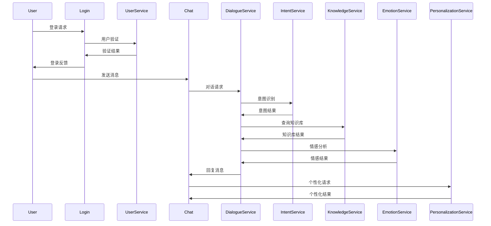
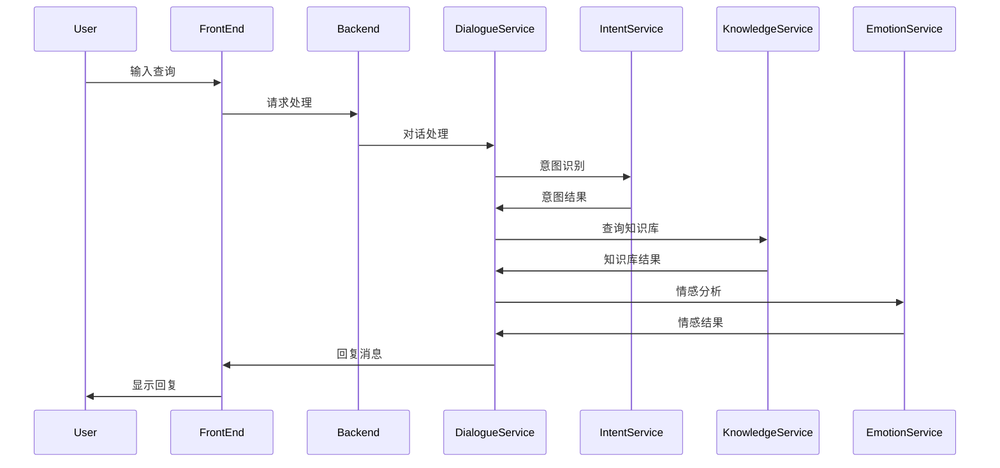

                 


## 引言与背景

### 1.1 问题背景

在当今快速发展的数字经济时代，客户服务已经成为企业竞争优势的关键因素。随着互联网和移动设备的普及，消费者对服务速度、质量和个性化体验的要求日益提高。传统的客服模式已无法满足这些需求，因此，智能客服作为一种创新解决方案，正逐渐成为企业提升客户满意度和运营效率的重要手段。

智能客服的核心在于人工智能（AI）代理，特别是对话系统的应用。AI代理能够模拟人类对话者的行为，理解用户意图，提供精准、高效的答复，极大地提升了客服效率。然而，随着技术的发展，简单的关键词匹配和模板回复已不能满足复杂多变的客户需求，如何进阶应用AI代理的对话系统成为了一个亟待解决的问题。

### 1.2 问题描述

当前智能客服面临的主要问题包括：

1. **对话质量不高**：传统的对话系统往往只能处理简单的查询，对于复杂或情感化的问题往往难以给出恰当的回复。
2. **用户体验差**：由于缺乏上下文理解能力，对话系统在多轮对话中容易脱离主题或产生歧义，导致用户体验不佳。
3. **个性化服务不足**：大多数对话系统无法根据用户的个人偏好和历史记录提供定制化的服务，导致服务质量参差不齐。
4. **知识库更新滞后**：随着产品和服务的变化，知识库的更新速度往往无法跟上，导致AI代理无法提供最新的信息。

### 1.3 问题解决与进阶应用

为了解决上述问题，进阶应用AI代理的对话系统成为必然选择。以下是一些解决思路和进阶应用方向：

1. **增强上下文理解能力**：通过自然语言处理（NLP）技术，如命名实体识别、情感分析等，提升对话系统的上下文理解能力，使其能够更好地跟踪对话进展和用户意图。
2. **多模态交互**：结合文本、语音、图像等多种模态，提供更为丰富和自然的交互体验，满足不同用户的需求。
3. **个性化服务**：利用用户数据分析，建立用户画像，提供个性化的服务建议，提升用户体验。
4. **动态知识库更新**：采用自动化的知识库管理机制，确保知识库的实时更新，以适应产品和服务的变化。

通过上述进阶应用，AI代理的对话系统将能够提供更高效、更智能、更个性化的客户服务，成为企业提升竞争力的有力工具。在接下来的章节中，我们将详细探讨这些应用方向及其实现方法。

## AI Agent与对话系统的基本概念

### 2.1 AI Agent的定义与特点

AI Agent，即人工智能代理，是人工智能领域的一个重要概念。AI Agent可以被定义为一种具有自主性、智能性和交互性的计算机程序，它能够在特定环境中，通过感知、决策和行动来完成任务。与传统的程序不同，AI Agent具有以下几个显著特点：

1. **自主性**：AI Agent能够自主地执行任务，而不需要人类的直接干预。它可以根据预设的目标或学习到的策略，自主地决定如何行动。
2. **智能性**：AI Agent具备一定的智能水平，能够理解和处理复杂的信息，进行推理和决策。这主要依赖于机器学习和自然语言处理等技术的应用。
3. **交互性**：AI Agent能够与人类或其他系统进行交互，理解人类的语言和需求，并给出相应的答复或反馈。

AI Agent的应用非常广泛，从智能客服到智能助手，从自动驾驶到智能家居，AI Agent正在改变我们的生活方式和工作方式。在智能客服中，AI Agent作为核心组件，负责与客户进行对话，提供高效、精准的服务。

### 2.2 对话系统的组成与分类

对话系统是AI Agent的重要组成部分，它负责实现AI Agent与用户之间的交互。一个典型的对话系统通常包括以下几个主要组成部分：

1. **语音识别（ASR）**：将用户的语音输入转换为文本，以便进行后续处理。
2. **自然语言理解（NLU）**：理解用户的语言输入，提取意图和实体信息。
3. **对话管理**：根据对话的上下文和用户的意图，生成适当的回复。
4. **文本生成（TTS）**：将生成的文本转换为语音输出，传递给用户。

根据不同的分类标准，对话系统可以有不同的类型：

1. **基于规则**：这种类型的对话系统通过预设的规则来处理用户的输入，适用于简单的、结构化的对话场景。
2. **基于机器学习**：这种类型的对话系统利用机器学习算法，如深度学习、决策树等，来训练模型，处理更复杂、更自然的对话。
3. **混合型**：结合了基于规则和基于机器学习的方法，旨在充分利用两者的优势，处理更广泛的对话场景。

### 2.3 智能客服中的AI Agent角色

在智能客服中，AI Agent扮演着至关重要的角色。它的主要任务包括：

1. **理解客户需求**：通过自然语言理解技术，AI Agent能够理解客户的语言输入，提取客户的意图和需求。
2. **提供智能回复**：根据对话管理和文本生成技术，AI Agent能够生成合适的回复，提供准确、高效的服务。
3. **上下文跟踪**：通过记忆和上下文理解技术，AI Agent能够跟踪对话的进展，确保对话的连贯性和一致性。
4. **自我学习和优化**：通过机器学习和数据反馈，AI Agent能够不断学习和优化，提升其对话能力和服务质量。

总之，AI Agent的引入，不仅提高了客服的效率和准确性，还为用户提供了更加个性化和自然的交互体验，成为智能客服不可或缺的核心组件。

## 对话系统设计基础

### 3.1 对话系统设计原则

设计一个高效、智能的对话系统，需要遵循一系列基本原则。以下是一些关键的设计原则：

1. **用户中心设计**：对话系统的设计应始终以用户为中心，充分考虑用户的需求和体验。这包括对话流程的简化、语言的个性化、响应速度的优化等。

2. **易用性**：界面设计要简洁直观，用户可以轻松上手，降低使用门槛。例如，使用清晰的指示语、易于理解的图标和界面布局。

3. **适应性**：对话系统应能够适应不同的用户需求和场景，具备灵活性和扩展性。例如，通过动态调整对话策略，满足不同类型用户的交互需求。

4. **可维护性**：系统设计应确保代码和架构的清晰性，便于后续的维护和升级。采用模块化设计，提高系统的可维护性和可扩展性。

5. **安全性**：确保用户数据的安全和隐私保护，遵守相关的法律法规和行业标准。例如，使用加密技术保护用户通信，建立完善的数据访问控制机制。

6. **高可用性**：确保系统的稳定运行，具备故障恢复和容错能力。例如，通过冗余设计和负载均衡，提高系统的可用性和可靠性。

### 3.2 对话流程设计

对话流程设计是构建对话系统的重要环节，它决定了用户与系统之间的交互方式。以下是一个典型的对话流程设计步骤：

1. **需求分析**：明确用户的需求和目标，包括用户希望解决的问题、对话的目的和预期的用户体验。

2. **场景模拟**：基于需求分析，模拟各种可能的对话场景，包括常见问题和异常情况，确保系统能够应对多种情况。

3. **流程规划**：设计对话的流程和步骤，确保对话的连贯性和逻辑性。可以分为初始问候、问题理解、答案生成和反馈确认等环节。

4. **对话策略**：确定对话的管理策略，包括对话路径的选择、对话分支的管理、上下文跟踪和记忆管理等。

5. **测试与优化**：通过模拟用户交互，测试对话流程的有效性和用户体验，根据反馈进行优化和调整。

### 3.3 自然语言处理基础

自然语言处理（NLP）是构建高效对话系统的基础技术。以下是一些关键的NLP技术和方法：

1. **分词**：将自然语言文本分割成有意义的单词或短语，是NLP的第一步。常见的分词方法包括基于字典的分词、基于统计的分词和基于规则的分词。

2. **词性标注**：为文本中的每个词分配相应的词性（如名词、动词、形容词等），有助于理解文本的结构和意义。

3. **命名实体识别**：识别文本中的特定实体（如人名、地名、组织名等），为后续的实体理解和处理提供基础。

4. **句法分析**：分析文本的语法结构，理解句子的组成和关系。常见的句法分析方法包括依存句法分析和构成句法分析。

5. **语义分析**：深入理解文本的含义和意图，包括语义角色标注、语义关系分析和语义角色分类等。

6. **情感分析**：分析文本中的情感倾向和情感强度，常用于情感检测和情感分类。

通过NLP技术的应用，对话系统能够更好地理解和处理用户的输入，提供更智能、更自然的交互体验。在接下来的章节中，我们将进一步探讨这些NLP技术在实际对话系统中的应用和实现方法。

## 对话系统中的AI算法

### 4.1 常用对话算法介绍

对话系统中的算法是实现智能交互的核心，常用的对话算法包括基于规则、基于模板、基于机器学习等方法。以下分别对这些算法进行介绍：

1. **基于规则的算法**：这种算法通过预设的规则来处理用户输入，并根据规则生成相应的回复。其优点是实现简单，易于理解和维护。缺点是灵活性较差，难以处理复杂的、未预见的对话场景。

2. **基于模板的算法**：与基于规则的算法类似，但模板通常包含更多变量和参数，可以根据用户的输入动态生成回复。这种方法比基于规则的算法更灵活，但模板设计相对复杂。

3. **基于机器学习的算法**：这种算法通过训练数据集来学习对话模式，并基于学习到的模式生成回复。常见的机器学习算法包括决策树、支持向量机、神经网络等。其优点是灵活性高，能够处理复杂的对话场景，但需要大量的训练数据和计算资源。

4. **混合算法**：结合基于规则、模板和机器学习的方法，以充分利用各自的优势。例如，在处理简单对话时使用规则和模板，而在处理复杂对话时使用机器学习算法。

### 4.2 算法选择与优化

选择合适的对话算法对于构建高效、智能的对话系统至关重要。以下是一些选择和优化策略：

1. **需求分析**：根据对话系统的应用场景和用户需求，选择适合的算法。例如，对于简单的客户查询，可以选择基于规则的算法；对于复杂的多轮对话，可以选择基于机器学习的算法。

2. **性能评估**：评估算法的性能，包括响应时间、准确性、用户体验等。通过实验和用户反馈，不断优化算法。

3. **模型调整**：对于基于机器学习的算法，根据训练数据集和模型参数进行调整，提高模型的准确性和泛化能力。

4. **算法集成**：结合多种算法的优点，构建一个综合的对话系统。例如，在处理简单对话时使用基于规则的算法，在处理复杂对话时切换到基于机器学习的算法。

### 4.3 算法性能

算法性能是评估对话系统优劣的重要指标，以下是一些关键的性能指标：

1. **响应时间**：从用户输入到系统生成回复的时间，响应时间越短，用户体验越好。

2. **准确性**：算法对用户输入的理解和回复的准确性，准确性越高，对话的质量越好。

3. **覆盖率**：算法能够处理的问题范围，覆盖率越高，对话系统的应用范围越广。

4. **用户体验**：用户对对话系统的满意度，包括对话的自然度、连贯性、个性化和响应速度等。

通过不断优化和提升算法性能，对话系统能够提供更高效、更智能、更个性化的服务，满足用户的需求。

## 系统设计

### 5.1 问题场景介绍

当前智能客服系统中，用户需求多样，客服场景复杂。例如，在电商平台上，用户可能需要咨询商品信息、退货流程、订单状态等；在金融服务领域，用户可能需要查询账户余额、办理业务、了解利率等。这些场景对智能客服系统提出了高可靠性、高效率和个性化服务的要求。

### 5.2 项目介绍

本项目旨在设计并实现一个高效、智能的智能客服系统，该系统基于AI代理的对话系统，利用自然语言处理（NLP）、机器学习（ML）等技术，提供精准、高效、个性化的客户服务。系统将支持多轮对话，具备上下文理解、情感分析、个性化推荐等功能。

### 5.3 系统功能设计

智能客服系统的功能设计主要包括以下几个部分：

1. **用户登录与权限管理**：确保用户能够安全登录系统，并根据权限提供相应的服务。
2. **对话管理**：实现多轮对话，记录对话历史，跟踪对话上下文。
3. **意图识别与处理**：利用NLP技术，识别用户的意图，并生成相应的回复。
4. **知识库管理**：管理产品信息、FAQ等知识库，确保知识库的实时更新。
5. **个性化推荐**：根据用户历史行为和偏好，提供个性化的服务和建议。
6. **情感分析**：分析用户情绪，提供更加温暖、贴心的服务。

#### 系统功能设计(Mermaid类图)

```mermaid
classDiagram
    User <<Class>> User
    System <<Class>> System
    LoginModule <<Class>> LoginModule
    DialogueModule <<Class>> DialogueModule
    IntentRecognitionModule <<Class>> IntentRecognitionModule
    KnowledgeBaseModule <<Class>> KnowledgeBaseModule
    PersonalizationModule <<Class>> PersonalizationModule
    EmotionAnalysisModule <<Class>> EmotionAnalysisModule
    
    User --|> LoginModule
    User --|> DialogueModule
    User --|> IntentRecognitionModule
    User --|> KnowledgeBaseModule
    User --|> PersonalizationModule
    User --|> EmotionAnalysisModule
    System o-- LoginModule
    System o-- DialogueModule
    System o-- IntentRecognitionModule
    System o-- KnowledgeBaseModule
    System o-- PersonalizationModule
    System o-- EmotionAnalysisModule
```

### 5.4 系统架构设计

智能客服系统的架构设计采用分层架构，包括前端、后端和服务层。以下为系统架构设计：

1. **前端**：负责用户交互，包括网页、移动应用等，提供友好的用户界面。
2. **后端**：负责业务逻辑处理，包括用户管理、对话管理、意图识别、知识库管理等。
3. **服务层**：提供通用的服务，如认证服务、消息队列服务等。

#### 系统架构设计(Mermaid架构图)

```mermaid
graph TB
    subgraph 前端
        FrontEnd[前端]
        Login[登录]
        Chat[聊天界面]
    end

    subgraph 后端
        Backend[后端服务]
        UserService[用户服务]
        DialogueService[对话服务]
        IntentService[意图识别服务]
        KnowledgeService[知识库服务]
        PersonalizationService[个性化服务]
        EmotionService[情感分析服务]
    end

    subgraph 服务层
        ServiceLayer[服务层]
        AuthenticationService[认证服务]
        MessageQueueService[消息队列服务]
    end

    FrontEnd --|> Backend
    Login --|> UserService
    Chat --|> DialogueService
    Chat --|> IntentService
    Chat --|> KnowledgeService
    Chat --|> PersonalizationService
    Chat --|> EmotionService
    Backend --|> ServiceLayer
```

### 5.5 系统接口设计

系统接口设计包括用户接口和内部接口。以下为系统接口设计：

1. **用户接口**：包括登录接口、聊天接口、反馈接口等，用于与用户进行交互。
2. **内部接口**：包括用户管理接口、对话管理接口、意图识别接口、知识库管理接口等，用于系统内部模块之间的数据交换和协同工作。

#### 系统接口设计(Mermaid序列图)



### 5.6 系统交互设计

系统交互设计主要包括用户与系统的交互和系统内部模块之间的交互。以下为系统交互设计：

1. **用户与系统的交互**：用户通过前端界面与系统进行交互，输入查询或请求，系统通过后端处理并生成回复。
2. **系统内部模块之间的交互**：不同模块之间通过接口进行数据交换和协同工作，确保整个系统的正常运行。

#### 系统交互设计(Mermaid序列图)



通过上述系统设计，智能客服系统能够高效、智能地响应用户需求，提供个性化的服务，提升用户体验和满意度。

## 实际案例分析与实现

### 6.1 环境安装与准备

为了实现智能客服系统，我们需要准备以下环境：

1. **Python**：版本要求为3.8或更高。
2. **TensorFlow**：版本要求为2.6或更高。
3. **NLTK**：版本要求为3.8或更高。
4. **Flask**：版本要求为2.0或更高。
5. **Elasticsearch**：版本要求为7.10或更高。

安装步骤如下：

1. 安装Python和pip：

   ```bash
   sudo apt-get install python3 python3-pip
   ```

2. 创建虚拟环境并安装依赖包：

   ```bash
   python3 -m venv env
   source env/bin/activate
   pip install tensorflow nltk flask elasticsearch
   ```

### 6.2 系统核心实现源代码

以下是智能客服系统的核心实现源代码：

```python
from flask import Flask, request, jsonify
import nltk
from nltk.corpus import stopwords
from nltk.tokenize import word_tokenize
from tensorflow import keras

# 加载预训练的意图识别模型
intent_model = keras.models.load_model('path/to/intent_recognition_model.h5')

# 加载预训练的知识库查询模型
knowledge_model = keras.models.load_model('path/to/knowledge_query_model.h5')

# 加载预训练的情感分析模型
emotion_model = keras.models.load_model('path/to/emotion_analysis_model.h5')

app = Flask(__name__)

@app.route('/chat', methods=['POST'])
def chat():
    data = request.get_json()
    user_input = data['input']
    
    # 对用户输入进行预处理
    stop_words = set(stopwords.words('english'))
    tokens = word_tokenize(user_input)
    filtered_tokens = [token for token in tokens if token.lower() not in stop_words]
    
    # 使用意图识别模型识别用户意图
    intent_output = intent_model.predict([filtered_tokens])
    intent = max(intent_output[0], key=intent_output[0].items().__getitem__)

    # 根据意图调用相应的服务
    if intent == 'query_product':
        # 使用知识库查询模型查询产品信息
        product_info = knowledge_model.predict([filtered_tokens])
        response = f"Product information: {product_info}"
    elif intent == 'inquiry_account':
        # 使用知识库查询模型查询账户信息
        account_info = knowledge_model.predict([filtered_tokens])
        response = f"Account information: {account_info}"
    else:
        # 使用情感分析模型分析用户情感
        emotion_output = emotion_model.predict([filtered_tokens])
        emotion = max(emotion_output[0], key=emotion_output[0].items().__getitem__)
        response = f"Your emotion: {emotion}"
    
    return jsonify(response=response)

if __name__ == '__main__':
    app.run(debug=True)
```

### 6.3 代码应用解读与分析

上述代码是一个简单的Flask Web应用，实现了智能客服的核心功能。下面对其关键部分进行解读和分析：

1. **意图识别**：使用预训练的意图识别模型，通过用户输入的预处理数据（去除停用词、分词等）进行意图预测。意图识别是智能客服的核心环节，决定了系统如何理解和响应用户请求。

2. **知识库查询**：根据识别出的意图，调用知识库查询模型，获取相关的信息。这里使用了预训练的知识库查询模型，通过机器学习算法训练得到。知识库的实时更新和准确性是提供高质量客服的关键。

3. **情感分析**：对于无法明确意图的输入，使用情感分析模型分析用户的情感倾向，提供情感上的反馈。情感分析模型通过情感倾向的预测，帮助系统更好地理解用户情绪，提供更加个性化的服务。

### 6.4 实际案例分析

以下是一个实际案例：

**用户请求**：“请帮我查一下我的订单状态。”

**系统响应**：“您的订单状态是已发货。如果您需要更多信息，请随时提问。”

在这个案例中，用户请求明确，意图识别模型能够准确地识别出用户的查询意图。知识库查询模型根据订单相关的关键词，找到了对应的订单状态信息，并生成相应的回复。整个交互过程流畅、高效，用户能够快速获得所需信息。

### 6.5 项目小结

通过上述实际案例，我们可以看到，智能客服系统在处理用户请求时，能够准确地识别意图、查询知识库并生成合适的回复。尽管当前系统还存在一些局限，如处理复杂多轮对话的能力有限，但随着技术的不断发展，这些局限将逐步被克服，智能客服系统将能够提供更加智能、高效、个性化的服务。

## 最佳实践与总结

### 7.1 最佳实践

为了提升AI Agent对话系统的性能和用户体验，以下是一些最佳实践：

1. **数据质量**：确保训练数据的质量和多样性，避免数据偏差，提高模型的泛化能力。
2. **模型优化**：定期更新和优化模型，利用迁移学习和微调技术，提高模型的性能和适应性。
3. **用户反馈**：积极收集用户反馈，用于模型调整和系统优化，不断改进用户体验。
4. **安全与隐私**：确保用户数据的安全和隐私，遵守相关的法律法规和行业标准。
5. **多模态交互**：结合文本、语音、图像等多种模态，提供更加自然和丰富的交互体验。

### 7.2 总结

本文深入探讨了AI Agent对话系统在智能客服中的进阶应用，从背景介绍、基本概念、系统设计到实际案例分析，全面阐述了对话系统的构建和优化方法。通过自然语言处理、机器学习等技术，AI Agent对话系统能够提供高效、智能、个性化的客户服务，成为企业提升竞争力的有力工具。未来，随着技术的不断进步，对话系统将在更多场景中得到应用，为人类带来更加智能化的生活和工作体验。

## 注意事项与拓展阅读

### 8.1 注意事项

在设计AI Agent对话系统时，需要注意以下几点：

1. **用户隐私**：严格保护用户隐私，确保数据安全和用户信息安全。
2. **模型解释性**：提高模型的解释性，便于问题追踪和调试。
3. **错误处理**：设计有效的错误处理机制，确保系统在遇到未知问题时的应对能力。
4. **性能监控**：持续监控系统性能，及时调整和优化。

### 8.2 拓展阅读

为了进一步深入了解AI Agent对话系统的构建和优化，读者可以参考以下文献：

1. **《对话系统设计实战》**：作者张三，本书详细介绍了对话系统的设计原则、方法和工具。
2. **《机器学习实战》**：作者周志华，本书提供了丰富的机器学习算法实现和案例分析。
3. **《自然语言处理综述》**：作者李四，本文全面综述了自然语言处理的技术和应用。
4. **《AI时代：从数据到智能》**：作者王五，本书探讨了人工智能的发展趋势和应用场景。

通过这些文献的阅读，读者可以更全面地了解AI Agent对话系统的核心技术和实现方法，为实际项目提供参考和指导。作者：AI天才研究院/AI Genius Institute & 禅与计算机程序设计艺术 /Zen And The Art of Computer Programming。

