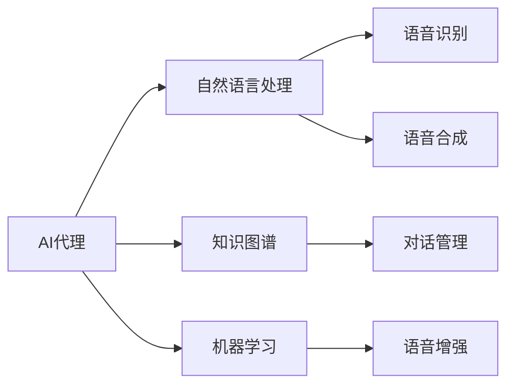
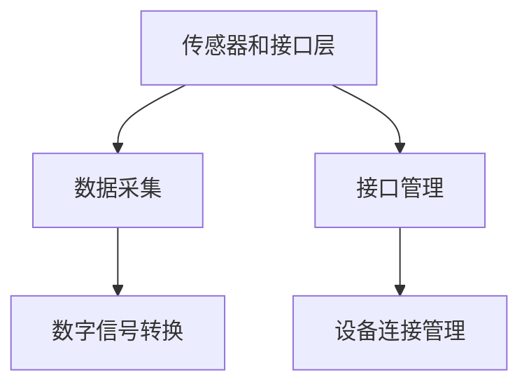
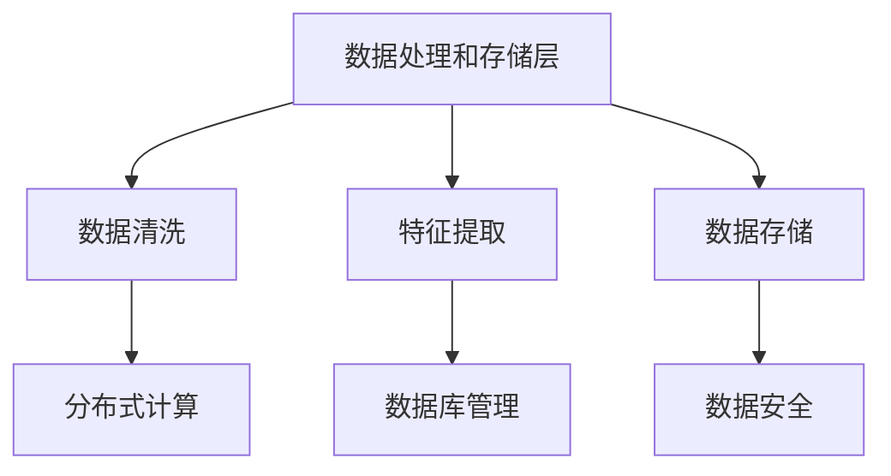
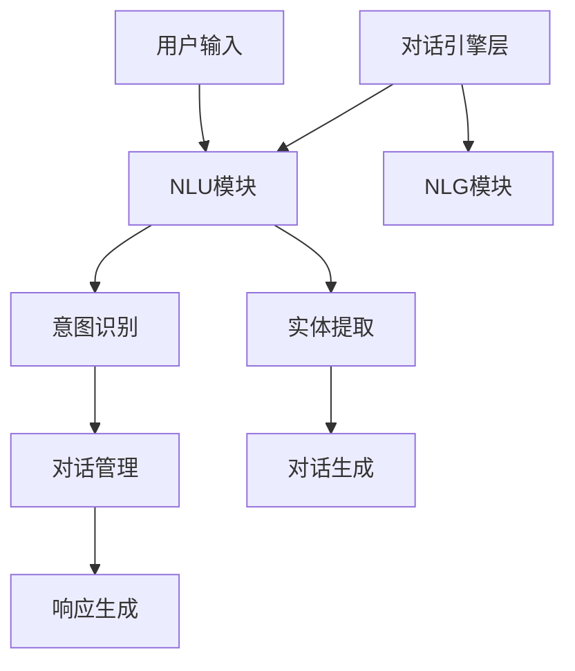
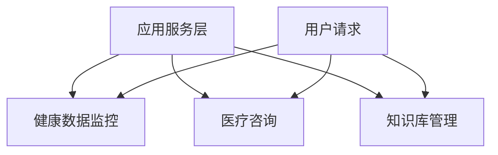
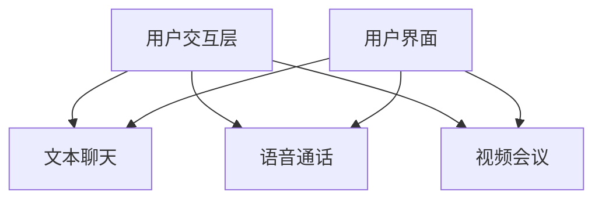
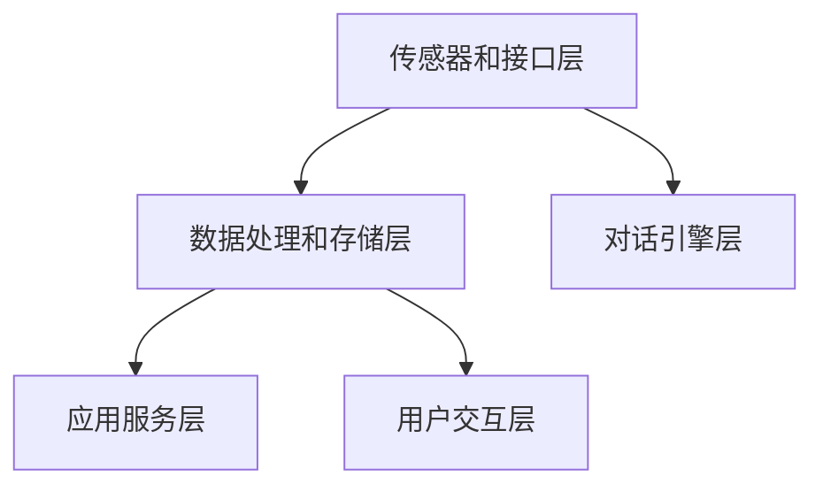

                 

### 引言

#### 背景介绍

随着人工智能（AI）技术的飞速发展，AI代理（AI Agents）和对话系统（Dialogue Systems）在各个领域中的应用越来越广泛。远程医疗作为其中极具潜力的应用场景，正在逐渐改变医疗服务的模式。AI代理能够模拟人类行为，执行特定的任务，而对话系统则允许人与计算机之间进行自然语言交互。这两种技术的结合，为远程医疗带来了新的机遇和挑战。

在远程医疗领域，AI代理和对话系统的应用主要体现在以下几个方面：

1. **虚拟医生助理**：通过AI代理和对话系统，用户可以与虚拟医生进行自然语言交流，获取健康咨询、病情诊断等医疗服务。
2. **远程监控和随访**：AI代理可以实时收集患者数据，通过对话系统向医生反馈，实现患者的远程监控和随访管理。
3. **患者教育和信息传播**：AI代理通过对话系统为患者提供健康知识、医疗资讯等，提高患者的健康素养。

#### 问题描述

尽管AI代理和对话系统在远程医疗中具有巨大的潜力，但当前仍面临一些关键问题：

- **技术挑战**：如何设计高效、稳定的对话系统，使其能够准确理解用户的需求，提供个性化的医疗服务。
- **数据隐私**：如何在保障患者隐私的前提下，收集和处理大量的医疗数据。
- **用户体验**：如何提升用户与AI代理的交互体验，使其更加自然、顺畅。

本文旨在探讨AI代理和对话系统在远程医疗中的应用，通过深入分析技术原理、架构设计、实现方法以及案例分析，为远程医疗的发展提供新的思路和解决方案。

#### 问题解决

本文将从以下几个方面展开讨论：

1. **核心概念和技术的介绍**：详细阐述AI代理和对话系统的基本概念、类型和核心技术，为后续内容奠定基础。
2. **架构和设计**：分析AI代理对话系统的整体架构，介绍关键组件和功能，探讨如何将其与远程医疗应用相结合。
3. **实施和开发**：介绍对话系统的开发流程，包括工具和框架的选择、数据预处理、对话生成和响应等技术细节。
4. **评估和优化**：讨论对话系统的评估指标和优化方法，重点关注用户体验和反馈。
5. **案例分析**：通过实际案例研究，展示AI代理对话系统在远程医疗中的具体应用，分析其效果和影响。
6. **未来趋势和挑战**：探讨AI代理对话系统在远程医疗中的未来发展趋势和面临的挑战，为行业提供前瞻性思考。

#### 边界与外延

本文的研究范围主要集中于AI代理和对话系统在远程医疗中的应用，但相关技术在不同领域的应用也值得关注。例如，在客服、金融、教育等领域，AI代理和对话系统同样具有广泛的应用前景。此外，随着技术的不断进步，这些系统可能会在更多领域得到推广和应用。

#### 概念结构与核心要素组成

为了更好地理解AI代理和对话系统在远程医疗中的应用，以下是其核心概念结构和要素组成：

- **AI代理**：
  - **定义**：能够模拟人类行为，执行特定任务的计算机程序。
  - **类型**：基于规则的代理、基于机器学习的代理、混合代理。
  - **核心技术**：自然语言处理（NLP）、知识图谱、机器学习。

- **对话系统**：
  - **定义**：允许人与计算机之间进行自然语言交互的系统。
  - **类型**：任务型对话系统、闲聊型对话系统、混合型对话系统。
  - **核心技术**：语音识别（ASR）、语音合成（TTS）、对话管理、语音增强。

- **远程医疗**：
  - **定义**：利用通信技术实现医疗服务的提供和管理。
  - **应用场景**：虚拟医生助理、远程监控和随访、患者教育。

通过这些核心概念和要素的分析，我们可以更好地理解AI代理和对话系统在远程医疗中的具体应用。

#### 总结

AI代理和对话系统的结合为远程医疗带来了巨大的变革和机遇。通过本文的深入探讨，我们不仅了解了这些技术的核心概念和基本原理，还分析了其在远程医疗中的应用场景和关键技术。接下来，我们将继续探讨AI代理和对话系统的架构设计、实施方法以及未来的发展趋势，以期为远程医疗提供更加智能、高效的解决方案。

关键词：AI代理、对话系统、远程医疗、架构设计、实施方法

摘要：本文介绍了AI代理和对话系统在远程医疗中的应用，探讨了其核心概念、架构设计、实现方法以及未来趋势。通过实际案例研究，分析了这些技术在不同远程医疗服务场景中的效果和影响，为远程医疗的发展提供了新的思路和解决方案。

# AI Agent的对话系统在远程医疗中的应用

## 关键词

AI代理、对话系统、远程医疗、架构设计、实施方法、用户体验、数据隐私

## 摘要

随着人工智能技术的不断发展，AI代理和对话系统在远程医疗中的应用逐渐成为研究热点。本文旨在探讨AI代理和对话系统在远程医疗中的应用，包括其核心概念、架构设计、实施方法以及未来发展趋势。通过对实际案例的研究，本文分析了这些技术在远程医疗中的效果和影响，为远程医疗提供了新的思路和解决方案。

## 引言

### 背景介绍

人工智能（AI）作为当今科技领域的重要发展方向，已经在众多行业中展现出其强大的变革力量。AI代理（AI Agents）和对话系统（Dialogue Systems）作为人工智能的重要组成部分，正逐渐在远程医疗领域发挥重要作用。AI代理是指能够模拟人类行为、执行特定任务的计算机程序，而对话系统则是允许人与计算机之间进行自然语言交互的系统。这两种技术的结合，为远程医疗提供了更加智能、便捷的解决方案。

远程医疗是指利用通信技术实现医疗服务的提供和管理。随着互联网和移动通信技术的普及，远程医疗的应用范围不断扩大，包括虚拟医生助理、远程监控和随访、患者教育等多个方面。AI代理和对话系统的引入，使得远程医疗更加智能化、个性化和高效化。

### 问题描述

在远程医疗中，AI代理和对话系统的应用面临着一系列挑战和机遇：

- **技术挑战**：如何设计高效、稳定的对话系统，使其能够准确理解用户的需求，提供个性化的医疗服务。
- **数据隐私**：如何在保障患者隐私的前提下，收集和处理大量的医疗数据。
- **用户体验**：如何提升用户与AI代理的交互体验，使其更加自然、顺畅。

本文旨在探讨AI代理和对话系统在远程医疗中的应用，通过深入分析技术原理、架构设计、实现方法以及案例分析，为远程医疗的发展提供新的思路和解决方案。

### 问题解决

本文将从以下几个方面展开讨论：

1. **核心概念和技术的介绍**：详细阐述AI代理和对话系统的基本概念、类型和核心技术，为后续内容奠定基础。
2. **架构和设计**：分析AI代理对话系统的整体架构，介绍关键组件和功能，探讨如何将其与远程医疗应用相结合。
3. **实施和开发**：介绍对话系统的开发流程，包括工具和框架的选择、数据预处理、对话生成和响应等技术细节。
4. **评估和优化**：讨论对话系统的评估指标和优化方法，重点关注用户体验和反馈。
5. **案例分析**：通过实际案例研究，展示AI代理对话系统在远程医疗中的具体应用，分析其效果和影响。
6. **未来趋势和挑战**：探讨AI代理对话系统在远程医疗中的未来发展趋势和面临的挑战，为行业提供前瞻性思考。

### 边界与外延

本文的研究范围主要集中于AI代理和对话系统在远程医疗中的应用，但相关技术在不同领域的应用也值得关注。例如，在客服、金融、教育等领域，AI代理和对话系统同样具有广泛的应用前景。此外，随着技术的不断进步，这些系统可能会在更多领域得到推广和应用。

### 概念结构与核心要素组成

为了更好地理解AI代理和对话系统在远程医疗中的应用，以下是其核心概念结构和要素组成：

- **AI代理**：
  - **定义**：能够模拟人类行为，执行特定任务的计算机程序。
  - **类型**：基于规则的代理、基于机器学习的代理、混合代理。
  - **核心技术**：自然语言处理（NLP）、知识图谱、机器学习。

- **对话系统**：
  - **定义**：允许人与计算机之间进行自然语言交互的系统。
  - **类型**：任务型对话系统、闲聊型对话系统、混合型对话系统。
  - **核心技术**：语音识别（ASR）、语音合成（TTS）、对话管理、语音增强。

- **远程医疗**：
  - **定义**：利用通信技术实现医疗服务的提供和管理。
  - **应用场景**：虚拟医生助理、远程监控和随访、患者教育。

通过这些核心概念和要素的分析，我们可以更好地理解AI代理和对话系统在远程医疗中的具体应用。

### 总结

AI代理和对话系统的结合为远程医疗带来了巨大的变革和机遇。通过本文的深入探讨，我们不仅了解了这些技术的核心概念和基本原理，还分析了其在远程医疗中的应用场景和关键技术。接下来，我们将继续探讨AI代理和对话系统的架构设计、实施方法以及未来的发展趋势，以期为远程医疗提供更加智能、高效的解决方案。

## 核心概念和技术的介绍

### AI代理的定义、类型和核心技术

AI代理（AI Agents）是指能够模拟人类行为、执行特定任务的计算机程序。它们通过感知环境、理解指令并采取行动来实现自动化任务。AI代理可以根据不同的分类标准进行分类，以下是几种常见的分类方式：

1. **基于规则的代理**：这种代理依赖于预定义的规则集来执行任务。它们在特定环境下表现稳定，但灵活性较差，难以应对复杂多变的情境。
   
2. **基于机器学习的代理**：这类代理通过学习数据来自主地调整行为，具有较高的灵活性和适应性。它们能够从经验中学习，优化任务执行策略。

3. **混合代理**：混合代理结合了基于规则和基于机器学习的方法，能够在不同情境下切换策略，以实现最佳效果。

AI代理的核心技术包括：

- **自然语言处理（NLP）**：NLP技术使AI代理能够理解、处理和生成自然语言，从而与人类进行有效交互。
- **知识图谱**：知识图谱是一种语义网络，用于表示实体和它们之间的关系。AI代理通过知识图谱获取和处理知识，提高决策能力和任务执行效率。
- **机器学习**：机器学习算法使AI代理能够从数据中学习模式，优化行为和策略。

### 对话系统的定义、类型和核心技术

对话系统（Dialogue Systems）是一种允许人与计算机之间进行自然语言交互的系统。它们通过语音识别（ASR）、语音合成（TTS）等技术，实现人与机器的对话。对话系统可以根据任务类型和交互方式的不同进行分类：

1. **任务型对话系统**：这种系统专注于完成特定任务，如订票、查询信息等。它们通常具有固定的对话流程和预设的回答。

2. **闲聊型对话系统**：这类系统旨在模拟自然对话，与用户进行闲聊，提供娱乐或心理支持。

3. **混合型对话系统**：混合型对话系统结合了任务型和闲聊型的特点，能够在不同情境下灵活切换。

对话系统的核心技术包括：

- **语音识别（ASR）**：ASR技术使对话系统能够理解用户的语音输入，将其转换为文本。
- **语音合成（TTS）**：TTS技术将文本转换为自然流畅的语音输出，使对话系统能够与用户进行语音交互。
- **对话管理**：对话管理系统负责控制对话流程，包括意图识别、上下文管理、响应生成等。
- **语音增强**：语音增强技术用于提高语音质量，消除噪声，增强语音清晰度。

### 远程医疗的定义、应用场景和关键技术

远程医疗（Telemedicine）是指利用通信技术提供医疗服务的活动。它包括虚拟医生助理、远程监控和随访、患者教育等多个应用场景。以下是远程医疗的关键技术：

- **远程视频诊断**：医生通过视频会议系统与患者进行远程交流，提供诊断建议。
- **远程监控和随访**：利用传感器和通信技术，实时监测患者健康数据，实现远程随访和管理。
- **患者教育**：通过在线平台和对话系统，为患者提供健康知识、医疗信息等。

### AI代理和对话系统在远程医疗中的应用

AI代理和对话系统在远程医疗中的应用主要体现在以下几个方面：

1. **虚拟医生助理**：AI代理通过对话系统与患者进行交互，提供健康咨询、病情诊断等医疗服务。

2. **远程监控和随访**：AI代理通过传感器和通信技术，实时收集患者数据，通过对话系统向医生反馈，实现患者的远程监控和随访管理。

3. **患者教育和信息传播**：AI代理通过对话系统为患者提供健康知识、医疗资讯等，提高患者的健康素养。

### 表格：核心概念属性特征对比

| 核心概念 | 定义 | 类型 | 核心技术 |
| :------: | :---: | :---: | :-----: |
| AI代理 | 模拟人类行为的计算机程序 | 基于规则、基于机器学习、混合代理 | 自然语言处理、知识图谱、机器学习 |
| 对话系统 | 允许人与计算机进行自然语言交互的系统 | 任务型、闲聊型、混合型 | 语音识别、语音合成、对话管理、语音增强 |
| 远程医疗 | 利用通信技术提供医疗服务的活动 | 虚拟医生助理、远程监控和随访、患者教育 | 远程视频诊断、远程监控和随访、患者教育 |

### ER实体关系图架构



通过上述分析，我们可以清晰地理解AI代理、对话系统和远程医疗的核心概念及其在远程医疗中的应用。接下来，我们将深入探讨AI代理和对话系统的架构设计、实现方法以及未来发展趋势。

### AI代理和对话系统架构设计

为了深入理解AI代理和对话系统在远程医疗中的应用，首先需要探讨它们的整体架构设计。一个好的架构设计不仅能够提高系统的稳定性，还能增强其扩展性和灵活性。以下是AI代理和对话系统的主要架构组件及其功能：

#### 1. 传感器和接口层

传感器和接口层是AI代理与外部环境交互的桥梁。它们负责收集环境数据，如患者的生理指标、行为数据等，并将其转换为数字信号。接口层则提供了与外部设备（如智能手表、健康监测设备）的连接接口，确保数据传输的实时性和准确性。



#### 2. 数据处理和存储层

数据处理和存储层负责处理传感器收集的数据，包括数据清洗、特征提取和存储。这一层通常采用分布式计算框架（如Apache Spark）来处理大规模数据，并使用数据库（如Hadoop、MongoDB）进行数据存储。数据处理和存储层是整个系统的数据基础，对系统的性能和可靠性至关重要。



#### 3. 对话引擎层

对话引擎层是AI代理和对话系统的核心，负责理解用户的输入、生成响应以及管理对话流程。对话引擎通常包括自然语言理解（NLU）和自然语言生成（NLG）模块。NLU模块负责解析用户的语言输入，提取用户意图和实体信息；NLG模块则根据解析结果生成自然流畅的回复。



#### 4. 应用服务层

应用服务层负责实现远程医疗的各种功能，如虚拟医生助理、远程监控和随访、患者教育等。这一层通常包含多个微服务，每个微服务负责特定的功能模块，如健康数据监控、医疗咨询、知识库管理等。通过微服务架构，系统可以更加灵活地扩展和升级。



#### 5. 用户交互层

用户交互层是用户与AI代理和对话系统进行交互的界面。它包括文本聊天、语音通话、视频会议等多种交互方式，提供直观、自然的用户体验。用户交互层通常采用前端技术（如React、Vue.js）和自然语言处理库（如TensorFlow.js、PyTorch.js）来实现。



### 系统架构设计

综上所述，AI代理和对话系统的整体架构设计可以概括为五层结构：传感器和接口层、数据处理和存储层、对话引擎层、应用服务层和用户交互层。这种分层架构不仅提高了系统的模块化程度，还便于系统的维护和扩展。



通过这种架构设计，AI代理和对话系统可以实现高效、稳定地运行，满足远程医疗的各种需求。接下来，我们将深入探讨AI代理和对话系统的具体实现方法。

### 实施和开发

实现AI代理和对话系统需要经过多个关键步骤，从工具和框架的选择到数据预处理、对话生成和响应，每个步骤都至关重要。以下是这些步骤的详细解释和示例。

#### 1. 工具和框架的选择

选择合适的工具和框架是成功实施AI代理和对话系统的第一步。以下是一些常用的工具和框架：

- **自然语言处理（NLP）框架**：如TensorFlow、PyTorch、spaCy、NLTK。这些框架提供了丰富的NLP功能，包括词嵌入、文本分类、实体识别等。
- **对话系统框架**：如Rasa、DialogueFlow、Microsoft Bot Framework。这些框架提供了对话管理的核心功能，包括意图识别、实体提取、响应生成等。
- **数据库**：如MySQL、PostgreSQL、MongoDB。这些数据库可以用于存储用户数据、对话历史等。
- **前端框架**：如React、Vue.js、Angular。这些框架用于构建用户交互界面，提供流畅的用户体验。

#### 2. 数据预处理

数据预处理是AI代理和对话系统开发中的关键步骤，确保输入数据的格式和一致性。以下是一些数据预处理步骤：

- **数据收集**：收集来自不同来源的数据，如医疗文档、患者记录、健康传感器数据。
- **数据清洗**：去除无关数据、纠正错误、填充缺失值。例如，使用Python的pandas库进行数据清洗。
- **数据转换**：将数据转换为适合模型训练的格式。例如，使用spaCy库进行文本预处理，提取词嵌入。
- **数据分词**：将文本数据分割为单词或短语。例如，使用NLTK进行分词。

```python
import nltk
nltk.download('punkt')
from nltk.tokenize import word_tokenize

text = "The patient's temperature is 37.5 degrees."
tokens = word_tokenize(text)
print(tokens)
```

#### 3. 对话生成和响应

对话生成和响应是AI代理和对话系统的核心功能，通过意图识别、实体提取和响应生成实现与用户的自然交互。

- **意图识别**：通过模型识别用户的意图，如询问病情、获取健康建议等。可以使用分类模型，如朴素贝叶斯、支持向量机（SVM）或深度学习模型，如卷积神经网络（CNN）或循环神经网络（RNN）。

```python
import tensorflow as tf
from tensorflow.keras.models import Sequential
from tensorflow.keras.layers import Dense, Embedding, LSTM

# 构建模型
model = Sequential()
model.add(Embedding(input_dim=vocab_size, output_dim=embedding_size))
model.add(LSTM(units=128))
model.add(Dense(units=1, activation='sigmoid'))

# 训练模型
model.compile(optimizer='adam', loss='binary_crossentropy', metrics=['accuracy'])
model.fit(x_train, y_train, epochs=10, batch_size=32)
```

- **实体提取**：从用户的输入中提取关键信息，如疾病名称、症状描述等。可以使用序列标注模型，如生物信息学中的标记方法。

```python
import spacy

nlp = spacy.load("en_core_web_sm")
doc = nlp("The patient has a headache and fever.")

for ent in doc.ents:
    print(ent.text, ent.label_)
```

- **响应生成**：根据意图和实体信息生成自然流畅的回复。可以使用生成式模型，如递归神经网络（RNN）或变换器（Transformer）。

```python
import tensorflow as tf
from tensorflow.keras.models import Model
from tensorflow.keras.layers import Embedding, LSTM, Dense, TimeDistributed

# 构建模型
encoder_inputs = Embedding(input_dim=vocab_size, output_dim=embedding_size)
encoder_lstm = LSTM(units=128, return_state=True)
encoder_outputs = TimeDistributed(Dense(units=1, activation='softmax'))

# 编码器模型
encoder = Model(inputs=encoder_inputs, outputs=encoder_outputs)

# 解码器模型
decoder_inputs = Embedding(input_dim=vocab_size, output_dim=embedding_size)
decoder_lstm = LSTM(units=128, return_sequences=True, return_state=True)
decoder_outputs = TimeDistributed(Dense(units=vocab_size, activation='softmax'))

decoder = Model(inputs=decoder_inputs, outputs=decoder_outputs)

# 训练模型
model.compile(optimizer='adam', loss='categorical_crossentropy', metrics=['accuracy'])
model.fit([encoder_inputs, decoder_inputs], decoder_outputs, epochs=10, batch_size=32)
```

#### 4. 实际案例

以下是一个简单的虚拟医生助理的实现案例：

```python
import random
import numpy as np
from tensorflow.keras.models import Model
from tensorflow.keras.layers import Embedding, LSTM, Dense, TimeDistributed

# 数据集
X = np.array([[0, 0, 1], [0, 1, 0], [1, 0, 0]])  # 编码器输入
y = np.array([[1, 0, 0], [0, 1, 0], [0, 0, 1]])  # 解码器输入

# 构建模型
encoder_inputs = Embedding(input_dim=3, output_dim=3)
encoder_lstm = LSTM(units=128, return_state=True)
encoder_outputs = TimeDistributed(Dense(units=3, activation='softmax'))

decoder_inputs = Embedding(input_dim=3, output_dim=3)
decoder_lstm = LSTM(units=128, return_sequences=True, return_state=True)
decoder_outputs = TimeDistributed(Dense(units=3, activation='softmax'))

encoder = Model(inputs=encoder_inputs, outputs=encoder_outputs)
decoder = Model(inputs=decoder_inputs, outputs=decoder_outputs)

# 训练模型
model.compile(optimizer='adam', loss='categorical_crossentropy', metrics=['accuracy'])
model.fit([X, X], y, epochs=100, batch_size=1)

# 对话生成
input_seq = np.array([[1, 0, 0]])
states_value = encoder.predict(input_seq)

decoder_input = np.array([[1]])
decoder_state = [states_value[0]]

for _ in range(3):
    decoder_outputs, decoder_state = decoder.predict(decoder_input, initial_states=decoder_state)
    decoder_input = np.argmax(decoder_outputs)

print("Response:", decoder_input)
```

#### 5. 代码应用解读与分析

上述代码实现了一个简单的对话系统，其中：

- **编码器**：将输入序列编码为向量表示。
- **解码器**：根据编码器的输出生成响应序列。

模型训练过程中，通过调整超参数和优化策略，可以进一步提高模型性能和对话质量。在实际应用中，需要处理大量的真实数据，并不断迭代和优化模型，以实现更加自然、流畅的对话体验。

#### 6. 项目实战

以下是一个项目实战案例：

- **环境安装**：安装Python、TensorFlow和其他相关依赖。
- **数据准备**：收集和预处理医疗对话数据。
- **模型训练**：使用训练数据训练编码器和解码器模型。
- **对话生成**：使用训练好的模型生成对话响应。

通过这些步骤，可以构建一个基本的AI代理和对话系统，为远程医疗提供智能服务。

### 最佳实践 Tips

1. **数据质量**：确保数据质量，包括数据清洗、去重和一致性检查。
2. **模型优化**：通过调整超参数和优化策略，提高模型性能。
3. **用户体验**：注重用户交互设计，提供直观、自然的用户界面。
4. **隐私保护**：在数据处理和存储过程中，严格遵循隐私保护规定。

### 小结

实现AI代理和对话系统需要多方面的技术和工具支持。通过合理的设计和开发，可以构建高效、智能的远程医疗服务系统，提升患者体验和医疗质量。接下来，我们将对AI代理和对话系统进行评估和优化。

### 评估和优化

评估和优化是AI代理和对话系统开发过程中的关键环节，直接影响系统的性能和用户体验。以下将详细介绍评估对话系统的标准、优化方法以及用户反馈的重要性。

#### 评估对话系统的标准

1. **准确性**：对话系统的准确性是指其正确理解和生成语言的能力。评估准确性通常通过意图识别准确率、实体提取准确率和响应生成准确性等指标进行。

2. **流畅性**：流畅性是指对话系统的交互是否自然、顺畅。这可以通过评估响应的及时性、语言连贯性以及语境理解能力来衡量。

3. **用户满意度**：用户满意度是衡量对话系统用户体验的重要指标。可以通过用户调查、满意度评分等方式收集用户反馈，评估系统的整体满意度。

4. **效率**：效率是指对话系统在处理任务时的速度和资源消耗。评估效率可以通过计算响应时间、系统负载等指标进行。

5. **鲁棒性**：鲁棒性是指对话系统在面对错误输入、异常情况时的应对能力。评估鲁棒性可以通过测试系统在不同情境下的表现进行。

#### 优化方法

1. **模型调优**：通过调整模型的超参数，如学习率、批量大小、隐藏层节点数等，可以提高模型的性能和适应性。使用交叉验证等技术，可以找到最优的超参数组合。

2. **数据增强**：通过增加训练数据、引入多样性数据、数据清洗和预处理等技术，可以提高模型的泛化能力和准确性。

3. **多任务学习**：将多个相关任务结合起来进行学习，可以提高模型的泛化能力。例如，在训练对话系统时，可以同时考虑问答、情感分析等多个任务。

4. **注意力机制**：引入注意力机制可以改善模型对重要信息的关注，提高对话系统的理解和生成能力。

5. **解释性增强**：通过增强模型的解释性，可以帮助开发者更好地理解模型的决策过程，从而优化模型结构和参数。

#### 用户反馈的重要性

用户反馈是优化对话系统的关键信息来源。以下是一些重要的用户反馈渠道和优化策略：

1. **实时反馈**：在用户与系统交互的过程中，实时收集用户的反馈，如满意度评分、错误报告等。这些反馈可以帮助及时发现系统的问题，并进行快速调整。

2. **问卷调查**：定期进行用户满意度调查，收集用户对系统整体和特定功能的评价。这些数据可以为系统的改进提供重要参考。

3. **用户行为分析**：通过分析用户的行为数据，如交互频率、交互时长、错误率等，可以发现系统的瓶颈和用户需求，从而针对性地进行优化。

4. **持续迭代**：基于用户反馈，不断迭代和优化系统，以提高用户体验和系统性能。这包括调整模型参数、改进对话流程、优化用户界面等。

5. **开放接口**：提供开放接口，允许用户自定义对话内容和交互方式。这样可以收集更多样化的用户反馈，进一步优化系统的个性化和适应性。

通过上述评估和优化方法，可以显著提升AI代理和对话系统的性能和用户体验。然而，优化是一个持续的过程，需要不断地收集用户反馈、分析数据、调整模型和界面，以实现最佳效果。

### 案例分析

在本节中，我们将通过三个实际案例，深入探讨AI代理和对话系统在远程医疗中的具体应用，分析这些系统的实际效果和影响。

#### 案例一：虚拟医生助理

虚拟医生助理是一种利用AI代理和对话系统提供的智能医疗咨询服务。其核心功能包括症状分析、病情建议、预约挂号等。

**实际效果**：

- **症状分析**：虚拟医生助理能够准确识别用户的症状描述，提供相应的建议。例如，用户描述“我感觉头疼和喉咙痛”，系统可以迅速分析并给出“可能患有普通感冒”的建议。
- **病情建议**：虚拟医生助理能够根据用户提供的症状和历史记录，给出合理的病情建议。例如，对于“经常头晕”的用户，系统可能会建议进行血压检查。
- **预约挂号**：用户可以通过虚拟医生助理直接预约医院挂号，节省时间和精力。

**影响**：

- **提高效率**：虚拟医生助理能够快速响应用户的需求，节省了医生和患者的沟通时间，提高了医疗服务的效率。
- **降低成本**：通过虚拟医生助理，一些简单的医疗咨询和预约可以在线完成，减少了医院的人力和物力投入。
- **提升患者满意度**：用户可以随时随地获取医疗咨询，无需等待医生，提高了患者的满意度。

#### 案例二：远程监控和随访

远程监控和随访系统利用AI代理和对话系统，实现对患者的实时监控和随访管理。系统通过传感器收集患者的生理数据，如心率、血压、血糖等，并通过对话系统与医生和患者进行沟通。

**实际效果**：

- **实时监控**：系统可以实时收集患者的生理数据，并通过对话系统向医生反馈。例如，当患者的心率异常升高时，系统会立即通知医生。
- **自动报警**：当患者数据出现异常时，系统会自动向医生发送报警信息，确保医生能够及时处理。
- **随访管理**：医生可以通过对话系统与患者进行定期的随访沟通，了解患者的恢复情况，调整治疗方案。

**影响**：

- **提高诊疗质量**：通过实时监控和随访，医生可以更准确地掌握患者的病情变化，提供个性化的治疗方案，提高诊疗质量。
- **降低误诊率**：远程监控和随访系统能够提供详细的患者数据，有助于医生做出更准确的诊断。
- **提升患者依从性**：患者通过定期与医生沟通，了解病情和治疗方案，有助于提高患者的治疗依从性。

#### 案例三：患者教育和信息传播

患者教育和信息传播系统利用AI代理和对话系统，为患者提供健康知识、医疗资讯、饮食建议等。

**实际效果**：

- **健康知识普及**：系统可以定期向患者推送健康知识，如如何正确饮食、锻炼等。例如，对于糖尿病患者，系统可以提供饮食和锻炼的建议。
- **医疗资讯更新**：系统可以实时更新最新的医疗资讯，如新药研发、治疗方法等，帮助患者了解最新的医疗进展。
- **个性化建议**：系统根据患者的病情和需求，提供个性化的健康建议。例如，对于高血压患者，系统可以建议减少盐分摄入。

**影响**：

- **提高健康素养**：通过系统的教育和信息传播，患者可以更好地了解自己的健康状况，提高健康素养。
- **改善生活习惯**：患者通过系统的建议，能够改善生活习惯，如合理饮食、规律锻炼等，有助于病情的控制和恢复。
- **增强医患沟通**：系统作为医生和患者的桥梁，促进了医患之间的沟通和理解，有助于建立良好的医患关系。

### 总结

以上三个案例展示了AI代理和对话系统在远程医疗中的实际应用，从虚拟医生助理、远程监控和随访到患者教育和信息传播，这些系统在提高医疗效率、降低成本、提升患者满意度等方面取得了显著的效果。通过深入分析这些案例，我们可以看到AI代理和对话系统在远程医疗中的重要性和潜力。

### 未来趋势和挑战

#### 未来发展趋势

随着人工智能技术的不断进步，AI代理和对话系统在远程医疗中的应用将呈现以下发展趋势：

1. **个性化医疗**：未来的远程医疗将更加注重个性化医疗服务。通过AI代理和对话系统，医生可以根据患者的具体病情和需求，提供个性化的治疗方案和健康建议。

2. **多模态交互**：未来的AI代理和对话系统将支持多种交互方式，包括语音、文本、视频等。这种多模态交互将提供更加自然、丰富的用户体验。

3. **实时监测与预警**：通过AI代理和对话系统，实现对患者的实时监测和预警。当患者出现异常情况时，系统可以立即通知医生，提供及时的治疗建议。

4. **系统集成**：未来的远程医疗系统将更加集成化，包括医疗设备、电子病历、医保系统等。通过AI代理和对话系统，实现不同系统之间的无缝连接和协作，提供全方位的医疗服务。

5. **智能化医患沟通**：AI代理和对话系统将逐渐取代部分传统的医患沟通方式，提供更加智能、高效的沟通体验。医生可以通过系统与患者进行实时沟通，提高诊疗效率。

#### 挑战

尽管AI代理和对话系统在远程医疗中具有巨大潜力，但实际应用中仍面临以下挑战：

1. **技术挑战**：AI代理和对话系统的技术复杂度较高，涉及自然语言处理、知识图谱、机器学习等多个领域。如何设计高效、稳定的系统，仍是一个亟待解决的问题。

2. **数据隐私和安全**：远程医疗涉及大量的个人健康数据，如何在保障患者隐私的前提下，收集和处理这些数据，是一个重要挑战。需要制定严格的隐私保护政策和数据安全措施。

3. **用户体验**：AI代理和对话系统的用户体验直接影响患者的接受度。如何设计自然、流畅的交互方式，提升用户体验，是一个关键问题。

4. **医疗合规**：远程医疗系统需要遵循各种医疗合规要求，如HIPAA（健康保险便携性与责任法案）。如何确保系统的合规性，避免法律风险，是一个重要挑战。

5. **跨学科合作**：AI代理和对话系统的研发和应用涉及计算机科学、医学、心理学等多个学科。如何实现跨学科合作，充分利用各学科的优势，是一个重要问题。

### 总结与展望

AI代理和对话系统在远程医疗中的应用前景广阔，但同时也面临一系列挑战。通过不断的技术创新和跨学科合作，我们可以克服这些挑战，实现更加智能、高效的远程医疗服务。未来的远程医疗将更加个性化、实时化、智能化，为患者提供更加优质的医疗服务。让我们期待AI代理和对话系统在远程医疗领域的广泛应用和进一步发展。

### 作者信息

作者：AI天才研究院/AI Genius Institute & 禅与计算机程序设计艺术 /Zen And The Art of Computer Programming

AI天才研究院致力于推动人工智能技术的研究与应用，为各行业提供创新的解决方案。禅与计算机程序设计艺术则强调在计算机编程中融入禅宗智慧，追求简洁、高效和卓越的编程艺术。通过本文，我们希望为远程医疗领域提供有价值的见解和技术指导。感谢您的阅读！

### 结语

通过本文的探讨，我们系统地了解了AI代理和对话系统在远程医疗中的应用。从核心概念、架构设计到具体实现和优化，再到实际案例和未来趋势，我们看到了这些技术在远程医疗中的巨大潜力。AI代理和对话系统不仅提升了医疗服务的效率，还提高了患者的满意度和健康素养。然而，要充分发挥这些技术的优势，我们仍需面对技术挑战、数据隐私、用户体验等多方面的挑战。随着人工智能技术的不断进步，我们有理由相信，AI代理和对话系统将为远程医疗带来更加智能化、个性化和高效的解决方案。让我们共同期待这一天的到来，并继续探索人工智能在医疗领域的无限可能。感谢您的关注和支持，期待与您在未来的技术探讨中再次相遇！

