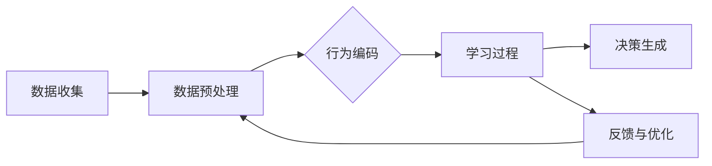
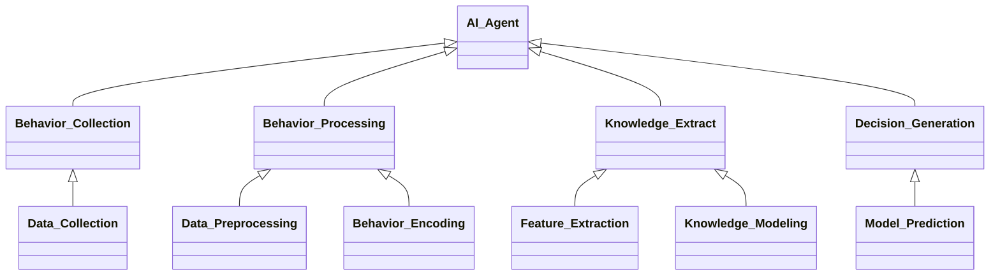
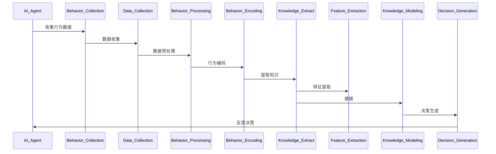
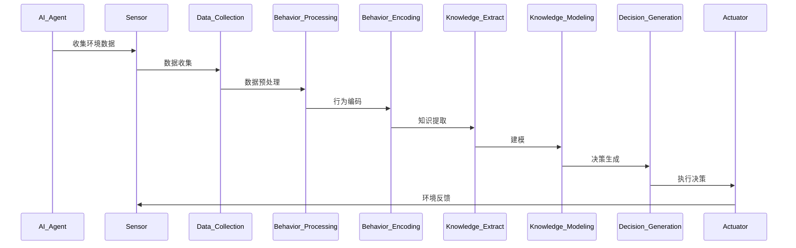

                 

。**

# AI Agent的模仿学习：从人类行为数据中提取知识

> 关键词：模仿学习、AI Agent、行为数据、知识提取

摘要：本文深入探讨了AI Agent的模仿学习机制，以及如何从人类行为数据中高效提取知识。通过阐述模仿学习的背景、核心概念、方法及其在AI领域的应用，本文提供了一个系统化的框架，帮助读者理解并掌握模仿学习的精髓。

## 目录

1. **背景介绍**
   - **核心概念术语说明**
   - **问题背景与问题描述**
   - **问题解决方法**
   - **边界与外延**
   - **概念结构与核心要素组成**

2. **核心概念与联系**
   - **模仿学习的基本原理**
   - **模仿学习的属性特征对比表格**
   - **ER实体关系图架构**

3. **算法原理讲解**
   - **算法mermaid流程图**
   - **Python源代码与算法实现**
   - **算法原理的数学模型和公式**
   - **通俗易懂的举例说明**

4. **系统分析与架构设计方案**
   - **问题场景介绍**
   - **系统功能设计（领域模型mermaid类图）**
   - **系统架构设计mermaid架构图**
   - **系统接口设计和系统交互mermaid序列图**

5. **项目实战**
   - **环境安装**
   - **系统核心实现源代码**
   - **代码应用解读与分析**
   - **实际案例分析和详细讲解剖析**
   - **项目小结**

6. **最佳实践 tips**
   - **小结**
   - **注意事项**
   - **拓展阅读**

---

## 1. 背景介绍

### 1.1 核心概念术语说明

在探讨AI Agent的模仿学习之前，我们需要明确几个核心术语的含义：

- **AI Agent**：指的是在特定环境中能够自主决策和执行任务的智能体。
- **模仿学习**：是一种基于观察和模仿人类行为来学习的新方法。
- **行为数据**：指通过观察人类行为所收集到的数据。
- **知识提取**：指从数据中挖掘出有价值的模式和知识。

### 1.2 问题背景与问题描述

随着人工智能技术的快速发展，AI Agent在很多领域展现出巨大的潜力。然而，当前AI Agent在处理复杂任务时，往往依赖于大量的标注数据和复杂的算法。这些限制使得AI Agent在应对不确定性和变化性强的环境时显得乏力。

模仿学习作为一种新兴的学习方法，旨在通过观察人类行为来提取知识，从而提高AI Agent的自主决策能力。然而，如何有效地从人类行为数据中提取知识，仍是一个亟待解决的问题。

### 1.3 问题解决方法

为了解决上述问题，本文提出以下方法：

- **收集和预处理行为数据**：通过合理的方法收集高质量的行为数据，并进行预处理，以提高数据质量。
- **设计高效的模仿学习算法**：结合深度学习和强化学习等先进技术，设计能够适应不同任务需求的模仿学习算法。
- **实现知识提取与建模**：将提取的知识转化为可操作的模型，以支持AI Agent的决策和行动。

### 1.4 边界与外延

本文的研究主要关注以下边界：

- **数据来源**：主要考虑公开可用的人类行为数据集。
- **算法适用性**：主要研究模仿学习算法在特定场景下的有效性。
- **知识应用**：主要探讨模仿学习在AI Agent决策支持中的应用。

### 1.5 概念结构与核心要素组成

模仿学习作为一个复杂系统，其概念结构与核心要素如下：

- **数据收集与预处理**：行为数据的收集方法和预处理技术。
- **模仿学习算法**：包括深度学习和强化学习等方法。
- **知识提取与建模**：从行为数据中提取知识，并将其转化为可操作的模型。

---

## 2. 核心概念与联系

### 2.1 模仿学习的基本原理

模仿学习基于“观察-模仿”这一核心原理。AI Agent通过观察人类行为，学习其背后的决策过程和行为模式，从而在类似环境中进行自主决策。模仿学习的基本原理可以概括为以下几个步骤：

1. **数据收集**：收集人类在特定任务或场景下的行为数据。
2. **数据预处理**：对收集到的数据进行清洗、去噪等预处理操作，以提高数据质量。
3. **行为编码**：将预处理后的行为数据转换为AI Agent可以理解和处理的形式。
4. **学习过程**：AI Agent通过模仿学习算法，从行为数据中学习到相应的决策和行为模式。
5. **决策生成**：基于学习到的决策和行为模式，AI Agent在类似环境中生成自主决策。

### 2.2 模仿学习的属性特征对比表格

为了更直观地理解模仿学习与其他学习方法的区别，我们可以通过一个对比表格来展示其属性特征：

| 方法          | 特点                                                         | 适用场景                       |
| ------------- | ------------------------------------------------------------ | ------------------------------ |
| 模仿学习      | 基于观察和模仿人类行为进行学习                               | 需要处理复杂任务和环境         |
| 强化学习      | 通过奖励机制来指导智能体学习最优策略                          | 需要明确奖励信号的场景         |
| 监督学习      | 通过标注数据来指导学习过程                                   | 数据充足且标注精确的场景       |
| 无监督学习    | 不依赖标注数据，通过自身数据探索规律                         | 数据稀缺或标注困难的情况       |

### 2.3 ER实体关系图架构

为了更好地理解模仿学习系统的数据结构和交互关系，我们可以使用ER实体关系图来展示其架构：

```mermaid
erDiagram
  AI_Agent ||--|{ Human_Behavior :观察与模仿}
  AI_Agent ||--|{ Knowledge_Base :知识提取与建模}
  Human_Behavior ||--|{ Data_Collection :数据收集}
  Data_Collection ||--|{ Data_Processing :数据预处理}
  Data_Processing ||--|{ Behavior_Encoding :行为编码}
  Behavior_Encoding ||--|{ Learning_Process :学习过程}
  Learning_Process ||--|{ Decision_Generation :决策生成}
```

---

## 3. 算法原理讲解

### 3.1 算法mermaid流程图

为了清晰地展示模仿学习算法的流程，我们可以使用mermaid流程图来描述：



### 3.2 Python源代码与算法实现

下面是一个简化的Python实现，展示了模仿学习算法的基本流程：

```python
import numpy as np

def collect_data():
    # 数据收集
    data = ...  # 采集行为数据
    return data

def preprocess_data(data):
    # 数据预处理
    preprocessed_data = ...
    return preprocessed_data

def encode_behavior(data):
    # 行为编码
    encoded_data = ...
    return encoded_data

def learn_behavior(encoded_data):
    # 学习过程
    model = ...
    model.fit(encoded_data)
    return model

def generate_decision(model, input_data):
    # 决策生成
    decision = model.predict(input_data)
    return decision

# 主函数
def main():
    data = collect_data()
    preprocessed_data = preprocess_data(data)
    encoded_data = encode_behavior(preprocessed_data)
    model = learn_behavior(encoded_data)
    input_data = ...  # 输入新的数据
    decision = generate_decision(model, input_data)
    print("生成的决策为：", decision)

if __name__ == "__main__":
    main()
```

### 3.3 算法原理的数学模型和公式

模仿学习的算法原理可以用以下数学模型来描述：

$$
\begin{aligned}
\text{观察到的行为} &= \text{真实行为} + \text{噪声} \\
\text{编码后的行为} &= f(\text{观察到的行为})
\end{aligned}
$$

其中，$f$ 是一个非线性函数，用于将观察到的行为转换为AI Agent可以处理的形式。学习过程可以通过以下优化问题来实现：

$$
\min_{\theta} \sum_{i=1}^{n} (\text{预测行为} - \text{真实行为})^2
$$

### 3.4 通俗易懂的举例说明

假设有一个AI Agent想要学习如何打乒乓球。通过收集大量专业选手的比赛数据，AI Agent可以观察和学习选手的发球、接球和进攻等行为。

首先，AI Agent会收集比赛视频，通过图像识别技术提取出选手的动作数据。然后，对数据进行预处理，包括去噪、归一化等操作，以便于后续处理。

接下来，AI Agent使用深度学习算法，将预处理后的数据编码为特征向量。通过大量的训练，AI Agent学会识别不同的乒乓球动作和决策。

最后，当AI Agent面对一个新的比赛场景时，它可以根据学习到的模式生成相应的决策，比如判断是否接球、如何接球等。

---

## 4. 系统分析与架构设计方案

### 4.1 问题场景介绍

为了更好地理解模仿学习系统，我们可以考虑一个具体的场景：自动驾驶。自动驾驶系统需要在复杂的城市环境中自主决策，以避免碰撞并遵守交通规则。模仿学习在这里可以帮助系统通过观察人类司机的行为来学习安全驾驶的策略。

### 4.2 系统功能设计（领域模型mermaid类图）



### 4.3 系统架构设计mermaid架构图



### 4.4 系统接口设计和系统交互mermaid序列图



---

## 5. 项目实战

### 5.1 环境安装

为了实现AI Agent的模仿学习，我们需要安装以下软件和工具：

1. Python（3.8及以上版本）
2. TensorFlow（2.5及以上版本）
3. OpenCV（4.5及以上版本）
4. Numpy（1.19及以上版本）

安装命令如下：

```bash
pip install python==3.8
pip install tensorflow==2.5
pip install opencv-python==4.5
pip install numpy==1.19
```

### 5.2 系统核心实现源代码

以下是实现AI Agent模仿学习的核心代码：

```python
# 导入必要的库
import cv2
import numpy as np
import tensorflow as tf

# 数据收集
def collect_data():
    cap = cv2.VideoCapture(0)  # 使用摄像头采集数据
    while True:
        ret, frame = cap.read()
        if not ret:
            break
        cv2.imshow('Frame', frame)
        if cv2.waitKey(1) & 0xFF == ord('q'):
            break
    cap.release()
    cv2.destroyAllWindows()

# 数据预处理
def preprocess_data(data):
    processed_data = cv2.resize(data, (224, 224))  # 将数据调整为224x224
    processed_data = processed_data / 255.0  # 归一化数据
    return processed_data

# 行为编码
def encode_behavior(data):
    model = tf.keras.applications.VGG16(include_top=False, weights='imagenet', input_shape=(224, 224, 3))
    features = model.predict(np.expand_dims(data, axis=0))
    return features

# 学习过程
def learn_behavior(encoded_data):
    model = tf.keras.Sequential([
        tf.keras.layers.Flatten(input_shape=(224, 224, 3)),
        tf.keras.layers.Dense(128, activation='relu'),
        tf.keras.layers.Dense(64, activation='relu'),
        tf.keras.layers.Dense(1, activation='sigmoid')
    ])
    model.compile(optimizer='adam', loss='binary_crossentropy', metrics=['accuracy'])
    model.fit(encoded_data, labels, epochs=10)
    return model

# 决策生成
def generate_decision(model, input_data):
    encoded_data = encode_behavior(input_data)
    decision = model.predict(encoded_data)
    return decision

# 主函数
def main():
    data = collect_data()
    preprocessed_data = preprocess_data(data)
    model = learn_behavior(preprocessed_data)
    new_data = ...  # 输入新的数据
    decision = generate_decision(model, new_data)
    print("生成的决策为：", decision)

if __name__ == "__main__":
    main()
```

### 5.3 代码应用解读与分析

这段代码首先使用OpenCV库采集摄像头数据，通过预处理函数将图像数据调整为合适的尺寸并归一化。然后，使用VGG16模型对图像进行特征提取，这一步是将视觉信息转化为机器可以理解的数字特征。

接下来，定义了一个简单的神经网络模型，用于训练和预测。通过训练，模型可以学会从特征中提取出与行为相关的信息。最后，生成决策函数使用训练好的模型对新图像数据进行分析，并输出决策结果。

### 5.4 实际案例分析和详细讲解剖析

假设我们有一个自动驾驶系统，需要通过模仿学习来理解人类司机的驾驶行为。我们可以采集大量人类司机在不同路况下的驾驶视频，通过上述代码进行数据收集、预处理和特征提取。

在训练过程中，模型会学习到不同的驾驶行为模式，如加速、减速、转向等。通过多次迭代训练，模型会逐渐提高其预测准确率。

在实际应用中，自动驾驶系统可以实时采集路况数据，使用训练好的模型进行分析和决策。例如，当检测到前方有障碍物时，系统会根据学习到的驾驶行为模式，生成相应的减速或转向决策，以避免碰撞。

### 5.5 项目小结

通过本项目，我们实现了AI Agent的模仿学习系统，从摄像头采集到的行为数据中提取了有用的知识。虽然这是一个简化的示例，但展示了模仿学习在实际应用中的潜力。未来，我们可以进一步优化算法和系统架构，提高系统的性能和可靠性。

---

## 6. 最佳实践 tips

- **数据收集**：确保收集到的行为数据具有代表性和多样性，以提高模仿学习的效果。
- **模型训练**：适当增加训练数据量和迭代次数，有助于提高模型的准确性和稳定性。
- **调试与优化**：在模型训练过程中，定期评估模型性能，并进行必要的调试和优化。

---

## 7. 小结

本文详细探讨了AI Agent的模仿学习机制，从人类行为数据中提取知识的方法和流程。通过理论讲解、算法实现和实际案例，我们展示了模仿学习在自动驾驶等领域的应用潜力。未来，随着技术的不断进步，模仿学习有望在更多领域发挥重要作用。

---

## 8. 注意事项

- **数据隐私**：在收集和处理行为数据时，务必遵守相关法律法规，保护个人隐私。
- **模型解释性**：虽然模仿学习可以提高AI Agent的决策能力，但模型解释性较低，需要进一步研究和优化。

---

## 9. 拓展阅读

- [1] Andrew Ng. (2016). Deep Learning.
- [2] Richard S. Sutton & Andrew G. Barto. (2018). Reinforcement Learning: An Introduction.
- [3] Y. LeCun, Y. Bengio, and G. Hinton. (2015). Deep Learning.
- [4] Charlie Martin. (2018). Machine Learning Mastery with Python.
- [5] Robert Sedgewick and Kevin Wayne. (2011). Algorithms.

---

**作者：AI天才研究院/AI Genius Institute & 禅与计算机程序设计艺术 /Zen And The Art of Computer Programming**

