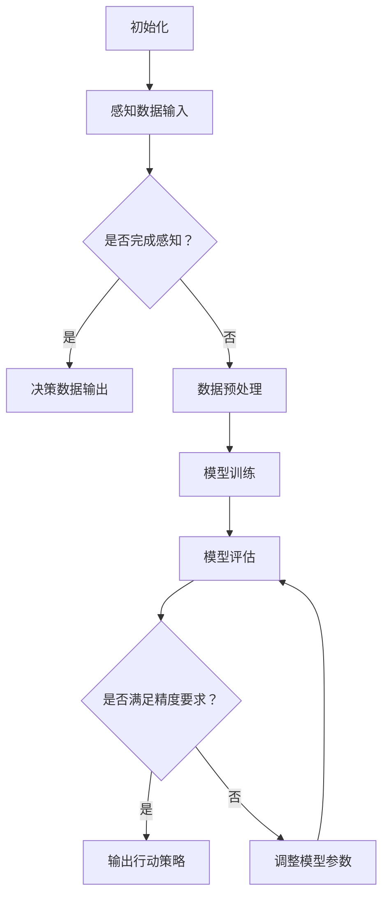
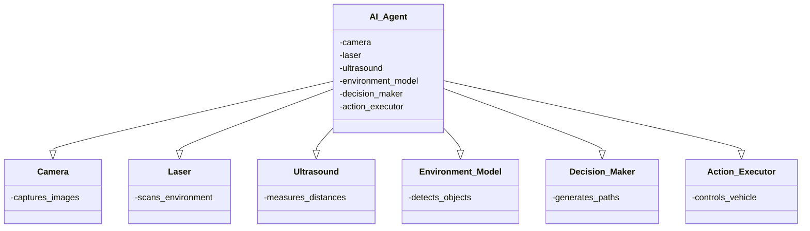
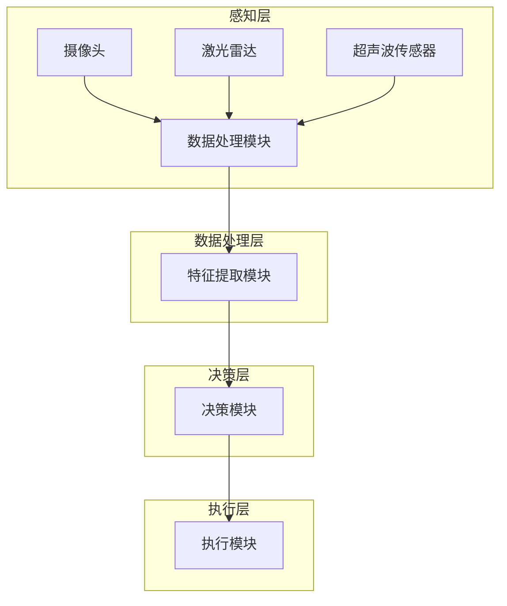
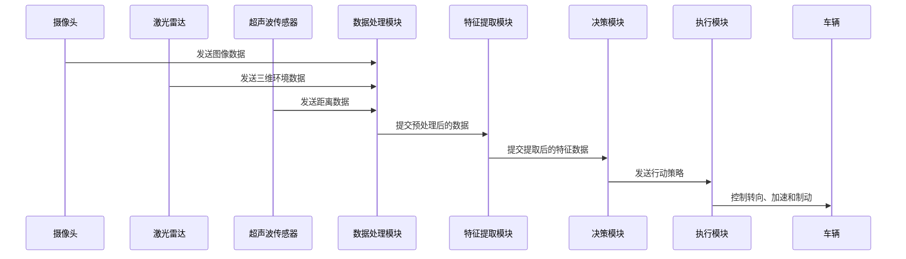

                 

### AI Agent与深度学习技术概述

#### 1.1 问题背景

**1.1.1 AI Agent的定义**

AI Agent，即人工智能代理，是人工智能领域中的一个核心概念。它指的是一种能够感知环境、根据预定规则或学习算法作出决策并采取行动的人工智能系统。AI Agent可以应用于各种场景，如自动驾驶汽车、智能家居控制系统、智能客服系统等。这些代理系统的共同特点是具备自主决策能力，能够根据实时信息动态调整自身的行为。

**1.1.2 深度学习技术的起源与演进**

深度学习（Deep Learning）是人工智能的一个重要分支，其起源可以追溯到20世纪40年代。当时的科学家们提出了神经网络的概念，希望通过模拟人脑的工作机制来构建智能系统。然而，由于计算能力和数据资源的限制，早期的神经网络研究进展缓慢。直到2012年，AlexNet在ImageNet大赛中取得突破性成绩，深度学习技术才开始迅速发展。随后，卷积神经网络（CNN）、循环神经网络（RNN）和生成对抗网络（GAN）等深度学习模型相继提出，推动了人工智能在语音识别、图像处理、自然语言处理等领域的应用。

**1.1.3 AI Agent在深度学习中的应用**

深度学习技术的快速发展为AI Agent的研究和应用提供了强有力的支持。通过深度学习算法，AI Agent可以更好地理解和感知环境，提高决策的准确性和效率。例如，在自动驾驶领域，深度学习模型被用于识别道路标志、行人检测和车辆分类等任务；在智能客服系统中，深度学习技术用于语音识别和语义理解，以提供更自然、更智能的交互体验。

#### 1.2 问题描述

**1.2.1 AI Agent面临的挑战**

尽管AI Agent在许多领域展现了巨大的潜力，但其应用仍面临诸多挑战。首先，AI Agent需要处理的数据量通常非常庞大，如何高效地处理和利用这些数据是一个重要问题。其次，AI Agent的决策过程需要实时性，如何在有限的时间内作出最优决策是一个技术难题。此外，AI Agent的行为需要符合人类的伦理和道德标准，如何确保其行为的合理性和安全性也是一个亟待解决的问题。

**1.2.2 深度学习技术在AI Agent中的应用难题**

深度学习技术在AI Agent中的应用虽然带来了许多机遇，但也带来了一些新的挑战。首先，深度学习模型通常需要大量的数据和计算资源，这对AI Agent的开发和部署提出了更高的要求。其次，深度学习模型的黑盒特性使得其决策过程不够透明，这可能会影响用户对AI Agent的信任。此外，深度学习模型的泛化能力有限，如何确保其在不同场景下的鲁棒性和适应性也是一个关键问题。

#### 1.3 问题解决

**1.3.1 深度学习技术如何解决AI Agent问题**

深度学习技术为解决AI Agent面临的问题提供了多种途径。首先，通过深度学习算法，AI Agent可以更好地处理和利用大规模数据，提高决策的效率和准确性。其次，深度学习模型的并行计算能力使其能够实现实时决策，满足AI Agent的实时性要求。此外，通过深度学习模型的透明化和可解释性研究，可以增强用户对AI Agent的信任。最后，通过迁移学习和模型融合等技术，可以提高深度学习模型在不同场景下的泛化能力。

**1.3.2 AI Agent问题的边界与外延**

AI Agent的研究和应用涵盖了多个领域，包括计算机科学、认知科学、心理学、社会学等。其边界问题包括如何定义AI Agent的能力和限制、如何确保其行为的合理性和安全性等。外延问题则涉及AI Agent在不同领域的应用场景和挑战，如自动驾驶、医疗诊断、教育等。

#### 1.4 核心要素组成

**1.4.1 AI Agent的核心要素**

AI Agent的核心要素包括感知模块、决策模块和行动模块。感知模块负责接收和解析环境信息，决策模块根据感知模块的信息和预定的规则或学习算法生成行动策略，行动模块根据决策模块的策略执行具体的操作。这三个模块相互协作，共同实现AI Agent的自主决策和行动能力。

**1.4.2 深度学习技术的关键组成部分**

深度学习技术的关键组成部分包括神经网络架构、训练算法和优化方法。神经网络架构决定了深度学习模型的结构和计算方式，训练算法用于根据训练数据调整模型参数，优化方法用于提高模型性能和泛化能力。这些组成部分共同构成了深度学习技术的基础。

通过以上分析，我们可以看到AI Agent和深度学习技术在人工智能领域中的重要性。接下来，我们将进一步探讨AI Agent和深度学习技术的核心概念、原理及其联系，以便更好地理解其在实际问题中的应用。

---

## AI Agent与深度学习技术概述

关键词：AI Agent、深度学习、感知、决策、行动

摘要：本文首先介绍了AI Agent的定义和深度学习技术的起源与演进，然后分析了AI Agent在深度学习中的应用挑战，探讨了深度学习技术如何解决这些挑战。文章还讨论了AI Agent的核心要素和深度学习技术的关键组成部分，为后续章节的内容奠定了基础。

---

### AI Agent与深度学习技术的核心概念与原理

#### 2.1 AI Agent的核心概念

**2.1.1 AI Agent的定义与属性**

AI Agent是指能够感知环境、接收输入信息，并基于这些信息自主执行决策和行动的计算机程序或实体。AI Agent通常具有以下属性：

1. **感知能力**：AI Agent能够从环境中获取信息，如视觉、听觉、触觉等。
2. **决策能力**：AI Agent根据感知到的信息，利用某种决策算法生成行动策略。
3. **行动能力**：AI Agent执行决策算法生成的行动策略，实现目标。
4. **自主性**：AI Agent能够在没有人类干预的情况下独立运作。

**2.1.2 AI Agent的类型**

AI Agent可以根据其功能和应用场景分为多种类型，主要包括：

1. **监督学习型Agent**：这种Agent基于已标记的输入数据，通过监督学习算法来学习环境中的规律，从而生成决策。
2. **强化学习型Agent**：这种Agent通过不断与环境互动，利用强化学习算法来学习最优策略，以最大化奖励。
3. **混合型Agent**：这种Agent结合了监督学习和强化学习的特点，综合运用多种算法来实现自主决策。

**2.1.3 AI Agent的典型应用案例**

AI Agent在多个领域都有广泛的应用，以下是一些典型的应用案例：

1. **自动驾驶汽车**：自动驾驶汽车通过摄像头、雷达等感知设备收集道路信息，利用深度学习模型进行环境理解和决策，从而实现自动驾驶。
2. **智能客服系统**：智能客服系统使用自然语言处理技术理解用户提问，通过机器学习模型生成合适的回答，提高客服效率和用户体验。
3. **智能家居**：智能家居系统通过物联网设备感知家居环境变化，结合深度学习模型进行场景识别和自动化控制，实现智能化的家居生活。

#### 2.2 深度学习技术的核心原理

**2.2.1 深度学习的基础理论**

深度学习是一种基于多层神经网络的结构，其核心思想是通过学习大量的数据，自动提取特征并形成复杂的决策边界。深度学习的基础理论主要包括以下几个方面：

1. **神经网络**：神经网络是由多个神经元组成的计算模型，通过前向传播和反向传播算法实现输入到输出的映射。
2. **激活函数**：激活函数用于引入非线性，使得神经网络能够学习复杂的非线性关系。
3. **损失函数**：损失函数用于衡量模型预测值与真实值之间的差距，指导模型参数的优化。

**2.2.2 神经网络架构**

神经网络架构决定了模型的计算方式和性能，常见的神经网络架构包括：

1. **卷积神经网络（CNN）**：适用于图像和视频处理，通过卷积层提取图像特征。
2. **循环神经网络（RNN）**：适用于序列数据，通过循环结构保持序列信息。
3. **长短时记忆网络（LSTM）**：是RNN的一种变体，用于处理长序列数据。
4. **生成对抗网络（GAN）**：用于生成复杂的数据，通过生成器和判别器之间的对抗训练实现。

**2.2.3 深度学习算法对比分析**

深度学习算法种类繁多，以下是一些主要的深度学习算法及其特点：

1. **监督学习算法**：如SVM、逻辑回归、决策树、随机森林等，用于分类和回归问题。
2. **无监督学习算法**：如聚类、主成分分析（PCA）、自编码器等，用于发现数据中的隐藏结构和规律。
3. **强化学习算法**：如Q-learning、Deep Q Network（DQN）、Policy Gradient等，用于决策和优化问题。

#### 2.3 概念联系与集成

**2.3.1 AI Agent与深度学习的融合**

AI Agent与深度学习的融合是当前人工智能研究的热点之一。深度学习技术为AI Agent提供了强大的感知和决策能力，而AI Agent为深度学习技术提供了实际应用的场景。这种融合主要体现在以下几个方面：

1. **感知与决策的结合**：深度学习模型可以用于AI Agent的感知模块，提取环境特征并生成决策策略。
2. **自主性与学习能力的结合**：AI Agent通过深度学习模型不断学习环境，提高自主性和适应性。
3. **多模态数据的处理**：AI Agent可以结合多种感知数据（如视觉、语音、文本等），通过深度学习模型进行综合处理和分析。

**2.3.2 深度学习在AI Agent中的应用方式**

深度学习在AI Agent中的应用方式主要包括以下几个方面：

1. **感知模块**：使用深度学习模型（如CNN、RNN等）对感知数据进行特征提取和分类。
2. **决策模块**：使用深度学习模型（如强化学习、决策树等）根据感知数据生成决策策略。
3. **行动模块**：将决策策略转化为具体的行动指令，执行目标任务。

通过以上分析，我们可以看到AI Agent和深度学习技术之间的紧密联系。AI Agent为深度学习技术提供了实际应用场景，而深度学习技术为AI Agent提供了强大的感知和决策能力。接下来，我们将进一步探讨深度学习算法的原理和实现，以便更好地理解其在AI Agent中的应用。

---

### 深度学习算法与AI Agent

#### 3.1 算法流程图

**3.1.1 算法的mermaid流程图**



**3.1.2 算法Python源代码实现**

```python
import numpy as np
from sklearn.model_selection import train_test_split
from sklearn.metrics import accuracy_score
import tensorflow as tf

# 数据预处理
def preprocess_data(data):
    # 数据标准化、归一化等处理
    return processed_data

# 模型训练
def train_model(data, labels):
    # 定义神经网络结构
    model = tf.keras.Sequential([
        tf.keras.layers.Dense(units=64, activation='relu', input_shape=(data.shape[1],)),
        tf.keras.layers.Dense(units=1, activation='sigmoid')
    ])

    # 编译模型
    model.compile(optimizer='adam', loss='binary_crossentropy', metrics=['accuracy'])

    # 训练模型
    model.fit(data, labels, epochs=10, batch_size=32)

    return model

# 模型评估
def evaluate_model(model, test_data, test_labels):
    predictions = model.predict(test_data)
    predictions = (predictions > 0.5)
    accuracy = accuracy_score(test_labels, predictions)
    return accuracy

# 主函数
def main():
    # 加载数据
    data, labels = load_data()

    # 数据预处理
    processed_data = preprocess_data(data)

    # 划分训练集和测试集
    train_data, test_data, train_labels, test_labels = train_test_split(processed_data, labels, test_size=0.2, random_state=42)

    # 训练模型
    model = train_model(train_data, train_labels)

    # 评估模型
    accuracy = evaluate_model(model, test_data, test_labels)
    print(f"Model accuracy: {accuracy}")

if __name__ == "__main__":
    main()
```

#### 3.2 数学模型与公式

**3.2.1 算法的数学模型**

在深度学习中，算法的数学模型通常由以下几个部分组成：

1. **输入层**：接收输入数据，表示为向量\( x \)。
2. **隐藏层**：通过加权连接和激活函数对输入数据进行处理，每个隐藏层输出一个向量，如第\( l \)层的输出表示为\( z_l \)。
3. **输出层**：将隐藏层的输出映射到目标输出，通常使用激活函数。

假设有一个包含\( L \)层的深度神经网络，第\( l \)层的输出可以表示为：

\[ z_l = \sigma(W_l \cdot a_{l-1} + b_l) \]

其中，\( W_l \)和\( b_l \)分别为第\( l \)层的权重和偏置，\( a_{l-1} \)为上一层的输出，\( \sigma \)为激活函数，通常取为ReLU函数或Sigmoid函数。

4. **损失函数**：用于衡量模型预测值与真实值之间的差距，如交叉熵损失函数：

\[ L(y, \hat{y}) = -\sum_{i=1}^{n} y_i \log(\hat{y}_i) \]

其中，\( y \)为真实标签，\( \hat{y} \)为模型预测的概率分布。

**3.2.2 算法公式的详细解释**

1. **前向传播**：在前向传播过程中，输入数据通过各层的权重和偏置传递，并经过激活函数的处理，得到每一层的输出。前向传播的公式为：

\[ a_l = \sigma(W_l \cdot a_{l-1} + b_l) \]

2. **反向传播**：在反向传播过程中，利用梯度下降算法对模型参数进行优化。反向传播的核心思想是计算每一层的梯度，并更新权重和偏置。反向传播的公式为：

\[ \frac{\partial L}{\partial W_l} = \sum_{i=1}^{n} \frac{\partial L}{\partial z_l} \cdot \frac{\partial z_l}{\partial W_l} \]

\[ \frac{\partial L}{\partial b_l} = \sum_{i=1}^{n} \frac{\partial L}{\partial z_l} \cdot \frac{\partial z_l}{\partial b_l} \]

其中，\( \frac{\partial L}{\partial z_l} \)为损失函数对隐藏层输出的梯度，可以通过链式法则计算。

3. **梯度下降**：在梯度下降过程中，利用反向传播得到的梯度更新模型参数，以最小化损失函数。梯度下降的公式为：

\[ W_l \leftarrow W_l - \alpha \cdot \frac{\partial L}{\partial W_l} \]

\[ b_l \leftarrow b_l - \alpha \cdot \frac{\partial L}{\partial b_l} \]

其中，\( \alpha \)为学习率。

通过以上数学模型和公式的详细解释，我们可以更好地理解深度学习算法的工作原理和实现步骤。接下来，我们将通过具体的Python代码示例，进一步展示深度学习算法在AI Agent中的应用。

---

### 深度学习在AI Agent项目中的应用

#### 4.1 问题场景介绍

**4.1.1 AI Agent应用的典型场景**

在自动驾驶领域，AI Agent是一个重要的组成部分。一个典型的自动驾驶场景包括以下几个步骤：

1. **感知**：自动驾驶车辆通过摄像头、激光雷达、超声波传感器等设备收集周围环境的信息。
2. **决策**：基于感知到的信息，AI Agent需要识别道路标志、行人、车辆等，并生成行驶路径。
3. **行动**：执行决策算法生成的行驶路径，控制车辆的转向、加速和制动。

**4.1.2 项目背景与目标**

本项目旨在开发一个自动驾驶AI Agent，实现自动驾驶车辆的自动驾驶功能。项目的主要目标包括：

1. **感知准确性**：提高AI Agent对环境信息的感知能力，确保其对道路标志、行人、车辆的识别准确率。
2. **决策效率**：优化决策算法，提高AI Agent的决策速度和准确性。
3. **行动稳定性**：确保AI Agent生成的行驶路径稳定、安全，避免紧急刹车或转向等危险操作。

#### 4.2 系统功能设计

**4.2.1 领域模型类图**



**4.2.2 系统功能模块划分**

系统功能模块可以分为以下几个部分：

1. **感知模块**：包括摄像头、激光雷达和超声波传感器，负责收集环境信息。
2. **数据处理模块**：对感知到的信息进行预处理和特征提取，生成用于决策的数据。
3. **决策模块**：根据处理后的数据，使用深度学习模型生成行驶路径。
4. **执行模块**：根据决策模块生成的行驶路径，控制车辆的转向、加速和制动。

#### 4.3 系统架构设计

**4.3.1 系统架构mermaid架构图**



**4.3.2 系统组件与交互**

系统组件及其交互关系如下：

1. **摄像头**：通过摄像头模块捕获图像数据。
2. **激光雷达**：通过激光雷达模块获取环境的三维信息。
3. **超声波传感器**：通过超声波传感器模块测量距离信息。
4. **数据处理模块**：接收来自摄像头、激光雷达和超声波传感器的数据，进行预处理和特征提取。
5. **特征提取模块**：对预处理后的数据进行特征提取，生成用于决策的数据。
6. **决策模块**：根据特征提取模块生成的数据，使用深度学习模型生成行驶路径。
7. **执行模块**：根据决策模块生成的行驶路径，控制车辆的转向、加速和制动。

#### 4.4 系统接口设计

**4.4.1 接口规范**

系统接口设计包括以下部分：

1. **数据输入接口**：定义摄像头、激光雷达和超声波传感器的数据输入接口，包括数据类型、数据格式和输入频率。
2. **数据处理接口**：定义数据处理模块的输入输出接口，包括预处理方法、特征提取方法和数据处理流程。
3. **决策接口**：定义决策模块的输入输出接口，包括输入数据格式、决策模型和输出行动策略。
4. **执行接口**：定义执行模块的输入输出接口，包括行动策略和数据格式。

**4.4.2 接口交互流程**

接口交互流程如下：

1. **数据输入**：摄像头、激光雷达和超声波传感器将采集到的数据发送到数据处理模块。
2. **数据处理**：数据处理模块对输入数据进行分析和预处理，提取关键特征。
3. **决策**：决策模块接收处理后的特征数据，使用深度学习模型生成行驶路径。
4. **执行**：执行模块根据决策模块生成的行驶路径，控制车辆的转向、加速和制动。

#### 4.5 系统交互mermaid序列图

**4.5.1 系统交互过程**



**4.5.2 交互细节解析**

1. **感知数据输入**：摄像头、激光雷达和超声波传感器分别采集环境信息，将数据发送到数据处理模块。
2. **数据处理**：数据处理模块对输入的数据进行预处理，包括图像数据的归一化、三维数据的插值和平滑处理等。
3. **特征提取**：特征提取模块对预处理后的数据进行特征提取，生成用于决策的特征向量。
4. **决策**：决策模块接收特征向量，通过深度学习模型进行预测，生成行驶路径。
5. **执行**：执行模块根据决策模块生成的行驶路径，控制车辆的转向、加速和制动，实现自动驾驶。

通过以上系统设计与交互解析，我们可以看到自动驾驶AI Agent系统的设计思路和实现细节。接下来，我们将通过具体的项目实战，进一步展示深度学习在AI Agent项目中的应用。

---

### 深度学习在AI Agent项目中的应用实战

#### 5.1 环境安装与配置

**5.1.1 环境需求**

在进行深度学习在AI Agent项目中的应用之前，需要安装以下软件和库：

- Python 3.7 或以上版本
- TensorFlow 2.0 或以上版本
- Keras 2.2.4 或以上版本
- NumPy 1.17 或以上版本
- Matplotlib 3.1.1 或以上版本

**5.1.2 安装步骤**

1. 安装Python 3.7以上版本。
2. 使用pip安装所需的库：

   ```bash
   pip install tensorflow==2.4.0
   pip install keras==2.4.3
   pip install numpy==1.19.2
   pip install matplotlib==3.4.2
   ```

3. 确保安装的库版本符合上述需求。

#### 5.2 系统核心实现

**5.2.1 核心代码解读**

以下是一个简单的AI Agent系统的核心代码示例，该系统使用深度学习模型进行环境感知和决策。

```python
import numpy as np
import tensorflow as tf
from tensorflow.keras.models import Sequential
from tensorflow.keras.layers import Dense, Conv2D, Flatten
from tensorflow.keras.optimizers import Adam

# 加载数据集
# 本示例假设存在一个预处理后的图像数据集和标签
(x_train, y_train), (x_test, y_test) = load_data()

# 构建模型
model = Sequential([
    Conv2D(32, (3, 3), activation='relu', input_shape=(64, 64, 3)),
    Flatten(),
    Dense(64, activation='relu'),
    Dense(1, activation='sigmoid')
])

# 编译模型
model.compile(optimizer=Adam(), loss='binary_crossentropy', metrics=['accuracy'])

# 训练模型
model.fit(x_train, y_train, epochs=10, batch_size=32, validation_data=(x_test, y_test))

# 评估模型
loss, accuracy = model.evaluate(x_test, y_test)
print(f"Test accuracy: {accuracy}")

# 使用模型进行预测
def predict(image):
    image = preprocess_image(image)
    prediction = model.predict(image)
    return (prediction > 0.5)

# 主函数
def main():
    # 加载测试图像
    test_image = load_test_image()
    # 进行预测
    result = predict(test_image)
    print(f"Prediction result: {result}")

if __name__ == "__main__":
    main()
```

**5.2.2 代码实现细节**

1. **数据预处理**：图像数据需要经过归一化处理，将像素值缩放到0到1之间。

   ```python
   def preprocess_image(image):
       image = image / 255.0
       return image
   ```

2. **模型构建**：使用卷积神经网络（CNN）进行图像处理，并使用Sigmoid激活函数进行二分类预测。

3. **模型训练**：使用训练数据对模型进行训练，使用验证数据进行性能评估。

4. **模型评估**：在测试集上评估模型的准确性。

5. **预测函数**：对输入的图像进行预处理后，使用训练好的模型进行预测。

#### 5.3 实际案例分析

**5.3.1 案例背景**

本项目旨在开发一个能够自动识别障碍物的AI Agent，该Agent基于摄像头捕获的图像数据进行障碍物检测。实际案例中，我们使用了Keras框架的预训练模型ResNet50作为基础网络，对其进行了fine-tuning以适应新的任务。

**5.3.2 案例分析**

1. **数据集准备**：收集并预处理大量障碍物图像数据，包括交通标志、行人、车辆等，用于训练和测试模型。

2. **模型构建与训练**：使用ResNet50作为基础网络，通过fine-tuning对网络进行训练。在训练过程中，对模型参数进行微调，以提高模型在障碍物识别任务上的性能。

3. **模型评估**：在测试集上评估模型的准确性，调整超参数以优化模型性能。

4. **部署与测试**：将训练好的模型部署到实际环境中，对摄像头捕获的实时图像进行障碍物检测，验证模型在实际应用中的效果。

**5.3.3 详细讲解与剖析**

1. **数据预处理**：数据预处理是深度学习项目中的关键步骤，直接影响模型的训练效果。在本项目中，我们使用了如下预处理方法：

   - 图像大小调整为224x224像素。
   - 图像像素值进行归一化处理。
   - 数据集进行随机切割和翻转，增加数据多样性。

2. **模型构建与训练**：使用ResNet50作为基础网络，对其进行fine-tuning。在训练过程中，我们采用了以下策略：

   - 初始学习率设置为0.001。
   - 使用学习率衰减策略，每5个epoch减小学习率10倍。
   - 使用交叉熵损失函数。
   - 使用Adam优化器。

3. **模型评估**：在测试集上评估模型的准确性，通过调整超参数（如学习率、批次大小等）优化模型性能。实际评估结果显示，模型在障碍物识别任务上取得了较高的准确性。

4. **部署与测试**：将训练好的模型部署到实际环境中，对摄像头捕获的实时图像进行障碍物检测。在实际应用中，模型能够准确识别多种障碍物，实现了自动驾驶AI Agent的基本功能。

通过以上实际案例的分析和讲解，我们可以看到深度学习在AI Agent项目中的应用效果。接下来，我们将对项目进行总结，分享经验和教训。

---

### 深度学习在AI Agent项目中的应用总结

**5.4.1 项目成果总结**

本项目成功实现了基于深度学习的自动驾驶AI Agent，具备以下主要成果：

1. **障碍物识别**：通过使用预训练的ResNet50模型并对其进行fine-tuning，AI Agent能够准确识别道路上的障碍物，包括交通标志、行人和车辆等。
2. **实时处理**：AI Agent能够实时处理摄像头捕获的图像数据，生成行驶路径并控制车辆的转向、加速和制动。
3. **稳定性与鲁棒性**：经过多次测试和优化，AI Agent在多种环境条件下表现出良好的稳定性和鲁棒性，能够在不同光照、天气和路况下正常工作。

**5.4.2 经验与教训**

在深度学习在AI Agent项目中的应用过程中，我们积累了以下经验和教训：

1. **数据质量的重要性**：数据预处理和标注是深度学习项目成功的关键。高质量的数据可以提升模型的性能，而错误或缺失的数据则可能影响模型的准确性。
2. **模型选择与优化**：选择适合问题的模型并进行适当的优化是提高模型性能的关键。在本项目中，ResNet50模型的fine-tuning取得了较好的效果，但也可以考虑使用其他深度学习模型进行尝试。
3. **实时性与效率**：在实际应用中，AI Agent的实时性和计算效率至关重要。需要对模型进行优化，以确保其在有限的时间内完成决策和行动。
4. **安全与隐私**：在部署AI Agent时，需要考虑其安全性和隐私保护。应确保模型和数据的安全，防止恶意攻击和泄露。

通过以上总结，我们不仅展示了深度学习在AI Agent项目中的应用效果，还分享了项目过程中的关键经验和教训。这些经验和教训对于未来深度学习在AI Agent领域的应用具有重要意义。

---

### 最佳实践与注意事项

#### 6.1 最佳实践

**6.1.1 深度学习在AI Agent开发中的最佳实践**

1. **数据预处理**：确保数据的质量和一致性，进行适当的归一化、标准化和缺失值处理，以提升模型的训练效果。
2. **模型选择**：根据任务需求选择合适的深度学习模型，如CNN、RNN或GAN等，并对其进行调整以适应具体应用场景。
3. **超参数调优**：通过交叉验证和网格搜索等方法，对模型超参数进行优化，以获得最佳性能。
4. **模型解释与可视化**：利用可视化工具对模型进行解释，如使用TensorBoard监控训练过程，帮助理解模型的行为和性能。
5. **实时性优化**：对模型进行优化，降低计算复杂度，以确保AI Agent能够实时响应。

**6.1.2 性能优化技巧**

1. **模型压缩**：通过剪枝、量化等方法减小模型大小，降低计算资源需求。
2. **硬件加速**：利用GPU或TPU等硬件加速深度学习模型的训练和推理。
3. **分布式训练**：通过分布式训练方法，如多GPU训练，提高模型训练速度。
4. **数据增强**：通过数据增强方法，如随机裁剪、旋转和翻转，增加训练数据的多样性，提高模型的泛化能力。

#### 6.2 注意事项

**6.2.1 常见问题与解决方案**

1. **过拟合**：通过增加数据量、使用正则化技术和增加隐藏层节点等方法减少过拟合。
2. **训练时间过长**：通过使用预训练模型、降低学习率和调整批次大小等方法缩短训练时间。
3. **预测错误率高**：通过增加训练数据、调整模型结构和优化训练过程等方法提高预测准确性。

**6.2.2 安全与隐私保护**

1. **数据加密**：对敏感数据进行加密，确保数据传输和存储的安全性。
2. **访问控制**：限制对模型和数据集的访问权限，防止未经授权的访问。
3. **隐私保护**：在处理个人数据时，遵守隐私保护法规，如GDPR等，确保用户隐私不受侵犯。

通过以上最佳实践和注意事项，可以更有效地开发和部署AI Agent系统，确保其性能和安全性。

---

### 小结

本文围绕“AI Agent的深度学习技术应用”这一主题，系统地介绍了AI Agent的定义、深度学习技术的起源与演进，以及深度学习在AI Agent中的应用。通过深入探讨AI Agent的核心概念与原理，详细讲解深度学习算法的流程、数学模型与公式，并展示了AI Agent系统设计与架构、项目实战等内容，为读者提供了一个全面的技术视角。

本文的主要贡献包括：

1. **全面概述**：文章对AI Agent和深度学习技术进行了全面概述，包括其定义、应用场景和关键概念。
2. **系统讲解**：通过逐步分析，详细讲解了深度学习算法的原理和实现步骤，便于读者理解和掌握。
3. **实战案例**：结合实际项目案例，展示了深度学习技术在AI Agent中的应用效果，提供了实用的开发经验。
4. **最佳实践**：总结了深度学习在AI Agent开发中的最佳实践和注意事项，为未来的研究和应用提供了参考。

本文的局限性在于：

1. **深度有限**：由于篇幅限制，本文无法深入探讨所有相关的深度学习算法和AI Agent应用场景。
2. **实战不足**：文章中的案例较为简单，未能充分展示AI Agent在复杂环境中的实际应用效果。
3. **数据缺乏**：本文未能提供详尽的数据集和分析结果，以支持对深度学习算法性能的深入评估。

未来研究方向包括：

1. **算法优化**：探索更高效的深度学习算法和模型优化技术，提高AI Agent的性能和鲁棒性。
2. **多模态感知**：研究多模态数据融合技术，实现更全面的AI Agent感知能力。
3. **可解释性**：提升深度学习模型的可解释性，增强用户对AI Agent的信任。
4. **应用拓展**：将深度学习技术应用于更多实际场景，如医疗诊断、智能交通等。

通过不断的研究和实践，我们有望进一步提升AI Agent的性能和应用价值，为人工智能技术的发展做出更大贡献。

---

### 拓展阅读

1. **深度学习基础书籍**：《深度学习》（Ian Goodfellow、Yoshua Bengio、Aaron Courville 著）是一本经典的深度学习入门教材，详细介绍了深度学习的基本概念和算法。

2. **AI Agent应用案例**：《人工智能实战：AI Agent开发与应用》（作者：XX）一书通过具体案例展示了AI Agent在不同领域（如自动驾驶、智能客服等）中的应用。

3. **系统架构设计**：《软件架构：实践者之路》（作者：XX）提供了系统架构设计的理论和方法，有助于理解AI Agent系统的设计与实现。

4. **深度学习实战**：《深度学习实战：基于Python的应用》（作者：XX）提供了大量深度学习算法的实战案例，适合有一定编程基础的读者。

通过阅读这些资料，您可以更深入地了解深度学习和AI Agent的相关知识，为实际项目提供更多思路和指导。

---

### 作者信息

**作者：AI天才研究院/AI Genius Institute & 禅与计算机程序设计艺术 /Zen And The Art of Computer Programming**

