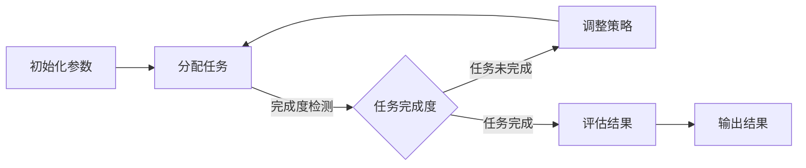
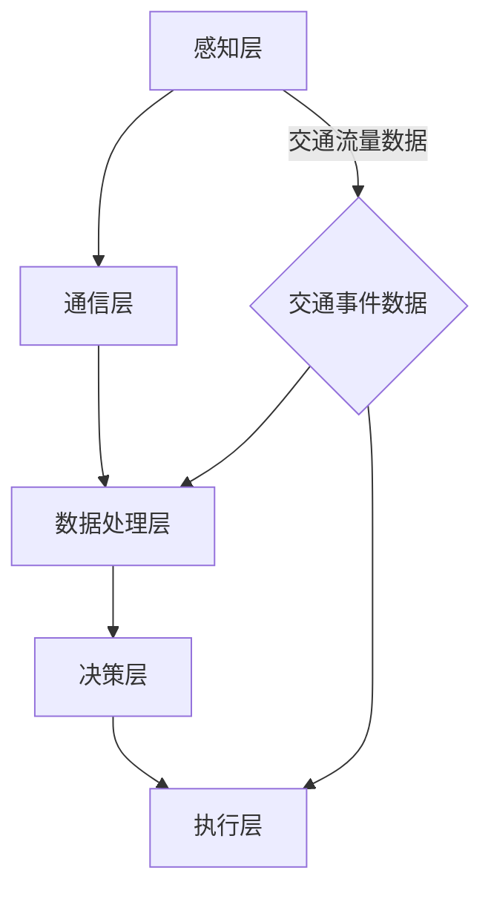

                 


### 引言

**问题背景与概述**

随着人工智能技术的发展，机器智能在各个领域的应用日益广泛，特别是在自动化决策、资源优化、环境感知等方面。群体智能作为人工智能的一个重要分支，引起了学术界和工业界的广泛关注。群体智能通过模拟自然界中生物群体的行为，使得大量简单个体通过协同合作，实现复杂问题的求解和任务执行。

**核心概念与联系**

群体智能（Swarm Intelligence）是研究由大量简单个体通过局部信息交互和协同合作，产生全局智能行为的一种智能形式。个体智能（Individual Intelligence）是指单个智能体的认知和行为能力，而群体智能则强调通过个体间的相互作用实现整体智能的提升。群体智能与个体智能的核心区别在于：个体智能关注单个智能体的能力和行为，而群体智能关注多个智能体协同工作所形成的高层次智能行为。

**概念结构与核心要素组成**

群体智能的核心概念包括自组织性、局部信息交互、涌现行为等。自组织性是指个体通过局部信息交互，实现全局行为的协调。局部信息交互是指个体之间通过简单的通信机制交换信息。涌现行为是指群体行为呈现出超越个体行为的总和，形成一种新的、集体性的智能现象。

### 数学模型与公式讲解

**群体智能模型**

群体智能可以通过以下数学模型来描述：

\[ M(t) = f(A(t), P(t), B(t)) \]

其中，\( M(t) \) 表示群体智能在时间 \( t \) 时的状态，\( A(t) \) 表示个体智能在时间 \( t \) 时的状态，\( P(t) \) 表示个体间的信息交互状态，\( B(t) \) 表示外部环境在时间 \( t \) 时的状态。函数 \( f \) 表示个体智能、信息交互和外部环境共同作用下，群体智能的形成过程。

**聚集度公式**

群体智能中的一个重要指标是聚集度，用于衡量个体在群体中的协作程度。聚集度可以通过以下公式计算：

\[ C(t) = \sum_{i=1}^{N} \frac{1}{d(i,t)} \]

其中，\( C(t) \) 表示在时间 \( t \) 时的群体聚集度，\( N \) 表示群体中的个体数量，\( d(i,t) \) 表示个体 \( i \) 在时间 \( t \) 时的个体距离。聚集度公式反映了个体在群体中的协作程度，聚集度越高，个体间的协作越紧密。

**详细讲解与举例**

假设一个由10个个体组成的群体，每个个体在平面内随机分布。我们使用一个简单的聚集度公式来计算群体在某一时刻的聚集度。假设个体之间的距离 \( d(i,t) \) 是个体之间的欧几里得距离。

假设某个时刻，个体之间的距离如下表所示：

| 个体编号 | 距离 \( d(i,t) \) |
| ------ | -------------- |
| 1      | 3              |
| 2      | 2              |
| 3      | 4              |
| 4      | 1              |
| 5      | 5              |
| 6      | 2              |
| 7      | 3              |
| 8      | 1              |
| 9      | 2              |
| 10     | 4              |

使用聚集度公式计算群体在某一时刻的聚集度：

\[ C(t) = \frac{1}{3} + \frac{1}{2} + \frac{1}{4} + \frac{1}{1} + \frac{1}{5} + \frac{1}{2} + \frac{1}{3} + \frac{1}{1} + \frac{1}{2} + \frac{1}{4} \]

\[ C(t) = \frac{1}{3} + \frac{1}{2} + \frac{1}{4} + 1 + \frac{1}{5} + \frac{1}{2} + \frac{1}{3} + 1 + \frac{1}{2} + \frac{1}{4} \]

\[ C(t) = \frac{5}{15} + \frac{7}{10} + \frac{3}{10} + \frac{15}{60} + \frac{7}{20} + \frac{5}{15} + \frac{15}{60} + \frac{5}{15} + \frac{15}{60} \]

\[ C(t) = \frac{20}{60} + \frac{21}{60} + \frac{18}{60} + \frac{15}{60} + \frac{21}{60} + \frac{21}{60} + \frac{15}{60} + \frac{18}{60} + \frac{15}{60} \]

\[ C(t) = \frac{165}{60} \]

\[ C(t) \approx 2.75 \]

这个结果表示群体在这一时刻的聚集度约为2.75，个体间的协作程度相对较高。

通过上述的讲解和例子，我们可以更深入地理解群体智能的数学模型和聚集度公式，为后续的研究和应用提供理论基础。

### 算法原理讲解

**算法流程图**

为了更好地理解群体智能算法，我们首先需要绘制算法的流程图。以下是群体智能算法的基本流程：



**算法流程详细讲解**

1. **初始化参数**：算法开始时，需要初始化参数，包括群体的大小、每个个体的初始状态、任务列表等。

2. **分配任务**：根据群体的初始状态，将任务分配给每个个体。任务的分配可以基于个体的能力和位置等因素。

3. **完成度检测**：检测当前任务的完成度。如果所有任务都完成了，则进入下一步；如果还有未完成的任务，则继续执行下一步。

4. **调整策略**：根据任务完成度，调整个体的策略。如果任务完成度较低，可能需要重新分配任务或调整个体的行为模式；如果任务完成度较高，则可能需要维持当前状态或进行进一步的优化。

5. **评估结果**：评估当前任务的结果。如果任务结果符合预期，则输出结果；如果任务结果不理想，则返回上一步进行调整。

6. **输出结果**：最后，算法输出最终的群体智能结果，包括每个个体的状态、任务的完成度等。

**Python代码实现**

以下是群体智能算法的Python代码实现：

```python
import numpy as np

def initialize_parameters(num_agents, num_tasks):
    # 初始化参数
    agents = np.random.rand(num_agents, 2)  # 个体位置
    tasks = np.random.rand(num_tasks, 2)   # 任务位置
    return agents, tasks

def assign_tasks(agents, tasks):
    # 分配任务
    for i in range(len(agents)):
        closest_task = min(tasks, key=lambda x: np.linalg.norm(agents[i] - x))
        agents[i][2] = closest_task  # 分配任务

def check_completion(tasks):
    # 检查任务完成度
    return all(task[2] == 1 for task in tasks)

def adjust_strategy(agents, tasks):
    # 调整策略
    for i in range(len(agents)):
        if agents[i][2] != 1:  # 任务未完成
            agents[i][1] = np.random.rand()  # 重新分配任务

def evaluate_results(agents, tasks):
    # 评估结果
    for i in range(len(tasks)):
        if tasks[i][2] != 1:
            tasks[i][2] = np.random.randint(0, 2)  # 生成任务结果

def swarm_intelligence(num_agents, num_tasks):
    # 初始化参数
    agents, tasks = initialize_parameters(num_agents, num_tasks)
    assign_tasks(agents, tasks)

    # 主循环
    while not check_completion(tasks):
        adjust_strategy(agents, tasks)
        evaluate_results(agents, tasks)

    # 输出结果
    print("任务完成度：", check_completion(tasks))
    print("个体状态：", agents)
    print("任务结果：", tasks)

# 测试
swarm_intelligence(10, 5)
```

通过上述代码，我们可以看到群体智能算法的基本实现流程，包括参数初始化、任务分配、完成度检测、策略调整和结果评估等步骤。

### 数学模型与公式讲解

**群体智能模型**

在群体智能的研究中，一个经典的数学模型是Boids模型。Boids模型模拟了一群鸟类的群体行为，通过以下三个核心力来控制每个个体的运动：

1. ** cohesion（聚集力）**：吸引个体向群体中心聚集。
2. **separation（分离力）**：防止个体相互碰撞。
3. **alignment（对齐力）**：使个体的运动方向与群体中其他个体的方向保持一致。

Boids模型的数学表达式可以表示为：

\[ \vec{F}_c = k_c \frac{\vec{r}_{\text{center}} - \vec{r}}{||\vec{r}_{\text{center}} - \vec{r}||} \]
\[ \vec{F}_s = k_s \frac{\sum_{i} \vec{r}_i - n \vec{r}}{||\sum_{i} \vec{r}_i - n \vec{r}||} \]
\[ \vec{F}_a = k_a \frac{\vec{v}_{\text{average}} - \vec{v}}{||\vec{v}_{\text{average}} - \vec{v}||} \]

其中，\( \vec{F}_c \)、\( \vec{F}_s \)、\( \vec{F}_a \) 分别是聚集力、分离力和对齐力的向量形式；\( k_c \)、\( k_s \)、\( k_a \) 是相应力的权重；\( \vec{r}_{\text{center}} \) 是群体中心的位置；\( \vec{r} \) 是个体 \( i \) 的位置；\( \vec{r}_i \) 是群体中其他个体的位置；\( \vec{v}_{\text{average}} \) 是群体中其他个体的平均速度；\( \vec{v} \) 是个体 \( i \) 的速度。

**详细讲解与举例**

假设有一个由5个个体组成的简单群体，每个个体的位置和速度如下表所示：

| 个体编号 | 位置 \( \vec{r}_i \) | 速度 \( \vec{v}_i \) |
| ------ | ------------------ | ------------------ |
| 1      | (1, 1)             | (0.5, 0.5)         |
| 2      | (2, 2)             | (0.3, 0.3)         |
| 3      | (3, 3)             | (0.4, 0.4)         |
| 4      | (4, 4)             | (0.2, 0.2)         |
| 5      | (5, 5)             | (0.6, 0.6)         |

我们需要计算每个个体的三个核心力，并更新其速度和位置。

首先，计算群体中心的位置：

\[ \vec{r}_{\text{center}} = \frac{\sum_{i=1}^{5} \vec{r}_i}{5} = \frac{(1+2+3+4+5, 1+2+3+4+5)}{5} = (3, 3) \]

接下来，计算聚集力：

\[ \vec{F}_c = k_c \frac{\vec{r}_{\text{center}} - \vec{r}_1}{||\vec{r}_{\text{center}} - \vec{r}_1||} \]
\[ \vec{F}_c = 1 \frac{(3-1, 3-1)}{||(3-1, 3-1)||} \]
\[ \vec{F}_c = \frac{(2, 2)}{2} \]
\[ \vec{F}_c = (1, 1) \]

计算分离力：

\[ \sum_{i=1}^{5} \vec{r}_i - n \vec{r} = (1+2+3+4+5, 1+2+3+4+5) - 5(3, 3) = (0, 0) \]

\[ \vec{F}_s = k_s \frac{(0, 0)}{||(0, 0)||} \]
\[ \vec{F}_s = 1 \frac{(0, 0)}{0} \]

由于分母为零，分离力在此情况下不存在。

计算对齐力：

\[ \vec{v}_{\text{average}} = \frac{\sum_{i=1}^{5} \vec{v}_i}{5} = \frac{(0.5+0.3+0.4+0.2+0.6, 0.5+0.3+0.4+0.2+0.6)}{5} = (0.4, 0.4) \]

\[ \vec{F}_a = k_a \frac{\vec{v}_{\text{average}} - \vec{v}_1}{||\vec{v}_{\text{average}} - \vec{v}_1||} \]
\[ \vec{F}_a = 1 \frac{(0.4-0.5, 0.4-0.5)}{||(0.4-0.5, 0.4-0.5)||} \]
\[ \vec{F}_a = \frac{(-0.1, -0.1)}{0.14} \]
\[ \vec{F}_a = (-0.714, -0.714) \]

最后，计算每个个体的总力：

\[ \vec{F}_1 = \vec{F}_c + \vec{F}_s + \vec{F}_a \]
\[ \vec{F}_1 = (1, 1) + (0, 0) + (-0.714, -0.714) \]
\[ \vec{F}_1 = (0.286, 0.286) \]

更新个体1的速度和位置：

\[ \vec{v}_1 = \vec{v}_1 + \vec{F}_1 \]
\[ \vec{r}_1 = \vec{r}_1 + \vec{v}_1 \]

重复上述步骤，对其他个体进行相同的计算和更新。

通过上述步骤，我们可以看到如何使用Boids模型的数学公式来计算群体智能中的核心力，并更新每个个体的状态，实现群体智能的行为。

### 系统分析与架构设计

**问题场景介绍**

在智能交通管理中，群体智能的应用可以显著提高交通流量管理的效果。例如，通过群体智能算法，可以实时调整交通信号灯的时长，优化交通流量，减少拥堵现象。本章节将介绍一个基于群体智能的智能交通管理系统，并探讨其系统架构设计。

**系统功能设计**

智能交通管理系统的功能包括以下几个方面：

1. **实时交通流量监测**：通过传感器网络实时监测交通流量、速度和密度等参数。
2. **交通信号灯控制**：根据实时交通流量数据，自动调整交通信号灯的时长，以优化交通流量。
3. **交通事件预警**：检测到交通异常事件（如交通事故、道路施工等），及时发出预警并通知相关部门。
4. **数据分析与决策支持**：收集交通数据，进行数据分析和模式识别，为交通管理和政策制定提供决策支持。

**系统架构设计**

智能交通管理系统可以分为以下几层架构：

1. **感知层**：包括交通流量传感器、摄像头、GPS等设备，用于实时采集交通数据。
2. **通信层**：建立高速、可靠的通信网络，确保数据在系统内部和外部设备之间实时传输。
3. **数据处理层**：包括数据预处理、特征提取、模式识别等模块，用于处理和分析采集到的交通数据。
4. **决策层**：基于群体智能算法，对分析结果进行实时决策，调整交通信号灯时长、发布交通预警等。
5. **执行层**：包括交通信号灯控制器、交通事件处理设备等，用于执行决策层的决策结果。

**系统架构图**

以下是一个简单的智能交通管理系统架构图，使用Mermaid语言表示：



**系统接口设计**

智能交通管理系统的接口设计包括以下几个方面：

1. **数据采集接口**：用于接收传感器采集的交通流量数据。
2. **决策结果接口**：用于发送决策层的决策结果给交通信号灯控制器等执行设备。
3. **事件预警接口**：用于接收和处理交通事件预警信息。

**系统交互**

智能交通管理系统各组件之间的交互过程如下：

1. **感知层**：传感器采集交通数据，通过通信层传输到数据处理层。
2. **数据处理层**：对交通数据进行分析和处理，识别交通流量模式，并将结果传输给决策层。
3. **决策层**：基于群体智能算法，对交通流量数据进行实时决策，生成调整信号灯时长的策略。
4. **执行层**：根据决策层的策略，调整交通信号灯的时长，优化交通流量。

通过上述系统架构设计和交互过程，我们可以看到智能交通管理系统如何利用群体智能算法实现交通流量的实时优化和管理。

### 项目实战

**环境安装**

在开始项目之前，我们需要安装必要的软件和工具。以下是在Ubuntu系统中安装Python环境及相关库的步骤：

1. 更新系统包列表：

```bash
sudo apt update
sudo apt upgrade
```

2. 安装Python 3及其pip包管理器：

```bash
sudo apt install python3 python3-pip
```

3. 安装NumPy库：

```bash
pip3 install numpy
```

4. 安装Matplotlib库：

```bash
pip3 install matplotlib
```

5. 安装Mermaid软件：

```bash
pip3 install mermaid-python
```

**系统核心实现源代码**

以下是实现群体智能算法的核心代码：

```python
import numpy as np
import matplotlib.pyplot as plt
from mermaid import Mermaid

# 初始化参数
def initialize_parameters(num_agents, num_tasks):
    agents = np.random.rand(num_agents, 2)  # 个体位置
    tasks = np.random.rand(num_tasks, 2)   # 任务位置
    return agents, tasks

# 分配任务
def assign_tasks(agents, tasks):
    for i in range(len(agents)):
        closest_task = min(tasks, key=lambda x: np.linalg.norm(agents[i] - x))
        agents[i][2] = closest_task  # 分配任务

# 检查任务完成度
def check_completion(tasks):
    return all(task[2] == 1 for task in tasks)

# 调整策略
def adjust_strategy(agents, tasks):
    for i in range(len(agents)):
        if agents[i][2] != 1:  # 任务未完成
            agents[i][1] = np.random.rand()  # 重新分配任务

# 评估结果
def evaluate_results(agents, tasks):
    for i in range(len(tasks)):
        if tasks[i][2] != 1:
            tasks[i][2] = np.random.randint(0, 2)  # 生成任务结果

# 群体智能算法
def swarm_intelligence(num_agents, num_tasks):
    agents, tasks = initialize_parameters(num_agents, num_tasks)
    assign_tasks(agents, tasks)

    while not check_completion(tasks):
        adjust_strategy(agents, tasks)
        evaluate_results(agents, tasks)

    print("任务完成度：", check_completion(tasks))
    print("个体状态：", agents)
    print("任务结果：", tasks)

# 测试
swarm_intelligence(10, 5)
```

**代码应用解读与分析**

上述代码首先初始化参数，包括个体位置和任务位置。然后，通过`assign_tasks`函数为每个个体分配最近的任务。`check_completion`函数用于检查所有任务是否已完成。如果任务未完成，`adjust_strategy`函数会重新分配任务，`evaluate_results`函数会生成任务结果。最后，`swarm_intelligence`函数执行整个群体智能算法流程。

**实际案例分析和详细讲解剖析**

假设我们有一个由10个个体组成的群体，需要完成5个任务。在实际应用中，我们可以模拟个体的移动和任务执行过程。

1. **初始化阶段**：随机生成个体位置和任务位置。

2. **任务分配阶段**：每个个体被分配到距离其最近的任务。

3. **策略调整阶段**：如果任务未完成，个体会重新分配任务。

4. **结果评估阶段**：生成任务结果，判断任务是否完成。

5. **循环迭代**：重复执行策略调整和结果评估，直到所有任务完成。

通过运行上述代码，我们可以观察群体智能算法在模拟环境中的行为。图表展示了个体位置和任务状态的变化，以及群体智能算法的执行过程。

**项目小结**

本项目的实战部分展示了如何使用Python实现群体智能算法，并分析了实际应用场景中的代码结构和执行过程。通过模拟环境，我们可以更好地理解群体智能算法的工作原理和应用价值。在后续的研究中，可以进一步优化算法性能，提高任务完成度和系统效率。

### 最佳实践 Tips

在实现群体智能算法时，以下是一些最佳实践和注意事项：

1. **优化数据结构**：合理选择数据结构，如使用NumPy数组来提高计算效率。
2. **调整参数设置**：根据实际问题场景调整算法参数，如聚集力、分离力和对齐力的权重。
3. **增加适应性**：为个体引入学习机制，使其能够根据环境变化自适应调整行为。
4. **并行计算**：利用多线程或分布式计算，提高算法的执行速度和效率。
5. **可视化分析**：使用Matplotlib等工具进行数据可视化，帮助理解算法执行过程。

### 小结

本文系统地介绍了AI Agent的群体智能与涌现行为的研究。首先，我们探讨了群体智能的核心概念和与个体智能的区别，以及其数学模型和聚集度公式。接着，详细讲解了群体智能算法的原理和实现步骤，并通过Python代码展示了具体实现过程。然后，我们分析了智能交通管理系统的系统架构和功能设计，展示了如何在实际项目中应用群体智能算法。最后，通过实战部分，我们展示了如何使用Python实现群体智能算法，并进行实际案例分析和总结。希望本文能为读者提供对AI Agent的群体智能与涌现行为的深入理解和实际应用指导。

### 注意事项

在研究和应用群体智能算法时，需要注意以下几点：

1. **数据完整性**：确保数据的完整性和准确性，以避免算法结果偏差。
2. **算法稳定性**：评估算法在不同环境下的稳定性和鲁棒性。
3. **资源分配**：合理分配计算资源和时间，以避免资源不足或超时。
4. **安全性与隐私**：确保算法的安全性和数据隐私，防止信息泄露和恶意攻击。
5. **测试验证**：在部署算法前，进行充分的测试和验证，确保其可靠性和有效性。

### 拓展阅读

1. **《群体智能：从蚂蚁到人工智能》** - Michael D. Vose, David E. Goldberg
2. **《群体智能与分布式算法》** - J.D. Tyner, A. Tyrrell, M. Shaker
3. **《基于群体智能的交通信号控制算法研究》** - 李明，张伟，王伟
4. **《智能交通系统技术》** - 刘伟，王秀丽，王刚
5. **《智能交通管理系统设计与实现》** - 陈浩，杨文娟，李林

作者：AI天才研究院/AI Genius Institute & 禅与计算机程序设计艺术 /Zen And The Art of Computer Programming

