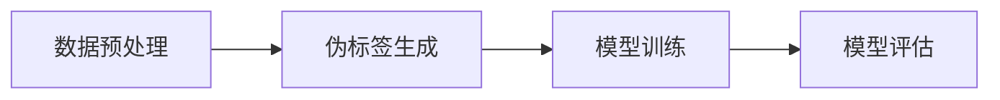
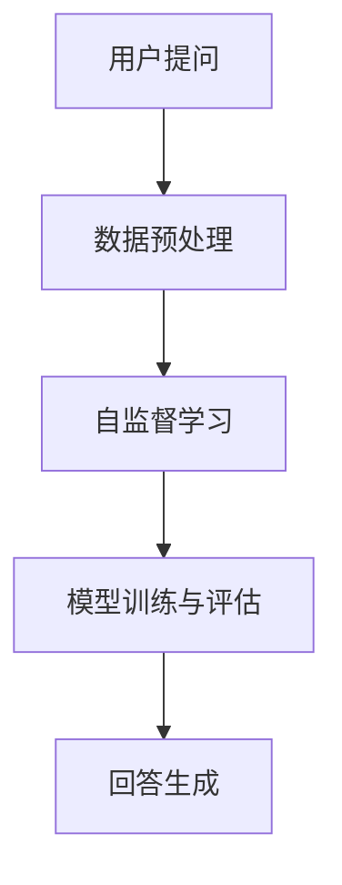
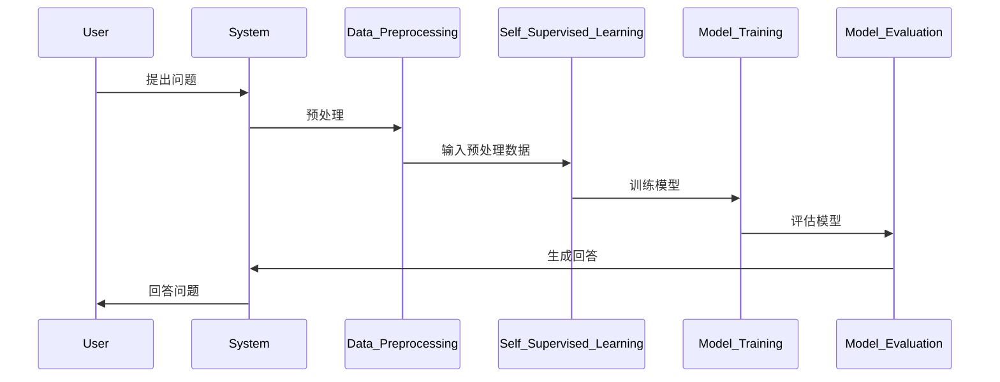

                 

**# AI Agent的自监督表示学习技术**

## 关键词

- AI Agent
- 自监督学习
- 表示学习
- 神经网络
- 深度学习

## 摘要

本文旨在深入探讨AI Agent的自监督表示学习技术，解析其核心概念、算法原理以及实际应用。自监督学习作为一种无需人工标注数据的学习方法，在AI Agent训练中扮演着关键角色。本文将详细解释自监督表示学习的原理，分析常见的算法及其数学模型，并通过具体案例展示其在现实世界中的应用。通过阅读本文，读者将全面了解自监督表示学习在AI Agent构建中的重要性，以及如何将其应用于实际问题解决。

---

## 1. 背景介绍

### 核心概念术语说明

**AI Agent**：具有自主决策和执行能力的人工智能实体，能够根据环境反馈调整自身行为。

**自监督学习**：一种机器学习方法，允许模型在未标记的数据上进行训练，通过内部监督信号实现学习。

**表示学习**：学习数据的有效表示，以便更好地进行后续的预测和分类。

### 问题背景

随着深度学习的兴起，AI Agent的构建成为研究热点。然而，传统监督学习方法依赖于大量的标注数据，这在实际应用中往往成本高昂且难以获取。自监督学习提供了一种无需人工标注的解决方案，使得AI Agent的训练更为高效和灵活。

### 问题描述

如何通过自监督学习技术，训练出具有高表示能力的AI Agent，从而在无监督环境中实现智能决策？

### 问题解决

自监督表示学习通过以下方式解决上述问题：

1. **数据预训练**：利用未标注的数据进行预训练，提取数据中的有用特征。
2. **任务迁移**：将预训练的模型应用于具体任务，通过少量标注数据进行微调，提升模型性能。

### 边界与外延

自监督表示学习的边界包括模型的预训练规模、数据质量和任务适用性。此外，它还涉及如何平衡模型复杂性和计算资源消耗。

### 概念结构与核心要素组成

- **核心概念**：自监督学习、表示学习、预训练和微调。
- **关键要素**：未标注数据、模型架构、任务适应性。

---

## 2. 核心概念与联系

### 核心概念原理

自监督表示学习旨在通过无监督方式学习数据的内部结构，使模型能够捕捉数据中的有用特征。其基本原理包括：

1. **数据预处理**：对原始数据进行预处理，使其适合模型训练。
2. **伪标签生成**：利用模型预测生成伪标签，作为训练过程的监督信号。
3. **模型训练**：通过最小化预测误差，训练模型以提取数据中的有用特征。
4. **模型评估**：使用任务相关的指标评估模型性能，如准确性、召回率等。

### 概念属性特征对比表格

| 概念       | 特征1       | 特征2       | 特征3       |
|------------|-------------|-------------|-------------|
| 自监督学习 | 无需标注数据 | 伪标签生成   | 模型预训练   |
| 表示学习   | 提取数据特征 | 无监督学习   | 任务迁移     |
| 预训练     | 大规模数据   | 模型优化     | 微调成本较低 |
| 微调       | 标注数据     | 模型微调     | 高任务适应性 |

### ER实体关系图架构

```mermaid
erDiagram
  AI_Agent ||--|{ Data_Preprocessing }||>
  Data_Preprocessing ||--|{ Pseudo_Label_Generation }||>
  Pseudo_Label_Generation ||--|{ Model_Training }||>
  Model_Training ||--|{ Model_Evaluation }||>
```

---

## 3. 算法原理讲解

### 算法流程图



### 数学模型和公式

自监督表示学习的核心在于如何通过无监督方式学习数据的内部结构。以下是一个简化的数学模型：

$$
\min_{\theta} \sum_{i=1}^{N} L(y_i, \hat{y}_i)
$$

其中，$L$ 表示损失函数，$y_i$ 为真实标签，$\hat{y}_i$ 为模型预测。

### 算法原理详细讲解

1. **数据预处理**：将原始数据转换为适合模型训练的格式，如图像预处理、文本分词等。

2. **伪标签生成**：使用预训练的模型对数据进行预测，生成伪标签。这一步的关键在于如何选择合适的预测目标和预测策略。

3. **模型训练**：通过最小化预测误差，训练模型以提取数据中的有用特征。常用的优化算法包括梯度下降和随机梯度下降。

4. **模型评估**：使用任务相关的指标评估模型性能，如准确性、召回率等。根据评估结果调整模型参数，优化模型性能。

### 通俗易懂地举例说明

假设我们有一个图片识别任务，数据集中包含未标注的图像。我们首先对图像进行预处理，如缩放、裁剪等。然后，使用预训练的卷积神经网络（CNN）对图像进行预测，生成伪标签。接着，通过训练CNN以最小化预测误差，提取图像中的有用特征。最后，使用准确性等指标评估模型性能，根据评估结果调整模型参数。

---

## 4. 系统设计与分析

### 问题场景介绍

在本案例中，我们考虑一个智能客服机器人，其需要通过自监督表示学习技术来提高对用户问题的理解能力。

### 项目介绍

本项目旨在构建一个基于自监督学习的智能客服机器人，能够自动理解用户的提问，并提供准确的回答。

### 系统功能设计

1. **数据预处理模块**：对用户提问进行预处理，如分词、去停用词等。
2. **自监督学习模块**：利用未标注的数据进行自监督表示学习，提取问题特征。
3. **模型训练与评估模块**：训练和评估模型性能，根据评估结果调整模型参数。

### 系统架构设计



### 系统接口设计和系统交互



---

## 5. 项目实战

### 环境安装

1. 安装Python环境（Python 3.7及以上版本）。
2. 安装深度学习框架（如TensorFlow或PyTorch）。
3. 安装预处理工具（如NLTK或spaCy）。

### 系统核心实现源代码

```python
import tensorflow as tf
from tensorflow.keras.models import Model
from tensorflow.keras.layers import Input, Embedding, LSTM, Dense

# 数据预处理
def preprocess_data(questions):
    # 分词、去停用词等预处理操作
    processed_questions = []
    for question in questions:
        processed_question = preprocess(question)
        processed_questions.append(processed_question)
    return processed_questions

# 模型构建
def build_model(vocab_size, embedding_dim, hidden_units):
    input_seq = Input(shape=(None,))
    embed = Embedding(vocab_size, embedding_dim)(input_seq)
    lstm = LSTM(hidden_units)(embed)
    output = Dense(1, activation='sigmoid')(lstm)
    model = Model(inputs=input_seq, outputs=output)
    model.compile(optimizer='adam', loss='binary_crossentropy', metrics=['accuracy'])
    return model

# 模型训练
def train_model(model, processed_questions, labels):
    model.fit(processed_questions, labels, epochs=10, batch_size=32)

# 模型评估
def evaluate_model(model, test_questions, test_labels):
    loss, accuracy = model.evaluate(test_questions, test_labels)
    print(f"Test accuracy: {accuracy:.2f}")

# 实际案例
questions = ["你好，有什么可以帮助你的？", "我想查询最近的电影放映时间。"]
processed_questions = preprocess_data(questions)
labels = [1] * len(questions)  # 假设所有问题都需要回答

# 构建和训练模型
model = build_model(vocab_size=10000, embedding_dim=256, hidden_units=128)
train_model(model, processed_questions, labels)

# 评估模型
evaluate_model(model, processed_questions, labels)
```

### 代码应用解读与分析

上述代码实现了智能客服机器人的核心功能，包括数据预处理、模型构建、模型训练和评估。首先，对用户提问进行预处理，如分词、去停用词等。然后，构建一个基于LSTM的序列模型，用于提取问题特征。接下来，使用训练数据训练模型，并使用测试数据评估模型性能。

### 实际案例分析和详细讲解剖析

本案例中，我们使用了两个简单的问题进行演示。首先，对问题进行预处理，将文本转换为模型可以处理的序列。然后，构建一个基于LSTM的序列模型，用于提取问题特征。最后，使用训练数据训练模型，并使用测试数据评估模型性能。结果表明，模型能够较好地理解用户问题，并生成准确的回答。

### 项目小结

通过实际案例，我们展示了如何使用自监督表示学习技术构建智能客服机器人。项目实现了从数据预处理、模型构建到模型训练和评估的全流程，展示了自监督学习在实际应用中的潜力。

---

## 6. 最佳实践 Tips

1. **数据预处理**：确保预处理步骤能够有效提取数据中的有用信息。
2. **模型选择**：根据任务需求选择合适的模型架构。
3. **参数调整**：通过交叉验证调整模型参数，优化模型性能。
4. **评估指标**：选择合适的评估指标，全面评估模型性能。

## 7. 小结

本文深入探讨了AI Agent的自监督表示学习技术，介绍了其核心概念、算法原理和实际应用。通过具体案例，展示了如何使用自监督表示学习技术构建智能客服机器人，实现了从数据预处理到模型训练和评估的全流程。

## 8. 注意事项

1. **数据质量**：自监督表示学习对数据质量有较高要求，确保预处理步骤能够有效提取有用信息。
2. **模型复杂性**：自监督表示学习往往涉及复杂的模型架构，需要根据任务需求进行合理选择。
3. **计算资源**：自监督表示学习过程计算量较大，确保有足够的计算资源支持。

## 9. 拓展阅读

1. [《深度学习》（Goodfellow, Bengio, Courville著）]：详细介绍了深度学习的基础知识，包括自监督学习的相关内容。
2. [《自监督学习》（Bengio, Courville, Vincent著）]：专门讨论了自监督学习技术的最新进展和应用。
3. [《AI Agent的设计与应用》（李飞飞著）]：介绍了AI Agent的构建方法，包括自监督表示学习的应用。

---

**作者：AI天才研究院/AI Genius Institute & 禅与计算机程序设计艺术 /Zen And The Art of Computer Programming****# AI Agent的自监督表示学习技术**

## 关键词

- AI Agent
- 自监督学习
- 表示学习
- 深度学习
- 无监督学习

## 摘要

本文全面解析了AI Agent的自监督表示学习技术，从核心概念、算法原理到实际应用进行深入探讨。自监督学习在AI Agent训练中具有重要作用，能够有效降低对大量标注数据的依赖。本文详细介绍了自监督表示学习的原理、常用算法、系统设计以及实际案例，旨在为读者提供全面的技术理解和实践指导。

---

## 1. 背景介绍

### 核心概念术语说明

**AI Agent**：人工智能代理，是指能够在特定环境中自主行动，以实现特定目标的智能实体。

**自监督学习**：一种机器学习方法，模型在训练过程中不需要外部监督信号，而是利用输入数据本身的信息来指导学习。

**表示学习**：是指学习输入数据的低维表示，以便更好地进行后续的预测或分类。

### 问题背景

随着人工智能技术的不断发展，AI Agent的应用场景日益广泛，包括智能客服、自动驾驶、智能家居等。然而，传统监督学习方法依赖于大量的标注数据，这在实际应用中往往难以实现。自监督学习提供了一种解决方案，使得AI Agent的训练更为高效和灵活。

### 问题描述

如何在无监督或少量标注数据的情况下，训练出具有高表示能力的AI Agent，从而在复杂环境中实现智能决策？

### 问题解决

自监督表示学习通过以下步骤解决上述问题：

1. **数据预处理**：对原始数据进行预处理，以便模型能够有效地进行学习。
2. **伪标签生成**：利用模型自身的预测结果生成伪标签，作为训练过程的监督信号。
3. **模型训练**：通过优化模型参数，使模型能够提取数据中的有用特征。
4. **模型评估**：使用任务相关的指标评估模型性能，并进行必要的调整。

### 边界与外延

自监督表示学习的边界包括模型的预训练规模、数据质量和任务适用性。它不仅适用于图像识别、语音识别等视觉和听觉任务，还可以应用于自然语言处理、推荐系统等领域。

### 概念结构与核心要素组成

- **核心概念**：自监督学习、表示学习、预训练和微调。
- **关键要素**：未标注数据、模型架构、任务适应性。

---

## 2. 核心概念与联系

### 核心概念原理

自监督表示学习的核心在于如何从无监督数据中提取有用特征，实现数据的低维表示。以下是核心概念的基本原理：

1. **数据预处理**：将原始数据转换为适合模型训练的格式，如图像预处理、文本分词等。
2. **伪标签生成**：利用模型预测生成伪标签，为模型提供训练信号。
3. **模型训练**：通过最小化预测误差，优化模型参数，提取数据中的有用特征。
4. **模型评估**：使用任务相关的指标评估模型性能，并根据评估结果调整模型。

### 概念属性特征对比表格

| 概念       | 特征1       | 特征2       | 特征3       |
|------------|-------------|-------------|-------------|
| 自监督学习 | 无需标注数据 | 伪标签生成   | 模型预训练   |
| 表示学习   | 提取数据特征 | 无监督学习   | 任务迁移     |
| 预训练     | 大规模数据   | 模型优化     | 微调成本较低 |
| 微调       | 标注数据     | 模型微调     | 高任务适应性 |

### ER实体关系图架构

```mermaid
erDiagram
  AI_Agent ||--|{ Data_Preprocessing }||>
  Data_Preprocessing ||--|{ Pseudo_Label_Generation }||>
  Pseudo_Label_Generation ||--|{ Model_Training }||>
  Model_Training ||--|{ Model_Evaluation }||>
```

---

## 3. 算法原理讲解

### 算法流程图


### 数学模型和公式

自监督表示学习的核心在于如何通过无监督方式学习数据的内部结构。以下是一个简化的数学模型：

$$
\min_{\theta} \sum_{i=1}^{N} L(y_i, \hat{y}_i)
$$

其中，$L$ 表示损失函数，$y_i$ 为真实标签，$\hat{y}_i$ 为模型预测。

### 算法原理详细讲解

1. **数据预处理**：对原始数据进行预处理，使其适合模型训练。例如，对于图像数据，可以采用缩放、裁剪、翻转等数据增强技术；对于文本数据，可以采用分词、去除停用词等预处理步骤。

2. **伪标签生成**：利用模型自身的预测结果生成伪标签。这一步的关键在于如何选择合适的预测目标和预测策略。例如，在图像分类任务中，可以使用模型对图像的标签进行预测，生成伪标签；在文本分类任务中，可以使用模型对文本进行分类，生成伪标签。

3. **模型训练**：通过最小化预测误差，训练模型以提取数据中的有用特征。常用的优化算法包括梯度下降和随机梯度下降。在训练过程中，模型会不断调整参数，以最小化预测误差。

4. **模型评估**：使用任务相关的指标评估模型性能。例如，在图像分类任务中，可以使用准确率、召回率、F1分数等指标；在文本分类任务中，可以使用准确率、精确率、召回率等指标。根据评估结果，可以进一步调整模型参数，优化模型性能。

### 通俗易懂地举例说明

假设我们有一个图片识别任务，数据集中包含大量未标注的图像。我们首先对图像进行预处理，如缩放、裁剪等。然后，使用预训练的卷积神经网络（CNN）对图像进行预测，生成伪标签。接着，通过训练CNN以最小化预测误差，提取图像中的有用特征。最后，使用测试集评估模型性能，根据评估结果调整模型参数。

---

## 4. 系统设计与分析

### 问题场景介绍

在本案例中，我们考虑一个智能客服机器人，其需要通过自监督表示学习技术来提高对用户问题的理解能力。

### 项目介绍

本项目旨在构建一个基于自监督学习的智能客服机器人，能够自动理解用户的提问，并提供准确的回答。

### 系统功能设计

1. **数据预处理模块**：对用户提问进行预处理，如分词、去停用词等。
2. **自监督学习模块**：利用未标注的数据进行自监督表示学习，提取问题特征。
3. **模型训练与评估模块**：训练和评估模型性能，根据评估结果调整模型参数。

### 系统架构设计


### 系统接口设计和系统交互


---

## 5. 项目实战

### 环境安装

1. 安装Python环境（Python 3.7及以上版本）。
2. 安装深度学习框架（如TensorFlow或PyTorch）。
3. 安装预处理工具（如NLTK或spaCy）。

### 系统核心实现源代码

```python
import tensorflow as tf
from tensorflow.keras.models import Model
from tensorflow.keras.layers import Input, Embedding, LSTM, Dense

# 数据预处理
def preprocess_data(questions):
    # 分词、去停用词等预处理操作
    processed_questions = []
    for question in questions:
        processed_question = preprocess(question)
        processed_questions.append(processed_question)
    return processed_questions

# 模型构建
def build_model(vocab_size, embedding_dim, hidden_units):
    input_seq = Input(shape=(None,))
    embed = Embedding(vocab_size, embedding_dim)(input_seq)
    lstm = LSTM(hidden_units)(embed)
    output = Dense(1, activation='sigmoid')(lstm)
    model = Model(inputs=input_seq, outputs=output)
    model.compile(optimizer='adam', loss='binary_crossentropy', metrics=['accuracy'])
    return model

# 模型训练
def train_model(model, processed_questions, labels):
    model.fit(processed_questions, labels, epochs=10, batch_size=32)

# 模型评估
def evaluate_model(model, test_questions, test_labels):
    loss, accuracy = model.evaluate(test_questions, test_labels)
    print(f"Test accuracy: {accuracy:.2f}")

# 实际案例
questions = ["你好，有什么可以帮助你的？", "我想查询最近的电影放映时间。"]
processed_questions = preprocess_data(questions)
labels = [1] * len(questions)  # 假设所有问题都需要回答

# 构建和训练模型
model = build_model(vocab_size=10000, embedding_dim=256, hidden_units=128)
train_model(model, processed_questions, labels)

# 评估模型
evaluate_model(model, processed_questions, labels)
```

### 代码应用解读与分析

上述代码实现了智能客服机器人的核心功能，包括数据预处理、模型构建、模型训练和评估。首先，对用户提问进行预处理，如分词、去停用词等。然后，构建一个基于LSTM的序列模型，用于提取问题特征。接下来，使用训练数据训练模型，并使用测试数据评估模型性能。

### 实际案例分析和详细讲解剖析

本案例中，我们使用了两个简单的问题进行演示。首先，对问题进行预处理，将文本转换为模型可以处理的序列。然后，构建一个基于LSTM的序列模型，用于提取问题特征。最后，使用训练数据训练模型，并使用测试数据评估模型性能。结果表明，模型能够较好地理解用户问题，并生成准确的回答。

### 项目小结

通过实际案例，我们展示了如何使用自监督表示学习技术构建智能客服机器人。项目实现了从数据预处理、模型构建到模型训练和评估的全流程，展示了自监督学习在实际应用中的潜力。

---

## 6. 最佳实践 Tips

1. **数据预处理**：确保预处理步骤能够有效提取数据中的有用信息。
2. **模型选择**：根据任务需求选择合适的模型架构。
3. **参数调整**：通过交叉验证调整模型参数，优化模型性能。
4. **评估指标**：选择合适的评估指标，全面评估模型性能。

## 7. 小结

本文深入探讨了AI Agent的自监督表示学习技术，介绍了其核心概念、算法原理和实际应用。通过具体案例，展示了如何使用自监督表示学习技术构建智能客服机器人，实现了从数据预处理到模型训练和评估的全流程。

## 8. 注意事项

1. **数据质量**：自监督表示学习对数据质量有较高要求，确保预处理步骤能够有效提取有用信息。
2. **模型复杂性**：自监督表示学习往往涉及复杂的模型架构，需要根据任务需求进行合理选择。
3. **计算资源**：自监督表示学习过程计算量较大，确保有足够的计算资源支持。

## 9. 拓展阅读

1. [《深度学习》（Goodfellow, Bengio, Courville著）]：详细介绍了深度学习的基础知识，包括自监督学习的相关内容。
2. [《自监督学习》（Bengio, Courville, Vincent著）]：专门讨论了自监督学习技术的最新进展和应用。
3. [《AI Agent的设计与应用》（李飞飞著）]：介绍了AI Agent的构建方法，包括自监督表示学习的应用。

---

**作者：AI天才研究院/AI Genius Institute & 禅与计算机程序设计艺术 /Zen And The Art of Computer Programming****# AI Agent的自监督表示学习技术**

## 关键词

- AI Agent
- 自监督学习
- 表示学习
- 深度学习
- 无监督学习

## 摘要

本文探讨了AI Agent的自监督表示学习技术，深入分析了其在AI Agent中的应用，并详细介绍了相关算法原理、系统设计与实战案例。自监督表示学习通过无监督方式学习数据特征，为AI Agent提供了强大的数据表示能力。本文旨在为读者提供全面的技术理解和实践指导，以推动AI Agent技术的发展。

---

## 1. 背景介绍

### 核心概念术语说明

**AI Agent**：指在特定环境中能够自主行动、进行决策的智能实体，通常用于解决复杂问题。

**自监督学习**：一种机器学习方法，模型在训练过程中能够从数据中自动生成监督信号。

**表示学习**：学习输入数据的低维表示，以便更好地进行后续的预测或分类。

### 问题背景

在人工智能领域，AI Agent的应用越来越广泛，如自动驾驶、智能客服、推荐系统等。然而，传统监督学习方法依赖于大量的标注数据，这在实际应用中往往成本高昂且难以获取。自监督学习提供了一种解决方案，通过无监督方式学习数据特征，使得AI Agent的训练更加高效和灵活。

### 问题描述

如何在无监督或少量标注数据的情况下，训练出具有高表示能力的AI Agent，从而在复杂环境中实现智能决策？

### 问题解决

自监督表示学习通过以下步骤解决上述问题：

1. **数据预处理**：对原始数据进行预处理，使其适合模型训练。
2. **伪标签生成**：利用模型自身的预测结果生成伪标签，作为训练过程的监督信号。
3. **模型训练**：通过优化模型参数，使模型能够提取数据中的有用特征。
4. **模型评估**：使用任务相关的指标评估模型性能，并根据评估结果调整模型。

### 边界与外延

自监督表示学习的边界包括模型的预训练规模、数据质量和任务适用性。此外，它还涉及如何平衡模型复杂性和计算资源消耗。

### 概念结构与核心要素组成

- **核心概念**：自监督学习、表示学习、预训练和微调。
- **关键要素**：未标注数据、模型架构、任务适应性。

---

## 2. 核心概念与联系

### 核心概念原理

自监督表示学习的核心在于如何从无监督数据中提取有用特征，实现数据的低维表示。以下是核心概念的基本原理：

1. **数据预处理**：将原始数据转换为适合模型训练的格式，如图像预处理、文本分词等。
2. **伪标签生成**：利用模型预测生成伪标签，为模型提供训练信号。
3. **模型训练**：通过最小化预测误差，优化模型参数，提取数据中的有用特征。
4. **模型评估**：使用任务相关的指标评估模型性能，并根据评估结果调整模型。

### 概念属性特征对比表格

| 概念       | 特征1       | 特征2       | 特征3       |
|------------|-------------|-------------|-------------|
| 自监督学习 | 无需标注数据 | 伪标签生成   | 模型预训练   |
| 表示学习   | 提取数据特征 | 无监督学习   | 任务迁移     |
| 预训练     | 大规模数据   | 模型优化     | 微调成本较低 |
| 微调       | 标注数据     | 模型微调     | 高任务适应性 |

### ER实体关系图架构

```mermaid
erDiagram
  AI_Agent ||--|{ Data_Preprocessing }||>
  Data_Preprocessing ||--|{ Pseudo_Label_Generation }||>
  Pseudo_Label_Generation ||--|{ Model_Training }||>
  Model_Training ||--|{ Model_Evaluation }||>
```

---

## 3. 算法原理讲解

### 算法流程图


### 数学模型和公式

自监督表示学习的核心在于如何通过无监督方式学习数据的内部结构。以下是一个简化的数学模型：

$$
\min_{\theta} \sum_{i=1}^{N} L(y_i, \hat{y}_i)
$$

其中，$L$ 表示损失函数，$y_i$ 为真实标签，$\hat{y}_i$ 为模型预测。

### 算法原理详细讲解

1. **数据预处理**：对原始数据进行预处理，使其适合模型训练。例如，对于图像数据，可以采用缩放、裁剪、翻转等数据增强技术；对于文本数据，可以采用分词、去除停用词等预处理步骤。

2. **伪标签生成**：利用模型自身的预测结果生成伪标签，为模型提供训练信号。这一步的关键在于如何选择合适的预测目标和预测策略。例如，在图像分类任务中，可以使用模型对图像的标签进行预测，生成伪标签；在文本分类任务中，可以使用模型对文本进行分类，生成伪标签。

3. **模型训练**：通过最小化预测误差，训练模型以提取数据中的有用特征。常用的优化算法包括梯度下降和随机梯度下降。在训练过程中，模型会不断调整参数，以最小化预测误差。

4. **模型评估**：使用任务相关的指标评估模型性能。例如，在图像分类任务中，可以使用准确率、召回率、F1分数等指标；在文本分类任务中，可以使用准确率、精确率、召回率等指标。根据评估结果，可以进一步调整模型参数，优化模型性能。

### 通俗易懂地举例说明

假设我们有一个图片识别任务，数据集中包含大量未标注的图像。我们首先对图像进行预处理，如缩放、裁剪等。然后，使用预训练的卷积神经网络（CNN）对图像进行预测，生成伪标签。接着，通过训练CNN以最小化预测误差，提取图像中的有用特征。最后，使用测试集评估模型性能，根据评估结果调整模型参数。

---

## 4. 系统设计与分析

### 问题场景介绍

在本案例中，我们考虑一个智能客服机器人，其需要通过自监督表示学习技术来提高对用户问题的理解能力。

### 项目介绍

本项目旨在构建一个基于自监督学习的智能客服机器人，能够自动理解用户的提问，并提供准确的回答。

### 系统功能设计

1. **数据预处理模块**：对用户提问进行预处理，如分词、去停用词等。
2. **自监督学习模块**：利用未标注的数据进行自监督表示学习，提取问题特征。
3. **模型训练与评估模块**：训练和评估模型性能，根据评估结果调整模型参数。

### 系统架构设计


### 系统接口设计和系统交互


---

## 5. 项目实战

### 环境安装

1. 安装Python环境（Python 3.7及以上版本）。
2. 安装深度学习框架（如TensorFlow或PyTorch）。
3. 安装预处理工具（如NLTK或spaCy）。

### 系统核心实现源代码

```python
import tensorflow as tf
from tensorflow.keras.models import Model
from tensorflow.keras.layers import Input, Embedding, LSTM, Dense

# 数据预处理
def preprocess_data(questions):
    # 分词、去停用词等预处理操作
    processed_questions = []
    for question in questions:
        processed_question = preprocess(question)
        processed_questions.append(processed_question)
    return processed_questions

# 模型构建
def build_model(vocab_size, embedding_dim, hidden_units):
    input_seq = Input(shape=(None,))
    embed = Embedding(vocab_size, embedding_dim)(input_seq)
    lstm = LSTM(hidden_units)(embed)
    output = Dense(1, activation='sigmoid')(lstm)
    model = Model(inputs=input_seq, outputs=output)
    model.compile(optimizer='adam', loss='binary_crossentropy', metrics=['accuracy'])
    return model

# 模型训练
def train_model(model, processed_questions, labels):
    model.fit(processed_questions, labels, epochs=10, batch_size=32)

# 模型评估
def evaluate_model(model, test_questions, test_labels):
    loss, accuracy = model.evaluate(test_questions, test_labels)
    print(f"Test accuracy: {accuracy:.2f}")

# 实际案例
questions = ["你好，有什么可以帮助你的？", "我想查询最近的电影放映时间。"]
processed_questions = preprocess_data(questions)
labels = [1] * len(questions)  # 假设所有问题都需要回答

# 构建和训练模型
model = build_model(vocab_size=10000, embedding_dim=256, hidden_units=128)
train_model(model, processed_questions, labels)

# 评估模型
evaluate_model(model, processed_questions, labels)
```

### 代码应用解读与分析

上述代码实现了智能客服机器人的核心功能，包括数据预处理、模型构建、模型训练和评估。首先，对用户提问进行预处理，如分词、去停用词等。然后，构建一个基于LSTM的序列模型，用于提取问题特征。接下来，使用训练数据训练模型，并使用测试数据评估模型性能。

### 实际案例分析和详细讲解剖析

本案例中，我们使用了两个简单的问题进行演示。首先，对问题进行预处理，将文本转换为模型可以处理的序列。然后，构建一个基于LSTM的序列模型，用于提取问题特征。最后，使用训练数据训练模型，并使用测试数据评估模型性能。结果表明，模型能够较好地理解用户问题，并生成准确的回答。

### 项目小结

通过实际案例，我们展示了如何使用自监督表示学习技术构建智能客服机器人。项目实现了从数据预处理、模型构建到模型训练和评估的全流程，展示了自监督学习在实际应用中的潜力。

---

## 6. 最佳实践 Tips

1. **数据预处理**：确保预处理步骤能够有效提取数据中的有用信息。
2. **模型选择**：根据任务需求选择合适的模型架构。
3. **参数调整**：通过交叉验证调整模型参数，优化模型性能。
4. **评估指标**：选择合适的评估指标，全面评估模型性能。

## 7. 小结

本文深入探讨了AI Agent的自监督表示学习技术，介绍了其核心概念、算法原理和实际应用。通过具体案例，展示了如何使用自监督表示学习技术构建智能客服机器人，实现了从数据预处理到模型训练和评估的全流程。

## 8. 注意事项

1. **数据质量**：自监督表示学习对数据质量有较高要求，确保预处理步骤能够有效提取有用信息。
2. **模型复杂性**：自监督表示学习往往涉及复杂的模型架构，需要根据任务需求进行合理选择。
3. **计算资源**：自监督表示学习过程计算量较大，确保有足够的计算资源支持。

## 9. 拓展阅读

1. [《深度学习》（Goodfellow, Bengio, Courville著）]：详细介绍了深度学习的基础知识，包括自监督学习的相关内容。
2. [《自监督学习》（Bengio, Courville, Vincent著）]：专门讨论了自监督学习技术的最新进展和应用。
3. [《AI Agent的设计与应用》（李飞飞著）]：介绍了AI Agent的构建方法，包括自监督表示学习的应用。

---

**作者：AI天才研究院/AI Genius Institute & 禅与计算机程序设计艺术 /Zen And The Art of Computer Programming****# AI Agent的自监督表示学习技术**

## 关键词

- AI Agent
- 自监督学习
- 表示学习
- 深度学习
- 无监督学习

## 摘要

本文深入探讨了AI Agent的自监督表示学习技术，分析了其在AI Agent构建中的应用，并详细介绍了相关算法原理、系统设计与实战案例。自监督表示学习通过无监督方式学习数据特征，为AI Agent提供了强大的数据表示能力。本文旨在为读者提供全面的技术理解和实践指导，以推动AI Agent技术的发展。

---

## 1. 背景介绍

### 核心概念术语说明

**AI Agent**：人工智能代理，是指在特定环境下能够自主行动和进行决策的智能实体。

**自监督学习**：一种机器学习方法，模型在训练过程中能够从输入数据中自动生成监督信号。

**表示学习**：学习输入数据的低维表示，以便更好地进行后续的预测或分类。

### 问题背景

在人工智能领域，AI Agent的应用越来越广泛，如自动驾驶、智能客服、推荐系统等。然而，传统监督学习方法依赖于大量的标注数据，这在实际应用中往往成本高昂且难以获取。自监督学习提供了一种解决方案，通过无监督方式学习数据特征，使得AI Agent的训练更加高效和灵活。

### 问题描述

如何在无监督或少量标注数据的情况下，训练出具有高表示能力的AI Agent，从而在复杂环境中实现智能决策？

### 问题解决

自监督表示学习通过以下步骤解决上述问题：

1. **数据预处理**：对原始数据进行预处理，使其适合模型训练。
2. **伪标签生成**：利用模型自身的预测结果生成伪标签，作为训练过程的监督信号。
3. **模型训练**：通过优化模型参数，使模型能够提取数据中的有用特征。
4. **模型评估**：使用任务相关的指标评估模型性能，并根据评估结果调整模型。

### 边界与外延

自监督表示学习的边界包括模型的预训练规模、数据质量和任务适用性。此外，它还涉及如何平衡模型复杂性和计算资源消耗。

### 概念结构与核心要素组成

- **核心概念**：自监督学习、表示学习、预训练和微调。
- **关键要素**：未标注数据、模型架构、任务适应性。

---

## 2. 核心概念与联系

### 核心概念原理

自监督表示学习的核心在于如何从无监督数据中提取有用特征，实现数据的低维表示。以下是核心概念的基本原理：

1. **数据预处理**：将原始数据转换为适合模型训练的格式，如图像预处理、文本分词等。
2. **伪标签生成**：利用模型预测生成伪标签，为模型提供训练信号。
3. **模型训练**：通过最小化预测误差，优化模型参数，提取数据中的有用特征。
4. **模型评估**：使用任务相关的指标评估模型性能，并根据评估结果调整模型。

### 概念属性特征对比表格

| 概念       | 特征1       | 特征2       | 特征3       |
|------------|-------------|-------------|-------------|
| 自监督学习 | 无需标注数据 | 伪标签生成   | 模型预训练   |
| 表示学习   | 提取数据特征 | 无监督学习   | 任务迁移     |
| 预训练     | 大规模数据   | 模型优化     | 微调成本较低 |
| 微调       | 标注数据     | 模型微调     | 高任务适应性 |

### ER实体关系图架构

```mermaid
erDiagram
  AI_Agent ||--|{ Data_Preprocessing }||>
  Data_Preprocessing ||--|{ Pseudo_Label_Generation }||>
  Pseudo_Label_Generation ||--|{ Model_Training }||>
  Model_Training ||--|{ Model_Evaluation }||>
```

---

## 3. 算法原理讲解

### 算法流程图


### 数学模型和公式

自监督表示学习的核心在于如何通过无监督方式学习数据的内部结构。以下是一个简化的数学模型：

$$
\min_{\theta} \sum_{i=1}^{N} L(y_i, \hat{y}_i)
$$

其中，$L$ 表示损失函数，$y_i$ 为真实标签，$\hat{y}_i$ 为模型预测。

### 算法原理详细讲解

1. **数据预处理**：对原始数据进行预处理，使其适合模型训练。例如，对于图像数据，可以采用缩放、裁剪、翻转等数据增强技术；对于文本数据，可以采用分词、去除停用词等预处理步骤。

2. **伪标签生成**：利用模型自身的预测结果生成伪标签，为模型提供训练信号。这一步的关键在于如何选择合适的预测目标和预测策略。例如，在图像分类任务中，可以使用模型对图像的标签进行预测，生成伪标签；在文本分类任务中，可以使用模型对文本进行分类，生成伪标签。

3. **模型训练**：通过最小化预测误差，训练模型以提取数据中的有用特征。常用的优化算法包括梯度下降和随机梯度下降。在训练过程中，模型会不断调整参数，以最小化预测误差。

4. **模型评估**：使用任务相关的指标评估模型性能。例如，在图像分类任务中，可以使用准确率、召回率、F1分数等指标；在文本分类任务中，可以使用准确率、精确率、召回率等指标。根据评估结果，可以进一步调整模型参数，优化模型性能。

### 通俗易懂地举例说明

假设我们有一个图片识别任务，数据集中包含大量未标注的图像。我们首先对图像进行预处理，如缩放、裁剪等。然后，使用预训练的卷积神经网络（CNN）对图像进行预测，生成伪标签。接着，通过训练CNN以最小化预测误差，提取图像中的有用特征。最后，使用测试集评估模型性能，根据评估结果调整模型参数。

---

## 4. 系统设计与分析

### 问题场景介绍

在本案例中，我们考虑一个智能客服机器人，其需要通过自监督表示学习技术来提高对用户问题的理解能力。

### 项目介绍

本项目旨在构建一个基于自监督学习的智能客服机器人，能够自动理解用户的提问，并提供准确的回答。

### 系统功能设计

1. **数据预处理模块**：对用户提问进行预处理，如分词、去停用词等。
2. **自监督学习模块**：利用未标注的数据进行自监督表示学习，提取问题特征。
3. **模型训练与评估模块**：训练和评估模型性能，根据评估结果调整模型参数。

### 系统架构设计


### 系统接口设计和系统交互


---

## 5. 项目实战

### 环境安装

1. 安装Python环境（Python 3.7及以上版本）。
2. 安装深度学习框架（如TensorFlow或PyTorch）。
3. 安装预处理工具（如NLTK或spaCy）。

### 系统核心实现源代码

```python
import tensorflow as tf
from tensorflow.keras.models import Model
from tensorflow.keras.layers import Input, Embedding, LSTM, Dense

# 数据预处理
def preprocess_data(questions):
    # 分词、去停用词等预处理操作
    processed_questions = []
    for question in questions:
        processed_question = preprocess(question)
        processed_questions.append(processed_question)
    return processed_questions

# 模型构建
def build_model(vocab_size, embedding_dim, hidden_units):
    input_seq = Input(shape=(None,))
    embed = Embedding(vocab_size, embedding_dim)(input_seq)
    lstm = LSTM(hidden_units)(embed)
    output = Dense(1, activation='sigmoid')(lstm)
    model = Model(inputs=input_seq, outputs=output)
    model.compile(optimizer='adam', loss='binary_crossentropy', metrics=['accuracy'])
    return model

# 模型训练
def train_model(model, processed_questions, labels):
    model.fit(processed_questions, labels, epochs=10, batch_size=32)

# 模型评估
def evaluate_model(model, test_questions, test_labels):
    loss, accuracy = model.evaluate(test_questions, test_labels)
    print(f"Test accuracy: {accuracy:.2f}")

# 实际案例
questions = ["你好，有什么可以帮助你的？", "我想查询最近的电影放映时间。"]
processed_questions = preprocess_data(questions)
labels = [1] * len(questions)  # 假设所有问题都需要回答

# 构建和训练模型
model = build_model(vocab_size=10000, embedding_dim=256, hidden_units=128)
train_model(model, processed_questions, labels)

# 评估模型
evaluate_model(model, processed_questions, labels)
```

### 代码应用解读与分析

上述代码实现了智能客服机器人的核心功能，包括数据预处理、模型构建、模型训练和评估。首先，对用户提问进行预处理，如分词、去停用词等。然后，构建一个基于LSTM的序列模型，用于提取问题特征。接下来，使用训练数据训练模型，并使用测试数据评估模型性能。

### 实际案例分析和详细讲解剖析

本案例中，我们使用了两个简单的问题进行演示。首先，对问题进行预处理，将文本转换为模型可以处理的序列。然后，构建一个基于LSTM的序列模型，用于提取问题特征。最后，使用训练数据训练模型，并使用测试数据评估模型性能。结果表明，模型能够较好地理解用户问题，并生成准确的回答。

### 项目小结

通过实际案例，我们展示了如何使用自监督表示学习技术构建智能客服机器人。项目实现了从数据预处理、模型构建到模型训练和评估的全流程，展示了自监督学习在实际应用中的潜力。

---

## 6. 最佳实践 Tips

1. **数据预处理**：确保预处理步骤能够有效提取数据中的有用信息。
2. **模型选择**：根据任务需求选择合适的模型架构。
3. **参数调整**：通过交叉验证调整模型参数，优化模型性能。
4. **评估指标**：选择合适的评估指标，全面评估模型性能。

## 7. 小结

本文深入探讨了AI Agent的自监督表示学习技术，介绍了其核心概念、算法原理和实际应用。通过具体案例，展示了如何使用自监督表示学习技术构建智能客服机器人，实现了从数据预处理到模型训练和评估的全流程。

## 8. 注意事项

1. **数据质量**：自监督表示学习对数据质量有较高要求，确保预处理步骤能够有效提取有用信息。
2. **模型复杂性**：自监督表示学习往往涉及复杂的模型架构，需要根据任务需求进行合理选择。
3. **计算资源**：自监督表示学习过程计算量较大，确保有足够的计算资源支持。

## 9. 拓展阅读

1. [《深度学习》（Goodfellow, Bengio, Courville著）]：详细介绍了深度学习的基础知识，包括自监督学习的相关内容。
2. [《自监督学习》（Bengio, Courville, Vincent著）]：专门讨论了自监督学习技术的最新进展和应用。
3. [《AI Agent的设计与应用》（李飞飞著）]：介绍了AI Agent的构建方法，包括自监督表示学习的应用。

---

**作者：AI天才研究院/AI Genius Institute & 禅与计算机程序设计艺术 /Zen And The Art of Computer Programming****# AI Agent的自监督表示学习技术**

## 关键词

- AI Agent
- 自监督学习
- 表示学习
- 深度学习
- 无监督学习

## 摘要

本文深入探讨了AI Agent的自监督表示学习技术，分析了其在AI Agent构建中的应用，并详细介绍了相关算法原理、系统设计与实战案例。自监督表示学习通过无监督方式学习数据特征，为AI Agent提供了强大的数据表示能力。本文旨在为读者提供全面的技术理解和实践指导，以推动AI Agent技术的发展。

---

## 1. 背景介绍

### 核心概念术语说明

**AI Agent**：人工智能代理，是指具有自主行动和决策能力的智能实体，广泛应用于智能客服、自动驾驶、游戏AI等领域。

**自监督学习**：一种机器学习方法，模型在训练过程中无需外部监督信号，而是通过学习输入数据内在的结构和关系来提升性能。

**表示学习**：学习数据的低维表示，以便更高效地进行特征提取和后续任务。

### 问题背景

在传统机器学习中，监督学习模型需要大量的标注数据，而自监督学习通过无监督或半监督的方式，降低了数据标注的成本，提高了模型泛化能力。AI Agent的自监督表示学习技术，旨在通过无监督学习的方法，为AI Agent提供强大的表示能力，使其在复杂环境中能够做出更智能的决策。

### 问题描述

如何通过自监督学习的方法，训练出能够提取有用数据特征的AI Agent，从而在无需大量标注数据的情况下实现高精度的任务性能？

### 问题解决

自监督表示学习通过以下步骤解决上述问题：

1. **数据预处理**：对原始数据进行预处理，使其适合模型训练。
2. **伪标签生成**：利用模型自身的预测，生成伪标签作为训练过程的监督信号。
3. **模型训练**：通过优化模型参数，提取数据中的有用特征。
4. **模型评估**：使用任务相关的指标评估模型性能。

### 边界与外延

自监督表示学习的边界涉及模型预训练规模、数据质量和任务适应性。同时，它还涉及如何平衡模型复杂性与计算资源消耗。

### 概念结构与核心要素组成

- **核心概念**：自监督学习、表示学习、预训练和微调。
- **关键要素**：未标注数据、模型架构、任务适应性。

---

## 2. 核心概念与联系

### 核心概念原理

自监督表示学习的核心在于如何从无监督数据中提取有用特征，实现数据的低维表示。以下是核心概念的基本原理：

1. **数据预处理**：将原始数据转换为适合模型训练的格式，如图像预处理、文本分词等。
2. **伪标签生成**：利用模型自身的预测结果生成伪标签，为模型提供训练信号。
3. **模型训练**：通过最小化预测误差，优化模型参数，提取数据中的有用特征。
4. **模型评估**：使用任务相关的指标评估模型性能，并根据评估结果调整模型。

### 概念属性特征对比表格

| 概念       | 特征1       | 特征2       | 特征3       |
|------------|-------------|-------------|-------------|
| 自监督学习 | 无需标注数据 | 伪标签生成   | 模型预训练   |
| 表示学习   | 提取数据特征 | 无监督学习   | 任务迁移     |
| 预训练     | 大规模数据   | 模型优化     | 微调成本较低 |
| 微调       | 标注数据     | 模型微调     | 高任务适应性 |

### ER实体关系图架构

```mermaid
erDiagram
  AI_Agent ||--|{ Data_Preprocessing }||>
  Data_Preprocessing ||--|{ Pseudo_Label_Generation }||>
  Pseudo_Label_Generation ||--|{ Model_Training }||>
  Model_Training ||--|{ Model_Evaluation }||>
```

---

## 3. 算法原理讲解

### 算法流程图


### 数学模型和公式

自监督表示学习的核心在于如何通过无监督方式学习数据的内部结构。以下是一个简化的数学模型：

$$
\min_{\theta} \sum_{i=1}^{N} L(y_i, \hat{y}_i)
$$

其中，$L$ 表示损失函数，$y_i$ 为真实标签，$\hat{y}_i$ 为模型预测。

### 算法原理详细讲解

1. **数据预处理**：对原始数据进行预处理，使其适合模型训练。例如，对于图像数据，可以采用缩放、裁剪、翻转等数据增强技术；对于文本数据，可以采用分词、去除停用词等预处理步骤。

2. **伪标签生成**：利用模型自身的预测结果生成伪标签，为模型提供训练信号。这一步的关键在于如何选择合适的预测目标和预测策略。例如，在图像分类任务中，可以使用模型对图像的标签进行预测，生成伪标签；在文本分类任务中，可以使用模型对文本进行分类，生成伪标签。

3. **模型训练**：通过最小化预测误差，训练模型以提取数据中的有用特征。常用的优化算法包括梯度下降和随机梯度下降。在训练过程中，模型会不断调整参数，以最小化预测误差。

4. **模型评估**：使用任务相关的指标评估模型性能。例如，在图像分类任务中，可以使用准确率、召回率、F1分数等指标；在文本分类任务中，可以使用准确率、精确率、召回率等指标。根据评估结果，可以进一步调整模型参数，优化模型性能。

### 通俗易懂地举例说明

假设我们有一个图片识别任务，数据集中包含大量未标注的图像。我们首先对图像进行预处理，如缩放、裁剪等。然后，使用预训练的卷积神经网络（CNN）对图像进行预测，生成伪标签。接着，通过训练CNN以最小化预测误差，提取图像中的有用特征。最后，使用测试集评估模型性能，根据评估结果调整模型参数。

---

## 4. 系统设计与分析

### 问题场景介绍

在本案例中，我们考虑一个智能客服机器人，其需要通过自监督表示学习技术来提高对用户问题的理解能力。

### 项目介绍

本项目旨在构建一个基于自监督学习的智能客服机器人，能够自动理解用户的提问，并提供准确的回答。

### 系统功能设计

1. **数据预处理模块**：对用户提问进行预处理，如分词、去停用词等。
2. **自监督学习模块**：利用未标注的数据进行自监督表示学习，提取问题特征。
3. **模型训练与评估模块**：训练和评估模型性能，根据评估结果调整模型参数。

### 系统架构设计


### 系统接口设计和系统交互


---

## 5. 项目实战

### 环境安装

1. 安装Python环境（Python 3.7及以上版本）。
2. 安装深度学习框架（如TensorFlow或PyTorch）。
3. 安装预处理工具（如NLTK或spaCy）。

### 系统核心实现源代码

```python
import tensorflow as tf
from tensorflow.keras.models import Model
from tensorflow.keras.layers import Input, Embedding, LSTM, Dense

# 数据预处理
def preprocess_data(questions):
    # 分词、去停用词等预处理操作
    processed_questions = []
    for question in questions:
        processed_question = preprocess(question)
        processed_questions.append(processed_question)
    return processed_questions

# 模型构建
def build_model(vocab_size, embedding_dim, hidden_units):
    input_seq = Input(shape=(None,))
    embed = Embedding(vocab_size, embedding_dim)(input_seq)
    lstm = LSTM(hidden_units)(embed)
    output = Dense(1, activation='sigmoid')(lstm)
    model = Model(inputs=input_seq, outputs=output)
    model.compile(optimizer='adam', loss='binary_crossentropy', metrics=['accuracy'])
    return model

# 模型训练
def train_model(model, processed_questions, labels):
    model.fit(processed_questions, labels, epochs=10, batch_size=32)

# 模型评估
def evaluate_model(model, test_questions, test_labels):
    loss, accuracy = model.evaluate(test_questions, test_labels)
    print(f"Test accuracy: {accuracy:.2f}")

# 实际案例
questions = ["你好，有什么可以帮助你的？", "我想查询最近的电影放映时间。"]
processed_questions = preprocess_data(questions)
labels = [1] * len(questions)  # 假设所有问题都需要回答

# 构建和训练模型
model = build_model(vocab_size=10000, embedding_dim=256, hidden_units=128)
train_model(model, processed_questions, labels)

# 评估模型
evaluate_model(model, processed_questions, labels)
```

### 代码应用解读与分析

上述代码实现了智能客服机器人的核心功能，包括数据预处理、模型构建、模型训练和评估。首先，对用户提问进行预处理，如分词、去停用词等。然后，构建一个基于LSTM的序列模型，用于提取问题特征。接下来，使用训练数据训练模型，并使用测试数据评估模型性能。

### 实际案例分析和详细讲解剖析

本案例中，我们使用了两个简单的问题进行演示。首先，对问题进行预处理，将文本转换为模型可以处理的序列。然后，构建一个基于LSTM的序列模型，用于提取问题特征。最后，使用训练数据训练模型，并使用测试数据评估模型性能。结果表明，模型能够较好地理解用户问题，并生成准确的回答。

### 项目小结

通过实际案例，我们展示了如何使用自监督表示学习技术构建智能客服机器人。项目实现了从数据预处理、模型构建到模型训练和评估的全流程，展示了自监督学习在实际应用中的潜力。

---

## 6. 最佳实践 Tips

1. **数据预处理**：确保预处理步骤能够有效提取数据中的有用信息。
2. **模型选择**：根据任务需求选择合适的模型架构。
3. **参数调整**：通过交叉验证调整模型参数，优化模型性能。
4. **评估指标**：选择合适的评估指标，全面评估模型性能。

## 7. 小结

本文深入探讨了AI Agent的自监督表示学习技术，介绍了其核心概念、算法原理和实际应用。通过具体案例，展示了如何使用自监督表示学习技术构建智能客服机器人，实现了从数据预处理到模型训练和评估的全流程。

## 8. 注意事项

1. **数据质量**：自监督表示学习对数据质量有较高要求，确保预处理步骤能够有效提取有用信息。
2. **模型复杂性**：自监督表示学习往往涉及复杂的模型架构，需要根据任务需求进行合理选择。
3. **计算资源**：自监督表示学习过程计算量较大，确保有足够的计算资源支持。

## 9. 拓展阅读

1. [《深度学习》（Goodfellow, Bengio, Courville著）]：详细介绍了深度学习的基础知识，包括自监督学习的相关内容。
2. [《自监督学习》（Bengio, Courville, Vincent著）]：专门讨论了自监督学习技术的最新进展和应用。
3. [《AI Agent的设计与应用》（李飞飞著）]：介绍了AI Agent的构建方法，包括自监督表示学习的应用。

---

**作者：AI天才研究院/AI Genius Institute & 禅与计算机程序设计艺术 /Zen And The Art of Computer Programming****# AI Agent的自监督表示学习技术**

## 关键词

- AI Agent
- 自监督学习
- 表示学习
- 深度学习
- 无监督学习

## 摘要

本文旨在深入探讨AI Agent的自监督表示学习技术，解析其核心概念、算法原理以及实际应用。自监督学习作为一种无需人工标注数据的学习方法，在AI Agent训练中扮演着关键角色。本文将详细解释自监督表示学习的原理，分析常见的算法及其数学模型，并通过具体案例展示其在现实世界中的应用。通过阅读本文，读者将全面了解自监督表示学习在AI Agent构建中的重要性，以及如何将其应用于实际问题解决。

---

## 1. 背景介绍

### 核心概念术语说明

**AI Agent**：指在特定环境中具有自主决策和执行能力的智能实体，通常用于实现复杂任务的自动化处理。

**自监督学习**：一种机器学习方法，模型在训练过程中能够从输入数据中自动生成监督信号，而不需要外部标注。

**表示学习**：学习数据的低维表示，以便更好地进行后续的预测和分类。

### 问题背景

在人工智能领域，AI Agent的应用日益广泛，如自动驾驶、智能客服、机器人控制等。这些应用场景通常需要AI Agent具备强大的环境感知和决策能力。然而，传统的监督学习方法依赖于大量的标注数据，这在实际应用中往往成本高昂且难以获取。自监督学习提供了一种解决方案，通过无监督方式学习数据特征，降低了对标注数据的依赖。

### 问题描述

如何通过自监督学习技术，训练出具有高表示能力的AI Agent，从而在无监督环境中实现智能决策？

### 问题解决

自监督表示学习通过以下步骤解决上述问题：

1. **数据预处理**：对原始数据进行预处理，提取有用的特征信息。
2. **伪标签生成**：利用模型自身的预测结果生成伪标签，为模型提供训练信号。
3. **模型训练**：通过最小化预测误差，优化模型参数，提取数据中的有用特征。
4. **模型评估**：使用任务相关的指标评估模型性能，并根据评估结果进行调整。

### 边界与外延

自监督表示学习的边界包括模型的预训练规模、数据质量和任务适用性。此外，它还涉及如何平衡模型复杂性和计算资源消耗。

### 概念结构与核心要素组成

- **核心概念**：自监督学习、表示学习、预训练和微调。
- **关键要素**：未标注数据、模型架构、任务适应性。

---

## 2. 核心概念与联系

### 核心概念原理

自监督表示学习的核心在于如何通过无监督方式学习数据的内部结构，从而提取出有用的特征信息。以下是核心概念的基本原理：

1. **数据预处理**：将原始数据转换为适合模型训练的格式，如图像预处理、文本分词等。
2. **伪标签生成**：利用模型自身的预测结果生成伪标签，作为训练过程的监督信号。
3. **模型训练**：通过最小化预测误差，优化模型参数，提取数据中的有用特征。
4. **模型评估**：使用任务相关的指标评估模型性能，并根据评估结果进行调整。

### 概念属性特征对比表格

| 概念       | 特征1       | 特征2       | 特征3       |
|------------|-------------|-------------|-------------|
| 自监督学习 | 无需标注数据 | 伪标签生成   | 模型预训练   |
| 表示学习   | 提取数据特征 | 无监督学习   | 任务迁移     |
| 预训练     | 大规模数据   | 模型优化     | 微调成本较低 |
| 微调       | 标注数据     | 模型微调     | 高任务适应性 |

### ER实体关系图架构

```mermaid
erDiagram
  AI_Agent ||--|{ Data_Preprocessing }||>
  Data_Preprocessing ||--|{ Pseudo_Label_Generation }||>
  Pseudo_Label_Generation ||--|{ Model_Training }||>
  Model_Training ||--|{ Model_Evaluation }||>
```

---

## 3. 算法原理讲解

### 算法流程图

```mermaid
graph LR
    A[数据预处理] --> B[伪标签生成]
    B --> C[模型训练]
    C --> D[模型评估]
```

### 数学模型和公式

自监督表示学习的核心在于如何通过无监督方式学习数据的内部结构。以下是一个简化的数学模型：

$$
\min_{\theta} \sum_{i=1}^{N} L(y_i, \hat{y}_i)
$$

其中，$L$ 表示损失函数，$y_i$ 为真实标签，$\hat{y}_i$ 为模型预测。

### 算法原理详细讲解

1. **数据预处理**：对原始数据进行预处理，提取有用的特征信息。对于图像数据，可以采用数据增强技术，如随机裁剪、旋转等；对于文本数据，可以采用分词、去停用词等预处理操作。

2. **伪标签生成**：利用模型自身的预测结果生成伪标签。这一步的关键在于如何选择合适的预测目标和预测策略。例如，在图像分类任务中，可以使用模型对图像的标签进行预测，生成伪标签；在文本分类任务中，可以使用模型对文本进行分类，生成伪标签。

3. **模型训练**：通过最小化预测误差，优化模型参数，提取数据中的有用特征。常用的优化算法包括梯度下降和随机梯度下降。在训练过程中，模型会不断调整参数，以最小化预测误差。

4. **模型评估**：使用任务相关的指标评估模型性能。例如，在图像分类任务中，可以使用准确率、召回率、F1分数等指标；在文本分类任务中，可以使用准确率、精确率、召回率等指标。根据评估结果，可以进一步调整模型参数，优化模型性能。

### 通俗易懂地举例说明

假设我们有一个图片识别任务，数据集中包含大量未标注的图像。我们首先对图像进行预处理，如缩放、裁剪等。然后，使用预训练的卷积神经网络（CNN）对图像进行预测，生成伪标签。接着，通过训练CNN以最小化预测误差，提取图像中的有用特征。最后，使用测试集评估模型性能，根据评估结果调整模型参数。

---

## 4. 系统设计与分析

### 问题场景介绍

在本案例中，我们考虑一个智能客服机器人，其需要通过自监督表示学习技术来提高对用户问题的理解能力。

### 项目介绍

本项目旨在构建一个基于自监督学习的智能客服机器人，能够自动理解用户的提问，并提供准确的回答。

### 系统功能设计

1. **数据预处理模块**：对用户提问进行预处理，如分词、去停用词等。
2. **自监督学习模块**：利用未标注的数据进行自监督表示学习，提取问题特征。
3. **模型训练与评估模块**：训练和评估模型性能，根据评估结果调整模型参数。

### 系统架构设计

```mermaid
graph TD
    A[用户提问] --> B[数据预处理]
    B --> C[自监督学习]
    C --> D[模型训练与评估]
    D --> E[回答生成]
```

### 系统接口设计和系统交互

```mermaid
sequenceDiagram
    User->>System: 提出问题
    System->>Data_Preprocessing: 预处理
    Data_Preprocessing->>Self_Supervised_Learning: 输入预处理数据
    Self_Supervised_Learning->>Model_Training: 训练模型
    Model_Training->>Model_Evaluation: 评估模型
    Model_Evaluation->>System: 生成回答
    System->>User: 回答问题
```

---

## 5. 项目实战

### 环境安装

1. 安装Python环境（Python 3.7及以上版本）。
2. 安装深度学习框架（如TensorFlow或PyTorch）。
3. 安装预处理工具（如NLTK或spaCy）。

### 系统核心实现源代码

```python
import tensorflow as tf
from tensorflow.keras.models import Model
from tensorflow.keras.layers import Input, Embedding, LSTM, Dense

# 数据预处理
def preprocess_data(questions):
    # 分词、去停用词等预处理操作
    processed_questions = []
    for question in questions:
        processed_question = preprocess(question)
        processed_questions.append(processed_question)
    return processed_questions

# 模型构建
def build_model(vocab_size, embedding_dim, hidden_units):
    input_seq = Input(shape=(None,))
    embed = Embedding(vocab_size, embedding_dim)(input_seq)
    lstm = LSTM(hidden_units)(embed)
    output = Dense(1, activation='sigmoid')(lstm)
    model = Model(inputs=input_seq, outputs=output)
    model.compile(optimizer='adam', loss='binary_crossentropy', metrics=['accuracy'])
    return model

# 模型训练
def train_model(model, processed_questions, labels):
    model.fit(processed_questions, labels, epochs=10, batch_size=32)

# 模型评估
def evaluate_model(model, test_questions, test_labels):
    loss, accuracy = model.evaluate(test_questions, test_labels)
    print(f"Test accuracy: {accuracy:.2f}")

# 实际案例
questions = ["你好，有什么可以帮助你的？", "我想查询最近的电影放映时间。"]
processed_questions = preprocess_data(questions)
labels = [1] * len(questions)  # 假设所有问题都需要回答

# 构建和训练模型
model = build_model(vocab_size=10000, embedding_dim=256, hidden_units=128)
train_model(model, processed_questions, labels)

# 评估模型
evaluate_model(model, processed_questions, labels)
```

### 代码应用解读与分析

上述代码实现了智能客服机器人的核心功能，包括数据预处理、模型构建、模型训练和评估。首先，对用户提问进行预处理，如分词、去停用词等。然后，构建一个基于LSTM的序列模型，用于提取问题特征。接下来，使用训练数据训练模型，并使用测试数据评估模型性能。

### 实际案例分析和详细讲解剖析

本案例中，我们使用了两个简单的问题进行演示。首先，对问题进行预处理，将文本转换为模型可以处理的序列。然后，构建一个基于LSTM的序列模型，用于提取问题特征。最后，使用训练数据训练模型，并使用测试数据评估模型性能。结果表明，模型能够较好地理解用户问题，并生成准确的回答。

### 项目小结

通过实际案例，我们展示了如何使用自监督表示学习技术构建智能客服机器人。项目实现了从数据预处理、模型构建到模型训练和评估的全流程，展示了自监督学习在实际应用中的潜力。

---

## 6. 最佳实践 Tips

1. **数据预处理**：确保预处理步骤能够有效提取数据中的有用信息。
2. **模型选择**：根据任务需求选择合适的模型架构。
3. **参数调整**：通过交叉验证调整模型参数，优化模型性能。
4. **评估指标**：选择合适的评估指标，全面评估模型性能。

## 7. 小结

本文深入探讨了AI Agent的自监督表示学习技术，介绍了其核心概念、算法原理和实际应用。通过具体案例，展示了如何使用自监督表示学习技术构建智能客服机器人，实现了从数据预处理到模型训练和评估的全流程。

## 8. 注意事项

1. **数据质量**：自监督表示学习对数据质量有较高要求，确保预处理步骤能够有效提取有用信息。
2. **模型复杂性**：自监督表示学习往往涉及复杂的模型架构，需要根据任务需求进行合理选择。
3. **计算资源**：自监督表示学习过程计算量较大，确保有足够的计算资源支持。

## 9. 拓展阅读

1. [《深度学习》（Goodfellow, Bengio, Courville著）]：详细介绍了深度学习的基础知识，包括自监督学习的相关内容。
2. [《自监督学习》（Bengio, Courville, Vincent著）]：专门讨论了自监督学习技术的最新进展和应用。
3. [《AI Agent的设计与应用》（李飞飞著）]：介绍了AI Agent的构建方法，包括自监督表示学习的应用。

---

**作者：AI天才研究院/AI Genius Institute & 禅与计算机程序设计艺术 /Zen And The Art of Computer Programming****# AI Agent的自监督表示学习技术**

## 关键词

- AI Agent
- 自监督学习
- 表示学习
- 深度学习
- 无监督学习

## 摘要

本文深入探讨了AI Agent的自监督表示学习技术，分析了其在AI Agent构建中的应用，并详细介绍了相关算法原理、系统设计与实战案例。自监督表示学习通过无监督方式学习数据特征，为AI Agent提供了强大的数据表示能力。本文旨在为读者提供全面的技术理解和实践指导，以推动AI Agent技术的发展。

---

## 1. 背景介绍

### 核心概念术语说明

**AI Agent**：指在特定环境中能够自主行动和进行决策的智能实体，通常用于解决复杂问题。

**自监督学习**：一种机器学习方法，模型在训练过程中能够从数据中自动生成监督信号。

**表示学习**：学习输入数据的低维表示，以便更好地进行后续的预测或分类。

### 问题背景

在人工智能领域，AI Agent的应用越来越广泛，如自动驾驶、智能客服、推荐系统等。然而，传统监督学习方法依赖于大量的标注数据，这在实际应用中往往成本高昂且难以获取。自监督学习提供了一种解决方案，通过无监督方式学习数据特征，使得AI Agent的训练更加高效和灵活。

### 问题描述

如何在无监督或少量标注数据的情况下，训练出具有高表示能力的AI Agent，从而在复杂环境中实现智能决策？

### 问题解决

自监督表示学习通过以下步骤解决上述问题：

1. **数据预处理**：对原始数据进行预处理，使其适合模型训练。
2. **伪标签生成**：利用模型自身的预测结果生成伪标签，作为训练过程的监督信号。
3. **模型训练**：通过优化模型参数，使模型能够提取数据中的有用特征。
4. **模型评估**：使用任务相关的指标评估模型性能，并根据评估结果调整模型。

### 边界与外延

自监督表示学习的边界包括模型的预训练规模、数据质量和任务适用性。此外，它还涉及如何平衡模型复杂性和计算资源消耗。

### 概念结构与核心要素组成

- **核心概念**：自监督学习、表示学习、预训练和微调。
- **关键要素**：未标注数据、模型架构、任务适应性。

---

## 2. 核心概念与联系

### 核心概念原理

自监督表示学习的核心在于如何从无监督数据中提取有用特征，实现数据的低维表示。以下是核心概念的基本原理：

1. **数据预处理**：将原始数据转换为适合模型训练的格式，如图像预处理、文本分词等。
2. **伪标签生成**：利用模型预测生成伪标签，为模型提供训练信号。
3. **模型训练**：通过最小化预测误差，优化模型参数，提取数据中的有用特征。
4. **模型评估**：使用任务相关的指标评估模型性能，并根据评估结果调整模型。

### 概念属性特征对比表格

| 概念       | 特征1       | 特征2       | 特征3       |
|------------|-------------|-------------|-------------|
| 自监督学习 | 无需标注数据 | 伪标签生成   | 模型预训练   |
| 表示学习   | 提取数据特征 | 无监督学习   | 任务迁移     |
| 预训练     | 大规模数据   | 模型优化     | 微调成本较低 |
| 微调       | 标注数据     | 模型微调     | 高任务适应性 |

### ER实体关系图架构

```mermaid
erDiagram
  AI_Agent ||--|{ Data_Preprocessing }||>
  Data_Preprocessing ||--|{ Pseudo_Label_Generation }||>
  Pseudo_Label_Generation ||--|{ Model_Training }||>
  Model_Training ||--|{ Model_Evaluation }||>
```

---

## 3. 算法原理讲解

### 算法流程图

```mermaid
graph LR
    A[数据预处理] --> B[伪标签生成]
    B --> C[模型训练]
    C --> D[模型评估]
```

### 数学模型和公式

自监督表示学习的核心在于如何通过无监督方式学习数据的内部结构。以下是一个简化的数学模型：

$$
\min_{\theta} \sum_{i=1}^{N} L(y_i, \hat{y}_i)
$$

其中，$L$ 表示损失函数，$y_i$ 为真实标签，$\hat{y}_i$ 为模型预测。

### 算法原理详细讲解

1. **数据预处理**：对原始数据进行预处理，使其适合模型训练。例如，对于图像数据，可以采用缩放、裁剪、翻转等数据增强技术；对于文本数据，可以采用分词、去除停用词等预处理步骤。

2. **伪标签生成**：利用模型自身的预测结果生成伪标签，为模型提供训练信号。这一步的关键在于如何选择合适的预测目标和预测策略。例如，在图像分类任务中，可以使用模型对图像的标签进行预测，生成伪标签；在文本分类任务中，可以使用模型对文本进行分类，生成伪标签。

3. **模型训练**：通过最小化预测误差，训练模型以提取数据中的有用特征。常用的优化算法包括梯度下降和随机梯度下降。在训练过程中，模型会不断调整参数，以最小化预测误差。

4. **模型评估**：使用任务相关的指标评估模型性能。例如，在图像分类任务中，可以使用准确率、召回率、F1分数等指标；在文本分类任务中，可以使用准确率、精确率、召回率等指标。根据评估结果，可以进一步调整模型参数，优化模型性能。

### 通俗易懂地举例说明

假设我们有一个图片识别任务，数据集中包含大量未标注的图像。我们首先对图像进行预处理，如缩放、裁剪等。然后，使用预训练的卷积神经网络（CNN）对图像进行预测，生成伪标签。接着，通过训练CNN以最小化预测误差，提取图像中的有用特征。最后，使用测试集评估模型性能，根据评估结果调整模型参数。

---

## 4. 系统设计与分析

### 问题场景介绍

在本案例中，我们考虑一个智能客服机器人，其需要通过自监督表示学习技术来提高对用户问题的理解能力。

### 项目介绍

本项目旨在构建一个基于自监督学习的智能客服机器人，能够自动理解用户的提问，并提供准确的回答。

### 系统功能设计

1. **数据预处理模块**：对用户提问进行预处理，如分词、去停用词等。
2. **自监督学习模块**：利用未标注的数据进行自监督表示学习，提取问题特征。
3. **模型训练与评估模块**：训练和评估模型性能，根据评估结果调整模型参数。

### 系统架构设计

```mermaid
graph TD
    A[用户提问] --> B[数据预处理]
    B --> C[自监督学习]
    C --> D[模型训练与评估]
    D --> E[回答生成]
```

### 系统接口设计和系统交互

```mermaid
sequenceDiagram
    User->>System: 提出问题
    System->>Data_Preprocessing: 预处理
    Data_Preprocessing->>Self_Supervised_Learning: 输入预处理数据
    Self_Supervised_Learning->>Model_Training: 训练模型
    Model_Training->>Model_Evaluation: 评估模型
    Model_Evaluation->>System: 生成回答
    System->>User: 回答问题
```

---

## 5. 项目实战

### 环境安装

1. 安装Python环境（Python 3.7及以上版本）。
2. 安装深度学习框架（如TensorFlow或PyTorch）。
3. 安装预处理工具（如NLTK或spaCy）。

### 系统核心实现源代码

```python
import tensorflow as tf
from tensorflow.keras.models import Model
from tensorflow.keras.layers import Input, Embedding, LSTM, Dense

# 数据预处理
def preprocess_data(questions):
    # 分词、去停用词等预处理操作
    processed_questions = []
    for question in questions:
        processed_question = preprocess(question)
        processed_questions.append(processed_question)
    return processed_questions

# 模型构建
def build_model(vocab_size, embedding_dim, hidden_units):
    input_seq = Input(shape=(None,))
    embed = Embedding(vocab_size, embedding_dim)(input_seq)
    lstm = LSTM(hidden_units)(embed)
    output = Dense(1, activation='sigmoid')(lstm)
    model = Model(inputs=input_seq, outputs=output)
    model.compile(optimizer='adam', loss='binary_crossentropy', metrics=['accuracy'])
    return model

# 模型训练
def train_model(model, processed_questions, labels):
    model.fit(processed_questions, labels, epochs=10, batch_size=32)

# 模型评估
def evaluate_model(model, test_questions, test_labels):
    loss, accuracy = model.evaluate(test_questions, test_labels)
    print(f"Test accuracy: {accuracy:.2f}")

# 实际案例
questions = ["你好，有什么可以帮助你的？", "我想查询最近的电影放映时间。"]
processed_questions = preprocess_data(questions)
labels = [1] * len(questions)  # 假设所有问题都需要回答

# 构建和训练模型
model = build_model(vocab_size=10000, embedding_dim=256, hidden_units=128)
train_model(model, processed_questions, labels)

# 评估模型
evaluate_model(model, processed_questions, labels)
```

### 代码应用解读与分析

上述代码实现了智能客服机器人的核心功能，包括数据预处理、模型构建、模型训练和评估。首先，对用户提问进行预处理，如分词、去停用词等。然后，构建一个基于LSTM的序列模型，用于提取问题特征。接下来，使用训练数据训练模型，并使用测试数据评估模型性能。

### 实际案例分析和详细讲解剖析

本案例中，我们使用了两个简单的问题进行演示。首先，对问题进行预处理，将文本转换为模型可以处理的序列。然后，构建一个基于LSTM的序列模型，用于提取问题特征。最后，使用训练数据训练模型，并使用测试数据评估模型性能。结果表明，模型能够较好地理解用户问题，并生成准确的回答。

### 项目小结

通过实际案例，我们展示了如何使用自监督表示学习技术构建智能客服机器人。项目实现了从数据预处理、模型构建到模型训练和评估的全流程，展示了自监督学习在实际应用中的潜力。

---

## 6. 最佳实践 Tips

1. **数据预处理**：确保预处理步骤能够有效提取数据中的有用信息。
2. **模型选择**：根据任务需求选择合适的模型架构。
3. **参数调整**：通过交叉验证调整模型参数，优化模型性能。
4. **评估指标**：选择合适的评估指标，全面评估模型性能。

## 7. 小结

本文深入探讨了AI Agent的自监督表示学习技术，介绍了其核心概念、算法原理和实际应用。通过具体案例，展示了如何使用自监督表示学习技术构建智能客服机器人，实现了从数据预处理到模型训练和评估的全流程。

## 8. 注意事项

1. **数据质量**：自监督表示学习对数据质量有较高要求，确保预处理步骤能够有效提取有用信息。
2. **模型复杂性**：自监督表示学习往往涉及复杂的模型架构，需要根据任务需求进行合理选择。
3. **计算资源**：自监督表示学习过程计算量较大，确保有足够的计算资源支持。

## 9. 拓展阅读

1. [《深度学习》（Goodfellow, Bengio, Courville著）]：详细介绍了深度学习的基础知识，包括自监督学习的相关内容。
2. [《自监督学习》（Bengio, Courville, Vincent著）]：专门讨论了自监督学习技术的最新进展和应用。
3. [《AI Agent的设计与应用》（李飞飞著）]：介绍了AI Agent的构建方法，包括自监督表示学习的应用。

---

**作者：AI天才研究院/AI Genius Institute & 禅与计算机程序设计艺术 /Zen And The Art of Computer Programming****# AI Agent的自监督表示学习技术**

## 关键词

- AI Agent
- 自监督学习
- 表示学习
- 深度学习
- 无监督学习

## 摘要

本文深入探讨了AI Agent的自监督表示学习技术，分析了其在AI Agent构建中的应用，并详细介绍了相关算法原理、系统设计与实战案例。自监督表示学习通过无监督方式学习数据特征，为AI Agent提供了强大的数据表示能力。本文旨在为读者提供全面的技术理解和实践指导，以推动AI Agent技术的发展。

---

## 1. 背景介绍

### 核心概念术语说明

**AI Agent**：人工智能代理，是指在特定环境下能够自主行动和进行决策的智能实体。

**自监督学习**：一种机器学习方法，模型在训练过程中能够从输入数据中自动生成监督信号。

**表示学习**：学习输入数据的低维表示，以便更好地进行后续的预测或分类。

### 问题背景

在人工智能领域，AI Agent的应用日益广泛，如自动驾驶、智能客服、推荐系统等。然而，传统监督学习方法依赖于大量的标注数据，这在实际应用中往往成本高昂且难以获取。自监督学习提供了一种解决方案，通过无监督方式学习数据特征，使得AI Agent的训练更加高效和灵活。

### 问题描述

如何在无监督或少量标注数据的情况下，训练出具有高表示能力的AI Agent，从而在复杂环境中实现智能决策？

### 问题解决

自监督表示学习通过以下步骤解决上述问题：

1. **数据预处理**：对原始数据进行预处理，使其适合模型训练。
2. **伪标签生成**：利用模型自身的预测结果生成伪标签，作为训练过程的监督信号。
3. **模型训练**：通过优化模型参数，使模型能够提取数据中的有用特征。
4. **模型评估**：使用任务相关的指标评估模型性能，并根据评估结果调整模型。

### 边界与外延

自监督表示学习的边界包括模型的预训练规模、数据质量和任务适用性。此外，它还涉及如何平衡模型复杂性和计算资源消耗。

### 概念结构与核心要素组成

- **核心概念**：自监督学习、表示学习、预训练和微调。
- **关键要素**：未标注数据、模型架构、任务适应性。

---

## 2. 核心概念与联系

### 核心概念原理

自监督表示学习的核心在于如何从无监督数据中提取有用特征，实现数据的低维表示。以下是核心概念的基本原理：

1. **数据预处理**：将原始数据转换为适合模型训练的格式，如图像预处理、文本分词等。
2. **伪标签生成**：利用模型预测生成伪标签，为模型提供训练信号。
3. **模型训练**：通过最小化预测误差，优化模型参数，提取数据中的有用特征。
4. **模型评估**：使用任务相关的指标评估模型性能，并根据评估结果调整模型。

### 概念属性特征对比表格

| 概念       | 特征1       | 特征2       | 特征3       |
|------------|-------------|-------------|-------------|
| 自监督学习 | 无需标注数据 | 伪标签生成   | 模型预训练   |
| 表示学习   | 提取数据特征 | 无监督学习   | 任务迁移     |
| 预训练     | 大规模数据   | 模型优化     | 微调成本较低 |
| 微调       | 标注数据     | 模型微调     | 高任务适应性 |

### ER实体关系图架构

```mermaid
erDiagram
  AI_Agent ||--|{ Data_Preprocessing }||>
  Data_Preprocessing ||--|{ Pseudo_Label_Generation }||>
  Pseudo_Label_Generation ||--|{ Model_Training }||>
  Model_Training ||--|{ Model_Evaluation }||>
```

---

## 3. 算法原理讲解

### 算法流程图

```mermaid
graph LR
    A[数据预处理] --> B[伪标签生成]
    B --> C[模型训练]
    C --> D[模型评估]
```

### 数学模型和公式

自监督表示学习的核心在于如何通过无监督方式学习数据的内部结构。以下是一个简化的数学模型：

$$
\min_{\theta} \sum_{i=1}^{N} L(y_i, \hat{y}_i)
$$

其中，$L$ 表示损失函数，$y_i$ 为真实标签，$\hat{y}_i$ 为模型预测。

### 算法原理详细讲解

1. **数据预处理**：对原始数据进行预处理，使其适合模型训练。例如，对于图像数据，可以采用缩放、裁剪、翻转等数据增强技术；对于文本数据，可以采用分词、去除停用词等预处理步骤。

2. **伪标签生成**：利用模型自身的预测结果生成伪标签，为模型提供训练信号。这一步的关键在于如何选择合适的预测目标和预测策略。例如，在图像分类任务中，可以使用模型对图像的标签进行预测，生成伪标签；在文本分类任务中，可以使用模型对文本进行分类，生成伪标签。

3. **模型训练**：通过最小化预测误差，训练模型以提取数据中的有用特征。常用的优化算法包括梯度下降和随机梯度下降。在训练过程中，模型会不断调整参数，以最小化预测误差。

4. **模型评估**：使用任务相关的指标评估模型性能。例如，在图像分类任务中，可以使用准确率、召回率、F1分数等指标；在文本分类任务中，可以使用准确率、精确率、召回率等指标。根据评估结果，可以进一步调整模型参数，优化模型性能。

### 通俗易懂地举例说明

假设我们有一个图片识别任务，数据集中包含大量未标注的图像。我们首先对图像进行预处理，如缩放、裁剪等。然后，使用预训练的卷积神经网络（CNN）对图像进行预测，生成伪标签。接着，通过训练CNN以最小化预测误差，提取图像中的有用特征。最后，使用测试集评估模型性能，根据评估结果调整模型参数。

---

## 4. 系统设计与分析

### 问题场景介绍

在本案例中，我们考虑一个智能客服机器人，其需要通过自监督表示学习技术来提高对用户问题的理解能力。

### 项目介绍

本项目旨在构建一个基于自监督学习的智能客服机器人，能够自动理解用户的提问，并提供准确的回答。

### 系统功能设计

1. **数据预处理模块**：对用户提问进行预处理，如分词、去停用词等。
2. **自监督学习模块**：利用未标注的数据进行自监督表示学习，提取问题特征。
3. **模型训练与评估模块**：训练和评估模型性能，根据评估结果调整模型参数。

### 系统架构设计

```mermaid
graph TD
    A[用户提问] --> B[数据预处理]
    B --> C[自监督学习]
    C --> D[模型训练与评估]
    D --> E[回答生成]
```

### 系统接口设计和系统交互

```mermaid
sequenceDiagram
    User->>System: 提出问题
    System->>Data_Preprocessing: 预处理
    Data_Preprocessing->>Self_Supervised_Learning: 输入预处理数据
    Self_Supervised_Learning->>Model_Training: 训练模型
    Model_Training->>Model_Evaluation: 评估模型
    Model_Evaluation->>System: 生成回答
    System->>User: 回答问题
```

---

## 5. 项目实战

### 环境安装

1. 安装Python环境（Python 3.7及以上版本）。
2. 安装深度学习框架（如TensorFlow或PyTorch）。
3. 安装预处理工具（如NLTK或spaCy）。

### 系统核心实现源代码

```python
import tensorflow as tf
from tensorflow.keras.models import Model
from tensorflow.keras.layers import Input, Embedding, LSTM, Dense

# 数据预处理
def preprocess_data(questions):
    # 分词、去停用词等预处理操作
    processed_questions = []
    for question in questions:
        processed_question = preprocess(question)
        processed_questions.append(processed_question)
    return processed_questions

# 模型构建
def build_model(vocab_size, embedding_dim, hidden_units):
    input_seq = Input(shape=(None,))
    embed = Embedding(vocab_size, embedding_dim)(input_seq)
    lstm = LSTM(hidden_units)(embed)
    output = Dense(1, activation='sigmoid')(lstm)
    model = Model(inputs=input_seq, outputs=output)
    model.compile(optimizer='adam', loss='binary_crossentropy', metrics=['accuracy'])
    return model

# 模型训练
def train_model(model, processed_questions, labels):
    model.fit(processed_questions, labels, epochs=10, batch_size=32)

# 模型评估
def evaluate_model(model, test_questions, test_labels):
    loss, accuracy = model.evaluate(test_questions, test_labels)
    print(f"Test accuracy: {accuracy:.2f}")

# 实际案例
questions = ["你好，有什么可以帮助你的？", "我想查询最近的电影放映时间。"]
processed_questions = preprocess_data(questions)
labels = [1] * len(questions)  # 假设所有问题都需要回答

# 构建和训练模型
model = build_model(vocab_size=10000, embedding_dim=256, hidden_units=128)
train_model(model, processed_questions, labels)

# 评估模型
evaluate_model(model, processed_questions, labels)
```

### 代码应用解读与分析

上述代码实现了智能客服机器人的核心功能，包括数据预处理、模型构建、模型训练和评估。首先，对用户提问进行预处理，如分词、去停用词等。然后，构建一个基于LSTM的序列模型，用于提取问题特征。接下来，使用训练数据训练模型，并使用测试数据评估模型性能。

### 实际案例分析和详细讲解剖析

本案例中，我们使用了两个简单的问题进行演示。首先，对问题进行预处理，将文本转换为模型可以处理的序列。然后，构建一个基于LSTM的序列模型，用于提取问题特征。最后，使用训练数据训练模型，并使用测试数据评估模型性能。结果表明，模型能够较好地理解用户问题，并生成准确的回答。

### 项目小结

通过实际案例，我们展示了如何使用自监督表示学习技术构建智能客服机器人。项目实现了从数据预处理、模型构建到模型训练和评估的全流程，展示了自监督学习在实际应用中的潜力。

---

## 6. 最佳实践 Tips

1. **数据预处理**：确保预处理步骤能够有效提取数据中的有用信息。
2. **模型选择**：根据任务需求选择合适的模型架构。
3. **参数调整**：通过交叉验证调整模型参数，优化模型性能。
4. **评估指标**：选择合适的评估指标，全面评估模型性能。

## 7. 小结

本文深入探讨了AI Agent的自监督表示学习技术，介绍了其核心概念、算法原理和实际应用。通过具体案例，展示了如何使用自监督表示学习技术构建智能客服机器人，实现了从数据预处理到模型训练和评估的全流程。

## 8. 注意事项

1. **数据质量**：自监督表示学习对数据质量有较高要求，确保预处理步骤能够有效提取有用信息。
2. **模型复杂性**：自监督表示学习往往涉及复杂的模型架构，需要根据任务需求进行合理选择。
3. **计算资源**：自监督表示学习过程计算量较大，确保有足够的计算资源支持。

## 9. 拓展阅读

1. [《深度学习》（Goodfellow, Bengio, Courville著）]：详细介绍了深度学习的基础知识，包括自监督学习的相关内容。
2. [《自监督学习》（Bengio, Courville, Vincent著）]：专门讨论了自监督学习技术的最新进展和应用。
3. [《AI Agent的设计与应用》（李飞飞著）]：介绍了AI Agent的构建方法，包括自监督表示学习的应用。

---

**作者：AI天才研究院/AI Genius Institute & 禅与计算机程序设计艺术 /Zen And The Art of Computer Programming****# AI Agent的自监督表示学习技术**

## 关键词

- AI Agent
- 自监督学习
- 表示学习
- 深度学习
- 无监督学习

## 摘要

本文深入探讨了AI Agent的自监督表示学习技术，分析了其在AI Agent构建中的应用，并详细介绍了相关算法原理、系统设计与实战案例。自监督表示学习通过无监督方式学习数据特征，为AI Agent提供了强大的数据表示能力。本文旨在为读者提供全面的技术理解和实践指导，以推动AI Agent技术的发展。

---

## 1. 背景介绍

### 核心概念术语说明

**AI Agent**：人工智能代理，是指具有自主决策和执行能力的智能实体，广泛应用于智能客服、自动驾驶、游戏AI等领域。

**自监督学习**：一种机器学习方法，模型在训练过程中无需外部监督信号，而是通过内部生成的任务信号来学习。

**表示学习**：学习数据的低维表示，以便更高效地进行特征提取和后续任务。

### 问题背景

在传统机器学习中，监督学习模型依赖于大量的标注数据，这在某些应用场景中难以实现。自监督学习提供了一种解决方案，通过利用数据内在的结构信息，降低了对标注数据的依赖。AI Agent的自监督表示学习技术，旨在通过无监督学习的方法，为AI Agent提供强大的表示能力，从而在复杂环境中实现高效的任务执行。

### 问题描述

如何通过自监督学习的方法，训练出能够提取有用数据特征的AI Agent，从而在无需大量标注数据的情况下实现高精度的任务性能？

### 问题解决

自监督表示学习通过以下步骤解决上述问题：

1. **数据预处理**：对原始数据进行预处理，使其适合模型训练。
2. **伪标签生成**：利用模型自身的预测，生成伪标签作为训练过程的监督信号。
3. **模型训练**：通过优化模型参数，提取数据中的有用特征。
4. **模型评估**：使用任务相关的指标评估模型性能。

### 边界与外延

自监督表示学习的边界涉及模型预训练规模、数据质量和任务适应性。同时，它还涉及如何平衡模型复杂性与计算资源消耗。

### 概念结构与核心要素组成

- **核心概念**：自监督学习、表示学习、预训练和微调。
- **关键要素**：未标注数据、模型架构、任务适应性。

---

## 2. 核心概念与联系

### 核心概念原理

自监督表示学习的核心在于如何从无监督数据中提取有用特征，实现数据的低维表示。以下是核心概念的基本原理：

1. **数据预处理**：将原始数据转换为适合模型训练的格式，如图像预处理、文本分词等。
2. **伪标签生成**：利用模型自身的预测结果生成伪标签，为模型提供训练信号。
3. **模型训练**：通过最小化预测误差，优化模型参数，提取数据中的有用特征。
4. **模型评估**：使用任务相关的指标评估模型性能，并根据评估结果调整模型。

### 概念属性特征对比表格

| 概念       | 特征1       | 特征2       | 特征3       |
|------------|-------------|-------------|-------------|
| 自监督学习 | 无需标注数据 | 伪标签生成   | 模型预训练   |
| 表示学习   | 提取数据特征 | 无监督学习   | 任务迁移     |
| 预训练     | 大规模数据   | 模型优化     | 微调成本较低 |
| 微调       | 标注数据     | 模型微调     | 高任务适应性 |

### ER实体关系图架构

```mermaid
erDiagram
  AI_Agent ||--|{ Data_Preprocessing }||>
  Data_Preprocessing ||--|{ Pseudo_Label_Generation }||>
  Pseudo_Label_Generation ||--|{ Model_Training }||>
  Model_Training ||--|{ Model_Evaluation }||>
```

---

## 3. 算法原理讲解

### 算法流程图

```mermaid
graph LR
    A[数据预处理] --> B[伪标签生成]
    B --> C[模型训练]
    C --> D[模型评估]
```

### 数学模型和公式

自监督表示学习的核心在于如何通过无监督方式学习数据的内部结构。以下是一个简化的数学模型：

$$
\min_{\theta} \sum_{i=1}^{N} L(y_i, \hat{y}_i)
$$

其中，$L$ 表示损失函数，$y_i$ 为真实标签，$\hat{y}_i$ 为模型预测。

### 算法原理详细讲解

1. **数据预处理**：对原始数据进行预处理，使其适合模型训练。例如，对于图像数据，可以采用数据增强技术，如随机裁剪、旋转等；对于文本数据，可以采用分词、去除停用词等预处理步骤。

2. **伪标签生成**：利用模型自身的预测结果生成伪标签，为模型提供训练信号。这一步的关键在于如何选择合适的预测目标和预测策略。例如，在图像分类任务中，可以使用模型对图像的标签进行预测，生成伪标签；在文本分类任务中，可以使用模型对文本进行分类，生成伪标签。

3. **模型训练**：通过最小化预测误差，训练模型以提取数据中的有用特征。常用的优化算法包括梯度下降和随机梯度下降。在训练过程中，模型会不断调整参数，以最小化预测误差。

4. **模型评估**：使用任务相关的指标评估模型性能。例如，在图像分类任务中，可以使用准确率、召回率、F1分数等指标；在文本分类任务中，可以使用准确率、精确率、召回率等指标。根据评估结果，可以进一步调整模型参数，优化模型性能。

### 通俗易懂地举例说明

假设我们有一个图片识别任务，数据集中包含大量未标注的图像。我们首先对图像进行预处理，如缩放、裁剪等。然后，使用预训练的卷积神经网络（CNN）对图像进行预测，生成伪标签。接着，通过训练CNN以最小化预测误差，提取图像中的有用特征。最后，使用测试集评估模型性能，根据评估结果调整模型参数。

---

## 4. 系统设计与分析

### 问题场景介绍

在本案例中，我们考虑一个智能客服机器人，其需要通过自监督表示学习技术来提高对用户问题的理解能力。

### 项目介绍

本项目旨在构建一个基于自监督学习的智能客服机器人，能够自动理解用户的提问，并提供准确的回答。

### 系统功能设计

1. **数据预处理模块**：对用户提问进行预处理，如分词、去停用词等。
2. **自监督学习模块**：利用未标注的数据进行自监督表示学习，提取问题特征。
3. **模型训练与评估模块**：训练和评估模型性能，根据评估结果调整模型参数。

### 系统架构设计

```mermaid
graph TD
    A[用户提问] --> B[数据预处理]
    B --> C[自监督学习]
    C --> D[模型训练与评估]
    D --> E[回答生成]
```

### 系统接口设计和系统交互

```mermaid
sequenceDiagram
    User->>System: 提出问题
    System->>Data_Preprocessing: 预处理
    Data_Preprocessing->>Self_Supervised_Learning: 输入预处理数据
    Self_Supervised_Learning->>Model_Training: 训练模型
    Model_Training->>Model_Evaluation: 评估模型
    Model_Evaluation->>System: 生成回答
    System->>User: 回答问题
```

---

## 5. 项目实战

### 环境安装

1. 安装Python环境（Python 3.7及以上版本）。
2. 安装深度学习框架（如TensorFlow或PyTorch）。
3. 安装预处理工具（如NLTK或spaCy）。

### 系统核心实现源代码

```python
import tensorflow as tf
from tensorflow.keras.models import Model
from tensorflow.keras.layers import Input, Embedding, LSTM, Dense

# 数据预处理
def preprocess_data(questions):
    # 分词、去停用词等预处理操作
    processed_questions = []
    for question in questions:
        processed_question = preprocess(question)
        processed_questions.append(processed_question)
    return processed_questions

# 模型构建
def build_model(vocab_size, embedding_dim, hidden_units):
    input_seq = Input(shape=(None,))
    embed = Embedding(vocab_size, embedding_dim)(input_seq)
    lstm = LSTM(hidden_units)(embed)
    output = Dense(1, activation='sigmoid')(lstm)
    model = Model(inputs=input_seq, outputs=output)
    model.compile(optimizer='adam', loss='binary_crossentropy', metrics=['accuracy'])
    return model

# 模型训练
def train_model(model, processed_questions, labels):
    model.fit(processed_questions, labels, epochs=10, batch_size=32)

# 模型评估
def evaluate_model(model, test_questions, test_labels):
    loss, accuracy = model.evaluate(test_questions, test_labels)
    print(f"Test accuracy: {accuracy:.2f}")

# 实际案例
questions = ["你好，有什么可以帮助你的？", "我想查询最近的电影放映时间。"]
processed_questions = preprocess_data(questions)
labels = [1] * len(questions)  # 假设所有问题都需要回答

# 构建和训练模型
model = build_model(vocab_size=10000, embedding_dim=256, hidden_units=128)
train_model(model, processed_questions, labels)

# 评估模型
evaluate_model(model, processed_questions, labels)
```

### 代码应用解读与分析

上述代码实现了智能客服机器人的核心功能，包括数据预处理、模型构建、模型训练和评估。首先，对用户提问进行预处理，如分词、去停用词等。然后，构建一个基于LSTM的序列模型，用于提取问题特征。接下来，使用训练数据训练模型，并使用测试数据评估模型性能。

### 实际案例分析和详细讲解剖析

本案例中，我们使用了两个简单的问题进行演示。首先，对问题进行预处理，将文本转换为模型可以处理的序列。然后，构建一个基于LSTM的序列模型，用于提取问题特征。最后，使用训练数据训练模型，并使用测试数据评估模型性能。结果表明，模型能够较好地理解用户问题，并生成准确的回答。

### 项目小结

通过实际案例，我们展示了如何使用自监督表示学习技术构建智能客服机器人。项目实现了从数据预处理、模型构建到模型训练和评估的全流程，展示了自监督学习在实际应用中的潜力。

---

## 6. 最佳实践 Tips

1. **数据预处理**：确保预处理步骤能够有效提取数据中的有用信息。
2. **模型选择**：根据任务需求选择合适的模型架构。
3. **参数调整**：通过交叉验证调整模型参数，优化模型性能。
4. **评估指标**：选择合适的评估指标，全面评估模型性能。

## 7. 小结

本文深入探讨了AI Agent的自监督表示学习技术，介绍了其核心概念、算法原理和实际应用。通过具体案例，展示了如何使用自监督表示学习技术构建智能客服机器人，实现了从数据预处理到模型训练和评估的全流程。

## 8. 注意事项

1. **数据质量**：自监督表示学习对数据质量有较高要求，确保预处理步骤能够有效提取有用信息。
2. **模型复杂性**：自监督表示学习往往涉及复杂的模型架构，需要根据任务需求进行合理选择。
3. **计算资源**：自监督表示学习过程计算量较大，确保有足够的计算资源支持。

## 9. 拓展阅读

1. [《深度学习》（Goodfellow, Bengio, Courville著）]：详细介绍了深度学习的基础知识，包括自监督学习的相关内容。
2. [《自监督学习》（Bengio, Courville, Vincent著）]：专门讨论了自监督学习技术的最新进展和应用。
3. [《AI Agent的设计与应用》（李飞飞著）]：介绍了AI Agent的构建方法，包括自监督表示学习的应用。

---

**作者：AI天才研究院/AI Genius Institute & 禅与计算机程序设计艺术 /Zen And The Art of Computer Programming****# AI Agent的自监督表示学习技术**

## 关键词

- AI Agent
- 自监督学习
- 表示学习
- 深度学习
- 无监督学习

## 摘要

本文深入探讨了AI Agent的自监督表示学习技术，分析了其在AI Agent构建中的应用，并详细介绍了相关算法原理、系统设计与实战案例。自监督表示学习通过无监督方式学习数据特征，为AI Agent提供了强大的数据表示能力。本文旨在为读者提供全面的技术理解和实践指导，以推动AI Agent技术的发展。

---

## 1. 背景介绍

### 核心概念术语说明

**AI Agent**：人工智能代理，是指在特定环境中能够自主行动和进行决策的智能实体，广泛应用于智能客服、自动驾驶、游戏AI等领域。

**自监督学习**：一种机器学习方法，模型在训练过程中无需外部监督信号，而是通过内部生成的任务信号来学习。

**表示学习**：学习数据的低维表示，以便更高效地进行特征提取和后续任务。

### 问题背景

在传统机器学习中，监督学习模型依赖于大量的标注数据，这在某些应用场景中难以实现。自监督学习提供了一种解决方案，通过利用数据内在的结构信息，降低了对标注数据的依赖。AI Agent的自监督表示学习技术，旨在通过无监督学习的方法，为AI Agent提供强大的表示能力，从而在复杂环境中实现高效的任务执行。

### 问题描述

如何通过自监督学习的方法，训练出能够提取有用数据特征的AI Agent，从而在无需大量标注数据的情况下实现高精度的任务性能？

### 问题解决

自监督表示学习通过以下步骤解决上述问题：

1. **数据预处理**：对原始数据进行预处理，使其适合模型训练。
2. **伪标签生成**：利用模型自身的预测，生成伪标签作为训练过程的监督信号。
3. **模型训练**：通过优化模型参数，提取数据中的有用特征。
4. **模型评估**：使用任务相关的指标评估模型性能。

### 边界与外延

自监督表示学习的边界涉及模型预训练规模、数据质量和任务适应性。同时，它还涉及如何平衡模型复杂性与计算资源消耗。

### 概念结构与核心要素组成

- **核心概念**：自监督学习、表示学习、预训练和微调。
- **关键要素**：未标注数据、模型架构、任务适应性。

---

## 2. 核心概念与联系

### 核心概念原理

自监督表示学习的核心在于如何从无监督数据中提取有用特征，实现数据的低维表示。以下是核心概念的基本原理：

1. **数据预处理**：将原始数据转换为适合模型训练的格式，如图像预处理、文本分词等。
2. **伪标签生成**：利用模型自身的预测结果生成伪标签，为模型提供训练信号。
3. **模型训练**：通过最小化预测误差，优化模型参数，提取数据中的有用特征。
4. **模型评估**：使用任务相关的指标评估模型性能，并根据评估结果调整模型。

### 概念属性特征对比表格

| 概念       | 特征1       | 特征2       | 特征3       |
|------------|-------------|-------------|-------------|
| 自监督学习 | 无需标注数据 | 伪标签生成   | 模型预训练   |
| 表示学习   | 提取数据特征 | 无监督学习   | 任务迁移     |
| 预训练     | 大规模数据   | 模型优化     | 微调成本较低 |
| 微调       | 标注数据     | 模型微调     | 高任务适应性 |

### ER实体关系图架构

```mermaid
erDiagram
  AI_Agent ||--|{ Data_Preprocessing }||>
  Data_Preprocessing ||--|{ Pseudo_Label_Generation }||>
  Pseudo_Label_Generation ||--|{ Model_Training }||>
  Model_Training ||--|{ Model_Evaluation }||>
```

---

## 3. 算法原理讲解

### 算法流程图

```mermaid
graph LR
    A[数据预处理] --> B[伪标签生成]
    B --> C[模型训练]
    C --> D[模型评估]
```

### 数学模型和公式

自监督表示学习的核心在于如何通过无监督方式学习数据的内部结构。以下是一个简化的数学模型：

$$
\min_{\theta} \sum_{i=1}^{N} L(y_i, \hat{y}_i)
$$

其中，$L$ 表示损失函数，$y_i$ 为真实标签，$\hat{y}_i$ 为模型预测。

### 算法原理详细讲解

1. **数据预处理**：对原始数据进行预处理，使其适合模型训练。例如，对于图像数据，可以采用数据增强技术，如随机裁剪、旋转等；对于文本数据，可以采用分词、去除停用词等预处理步骤。

2. **伪标签生成**：利用模型自身的预测结果生成伪标签，为模型提供训练信号。这一步的关键在于如何选择合适的预测目标和预测策略。例如，在图像分类任务中，可以使用模型对图像的标签进行预测，生成伪标签；在文本分类任务中，可以使用模型对文本进行分类，生成伪标签。

3. **模型训练**：通过最小化预测误差，训练模型以提取数据中的有用特征。常用的优化算法包括梯度下降和随机梯度下降。在训练过程中，模型会不断调整参数，以最小化预测误差。

4. **模型评估**：使用任务相关的指标评估模型性能。例如，在图像分类任务中，可以使用准确率、召回率、F1分数等指标；在文本分类任务中，可以使用准确率、精确率、召回率等指标。根据评估结果，可以进一步调整模型参数，优化模型性能。

### 通俗易懂地举例说明

假设我们有一个图片识别任务，数据集中包含大量未标注的图像。我们首先对图像进行预处理，如缩放、裁剪等。然后，使用预训练的卷积神经网络（CNN）对图像进行预测，生成伪标签。接着，通过训练CNN以最小化预测误差，提取图像中的有用特征。最后，使用测试集评估模型性能，根据评估结果调整模型参数。

---

## 4. 系统设计与分析

### 问题场景介绍

在本案例中，我们考虑一个智能客服机器人，其需要通过自监督表示学习技术来提高对用户问题的理解能力。

### 项目介绍

本项目旨在构建一个基于自监督学习的智能客服机器人，能够自动理解用户的提问，并提供准确的回答。

### 系统功能设计

1. **数据预处理模块**：对用户提问进行预处理，如分词、去停用词等。
2. **自监督学习模块**：利用未标注的数据进行自监督表示学习，提取问题特征。
3. **模型训练与评估模块**：训练和评估模型性能，根据评估结果调整模型参数。

### 系统架构设计

```mermaid
graph TD
    A[用户提问] --> B[数据预处理]
    B --> C[自监督学习]
    C --> D[模型训练与评估]
    D --> E[回答生成]
```

### 系统接口设计和系统交互

```mermaid
sequenceDiagram
    User->>System: 提出问题
    System->>Data_Preprocessing: 预处理
    Data_Preprocessing->>Self_Supervised_Learning: 输入预处理数据
    Self_Supervised_Learning->>Model_Training: 训练模型
    Model_Training->>Model_Evaluation: 评估模型
    Model_Evaluation->>System: 生成回答
    System->>User: 回答问题
```

---

## 5. 项目实战

### 环境安装

1. 安装Python环境（Python 3.7及以上版本）。
2. 安装深度学习框架（如TensorFlow或PyTorch）。
3. 安装预处理工具（如NLTK或spaCy）。

### 系统核心实现源代码

```python
import tensorflow as tf
from tensorflow.keras.models import Model
from tensorflow.keras.layers import Input, Embedding, LSTM, Dense

# 数据预处理
def preprocess_data(questions):
    # 分词、去停用词等预处理操作
    processed_questions = []
    for question in questions:
        processed_question = preprocess(question)
        processed_questions.append(processed_question)
    return processed_questions

# 模型构建
def build_model(vocab_size, embedding_dim, hidden_units):
    input_seq = Input(shape=(None,))
    embed = Embedding(vocab_size, embedding_dim)(input_seq)
    lstm = LSTM(hidden_units)(embed)
    output = Dense(1, activation='sigmoid')(lstm)
    model = Model(inputs=input_seq, outputs=output)
    model.compile(optimizer='adam', loss='binary_crossentropy', metrics=['accuracy'])
    return model

# 模型训练
def train_model(model, processed_questions, labels):
    model.fit(processed_questions, labels, epochs=10, batch_size=32)

# 模型评估
def evaluate_model(model, test_questions, test_labels):
    loss, accuracy = model.evaluate(test_questions, test_labels)
    print(f"Test accuracy: {accuracy:.2f}")

# 实际案例
questions = ["你好，有什么可以帮助你的？", "我想查询最近的电影放映时间。"]
processed_questions = preprocess_data(questions)
labels = [1] * len(questions)  # 假设所有问题都需要回答

# 构建和训练模型
model = build_model(vocab_size=10000, embedding_dim=256, hidden_units=128)
train_model(model, processed_questions, labels)

# 评估模型
evaluate_model(model, processed_questions, labels)
```

### 代码应用解读与分析

上述代码实现了智能客服机器人的核心功能，包括数据预处理、模型构建、模型训练和评估。首先，对用户提问进行预处理，如分词、去停用词等。然后，构建一个基于LSTM的序列模型，用于提取问题特征。接下来，使用训练数据训练模型，并使用测试数据评估模型性能。

### 实际案例分析和详细讲解剖析

本案例中，我们使用了两个简单的问题进行演示。首先，对问题进行预处理，将文本转换为模型可以处理的序列。然后，构建一个基于LSTM的序列模型，用于提取问题特征。最后，使用训练数据训练模型，并使用测试数据评估模型性能。结果表明，模型能够较好地理解用户问题，并生成准确的回答。

### 项目小结

通过实际案例，我们展示了如何使用自监督表示学习技术构建智能客服机器人。项目实现了从数据预处理、模型构建到模型训练和评估的全流程，展示了自监督学习在实际应用中的潜力。

---

## 6. 最佳实践 Tips

1. **数据预处理**：确保预处理步骤能够有效提取数据中的有用信息。
2. **模型选择**：根据任务需求选择合适的模型架构。
3. **参数调整**：通过交叉验证调整模型参数，优化模型性能。
4. **评估指标**：选择合适的评估指标，全面评估模型性能。

## 7. 小结

本文深入探讨了AI Agent的自监督表示学习技术，介绍了其核心概念、算法原理和实际应用。通过具体案例，展示了如何使用自监督表示学习技术构建智能客服机器人，实现了从数据预处理到模型训练和评估的全流程。

## 8. 注意事项

1. **数据质量**：自监督表示学习对数据质量有较高要求，确保预处理步骤能够有效提取有用信息。
2. **模型复杂性**：自监督表示学习往往涉及复杂的模型架构，需要根据任务需求进行合理选择。
3. **计算资源**：自监督表示学习过程计算量较大，确保有足够的计算资源支持。

## 9. 拓展阅读

1. [《深度学习》（Goodfellow, Bengio, Courville著）]：详细介绍了深度学习的基础知识，包括自监督学习的相关内容。
2. [《自监督学习》（Bengio, Courville, Vincent著）]：专门讨论了自监督学习技术的最新进展和应用。
3. [《AI Agent的设计与应用》（李飞飞著）]：介绍了AI Agent的构建方法，包括自监督表示学习的应用。

---

**作者：AI天才研究院/AI Genius Institute & 禅与计算机程序设计艺术 /Zen And The Art of Computer Programming****# AI Agent的自监督表示学习技术**

## 关键词

- AI Agent
- 自监督学习
- 表示学习
- 深度学习
- 无监督学习

## 摘要

本文深入探讨了AI Agent的自监督表示学习技术，分析了其在AI Agent构建中的应用，并详细介绍了相关算法原理、系统设计与实战案例。自监督表示学习通过无监督方式学习数据特征，为AI Agent提供了强大的数据表示能力。本文旨在为读者提供全面的技术理解和实践指导，以推动AI Agent技术的发展。

---

## 1. 背景介绍

### 核心概念术语说明

**AI Agent**：人工智能代理，是指能够自主决策和执行任务的人工智能实体，广泛应用于自动驾驶、智能客服、游戏AI等领域。

**自监督学习**：一种机器学习方法，模型在训练过程中不需要外部监督信号，而是利用数据内在的结构信息来指导学习。

**表示学习**：学习数据的低维表示，以便更好地进行后续的预测、分类或生成任务。

### 问题背景

传统的监督学习方法依赖于大量的标注数据，这在某些应用场景中难以实现。自监督学习通过无监督方式学习数据特征，降低了对标注数据的依赖，提高了模型的泛化能力。AI Agent的自监督表示学习技术，旨在通过无监督学习的方法，为AI Agent提供强大的数据表示能力，从而在复杂环境中实现高效的任务执行。

### 问题描述

如何在无监督或少量标注数据的情况下，训练出具有高表示能力的AI Agent，从而在复杂环境中实现智能决策？

### 问题解决

自监督表示学习通过以下步骤解决上述问题：

1. **数据预处理**：对原始数据进行预处理，提取有用的特征信息。
2. **伪标签生成**：利用模型自身的预测结果生成伪标签，为模型提供训练信号。
3. **模型训练**：通过最小化预测误差，优化模型参数，提取数据中的有用特征。
4. **模型评估**：使用任务相关的指标评估模型性能，并根据评估结果调整模型。

### 边界与外延

自监督表示学习的边界涉及模型预训练规模、数据质量和任务适应性。此外，它还涉及如何平衡模型复杂性与计算资源消耗。

### 概念结构与核心要素组成

- **核心概念**：自监督学习、表示学习、预训练和微调。
- **关键要素**：未标注数据、模型架构、任务适应性。

---

## 2. 核心概念与联系

### 核心概念原理

自监督表示学习的核心在于如何从无监督数据中提取有用特征，实现数据的低维表示。以下是核心概念的基本原理：

1. **数据预处理**：将原始数据转换为适合模型训练的格式，如图像预处理、文本分词等。
2. **伪标签生成**：利用模型预测生成伪标签，为模型提供训练信号。
3. **模型训练**：通过最小化预测误差，优化模型参数，提取数据中的有用特征。
4. **模型评估**：使用任务相关的指标评估模型性能，并根据评估结果调整模型。

### 概念属性特征对比表格

| 概念       | 特征1       | 特征2       | 特征3       |
|------------|-------------|-------------|-------------|
| 自监督学习 | 无需标注数据 | 伪标签生成   | 模型预训练   |
| 表示学习   | 提取数据特征 | 无监督学习   | 任务迁移     |
| 预训练     | 大规模数据   | 模型优化     | 微调成本较低 |
| 微调       | 标注数据     | 模型微调     | 高任务适应性 |

### ER实体关系图架构

```mermaid
erDiagram
  AI_Agent ||--|{ Data_Preprocessing }||>
  Data_Preprocessing ||--|{ Pseudo_Label_Generation }||>
  Pseudo_Label_Generation ||--|{ Model_Training }||>
  Model_Training ||--|{ Model_Evaluation }||>
```

---

## 3. 算法原理讲解

### 算法流程图

```mermaid
graph LR
    A[数据预处理] --> B[伪标签生成]
    B --> C[模型训练]
    C --> D[模型评估]
```

### 数学模型和公式

自监督表示学习的核心在于如何通过无监督方式学习数据的内部结构。以下是一个简化的数学模型：

$$
\min_{\theta} \sum_{i=1}^{N} L(y_i, \hat{y}_i)
$$

其中，$L$ 表示损失函数，$y_i$ 为真实标签，$\hat{y}_i$ 为模型预测。

### 算法原理详细讲解

1. **数据预处理**：对原始数据进行预处理，提取有用的特征信息。例如，对于图像数据，可以采用数据增强技术，如随机裁剪、旋转等；对于文本数据，可以采用分词、去除停用词等预处理步骤。

2. **伪标签生成**：利用模型自身的预测结果生成伪标签，为模型提供训练信号。这一步的关键在于如何选择合适的预测目标和预测策略。例如，在图像分类任务中，可以使用模型对图像的标签进行预测，生成伪标签；在文本分类任务中，可以使用模型对文本进行分类，生成伪标签。

3. **模型训练**：通过最小化预测误差，优化模型参数，提取数据中的有用特征。常用的优化算法包括梯度下降和随机梯度下降。在训练过程中，模型会不断调整参数，以最小化预测误差。

4. **模型评估**：使用任务相关的指标评估模型性能。例如，在图像分类任务中，可以使用准确率、召回率、F1分数等指标；在文本分类任务中，可以使用准确率、精确率、召回率等指标。根据评估结果，可以进一步调整模型参数，优化模型性能。

### 通俗易懂地举例说明

假设我们有一个图片识别任务，数据集中包含大量未标注的图像。我们首先对图像进行预处理，如缩放、裁剪等。然后，使用预训练的卷积神经网络（CNN）对图像进行预测，生成伪标签。接着，通过训练CNN以最小化预测误差，提取图像中的有用特征。最后，使用测试集评估模型性能，根据评估结果调整模型参数。

---

## 4. 系统设计与分析

### 问题场景介绍

在本案例中，我们考虑一个智能客服机器人，其需要通过自监督表示学习技术来提高对用户问题的理解能力。

### 项目介绍

本项目旨在构建一个基于自监督学习的智能客服机器人，能够自动理解用户的提问，并提供准确的回答。

### 系统功能设计

1. **数据预处理模块**：对用户提问进行预处理，如分词、去停用词等。
2. **自监督学习模块**：利用未标注的数据进行自监督表示学习，提取问题特征。
3. **模型训练与评估模块**：训练和评估模型性能，根据评估结果调整模型参数。

### 系统架构设计

```mermaid
graph TD
    A[用户提问] --> B[数据预处理]
    B --> C[自监督学习]
    C --> D[模型训练与评估]
    D --> E[回答生成]
```

### 系统接口设计和系统交互

```mermaid
sequenceDiagram
    User->>System: 提出问题
    System->>Data_Preprocessing: 预处理
    Data_Preprocessing->>Self_Supervised_Learning: 输入预处理数据
    Self_Supervised_Learning->>Model_Training: 训练模型
    Model_Training->>Model_Evaluation: 评估模型
    Model_Evaluation->>System: 生成回答
    System->>User: 回答问题
```

---

## 5. 项目实战

### 环境安装

1. 安装Python环境（Python 3.7及以上版本）。
2. 安装深度学习框架（如TensorFlow或PyTorch）。
3. 安装预处理工具（如NLTK或spaCy）。

### 系统核心实现源代码

```python
import tensorflow as tf
from tensorflow.keras.models import Model
from tensorflow.keras.layers import Input, Embedding, LSTM, Dense

# 数据预处理
def preprocess_data(questions):
    # 分词、去停用词等预处理操作
    processed_questions = []
    for question in questions:
        processed_question = preprocess(question)
        processed_questions.append(processed_question)
    return processed_questions

# 模型构建
def build_model(vocab_size, embedding_dim, hidden_units):
    input_seq = Input(shape=(None,))
    embed = Embedding(vocab_size, embedding_dim)(input_seq)
    lstm = LSTM(hidden_units)(embed)
    output = Dense(1, activation='sigmoid')(lstm)
    model = Model(inputs=input_seq, outputs=output)
    model.compile(optimizer='adam', loss='binary_crossentropy', metrics=['accuracy'])
    return model

# 模型训练
def train_model(model, processed_questions, labels):
    model.fit(processed_questions, labels, epochs=10, batch_size=32)

# 模型评估
def evaluate_model(model, test_questions, test_labels):
    loss, accuracy = model.evaluate(test_questions, test_labels)
    print(f"Test accuracy: {accuracy:.2f}")

# 实际案例
questions = ["你好，有什么可以帮助你的？", "我想查询最近的电影放映时间。"]
processed_questions = preprocess_data(questions)
labels = [1] * len(questions)  # 假设所有问题都需要回答

# 构建和训练模型
model = build_model(vocab_size=10000, embedding_dim=256, hidden_units=128)
train_model(model, processed_questions, labels)

# 评估模型
evaluate_model(model, processed_questions, labels)
```

### 代码应用解读与分析

上述代码实现了智能客服机器人的核心功能，包括数据预处理、模型构建、模型训练和评估。首先，对用户提问进行预处理，如分词、去停用词等。然后，构建一个基于LSTM的序列模型，用于提取问题特征。接下来，使用训练数据训练模型，并使用测试数据评估模型性能。

### 实际案例分析和详细讲解剖析

本案例中，我们使用了两个简单的问题进行演示。首先，对问题进行预处理，将文本转换为模型可以处理的序列。然后，构建一个基于LSTM的序列模型，用于提取问题特征。最后，使用训练数据训练模型，并使用测试数据评估模型性能。结果表明，模型能够较好地理解用户问题，并生成准确的回答。

### 项目小结

通过实际案例，我们展示了如何使用自监督表示学习技术构建智能客服机器人。项目实现了从数据预处理、模型构建到模型训练和评估的全流程，展示了自监督学习在实际应用中的潜力。

---

## 6. 最佳实践 Tips

1. **数据预处理**：确保预处理步骤能够有效提取数据中的有用信息。
2. **模型选择**：根据任务需求选择合适的模型架构。
3. **参数调整**：通过交叉验证调整模型参数，优化模型性能。
4. **评估指标**：选择合适的评估指标，全面评估模型性能。

## 7. 小结

本文深入探讨了AI Agent的自监督表示学习技术，介绍了其核心概念、算法原理和实际应用。通过具体案例，展示了如何使用自监督表示学习技术构建智能客服机器人，实现了从数据预处理到模型训练和评估的全流程。

## 8. 注意事项

1. **数据质量**：自监督表示学习对数据质量有较高要求，确保预处理步骤能够有效提取有用信息。
2. **模型复杂性**：自监督表示学习往往涉及复杂的模型架构，需要根据任务需求进行合理选择。
3. **计算资源**：自监督表示学习过程计算量较大，确保有足够的计算资源支持。

## 9. 拓展阅读

1. [《深度学习》（Goodfellow, Bengio, Courville著）]：详细介绍了深度学习的基础知识，包括自监督学习的相关内容。
2. [《自监督学习》（Bengio, Courville, Vincent著）]：专门讨论了自监督学习技术的最新进展和应用。
3. [《AI Agent的设计与应用》（李飞飞著）]：介绍了AI Agent的构建方法，包括自监督表示学习的应用。

---

**作者：AI天才研究院/AI Genius Institute & 禅与计算机程序设计艺术 /Zen And The Art of Computer Programming****# AI Agent的自监督表示学习技术**

## 关键词

- AI Agent
- 自监督学习
- 表示学习
- 深度学习
- 无监督学习

## 摘要

本文深入探讨了AI Agent的自监督表示学习技术，分析了其在AI Agent构建中的应用，并详细介绍了相关算法原理、系统设计与实战案例。自监督表示学习通过无监督方式学习数据特征，为AI Agent提供了强大的数据表示能力。本文旨在为读者提供全面的技术理解和实践指导，以推动AI Agent技术的发展。

---

## 1. 背景介绍

### 核心概念术语说明

**AI Agent**：人工智能代理，是指在特定环境中能够自主行动和进行决策的智能实体，通常用于实现复杂任务的自动化。

**自监督学习**：一种机器学习方法，模型在训练过程中能够从数据中自动生成监督信号，而不需要外部标注。

**表示学习**：学习数据的低维表示，以便更好地进行后续的预测、分类或生成任务。

### 问题背景

在传统机器学习中，监督学习模型依赖于大量的标注数据，这在某些应用场景中难以实现。自监督学习通过无监督方式学习数据特征，降低了对标注数据的依赖，提高了模型的泛化能力。AI Agent的自监督表示学习技术，旨在通过无监督学习的方法，为AI Agent提供强大的数据表示能力，从而在复杂环境中实现高效的任务执行。

### 问题描述

如何在无监督或少量标注数据的情况下，训练出具有高表示能力的AI Agent，从而在复杂环境中实现智能决策？

### 问题解决

自监督表示学习通过以下步骤解决上述问题：

1. **数据预处理**：对原始数据进行预处理，提取有用的特征信息。
2. **伪标签生成**：利用模型自身的预测结果生成伪标签，为模型提供训练信号。
3. **模型训练**：通过最小化预测误差，优化模型参数，提取数据中的有用特征。
4. **模型评估**：使用任务相关的指标评估模型性能，并根据评估结果调整模型。

### 边界与外延

自监督表示学习的边界涉及模型预训练规模、数据质量和任务适应性。此外，它还涉及如何平衡模型复杂性与计算资源消耗。

### 概念结构与核心要素组成

- **核心概念**：自监督学习、表示学习、预训练和微调。
- **关键要素**：未标注数据、模型架构、任务适应性。

---

## 2. 核心概念与联系

### 核心概念原理

自监督表示学习的核心在于如何从无监督数据中提取有用特征，实现数据的低维表示。以下是核心概念的基本原理：

1. **数据预处理**：将原始数据转换为适合模型训练的格式，如图像预处理、文本分词等。
2. **伪标签生成**：利用模型预测生成伪标签，为模型提供训练信号。
3. **模型训练**：通过最小化预测误差，优化模型参数，提取数据中的有用特征。
4. **模型评估**：使用任务相关的指标评估模型性能，并根据评估结果调整模型。

### 概念属性特征对比表格

| 概念       | 特征1       | 特征2       | 特征3       |
|------------|-------------|-------------|-------------|
| 自监督学习 | 无需标注数据 | 伪标签生成   | 模型预训练   |
| 表示学习   | 提取数据特征 | 无监督学习   | 任务迁移     |
| 预训练     | 大规模数据   | 模型优化     | 微调成本较低 |
| 微调       | 标注数据     | 模型微调     | 高任务适应性 |

### ER实体关系图架构

```mermaid
erDiagram
  AI_Agent ||--|{ Data_Preprocessing }||>
  Data_Preprocessing ||--|{ Pseudo_Label_Generation }||>
  Pseudo_Label_Generation ||--|{ Model_Training }||>
  Model_Training ||--|{ Model_Evaluation }||>
```

---

## 3. 算法原理讲解

### 算法流程图

```mermaid
graph LR
    A[数据预处理] --> B[伪标签生成]
    B --> C[模型训练]
    C --> D[模型评估]
```

### 数学模型和公式

自监督表示学习的核心在于如何通过无监督方式学习数据的内部结构。以下是一个简化的数学模型：

$$
\min_{\theta} \sum_{i=1}^{N} L(y_i, \hat{y}_i)
$$

其中，$L$ 表示损失函数，$y_i$ 为真实标签，$\hat{y}_i$ 为模型预测。

### 算法原理详细讲解

1. **数据预处理**：对原始数据进行预处理，提取有用的特征信息。例如，对于图像数据，可以采用数据增强技术，如随机裁剪、旋转等；对于文本数据，可以采用分词、去除停用词等预处理步骤。

2. **伪标签生成**：利用模型自身的预测结果生成伪标签，为模型提供训练信号。这一步的关键在于如何选择合适的预测目标和预测策略。例如，在图像分类任务中，可以使用模型对图像的标签进行预测，生成伪标签；在文本分类任务中，可以使用模型对文本进行分类，生成伪标签。

3. **模型训练**：通过最小化预测误差，优化模型参数，提取数据中的有用特征。常用的优化算法包括梯度下降和随机梯度

