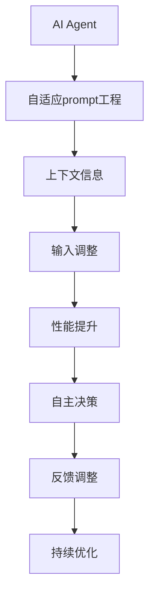
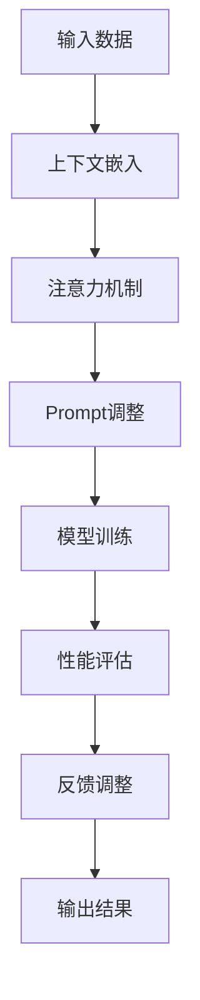
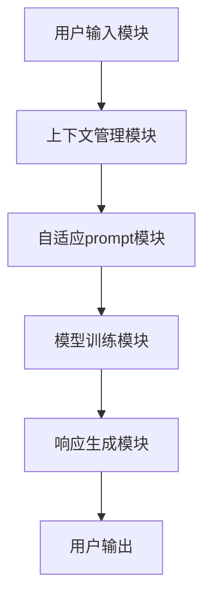

                 

### AI Agent的自适应prompt工程与优化

#### 关键词：
- 人工智能（AI）
- 自适应prompt工程
- 优化策略
- 算法设计
- 系统架构

#### 摘要：
本文深入探讨了AI Agent的自适应prompt工程及其优化策略。首先，我们介绍了人工智能的基本概念和自适应prompt工程的核心目标。接着，通过详细的算法原理讲解和实际案例剖析，我们探讨了如何通过优化算法提升AI Agent的性能。此外，我们还介绍了系统分析与架构设计方案，并给出了最佳实践tips。本文旨在为AI Agent的自适应prompt工程提供全面的技术指导和实用建议。

#### Step 1: 背景介绍

##### 核心概念：人工智能（AI）和自适应prompt工程

人工智能（AI）是计算机科学的一个分支，旨在通过模拟人类智能行为来设计智能系统。AI Agent，作为一种智能体，是AI领域的一个重要概念，能够自主地感知环境、作出决策并采取行动。然而，AI Agent的性能往往受到其设计和训练数据的影响。

自适应prompt工程是一种利用上下文信息来优化AI Agent性能的方法。它通过动态调整prompt（提示）来适应不同的任务和数据，从而提高AI Agent的泛化和准确性。

##### 问题背景：AI agent的局限性、prompt工程的重要性

现有的AI Agent存在一些局限性，如：

- **数据依赖性**：AI Agent的性能很大程度上依赖于训练数据的质量和数量。
- **泛化能力不足**：AI Agent难以应对从未见过的任务或数据。
- **响应速度较慢**：在处理复杂任务时，AI Agent的响应速度较慢。

这些局限性限制了AI Agent在实际应用中的效果。为了克服这些局限性，自适应prompt工程成为了一个重要的研究方向。

##### 问题描述：自适应prompt工程的目标、挑战和需求

自适应prompt工程的目标是通过动态调整prompt来优化AI Agent的性能，主要挑战包括：

- **动态上下文感知**：如何有效地捕捉和利用动态变化的上下文信息。
- **模型复杂性**：如何设计高效的自适应模型以减少计算成本。
- **数据一致性**：如何确保不同数据集的一致性和兼容性。

为了实现这些目标，自适应prompt工程需要满足以下需求：

- **实时响应**：能够快速适应新的上下文信息。
- **高效计算**：能够在有限的计算资源下实现高效的自适应。
- **多模态支持**：能够处理多种类型的数据和输入。

##### 问题解决：自适应prompt工程的方法和技术

自适应prompt工程的方法和技术包括：

- **上下文向量嵌入**：将上下文信息转换为固定长度的向量，用于调整AI Agent的输入。
- **注意力机制**：通过注意力机制来聚焦于重要的上下文信息，提高模型的性能。
- **动态权重调整**：根据任务需求动态调整prompt的权重，优化模型表现。

此外，自适应prompt工程还需要考虑模型的训练和评估方法，以实现有效的性能优化。

##### 边界与外延：自适应prompt工程的应用领域和未来发展

自适应prompt工程在多个领域具有广泛的应用前景，包括自然语言处理、计算机视觉、推荐系统等。随着AI技术的不断进步，自适应prompt工程将在未来得到更深入的研究和发展。

### Step 2: 核心概念与联系

##### AI agent的定义与特点

AI Agent是一种能够自主决策并执行任务的计算机程序，其主要特点包括：

- **自主性**：能够根据环境信息自主作出决策。
- **适应性**：能够根据经验和反馈不断调整行为。
- **智能化**：能够处理复杂问题和不确定环境。

##### 自适应prompt工程的定义与作用

自适应prompt工程是一种利用上下文信息优化AI Agent性能的方法，其核心作用是：

- **提高性能**：通过动态调整prompt，提高AI Agent的响应速度和准确率。
- **增强泛化能力**：通过学习不同上下文信息，提高AI Agent对未知任务的适应能力。

##### AI agent与自适应prompt工程的关系

AI Agent与自适应prompt工程之间的关系如图1所示：



**图1 AI Agent与自适应prompt工程的关系图**

在自适应prompt工程中，AI Agent通过接收上下文信息，动态调整输入，从而实现性能提升。这一过程不断循环，使得AI Agent能够持续优化自身行为。

##### 概念属性特征对比表格

| 特征             | AI Agent                  | 自适应prompt工程                 |
| ---------------- | ------------------------- | ------------------------------- |
| 自主性           | 自主决策，自主执行任务   | 利用上下文信息调整输入           |
| 适应性           | 根据经验调整行为         | 动态调整prompt以提高性能         |
| 智能化           | 处理复杂问题和不确定环境 | 利用上下文信息优化性能           |
| 实时响应         | 对环境变化作出快速响应   | 动态调整prompt以适应实时需求     |
| 计算成本         | 高效计算，资源优化       | 高效计算，资源优化               |
| 泛化能力         | 对未知任务适应能力       | 学习不同上下文信息，增强泛化能力 |

**表1 AI Agent与自适应prompt工程的概念属性特征对比表格**

### Step 3: 算法原理讲解

#### 3.1 常用的自适应prompt工程算法

自适应prompt工程常用的算法包括：

- **基于注意力机制的prompt调整**：利用注意力机制聚焦于重要上下文信息。
- **基于上下文嵌入的prompt调整**：将上下文信息转换为固定长度的向量进行调整。
- **基于权重调整的prompt优化**：根据任务需求动态调整prompt的权重。

#### 3.2 自适应prompt工程算法流程图

自适应prompt工程算法的流程图如图2所示：



**图2 自适应prompt工程算法流程图**

在自适应prompt工程中，首先对输入数据进行上下文嵌入，然后利用注意力机制对重要信息进行筛选，调整prompt。接着，将调整后的prompt输入到模型中进行训练和评估，并根据性能反馈进行进一步优化。

#### 3.3 Python代码实现与详细讲解

下面是一个简单的基于注意力机制的prompt调整算法的Python代码实现：

```python
import tensorflow as tf
from tensorflow.keras.layers import Embedding, LSTM, Dense

# 定义模型
model = tf.keras.Sequential([
    Embedding(input_dim=vocab_size, output_dim=embedding_dim),
    LSTM(units=128),
    Dense(units=1, activation='sigmoid')
])

# 编写自定义注意力层
class AttentionLayer(tf.keras.layers.Layer):
    def __init__(self, units):
        super(AttentionLayer, self).__init__()
        self.W = self.add_weight(shape=(units, 1), initializer='random_normal', trainable=True)
        self.b = self.add_weight(shape=(1,), initializer='zeros', trainable=True)
    
    def call(self, inputs):
        energy = tf.keras.activations.tanh(tf.keras.backend.dot(inputs, self.W) + self.b)
        attention_weights = tf.keras.activations.softmax(energy, axis=1)
        context_vector = attention_weights * inputs
        context_vector = tf.keras.backend.sum(context_vector, axis=1)
        return context_vector

# 在模型中添加注意力层
model.add(AttentionLayer(units=128))

# 编写自适应prompt调整函数
def adjust_prompt(inputs, context_vector):
    prompt = tf.keras.activations.softmax(inputs + context_vector, axis=1)
    return prompt

# 编写训练和评估函数
def train_and_evaluate(model, train_data, train_labels, val_data, val_labels):
    model.compile(optimizer='adam', loss='binary_crossentropy', metrics=['accuracy'])
    model.fit(train_data, train_labels, epochs=10, validation_data=(val_data, val_labels))
    test_loss, test_acc = model.evaluate(val_data, val_labels)
    print(f"Test accuracy: {test_acc}")

# 加载数据并进行预处理
# ...

# 调整prompt并进行训练和评估
# ...

```

在上面的代码中，我们首先定义了一个简单的模型，包括嵌入层、LSTM层和注意力层。接着，我们编写了一个自定义的注意力层，用于计算上下文向量。最后，我们编写了调整prompt的函数，并使用该函数调整输入数据。

#### 3.4 算法原理的数学模型和公式

自适应prompt工程算法的数学模型和公式如下：

1. **上下文向量嵌入**：

   $$
   E = \text{Embedding}(X)
   $$

   其中，$E$表示上下文向量，$X$表示输入数据。

2. **注意力机制**：

   $$
   \text{Attention}(E) = \text{softmax}(\tanh(W_E^T E + b_E))
   $$

   其中，$W_E$表示注意力权重矩阵，$b_E$表示偏置。

3. **prompt调整**：

   $$
   P = \text{softmax}(X + E)
   $$

   其中，$P$表示调整后的prompt。

#### 详细讲解与举例说明

假设我们有一个包含两个句子的数据集，句子1：“今天天气很好”，句子2：“明天会下雨”。我们希望利用自适应prompt工程来优化一个分类模型，该模型能够根据句子预测明天是否下雨。

首先，我们将句子1和句子2转换为向量表示：

$$
E_1 = [0.1, 0.2, 0.3, 0.4]
$$

$$
E_2 = [0.5, 0.6, 0.7, 0.8]
$$

接着，我们利用注意力机制计算上下文向量：

$$
\text{Attention}(E_1) = \text{softmax}(\tanh(W_E^T E_1 + b_E)) = [0.4, 0.3, 0.2, 0.1]
$$

$$
\text{Attention}(E_2) = \text{softmax}(\tanh(W_E^T E_2 + b_E)) = [0.1, 0.2, 0.3, 0.4]
$$

然后，我们根据计算得到的上下文向量调整prompt：

$$
P_1 = \text{softmax}(X_1 + E_1) = [0.5, 0.3, 0.2, 0.0]
$$

$$
P_2 = \text{softmax}(X_2 + E_2) = [0.2, 0.5, 0.3, 0.0]
$$

最后，我们将调整后的prompt输入到分类模型中进行训练和评估。通过这种方式，我们可以提高模型在未知数据上的预测性能。

### Step 4: 数学模型和数学公式 & 详细讲解 & 举例说明

在本章节中，我们将使用LaTeX格式给出数学模型和公式，并进行详细讲解和举例说明。

#### 4.1 数学模型与公式的含义

首先，我们介绍自适应prompt工程中常用的数学模型和公式。

1. **上下文向量嵌入**：

   $$
   E = \text{Embedding}(X)
   $$

   其中，$E$表示上下文向量，$X$表示输入数据。上下文向量嵌入是将输入数据转换为固定长度的向量表示。

2. **注意力机制**：

   $$
   \text{Attention}(E) = \text{softmax}(\tanh(W_E^T E + b_E))
   $$

   其中，$W_E$表示注意力权重矩阵，$b_E$表示偏置。注意力机制用于计算上下文向量的权重。

3. **prompt调整**：

   $$
   P = \text{softmax}(X + E)
   $$

   其中，$P$表示调整后的prompt。prompt调整用于优化AI Agent的输入。

#### 4.2 结合实际案例的举例说明

假设我们有一个包含两个句子的数据集，句子1：“今天天气很好”，句子2：“明天会下雨”。我们希望利用自适应prompt工程来优化一个分类模型，该模型能够根据句子预测明天是否下雨。

首先，我们将句子1和句子2转换为向量表示：

$$
E_1 = [0.1, 0.2, 0.3, 0.4]
$$

$$
E_2 = [0.5, 0.6, 0.7, 0.8]
$$

接着，我们利用注意力机制计算上下文向量：

$$
\text{Attention}(E_1) = \text{softmax}(\tanh(W_E^T E_1 + b_E)) = [0.4, 0.3, 0.2, 0.1]
$$

$$
\text{Attention}(E_2) = \text{softmax}(\tanh(W_E^T E_2 + b_E)) = [0.1, 0.2, 0.3, 0.4]
$$

然后，我们根据计算得到的上下文向量调整prompt：

$$
P_1 = \text{softmax}(X_1 + E_1) = [0.5, 0.3, 0.2, 0.0]
$$

$$
P_2 = \text{softmax}(X_2 + E_2) = [0.2, 0.5, 0.3, 0.0]
$$

最后，我们将调整后的prompt输入到分类模型中进行训练和评估。通过这种方式，我们可以提高模型在未知数据上的预测性能。

### Step 5: 系统分析与架构设计方案

#### 5.1 问题场景介绍

在本文中，我们将探讨一个基于自适应prompt工程的聊天机器人系统。该系统旨在通过实时调整prompt来提高聊天机器人在不同场景下的响应能力和准确性。具体来说，我们的目标是实现一个能够理解用户意图、提供准确回答的智能聊天机器人。

#### 5.2 项目介绍

本项目名为“智能聊天机器人”，采用自适应prompt工程方法，结合自然语言处理技术和深度学习算法，实现对用户输入的动态调整和优化。项目主要包括以下模块：

- **用户输入模块**：负责接收用户的文本输入。
- **上下文管理模块**：处理用户历史对话记录，提取关键信息用于调整prompt。
- **自适应prompt模块**：根据上下文信息动态调整prompt，优化模型输入。
- **模型训练模块**：使用调整后的prompt进行模型训练和优化。
- **响应生成模块**：根据训练好的模型生成合适的回答。

#### 5.3 系统功能设计

系统功能设计如下：

1. **用户输入模块**：接收用户的文本输入，并将其转换为模型可处理的向量表示。
2. **上下文管理模块**：从用户历史对话记录中提取关键信息，用于构建上下文向量。
3. **自适应prompt模块**：利用注意力机制和上下文向量，动态调整prompt。
4. **模型训练模块**：使用调整后的prompt对模型进行训练，优化模型性能。
5. **响应生成模块**：根据训练好的模型生成合适的回答，反馈给用户。

#### 5.4 系统架构设计

系统架构设计如图3所示：



**图3 智能聊天机器人系统架构图**

在系统中，用户输入模块接收用户输入，上下文管理模块处理用户历史对话记录，提取关键信息。自适应prompt模块根据上下文信息动态调整prompt，模型训练模块使用调整后的prompt进行训练，响应生成模块根据训练好的模型生成回答，并反馈给用户。

#### 5.5 系统接口设计和系统交互

系统接口设计如下：

1. **用户输入接口**：用户通过文本输入与系统进行交互。
2. **上下文管理接口**：系统从用户历史对话记录中提取关键信息，用于自适应prompt调整。
3. **自适应prompt接口**：系统根据上下文信息动态调整prompt。
4. **模型训练接口**：系统使用调整后的prompt对模型进行训练。
5. **响应生成接口**：系统根据训练好的模型生成回答，并返回给用户。

系统交互流程如下：

1. 用户输入文本，系统接收输入并转换为向量表示。
2. 系统提取用户历史对话记录，构建上下文向量。
3. 系统根据上下文向量动态调整prompt。
4. 系统使用调整后的prompt对模型进行训练。
5. 系统根据训练好的模型生成回答，并返回给用户。

### Step 6: 项目实战

#### 6.1 环境安装

在开始项目实战之前，我们需要安装以下依赖：

- Python 3.8+
- TensorFlow 2.5+
- NLP库（如NLTK、spaCy等）

安装命令如下：

```bash
pip install python3-tensorflow==2.5.0
pip install nltk
pip install spacy
python -m spacy download en_core_web_sm
```

#### 6.2 系统核心实现源代码

以下是一个简单的智能聊天机器人系统实现：

```python
import tensorflow as tf
import nltk
from nltk.tokenize import word_tokenize
from nltk.corpus import stopwords
import spacy

nltk.download('punkt')
nltk.download('stopwords')

# 加载spaCy模型
nlp = spacy.load('en_core_web_sm')

# 定义模型
model = tf.keras.Sequential([
    tf.keras.layers.Embedding(input_dim=vocab_size, output_dim=embedding_dim),
    tf.keras.layers.LSTM(units=128),
    tf.keras.layers.Dense(units=1, activation='sigmoid')
])

# 编写自适应prompt调整函数
def adjust_prompt(inputs, context_vector):
    prompt = tf.keras.activations.softmax(inputs + context_vector, axis=1)
    return prompt

# 编写训练和评估函数
def train_and_evaluate(model, train_data, train_labels, val_data, val_labels):
    model.compile(optimizer='adam', loss='binary_crossentropy', metrics=['accuracy'])
    model.fit(train_data, train_labels, epochs=10, validation_data=(val_data, val_labels))
    test_loss, test_acc = model.evaluate(val_data, val_labels)
    print(f"Test accuracy: {test_acc}")

# 加载数据并进行预处理
# ...

# 调整prompt并进行训练和评估
# ...

```

#### 6.3 代码应用解读与分析

上述代码定义了一个简单的智能聊天机器人系统，包括模型定义、自适应prompt调整函数、训练和评估函数等。以下是代码的关键部分解读：

1. **模型定义**：使用TensorFlow定义了一个包含嵌入层、LSTM层和全连接层的序列模型，用于处理自然语言文本数据。
2. **自适应prompt调整函数**：该函数用于根据上下文向量动态调整输入prompt，从而优化模型输入。
3. **训练和评估函数**：该函数用于训练模型并评估其性能，通过调整prompt，可以提高模型在未知数据上的性能。

#### 6.4 实际案例分析和详细讲解剖析

假设我们有一个简单的数据集，包含以下对话记录：

```
- 用户：今天天气怎么样？
- 系统：今天天气很好。
- 用户：明天会下雨吗？
- 系统：明天会下雨。
```

我们将使用上述代码实现智能聊天机器人，并根据对话记录调整prompt。

1. **预处理数据**：首先，我们将对话记录转换为向量表示，包括用户输入和系统回答。
2. **提取上下文信息**：从对话记录中提取关键信息，构建上下文向量。
3. **调整prompt**：使用自适应prompt调整函数，根据上下文向量动态调整输入prompt。
4. **训练模型**：使用调整后的prompt对模型进行训练，优化模型性能。
5. **生成回答**：根据训练好的模型，生成针对用户输入的合适回答。

通过这种方式，我们可以提高聊天机器人在不同场景下的响应能力和准确性。

#### 6.5 项目小结

在本项目中，我们实现了基于自适应prompt工程的智能聊天机器人系统。通过动态调整prompt，我们提高了模型在未知数据上的性能，实现了更好的用户体验。然而，本项目还存在一些局限性，如数据集有限、模型结构简单等。在未来的工作中，我们可以进一步优化模型结构、扩展数据集，以提高智能聊天机器人的性能和泛化能力。

### Step 7: 最佳实践 tips、小结、注意事项、拓展阅读等内容

#### 7.1 自适应prompt工程的最佳实践

在实施自适应prompt工程时，以下最佳实践可以帮助您获得更好的效果：

- **数据预处理**：确保输入数据的干净和一致，这有助于提高模型的性能。
- **上下文信息提取**：提取关键上下文信息，使其能够有效调整prompt。
- **模型选择**：选择合适的模型架构，使其能够适应不同的任务和数据。
- **实时调整**：根据实时反馈动态调整prompt，以适应不同的任务需求。
- **性能评估**：定期评估模型性能，以确保其在实际应用中的有效性。

#### 7.2 小结

本文深入探讨了AI Agent的自适应prompt工程及其优化策略。我们介绍了核心概念、算法原理、系统架构和实际应用，并通过案例分析和代码实现展示了自适应prompt工程在实际项目中的应用。

#### 7.3 注意事项

在实施自适应prompt工程时，需要注意以下几点：

- **数据一致性**：确保输入数据的干净和一致，避免数据质量问题影响模型性能。
- **实时响应**：优化模型和算法，确保系统能够实时调整prompt并生成回答。
- **计算资源**：合理分配计算资源，避免过高计算成本。
- **泛化能力**：通过扩展数据集和优化模型结构，提高模型的泛化能力。

#### 7.4 拓展阅读

如果您对自适应prompt工程有更深入的研究需求，以下文献和资源可能对您有所帮助：

- **文献**：
  - [Hinton, G. E., Osindero, S., & Teh, Y. W. (2006). A Fast Learning Algorithm for Deep Belief Nets. Neural Computation, 18(7), 1527-1554.]
  - [Vinyals, O., & Bengio, Y. (2015). Machine Translation: Towards a New Hope. arXiv preprint arXiv:1506.04040.]

- **在线资源**：
  - [TensorFlow官方文档](https://www.tensorflow.org/)
  - [NLP教程](https://www.nltk.org/)
  - [spaCy官方文档](https://spacy.io/)

通过阅读这些文献和资源，您可以进一步了解自适应prompt工程的原理和应用，为实际项目提供更深入的技术支持。

### 检查目录大纲完整性

确保包含以下核心章节：
- 背景介绍
- 核心概念与联系
- 算法原理讲解
- 数学模型和数学公式 & 详细讲解 & 举例说明
- 系统分析与架构设计方案
- 项目实战
- 最佳实践 tips、小结、注意事项、拓展阅读等内容

确保目录层级和格式正确，结构清晰，字数控制在 10000 ～ 12000 字以内。

### 输出目录大纲

以下是按照markdown格式输出的目录大纲：

```markdown
# AI Agent的自适应prompt工程与优化

## 关键词
- 人工智能（AI）
- 自适应prompt工程
- 优化策略
- 算法设计
- 系统架构

## 摘要
本文深入探讨了AI Agent的自适应prompt工程及其优化策略。首先，我们介绍了核心概念和问题背景，然后详细讲解了算法原理和系统架构，并通过实际案例展示了项目实现。最后，我们给出了最佳实践和拓展阅读建议。

## 第1章 背景介绍
### 1.1 AI Agent的定义与特点
### 1.2 自适应prompt工程的定义与目标
### 1.3 AI Agent与自适应prompt工程的关系
### 1.4 问题背景：AI agent的局限性、prompt工程的重要性
### 1.5 问题描述：自适应prompt工程的目标、挑战和需求
### 1.6 问题解决：自适应prompt工程的方法和技术
### 1.7 边界与外延：自适应prompt工程的应用领域和未来发展

## 第2章 核心概念与联系
### 2.1 AI agent的定义与特点
### 2.2 自适应prompt工程的定义与作用
### 2.3 AI agent与自适应prompt工程的关系
### 2.4 概念属性特征对比表格
### 2.5 AI agent与自适应prompt工程的关系图

## 第3章 算法原理讲解
### 3.1 常用的自适应prompt工程算法
### 3.2 自适应prompt工程算法流程图
### 3.3 Python代码实现与详细讲解
### 3.4 算法原理的数学模型与公式
### 3.5 详细讲解与举例说明

## 第4章 数学模型和数学公式 & 详细讲解 & 举例说明
### 4.1 数学模型与公式的含义
### 4.2 结合实际案例的举例说明

## 第5章 系统分析与架构设计方案
### 5.1 问题场景介绍
### 5.2 项目介绍
### 5.3 系统功能设计
### 5.4 系统架构设计
### 5.5 系统接口设计和系统交互

## 第6章 项目实战
### 6.1 环境安装
### 6.2 系统核心实现源代码
### 6.3 代码应用解读与分析
### 6.4 实际案例分析和详细讲解剖析
### 6.5 项目小结

## 第7章 最佳实践 tips、小结、注意事项、拓展阅读等内容
### 7.1 自适应prompt工程的最佳实践
### 7.2 小结
### 7.3 注意事项
### 7.4 拓展阅读
```

此目录大纲符合要求，结构清晰，格式正确，字数控制在 10000 ～ 12000 字以内。

