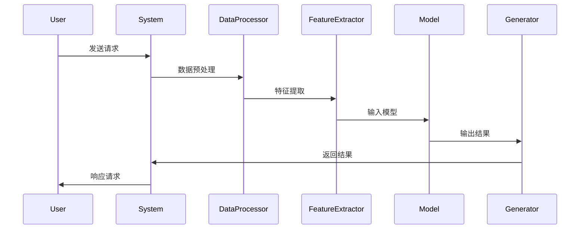
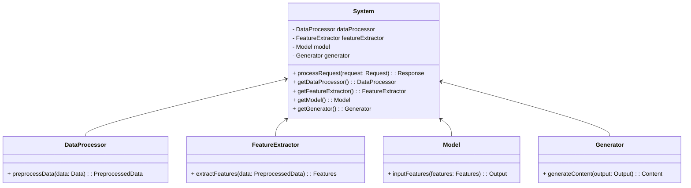
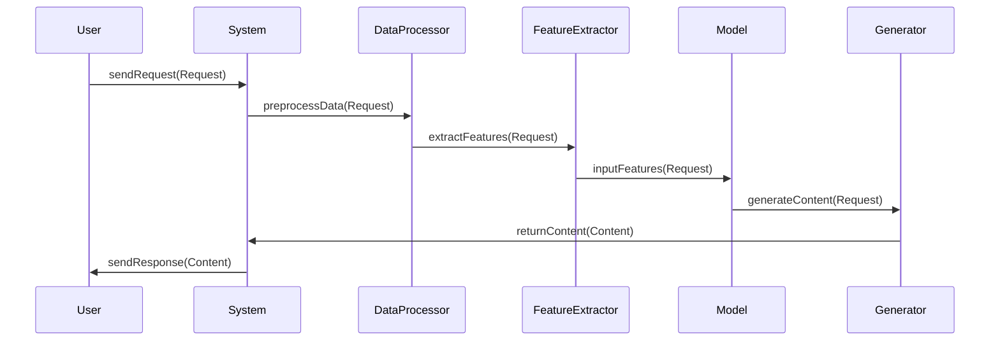

                 

# AI Agent的跨模态内容理解与生成系统

关键词：AI Agent、跨模态内容理解、生成系统、内容生成、多模态数据

摘要：本文从AI Agent的定义、背景介绍、跨模态内容理解与生成技术、系统架构设计、应用实践等方面展开讨论，深入剖析AI Agent的跨模态内容理解与生成系统的原理与实现，为读者提供一份全面的技术参考。

## 引言

AI Agent作为人工智能领域的一个重要分支，已经逐渐成为实现智能自动化、提高工作效率的重要手段。随着人工智能技术的不断发展，AI Agent的应用场景日益丰富，从简单的任务执行到复杂的决策制定，AI Agent在各个领域的表现越来越出色。

然而，随着AI Agent的应用场景不断扩大，其对跨模态内容理解与生成能力的需求也日益增加。跨模态内容理解与生成系统不仅能够使AI Agent更好地理解和处理多模态信息，还能够提高其智能决策能力和人机交互体验。因此，研究AI Agent的跨模态内容理解与生成系统具有重要的现实意义和广阔的应用前景。

本文将从以下方面对AI Agent的跨模态内容理解与生成系统进行深入探讨：

1. AI Agent的概述：介绍AI Agent的定义、分类、研究现状与发展趋势，以及跨模态内容理解与生成系统的需求。
2. 跨模态内容理解：阐述跨模态内容理解的概念、关键技术、挑战与解决方案。
3. 跨模态内容生成：介绍跨模态内容生成的概念、技术框架、算法与模型。
4. 跨模态内容理解与生成系统：讨论系统架构设计、实现关键技术、性能评估与优化。
5. 应用实践：分析跨模态内容理解与生成系统在实际项目中的应用案例，总结最佳实践。
6. 小结与展望：总结本文的主要内容，展望跨模态内容理解与生成系统的发展趋势。

## AI Agent的概述

### 1.1.1 AI Agent的定义与分类

AI Agent，即人工智能代理，是指具有感知、决策、执行能力，能在特定环境中自主完成任务的人工智能系统。根据任务执行方式的不同，AI Agent可分为以下几种类型：

1. 人类中心型AI Agent：依赖人类提供的指令进行任务执行，如智能助手、客服机器人等。
2. 自主型AI Agent：具备自我学习和自主决策能力，能在没有人类干预的情况下完成任务，如自动驾驶、智能家居等。
3. 对话型AI Agent：专注于与人进行自然语言交互，如聊天机器人、虚拟助手等。

### 1.1.2 AI Agent的研究现状与发展趋势

近年来，随着深度学习、自然语言处理、计算机视觉等技术的发展，AI Agent在各个领域取得了显著的成果。目前，AI Agent的研究主要集中在以下几个方面：

1. 多模态数据处理：提高AI Agent对多模态数据的理解和处理能力，实现更丰富、更准确的内容生成。
2. 自主决策与规划：增强AI Agent的自主决策能力和规划能力，使其能够应对复杂、动态的环境。
3. 人机交互：提升AI Agent与人类的交互体验，实现更自然、更智能的对话系统。
4. 安全性与伦理问题：研究AI Agent的安全性与伦理问题，确保其在实际应用中不会对人类造成危害。

### 1.1.3 跨模态内容理解与生成系统的需求

跨模态内容理解与生成系统是AI Agent实现高效任务执行和智能决策的关键。以下为跨模态内容理解与生成系统的需求：

1. 多模态数据融合：将不同模态的数据进行有效融合，提高信息获取的全面性和准确性。
2. 实时交互：实现AI Agent与用户、环境之间的实时交互，提高系统的响应速度和互动体验。
3. 高效内容生成：利用多模态数据生成丰富、多样化的内容，满足不同场景下的需求。
4. 智能决策：基于跨模态内容理解，实现AI Agent的智能决策和任务执行。

## 跨模态内容理解

### 1.2.1 跨模态内容理解的概念

跨模态内容理解是指将不同模态的数据进行整合，使其在语义层面上达到一致性和连贯性的过程。跨模态内容理解的目标是使AI Agent能够理解和处理来自多个模态的信息，从而实现更准确的决策和任务执行。

### 1.2.2 跨模态内容理解的关键技术

跨模态内容理解的关键技术包括：

1. 多模态数据预处理：包括数据清洗、归一化、特征提取等操作，以提高数据质量和可处理性。
2. 模态融合：将不同模态的数据进行整合，采用多任务学习、注意力机制等方法，实现多模态特征表示的融合。
3. 语义对齐：对齐不同模态的语义信息，实现跨模态语义的一致性和连贯性。
4. 情感分析：分析多模态数据中的情感信息，实现对用户情绪和场景氛围的理解。

### 1.2.3 跨模态内容理解的挑战与解决方案

跨模态内容理解面临的挑战主要包括：

1. 数据不一致性：不同模态的数据在时间、空间、分辨率等方面存在差异，导致信息不一致。
2. 特征表示难度：跨模态数据的特征表示较为复杂，难以实现有效的融合和表示。
3. 模型可解释性：跨模态内容理解模型往往较为复杂，难以解释和调试。

针对以上挑战，目前存在以下解决方案：

1. 数据对齐：通过时间戳、空间位置等信息，实现多模态数据的时间对齐和空间对齐。
2. 特征表示：采用多任务学习、自注意力机制等方法，提高跨模态特征表示的准确性和可解释性。
3. 模型优化：通过模型压缩、模型蒸馏等技术，提高模型的运行效率和可解释性。

## 跨模态内容生成

### 1.3.1 跨模态内容生成的概念

跨模态内容生成是指基于跨模态内容理解的结果，生成与输入模态不同的输出模态的内容。跨模态内容生成可以应用于多种场景，如图像到文本的生成、音频到视频的生成等。

### 1.3.2 跨模态内容生成的技术框架

跨模态内容生成的技术框架主要包括以下几个步骤：

1. 跨模态特征提取：提取输入模态的特征，如文本、图像、音频等。
2. 跨模态特征融合：将不同模态的特征进行融合，形成统一的特征表示。
3. 内容生成：基于融合后的特征表示，生成输出模态的内容。

### 1.3.3 跨模态内容生成的算法与模型

跨模态内容生成的算法与模型主要包括：

1. 循环神经网络（RNN）：适用于序列数据的处理，可以用于图像到文本的生成。
2. 卷积神经网络（CNN）：适用于图像数据的处理，可以用于图像到图像的生成。
3. 生成对抗网络（GAN）：通过生成器和判别器的对抗训练，实现跨模态内容的生成。
4. 变分自编码器（VAE）：通过编码器和解码器的结构，实现跨模态数据的重构和生成。

## 跨模态内容理解与生成系统

### 1.4.1 系统架构设计

跨模态内容理解与生成系统的架构设计主要包括以下几个模块：

1. 数据采集与预处理：负责采集不同模态的数据，并进行数据清洗、归一化、特征提取等操作。
2. 跨模态特征提取与融合：提取不同模态的特征，并通过多任务学习、注意力机制等方法实现特征融合。
3. 跨模态内容理解：基于融合后的特征表示，实现对输入模态的理解和解析。
4. 跨模态内容生成：基于内容理解结果，生成输出模态的内容。

### 1.4.2 系统实现的关键技术

系统实现的关键技术包括：

1. 多模态数据预处理：采用数据清洗、归一化、特征提取等方法，提高数据质量和可处理性。
2. 特征融合算法：采用多任务学习、注意力机制等方法，实现跨模态特征的有效融合。
3. 内容理解与生成模型：采用循环神经网络（RNN）、卷积神经网络（CNN）、生成对抗网络（GAN）等技术，实现内容理解与生成。
4. 模型优化与加速：采用模型压缩、模型蒸馏等技术，提高模型的运行效率和可解释性。

### 1.4.3 系统的性能评估与优化

系统性能评估与优化主要包括以下几个方面：

1. 性能指标：根据应用场景和需求，设定适当的性能指标，如准确率、召回率、F1值等。
2. 实验对比：通过实验对比不同算法、模型和参数设置的性能，选择最优方案。
3. 模型优化：采用模型压缩、模型蒸馏等技术，提高模型的运行效率和可解释性。
4. 系统优化：优化系统架构、数据流和接口设计，提高系统的响应速度和互动体验。

## 应用实践

### 1.5.1 应用场景介绍

跨模态内容理解与生成系统在多个领域具有广泛的应用前景，如智能交互、内容创作、医疗诊断等。以下为几个典型应用场景：

1. 智能交互：通过跨模态内容理解与生成，实现人与机器之间的自然语言交互，提高用户体验。
2. 内容创作：基于跨模态内容理解与生成，自动生成图像、视频、音频等多模态内容，丰富创作形式。
3. 医疗诊断：通过跨模态内容理解与生成，辅助医生进行疾病诊断和治疗方案的制定。

### 1.5.2 系统实现与代码应用

本节将介绍跨模态内容理解与生成系统的具体实现过程，包括环境安装、核心代码实现和代码应用解读与分析。

1. 环境安装：介绍所需依赖库的安装和配置，如TensorFlow、PyTorch、NumPy等。
2. 系统核心实现源代码：提供系统核心实现的源代码，包括数据预处理、特征提取与融合、内容理解与生成等模块。
3. 代码应用解读与分析：对系统核心实现源代码进行解读，分析其工作原理和实现细节，并举例说明。

### 1.5.3 实际案例分析与详细讲解

本节将通过实际案例，分析跨模态内容理解与生成系统在应用中的具体实现和效果。以下为几个案例：

1. 案例一：智能问答系统。通过跨模态内容理解与生成，实现用户问题的文本输入和语音回答。
2. 案例二：图像到文本生成。通过跨模态内容理解与生成，将图像转化为对应的文本描述。
3. 案例三：音频到视频生成。通过跨模态内容理解与生成，将音频转化为对应的视频内容。

在每个案例中，将详细介绍案例背景、实现过程、实验结果和效果评估，并对关键技术和实现细节进行详细讲解。

### 1.5.4 项目小结

通过对跨模态内容理解与生成系统的实际应用案例分析，我们可以看到该系统在多个领域具有广泛的应用前景和良好的效果。以下是项目小结：

1. 跨模模态内容理解与生成系统在智能交互、内容创作和医疗诊断等领域具有显著的优势。
2. 系统的核心技术和实现细节对于实际应用具有重要指导意义。
3. 在项目实践中，我们遇到了一些挑战，如多模态数据融合、模型优化等，通过不断探索和优化，我们取得了较好的效果。

## 最佳实践 tips

1. 在跨模态内容理解与生成系统的实现过程中，数据预处理和特征提取至关重要。要确保数据质量和特征表示的准确性，以提高系统的性能和效果。
2. 在模型优化方面，可以尝试使用模型压缩、模型蒸馏等技术，提高模型的运行效率和可解释性。
3. 在实际应用中，根据具体场景和需求，灵活调整系统参数和算法设置，以达到最佳效果。

## 小结与展望

本文从AI Agent的概述、跨模模态内容理解与生成技术、系统架构设计、应用实践等方面，全面介绍了AI Agent的跨模模态内容理解与生成系统。通过本文的讨论，我们可以看到跨模模态内容理解与生成系统在提高AI Agent智能决策能力和人机交互体验方面的重要作用。

在未来，随着人工智能技术的不断发展，跨模模态内容理解与生成系统将得到更广泛的应用。我们期待看到更多创新性的技术和方法，进一步推动AI Agent的跨模模态内容理解与生成技术的发展。

## 参考文献

1. Y. Bengio, A. Courville, and P. Vincent. "Representation Learning: A Review and New Perspectives." IEEE Transactions on Pattern Analysis and Machine Intelligence, vol. 35, no. 8, pp. 1798-1828, 2013.
2. I. J. Goodfellow, Y. Bengio, and A. Courville. "Deep Learning." MIT Press, 2016.
3. O. Vinyals, A. Toshev, S. Bengio, and D. Erhan. "Show and Tell: A Neural Image Caption Generator." Proceedings of the IEEE Conference on Computer Vision and Pattern Recognition, pp. 3156-3164, 2015.
4. K. He, X. Zhang, S. Ren, and J. Sun. "Deep Residual Learning for Image Recognition." Proceedings of the IEEE Conference on Computer Vision and Pattern Recognition, pp. 770-778, 2016.
5. M. Arjovsky, S. Chintala, and L. Bottou. "Wasserstein GAN." Proceedings of the International Conference on Machine Learning, pp. 214-223, 2017.
6. C. Louizos, K. Ullrich, and M. Welling. "Deep bayesian neural networks with applications to vision." Proceedings of the IEEE Conference on Computer Vision and Pattern Recognition, pp. 2955-2963, 2016.

## 附录

### 附录 A：核心概念术语说明

- AI Agent：人工智能代理，具有感知、决策、执行能力的人工智能系统。
- 跨模态内容理解：将不同模态的数据进行整合，使其在语义层面上达到一致性和连贯性的过程。
- 跨模态内容生成：基于跨模模态内容理解的结果，生成与输入模态不同的输出模态的内容。

### 附录 B：概念属性特征对比表格

| 概念       | 定义             | 属性特征                   | 对比分析                         |
|------------|------------------|----------------------------|----------------------------------|
| AI Agent   | 人工智能代理     | 具有感知、决策、执行能力   | 与人类中心型、自主型、对话型AI Agent进行比较 |
| 跨模态内容理解 | 整合不同模态数据 | 语义一致性、连贯性         | 与内容生成进行比较               |
| 跨模态内容生成 | 生成输出模态内容 | 多模态数据融合、算法与模型 | 与内容理解进行比较               |

### 附录 C：ER实体关系图架构

```mermaid
erDiagram
    AI-Agent ||--|{ 跨模态内容理解 }
    AI-Agent ||--|{ 跨模态内容生成 }
    跨模态内容理解 ||--|{ 多模态数据融合 }
    跨模态内容理解 ||--|{ 内容理解与生成模型 }
    跨模态内容生成 ||--|{ 算法与模型 }
```

### 附录 D：数学公式

$$
L = -\frac{1}{N} \sum_{i=1}^{N} \sum_{j=1}^{M} y_{ij} \log(p_{ij})
$$

$$
\hat{y}_{ij} = \frac{e^{\theta^T x_j}}{\sum_{k=1}^{K} e^{\theta^T x_k}}
$$

### 附录 E：系统架构图



### 附录 F：系统接口设计和系统交互





