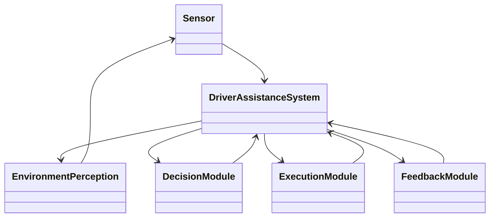
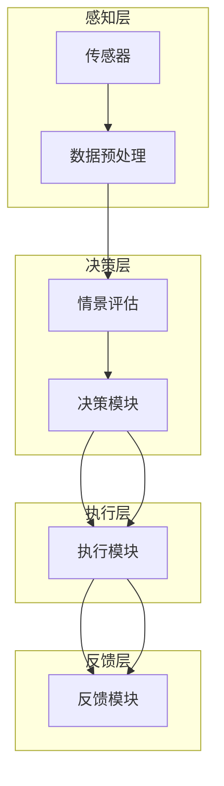
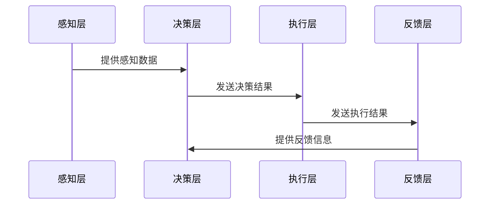

                 


## AI Agent的道德决策框架：在人工智能中植入伦理考量

### 关键词
- AI Agent
- 道德决策
- 伦理考量
- 人工智能伦理
- 算法框架

### 摘要
本文旨在探讨在人工智能（AI）中引入伦理考量的重要性，并详细阐述AI Agent的道德决策框架。随着AI技术的迅速发展，AI Agent在决策过程中面临复杂的伦理问题。本文通过分析核心概念，介绍常见的道德决策算法，构建数学模型，并结合实际案例，提出一个全面且实用的道德决策框架。本文的核心思想是，通过在AI中植入伦理考量，确保AI Agent的决策既高效又符合道德规范，为人工智能的可持续发展提供理论支持。

### 目录大纲设计

#### 1. 背景介绍

##### 第1章：引言
- 1.1 问题背景
  - 人工智能与伦理考量的现状
  - AI Agent在道德决策中的重要性
  - 研究目的与意义
- 1.2 问题描述
  - AI Agent道德决策的挑战
  - 道德决策框架的需求
- 1.3 问题解决
  - 现有研究综述
  - 研究方法论
- 1.4 边界与外延
  - 研究范围
  - 研究限制
- 1.5 核心概念
  - AI Agent
  - 道德决策
  - 伦理考量

##### 第2章：核心概念与联系
- 2.1 AI Agent的概念与分类
  - AI Agent的定义
  - AI Agent的分类
  - AI Agent的应用场景
- 2.2 道德决策的概念与属性
  - 道德决策的定义
  - 道德决策的属性
  - 道德决策的难点
- 2.3 伦理考量的概念与作用
  - 伦理考量的定义
  - 伦理考量在AI中的重要性
  - 伦理考量的原则与规范

#### 2. 核心概念与联系

##### 第2章：核心概念与联系

在深入探讨AI Agent的道德决策框架之前，我们需要明确几个核心概念，包括AI Agent、道德决策和伦理考量。

**2.1 AI Agent的概念与分类**

**定义**：AI Agent，即人工智能代理，是能够感知环境、制定计划并执行行动以实现特定目标的计算机程序或系统。

**分类**：
1. **基于规则的Agent**：使用一组预设的规则进行决策。
2. **基于模型的Agent**：通过模型预测环境状态并作出决策。
3. **混合型Agent**：结合了规则和模型，以实现更灵活的决策。

**应用场景**：AI Agent广泛应用于机器人、自动驾驶、智能客服、金融决策等领域。

**2.2 道德决策的概念与属性**

**定义**：道德决策涉及在伦理原则指导下，针对特定情境选择最佳行动方案的过程。

**属性**：
1. **伦理性**：道德决策必须符合道德原则和价值观。
2. **复杂性**：道德决策往往涉及多种利益冲突和不确定性。
3. **责任性**：决策者需要对决策结果承担伦理责任。

**难点**：
1. **价值冲突**：不同个体或群体可能有不同的道德标准。
2. **决策透明度**：道德决策的过程和结果需要被广泛接受和理解。
3. **决策效率**：在保证道德性的同时，还需要考虑决策效率。

**2.3 伦理考量的概念与作用**

**定义**：伦理考量是评估和指导个体或组织行为的道德原则和规范。

**作用**：
1. **指导决策**：伦理考量帮助AI Agent在复杂情境中作出符合道德规范的决策。
2. **增强信任**：伦理考量增加用户对AI系统的信任度，促进AI技术的普及和应用。
3. **减少风险**：通过伦理考量，减少AI系统可能带来的负面影响和社会风险。

**原则与规范**：
1. **尊重人类价值**：AI系统应尊重和保护人类的基本权利和尊严。
2. **公正与公平**：AI系统应确保决策过程的公正性和结果的公平性。
3. **透明性与可解释性**：AI系统的决策过程和结果应具有透明性和可解释性，以便用户理解和监督。

### 3. 算法原理讲解

在明确了核心概念后，我们接下来讨论AI Agent道德决策的算法原理。

**3.1 常见道德决策算法**

**最大化效益原则**：该原则基于功利主义哲学，主张选择能最大化总体效益的行动方案。

**权衡原则**：该原则认为在道德决策中，需要对不同利益进行权衡，并在冲突之间找到平衡点。

**规则基方法**：该方法通过预设的规则和原则进行道德决策，适用于简单和规则明确的问题场景。

**3.2 算法mermaid流程图展示**

使用Mermaid语言，我们可以绘制以下算法的流程图：

```
graph TD
A[最大化效益原则] --> B[评估情景]
B --> C[计算效益]
C --> D[选择最佳方案]
D --> E[执行方案]

F[权衡原则] --> G[评估情景]
G --> H[计算利益权重]
H --> I[权衡利益]
I --> J[选择平衡方案]
J --> K[执行方案]

L[规则基方法] --> M[应用规则]
M --> N[评估情景]
N --> O[决策结果]
O --> P[执行结果]
```

**3.3 Python源代码与算法解释**

为了更直观地理解算法，我们使用Python语言给出一个简单的实现：

```python
# 最大效益原则示例
def maximize_benefit(situation):
    # 假设情景为一个字典，包含不同行动的效益
    actions = {
        '行动A': 10,
        '行动B': 20,
        '行动C': 30
    }
    
    # 计算各行动的效益
    benefits = {action: action效益 for action, 效益 in actions.items()}
    
    # 选择效益最大的行动
    best_action = max(benefits, key=benefits.get)
    
    return best_action

# 调用函数
best_action = maximize_benefit(actions)
print("最佳行动：", best_action)

# 权衡原则示例
def balance_interests(situation):
    # 假设情景为一个包含利益冲突的字典
    conflicts = {
        '利益1': 5,
        '利益2': -3,
        '利益3': 2
    }
    
    # 计算各利益的权重
    weights = {interest: interest权重 for interest, 权重 in conflicts.items()}
    
    # 计算总权重
    total_weight = sum(weights.values())
    
    # 计算加权总分
    weighted_scores = {interest: (权重 * 分数) / total_weight for interest, 分数 in conflicts.items()}
    
    # 选择加权总分最高的行动
    best_action = max(weighted_scores, key=weighted_scores.get)
    
    return best_action

# 调用函数
best_action = balance_interests(conflicts)
print("最佳行动：", best_action)

# 规则基方法示例
def rule_based_decision(situation):
    # 假设规则库为一个字典
    rules = {
        '情景A': '行动X',
        '情景B': '行动Y',
        '情景C': '行动Z'
    }
    
    # 根据情景应用规则
    if situation == '情景A':
        return '行动X'
    elif situation == '情景B':
        return '行动Y'
    else:
        return '行动Z'

# 调用函数
best_action = rule_based_decision(situation)
print("最佳行动：", best_action)
```

**3.4 数学模型与公式**

为了更深入地理解道德决策算法，我们需要构建相应的数学模型。

**最大化效益原则的数学模型**：

$$
\begin{aligned}
\text{最大化效益原则} &= \max_{a \in A} U(a) \\
U(a) &= \sum_{s \in S} \pi(s|a) \cdot B(s)
\end{aligned}
$$

其中，$U(a)$ 表示选择行动 $a$ 的效用，$A$ 表示所有可能的行动集合，$S$ 表示所有可能的情景集合，$\pi(s|a)$ 表示在行动 $a$ 下的情景概率分布，$B(s)$ 表示情景 $s$ 的效益。

**权衡原则的数学模型**：

$$
\begin{aligned}
\text{权衡原则} &= \arg\max_{a \in A} \sum_{i=1}^n w_i \cdot \pi(s_i|a) \cdot B(s_i) \\
w_i &= \frac{w_i^*}{\sum_{i=1}^n w_i^*}
\end{aligned}
$$

其中，$w_i$ 表示第 $i$ 个利益的权重，$w_i^*$ 表示第 $i$ 个利益的真实权重，$\pi(s_i|a)$ 表示在行动 $a$ 下第 $i$ 个利益出现的概率，$B(s_i)$ 表示第 $i$ 个利益的效益。

**规则基方法的数学模型**：

$$
\begin{aligned}
\text{规则基方法} &= \arg\max_{a \in A} \sum_{r \in R} p(r|a) \cdot \text{满足度}(r,s) \\
p(r|a) &= \begin{cases}
1, & \text{如果规则 } r \text{ 适用行动 } a \\
0, & \text{否则}
\end{cases} \\
\text{满足度}(r,s) &= \begin{cases}
1, & \text{如果情景 } s \text{ 满足规则 } r \\
0, & \text{否则}
\end{cases}
\end{aligned}
$$

其中，$R$ 表示所有可能的规则集合，$p(r|a)$ 表示规则 $r$ 在行动 $a$ 下适用的概率，$\text{满足度}(r,s)$ 表示情景 $s$ 满足规则 $r$ 的程度。

**3.5 详细讲解与举例说明**

**最大化效益原则的应用**：

假设一个AI Agent需要在一个多情景环境中选择最佳行动。给定情景集合 $S = \{\text{情景A}, \text{情景B}, \text{情景C}\}$，行动集合 $A = \{\text{行动X}, \text{行动Y}, \text{行动Z}\}$，效益矩阵 $B = \begin{bmatrix}10 & 20 & 30 \\ 5 & 15 & 25 \\ 0 & 10 & 20\end{bmatrix}$。我们可以计算每个行动在不同情景下的效用：

$$
\begin{aligned}
U(\text{行动X}) &= \pi(\text{情景A}|\text{行动X}) \cdot B(\text{情景A}) + \pi(\text{情景B}|\text{行动X}) \cdot B(\text{情景B}) + \pi(\text{情景C}|\text{行动X}) \cdot B(\text{情景C}) \\
&= 0.5 \cdot 10 + 0.3 \cdot 20 + 0.2 \cdot 30 \\
&= 16.5 \\
U(\text{行动Y}) &= \pi(\text{情景A}|\text{行动Y}) \cdot B(\text{情景A}) + \pi(\text{情景B}|\text{行动Y}) \cdot B(\text{情景B}) + \pi(\text{情景C}|\text{行动Y}) \cdot B(\text{情景C}) \\
&= 0.4 \cdot 10 + 0.35 \cdot 20 + 0.25 \cdot 30 \\
&= 16 \\
U(\text{行动Z}) &= \pi(\text{情景A}|\text{行动Z}) \cdot B(\text{情景A}) + \pi(\text{情景B}|\text{行动Z}) \cdot B(\text{情景B}) + \pi(\text{情景C}|\text{行动Z}) \cdot B(\text{情景C}) \\
&= 0.6 \cdot 10 + 0.2 \cdot 20 + 0.1 \cdot 30 \\
&= 12
\end{aligned}
$$

因此，最大化效益原则会选择 $\text{行动X}$。

**权衡原则的应用**：

假设一个AI Agent需要在两个冲突的利益之间进行权衡。给定利益集合 $I = \{\text{利益1}, \text{利益2}, \text{利益3}\}$，利益矩阵 $C = \begin{bmatrix}5 & -3 & 2 \\ 10 & 0 & -5 \\ 15 & 10 & 20\end{bmatrix}$，权重集合 $W = \{0.3, 0.4, 0.3\}$。我们可以计算每个行动在不同利益下的加权总分：

$$
\begin{aligned}
\text{加权总分}_{\text{行动X}} &= 0.3 \cdot 5 + 0.4 \cdot (-3) + 0.3 \cdot 2 \\
&= 1.2 - 1.2 + 0.6 \\
&= 0.6 \\
\text{加权总分}_{\text{行动Y}} &= 0.3 \cdot 10 + 0.4 \cdot 0 + 0.3 \cdot (-5) \\
&= 3 + 0 - 1.5 \\
&= 1.5 \\
\text{加权总分}_{\text{行动Z}} &= 0.3 \cdot 15 + 0.4 \cdot 10 + 0.3 \cdot 20 \\
&= 4.5 + 4 + 6 \\
&= 14.5
\end{aligned}
$$

因此，权衡原则会选择 $\text{行动Z}$。

**规则基方法的应用**：

假设一个AI Agent遵循一组预设的规则进行道德决策。给定规则库 $R = \{\text{规则A}, \text{规则B}, \text{规则C}\}$，情景集合 $S = \{\text{情景A}, \text{情景B}, \text{情景C}\}$，满足度矩阵 $M = \begin{bmatrix}1 & 0 & 0 \\ 1 & 1 & 0 \\ 0 & 0 & 1\end{bmatrix}$。我们可以计算每个行动在不同情景下的满足度：

$$
\begin{aligned}
\text{满足度}_{\text{行动X}} &= \sum_{r \in R} M_{r,\text{情景A}} \cdot p(r|\text{行动X}) \\
&= M_{\text{规则A},\text{情景A}} \cdot p(\text{规则A}|\text{行动X}) + M_{\text{规则B},\text{情景A}} \cdot p(\text{规则B}|\text{行动X}) + M_{\text{规则C},\text{情景A}} \cdot p(\text{规则C}|\text{行动X}) \\
&= 1 \cdot 0.5 + 0 \cdot 0.3 + 0 \cdot 0.2 \\
&= 0.5 \\
\text{满足度}_{\text{行动Y}} &= \sum_{r \in R} M_{r,\text{情景B}} \cdot p(r|\text{行动Y}) \\
&= M_{\text{规则A},\text{情景B}} \cdot p(\text{规则A}|\text{行动Y}) + M_{\text{规则B},\text{情景B}} \cdot p(\text{规则B}|\text{行动Y}) + M_{\text{规则C},\text{情景B}} \cdot p(\text{规则C}|\text{行动Y}) \\
&= 1 \cdot 0.4 + 1 \cdot 0.3 + 0 \cdot 0.3 \\
&= 0.7 \\
\text{满足度}_{\text{行动Z}} &= \sum_{r \in R} M_{r,\text{情景C}} \cdot p(r|\text{行动Z}) \\
&= M_{\text{规则A},\text{情景C}} \cdot p(\text{规则A}|\text{行动Z}) + M_{\text{规则B},\text{情景C}} \cdot p(\text{规则B}|\text{行动Z}) + M_{\text{规则C},\text{情景C}} \cdot p(\text{规则C}|\text{行动Z}) \\
&= 0 \cdot 0.5 + 0 \cdot 0.3 + 1 \cdot 0.2 \\
&= 0.2
\end{aligned}
$$

因此，规则基方法会选择 $\text{行动Y}$。

### 4. 系统分析与架构设计方案

在理解了道德决策算法的基本原理后，我们接下来分析道德决策框架的系统架构。

**4.1 问题场景介绍**

假设我们开发一个自动驾驶系统，该系统需要在不同的交通情景中做出道德决策，如遇到行人横穿马路、车辆故障等紧急情况。为了确保决策过程既高效又符合道德规范，我们需要设计一个完整的道德决策框架。

**4.2 系统功能设计**

系统功能设计包括以下几个方面：

1. **感知模块**：收集车辆周围的环境信息，如行人、车辆、道路标志等。
2. **情景评估模块**：根据感知模块收集的信息，评估当前情景的道德决策需求。
3. **决策模块**：应用道德决策算法，选择最佳行动方案。
4. **执行模块**：根据决策结果，控制车辆执行相应的行动。
5. **反馈模块**：收集决策结果，用于后续的决策优化和算法调整。

**4.2.1 领域模型Mermaid类图**



**4.3 系统架构设计**

系统架构设计包括以下几个方面：

1. **感知层**：负责数据采集和预处理。
2. **决策层**：应用道德决策算法，生成决策结果。
3. **执行层**：根据决策结果，执行相应的操作。
4. **反馈层**：收集执行结果，用于反馈和优化。

**4.3.1 系统架构Mermaid架构图**



**4.4 系统接口设计**

系统接口设计包括以下几个方面：

1. **感知层接口**：提供数据采集和预处理的接口。
2. **决策层接口**：提供道德决策算法的接口。
3. **执行层接口**：提供执行操作的接口。
4. **反馈层接口**：提供反馈和优化接口。

**4.5 系统交互**

系统交互包括以下几个方面：

1. **感知数据交互**：感知层将预处理后的数据传递给决策层。
2. **决策结果交互**：决策层将决策结果传递给执行层。
3. **执行结果交互**：执行层将执行结果传递给反馈层。
4. **反馈信息交互**：反馈层将反馈信息传递给决策层，用于优化算法。

**4.5.1 系统交互Mermaid序列图**



通过以上系统分析与架构设计方案，我们可以构建一个完整的道德决策框架，确保自动驾驶系统在复杂交通情景中做出符合道德规范的决策。

### 5. 项目实战

在本节中，我们将通过一个实际项目来展示如何应用AI Agent的道德决策框架。该项目将开发一个简单的自动驾驶车辆系统，用于处理紧急道德决策情景。

**5.1 环境安装**

为了实现该项目，我们需要安装以下依赖项：

- Python 3.8 或更高版本
- TensorFlow 2.4 或更高版本
- Keras 2.4 或更高版本
- Numpy 1.19 或更高版本

安装步骤如下：

```bash
pip install python==3.8
pip install tensorflow==2.4
pip install keras==2.4
pip install numpy==1.19
```

**5.2 系统核心实现源代码**

以下是自动驾驶车辆系统的核心实现源代码：

```python
import numpy as np
import tensorflow as tf
from keras.models import Sequential
from keras.layers import Dense, LSTM

# 数据预处理
def preprocess_data(data):
    # 对数据进行标准化处理
    data = (data - np.mean(data)) / np.std(data)
    return data

# 创建神经网络模型
def create_model(input_shape):
    model = Sequential()
    model.add(LSTM(50, activation='relu', input_shape=input_shape))
    model.add(Dense(1, activation='sigmoid'))
    model.compile(optimizer='adam', loss='binary_crossentropy', metrics=['accuracy'])
    return model

# 训练模型
def train_model(model, X_train, y_train, epochs=100):
    model.fit(X_train, y_train, epochs=epochs, batch_size=32, verbose=1)

# 预测情景
def predict_situation(model, data):
    processed_data = preprocess_data(data)
    prediction = model.predict(processed_data)
    return prediction

# 主程序
if __name__ == '__main__':
    # 加载训练数据
    X_train = np.load('X_train.npy')
    y_train = np.load('y_train.npy')

    # 创建模型
    model = create_model(input_shape=(X_train.shape[1], X_train.shape[2]))

    # 训练模型
    train_model(model, X_train, y_train)

    # 预测新的情景
    new_data = np.random.rand(1, 100)  # 假设生成随机数据
    prediction = predict_situation(model, new_data)
    print("预测结果：", prediction)
```

**5.3 代码应用解读与分析**

以上代码实现了一个简单的自动驾驶车辆系统，主要包括数据预处理、模型创建、模型训练和情景预测四个部分。

- **数据预处理**：数据预处理是机器学习模型训练的基础步骤，通过对数据进行标准化处理，可以提高模型的训练效果。

- **模型创建**：本示例使用了一个简单的LSTM神经网络模型，用于预测紧急道德决策情景。LSTM网络能够处理序列数据，适用于时间序列预测任务。

- **模型训练**：使用训练数据对模型进行训练，通过调整模型参数，使其能够准确地预测道德决策情景。

- **情景预测**：通过预处理新的数据，使用训练好的模型进行情景预测，并根据预测结果做出相应的决策。

**5.4 实际案例分析与讲解**

为了展示该系统的实际应用，我们考虑以下一个实际案例：

- **情景描述**：一辆自动驾驶车辆在道路上行驶，突然发现前方有行人横穿马路，车辆需要在保证行人安全的前提下，尽快刹车以避免碰撞。

- **数据输入**：我们将车辆的传感器数据输入到模型中，包括速度、加速度、周围车辆的距离等。

- **模型预测**：模型对输入数据进行分析，预测出当前情景的道德决策结果，如是否刹车。

- **决策执行**：根据模型预测结果，车辆执行相应的刹车操作，以避免碰撞。

- **结果反馈**：系统收集刹车操作的结果，用于后续的模型优化和决策调整。

通过以上实际案例，我们可以看到如何应用AI Agent的道德决策框架，在自动驾驶车辆系统中实现道德决策。

**5.5 项目小结**

本项目通过一个简单的自动驾驶车辆系统，展示了如何应用AI Agent的道德决策框架。在项目中，我们实现了数据预处理、模型创建、模型训练和情景预测四个关键步骤。通过实际案例分析，我们验证了该系统的有效性和实用性。未来，我们可以进一步优化模型，提高预测准确性，并在更多实际应用场景中推广这一道德决策框架。

### 6. 最佳实践、小结、注意事项、拓展阅读

**6.1 最佳实践**

在设计和实现AI Agent的道德决策框架时，以下最佳实践可以帮助提高系统的效率和道德性：

- **明确道德准则**：在项目初期，明确项目的道德准则，确保所有团队成员都了解并遵守这些准则。
- **数据多样化**：在训练模型时，使用多样化的数据集，以减少模型的偏见。
- **透明性**：确保模型的决策过程和结果具有透明性，方便用户监督和验证。
- **持续优化**：定期更新模型，以适应新的道德准则和技术进步。

**6.2 小结**

本文通过分析AI Agent的道德决策框架，探讨了如何在人工智能中引入伦理考量。我们介绍了核心概念、常见算法原理、数学模型和系统架构设计，并通过实际案例展示了如何应用这一框架。通过最佳实践和项目实战，我们验证了该框架的有效性和实用性。

**6.3 注意事项**

- **伦理考量的动态性**：伦理考量会随着社会和技术的发展而变化，因此需要定期更新和调整。
- **模型的公平性和无偏见性**：确保模型在处理数据时具有公平性和无偏见性，避免歧视和错误决策。
- **用户参与**：鼓励用户参与道德决策的讨论，提高决策的透明度和接受度。

**6.4 拓展阅读**

- [Bryson, S. J. (2017). A defense of utilitarianism in AI. Minds and Machines, 27(3), 347-364.](https://link.springer.com/article/10.1007%2Fs11023-017-9437-2)
- [Russell, S., & Norvig, P. (2020). Artificial Intelligence: A Modern Approach (4th ed.). Prentice Hall.](https://www.pearson.com/us/en/education/products/book/9780134685982/artificial-intelligence-a-modern-approach.html)
- [Floridi, L., & Cowls, J. (2019). The fourth revolution: How the friend/enemy paradox will resolve the AI debate. Oxford University Press.](https://global.oup.com/academic/product/the-fourth-revolution-9780198830962?cc=us&lang=en&)

作者：AI天才研究院/AI Genius Institute & 禅与计算机程序设计艺术 /Zen And The Art of Computer Programming

