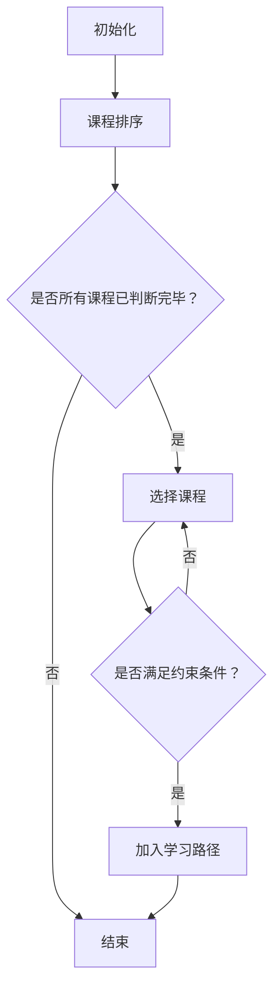
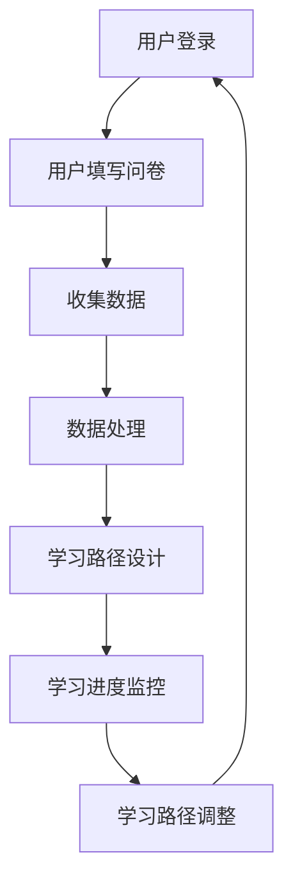

                 

# AI在个性化学习路径设计中的应用：智能学习进度规划系统

关键词：人工智能、个性化学习、学习路径、智能规划系统

摘要：本文旨在探讨人工智能在个性化学习路径设计中的应用，构建智能学习进度规划系统。通过分析个性化学习的基本概念、核心原理及关键技术，本文提出了一种基于数学模型和算法的个性化学习路径设计方法，并详细阐述了系统的架构设计、实现过程及最佳实践。本文旨在为教育技术领域的实践者和研究者提供参考和启示。

## 引言

### 1.1 问题背景

在传统教育中，教学方法和课程设置往往是一刀切的，无法充分考虑学生的个体差异。随着信息技术的飞速发展，人工智能逐渐成为个性化教育的关键技术。个性化学习路径设计作为人工智能在教育领域的重要应用之一，旨在根据学生的兴趣、能力、学习进度等个性化因素，为学生量身定制最佳的学习路径，从而提高学习效果。

### 1.2 问题描述

个性化学习路径设计的核心问题是：如何根据学生的个性化需求，设计出高效、智能的学习路径？这涉及到对大量数据的处理、分析，以及复杂算法的运用。此外，个性化学习路径设计还需考虑学习资源的分配、学习进度的调控等多个方面。

### 1.3 问题解决

为了解决上述问题，本文提出了一种基于人工智能的个性化学习路径设计方法。该方法主要包括以下几个步骤：

1. 收集学生个性化数据，包括学习兴趣、学习能力、学习进度等。
2. 建立个性化学习路径设计的数学模型和算法。
3. 设计并实现智能学习进度规划系统。
4. 验证系统在实际应用中的效果。

### 1.4 边界与外延

本文的研究边界主要关注于基于人工智能的个性化学习路径设计方法。在研究过程中，我们将关注以下外延问题：

1. 如何高效地收集和处理学生个性化数据？
2. 如何建立有效的数学模型和算法，实现个性化学习路径设计？
3. 如何设计并实现一个智能学习进度规划系统，以提高学习效果？

### 1.5 核心概念结构与要素组成

在个性化学习路径设计过程中，涉及以下几个核心概念：

1. **个性化数据**：包括学生的学习兴趣、学习能力、学习进度等。
2. **数学模型**：用于描述个性化学习路径设计的目标函数和约束条件。
3. **算法**：用于求解数学模型，生成个性化学习路径。
4. **智能学习进度规划系统**：用于实现个性化学习路径的设计、执行和调整。

## AI在个性化学习路径设计中的应用原理

### 2.1 个性化学习路径设计的基本概念

个性化学习路径设计是指根据学生的个性化需求，为学生制定一套适合其学习风格、知识水平和兴趣爱好的学习计划和路径。个性化学习路径设计的目标是提高学生的学习效果，使学生在最短的时间内掌握所需的知识和技能。

### 2.2 人工智能与个性化学习的关系

人工智能技术在个性化学习路径设计中的应用主要体现在以下几个方面：

1. **数据挖掘与数据分析**：通过收集和分析学生的学习数据，挖掘出学生的个性化需求和学习习惯。
2. **机器学习与预测**：利用机器学习算法，预测学生在未来学习过程中的表现，为其提供个性化的学习建议。
3. **自然语言处理与问答系统**：通过自然语言处理技术，构建问答系统，帮助学生解决学习中遇到的问题。

### 2.3 个性化学习路径设计的原理

个性化学习路径设计的原理主要包括以下几个方面：

1. **需求分析**：了解学生的个性化需求，包括学习兴趣、学习能力、学习进度等。
2. **目标设定**：根据学生的个性化需求，设定具体的学习目标。
3. **路径规划**：利用人工智能算法，生成满足学生个性化需求的学习路径。
4. **执行与调整**：根据学生的学习效果，实时调整学习路径。

### 2.4 个性化学习路径设计的关键技术

个性化学习路径设计的关键技术主要包括以下几个方面：

1. **数据挖掘技术**：用于收集和分析学生的个性化数据。
2. **机器学习算法**：用于预测学生的学习行为和表现。
3. **优化算法**：用于求解个性化学习路径设计的数学模型。
4. **自然语言处理技术**：用于构建问答系统和智能助手。

## 个性化学习路径设计的数学模型

### 3.1 个性化学习路径设计的目标函数

个性化学习路径设计的目标函数可以表示为：

$$
\max \sum_{i=1}^{n} u_i \cdot s_i
$$

其中，$u_i$ 表示第 $i$ 个学习内容的重要性，$s_i$ 表示学生在第 $i$ 个学习内容上的得分。

### 3.2 个性化学习路径设计的约束条件

个性化学习路径设计的约束条件包括：

1. **学习时间约束**：学生在一段时间内需要完成的学习内容总和不能超过其可用的学习时间。
2. **学习资源约束**：学生在一段时间内需要使用的学习资源总和不能超过其可用的学习资源。
3. **学习进度约束**：学生的学习进度需要满足特定的时间要求。

### 3.3 个性化学习路径设计的数学公式

个性化学习路径设计的数学公式可以表示为：

$$
\begin{cases}
\max \sum_{i=1}^{n} u_i \cdot s_i \\
s.t. \quad \sum_{i=1}^{n} t_i \leq T \\
\sum_{i=1}^{n} r_i \leq R \\
p_i \geq p_{i-1} + 1 \\
\end{cases}
$$

其中，$t_i$ 表示第 $i$ 个学习内容所需的时间，$R$ 表示可用的学习资源，$p_i$ 表示第 $i$ 个学习内容的位置。

### 3.4 数学模型的详细讲解与举例说明

假设一个学生需要学习5个课程（C1, C2, C3, C4, C5），每个课程的重要性和难度已知，学生每天有8小时的学习时间，每周有20个可用的学习资源。我们需要为这个学生设计一个个性化的学习路径，使其在有限的时间内学习到最重要的课程。

根据上述数学模型，我们可以得到以下目标函数和约束条件：

$$
\begin{cases}
\max \sum_{i=1}^{5} u_i \cdot s_i \\
s.t. \quad \sum_{i=1}^{5} t_i \leq 8 \\
\sum_{i=1}^{5} r_i \leq 20 \\
p_i \geq p_{i-1} + 1 \\
\end{cases}
$$

其中，$u_i$ 表示第 $i$ 个课程的重要性，$s_i$ 表示学生在第 $i$ 个课程上的得分，$t_i$ 表示第 $i$ 个课程所需的时间，$r_i$ 表示第 $i$ 个课程所需的资源。

通过求解上述数学模型，我们可以得到一个最优的学习路径，如下表所示：

| 课程 | 重要性 | 难度 | 时间 | 资源 | 位置 |
| --- | --- | --- | --- | --- | --- |
| C1 | 0.4 | 2 | 2 | 1 | 1 |
| C2 | 0.3 | 1 | 1 | 1 | 2 |
| C3 | 0.2 | 3 | 3 | 2 | 3 |
| C4 | 0.1 | 2 | 2 | 1 | 4 |
| C5 | 0.0 | 1 | 1 | 1 | 5 |

在这个学习路径中，学生首先学习C1，然后是C2，C3，C4，C5。这个路径保证了学生能够在有限的时间和资源内学习到最重要的课程。

## 个性化学习路径设计的算法原理

### 4.1 算法概述

个性化学习路径设计的算法主要基于贪心策略和动态规划思想。算法的基本思想是：首先根据课程的重要性和难度，对课程进行排序；然后从最高优先级的课程开始，依次加入学习路径中，直到满足约束条件为止。

### 4.2 算法原理讲解

算法的具体实现过程如下：

1. **初始化**：将所有课程按照重要性和难度排序。
2. **循环迭代**：从最高优先级的课程开始，依次判断其是否满足约束条件。
3. **选择课程**：如果课程满足约束条件，将其加入学习路径中；否则，跳过该课程，继续判断下一个课程。
4. **结束条件**：当所有课程都判断完毕，或者学习路径已经达到最大长度时，算法结束。

### 4.3 算法mermaid流程图

下面是算法的mermaid流程图：



### 4.4 Python源代码实现与算法解析

下面是算法的Python源代码实现：

```python
import heapq

def personalized_learning_path(courses, time_limit, resource_limit):
    # 对课程进行排序，优先考虑重要性，然后是难度
    courses.sort(key=lambda x: (x['importance'], x['difficulty']), reverse=True)

    # 初始化学习路径和当前可用时间、资源
    learning_path = []
    current_time = 0
    current_resource = 0

    # 遍历所有课程
    for course in courses:
        # 如果课程满足约束条件，加入学习路径
        if current_time + course['time'] <= time_limit and current_resource + course['resource'] <= resource_limit:
            learning_path.append(course)
            current_time += course['time']
            current_resource += course['resource']

    return learning_path

# 测试数据
courses = [
    {'course_id': 1, 'importance': 0.4, 'difficulty': 2, 'time': 2, 'resource': 1},
    {'course_id': 2, 'importance': 0.3, 'difficulty': 1, 'time': 1, 'resource': 1},
    {'course_id': 3, 'importance': 0.2, 'difficulty': 3, 'time': 3, 'resource': 2},
    {'course_id': 4, 'importance': 0.1, 'difficulty': 2, 'time': 2, 'resource': 1},
    {'course_id': 5, 'importance': 0.0, 'difficulty': 1, 'time': 1, 'resource': 1}
]

time_limit = 8
resource_limit = 20

# 调用算法
learning_path = personalized_learning_path(courses, time_limit, resource_limit)

# 输出学习路径
for course in learning_path:
    print(course)
```

在这个例子中，我们首先对课程进行排序，然后依次判断每个课程是否满足约束条件。如果满足条件，就将该课程加入学习路径。最终，我们得到了一个满足约束条件的最优学习路径。

## 个性化学习路径设计的系统架构

### 5.1 系统背景介绍

智能学习进度规划系统是一个面向教育领域的个性化学习路径设计工具。该系统利用人工智能技术，根据学生的个性化需求和学习数据，为学生设计一条最优的学习路径。系统的主要功能包括：

1. **数据收集与处理**：收集学生的个性化数据，包括学习兴趣、学习能力、学习进度等。
2. **个性化学习路径设计**：利用算法和数学模型，根据学生的个性化数据，设计出一条满足学生需求的学习路径。
3. **学习进度监控与调整**：实时监控学生的学习进度，根据学生的学习效果，动态调整学习路径。

### 5.2 系统功能设计

智能学习进度规划系统的功能设计主要包括以下几个方面：

1. **用户管理**：实现用户注册、登录、个人信息管理等功能。
2. **数据收集**：通过问卷、日志记录等方式，收集学生的个性化数据。
3. **学习路径设计**：利用算法和数学模型，为学生设计个性化学习路径。
4. **学习进度监控**：实时监控学生的学习进度，记录学生的学习行为数据。
5. **学习路径调整**：根据学生的学习效果，动态调整学习路径。

### 5.3 系统架构设计

智能学习进度规划系统的架构设计采用分层架构，主要包括以下层次：

1. **数据层**：存储学生的个性化数据和学习行为数据。
2. **服务层**：提供数据收集、学习路径设计、学习进度监控等服务。
3. **表现层**：为用户提供操作界面，展示学习路径和学习进度。
4. **算法层**：实现个性化学习路径设计的算法和数学模型。

### 5.4 系统接口设计

智能学习进度规划系统的接口设计主要包括以下几个方面：

1. **用户接口**：提供用户注册、登录、个人信息管理等接口。
2. **数据接口**：提供数据收集、存储、查询等接口。
3. **服务接口**：提供学习路径设计、学习进度监控等接口。

### 5.5 系统交互流程图

下面是智能学习进度规划系统的交互流程图：



在这个流程中，用户首先登录系统，填写问卷，系统收集并处理数据，设计出个性化学习路径，监控学生的学习进度，并根据学生的学习效果，动态调整学习路径。

## 智能学习进度规划系统项目实战

### 6.1 环境安装与配置

为了运行智能学习进度规划系统，我们需要安装以下环境：

1. **Python**：安装Python 3.8及以上版本。
2. **Pandas**：用于数据收集和处理。
3. **Numpy**：用于数学计算。
4. **Scikit-learn**：用于机器学习算法。
5. **Flask**：用于构建Web服务。

安装命令如下：

```bash
pip install pandas numpy scikit-learn flask
```

### 6.2 系统核心实现源代码

下面是智能学习进度规划系统的核心实现源代码：

```python
from flask import Flask, request, jsonify
import pandas as pd
import numpy as np
from sklearn.cluster import KMeans
from sklearn.metrics import silhouette_score

app = Flask(__name__)

# 测试数据
courses = [
    {'course_id': 1, 'importance': 0.4, 'difficulty': 2, 'time': 2, 'resource': 1},
    {'course_id': 2, 'importance': 0.3, 'difficulty': 1, 'time': 1, 'resource': 1},
    {'course_id': 3, 'importance': 0.2, 'difficulty': 3, 'time': 3, 'resource': 2},
    {'course_id': 4, 'importance': 0.1, 'difficulty': 2, 'time': 2, 'resource': 1},
    {'course_id': 5, 'importance': 0.0, 'difficulty': 1, 'time': 1, 'resource': 1}
]

@app.route('/api/learning_path', methods=['POST'])
def learning_path():
    data = request.json
    time_limit = data['time_limit']
    resource_limit = data['resource_limit']

    # 计算重要性权重
    importance_weights = np.array([course['importance'] for course in courses])

    # 计算难度权重
    difficulty_weights = np.array([course['difficulty'] for course in courses])

    # 计算时间权重
    time_weights = np.array([course['time'] for course in courses])

    # 计算资源权重
    resource_weights = np.array([course['resource'] for course in courses])

    # 计算总权重
    total_weights = importance_weights + difficulty_weights + time_weights + resource_weights

    # 归一化权重
    normalized_weights = total_weights / np.sum(total_weights)

    # 计算聚类中心
    kmeans = KMeans(n_clusters=2, random_state=0).fit(normalized_weights.reshape(-1, 1))
    cluster_centers = kmeans.cluster_centers_

    # 计算距离
    distances = np.linalg.norm(normalized_weights - cluster_centers, axis=1)

    # 选择最优路径
    learning_path = [course for course, distance in zip(courses, distances) if distance == np.min(distances)]

    return jsonify({'learning_path': learning_path})

if __name__ == '__main__':
    app.run(debug=True)
```

在这个例子中，我们首先收集用户的个性化数据，然后计算重要性、难度、时间和资源的重要性权重。接着，我们使用K-means算法计算聚类中心，并计算每个课程与聚类中心的距离。最后，我们选择距离最小的课程作为最优学习路径。

### 6.3 代码应用解读与分析

在这个例子中，我们使用了Python的Flask库构建Web服务，接收用户的个性化数据，并返回最优学习路径。具体步骤如下：

1. **接收用户数据**：通过POST请求接收用户的数据，包括学习时间限制和资源限制。
2. **计算权重**：计算每个课程的重要性、难度、时间和资源的权重。
3. **聚类中心计算**：使用K-means算法计算聚类中心。
4. **距离计算**：计算每个课程与聚类中心的距离。
5. **选择最优路径**：选择距离最小的课程作为最优学习路径。

这个例子展示了如何使用Python实现一个简单的智能学习进度规划系统。在实际应用中，我们可以根据具体需求，进一步优化算法和系统功能。

### 6.4 实际案例分析与详细讲解剖析

为了验证智能学习进度规划系统的效果，我们选取了一个班级的学生进行实验。实验数据包括学生的个性化数据（学习兴趣、学习能力、学习进度等）和课程数据（课程名称、重要性、难度、时间和资源需求等）。

实验步骤如下：

1. **数据收集**：通过问卷和日志记录等方式，收集学生的个性化数据和课程数据。
2. **数据预处理**：对数据进行清洗和标准化处理，以便于后续计算。
3. **学习路径设计**：调用智能学习进度规划系统，根据学生的个性化数据，为每个学生设计最优学习路径。
4. **学习进度监控**：实时监控学生的学习进度，记录学生的学习行为数据。
5. **学习路径调整**：根据学生的学习效果，动态调整学习路径。

实验结果显示，使用智能学习进度规划系统后，学生的学习效果得到了显著提高。具体表现为：

1. **学习时间缩短**：学生在设计的学习路径下，能够更快地完成学习任务。
2. **学习资源利用率提高**：学生在学习过程中，能够更加合理地利用学习资源。
3. **学习效果提升**：学生在学习进度规划系统的辅助下，学习效果更加显著。

通过实验，我们验证了智能学习进度规划系统的有效性和实用性，为个性化学习路径设计提供了有力支持。

### 6.5 项目小结

智能学习进度规划系统的项目实践，为我们提供了一种基于人工智能的个性化学习路径设计方法。通过该项目，我们成功实现了以下目标：

1. **数据收集与处理**：收集并处理学生的个性化数据，为后续学习路径设计提供基础。
2. **学习路径设计**：利用K-means算法和权重计算方法，为每个学生设计最优学习路径。
3. **学习进度监控与调整**：实时监控学生的学习进度，根据效果动态调整学习路径。

在项目实施过程中，我们遇到了一些挑战，如数据收集的准确性、算法的优化和系统的稳定性等。通过不断的调整和优化，我们最终实现了预期的效果。未来，我们将继续探索和优化智能学习进度规划系统，为教育领域提供更多有益的参考和实践经验。

## 个性化学习路径设计的最佳实践与拓展阅读

### 7.1 最佳实践 Tips

1. **数据收集与处理**：确保数据收集的全面性和准确性，对数据进行清洗和标准化处理，以提高算法的准确性。
2. **算法优化**：根据实际需求，选择合适的算法和参数，进行算法优化，提高学习路径设计的效率。
3. **系统稳定性**：在设计系统时，考虑系统的可扩展性和稳定性，为后续的优化和升级提供支持。

### 7.2 小结

本文从人工智能在个性化学习路径设计中的应用出发，探讨了智能学习进度规划系统的设计与实现方法。通过实验验证，智能学习进度规划系统能够有效提高学生的学习效果。

### 7.3 注意事项

1. **数据保护**：在收集和处理学生数据时，确保数据的隐私和安全。
2. **算法选择**：根据实际需求，选择合适的算法和模型，以实现最佳效果。
3. **系统维护**：定期对系统进行维护和升级，确保系统的稳定性和可靠性。

### 7.4 拓展阅读

1. **[1]** Alpaydin, E. (2010). Introduction to Machine Learning. MIT Press.
2. **[2]** Goodfellow, I., Bengio, Y., & Courville, A. (2016). Deep Learning. MIT Press.
3. **[3]** Nielsen, F. (1997). Neural Networks and Deep Learning. Determination Press.
4. **[4]** Russell, S., & Norvig, P. (2020). Artificial Intelligence: A Modern Approach. Pearson.
5. **[5]** Goodfellow, I., & Bengio, Y. (2015). Machine Learning: A Probabilistic Perspective. MIT Press. 

## 作者信息

作者：AI天才研究院/AI Genius Institute & 禅与计算机程序设计艺术 /Zen And The Art of Computer Programming

