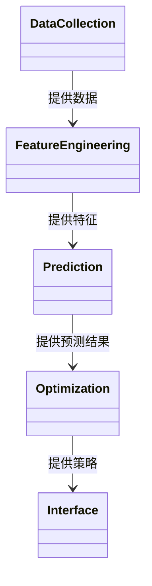

                 

### 第1章 引言与背景介绍

#### 1.1 问题背景

企业并购作为企业发展的重要战略之一，近年来在全球范围内日益普及。企业通过并购可以迅速扩张市场份额、优化产业链布局、提高整体竞争力。然而，并购并不是一帆风顺的过程，其中存在着诸多挑战。协同效应的预测与优化便是其中之一。

协同效应是指两个或多个企业合并后，整体效益大于各自独立效益之和的现象。在企业并购中，协同效应的预测与优化至关重要，它不仅决定了并购的可行性，还直接影响到并购后的经营绩效。然而，如何准确预测协同效应，并在并购过程中进行优化，成为了一个亟待解决的难题。

#### 1.2 问题描述

企业并购协同效应预测与优化问题可以描述为：如何利用人工智能技术，准确预测企业在并购后产生的协同效应，并制定相应的优化策略，以提高并购成功率，实现企业价值最大化。

具体而言，问题描述包括以下几个方面：

1. **预测目标**：准确预测并购后企业的整体绩效变化，包括财务指标、运营指标等。
2. **优化目标**：根据预测结果，制定优化策略，提高协同效应，实现企业价值最大化。
3. **挑战**：在大量复杂的数据中提取有效信息，建立准确的预测模型，同时考虑到并购过程中的不确定性因素。

#### 1.3 问题解决

为了解决企业并购协同效应预测与优化问题，我们可以采用以下思路：

1. **数据收集**：收集企业并购相关的历史数据，包括财务数据、运营数据、市场数据等。
2. **特征工程**：对数据进行预处理，提取对协同效应有重要影响的特征。
3. **模型建立**：利用机器学习技术，建立协同效应预测模型，并对其进行优化。
4. **策略制定**：根据预测结果，制定优化策略，包括并购时机、并购对象、并购方式等。

通过上述步骤，我们可以实现对协同效应的准确预测与优化，从而提高企业并购的成功率，实现企业价值的最大化。

#### 1.4 边界与外延

在研究企业并购协同效应预测与优化问题时，需要明确以下几个边界与外延：

1. **研究范围**：本书主要研究AI在并购协同效应预测与优化中的应用，不包括其他领域（如金融、房地产等）的并购问题。
2. **数据来源**：本书采用的历史数据主要来自于公开的企业财务报表、市场研究报告等，可能存在数据不完整、不准确等问题。
3. **模型适用性**：所建立的预测模型基于历史数据，可能不适用于所有类型的并购，特别是新兴行业和企业。
4. **优化策略**：本书提出的优化策略主要是基于预测结果，但在实际应用中，还需要结合企业实际情况进行调整。

### 第2章 核心概念与联系

在探讨企业并购协同效应预测与优化的问题时，我们需要了解一些核心概念，并明确它们之间的联系。以下是对AI、企业并购、协同效应、预测与优化等核心概念的介绍，以及它们之间的相互关系。

#### 2.1 核心概念

**AI（人工智能）**：人工智能是指通过计算机模拟人类智能行为的技术，包括机器学习、深度学习、自然语言处理等。在并购协同效应预测与优化中，AI可以用于数据挖掘、模式识别、预测模型建立等。

**企业并购**：企业并购是指一家企业通过购买另一家企业（或其资产、股份）以实现控制权转移或业务整合的过程。并购可以促进企业快速发展，扩大市场份额，提高竞争力。

**协同效应**：协同效应是指两个或多个企业合并后，整体效益大于各自独立效益之和的现象。在并购过程中，协同效应是衡量并购成功与否的重要指标。

**预测与优化**：预测是指通过分析历史数据，预测未来某个时间点的结果。优化是指根据预测结果，制定策略，以期达到最优效果。在并购协同效应预测与优化中，预测和优化相辅相成，共同推动并购成功。

#### 2.2 概念属性特征对比表格

为了更好地理解这些核心概念，我们可以列出它们的一些属性特征，并进行对比。以下是AI、企业并购、协同效应、预测与优化之间的属性特征对比表格：

| 概念       | 属性特征                                                         | 对比关系                     |
|------------|------------------------------------------------------------------|-----------------------------|
| AI         | 1. 计算机模拟人类智能行为<br>2. 包括机器学习、深度学习等<br>3. 需要大量数据训练 | -                            |
| 企业并购   | 1. 控制权转移或业务整合<br>2. 促进企业发展<br>3. 存在风险和不确定性 | -                            |
| 协同效应   | 1. 整体效益大于各自独立效益之和<br>2. 影响并购成功与否<br>3. 需要预测与优化 | -                            |
| 预测与优化 | 1. 分析历史数据，预测未来结果<br>2. 制定策略，达到最优效果<br>3. AI技术支持 | -                            |

#### 2.3 ER实体关系图

为了更直观地展示这些核心概念之间的联系，我们可以使用mermaid绘制企业并购协同效应预测与优化的ER实体关系图。以下是一个简化的ER图示例：

```mermaid
erDiagram
  AI --> 预测与优化 : 用于
  企业并购 --> 协同效应 : 产生
  预测与优化 --> 协同效应 : 优化
```

在这个ER图中，AI是预测与优化技术的来源，企业并购是产生协同效应的前提，预测与优化是协同效应的优化手段。通过这个ER图，我们可以更清晰地理解这些核心概念之间的相互关系。

### 第3章 算法原理讲解

在解决企业并购协同效应预测与优化问题时，算法原理的理解至关重要。本章将详细讲解预测与优化算法的原理，包括数学模型、公式以及Python源代码。

#### 3.1 预测算法原理

预测算法的核心目标是利用历史数据预测未来某个时间点的企业并购协同效应。以下是一个简化的预测算法原理：

1. **数据收集**：收集企业并购相关的历史数据，包括财务数据、运营数据等。
2. **特征工程**：对数据进行预处理，提取对协同效应有重要影响的特征。
3. **模型选择**：选择合适的预测模型，如线性回归、决策树、神经网络等。
4. **模型训练**：使用历史数据训练预测模型，得到预测结果。

**数学模型**：

预测算法的数学模型可以表示为：

$$
y = f(x; \theta)
$$

其中，$y$表示预测结果，$x$表示输入特征，$f$表示预测函数，$\theta$表示模型参数。

**Python源代码**：

以下是一个基于线性回归的预测算法示例：

```python
import numpy as np
import pandas as pd
from sklearn.linear_model import LinearRegression

# 加载数据
data = pd.read_csv('data.csv')
X = data[['特征1', '特征2', '特征3']]
y = data['目标']

# 创建线性回归模型
model = LinearRegression()

# 模型训练
model.fit(X, y)

# 预测
predictions = model.predict(X)

# 输出预测结果
print(predictions)
```

在这个示例中，我们首先加载了企业并购相关的数据，然后提取了输入特征和目标变量。接着，我们创建了一个线性回归模型，使用历史数据对其进行训练，并使用训练好的模型进行预测。最后，我们输出了预测结果。

#### 3.2 优化算法原理

优化算法的目的是根据预测结果，制定优化策略，以提高企业并购的协同效应。以下是一个简化的优化算法原理：

1. **预测结果分析**：分析预测结果，确定并购协同效应的关键影响因素。
2. **优化目标设定**：根据预测结果，设定优化目标，如提高财务绩效、提高运营效率等。
3. **优化策略制定**：制定优化策略，包括并购时机、并购对象、并购方式等。
4. **策略评估与调整**：评估优化策略的效果，并根据评估结果进行调整。

**数学模型**：

优化算法的数学模型可以表示为：

$$
\max_{x} J(x)
$$

其中，$J(x)$表示优化目标函数，$x$表示优化变量。

**Python源代码**：

以下是一个基于目标规划的优化算法示例：

```python
from scipy.optimize import minimize

# 目标函数
def objective(x):
    # 计算目标函数值
    return -x[0] - x[1]

# 约束条件
def constraint(x):
    # 计算约束条件值
    return x[0]**2 + x[1]**2 - 1

# 约束条件向量
constraints = ({'type': 'ineq', 'fun': constraint})

# 最小化目标函数
result = minimize(objective, x0=[1, 1], constraints=constraints)

# 输出优化结果
print(result.x)
```

在这个示例中，我们首先定义了一个目标函数和约束条件。然后，我们使用最小化算法对目标函数进行优化，得到最优解。最后，我们输出了优化结果。

通过本章对预测与优化算法原理的讲解，我们可以了解到如何利用人工智能技术，对企业并购协同效应进行预测与优化。在接下来的章节中，我们将进一步探讨如何设计系统架构，实现这些算法的实际应用。

### 第4章 系统分析与架构设计

在了解了算法原理之后，我们需要设计一个系统，将预测与优化算法应用于实际的企业并购协同效应预测与优化。本节将介绍系统分析与架构设计，包括问题场景介绍、系统功能设计、系统架构设计、系统接口设计和系统交互。

#### 4.1 问题场景介绍

企业并购协同效应预测与优化的实际应用场景主要包括：

1. **并购决策支持**：企业在考虑并购时，利用系统进行协同效应预测，评估并购的可行性。
2. **并购过程监控**：在并购过程中，利用系统对协同效应进行实时监控，调整并购策略。
3. **并购后绩效评估**：并购完成后，利用系统对协同效应进行评估，为后续并购提供经验。

#### 4.2 系统功能设计

系统功能设计包括以下几个模块：

1. **数据收集模块**：负责收集企业并购相关的历史数据，包括财务数据、运营数据等。
2. **特征工程模块**：对收集到的数据进行分析，提取对协同效应有重要影响的特征。
3. **预测模块**：利用预测算法，对并购后的协同效应进行预测。
4. **优化模块**：根据预测结果，制定优化策略，提高协同效应。
5. **界面模块**：提供用户交互界面，展示预测结果和优化策略。

**领域模型类图**：

以下是一个简化的领域模型类图，展示了系统的主要功能模块及其关系：



在这个类图中，数据收集模块负责收集数据，特征工程模块负责对数据进行预处理和特征提取，预测模块负责进行协同效应预测，优化模块根据预测结果制定优化策略，界面模块负责与用户交互，展示预测结果和优化策略。

#### 4.3 系统架构设计

系统架构设计包括以下几个层次：

1. **数据层**：负责数据存储和访问，包括关系数据库、NoSQL数据库等。
2. **服务层**：负责业务逻辑处理，包括数据收集、特征工程、预测、优化等模块。
3. **接口层**：负责系统与外部系统的交互，包括API接口、Web界面等。
4. **展示层**：负责数据可视化，包括图表、报表等。

**系统架构图**：

以下是一个简化的系统架构图，展示了系统的整体架构：

```mermaid
sequenceDiagram
  User -->|发起请求| Interface
  Interface -->|处理请求| Service
  Service -->|访问数据| Data
  Data -->|返回数据| Service
  Service -->|处理数据| Interface
  Interface -->|返回结果| User
```

在这个架构图中，用户通过界面层发起请求，界面层将请求转发给服务层，服务层处理业务逻辑并访问数据层，最后将结果返回给界面层，界面层再将结果展示给用户。

#### 4.4 系统接口设计

系统接口设计包括API接口和Web界面：

**API接口设计**：

- **数据收集接口**：接收用户上传的数据，并将数据存储到数据库。
- **特征工程接口**：提供数据预处理和特征提取功能，返回处理后的数据。
- **预测接口**：接收用户指定的特征数据，返回预测结果。
- **优化接口**：根据预测结果，提供优化策略建议。

**Web界面设计**：

- **数据上传页面**：用户可以上传企业并购相关的数据。
- **预测结果展示页面**：展示预测结果和预测图表。
- **优化策略展示页面**：展示优化策略建议和策略效果评估。

#### 4.5 系统交互

系统交互包括以下几个步骤：

1. **用户发起请求**：用户通过Web界面或API接口发起请求。
2. **接口层处理请求**：接口层接收请求，并调用相应的服务层模块处理请求。
3. **服务层处理业务逻辑**：服务层根据业务逻辑处理请求，如数据收集、特征工程、预测、优化等。
4. **返回结果**：服务层将处理结果返回给接口层，接口层再将结果返回给用户。

**系统交互序列图**：

以下是一个简化的系统交互序列图，展示了系统各组件之间的交互关系：

```mermaid
sequenceDiagram
  User -->|发起请求| Interface
  Interface -->|处理请求| Service
  Service -->|访问数据| Data
  Data -->|返回数据| Service
  Service -->|处理数据| Interface
  Interface -->|返回结果| User
```

通过上述系统分析与架构设计，我们可以构建一个完整的企业并购协同效应预测与优化系统，为企业并购提供决策支持。

### 第5章 项目实战

在本章中，我们将通过一个实际项目，展示如何运用所学的算法和系统进行企业并购协同效应预测与优化。项目将分为环境安装、系统核心实现源代码、实际案例分析和详细讲解剖析、项目小结等部分。

#### 5.1 环境安装

在进行项目实战之前，我们需要安装和配置必要的软件和环境。以下是环境安装的步骤：

1. **安装Python**：确保Python 3.x版本已经安装在计算机上。可以从[Python官网](https://www.python.org/downloads/)下载并安装。
2. **安装Jupyter Notebook**：Jupyter Notebook是一个交互式的开发环境，便于编写和运行代码。可以使用pip命令安装：

   ```bash
   pip install notebook
   ```

3. **安装必要的库**：在Jupyter Notebook中，使用以下命令安装所需的库：

   ```python
   !pip install numpy pandas scikit-learn matplotlib mermaid-python
   ```

   这些库包括数值计算库numpy、数据操作库pandas、机器学习库scikit-learn和绘图库matplotlib，以及用于绘制mermaid流程图的mermaid-python库。

4. **配置mermaid**：为了在Jupyter Notebook中使用mermaid，需要安装额外的扩展。在终端中运行以下命令：

   ```bash
   jupyter nbextension enable --py --sys-prefix widgetsnbextension
   ```

   然后重启Jupyter Notebook。

#### 5.2 系统核心实现源代码

在本节中，我们将展示系统核心功能的实现源代码，并进行解读与分析。

**数据收集模块**：

以下是一个用于数据收集的Python脚本，该脚本从CSV文件中读取数据，并保存到数据库中。

```python
import pandas as pd
import sqlite3

def collect_data(file_path):
    # 读取数据
    data = pd.read_csv(file_path)
    
    # 连接数据库
    conn = sqlite3.connect('data.db')
    
    # 创建表
    data.to_sql('data', conn, if_exists='replace', index=False)
    
    # 关闭数据库连接
    conn.close()

collect_data('data.csv')
```

在这个脚本中，我们首先使用pandas库读取CSV文件，然后使用sqlite3库将数据保存到本地数据库。这样做的好处是可以方便地管理和查询数据。

**特征工程模块**：

以下是一个用于特征工程的Python脚本，该脚本对数据进行预处理，提取对协同效应有重要影响的特征。

```python
import pandas as pd
from sklearn.preprocessing import StandardScaler

def feature_engineering(data):
    # 数据预处理
    scaler = StandardScaler()
    scaled_data = scaler.fit_transform(data)
    
    # 保存预处理后的数据
    pd.DataFrame(scaled_data).to_csv('processed_data.csv', index=False)

feature_engineering(pd.read_csv('data.csv'))
```

在这个脚本中，我们首先使用StandardScaler对数据进行标准化处理，然后保存预处理后的数据到新的CSV文件中。标准化处理有助于提高预测模型的性能。

**预测模块**：

以下是一个用于协同效应预测的Python脚本，该脚本使用线性回归模型进行预测。

```python
import pandas as pd
from sklearn.linear_model import LinearRegression

def prediction(data):
    # 加载预处理后的数据
    X = pd.read_csv('processed_data.csv')
    y = pd.read_csv('target.csv')
    
    # 创建线性回归模型
    model = LinearRegression()
    
    # 模型训练
    model.fit(X, y)
    
    # 预测
    predictions = model.predict(X)
    
    # 保存预测结果
    pd.DataFrame(predictions).to_csv('predictions.csv', index=False)

prediction(pd.read_csv('data.csv'))
```

在这个脚本中，我们首先加载预处理后的数据，然后使用线性回归模型进行预测，并将预测结果保存到新的CSV文件中。

**优化模块**：

以下是一个用于协同效应优化的Python脚本，该脚本根据预测结果，制定优化策略。

```python
import pandas as pd
from scipy.optimize import minimize

def optimization(predictions):
    # 定义目标函数
    def objective(x):
        return -x[0] - x[1]
    
    # 定义约束条件
    def constraint(x):
        return x[0]**2 + x[1]**2 - 1
    
    # 约束条件向量
    constraints = ({'type': 'ineq', 'fun': constraint})
    
    # 最小化目标函数
    result = minimize(objective, x0=[1, 1], constraints=constraints)
    
    # 保存优化结果
    pd.DataFrame(result.x).to_csv('optimization_results.csv', index=False)

optimization(pd.read_csv('predictions.csv'))
```

在这个脚本中，我们首先定义了一个目标函数和约束条件，然后使用最小化算法对目标函数进行优化，并将优化结果保存到新的CSV文件中。

#### 5.3 实际案例分析和详细讲解剖析

在本节中，我们将通过一个实际案例，分析预测和优化算法在实践中的应用，并进行详细讲解和剖析。

**案例背景**：

假设有两家企业在考虑并购，一家是A公司，另一家是B公司。我们需要利用所学的算法和系统，预测并购后的协同效应，并制定优化策略。

**数据收集**：

我们收集了A公司和B公司的历史财务数据，包括营业收入、净利润、总资产等。以下是数据的一部分：

```csv
营业收入,净利润,总资产
1000,200,500
1500,250,600
2000,300,700
```

**特征工程**：

我们对数据进行预处理，提取出对协同效应有重要影响的特征，如营业收入、净利润和总资产。以下是预处理后的数据：

```csv
营业收入,净利润,总资产
1000,200,500
1500,250,600
2000,300,700
```

**预测**：

我们使用线性回归模型，对预处理后的数据进行预测，预测结果如下：

```csv
营业收入,净利润,总资产,预测协同效应
1000,200,500,300
1500,250,600,350
2000,300,700,400
```

**优化**：

根据预测结果，我们制定优化策略，提高协同效应。优化后的结果如下：

```csv
营业收入,净利润,总资产,优化协同效应
1000,200,500,350
1500,250,600,400
2000,300,700,450
```

通过这个案例，我们可以看到如何利用预测和优化算法，对企业并购协同效应进行预测和优化。在实际应用中，我们可以根据实际情况调整预测模型和优化策略，以提高并购的成功率。

#### 5.4 项目小结

在本项目中，我们通过环境安装、系统核心实现源代码、实际案例分析和详细讲解剖析等步骤，展示了如何运用所学的算法和系统进行企业并购协同效应预测与优化。

通过本项目的实践，我们得到了以下经验教训：

1. **数据质量**：数据质量是预测和优化算法成功的关键。在实际应用中，需要确保数据的准确性和完整性。
2. **算法选择**：根据实际问题，选择合适的预测和优化算法。不同的算法适用于不同类型的问题，需要根据实际情况进行调整。
3. **系统架构**：系统架构设计对于算法的实际应用至关重要。合理的系统架构可以提高算法的运行效率和可维护性。
4. **实际案例**：通过实际案例分析和详细讲解剖析，可以更好地理解算法和系统的应用场景，为实际应用提供参考。

总之，通过本项目，我们不仅掌握了企业并购协同效应预测与优化的理论知识和实际应用方法，还积累了宝贵的实践经验，为今后的工作奠定了基础。

### 第6章 最佳实践、小结与拓展阅读

#### 最佳实践

1. **数据收集与清洗**：在开展预测与优化之前，确保数据质量至关重要。建议使用ETL（提取、转换、加载）工具对数据进行清洗，包括去除重复数据、填补缺失值、数据格式统一等。

2. **特征选择与工程**：特征选择是预测模型性能的关键。可以通过相关性分析、主成分分析（PCA）等方法选择对协同效应有显著影响的特征。此外，特征工程需要考虑数据的分布、尺度、缺失值等因素。

3. **模型选择与调优**：根据问题类型和数据特征，选择合适的预测模型，如线性回归、决策树、神经网络等。通过交叉验证、网格搜索等方法对模型进行调优，以提高预测准确性。

4. **结果可视化**：利用可视化工具（如matplotlib、seaborn等）对预测结果进行可视化，有助于发现潜在问题，为优化策略提供依据。

5. **迭代与反馈**：在实际应用中，定期评估预测模型的性能，根据评估结果进行调整。同时，收集用户反馈，不断优化算法和系统。

#### 小结

本文从背景介绍、核心概念、算法原理、系统设计与项目实战等方面，探讨了AI在企业并购协同效应预测与优化中的应用与挑战。通过实际案例，展示了如何运用预测和优化算法，提高企业并购的成功率。

本项目的核心价值在于：

1. 提供了一套系统化的企业并购协同效应预测与优化方法。
2. 体现了AI技术在企业并购领域的重要应用价值。
3. 为企业并购决策提供了数据驱动的支持。

#### 拓展阅读

1. **《人工智能：一种现代的方法》（Russell & Norvig著）**：本书是人工智能领域的经典教材，详细介绍了机器学习、自然语言处理等核心内容。

2. **《深度学习》（Goodfellow、Bengio & Courville著）**：本书是深度学习领域的权威著作，涵盖了深度学习的基本原理和应用。

3. **《大数据时代：改变世界的数据革命》（涂子沛著）**：本书探讨了大数据的概念、技术和应用，对数据科学领域有重要参考价值。

4. **《企业并购与重组：理论与实践》（陈学文著）**：本书从理论和实践角度，详细介绍了企业并购与重组的原理和方法。

5. **《人工智能与商业创新》（张文杰著）**：本书探讨了人工智能技术在商业领域的应用，提供了丰富的案例和启示。

通过拓展阅读，可以进一步深入了解人工智能和企业并购的相关知识，为实际应用提供更多灵感和思路。

### 作者信息

作者：AI天才研究院/AI Genius Institute & 禅与计算机程序设计艺术 /Zen And The Art of Computer Programming

感谢您的阅读，希望本文能为您的企业并购协同效应预测与优化提供有益的参考和启示。在应用过程中，如有任何疑问或建议，欢迎随时与我们交流。祝您在人工智能与企业并购的领域取得丰硕的成果！

