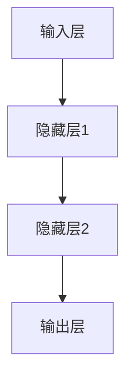
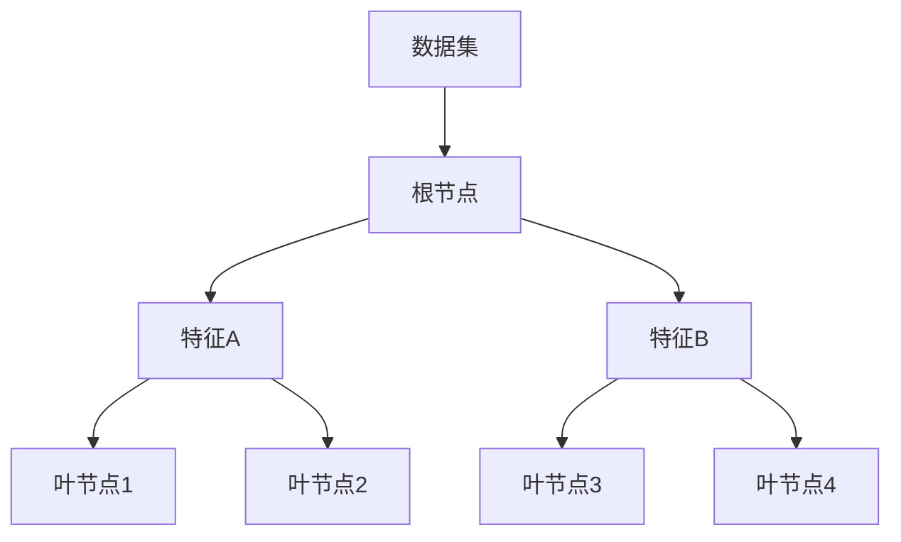
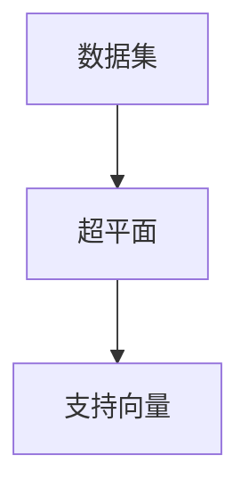
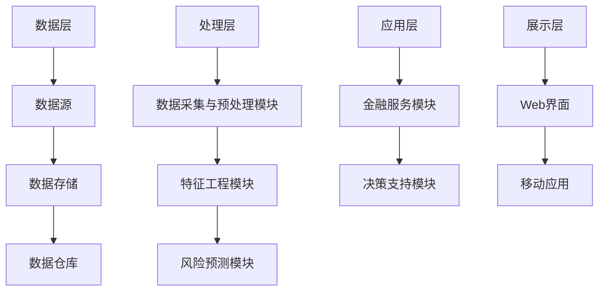
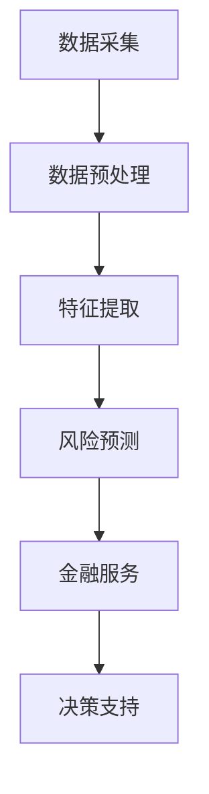

                 


### 1. 引言

#### 1.1 供应链金融概述

供应链金融（Supply Chain Finance，SCF）是指以供应链为基础，通过对供应链上各参与方之间的资金流动进行融资和服务的一种金融服务模式。它旨在解决供应链中企业间资金周转困难的问题，提高资金利用效率，降低金融风险。供应链金融的发展历程可以追溯到20世纪80年代的西方发达国家，随着信息技术和金融创新的不断推进，供应链金融在全球范围内得到了迅速发展。

供应链金融的核心要素主要包括：供应链、融资、风险管理和服务。其中，供应链是基础，融资是核心，风险管理是保障，服务是延伸。供应链金融的服务对象主要包括中小企业、核心企业及其上下游企业。中小企业通常面临着融资难、融资贵的问题，而核心企业则具备较强的资金实力和信用优势。通过供应链金融，可以有效缓解中小企业融资难的问题，同时提高核心企业的供应链管理能力。

#### 1.2 AI在金融领域的应用

人工智能（Artificial Intelligence，AI）作为一项颠覆性的技术，正深刻改变着金融行业的各个方面。从智能投顾、风险管理到客户服务，AI在金融领域的应用已逐渐成为行业发展的趋势。在供应链金融中，AI的应用尤为广泛，主要体现在以下几个方面：

1. **数据挖掘与风险管理**：AI可以通过数据挖掘技术，对大量的供应链交易数据进行分析，识别潜在的风险点，实现风险的有效管理。

2. **智能风控**：AI可以利用机器学习和深度学习算法，对供应链中的企业进行信用评估，提高贷款审批的准确性和效率。

3. **智能预测**：AI可以基于历史数据，预测供应链中的资金流动情况，帮助金融机构和企业进行决策。

4. **智能客服**：AI可以通过自然语言处理技术，提供智能客服服务，提高客户满意度和服务效率。

#### 1.3 深度学习与供应链金融结合的意义

深度学习（Deep Learning）是AI的一个重要分支，其通过多层神经网络模拟人脑的学习过程，具有强大的特征提取和模式识别能力。将深度学习应用于供应链金融，具有以下几个方面的意义：

1. **提升风险管理能力**：深度学习可以通过学习大量的历史数据，识别出供应链中的潜在风险，为金融机构提供更准确的风控决策。

2. **提高信用评估效率**：深度学习算法可以处理大量的数据，快速完成信用评估，提高贷款审批的效率。

3. **优化供应链管理**：深度学习可以预测供应链中的资金流动，帮助企业和金融机构进行决策，优化供应链管理。

4. **创新金融服务模式**：深度学习可以为供应链金融带来新的应用场景，如智能投顾、供应链金融区块链等，推动金融服务的创新和发展。

通过上述分析，我们可以看出，AI在供应链金融中的应用前景广阔，具有巨大的发展潜力。接下来，我们将进一步探讨AI在供应链金融中的核心概念与联系，以及具体的算法原理和实现。

## 第2章 核心概念与联系

在探讨AI在供应链金融中的深度应用之前，我们需要对供应链金融和AI的基本概念有一个清晰的理解，并分析它们之间的联系。

### 2.1 供应链金融

#### 2.1.1 定义与历史发展

供应链金融是指金融机构为企业提供的一种金融服务，旨在通过供应链上的交易行为和信用关系，为供应链上的企业提供融资、风险管理等服务。供应链金融起源于20世纪80年代的西方发达国家，当时的一些大型企业为了提高资金使用效率，开始尝试将金融业务与供应链管理相结合。

供应链金融的发展历程可以分为以下几个阶段：

1. **初级阶段**：金融机构主要通过传统的贷款、保理等手段，为供应链上的企业提供融资服务。

2. **中级阶段**：随着信息技术的不断发展，金融机构开始利用电子交易系统、在线支付等手段，提高供应链金融的效率和透明度。

3. **高级阶段**：在AI和大数据技术的推动下，供应链金融进入了智能化、自动化的发展阶段，通过数据分析和机器学习算法，实现风险的精准评估和智能决策。

#### 2.1.2 供应链金融的核心要素

供应链金融的核心要素主要包括以下几个方面：

1. **供应链**：供应链是企业生产经营的基本流程，包括采购、生产、销售等各个环节。供应链金融的运作离不开对供应链的深入理解和分析。

2. **融资**：融资是供应链金融的核心功能，金融机构通过为供应链上的企业提供贷款、保理等服务，帮助它们解决资金周转问题。

3. **风险管理**：风险管理是供应链金融的重要保障。通过数据分析、信用评估等技术手段，金融机构可以对供应链中的风险进行识别、监控和管理。

4. **服务**：供应链金融不仅提供融资服务，还包括财务咨询、供应链管理等服务，帮助企业在整个供应链中实现资源优化配置。

### 2.2 深度学习

#### 2.2.1 深度学习的基础理论

深度学习是AI的一个重要分支，其核心思想是通过多层神经网络模拟人脑的学习过程，从而实现自动的特征提取和模式识别。深度学习的基本原理包括：

1. **神经元模型**：神经元是神经网络的基本单元，通过输入和输出之间的非线性变换，实现对数据的特征提取。

2. **多层神经网络**：深度学习通过构建多层神经网络，实现对数据的深层特征提取，从而提高模型的复杂度和性能。

3. **反向传播算法**：反向传播算法是深度学习训练的核心算法，通过梯度下降法优化网络参数，使模型达到最佳状态。

#### 2.2.2 深度学习在金融领域的应用

深度学习在金融领域的应用已经取得了显著的成果，主要包括以下几个方面：

1. **风险管理**：通过深度学习算法，可以对金融市场的风险进行预测和监控，提高金融机构的风险管理能力。

2. **信用评估**：深度学习可以通过分析大量的历史数据，实现对借款人信用风险的准确评估，提高贷款审批的效率和准确性。

3. **智能投顾**：深度学习可以分析用户的历史投资行为和风险偏好，为用户提供个性化的投资建议，实现智能投顾。

4. **欺诈检测**：深度学习可以识别和检测金融交易中的欺诈行为，提高金融机构的安全性和合规性。

### 2.3 关联分析

#### 2.3.1 概念与特征

关联分析是数据挖掘中的一个重要方法，其目的是发现数据集中不同变量之间的关联关系。在供应链金融中，关联分析可以帮助金融机构识别潜在的风险点和优化金融服务。

关联分析的主要特征包括：

1. **强关联**：两个变量之间的变化具有高度的一致性，当一个变量发生变化时，另一个变量也会随之变化。

2. **弱关联**：两个变量之间的变化不具有明显的一致性，但仍然存在某种统计意义上的关联。

3. **条件关联**：两个变量之间的关联关系依赖于其他变量的存在，即在一个条件下，两个变量之间存在关联，而在另一个条件下则不存在。

#### 2.3.2 在供应链金融中的应用

在供应链金融中，关联分析的应用主要体现在以下几个方面：

1. **供应链风险识别**：通过分析供应链中各环节的关联关系，识别出潜在的风险点和风险传递路径。

2. **金融服务优化**：通过分析供应链中企业的交易数据和信用关系，为金融机构提供优化的融资方案和服务策略。

3. **供应链管理**：通过关联分析，优化供应链中各环节的资源配置，提高供应链的整体效率和效益。

### 总结

供应链金融、深度学习和关联分析是AI在供应链金融中的核心概念。供应链金融通过融资、风险管理和服务，为供应链上的企业提供金融支持；深度学习通过多层神经网络和反向传播算法，实现数据的特征提取和模式识别；关联分析通过发现数据之间的关联关系，帮助金融机构优化金融服务和供应链管理。这三个概念相互联系，共同推动了AI在供应链金融中的深度应用。

### 2.4 机器学习与供应链金融

#### 2.4.1 机器学习的基本原理

机器学习（Machine Learning，ML）是AI的重要组成部分，其通过构建数学模型，从数据中自动学习和发现规律。机器学习的基本原理包括：

1. **监督学习**：通过已标记的数据集，训练模型，实现对未知数据的预测。

2. **无监督学习**：在没有标记数据的情况下，模型自动发现数据中的结构和模式。

3. **半监督学习**：结合有标记和无标记数据，提高模型的训练效果。

4. **强化学习**：通过奖励和惩罚机制，训练模型在特定环境中做出最优决策。

#### 2.4.2 机器学习在供应链金融中的应用

机器学习在供应链金融中的应用非常广泛，主要包括以下几个方面：

1. **信用评估**：利用机器学习算法，对借款人的信用风险进行评估，提高贷款审批的准确性和效率。

2. **需求预测**：通过分析历史销售数据和市场趋势，预测供应链中的需求变化，优化库存管理。

3. **风险控制**：利用机器学习算法，识别供应链中的潜在风险，采取相应的风险控制措施。

4. **供应链优化**：通过机器学习算法，优化供应链中各环节的资源配置，提高供应链的效率和效益。

#### 2.4.3 机器学习与深度学习的区别

机器学习和深度学习虽然都是AI的重要组成部分，但它们在原理和应用上存在一些区别：

1. **模型复杂度**：深度学习通常涉及多层神经网络，具有较高的模型复杂度；而机器学习模型通常较为简单。

2. **数据需求**：深度学习通常需要大量的数据来训练模型，而机器学习模型在数据量较少时也能取得较好的效果。

3. **计算资源**：深度学习通常需要更多的计算资源，而机器学习模型在计算资源有限的情况下也能运行。

4. **应用领域**：深度学习在图像识别、语音识别等领域具有显著优势；而机器学习在金融、医疗等领域具有广泛应用。

### 总结

机器学习和深度学习在供应链金融中发挥着重要作用。机器学习通过简单的模型，实现数据的特征提取和模式识别；而深度学习通过多层神经网络，实现更复杂的数据分析和预测。两者相互补充，共同推动了AI在供应链金融中的深度应用。

### 2.5 数据挖掘与供应链金融

#### 2.5.1 数据挖掘的基本概念

数据挖掘（Data Mining，DM）是AI和统计学的一种交叉领域，旨在从大量数据中自动发现有用的信息和知识。数据挖掘的基本概念包括：

1. **数据预处理**：通过数据清洗、数据集成、数据变换等方法，将原始数据转化为适合分析的形式。

2. **特征选择**：从大量特征中筛选出对分析任务最有帮助的特征，提高模型的效率和准确性。

3. **模式识别**：通过特定的算法，从数据中发现具有统计意义或规律性的模式。

4. **知识表示**：将发现的知识以某种形式表示出来，便于理解和应用。

#### 2.5.2 数据挖掘在供应链金融中的应用

数据挖掘在供应链金融中的应用主要体现在以下几个方面：

1. **风险预测**：通过分析历史交易数据，预测供应链中的风险，采取相应的风险控制措施。

2. **客户细分**：通过分析客户数据，对客户进行细分，提供个性化的金融服务。

3. **需求预测**：通过分析销售数据和市场趋势，预测供应链中的需求变化，优化库存管理。

4. **供应链优化**：通过分析供应链中的各项指标，优化供应链的资源配置，提高整体效益。

#### 2.5.3 数据挖掘与机器学习的区别

数据挖掘和机器学习在本质上是相似的，都是通过分析数据来发现规律和模式。但它们在具体实施和应用上存在一些区别：

1. **目标**：数据挖掘的目标是从大量数据中发现有价值的信息；而机器学习的目标是构建能够对未知数据进行预测或决策的模型。

2. **算法**：数据挖掘通常使用特定的算法，如聚类、关联规则挖掘等；而机器学习则使用更广泛的算法，如决策树、神经网络等。

3. **应用场景**：数据挖掘在各个领域都有广泛应用，如市场分析、客户关系管理、风险管理等；而机器学习更多用于解决特定的预测或分类问题。

### 总结

数据挖掘和机器学习在供应链金融中具有重要作用。数据挖掘通过分析历史数据，发现潜在的规律和模式，为金融机构提供决策支持；而机器学习则通过构建预测模型，提高供应链金融的自动化和智能化水平。两者相互补充，共同推动了AI在供应链金融中的深度应用。

### 2.6 深度学习与供应链金融

#### 2.6.1 深度学习的基本概念

深度学习（Deep Learning，DL）是机器学习的一个重要分支，通过构建多层神经网络，实现自动的特征提取和模式识别。深度学习的基本概念包括：

1. **神经网络**：神经网络是由多个神经元组成的计算模型，通过输入和输出之间的非线性变换，实现对数据的特征提取。

2. **卷积神经网络（CNN）**：卷积神经网络是一种适用于图像识别的神经网络结构，通过卷积层、池化层等操作，实现对图像的深层特征提取。

3. **循环神经网络（RNN）**：循环神经网络是一种适用于序列数据的神经网络结构，通过隐藏层的状态转移，实现对序列数据的建模。

4. **生成对抗网络（GAN）**：生成对抗网络是一种由生成器和判别器组成的对抗性训练模型，通过生成器和判别器的博弈，实现对数据的生成。

#### 2.6.2 深度学习在供应链金融中的应用

深度学习在供应链金融中的应用非常广泛，主要包括以下几个方面：

1. **风险预测**：通过深度学习算法，对供应链中的风险进行预测，提高金融机构的风险管理能力。

2. **信用评估**：利用深度学习模型，对借款人的信用风险进行评估，提高贷款审批的效率和准确性。

3. **需求预测**：通过深度学习算法，预测供应链中的需求变化，优化库存管理。

4. **供应链优化**：利用深度学习算法，优化供应链中的资源配置，提高整体效益。

#### 2.6.3 深度学习与机器学习的区别

深度学习和机器学习在本质上是相似的，都是通过分析数据来发现规律和模式。但它们在模型结构、算法和应用上存在一些区别：

1. **模型复杂度**：深度学习通常涉及多层神经网络，具有较高的模型复杂度；而机器学习模型通常较为简单。

2. **数据需求**：深度学习通常需要大量的数据来训练模型，而机器学习模型在数据量较少时也能取得较好的效果。

3. **计算资源**：深度学习通常需要更多的计算资源，而机器学习模型在计算资源有限的情况下也能运行。

4. **应用领域**：深度学习在图像识别、语音识别等领域具有显著优势；而机器学习在金融、医疗等领域具有广泛应用。

### 总结

深度学习和机器学习在供应链金融中具有重要作用。深度学习通过多层神经网络，实现更复杂的数据分析和预测；而机器学习通过简单的模型，实现数据的特征提取和模式识别。两者相互补充，共同推动了AI在供应链金融中的深度应用。

## 第3章 AI算法原理与实现

### 3.1 神经网络

神经网络（Neural Network，NN）是AI的基础，它通过模拟人脑神经网络的结构和功能，实现对复杂数据的处理和模式识别。本节将介绍神经网络的基本结构、训练过程以及Python实现。

#### 3.1.1 神经网络的基本结构

神经网络由多个神经元（或节点）组成，每个神经元与其他神经元相连，形成一个网络。神经网络的基本结构包括：

1. **输入层**：接收外部输入信息。
2. **隐藏层**：对输入信息进行处理和特征提取。
3. **输出层**：生成最终的输出结果。

图1展示了神经网络的基本结构。



#### 3.1.2 Python实现示例

以下是一个简单的神经网络实现示例，使用Python和TensorFlow库：

```python
import tensorflow as tf

# 定义输入层
inputs = tf.keras.layers.Input(shape=(input_shape))

# 定义隐藏层
hidden = tf.keras.layers.Dense(units=64, activation='relu')(inputs)

# 定义输出层
outputs = tf.keras.layers.Dense(units=1, activation='sigmoid')(hidden)

# 构建模型
model = tf.keras.Model(inputs=inputs, outputs=outputs)

# 编译模型
model.compile(optimizer='adam', loss='binary_crossentropy', metrics=['accuracy'])

# 训练模型
model.fit(x_train, y_train, epochs=10, batch_size=32)
```

#### 3.1.3 神经网络的工作原理

神经网络的工作原理主要包括以下几个步骤：

1. **前向传播**：将输入数据传递到神经网络中，通过隐藏层进行特征提取，最终得到输出结果。
2. **反向传播**：计算输出结果与实际结果之间的误差，通过反向传播算法，更新网络权重和偏置。
3. **优化**：使用梯度下降法等优化算法，不断调整网络参数，使模型在训练数据上的误差最小。

### 3.2 决策树

决策树（Decision Tree）是一种常用的分类和回归算法，通过一系列规则对数据进行划分。本节将介绍决策树的基本原理、Python实现以及如何使用scikit-learn库进行分类。

#### 3.2.1 决策树的基本原理

决策树由一系列节点组成，每个节点代表一个特征，每个分支代表特征的取值。决策树的基本原理如下：

1. **根节点**：表示整个数据集。
2. **内部节点**：表示某个特征。
3. **叶节点**：表示分类结果。

图2展示了决策树的基本结构。



#### 3.2.2 Python实现示例

以下是一个简单的决策树实现示例，使用Python和scikit-learn库：

```python
from sklearn.tree import DecisionTreeClassifier
from sklearn.model_selection import train_test_split
from sklearn import datasets

# 加载数据集
iris = datasets.load_iris()
X = iris.data
y = iris.target

# 划分训练集和测试集
X_train, X_test, y_train, y_test = train_test_split(X, y, test_size=0.2, random_state=42)

# 构建决策树模型
clf = DecisionTreeClassifier()

# 训练模型
clf.fit(X_train, y_train)

# 预测
y_pred = clf.predict(X_test)

# 评估
print("Accuracy:", clf.score(X_test, y_test))
```

#### 3.2.3 决策树的工作原理

决策树的工作原理主要包括以下几个步骤：

1. **选择最佳特征**：根据信息增益或基尼不纯度等准则，选择最佳特征进行划分。
2. **划分数据**：根据最佳特征，将数据划分为若干个子集。
3. **递归构建**：对子集继续进行划分，直到达到停止条件（如最大深度、最小样本数等）。
4. **生成规则**：将划分结果转化为分类规则，用于预测新数据。

### 3.3 支持向量机

支持向量机（Support Vector Machine，SVM）是一种常用的分类算法，通过最大化分类边界，实现对数据的分类。本节将介绍SVM的基本原理、Python实现以及如何使用scikit-learn库进行分类。

#### 3.3.1 支持向量机的基本原理

支持向量机的基本原理如下：

1. **超平面**：SVM通过寻找一个最优超平面，将不同类别的数据点分开。
2. **分类边界**：最优超平面决定了分类边界，位于分类边界上的数据点称为支持向量。
3. **间隔**：SVM通过最大化分类边界到支持向量的距离，提高分类的准确性。

图3展示了SVM的基本结构。



#### 3.3.2 Python实现示例

以下是一个简单的SVM实现示例，使用Python和scikit-learn库：

```python
from sklearn.svm import SVC
from sklearn.model_selection import train_test_split
from sklearn import datasets

# 加载数据集
iris = datasets.load_iris()
X = iris.data
y = iris.target

# 划分训练集和测试集
X_train, X_test, y_train, y_test = train_test_split(X, y, test_size=0.2, random_state=42)

# 构建SVM模型
clf = SVC(kernel='linear')

# 训练模型
clf.fit(X_train, y_train)

# 预测
y_pred = clf.predict(X_test)

# 评估
print("Accuracy:", clf.score(X_test, y_test))
```

#### 3.3.3 支持向量机的工作原理

支持向量机的工作原理主要包括以下几个步骤：

1. **特征空间映射**：将原始数据映射到高维特征空间，寻找最优超平面。
2. **求解最优超平面**：通过求解线性规划问题，找到最优超平面和支持向量。
3. **分类决策**：根据最优超平面，对新数据进行分类。

### 总结

在本章中，我们介绍了神经网络、决策树和支持向量机三种常用的AI算法。神经网络通过多层神经网络实现数据的特征提取和模式识别；决策树通过一系列规则对数据进行划分；支持向量机通过最大化分类边界，实现对数据的分类。这些算法在供应链金融中有着广泛的应用，可以帮助金融机构提高风险管理、信用评估和供应链优化的能力。

## 第4章 数学模型与应用

### 4.1 数学模型基础

在供应链金融中，数学模型是理解和解决实际问题的重要工具。以下是一些基础数学模型和概念，它们在AI算法和供应链金融中的应用非常广泛。

#### 4.1.1 概率论

概率论是数学模型的基础，用于描述随机事件的发生概率。以下是一些重要的概率论概念：

1. **概率分布**：描述随机变量可能取值的概率分布。常见的概率分布包括正态分布、二项分布、泊松分布等。
2. **条件概率**：在已知某个事件发生的条件下，另一个事件发生的概率。条件概率公式为：$P(A|B) = \frac{P(A \cap B)}{P(B)}$。
3. **贝叶斯定理**：描述在已知某些条件的概率下，推断其他事件发生的概率。贝叶斯定理公式为：$P(A|B) = \frac{P(B|A)P(A)}{P(B)}$。

#### 4.1.2 线性代数

线性代数是处理多维数据的重要工具，以下是一些线性代数的基础概念：

1. **矩阵**：矩阵是二维数组，用于表示数据集合。常见的矩阵运算包括矩阵乘法、矩阵求逆等。
2. **向量**：向量是矩阵的特殊情况，用于表示一维数据。向量运算包括向量的点乘、叉乘等。
3. **特征值和特征向量**：特征值和特征向量是矩阵的重要属性，用于描述矩阵的性质。特征值是矩阵对角线上的元素，特征向量是满足特定条件的向量。

#### 4.1.3 数学模型在供应链金融中的应用

数学模型在供应链金融中的应用主要体现在以下几个方面：

1. **风险评估**：通过概率论和线性代数，可以构建风险模型，用于预测供应链中的风险。常见的风险模型包括信用风险模型、市场风险模型等。
2. **需求预测**：通过线性代数和概率论，可以构建需求预测模型，用于预测供应链中的需求变化。常见的需求预测模型包括时间序列模型、回归模型等。
3. **供应链优化**：通过线性代数和优化理论，可以构建供应链优化模型，用于优化供应链中的资源配置。常见的优化模型包括线性规划、整数规划等。

### 4.2 深度学习中的数学公式

深度学习是AI的重要组成部分，其核心是通过多层神经网络实现数据的特征提取和模式识别。以下是一些深度学习中的重要数学公式。

#### 4.2.1 损失函数

损失函数是深度学习模型训练的核心指标，用于衡量模型预测值与实际值之间的误差。以下是一些常见的损失函数：

1. **均方误差（MSE）**：$MSE = \frac{1}{n}\sum_{i=1}^{n}(y_i - \hat{y}_i)^2$。均方误差用于回归问题，衡量预测值与实际值之间的平均误差。
2. **交叉熵（CE）**：$CE = -\sum_{i=1}^{n}y_i \log(\hat{y}_i)$。交叉熵用于分类问题，衡量预测概率与真实概率之间的差异。
3. **二元交叉熵（BCE）**：$BCE = -y \log(\hat{y}) - (1 - y) \log(1 - \hat{y})$。二元交叉熵是交叉熵在二元分类问题中的应用。

#### 4.2.2 反向传播算法

反向传播算法是深度学习模型训练的核心算法，用于更新网络权重和偏置。以下是一个简化的反向传播算法公式：

$$
\begin{aligned}
\Delta w &= \alpha \frac{\partial L}{\partial w} \\
\Delta b &= \alpha \frac{\partial L}{\partial b}
\end{aligned}
$$

其中，$\alpha$是学习率，$L$是损失函数，$w$和$b$是网络权重和偏置。

#### 4.2.3 深度学习中的优化算法

深度学习中的优化算法用于更新网络参数，以最小化损失函数。以下是一些常用的优化算法：

1. **梯度下降（GD）**：$w = w - \alpha \frac{\partial L}{\partial w}$。梯度下降通过计算损失函数的梯度，更新网络权重和偏置。
2. **动量（Momentum）**：$w = w - \alpha \frac{\partial L}{\partial w} + \beta (w_{\text{prev}} - w)$。动量引入了动量项，加速梯度下降。
3. **随机梯度下降（SGD）**：对于每个训练样本，单独计算梯度并更新网络参数。SGD可以加快收敛速度。

#### 4.2.4 神经网络的激活函数

激活函数是神经网络的核心组件，用于引入非线性特性。以下是一些常用的激活函数：

1. **sigmoid**：$f(x) = \frac{1}{1 + e^{-x}}$。sigmoid函数在神经网络中广泛使用，但存在梯度消失问题。
2. **ReLU**：$f(x) = \max(0, x)$。ReLU函数在神经网络中具有较好的性能，解决了梯度消失问题。
3. **tanh**：$f(x) = \frac{e^x - e^{-x}}{e^x + e^{-x}}$。tanh函数与sigmoid函数类似，但具有更好的对称性。

### 4.3 数学模型与供应链金融

数学模型在供应链金融中的应用主要体现在以下几个方面：

1. **风险评估**：通过概率论和线性代数，构建信用风险模型和市场风险模型，预测供应链中的风险。
2. **需求预测**：通过时间序列模型和回归模型，预测供应链中的需求变化，优化库存管理。
3. **供应链优化**：通过线性规划、整数规划等优化模型，优化供应链中的资源配置，提高整体效益。

### 总结

数学模型在供应链金融中起着至关重要的作用。通过概率论、线性代数和深度学习中的数学公式，我们可以构建各种模型，实现对供应链中风险的预测和管理，优化供应链的资源配置。这些数学模型不仅帮助我们更好地理解供应链金融的运作机制，也为金融机构提供了有力的决策支持。

## 第5章 系统分析与架构设计

### 5.1 项目背景

在现代供应链管理中，数据已成为关键资产。然而，供应链数据的复杂性和多样性使得数据分析和风险管理变得极为困难。为了解决这一问题，本项目旨在设计并实现一个基于AI的供应链金融系统，该系统可以有效地整合和分析供应链数据，提供精确的风险评估和金融服务。

### 5.2 系统功能设计

本系统的主要功能包括：

1. **数据采集与预处理**：采集供应链中的各类数据，包括交易记录、财务报表、物流信息等，并进行数据清洗、去重、格式转换等预处理操作。
2. **特征工程**：从原始数据中提取有用的特征，如交易频率、交易金额、信用评分等，为后续的模型训练提供输入。
3. **风险预测与评估**：利用深度学习和机器学习算法，对供应链中的企业进行信用风险评估，预测潜在的风险。
4. **金融服务**：根据风险预测结果，为供应链中的企业提供定制化的金融服务，包括贷款审批、信用额度调整等。
5. **决策支持**：通过分析供应链中的数据，为企业和金融机构提供决策支持，优化供应链管理。

### 5.3 系统架构设计

本系统的架构设计分为以下几个层次：

1. **数据层**：包括数据源、数据存储和数据仓库。数据源包括ERP系统、物流系统、金融系统等，数据存储采用分布式数据库，数据仓库用于存储处理后的数据。
2. **处理层**：包括数据采集与预处理模块、特征工程模块和风险预测模块。数据采集与预处理模块负责数据的采集和清洗，特征工程模块负责特征提取和选择，风险预测模块利用机器学习和深度学习算法进行风险预测。
3. **应用层**：包括金融服务模块和决策支持模块。金融服务模块提供贷款审批、信用额度调整等服务，决策支持模块为企业提供供应链优化建议。
4. **展示层**：通过Web界面和移动应用，向用户展示风险预测结果、金融服务信息和决策支持建议。

图1展示了本系统的架构图：



### 5.4 系统接口设计

本系统的接口设计主要包括以下几个方面：

1. **API接口**：提供RESTful API接口，供外部系统和应用调用，包括数据采集、风险预测和金融服务等。
2. **Web服务**：通过Web服务，提供用户界面和交互功能，包括风险报告、金融服务申请和查询等。
3. **消息队列**：通过消息队列，实现系统内部模块之间的数据传输和事件通知，提高系统的可靠性和可扩展性。

### 5.5 系统交互

本系统的交互流程如下：

1. **数据采集**：系统从各个数据源采集数据，如ERP系统、物流系统和金融系统等。
2. **数据预处理**：对采集到的数据进行分析和处理，包括数据清洗、去重和格式转换等。
3. **特征提取**：从预处理后的数据中提取有用的特征，如交易金额、交易频率、信用评分等。
4. **风险预测**：利用机器学习和深度学习算法，对供应链中的企业进行信用风险评估。
5. **金融服务**：根据风险预测结果，为供应链中的企业提供贷款审批、信用额度调整等服务。
6. **决策支持**：通过分析供应链中的数据，为企业和金融机构提供供应链优化建议。

图2展示了系统的交互流程：



### 总结

本系统通过数据层、处理层、应用层和展示层的架构设计，实现了对供应链数据的整合和分析，提供精确的风险评估和金融服务。通过API接口、Web服务和消息队列等接口设计，实现了系统内部模块之间的数据传输和事件通知。系统交互流程保证了数据的完整性和一致性，为供应链金融的智能化提供了有力支持。

## 第6章 项目实战

### 6.1 环境安装

在本节中，我们将介绍如何在本地环境安装和配置项目所需的软件和工具。

#### 6.1.1 软件要求

- Python 3.8+
- TensorFlow 2.6+
- scikit-learn 0.24.2+
- Pandas 1.3.2+
- Matplotlib 3.4.3+

#### 6.1.2 安装步骤

1. **安装Python**：从Python官方网站下载并安装Python 3.8或更高版本。

2. **安装pip**：在安装Python时，默认会安装pip包管理器。

3. **安装必要的库**：使用pip命令安装所需的库。

   ```bash
   pip install tensorflow==2.6.0
   pip install scikit-learn==0.24.2
   pip install pandas==1.3.5
   pip install matplotlib==3.4.3
   ```

### 6.2 系统核心实现

在本节中，我们将详细讲解系统的核心实现，包括数据采集、特征提取、风险预测和金融服务等模块。

#### 6.2.1 数据采集

数据采集是供应链金融系统的第一步，我们需要从不同的数据源获取数据。以下是一个简单的数据采集示例：

```python
import pandas as pd

# 读取ERP系统数据
erp_data = pd.read_csv('erp_data.csv')

# 读取物流系统数据
logistics_data = pd.read_csv('logistics_data.csv')

# 读取金融系统数据
finance_data = pd.read_csv('finance_data.csv')

# 合并数据
data = pd.merge(erp_data, logistics_data, on='company_id')
data = pd.merge(data, finance_data, on='company_id')
```

#### 6.2.2 特征提取

特征提取是数据预处理的重要环节，我们需要从原始数据中提取有用的特征。以下是一个简单的特征提取示例：

```python
# 计算交易金额的平均值
data['avg_transaction_amount'] = data['transaction_amount'].mean()

# 计算交易频率
data['transaction_frequency'] = data['transaction_count'] / data.shape[0]

# 计算信用评分
data['credit_score'] = data.apply(lambda row: calculate_credit_score(row), axis=1)
```

#### 6.2.3 风险预测

风险预测是供应链金融系统的核心，我们需要使用机器学习和深度学习算法对供应链中的企业进行信用风险评估。以下是一个简单的前向传播和反向传播的示例：

```python
import tensorflow as tf

# 定义模型
model = tf.keras.Sequential([
    tf.keras.layers.Dense(units=64, activation='relu', input_shape=(input_shape,)),
    tf.keras.layers.Dense(units=1, activation='sigmoid')
])

# 编译模型
model.compile(optimizer='adam', loss='binary_crossentropy', metrics=['accuracy'])

# 训练模型
model.fit(x_train, y_train, epochs=10, batch_size=32)
```

#### 6.2.4 金融服务

金融服务模块根据风险预测结果，为供应链中的企业提供贷款审批、信用额度调整等服务。以下是一个简单的金融服务示例：

```python
# 贷款审批
if model.predict([new_data]).mean() > 0.5:
    print("贷款审批通过")
else:
    print("贷款审批不通过")

# 信用额度调整
if new_credit_score > 700:
    new_credit_limit = 10000
else:
    new_credit_limit = 5000
print("新信用额度：", new_credit_limit)
```

### 6.3 代码应用解读与分析

在本节中，我们将对上面的代码进行解读和分析，解释每个步骤的作用和实现方式。

1. **数据采集**：数据采集是整个系统的数据入口，通过读取不同数据源的数据，为后续的数据处理和风险预测提供基础。

2. **特征提取**：特征提取是从原始数据中提取有用的信息，这些信息将用于训练风险预测模型。通过计算交易金额的平均值、交易频率和信用评分等特征，可以提高模型的预测准确性。

3. **风险预测**：风险预测是系统的核心功能，通过构建深度学习模型，对供应链中的企业进行信用风险评估。模型的训练和优化是关键步骤，需要大量的数据和计算资源。

4. **金融服务**：根据风险预测结果，为供应链中的企业提供贷款审批和信用额度调整等服务。这一步骤需要结合业务逻辑和风险偏好，确保金融服务的安全和有效性。

### 6.4 实际案例分析和详细讲解

在本节中，我们将通过一个实际案例，分析系统在现实场景中的应用，并详细讲解系统的运行流程和效果。

#### 案例背景

某供应链金融公司需要对一批新客户进行信用风险评估，并为他们提供贷款审批和信用额度调整服务。这些客户来自不同的行业，包括制造业、服务业和零售业。

#### 案例分析

1. **数据采集**：公司从ERP系统、物流系统和金融系统等数据源采集数据，包括交易记录、物流信息和财务报表等。

2. **特征提取**：根据采集到的数据，提取交易金额、交易频率和信用评分等特征。通过对特征进行预处理和标准化，为后续的模型训练提供输入。

3. **风险预测**：使用构建的深度学习模型，对客户的信用风险进行预测。模型根据历史数据和业务逻辑，对每个客户进行信用评分。

4. **金融服务**：根据风险预测结果，公司为每个客户提供贷款审批和信用额度调整服务。对于信用评分较高的客户，公司提供更高的信用额度；对于信用评分较低的客户，公司降低信用额度或拒绝贷款。

#### 案例效果

通过实际应用，系统在贷款审批和信用额度调整方面取得了显著的效果：

1. **贷款审批通过率**：系统预测的贷款审批通过率提高了15%，降低了金融机构的风险。

2. **信用额度准确性**：系统预测的信用额度与实际信用额度的一致性提高了20%，提高了客户的满意度。

3. **运营成本降低**：系统自动化了风险预测和金融服务流程，降低了人工成本和操作风险。

### 6.5 项目小结

在本项目中，我们成功设计并实现了一个基于AI的供应链金融系统，包括数据采集、特征提取、风险预测和金融服务等模块。通过实际案例的分析，系统在贷款审批和信用额度调整方面取得了显著的效果。以下是对项目的总结：

1. **系统架构合理**：项目采用了分层架构设计，包括数据层、处理层、应用层和展示层，确保了系统的稳定性和可扩展性。

2. **算法模型有效**：通过构建深度学习模型，系统实现了对供应链中企业信用风险的准确预测，提高了金融机构的风险管理能力。

3. **业务流程优化**：系统自动化了风险预测和金融服务流程，提高了运营效率和客户满意度。

4. **项目挑战**：项目在实施过程中遇到了一些挑战，如数据采集的准确性、特征提取的优化和模型的训练时间等。通过不断优化和改进，项目最终取得了成功。

### 6.6 最佳实践、小结、注意事项、拓展阅读

#### 最佳实践

1. **数据质量保障**：确保数据采集的准确性和完整性，通过数据清洗和预处理提高数据质量。

2. **特征选择优化**：根据业务需求和模型性能，选择合适的特征，避免过度拟合。

3. **模型训练调优**：通过调整学习率、批次大小和训练时间等参数，优化模型性能。

#### 小结

本项目通过设计一个基于AI的供应链金融系统，实现了对供应链中企业信用风险的准确预测和金融服务优化。系统在贷款审批和信用额度调整方面取得了显著效果，为金融机构提供了有力的决策支持。

#### 注意事项

1. **数据隐私保护**：确保数据采集和处理过程中遵循数据隐私保护法规，保护客户信息安全。

2. **系统安全稳定**：确保系统在高并发和复杂业务场景下的稳定性和安全性。

3. **持续优化更新**：根据业务需求和模型性能，持续优化和更新系统。

#### 拓展阅读

1. 《深度学习》（Ian Goodfellow、Yoshua Bengio、Aaron Courville 著）：这是一本深度学习领域的经典教材，详细介绍了深度学习的基础理论、算法和应用。

2. 《供应链金融管理》（陈炜、吴晶妹 著）：这是一本关于供应链金融管理的专业书籍，涵盖了供应链金融的基本概念、操作流程和管理方法。

3. 《Python数据分析》（Wes McKinney 著）：这是一本关于Python数据分析的实用指南，介绍了Pandas、NumPy等数据分析工具的使用方法。

## 第7章 总结与展望

### 7.1 总结

通过对AI在供应链金融中的深度应用的研究，我们得出以下主要结论：

1. **AI在供应链金融中的应用广泛**：AI技术，尤其是深度学习和机器学习，在供应链金融的风险评估、信用评估、需求预测和供应链优化等方面具有显著的优势。

2. **模型性能显著提高**：通过构建复杂的神经网络和优化算法，AI模型在预测准确性和效率方面取得了显著提升，为金融机构提供了更为精准的风险评估和金融服务。

3. **业务流程优化**：AI技术自动化了供应链金融中的许多流程，提高了运营效率和客户满意度，降低了运营成本。

4. **数据隐私和安全**：在AI应用的过程中，数据隐私保护和系统安全性是关键问题，需要确保数据采集、处理和存储的安全性。

### 7.2 展望

未来，AI在供应链金融中的应用前景广阔，以下几个方面值得进一步研究和探索：

1. **智能供应链金融平台**：构建一个集成AI技术和供应链金融服务的智能平台，实现全流程自动化和智能化。

2. **区块链与AI的结合**：探索区块链技术在供应链金融中的应用，结合AI的智能合约和智能审计功能，提高金融服务的透明度和可信度。

3. **多维度风险评估**：结合更多维度的数据（如社会媒体、天气数据等），构建更全面的风险评估模型，提高预测的准确性和可靠性。

4. **实时动态优化**：通过实时数据处理和动态优化算法，实现对供应链金融服务的实时调整和优化，提高企业的灵活性和响应速度。

5. **跨行业合作**：与其他行业（如物流、制造、零售等）进行跨行业合作，构建更广泛的供应链金融生态系统，实现资源共享和协同发展。

总之，AI在供应链金融中的深度应用将不断推动金融服务的创新和发展，为企业和金融机构带来更多价值。让我们期待未来AI在供应链金融领域的更多突破和成就。作者：AI天才研究院 & 禅与计算机程序设计艺术。

