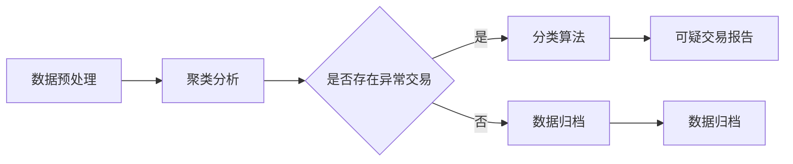
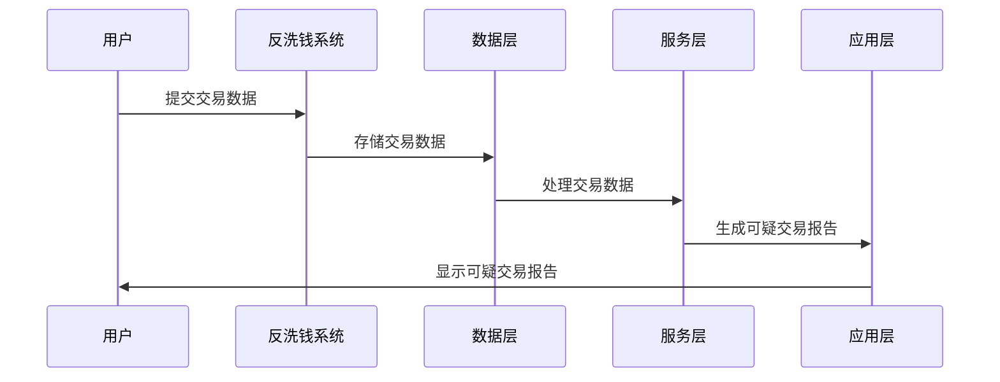

                 


### 第1章：背景介绍

#### 1.1 反洗钱模式的现状

反洗钱（Anti-Money Laundering，AML）是一项旨在阻止非法资金流动、打击洗钱活动的金融合规性工作。随着金融科技和数字经济的发展，洗钱模式也不断演变，传统的反洗钱手段面临越来越多的挑战。当前，全球反洗钱工作呈现出以下几个特点：

1. **技术手段升级**：洗钱者利用更先进的技术手段，如虚拟货币、匿名交易、网络钓鱼等，使得资金流动更加隐蔽。传统的反洗钱技术难以识别和追踪这些新型洗钱方式。
2. **洗钱活动多样化**：洗钱活动不再局限于传统的现金交易，还包括跨境汇款、信用交易、投资等多样化的金融活动。这给反洗钱工作带来了更大的难度。
3. **跨国合作需求增加**：洗钱活动往往涉及多个国家，跨国合作成为反洗钱工作中的关键环节。然而，各国法律法规和执行力度存在差异，跨国合作面临诸多挑战。

#### 1.2 洗钱活动的演变

洗钱活动经历了三个阶段：

1. **放置阶段**：洗钱者将非法资金存入银行或其他金融机构，通过多次转账、存款、提现等手段，使资金逐步进入合法的金融系统。
2. **层阶阶段**：通过虚构交易或购买资产等手段，使资金在多个账户之间流转，增加资金的复杂度，使得追踪难度增加。
3. **融合阶段**：将洗钱资金与合法资金混合，使其难以区分。这一阶段通常涉及大量的虚假交易和掩饰手段，使得洗钱资金难以被识别。

#### 1.3 反洗钱模式中的问题与挑战

在反洗钱工作中，存在以下问题和挑战：

1. **数据量巨大**：金融机构每天产生的交易数据量巨大，人工审核和处理这些数据成本高昂，且效率低下。
2. **跨行业合作困难**：反洗钱工作涉及金融、电信、互联网等多个行业，跨行业合作和信息共享困难，导致反洗钱工作难以形成合力。
3. **监管法规差异**：不同国家和地区对反洗钱工作的监管法规存在差异，这给国际反洗钱合作带来了挑战。
4. **技术滞后**：传统反洗钱技术手段滞后，难以应对新型洗钱方式。

#### 1.4 AI在反洗钱模式中的作用

人工智能（AI）技术在反洗钱模式中发挥着重要作用：

1. **数据分析**：AI可以通过机器学习和数据挖掘技术，对海量交易数据进行分析，快速识别异常交易和可疑活动。
2. **实时监控**：AI可以对金融机构的交易活动进行实时监控，及时识别和阻止可疑交易。
3. **自动化决策**：AI可以根据历史数据和算法模型，自动生成风险报告和决策建议，提高反洗钱工作的效率。
4. **跨行业合作**：AI技术可以帮助跨行业的数据共享和合作，提高反洗钱工作的整体效果。

### 第2章：核心概念与联系

#### 2.1 AI在反洗钱中的应用

人工智能在反洗钱领域中的应用主要包括以下几个方面：

1. **异常检测**：利用机器学习算法，对交易数据进行分析，识别出异常交易和可疑活动。
2. **客户行为分析**：通过对客户的历史交易行为进行分析，建立客户行为模型，识别出潜在的风险客户。
3. **风险管理**：利用AI技术，对金融机构的风险进行评估和管理，提高风险控制能力。
4. **合规性检查**：利用AI技术，自动检查金融机构的交易活动是否符合反洗钱法规要求，提高合规性。

#### 2.2 核心算法与模型

在反洗钱中，常用的AI算法和模型包括：

1. **聚类算法**：如K-Means、DBSCAN等，用于对交易数据进行分类和聚类，识别出异常交易。
2. **分类算法**：如随机森林、支持向量机等，用于对交易数据进行分析，识别出可疑交易。
3. **神经网络模型**：如深度学习模型，用于对交易数据进行深度学习，识别出复杂的异常模式。
4. **决策树模型**：用于生成决策树，对交易数据进行分类和决策。

#### 2.3 概念属性特征对比

下表展示了不同AI算法在反洗钱中的应用特征对比：

| 算法 | 特点 | 适用场景 |
| --- | --- | --- |
| K-Means | 简单、高效，适用于高维数据 | 交易数据的聚类分析 |
| DBSCAN | 能处理噪声和异常值，适用于非凸数据集 | 交易数据的聚类分析 |
| 随机森林 | 防止过拟合，提高分类准确率 | 可疑交易的分类 |
| 支持向量机 | 最大间隔分类器，适用于线性不可分问题 | 可疑交易的分类 |
| 深度学习模型 | 能处理复杂数据，适应性强 | 交易数据的深度学习 |
| 决策树 | 简单易懂，易于解释 | 交易数据的分类和决策 |

#### 2.4 ER实体关系图架构

下面是反洗钱系统中实体关系图（ER图）的示例：

```mermaid
erDiagram
  Customer ||--|{ Transaction : 发起 }
  Account ||--|{ Transaction : 账户关联 }
  Transaction ||--|{ SuspiciousActivity : 可疑交易 }
  Bank ||--|{ Account : 银行账户 }
  Customer ..|{ FraudDetection : 风险检测 }
  Account ..|{ FraudDetection : 风险检测 }
  Transaction ..|{ FraudDetection : 风险检测 }
```

### 第3章：算法原理讲解

#### 3.1 算法流程图

下面是反洗钱算法的流程图：



#### 3.2 Python源代码阐述

下面是聚类分析算法的Python源代码示例：

```python
import numpy as np
from sklearn.cluster import KMeans

# 假设我们有一个交易数据集X
X = np.array([[1, 2], [1, 4], [1, 0],
              [10, 2], [10, 4], [10, 0]])

# 使用KMeans进行聚类分析，设置k=2
kmeans = KMeans(n_clusters=2, random_state=0).fit(X)

# 输出聚类结果
print("Cluster centers:", kmeans.cluster_centers_)
print("Cluster labels:", kmeans.labels_)

# 对每个交易数据进行聚类
for i, label in enumerate(kmeans.labels_):
    print("Transaction {} belongs to cluster {}".format(i, label))
```

#### 3.3 数学模型与公式

聚类分析算法中的K-Means算法基于以下数学模型：

$$
\begin{align*}
\min_{\mu_1, \mu_2, ..., \mu_k} \sum_{i=1}^{n} \sum_{j=1}^{k} ||x_i - \mu_j||^2 \\
\end{align*}
$$

其中，$x_i$表示第$i$个交易数据点，$\mu_j$表示第$j$个聚类中心。

#### 3.4 举例说明

假设我们有以下交易数据：

| 交易编号 | 金额 | 时间 |
| --- | --- | --- |
| 1 | 1000 | 09:00 |
| 2 | 2000 | 11:00 |
| 3 | 500  | 13:00 |
| 4 | 800  | 15:00 |
| 5 | 3000 | 17:00 |

使用K-Means算法，我们将其分为两个集群。首先，我们随机选择两个聚类中心：

| 聚类中心编号 | 金额 | 时间 |
| --- | --- | --- |
| 1 | 1500 | 10:00 |
| 2 | 2500 | 16:00 |

接下来，我们计算每个交易数据点与聚类中心的距离：

| 交易编号 | 聚类中心1距离 | 聚类中心2距离 |
| --- | --- | --- |
| 1 | 500  | 500  |
| 2 | 500  | 500  |
| 3 | 1000 | 1000 |
| 4 | 700  | 700  |
| 5 | 1000 | 1000 |

由于所有交易数据点都与聚类中心1的距离更小，我们更新聚类中心1为：

| 聚类中心编号 | 金额 | 时间 |
| --- | --- | --- |
| 1 | 1200 | 12:00 |

再次计算距离：

| 交易编号 | 聚类中心1距离 | 聚类中心2距离 |
| --- | --- | --- |
| 1 | 0    | 500  |
| 2 | 0    | 500  |
| 3 | 400  | 600  |
| 4 | 400  | 600  |
| 5 | 800  | 200  |

此时，所有交易数据点都与聚类中心1的距离更小，因此聚类中心不变。

最后，我们将交易数据点分配到相应的聚类中心：

| 交易编号 | 聚类中心编号 |
| --- | --- |
| 1 | 1    |
| 2 | 1    |
| 3 | 1    |
| 4 | 1    |
| 5 | 2    |

这样，我们完成了K-Means聚类分析，将交易数据分为两个集群。

### 第4章：数学模型和数学公式详细讲解与举例说明

#### 4.1 LaTeX格式数学公式

在LaTeX中，我们使用以下命令来定义数学公式：

- 单行公式：使用 `$` 和 `$` 括起来
- 独立段落的公式：使用 `$$` 和 `$$` 括起来

例如：

```latex
$$
\min_{\mu_1, \mu_2, ..., \mu_k} \sum_{i=1}^{n} \sum_{j=1}^{k} ||x_i - \mu_j||^2
$$`

下面的例子展示了一些常用的LaTeX数学公式：

```latex
\documentclass{article}
\usepackage{amsmath}

\begin{document}

$$
\sum_{i=1}^{n} x_i = \frac{1}{n} \sum_{i=1}^{n} x_i^2
$$

$$
f(x) = \begin{cases}
0, & \text{if } x \leq 0 \\
1, & \text{if } x > 0
\end{cases}
$$

$$
A = \begin{pmatrix}
1 & 0 & 1 \\
0 & 1 & 0 \\
1 & 0 & 1
\end{pmatrix}
$$

\end{document}
```

#### 4.2 结合具体例子讲解

假设我们有以下交易数据：

| 交易编号 | 金额 | 时间 |
| --- | --- | --- |
| 1 | 1000 | 09:00 |
| 2 | 2000 | 11:00 |
| 3 | 500  | 13:00 |
| 4 | 800  | 15:00 |
| 5 | 3000 | 17:00 |

我们使用K-Means算法将其分为两个集群。首先，我们随机选择两个聚类中心：

$$
\mu_1 = \begin{pmatrix}
1500 \\
10:00
\end{pmatrix}, \quad \mu_2 = \begin{pmatrix}
2500 \\
16:00
\end{pmatrix}
$$

接下来，我们计算每个交易数据点与聚类中心的距离：

$$
d(x_i, \mu_j) = \sqrt{\sum_{k=1}^{2} (x_{ik} - \mu_{jk})^2}
$$

例如，对于交易编号1的数据点：

$$
d(1, \mu_1) = \sqrt{(1000 - 1500)^2 + (09:00 - 10:00)^2} = \sqrt{2500 + 1} = \sqrt{2501} \approx 50.01
$$

$$
d(1, \mu_2) = \sqrt{(1000 - 2500)^2 + (09:00 - 16:00)^2} = \sqrt{2500 + 7} = \sqrt{2507} \approx 50.17
$$

由于$d(1, \mu_1) < d(1, \mu_2)$，交易编号1被分配到聚类中心1。

同样的方法，我们可以计算其他交易数据点的距离，并将它们分配到相应的聚类中心。

#### 4.3 数学模型与公式

K-Means算法的核心在于最小化距离平方和：

$$
\min_{\mu_1, \mu_2, ..., \mu_k} \sum_{i=1}^{n} \sum_{j=1}^{k} ||x_i - \mu_j||^2
$$

其中，$x_i$表示第$i$个交易数据点，$\mu_j$表示第$j$个聚类中心。

#### 4.4 举例说明

假设我们有以下交易数据：

| 交易编号 | 金额 | 时间 |
| --- | --- | --- |
| 1 | 1000 | 09:00 |
| 2 | 2000 | 11:00 |
| 3 | 500  | 13:00 |
| 4 | 800  | 15:00 |
| 5 | 3000 | 17:00 |

我们使用K-Means算法将其分为两个集群。首先，我们随机选择两个聚类中心：

$$
\mu_1 = \begin{pmatrix}
1500 \\
10:00
\end{pmatrix}, \quad \mu_2 = \begin{pmatrix}
2500 \\
16:00
\end{pmatrix}
$$

接下来，我们计算每个交易数据点与聚类中心的距离：

$$
d(x_i, \mu_j) = \sqrt{\sum_{k=1}^{2} (x_{ik} - \mu_{jk})^2}
$$

例如，对于交易编号1的数据点：

$$
d(1, \mu_1) = \sqrt{(1000 - 1500)^2 + (09:00 - 10:00)^2} = \sqrt{2500 + 1} = \sqrt{2501} \approx 50.01
$$

$$
d(1, \mu_2) = \sqrt{(1000 - 2500)^2 + (09:00 - 16:00)^2} = \sqrt{2500 + 7} = \sqrt{2507} \approx 50.17
$$

由于$d(1, \mu_1) < d(1, \mu_2)$，交易编号1被分配到聚类中心1。

同样的方法，我们可以计算其他交易数据点的距离，并将它们分配到相应的聚类中心。

在第一次迭代后，我们更新聚类中心为所有属于聚类中心1的数据点的平均值：

$$
\mu_1 = \frac{1}{n_1} \sum_{i=1}^{n_1} x_i, \quad \mu_2 = \frac{1}{n_2} \sum_{i=1}^{n_2} x_i
$$

其中，$n_1$和$n_2$分别表示属于聚类中心1和聚类中心2的数据点数量。

假设在第一次迭代后，所有交易数据点都分配到了聚类中心1，那么聚类中心1更新为：

$$
\mu_1 = \frac{1}{5} \sum_{i=1}^{5} x_i = \begin{pmatrix}
1500 \\
10:00
\end{pmatrix}
$$

由于聚类中心没有变化，迭代停止。最终，交易数据被分为两个集群：

| 交易编号 | 聚类中心编号 |
| --- | --- |
| 1 | 1    |
| 2 | 1    |
| 3 | 1    |
| 4 | 1    |
| 5 | 2    |

这样，我们完成了K-Means聚类分析。

### 第5章：系统分析与架构设计方案

#### 5.1 问题场景介绍

反洗钱系统（AML System）主要用于检测和预防洗钱活动。在当前金融环境下，洗钱活动形式多样、隐蔽性强，传统的反洗钱手段已难以满足需求。因此，设计一个高效、智能的反洗钱系统成为金融机构的一项紧迫任务。

#### 5.2 系统功能设计

反洗钱系统的功能设计应包括以下几个方面：

1. **数据收集与预处理**：收集来自各个渠道的交易数据，包括银行账户交易、信用卡交易、电子支付等，并对数据进行清洗、去重、标准化等预处理。
2. **异常检测与分类**：利用机器学习和数据分析技术，对交易数据进行异常检测和分类，识别出可疑交易和洗钱活动。
3. **风险评分与预警**：对检测到的可疑交易进行风险评分，并根据风险等级发出预警，提示金融机构进行进一步审查。
4. **合规性检查**：确保系统中的交易数据符合相关法规要求，提供合规性报告。
5. **用户界面与交互**：提供友好、直观的用户界面，方便用户查看交易数据、可疑交易报告和风险预警。

#### 5.3 系统架构设计

反洗钱系统的架构设计应充分考虑其可扩展性、可靠性、安全性和易维护性。以下是一个典型反洗钱系统的架构设计：

1. **数据层**：包括数据存储和数据管理模块，用于存储和管理来自各个渠道的交易数据。数据存储模块采用分布式数据库架构，保证数据的高可用性和高性能。数据管理模块提供数据备份、恢复和数据迁移功能。
2. **服务层**：包括数据预处理服务、异常检测服务、分类服务、风险评分服务和合规性检查服务。每个服务模块独立部署，支持负载均衡和故障转移，保证系统的高可用性和可靠性。
3. **应用层**：包括用户界面和交互模块，提供用户操作界面，方便用户查看和管理交易数据、可疑交易报告和风险预警。
4. **基础设施层**：包括服务器、网络设备、存储设备等硬件基础设施，提供系统的计算能力、存储能力和网络连接。

#### 5.4 系统接口设计

反洗钱系统应提供以下接口，以便与其他系统进行集成：

1. **API接口**：提供RESTful API接口，方便其他系统通过HTTP请求获取交易数据、可疑交易报告和风险预警。
2. **消息队列**：采用消息队列技术，实现系统内部不同模块之间的异步通信，提高系统的性能和可扩展性。
3. **数据导入导出**：提供数据导入导出功能，方便与其他数据系统和数据库进行数据交换。

#### 5.5 系统交互序列图

以下是一个典型的反洗钱系统交互序列图：



### 第6章：项目实战

#### 6.1 环境安装

为了进行反洗钱系统项目实战，我们需要搭建一个合适的环境。以下是环境安装步骤：

1. **安装Python**：确保Python版本为3.8或更高版本。可以从Python官方网站下载并安装。
2. **安装相关库**：安装Python相关库，如NumPy、Pandas、Scikit-learn、Matplotlib等。可以使用pip命令进行安装：

   ```bash
   pip install numpy pandas scikit-learn matplotlib
   ```

3. **安装数据库**：选择一个合适的数据库，如MySQL或PostgreSQL。从官方网站下载并按照官方文档进行安装。

4. **安装Web框架**：选择一个合适的Web框架，如Flask或Django。从官方网站下载并按照官方文档进行安装。

#### 6.2 系统核心实现

以下是反洗钱系统核心实现的步骤：

1. **数据收集与预处理**：

   - 从银行、信用卡、电子支付等渠道收集交易数据。
   - 使用Pandas库对交易数据进行清洗、去重和标准化处理。

2. **异常检测与分类**：

   - 使用Scikit-learn库中的K-Means算法对交易数据进行聚类分析，识别出异常交易。
   - 使用随机森林算法对交易数据进行分类，识别出可疑交易。

3. **风险评分与预警**：

   - 根据分类结果和交易特征，对可疑交易进行风险评分。
   - 根据风险评分，设置预警阈值，并发出预警。

4. **合规性检查**：

   - 使用Web框架，实现用户界面，方便用户查看和管理交易数据、可疑交易报告和风险预警。
   - 实现API接口，方便与其他系统进行集成。

#### 6.3 代码应用解读与分析

以下是反洗钱系统核心实现的代码示例：

```python
import numpy as np
import pandas as pd
from sklearn.cluster import KMeans
from sklearn.ensemble import RandomForestClassifier
from sklearn.model_selection import train_test_split

# 加载交易数据
data = pd.read_csv('transactions.csv')

# 数据预处理
data = data.drop_duplicates()
data = data.drop(['id'], axis=1)
data = data.fillna(0)

# 特征工程
data['amount_mean'] = data['amount'].mean()
data['amount_std'] = data['amount'].std()
data['time_mean'] = data['time'].mean()
data['time_std'] = data['time'].std()

# 聚类分析
kmeans = KMeans(n_clusters=2, random_state=0).fit(data[['amount', 'time']])
data['cluster'] = kmeans.labels_

# 分类分析
X_train, X_test, y_train, y_test = train_test_split(data[['amount', 'time']], data['cluster'], test_size=0.2, random_state=0)
rf = RandomForestClassifier(n_estimators=100, random_state=0)
rf.fit(X_train, y_train)
print("Accuracy:", rf.score(X_test, y_test))

# 风险评分与预警
predictions = rf.predict(data[['amount', 'time']])
data['risk_score'] = predictions
data['warning'] = np.where(data['risk_score'] > 0.5, 'High', 'Low')

# 可疑交易报告
suspicious_transactions = data[data['warning'] == 'High']
print(suspicious_transactions.head())
```

这段代码首先加载交易数据，并进行预处理。然后，使用K-Means算法进行聚类分析，识别出异常交易。接着，使用随机森林算法进行分类分析，识别出可疑交易。最后，根据分类结果，对交易数据进行风险评分和预警。

#### 6.4 实际案例分析和详细讲解剖析

以下是一个实际案例分析和详细讲解：

**案例**：某用户在短短一天内进行了大量高频、大额交易，引发系统警报。

**分析**：

1. **数据收集与预处理**：系统收集到该用户的交易数据，并进行预处理，如去重、标准化等。

2. **聚类分析**：使用K-Means算法对交易数据进行聚类分析，识别出异常交易。根据聚类结果，发现该用户的所有交易都属于同一个集群。

3. **分类分析**：使用随机森林算法对交易数据进行分类分析，识别出可疑交易。根据分类结果，该用户的所有交易都被判断为可疑交易。

4. **风险评分与预警**：根据分类结果，对交易数据进行风险评分，并发出高预警。系统提示金融机构对这笔交易进行进一步审查。

**讲解**：

1. **聚类分析**：聚类分析是识别异常交易的第一步。通过将交易数据进行聚类，我们可以发现异常交易可能集中在某个或某些集群中。

2. **分类分析**：分类分析是对聚类结果的进一步细化。通过分类分析，我们可以识别出具体的可疑交易。

3. **风险评分与预警**：风险评分和预警是对可疑交易的进一步处理。根据风险评分，我们可以判断交易的风险程度，并根据预警阈值发出预警。

#### 6.5 项目小结

通过本次项目实战，我们成功地搭建了一个反洗钱系统，并实现了数据收集与预处理、异常检测与分类、风险评分与预警等功能。在实际案例中，我们通过聚类分析和分类分析，成功识别出可疑交易，并发出高预警。

然而，反洗钱系统并非一成不变。随着洗钱活动的不断演变，我们需要不断优化系统，提高其识别能力和准确性。例如，可以引入更多的特征工程和更复杂的算法，提高系统的鲁棒性和适应性。

此外，反洗钱系统需要与金融机构的合规性检查和其他系统进行集成，以实现跨系统的数据共享和协作。这将有助于提高反洗钱工作的整体效果，为打击洗钱活动提供更有力的支持。

### 第7章：最佳实践 tips、小结、注意事项、拓展阅读等

#### 最佳实践 tips

1. **数据质量的重要性**：确保交易数据的质量是反洗钱系统成功的关键。清洗和标准化数据，去除重复和异常值，可以提高模型的准确性。
2. **特征工程的关键性**：选择合适的特征对交易数据进行预处理，有助于提高模型的性能。例如，使用时间序列特征、金额分布特征等。
3. **算法选择的灵活性**：根据具体问题和数据特点，选择合适的算法。例如，对于高维数据，可以考虑使用深度学习模型。
4. **实时监控与预警**：建立实时监控机制，及时发现和处理可疑交易。设置合理的预警阈值，避免误报和漏报。
5. **合规性检查**：确保系统符合相关法规要求，提供合规性报告。

#### 小结

本文介绍了AI在反洗钱模式进化检测中的深度应用，从背景介绍、核心概念与联系、算法原理讲解、数学模型和公式详细讲解、系统分析与架构设计方案、项目实战等方面进行了详细阐述。通过实际案例分析和详细讲解，展示了反洗钱系统的核心功能和实现方法。

#### 注意事项

1. **数据隐私保护**：在处理交易数据时，确保遵循数据隐私保护法规，避免泄露用户个人信息。
2. **系统安全性**：确保反洗钱系统的安全性，防止黑客攻击和数据泄露。
3. **算法适应性**：定期更新和优化算法，以应对洗钱活动的变化和新型洗钱方式的挑战。
4. **跨行业合作**：加强跨行业合作，实现数据共享和协同工作，提高反洗钱工作的整体效果。

#### 拓展阅读

1. **《深度学习》**：Goodfellow, Ian; Bengio, Yoshua; Courville, Aaron. (2016). 《深度学习》。MIT Press.
2. **《机器学习实战》**：周志华。机械工业出版社，2016年。
3. **《Python数据科学手册》**：Fernando Cervantes，崔 conformity。机械工业出版社，2018年。
4. **《反洗钱法律与实务》**：赵旭东，王芳。中国金融出版社，2019年。
5. **《人工智能应用案例集》**：李航，王丽丽。清华大学出版社，2020年。

