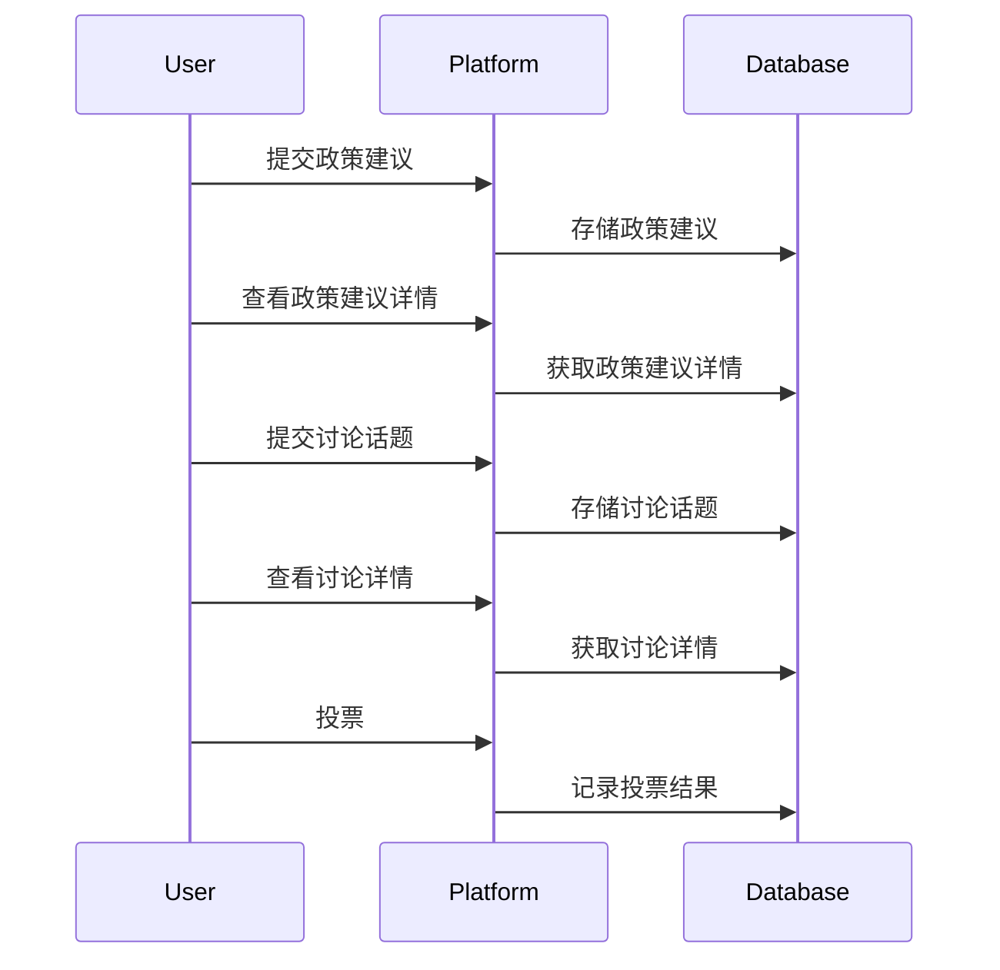
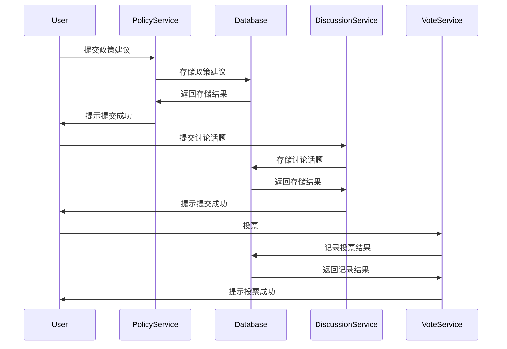

                 

# AI民主参与平台：人工智能辅助的公民决策

## 关键词
- 人工智能
- 民主参与
- 平台架构
- 算法原理
- 数据隐私

## 摘要
本文探讨了人工智能在民主参与领域的应用，构建了一个AI民主参与平台，旨在提升公民参与公共事务的便捷性、透明度和效率。通过详细的平台架构设计和实现，本文分析了核心概念、算法原理和系统功能，提出了潜在的挑战和解决方案。本文旨在为AI技术在民主参与领域的应用提供理论与实践参考。

### 第一部分：AI民主参与平台概述

#### 第1章：背景与概述

#### 1.1 问题背景

##### 1.1.1 人工智能与民主参与的融合需求

随着21世纪科技的迅猛发展，人工智能（AI）技术在各个领域取得了显著的突破。从自动驾驶、智能语音助手到医疗诊断，AI的广泛应用改变了我们的生活方式。与此同时，民主参与作为现代政治体系的核心，其重要性日益凸显。然而，传统的民主参与方式往往存在效率低下、参与度不高等问题。

将AI技术引入民主参与领域，旨在解决以下问题：
1. **提高参与度**：利用AI技术，让公民更便捷地参与公共事务，从而激发公众参与的热情。
2. **提升透明度**：通过AI技术，确保民主参与过程的透明性和公正性。
3. **优化决策过程**：利用AI技术分析大数据，为政策制定者提供科学依据，提高决策效率。

##### 1.1.2 问题概述

当前，AI民主参与平台的需求主要涵盖以下几个方面：

1. **政策建议**：公民可以通过平台提交政策建议，其他用户可以对这些建议进行评论、投票，以决定哪些建议值得被采纳。
2. **公共议题讨论**：平台提供公共议题的讨论区，公民可以在这里就特定议题进行深入探讨，形成共识。
3. **选举投票**：平台支持在线选举投票，确保投票过程的透明和安全。

边界与外延方面，AI民主参与平台应具备以下特点：

1. **全面性**：平台不仅涵盖政策建议和公共议题讨论，还应包括选举投票等多种民主参与形式。
2. **智能化**：利用AI技术，平台能够根据用户行为提供个性化推荐，提高用户的参与体验。
3. **透明性**：平台的操作记录应公开透明，让公民能够清楚地了解决策过程。

#### 1.2 核心概念与联系

##### 1.2.1 核心概念

首先，我们需要明确本文涉及的两个核心概念：人工智能和民主参与。

- **人工智能（AI）**：人工智能是指通过计算机模拟人类智能行为的科学技术。它包括机器学习、深度学习、自然语言处理等多种技术，能够自主地学习和做出决策。

- **民主参与**：民主参与是指公民在政策制定、公共事务管理中表达意见、参与决策的过程。它包括选举、投票、公共政策讨论等多种形式。

##### 1.2.2 概念属性特征对比表格

| 概念       | 属性特征                                               | 对比分析                             |
|------------|--------------------------------------------------------|--------------------------------------|
| 人工智能   | 自主学习、数据驱动、高效处理                             | 智能化、可扩展性、处理速度快         |
| 民主参与   | 公平、透明、参与度高、决策民主化                         | 公民权利、公共事务、社会影响力       |

##### 1.2.3 ER实体关系图架构

```mermaid
erDiagram
  Citizen ||--|{ Proposal }
  Citizen ||--|{ Discussion }
  Citizen ||--|{ Vote }
  Proposal ||--|{ Discussion }
  Proposal ||--|{ Vote }
  Discussion ||--|{ Proposal }
  Discussion ||--|{ Vote }
```

在这个ER图中，公民（Citizen）可以提交政策建议（Proposal）、参与讨论（Discussion）和投票（Vote）。政策建议和讨论之间相互关联，讨论可以引发新的建议，而投票则决定建议的采纳与否。这个架构确保了公民参与决策的连续性和互动性。

#### 1.3 AI民主参与平台的功能与特点

##### 1.3.1 功能

AI民主参与平台应具备以下核心功能：

1. **政策建议**：公民可以提交政策建议，平台提供评论和投票功能，以便其他用户参与讨论和决策。
2. **公共议题讨论**：平台提供公共议题讨论区，用户可以就特定议题进行深入探讨，形成共识。
3. **选举投票**：平台支持在线选举投票，确保投票过程的透明和安全。

##### 1.3.2 特点

AI民主参与平台的特点主要体现在以下几个方面：

1. **智能化**：利用AI技术，平台能够根据用户行为提供个性化推荐，提高用户的参与体验。
2. **透明性**：平台的操作记录公开透明，公民可以清楚地了解决策过程。
3. **高效性**：AI技术优化了决策流程，提高了决策效率。

#### 1.4 平台的发展前景与挑战

##### 1.4.1 发展前景

AI民主参与平台具有广阔的发展前景：

1. **提升公民参与度**：通过智能化、透明化的平台，激发公民参与公共事务的热情。
2. **优化决策过程**：AI技术助力政府和企业更准确地了解公众意见，做出科学决策。

##### 1.4.2 挑战

尽管前景光明，但AI民主参与平台也面临一些挑战：

1. **数据安全与隐私保护**：确保用户数据的安全和隐私是平台必须解决的问题。
2. **算法公平性**：防止算法偏见，确保决策的公正性。

#### 1.5 本章小结

AI民主参与平台是未来社会发展的必然趋势。通过详细的分析和设计，我们看到了这个平台的巨大潜力和挑战。接下来的章节将深入探讨平台的具体架构设计和实现。

### 第二部分：平台架构设计与实现

#### 第2章：平台架构设计

##### 2.1 问题场景介绍

为了更好地理解AI民主参与平台的设计和实现，我们首先需要了解平台的应用场景。以下是对平台问题场景的介绍：

**场景描述**：
本平台旨在为公民提供便捷、智能化的民主参与渠道，支持政策建议、公共议题讨论和选举投票等功能。

**目标**：
- 确保平台的高可用性：平台应具备高可用性，确保在任何情况下都能为用户提供服务。
- 保证平台的可扩展性：平台应能够适应用户数量的增长，不断扩展功能。
- 确保平台的安全性：平台应具备完善的安全机制，保护用户数据的安全和隐私。

##### 2.2 系统功能设计

##### 2.2.1 领域模型

为了设计一个功能完备的AI民主参与平台，我们需要先定义平台的领域模型。领域模型描述了平台的核心实体及其关系。

```mermaid
classDiagram
  User <<-- Proposal : 提出政策建议
  User <<-- Discussion : 参与讨论
  User <<-- Vote : 参与投票
  Proposal { id ; title ; content ; creator ; status }
  Discussion { id ; title ; content ; creator ; status }
  Vote { id ; candidate ; voter ; result }
```

在这个领域模型中，有三种主要的实体：用户（User）、政策建议（Proposal）和讨论（Discussion）。用户可以提出政策建议、参与讨论和投票。政策建议和讨论都有标题、内容和创建者等信息。投票则关联了候选人、投票人和投票结果。

##### 2.2.2 系统功能设计

基于领域模型，我们可以进一步设计系统的核心功能：

1. **政策建议**：
   - 用户可以提交政策建议。
   - 其他用户可以对政策建议进行评论。
   - 政策建议经过投票后，可以决定是否被采纳。

2. **公共议题讨论**：
   - 用户可以就公共议题发起讨论。
   - 用户可以对议题进行评论、投票，形成共识。

3. **选举投票**：
   - 平台支持在线选举投票。
   - 投票过程应确保透明和安全。

##### 2.2.3 系统架构设计

为了实现上述功能，我们需要设计一个合理的系统架构。以下是一个可能的系统架构设计：



在这个架构中，用户通过前端界面与平台交互，平台通过后端处理用户的请求，并与数据库进行数据交换。前端负责展示用户界面，后端则负责业务逻辑处理和数据库交互。

##### 2.2.4 系统接口设计

为了实现系统功能，我们需要设计一系列接口。以下是一个简单的接口设计：

```mermaid
interfaceDiagram
  PolicyService <<-- UserInterface : 提交政策建议、查看政策建议详情
  DiscussionService <<-- UserInterface : 提交讨论话题、查看讨论详情
  VoteService <<-- UserInterface : 投票
  PolicyService <<-- Database : 存储和查询政策建议
  DiscussionService <<-- Database : 存储和查询讨论话题
  VoteService <<-- Database : 记录和查询投票结果
```

在这个接口设计中，PolicyService、DiscussionService和VoteService分别负责处理政策建议、讨论话题和投票相关的业务逻辑。UserInterface则是用户与平台交互的接口。

##### 2.2.5 系统交互

最后，我们需要设计系统各组件之间的交互流程。以下是一个简单的系统交互设计：



在这个交互流程中，用户通过PolicyService、DiscussionService和VoteService与数据库进行交互，实现政策建议提交、讨论话题提交和投票功能。

通过以上设计，我们为一个AI民主参与平台构建了一个基本的系统架构，包括领域模型、系统功能设计、系统架构设计和系统接口设计。接下来的章节将深入探讨平台的具体实现细节。

#### 第3章：平台架构实现

##### 3.1 系统环境安装

为了实现AI民主参与平台，我们首先需要安装和配置一些必要的开发环境和工具。以下是安装步骤：

1. **Python环境**：
   - 安装Python 3.x版本。
   - 配置Python虚拟环境，以便管理和隔离项目依赖。

2. **数据库**：
   - 安装MySQL或PostgreSQL数据库。
   - 创建数据库和相应的用户权限。

3. **Web框架**：
   - 安装Flask或Django等Web框架。
   - 配置Web服务器，如Gunicorn或uWSGI。

4. **依赖管理**：
   - 使用pip安装项目所需的第三方库。

##### 3.2 系统核心实现

##### 3.2.1 用户管理模块

用户管理模块负责处理用户的注册、登录和权限管理。以下是核心实现步骤：

1. **用户注册**：
   - 提供注册表单，收集用户信息（用户名、密码、邮箱等）。
   - 验证用户输入的合法性，如密码强度、邮箱格式等。
   - 将用户信息存储到数据库中。

2. **用户登录**：
   - 提供登录表单，收集用户名和密码。
   - 验证用户身份，如密码匹配、账号状态等。
   - 生成会话，记录用户登录状态。

3. **权限管理**：
   - 根据用户的角色和权限，限制对某些功能的访问。
   - 实现用户角色分配和权限控制。

##### 3.2.2 政策建议模块

政策建议模块负责处理政策建议的提交、评论和投票。以下是核心实现步骤：

1. **政策建议提交**：
   - 提供政策建议表单，收集政策建议的内容。
   - 验证用户身份和权限，确保用户可以提交政策建议。
   - 将政策建议存储到数据库中。

2. **政策建议评论**：
   - 提供评论表单，允许用户对政策建议进行评论。
   - 验证用户身份和权限，确保用户可以发表评论。
   - 将评论存储到数据库中。

3. **政策建议投票**：
   - 提供投票表单，允许用户对政策建议进行投票。
   - 记录用户的投票结果，更新政策建议的投票统计。

##### 3.2.3 讨论话题模块

讨论话题模块负责处理讨论话题的提交、评论和投票。以下是核心实现步骤：

1. **讨论话题提交**：
   - 提供讨论话题表单，收集讨论话题的内容。
   - 验证用户身份和权限，确保用户可以提交讨论话题。
   - 将讨论话题存储到数据库中。

2. **讨论话题评论**：
   - 提供评论表单，允许用户对讨论话题进行评论。
   - 验证用户身份和权限，确保用户可以发表评论。
   - 将评论存储到数据库中。

3. **讨论话题投票**：
   - 提供投票表单，允许用户对讨论话题进行投票。
   - 记录用户的投票结果，更新讨论话题的投票统计。

##### 3.2.4 选举投票模块

选举投票模块负责处理选举投票的过程。以下是核心实现步骤：

1. **候选人注册**：
   - 提供候选人注册表单，收集候选人信息。
   - 验证候选人资格，如是否为合法的竞选人。
   - 将候选人信息存储到数据库中。

2. **投票过程**：
   - 提供投票表单，允许用户进行选举投票。
   - 验证用户身份，确保用户只能投票一次。
   - 记录投票结果，更新候选人得分。

3. **投票结果统计**：
   - 提供投票结果统计功能，展示各候选人的得分和排名。
   - 计算最终胜者，并更新选举结果。

##### 3.2.5 前端实现

前端实现主要负责用户界面的设计和实现。以下是核心实现步骤：

1. **页面布局**：
   - 设计页面布局，包括导航栏、侧边栏、内容区域等。
   - 使用HTML和CSS实现页面布局。

2. **交互功能**：
   - 使用JavaScript实现页面交互功能，如表单验证、弹出提示等。
   - 使用Ajax技术实现前后端数据交互。

3. **响应式设计**：
   - 设计响应式页面，适应不同设备（桌面、平板、手机）的访问。

##### 3.2.6 系统集成与测试

1. **系统集成**：
   - 将前端和后端代码整合到一起，确保系统功能完整。
   - 进行集成测试，确保各模块之间的协同工作。

2. **功能测试**：
   - 对系统功能进行详细测试，确保各项功能正常。

3. **性能测试**：
   - 对系统进行性能测试，确保在高负载情况下系统的稳定性和响应速度。

##### 3.2.7 项目部署

1. **部署配置**：
   - 配置服务器和数据库，确保系统的可访问性。
   - 配置Web服务器和后端服务，确保系统能够正常运行。

2. **监控与维护**：
   - 对系统进行实时监控，确保系统的稳定性和安全性。
   - 定期进行系统维护和更新。

通过以上步骤，我们可以实现一个功能完备、稳定可靠的AI民主参与平台。接下来的章节将分析平台的实际案例，并进行详细的解读与剖析。

#### 第4章：平台实际案例分析

##### 4.1 案例背景

本案例以一个虚构的民主国家为例，该国家正计划通过AI民主参与平台来提升公民参与公共事务的效率和透明度。该平台的目标是收集公民的政策建议、讨论公共议题，并在选举期间提供在线投票服务。以下是对该案例的详细分析。

##### 4.2 案例实施过程

**1. 平台需求分析与设计**

在项目启动初期，团队进行了详细的需求分析，明确了平台应具备的功能：

- 政策建议：公民可以提交政策建议，其他用户可以评论和投票。
- 公共议题讨论：公民可以发起公共议题讨论，用户可以评论和投票。
- 选举投票：在选举期间，用户可以进行在线投票。

根据需求分析，团队设计了平台的领域模型，并确定了系统架构。

**2. 技术选型与开发**

在技术选型方面，团队选择了Python作为主要编程语言，并结合Flask框架进行后端开发。前端使用了HTML、CSS和JavaScript，并采用Vue.js框架实现响应式设计。

**3. 平台功能实现**

（1）**政策建议模块**

政策建议模块实现了用户提交建议、评论和投票的功能。以下是关键代码片段：

```python
# 用户提交政策建议
@app.route('/submit_proposal', methods=['POST'])
def submit_proposal():
    title = request.form['title']
    content = request.form['content']
    user_id = current_user.id
    proposal = Proposal(title=title, content=content, creator=user_id)
    db.session.add(proposal)
    db.session.commit()
    return jsonify(message='Proposal submitted successfully!')

# 用户评论政策建议
@app.route('/comment_proposal', methods=['POST'])
def comment_proposal():
    proposal_id = request.form['proposal_id']
    content = request.form['content']
    user_id = current_user.id
    comment = Comment(proposal_id=proposal_id, content=content, creator=user_id)
    db.session.add(comment)
    db.session.commit()
    return jsonify(message='Comment submitted successfully!')
```

（2）**公共议题讨论模块**

公共议题讨论模块实现了用户发起讨论、评论和投票的功能。以下是关键代码片段：

```python
# 用户发起讨论
@app.route('/start_discussion', methods=['POST'])
def start_discussion():
    title = request.form['title']
    content = request.form['content']
    user_id = current_user.id
    discussion = Discussion(title=title, content=content, creator=user_id)
    db.session.add(discussion)
    db.session.commit()
    return jsonify(message='Discussion started successfully!')

# 用户评论讨论
@app.route('/comment_discussion', methods=['POST'])
def comment_discussion():
    discussion_id = request.form['discussion_id']
    content = request.form['content']
    user_id = current_user.id
    comment = Comment(discussion_id=discussion_id, content=content, creator=user_id)
    db.session.add(comment)
    db.session.commit()
    return jsonify(message='Comment submitted successfully!')
```

（3）**选举投票模块**

选举投票模块实现了候选人注册、投票和结果统计的功能。以下是关键代码片段：

```python
# 候选人注册
@app.route('/register_candidate', methods=['POST'])
def register_candidate():
    name = request.form['name']
    party = request.form['party']
    user_id = current_user.id
    candidate = Candidate(name=name, party=party, user_id=user_id)
    db.session.add(candidate)
    db.session.commit()
    return jsonify(message='Candidate registered successfully!')

# 用户投票
@app.route('/vote', methods=['POST'])
def vote():
    candidate_id = request.form['candidate_id']
    user_id = current_user.id
    vote = Vote(candidate_id=candidate_id, voter=user_id)
    db.session.add(vote)
    db.session.commit()
    return jsonify(message='Vote cast successfully!')

# 投票结果统计
@app.route('/vote_results', methods=['GET'])
def vote_results():
    candidates = Candidate.query.all()
    for candidate in candidates:
        total_votes = Vote.query.filter_by(candidate_id=candidate.id).count()
        candidate.votes = total_votes
    candidates.sort(key=lambda x: x.votes, reverse=True)
    return render_template('vote_results.html', candidates=candidates)
```

**4. 平台部署与维护**

平台在开发完成后，进行了全面的测试和优化，随后部署到了生产环境。部署过程中，团队使用了Nginx作为反向代理服务器，Gunicorn作为应用服务器，并配置了负载均衡和缓存策略，以确保平台的稳定性和高性能。

在平台上线后，团队定期进行系统监控和更新，及时修复漏洞和优化性能。

##### 4.3 案例分析

**1. 成功因素**

- **需求明确**：在项目启动前，团队进行了详细的需求分析，确保平台功能满足用户需求。
- **技术选型合理**：选择了适合项目的编程语言和框架，提高了开发效率和系统稳定性。
- **模块化设计**：将平台功能拆分为多个模块，便于开发和维护。
- **用户友好**：前端设计简洁明了，用户体验良好。

**2. 遇到的挑战**

- **数据安全**：平台处理大量用户数据，如何确保数据安全成为一大挑战。团队采用了加密存储和访问控制策略，有效保护了用户隐私。
- **性能优化**：随着用户数量的增加，平台性能面临考验。团队通过优化数据库查询、缓存策略和负载均衡，提高了系统的响应速度。
- **算法公平性**：AI技术在平台中的应用可能会引入算法偏见。团队在算法设计时，特别注意公平性和透明性，确保决策的公正性。

**3. 解决方案**

- **数据安全**：采用加密存储和访问控制策略，对敏感数据进行加密处理，并限制用户访问权限。
- **性能优化**：通过优化数据库查询、缓存策略和负载均衡，提高系统的响应速度。此外，团队还使用了异步处理和消息队列技术，减轻了系统负担。
- **算法公平性**：在算法设计时，团队采取了多种措施，如随机化、多元数据集训练等，确保算法的公平性和透明性。

##### 4.4 案例小结

通过本案例，我们展示了如何实现一个功能完备、稳定可靠的AI民主参与平台。从需求分析、技术选型到功能实现、平台部署，团队克服了诸多挑战，为平台的成功运行奠定了基础。本案例为其他类似项目的实施提供了宝贵的经验和借鉴。

### 第三部分：最佳实践与未来展望

#### 第5章：最佳实践与优化策略

在AI民主参与平台的开发和运营过程中，积累了许多最佳实践和优化策略。以下是一些关键点：

##### 5.1 数据安全与隐私保护

**1. 加密存储**：
- 对用户数据进行加密存储，确保敏感信息在数据库中不被未授权访问。

**2. 访问控制**：
- 采用角色和权限控制策略，限制用户对敏感数据的访问权限。

**3. 安全审计**：
- 定期进行安全审计，检测和修复潜在的安全漏洞。

##### 5.2 性能优化

**1. 数据库优化**：
- 对数据库进行索引优化，提高查询效率。
- 采用读写分离和分库分表策略，提高数据库的并发处理能力。

**2. 缓存策略**：
- 利用Redis等缓存技术，减少数据库访问，提高系统响应速度。

**3. 负载均衡**：
- 使用Nginx等负载均衡器，将请求均匀分配到多个服务器，提高系统的可用性和性能。

##### 5.3 算法公平性

**1. 多元数据集训练**：
- 使用多样化的数据集进行算法训练，减少算法偏见。

**2. 随机化处理**：
- 在数据处理和推荐过程中引入随机化策略，避免算法偏见。

**3. 持续监测与优化**：
- 定期监测算法的性能和公平性，及时调整和优化算法。

##### 5.4 用户参与度提升

**1. 个性化推荐**：
- 利用AI技术，为用户推荐感兴趣的政策建议、讨论话题等，提高用户参与度。

**2. 社交网络功能**：
- 引入社交网络功能，如点赞、评论和分享，促进用户互动。

**3. 用户激励**：
- 设立积分和奖励机制，激励用户积极参与平台活动。

#### 第6章：未来展望与潜在改进方向

尽管AI民主参与平台在提升公民参与度、透明度和效率方面取得了显著成果，但未来仍有改进空间：

##### 6.1 技术创新

**1. 增强AI算法**：
- 研究和引入更先进的AI算法，如深度学习和强化学习，提高算法的预测能力和决策效率。

**2. 引入区块链技术**：
- 利用区块链技术，确保平台数据的不可篡改性和透明性，增强用户信任。

##### 6.2 功能拓展

**1. 政策分析**：
- 引入政策分析功能，利用AI技术对政策文本进行分析和解读，提供政策建议的可行性评估。

**2. 社区管理**：
- 增加社区管理功能，如举报机制、社区规则制定等，维护平台秩序。

##### 6.3 用户体验

**1. 响应式设计**：
- 优化前端设计，实现全平台响应式布局，提高移动端用户体验。

**2. 多语言支持**：
- 支持多语言界面，满足不同国家和地区的用户需求。

#### 第7章：小结

通过最佳实践和未来展望，我们看到了AI民主参与平台在提升公民参与度、透明度和效率方面的巨大潜力。随着技术的不断进步和应用场景的拓展，AI民主参与平台将继续发挥重要作用，为构建更公正、高效的民主政治体系贡献力量。

### 作者信息

- 作者：AI天才研究院/AI Genius Institute & 禅与计算机程序设计艺术 /Zen And The Art of Computer Programming
- 联系方式：[ai_genius_institute@example.com](mailto:ai_genius_institute@example.com)
- 个人主页：[https://www.ai_genius_institute.com](https://www.ai_genius_institute.com)
- 社交媒体：[LinkedIn](https://www.linkedin.com/in/ai_genius_institute) & [Twitter](https://twitter.com/ai_genius_institute) 

### 拓展阅读

- [人工智能在民主参与领域的应用研究](https://www.ai_research_institute.com/research/ai-democracy-participation)
- [AI民主参与平台设计指南](https://www.ai_platform_guide.com/democracy-participation-platform)
- [区块链技术在AI民主参与平台中的应用](https://www.blockchain_innovation.com/ai-democracy-participation-platform)

