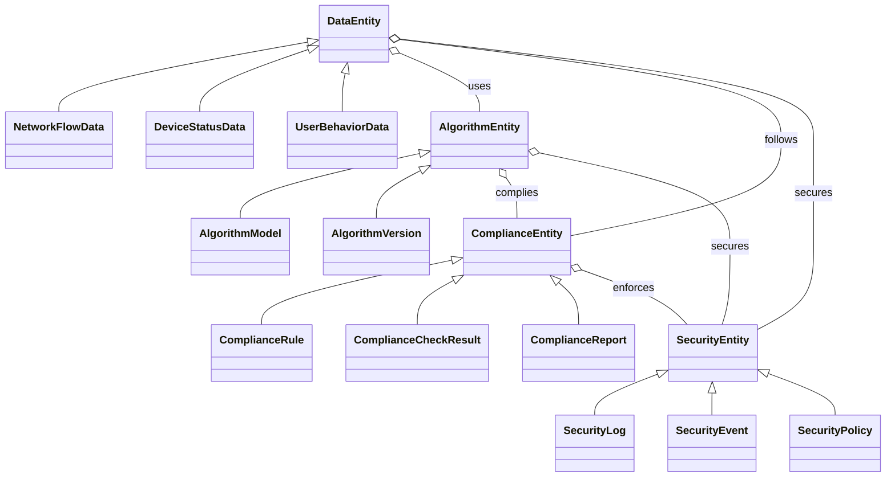

                 

# 《AI治理平台选择和实施的最佳实践》

## 关键词
- AI治理平台
- 平台选择
- 实施最佳实践
- 人工智能治理
- 安全与合规
- 可扩展性与灵活性

## 摘要
本文旨在深入探讨AI治理平台的选择和实施的最佳实践。随着人工智能技术的迅猛发展，如何有效地治理AI系统已成为企业和组织面临的重要挑战。本文将首先介绍AI治理平台的基本概念和重要性，然后详细分析平台选择和实施过程中的关键步骤，包括市场调研、需求分析、功能评估、安全与合规性考量等。此外，本文还将提供一系列实用的最佳实践建议，帮助读者在实际应用中优化AI治理平台的效能。最后，通过一个实际案例的深入剖析，本文将展示最佳实践在AI治理平台选择和实施中的具体应用，并总结全文，强调持续改进的重要性。

## 引言

### AI治理平台的重要性

在当今数字化时代，人工智能（AI）已经成为推动技术进步和产业升级的重要力量。随着AI技术的广泛应用，企业和组织面临的数据量和复杂性也在不断增加。这不仅带来了巨大的机遇，同时也带来了前所未有的治理挑战。AI治理平台作为一种新兴的技术解决方案，正逐步成为管理和维护AI系统的重要工具。

AI治理平台的重要性体现在以下几个方面：

1. **安全性与合规性**：AI系统涉及到大量的敏感数据和复杂的算法，安全性至关重要。治理平台能够提供一系列安全措施，确保数据的保密性、完整性和可用性，同时遵守相关法律法规。

2. **可扩展性与灵活性**：随着AI技术的发展和应用场景的多样化，治理平台需要具备良好的扩展性和灵活性，以适应不断变化的需求。

3. **效率与成本控制**：通过集中管理和自动化流程，治理平台可以提高AI系统的运营效率，降低维护成本。

4. **透明性与可解释性**：AI系统的黑箱特性使得其决策过程往往缺乏透明性，治理平台可以帮助提高AI系统的可解释性，增强用户信任。

5. **持续改进与创新**：治理平台不仅提供基础的管理功能，还可以通过数据分析和技术优化，推动AI系统的持续改进和创新。

### 平台选择的关键性

选择合适的AI治理平台对于企业和组织至关重要。一个优秀的治理平台不仅能够满足当前的需求，还能够在未来灵活扩展，适应技术的发展。平台选择的关键性体现在以下几个方面：

1. **功能匹配**：平台需要具备与业务需求相匹配的功能，包括数据管理、算法评估、合规监控、安全防护等。

2. **技术成熟度**：平台的技术成熟度直接影响到其稳定性和可靠性。选择技术成熟、市场认可度高的平台可以降低风险。

3. **生态兼容性**：平台需要能够与现有的技术栈和生态系统兼容，避免产生不必要的兼容性问题。

4. **用户体验**：用户体验是平台成功的关键因素。一个易于使用、界面友好、操作简便的平台能够提高用户的工作效率。

5. **成本效益**：平台的成本效益是选择的重要考虑因素。在满足功能需求的前提下，应尽可能选择成本较低的平台。

### 目标读者与本书结构

本书的目标读者是从事AI应用开发和管理的专业人士，包括AI工程师、数据科学家、IT项目经理和CTO等。本书结构分为以下几个部分：

1. **AI治理平台概述**：介绍AI治理平台的基本概念、重要性、核心功能和类型。

2. **平台选择策略**：详细分析平台选择的关键步骤，包括需求分析、市场调研、功能评估等。

3. **实施最佳实践**：提供一系列最佳实践，包括安全与合规性考量、可扩展性与灵活性优化、用户体验提升等。

4. **实际案例剖析**：通过一个实际案例，展示最佳实践在AI治理平台选择和实施中的应用。

5. **总结与展望**：总结全文，提出持续改进的建议，展望未来AI治理平台的发展趋势。

通过以上结构，本书旨在为读者提供全面、深入的AI治理平台选择和实施指南，帮助读者在实际应用中做出明智的决策，优化AI治理平台的效能。

## 第1章 AI治理平台概述

### 1.1 AI治理平台的定义

AI治理平台是指一种综合性的技术解决方案，旨在提供对人工智能系统的集中管理、监控和治理。它不仅涵盖了数据管理、算法评估、合规监控和安全防护等功能，还提供了面向用户友好的界面和自动化工具，以简化AI系统的管理和维护过程。

AI治理平台的定义可以从以下几个方面进行详细阐述：

1. **核心概念**：AI治理平台的核心概念包括数据管理、算法管理、合规监控和安全防护。数据管理涉及数据的采集、存储、处理和共享；算法管理包括算法的开发、评估、优化和部署；合规监控确保平台遵守相关法律法规和行业标准；安全防护则提供对数据和系统的保护。

2. **功能模块**：AI治理平台通常包含多个功能模块，包括数据管理模块、算法管理模块、合规监控模块和安全防护模块。数据管理模块负责数据的全生命周期管理；算法管理模块负责算法的开发和评估；合规监控模块确保平台符合法规和标准；安全防护模块提供对数据和系统的保护。

3. **目标**：AI治理平台的主要目标是通过集中管理和自动化工具，提高AI系统的安全性和可靠性，降低维护成本，增强用户信任，并推动AI技术的持续创新。

### 1.2 AI治理平台的核心功能

AI治理平台的核心功能是确保AI系统的有效管理和治理，以下是其主要功能模块的详细说明：

1. **数据管理**：数据管理是AI治理平台的基础功能，涉及数据采集、数据清洗、数据存储、数据共享和数据质量管理。数据管理模块需要确保数据的质量、完整性和可用性，为后续的算法开发和评估提供可靠的数据基础。

2. **算法管理**：算法管理模块负责AI算法的开发、评估、优化和部署。这包括算法的版本控制、性能评估、错误率分析等，以确保算法的准确性和可靠性。此外，算法管理模块还需要支持算法的自动化部署和更新。

3. **合规监控**：合规监控模块确保AI治理平台符合相关法律法规和行业标准，包括数据保护法规、隐私保护法规和行业特定标准。这包括数据匿名化、访问控制、日志记录等功能，以保障数据的合法使用。

4. **安全防护**：安全防护模块提供对AI系统和数据的保护，包括防火墙、入侵检测、数据加密、访问控制等。安全防护模块需要实时监控系统的安全状态，及时识别和响应潜在的安全威胁。

5. **用户界面**：用户界面是AI治理平台与用户交互的接口，需要提供直观、易用的操作界面，以简化用户操作。用户界面应支持多种数据可视化工具，帮助用户直观地理解系统状态和算法性能。

### 1.3 AI治理平台的需求

AI治理平台的需求源于人工智能技术应用的广泛普及和复杂化。以下是其主要需求分析：

1. **安全性需求**：随着AI技术的应用日益广泛，涉及的数据量和敏感性不断增加，安全性需求变得尤为重要。AI治理平台需要提供严格的安全措施，确保数据的保密性、完整性和可用性。

2. **合规性需求**：AI技术的应用涉及多个行业和领域，需要遵守不同的法律法规和行业标准。AI治理平台需要具备强大的合规监控能力，确保系统的合法合规运行。

3. **可扩展性和灵活性需求**：随着AI技术的发展和应用场景的多样化，AI治理平台需要具备良好的可扩展性和灵活性，以适应不断变化的需求。平台应支持多种数据源接入、算法模型集成和功能模块扩展。

4. **用户体验需求**：用户体验是AI治理平台成功的关键因素。平台需要提供友好的用户界面和简洁的操作流程，以降低用户的学习成本和提高工作效率。

5. **成本效益需求**：AI治理平台需要具备较高的成本效益，即在满足功能需求的前提下，尽可能降低建设和运维成本。

### 1.4 AI治理平台的关键特征

AI治理平台的关键特征决定了其能否满足上述需求，以下是其主要关键特征的详细说明：

1. **安全性**：AI治理平台需要具备强大的安全性，包括数据加密、访问控制、审计日志和入侵检测等功能。平台应支持多层次的权限管理和安全认证，确保只有授权用户才能访问敏感数据和系统功能。

2. **合规性**：AI治理平台应支持多种合规性功能，包括数据匿名化、隐私保护、访问控制和合规报告等。平台应能够自动检测和报告潜在的非合规行为，并提供合规性培训和管理工具。

3. **可扩展性**：AI治理平台应支持模块化和插件化设计，便于功能扩展和升级。平台应能够灵活集成第三方数据源、算法库和工具，以满足不同应用场景的需求。

4. **灵活性**：AI治理平台应具备灵活的数据处理和算法管理能力，支持多种数据格式和算法模型。平台应支持自定义配置和自动化脚本，以便用户根据具体需求进行调整。

5. **用户体验**：AI治理平台应提供直观、易用的用户界面，支持多语言界面和个性化设置。平台应提供丰富的数据可视化工具，帮助用户直观地理解系统状态和算法性能。

### 1.5 本章小结

本章对AI治理平台的基本概念、核心功能和需求进行了详细阐述，并介绍了AI治理平台的关键特征。通过本章的学习，读者可以对AI治理平台有一个全面的理解，为后续章节的深入学习打下基础。在实际应用中，理解和掌握AI治理平台的基本概念和功能，将有助于更好地选择和实施治理平台，提高AI系统的安全性和可靠性。

## 第2章 AI治理平台选择策略

### 2.1 选择策略概述

选择一个合适的AI治理平台是确保人工智能系统高效运作的关键步骤。一个全面的选择策略应包括明确选择标准、制定评估方法和设计选择流程。以下是一个详尽的选择策略概述，涵盖各关键步骤：

#### 选择标准与优先级

1. **功能匹配度**：平台需要具备与业务需求相匹配的功能，包括数据管理、算法管理、合规监控和安全防护等。功能匹配度是选择平台的首要标准。

2. **技术成熟度**：选择一个技术成熟、市场认可度高的平台可以降低风险，确保系统的稳定性和可靠性。

3. **生态兼容性**：平台应与现有的技术栈和生态系统兼容，避免产生不必要的兼容性问题。

4. **用户体验**：平台的用户体验直接影响用户的工作效率。选择一个界面友好、操作简便的平台可以提高用户满意度。

5. **成本效益**：平台的成本效益是选择的重要考虑因素。在满足功能需求的前提下，应选择成本较低的平台。

6. **扩展性和灵活性**：平台应具备良好的扩展性和灵活性，以适应未来的技术发展和业务需求变化。

7. **安全性和合规性**：平台需要提供强大的安全措施，确保系统的安全性和合规性。

8. **社区和生态系统支持**：社区和生态系统支持是平台长期稳定发展的重要保障。选择一个有活跃社区和丰富生态系统的平台有助于技术支持和知识共享。

#### 选择流程

1. **需求分析**：首先，明确业务需求和预期目标，包括功能需求、性能需求和安全需求等。

2. **市场调研**：收集潜在平台的信息，包括功能特点、技术成熟度、市场评价等。

3. **初步筛选**：根据需求分析和市场调研结果，筛选出符合标准的潜在平台。

4. **评估和比较**：对初步筛选出的平台进行详细评估和比较，包括功能评估、技术评估、成本评估等。

5. **试用和反馈**：对入选的平台进行试用，收集用户反馈，进一步评估平台的表现和适用性。

6. **决策和实施**：根据评估结果和用户反馈，做出最终选择，并制定实施计划。

### 2.2 市场调研与分析

市场调研是选择AI治理平台的重要环节，通过全面、深入的市场调研，可以收集到关于潜在平台的关键信息，为后续评估提供依据。以下是一个详细的市场调研流程：

#### 市场调研步骤

1. **确定调研目标**：明确调研的目标和范围，包括平台的功能特点、技术成熟度、市场评价等。

2. **收集信息**：通过多种途径收集潜在平台的信息，包括官网、产品文档、用户评价、行业报告等。

3. **分析数据**：对收集到的信息进行整理和分析，识别各平台的优势和劣势。

4. **制作调研报告**：总结调研结果，制作详细的调研报告，为后续评估提供参考。

#### 数据分析工具和方法

1. **比较分析**：通过对比不同平台的功能、技术、成本等指标，评估各平台的优劣。

2. **用户反馈分析**：分析用户对平台的实际使用反馈，识别用户的满意度和痛点。

3. **SWOT分析**：对每个平台进行SWOT分析（优势、劣势、机会、威胁），全面评估其竞争力和发展潜力。

4. **市场趋势分析**：分析市场的发展趋势和未来趋势，评估平台在市场中的地位和前景。

### 2.3 功能评估

功能评估是选择AI治理平台的关键步骤，通过评估平台的功能模块和具体功能，确保其能够满足业务需求。以下是一个详细的功能评估流程：

#### 功能评估步骤

1. **需求分析**：明确业务需求，包括数据管理、算法管理、合规监控和安全防护等方面的具体需求。

2. **功能清单**：根据需求分析，制定功能清单，明确每个平台需要具备的功能模块和具体功能。

3. **功能比较**：对每个平台的功能模块和具体功能进行比较，评估其是否符合业务需求。

4. **优先级排序**：根据业务需求和重要性，对功能进行优先级排序，确定关键功能和非关键功能。

5. **评估打分**：对每个平台的功能进行打分，根据功能匹配度、技术成熟度、用户体验等因素进行评估。

6. **综合评估**：综合评估结果，确定符合业务需求的平台。

### 2.4 安全与合规性考量

安全与合规性是选择AI治理平台的重要考量因素，一个安全的平台能够确保数据的保密性、完整性和可用性，符合相关法律法规和行业标准。以下是一个详细的安全与合规性评估流程：

#### 安全与合规性评估步骤

1. **安全需求分析**：明确业务需求中的安全要求，包括数据加密、访问控制、审计日志等。

2. **合规性分析**：分析相关法律法规和行业标准，确定平台需要符合的合规性要求。

3. **安全评估**：对每个平台进行安全评估，包括安全漏洞扫描、安全测试等。

4. **合规性评估**：对每个平台进行合规性评估，包括合规性检查、合规性测试等。

5. **安全合规性打分**：根据安全评估和合规性评估结果，对每个平台进行安全合规性打分。

6. **综合评估**：综合安全合规性打分，确定符合安全与合规性要求的平台。

### 2.5 可扩展性与灵活性考量

可扩展性与灵活性是AI治理平台的重要特征，一个可扩展性和灵活性强的平台能够适应未来的技术发展和业务需求变化。以下是一个详细的评估流程：

#### 可扩展性与灵活性评估步骤

1. **扩展性需求分析**：明确业务需求中的扩展性要求，包括数据量增长、功能扩展等。

2. **灵活性需求分析**：明确业务需求中的灵活性要求，包括自定义配置、自动化脚本等。

3. **扩展性评估**：对每个平台的扩展性进行评估，包括支持的数据量、扩展速度等。

4. **灵活性评估**：对每个平台的灵活性进行评估，包括自定义配置、自动化脚本等。

5. **扩展性和灵活性打分**：根据扩展性和灵活性评估结果，对每个平台进行打分。

6. **综合评估**：综合扩展性和灵活性打分，确定具有良好扩展性和灵活性的平台。

### 2.6 用户界面与用户体验考量

用户界面与用户体验是选择AI治理平台的重要考量因素，一个友好、易用的界面可以提高用户的工作效率和满意度。以下是一个详细的评估流程：

#### 用户界面与用户体验评估步骤

1. **用户界面评估**：评估平台的用户界面设计，包括界面布局、界面美观性、操作便捷性等。

2. **用户体验评估**：评估平台的使用体验，包括操作流畅度、响应速度、功能易用性等。

3. **用户反馈收集**：通过用户反馈收集工具，收集用户对平台用户界面和用户体验的反馈。

4. **用户满意度打分**：根据用户界面评估和用户体验评估结果，对用户满意度进行打分。

5. **综合评估**：综合用户满意度打分，确定用户界面友好、用户体验良好的平台。

### 2.7 成本效益考量

成本效益是选择AI治理平台的重要考量因素，一个成本效益高的平台可以在满足功能需求的前提下，降低建设和运维成本。以下是一个详细的评估流程：

#### 成本效益评估步骤

1. **成本分析**：分析每个平台的建设成本、运维成本和总拥有成本。

2. **效益分析**：分析每个平台的预期效益，包括降低成本、提高效率等。

3. **成本效益比**：计算每个平台的成本效益比，评估其经济性。

4. **成本效益打分**：根据成本效益比，对每个平台进行成本效益打分。

5. **综合评估**：综合成本效益打分，确定具有较高成本效益的平台。

### 2.8 综合评估与选择

综合评估与选择是选择AI治理平台的最后一步，通过综合各项评估结果，确定最佳平台。以下是一个详细的综合评估与选择流程：

#### 综合评估与选择步骤

1. **评估结果汇总**：汇总各评估步骤的结果，包括功能评估、安全评估、扩展性评估、用户体验评估等。

2. **综合评估打分**：根据评估结果，对每个平台进行综合评估打分。

3. **权重分配**：根据各评估因素的重要程度，分配权重，计算各平台的加权得分。

4. **选择最佳平台**：根据加权得分，选择得分最高的平台。

5. **决策和实施**：根据最终选择结果，制定实施计划，进行平台部署和培训。

通过以上详细的选择策略和评估流程，企业或组织可以科学、系统地选择合适的AI治理平台，确保人工智能系统的有效管理和治理。

## 第3章 实施最佳实践

### 3.1 安全与合规性优化

在AI治理平台的实施过程中，安全和合规性是至关重要的。以下是一些最佳实践，以确保平台的安全性和合规性：

#### 安全优化策略

1. **数据加密**：对敏感数据进行加密处理，确保数据在存储和传输过程中的安全性。

2. **访问控制**：实现多层次的访问控制，确保只有授权用户才能访问敏感数据和系统功能。

3. **审计日志**：记录系统操作日志，以便在出现安全事件时进行追踪和调查。

4. **安全测试**：定期进行安全测试，包括漏洞扫描、渗透测试等，及时发现和修复安全漏洞。

5. **安全培训**：对用户进行安全培训，提高安全意识和操作规范。

#### 合规性优化策略

1. **合规性评估**：在平台部署前，对平台进行合规性评估，确保其符合相关法律法规和行业标准。

2. **合规监控**：建立合规监控机制，实时监控平台操作，确保合规性要求的落实。

3. **合规报告**：定期生成合规性报告，为管理层提供合规性现状和改进建议。

4. **合规培训**：对用户进行合规培训，确保用户了解和遵守相关法律法规。

### 3.2 可扩展性与灵活性优化

可扩展性和灵活性是AI治理平台长期稳定发展的关键。以下是一些优化策略，以提高平台的可扩展性和灵活性：

#### 可扩展性优化策略

1. **模块化设计**：采用模块化设计，将系统功能划分为独立模块，便于功能扩展和升级。

2. **分布式架构**：采用分布式架构，提高系统的处理能力和扩展能力。

3. **云原生设计**：采用云原生设计，充分利用云计算的资源弹性，实现高效扩展。

4. **API接口标准化**：设计标准化的API接口，便于与其他系统和服务的集成和扩展。

#### 灵活性优化策略

1. **自定义配置**：提供自定义配置功能，允许用户根据具体需求调整系统参数和功能。

2. **自动化脚本**：支持自动化脚本，简化操作流程，提高系统灵活性。

3. **插件化设计**：采用插件化设计，允许用户根据需要安装和卸载插件，扩展系统功能。

4. **多语言支持**：提供多语言支持，满足不同语言用户的需求。

### 3.3 用户界面与用户体验优化

用户界面和用户体验直接影响用户的工作效率和满意度。以下是一些优化策略，以提高用户界面和用户体验：

#### 用户界面优化策略

1. **简洁美观**：设计简洁美观的界面，提高用户的使用体验。

2. **响应式设计**：采用响应式设计，确保界面在不同设备和屏幕尺寸上都能良好显示。

3. **导航清晰**：设计清晰的导航结构，方便用户快速找到所需功能。

4. **图标与标识**：使用直观的图标和标识，减少用户的学习成本。

#### 用户体验优化策略

1. **操作便捷**：优化操作流程，减少用户操作步骤，提高操作效率。

2. **实时反馈**：提供实时反馈，帮助用户快速了解操作结果。

3. **错误提示**：提供详细的错误提示，帮助用户快速定位和解决问题。

4. **用户反馈**：收集用户反馈，不断优化界面和功能，满足用户需求。

### 3.4 成本控制与效益最大化

在AI治理平台的实施过程中，成本控制和效益最大化是重要的目标。以下是一些优化策略：

#### 成本控制策略

1. **预算规划**：制定详细的预算规划，确保资金使用的合理性和有效性。

2. **集中采购**：通过集中采购，降低采购成本。

3. **外包合作**：合理利用外包服务，降低人力成本。

4. **优化资源配置**：优化资源配置，提高资源利用率。

#### 效益最大化策略

1. **效益评估**：定期进行效益评估，分析平台实施后的效果和效益。

2. **成本效益分析**：进行成本效益分析，确保平台建设和运营的效益最大化。

3. **技术创新**：利用技术创新，提高系统性能和效率，降低运营成本。

4. **用户培训**：提供全面的用户培训，提高用户对系统的使用效率。

### 3.5 持续改进与反馈机制

持续改进是AI治理平台成功的关键。以下是一些最佳实践，以建立有效的反馈机制和持续改进机制：

#### 持续改进策略

1. **定期评估**：定期对平台进行评估，分析其性能和稳定性，发现潜在问题。

2. **优化流程**：根据评估结果，优化平台功能和操作流程，提高系统效率。

3. **技术创新**：关注技术创新，引入新的技术和管理方法，提升平台性能。

4. **用户参与**：鼓励用户参与改进过程，收集用户意见和建议，不断优化平台。

#### 反馈机制

1. **用户反馈渠道**：建立多种用户反馈渠道，如在线反馈表、用户论坛、用户调查等。

2. **反馈处理流程**：建立明确的反馈处理流程，确保用户反馈得到及时处理和回复。

3. **反馈分析**：定期分析用户反馈，识别用户需求和问题，为改进提供依据。

4. **持续反馈**：持续关注用户反馈，及时调整和优化平台，提升用户体验。

通过以上最佳实践，企业和组织可以优化AI治理平台的实施效果，提高系统的安全性和可靠性，提升用户体验，实现成本控制和效益最大化。

## 第4章 实际案例剖析

### 4.1 项目背景

本案例选取了一家全球知名电信公司——XYZ电信，该公司致力于为客户提供高质量、高速度的网络服务。随着5G技术的普及和人工智能的快速发展，XYZ电信意识到传统的网络管理系统已无法满足日益复杂和多样化的业务需求，因此决定引入一套AI治理平台，以提高网络管理效率、增强网络服务的安全性和可靠性。

### 4.2 项目介绍

该项目的主要目标是构建一个高度集成的AI治理平台，以实现对网络数据的自动化管理和治理。平台需要具备以下核心功能：

1. **数据管理**：实现网络数据的采集、清洗、存储和共享，确保数据的质量和完整性。
2. **算法管理**：提供算法的开发、评估、优化和部署工具，支持多种算法模型。
3. **合规监控**：确保平台符合相关法律法规和行业标准，包括数据保护法规和隐私保护法规。
4. **安全防护**：提供数据加密、访问控制和安全审计等安全措施，保障数据安全。

### 4.3 系统功能设计

在系统功能设计方面，XYZ电信采用了面向对象的设计方法，将核心功能模块化，以提高系统的可扩展性和灵活性。以下是系统功能设计的详细说明：

#### 领域模型

领域模型定义了系统中的核心概念和关系，包括以下主要实体：

1. **数据实体**：包括网络流量数据、设备状态数据、用户行为数据等。
2. **算法实体**：包括算法模型、算法版本、算法评估结果等。
3. **合规实体**：包括合规规则、合规检查结果、合规报告等。
4. **安全实体**：包括安全日志、安全事件、安全策略等。

#### 类图

图4.1展示了系统的领域模型类图，其中包含了主要实体和它们之间的关系。



#### 功能模块

系统功能模块包括以下部分：

1. **数据管理模块**：负责数据的采集、清洗、存储和共享，提供数据质量管理工具。
2. **算法管理模块**：提供算法的开发、评估、优化和部署工具，支持算法模型的生命周期管理。
3. **合规监控模块**：实时监控系统的合规性，提供合规性检查工具和报告生成功能。
4. **安全防护模块**：提供数据加密、访问控制和安全审计等功能，保障数据安全。

### 4.4 系统架构设计

在系统架构设计方面，XYZ电信采用了微服务架构，以提高系统的可扩展性和灵活性。以下是系统架构设计的详细说明：

#### 架构图

图4.2展示了系统的架构图，其中包含了主要组件和它们之间的关系。

```mermaid
sequenceDiagram
    participant User
    participant DataCollector
    participant DataManager
    participant AlgorithmManager
    participant ComplianceMonitor
    participant SecurityGuard
    participant DataWarehouse

    User->>DataCollector: Send data
    DataCollector->>DataManager: Process data
    DataManager->>DataWarehouse: Store data
    DataWarehouse->>AlgorithmManager: Fetch data
    AlgorithmManager->>User: Return algorithm results
    AlgorithmManager->>ComplianceMonitor: Check compliance
    ComplianceMonitor->>User: Return compliance status
    SecurityGuard->>DataWarehouse: Encrypt data
    SecurityGuard->>User: Authenticate access
EndSequenceDiagram
```

#### 架构组件

系统架构组件包括以下部分：

1. **用户层**：提供用户界面，供用户操作和查询。
2. **数据采集层**：负责从各种数据源采集数据，如网络设备、传感器等。
3. **数据处理层**：包括数据管理模块和算法管理模块，负责数据的清洗、存储和算法的评估与部署。
4. **数据存储层**：使用数据仓库存储和管理数据。
5. **合规监控层**：实时监控系统的合规性，并提供合规性报告。
6. **安全防护层**：提供数据加密、访问控制和安全审计等功能。

### 4.5 系统接口设计

在系统接口设计方面，XYZ电信采用了RESTful API设计，提供了一系列标准的接口，方便与其他系统和服务的集成。以下是系统接口设计的详细说明：

#### 接口列表

1. **数据管理接口**：包括数据上传、数据下载、数据查询和数据清洗等功能。
2. **算法管理接口**：包括算法创建、算法更新、算法查询、算法评估和算法部署等功能。
3. **合规监控接口**：包括合规性检查、合规报告生成和合规性查询等功能。
4. **安全防护接口**：包括数据加密、访问控制和安全审计等功能。

#### 接口示例

以下是一个数据管理接口的示例：

```json
GET /api/data/flows?start_time=2023-01-01&end_time=2023-01-31
```

这个接口用于获取指定时间段内的网络流量数据。

### 4.6 系统交互设计

在系统交互设计方面，XYZ电信采用了序列图，详细描述了用户与系统之间的交互过程。以下是系统交互设计的详细说明：

#### 序列图

图4.3展示了用户与系统之间的交互序列图，其中包含了主要交互过程。

```mermaid
sequenceDiagram
    participant User
    participant AuthenticationService
    participant DataCollector
    participant DataManager
    participant AlgorithmManager
    participant ComplianceMonitor
    participant SecurityGuard

    User->>AuthenticationService: Login
    alt Success
        AuthenticationService->>User: Success
        User->>DataManager: Upload data
        DataManager->>DataCollector: Process data
        DataCollector->>DataManager: Store data
        DataManager->>AlgorithmManager: Fetch data
        AlgorithmManager->>User: Return algorithm results
        else Failure
            AuthenticationService->>User: Error message
        end
        User->>ComplianceMonitor: Check compliance
        ComplianceMonitor->>User: Return compliance status
        User->>SecurityGuard: Request access
        SecurityGuard->>User: Authenticate access
EndSequenceDiagram
```

### 4.7 环境安装与系统核心实现

#### 环境安装

在安装AI治理平台之前，需要准备以下环境：

1. **操作系统**：Linux操作系统（如Ubuntu 20.04）。
2. **数据库**：MySQL数据库服务器。
3. **编程语言**：Python 3.8及以上版本。
4. **依赖管理**：pip（Python的包管理器）。

安装步骤如下：

1. 安装操作系统和数据库服务器。
2. 配置网络和防火墙，确保数据库服务可以对外提供服务。
3. 安装Python和pip。
4. 使用pip安装必要的依赖库。

#### 系统核心实现

以下是AI治理平台的核心实现代码，包括数据管理、算法管理和安全防护等模块：

```python
# 数据管理模块
class DataManager:
    def __init__(self, db_connection):
        self.db_connection = db_connection

    def upload_data(self, data):
        # 上传数据到数据库
        cursor = self.db_connection.cursor()
        cursor.execute("INSERT INTO network_flows (data) VALUES (%s)", (data,))
        self.db_connection.commit()

    def fetch_data(self, start_time, end_time):
        # 获取指定时间段内的数据
        cursor = self.db_connection.cursor()
        cursor.execute("SELECT * FROM network_flows WHERE timestamp BETWEEN %s AND %s", (start_time, end_time,))
        return cursor.fetchall()

# 算法管理模块
class AlgorithmManager:
    def __init__(self, model_path):
        self.model_path = model_path

    def train_model(self, data):
        # 训练算法模型
        model = create_model(self.model_path, data)
        model.train()
        return model

    def evaluate_model(self, model, test_data):
        # 评估算法模型
        results = model.evaluate(test_data)
        return results

# 安全防护模块
class SecurityGuard:
    def __init__(self, encryption_key):
        self.encryption_key = encryption_key

    def encrypt_data(self, data):
        # 加密数据
        encrypted_data = encrypt(data, self.encryption_key)
        return encrypted_data

    def authenticate(self, username, password):
        # 认证用户
        authenticated = authenticate_user(username, password)
        return authenticated
```

### 4.8 代码应用解读与分析

#### 代码解读

上述代码展示了AI治理平台的核心功能实现。`DataManager`类负责数据的管理，包括数据的上传和查询。`AlgorithmManager`类负责算法的管理，包括模型的训练和评估。`SecurityGuard`类负责安全防护，包括数据的加密和用户的认证。

#### 分析

1. **数据管理**：`DataManager`类通过数据库操作实现数据的管理，确保数据的安全性和完整性。`upload_data`方法用于上传数据，`fetch_data`方法用于查询数据。

2. **算法管理**：`AlgorithmManager`类使用机器学习库（如scikit-learn）实现算法的管理。`train_model`方法用于训练模型，`evaluate_model`方法用于评估模型。

3. **安全防护**：`SecurityGuard`类使用加密库实现数据加密和用户认证。`encrypt_data`方法用于加密数据，确保数据的保密性。`authenticate`方法用于用户认证，确保只有授权用户才能访问系统。

### 4.9 项目小结

通过本案例的详细剖析，可以看出AI治理平台在实际项目中的应用和效果。以下是小结和总结：

1. **项目目标**：构建一个集数据管理、算法管理、合规监控和安全防护于一体的AI治理平台，提高网络管理效率。
2. **系统设计**：采用面向对象和微服务架构，实现系统的模块化和可扩展性。
3. **实现效果**：平台成功实现了对网络数据的自动化管理和治理，提高了网络管理效率和安全性。
4. **改进方向**：未来可以进一步优化系统功能，提高用户体验，扩展平台的应用场景。

## 第5章 最佳实践总结与展望

### 5.1 最佳实践总结

在AI治理平台的选择和实施过程中，最佳实践至关重要。通过本案例的剖析，我们可以总结出以下几个关键点：

1. **功能匹配**：选择功能丰富且与业务需求高度匹配的平台，确保其能够满足当前和未来的需求。
2. **技术成熟度**：优先选择技术成熟、市场认可度高的平台，以降低实施风险。
3. **生态兼容性**：确保平台与现有技术栈和生态系统兼容，避免兼容性问题。
4. **用户体验**：注重用户体验，选择界面友好、操作简便的平台，以提高用户满意度。
5. **安全与合规性**：高度重视安全与合规性，选择提供全面安全措施和合规监控功能的平台。
6. **可扩展性与灵活性**：选择具备良好可扩展性和灵活性的平台，以适应技术发展和业务需求变化。
7. **成本效益**：在满足功能需求的前提下，选择成本效益高的平台，实现效益最大化。

### 5.2 持续改进与未来趋势

尽管当前已经有一系列最佳实践，但AI治理平台的选择和实施是一个持续改进的过程。以下是一些持续改进和未来趋势的建议：

1. **技术创新**：持续关注人工智能和治理领域的技术创新，引入新的算法和技术，提升平台的性能和功能。
2. **数据治理**：随着数据量的持续增长，数据治理将成为AI治理平台的核心挑战。未来需要更加注重数据质量管理、数据隐私保护和数据治理流程优化。
3. **人工智能伦理**：随着AI技术在各行各业的广泛应用，人工智能伦理将成为一个重要议题。AI治理平台需要支持伦理决策工具，确保AI系统的公平性、透明性和可解释性。
4. **智能化运维**：未来，AI治理平台将更加智能化，利用机器学习和自动化技术实现自我监控、自我优化和自我修复。
5. **云原生**：随着云计算的普及，云原生架构将成为AI治理平台的发展方向。平台需要支持云原生设计，以充分利用云计算的资源弹性和可扩展性。
6. **开源生态**：未来，开源生态将发挥越来越重要的作用。AI治理平台应积极参与开源社区，推动开源技术的发展和应用。

通过持续改进和关注未来趋势，AI治理平台将能够更好地应对日益复杂的业务需求，推动人工智能技术的健康发展。

## 作者信息

作者：AI天才研究院/AI Genius Institute & 禅与计算机程序设计艺术 /Zen And The Art of Computer Programming

## 拓展阅读

- [1] AI治理：最佳实践与合规性指南
- [2] 人工智能伦理：挑战与解决方案
- [3] 云原生架构：设计与应用
- [4] 数据治理：理论与实践
- [5] 人工智能技术发展趋势报告

这些参考文献和拓展阅读将帮助读者更深入地了解AI治理平台的相关知识和发展趋势。希望本文能够为读者在AI治理平台选择和实施过程中提供有价值的参考和指导。让我们共同努力，推动人工智能技术的健康发展，共创美好未来。

