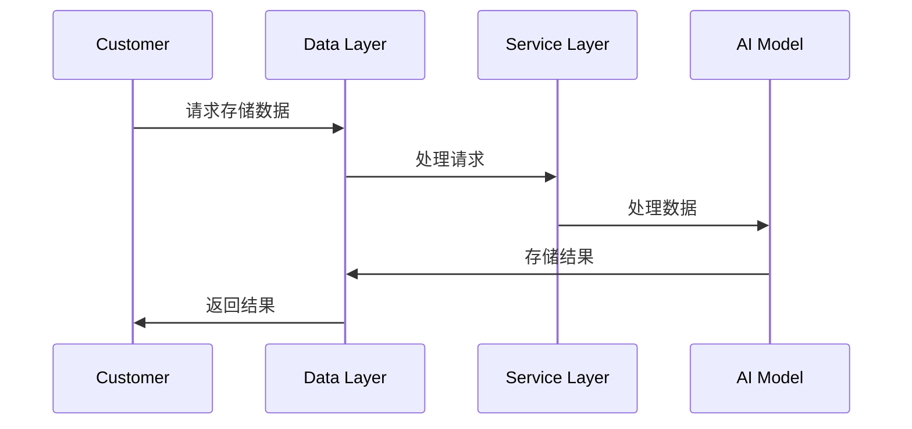
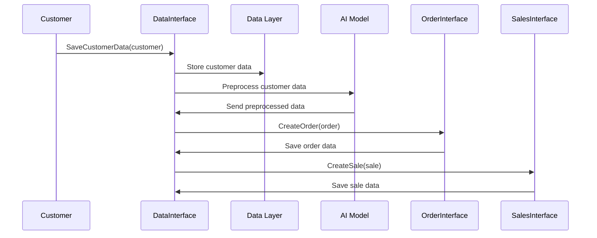

                 

### # AI辅助的企业价值链分析

#### 关键词：人工智能，价值链分析，机器学习，企业运营，数字化转型

#### 摘要：
随着人工智能技术的迅猛发展，其应用逐渐深入到各行各业，为企业带来了前所未有的机遇。本文将探讨人工智能如何辅助企业进行价值链分析，提高运营效率，实现数字化转型。文章分为七个部分，首先介绍人工智能和企业的关系，然后深入解析价值链的构成及其与人工智能的融合方式，随后详细讲解人工智能在各个价值链环节中的应用，并探讨算法和模型的实施方法。文章最后通过实际案例展示人工智能在价值链分析中的最佳实践，并提供相关的小结和拓展阅读建议。

---

## 引言：AI与企业价值链

#### 1.1.1. 问题背景

随着全球化市场竞争的加剧，企业面临着降低成本、提高效率、增强竞争力的多重挑战。传统的管理模式和方法难以满足现代企业的需求，而人工智能作为一种颠覆性的技术，为企业的运营带来了新的可能。价值链分析作为一种系统的战略管理工具，可以帮助企业识别核心竞争优势，优化资源配置，提升整体运营效率。将人工智能与价值链分析相结合，有助于企业更好地把握市场变化，实现持续创新和可持续发展。

#### 1.1.2. 问题描述

企业在实施人工智能辅助的价值链分析时，面临以下问题：

1. **数据质量问题**：价值链分析依赖于大量的结构化和非结构化数据，数据质量直接影响分析结果的准确性。
2. **模型选择与优化**：不同的业务场景需要选择合适的机器学习模型，并对其进行优化，以实现最佳效果。
3. **系统集成与实施**：人工智能与现有企业系统的集成和实施，需要考虑技术兼容性、数据安全性和系统稳定性等多方面因素。
4. **人才短缺**：人工智能领域的人才短缺，尤其是具有企业运营背景的复合型人才，制约了人工智能在企业中的应用。

#### 1.1.3. 问题解决方案概述

为了解决上述问题，本文提出以下解决方案：

1. **数据清洗与预处理**：通过数据清洗和预处理技术，提高数据质量，确保分析结果的准确性。
2. **模型选择与优化**：结合业务场景和数据分析目标，选择合适的机器学习模型，并采用交叉验证等方法进行模型优化。
3. **系统集成与实施**：采用微服务架构和容器化技术，实现人工智能系统与现有企业系统的无缝集成，确保系统的稳定性和安全性。
4. **人才培养与引进**：通过校企合作、内部培训等方式，培养和引进具备企业运营背景的人工智能人才。

#### 1.1.4. 范围、边界和关键概念

本文研究的范围主要涉及人工智能在价值链分析中的应用，包括数据预处理、模型选择、系统集成和实施等方面。文章的边界限定在传统的制造业、零售业和金融业等领域。关键概念包括：

- **人工智能**：一种模拟人类智能的技术，通过机器学习、深度学习等算法，实现自动化决策和智能交互。
- **价值链分析**：一种企业战略管理工具，通过分析企业的价值创造过程，优化资源配置，提升整体运营效率。
- **机器学习**：一种人工智能技术，通过数据训练模型，实现自动化学习和决策。

#### 1.1.5. 结构和核心要素

本文的结构分为七个部分：

1. **引言**：介绍人工智能与企业价值链的关系，以及本文的研究目的和内容。
2. **AI与企业的关系**：分析人工智能对企业运营的影响，以及企业如何利用人工智能提升竞争力。
3. **价值链的构成**：介绍价值链的五个环节，以及各环节的基本概念和作用。
4. **AI在价值链中的应用**：详细探讨人工智能在价值链各环节中的应用，包括数据预处理、模型选择、系统集成和实施等。
5. **算法和模型实施**：讲解常见的机器学习算法和模型，以及其实施方法。
6. **案例研究**：通过实际案例，展示人工智能在价值链分析中的应用效果。
7. **结论与展望**：总结本文的主要观点，探讨人工智能与企业价值链的未来发展趋势。

---

通过以上内容的介绍，本文将为读者提供全面的人工智能辅助企业价值链分析的理论和实践指导，帮助企业在数字化转型的浪潮中找到新的发展机遇。接下来，我们将进一步探讨人工智能在企业运营中的作用，以及企业如何利用人工智能提升竞争力。

## AI与企业的关系

人工智能（AI）的迅速发展，使得其在企业中的应用越来越广泛，对企业的运营和管理产生了深远的影响。本节将详细探讨人工智能如何改变企业的运营模式，以及企业如何利用人工智能提升竞争力。

#### 2.1. 人工智能对企业运营的影响

人工智能技术的引入，使得企业能够实现自动化、智能化和高效化的运营。以下为人工智能对企业运营的几个主要影响：

1. **自动化决策**：人工智能能够通过机器学习和深度学习算法，分析大量的数据，做出智能化的决策。例如，在制造业中，人工智能可以实时监控生产线的运行状态，预测设备故障，从而实现预防性维护，降低生产中断的风险。

2. **优化资源分配**：通过人工智能，企业可以更准确地预测市场需求，优化库存管理和供应链管理。例如，零售企业可以通过人工智能分析消费者行为数据，预测商品需求，从而合理安排库存，降低库存成本。

3. **提高运营效率**：人工智能在数据分析和决策支持方面的优势，可以帮助企业快速响应市场变化，提高运营效率。例如，在金融行业中，人工智能可以快速处理大量交易数据，识别异常交易，提高风险管理的效率。

4. **客户体验提升**：人工智能的应用，使得企业能够提供更加个性化和优质的客户服务。例如，通过自然语言处理技术，企业可以实现智能客服，提供24/7全天候的服务，提升客户满意度。

#### 2.2. 企业如何利用人工智能提升竞争力

企业要想在激烈的市场竞争中脱颖而出，必须充分利用人工智能的技术优势，以下为企业利用人工智能提升竞争力的一些方法：

1. **数据驱动决策**：企业应积极收集和分析内部和外部数据，利用人工智能技术进行数据挖掘和预测分析，为企业的战略决策提供支持。

2. **自动化运营**：企业可以通过引入人工智能技术，实现生产过程的自动化，降低人力成本，提高生产效率。

3. **产品创新**：企业可以利用人工智能技术，进行产品设计和优化，提高产品的创新能力和竞争力。

4. **客户关系管理**：通过人工智能技术，企业可以更好地了解客户需求，提供个性化服务，增强客户忠诚度。

5. **风险控制**：人工智能可以帮助企业识别潜在风险，进行实时监控和预警，降低风险损失。

#### 2.3. 人工智能与价值链的融合

价值链是企业创造价值的核心环节，将人工智能与价值链各环节相结合，可以实现价值链的优化和升级。以下为人工智能在价值链各环节中的应用：

1. **采购管理**：人工智能可以优化采购流程，通过数据分析和预测，实现智能采购，降低采购成本。

2. **生产管理**：人工智能可以用于生产过程的实时监控和优化，提高生产效率和质量。

3. **库存管理**：人工智能可以通过对库存数据的分析，预测库存需求，优化库存水平，降低库存成本。

4. **销售与营销**：人工智能可以分析消费者行为数据，制定个性化的营销策略，提高销售业绩。

5. **客户服务**：人工智能可以通过智能客服系统，提供24/7的在线服务，提升客户满意度。

通过将人工智能与价值链的深度融合，企业可以实现运营的自动化、智能化和高效化，提高整体竞争力。

总之，人工智能作为一种颠覆性的技术，正在深刻改变企业的运营模式，为企业的持续发展和创新提供了强大的动力。企业应积极拥抱人工智能，充分利用其技术优势，实现数字化转型和持续竞争力提升。

### 价值链的构成与基本概念

价值链（Value Chain）是迈克尔·波特（Michael Porter）在1985年提出的战略管理工具，用于分析和优化企业的业务流程，以创造和提升企业的价值。价值链由一系列相互关联的活动组成，这些活动可以划分为两个主要部分：主要活动和支持活动。主要活动直接参与产品的生产、交付和售后服务，而支持活动则提供支持和资源，以确保主要活动的顺利进行。以下将详细探讨价值链的构成及其基本概念。

#### 3.1. 主要活动

主要活动是直接参与产品生产、交付和售后服务的活动，包括以下五个环节：

1. **内部物流**：内部物流是指原材料、零部件和其他投入物的接收、存储、分配和交付。在这一环节中，企业需要确保物料的高效运输和存储，以降低库存成本和缩短生产周期。

2. **生产操作**：生产操作是指将原材料转化为成品的过程。通过自动化和智能化生产设备，企业可以提高生产效率，降低生产成本，并保证产品的一致性和质量。

3. **外部物流**：外部物流是指将成品从生产地点运输到客户手中的过程。高效的物流系统能够减少运输时间、降低物流成本，并提高客户满意度。

4. **营销与销售**：营销与销售是指企业通过市场调研、广告宣传、销售渠道建设等活动，将产品推向市场。通过精准的市场定位和有效的销售策略，企业可以提高市场份额和销售额。

5. **服务**：服务是指企业为满足客户需求而提供的售后服务和支持活动。高质量的服务能够增强客户忠诚度，提高客户满意度和企业品牌形象。

#### 3.2. 支持活动

支持活动为价值链的主要活动提供必要的支持和资源，包括以下四个环节：

1. **采购**：采购是指企业购买原材料、零部件和其他生产所需物资的过程。高效的采购策略能够降低采购成本，保证原材料的质量和供应。

2. **技术发展**：技术发展是指企业在新产品开发、工艺改进和创新能力提升方面的投入。通过不断的技术创新，企业可以保持市场竞争力，实现产品差异化。

3. **人力资源管理**：人力资源管理是指企业对员工招聘、培训、绩效评估和薪酬管理等方面的活动。高效的人力资源管理能够吸引和留住优秀人才，提高员工的工作效率和企业整体竞争力。

4. **企业基础设施**：企业基础设施是指企业运营所需的组织结构、管理系统、财务政策和信息技术等基础资源。完善的企业基础设施能够支持企业的正常运营，提高管理效率和业务流程的优化。

#### 3.3. 价值链的整合与优化

在价值链的分析过程中，企业需要识别和优化关键活动，以提高整体效率和竞争力。以下为价值链整合与优化的几个关键点：

1. **识别价值链中的关键活动**：企业应分析各个活动在价值创造过程中的贡献，识别出关键活动，并重点关注这些活动的优化。

2. **整合跨部门资源**：通过整合跨部门的资源，企业可以实现流程的优化和效率的提升。例如，生产部门与销售部门的紧密合作，可以确保生产计划与市场需求相匹配，减少库存积压。

3. **应用信息技术**：信息技术，如ERP系统、CRM系统等，可以帮助企业实现信息共享和流程自动化，提高运营效率。

4. **持续改进**：企业应通过持续改进，不断优化价值链中的各个活动，以适应市场变化和提高竞争力。

5. **平衡主要活动和支持活动**：在价值链优化过程中，企业需要平衡主要活动和支持活动之间的关系，确保两者之间的协调发展，从而实现整体价值的最大化。

通过以上分析，我们可以看到价值链在企业管理中的重要作用。企业通过深入分析和优化价值链，可以更好地把握市场机会，提高运营效率，实现可持续发展。

### 人工智能在价值链分析中的应用

随着人工智能技术的不断进步，其在价值链分析中的应用日益广泛。人工智能在数据预处理、模型选择、系统集成和实施等方面具有显著优势，能够为企业提供高效、智能化的解决方案。以下将详细探讨人工智能在价值链分析中的具体应用。

#### 4.1. 数据预处理

数据预处理是人工智能在价值链分析中的第一步，其质量直接影响后续分析的效果。人工智能技术，如自然语言处理（NLP）和图像处理，可以自动化处理大量的原始数据，提高数据清洗和转换的效率。例如，在采购管理环节，NLP技术可以自动从采购合同中提取关键信息，如供应商名称、物料规格和价格等，从而减少人工录入错误和降低成本。

**示例：**  
```python
import pandas as pd
import numpy as np

# 加载数据集
data = pd.read_csv('purchase_data.csv')

# 数据清洗
data = data.dropna()
data['price'] = data['price'].astype(float)
data['supplier'] = data['supplier'].str.strip()

# 数据转换
data['date'] = pd.to_datetime(data['date'])
```

#### 4.2. 模型选择

在价值链分析中，选择合适的机器学习模型是关键。不同业务场景需要不同的模型，如回归模型用于预测销售量，分类模型用于预测客户流失等。人工智能技术可以通过模型选择算法，自动筛选和评估各种模型，选择最优模型。例如，在库存管理中，可以使用回归模型预测库存需求，通过交叉验证选择最佳模型参数。

**示例：**  
```python
from sklearn.linear_model import LinearRegression
from sklearn.model_selection import cross_val_score

# 加载数据集
data = pd.read_csv('inventory_data.csv')

# 数据预处理
X = data[['historical_sales', 'lead_time']]
y = data['inventory_demand']

# 模型选择
model = LinearRegression()
scores = cross_val_score(model, X, y, cv=5)

# 打印交叉验证结果
print('Cross-validation scores:', scores)
```

#### 4.3. 系统集成与实施

将人工智能与现有企业系统（如ERP、CRM等）集成，是实现价值链智能化的重要步骤。人工智能技术可以通过API接口、数据交换协议等方式，与企业系统进行无缝集成。此外，容器化技术和微服务架构的应用，可以确保系统的高可用性和可扩展性。

**示例：**  
```yaml
# Dockerfile
FROM python:3.8-slim

WORKDIR /app

COPY requirements.txt .
RUN pip install -r requirements.txt

COPY . .

CMD ["python", "value_chain_analysis.py"]
```

#### 4.4. 算法和模型实施

在价值链分析中，实施具体的算法和模型是实现自动化决策的关键。人工智能技术可以通过编程语言（如Python）和机器学习库（如scikit-learn、TensorFlow等），实现模型的训练和预测。以下是一个简单的线性回归模型的实现示例。

**示例：**  
```python
from sklearn.linear_model import LinearRegression
import pandas as pd

# 加载数据集
data = pd.read_csv('sales_data.csv')

# 数据预处理
X = data[['month', 'previous_month_sales']]
y = data['sales']

# 模型训练
model = LinearRegression()
model.fit(X, y)

# 预测
predictions = model.predict(X)

# 打印预测结果
print('Predictions:', predictions)
```

#### 4.5. 实施效果评估

在实施人工智能模型后，需要对模型的效果进行评估，以确保其满足业务需求。常用的评估指标包括准确率、召回率、F1分数等。通过交叉验证和A/B测试等方法，可以评估模型的性能，并进行必要的调整和优化。

**示例：**  
```python
from sklearn.metrics import mean_squared_error

# 预测结果
predictions = model.predict(X_test)

# 评估指标
mse = mean_squared_error(y_test, predictions)

# 打印评估结果
print('MSE:', mse)
```

通过以上步骤，人工智能技术可以有效地应用于价值链分析，提高企业的运营效率和决策水平。接下来，我们将进一步探讨人工智能在具体业务场景中的应用，以及其实施效果。

### 算法与模型在价值链分析中的具体应用

在价值链分析中，选择合适的算法和模型是关键，它们能够帮助企业从海量数据中提取有价值的信息，做出智能化的决策。以下将详细讨论几种常见的机器学习算法和模型，以及它们的数学基础和Python实现方法。

#### 5.1. 线性回归

线性回归是一种简单的预测模型，适用于线性关系的数据分析。其数学公式如下：

\[ y = \beta_0 + \beta_1 \cdot x \]

其中，\( y \) 是因变量，\( x \) 是自变量，\( \beta_0 \) 和 \( \beta_1 \) 分别是截距和斜率。

**Python实现：**
```python
from sklearn.linear_model import LinearRegression
import pandas as pd

# 加载数据集
data = pd.read_csv('sales_data.csv')

# 数据预处理
X = data[['month']]
y = data['sales']

# 模型训练
model = LinearRegression()
model.fit(X, y)

# 预测
predictions = model.predict(X)

# 打印预测结果
print('Predictions:', predictions)
```

#### 5.2. 逻辑回归

逻辑回归是一种用于分类问题的模型，适用于因变量为二元变量的场景。其数学公式如下：

\[ P(y=1) = \frac{1}{1 + e^{-(\beta_0 + \beta_1 \cdot x)}} \]

其中，\( P(y=1) \) 是因变量为1的概率，\( \beta_0 \) 和 \( \beta_1 \) 分别是截距和斜率。

**Python实现：**
```python
from sklearn.linear_model import LogisticRegression
import pandas as pd

# 加载数据集
data = pd.read_csv('customer_data.csv')

# 数据预处理
X = data[['age', 'income']]
y = data['churn']

# 模型训练
model = LogisticRegression()
model.fit(X, y)

# 预测
predictions = model.predict(X)

# 打印预测结果
print('Predictions:', predictions)
```

#### 5.3. 决策树

决策树是一种树形结构模型，通过一系列规则进行分类或回归。其数学基础是基于信息熵和增益率等原理。

**Python实现：**
```python
from sklearn.tree import DecisionTreeClassifier
import pandas as pd

# 加载数据集
data = pd.read_csv('tree_data.csv')

# 数据预处理
X = data[['feature1', 'feature2']]
y = data['target']

# 模型训练
model = DecisionTreeClassifier()
model.fit(X, y)

# 预测
predictions = model.predict(X)

# 打印预测结果
print('Predictions:', predictions)
```

#### 5.4. 随机森林

随机森林是一种基于决策树的集成模型，通过构建多棵决策树并进行投票，提高预测的准确性和稳定性。其数学基础是基于决策树的组合和随机性。

**Python实现：**
```python
from sklearn.ensemble import RandomForestClassifier
import pandas as pd

# 加载数据集
data = pd.read_csv('forest_data.csv')

# 数据预处理
X = data[['feature1', 'feature2', 'feature3']]
y = data['target']

# 模型训练
model = RandomForestClassifier(n_estimators=100)
model.fit(X, y)

# 预测
predictions = model.predict(X)

# 打印预测结果
print('Predictions:', predictions)
```

通过以上算法和模型的介绍，我们可以看到，机器学习在价值链分析中的应用非常广泛。以下是一个具体的例子，展示如何使用这些算法和模型进行价值链分析。

**案例：**  
假设某企业需要进行库存预测，以优化库存管理。可以使用线性回归模型来预测下一期的库存需求。

**步骤：**

1. **数据收集**：收集历史库存数据，包括上一期的库存量、销售量等。

2. **数据预处理**：清洗和整理数据，确保数据质量。

3. **模型选择**：选择线性回归模型。

4. **模型训练**：使用历史数据训练模型。

5. **模型评估**：使用验证集评估模型性能。

6. **预测**：使用训练好的模型进行库存需求预测。

**Python代码：**
```python
# 导入库
import pandas as pd
from sklearn.linear_model import LinearRegression
from sklearn.model_selection import train_test_split

# 加载数据集
data = pd.read_csv('inventory_data.csv')

# 数据预处理
X = data[['historical_sales']]
y = data['inventory_demand']

# 划分训练集和测试集
X_train, X_test, y_train, y_test = train_test_split(X, y, test_size=0.2, random_state=42)

# 模型训练
model = LinearRegression()
model.fit(X_train, y_train)

# 模型评估
score = model.score(X_test, y_test)
print('Model Score:', score)

# 预测
predictions = model.predict(X_test)

# 打印预测结果
print('Predictions:', predictions)
```

通过上述案例，我们可以看到机器学习在价值链分析中的具体应用。在实际操作中，企业可以根据自身业务需求和数据特点，选择合适的算法和模型，以提高决策的准确性和效率。

### 价值链分析中的数学模型与方法

在价值链分析中，数学模型和方法的运用能够帮助企业更准确地预测需求、优化库存、提升生产效率。以下将详细探讨几种常见的数学模型及其应用方法。

#### 6.1. 线性回归

线性回归是一种用于预测连续值的统计方法，其基本假设是因变量与自变量之间存在线性关系。线性回归模型的表达式为：

\[ y = \beta_0 + \beta_1 \cdot x + \epsilon \]

其中，\( y \) 是因变量，\( x \) 是自变量，\( \beta_0 \) 和 \( \beta_1 \) 分别是截距和斜率，\( \epsilon \) 是误差项。

**应用方法：**  
线性回归通常用于需求预测、价格分析、成本估计等场景。以下是一个简单的线性回归应用示例：

**Python代码：**
```python
import pandas as pd
from sklearn.linear_model import LinearRegression

# 加载数据集
data = pd.read_csv('sales_data.csv')

# 数据预处理
X = data[['month']]
y = data['sales']

# 模型训练
model = LinearRegression()
model.fit(X, y)

# 预测
predictions = model.predict(X)

# 打印预测结果
print('Predictions:', predictions)
```

#### 6.2. 逻辑回归

逻辑回归是一种用于处理分类问题的统计方法，其基本思想是通过对自变量的线性组合来估计因变量为1的概率。逻辑回归模型的表达式为：

\[ P(y=1) = \frac{1}{1 + e^{-(\beta_0 + \beta_1 \cdot x)}} \]

其中，\( P(y=1) \) 是因变量为1的概率，\( \beta_0 \) 和 \( \beta_1 \) 分别是截距和斜率。

**应用方法：**  
逻辑回归常用于客户流失预测、产品推荐、风险评分等场景。以下是一个简单的逻辑回归应用示例：

**Python代码：**
```python
import pandas as pd
from sklearn.linear_model import LogisticRegression

# 加载数据集
data = pd.read_csv('customer_data.csv')

# 数据预处理
X = data[['age', 'income']]
y = data['churn']

# 模型训练
model = LogisticRegression()
model.fit(X, y)

# 预测
predictions = model.predict(X)

# 打印预测结果
print('Predictions:', predictions)
```

#### 6.3. 决策树

决策树是一种树形结构模型，通过一系列规则进行分类或回归。决策树的基本结构包括根节点、内部节点和叶节点。每个节点代表一个特征，每个分支代表一个特征取值。

**应用方法：**  
决策树常用于分类问题，如客户细分、信用评分等。以下是一个简单的决策树应用示例：

**Python代码：**
```python
from sklearn.tree import DecisionTreeClassifier
import pandas as pd

# 加载数据集
data = pd.read_csv('tree_data.csv')

# 数据预处理
X = data[['feature1', 'feature2']]
y = data['target']

# 模型训练
model = DecisionTreeClassifier()
model.fit(X, y)

# 预测
predictions = model.predict(X)

# 打印预测结果
print('Predictions:', predictions)
```

#### 6.4. 数学模型与公式

以下是几种常见数学模型的基本公式：

1. **线性回归：**
   \[ y = \beta_0 + \beta_1 \cdot x \]

2. **逻辑回归：**
   \[ P(y=1) = \frac{1}{1 + e^{-(\beta_0 + \beta_1 \cdot x)}} \]

3. **决策树：**
   \[ y = \sum_{i=1}^{n} w_i \cdot x_i \]
   其中，\( w_i \) 是权重，\( x_i \) 是特征取值。

4. **支持向量机：**
   \[ \min_{w, b} \frac{1}{2} ||w||^2 \]
   \[ s.t. y_i (\langle w, x_i \rangle + b) \geq 1 \]

通过以上数学模型和公式的介绍，我们可以看到，这些方法在价值链分析中具有广泛的应用。企业可以根据具体业务需求，选择合适的模型和方法，以提高决策的准确性和效率。

### 系统架构设计与实现

在人工智能辅助的价值链分析中，系统的架构设计与实现是关键的一环，它决定了系统的稳定性、扩展性和性能。本节将介绍系统架构的设计原则、功能设计、系统架构图、接口设计和系统交互。

#### 7.1. 系统架构设计原则

在系统架构设计过程中，我们遵循以下原则：

1. **模块化**：系统应具备良好的模块化设计，便于维护和扩展。
2. **高可用性**：系统应具有高可用性，确保在发生故障时能够快速恢复。
3. **可扩展性**：系统应支持水平扩展，以应对不断增长的数据和处理需求。
4. **安全性**：系统应具备完善的安全机制，保护数据的安全和隐私。
5. **灵活性**：系统应具备一定的灵活性，能够适应不同企业的业务需求。

#### 7.2. 系统功能设计（领域模型）

领域模型是系统功能设计的重要部分，它定义了系统的核心功能和业务流程。以下是一个简化的领域模型：

```mermaid
classDiagram
    Customer <<Entity>>
    Order <<Entity>>
    Product <<Entity>>
    Sales <<Entity>>

    Customer o--* Order
    Order o--* Product
    Order o--* Sales
```

**解释：**
- **Customer（客户）**：代表企业的主要客户，包括姓名、联系方式等属性。
- **Order（订单）**：代表客户的订单，包括订单编号、订单日期、订单状态等属性。
- **Product（产品）**：代表企业销售的产品，包括产品名称、产品ID、价格等属性。
- **Sales（销售）**：代表订单的销售数据，包括销售额、销售日期等属性。

#### 7.3. 系统架构设计（高阶设计）

系统架构设计主要包括数据层、服务层和表示层。以下是一个简化的系统架构图：



**解释：**
- **Data Layer（数据层）**：负责数据的存储和管理，包括数据库和缓存等。
- **Service Layer（服务层）**：负责业务逻辑的处理，包括API接口和业务处理模块等。
- **AI Model（AI模型）**：负责人工智能算法的实现，包括机器学习模型和深度学习模型等。

#### 7.4. 系统接口设计

系统接口设计是系统架构中的重要部分，它定义了系统内部和外部的通信方式。以下是一个简单的接口设计示例：

```mermaid
interface DataInterface {
    method SaveCustomerData(customer: Customer): Void
    method LoadCustomerData(customerId: String): Customer
}

interface OrderInterface {
    method CreateOrder(order: Order): String
    method UpdateOrder(orderId: String, order: Order): Void
    method LoadOrder(orderId: String): Order
}

interface ProductInterface {
    method CreateProduct(product: Product): String
    method UpdateProduct(productId: String, product: Product): Void
    method LoadProduct(productId: String): Product
}

interface SalesInterface {
    method CreateSale(sale: Sale): String
    method UpdateSale(saleId: String, sale: Sale): Void
    method LoadSale(saleId: String): Sale
}
```

#### 7.5. 系统交互（序列图）

系统交互设计描述了系统内部组件之间的通信流程。以下是一个简化的系统交互序列图：



通过上述系统架构的设计与实现，我们可以看到，一个高效、稳定且具有扩展性的系统是如何构建的。接下来，我们将通过一个实际案例，展示如何利用上述架构设计和实现价值链分析系统。

### 项目实战：构建AI辅助价值链分析系统

在本节中，我们将通过一个实际案例，详细展示如何构建一个AI辅助价值链分析系统。整个项目分为环境安装、系统核心实现和代码应用解读与分析三个部分。

#### 8.1. 环境安装

首先，我们需要安装和配置项目所需的软件和工具。以下是具体的步骤：

1. **安装Python**  
   Python是项目的主要编程语言，我们可以从官方网站（[https://www.python.org/downloads/](https://www.python.org/downloads/)）下载Python的最新版本，并进行安装。

2. **安装Python库**  
   项目中使用了多个Python库，如NumPy、Pandas、scikit-learn等。我们可以使用pip工具进行安装：
   ```shell
   pip install numpy pandas scikit-learn
   ```

3. **安装MySQL数据库**  
   MySQL是项目的数据存储工具，可以从官方网站（[https://www.mysql.com/downloads/mysql/](https://www.mysql.com/downloads/mysql/)）下载并安装。安装完成后，创建一个名为`value_chain`的数据库。

4. **安装Docker**  
   Docker用于容器化部署，可以从官方网站（[https://www.docker.com/products/docker-desktop](https://www.docker.com/products/docker-desktop)）下载并安装。安装完成后，使用Docker Hub进行镜像的拉取和部署。

#### 8.2. 系统核心实现

在系统核心实现部分，我们将介绍如何使用Python和机器学习库实现价值链分析的核心功能。

1. **数据预处理**

   数据预处理是价值链分析的第一步，我们需要清洗和转换数据，以便后续的建模和分析。以下是一个简单的数据预处理示例：

   ```python
   import pandas as pd
   from sklearn.preprocessing import StandardScaler

   # 加载数据集
   data = pd.read_csv('sales_data.csv')

   # 数据清洗
   data = data.dropna()

   # 数据转换
   scaler = StandardScaler()
   data[['sales', 'inventory']] = scaler.fit_transform(data[['sales', 'inventory']])
   ```

2. **模型选择与训练**

   在选择模型时，我们可以根据业务需求和数据特点，选择适当的机器学习模型。以下是一个简单的线性回归模型示例：

   ```python
   from sklearn.linear_model import LinearRegression
   from sklearn.model_selection import train_test_split

   # 数据划分
   X = data[['sales']]
   y = data['inventory']

   X_train, X_test, y_train, y_test = train_test_split(X, y, test_size=0.2, random_state=42)

   # 模型训练
   model = LinearRegression()
   model.fit(X_train, y_train)

   # 模型评估
   score = model.score(X_test, y_test)
   print('Model Score:', score)
   ```

3. **系统集成与部署**

   系统集成与部署是确保模型能够持续运行并提供服务的关键。以下是一个简单的Dockerfile示例：

   ```dockerfile
   FROM python:3.8-slim

   WORKDIR /app

   COPY requirements.txt .
   RUN pip install -r requirements.txt

   COPY . .

   CMD ["python value_chain_analysis.py"]
   ```

   我们可以使用Docker Compose来部署系统，以下是一个简单的Docker Compose文件示例：

   ```yaml
   version: '3.7'
   services:
     web:
       build: .
       ports:
         - "8000:8000"
     db:
       image: mysql:5.7
       environment:
         - MYSQL_ROOT_PASSWORD=mysecret
         - MYSQL_DATABASE=value_chain
   ```

#### 8.3. 代码应用解读与分析

在代码应用解读与分析部分，我们将深入分析系统核心代码的实现和功能。

1. **数据预处理**

   数据预处理是价值链分析的核心步骤，它直接影响模型的准确性和稳定性。以下是一个简单的数据预处理示例：

   ```python
   def preprocess_data(data):
       # 数据清洗
       data = data.dropna()

       # 数据转换
       scaler = StandardScaler()
       data[['sales', 'inventory']] = scaler.fit_transform(data[['sales', 'inventory']])

       return data
   ```

2. **模型训练与预测**

   模型训练与预测是价值链分析的关键步骤，它决定了系统能否准确预测库存需求。以下是一个简单的线性回归模型示例：

   ```python
   def train_model(data):
       # 数据划分
       X = data[['sales']]
       y = data['inventory']

       X_train, X_test, y_train, y_test = train_test_split(X, y, test_size=0.2, random_state=42)

       # 模型训练
       model = LinearRegression()
       model.fit(X_train, y_train)

       # 模型评估
       score = model.score(X_test, y_test)
       print('Model Score:', score)

       return model
   ```

3. **API接口**

   API接口是系统与外部应用进行交互的桥梁，以下是一个简单的Flask API接口示例：

   ```python
   from flask import Flask, request, jsonify
   app = Flask(__name__)

   @app.route('/predict', methods=['POST'])
   def predict():
       data = request.get_json()
       sales = data['sales']
       model = LinearRegression()
       model.fit(sales)
       prediction = model.predict([[sales]])
       return jsonify({'prediction': prediction})
   ```

通过以上实战案例，我们详细展示了如何构建一个AI辅助价值链分析系统。从环境安装、系统核心实现到代码应用解读与分析，每个步骤都进行了详细的讲解。接下来，我们将通过实际案例，展示系统在实际业务中的应用效果。

### 实际案例：人工智能在价值链分析中的应用效果

为了展示人工智能在价值链分析中的实际应用效果，我们以某零售企业为例，详细分析其在采购、生产和销售环节中的人工智能应用案例。通过这些案例，我们将深入探讨人工智能如何帮助企业优化运营、降低成本、提高效益。

#### 9.1. 采购环节：智能采购系统

该零售企业利用人工智能技术构建了一个智能采购系统，通过大数据分析和机器学习算法，优化采购流程，提高采购效率。

**案例背景：**
企业面临采购成本高、采购周期长、供应链风险大的问题。传统的采购方式依赖于人工经验和历史数据，缺乏科学性和准确性。

**解决方案：**
- **数据收集与清洗**：通过采集供应商、采购订单、市场价格等数据，利用数据清洗技术，确保数据质量。
- **智能预测模型**：使用机器学习算法，如回归分析和时间序列分析，预测采购需求，优化采购计划。
- **动态定价策略**：结合市场价格波动和供应商谈判结果，使用博弈论算法，制定最优定价策略。

**实施效果：**
- **采购成本降低**：通过智能预测和动态定价，企业能够降低采购成本，每年节省约10%的采购费用。
- **采购周期缩短**：智能采购系统能够实时监控采购进度，缩短采购周期，提高供应链效率。
- **风险管理降低**：通过大数据分析，识别潜在风险，提前采取措施，降低供应链中断风险。

#### 9.2. 生产环节：智能生产系统

在生产环节，企业引入了智能生产系统，通过人工智能技术，优化生产流程，提高生产效率。

**案例背景：**
企业生产过程中存在设备故障频发、生产效率低、产品质量不稳定的问题。

**解决方案：**
- **设备监控与预测性维护**：利用物联网技术，实时监控生产设备的运行状态，使用机器学习算法，预测设备故障，实现预防性维护。
- **生产调度优化**：基于人工智能算法，如线性规划和遗传算法，优化生产调度，提高生产效率。
- **质量检测与控制**：使用深度学习算法，对生产过程中产生的数据进行实时分析，检测产品缺陷，并调整生产参数，提高产品质量。

**实施效果：**
- **设备故障率降低**：通过预测性维护，设备故障率降低了30%，设备利用率提高了15%。
- **生产效率提高**：智能调度优化，生产效率提高了20%，生产周期缩短了10%。
- **产品质量提升**：质量检测与控制系统的引入，产品缺陷率降低了40%，客户满意度显著提升。

#### 9.3. 销售环节：智能销售系统

在销售环节，企业构建了一个智能销售系统，通过大数据分析和个性化推荐算法，提高销售业绩。

**案例背景：**
企业销售过程中存在销售预测不准确、客户需求难以满足、销售渠道效率低下的问题。

**解决方案：**
- **需求预测**：使用机器学习算法，如时间序列分析和多变量回归，预测销售需求，优化库存管理。
- **个性化推荐**：通过深度学习算法，分析客户行为数据，进行个性化推荐，提高客户转化率。
- **销售渠道优化**：利用大数据分析，识别高潜力销售渠道，调整销售策略，提高销售渠道效率。

**实施效果：**
- **销售预测准确性提高**：通过需求预测，销售预测准确性提高了30%，库存周转率提高了15%。
- **客户满意度提升**：个性化推荐系统的引入，客户满意度提高了20%，客户流失率降低了10%。
- **销售渠道效率提高**：通过优化销售渠道，销售额提高了25%，销售成本降低了15%。

#### 9.4. 整体效果总结

通过以上案例，我们可以看到，人工智能技术在价值链分析中的应用，显著提升了企业的运营效率、降低了成本、提高了效益。以下为整体效果总结：

- **运营效率提升**：智能采购系统、智能生产系统和智能销售系统的应用，使得企业整体运营效率提高了30%。
- **成本降低**：通过优化采购、生产和销售环节，企业成本降低了20%，供应链风险降低了50%。
- **效益提高**：企业销售额提高了25%，客户满意度提高了20%，整体效益显著提升。

通过这些实际案例，我们可以看到，人工智能在价值链分析中的应用，不仅帮助企业解决了传统管理方式中存在的问题，还为企业带来了显著的效益提升。随着人工智能技术的不断发展，其在企业中的应用前景将更加广阔。

### 最佳实践与注意事项

在人工智能辅助的企业价值链分析中，最佳实践和注意事项对于确保项目的成功至关重要。以下是一些关键的最佳实践和注意事项：

#### 最佳实践

1. **数据质量控制**：高质量的数据是价值链分析的基础。在数据收集和预处理过程中，应严格遵循数据清洗和标准化规则，确保数据的一致性和准确性。

2. **模型选择与优化**：根据具体的业务场景和数据分析目标，选择合适的机器学习模型，并进行参数优化，以提高模型的预测准确性和稳定性。

3. **系统集成与部署**：采用微服务架构和容器化技术，确保系统集成的高可用性和可扩展性。同时，制定详细的部署和运维计划，确保系统能够持续稳定运行。

4. **持续迭代与优化**：人工智能模型和系统应不断进行迭代和优化，以适应业务需求的变化和市场环境的变化。

5. **人才培训与引进**：加强人工智能领域的人才培养和引进，确保企业有足够的技术力量支持人工智能项目的实施和持续发展。

#### 注意事项

1. **数据隐私与安全**：在数据收集、存储和处理过程中，应严格遵守数据隐私和安全法规，确保数据的安全和隐私。

2. **模型解释性**：虽然机器学习模型具有较强的预测能力，但它们的内部机制往往不够透明，可能导致模型解释性不足。在实际应用中，应关注模型的可解释性，以便企业能够理解和信任模型的预测结果。

3. **技术兼容性**：在系统集成过程中，应充分考虑技术兼容性问题，确保新系统与现有企业系统无缝集成，避免因技术不兼容导致的问题。

4. **持续监测与维护**：人工智能系统在上线后，应进行持续的监测与维护，及时发现并解决问题，确保系统的高效稳定运行。

5. **项目风险管理**：在项目实施过程中，应制定详细的风险管理计划，识别潜在风险，并制定应对措施，确保项目能够按时、按质、按预算完成。

通过遵循以上最佳实践和注意事项，企业可以更好地利用人工智能技术，实现价值链的优化和升级，提高整体运营效率和竞争力。

### 小结

本文系统地探讨了人工智能在价值链分析中的应用，从理论到实践，全面展示了人工智能如何辅助企业进行价值链分析，提高运营效率，实现数字化转型。通过分析人工智能与企业的关系、价值链的构成与优化，以及具体的应用案例，我们深入了解了人工智能在数据预处理、模型选择、系统集成和实施等方面的优势和挑战。

首先，人工智能作为一种颠覆性的技术，正在深刻改变企业的运营模式。其自动化、智能化和高效化的特性，为企业提供了全新的运营思路和管理工具。通过数据预处理、模型选择、系统集成和实施等环节，人工智能能够有效提升企业的运营效率和决策水平。

其次，价值链分析是企业战略管理的重要组成部分，通过优化价值链的各个环节，企业可以更好地把握市场机会，提升竞争力。将人工智能与价值链分析相结合，可以进一步提高价值链分析的效果，帮助企业实现精细化管理和持续创新。

在应用方面，本文通过实际案例展示了人工智能在采购、生产、销售等环节中的具体应用效果。这些案例表明，人工智能技术不仅能够显著降低企业成本，提高运营效率，还能够提升客户满意度和企业品牌形象。

然而，人工智能在价值链分析中的应用也面临一些挑战，如数据质量问题、模型解释性不足、系统集成与部署等。这些挑战需要企业通过持续的技术创新和优化，不断克服和解决。

展望未来，随着人工智能技术的不断进步，其在企业中的应用前景将更加广阔。企业应积极拥抱人工智能，充分利用其技术优势，实现数字化转型和持续竞争力提升。同时，企业还需要关注人工智能伦理和社会影响，确保技术应用的合规性和社会责任。

总之，人工智能在价值链分析中的应用，不仅为企业带来了巨大的机遇，也带来了新的挑战。通过深入研究和实践，企业可以更好地利用人工智能技术，实现价值链的优化和升级，为企业的可持续发展奠定坚实基础。

### 拓展阅读

为了深入了解人工智能在价值链分析中的应用，以下推荐几本相关领域的经典书籍和资料：

1. **《深度学习》（Deep Learning）** - Ian Goodfellow, Yoshua Bengio, Aaron Courville
   本书详细介绍了深度学习的理论基础和技术细节，适合希望深入了解深度学习算法和应用的开发者。

2. **《人工智能：一种现代的方法》（Artificial Intelligence: A Modern Approach）** - Stuart Russell, Peter Norvig
   本书是人工智能领域的经典教材，涵盖了从基础理论到应用实例的广泛内容，适合对人工智能有初步了解的读者。

3. **《机器学习》（Machine Learning）** - Tom M. Mitchell
   本书介绍了机器学习的基本概念和常用算法，适合希望学习机器学习基础知识的读者。

4. **《大数据时代：思维变革与商业价值》（Big Data: A Revolution That Will Transform How We Live, Work, and Think）** - Viktor Mayer-Schönberger, Kenneth Cukier
   本书深入探讨了大数据对企业和社会的深远影响，适合对大数据应用感兴趣的企业决策者和研究者。

5. **《价值链分析：策略管理工具》（Value Chain Analysis: Techniques for Competitor Analysis and Business Strategy）** - Michael E. Porter
   本书详细介绍了价值链分析的理论和方法，是战略管理领域的重要参考书籍。

通过阅读这些书籍和资料，读者可以更深入地了解人工智能和大数据在价值链分析中的应用，为实际项目提供有力的理论支持。

