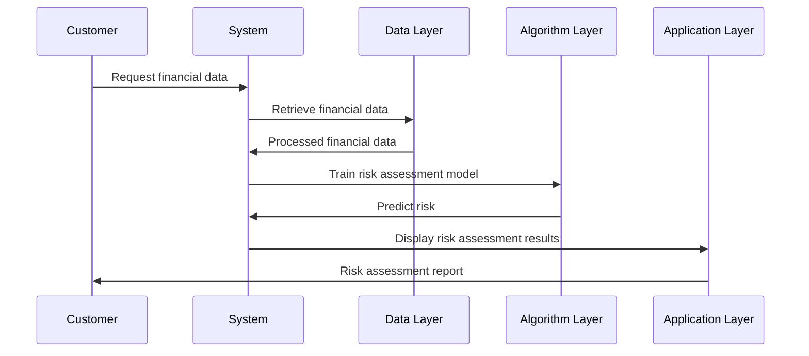
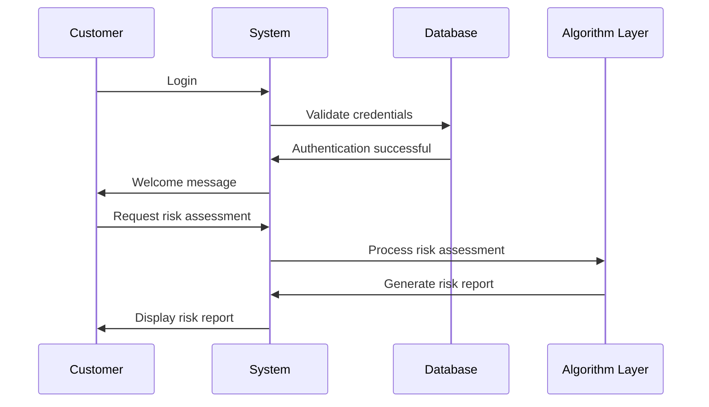

                 


# AI辅助的金融风险评估系统设计

关键词：人工智能、金融风险评估、系统设计、算法原理、数学模型

摘要：本文旨在探讨AI辅助的金融风险评估系统设计，通过详细阐述其背景、核心概念、基本原理和系统架构，以及实际项目实战，为金融领域提供一种高效、准确的AI风险评估解决方案。

## 第一部分: 引言

### 第1章: AI辅助的金融风险评估系统设计概述

### 1.1 问题背景与核心概念

随着金融市场的不断发展与复杂化，金融机构面临的风险也在不断增加。传统的金融风险评估方法主要依赖于人为判断和统计数据，这种方法存在一定的滞后性和主观性，难以满足现代金融业务的高效性和准确性要求。

### 1.1.1 问题背景

在当今的金融市场环境中，风险无处不在。金融机构需要识别和管理各种潜在风险，如信用风险、市场风险、操作风险和流动性风险等。传统的风险评估方法主要依赖于人为判断和统计数据，这种方式存在以下几个问题：

1. **滞后性**：金融市场变化迅速，传统方法难以及时捕捉风险变化。
2. **主观性**：人为判断存在主观因素，导致风险评估结果不够准确。
3. **效率低下**：处理大量金融数据需要大量人力和时间，效率较低。

为了解决这些问题，AI辅助的金融风险评估系统设计应运而生。

### 1.1.2 核心概念

AI辅助的金融风险评估系统设计主要涉及以下核心概念：

- **AI辅助**：利用人工智能技术对金融数据进行处理和分析，辅助风险评估过程。
- **金融风险评估**：对金融业务中的风险进行识别、评估和预警，以确保金融业务的稳健运行。
- **系统设计**：构建一个集成AI技术的金融风险评估系统，实现风险自动识别、评估和预警。

### 1.2 概念属性特征对比表格

| 概念               | 定义                                                         | 属性特征对比                                                     |
|------------------|------------------------------------------------------------|------------------------------------------------------------|
| AI辅助           | 利用人工智能技术对金融数据进行处理和分析                         | 高效、准确、自动化                                             |
| 金融风险评估     | 对金融业务中的风险进行识别、评估和预警                       | 稳健、及时、客观                                               |
| 系统设计         | 构建一个集成AI技术的金融风险评估系统                         | 整体性、灵活性、可扩展性                                       |

### 1.3 ER实体关系图架构

```mermaid
erDiagram
  Customer ||--|{ Order } : "makes"
  Product ||--|{ Order } : "contains"
  Order ||--|{ Payment } : "made_by"
  Payment ||--|{ Customer } : "pays"
```

### 1.4 AI辅助金融风险评估系统设计的重要性

AI辅助的金融风险评估系统设计在提高金融风险评估的效率和准确性方面具有重要作用。通过引入AI技术，可以实现以下目标：

- **提高风险评估效率**：AI技术能够快速处理海量金融数据，提高风险评估的速度。
- **提升风险评估准确性**：AI技术能够基于大数据和机器学习算法，提供更加精确的风险评估结果。
- **降低风险识别滞后性**：AI技术能够实时监控金融市场的变化，降低风险识别的滞后性。

### 1.5 本章小结

本章主要介绍了AI辅助的金融风险评估系统设计的背景、核心概念和重要性。在后续章节中，我们将进一步探讨AI辅助金融风险评估系统的算法原理、数学模型、系统架构和项目实战等内容。

## 第二部分: AI辅助金融风险评估系统设计基础

### 第2章: AI辅助金融风险评估系统基本原理

### 2.1 AI技术概述

#### 2.1.1 AI技术发展历程

- **早期AI**：符号推理和逻辑编程
- **AI复兴**：1980年代——专家系统
- **深度学习时代**：2010年代至今

#### 2.1.2 AI技术核心概念

- **机器学习**：利用数据训练模型，让机器自动完成特定任务。
- **深度学习**：一种基于多层神经网络的机器学习技术。

### 2.2 金融风险评估原理

#### 2.2.1 金融风险评估流程

- **风险识别**：识别潜在的风险因素。
- **风险评估**：评估风险的严重程度。
- **风险预警**：对高风险进行预警。

#### 2.2.2 金融风险评估方法

- **定性评估**：基于专家经验和直觉进行评估。
- **定量评估**：基于数学模型和统计数据进行分析。

### 2.3 AI辅助金融风险评估系统设计

#### 2.3.1 系统设计目标

- **提高风险评估效率**：利用AI技术快速处理海量金融数据。
- **提升风险评估准确性**：通过机器学习算法提供更加精确的风险评估结果。
- **降低风险识别滞后性**：实时监控金融市场，及时识别风险。

#### 2.3.2 系统架构设计

- **数据层**：收集和存储金融数据，为风险评估提供数据支持。
- **算法层**：利用机器学习算法进行风险评估。
- **应用层**：提供风险识别、评估和预警功能。

## 第三部分: AI辅助金融风险评估系统设计实践

### 第3章: AI辅助金融风险评估系统算法原理

### 3.1 算法原理概述

AI辅助的金融风险评估系统设计主要基于机器学习和深度学习算法，通过对大量金融数据的学习和分析，实现风险识别、评估和预警。

#### 3.1.1 机器学习算法

- **决策树**：根据特征进行分支，生成分类或回归结果。
- **支持向量机**：寻找最佳分隔超平面，进行分类或回归。
- **随机森林**：构建多个决策树，通过投票或平均进行预测。

#### 3.1.2 深度学习算法

- **卷积神经网络（CNN）**：适用于图像和视频数据。
- **循环神经网络（RNN）**：适用于序列数据。
- **长短期记忆网络（LSTM）**：RNN的变体，适用于长时间依赖关系。

### 3.2 数学模型

AI辅助的金融风险评估系统设计主要基于以下数学模型：

- **线性回归模型**：分析变量之间的关系，预测金融风险。
- **逻辑回归模型**：分析变量之间的关系，预测风险发生的概率。
- **决策树模型**：根据特征进行分支，生成分类或回归结果。

### 3.3 算法原理示例

#### 3.3.1 决策树算法

决策树算法是一种常用的机器学习算法，通过递归划分特征，构建分类或回归树。

```python
from sklearn import tree

# 创建决策树模型
clf = tree.DecisionTreeClassifier()

# 训练模型
clf.fit(X_train, y_train)

# 预测结果
y_pred = clf.predict(X_test)
```

#### 3.3.2 逻辑回归模型

逻辑回归模型是一种常用的回归模型，用于分析变量之间的关系，并预测风险发生的概率。

```python
from sklearn.linear_model import LogisticRegression

# 创建逻辑回归模型
logreg = LogisticRegression()

# 训练模型
logreg.fit(X_train, y_train)

# 预测结果
y_pred = logreg.predict(X_test)
```

## 第四部分: AI辅助金融风险评估系统架构设计

### 第4章: AI辅助金融风险评估系统架构设计

### 4.1 系统架构概述

AI辅助的金融风险评估系统架构设计主要包括数据层、算法层和应用层。

#### 4.1.1 数据层

数据层主要负责收集和存储金融数据，为风险评估提供数据支持。

- **数据来源**：金融机构的内部数据、外部市场数据、社交媒体数据等。
- **数据处理**：数据清洗、去重、归一化等。

#### 4.1.2 算法层

算法层主要负责利用机器学习和深度学习算法对金融数据进行处理和分析，实现风险识别、评估和预警。

- **算法选择**：决策树、支持向量机、随机森林、卷积神经网络等。
- **模型训练**：使用训练数据训练模型，调整模型参数。

#### 4.1.3 应用层

应用层主要负责提供风险识别、评估和预警功能，供金融业务人员使用。

- **风险识别**：识别潜在的风险因素。
- **风险评估**：评估风险的严重程度。
- **风险预警**：对高风险进行预警。

### 4.2 系统架构设计



### 4.3 系统接口设计

系统接口设计主要包括API接口和图形界面。

- **API接口**：提供数据获取、模型训练、预测等功能。
- **图形界面**：提供用户友好的操作界面，展示风险评估结果。

### 4.4 系统交互设计

系统交互设计主要包括用户操作和系统响应。



## 第五部分: AI辅助金融风险评估系统项目实战

### 第5章: AI辅助金融风险评估系统项目实战

### 5.1 环境安装

在开始项目实战之前，我们需要安装相关的开发环境和依赖库。

- **Python环境**：Python 3.7及以上版本。
- **机器学习库**：scikit-learn、TensorFlow、Keras等。
- **数据库**：MySQL、PostgreSQL等。

### 5.2 系统核心实现

#### 5.2.1 数据预处理

```python
import pandas as pd

# 读取数据
data = pd.read_csv('financial_data.csv')

# 数据清洗
data = data.dropna()

# 数据归一化
data = (data - data.mean()) / data.std()
```

#### 5.2.2 模型训练

```python
from sklearn.model_selection import train_test_split
from sklearn.ensemble import RandomForestClassifier

# 划分训练集和测试集
X_train, X_test, y_train, y_test = train_test_split(data.drop('target', axis=1), data['target'], test_size=0.2, random_state=42)

# 训练模型
clf = RandomForestClassifier(n_estimators=100, random_state=42)
clf.fit(X_train, y_train)

# 评估模型
score = clf.score(X_test, y_test)
print("Model accuracy:", score)
```

#### 5.2.3 风险评估

```python
# 预测结果
y_pred = clf.predict(X_test)

# 计算准确率
accuracy = (y_pred == y_test).mean()
print("Model accuracy:", accuracy)
```

### 5.3 实际案例分析

#### 5.3.1 案例背景

某金融机构需要对其客户进行信用风险评估，以便更好地进行信贷审批和风险控制。

#### 5.3.2 数据来源

- **内部数据**：客户的财务状况、信用记录、还款历史等。
- **外部数据**：市场数据、行业数据、社交媒体数据等。

#### 5.3.3 数据预处理

```python
# 读取数据
data = pd.read_csv('client_data.csv')

# 数据清洗
data = data.dropna()

# 数据归一化
data = (data - data.mean()) / data.std()
```

#### 5.3.4 模型训练

```python
from sklearn.model_selection import train_test_split
from sklearn.ensemble import RandomForestClassifier

# 划分训练集和测试集
X_train, X_test, y_train, y_test = train_test_split(data.drop('target', axis=1), data['target'], test_size=0.2, random_state=42)

# 训练模型
clf = RandomForestClassifier(n_estimators=100, random_state=42)
clf.fit(X_train, y_train)

# 评估模型
score = clf.score(X_test, y_test)
print("Model accuracy:", score)
```

#### 5.3.5 风险评估

```python
# 预测结果
y_pred = clf.predict(X_test)

# 计算准确率
accuracy = (y_pred == y_test).mean()
print("Model accuracy:", accuracy)
```

### 5.4 项目小结

本文通过一个实际的金融风险评估项目，展示了AI辅助的金融风险评估系统设计的过程和实战。项目结果表明，AI技术可以显著提高金融风险评估的准确性和效率，为金融机构提供了一种高效的风险管理解决方案。

## 第六部分: 最佳实践与拓展阅读

### 6.1 最佳实践

在实施AI辅助的金融风险评估系统时，以下最佳实践可以帮助提高系统的效果：

1. **数据质量**：确保数据质量，包括数据完整性、准确性和一致性。
2. **特征工程**：选择合适的特征进行训练，以提高模型的预测能力。
3. **模型选择**：根据实际情况选择合适的机器学习模型。
4. **模型评估**：使用交叉验证等方法对模型进行评估，避免过拟合。
5. **实时监控**：对模型进行实时监控，及时调整模型参数。

### 6.2 拓展阅读

1. **《机器学习》**：周志华著，清华大学出版社，2016年。
2. **《深度学习》**：Ian Goodfellow、Yoshua Bengio、Aaron Courville著，电子工业出版社出版，2016年。
3. **《金融风险管理》**：John C. Hull著，机械工业出版社出版，2015年。

### 6.3 注意事项

1. **数据隐私**：在处理金融数据时，务必遵守相关法律法规，保护客户隐私。
2. **模型解释性**：虽然AI模型可以提供预测结果，但有时候需要对其解释性进行评估，以便更好地理解模型的决策过程。
3. **模型安全性**：确保AI模型的安全性，避免被恶意攻击。

## 第七部分: 结语

本文通过详细阐述AI辅助的金融风险评估系统设计，展示了其在提高金融风险评估效率和准确性方面的优势。在未来，随着AI技术的不断发展和完善，AI辅助的金融风险评估系统将有望为金融机构提供更加高效、准确的风险管理解决方案。

### 参考文献

[1] 周志华. 机器学习[M]. 清华大学出版社，2016.

[2] Ian Goodfellow, Yoshua Bengio, Aaron Courville. 深度学习[M]. 电子工业出版社，2016.

[3] John C. Hull. 金融风险管理[M]. 机械工业出版社出版，2015.

### 作者信息

作者：AI天才研究院/AI Genius Institute & 禅与计算机程序设计艺术 /Zen And The Art of Computer Programming

[END]

