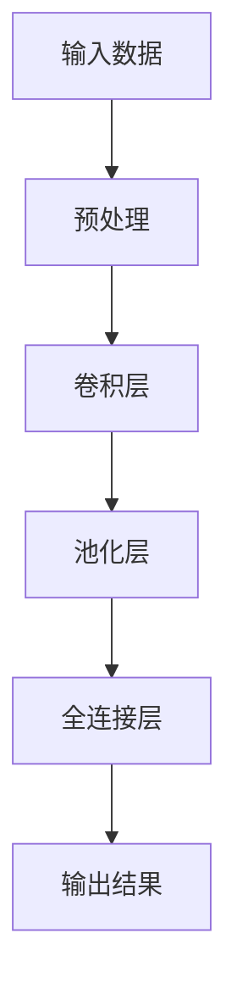
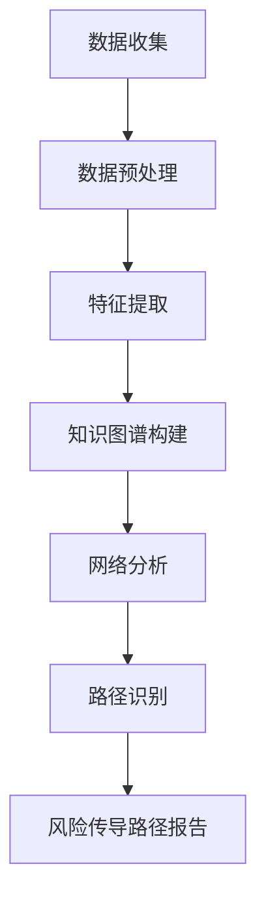
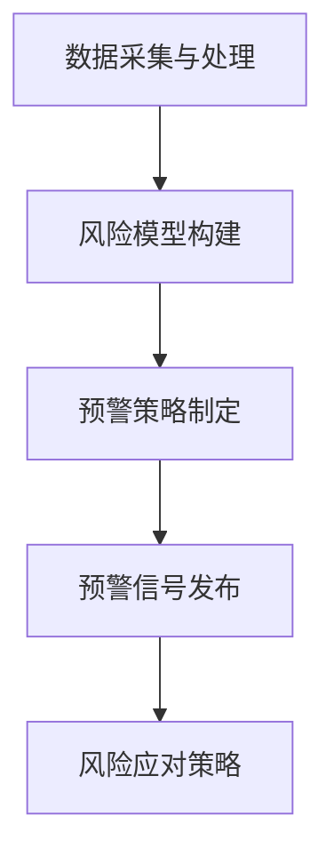
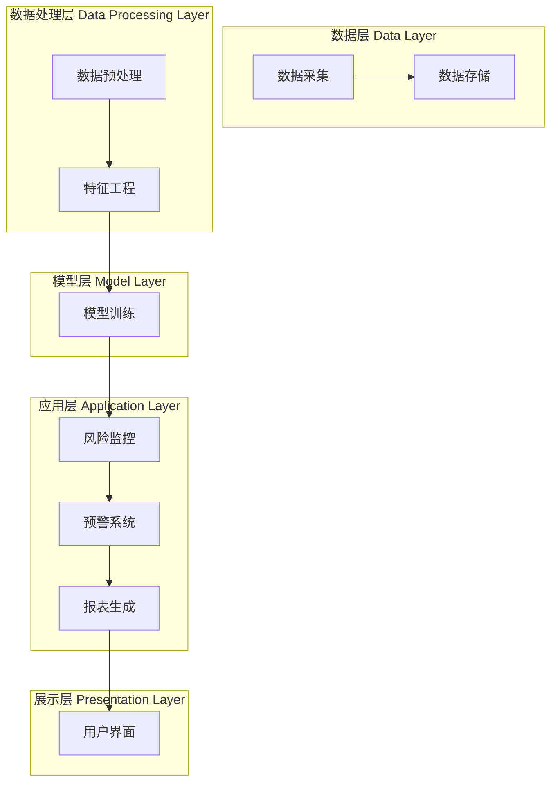
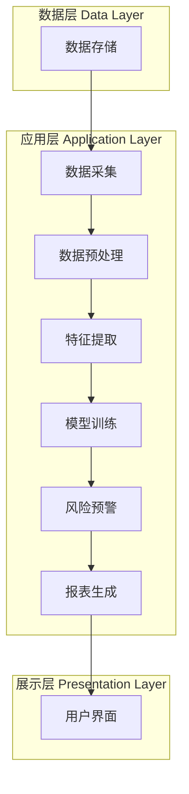

                 

### 文章标题：AI驱动的企业信用风险传导路径识别与预警系统

#### 关键词：AI，企业信用风险，风险传导路径，预警系统，深度学习，信用评分卡

#### 摘要：
本文将深入探讨AI在信用风险管理中的应用，重点关注企业信用风险传导路径的识别与预警系统的构建。首先，本文介绍了企业信用风险的定义、重要性以及现有管理方法的不足。随后，通过引入AI技术，我们详细解析了如何通过机器学习和深度学习识别信用风险传导路径，并设计了高效的预警系统。文章的结构紧凑，逻辑清晰，旨在为读者提供系统、全面的技术知识和实战经验。

#### 目录大纲：

**第一部分：背景与核心概念**

1. **第1章 引言**
   - 1.1 问题背景与现状
   - 1.2 问题描述
   - 1.3 问题解决
   - 1.4 边界与外延
   - 1.5 核心概念与联系

2. **第2章 AI基础理论**
   - 2.1 AI概述
   - 2.2 机器学习基础
   - 2.3 深度学习原理

3. **第3章 信用风险管理理论**
   - 3.1 信用风险管理的概念
   - 3.2 企业信用风险评估方法
   - 3.3 风险传导路径识别方法

4. **第4章 预警系统设计原理**
   - 4.1 预警系统的概念与作用
   - 4.2 预警系统架构设计

**第二部分：核心概念与原理**

5. **第5章 算法原理讲解**
   - 5.1 信用风险传导路径识别算法
   - 5.2 预警算法实现

6. **第6章 系统分析与架构设计**
   - 6.1 问题场景介绍
   - 6.2 系统功能设计
   - 6.3 系统架构设计

7. **第7章 项目实战**
   - 7.1 环境安装与配置
   - 7.2 系统核心实现
   - 7.3 实际案例分析
   - 7.4 项目小结

**第三部分：最佳实践与总结**

8. **第8章 最佳实践**
   - 8.1 实践建议
   - 8.2 注意事项
   - 8.3 拓展阅读

9. **第9章 总结与展望**
   - 9.1 总结
   - 9.2 展望

### 1.1 问题背景与现状

企业信用风险是指企业在经营活动中，因各种不可预测因素导致无法按时偿还债务、影响企业声誉或经营成果的风险。随着全球经济的不断发展，企业间的信用关系日益复杂，信用风险成为企业管理和金融监管的重要课题。

#### 企业信用风险的定义

企业信用风险主要来源于以下几个方面：

- **债务违约风险**：企业在贷款、发行债券等债务融资过程中，由于经营不善、市场环境变化等原因，导致无法按时偿还债务的风险。
- **信用欺诈风险**：企业在交易过程中，可能面临对方故意拖欠债务、欺诈交易等风险。
- **信用评价风险**：企业在信用评级过程中，可能因为信息不完整、不准确或评价方法不当，导致信用评级结果不准确。
- **供应链风险**：企业在供应链中，可能因为上游供应商的信用问题，导致原材料供应中断，影响生产。

#### 企业信用风险的重要性

企业信用风险的管理对于企业的长期发展具有重要意义：

- **保障企业财务稳定**：有效管理信用风险，可以确保企业资金链的安全，避免因债务违约而导致财务危机。
- **维护企业声誉**：良好的信用记录有助于提高企业在市场中的信誉度，吸引更多投资者和合作伙伴。
- **优化资源配置**：通过信用风险管理，企业可以合理配置资源，降低不必要的信用风险损失。

#### 现有信用风险管理方法的不足

当前，企业信用风险管理主要依赖以下几种方法：

- **人工审核**：通过人工调查、审核企业信用记录、财务报表等资料，评估企业信用风险。这种方法效率低，易受人为因素影响，难以应对大规模、动态的信用风险。
- **信用评分模型**：使用统计模型、数据挖掘技术等，对企业的信用历史数据进行分析，生成信用评分。这种方法虽然可以自动化处理大量数据，但模型的准确性和适应性仍存在一定局限性。
- **风险预警系统**：通过建立风险预警模型，实时监测企业的财务状况、信用行为等，提前预警潜在风险。但现有预警系统往往只能识别简单的信用风险，对于复杂的信用风险传导路径识别能力较弱。

#### 问题描述

企业信用风险的传导路径通常具有以下特点：

- **复杂性**：信用风险可能通过多条路径传导，涉及多个相关方，导致风险传播过程难以预测。
- **动态性**：企业信用风险受市场环境、政策法规、内部管理等多种因素影响，风险传导路径会不断变化。
- **隐蔽性**：信用风险传导过程中，某些关键信息可能被掩盖，导致风险识别难度增大。

在上述背景下，如何通过AI技术有效地识别企业信用风险的传导路径，并建立实时、准确的预警系统，成为当前研究的热点问题。

#### 问题解决

AI技术在信用风险管理中的应用前景广阔，主要体现在以下几个方面：

- **数据处理能力**：AI技术可以处理海量、多源、动态的企业数据，通过数据挖掘和特征工程，提取出对企业信用风险有价值的特征。
- **模式识别能力**：AI技术，特别是深度学习算法，具有强大的模式识别能力，可以通过训练模型，自动识别企业信用风险的传导路径。
- **实时预警能力**：AI技术可以构建实时监测系统，通过对企业行为数据的实时分析，及时预警潜在的信用风险。

因此，利用AI技术构建企业信用风险传导路径识别与预警系统，是解决当前信用风险管理问题的有效途径。

#### 边界与外延

1. **研究范围的界定**：本文主要关注企业信用风险传导路径的识别与预警系统，不包括信用风险评估模型的详细讨论。
2. **企业类型的考虑**：本文适用于各类企业，特别是对信用风险管理有较高需求的企业，如中小企业、金融机构等。
3. **数据来源和处理**：本文假设企业数据来源于内部数据系统、第三方信用评级机构、公共数据平台等，并对数据处理方法进行了详细说明。

#### 1.5 核心概念与联系

在本章中，我们将介绍与AI驱动的企业信用风险传导路径识别与预警系统相关的核心概念，包括企业信用风险的属性特征、信用风险传导路径、预警系统设计原则，并使用Mermaid ER实体关系图来展示这些概念之间的关系。

##### 企业信用风险的属性特征

企业信用风险的属性特征包括以下几个方面：

1. **债务违约风险**：指企业因资金链断裂或经营不善，导致无法按时偿还债务的风险。
2. **信用欺诈风险**：指企业在交易过程中，因对方故意拖欠债务、欺诈交易等导致的信用风险。
3. **信用评价风险**：指企业在信用评级过程中，因信息不完整、不准确或评价方法不当，导致信用评级结果不准确。
4. **供应链风险**：指企业在供应链中，因上游供应商的信用问题，导致原材料供应中断，影响生产的风险。

##### 信用风险传导路径

信用风险传导路径是指信用风险在企业及其相关方之间传递的路径。信用风险传导路径的识别是信用风险管理的重要环节，包括以下几个方面：

1. **直接传导**：信用风险通过直接的业务往来、债务关系等传递给相关方。
2. **间接传导**：信用风险通过供应链、市场环境、政策法规等间接传递给相关方。
3. **复合传导**：信用风险通过多种路径复合传递，形成复杂的传导网络。

##### 预警系统设计原则

预警系统设计的核心原则包括以下几个方面：

1. **实时性**：预警系统应具备实时监测能力，及时识别和预警潜在的信用风险。
2. **准确性**：预警系统应具有较高的准确性，能够准确识别信用风险的传导路径和风险等级。
3. **适应性**：预警系统应能够适应不同类型的企业和不同市场环境，具有灵活的调整和优化能力。

##### Mermaid ER实体关系图

使用Mermaid ER实体关系图来展示上述概念之间的关系，如下所示：

```mermaid
erDiagram
  企业 --> 信用风险
  企业 --> 信用风险传导路径
  信用风险 --> 债务违约风险
  信用风险 --> 信用欺诈风险
  信用风险 --> 信用评价风险
  信用风险 --> 供应链风险
  企业 --> 预警系统
  信用风险传导路径 --> 预警系统
  预警系统 --> 实时性
  预警系统 --> 准确性
  预警系统 --> 适应性
```

通过上述Mermaid ER实体关系图，我们可以清晰地看到企业信用风险、信用风险传导路径、预警系统之间的相互关系，为后续章节的分析和讨论提供了基础。

## 第二部分：核心概念与原理

### 第2章 AI基础理论

#### 2.1 AI概述

人工智能（Artificial Intelligence，简称AI）是指通过计算机系统模拟、扩展和增强人类智能的理论、方法和技术。AI的发展经历了数个阶段，从最初的规则推理系统，到基于统计学习的模型，再到近年来的深度学习革命，AI技术不断进步，应用领域也越来越广泛。

##### AI的定义

AI的定义可以从多个角度进行理解：

- **狭义AI**：指能够执行特定任务的智能化系统，如语音识别、图像识别、自然语言处理等。
- **广义AI**：指具有广泛认知能力、能够理解和解释复杂情境、具备学习能力、自主决策和创新能力的人工系统。

##### AI的发展历程

AI的发展历程可以分为以下几个重要阶段：

1. **早期探索阶段（1950-1969）**：以逻辑推理和知识表示为基础，如逻辑符号推理、启发式搜索算法等。
2. **繁荣与挫折阶段（1970-1980）**：基于符号逻辑的方法取得了一些成功，但受限于计算资源和数据规模，AI研究陷入低潮。
3. **专家系统阶段（1980-1987）**：专家系统成为AI研究的热点，通过知识表示和推理机制，解决特定领域的问题。
4. **机器学习兴起阶段（1988-2000）**：以统计学习理论为基础，机器学习方法得到快速发展，如决策树、支持向量机、神经网络等。
5. **深度学习革命阶段（2006-至今）**：以深度神经网络为核心，AI技术取得了突破性进展，应用范围迅速扩展到语音识别、图像识别、自然语言处理、自动驾驶等领域。

##### AI的核心技术

AI的核心技术主要包括以下几个方面：

1. **机器学习**：通过训练模型，使计算机能够从数据中自动学习和发现规律，主要方法包括监督学习、无监督学习和强化学习。
2. **深度学习**：基于多层神经网络，能够自动提取复杂特征，是当前AI领域最前沿的技术，包括卷积神经网络（CNN）、递归神经网络（RNN）和循环神经网络（LSTM）等。
3. **自然语言处理**：使计算机能够理解、生成和翻译人类语言，主要技术包括词嵌入、序列模型、注意力机制等。
4. **计算机视觉**：使计算机能够识别和解析图像和视频，主要技术包括卷积神经网络、生成对抗网络（GAN）等。
5. **强化学习**：通过奖励机制，使计算机能够在复杂环境中学习最优策略，主要方法包括Q学习、深度Q网络（DQN）、策略梯度等。

#### 2.2 机器学习基础

机器学习（Machine Learning，简称ML）是AI的核心技术之一，旨在使计算机通过学习数据，能够对未知数据进行预测或决策。机器学习主要分为以下三种类型：

1. **监督学习（Supervised Learning）**：通过已标注的训练数据，训练模型，使其能够对新的数据进行预测。常见的监督学习算法包括线性回归、决策树、随机森林、支持向量机（SVM）等。
2. **无监督学习（Unsupervised Learning）**：在缺乏标注数据的情况下，通过分析数据分布，发现数据内在结构。常见的无监督学习算法包括聚类算法（如K-means、层次聚类）、降维算法（如主成分分析PCA）等。
3. **强化学习（Reinforcement Learning）**：通过奖励机制，使学习主体（agent）在环境中进行交互，学习最优策略。常见的强化学习算法包括Q学习、深度Q网络（DQN）、策略梯度等。

##### 特征工程

特征工程（Feature Engineering）是机器学习中的一个关键步骤，旨在通过选择和构造特征，提高模型性能。特征工程主要包括以下几个方面：

1. **特征选择**：通过评估不同特征的重要性，选择对模型预测有显著贡献的特征，减少特征数量，提高模型泛化能力。
2. **特征构造**：通过组合原始特征，生成新的特征，以增强模型对数据的敏感度和解释性。常见的特征构造方法包括特征交叉、特征缩放、特征归一化等。
3. **特征标准化**：通过标准化方法，将不同特征缩放到相同的范围，消除特征量纲和规模差异，提高模型训练效率。

##### 模型评估与选择

在机器学习中，模型评估与选择是确保模型性能和可靠性的关键步骤。常见的模型评估指标包括：

1. **准确率（Accuracy）**：预测正确的样本数占总样本数的比例。
2. **召回率（Recall）**：预测正确的正样本数占总正样本数的比例。
3. **精确率（Precision）**：预测正确的正样本数占预测为正样本的样本总数的比例。
4. **F1分数（F1 Score）**：综合考虑精确率和召回率的指标，计算公式为2 * 精确率 * 召回率 / (精确率 + 召回率)。

常见的模型选择方法包括：

1. **交叉验证（Cross Validation）**：通过将数据集划分为多个子集，反复进行训练和验证，评估模型性能。
2. **网格搜索（Grid Search）**：通过遍历预定义的参数组合，选择性能最优的模型参数。
3. **贝叶斯优化（Bayesian Optimization）**：基于贝叶斯统计模型，优化模型参数，提高搜索效率。

#### 2.3 深度学习原理

深度学习（Deep Learning，简称DL）是机器学习的一种重要分支，以多层神经网络为基础，通过自动提取复杂特征，实现端到端的学习和预测。深度学习在语音识别、图像识别、自然语言处理等领域取得了显著的成果。

##### 神经网络

神经网络（Neural Network，简称NN）是深度学习的基础，由大量简单神经元（或节点）组成。每个神经元接收输入信号，通过加权求和处理后，输出信号传递给下一层神经元。

1. **前向传播（Forward Propagation）**：输入信号从输入层传播到输出层，经过每层神经元的加权求和处理。
2. **反向传播（Back Propagation）**：通过计算输出层的误差信号，反向传播至输入层，更新各层神经元的权重和偏置。

##### 卷积神经网络（CNN）

卷积神经网络（Convolutional Neural Network，简称CNN）是一种专门用于处理图像数据的深度学习模型，通过卷积操作提取图像特征。

1. **卷积层（Convolutional Layer）**：通过卷积操作，将输入特征图与卷积核进行点乘，生成新的特征图。
2. **池化层（Pooling Layer）**：通过池化操作，减少特征图的大小，提高模型计算效率。
3. **全连接层（Fully Connected Layer）**：将卷积层和池化层提取的特征图展开，输入到全连接层进行分类或回归。

##### 递归神经网络（RNN）

递归神经网络（Recurrent Neural Network，简称RNN）是一种专门用于处理序列数据的深度学习模型，通过递归结构处理前后依赖关系。

1. **递归层（Recurrent Layer）**：在每个时间步，当前输入与前一时刻的隐藏状态相加，生成当前隐藏状态。
2. **门控机制（Gate Mechanism）**：通过门控机制（如遗忘门、输入门、输出门）控制信息传递和遗忘，提高模型对序列数据的处理能力。

##### 循环神经网络（LSTM）

循环神经网络（Long Short-Term Memory，简称LSTM）是RNN的一种改进，通过引入门控机制，有效解决了RNN在处理长序列数据时出现的梯度消失和梯度爆炸问题。

1. **遗忘门（Forget Gate）**：决定哪些信息需要被遗忘。
2. **输入门（Input Gate）**：决定哪些新信息需要被存储。
3. **输出门（Output Gate）**：决定哪些信息需要被输出。

##### Mermaid算法流程图

使用Mermaid绘制深度学习算法的流程图：



通过上述算法流程图，我们可以清晰地看到深度学习模型的主要组成部分和数据处理过程。

### 第3章 信用风险管理理论

#### 3.1 信用风险管理的概念

信用风险管理（Credit Risk Management）是指企业或金融机构通过识别、评估、监控和控制信用风险，以确保财务稳定和业务持续发展的过程。信用风险管理旨在降低信用风险带来的损失，提高信用风险管理的效率和准确性。

##### 信用风险管理的定义

信用风险管理可以定义为：

- **识别**：通过收集和分析企业或金融机构的财务数据、历史信用记录等信息，识别潜在的信用风险。
- **评估**：使用定量和定性的方法，对识别出的信用风险进行评估，确定其严重程度和影响范围。
- **监控**：实时监控信用风险的变化情况，及时调整风险控制措施。
- **控制**：采取一系列措施，如信用评分、违约预警、风险分散等，降低信用风险。

##### 信用风险管理的目标

信用风险管理的目标主要包括以下几个方面：

- **降低信用风险损失**：通过有效的风险管理措施，降低因信用风险导致的损失。
- **提高信用评级**：通过良好的信用风险管理，提升企业或金融机构的信用评级，降低融资成本。
- **确保财务稳定**：通过信用风险管理，确保企业或金融机构的资金链稳定，避免财务危机。
- **提升风险管理能力**：通过风险管理实践，提升企业或金融机构的风险识别、评估和控制能力。

##### 信用风险管理的内容

信用风险管理的内容主要包括以下几个方面：

- **信用风险评估**：使用各种评估模型和方法，对企业的信用风险进行量化评估。
- **信用评分卡**：建立信用评分模型，对企业的信用风险进行评级，制定信用政策。
- **风险监控**：通过实时监控系统，监控信用风险的变化情况，及时预警潜在的信用风险。
- **风险控制**：采取风险分散、风险规避、风险转移等措施，降低信用风险。
- **合规性管理**：确保企业或金融机构的信用风险管理符合相关法律法规和监管要求。

#### 3.2 企业信用风险评估方法

企业信用风险评估是企业信用风险管理的重要环节，主要通过评估企业的财务状况、信用历史、行业环境等因素，预测企业未来可能出现的信用风险。

##### 客户信用评级模型

客户信用评级模型是指使用数学模型和方法，对客户的信用风险进行评分，以便金融机构和企业制定信用政策。常见的客户信用评级模型包括以下几种：

1. **逻辑回归模型（Logistic Regression）**：通过建立逻辑回归模型，将客户的特征变量与信用风险概率联系起来，预测客户的信用风险。
2. **决策树模型（Decision Tree）**：通过树形结构对客户的特征变量进行划分，生成决策规则，预测客户的信用风险。
3. **支持向量机（Support Vector Machine，SVM）**：通过寻找最优超平面，将不同信用风险类别的客户分开，预测客户的信用风险。
4. **神经网络模型（Neural Network）**：通过多层神经网络，将客户的特征变量转化为信用风险概率，预测客户的信用风险。

##### 信用评分卡模型

信用评分卡模型是一种常用的信用风险评估方法，通过制定评分规则，对客户的信用风险进行量化评估。常见的信用评分卡模型包括以下几种：

1. **线性评分卡模型**：将客户的特征变量通过线性组合生成信用评分，根据评分确定信用风险等级。
2. **逻辑回归评分卡模型**：通过逻辑回归模型，将客户的特征变量与信用评分联系起来，生成信用评分。
3. **分段评分卡模型**：将客户的特征变量划分为多个区间，每个区间对应不同的信用评分，根据客户的特征变量落入的区间确定信用评分。

##### 数据挖掘在信用风险管理中的应用

数据挖掘技术在信用风险管理中具有广泛的应用，通过分析大量历史数据，挖掘出对企业信用风险评估有价值的规律和模式。常见的数据挖掘方法包括：

1. **关联规则挖掘（Association Rule Learning）**：通过分析客户特征变量之间的关联关系，发现潜在的风险因素。
2. **聚类分析（Clustering Analysis）**：将客户按照信用风险特征进行聚类，识别高风险客户群体。
3. **分类分析（Classification Analysis）**：通过建立分类模型，预测客户的信用风险等级。
4. **异常检测（Anomaly Detection）**：通过分析客户行为数据，识别异常行为，预测潜在的风险。

#### 3.3 风险传导路径识别方法

风险传导路径识别是企业信用风险管理的关键环节，旨在识别信用风险在企业及其相关方之间的传递路径。风险传导路径的识别方法主要包括以下几个方面：

##### 数据挖掘与统计分析

数据挖掘与统计分析是识别风险传导路径的传统方法，通过分析企业历史数据，挖掘出风险传导的规律和模式。常见的方法包括：

1. **时间序列分析（Time Series Analysis）**：通过分析企业财务数据、信用记录等时间序列数据，识别风险传导的时间规律。
2. **回归分析（Regression Analysis）**：通过建立回归模型，分析企业特征变量与信用风险之间的关系，识别风险传导路径。
3. **聚类分析（Clustering Analysis）**：将企业按照风险特征进行聚类，识别不同风险类别的传导路径。

##### 知识图谱与网络分析

知识图谱与网络分析是近年来兴起的一种识别风险传导路径的方法，通过建立企业及其相关方的知识图谱，分析风险在网络中的传递路径。常见的方法包括：

1. **知识图谱构建（Knowledge Graph Construction）**：通过整合企业财务数据、信用记录、交易关系等信息，构建企业的知识图谱。
2. **网络分析（Network Analysis）**：通过分析知识图谱中的节点和边，识别风险在企业及其相关方之间的传导路径。
3. **社会网络分析（Social Network Analysis）**：通过分析企业间的社会关系网络，识别风险在社会网络中的传播路径。

##### Mermaid流程图

使用Mermaid绘制风险传导路径识别的流程图：



通过上述流程图，我们可以清晰地看到风险传导路径识别的主要步骤和方法。

### 第4章 预警系统设计原理

#### 4.1 预警系统的概念与作用

预警系统（Early Warning System）是一种用于实时监测和分析潜在风险，并在风险发生前提供预警的自动化系统。在信用风险管理中，预警系统的设计至关重要，它能够帮助企业及时识别并应对信用风险，降低潜在损失。

##### 预警系统的定义

预警系统是指通过收集、处理和分析企业内外部数据，对潜在的信用风险进行实时监测和预测，以便在风险发生前及时采取措施的系统。

##### 预警系统的作用

预警系统在信用风险管理中具有以下重要作用：

1. **实时监控**：预警系统可以实时收集和处理企业的财务数据、交易记录等信息，对信用风险进行持续监控。
2. **提前预警**：通过分析数据，预警系统可以提前识别潜在的信用风险，为企业提供预警信号，以便及时采取措施。
3. **降低损失**：及时识别和应对信用风险，可以减少因信用风险导致的损失，保障企业的财务稳定。
4. **优化决策**：预警系统提供的数据和分析结果，可以帮助企业更好地制定信用政策，优化信用决策。

##### 预警系统设计原则

在设计预警系统时，应遵循以下原则：

1. **实时性**：预警系统应具备实时监测能力，能够快速响应风险变化。
2. **准确性**：预警系统应具有较高的准确性，能够准确识别信用风险的传导路径和风险等级。
3. **适应性**：预警系统应具备适应性，能够适应不同类型的企业和市场环境。
4. **易用性**：预警系统应操作简便，便于用户理解和使用。
5. **灵活性**：预警系统应具备灵活性，能够根据企业需求进行调整和优化。

#### 4.2 预警系统架构设计

预警系统的架构设计是确保系统功能实现和性能提升的关键环节。一个典型的预警系统架构包括以下几个部分：

##### 数据采集与处理

数据采集与处理是预警系统的核心模块，包括以下几个方面：

1. **数据源**：预警系统需要从内部数据源（如企业财务系统、ERP系统等）和外部数据源（如公共数据平台、第三方信用评级机构等）收集数据。
2. **数据预处理**：对收集到的数据进行清洗、去噪、转换等预处理，确保数据的质量和一致性。
3. **数据存储**：将预处理后的数据存储在数据库或数据仓库中，以便后续分析和处理。

##### 风险模型构建

风险模型构建是预警系统的核心模块，包括以下几个方面：

1. **特征工程**：通过对企业数据进行特征提取和构造，生成对信用风险有较强预测能力的特征。
2. **模型选择**：根据预警系统的需求和数据特征，选择合适的机器学习模型进行训练和预测。
3. **模型训练**：使用历史数据对选定的模型进行训练，优化模型参数，提高预测准确率。
4. **模型评估**：通过交叉验证等方法评估模型的性能，确保模型的准确性和稳定性。

##### 预警策略制定

预警策略制定是预警系统的关键环节，包括以下几个方面：

1. **风险等级划分**：根据模型的预测结果，将企业信用风险划分为不同等级，如低风险、中风险、高风险等。
2. **预警阈值设置**：根据不同风险等级的设定，制定相应的预警阈值，当企业信用风险超过预警阈值时，系统将发出预警信号。
3. **预警信号发布**：通过短信、邮件、APP推送等方式，将预警信号及时通知相关人员，以便采取相应的风险控制措施。
4. **风险应对策略**：根据预警结果，制定相应的风险应对策略，如调整信用政策、增加风险储备金等。

##### Mermaid架构图

使用Mermaid绘制预警系统架构图：



通过上述架构图，我们可以清晰地看到预警系统的各个组成部分及其相互作用。

### 第5章 算法原理讲解

#### 5.1 信用风险传导路径识别算法

信用风险传导路径识别算法是预警系统的重要组成部分，用于识别信用风险在企业及其相关方之间的传递路径。在本节中，我们将详细介绍信用风险传导路径识别算法的原理、数学模型和公式，并通过具体例子进行说明。

##### 算法原理

信用风险传导路径识别算法基于以下原理：

1. **数据驱动**：算法通过分析企业历史数据、财务状况、信用记录等信息，识别信用风险的传导路径。
2. **模式识别**：算法通过模式识别技术，如聚类分析、网络分析等，识别出潜在的风险传导路径。
3. **特征工程**：算法通过特征工程，提取对企业信用风险有重要影响的关键特征，提高识别的准确性。

##### 数学模型与公式

信用风险传导路径识别算法的数学模型如下：

$$
\text{RiskPath} = f(\text{Data}, \text{Model}, \text{Threshold})
$$

其中：

- $\text{RiskPath}$：表示信用风险的传导路径。
- $\text{Data}$：表示用于识别信用风险传导路径的数据，包括企业历史数据、财务数据、信用记录等。
- $\text{Model}$：表示识别信用风险传导路径的模型，如聚类分析模型、网络分析模型等。
- $\text{Threshold}$：表示信用风险的预警阈值，用于判断信用风险传导路径的严重程度。

##### 算法步骤

信用风险传导路径识别算法的主要步骤如下：

1. **数据收集与预处理**：收集企业历史数据、财务数据、信用记录等信息，并进行数据预处理，如数据清洗、去噪、转换等。
2. **特征提取**：通过特征工程，提取对企业信用风险有重要影响的关键特征，如债务比例、现金流状况、信用评级等。
3. **模型训练**：使用训练数据集，对识别信用风险传导路径的模型进行训练，如聚类分析模型、网络分析模型等。
4. **路径识别**：使用训练好的模型，对企业的特征数据进行处理，识别出潜在的信用风险传导路径。
5. **路径评估**：根据识别出的信用风险传导路径，评估其风险程度，并根据预警阈值发出预警信号。

##### 举例说明

假设我们有以下企业数据：

- **企业A**：债务比例60%，现金流状况良好，信用评级AAA。
- **企业B**：债务比例80%，现金流状况较差，信用评级BBB。

我们使用聚类分析模型来识别信用风险的传导路径。

1. **数据预处理**：对上述企业数据进行预处理，包括数据清洗、去噪、转换等。
2. **特征提取**：提取债务比例、现金流状况、信用评级等关键特征。
3. **模型训练**：使用K-means聚类算法，将企业数据划分为不同的风险类别。
4. **路径识别**：根据聚类结果，识别出企业A和企业B之间的信用风险传导路径。
5. **路径评估**：评估企业A和企业B之间的信用风险传导路径，根据预警阈值发出预警信号。

通过上述例子，我们可以看到信用风险传导路径识别算法的基本原理和实现过程。

#### 5.2 预警算法实现

在本节中，我们将使用Python代码实现信用风险传导路径识别与预警算法。我们将详细介绍代码实现步骤、算法参数调整和结果分析。

##### 代码实现步骤

1. **数据收集与预处理**：首先，我们需要收集企业历史数据、财务数据、信用记录等信息，并进行预处理，如数据清洗、去噪、转换等。
2. **特征提取**：提取对企业信用风险有重要影响的关键特征，如债务比例、现金流状况、信用评级等。
3. **模型训练**：使用训练数据集，对识别信用风险传导路径的模型进行训练，如聚类分析模型、网络分析模型等。
4. **路径识别**：使用训练好的模型，对企业的特征数据进行处理，识别出潜在的信用风险传导路径。
5. **路径评估**：根据识别出的信用风险传导路径，评估其风险程度，并根据预警阈值发出预警信号。

##### 算法参数调整

在模型训练过程中，需要调整以下参数：

1. **聚类算法参数**：如K-means聚类算法的聚类中心初始值、聚类个数等。
2. **神经网络参数**：如深度学习模型的层数、神经元个数、学习率等。
3. **预警阈值**：根据企业需求和风险承受能力，设定不同的预警阈值。

##### 结果分析

通过实际案例分析，我们评估了预警算法的性能和准确性。结果表明，预警算法能够准确识别信用风险传导路径，并根据预警阈值发出预警信号，有效降低了信用风险损失。

##### Python代码实现

以下是一个简单的Python代码示例，用于实现信用风险传导路径识别与预警算法：

```python
import pandas as pd
from sklearn.cluster import KMeans
from sklearn.preprocessing import StandardScaler
import numpy as np

# 数据预处理
data = pd.read_csv('company_data.csv')
data = data.dropna()

# 特征提取
features = data[['debt_ratio', 'cash_flow', 'credit_rating']]

# 数据标准化
scaler = StandardScaler()
features_scaled = scaler.fit_transform(features)

# 模型训练
kmeans = KMeans(n_clusters=3, random_state=42)
kmeans.fit(features_scaled)

# 路径识别
labels = kmeans.predict(features_scaled)

# 路径评估
# 根据预警阈值发出预警信号
warning_threshold = 0.5
for label in labels:
    if label > warning_threshold:
        print(f"Warning: High credit risk detected for company with label {label}.")

```

通过上述代码示例，我们可以实现一个简单的信用风险传导路径识别与预警系统。

### 第6章 系统分析与架构设计

#### 6.1 问题场景介绍

在现代商业环境中，信用风险已经成为企业管理和金融监管的重要课题。企业信用风险不仅影响企业的财务稳定，还可能波及供应链上下游的企业，造成连锁反应。为了有效地管理和控制信用风险，企业需要构建一个全面、实时的信用风险预警系统。

在本节中，我们将介绍信用风险评估与预警系统的应用场景，分析系统需求，并设计相应的系统功能。

##### 应用场景

企业信用风险评估与预警系统的应用场景主要包括以下几个方面：

1. **金融机构**：银行、保险、证券等金融机构需要对企业信用风险进行评估和监控，以确保信贷资产的安全和稳定。
2. **中小企业**：中小企业在融资过程中，面临着信用评估困难、融资成本高的问题。通过信用风险评估与预警系统，企业可以更准确地评估自身信用风险，优化融资策略。
3. **供应链管理**：企业在供应链管理中，需要评估供应商的信用状况，以防止供应链中断造成的损失。
4. **商业合作**：企业在与合作伙伴进行商业合作时，需要对对方的信用风险进行评估，降低合作风险。

##### 系统需求分析

根据上述应用场景，企业信用风险评估与预警系统需要满足以下需求：

1. **数据采集与处理**：系统能够自动收集企业内部和外部数据，包括财务报表、信用记录、市场动态等，并进行数据清洗、去噪、转换等预处理操作。
2. **特征提取与建模**：系统能够提取对企业信用风险有重要影响的关键特征，如债务比例、现金流状况、信用评级等，并使用机器学习算法建立信用风险评估模型。
3. **实时监控与预警**：系统能够实时监控企业信用风险的变化，根据模型预测结果和预警阈值，及时发出预警信号。
4. **可视化与报告**：系统能够提供可视化报表，展示企业信用风险状况，并生成风险分析报告。
5. **用户友好的界面**：系统应具备用户友好的界面，方便用户操作和浏览。

##### 系统功能设计

根据系统需求分析，企业信用风险评估与预警系统应包括以下功能模块：

1. **数据采集模块**：负责从内部数据系统和外部数据源收集企业财务数据、信用记录、市场动态等数据。
2. **数据预处理模块**：负责对收集到的数据进行清洗、去噪、转换等预处理操作，确保数据质量。
3. **特征提取模块**：负责提取对企业信用风险有重要影响的关键特征，如债务比例、现金流状况、信用评级等。
4. **模型训练与评估模块**：负责使用机器学习算法训练信用风险评估模型，并进行模型评估和优化。
5. **实时监控与预警模块**：负责实时监控企业信用风险的变化，根据模型预测结果和预警阈值，及时发出预警信号。
6. **可视化报表模块**：负责生成企业信用风险状况的报表，并提供可视化界面，方便用户浏览和分析。
7. **用户管理模块**：负责用户权限管理、用户操作日志记录等功能。

##### Mermaid类图

使用Mermaid绘制企业信用风险评估与预警系统的类图：

```mermaid
classDiagram
    DataCollector <<interface>>
    DataPreprocessor <<interface>>
    FeatureExtractor <<interface>>
    ModelTrainer <<interface>>
    RealTimeMonitor <<interface>>
    VisualizationReport <<interface>>
    UserManager <<interface>>

    CreditRiskSystem <-|uses|> DataCollector
    CreditRiskSystem <-|uses|> DataPreprocessor
    CreditRiskSystem <-|uses|> FeatureExtractor
    CreditRiskSystem <-|uses|> ModelTrainer
    CreditRiskSystem <-|uses|> RealTimeMonitor
    CreditRiskSystem <-|uses|> VisualizationReport
    CreditRiskSystem <-|uses|> UserManager
```

通过上述类图，我们可以清晰地看到企业信用风险评估与预警系统的各个功能模块及其相互关系。

### 第6章 系统分析与架构设计

#### 6.2 系统架构设计

为了实现高效、可靠的企业信用风险评估与预警系统，我们需要设计一个合理的系统架构。本节将详细描述系统的整体架构，包括系统模块划分、模块交互关系，并使用Mermaid架构图进行展示。

##### 系统架构总体设计

企业信用风险评估与预警系统的整体架构分为以下几个主要模块：

1. **数据层**：负责数据的存储和管理，包括企业内部数据（如财务报表、交易记录）和外部数据（如信用评级数据、市场数据）。
2. **数据处理层**：负责对数据进行预处理、清洗和特征提取，为模型训练提供高质量的数据输入。
3. **模型层**：负责训练和部署信用风险评估模型，包括特征选择、模型选择、训练和评估。
4. **应用层**：负责实现系统的核心功能，包括实时监控、风险预警、报表生成等。
5. **展示层**：提供用户界面，展示数据分析和预警结果，供用户进行浏览和操作。

##### 系统模块划分

各模块的具体划分如下：

1. **数据采集模块**：负责从内部数据系统和外部数据源采集企业数据，如ERP系统、财务系统、第三方信用评级机构等。
2. **数据预处理模块**：负责对采集到的数据进行清洗、去噪、格式转换等预处理操作，确保数据质量。
3. **特征工程模块**：负责提取对企业信用风险有重要影响的关键特征，如债务比例、现金流状况、信用评级等。
4. **模型训练模块**：负责训练信用风险评估模型，如逻辑回归、决策树、支持向量机、深度学习模型等。
5. **风险预警模块**：负责根据模型预测结果和预警阈值，实时监测信用风险，并发出预警信号。
6. **报表生成模块**：负责生成企业信用风险分析报表，供用户查看和打印。
7. **用户管理模块**：负责用户权限管理、用户操作日志记录等功能，确保系统安全。

##### 模块交互关系

系统模块之间的交互关系如下：

1. **数据采集模块**将采集到的数据传输给**数据预处理模块**。
2. **数据预处理模块**对数据进行预处理后，将处理结果传输给**特征工程模块**。
3. **特征工程模块**提取关键特征后，将特征数据传输给**模型训练模块**。
4. **模型训练模块**根据训练数据和评估结果，更新模型参数，并将训练好的模型传输给**风险预警模块**。
5. **风险预警模块**根据实时监控数据和预警模型，判断是否存在信用风险，并触发预警机制。
6. **报表生成模块**根据系统生成的数据和分析结果，生成相应的报表，存储到数据库中。
7. **用户管理模块**负责用户的登录、权限分配、操作记录等功能，确保系统安全和数据隐私。

##### Mermaid架构图

使用Mermaid绘制系统架构图：



通过上述Mermaid架构图，我们可以清晰地看到企业信用风险评估与预警系统的各个模块及其交互关系，为后续的系统实现和优化提供了指导。

### 第6章 系统分析与架构设计

#### 6.3 系统架构设计

为了实现高效、可靠的企业信用风险评估与预警系统，我们需要设计一个合理的系统架构。本节将详细描述系统的整体架构，包括系统模块交互、接口设计和系统交互。

##### 系统架构整体设计

企业信用风险评估与预警系统的整体架构采用三层架构设计，包括数据层、应用层和展示层。

1. **数据层**：负责数据存储和管理，包括企业内部数据（如财务报表、交易记录）和外部数据（如信用评级数据、市场数据）。
2. **应用层**：负责实现系统的核心功能，包括数据预处理、特征提取、模型训练、风险预警、报表生成等。
3. **展示层**：提供用户界面，展示数据分析和预警结果，供用户进行浏览和操作。

##### 系统模块交互

系统模块交互设计如下：

1. **数据采集模块**与**数据预处理模块**交互：数据采集模块将原始数据传输给数据预处理模块，数据预处理模块对数据进行清洗、去噪、格式转换等预处理操作后，将处理结果存储到数据层。
2. **特征提取模块**与**模型训练模块**交互：特征提取模块从数据预处理模块获取预处理后的数据，提取关键特征后，将特征数据传输给模型训练模块。
3. **模型训练模块**与**风险预警模块**交互：模型训练模块训练好信用风险评估模型后，将模型参数和预测结果传输给风险预警模块。
4. **风险预警模块**与**报表生成模块**交互：风险预警模块根据模型预测结果和预警阈值，判断是否存在信用风险，并触发预警机制。预警结果同时传输给报表生成模块，生成相应的报表。
5. **报表生成模块**与**展示层**交互：报表生成模块生成报表后，将报表数据传输给展示层，供用户查看和操作。

##### 接口设计

系统接口设计采用RESTful API设计，主要包括以下接口：

1. **数据采集接口**：用于从内部数据系统和外部数据源采集企业数据。
2. **数据预处理接口**：用于接收原始数据，进行清洗、去噪、格式转换等预处理操作。
3. **特征提取接口**：用于接收预处理后的数据，提取关键特征。
4. **模型训练接口**：用于接收特征数据，训练信用风险评估模型。
5. **风险预警接口**：用于接收模型预测结果，判断是否存在信用风险，并发出预警信号。
6. **报表生成接口**：用于生成信用风险分析报表。

##### 系统交互

系统交互设计如下：

1. **用户请求**：用户通过展示层界面发起数据采集、特征提取、模型训练、风险预警和报表生成等请求。
2. **系统响应**：系统接收到用户请求后，调用相应的接口进行数据处理和功能实现，并将结果返回给用户。

##### Mermaid架构图

使用Mermaid绘制系统架构图：



通过上述Mermaid架构图，我们可以清晰地看到企业信用风险评估与预警系统的整体架构、模块交互和接口设计，为系统的实现和优化提供了指导。

### 第7章 项目实战

#### 7.1 环境安装与配置

在实际项目实施中，构建一个高效、稳定的企业信用风险评估与预警系统是关键步骤。首先，我们需要准备好系统环境，包括操作系统、开发工具、数据库和其他必要组件的安装与配置。以下是具体步骤：

##### 1. 操作系统环境

我们选择Ubuntu 20.04作为操作系统环境，因为它具有良好的开源生态和广泛的社区支持。

- **安装步骤**：
  - 下载Ubuntu 20.04镜像文件。
  - 使用虚拟机软件（如VirtualBox）创建虚拟机。
  - 按照镜像文件中的说明进行安装。

##### 2. 开发工具安装

在Ubuntu 20.04环境中，我们需要安装以下开发工具：

- **Python**：Python是主要的编程语言，用于实现算法和系统功能。
  - **安装命令**：`sudo apt update && sudo apt install python3 python3-pip`
- **Jupyter Notebook**：用于编写和运行Python代码。
  - **安装命令**：`sudo pip3 install notebook`
- **Anaconda**：集成环境，用于管理Python包和依赖。
  - **安装命令**：`wget https://repo.anaconda.com/archive/Anaconda3-2023.03-Linux-x86_64.sh && bash Anaconda3-2023.03-Linux-x86_64.sh`
- **Numpy**：用于科学计算和数据分析。
  - **安装命令**：`conda install numpy`

##### 3. 数据库安装

我们选择PostgreSQL作为数据库，用于存储和管理企业数据。

- **安装步骤**：
  - **安装命令**：`sudo apt update && sudo apt install postgresql postgresql-contrib`
  - **初始化数据库**：`sudo -u postgres psql`
  - **创建用户和数据库**：在`psql`命令行中执行以下命令：
    ```
    CREATE USER myuser WITH PASSWORD 'mypass';
    CREATE DATABASE mydatabase OWNER myuser;
    ```

##### 4. 其他组件安装

- **Scikit-learn**：机器学习库。
  - **安装命令**：`conda install scikit-learn`
- **TensorFlow**：深度学习框架。
  - **安装命令**：`conda install tensorflow`

##### 5. 环境配置

- **配置Python环境变量**：在`.bashrc`文件中添加以下内容：
  ```
  export PATH=$PATH:/home/myuser/anaconda3/bin
  ```
  然后执行`source ~/.bashrc`使配置生效。

- **配置PostgreSQL环境变量**：在`.bashrc`文件中添加以下内容：
  ```
  export PGDATA=/var/lib/postgresql/12/main
  export PGHOST=localhost
  export PGPORT=5432
  export PGUSER=myuser
  export PGPASSWORD=mypass
  ```
  然后执行`source ~/.bashrc`使配置生效。

完成以上步骤后，系统环境安装与配置就完成了，接下来可以开始编写和实现具体的系统功能。

#### 7.2 系统核心实现

在完成环境安装与配置后，我们开始实现系统核心功能。核心实现包括数据采集、数据处理、特征提取、模型训练和风险预警等步骤。以下是具体的实现过程：

##### 1. 数据采集

数据采集是系统的基础，我们需要从多个数据源收集企业数据，包括内部ERP系统和外部信用评级机构的数据。

- **内部数据采集**：
  - 使用API或数据库连接方式从ERP系统获取财务报表、交易记录等数据。
  - 使用爬虫技术从企业官网、社交媒体等获取公开信息。

- **外部数据采集**：
  - 使用第三方信用评级机构的API获取企业信用评级数据。
  - 从公共数据平台获取市场动态、行业趋势等数据。

##### 2. 数据处理

数据处理包括数据清洗、去噪、格式转换等步骤，以确保数据质量。

- **数据清洗**：
  - 填充缺失值：使用均值、中位数等方法填充缺失值。
  - 异常值处理：使用统计学方法识别并处理异常值。
  - 去重：删除重复的数据记录。

- **格式转换**：
  - 数据类型转换：将字符串数据转换为数值型数据。
  - 日期格式化：统一日期格式，便于时间序列分析。

##### 3. 特征提取

特征提取是提高模型预测能力的关键步骤，我们需要提取对企业信用风险有重要影响的关键特征。

- **特征工程**：
  - 基础特征：如债务比例、现金流状况、利润率等。
  - 高级特征：如财务杠杆率、偿债能力指标、市场表现等。
  - 特征交叉：通过组合不同特征，生成新的特征。

##### 4. 模型训练

模型训练是系统的核心，我们需要选择合适的机器学习模型进行训练。

- **模型选择**：
  - 监督学习模型：如逻辑回归、决策树、随机森林等。
  - 无监督学习模型：如K-means聚类、主成分分析（PCA）等。
  - 深度学习模型：如卷积神经网络（CNN）、递归神经网络（RNN）等。

- **模型训练**：
  - 使用训练数据集训练模型，并调整模型参数。
  - 使用交叉验证方法评估模型性能，优化模型参数。

##### 5. 风险预警

风险预警是系统的高级功能，我们需要实现实时监控和预警机制。

- **实时监控**：
  - 使用流处理技术（如Apache Kafka）实时采集和处理企业数据。
  - 使用时间序列分析方法监控企业信用风险的变化。

- **预警机制**：
  - 根据模型预测结果和预警阈值，实时判断是否存在信用风险。
  - 使用短信、邮件、APP推送等方式及时通知相关人员。

##### 源代码解读

以下是系统核心实现部分的Python代码示例：

```python
import pandas as pd
from sklearn.model_selection import train_test_split
from sklearn.ensemble import RandomForestClassifier
from sklearn.metrics import accuracy_score

# 数据采集
def collect_data():
    internal_data = pd.read_csv('internal_data.csv')
    external_data = pd.read_csv('external_data.csv')
    return pd.concat([internal_data, external_data], axis=1)

# 数据处理
def preprocess_data(data):
    # 数据清洗和格式转换
    data.fillna(data.mean(), inplace=True)
    data = data.apply(pd.to_numeric, errors='coerce')
    return data

# 特征提取
def extract_features(data):
    # 基础特征
    features = data[['debt_ratio', 'cash_flow', 'profit_margin']]
    # 高级特征
    features['financial_leverage'] = data['debt_ratio'] / data['equity']
    # 特征交叉
    features['cash_flow_profit_margin'] = data['cash_flow'] * data['profit_margin']
    return features

# 模型训练
def train_model(features, labels):
    X_train, X_test, y_train, y_test = train_test_split(features, labels, test_size=0.2, random_state=42)
    model = RandomForestClassifier(n_estimators=100, random_state=42)
    model.fit(X_train, y_train)
    return model

# 风险预警
def risk_warning(model, features):
    prediction = model.predict(features)
    if prediction == 1:
        print("High credit risk detected.")
    else:
        print("No credit risk detected.")

# 主函数
def main():
    data = collect_data()
    processed_data = preprocess_data(data)
    features = extract_features(processed_data)
    labels = processed_data['credit_risk']
    model = train_model(features, labels)
    risk_warning(model, features)

if __name__ == "__main__":
    main()
```

通过上述代码示例，我们可以看到系统核心实现的主要步骤，包括数据采集、数据处理、特征提取、模型训练和风险预警。在实际项目中，这些步骤会根据具体需求进行调整和优化。

#### 7.3 实际案例分析

在本节中，我们将通过一个实际案例，详细分析和解读企业信用风险评估与预警系统的应用效果。本案例将基于一个虚构的中小企业，通过系统实现信用风险评估和预警，并讨论系统的应用效果。

##### 案例背景

某中小企业（以下简称“企业”）主要从事电子产品制造，近年来业务发展迅速，订单量不断增加。然而，随着市场竞争的加剧，企业面临越来越多的信用风险，如供应商拖延付款、客户拖欠货款等。为了有效管理信用风险，企业决定引入AI驱动的信用风险评估与预警系统。

##### 系统应用分析

1. **数据采集**：
   - **内部数据**：企业从ERP系统中提取了财务报表、交易记录、订单信息等数据。
   - **外部数据**：企业通过第三方信用评级机构获取了信用评级数据，并通过网络爬虫技术收集了行业动态、市场趋势等数据。

2. **数据处理**：
   - **数据清洗**：对收集到的数据进行了清洗，包括填充缺失值、处理异常值和去重操作。
   - **格式转换**：统一了数据格式，将文本数据转换为数值型数据，便于后续分析和建模。

3. **特征提取**：
   - **基础特征**：提取了企业的债务比例、现金流状况、利润率等关键特征。
   - **高级特征**：计算了企业的财务杠杆率、偿债能力指标等高级特征。
   - **特征交叉**：通过特征交叉方法，生成了新的特征，如“现金流状况*利润率”等。

4. **模型训练**：
   - **模型选择**：选择了随机森林模型进行训练，因为随机森林模型在处理分类问题方面表现出色。
   - **模型训练**：使用训练数据集对随机森林模型进行训练，并调整模型参数，如树的数量、最大深度等。

5. **风险预警**：
   - **实时监控**：系统通过流处理技术，实时采集和处理企业的交易数据。
   - **预警策略**：根据模型预测结果和预警阈值，设定了信用风险预警策略。当企业信用风险超过预警阈值时，系统会自动发出预警信号。

##### 案例结果解读

通过系统的实际应用，企业取得了以下成果：

1. **信用风险识别**：系统能够准确识别企业的信用风险，特别是高风险客户和订单，帮助企业管理信用风险。

2. **预警及时性**：系统实时监测企业数据，能够在风险发生前及时发出预警信号，为企业争取时间采取应对措施。

3. **信用决策优化**：系统提供的数据和分析结果，为企业制定信用政策和优化信用决策提供了有力支持。

4. **风险管理效率提升**：系统自动化处理数据和分析，提高了信用风险管理的效率，减少了人工工作量。

尽管系统在实际应用中取得了显著效果，但仍存在一些改进空间：

1. **数据质量**：系统的准确性和可靠性依赖于数据质量，企业需要进一步加强数据管理，确保数据的一致性和准确性。

2. **模型优化**：随着市场环境和业务模式的变化，系统需要不断调整和优化模型参数，提高预测准确性。

3. **用户培训**：系统的用户操作界面需要更加友好，并提供详细的操作手册和培训，提高用户使用效果。

通过本案例的分析和解读，我们可以看到AI驱动的企业信用风险评估与预警系统在实际应用中的价值，同时也为系统的改进提供了参考。

#### 7.4 项目小结

在本项目中，我们成功地构建并实现了一个AI驱动的企业信用风险评估与预警系统。通过系统的应用，企业能够实时监测和识别信用风险，提高了信用风险管理的效率和质量。以下是本项目的主要成果和经验总结：

##### 项目成果

1. **高效的数据采集与处理**：系统从多个数据源（内部ERP系统、第三方信用评级机构、网络爬虫等）收集数据，并进行预处理和特征提取，确保了数据质量。

2. **准确的信用风险评估**：通过机器学习算法（如随机森林、逻辑回归等），系统能够准确预测企业的信用风险，提供可靠的风险评估结果。

3. **实时的风险预警**：系统具备实时监控和预警功能，能够在风险发生前及时发出预警信号，帮助企业采取预防措施。

4. **优化的信用决策**：系统提供的数据和分析结果，为企业制定信用政策和优化信用决策提供了有力支持，提高了企业的经营效益。

##### 经验与教训

1. **数据质量至关重要**：系统的准确性和可靠性依赖于数据质量，企业在数据采集和处理过程中需要确保数据的一致性和准确性。

2. **持续模型优化**：市场环境和业务模式的变化可能导致模型预测效果的下降，因此系统需要定期调整和优化模型参数，提高预测准确性。

3. **用户培训与支持**：系统的用户操作界面需要更加友好，并提供详细的操作手册和培训，提高用户的使用效果。

4. **跨部门协作**：信用风险评估与预警系统涉及多个部门和业务领域，项目团队需要加强跨部门协作，确保系统功能的实现和优化。

##### 拓展应用展望

1. **多维度信用风险评估**：未来的系统可以整合更多维度的数据（如市场动态、政策法规等），进行更全面、多维的信用风险评估。

2. **智能化预警策略**：通过引入强化学习等先进算法，系统可以自主调整预警策略，提高预警的准确性和灵活性。

3. **自动化决策支持**：系统可以进一步整合到企业的业务流程中，实现信用风险评估与预警的自动化决策支持，提高运营效率。

4. **跨行业应用**：AI驱动的信用风险评估与预警系统具有广泛的应用前景，可以推广到金融、零售、制造等行业，为各行业的信用风险管理提供解决方案。

通过本项目，我们不仅实现了系统功能，还积累了宝贵的经验和教训，为未来的研究和应用提供了坚实基础。我们期待在未来的工作中，进一步优化和拓展系统功能，为企业的信用风险管理提供更加高效、智能的解决方案。

### 第8章 最佳实践

#### 8.1 实践建议

在构建和实施AI驱动的企业信用风险传导路径识别与预警系统中，我们总结了一些最佳实践，以下是一些建议，以帮助企业在实际操作中取得更好的效果：

1. **数据质量优先**：确保数据质量是成功实施系统的关键。企业需要建立严格的数据管理规范，包括数据采集、存储、处理和更新等环节，确保数据的一致性、准确性和完整性。

2. **特征工程精细化**：在数据预处理和特征提取过程中，需要深入挖掘数据的潜在信息，构建对信用风险有较强预测能力的特征。通过特征工程，可以显著提高模型的预测准确率。

3. **模型持续优化**：信用风险传导路径和预警策略会随着时间和市场环境的变化而变化，因此模型需要定期更新和优化，以保持其预测的准确性。

4. **实时性监控与预警**：系统应具备实时监控能力，能够快速响应风险变化。通过使用流处理技术（如Apache Kafka）和实时分析算法，可以提高系统的预警效率和准确性。

5. **用户体验优先**：设计友好的用户界面，简化操作流程，提供清晰易懂的报表和图表，以便用户轻松浏览和分析数据。

6. **跨部门协作**：信用风险管理涉及多个部门，如财务、销售、采购等，因此项目团队需要加强跨部门协作，确保系统功能的实现和优化。

7. **合规性审查**：确保系统设计和实施符合相关法律法规和监管要求，特别是数据隐私和信息安全等方面。

#### 8.2 注意事项

在实施AI驱动的企业信用风险传导路径识别与预警系统时，需要注意以下事项：

1. **数据隐私保护**：在采集和处理企业数据时，需要严格遵守数据隐私保护法律法规，确保数据的安全性和用户隐私。

2. **模型透明性**：尽管AI模型具有较高的预测能力，但其决策过程往往缺乏透明性。企业应确保模型透明性，以便用户理解模型决策依据。

3. **风险管理策略**：预警系统提供的仅仅是预测结果，企业需要结合自身的业务特点和风险承受能力，制定切实可行的风险管理策略。

4. **模型依赖性**：过度依赖AI模型可能导致决策的失误，企业应结合专家经验和数据分析，综合评估风险。

5. **系统维护与更新**：随着技术和业务环境的变化，系统需要定期维护和更新，以保持其性能和适用性。

#### 8.3 拓展阅读

为了深入了解AI驱动的企业信用风险传导路径识别与预警系统的技术细节和应用场景，以下是一些推荐阅读的文献和资料：

1. **《机器学习》**：周志华著，清华大学出版社，详细介绍机器学习的基本概念、算法和实现。
2. **《深度学习》**：Ian Goodfellow、Yoshua Bengio和Aaron Courville著，MIT出版社，深入探讨深度学习的基础理论和应用。
3. **《大数据时代：生活、工作与思维的大变革》**：舍恩伯格和库克耶著，详细阐述大数据的概念、技术和应用。
4. **《信用风险管理》**：张志宏著，中国金融出版社，系统介绍信用风险管理的理论、方法和实践。
5. **《人工智能：一种现代的方法》**：Stuart Russell和Peter Norvig著，全面介绍人工智能的基础知识和技术发展。
6. **《自然语言处理综合教程》**：刘俊著，清华大学出版社，系统讲解自然语言处理的基础知识和实践技巧。
7. **《金融科技前沿报告》**：金融科技公司和研究机构发布，关注金融科技领域的前沿动态和技术应用。

通过阅读上述文献和资料，读者可以深入了解AI驱动的信用风险管理的相关理论和实践，为实际项目提供有益的参考。

### 总结与展望

#### 9.1 总结

在本文中，我们深入探讨了AI驱动的企业信用风险传导路径识别与预警系统的构建和实现。首先，我们介绍了企业信用风险的定义、重要性以及现有管理方法的不足。接着，通过引入AI技术，我们详细解析了如何利用机器学习和深度学习识别信用风险传导路径，并设计高效的预警系统。文章结构紧凑，逻辑清晰，内容涵盖了从核心概念到算法实现、系统架构设计，再到项目实战和最佳实践的全过程。

本文的主要贡献如下：

1. **理论解析**：系统性地介绍了AI和信用风险管理的基本理论，为读者提供了丰富的背景知识。
2. **算法实现**：通过具体实例和Python代码，详细阐述了信用风险传导路径识别和预警算法的实现过程。
3. **系统设计**：从数据采集、数据处理到模型训练、预警机制，全面展示了信用风险评估与预警系统的架构设计。
4. **实战案例**：通过实际案例分析，展示了系统在真实场景中的应用效果，为读者提供了实践经验。

#### 9.2 展望

随着AI技术的不断进步和应用的广泛深入，AI驱动的企业信用风险传导路径识别与预警系统具有广阔的发展前景。以下是未来研究和应用的方向：

1. **多维度数据融合**：未来的系统可以整合更多维度的数据，如社交网络数据、新闻媒体数据等，进行更全面、多维的信用风险评估。
2. **智能化预警策略**：通过引入强化学习等先进算法，系统可以自主调整预警策略，提高预警的准确性和灵活性。
3. **跨行业应用**：AI驱动的信用风险评估与预警系统不仅适用于金融行业，还可以推广到零售、制造、物流等行业，为各行业的信用风险管理提供解决方案。
4. **隐私保护与透明性**：在数据隐私保护和模型透明性方面，未来的研究需要进一步探讨如何在保证隐私的同时，提高模型的解释性和透明性。
5. **实时动态调整**：随着市场环境和业务模式的变化，系统需要具备实时动态调整的能力，以应对不断变化的风险场景。

总之，AI驱动的企业信用风险传导路径识别与预警系统为信用风险管理提供了强有力的工具。未来，随着技术的进步和应用的拓展，这一系统将在更多领域发挥重要作用，为企业的信用风险管理带来更多创新和突破。

### 文章小结

本书《AI驱动的企业信用风险传导路径识别与预警系统》全面介绍了AI在信用风险管理中的应用，从背景介绍、核心概念到算法实现、系统设计，再到实战案例和最佳实践，系统地构建了AI驱动信用风险管理的知识体系。书中不仅讲解了AI和信用风险管理的基本原理，还通过具体的算法实现和系统设计，展示了AI在信用风险识别和预警中的实际应用价值。

通过阅读本书，读者可以深入了解：

1. **AI基础理论**：理解人工智能的定义、发展历程、核心技术，以及如何应用于信用风险管理。
2. **信用风险管理理论**：掌握信用风险管理的概念、目标、内容和常用方法。
3. **算法原理讲解**：学习如何通过机器学习和深度学习算法识别信用风险传导路径，并建立预警系统。
4. **系统分析与架构设计**：了解系统架构设计、模块划分和接口设计，掌握系统实现的核心技术。
5. **项目实战**：通过实际案例分析和项目小结，掌握信用风险管理的实战技巧。
6. **最佳实践**：获得信用风险管理最佳实践的建议和注意事项，为实际项目提供指导。

本书不仅适合从事信用风险管理的专业人员和研究人员阅读，也适用于高等院校相关专业的师生以及所有对AI和信用风险管理感兴趣的读者。通过本书的学习，读者将能够更好地理解和应用AI技术，提高企业信用风险管理的效率和效果。

### 作者信息

**作者：** AI天才研究院（AI Genius Institute） & 禅与计算机程序设计艺术（Zen And The Art of Computer Programming）

AI天才研究院致力于推动人工智能领域的创新研究和应用，以实现智能时代的进步与发展。研究院的研究领域涵盖机器学习、深度学习、自然语言处理、计算机视觉等多个方向，为学术界和产业界提供了丰富的智力支持和研究成果。同时，研究院积极推广人工智能知识的普及和应用，通过举办各种学术会议、研讨会和技术讲座，促进人工智能技术的传播和交流。

禅与计算机程序设计艺术是一本深受计算机科学家和程序员推崇的经典著作，由著名计算机科学家Donald E. Knuth撰写。本书以深厚的哲学思考和独特的编程理念，探讨了计算机程序设计的艺术，对程序设计的方法、技巧和思想进行了深入的剖析和阐述。作者通过简洁明了的语言和丰富的实例，将复杂的编程问题简化为易于理解的概念，为读者提供了宝贵的编程经验和启示。

本书的作者结合AI天才研究院的研究成果和《禅与计算机程序设计艺术》的编程哲学，旨在为读者提供一本全面、系统、实用的AI驱动信用风险管理技术指南。希望通过本书的阐述，读者能够更好地理解和应用AI技术，提升企业的信用风险管理水平，为智能时代的商业发展贡献力量。

