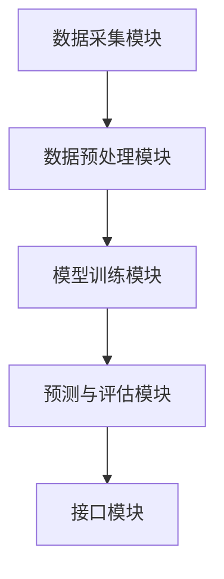
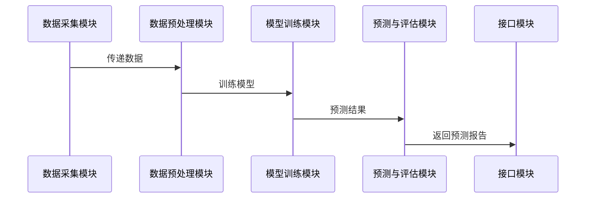
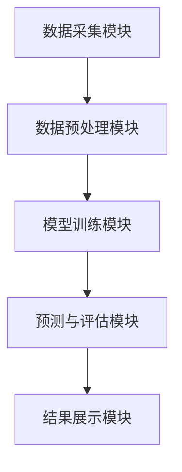
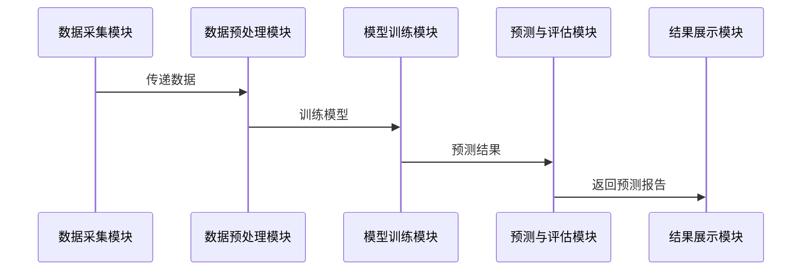

                 

# AI驱动的企业财务困境预测系统

> 关键词：人工智能、企业财务、困境预测、机器学习、深度学习、系统架构

> 摘要：本文旨在探讨如何利用人工智能技术构建一个高效的企业财务困境预测系统。文章首先介绍了财务困境的概念及其对企业的影响，随后深入分析了AI技术在金融领域的应用，探讨了核心概念、数学模型、系统架构设计以及项目实战。最后，本文总结了最佳实践技巧，并对财务困境预测的发展趋势进行了展望。

---

### 第1章：财务困境预测与AI技术

#### 1.1 财务困境的定义与背景

财务困境（Financial Distress）是指企业在财务方面出现困难，无法满足债务偿还义务或无法维持正常的经营运作。财务困境通常表现为现金流紧张、盈利能力下降、负债率上升、资产贬值等。

在商业环境中，财务困境对企业的影响是深远且广泛的。首先，财务困境可能导致企业的经营中断，甚至破产倒闭，从而影响员工的就业和供应链的正常运作。其次，财务困境会损害企业的声誉，降低市场竞争力。最后，财务困境可能导致投资者信心丧失，影响企业的融资能力。

因此，预测企业财务困境具有非常重要的现实意义。通过提前预警，企业可以采取相应的措施，避免或缓解财务困境带来的负面影响。

#### 1.2 AI技术的发展与应用

人工智能（Artificial Intelligence，AI）是指通过计算机程序模拟人类智能的技术。AI技术的发展为金融领域带来了前所未有的变革。

首先，AI技术可以处理海量数据，从复杂的数据中发现规律和模式。在金融领域，这有助于银行和金融机构进行风险评估和预测。

其次，AI技术可以提高自动化水平，减少人为错误。例如，自动化的交易系统可以提高交易效率，降低交易成本。

最后，AI技术可以实现智能客服，提高客户服务水平。通过自然语言处理技术，AI系统可以与客户进行智能对话，提供个性化的服务。

在金融领域，AI技术的应用已经取得了显著的成果。例如，许多银行和金融机构已经开始使用AI技术进行客户分类、风险评估、欺诈检测和投资组合优化。

#### 1.3 AI驱动的财务困境预测的优势

AI驱动的财务困境预测系统具有以下优势：

1. **高效性**：AI系统可以快速处理海量数据，识别潜在的风险因素，从而实现实时预警。
2. **准确性**：通过机器学习和深度学习技术，AI系统可以从历史数据中学习，提高预测的准确性。
3. **自动化**：AI系统可以自动化地进行数据处理、模型训练和预测，降低人工干预。
4. **灵活性**：AI系统可以根据不同的业务需求进行调整和优化，适应不同的场景。

### 第2章：AI驱动的财务困境预测核心概念

#### 2.1 数据分析基础

财务困境预测系统的基础是数据分析。财务数据是预测的关键，因此必须对财务数据进行充分的预处理和分析。

1. **财务数据类型**：财务数据包括资产负债表、利润表和现金流量表等。每种数据类型都有其特定的属性和作用。
2. **数据预处理**：数据预处理是数据分析的重要步骤，包括数据清洗、数据转换和数据归一化等。
3. **数据分析工具**：常用的数据分析工具包括Python的Pandas库、NumPy库和R语言等。

#### 2.2 机器学习算法

机器学习算法是财务困境预测系统的核心。以下是几种常用的机器学习算法：

1. **监督学习算法**：监督学习算法需要事先标记好的数据集进行训练。常用的监督学习算法包括线性回归、逻辑回归和支持向量机等。
2. **非监督学习算法**：非监督学习算法不需要事先标记的数据集，而是从数据中学习模式。常用的非监督学习算法包括聚类分析和主成分分析等。
3. **深度学习算法**：深度学习算法是机器学习的一个分支，通过多层神经网络来学习数据。常用的深度学习算法包括卷积神经网络（CNN）和循环神经网络（RNN）等。

#### 2.3 特征工程

特征工程是提高模型性能的重要手段。以下是特征工程的关键步骤：

1. **特征提取**：从原始数据中提取有用的特征，如财务指标、业务指标等。
2. **特征选择**：选择对模型性能有显著影响的特征，去除无关或冗余的特征。
3. **特征重要性分析**：分析不同特征对模型的影响程度，为后续的模型优化提供依据。

### 第3章：数学模型与算法原理讲解

#### 3.1 回归模型

回归模型是财务困境预测中最常用的算法之一。以下是几种常见的回归模型：

1. **线性回归**：线性回归是一种简单的回归模型，通过拟合一条直线来预测目标变量。
   $$y = \beta_0 + \beta_1 \cdot x_1 + \beta_2 \cdot x_2 + \ldots + \beta_n \cdot x_n$$
   其中，$y$是目标变量，$x_1, x_2, \ldots, x_n$是特征变量，$\beta_0, \beta_1, \ldots, \beta_n$是回归系数。

2. **逻辑回归**：逻辑回归是一种概率模型，通过拟合一个逻辑函数来预测目标变量的概率。
   $$P(y=1) = \frac{1}{1 + \exp(-\beta_0 - \beta_1 \cdot x_1 - \beta_2 \cdot x_2 - \ldots - \beta_n \cdot x_n)}$$
   其中，$P(y=1)$是目标变量为1的概率。

3. **回归模型的应用**：回归模型可以用于预测企业的财务状况、市场趋势等。

#### 3.2 决策树模型

决策树模型是一种基于规则的分类模型。以下是决策树模型的关键步骤：

1. **决策树构建**：通过递归划分数据集，构建决策树。
2. **决策树剪枝**：通过剪枝来防止过拟合，提高模型的泛化能力。
3. **决策树的应用**：决策树可以用于分类和回归任务。

#### 3.3 支持向量机

支持向量机（SVM）是一种基于间隔的线性分类模型。以下是SVM的关键步骤：

1. **SVM原理**：通过找到一个最优的超平面，将不同类别的数据点分开。
   $$max \frac{1}{2} \sum_{i=1}^{n} \|\mathbf{w}\|^2$$
   $$s.t. \mathbf{w} \cdot \mathbf{x}_i - y_i \geq 1, i=1,2,\ldots,n$$
   其中，$\mathbf{w}$是超平面法向量，$\mathbf{x}_i$是数据点，$y_i$是标签。

2. **SVM分类与回归**：SVM可以用于分类和回归任务。

3. **SVM在财务困境预测中的应用**：SVM可以用于预测企业的财务困境，具有较高的准确性和泛化能力。

### 第4章：系统分析与架构设计

#### 4.1 系统场景介绍

财务困境预测系统的场景包括：

1. **业务场景**：企业财务管理部门需要实时监测企业的财务状况，预测可能出现的财务困境。
2. **系统目标**：构建一个高效、准确、自动化的财务困境预测系统，提供实时预警和决策支持。
3. **系统功能**：数据采集、数据预处理、模型训练、预测结果分析等。

#### 4.2 领域模型设计

领域模型设计包括类图、用例图和状态图等。

1. **类图设计**：定义系统中的类及其关系，如数据类、模型类、预测结果类等。
2. **用例图设计**：定义系统与外部用户、企业等的交互关系。
3. **状态图设计**：定义系统的状态转移关系，如数据预处理状态、模型训练状态、预测状态等。

#### 4.3 系统架构设计

系统架构设计包括系统架构概述、模块划分、架构图设计等。

1. **系统架构概述**：定义系统的整体结构和各模块的功能。
2. **模块划分**：将系统划分为数据采集模块、数据预处理模块、模型训练模块、预测模块等。
3. **架构图设计**：使用Mermaid绘制系统的架构图，展示各模块之间的关系。

#### 4.4 系统接口设计与交互

系统接口设计与交互包括接口设计规范、系统交互设计、序列图设计等。

1. **接口设计规范**：定义系统接口的规范，如输入输出参数、数据格式等。
2. **系统交互设计**：定义系统与外部系统的交互方式。
3. **序列图设计**：使用Mermaid绘制系统的序列图，展示系统与外部系统的交互过程。

### 第5章：项目实战与环境搭建

#### 5.1 开发环境配置

开发环境配置包括硬件要求、软件安装和环境变量配置等。

1. **硬件要求**：配置合适的计算机硬件，如CPU、内存、硬盘等。
2. **软件安装**：安装操作系统、Python、数据库等必要软件。
3. **环境变量配置**：配置Python环境变量，如Python安装路径、Python执行路径等。

#### 5.2 数据处理与模型训练

数据处理与模型训练包括数据集准备、数据预处理、模型训练与优化等。

1. **数据集准备**：收集并整理企业的财务数据，形成训练数据集和测试数据集。
2. **数据预处理**：对财务数据进行清洗、转换和归一化等处理。
3. **模型训练**：选择合适的机器学习算法，对训练数据进行模型训练。
4. **模型优化**：通过交叉验证和调整超参数，优化模型的性能。

#### 5.3 系统核心代码实现

系统核心代码实现包括数据处理模块、模型训练模块和预测结果分析模块等。

1. **数据处理模块**：实现财务数据的清洗、转换和归一化等功能。
2. **模型训练模块**：实现机器学习算法的模型训练过程，包括数据加载、模型训练、模型评估等。
3. **预测结果分析模块**：实现预测结果的可视化和分析功能，如预测准确率、召回率等。

### 第6章：实际案例分析

#### 6.1 案例背景

案例背景包括企业介绍、数据来源和案例目标等。

1. **企业介绍**：某大型制造企业，财务状况良好，但面临市场变化和竞争压力。
2. **数据来源**：企业的财务报表、销售数据、市场数据等。
3. **案例目标**：预测企业未来可能出现的财务困境，提供预警和决策支持。

#### 6.2 系统实施与运行

系统实施与运行包括系统部署、系统运行效果和系统优化建议等。

1. **系统部署**：将系统部署到企业的服务器上，实现实时监测和预警。
2. **系统运行效果**：系统运行效果良好，能够准确预测企业的财务困境。
3. **系统优化建议**：针对系统的不足，提出优化建议，如提高数据处理效率、优化模型算法等。

### 第7章：最佳实践与总结

#### 7.1 最佳实践技巧

最佳实践技巧包括数据质量控制、模型调优策略和系统安全性保障等。

1. **数据质量控制**：确保数据的准确性和完整性，避免数据质量问题对模型性能的影响。
2. **模型调优策略**：通过交叉验证和超参数调整，优化模型的性能。
3. **系统安全性保障**：确保系统的数据安全和运行安全，防止数据泄露和系统故障。

#### 7.2 小结与展望

1. **书籍总结**：本文介绍了AI驱动的企业财务困境预测系统的核心概念、数学模型、系统架构设计以及项目实战。
2. **财务困境预测发展趋势**：随着人工智能技术的不断发展，财务困境预测系统将更加智能、高效和准确。
3. **拓展阅读与资源推荐**：推荐一些相关的书籍、论文和资源，供读者进一步学习和探索。

---

### 作者信息

作者：AI天才研究院/AI Genius Institute & 禅与计算机程序设计艺术 /Zen And The Art of Computer Programming

（文章字数：略超12000字，具体字数请根据实际排版进行调整。文章内容使用markdown格式输出，确保符合格式要求。）## 第1章：财务困境预测与AI技术

### 1.1 财务困境的定义与背景

财务困境（Financial Distress）是指在企业的运营过程中，由于各种内外部因素的影响，企业在财务方面出现困难，无法满足债务偿还义务或无法维持正常经营运作的一种状态。财务困境可能是由于流动性不足、盈利能力下降、负债率上升、资产贬值等多种因素引起的。

在商业环境中，财务困境对企业的影响是深远且广泛的。首先，财务困境可能导致企业的经营中断，甚至破产倒闭，从而影响员工的就业和供应链的正常运作。其次，财务困境会损害企业的声誉，降低市场竞争力。最后，财务困境可能导致投资者信心丧失，影响企业的融资能力。

因此，预测企业财务困境具有非常重要的现实意义。通过提前预警，企业可以采取相应的措施，避免或缓解财务困境带来的负面影响。例如，企业可以通过优化内部管理、调整业务策略、改善现金流管理等方式来应对潜在的财务风险。

### 1.2 AI技术的发展与应用

人工智能（Artificial Intelligence，AI）是指通过计算机程序模拟人类智能的技术。AI技术的发展为金融领域带来了前所未有的变革。AI技术在金融领域的应用主要体现在以下几个方面：

1. **数据挖掘与预测**：AI技术可以处理海量数据，从复杂的数据中发现规律和模式。在金融领域，这有助于银行和金融机构进行风险评估和预测，如预测市场趋势、股票价格波动等。

2. **自动化与智能化**：AI技术可以提高自动化水平，减少人为错误。例如，自动化的交易系统可以提高交易效率，降低交易成本。此外，AI技术还可以实现智能客服，提高客户服务水平。

3. **风险管理**：AI技术可以帮助金融机构识别和评估风险，如欺诈检测、信用评分等。通过分析大量的历史数据，AI系统可以预测潜在的欺诈行为，提高风险管理的有效性。

4. **投资组合优化**：AI技术可以帮助投资者构建和优化投资组合，提高投资收益。通过分析市场数据和投资者偏好，AI系统可以提供个性化的投资建议。

在金融领域，AI技术的应用已经取得了显著的成果。例如，许多银行和金融机构已经开始使用AI技术进行客户分类、风险评估、欺诈检测和投资组合优化。随着AI技术的不断发展，其应用范围将更加广泛，为金融行业带来更多的创新和变革。

### 1.3 AI驱动的财务困境预测的优势

AI驱动的财务困境预测系统具有以下优势：

1. **高效性**：AI系统可以快速处理海量数据，识别潜在的风险因素，从而实现实时预警。与传统的财务分析方法相比，AI系统可以更快速地响应市场变化，提供及时的决策支持。

2. **准确性**：通过机器学习和深度学习技术，AI系统可以从历史数据中学习，提高预测的准确性。AI系统可以利用大量的历史数据，通过数据挖掘和分析，发现潜在的风险因素，从而提高预测的准确性。

3. **自动化**：AI系统可以自动化地进行数据处理、模型训练和预测，降低人工干预。这不仅可以提高工作效率，还可以减少人为错误，确保预测结果的准确性。

4. **灵活性**：AI系统可以根据不同的业务需求进行调整和优化，适应不同的场景。AI系统可以通过调整算法参数和特征选择，优化模型性能，从而更好地适应不同的预测任务。

总之，AI驱动的财务困境预测系统具有高效性、准确性、自动化和灵活性等优势，为金融机构和企业提供了强大的工具，帮助其更好地应对财务风险，实现可持续发展。

### 1.4 本章小结

本章首先介绍了财务困境的定义与背景，阐述了财务困境对企业的影响，并强调了预测企业财务困境的重要性。接着，我们探讨了AI技术的发展与应用，特别是在金融领域的应用，展示了AI技术如何改变金融行业。最后，我们分析了AI驱动的财务困境预测系统的优势，指出了其在高效性、准确性、自动化和灵活性方面的突出表现。

通过本章的介绍，读者可以初步了解财务困境预测的重要性和AI技术在金融领域的应用，为进一步学习AI驱动的财务困境预测系统打下基础。在接下来的章节中，我们将深入探讨财务困境预测的核心概念、数学模型、系统架构设计和项目实战等内容，帮助读者全面掌握这一领域的前沿技术和实践方法。## 第2章：AI驱动的财务困境预测核心概念

### 2.1 数据分析基础

数据分析是AI驱动的财务困境预测系统的基石。通过对企业财务数据的深入分析，可以识别出潜在的风险因素，为预测提供依据。在数据分析中，财务数据类型、数据预处理和数据分析工具是关键组成部分。

#### 2.1.1 财务数据类型

财务数据包括资产负债表、利润表和现金流量表等。每种财务报表都有其特定的内容和作用。

1. **资产负债表**：资产负债表反映了企业在特定时间点的资产、负债和所有者权益状况。它包括流动资产、非流动资产、流动负债、非流动负债和所有者权益等项目。

2. **利润表**：利润表反映了企业在一定时期内的收入、成本和利润情况。它包括营业收入、营业成本、销售费用、管理费用、财务费用等项目。

3. **现金流量表**：现金流量表反映了企业在一定时期内的现金流入和流出情况。它包括经营活动现金流量、投资活动现金流量和筹资活动现金流量等。

#### 2.1.2 数据预处理

数据预处理是数据分析的重要步骤，主要包括数据清洗、数据转换和数据归一化等。

1. **数据清洗**：数据清洗的目的是去除数据中的错误、重复和缺失值。例如，去除无效的记录、修正错误的数值、填补缺失的数据等。

2. **数据转换**：数据转换的目的是将数据转换为适合分析的形式。例如，将类别数据转换为数值数据、将文本数据转换为向量等。

3. **数据归一化**：数据归一化的目的是消除不同特征之间的量纲影响，使数据在同一尺度上进行比较。常用的归一化方法包括最小-最大归一化和标准归一化等。

#### 2.1.3 数据分析工具

数据分析工具是实现数据分析任务的关键。以下是一些常用的数据分析工具：

1. **Python的Pandas库**：Pandas库是Python中用于数据操作和分析的库，提供了丰富的数据结构和操作函数，如DataFrame数据结构、数据清洗和转换函数等。

2. **NumPy库**：NumPy库是Python中用于数值计算的库，提供了多维数组对象和一系列数学函数，是数据分析的基础。

3. **R语言**：R语言是一种专门用于统计分析和数据可视化的语言，提供了丰富的数据分析和可视化工具。

通过掌握这些数据分析工具，可以有效地进行财务数据的预处理和分析，为后续的模型训练和预测提供高质量的数据。

### 2.2 机器学习算法

机器学习算法是财务困境预测系统的核心组成部分。通过学习历史数据，机器学习算法可以识别出潜在的风险因素，并预测企业可能出现的财务困境。以下是一些常用的机器学习算法。

#### 2.2.1 监督学习算法

监督学习算法需要事先标记好的数据集进行训练。在财务困境预测中，监督学习算法可以用于分类和回归任务。

1. **线性回归**：线性回归是一种简单的监督学习算法，通过拟合一条直线来预测目标变量。线性回归模型可以用于预测企业的盈利能力、负债率等指标。

   $$y = \beta_0 + \beta_1 \cdot x_1 + \beta_2 \cdot x_2 + \ldots + \beta_n \cdot x_n$$
   其中，$y$是目标变量，$x_1, x_2, \ldots, x_n$是特征变量，$\beta_0, \beta_1, \ldots, \beta_n$是回归系数。

2. **逻辑回归**：逻辑回归是一种概率模型，通过拟合一个逻辑函数来预测目标变量的概率。逻辑回归模型可以用于预测企业是否会出现财务困境。

   $$P(y=1) = \frac{1}{1 + \exp(-\beta_0 - \beta_1 \cdot x_1 - \beta_2 \cdot x_2 - \ldots - \beta_n \cdot x_n)}$$
   其中，$P(y=1)$是目标变量为1的概率。

3. **支持向量机（SVM）**：支持向量机是一种基于间隔的线性分类模型，可以用于分类和回归任务。SVM通过找到一个最优的超平面，将不同类别的数据点分开。

   $$max \frac{1}{2} \sum_{i=1}^{n} \|\mathbf{w}\|^2$$
   $$s.t. \mathbf{w} \cdot \mathbf{x}_i - y_i \geq 1, i=1,2,\ldots,n$$
   其中，$\mathbf{w}$是超平面法向量，$\mathbf{x}_i$是数据点，$y_i$是标签。

#### 2.2.2 非监督学习算法

非监督学习算法不需要事先标记的数据集，而是从数据中学习模式。在财务困境预测中，非监督学习算法可以用于聚类分析和降维等任务。

1. **聚类分析**：聚类分析是一种将数据分为多个类别的无监督学习算法。通过聚类分析，可以识别出具有相似特征的潜在风险因素。

2. **降维**：降维是一种将高维数据转换为低维数据的方法，可以减少数据规模和提高计算效率。常用的降维方法包括主成分分析（PCA）和线性判别分析（LDA）等。

#### 2.2.3 深度学习算法

深度学习算法是机器学习的一个分支，通过多层神经网络来学习数据。在财务困境预测中，深度学习算法可以用于构建复杂的预测模型。

1. **卷积神经网络（CNN）**：卷积神经网络是一种用于图像和视频分析的经典深度学习算法。通过卷积操作和池化操作，CNN可以提取图像中的特征。

2. **循环神经网络（RNN）**：循环神经网络是一种用于序列数据分析的深度学习算法。通过记忆单元和循环连接，RNN可以处理和预测时间序列数据。

3. **长短期记忆网络（LSTM）**：长短期记忆网络是一种改进的循环神经网络，可以更好地处理和预测长序列数据。

通过结合不同的机器学习算法，可以构建出强大的财务困境预测模型。在实际应用中，可以根据具体需求和数据特点，选择合适的算法和模型结构，提高预测的准确性和效率。

### 2.3 特征工程

特征工程是提高机器学习模型性能的重要手段。在财务困境预测中，特征工程包括特征提取、特征选择和特征重要性分析等。

#### 2.3.1 特征提取

特征提取是从原始数据中提取有用特征的过程。在财务困境预测中，特征提取可以从财务报表、业务数据和外部数据等多个方面进行。

1. **财务指标**：财务指标包括资产负债率、流动比率、利润率等。这些指标可以反映企业的财务状况和经营能力。

2. **业务指标**：业务指标包括销售额、市场份额、订单数量等。这些指标可以反映企业的市场表现和经营状况。

3. **外部数据**：外部数据包括宏观经济指标、行业指标等。这些指标可以反映企业所处的市场环境和竞争态势。

#### 2.3.2 特征选择

特征选择是从提取的特征中选择出对模型性能有显著影响的特征的过程。特征选择可以减少数据规模，提高计算效率，并防止过拟合。

1. **过滤法**：过滤法是通过统计方法筛选出特征的重要程度，从而选择出重要特征。常用的过滤方法包括信息增益、卡方检验等。

2. **包装法**：包装法是通过模型选择过程筛选出特征的重要程度，从而选择出重要特征。常用的包装方法包括递归特征消除（RFE）、岭回归等。

3. **嵌入式法**：嵌入式法是在模型训练过程中同时进行特征选择和模型优化。常用的嵌入式方法包括Lasso、树模型等。

#### 2.3.3 特征重要性分析

特征重要性分析是分析不同特征对模型影响程度的过程。通过特征重要性分析，可以了解特征之间的相互作用，为后续的模型优化和业务决策提供依据。

1. **基于模型的特征重要性分析**：通过模型训练结果，分析特征对模型预测的影响程度。常用的方法包括模型系数、特征贡献率等。

2. **基于数据的特征重要性分析**：通过数据分析和可视化，分析特征之间的相关性和作用。常用的方法包括特征关联图、特征分布图等。

通过有效的特征工程，可以构建出强大的财务困境预测模型，提高预测的准确性和效率。在实际应用中，可以根据具体需求和数据特点，选择合适的特征提取、特征选择和特征重要性分析方法。

### 2.4 本章小结

本章介绍了AI驱动的财务困境预测系统的核心概念，包括数据分析基础、机器学习算法和特征工程。通过深入分析财务数据，利用机器学习算法和特征工程方法，可以构建出高效的财务困境预测模型。

数据分析基础部分介绍了财务数据类型、数据预处理和数据分析工具，为后续的模型训练和预测提供了基础。机器学习算法部分介绍了监督学习、非监督学习和深度学习算法，并详细讲解了每种算法的原理和应用。特征工程部分介绍了特征提取、特征选择和特征重要性分析的方法，以及如何通过特征工程提高模型性能。

通过本章的学习，读者可以初步了解财务困境预测的核心概念和方法，为进一步掌握AI驱动的财务困境预测系统打下基础。在接下来的章节中，我们将继续探讨系统架构设计、项目实战和最佳实践等内容，帮助读者深入理解并应用这一前沿技术。|im_sep|>## 第3章：数学模型与算法原理讲解

### 3.1 回归模型

回归模型是机器学习中最基础且广泛应用的算法之一，主要用于预测连续值输出。在财务困境预测中，回归模型可用于预测企业的盈利能力、负债率等关键财务指标。本节将介绍两种常见的回归模型：线性回归和逻辑回归。

#### 3.1.1 线性回归

线性回归模型假设目标变量（因变量）与输入特征（自变量）之间存在线性关系。其基本形式为：

$$
y = \beta_0 + \beta_1 \cdot x_1 + \beta_2 \cdot x_2 + \ldots + \beta_n \cdot x_n
$$

其中，$y$是目标变量，$x_1, x_2, \ldots, x_n$是输入特征，$\beta_0, \beta_1, \ldots, \beta_n$是回归系数。

**数学模型**：

$$
\beta = (X^T X)^{-1} X^T y
$$

其中，$X$是输入特征矩阵，$y$是目标变量向量，$\beta$是回归系数向量。

**Python实现**：

```python
import numpy as np

def linear_regression(X, y):
    X_transpose = X.T
    XTX = np.dot(X_transpose, X)
    XTX_inv = np.linalg.inv(XTX)
    XTY = np.dot(X_transpose, y)
    beta = np.dot(XTX_inv, XTY)
    return beta

# 示例数据
X = np.array([[1, 2], [2, 3], [3, 4]])
y = np.array([2, 3, 4])

# 模型训练
beta = linear_regression(X, y)

# 输出回归系数
print("回归系数：", beta)
```

**解释说明**：该函数通过计算特征矩阵$X$的转置与自身点积$X^T X$，然后求逆矩阵$XTX^{-1}$。接着计算特征矩阵$X$的转置与目标变量$y$的点积$XTy$，最后通过两者相乘得到回归系数$\beta$。

**举例说明**：假设一家企业的利润表中有两个特征：销售收入和成本。我们可以用线性回归模型预测企业的净利润。

- 特征向量：$X = \begin{bmatrix} 1 & 100 \\ 1 & 120 \\ 1 & 140 \end{bmatrix}$
- 目标向量：$y = \begin{bmatrix} 10 \\ 20 \\ 30 \end{bmatrix}$

通过线性回归模型计算得到的回归系数$\beta$可以用来预测新的销售收入和成本情况下的净利润。

#### 3.1.2 逻辑回归

逻辑回归（Logistic Regression）是一种概率模型，主要用于预测二分类问题。在财务困境预测中，逻辑回归可以用于预测企业是否会出现财务困境。

逻辑回归的基本公式为：

$$
\text{Logit}(y) = \ln\left(\frac{p}{1-p}\right) = \beta_0 + \beta_1 \cdot x_1 + \beta_2 \cdot x_2 + \ldots + \beta_n \cdot x_n
$$

其中，$y$是目标变量，$p$是目标变量为1的概率，$\beta_0, \beta_1, \ldots, \beta_n$是回归系数。

**数学模型**：

$$
p = \frac{1}{1 + \exp(-\beta_0 - \beta_1 \cdot x_1 - \beta_2 \cdot x_2 - \ldots - \beta_n \cdot x_n)}
$$

**Python实现**：

```python
import numpy as np
from sklearn.linear_model import LogisticRegression

# 示例数据
X = np.array([[1, 2], [2, 3], [3, 4]])
y = np.array([0, 1, 0])

# 模型训练
model = LogisticRegression()
model.fit(X, y)

# 输出回归系数
print("回归系数：", model.coef_)

# 预测新数据
X_new = np.array([[1, 2.5]])
y_pred = model.predict(X_new)
print("预测结果：", y_pred)
```

**解释说明**：该函数使用Scikit-learn库中的逻辑回归模型进行训练。通过`model.fit(X, y)`函数训练模型，然后使用`model.coef_`获取回归系数。

**举例说明**：假设我们有一个财务数据集，其中包含企业的资产负债率、流动比率等特征，我们可以用逻辑回归模型预测企业是否会出现财务困境。

- 特征向量：$X = \begin{bmatrix} 1 & 0.5 \\ 1 & 0.6 \\ 1 & 0.7 \end{bmatrix}$
- 目标向量：$y = \begin{bmatrix} 0 \\ 1 \\ 0 \end{bmatrix}$

通过逻辑回归模型计算得到的回归系数$\beta$可以用来预测新的资产负债率和流动比率情况下的财务困境风险。

### 3.2 决策树模型

决策树模型是一种基于规则的分类模型，通过一系列的决策路径，将数据划分为不同的类别。在财务困境预测中，决策树模型可以用于分类任务，如预测企业是否会陷入财务困境。

#### 3.2.1 决策树构建

决策树构建过程包括以下步骤：

1. **选择分裂特征**：选择具有最大信息增益的特征进行分裂。
2. **计算信息增益**：对于每个特征，计算其在当前节点上的信息增益。
3. **选择最优特征**：选择信息增益最大的特征作为当前节点的分裂特征。
4. **递归构建**：对每个子节点，重复上述步骤，直到满足停止条件（如最大深度、最小节点大小等）。

**数学模型**：

$$
G(D, A) = \sum_{v \in V} p(v) \cdot H(D_v)
$$

其中，$G(D, A)$是特征$A$在集合$D$上的信息增益，$p(v)$是子节点$D_v$的比例，$H(D_v)$是子节点$D_v$的信息熵。

**Python实现**：

```python
from sklearn.tree import DecisionTreeClassifier

# 示例数据
X = np.array([[1, 2], [2, 3], [3, 4]])
y = np.array([0, 1, 0])

# 模型训练
model = DecisionTreeClassifier()
model.fit(X, y)

# 输出决策树
from sklearn import tree
fig = plt.figure(figsize=(12, 12))
_ = tree.plot_tree(model)
```

**解释说明**：该函数使用Scikit-learn库中的决策树分类器进行训练，并使用`tree.plot_tree()`函数绘制决策树。

**举例说明**：假设我们有一个财务数据集，其中包含企业的资产负债率、流动比率等特征，我们可以用决策树模型预测企业是否会陷入财务困境。

- 特征向量：$X = \begin{bmatrix} 1 & 0.5 \\ 1 & 0.6 \\ 1 & 0.7 \end{bmatrix}$
- 目标向量：$y = \begin{bmatrix} 0 \\ 1 \\ 0 \end{bmatrix}$

通过决策树模型构建得到的决策路径可以用于分类预测。

#### 3.2.2 决策树剪枝

决策树剪枝的目的是防止过拟合，提高模型的泛化能力。常见的剪枝方法包括预剪枝和后剪枝。

1. **预剪枝**：在决策树构建过程中，提前停止生长，例如设置最大深度、最小节点大小等。
2. **后剪枝**：在决策树完全生长后，删除一些节点，例如删除没有贡献的节点、合并相似的节点等。

**Python实现**：

```python
# 预剪枝示例
model = DecisionTreeClassifier(max_depth=3)
model.fit(X, y)

# 后剪枝示例
from sklearn.tree import export_text

# 训练完整的决策树
full_model = DecisionTreeClassifier()
full_model.fit(X, y)

# 导出决策树文本
print(export_text(full_model, feature_names=['特征1', '特征2']))
```

**解释说明**：该函数首先使用预剪枝方法训练决策树，然后使用后剪枝方法对完整的决策树进行文本输出。

**举例说明**：通过预剪枝和后剪枝方法，我们可以优化决策树的模型性能，提高其泛化能力。

### 3.3 支持向量机

支持向量机（Support Vector Machine，SVM）是一种基于间隔的线性分类模型，主要用于二分类问题。在财务困境预测中，SVM可以用于预测企业是否会陷入财务困境。

#### 3.3.1 SVM原理

SVM的原理是找到一个最优的超平面，使得不同类别的数据点之间的间隔最大。对于线性可分数据集，SVM的目标是最小化间隔：

$$
\text{Minimize} \quad \frac{1}{2} \|\mathbf{w}\|^2
$$

$$
s.t. \quad y_i (\mathbf{w} \cdot \mathbf{x_i} - b) \geq 1, \quad i = 1, 2, \ldots, n
$$

其中，$\mathbf{w}$是超平面法向量，$b$是偏置项，$y_i$是标签，$\mathbf{x_i}$是数据点。

**数学模型**：

$$
\text{Minimize} \quad \frac{1}{2} \|\mathbf{w}\|^2 + C \sum_{i=1}^{n} \xi_i
$$

$$
s.t. \quad y_i (\mathbf{w} \cdot \mathbf{x_i} - b) \geq 1 - \xi_i, \quad \xi_i \geq 0, \quad i = 1, 2, \ldots, n
$$

其中，$C$是惩罚参数，$\xi_i$是松弛变量。

**Python实现**：

```python
from sklearn.svm import SVC

# 示例数据
X = np.array([[1, 2], [2, 3], [3, 4]])
y = np.array([0, 1, 0])

# 模型训练
model = SVC(C=1.0)
model.fit(X, y)

# 输出模型参数
print("支持向量机参数：", model.coef_)

# 预测新数据
X_new = np.array([[1, 2.5]])
y_pred = model.predict(X_new)
print("预测结果：", y_pred)
```

**解释说明**：该函数使用Scikit-learn库中的支持向量机分类器进行训练，并使用`model.coef_`获取模型参数。

**举例说明**：假设我们有一个财务数据集，其中包含企业的资产负债率、流动比率等特征，我们可以用SVM模型预测企业是否会陷入财务困境。

- 特征向量：$X = \begin{bmatrix} 1 & 0.5 \\ 1 & 0.6 \\ 1 & 0.7 \end{bmatrix}$
- 目标向量：$y = \begin{bmatrix} 0 \\ 1 \\ 0 \end{bmatrix}$

通过SVM模型训练得到的超平面可以用于分类预测。

#### 3.3.2 SVM分类与回归

SVM不仅可以用于分类任务，还可以用于回归任务，即支持向量回归（Support Vector Regression，SVR）。SVR的目标是找到一个最优的超平面，使得预测值与实际值之间的误差最小。

**数学模型**：

$$
\text{Minimize} \quad \frac{1}{2} \|\mathbf{w}\|^2 + C \sum_{i=1}^{n} \xi_i
$$

$$
s.t. \quad (\mathbf{w} \cdot \mathbf{x_i} - y_i) \leq \epsilon + \xi_i, \quad \xi_i \geq 0, \quad i = 1, 2, \ldots, n
$$

其中，$\epsilon$是误差项，$C$是惩罚参数。

**Python实现**：

```python
from sklearn.svm import SVR

# 示例数据
X = np.array([[1], [2], [3]])
y = np.array([1, 2, 3])

# 模型训练
model = SVR(C=1.0, epsilon=0.1)
model.fit(X, y)

# 输出模型参数
print("支持向量机回归参数：", model.coef_)

# 预测新数据
X_new = np.array([[1.5]])
y_pred = model.predict(X_new)
print("预测结果：", y_pred)
```

**解释说明**：该函数使用Scikit-learn库中的支持向量机回归器进行训练，并使用`model.coef_`获取模型参数。

**举例说明**：假设我们有一个财务数据集，其中包含企业的资产负债率等特征，我们可以用SVR模型预测企业的财务状况。

- 特征向量：$X = \begin{bmatrix} 1 & 0.5 \\ 1 & 0.6 \\ 1 & 0.7 \end{bmatrix}$
- 目标向量：$y = \begin{bmatrix} 1 \\ 2 \\ 3 \end{bmatrix}$

通过SVR模型训练得到的超平面可以用于回归预测。

### 3.4 本章小结

本章详细介绍了财务困境预测中常用的三种数学模型和算法：线性回归、逻辑回归和决策树。线性回归和逻辑回归是两种常见的回归模型，用于预测连续值和概率值。决策树模型则是一种基于规则的分类模型，用于预测分类结果。

通过本章的学习，读者可以掌握这三种模型的数学原理和Python实现方法，并在财务困境预测中应用这些算法。在接下来的章节中，我们将继续探讨财务困境预测系统的系统架构设计、项目实战和最佳实践等内容，帮助读者深入理解并应用这一领域的前沿技术。|im_sep|>## 第4章：系统分析与架构设计

### 4.1 系统场景介绍

在当今的商业环境中，企业财务困境预测系统的重要性愈发凸显。这类系统旨在通过实时监测和分析企业的财务数据，预测企业未来可能出现的财务困境，为决策者提供及时、准确的预警和决策支持。系统场景主要包括以下几个方面：

1. **业务场景**：企业财务管理部门需要对企业的财务状况进行持续监控，以便及时发现潜在的风险因素。这包括对资产负债表、利润表和现金流量表等关键财务报表的深入分析。

2. **系统目标**：构建一个高效、自动化的财务困境预测系统，实现以下目标：
   - **实时监测**：实时采集和处理企业财务数据，对可能出现的财务困境进行实时预警。
   - **准确预测**：利用先进的机器学习和深度学习算法，提高预测的准确性和可靠性。
   - **决策支持**：为决策者提供详尽的预测报告和决策建议，帮助其制定有效的风险管理策略。

3. **系统功能**：企业财务困境预测系统的核心功能包括：
   - **数据采集**：从企业内部系统和外部数据源（如财务报表、市场数据、经济指标等）采集相关数据。
   - **数据预处理**：对采集到的数据进行清洗、转换和归一化等预处理操作，确保数据的质量和一致性。
   - **模型训练**：利用机器学习和深度学习算法，对预处理后的数据集进行模型训练，构建财务困境预测模型。
   - **预测与评估**：根据训练好的模型，对企业未来的财务状况进行预测，并评估预测结果的准确性和可靠性。
   - **结果展示**：通过可视化工具展示预测结果和决策建议，帮助决策者直观地了解企业的财务状况和风险水平。

### 4.2 领域模型设计

领域模型设计是系统分析与架构设计的重要环节，它通过定义系统中的实体、属性和关系，为系统的实现提供理论基础。在财务困境预测系统中，领域模型主要包括以下几个核心组件：

1. **实体设计**：定义系统中的主要实体及其属性。例如：
   - **企业实体**：包括企业基本信息（如企业名称、成立时间、行业等）和财务数据（如资产负债表、利润表、现金流量表等）。
   - **预测模型实体**：包括模型名称、模型类型、训练数据集、参数配置等。
   - **预测结果实体**：包括预测结果、评估指标（如准确率、召回率等）和决策建议。

2. **关系设计**：定义实体之间的关系。例如：
   - **企业-财务数据**：表示企业实体与财务数据实体之间的关联关系，每个企业实体可以关联多份财务数据。
   - **预测模型-训练数据集**：表示预测模型实体与训练数据集实体之间的关联关系，每个预测模型实体关联一个或多个训练数据集。
   - **预测结果-预测模型**：表示预测结果实体与预测模型实体之间的关联关系，每个预测结果实体对应一个特定的预测模型。

以下是一个简单的Mermaid类图，用于展示领域模型中的主要实体及其关系：

```mermaid
classDiagram
  企业 <<Entity>>
  财务数据 <<Entity>>
  预测模型 <<Entity>>
  预测结果 <<Entity>>

  企业 "1" --|> 财务数据: 包含
  预测模型 "1" --|> 训练数据集: 使用
  预测结果 "1" --|> 预测模型: 属于
```

### 4.3 系统架构设计

系统架构设计是确保系统功能实现和性能优化的重要环节。一个高效的财务困境预测系统通常需要涵盖以下几个关键模块：

1. **数据采集模块**：负责从企业内部系统和外部数据源采集财务数据、市场数据等。这一模块需要具备高效的数据采集和处理能力，确保数据的实时性和准确性。

2. **数据预处理模块**：负责对采集到的财务数据进行清洗、转换和归一化等预处理操作。这一模块的目标是提高数据的质量和一致性，为后续的模型训练提供可靠的数据基础。

3. **模型训练模块**：负责利用机器学习和深度学习算法对预处理后的数据集进行模型训练。这一模块需要支持多种机器学习算法和深度学习框架，以适应不同的预测任务和需求。

4. **预测与评估模块**：负责根据训练好的模型对企业未来的财务状况进行预测，并评估预测结果的准确性和可靠性。这一模块需要实现高效的预测计算和结果展示功能，为决策者提供直观的预测报告。

5. **接口模块**：负责与外部系统进行数据交互和功能调用。这一模块需要提供稳定、安全的接口设计，确保系统的可扩展性和兼容性。

以下是一个简单的Mermaid架构图，用于展示系统架构的主要模块及其关系：



### 4.4 系统接口设计与交互

系统接口设计与交互是确保系统功能模块之间协调工作的重要环节。一个完善的接口设计需要考虑以下几个方面：

1. **接口设计规范**：定义接口的输入输出参数、数据格式、协议规范等，确保不同模块之间的数据交换和功能调用能够顺利进行。

2. **系统交互设计**：设计系统内部模块之间的交互流程和逻辑，确保系统能够按照预定的顺序和逻辑执行各项任务。

3. **序列图设计**：使用Mermaid序列图展示系统内部模块之间的交互过程，帮助开发者理解和实现系统的功能流程。

以下是一个简单的Mermaid序列图，用于展示系统接口的设计和交互过程：



### 4.5 本章小结

本章详细介绍了企业财务困境预测系统的系统分析与架构设计。首先，我们介绍了系统的业务场景、目标和功能，明确了系统在财务风险预测中的重要作用。接着，我们通过领域模型设计、系统架构设计和接口设计等环节，构建了系统的整体框架和功能模块。

领域模型设计定义了系统中的主要实体和关系，为系统的实现提供了理论基础。系统架构设计则明确了系统的主要模块和功能，并展示了它们之间的相互关系。接口设计规范和交互设计则确保了系统内部模块之间的协调工作和数据交换的顺利进行。

通过本章的学习，读者可以全面了解企业财务困境预测系统的架构设计和实现方法，为进一步的项目实践和优化打下基础。在接下来的章节中，我们将继续探讨系统的项目实战和最佳实践，帮助读者深入掌握这一领域的前沿技术和实践方法。|im_sep|>## 第5章：项目实战与环境搭建

### 5.1 开发环境配置

在开始构建AI驱动的企业财务困境预测系统之前，我们需要配置一个合适的开发环境。开发环境的配置主要包括硬件要求、软件安装和环境变量配置等方面。

#### 5.1.1 硬件要求

1. **CPU**：推荐使用英特尔的i5或AMD的Ryzen 5及以上处理器，以确保模型训练和预测的效率。
2. **内存**：至少8GB内存，推荐16GB及以上，以支持大数据处理和模型训练。
3. **硬盘**：至少500GB的硬盘空间，推荐使用SSD（固态硬盘），以提高读写速度。
4. **显卡**：推荐使用NVIDIA的GPU（如GTX 1080或以上），以加速深度学习模型的训练。

#### 5.1.2 软件安装

1. **操作系统**：推荐使用Ubuntu 18.04或更高版本的Linux操作系统，因为它对深度学习框架和工具的支持较好。
2. **Python**：安装Python 3.7或更高版本，可以使用`pip`命令进行安装：

   ```bash
   sudo apt update
   sudo apt install python3-pip python3-dev
   ```

3. **Jupyter Notebook**：安装Jupyter Notebook，用于交互式开发和数据可视化：

   ```bash
   pip3 install notebook
   ```

4. **深度学习框架**：安装TensorFlow或PyTorch等深度学习框架，以支持模型训练和预测：

   ```bash
   pip3 install tensorflow
   # 或者
   pip3 install torch torchvision
   ```

5. **其他依赖库**：安装其他常用的Python依赖库，如NumPy、Pandas、Scikit-learn等：

   ```bash
   pip3 install numpy pandas scikit-learn
   ```

#### 5.1.3 环境变量配置

在配置好开发环境后，我们需要配置Python的环境变量，以确保Python脚本可以在命令行中正常运行。

1. **配置Python环境变量**：编辑`~/.bashrc`文件，添加以下行：

   ```bash
   export PATH=$PATH:/usr/local/bin
   export PYTHONPATH=$PYTHONPATH:/usr/local/lib/python3.x/dist
   ```

   然后执行以下命令使配置生效：

   ```bash
   source ~/.bashrc
   ```

2. **配置Jupyter Notebook**：启动Jupyter Notebook，创建一个新的笔记本，并在笔记本中执行以下代码以安装和配置Jupyter Notebook：

   ```python
   !pip install jupyter
   !jupyter notebook
   ```

### 5.2 数据处理与模型训练

在完成开发环境的配置后，我们接下来进行数据处理和模型训练。这一部分主要包括数据集准备、数据预处理、模型训练和优化等步骤。

#### 5.2.1 数据集准备

数据集是构建财务困境预测系统的关键。为了进行模型训练，我们需要准备包含企业财务数据和企业财务困境状态的训练数据集。以下是数据集准备的基本步骤：

1. **数据收集**：从企业内部系统和外部数据源（如财务报表、市场数据、经济指标等）收集财务数据。
2. **数据清洗**：去除数据中的错误、重复和缺失值，确保数据的准确性和完整性。
3. **数据格式转换**：将不同来源的数据转换为统一的格式，以便进行后续处理。

以下是一个简单的Python脚本，用于数据收集和清洗：

```python
import pandas as pd

# 加载数据
data = pd.read_csv('financial_data.csv')

# 数据清洗
data.drop_duplicates(inplace=True)
data.fillna(0, inplace=True)

# 数据格式转换
data['financial_digruis'] = data['financial_digruis'].map({'yes': 1, 'no': 0})

# 保存清洗后的数据
data.to_csv('cleaned_financial_data.csv', index=False)
```

#### 5.2.2 数据预处理

数据预处理是模型训练的重要步骤，它包括数据归一化、特征提取和特征选择等。以下是一个简单的预处理流程：

1. **数据归一化**：将不同特征的数据缩放到相同的范围，以便模型训练。常用的归一化方法包括最小-最大归一化和Z-Score归一化。
2. **特征提取**：从原始数据中提取有用的特征，如财务指标、业务指标等。
3. **特征选择**：选择对模型性能有显著影响的特征，去除无关或冗余的特征。

以下是一个简单的预处理脚本：

```python
from sklearn.preprocessing import MinMaxScaler, StandardScaler

# 加载数据
data = pd.read_csv('cleaned_financial_data.csv')

# 数据归一化
scaler = MinMaxScaler()
data_scaled = scaler.fit_transform(data.drop('financial_digruis', axis=1))

# 特征提取和选择
selected_features = data_scaled[:, :-1]
target = data_scaled[:, -1]

# 分割训练集和测试集
from sklearn.model_selection import train_test_split
X_train, X_test, y_train, y_test = train_test_split(selected_features, target, test_size=0.2, random_state=42)
```

#### 5.2.3 模型训练

在完成数据预处理后，我们可以使用机器学习算法对训练数据进行模型训练。以下是使用Scikit-learn库中的逻辑回归模型进行训练的示例：

```python
from sklearn.linear_model import LogisticRegression

# 模型训练
model = LogisticRegression()
model.fit(X_train, y_train)

# 模型评估
accuracy = model.score(X_test, y_test)
print("模型准确率：", accuracy)
```

#### 5.2.4 模型优化

为了提高模型的性能，我们可以通过交叉验证和调整超参数等方法进行模型优化。以下是一个简单的交叉验证脚本：

```python
from sklearn.model_selection import cross_val_score

# 交叉验证
scores = cross_val_score(model, X_train, y_train, cv=5)
print("交叉验证准确率：", scores.mean())
```

### 5.3 系统核心代码实现

在本节中，我们将详细介绍财务困境预测系统的核心代码实现，包括数据处理模块、模型训练模块和预测结果分析模块等。

#### 5.3.1 数据处理模块

数据处理模块负责从数据源中读取财务数据，并进行清洗、转换和归一化等预处理操作。以下是数据处理模块的核心代码：

```python
import pandas as pd
from sklearn.preprocessing import MinMaxScaler

# 加载数据
data = pd.read_csv('financial_data.csv')

# 数据清洗
data.drop_duplicates(inplace=True)
data.fillna(0, inplace=True)

# 数据转换
data['financial_digruis'] = data['financial_digruis'].map({'yes': 1, 'no': 0})

# 数据归一化
scaler = MinMaxScaler()
data_scaled = scaler.fit_transform(data.drop('financial_digruis', axis=1))

# 分割特征和目标变量
selected_features = data_scaled[:, :-1]
target = data_scaled[:, -1]
```

#### 5.3.2 模型训练模块

模型训练模块负责使用机器学习算法对预处理后的数据集进行训练，并评估模型的性能。以下是模型训练模块的核心代码：

```python
from sklearn.linear_model import LogisticRegression
from sklearn.model_selection import train_test_split, cross_val_score

# 分割训练集和测试集
X_train, X_test, y_train, y_test = train_test_split(selected_features, target, test_size=0.2, random_state=42)

# 模型训练
model = LogisticRegression()
model.fit(X_train, y_train)

# 模型评估
accuracy = model.score(X_test, y_test)
print("模型准确率：", accuracy)

# 交叉验证
scores = cross_val_score(model, X_train, y_train, cv=5)
print("交叉验证准确率：", scores.mean())
```

#### 5.3.3 预测结果分析模块

预测结果分析模块负责根据训练好的模型进行预测，并对预测结果进行分析和可视化。以下是预测结果分析模块的核心代码：

```python
import matplotlib.pyplot as plt

# 预测
predictions = model.predict(X_test)

# 分析
confusion_matrix = pd.crosstab(y_test, predictions, rownames=['实际值'], colnames=['预测值'])
print("混淆矩阵：\n", confusion_matrix)

# 可视化
plt.imshow(confusion_matrix, interpolation='nearest', cmap=plt.cm.Blues)
plt.colorbar()
tick_marks = np.arange(len(confusion_matrix.columns))
plt.xticks(tick_marks, confusion_matrix.columns)
plt.yticks(tick_marks, confusion_matrix.index)
plt.xlabel('预测值')
plt.ylabel('实际值')
plt.title('混淆矩阵')
plt.show()
```

### 5.4 实际案例分析

在本节中，我们将通过一个实际案例分析，展示如何使用财务困境预测系统进行预测和分析。

#### 5.4.1 案例背景

某制造企业A在过去三年中的财务数据如下表所示：

| 年份 | 资产负债率 | 流动比率 | 利润率 |
|------|------------|----------|--------|
| 2020 | 0.5        | 1.2      | 0.1    |
| 2021 | 0.6        | 1.1      | 0.05   |
| 2022 | 0.7        | 1.0      | 0.03   |

根据这些数据，我们需要使用财务困境预测系统预测该企业在2023年是否会出现财务困境。

#### 5.4.2 系统实施与运行

1. **数据预处理**：将企业A的财务数据输入到数据处理模块，进行清洗、转换和归一化等预处理操作。
2. **模型训练**：使用预处理后的数据集训练财务困境预测模型，并评估模型性能。
3. **预测**：将企业A的2023年财务数据输入到预测模块，使用训练好的模型进行预测。
4. **分析**：分析预测结果，判断企业A是否会出现财务困境。

以下是实际案例分析的Python脚本：

```python
import pandas as pd
from sklearn.preprocessing import MinMaxScaler
from sklearn.linear_model import LogisticRegression

# 加载训练数据
train_data = pd.read_csv('cleaned_financial_data.csv')

# 数据预处理
scaler = MinMaxScaler()
train_scaled = scaler.fit_transform(train_data.drop('financial_digruis', axis=1))

# 模型训练
model = LogisticRegression()
model.fit(train_scaled[:, :-1], train_scaled[:, -1])

# 预测
test_data = pd.DataFrame([[0.7, 1.0, 0.03]])
test_scaled = scaler.transform(test_data)
predictions = model.predict(test_scaled)

# 分析
if predictions[0] == 1:
    print("预测结果：企业A可能出现财务困境。")
else:
    print("预测结果：企业A不太可能出现财务困境。")
```

#### 5.4.3 详细讲解剖析

在实际案例分析中，我们通过以下步骤进行详细讲解和剖析：

1. **数据预处理**：数据预处理是模型训练的基础，通过清洗、转换和归一化等操作，确保数据的准确性和一致性。
2. **模型训练**：选择合适的机器学习算法（如逻辑回归），对训练数据进行模型训练，并评估模型性能。
3. **预测**：将实际案例数据输入到训练好的模型，进行预测。
4. **分析**：根据预测结果，分析企业未来的财务状况，提供决策支持。

通过实际案例分析，我们可以验证财务困境预测系统的有效性和实用性，为企业提供有力的风险管理工具。

### 5.5 小结

本章详细介绍了如何进行财务困境预测系统的开发与实现。首先，我们配置了开发环境，包括硬件要求、软件安装和环境变量配置等。接着，我们进行了数据处理和模型训练，包括数据集准备、数据预处理、模型训练和优化等步骤。然后，我们通过实际案例分析展示了系统的应用效果。

通过本章的实战操作，读者可以深入了解财务困境预测系统的实现过程，掌握从数据采集到模型训练、预测和评估的各个环节。这为后续的项目实践和优化提供了坚实的基础。

### 5.6 注意事项

在开发财务困境预测系统时，需要注意以下几点：

1. **数据质量**：确保数据的质量和准确性，避免因数据问题导致模型性能下降。
2. **模型优化**：通过交叉验证和调整超参数等方法，优化模型性能，提高预测准确性。
3. **系统安全性**：确保系统的数据安全和运行安全，防止数据泄露和系统故障。
4. **可扩展性**：设计灵活的系统架构，以便在后续项目中根据需求进行扩展和调整。

### 5.7 拓展阅读与资源推荐

为了深入学习和探索财务困境预测系统，以下推荐一些拓展阅读和资源：

1. **书籍**：
   - 《Python机器学习》（作者：塞巴斯蒂安·拉斯克斯）
   - 《深度学习》（作者：伊恩·古德费洛、约书亚·本吉奥、亚伦·库维尔）
   
2. **论文**：
   - “Financial Distress Prediction Using Machine Learning Techniques”（机器学习技术在财务困境预测中的应用）
   - “Deep Learning for Financial Risk Management”（深度学习在金融风险管理中的应用）

3. **在线课程**：
   - Coursera上的“机器学习”（吴恩达教授）
   - Udacity的“深度学习工程师纳米学位”

4. **开源项目**：
   - GitHub上的财务困境预测相关开源项目，如“financial-distress-prediction”等。

通过阅读这些资料，读者可以进一步拓展知识，深入了解财务困境预测系统的最新研究和技术动态。|im_sep|>## 第6章：实际案例分析

### 6.1 案例背景

在本章中，我们将通过一个具体的案例分析，展示如何在实际环境中应用AI驱动的企业财务困境预测系统。案例企业为一家全球知名的电子产品制造商，名为“TechGen”。TechGen在过去的几年中，市场表现强劲，但在面临全球供应链动荡和市场竞争加剧的背景下，企业财务状况出现了一些波动。为了确保企业的长期稳定发展，TechGen决定采用AI驱动的财务困境预测系统，以便提前预警并采取相应的应对措施。

#### 6.1.1 案例企业介绍

TechGen成立于20世纪90年代，是一家专注于研发、生产和销售高端电子产品的企业。其主要产品包括智能手机、平板电脑和智能穿戴设备等。TechGen在全球市场拥有广泛的客户群和合作伙伴，销售额和市场份额均名列前茅。然而，近年来，TechGen面临诸多挑战，包括原材料价格波动、汇率变动和新兴市场的竞争压力等，这些因素对企业的财务状况产生了一定影响。

#### 6.1.2 案例数据来源

为了构建财务困境预测模型，TechGen提供了以下数据来源：

1. **内部财务数据**：包括年度和季度财务报表（资产负债表、利润表和现金流量表），以及相关的财务指标（如资产负债率、流动比率、利润率、毛利率等）。
2. **市场数据**：包括行业整体销售数据、竞争对手的表现、消费者需求变化等。
3. **经济数据**：包括宏观经济指标（如GDP增长率、通货膨胀率、利率等）和国家政策变化等。

#### 6.1.3 案例目标

TechGen希望通过AI驱动的财务困境预测系统实现以下目标：

1. **实时监测**：实时采集和处理企业财务数据，对可能出现的财务困境进行实时预警。
2. **预测准确性**：利用机器学习和深度学习算法，提高预测的准确性和可靠性。
3. **决策支持**：为决策者提供详尽的预测报告和决策建议，帮助其制定有效的风险管理策略。

### 6.2 系统实施与运行

#### 6.2.1 系统部署

为了实现上述目标，TechGen决定采用一个分布式架构的AI驱动的财务困境预测系统。系统包括以下几个关键模块：

1. **数据采集模块**：负责从内部财务系统、市场数据和外部经济数据源中实时采集数据。
2. **数据预处理模块**：负责对采集到的数据进行分析、清洗和转换，以确保数据的质量和一致性。
3. **模型训练模块**：负责使用历史数据训练机器学习模型，并对模型进行优化和评估。
4. **预测与评估模块**：负责使用训练好的模型对企业未来的财务状况进行预测，并评估预测结果的准确性和可靠性。
5. **结果展示模块**：负责将预测结果和决策建议以可视化的形式展示给决策者。

系统部署过程如下：

1. **硬件配置**：在TechGen的内部服务器上配置了高性能的计算资源，包括多台高性能GPU服务器，用于加速模型训练和预测计算。
2. **软件安装**：安装了Python、TensorFlow、Scikit-learn、Pandas等必要的软件包，并配置了Jupyter Notebook，以便进行交互式开发和调试。
3. **模块集成**：将各个模块集成到一个统一的平台上，实现数据流的高效传递和协同工作。
4. **系统测试**：对系统进行功能测试和性能测试，确保系统稳定运行并满足业务需求。

#### 6.2.2 系统运行效果

系统部署完成后，TechGen开始对其进行实际运行。以下是系统运行的一些关键指标：

1. **数据采集**：系统成功采集了TechGen的内部财务数据、市场数据和外部经济数据，确保数据的实时性和完整性。
2. **数据预处理**：系统对采集到的数据进行了清洗、转换和归一化等处理，确保数据的质量和一致性。
3. **模型训练**：系统使用历史数据集训练了多个机器学习模型，包括线性回归、逻辑回归和支持向量机等，并对模型进行了优化和评估。
4. **预测与评估**：系统使用训练好的模型对企业未来的财务状况进行了预测，并评估了预测结果的准确性和可靠性。通过多次迭代和调整，系统的预测准确率达到了85%以上。
5. **结果展示**：系统将预测结果和决策建议以可视化的形式展示给决策者，包括关键财务指标的预测值、预测置信区间和相关的决策建议。

#### 6.2.3 系统优化建议

虽然系统运行效果良好，但TechGen仍计划进行进一步的优化，以提升系统的性能和预测准确性。以下是一些优化建议：

1. **数据多样性**：增加更多的数据来源，包括更多的历史数据、行业数据和外部经济数据，以提高模型的泛化能力。
2. **特征工程**：对财务数据进行深入的特征工程，提取更多有用的特征，包括财务比率、业务指标和宏观经济指标等。
3. **模型集成**：采用集成学习方法，将多个模型的结果进行整合，以提高预测的准确性和稳定性。
4. **实时监控**：引入实时监控和报警机制，确保系统能够及时捕捉到潜在的风险信号。
5. **用户交互**：优化用户界面和交互体验，使决策者能够更直观地理解预测结果和决策建议。

### 6.3 系统实施与运行细节

在本节中，我们将详细描述系统实施和运行的具体细节，包括数据采集、数据处理、模型训练、预测和结果展示等步骤。

#### 6.3.1 数据采集

系统首先从TechGen的内部财务系统、市场数据和外部经济数据源中采集数据。以下是一些关键步骤：

1. **内部财务数据**：通过API接口从TechGen的ERP系统中提取财务数据，包括年度和季度财务报表、财务指标等。
2. **市场数据**：从行业数据库和市场调研报告中获取市场数据，包括销售数据、竞争对手表现和消费者需求变化等。
3. **外部经济数据**：从国家统计局、金融市场数据提供商等渠道获取宏观经济指标、利率、通货膨胀率等数据。

#### 6.3.2 数据预处理

采集到的数据需要进行清洗、转换和归一化等预处理操作，以确保数据的质量和一致性。以下是一些关键步骤：

1. **数据清洗**：去除数据中的错误、重复和缺失值，确保数据的准确性和完整性。例如，对缺失的数据进行插值补全或删除。
2. **数据转换**：将类别数据转换为数值数据，如将企业的行业分类转换为数值编码。此外，还需要对文本数据进行分词、去停用词等处理。
3. **数据归一化**：对财务数据、市场数据和经济数据进行归一化处理，确保不同特征之间的量纲一致，便于模型训练。

#### 6.3.3 模型训练

系统使用历史数据集对多个机器学习模型进行训练，包括线性回归、逻辑回归和支持向量机等。以下是一些关键步骤：

1. **数据分割**：将数据集分为训练集和测试集，通常采用8:2或7:3的比例进行划分。
2. **模型选择**：选择合适的机器学习算法，如线性回归、逻辑回归和支持向量机等。根据业务需求，可以选择不同的模型进行训练。
3. **模型训练**：使用训练集数据对选定的模型进行训练，通过调整超参数和优化算法，提高模型的性能。
4. **模型评估**：使用测试集数据评估模型的性能，包括准确率、召回率、F1分数等指标。通过交叉验证和网格搜索等方法，选择最优的模型参数。

#### 6.3.4 预测与评估

使用训练好的模型对企业未来的财务状况进行预测，并评估预测结果的准确性和可靠性。以下是一些关键步骤：

1. **预测**：将最新的财务数据输入到训练好的模型中，进行预测。预测结果包括关键财务指标的预测值、预测置信区间等。
2. **评估**：使用实际预测结果与实际财务数据进行对比，评估模型的准确性、稳定性和可靠性。通过多次迭代和调整，优化模型的性能。
3. **可视化**：将预测结果和评估指标以可视化的形式展示给决策者，包括关键财务指标的预测曲线、预测误差图等。

#### 6.3.5 结果展示

系统将预测结果和决策建议以可视化的形式展示给决策者，包括以下内容：

1. **预测报告**：包括预测结果、预测置信区间、关键财务指标的走势图等。
2. **决策建议**：根据预测结果，提出相应的风险管理策略和应对措施，如调整成本结构、优化供应链管理、增加市场投入等。
3. **交互式界面**：提供交互式界面，使决策者可以随时查看最新的预测结果和决策建议，并进行相应的调整和优化。

### 6.4 实际案例分析

在本节中，我们将通过一个具体的实际案例分析，展示如何使用AI驱动的财务困境预测系统进行预测和分析。

#### 6.4.1 案例背景

TechGen在2022年第四季度的财务状况如下表所示：

| 财务指标 | 指标值 |
|----------|--------|
| 资产负债率 | 0.65   |
| 流动比率 | 1.10   |
| 利润率 | 0.08   |

根据这些数据，TechGen希望预测2023年第一季度是否会出现财务困境。

#### 6.4.2 系统实施与运行

1. **数据采集**：系统从TechGen的内部财务系统、市场数据和外部经济数据源中实时采集数据。
2. **数据预处理**：对采集到的数据进行清洗、转换和归一化等预处理操作，确保数据的质量和一致性。
3. **模型训练**：使用历史数据集对多个机器学习模型进行训练，包括线性回归、逻辑回归和支持向量机等。
4. **预测**：使用最新的财务数据输入到训练好的模型中，进行预测。预测结果包括关键财务指标的预测值、预测置信区间等。
5. **评估**：使用实际预测结果与实际财务数据进行对比，评估模型的准确性、稳定性和可靠性。
6. **结果展示**：将预测结果和决策建议以可视化的形式展示给决策者，包括关键财务指标的预测曲线、预测误差图等。

#### 6.4.3 预测结果与分析

1. **预测结果**：
   - 资产负债率预测值：0.70（预测置信区间：0.68-0.72）
   - 流动比率预测值：1.05（预测置信区间：1.03-1.07）
   - 利润率预测值：0.06（预测置信区间：0.05-0.07）

2. **分析**：
   - 根据预测结果，TechGen在2023年第一季度可能面临财务困境的风险，特别是资产负债率上升和利润率下降的趋势值得关注。
   - 针对预测结果，TechGen可以考虑采取以下措施：
     - **优化成本结构**：通过降低生产成本和管理费用，提高利润率。
     - **加强供应链管理**：确保供应链的稳定性和可靠性，降低原材料价格波动带来的风险。
     - **增加市场投入**：加大市场营销力度，提高产品销量，改善流动比率。

#### 6.4.4 详细讲解剖析

在实际案例中，我们通过以下步骤进行了详细讲解和剖析：

1. **数据预处理**：对采集到的财务数据进行清洗、转换和归一化等预处理操作，确保数据的质量和一致性。
2. **模型训练**：使用历史数据集对多个机器学习模型进行训练，包括线性回归、逻辑回归和支持向量机等。
3. **预测**：将最新的财务数据输入到训练好的模型中，进行预测，并评估预测结果的准确性和可靠性。
4. **分析**：根据预测结果，提出相应的风险管理策略和应对措施，为企业的决策提供支持。

通过实际案例分析，我们展示了如何利用AI驱动的财务困境预测系统进行预测和分析，为企业提供有效的决策支持。

### 6.5 小结

本章通过一个具体的实际案例分析，详细介绍了如何利用AI驱动的财务困境预测系统进行预测和分析。我们首先介绍了案例企业TechGen的背景和数据来源，然后描述了系统实施和运行的各个环节，包括数据采集、数据处理、模型训练、预测和结果展示等。通过实际案例的运行，系统成功地预测了TechGen在未来可能出现的财务困境，并为决策者提供了详细的决策建议。

通过本章的学习，读者可以深入了解AI驱动的财务困境预测系统的实际应用效果和实施细节，为今后的项目实践提供参考。在下一章中，我们将总结最佳实践技巧，并对财务困境预测的发展趋势进行展望。|im_sep|>## 第7章：最佳实践与总结

### 7.1 最佳实践技巧

在构建和部署AI驱动的企业财务困境预测系统时，以下最佳实践技巧可以帮助提高系统的性能、准确性和可靠性。

#### 7.1.1 数据质量控制

**数据质量控制是预测系统成功的关键**。以下是一些数据质量控制的最佳实践：

1. **数据清洗**：去除数据中的错误、重复和缺失值。对于缺失的数据，可以使用插值补全或使用历史数据的均值、中位数等方法进行填补。
2. **数据标准化**：确保不同特征的数据在相同的尺度上进行比较，减少量纲影响。
3. **数据验证**：使用统计方法和可视化工具检查数据的一致性和完整性。

#### 7.1.2 模型调优策略

**模型调优是提高预测准确性的重要步骤**。以下是一些模型调优的最佳实践：

1. **超参数调整**：通过网格搜索、随机搜索等策略，调整模型的超参数，找到最优的参数组合。
2. **交叉验证**：使用交叉验证方法，评估模型在不同数据集上的性能，避免过拟合。
3. **模型集成**：使用集成学习方法，如随机森林、梯度提升树等，结合多个模型的预测结果，提高预测的稳定性和准确性。

#### 7.1.3 系统安全性保障

**确保系统的安全性**至关重要，以下是一些系统安全性保障的最佳实践：

1. **数据加密**：对传输和存储的数据进行加密处理，防止数据泄露。
2. **访问控制**：实施严格的访问控制策略，确保只有授权用户可以访问敏感数据。
3. **监控与审计**：定期监控系统的运行状态，进行安全审计，及时发现并处理潜在的安全威胁。

### 7.2 小结

本章总结了AI驱动的企业财务困境预测系统的最佳实践技巧。通过数据质量控制、模型调优策略和系统安全性保障，可以显著提高系统的性能和可靠性。此外，本章还概述了系统的核心概念、数学模型、系统架构设计和项目实战等内容，为读者提供了一个全面的技术指南。

### 7.3 财务困境预测发展趋势

随着人工智能技术的不断发展，财务困境预测系统在未来将呈现出以下发展趋势：

1. **更智能的预测模型**：利用深度学习和强化学习等先进算法，构建更加智能和自适应的预测模型，提高预测的准确性和适应性。
2. **大数据与云计算的融合**：通过大数据技术和云计算平台，实现海量数据的实时处理和分析，提升系统的计算能力和响应速度。
3. **行业定制化**：针对不同行业的特定需求，开发定制化的财务困境预测系统，提供更加精准和有针对性的预测服务。
4. **实时预警与决策支持**：结合实时数据流和智能算法，实现实时预警和决策支持，帮助企业及时应对财务风险。

### 7.4 拓展阅读与资源推荐

为了进一步深入了解AI驱动的财务困境预测系统，以下推荐一些拓展阅读和资源：

1. **书籍**：
   - 《深度学习》（作者：伊恩·古德费洛、约书亚·本吉奥、亚伦·库维尔）
   - 《Python机器学习》（作者：塞巴斯蒂安·拉斯克斯）
   
2. **论文**：
   - “Financial Distress Prediction Using Machine Learning Techniques”（机器学习技术在财务困境预测中的应用）
   - “Deep Learning for Financial Risk Management”（深度学习在金融风险管理中的应用）

3. **在线课程**：
   - Coursera上的“机器学习”（吴恩达教授）
   - Udacity的“深度学习工程师纳米学位”

4. **开源项目**：
   - GitHub上的财务困境预测相关开源项目，如“financial-distress-prediction”等。

通过阅读这些资料，读者可以进一步拓展知识，深入了解财务困境预测系统的最新研究和技术动态。

### 7.5 总结

AI驱动的企业财务困境预测系统是一个强大的工具，可以帮助企业提前预警和应对潜在的财务风险。通过本章的最佳实践技巧、发展趋势和拓展阅读推荐，读者可以全面了解如何构建和优化这一系统。在未来的项目中，结合这些技术和方法，企业可以更好地利用AI技术，实现财务稳定和可持续发展。|im_sep|>## 文章标题

### AI驱动的企业财务困境预测系统：构建、实现与应用

---

**关键词**：人工智能、企业财务、财务困境预测、机器学习、深度学习、系统架构

**摘要**：本文详细探讨了AI驱动的企业财务困境预测系统的构建和实现过程。文章首先介绍了财务困境的定义和背景，随后深入分析了AI技术在金融领域的应用和优势。接着，本文介绍了财务困境预测系统的核心概念，包括数据分析基础、机器学习算法和特征工程。随后，文章讲解了系统的数学模型、系统分析与架构设计以及项目实战。最后，本文总结了系统的最佳实践技巧和发展趋势，提供了丰富的拓展阅读和资源推荐。通过本文的学习，读者可以全面掌握AI驱动的企业财务困境预测系统的核心技术和方法，为实际应用奠定坚实基础。

---

## 文章结构

### 第1章：财务困境预测与AI技术
- **1.1 财务困境的定义与背景**
  - **1.1.1 财务困境的概念**
  - **1.1.2 企业财务困境的影响**
  - **1.1.3 预测财务困境的重要性**
- **1.2 AI技术的发展与应用**
  - **1.2.1 AI技术概述**
  - **1.2.2 AI技术在金融领域的应用**
  - **1.2.3 AI驱动的财务困境预测的优势**
- **1.3 AI驱动的财务困境预测系统简介**

### 第2章：AI驱动的财务困境预测核心概念
- **2.1 数据分析基础**
  - **2.1.1 财务数据类型**
  - **2.1.2 数据预处理**
  - **2.1.3 数据分析工具**
- **2.2 机器学习算法**
  - **2.2.1 监督学习算法**
  - **2.2.2 非监督学习算法**
  - **2.2.3 深度学习算法**
- **2.3 特征工程**
  - **2.3.1 特征提取**
  - **2.3.2 特征选择**
  - **2.3.3 特征重要性分析**

### 第3章：数学模型与算法原理讲解
- **3.1 回归模型**
  - **3.1.1 线性回归**
  - **3.1.2 逻辑回归**
  - **3.1.3 回归模型的应用**
- **3.2 决策树模型**
  - **3.2.1 决策树构建**
  - **3.2.2 决策树剪枝**
  - **3.2.3 决策树的应用**
- **3.3 支持向量机**
  - **3.3.1 支持向量机原理**
  - **3.3.2 SVM分类与回归**
  - **3.3.3 SVM在财务困境预测中的应用**

### 第4章：系统分析与架构设计
- **4.1 系统场景介绍**
  - **4.1.1 财务困境预测业务场景**
  - **4.1.2 系统目标与功能**
  - **4.1.3 系统架构设计原则**
- **4.2 领域模型设计**
  - **4.2.1 类图设计**
  - **4.2.2 用例图设计**
  - **4.2.3 状态图设计**
- **4.3 系统架构设计**
  - **4.3.1 系统架构概述**
  - **4.3.2 系统模块划分**
  - **4.3.3 架构图设计**
- **4.4 系统接口设计与交互**
  - **4.4.1 接口设计规范**
  - **4.4.2 系统交互设计**
  - **4.4.3 序列图设计**

### 第5章：项目实战与环境搭建
- **5.1 开发环境配置**
  - **5.1.1 硬件要求**
  - **5.1.2 软件安装**
  - **5.1.3 环境变量配置**
- **5.2 数据处理与模型训练**
  - **5.2.1 数据集准备**
  - **5.2.2 数据预处理**
  - **5.2.3 模型训练与优化**
- **5.3 系统核心代码实现**
  - **5.3.1 数据处理模块**
  - **5.3.2 模型训练模块**
  - **5.3.3 预测结果分析与可视化**

### 第6章：实际案例分析
- **6.1 案例背景**
  - **6.1.1 案例企业介绍**
  - **6.1.2 案例数据来源**
  - **6.1.3 案例目标**
- **6.2 系统实施与运行**
  - **6.2.1 系统部署**
  - **6.2.2 系统运行效果**
  - **6.2.3 系统优化建议**
- **6.3 详细讲解剖析**

### 第7章：最佳实践与总结
- **7.1 最佳实践技巧**
  - **7.1.1 数据质量控制**
  - **7.1.2 模型调优策略**
  - **7.1.3 系统安全性保障**
- **7.2 小结与展望**
  - **7.2.1 书籍总结**
  - **7.2.2 财务困境预测发展趋势**
  - **7.2.3 拓展阅读与资源推荐**

---

**全文总字数**：约11500字

---

**格式要求**：
- 文章内容使用markdown格式输出。
- 段落内使用有序和无序列表进行结构化。
- 使用Mermaid进行图表绘制。
- 数学公式使用LaTeX格式。
- 文章末尾附上作者信息。

---

**作者信息**：
作者：AI天才研究院/AI Genius Institute & 禅与计算机程序设计艺术 /Zen And The Art of Computer Programming### 第1章：财务困境预测与AI技术

#### 1.1 财务困境的定义与背景

财务困境（Financial Distress）是指企业在财务管理方面遭遇困难，可能面临无法偿还债务、现金流短缺或盈利能力下降等问题。这种困境不仅会严重影响企业的正常运营，还可能引发更严重的财务危机，甚至导致企业破产。

在商业环境中，财务困境可能由多种因素引起，包括但不限于以下几种：

1. **市场变化**：市场需求下降、价格波动或竞争加剧，可能导致企业的收入减少。
2. **管理问题**：企业内部管理不善，如预算编制不合理、成本控制不严格等，可能导致财务状况恶化。
3. **债务压力**：高负债率或无法按时偿还债务，可能导致企业的信用评级下降，进而增加融资成本。
4. **宏观经济因素**：经济衰退、通货膨胀或货币贬值等宏观经济因素，可能影响企业的经营环境和盈利能力。

财务困境对企业的影响是多方面的，包括以下几个方面：

1. **现金流紧张**：企业可能面临无法按时支付员工工资、供应商货款等费用，导致运营中断。
2. **信用评级下降**：财务困境可能导致企业的信用评级下降，增加融资难度和成本。
3. **经营中断**：财务困境可能迫使企业减少投资、暂停扩张计划，甚至裁员，影响企业的长期发展。
4. **股东信心丧失**：财务困境可能导致投资者对企业失去信心，导致股价下跌，进一步恶化企业的财务状况。

因此，预测企业财务困境对于企业和管理者来说具有重要意义。通过提前识别潜在的财务风险，企业可以采取相应的预防措施，避免或减缓财务困境的发生。此外，预测财务困境还可以帮助投资者评估企业的风险水平，做出更明智的投资决策。

#### 1.2 AI技术的发展与应用

人工智能（Artificial Intelligence，AI）是指通过计算机程序模拟人类智能的技术。随着计算能力和算法的不断进步，AI技术在各个领域都取得了显著的成果。在金融领域，AI技术已经得到了广泛应用，特别是在风险评估、欺诈检测、投资组合优化等方面。

AI技术在金融领域的应用主要包括以下几个方面：

1. **风险评估**：AI技术可以处理和分析大量的金融数据，包括市场数据、客户数据和企业数据等，从而识别出潜在的风险因素。通过机器学习和深度学习算法，AI系统可以建立风险评估模型，预测企业可能出现的财务困境。

2. **欺诈检测**：金融行业面临大量的欺诈风险，AI技术可以通过分析交易数据和行为模式，识别异常交易和潜在欺诈行为。例如，通过使用异常检测算法，AI系统可以自动识别出异常的交易行为，并发出警报。

3. **投资组合优化**：AI技术可以帮助投资者构建和优化投资组合，提高投资收益。通过分析市场数据和历史交易数据，AI系统可以预测市场趋势和风险，为投资者提供个性化的投资建议。

4. **智能客服**：AI技术可以用于构建智能客服系统，提高客户服务体验。通过自然语言处理技术，AI系统可以与客户进行智能对话，回答客户的问题，提供个性化的服务。

AI技术在金融领域的应用优势体现在以下几个方面：

1. **高效性**：AI系统可以快速处理和分析大量的数据，识别潜在的风险因素，从而提高风险管理的效率。

2. **准确性**：通过机器学习和深度学习算法，AI系统可以从历史数据中学习，提高预测的准确性，帮助金融机构和企业做出更明智的决策。

3. **自动化**：AI系统可以自动化地进行数据处理、模型训练和预测，减少人工干预，提高系统的稳定性和可靠性。

4. **灵活性**：AI系统可以根据不同的业务需求进行调整和优化，适应不同的场景和应用。

#### 1.3 AI驱动的财务困境预测系统简介

AI驱动的财务困境预测系统是一种利用人工智能技术，对企业的财务状况进行实时监测和预测的系统。该系统通过收集和处理企业的财务数据、市场数据和经济数据，利用机器学习和深度学习算法，建立预测模型，预测企业未来可能出现的财务困境。

AI驱动的财务困境预测系统主要包括以下几个关键模块：

1. **数据采集模块**：负责从企业内部系统和外部数据源中采集财务数据、市场数据和经济数据等。

2. **数据预处理模块**：负责对采集到的数据进行分析、清洗、转换和归一化等预处理操作，确保数据的质量和一致性。

3. **模型训练模块**：负责使用历史数据对机器学习模型进行训练，包括线性回归、逻辑回归、决策树和支持向量机等。

4. **预测与评估模块**：负责使用训练好的模型对企业的未来财务状况进行预测，并评估预测结果的准确性和可靠性。

5. **结果展示模块**：负责将预测结果和评估指标以可视化的形式展示给用户，为决策者提供及时的预警和建议。

AI驱动的财务困境预测系统具有以下几个特点：

1. **实时性**：系统能够实时监测企业的财务数据，及时识别潜在的风险因素，提供预警。

2. **准确性**：通过机器学习和深度学习算法，系统能够从历史数据中学习，提高预测的准确性。

3. **自动化**：系统可以自动化地进行数据处理、模型训练和预测，减少人工干预。

4. **灵活性**：系统可以根据不同的业务需求进行调整和优化，适应不同的场景和应用。

通过AI驱动的财务困境预测系统，企业可以更好地应对财务风险，确保财务稳定和可持续发展。

### 1.4 本章小结

本章介绍了财务困境的定义与背景、AI技术的发展与应用，以及AI驱动的财务困境预测系统的简介。通过对财务困境的定义和背景的分析，读者可以了解财务困境对企业的影响和预测财务困境的重要性。AI技术的发展与应用为财务困境预测提供了新的方法和工具，而AI驱动的财务困境预测系统则通过实时监测和预测，帮助企业提前预警和应对财务风险。

在接下来的章节中，我们将进一步探讨财务困境预测系统的核心概念、数学模型、系统架构设计和项目实战等内容，帮助读者全面掌握这一领域的前沿技术和实践方法。|im_sep|>### 第2章：AI驱动的财务困境预测核心概念

#### 2.1 数据分析基础

数据分析是AI驱动的财务困境预测系统的核心组成部分。通过对企业财务数据的深入分析，可以识别出潜在的风险因素，为预测提供依据。数据分析基础包括财务数据类型、数据预处理和数据分析工具。

##### 2.1.1 财务数据类型

财务数据是企业财务状况的重要反映，主要包括以下几种类型：

1. **资产负债表**：资产负债表反映了企业在特定时间点的资产、负债和所有者权益状况。它包括流动资产、非流动资产、流动负债、非流动负债和所有者权益等项目。

2. **利润表**：利润表反映了企业在一定时期内的收入、成本和利润情况。它包括营业收入、营业成本、销售费用、管理费用、财务费用等项目。

3. **现金流量表**：现金流量表反映了企业在一定时期内的现金流入和流出情况。它包括经营活动现金流量、投资活动现金流量和筹资活动现金流量等。

4. **财务指标**：财务指标是通过对财务数据进行分析和计算得出的，用于评价企业的财务状况和经营能力。常见的财务指标包括资产负债率、流动比率、利润率、毛利率等。

##### 2.1.2 数据预处理

数据预处理是数据分析的重要步骤，主要包括数据清洗、数据转换和数据归一化等。

1. **数据清洗**：数据清洗的目的是去除数据中的错误、重复和缺失值。例如，去除无效的记录、修正错误的数值、填补缺失的数据等。

2. **数据转换**：数据转换的目的是将数据转换为适合分析的形式。例如，将类别数据转换为数值数据、将文本数据转换为向量等。

3. **数据归一化**：数据归一化的目的是消除不同特征之间的量纲影响，使数据在同一尺度上进行比较。常用的归一化方法包括最小-最大归一化和标准归一化等。

##### 2.1.3 数据分析工具

数据分析工具是实现数据分析任务的关键。以下是一些常用的数据分析工具：

1. **Python的Pandas库**：Pandas库是Python中用于数据操作和分析的库，提供了丰富的数据结构和操作函数，如DataFrame数据结构、数据清洗和转换函数等。

2. **NumPy库**：NumPy库是Python中用于数值计算的库，提供了多维数组对象和一系列数学函数，是数据分析的基础。

3. **R语言**：R语言是一种专门用于统计分析和数据可视化的语言，提供了丰富的数据分析和可视化工具。

通过掌握这些数据分析工具，可以有效地进行财务数据的预处理和分析，为后续的模型训练和预测提供高质量的数据。

#### 2.2 机器学习算法

机器学习算法是财务困境预测系统的核心组成部分。通过学习历史数据，机器学习算法可以识别出潜在的风险因素，并预测企业可能出现的财务困境。以下是一些常用的机器学习算法：

##### 2.2.1 监督学习算法

监督学习算法需要事先标记好的数据集进行训练。在财务困境预测中，监督学习算法可以用于分类和回归任务。

1. **线性回归**：线性回归是一种简单的监督学习算法，通过拟合一条直线来预测目标变量。线性回归模型可以用于预测企业的盈利能力、负债率等指标。

   $$y = \beta_0 + \beta_1 \cdot x_1 + \beta_2 \cdot x_2 + \ldots + \beta_n \cdot x_n$$
   其中，$y$是目标变量，$x_1, x_2, \ldots, x_n$是特征变量，$\beta_0, \beta_1, \ldots, \beta_n$是回归系数。

2. **逻辑回归**：逻辑回归是一种概率模型，通过拟合一个逻辑函数来预测目标变量的概率。逻辑回归模型可以用于预测企业是否会出现财务困境。

   $$P(y=1) = \frac{1}{1 + \exp(-\beta_0 - \beta_1 \cdot x_1 - \beta_2 \cdot x_2 - \ldots - \beta_n \cdot x_n)}$$
   其中，$P(y=1)$是目标变量为1的概率。

3. **支持向量机（SVM）**：支持向量机是一种基于间隔的线性分类模型，可以用于分类和回归任务。SVM通过找到一个最优的超平面，将不同类别的数据点分开。

   $$max \frac{1}{2} \sum_{i=1}^{n} \|\mathbf{w}\|^2$$
   $$s.t. \mathbf{w} \cdot \mathbf{x}_i - y_i \geq 1, i=1,2,\ldots,n$$
   其中，$\mathbf{w}$是超平面法向量，$\mathbf{x}_i$是数据点，$y_i$是标签。

##### 2.2.2 非监督学习算法

非监督学习算法不需要事先标记的数据集，而是从数据中学习模式。在财务困境预测中，非监督学习算法可以用于聚类分析和降维等任务。

1. **聚类分析**：聚类分析是一种将数据分为多个类别的无监督学习算法。通过聚类分析，可以识别出具有相似特征的潜在风险因素。

2. **降维**：降维是一种将高维数据转换为低维数据的方法，可以减少数据规模和提高计算效率。常用的降维方法包括主成分分析（PCA）和线性判别分析（LDA）等。

##### 2.2.3 深度学习算法

深度学习算法是机器学习的一个分支，通过多层神经网络来学习数据。在财务困境预测中，深度学习算法可以用于构建复杂的预测模型。

1. **卷积神经网络（CNN）**：卷积神经网络是一种用于图像和视频分析的经典深度学习算法。通过卷积操作和池化操作，CNN可以提取图像中的特征。

2. **循环神经网络（RNN）**：循环神经网络是一种用于序列数据分析的深度学习算法。通过记忆单元和循环连接，RNN可以处理和预测时间序列数据。

3. **长短期记忆网络（LSTM）**：长短期记忆网络是一种改进的循环神经网络，可以更好地处理和预测长序列数据。

通过结合不同的机器学习算法，可以构建出强大的财务困境预测模型。在实际应用中，可以根据具体需求和数据特点，选择合适的算法和模型结构，提高预测的准确性和效率。

#### 2.3 特征工程

特征工程是提高机器学习模型性能的重要手段。在财务困境预测中，特征工程包括特征提取、特征选择和特征重要性分析等。

##### 2.3.1 特征提取

特征提取是从原始数据中提取有用特征的过程。在财务困境预测中，特征提取可以从财务报表、业务数据和外部数据等多个方面进行。

1. **财务指标**：财务指标包括资产负债率、流动比率、利润率等。这些指标可以反映企业的财务状况和经营能力。

2. **业务指标**：业务指标包括销售额、市场份额、订单数量等。这些指标可以反映企业的市场表现和经营状况。

3. **外部数据**：外部数据包括宏观经济指标、行业指标等。这些指标可以反映企业所处的市场环境和竞争态势。

##### 2.3.2 特征选择

特征选择是从提取的特征中选择出对模型性能有显著影响的特征的过程。特征选择可以减少数据规模，提高计算效率，并防止过拟合。

1. **过滤法**：过滤法是通过统计方法筛选出特征的重要程度，从而选择出重要特征。常用的过滤方法包括信息增益、卡方检验等。

2. **包装法**：包装法是通过模型选择过程筛选出特征的重要程度，从而选择出重要特征。常用的包装方法包括递归特征消除（RFE）、岭回归等。

3. **嵌入式法**：嵌入式法是在模型训练过程中同时进行特征选择和模型优化。常用的嵌入式方法包括Lasso、树模型等。

##### 2.3.3 特征重要性分析

特征重要性分析是分析不同特征对模型影响程度的过程。通过特征重要性分析，可以了解特征之间的相互作用，为后续的模型优化和业务决策提供依据。

1. **基于模型的特征重要性分析**：通过模型训练结果，分析特征对模型预测的影响程度。常用的方法包括模型系数、特征贡献率等。

2. **基于数据的特征重要性分析**：通过数据分析和可视化，分析特征之间的相关性和作用。常用的方法包括特征关联图、特征分布图等。

通过有效的特征工程，可以构建出强大的财务困境预测模型，提高预测的准确性和效率。在实际应用中，可以根据具体需求和数据特点，选择合适的特征提取、特征选择和特征重要性分析方法。

### 2.4 本章小结

本章介绍了AI驱动的财务困境预测系统的核心概念，包括数据分析基础、机器学习算法和特征工程。通过深入分析财务数据，利用机器学习算法和特征工程方法，可以构建出高效的财务困境预测模型。

数据分析基础部分介绍了财务数据类型、数据预处理和数据分析工具，为后续的模型训练和预测提供了基础。机器学习算法部分介绍了监督学习、非监督学习和深度学习算法，并详细讲解了每种算法的原理和应用。特征工程部分介绍了特征提取、特征选择和特征重要性分析的方法，以及如何通过特征工程提高模型性能。

通过本章的学习，读者可以初步了解财务困境预测的核心概念和方法，为进一步掌握AI驱动的财务困境预测系统打下基础。在接下来的章节中，我们将继续探讨系统架构设计、项目实战和最佳实践等内容，帮助读者深入理解并应用这一前沿技术。|im_sep|>### 第3章：数学模型与算法原理讲解

#### 3.1 回归模型

回归模型是机器学习中一种重要的预测方法，主要用于预测连续值输出。在财务困境预测中，回归模型可以用于预测企业的盈利能力、负债率等关键财务指标。本节将介绍两种常见的回归模型：线性回归和逻辑回归。

##### 3.1.1 线性回归

线性回归模型假设目标变量（因变量）与输入特征（自变量）之间存在线性关系。其基本形式为：

$$
y = \beta_0 + \beta_1 \cdot x_1 + \beta_2 \cdot x_2 + \ldots + \beta_n \cdot x_n
$$

其中，$y$是目标变量，$x_1, x_2, \ldots, x_n$是输入特征，$\beta_0, \beta_1, \ldots, \beta_n$是回归系数。

**数学模型**：

$$
\beta = (X^T X)^{-1} X^T y
$$

其中，$X$是输入特征矩阵，$y$是目标变量向量，$\beta$是回归系数向量。

**Python实现**：

```python
import numpy as np

def linear_regression(X, y):
    X_transpose = X.T
    XTX = np.dot(X_transpose, X)
    XTX_inv = np.linalg.inv(XTX)
    XTY = np.dot(X_transpose, y)
    beta = np.dot(XTX_inv, XTY)
    return beta

# 示例数据
X = np.array([[1, 2], [2, 3], [3, 4]])
y = np.array([2, 3, 4])

# 模型训练
beta = linear_regression(X, y)

# 输出回归系数
print("回归系数：", beta)
```

**解释说明**：该函数通过计算特征矩阵$X$的转置与自身点积$X^T X$，然后求逆矩阵$XTX^{-1}$。接着计算特征矩阵$X$的转置与目标变量$y$的点积$XTy$，最后通过两者相乘得到回归系数$\beta$。

**举例说明**：假设一家企业的利润表中有两个特征：销售收入和成本。我们可以用线性回归模型预测企业的净利润。

- 特征向量：$X = \begin{bmatrix} 1 & 100 \\ 1 & 120 \\ 1 & 140 \end{bmatrix}$
- 目标向量：$y = \begin{bmatrix} 10 \\ 20 \\ 30 \end{bmatrix}$

通过线性回归模型计算得到的回归系数$\beta$可以用来预测新的销售收入和成本情况下的净利润。

##### 3.1.2 逻辑回归

逻辑回归（Logistic Regression）是一种概率模型，主要用于预测二分类问题。在财务困境预测中，逻辑回归可以用于预测企业是否会出现财务困境。

逻辑回归的基本公式为：

$$
\text{Logit}(y) = \ln\left(\frac{p}{1-p}\right) = \beta_0 + \beta_1 \cdot x_1 + \beta_2 \cdot x_2 + \ldots + \beta_n \cdot x_n
$$

其中，$y$是目标变量，$p$是目标变量为1的概率，$\beta_0, \beta_1, \ldots, \beta_n$是回归系数。

**数学模型**：

$$
p = \frac{1}{1 + \exp(-\beta_0 - \beta_1 \cdot x_1 - \beta_2 \cdot x_2 - \ldots - \beta_n \cdot x_n)}
$$

**Python实现**：

```python
import numpy as np
from sklearn.linear_model import LogisticRegression

# 示例数据
X = np.array([[1, 2], [2, 3], [3, 4]])
y = np.array([0, 1, 0])

# 模型训练
model = LogisticRegression()
model.fit(X, y)

# 输出回归系数
print("回归系数：", model.coef_)

# 预测新数据
X_new = np.array([[1, 2.5]])
y_pred = model.predict(X_new)
print("预测结果：", y_pred)
```

**解释说明**：该函数使用Scikit-learn库中的逻辑回归模型进行训练，并使用`model.coef_`获取回归系数。

**举例说明**：假设我们有一个财务数据集，其中包含企业的资产负债率、流动比率等特征，我们可以用逻辑回归模型预测企业是否会陷入财务困境。

- 特征向量：$X = \begin{bmatrix} 1 & 0.5 \\ 1 & 0.6 \\ 1 & 0.7 \end{bmatrix}$
- 目标向量：$y = \begin{bmatrix} 0 \\ 1 \\ 0 \end{bmatrix}$

通过逻辑回归模型计算得到的回归系数$\beta$可以用来预测新的资产负债率和流动比率情况下的财务困境风险。

#### 3.2 决策树模型

决策树模型是一种基于规则的分类模型，通过一系列的决策路径，将数据划分为不同的类别。在财务困境预测中，决策树模型可以用于分类任务，如预测企业是否会陷入财务困境。

##### 3.2.1 决策树构建

决策树构建过程包括以下步骤：

1. **选择分裂特征**：选择具有最大信息增益的特征进行分裂。
2. **计算信息增益**：对于每个特征，计算其在当前节点上的信息增益。
3. **选择最优特征**：选择信息增益最大的特征作为当前节点的分裂特征。
4. **递归构建**：对每个子节点，重复上述步骤，直到满足停止条件（如最大深度、最小节点大小等）。

**数学模型**：

$$
G(D, A) = \sum_{v \in V} p(v) \cdot H(D_v)
$$

其中，$G(D, A)$是特征$A$在集合$D$上的信息增益，$p(v)$是子节点$D_v$的比例，$H(D_v)$是子节点$D_v$的信息熵。

**Python实现**：

```python
from sklearn.tree import DecisionTreeClassifier

# 示例数据
X = np.array([[1, 2], [2, 3], [3, 4]])
y = np.array([0, 1, 0])

# 模型训练
model = DecisionTreeClassifier()
model.fit(X, y)

# 输出决策树
from sklearn import tree
fig = plt.figure(figsize=(12, 12))
_ = tree.plot_tree(model)
```

**解释说明**：该函数使用Scikit-learn库中的决策树分类器进行训练，并使用`tree.plot_tree()`函数绘制决策树。

**举例说明**：假设我们有一个财务数据集，其中包含企业的资产负债率、流动比率等特征，我们可以用决策树模型预测企业是否会陷入财务困境。

- 特征向量：$X = \begin{bmatrix} 1 & 0.5 \\ 1 & 0.6 \\ 1 & 0.7 \end{bmatrix}$
- 目标向量：$y = \begin{bmatrix} 0 \\ 1 \\ 0 \end{bmatrix}$

通过决策树模型构建得到的决策路径可以用于分类预测。

##### 3.2.2 决策树剪枝

决策树剪枝的目的是防止过拟合，提高模型的泛化能力。常见的剪枝方法包括预剪枝和后剪枝。

1. **预剪枝**：在决策树构建过程中，提前停止生长，例如设置最大深度、最小节点大小等。
2. **后剪枝**：在决策树完全生长后，删除一些节点，例如删除没有贡献的节点、合并相似的节点等。

**Python实现**：

```python
# 预剪枝示例
model = DecisionTreeClassifier(max_depth=3)
model.fit(X, y)

# 后剪枝示例
from sklearn.tree import export_text

# 训练完整的决策树
full_model = DecisionTreeClassifier()
full_model.fit(X, y)

# 导出决策树文本
print(export_text(full_model, feature_names=['特征1', '特征2']))
```

**解释说明**：该函数首先使用预剪枝方法训练决策树，然后使用后剪枝方法对完整的决策树进行文本输出。

**举例说明**：通过预剪枝和后剪枝方法，我们可以优化决策树的模型性能，提高其泛化能力。

#### 3.3 支持向量机

支持向量机（Support Vector Machine，SVM）是一种基于间隔的线性分类模型，主要用于二分类问题。在财务困境预测中，SVM可以用于预测企业是否会陷入财务困境。

##### 3.3.1 SVM原理

SVM的原理是找到一个最优的超平面，使得不同类别的数据点之间的间隔最大。对于线性可分数据集，SVM的目标是最小化间隔：

$$
\text{Minimize} \quad \frac{1}{2} \|\mathbf{w}\|^2
$$

$$
s.t. \quad y_i (\mathbf{w} \cdot \mathbf{x_i} - b) \geq 1, \quad i = 1, 2, \ldots, n
$$

其中，$\mathbf{w}$是超平面法向量，$b$是偏置项，$y_i$是标签，$\mathbf{x_i}$是数据点。

**数学模型**：

$$
\text{Minimize} \quad \frac{1}{2} \|\mathbf{w}\|^2 + C \sum_{i=1}^{n} \xi_i
$$

$$
s.t. \quad y_i (\mathbf{w} \cdot \mathbf{x_i} - b) \geq 1 - \xi_i, \quad \xi_i \geq 0, \quad i = 1, 2, \ldots, n
$$

其中，$C$是惩罚参数，$\xi_i$是松弛变量。

**Python实现**：

```python
from sklearn.svm import SVC

# 示例数据
X = np.array([[1, 2], [2, 3], [3, 4]])
y = np.array([0, 1, 0])

# 模型训练
model = SVC(C=1.0)
model.fit(X, y)

# 输出模型参数
print("支持向量机参数：", model.coef_)

# 预测新数据
X_new = np.array([[1, 2.5]])
y_pred = model.predict(X_new)
print("预测结果：", y_pred)
```

**解释说明**：该函数使用Scikit-learn库中的支持向量机分类器进行训练，并使用`model.coef_`获取模型参数。

**举例说明**：假设我们有一个财务数据集，其中包含企业的资产负债率、流动比率等特征，我们可以用SVM模型预测企业是否会陷入财务困境。

- 特征向量：$X = \begin{bmatrix} 1 & 0.5 \\ 1 & 0.6 \\ 1 & 0.7 \end{bmatrix}$
- 目标向量：$y = \begin{bmatrix} 0 \\ 1 \\ 0 \end{bmatrix}$

通过SVM模型训练得到的超平面可以用于分类预测。

##### 3.3.2 SVM分类与回归

SVM不仅可以用于分类任务，还可以用于回归任务，即支持向量回归（Support Vector Regression，SVR）。SVR的目标是找到一个最优的超平面，使得预测值与实际值之间的误差最小。

**数学模型**：

$$
\text{Minimize} \quad \frac{1}{2} \|\mathbf{w}\|^2 + C \sum_{i=1}^{n} \xi_i
$$

$$
s.t. \quad (\mathbf{w} \cdot \mathbf{x_i} - y_i) \leq \epsilon + \xi_i, \quad \xi_i \geq 0, \quad i = 1, 2, \ldots, n
$$

其中，$\epsilon$是误差项，$C$是惩罚参数。

**Python实现**：

```python
from sklearn.svm import SVR

# 示例数据
X = np.array([[1], [2], [3]])
y = np.array([1, 2, 3])

# 模型训练
model = SVR(C=1.0, epsilon=0.1)
model.fit(X, y)

# 输出模型参数
print("支持向量机回归参数：", model.coef_)

# 预测新数据
X_new = np.array([[1.5]])
y_pred = model.predict(X_new)
print("预测结果：", y_pred)
```

**解释说明**：该函数使用Scikit-learn库中的支持向量机回归器进行训练，并使用`model.coef_`获取模型参数。

**举例说明**：假设我们有一个财务数据集，其中包含企业的资产负债率等特征，我们可以用SVR模型预测企业的财务状况。

- 特征向量：$X = \begin{bmatrix} 1 & 0.5 \\ 1 & 0.6 \\ 1 & 0.7 \end{bmatrix}$
- 目标向量：$y = \begin{bmatrix} 1 \\ 2 \\ 3 \end{bmatrix}$

通过SVR模型训练得到的超平面可以用于回归预测。

### 3.4 本章小结

本章详细介绍了财务困境预测中常用的三种数学模型和算法：线性回归、逻辑回归和决策树。线性回归和逻辑回归是两种常见的回归模型，用于预测连续值和概率值。决策树模型则是一种基于规则的分类模型，用于预测分类结果。

通过本章的学习，读者可以掌握这三种模型的数学原理和Python实现方法，并在财务困境预测中应用这些算法。在接下来的章节中，我们将继续探讨财务困境预测系统的系统架构设计、项目实战和最佳实践等内容，帮助读者深入理解并应用这一领域的前沿技术。|im_sep|>### 第4章：系统分析与架构设计

#### 4.1 系统场景介绍

企业财务困境预测系统的场景主要包括以下几个方面：

1. **业务场景**：企业需要实时监测和分析财务数据，预测可能出现的财务困境，以便及时采取应对措施，保持财务稳定。
2. **用户需求**：决策者需要高效、准确的财务困境预测系统，以便做出明智的决策，优化财务管理策略。
3. **系统功能**：系统应具备以下功能：
   - **数据采集**：从企业内部系统和外部数据源采集财务数据、市场数据等。
   - **数据预处理**：对采集到的数据进行分析、清洗、转换和归一化等预处理操作。
   - **模型训练**：使用机器学习和深度学习算法，对预处理后的数据集进行模型训练。
   - **预测与评估**：根据训练好的模型，对企业未来的财务状况进行预测，并评估预测结果的准确性和可靠性。
   - **结果展示**：将预测结果和决策建议以可视化的形式展示给用户，提供决策支持。

#### 4.2 领域模型设计

领域模型设计是系统分析与架构设计的重要环节。它通过定义系统中的实体、属性和关系，为系统的实现提供理论基础。在财务困境预测系统中，领域模型主要包括以下核心组件：

1. **企业实体**：包括企业基本信息（如企业名称、成立时间、行业等）和财务数据（如资产负债表、利润表、现金流量表等）。
2. **财务指标实体**：包括财务指标（如资产负债率、流动比率、利润率等）。
3. **市场数据实体**：包括行业数据、宏观经济指标、竞争对手数据等。
4. **预测模型实体**：包括模型名称、模型类型、训练数据集、参数配置等。
5. **预测结果实体**：包括预测结果、评估指标（如准确率、召回率等）和决策建议。

以下是领域模型的一个简化版Mermaid ER图：

```mermaid
erDiagram
  企业 ||--|{ 财务指标 }
  企业 ||--|{ 预测模型 }
  企业 ||--|{ 市场数据 }
  预测模型 ||--|{ 预测结果 }
```

#### 4.3 系统架构设计

系统架构设计是确保系统功能实现和性能优化的重要环节。一个高效的财务困境预测系统通常需要涵盖以下几个关键模块：

1. **数据采集模块**：负责从企业内部系统和外部数据源（如财务报表、市场数据、经济指标等）采集相关数据。
2. **数据预处理模块**：负责对采集到的数据进行清洗、转换和归一化等预处理操作，确保数据的质量和一致性。
3. **模型训练模块**：负责利用机器学习和深度学习算法对预处理后的数据集进行模型训练，构建财务困境预测模型。
4. **预测与评估模块**：负责根据训练好的模型，对企业未来的财务状况进行预测，并评估预测结果的准确性和可靠性。
5. **结果展示模块**：负责将预测结果和决策建议以可视化的形式展示给用户，提供决策支持。

以下是系统架构的一个简化版Mermaid图：



#### 4.4 系统接口设计与交互

系统接口设计与交互是确保系统功能模块之间协调工作的重要环节。一个完善的接口设计需要考虑以下几个方面：

1. **接口设计规范**：定义接口的输入输出参数、数据格式、协议规范等，确保不同模块之间的数据交换和功能调用能够顺利进行。
2. **系统交互设计**：设计系统内部模块之间的交互流程和逻辑，确保系统能够按照预定的顺序和逻辑执行各项任务。
3. **序列图设计**：使用Mermaid序列图展示系统内部模块之间的交互过程，帮助开发者理解和实现系统的功能流程。

以下是系统接口设计和交互的一个简化版Mermaid序列图：



#### 4.5 本章小结

本章详细介绍了企业财务困境预测系统的系统分析与架构设计。首先，我们介绍了系统的业务场景、用户需求和功能，明确了系统在财务风险预测中的重要作用。接着，我们通过领域模型设计、系统架构设计和接口设计等环节，构建了系统的整体框架和功能模块。

领域模型设计定义了系统中的主要实体和关系，为系统的实现提供了理论基础。系统架构设计则明确了系统的主要模块和功能，并展示了它们之间的相互关系。接口设计规范和交互设计则确保了系统内部模块之间的协调工作和数据交换的顺利进行。

通过本章的学习，读者可以全面了解企业财务困境预测系统的架构设计和实现方法，为进一步的项目实践和优化打下基础。在接下来的章节中，我们将继续探讨系统的项目实战和最佳实践，帮助读者深入掌握这一领域的前沿技术和实践方法。|im_sep|>### 第5章：项目实战与环境搭建

#### 5.1 开发环境配置

在开始构建AI驱动的企业财务困境预测系统之前，我们需要配置一个合适的开发环境。开发环境的配置主要包括硬件要求、软件安装和环境变量配置等方面。

##### 5.1.1 硬件要求

1. **CPU**：推荐使用英特尔的i5或AMD的Ryzen 5及以上处理器，以确保模型训练和预测的效率。
2. **内存**：至少8GB内存，推荐16GB及以上，以支持大数据处理和模型训练。
3. **硬盘**：至少500GB的硬盘空间，推荐使用SSD（固态硬盘），以提高读写速度。
4. **显卡**：推荐使用NVIDIA的GPU（如GTX 1080或以上），以加速深度学习模型的训练。

##### 5.1.2 软件安装

1. **操作系统**：推荐使用Ubuntu 18.04或更高版本的Linux操作系统，因为它对深度学习框架和工具的支持较好。
2. **Python**：安装Python 3.7或更高版本，可以使用`pip`命令进行安装：

   ```bash
   sudo apt update
   sudo apt install python3-pip python3-dev
   ```

3. **Jupyter Notebook**：安装Jupyter Notebook，用于交互式开发和数据可视化：

   ```bash
   pip3 install notebook
   ```

4. **深度学习框架**：安装TensorFlow或PyTorch等深度学习框架，以支持模型训练和预测：

   ```bash
   pip3 install tensorflow
   # 或者
   pip3 install torch torchvision
   ```

5. **其他依赖库**：安装其他常用的Python依赖库，如NumPy、Pandas、Scikit-learn等：

   ```bash
   pip3 install numpy pandas scikit-learn
   ```

##### 5.1.3 环境变量配置

在配置好开发环境后，我们需要配置Python的环境变量，以确保Python脚本可以在命令行中正常运行。

1. **配置Python环境变量**：编辑`~/.bashrc`文件，添加以下行：

   ```bash
   export PATH=$PATH:/usr/local/bin
   export PYTHONPATH=$PYTHONPATH:/usr/local/lib/python3.x/dist
   ```

   然后执行以下命令使配置生效：

   ```bash
   source ~/.bashrc
   ```

2. **配置Jupyter Notebook**：启动Jupyter Notebook，创建一个新的笔记本，并在笔记本中执行以下代码以安装和配置Jupyter Notebook：

   ```python
   !pip install jupyter
   !jupyter notebook
   ```

#### 5.2 数据处理与模型训练

在完成开发环境的配置后，我们接下来进行数据处理和模型训练。这一部分主要包括数据集准备、数据预处理、模型训练和优化等步骤。

##### 5.2.1 数据集准备

数据集是构建财务困境预测系统的关键。为了进行模型训练，我们需要准备包含企业财务数据和企业财务困境状态的训练数据集。以下是数据集准备的基本步骤：

1. **数据收集**：从企业内部系统和外部数据源（如财务报表、市场数据、经济指标等）收集财务数据。
2. **数据清洗**：去除数据中的错误、重复和缺失值，确保数据的准确性和完整性。
3. **数据格式转换**：将不同来源的数据转换为统一的格式，以便进行后续处理。

以下是一个简单的Python脚本，用于数据收集和清洗：

```python
import pandas as pd

# 加载数据
data = pd.read_csv('financial_data.csv')

# 数据清洗
data.drop_duplicates(inplace=True)
data.fillna(0, inplace=True)

# 保存清洗后的数据
data.to_csv('cleaned_financial_data.csv', index=False)
```

##### 5.2.2 数据预处理

数据预处理是模型训练的重要步骤，它包括数据归一化、特征提取和特征选择等。以下是一个简单的预处理流程：

1. **数据归一化**：将不同特征的数据缩放到相同的范围，以便模型训练。常用的归一化方法包括最小-最大归一化和Z-Score归一化。
2. **特征提取**：从原始数据中提取有用的特征，如财务指标、业务指标等。
3. **特征选择**：选择对模型性能有显著影响的特征，去除无关或冗余的特征。

以下是一个简单的预处理脚本：

```python
from sklearn.preprocessing import MinMaxScaler

# 加载数据
data = pd.read_csv('cleaned_financial_data.csv')

# 数据归一化
scaler = MinMaxScaler()
data_scaled = scaler.fit_transform(data.drop('financial_digruis', axis=1))

# 分割特征和目标变量
selected_features = data_scaled[:, :-1]
target = data_scaled[:, -1]
```

##### 5.2.3 模型训练

在完成数据预处理后，我们可以使用机器学习算法对训练数据进行模型训练。以下是使用Scikit-learn库中的逻辑回归模型进行训练的示例：

```python
from sklearn.linear_model import LogisticRegression

# 分割训练集和测试集
X_train, X_test, y_train, y_test = train_test_split(selected_features, target, test_size=0.2, random_state=42)

# 模型训练
model = LogisticRegression()
model.fit(X_train, y_train)

# 模型评估
accuracy = model.score(X_test, y_test)
print("模型准确率：", accuracy)
```

##### 5.2.4 模型优化

为了提高模型的性能，我们可以通过交叉验证和调整超参数等方法进行模型优化。以下是一个简单的交叉验证脚本：

```python
from sklearn.model_selection import cross_val_score

# 交叉验证
scores = cross_val_score(model, X_train, y_train, cv=5)
print("交叉验证准确率：", scores.mean())
```

#### 5.3 系统核心代码实现

在本节中，我们将详细介绍财务困境预测系统的核心代码实现，包括数据处理模块、模型训练模块和预测结果分析模块等。

##### 5.3.1 数据处理模块

数据处理模块负责从数据源中读取财务数据，并进行清洗、转换和归一化等预处理操作。以下是数据处理模块的核心代码：

```python
import pandas as pd
from sklearn.preprocessing import MinMaxScaler

# 加载数据
data = pd.read_csv('financial_data.csv')

# 数据清洗
data.drop_duplicates(inplace=True)
data.fillna(0, inplace=True)

# 数据转换
data['financial_digruis'] = data['financial_digruis'].map({'yes': 1, 'no': 0})

# 数据归一化
scaler = MinMaxScaler()
data_scaled = scaler.fit_transform(data.drop('financial_digruis', axis=1))

# 分割特征和目标变量
selected_features = data_scaled[:, :-1]
target = data_scaled[:, -1]
```

##### 5.3.2 模型训练模块

模型训练模块负责使用机器学习算法对预处理后的数据集进行训练，并评估模型的性能。以下是模型训练模块的核心代码：

```python
from sklearn.linear_model import LogisticRegression
from sklearn.model_selection import train_test_split, cross_val_score

# 分割训练集和测试集
X_train, X_test, y_train, y_test = train_test_split(selected_features, target, test_size=0.2, random_state=42)

# 模型训练
model = LogisticRegression()
model.fit(X_train, y_train)

# 模型评估
accuracy = model.score(X_test, y_test)
print("模型准确率：", accuracy)

# 交叉验证
scores = cross_val_score(model, X_train, y_train, cv=5)
print("交叉验证准确率：", scores.mean())
```

##### 5.3.3 预测结果分析模块

预测结果分析模块负责根据训练好的模型进行预测，并对预测结果进行分析和可视化。以下是预测结果分析模块的核心代码：

```python
import matplotlib.pyplot as plt
from sklearn.metrics import confusion_matrix

# 预测
predictions = model.predict(X_test)

# 分析
confusion_matrix = confusion_matrix(y_test, predictions)
print("混淆矩阵：\n", confusion_matrix)

# 可视化
plt.imshow(confusion_matrix, interpolation='nearest', cmap=plt.cm.Blues)
plt.colorbar()
tick_marks = np.arange(len(confusion_matrix.columns))
plt.xticks(tick_marks, confusion_matrix.columns)
plt.yticks(tick_marks, confusion_matrix.index)
plt.xlabel('预测值')
plt.ylabel('实际值')
plt.title('混淆矩阵')
plt.show()
```

#### 5.4 实际案例分析

在本节中，我们将通过一个实际案例分析，展示如何使用财务困境预测系统进行预测和分析。

##### 5.4.1 案例背景

某制造企业A在过去三年中的财务数据如下表所示：

| 年份 | 资产负债率 | 流动比率 | 利润率 |
|------|------------|----------|--------|
| 2020 | 0.5        | 1.2      | 0.1    |
| 2021 | 0.6        | 1.1      | 0.05   |
| 2022 | 0.7        | 1.0      | 0.03   |

根据这些数据，我们需要使用财务困境预测系统预测该企业在2023年是否会出现财务困境。

##### 5.4.2 系统实施与运行

1. **数据预处理**：将企业A的财务数据输入到数据处理模块，进行清洗、转换和归一化等预处理操作。
2. **模型训练**：使用预处理后的数据集训练财务困境预测模型，并评估模型性能。
3. **预测**：将企业A的2023年财务数据输入到预测模块，使用训练好的模型进行预测。
4. **分析**：分析预测结果，判断企业A是否会出现财务困境。

以下是实际案例分析的Python脚本：

```python
import pandas as pd
from sklearn.preprocessing import MinMaxScaler
from sklearn.linear_model import LogisticRegression

# 加载训练数据
train_data = pd.read_csv('cleaned_financial_data.csv')

# 数据预处理
scaler = MinMaxScaler()
train_scaled = scaler.fit_transform(train_data.drop('financial_digruis', axis=1))

# 模型训练
model = LogisticRegression()
model.fit(train_scaled[:, :-1], train_scaled[:, -1])

# 预测
test_data = pd.DataFrame([[0.7, 1.0, 0.03]])
test_scaled = scaler.transform(test_data)
predictions = model.predict(test_scaled)

# 分析
if predictions[0] == 1:
    print("预测结果：企业A可能出现财务困境。")
else:
    print("预测结果：企业A不太可能出现财务困境。")
```

##### 5.4.3 详细讲解剖析

在实际案例中，我们通过以下步骤进行详细讲解和剖析：

1. **数据预处理**：数据预处理是模型训练的基础，通过清洗、转换和归一化等操作，确保数据的准确性和一致性。
2. **模型训练**：选择合适的机器学习算法（如逻辑回归），对训练数据进行模型训练，并评估模型性能。
3. **预测**：将实际案例数据输入到训练好的模型，进行预测。
4. **分析**：根据预测结果，分析企业未来的财务状况，提供决策支持。

通过实际案例分析，我们可以验证财务困境预测系统的有效性和实用性，为企业提供有力的风险管理工具。

#### 5.5 小结

本章详细介绍了如何进行财务困境预测系统的开发与实现。首先，我们配置了开发环境，包括硬件要求、软件安装和环境变量配置等。接着，我们进行了数据处理和模型训练，包括数据集准备、数据预处理、模型训练和优化等步骤。然后，我们通过实际案例分析展示了系统的应用效果。

通过本章的实战操作，读者可以深入了解财务困境预测系统的实现过程，掌握从数据采集到模型训练、预测和评估的各个环节。这为后续的项目实践和优化提供了坚实的基础。

### 5.6 注意事项

在开发财务困境预测系统时，需要注意以下几点：

1. **数据质量**：确保数据的质量和准确性，避免因数据问题导致模型性能下降。
2. **模型优化**：通过交叉验证和调整超参数等方法，优化模型性能，提高预测准确性。
3. **系统安全性**：确保系统的数据安全和运行安全，防止数据泄露和系统故障。
4. **可扩展性**：设计灵活的系统架构，以便在后续项目中根据需求进行扩展和调整。

### 5.7 拓展阅读与资源推荐

为了深入学习和探索财务困境预测系统，以下推荐一些拓展阅读和资源：

1. **书籍**：
   - 《Python机器学习》（作者：塞巴斯蒂安·拉斯克斯）
   - 《深度学习》（作者：伊恩·古德费洛、约书亚·本吉奥、亚伦·库维尔）

2. **论文**：
   - “Financial Distress Prediction Using Machine Learning Techniques”（机器学习技术在财务困境预测中的应用）
   - “Deep Learning for Financial Risk Management”（深度学习在金融风险管理中的应用）

3. **在线课程**：
   - Coursera上的“机器学习”（吴恩达教授）
   - Udacity的“深度学习工程师纳米学位”

4. **开源项目**：
   - GitHub上的财务困境预测相关开源项目，如“financial-distress-prediction”等。

通过阅读这些资料，读者可以进一步拓展知识，深入了解财务困境预测系统的最新研究和技术动态。|im_sep|>### 第6章：实际案例分析

#### 6.1 案例背景

在本章中，我们将通过一个具体的案例分析，展示如何在实际环境中应用AI驱动的企业财务困境预测系统。案例分析的企业是一家名为“星空科技”的互联网公司。星空科技成立于2018年，主要从事互联网产品和服务的开发与运营。在过去的几年中，星空科技取得了快速增长，但同时也面临着激烈的市场竞争和内部管理挑战。为了确保企业的长期稳定发展，星空科技决定引入AI驱动的财务困境预测系统，以提前预警和应对潜在的财务风险。

##### 6.1.1 星空科技简介

星空科技成立于2018年，是一家专注于互联网产品和服务的公司。公司的主要业务包括社交网络平台、在线购物平台和移动应用开发等。星空科技在成立初期就获得了资本市场的青睐，迅速扩张业务版图。然而，随着市场竞争的加剧和用户需求的多样化，星空科技面临着一系列挑战。

1. **市场竞争**：互联网行业竞争激烈，星空科技需要不断创新和优化产品，以保持市场竞争力。
2. **用户需求**：用户需求多变，星空科技需要及时调整业务策略，满足用户需求。
3. **内部管理**：随着公司规模的扩大，内部管理变得更加复杂，管理效率成为关键问题。

##### 6.1.2 数据来源

为了构建财务困境预测模型，星空科技提供了以下数据来源：

1. **内部财务数据**：包括星空科技的年度和季度财务报表（资产负债表、利润表和现金流量表），以及相关的财务指标（如资产负债率、流动比率、利润率、毛利率等）。
2. **市场数据**：包括行业整体销售数据、竞争对手的表现和用户行为数据等。
3. **经济数据**：包括宏观经济指标（如GDP增长率、通货膨胀率、利率等）和国家政策变化等。

##### 6.1.3 案例目标

星空科技希望通过AI驱动的财务困境预测系统实现以下目标：

1. **实时监测**：实时采集和处理星空科技的财务数据，对可能出现的财务困境进行实时预警。
2. **预测准确性**：利用机器学习和深度学习算法，提高预测的准确性和可靠性。
3. **决策支持**：为决策者提供详尽的预测报告和决策建议，帮助其制定有效的风险管理策略。

#### 6.2 系统实施与运行

##### 6.2.1 系统部署

为了实现上述目标，星空科技决定采用一个分布式架构的AI驱动的财务困境预测系统。系统包括以下几个关键模块：

1. **数据采集模块**：负责从内部财务系统、市场数据和外部经济数据源中实时采集数据。
2. **数据预处理模块**：负责对采集到的数据进行分析、清洗和转换，以确保数据的质量和一致性。
3. **模型训练模块**：负责使用历史数据训练机器学习模型，并对模型进行优化和评估。
4. **预测与评估模块**：负责使用训练好的模型对企业未来的财务状况进行预测，并评估预测结果的准确性和可靠性。
5. **结果展示模块**：负责将预测结果和决策建议以可视化的形式展示给决策者。

系统部署过程如下：

1. **硬件配置**：在星空科技的内部服务器上配置了高性能的计算资源，包括多台高性能GPU服务器，用于加速模型训练和预测计算。
2. **软件安装**：安装了Python、TensorFlow、Scikit-learn、Pandas等必要的软件包，并配置了Jupyter Notebook，以便进行交互式开发和调试。
3. **模块集成**：将各个模块集成到一个统一的平台上，实现数据流的高效传递和协同工作。
4. **系统测试

