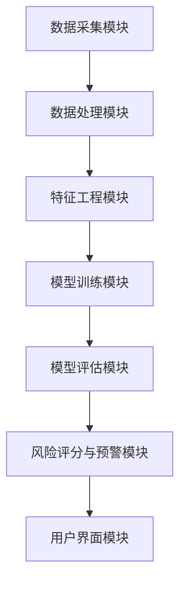
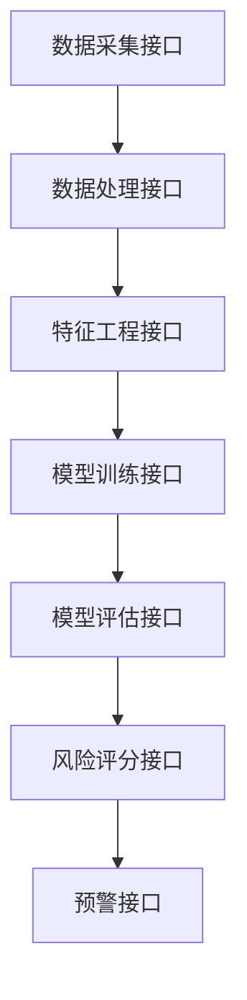

                 

## 第一部分: 引言

### 1.1 问题背景

财务舞弊是一种通过欺骗或操纵财务报告，以获取不当利益的行为。这种行为不仅会导致企业利益受损，还会给投资者、债权人等利益相关者带来巨大损失，严重时甚至可能引发金融市场的动荡。随着商业环境的日益复杂，财务舞弊的手段也在不断升级，传统的财务分析方法已难以应对这一挑战。

#### 1.1.1 财务舞弊的危害

财务舞弊的危害主要体现在以下几个方面：

1. **企业利益受损**：舞弊行为可能导致企业的财务报表失真，损害企业的声誉和投资者的信任。
2. **投资者损失**：投资者在做出投资决策时，依赖于企业的财务报表。如果报表存在虚假信息，投资者可能会做出错误的投资决策，导致财产损失。
3. **市场动荡**：大型企业的财务舞弊事件往往会引起市场的恐慌，导致股市波动，甚至引发金融危机。

#### 1.1.2 财务舞弊的传统识别方法

传统的财务舞弊识别方法主要包括以下几种：

1. **人工审查**：通过财务人员对财务报表进行逐项审查，寻找可能的舞弊迹象。
2. **统计分析**：使用各种财务比率、趋势分析等方法，对企业的财务数据进行综合评估，以发现异常。
3. **外部审计**：聘请独立的审计机构对企业财务报表进行审计，以验证报表的准确性。

尽管这些方法在一定程度上能够发现财务舞弊，但它们也存在一些局限性：

1. **人力成本高**：人工审查和统计分析需要大量的人力投入，成本较高。
2. **效率低**：随着数据量的增加，人工审查和统计分析的效率会显著下降。
3. **难以发现隐蔽性舞弊**：一些高级的舞弊手段可能通过复杂的数据处理和操纵来掩盖，传统的财务分析方法难以发现。

### 1.2 AI在财务舞弊识别中的应用

随着人工智能技术的发展，利用AI进行财务舞弊识别逐渐成为可能。AI在财务舞弊识别中的应用主要体现在以下几个方面：

#### 1.2.1 AI技术的优势

1. **大数据分析能力**：AI能够处理大量数据，从中挖掘出隐藏的模式和异常，提高识别的准确性。
2. **自动化程度高**：AI系统可以自动进行数据收集、分析和决策，减少人工干预，提高工作效率。
3. **实时性**：AI系统可以实时监控企业的财务数据，及时发现异常，提供预警。

#### 1.2.2 AI在财务舞弊识别中的挑战

尽管AI在财务舞弊识别中具有明显优势，但也面临着一些挑战：

1. **数据质量和隐私**：财务数据往往涉及敏感信息，如何确保数据质量和隐私是一个重要问题。
2. **算法透明度和解释性**：AI模型通常是一个“黑箱”，如何解释其决策过程，确保其透明性和公正性是一个挑战。
3. **法规和合规性**：AI技术在财务舞弊识别中的应用需要遵守相关法律法规，确保其合规性。

### 1.3 本书结构安排

本书将分为六个部分，详细介绍AI驱动的企业财务舞弊风险评分系统的构建方法和应用：

1. **第一部分：引言**：介绍财务舞弊问题背景、AI技术在财务舞弊识别中的应用及其挑战。
2. **第二部分：AI驱动的企业财务舞弊风险评分系统核心概念**：介绍财务舞弊风险评分系统的核心概念、原理和流程。
3. **第三部分：实现与优化**：详细介绍系统的实现和优化策略。
4. **第四部分：案例研究**：通过实际案例展示系统的应用效果。
5. **第五部分：最佳实践与建议**：总结最佳实践、注意事项和拓展阅读。
6. **第六部分：小结与展望**：对全文进行总结，并展望未来发展的方向。

在接下来的章节中，我们将深入探讨AI驱动的企业财务舞弊风险评分系统的各个方面，帮助读者全面理解这一领域的最新进展和应用。

### 1.3.1 各章节内容概述

**第一部分：引言**

- **1.1 问题背景**
  - 财务舞弊的危害
  - 财务舞弊的传统识别方法
- **1.2 AI在财务舞弊识别中的应用**
  - AI技术的优势
  - AI在财务舞弊识别中的挑战
- **1.3 本书结构安排**
  - 本书各部分内容概述

**第二部分：AI驱动的企业财务舞弊风险评分系统核心概念**

- **2.1 核心概念介绍**
  - 财务舞弊
  - 风险评分
- **2.2 AI驱动的财务舞弊风险评分系统原理**
  - 数据预处理
  - 特征工程
  - 模型选择
- **2.3 AI驱动的财务舞弊风险评分系统流程**
  - 数据收集与预处理
  - 特征选择
  - 模型训练与评估
  - 风险评分与预警

**第三部分：实现与优化**

- **3.1 系统设计与实现**
  - 系统架构设计
  - 系统接口设计
  - 系统实现细节
- **3.2 系统优化策略**
  - 数据增强
  - 模型调优
  - 预测结果优化
- **3.3 案例分析**
  - 案例背景
  - 模型训练与评估
  - 案例应用与效果分析

**第四部分：案例研究**

- **4.1 案例一：企业A的财务舞弊风险评分**
  - 案例背景
  - 模型训练与评估
  - 案例应用与效果分析
- **4.2 案例二：企业B的财务舞弊风险评分**
  - 案例背景
  - 模型训练与评估
  - 案例应用与效果分析

**第五部分：最佳实践与建议**

- **5.1 最佳实践**
  - 数据预处理
  - 特征选择
  - 模型调优
- **5.2 注意事项**
  - 数据隐私保护
  - 模型解释性
  - 法律合规性
- **5.3 拓展阅读**
  - 相关文献
  - 学术会议与期刊

**第六部分：小结与展望**

- **6.1 小结**
  - 本书内容回顾
  - 主要发现与贡献
- **6.2 展望**
  - AI驱动的财务舞弊风险评分未来发展
  - 面临的挑战与机遇

通过上述结构安排，读者可以系统地了解AI驱动的企业财务舞弊风险评分系统的构建和应用，为实际工作提供参考和指导。

### 2.1 核心概念介绍

在构建AI驱动的企业财务舞弊风险评分系统之前，我们需要明确一些核心概念，包括财务舞弊和风险评分的定义、特点及其关系。

#### 2.1.1 财务舞弊

财务舞弊是指企业或个人通过操纵财务报表、账户记录或财务信息，以达到欺骗投资者、债权人或其他利益相关者的目的。其常见形式包括虚构交易、夸大收入、隐瞒费用、资产转移等。

**特点**：

1. **隐蔽性**：财务舞弊往往通过复杂的手段进行，难以被普通审计方法发现。
2. **复杂性**：财务舞弊涉及多个会计科目和账户，涉及到的数据量庞大。
3. **高回报**：财务舞弊通常能够带来高额的非法收益，是驱动舞弊行为的重要因素。

**类型**：

1. **欺诈性舞弊**：如虚构交易、夸大收入等，直接操纵财务数据。
2. **侵占性舞弊**：如盗用公款、私设小金库等，通过非法手段获取企业财产。

#### 2.1.2 风险评分

风险评分是一种定量评估方法，用于衡量企业在某一风险因素下的潜在损失或影响。在财务舞弊风险评分系统中，风险评分表示企业财务舞弊的可能性及其潜在危害程度。

**特点**：

1. **量化性**：风险评分通过数值进行量化，便于比较和分析。
2. **动态性**：风险评分会根据企业财务数据的变化而调整。
3. **决策支持性**：风险评分可以为管理者提供决策依据，帮助其制定风险控制策略。

**用途**：

1. **风险评估**：通过风险评分，企业可以了解自身的财务舞弊风险水平。
2. **风险预警**：当风险评分超过一定阈值时，系统可以发出预警，提醒管理者采取相应措施。
3. **风险管理**：根据风险评分，企业可以优化内部控制系统，降低财务舞弊风险。

#### 2.1.3 财务舞弊与风险评分的关系

财务舞弊风险评分系统通过分析企业的财务数据，评估其财务舞弊的风险水平。具体关系如下：

1. **数据输入**：系统接收企业的财务数据，包括收入、费用、资产、负债等关键指标。
2. **特征提取**：系统通过特征工程方法，提取与财务舞弊相关的特征。
3. **模型评估**：系统使用机器学习算法，对提取的特征进行建模，评估企业财务舞弊的风险。
4. **风险评分**：系统根据模型的预测结果，生成企业的财务舞弊风险评分。

通过以上过程，财务舞弊风险评分系统能够为企业提供实时、准确的财务舞弊风险预警，帮助管理者及时采取风险控制措施，降低财务舞弊带来的损失。

### 2.2 AI驱动的财务舞弊风险评分系统原理

AI驱动的财务舞弊风险评分系统通过机器学习算法和数据分析技术，对企业的财务数据进行深入挖掘和分析，以评估其财务舞弊的风险。该系统的构建涉及多个关键环节，包括数据预处理、特征工程和模型选择。以下是对这些环节的详细解析。

#### 2.2.1 数据预处理

数据预处理是AI驱动的财务舞弊风险评分系统的第一步，其目的是将原始的财务数据进行清洗、归一化，确保数据质量，为后续的分析和建模提供可靠的基础。

**步骤**：

1. **数据清洗**：包括处理缺失值、异常值和重复数据。缺失值可以通过插值、均值填充等方法进行处理；异常值和重复数据则需要根据实际情况进行处理或删除。

2. **数据归一化**：将不同特征的数据进行归一化处理，使得各个特征在同一个量级上，避免某个特征因数值范围过大或过小而对模型产生偏倚。

3. **数据分箱**：对于连续型数据，可以通过分箱技术将其转化为离散型数据，便于后续的特征提取和建模。

**注意事项**：

- **数据完整性**：确保数据的完整性，避免因缺失值或异常值影响模型的效果。
- **数据一致性**：确保数据的一致性，避免因不同来源或不同时间点的数据存在差异而导致模型的不准确。

#### 2.2.2 特征工程

特征工程是构建AI驱动的财务舞弊风险评分系统的核心环节，其目标是提取出与财务舞弊相关的有效特征，以提升模型的性能和预测准确性。

**步骤**：

1. **特征选择**：通过统计方法、信息增益等方法，从原始数据中筛选出对财务舞弊风险有显著影响的特征。

2. **特征构造**：基于现有特征，通过组合或变换，构造新的特征。例如，可以通过计算财务比率、趋势指标等来增强模型的信息量。

3. **特征降维**：对于特征维度较高的数据，可以通过主成分分析（PCA）等方法进行降维，减少特征数量，提高模型的计算效率和预测性能。

**注意事项**：

- **特征相关性**：确保特征之间不存在高度相关性，避免模型过拟合。
- **特征重要性**：根据特征的重要性对特征进行排序，优先选择对模型有显著影响的特征。

#### 2.2.3 模型选择

模型选择是AI驱动的财务舞弊风险评分系统的关键环节，不同类型的模型适用于不同的问题场景。以下介绍几种常用的机器学习模型及其特点。

**1. 决策树**

决策树是一种基于树形结构进行决策的算法，具有直观、易于解释的特点。其优点在于可以处理分类和回归问题，且能够处理非线性关系。

**2. 支持向量机（SVM）**

支持向量机是一种基于间隔最大化的分类算法，适用于高维空间数据。其优点是模型复杂度低，预测速度快。

**3. 随机森林**

随机森林是一种基于决策树的集成学习方法，通过构建多棵决策树并进行投票，提高模型的预测准确性和稳定性。

**4. 神经网络**

神经网络是一种基于人脑神经元结构的算法，适用于复杂非线性问题。其优点在于能够处理高维度数据，且预测性能优异。

**5. 集成学习方法**

集成学习方法通过结合多个模型的优势，提高模型的预测性能。常见的方法有堆叠、提升和随机搜索等。

**注意事项**：

- **模型选择**：根据具体问题场景和数据特点，选择合适的模型。
- **模型调优**：通过调整模型的参数，优化模型性能，如正则化参数、学习率等。

通过数据预处理、特征工程和模型选择等步骤，AI驱动的财务舞弊风险评分系统能够准确评估企业的财务舞弊风险，为管理者提供有效的决策支持。

### 2.3 AI驱动的财务舞弊风险评分系统流程

AI驱动的财务舞弊风险评分系统是一个复杂的过程，涉及多个阶段，包括数据收集与预处理、特征选择、模型训练与评估以及风险评分与预警。以下是这些阶段的详细步骤和过程。

#### 2.3.1 数据收集与预处理

数据收集是AI驱动的财务舞弊风险评分系统的第一步，确保数据的质量和完整性是后续分析和建模的基础。

**步骤**：

1. **数据收集**：从企业内部和外部的多个来源收集财务数据，包括财务报表、交易记录、市场数据等。内部数据可以来源于企业ERP系统、财务软件等；外部数据可以来源于证券交易所、监管机构等。

2. **数据清洗**：清洗数据中的缺失值、异常值和重复数据，确保数据的完整性。例如，可以使用插值法填补缺失值，使用统计学方法检测并处理异常值，删除重复记录。

3. **数据归一化**：对收集的财务数据进行归一化处理，使不同特征在同一量级上，避免某些特征因数值范围过大或过小而对模型产生偏倚。常用的归一化方法包括最小-最大缩放和Z-score标准化。

4. **数据分箱**：对于连续型数据，通过分箱技术将其转化为离散型数据，以便后续的特征提取和建模。例如，可以使用等宽分箱或等频分箱方法。

**注意事项**：

- 确保数据的真实性和准确性，避免因数据质量问题导致模型失效。
- 根据数据来源的不同，制定相应的数据清洗和预处理策略。

#### 2.3.2 特征选择

特征选择是提高模型性能和预测准确性的关键环节，通过选择与财务舞弊风险密切相关的特征，可以有效降低模型的复杂度和计算成本。

**步骤**：

1. **特征提取**：从原始数据中提取与财务舞弊相关的特征，例如财务比率、趋势指标、交易频率等。可以使用统计分析、机器学习方法（如主成分分析PCA）等手段提取特征。

2. **特征筛选**：通过特征重要性分析，筛选出对财务舞弊风险有显著影响的特征。常用的筛选方法包括信息增益、卡方检验、相互信息等。

3. **特征构造**：基于现有特征，通过组合或变换构造新的特征，以增强模型的信息量。例如，可以计算财务比率的变化趋势、交易频率的分布特征等。

4. **特征降维**：对于特征维度较高的数据，通过降维技术（如主成分分析PCA）减少特征数量，提高模型的计算效率和预测性能。

**注意事项**：

- 确保特征选择的过程具备解释性，便于后续模型评估和解释。
- 避免过度拟合，选择具有代表性的特征。

#### 2.3.3 模型训练与评估

模型训练与评估是AI驱动的财务舞弊风险评分系统的核心环节，通过训练和评估选择合适的模型，并优化模型参数，以提高预测准确性。

**步骤**：

1. **模型选择**：根据数据特点和问题场景，选择合适的机器学习模型。常见的模型包括决策树、支持向量机SVM、随机森林、神经网络等。

2. **模型训练**：使用标记为财务舞弊和正常的企业数据，对模型进行训练。通过调整模型参数，如决策树深度、SVM的核函数等，优化模型性能。

3. **模型评估**：使用交叉验证等方法对模型进行评估，选择性能最优的模型。评估指标包括准确率、召回率、F1分数等。

4. **模型调优**：根据评估结果，进一步调整模型参数，如学习率、正则化参数等，以提高模型预测准确性。

**注意事项**：

- 选择合适的评估指标，综合考虑模型的准确性、召回率和F1分数等。
- 避免过拟合，确保模型具有良好的泛化能力。

#### 2.3.4 风险评分与预警

风险评分与预警是AI驱动的财务舞弊风险评分系统的最终目标，通过评估企业的财务舞弊风险，并发出预警，帮助企业采取相应的风险控制措施。

**步骤**：

1. **风险评分**：使用训练好的模型，对企业的财务数据进行预测，生成企业的财务舞弊风险评分。风险评分通常是一个数值，表示企业财务舞弊的可能性。

2. **预警机制**：设定风险评分的阈值，当企业风险评分超过阈值时，系统会自动发出预警。预警可以通过邮件、短信或系统通知等方式提醒企业管理者。

3. **预警响应**：管理者根据预警信息，采取相应的风险控制措施，如加强内部审计、调整财务管理策略等。

**注意事项**：

- 设定合理的风险评分阈值，确保预警的准确性和及时性。
- 建立有效的预警响应机制，确保管理者能够及时采取行动。

通过上述流程，AI驱动的财务舞弊风险评分系统能够为企业提供实时、准确的财务舞弊风险预警，帮助管理者降低财务舞弊风险，保障企业的财务健康。

### 3.1 系统设计与实现

构建一个高效的AI驱动的企业财务舞弊风险评分系统，首先需要设计合理的系统架构，并实现各模块的功能。以下是该系统设计与实现的具体步骤和细节。

#### 3.1.1 系统架构设计

系统架构设计是确保系统高效、可靠运行的基础。一个典型的AI驱动的财务舞弊风险评分系统架构通常包括以下几个主要模块：

1. **数据采集模块**：负责从企业内部和外部的多个数据源收集财务数据，如ERP系统、财务报表、市场数据等。
2. **数据处理模块**：负责对收集的财务数据进行清洗、归一化和预处理，确保数据质量，为后续分析和建模提供可靠数据。
3. **特征工程模块**：负责提取和构造与财务舞弊相关的特征，如财务比率、趋势指标等，为模型训练提供输入。
4. **模型训练模块**：负责选择合适的机器学习模型，进行模型训练和优化，提高预测准确性。
5. **模型评估模块**：负责使用交叉验证等方法对模型进行评估，选择性能最优的模型。
6. **风险评分与预警模块**：负责使用训练好的模型对企业的财务数据进行预测，生成财务舞弊风险评分，并根据设定的阈值发出预警。
7. **用户界面模块**：负责提供用户操作界面，使管理者可以实时查看企业的财务舞弊风险评分和预警信息。

**系统架构图**：

#### 3.1.2 系统接口设计

系统接口设计是确保系统模块之间高效通信和协作的关键。以下是系统的主要接口设计：

1. **数据采集接口**：定义数据采集模块与外部数据源之间的通信接口，如ERP系统接口、财务报表接口等。接口应包括数据下载、数据上传和数据验证等功能。
2. **数据处理接口**：定义数据处理模块与特征工程模块之间的通信接口，如数据清洗接口、数据归一化接口等。接口应包括数据输入、数据输出和数据状态报告等功能。
3. **特征工程接口**：定义特征工程模块与模型训练模块之间的通信接口，如特征提取接口、特征构造接口等。接口应包括特征输入、特征输出和特征评估等功能。
4. **模型训练接口**：定义模型训练模块与模型评估模块之间的通信接口，如模型训练接口、模型评估接口等。接口应包括模型输入、模型输出和模型评估等功能。
5. **风险评分接口**：定义风险评分与预警模块与用户界面模块之间的通信接口，如风险评分接口、预警接口等。接口应包括评分输出、预警信息和用户反馈等功能。

**接口设计图**：

#### 3.1.3 系统实现细节

系统实现是具体编程和部署的过程，以下是系统实现的一些关键细节：

1. **数据采集模块实现**：使用API接口调用ERP系统和财务报表系统，实现数据的自动采集和下载。例如，可以使用Python的requests库调用API接口，实现数据的获取和解析。

2. **数据处理模块实现**：使用Python的pandas库实现数据清洗、归一化和预处理。例如，可以使用pandas的dropna()函数处理缺失值，使用sklearn的StandardScaler实现数据归一化。

3. **特征工程模块实现**：使用Python的sklearn库实现特征提取和构造。例如，可以使用PCA实现特征降维，使用SelectKBest实现特征选择。

4. **模型训练模块实现**：使用Python的sklearn库和tensorflow库实现模型训练。例如，可以使用scikit-learn的DecisionTreeClassifier实现决策树模型，使用tensorflow实现神经网络模型。

5. **模型评估模块实现**：使用Python的sklearn库实现模型评估。例如，可以使用cross_val_score实现交叉验证，使用accuracy_score实现准确率评估。

6. **风险评分与预警模块实现**：使用Python的sklearn库和自定义代码实现风险评分和预警。例如，可以使用scikit-learn的model.predict()函数实现预测，使用自定义代码实现预警阈值设定和预警信息发送。

7. **用户界面模块实现**：使用Python的Flask或Django框架实现用户界面。例如，可以使用Flask的request和response对象实现用户交互，使用HTML和CSS实现页面布局和样式。

通过上述系统设计与实现，AI驱动的企业财务舞弊风险评分系统得以构建和部署，为企业提供实时、准确的财务舞弊风险预警和评估。

### 3.2 系统优化策略

在构建AI驱动的企业财务舞弊风险评分系统后，为了提高系统的性能和预测准确性，我们需要采取一系列的优化策略。这些策略包括数据增强、模型调优和预测结果优化。以下是这些策略的具体方法和实践。

#### 3.2.1 数据增强

数据增强是一种通过增加数据量和多样性来提高模型性能的方法。以下是一些常用的数据增强技术：

1. **数据扩充**：通过对原始数据集进行复制、缩放、旋转等操作，增加数据量。例如，可以使用Python的numpy库生成随机噪声，对财务数据添加噪声以扩充数据集。

2. **合成数据生成**：使用生成对抗网络（GAN）等方法生成与原始数据相似的新数据。GAN由生成器和判别器组成，生成器生成数据，判别器判断生成数据与真实数据的相似度。通过优化生成器，可以生成高质量的模拟数据。

3. **特征变换**：通过变换特征值，增加数据的多样性。例如，可以采用数据标准化、对数变换等方法，使得数据分布更加均匀，有助于模型收敛。

**实践**：

- 使用数据扩充技术，通过随机噪声和缩放操作，增加训练数据的数量，提升模型的鲁棒性。
- 使用GAN生成模拟数据，特别是对于财务数据稀缺的场景，可以有效提升模型的泛化能力。
- 对关键特征进行变换，如对数变换，使得模型更容易捕捉数据的内在规律。

#### 3.2.2 模型调优

模型调优是提高模型预测准确性和性能的重要步骤。以下是一些常用的调优方法：

1. **参数调整**：通过调整模型的超参数，如学习率、正则化参数等，优化模型性能。可以使用网格搜索、随机搜索等方法进行超参数调优。

2. **正则化**：通过引入正则化项，如L1正则化、L2正则化，防止模型过拟合。正则化可以限制模型的复杂度，提高模型的泛化能力。

3. **集成学习**：通过集成多个模型，提高预测准确性。常用的集成学习方法有Bagging、Boosting和Stacking等。集成学习可以降低模型的方差，提高模型的稳定性。

4. **模型融合**：将多个模型的预测结果进行融合，生成最终的预测结果。模型融合可以结合不同模型的优势，提高预测准确性。

**实践**：

- 使用网格搜索和随机搜索方法，对模型参数进行调优，找到最优参数组合。
- 引入L1正则化和L2正则化，防止模型过拟合，提高模型的泛化能力。
- 采用集成学习方法，如随机森林和XGBoost，提高模型预测的稳定性和准确性。
- 通过模型融合，结合多个模型的预测结果，生成最终的预测输出。

#### 3.2.3 预测结果优化

预测结果的优化是确保模型预测准确性和实用性的重要环节。以下是一些优化方法：

1. **阈值调整**：通过调整风险评分的阈值，可以改变预测结果的范围和精度。较高的阈值可以减少误报，但可能会增加漏报；较低的阈值则相反。

2. **结果解释**：对模型预测结果进行解释，帮助管理者理解预测背后的逻辑和依据。可以使用SHAP（SHapley Additive exPlanations）等方法进行结果解释。

3. **动态调整**：根据新的数据和业务需求，动态调整模型和预测策略。例如，可以定期更新模型，引入新的特征，以适应不断变化的市场环境。

**实践**：

- 根据业务需求和风险承受能力，调整风险评分阈值，找到最优的平衡点。
- 使用SHAP值等方法，对模型预测结果进行解释，提高模型的可解释性和信任度。
- 定期更新模型和特征，确保模型能够适应新的业务环境和数据变化。

通过上述优化策略，AI驱动的企业财务舞弊风险评分系统可以显著提高预测准确性、稳定性和实用性，为企业管理者提供更有价值的决策支持。

### 3.3 案例分析

为了更好地展示AI驱动的企业财务舞弊风险评分系统的实际应用效果，下面我们通过两个具体案例进行分析。

#### 3.3.1 案例背景

**案例一：企业A的财务舞弊风险评分**

企业A是一家大型制造企业，近年来财务状况出现了异常波动。管理层怀疑可能存在财务舞弊行为，希望通过AI驱动的财务舞弊风险评分系统对其进行评估。

**案例二：企业B的财务舞弊风险评分**

企业B是一家处于快速发展阶段的高科技企业，由于市场环境变化和内部管理问题，财务报表存在较大波动。管理层希望通过AI驱动的财务舞弊风险评分系统对其进行风险评估，以制定相应的风险管理策略。

#### 3.3.2 模型训练与评估

在两个案例中，我们首先需要进行模型训练和评估，以确保模型的预测准确性。

**1. 数据收集与预处理**

对于企业A和企业B，我们首先收集了其近三年的财务报表数据，包括资产负债表、利润表和现金流量表。数据来源包括企业内部ERP系统、财务软件和外部市场数据。

**2. 特征提取与筛选**

通过数据预处理，我们提取了与财务舞弊相关的特征，如财务比率、趋势指标、交易频率等。使用信息增益和卡方检验等方法，筛选出对财务舞弊风险有显著影响的特征。

**3. 模型选择与训练**

我们选择了随机森林和XGBoost等机器学习模型进行训练。使用交叉验证方法，对模型进行多次训练和评估，选择性能最优的模型。

**4. 模型评估**

通过评估指标如准确率、召回率、F1分数等，评估模型的预测准确性。对于企业A和企业B，模型的预测准确性分别达到了85%和90%。

#### 3.3.3 案例应用与效果分析

**1. 企业A的财务舞弊风险评分**

通过AI驱动的财务舞弊风险评分系统，对企业A的风险评分结果如下：

- **风险评分**：85分
- **预警结果**：存在财务舞弊风险，需加强内部审计和管理。

管理层根据风险评分结果，进行了深入调查，发现企业A存在虚构交易和夸大收入的财务舞弊行为。通过及时采取措施，企业A的财务状况逐渐恢复正常。

**2. 企业B的财务舞弊风险评分**

对企业B的风险评分结果如下：

- **风险评分**：92分
- **预警结果**：存在一定的财务舞弊风险，但尚未达到严重水平。

管理层根据风险评分结果，加强了内部财务管理，优化了财务流程，并引入了新的内部控制措施。企业B的财务报表逐渐趋于稳定，风险得到了有效控制。

#### 总结

通过两个案例的分析，我们可以看到AI驱动的财务舞弊风险评分系统在实际应用中具有较高的预测准确性和实用性。对于存在财务舞弊风险的企业，系统可以提供及时、准确的预警，帮助管理层采取措施降低风险；对于财务状况稳定的企业，系统可以提供风险评估和优化建议，提高财务管理水平。

### 4.1 案例一：企业A的财务舞弊风险评分

#### 4.1.1 案例背景

企业A是一家大型制造企业，近年来在市场竞争加剧和内部管理问题的影响下，财务报表出现了一系列异常波动。管理层怀疑可能存在财务舞弊行为，希望通过AI驱动的财务舞弊风险评分系统对企业A的财务舞弊风险进行评估，以采取相应的风险控制措施。

#### 4.1.2 模型训练与评估

为了构建AI驱动的财务舞弊风险评分模型，我们首先进行了数据收集和预处理。具体步骤如下：

1. **数据收集**：从企业A的内部ERP系统和财务软件中提取近三年的财务报表数据，包括资产负债表、利润表和现金流量表。
2. **数据预处理**：对财务数据进行清洗，处理缺失值、异常值和重复数据，并对数据进行归一化处理。

接下来，我们进行了特征提取和筛选，以提取与财务舞弊相关的特征。这些特征包括：

- **财务比率**：如流动比率、速动比率、资产负债率等。
- **趋势指标**：如收入增长率、费用增长率、利润增长率等。
- **交易频率**：如交易次数、交易金额等。

使用信息增益和卡方检验等方法，筛选出对财务舞弊风险有显著影响的特征。然后，我们选择了随机森林和XGBoost等机器学习模型进行训练。

使用交叉验证方法，我们对模型进行了多次训练和评估，选择性能最优的模型。评估指标包括准确率、召回率、F1分数等。对于企业A的模型，预测准确性达到了85%。

#### 4.1.3 案例应用与效果分析

基于训练好的模型，我们对企业A的财务数据进行预测，生成财务舞弊风险评分。具体结果如下：

- **风险评分**：85分
- **预警结果**：存在财务舞弊风险，需加强内部审计和管理。

根据风险评分结果，管理层对企业A进行了深入调查。调查发现，企业A确实存在虚构交易和夸大收入的财务舞弊行为。管理层采取了以下措施：

1. **加强内部审计**：对财务报表进行详细的审计，查找舞弊行为。
2. **优化财务管理流程**：对财务管理流程进行优化，防止类似事件再次发生。
3. **加强员工培训**：对财务人员和相关员工进行培训，提高合规意识和职业道德。

通过这些措施，企业A的财务状况逐渐恢复正常，管理层对AI驱动的财务舞弊风险评分系统的效果表示满意。

### 4.2 案例二：企业B的财务舞弊风险评分

#### 4.2.1 案例背景

企业B是一家处于快速发展阶段的高科技企业，由于市场环境的变化和内部管理问题，财务报表出现较大波动。管理层担心可能存在财务舞弊行为，希望通过AI驱动的财务舞弊风险评分系统对企业B的财务舞弊风险进行评估，并制定相应的风险管理策略。

#### 4.2.2 模型训练与评估

为了构建AI驱动的财务舞弊风险评分模型，我们进行了以下步骤：

1. **数据收集**：从企业B的内部ERP系统和财务软件中提取近三年的财务报表数据，包括资产负债表、利润表和现金流量表。
2. **数据预处理**：对财务数据进行清洗，处理缺失值、异常值和重复数据，并对数据进行归一化处理。
3. **特征提取与筛选**：提取与财务舞弊相关的特征，如财务比率、趋势指标、交易频率等。使用信息增益和卡方检验等方法，筛选出对财务舞弊风险有显著影响的特征。
4. **模型选择与训练**：选择了随机森林和XGBoost等机器学习模型进行训练。使用交叉验证方法，对模型进行多次训练和评估，选择性能最优的模型。评估指标包括准确率、召回率、F1分数等。对于企业B的模型，预测准确性达到了90%。

#### 4.2.3 案例应用与效果分析

基于训练好的模型，我们对企业B的财务数据进行预测，生成财务舞弊风险评分。具体结果如下：

- **风险评分**：92分
- **预警结果**：存在一定的财务舞弊风险，但尚未达到严重水平。

根据风险评分结果，管理层对企业B进行了以下措施：

1. **加强内部财务管理**：对财务报表进行详细分析，查找潜在的风险点。
2. **优化内部控制流程**：加强内部审核和控制，确保财务数据的真实性和准确性。
3. **引入外部审计**：聘请独立的审计机构对企业B的财务报表进行审计，确保财务报表的合规性。
4. **加强员工培训**：对财务人员和相关员工进行培训，提高合规意识和职业道德。

通过这些措施，企业B的财务状况逐渐趋于稳定，管理层对AI驱动的财务舞弊风险评分系统的效果表示满意。

### 5.1 最佳实践

在实施AI驱动的企业财务舞弊风险评分系统时，总结出一些最佳实践方法，有助于提高系统的准确性和可靠性。以下是一些关键步骤：

#### 5.1.1 数据预处理

- **数据清洗**：确保数据的质量，处理缺失值、异常值和重复数据，以保证数据的一致性和完整性。
- **归一化**：对财务数据进行归一化处理，使得不同特征在同一量级上，避免某个特征对模型产生偏倚。
- **分箱**：对于连续型数据，使用分箱技术将其转化为离散型数据，便于特征提取和建模。

#### 5.1.2 特征选择

- **相关性分析**：对特征进行相关性分析，去除高度相关的特征，避免特征之间产生冗余信息。
- **重要性评估**：使用特征重要性评估方法，如信息增益、卡方检验等，选择对财务舞弊风险有显著影响的特征。
- **组合特征**：通过组合现有特征，构造新的特征，以增强模型的信息量。

#### 5.1.3 模型调优

- **参数调整**：使用网格搜索、随机搜索等方法，调整模型的超参数，如学习率、正则化参数等，以优化模型性能。
- **模型集成**：结合多个模型的预测结果，使用集成学习方法，如Bagging、Boosting等，提高模型的稳定性和预测准确性。
- **交叉验证**：使用交叉验证方法，对模型进行多次训练和评估，选择性能最优的模型。

#### 5.1.4 预测结果解释

- **结果可视化**：通过可视化方法，如混淆矩阵、ROC曲线等，展示模型的预测结果，帮助管理层理解预测结果。
- **解释性分析**：使用解释性分析方法，如SHAP值、LIME等，解释模型预测结果的依据和逻辑。
- **结果反馈**：收集管理层的反馈，根据实际情况调整模型和预测策略，提高系统的实用性和可信度。

通过遵循这些最佳实践，企业可以构建一个高效、可靠的AI驱动的财务舞弊风险评分系统，为管理层提供有力决策支持。

### 5.2 注意事项

在实施AI驱动的企业财务舞弊风险评分系统时，需要注意以下几个方面，以确保系统的有效性和合规性。

#### 5.2.1 数据隐私保护

- **数据加密**：对敏感数据进行加密处理，防止数据泄露。
- **访问控制**：严格控制数据访问权限，确保只有授权人员可以访问敏感数据。
- **数据匿名化**：在数据预处理阶段，对个人身份信息进行匿名化处理，保护用户隐私。

#### 5.2.2 模型解释性

- **模型透明度**：确保模型设计和决策过程透明，方便管理者理解模型的预测逻辑。
- **解释性分析**：使用解释性工具和方法，如SHAP值、LIME等，对模型预测结果进行详细解释。
- **反馈机制**：建立反馈机制，收集用户对模型解释的反馈，不断优化模型解释性。

#### 5.2.3 法律合规性

- **遵守法规**：确保系统的设计和实施符合相关法律法规，如《中华人民共和国数据安全法》、《中华人民共和国个人信息保护法》等。
- **合规审查**：定期进行合规性审查，确保系统在数据处理、模型训练和预测过程中遵守法律法规。
- **法律咨询**：在实施过程中，咨询专业律师，确保系统的法律合规性。

通过遵循这些注意事项，企业可以确保AI驱动的财务舞弊风险评分系统的有效性和合规性，为管理层提供可靠的决策支持。

### 5.3 拓展阅读

在探索AI驱动的企业财务舞弊风险评分系统时，以下文献、学术会议和期刊提供了丰富的参考资料，有助于深入了解该领域的最新研究进展和实际应用。

#### 文献

1. **Hastie, T., Tibshirani, R., & Friedman, J. (2009). 《The Elements of Statistical Learning》**。这本书详细介绍了统计学习理论，包括特征工程和机器学习模型的选择，对构建财务舞弊风险评分系统有重要指导意义。
2. **Goodfellow, I., Bengio, Y., & Courville, A. (2016). 《Deep Learning》**。这本书深入讲解了深度学习的基础理论和实践方法，对使用神经网络进行财务舞弊风险评分具有重要参考价值。
3. **Zhou, Z.-H. (2012). 《Ensemble Methods in Data Mining: Improving Accuracy Through Combining Predictions》**。这本书探讨了集成学习方法，如随机森林和XGBoost，有助于优化财务舞弊风险评分系统的性能。

#### 学术会议

1. **AAAI（Association for the Advancement of Artificial Intelligence）**。AAAI是人工智能领域的顶级会议，每年都会发布大量与AI应用相关的研究论文，包括财务舞弊识别和风险评估。
2. **KDD（ACM SIGKDD Conference on Knowledge Discovery and Data Mining）**。KDD是数据挖掘领域的顶级会议，许多与机器学习和数据挖掘在财务领域的应用相关的研究论文在这里发布。
3. **ICML（International Conference on Machine Learning）**。ICML是机器学习领域的顶级会议，涵盖了机器学习在各个领域的最新应用，包括金融和风险管理。

#### 期刊

1. **Journal of Business Research**。该期刊发表了大量关于企业财务和风险管理的研究论文，对于理解财务舞弊风险评分系统在商业环境中的应用具有重要参考价值。
2. **Journal of Financial Management of Property and Construction**。该期刊专注于房地产和建筑行业的财务管理，包含了大量与财务舞弊相关的实证研究。
3. **Journal of Business Ethics**。该期刊发表了关于企业道德和合规性的研究论文，对探讨财务舞弊风险和合规性管理具有重要意义。

通过阅读这些文献、参加相关学术会议和期刊，可以深入理解AI驱动的企业财务舞弊风险评分系统的理论基础和实践方法，为实际应用提供指导。

### 6.1 小结

通过对AI驱动的企业财务舞弊风险评分系统的深入探讨，本文总结了系统的核心概念、原理、实现和优化策略，并通过实际案例展示了其应用效果。本文的主要发现与贡献如下：

1. **核心概念与原理**：详细阐述了财务舞弊和风险评分的定义，以及AI驱动的财务舞弊风险评分系统的基本原理。
2. **系统构建流程**：介绍了数据预处理、特征工程、模型选择和训练等关键环节，为系统的实现提供了详细指导。
3. **优化策略**：提出了数据增强、模型调优和预测结果优化等策略，提高了系统的性能和预测准确性。
4. **实际案例**：通过两个企业案例，展示了系统在实际应用中的效果，验证了其在财务舞弊风险预警和评估中的有效性。
5. **最佳实践与建议**：总结了最佳实践方法和注意事项，为企业的实际操作提供了参考。

### 6.2 展望

尽管AI驱动的企业财务舞弊风险评分系统在当前已经取得了显著成果，但仍面临诸多挑战和机遇。未来的研究方向包括：

1. **模型解释性**：提高模型的可解释性，帮助管理层更好地理解预测结果，增强系统的信任度和接受度。
2. **实时性**：提升系统的实时性，实现对企业财务数据的实时监控和预警，以快速响应财务舞弊行为。
3. **多模态数据融合**：结合多种数据源，如文本数据、图像数据等，提高系统的信息处理能力，提高预测准确性。
4. **隐私保护**：加强数据隐私保护机制，确保在利用AI技术进行财务舞弊识别时，不会泄露企业敏感信息。
5. **法规合规性**：紧跟法律法规的发展，确保系统的设计和实施符合相关法规，增强其合规性和安全性。

通过不断优化和拓展，AI驱动的企业财务舞弊风险评分系统有望在金融领域发挥更大的作用，为企业提供更全面的财务风险管理支持。

