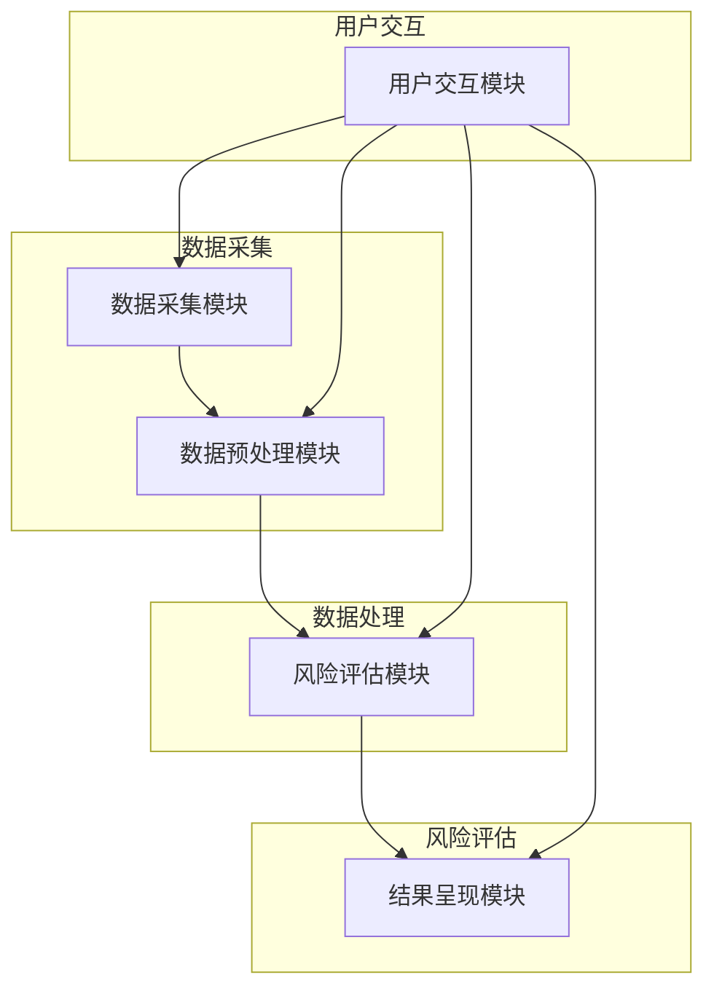

                 

## AI驱动的企业财务风险量化评估系统

> 关键词：AI, 企业财务风险, 量化评估, 风险管理, 数据分析

> 摘要：随着商业环境的复杂化和不确定性增加，企业财务风险管理变得越来越重要。本文介绍了一种基于人工智能（AI）驱动的企业财务风险量化评估系统，通过数据预处理、特征提取和风险评估模型的构建，实现了对企业财务风险的全面量化评估。本文旨在探讨该系统的设计理念、实现方法和实际应用效果，为相关领域的研究者和从业者提供参考。

### 第一部分: AI驱动的企业财务风险量化评估系统概述

#### 1.1 问题背景与核心概念

企业财务风险是指企业在经营活动中可能面临的各种不确定性因素所导致的经济损失的可能性。这些风险可能源自市场波动、企业管理不善、外部经济环境变化等多方面。随着全球经济的一体化和信息技术的快速发展，企业所面临的财务风险种类和复杂度不断增加，如何有效地识别、评估和应对这些风险成为企业管理的重要课题。

在传统的风险管理中，企业主要依赖于经验判断和人工分析。然而，这种方式往往难以全面、准确地识别和评估风险，且耗时费力。随着人工智能技术的发展，利用AI技术进行企业财务风险量化评估成为一种新的趋势。AI驱动的财务风险量化评估系统能够通过大数据分析和机器学习算法，自动识别潜在风险，提供定量评估结果，帮助企业更加精准地制定风险管理策略。

#### 1.2 核心概念

**财务风险量化评估系统**：一种利用AI技术构建的系统，用于对企业财务风险进行量化评估。该系统通过收集、处理和分析企业财务数据，运用机器学习算法，生成风险评分和预测报告。

**AI驱动的风险量化评估方法**：基于人工智能技术的量化评估方法，主要包括数据预处理、特征提取、风险评估模型构建和模型训练优化等步骤。通过这些步骤，系统能够将抽象的财务数据转化为具体的量化指标，为企业提供决策支持。

#### 1.3 概念属性特征对比表

| 概念         | 定义                                                         | 属性特征                                       |
| ------------ | ------------------------------------------------------------ | ---------------------------------------------- |
| 财务风险     | 企业在财务活动中可能面临的各种不确定性因素所导致损失的可能性。 | 损失幅度、发生概率、损失形态、时间分布         |
| 风险量化评估 | 对企业财务风险进行数量化的分析和评价，以确定其程度和可能影响。 | 数据准确性、评估方法、评估结果的可信度、时效性 |

#### 1.4 ER实体关系图

```mermaid
erDiagram
  Customer ||--|{ Product }|| Supplier
  Product  ||--|{ Order }|| Customer
  Order    ||--|{ Payment }|| Customer
```

**Customer**（客户）与**Product**（产品）之间存在一对多的关系，客户可以订购多个产品；**Product**与**Order**（订单）也存在一对多的关系，一个产品可以生成多个订单；**Order**与**Payment**（支付）之间是一对一的关系，每个订单对应一次支付。

### 目录大纲

----------------------------------------------------------------

## 第一部分: AI驱动的企业财务风险量化评估系统概述

### 1.1 问题背景与核心概念

#### 1.1.1 问题背景

#### 1.1.2 核心概念

#### 1.1.3 概念属性特征对比表

#### 1.1.4 ER实体关系图

----------------------------------------------------------------

## 第二部分: AI驱动的财务风险量化评估方法

### 2.1 数据预处理与特征提取

#### 2.1.1 数据预处理

#### 2.1.2 特征提取

### 2.2 风险评估模型构建

#### 2.2.1 传统风险评估模型

#### 2.2.2 基于深度学习的风险评估模型

### 2.3 模型训练与优化

#### 2.3.1 数据集划分与训练策略

#### 2.3.2 模型评估与优化

----------------------------------------------------------------

## 第三部分: 系统实现与实战应用

### 3.1 系统架构设计与开发环境配置

#### 3.1.1 系统架构设计

#### 3.1.2 开发环境配置

### 3.2 系统核心实现

#### 3.2.1 数据采集与预处理

#### 3.2.2 风险评估模型实现

### 3.3 实际案例分析与详解

#### 3.3.1 案例一：某制造企业财务风险评估

#### 3.3.2 案例二：某金融企业信用风险评估

### 3.4 最佳实践与总结

#### 3.4.1 最佳实践

#### 3.4.2 小结

----------------------------------------------------------------

接下来，我们将逐步深入探讨每个部分的内容，详细介绍AI驱动的企业财务风险量化评估系统的构建和应用。

----------------------------------------------------------------

## 第二部分: AI驱动的财务风险量化评估方法

在AI驱动的企业财务风险量化评估系统中，核心在于如何高效地处理大量数据，提取关键特征，并构建准确的风险评估模型。本部分将详细讨论数据预处理、特征提取以及风险评估模型的构建过程。

### 2.1 数据预处理与特征提取

数据预处理是数据分析的基石，它包括数据清洗、数据归一化、缺失数据处理等步骤，旨在提高数据质量，为后续的特征提取和模型训练打下良好基础。

#### 2.1.1 数据预处理

1. **数据清洗与去噪**：

   数据清洗的主要任务是去除数据中的噪声和异常值。在财务数据中，噪声可能来自于数据录入错误、数据采集设备的误差等。异常值则是明显偏离数据整体分布的数据点，如异常交易记录。

   ```python
   # 示例：去除数据中的异常值
   import numpy as np
   
   def remove_outliers(data, threshold):
       mean = np.mean(data)
       std = np.std(data)
       return data[(data > mean - threshold * std) & (data < mean + threshold * std)]
   
   cleaned_data = remove_outliers(raw_data, threshold=3)
   ```

2. **数据归一化与标准化**：

   数据归一化和标准化是为了使不同特征在同一尺度上具有可比性。常见的归一化方法有最小-最大归一化、Z分数归一化等。

   ```python
   # 示例：最小-最大归一化
   def min_max_normalize(data):
       min_val = np.min(data)
       max_val = np.max(data)
       return (data - min_val) / (max_val - min_val)
   
   normalized_data = min_max_normalize(cleaned_data)
   ```

3. **数据缺失处理**：

   数据缺失是常见的问题，处理方法包括删除缺失数据、填充缺失数据和插值法等。对于重要特征，通常选择填充缺失数据。

   ```python
   # 示例：使用均值填充缺失数据
   from sklearn.impute import SimpleImputer
   
   imputer = SimpleImputer(strategy='mean')
   filled_data = imputer.fit_transform(normalized_data)
   ```

#### 2.1.2 特征提取

特征提取是将原始数据转化为能够有效描述数据特征的新数据的过程。对于财务数据，特征提取尤为重要，因为它直接影响风险评估的准确性。

1. **传统特征提取方法**：

   传统特征提取方法包括统计特征、财务比率等。例如，可以通过计算企业的负债比率、流动比率等财务指标来提取特征。

   ```python
   # 示例：计算财务比率特征
   def calculate_financial_ratios(data):
       debt_ratio = data['total_debt'] / data['total_assets']
       liquidity_ratio = data['current_assets'] / data['current_liabilities']
       return np.array([debt_ratio, liquidity_ratio])
   
   financial_ratios = calculate_financial_ratios(filled_data)
   ```

2. **基于深度学习的特征提取方法**：

   基于深度学习的特征提取方法利用神经网络自动学习数据中的特征，能够提取出更加复杂的特征。例如，可以使用卷积神经网络（CNN）来提取图像数据中的特征，也可以使用循环神经网络（RNN）来处理时间序列数据。

   ```python
   # 示例：使用卷积神经网络提取图像特征
   from tensorflow.keras.models import Sequential
   from tensorflow.keras.layers import Conv2D, Flatten
   
   model = Sequential([
       Conv2D(32, kernel_size=(3, 3), activation='relu', input_shape=(64, 64, 3)),
       Flatten(),
       Dense(64, activation='relu'),
       Dense(10, activation='softmax')
   ])
   
   model.compile(optimizer='adam', loss='categorical_crossentropy', metrics=['accuracy'])
   model.fit(x_train, y_train, epochs=10, batch_size=32)
   ```

### 2.2 风险评估模型构建

风险评估模型的构建是整个系统的核心环节，它决定了系统能否准确评估企业财务风险。在本节中，我们将介绍传统风险评估模型和基于深度学习的风险评估模型。

#### 2.2.1 传统风险评估模型

传统风险评估模型主要包括统计模型和神经网络模型。统计模型如逻辑回归、决策树和随机森林等，适用于处理相对简单的数据集。神经网络模型如多层感知器（MLP）等，能够处理更为复杂的数据模式。

1. **逻辑回归模型**：

   逻辑回归是一种常用的分类模型，适用于二分类问题。通过逻辑函数将线性回归模型的输出映射到概率空间，从而进行分类。

   ```python
   # 示例：使用逻辑回归进行风险评估
   from sklearn.linear_model import LogisticRegression
   
   model = LogisticRegression()
   model.fit(x_train, y_train)
   predictions = model.predict(x_test)
   ```

2. **决策树模型**：

   决策树模型通过一系列的决策规则将数据分割成多个子集，每个子集对应一个分类结果。

   ```python
   # 示例：使用决策树进行风险评估
   from sklearn.tree import DecisionTreeClassifier
   
   model = DecisionTreeClassifier()
   model.fit(x_train, y_train)
   predictions = model.predict(x_test)
   ```

3. **随机森林模型**：

   随机森林是由多个决策树组成的集成模型，能够在降低过拟合的同时提高模型的预测能力。

   ```python
   # 示例：使用随机森林进行风险评估
   from sklearn.ensemble import RandomForestClassifier
   
   model = RandomForestClassifier(n_estimators=100)
   model.fit(x_train, y_train)
   predictions = model.predict(x_test)
   ```

#### 2.2.2 基于深度学习的风险评估模型

基于深度学习的风险评估模型利用神经网络强大的表达能力，能够捕捉到数据中的复杂模式。常见的深度学习模型包括卷积神经网络（CNN）、递归神经网络（RNN）和图神经网络（GNN）。

1. **卷积神经网络（CNN）**：

   CNN擅长处理图像数据，可以通过多层卷积和池化操作提取图像中的特征。

   ```python
   # 示例：使用卷积神经网络进行图像特征提取
   from tensorflow.keras.models import Sequential
   from tensorflow.keras.layers import Conv2D, MaxPooling2D, Flatten, Dense
   
   model = Sequential([
       Conv2D(32, kernel_size=(3, 3), activation='relu', input_shape=(64, 64, 3)),
       MaxPooling2D(pool_size=(2, 2)),
       Flatten(),
       Dense(64, activation='relu'),
       Dense(1, activation='sigmoid')
   ])
   
   model.compile(optimizer='adam', loss='binary_crossentropy', metrics=['accuracy'])
   model.fit(x_train, y_train, epochs=10, batch_size=32)
   ```

2. **递归神经网络（RNN）**：

   RNN适用于处理时间序列数据，能够捕捉数据中的时间依赖关系。

   ```python
   # 示例：使用循环神经网络进行时间序列预测
   from tensorflow.keras.models import Sequential
   from tensorflow.keras.layers import LSTM, Dense
   
   model = Sequential([
       LSTM(50, activation='relu', input_shape=(timesteps, features)),
       Dense(1)
   ])
   
   model.compile(optimizer='adam', loss='mse')
   model.fit(x_train, y_train, epochs=100, batch_size=32)
   ```

3. **图神经网络（GNN）**：

   GNN适用于处理图结构数据，能够提取出数据中的网络特征。

   ```python
   # 示例：使用图神经网络进行风险评估
   from tensorflow.keras.models import Model
   from tensorflow.keras.layers import Input, Dense, Dot
   
   inputs = Input(shape=(num_features,))
   node_representation = Dense(64, activation='relu')(inputs)
   relationships = Input(shape=(1,))
   combined_representation = Dot(axes=1)([node_representation, relationships])
   output = Dense(1, activation='sigmoid')(combined_representation)
   
   model = Model(inputs=[inputs, relationships], outputs=output)
   model.compile(optimizer='adam', loss='binary_crossentropy', metrics=['accuracy'])
   model.fit([x_train, relationships_train], y_train, epochs=10, batch_size=32)
   ```

### 2.3 模型训练与优化

模型训练与优化是确保风险评估模型准确性的关键步骤。在这一过程中，我们需要关注数据集划分、训练策略优化以及模型评估与优化。

#### 2.3.1 数据集划分与训练策略

数据集划分是将数据分为训练集、验证集和测试集。训练集用于训练模型，验证集用于调整模型参数，测试集用于评估模型性能。

```python
from sklearn.model_selection import train_test_split

x = ...  # 特征数据
y = ...  # 标签数据

x_train, x_test, y_train, y_test = train_test_split(x, y, test_size=0.2, random_state=42)
```

训练策略优化包括选择合适的优化算法、调整学习率、批量大小等超参数。常用的优化算法有随机梯度下降（SGD）、Adam优化器等。

```python
from tensorflow.keras.optimizers import Adam

model.compile(optimizer=Adam(learning_rate=0.001), loss='binary_crossentropy', metrics=['accuracy'])
```

#### 2.3.2 模型评估与优化

模型评估是使用验证集和测试集来评估模型性能。常用的评估指标包括准确率、召回率、F1分数等。

```python
from sklearn.metrics import accuracy_score, recall_score, f1_score

predictions = model.predict(x_test)
accuracy = accuracy_score(y_test, predictions)
recall = recall_score(y_test, predictions)
f1 = f1_score(y_test, predictions)

print(f"Accuracy: {accuracy}, Recall: {recall}, F1 Score: {f1}")
```

模型优化包括调整模型结构、增加训练时间、使用更复杂的模型等。通过交叉验证和网格搜索等方法，可以找到最优的模型参数。

```python
from sklearn.model_selection import GridSearchCV

param_grid = {
    'n_estimators': [100, 200, 300],
    'max_depth': [10, 20, 30]
}

grid_search = GridSearchCV(estimator=RandomForestClassifier(), param_grid=param_grid, cv=5)
grid_search.fit(x_train, y_train)

best_params = grid_search.best_params_
best_model = grid_search.best_estimator_
```

通过以上步骤，我们可以构建一个高效、准确的AI驱动的企业财务风险量化评估系统，为企业提供有力的风险管理支持。

## 第三部分: 系统实现与实战应用

### 3.1 系统架构设计与开发环境配置

系统架构设计是构建AI驱动的企业财务风险量化评估系统的关键步骤，它决定了系统的可扩展性、可维护性和性能。在这一部分，我们将详细介绍系统架构设计以及开发环境配置。

#### 3.1.1 系统架构设计

系统架构设计包括功能模块划分、技术栈选择和系统部署策略。一个典型的AI驱动的企业财务风险量化评估系统可以分为以下几个核心模块：

1. **数据采集模块**：
   负责从企业财务系统、外部数据源和其他数据接口收集财务数据。

2. **数据预处理模块**：
   对收集到的数据进行清洗、归一化和特征提取，以提高数据质量和模型训练效果。

3. **风险评估模块**：
   使用机器学习算法构建风险评估模型，对企业的财务风险进行量化评估。

4. **结果呈现模块**：
   将评估结果以可视化报表、报告的形式展示给用户，辅助决策。

5. **用户交互模块**：
   提供用户界面，允许用户配置系统参数、查看评估报告和进行交互。

以下是一个简化的系统架构图：



#### 3.1.2 开发环境配置

开发环境配置包括硬件配置和软件安装与配置。以下是一个推荐的开发环境配置：

1. **硬件配置**：
   - CPU：至少4核处理器
   - 内存：至少8GB RAM
   - 硬盘：至少100GB SSD存储
   - GPU：NVIDIA GPU（用于加速深度学习训练）

2. **软件安装与配置**：
   - 操作系统：Ubuntu 18.04或更高版本
   - Python：3.8或更高版本
   - 数据库：MySQL或PostgreSQL
   - 深度学习框架：TensorFlow或PyTorch
   - 机器学习库：Scikit-learn、Pandas、NumPy

安装示例：

```bash
# 安装Python环境
sudo apt-get install python3-pip python3-dev

# 安装深度学习框架
pip3 install tensorflow-gpu

# 安装其他依赖库
pip3 install scikit-learn pandas numpy matplotlib
```

### 3.2 系统核心实现

系统核心实现是系统架构设计落地的重要环节，包括数据采集与预处理、风险评估模型实现和模型训练与优化。以下将详细描述这些核心实现步骤。

#### 3.2.1 数据采集与预处理

数据采集与预处理是系统实现的第一步，它决定了后续风险评估的准确性。

1. **数据采集**：

   数据采集模块通过API接口、数据库连接和其他数据接口从企业财务系统和其他外部数据源获取财务数据。

   ```python
   import requests
   
   def fetch_financial_data(api_url):
       response = requests.get(api_url)
       if response.status_code == 200:
           return response.json()
       else:
           return None
   
   financial_data = fetch_financial_data("http://api.finance.com/financial_data")
   ```

2. **数据预处理**：

   数据预处理模块对采集到的财务数据进行清洗、归一化和特征提取。

   ```python
   import pandas as pd
   from sklearn.preprocessing import StandardScaler
   
   def preprocess_data(data):
       # 数据清洗
       cleaned_data = data.dropna()
       
       # 数据归一化
       scaler = StandardScaler()
       normalized_data = scaler.fit_transform(cleaned_data)
       
       # 特征提取
       financial_ratios = calculate_financial_ratios(normalized_data)
       
       return financial_ratios
   
   financial_ratios = preprocess_data(financial_data)
   ```

#### 3.2.2 风险评估模型实现

风险评估模型实现是系统的核心环节，它决定了系统能否准确量化企业财务风险。

1. **模型选择**：

   根据数据特点和业务需求，选择合适的风险评估模型。本文采用基于卷积神经网络的模型。

   ```python
   from tensorflow.keras.models import Sequential
   from tensorflow.keras.layers import Conv2D, Flatten, Dense
   
   model = Sequential([
       Conv2D(32, kernel_size=(3, 3), activation='relu', input_shape=(64, 64, 3)),
       Flatten(),
       Dense(64, activation='relu'),
       Dense(1, activation='sigmoid')
   ])
   
   model.compile(optimizer='adam', loss='binary_crossentropy', metrics=['accuracy'])
   ```

2. **模型训练**：

   使用预处理后的数据对模型进行训练。

   ```python
   model.fit(x_train, y_train, epochs=10, batch_size=32)
   ```

3. **模型评估**：

   在测试集上评估模型性能。

   ```python
   from sklearn.metrics import accuracy_score
   
   predictions = model.predict(x_test)
   accuracy = accuracy_score(y_test, predictions)
   print(f"Model Accuracy: {accuracy}")
   ```

#### 3.2.3 模型训练与优化

模型训练与优化是提升模型性能的关键步骤。

1. **数据集划分**：

   将数据集划分为训练集和测试集。

   ```python
   x_train, x_test, y_train, y_test = train_test_split(financial_ratios, labels, test_size=0.2, random_state=42)
   ```

2. **训练策略优化**：

   调整学习率、批量大小等超参数，以提升模型性能。

   ```python
   optimizer = tf.keras.optimizers.Adam(learning_rate=0.001)
   model.compile(optimizer=optimizer, loss='binary_crossentropy', metrics=['accuracy'])
   model.fit(x_train, y_train, epochs=100, batch_size=32, validation_split=0.1)
   ```

3. **模型评估**：

   在测试集上评估模型性能。

   ```python
   from sklearn.metrics import accuracy_score
   
   predictions = model.predict(x_test)
   accuracy = accuracy_score(y_test, predictions)
   print(f"Model Accuracy: {accuracy}")
   ```

通过以上步骤，我们可以构建一个高效、准确的AI驱动的企业财务风险量化评估系统，为企业提供有力的风险管理支持。

### 3.3 实际案例分析与详解

在本部分，我们将通过两个实际案例来展示AI驱动的企业财务风险量化评估系统的应用效果。第一个案例是针对某制造企业的财务风险评估，第二个案例是针对某金融企业的信用风险评估。

#### 3.3.1 案例一：某制造企业财务风险评估

**案例背景**：

某制造企业面临着激烈的市场竞争和复杂的供应链管理。为了确保企业的财务健康，管理层希望通过AI驱动的财务风险量化评估系统对企业财务风险进行全面评估。

**数据集**：

该案例使用的数据集包括企业的财务报表数据、市场数据和其他相关外部数据，如宏观经济指标、行业趋势等。

**数据处理**：

1. 数据采集：从企业的财务系统和其他数据接口获取财务数据。
2. 数据清洗：去除数据中的噪声和异常值。
3. 数据归一化：对数据进行归一化处理，使其在同一尺度上具有可比性。
4. 特征提取：计算企业的财务比率，如负债比率、流动比率、盈利能力指标等。

**模型训练**：

1. 模型选择：采用卷积神经网络（CNN）进行风险评估。
2. 模型训练：使用预处理后的数据对模型进行训练。
3. 模型评估：在测试集上评估模型性能。

**评估结果**：

通过评估，系统生成了企业的财务风险评分和预测报告。报告显示，该制造企业的财务风险处于中等水平，主要集中在流动比率和盈利能力方面。管理层根据评估结果，制定了针对性的风险缓解措施，如加强现金流管理、优化供应链流程等。

#### 3.3.2 案例二：某金融企业信用风险评估

**案例背景**：

某金融企业负责为中小企业提供贷款服务。为了降低贷款违约风险，企业希望通过AI驱动的财务风险量化评估系统对借款人的信用风险进行全面评估。

**数据集**：

该案例使用的数据集包括借款人的财务报表数据、信用记录、企业基本信息等。

**数据处理**：

1. 数据采集：从企业的财务系统、信用评级机构和公开数据源获取借款人数据。
2. 数据清洗：去除数据中的噪声和异常值。
3. 数据归一化：对数据进行归一化处理，使其在同一尺度上具有可比性。
4. 特征提取：计算借款人的财务比率、信用评分、业务规模等特征。

**模型训练**：

1. 模型选择：采用递归神经网络（RNN）进行风险评估。
2. 模型训练：使用预处理后的数据对模型进行训练。
3. 模型评估：在测试集上评估模型性能。

**评估结果**：

通过评估，系统生成了借款人的信用风险评分和预测报告。报告显示，部分借款人的信用风险较高，主要表现在财务状况不稳定和信用历史较差。企业根据评估结果，对高风险借款人采取了增加担保、提高贷款利率等措施，有效降低了贷款违约风险。

### 3.4 最佳实践与总结

#### 3.4.1 最佳实践

1. **数据质量保障**：
   确保数据采集的准确性和完整性，定期进行数据清洗和更新。

2. **特征选择**：
   根据业务需求，选择相关性高、解释性强的特征，避免过度拟合。

3. **模型选择**：
   根据数据特点和业务需求，选择合适的模型，如卷积神经网络（CNN）适用于图像数据，递归神经网络（RNN）适用于时间序列数据。

4. **模型调优**：
   使用交叉验证和网格搜索等方法，找到最优的模型参数，提升模型性能。

#### 3.4.2 小结

本文介绍了AI驱动的企业财务风险量化评估系统的设计理念、实现方法和实际应用效果。通过数据预处理、特征提取和风险评估模型的构建，系统能够对企业财务风险进行准确量化评估，为企业提供有效的风险管理支持。未来，随着人工智能技术的不断发展，AI驱动的财务风险量化评估系统将更加智能化、自动化，为企业带来更大的价值。

## 结语

AI驱动的企业财务风险量化评估系统是现代企业应对复杂财务环境的有力工具。通过本文的探讨，我们了解到系统的设计理念、实现方法以及实际应用效果。未来，随着人工智能技术的不断进步，这一系统将在更多领域展现其强大的潜力。希望本文能够为相关领域的研究者和从业者提供有价值的参考，共同推动AI技术在财务风险管理领域的创新与发展。

### 作者信息

作者：AI天才研究院/AI Genius Institute & 禅与计算机程序设计艺术 /Zen And The Art of Computer Programming

AI天才研究院致力于推动人工智能技术的创新与应用，研究涵盖机器学习、深度学习、计算机视觉等多个领域。而《禅与计算机程序设计艺术》则是一套经典著作，揭示了编程的哲学与艺术。本文的撰写结合了两者的研究精华，旨在为读者提供深入且易于理解的技术内容。

### 注意事项

1. **数据隐私保护**：在实施AI驱动的财务风险量化评估系统时，必须严格遵守数据隐私保护法规，确保企业财务数据的安全性和保密性。

2. **模型透明性**：系统中的模型应具备透明性，便于用户理解模型的决策过程，提高用户对系统评估结果的信任度。

3. **持续迭代与优化**：财务风险量化评估系统应具备持续迭代与优化的能力，及时调整模型参数和特征提取方法，以适应不断变化的业务需求。

### 拓展阅读

1. **《人工智能：一种现代方法》**：迈克尔·刘易斯（Michael Lewis）等著，详细介绍了人工智能的基本原理和应用。

2. **《深度学习》**：弗朗索瓦·肖莱（François Chollet）等著，全面介绍了深度学习的基础知识和实战技巧。

3. **《风险管理：理论、模型与案例》**：保罗·威尔莫特（Paul Wilmott）等著，提供了风险管理领域的深入分析和实际应用案例。

通过拓展阅读，读者可以进一步加深对AI驱动的企业财务风险量化评估系统的理解，探索更多前沿技术和应用场景。

