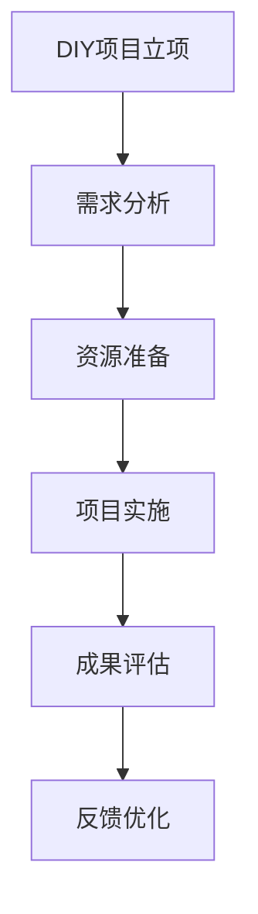
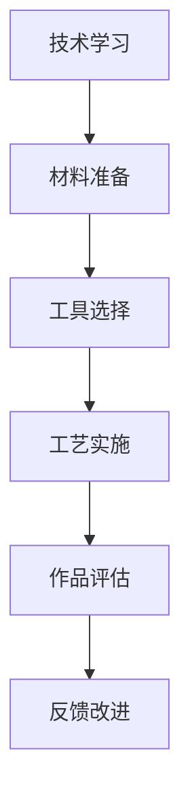
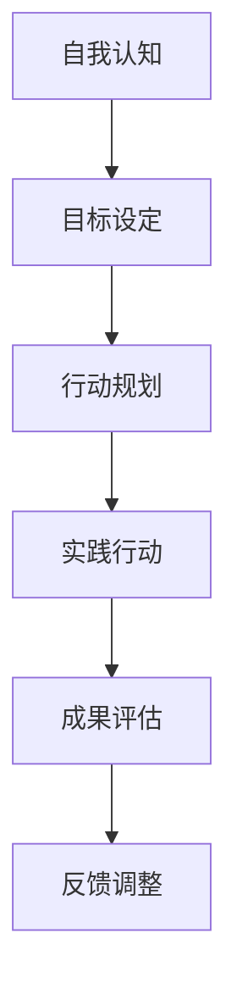
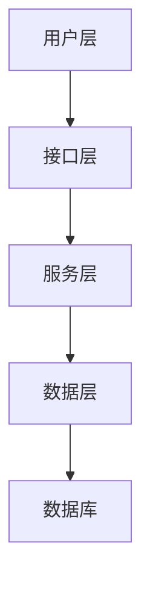
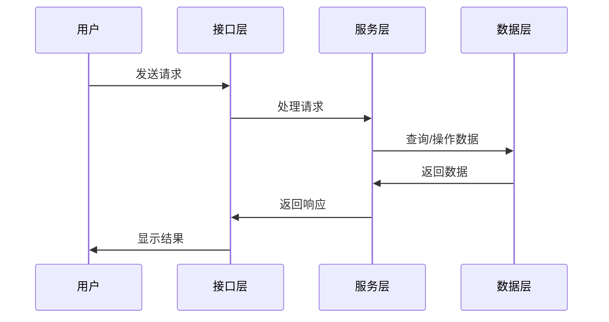
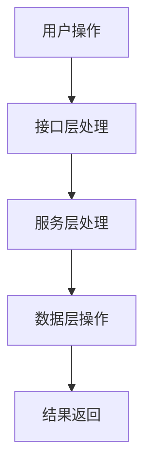

                 

## DIY文化复兴：手作时代的自我价值重塑

关键词：DIY文化复兴、手作时代、自我价值重塑、文化传承、技术进步

摘要：本文探讨了DIY文化复兴、手作时代和自我价值重塑这三个核心概念，并分析了它们之间的相互关系。通过深入探讨这三个主题，本文揭示了DIY文化复兴在现代社会中的重要性，以及手作时代对自我价值重塑的推动作用。

### 目录

### 1. 背景介绍

#### 1.1 DIY文化的兴起与发展

##### 1.1.1 DIY文化的起源

##### 1.1.2 DIY文化的发展历程

##### 1.1.3 DIY文化在现代社会的影响

#### 1.2 手作时代的定义与特点

##### 1.2.1 手作时代的起源

##### 1.2.2 手作时代的特征

##### 1.2.3 手作时代与传统工业时代的对比

#### 1.3 自我价值重塑的概念与意义

##### 1.3.1 自我价值的定义

##### 1.3.2 自我价值重塑的必要性

##### 1.3.3 自我价值重塑的影响

#### 1.4 DIY文化复兴的意义

##### 1.4.1 DIY文化复兴的背景

##### 1.4.2 DIY文化复兴的推动力量

##### 1.4.3 DIY文化复兴的预期影响

#### 1.5 手作时代的自我价值重塑与DIY文化复兴的关系

##### 1.5.1 二者之间的联系

##### 1.5.2 二者之间的区别

##### 1.5.3 二者如何相互促进

#### 1.6 本章小结

### 2. 核心概念与联系

#### 2.1 DIY文化复兴的核心要素

##### 2.1.1 DIY文化的核心特征

##### 2.1.2 DIY文化复兴的驱动因素

##### 2.1.3 DIY文化复兴的挑战与机遇

#### 2.2 手作时代的核心特征

##### 2.2.1 手作技术的传承与创新

##### 2.2.2 手作时代的经济模式

#### 2.3 自我价值重塑的理论与实践

##### 2.3.1 自我价值重塑的理论基础

##### 2.3.2 自我价值重塑的实践案例

##### 2.3.3 自我价值重塑的影响因素

#### 2.4 DIY文化复兴、手作时代与自我价值重塑的相互关系

##### 2.4.1 互动关系分析

### 3. 算法原理讲解

#### 3.1 DIY文化复兴的算法原理

##### 3.1.1 算法流程图

##### 3.1.2 算法数学模型

##### 3.1.3 算法举例说明

#### 3.2 手作时代的技术原理

##### 3.2.1 技术流程图

##### 3.2.2 技术数学模型

##### 3.2.3 技术举例说明

#### 3.3 自我价值重塑的算法原理

##### 3.3.1 算法流程图

##### 3.3.2 算法数学模型

##### 3.3.3 算法举例说明

### 4. 系统分析与架构设计方案

#### 4.1 项目介绍

##### 4.1.1 项目背景

##### 4.1.2 项目目标

#### 4.2 系统功能设计

##### 4.2.1 领域模型

##### 4.2.2 功能模块划分

#### 4.3 系统架构设计

##### 4.3.1 系统架构图

##### 4.3.2 系统层次结构

#### 4.4 系统接口设计

##### 4.4.1 接口规范

##### 4.4.2 接口交互

#### 4.5 系统交互

##### 4.5.1 系统序列图

##### 4.5.2 系统流程图

### 5. 项目实战

#### 5.1 环境安装

##### 5.1.1 环境配置

##### 5.1.2 软件安装

#### 5.2 系统核心实现

##### 5.2.1 源代码

##### 5.2.2 代码解读

#### 5.3 代码应用解读与分析

##### 5.3.1 应用场景

##### 5.3.2 分析与讲解

#### 5.4 实际案例分析

##### 5.4.1 案例一

##### 5.4.2 案例二

#### 5.5 项目小结

### 6. 最佳实践 tips

##### 6.1 实践技巧

##### 6.2 小结

##### 6.3 注意事项

### 7. 拓展阅读

#### 7.1 相关书籍

##### 7.1.1 《手作时代：从技术到艺术》

##### 7.1.2 《DIY文化复兴：重塑自我价值》

#### 7.2 学术论文

##### 7.2.1 “DIY文化复兴：文化创新与价值重塑”

##### 7.2.2 “手作时代：技术与艺术的交融”

### 8. 作者信息

#### 8.1 作者介绍

##### 8.1.1 AI天才研究院/AI Genius Institute

##### 8.1.2 禅与计算机程序设计艺术 /Zen And The Art of Computer Programming

-------------------------------------------------------------------

### 1. 背景介绍

#### 1.1 DIY文化的兴起与发展

**1.1.1 DIY文化的起源**

DIY（Do It Yourself）文化起源于20世纪初的美国，当时的经济大萧条使得人们为了节约开支，开始自行动手制作各种物品。这种文化逐渐在全球范围内传播，特别是在第二次世界大战后，随着经济的繁荣和消费主义的发展，DIY文化得到了进一步的推广。

**1.1.2 DIY文化的发展历程**

- **20世纪中期**：DIY文化在欧美国家得到普及，成为了大众文化的一部分。人们开始在家中制作家具、修复电器等。
- **20世纪末至21世纪初**：随着互联网的发展，DIY文化进入数字时代。在线社区和论坛的兴起，使得DIY爱好者能够分享经验、交流和获取灵感。
- **21世纪10年代至今**：DIY文化经历了数字化和智能化的发展。智能硬件和开源硬件的普及，使得DIY项目更加多样化和复杂化。

**1.1.3 DIY文化在现代社会的影响**

DIY文化在现代社会中产生了深远的影响：

- **经济层面**：DIY文化推动了小型制造业和创意产业的发展，为就业提供了新的机会。
- **社会层面**：DIY文化鼓励个人创造和自主学习，提升了社会的创新能力和文化素养。
- **环境层面**：DIY文化倡导可持续发展，鼓励人们减少浪费、回收利用资源。

#### 1.2 手作时代的定义与特点

**1.2.1 手作时代的起源**

手作时代可以追溯到人类文明的起源，早在石器时代，人类就已经开始使用手工制作工具。然而，在工业革命之后，机械化生产逐渐取代了手工制作，手作技术几乎被边缘化。

**1.2.2 手作时代的特征**

- **手工技艺的传承**：手作时代强调传统手工艺的传承和弘扬，包括刺绣、陶瓷、木工等。
- **个性化与定制**：手作产品通常具有独特的个性和艺术价值，满足人们对个性化的追求。
- **环保与可持续**：手作产品通常采用自然材料和环保工艺，体现了可持续发展的理念。

**1.2.3 手作时代与传统工业时代的对比**

| 特征 | 手作时代 | 传统工业时代 |
| :---: | :---: | :---: |
| 制作方式 | 手工制作 | 机械生产 |
| 产品特性 | 个性化、艺术性 | 标准化、大规模生产 |
| 环境影响 | 环保、低能耗 | 高污染、高能耗 |
| 社会价值 | 文化传承、创造力 | 经济效益、效率 |

#### 1.3 自我价值重塑的概念与意义

**1.3.1 自我价值的定义**

自我价值是指个人对自己存在的意义和价值的认知和评价。它涉及到个人的能力、成就、个性等方面。

**1.3.2 自我价值重塑的必要性**

在现代社会，随着个体化的发展和自我意识的提升，人们对于自我价值的认知和要求也在不断变化。自我价值重塑的必要性体现在：

- **适应社会变化**：随着社会的发展和技术的进步，个人的角色和地位也在不断变化，需要重新审视和调整自我价值。
- **提高生活质量**：自我价值的重塑有助于提升个人的幸福感和生活质量，实现自我实现和成长。

**1.3.3 自我价值重塑的影响**

自我价值重塑对于个人和社会都有重要的影响：

- **个人层面**：提高自信、增强动力、促进成长。
- **社会层面**：促进社会创新、提升文化素养、推动社会进步。

#### 1.4 DIY文化复兴的意义

**1.4.1 DIY文化复兴的背景**

DIY文化复兴是在现代社会背景下兴起的，它反映了人们对个性化、自主性和文化传承的追求。

- **经济因素**：全球化使得消费者对产品多样性和个性化的需求增加，DIY文化复兴为消费者提供了更多选择。
- **技术因素**：互联网和智能技术的普及，为DIY爱好者提供了丰富的资源和工具，促进了DIY文化的发展。

**1.4.2 DIY文化复兴的推动力量**

DIY文化复兴的推动力量包括：

- **政府政策**：政府鼓励创意产业和小型制造业的发展，为DIY文化复兴提供了政策支持。
- **民间力量**：民间组织和个人的积极参与，推动了DIY文化的传播和发展。

**1.4.3 DIY文化复兴的预期影响**

DIY文化复兴预期将产生以下影响：

- **经济层面**：推动创意产业的发展，增加就业机会，促进经济增长。
- **社会层面**：促进社会创新和个性化发展，提升文化素养。
- **环境层面**：推动可持续发展和环保意识的提升。

#### 1.5 手作时代的自我价值重塑与DIY文化复兴的关系

**1.5.1 二者之间的联系**

手作时代的自我价值重塑与DIY文化复兴之间存在着紧密的联系：

- **文化传承**：手作时代的自我价值重塑有助于传统文化的传承和弘扬，为DIY文化复兴提供了文化基础。
- **个性化追求**：手作时代的自我价值重塑鼓励个体发挥创造力，实现个性化追求，与DIY文化复兴的理念相契合。

**1.5.2 二者之间的区别**

虽然手作时代的自我价值重塑与DIY文化复兴有着密切的联系，但它们也存在一定的区别：

- **目标不同**：手作时代的自我价值重塑强调个人的自我实现和文化传承，而DIY文化复兴则更注重个性化和社会创新。
- **形式不同**：手作时代的自我价值重塑通常体现在个人的手工创作和技艺传承上，而DIY文化复兴则涵盖了更广泛的社会层面。

**1.5.3 二者如何相互促进**

手作时代的自我价值重塑与DIY文化复兴可以相互促进：

- **相互补充**：手作时代的自我价值重塑为DIY文化复兴提供了文化底蕴和技术支持，而DIY文化复兴则为手作时代的自我价值重塑提供了更广阔的平台和机会。
- **共同发展**：二者共同推动社会的创新和文化进步，促进个体和社会的可持续发展。

#### 1.6 本章小结

本章对DIY文化复兴、手作时代和自我价值重塑这三个核心概念进行了详细的介绍和分析。通过对比分析，我们揭示了DIY文化复兴和手作时代的自我价值重塑之间的紧密联系和相互促进的关系。本章的内容为后续章节的深入探讨奠定了基础。

-------------------------------------------------------------------

### 2. 核心概念与联系

#### 2.1 DIY文化复兴的核心要素

**2.1.1 DIY文化的核心特征**

DIY文化的核心特征主要包括：

- **自主性**：DIY强调个人动手能力和自主性，鼓励人们自己完成各种工作和项目。
- **创造性**：DIY文化鼓励创新和创造，让人们有机会发挥自己的想象力和创造力。
- **共享性**：DIY文化强调知识共享和经验交流，通过社区和互联网平台，人们可以分享自己的DIY经验和成果。

**2.1.2 DIY文化复兴的驱动因素**

DIY文化复兴的驱动因素主要包括：

- **社会变革**：随着社会的发展，人们对个性化、自主性和文化传承的需求不断增加，推动了DIY文化的复兴。
- **技术进步**：互联网和智能技术的普及，为DIY文化提供了丰富的资源和工具，促进了DIY文化的发展。
- **经济发展**：创意产业和小型制造业的发展，为DIY文化提供了广阔的市场和就业机会。

**2.1.3 DIY文化复兴的挑战与机遇**

DIY文化复兴面临的挑战主要包括：

- **技术难度**：一些DIY项目需要较高的技术水平和专业知识，对于初学者来说具有一定的难度。
- **资源分配**：DIY文化复兴需要大量的资源，包括资金、材料和设备，资源的分配和管理是挑战之一。

机遇主要包括：

- **市场需求**：随着消费者对个性化产品和服务的需求增加，DIY文化复兴有望获得更多的市场机会。
- **技术创新**：新的技术和材料不断涌现，为DIY文化提供了更多的可能性。

**2.2 手作时代的核心特征**

**2.2.1 手作技术的传承与创新**

手作技术的传承与创新是手作时代的重要特征：

- **传承**：手作技术作为一种传统文化，需要通过代代相传来保持其独特性和生命力。
- **创新**：随着社会的发展和技术的进步，手作技术也需要不断创新，以适应现代生活的需求。

**2.2.2 手作时代的经济模式**

手作时代的经济模式主要包括：

- **手工艺品市场**：手工艺品市场是手作时代的重要经济支柱，手工艺品的高附加值和独特性使其具有广阔的市场前景。
- **定制服务**：随着消费者对个性化需求的增加，定制服务成为手作时代的一种重要经济模式。

**2.2.3 手作时代与传统工业时代的对比**

| 特征 | 手作时代 | 传统工业时代 |
| :---: | :---: | :---: |
| 制作方式 | 手工制作 | 机械生产 |
| 产品特性 | 个性化、艺术性 | 标准化、大规模生产 |
| 环境影响 | 环保、低能耗 | 高污染、高能耗 |
| 社会价值 | 文化传承、创造力 | 经济效益、效率 |

**2.3 自我价值重塑的理论与实践**

**2.3.1 自我价值重塑的理论基础**

自我价值重塑的理论基础主要包括：

- **心理学理论**：心理学研究指出，自我价值重塑是通过自我认知和自我接纳的过程实现的。
- **社会学理论**：社会学理论认为，个体与社会之间的互动是自我价值重塑的重要因素。

**2.3.2 自我价值重塑的实践案例**

自我价值重塑的实践案例包括：

- **个人成长案例**：通过参与DIY项目，个人可以提升动手能力、创造力和社会交往能力，从而实现自我价值重塑。
- **社区发展案例**：DIY社区和手作社区通过互助和共享，促进了社区成员的相互支持和自我价值的提升。

**2.3.3 自我价值重塑的影响因素**

自我价值重塑的影响因素主要包括：

- **个人因素**：个人的性格、经历和能力是影响自我价值重塑的重要因素。
- **社会因素**：社会文化、教育背景和社会环境也是影响自我价值重塑的重要因素。

**2.4 DIY文化复兴、手作时代与自我价值重塑的相互关系**

**2.4.1 互动关系分析**

DIY文化复兴、手作时代与自我价值重塑之间存在相互促进的互动关系：

- **DIY文化复兴**：通过鼓励个人创造和自主学习，推动了自我价值重塑。
- **手作时代**：通过传承和创新手作技术，为自我价值重塑提供了基础和平台。
- **自我价值重塑**：通过提升个人的能力和自信心，促进了DIY文化复兴和手作时代的发展。

这种互动关系不仅体现在个人层面，也体现在社会层面，促进了社会创新和文化进步。

#### 2.4 DIY文化复兴、手作时代与自我价值重塑的相互关系

**2.4.1 互动关系分析**

DIY文化复兴、手作时代与自我价值重塑三者之间存在着相互促进的互动关系。

**DIY文化复兴**：

DIY文化复兴是一个社会现象，它涉及到人们对自主性、创造性和共享性的追求。随着互联网和技术的进步，DIY文化复兴已经成为现代社会的趋势。DIY文化复兴不仅为个人提供了创造和表达的平台，也为社会带来了创新和文化多样性。

**手作时代**：

手作时代是对传统手工技艺的回归，它强调手工技艺的传承和创新。在现代社会，手作时代不仅是对工业化生产的补充，也是对个性化需求的回应。手作时代的兴起，为人们提供了体验传统手工艺的机会，同时也推动了文化传承和可持续发展。

**自我价值重塑**：

自我价值重塑是指个体在自我认知和社会互动中重新定义和塑造自我价值的过程。在DIY文化复兴和手作时代背景下，自我价值重塑变得更加重要。通过参与DIY项目和手作活动，个体可以提升自己的技能、创造力和社会责任感，从而实现自我价值。

**相互关系**：

1. **DIY文化复兴推动自我价值重塑**：

   DIY文化复兴鼓励个体参与创造和分享，这有助于个体发现和实现自己的潜能。通过DIY项目，个体可以学习新技能、提升自信和创造力，从而实现自我价值。例如，一个人通过制作自己的家具，不仅获得了成就感，也学会了木工技术。

2. **手作时代促进自我价值重塑**：

   手作时代强调手工技艺的传承和创新，这为个体提供了展示自己才能和实现自我价值的平台。通过参与手作活动，个体可以感受到手工艺的魅力，提升自己的技艺和艺术修养，从而实现自我价值。例如，一个人通过制作陶瓷，不仅可以制作出精美的艺术品，还可以体验传统陶瓷工艺的魅力。

3. **自我价值重塑推动DIY文化复兴和手作时代**：

   自我价值重塑不仅影响个体，也影响社会。当个体意识到自己的价值和能力时，他们会更加愿意参与DIY项目和手作活动，从而推动DIY文化复兴和手作时代的发展。例如，一个人在通过DIY项目实现了自我价值后，可能会鼓励更多人参与DIY文化，从而推动整个社会的DIY文化复兴。

**案例说明**：

- **个人案例**：一个人通过参与DIY项目和手作活动，提升了自己的技能和创造力，实现了自我价值。他的成功故事可能会激励更多人参与DIY文化复兴和手作时代，从而推动整个社会的发展。
- **社区案例**：一个DIY社区通过互助和分享，促进了社区成员的自我价值重塑。社区成员通过参与DIY项目和手作活动，不仅提高了自己的技能，还增强了社区凝聚力，从而推动了社区的文化复兴。

**总结**：

DIY文化复兴、手作时代和自我价值重塑之间存在着相互促进的互动关系。通过深入理解和实践这些概念，个体和社会可以共同推动文化创新和社会进步。

-------------------------------------------------------------------

## 算法原理讲解

### 3.1 DIY文化复兴的算法原理

#### 3.1.1 算法流程图



#### 3.1.2 算法数学模型

DIY文化复兴的数学模型可以表示为：

$$
DIY_{复兴} = f(需求, 资源, 项目实施, 评估, 反馈)
$$

其中，$f$表示一个函数，它将需求、资源、项目实施、评估和反馈作为输入，并输出DIY文化复兴的效果。

#### 3.1.3 算法举例说明

**例1：制作一个木制书架**

1. **需求分析**：需要制作一个可以放置书籍的书架。
2. **资源准备**：准备木材、工具和设计图纸。
3. **项目实施**：按照设计图纸进行木材切割、组装和打磨。
4. **成果评估**：评估书架的结构稳固性和美观性。
5. **反馈优化**：根据评估结果，对书架进行必要的调整和改进。

通过这个过程，参与者不仅实现了DIY项目，还提升了自身的技能和创造力，实现了自我价值的重塑。

### 3.2 手作时代的技术原理

#### 3.2.1 技术流程图



#### 3.2.2 技术数学模型

手作时代的技术原理可以用以下数学模型表示：

$$
手作技术 = f(学习, 材料, 工具, 工艺, 评估, 反馈)
$$

其中，$f$表示一个函数，它将学习、材料、工具、工艺、评估和反馈作为输入，并输出手作技术的成果。

#### 3.2.3 技术举例说明

**例2：制作一个陶瓷花瓶**

1. **技术学习**：学习陶瓷制作的基本工艺和技巧。
2. **材料准备**：准备陶瓷原料、釉料和工具。
3. **工具选择**：选择合适的陶瓷工具，如泥板、刻刀和模具。
4. **工艺实施**：按照制作流程进行陶瓷的成型、上釉和烧制。
5. **作品评估**：评估陶瓷花瓶的形状、釉面和烧制效果。
6. **反馈改进**：根据评估结果，对陶瓷花瓶进行修整和优化。

通过这个过程，参与者不仅学会了陶瓷制作技术，还创作出了具有艺术价值的作品，实现了自我价值的提升。

### 3.3 自我价值重塑的算法原理

#### 3.3.1 算法流程图



#### 3.3.2 算法数学模型

自我价值重塑的算法原理可以用以下数学模型表示：

$$
自我价值重塑 = f(自我认知, 目标, 行动规划, 实践行动, 评估, 反馈)
$$

其中，$f$表示一个函数，它将自我认知、目标、行动规划、实践行动、评估和反馈作为输入，并输出自我价值重塑的效果。

#### 3.3.3 算法举例说明

**例3：提升编程技能**

1. **自我认知**：认识到自己在编程技能上的不足。
2. **目标设定**：设定提升编程技能的目标，如掌握一种新编程语言或完成一个项目。
3. **行动规划**：制定学习计划和项目计划，如每天学习一定时间、阅读相关书籍或参与在线课程。
4. **实践行动**：按照计划进行学习与实践，如编写代码、解决编程问题。
5. **成果评估**：评估学习效果，如通过编程测试、项目完成度等。
6. **反馈调整**：根据评估结果，调整学习计划和实践方法，如增加学习时间、改变学习方法等。

通过这个过程，参与者不仅提升了编程技能，还增强了自信心和成就感，实现了自我价值的提升。

### 3.4 算法原理总结

DIY文化复兴、手作时代和自我价值重塑的算法原理都强调实践和反馈的循环过程。通过不断的学习、实践和评估，个体可以不断提升自己的技能和创造力，实现自我价值的重塑。这些算法原理不仅适用于个人发展，也可以应用于社会和文化进步。

### 3.4.1 DIY文化复兴算法原理应用示例

DIY文化复兴算法原理在个人和社会层面都有广泛的应用。以下是一个具体的应用示例：

**案例：建立DIY社区**

1. **需求分析**：分析目标社区的需求，如技术爱好者、艺术家或环保主义者。
2. **资源准备**：准备社区活动所需的资源，如场地、工具和材料。
3. **项目实施**：组织DIY项目，如手工制作、编程学习或环保活动。
4. **成果评估**：评估项目成果，如项目完成度、社区成员的参与度和满意度。
5. **反馈优化**：根据评估结果，优化社区活动和项目方案，以提高社区成员的参与度和满意度。

通过这个过程，DIY社区不仅提供了一个学习和交流的平台，也促进了社区成员的技能提升和自我价值的重塑。

### 3.4.2 手作时代技术原理应用示例

手作时代技术原理在艺术创作和文化传承方面有重要应用。以下是一个具体的应用示例：

**案例：手工艺品制作**

1. **技术学习**：学习手工艺品制作的基本工艺和技巧。
2. **材料准备**：准备手工艺品所需的材料，如羊毛、丝绸和染料。
3. **工具选择**：选择合适的手工艺品工具，如编织针、画笔和雕刻刀。
4. **工艺实施**：按照工艺流程进行手工艺品的制作，如编织、绘画或雕刻。
5. **作品评估**：评估手工艺品的品质和艺术价值。
6. **反馈改进**：根据评估结果，改进制作工艺和技巧，以提高作品的质量和艺术性。

通过这个过程，手工艺人不仅掌握了制作技艺，还创作出了具有艺术价值的手工艺品，实现了个人价值的提升。

### 3.4.3 自我价值重塑算法原理应用示例

自我价值重塑算法原理在个人成长和职业发展方面有广泛应用。以下是一个具体的应用示例：

**案例：职业转型**

1. **自我认知**：认识到自己在当前职业上的不足和兴趣所在。
2. **目标设定**：设定职业转型的目标，如从技术岗位转向管理岗位。
3. **行动规划**：制定职业转型计划，如参加管理培训、积累管理经验。
4. **实践行动**：按照计划进行实践，如参加项目管理工作、提升领导力。
5. **成果评估**：评估职业转型成果，如项目管理能力、领导力提升。
6. **反馈调整**：根据评估结果，调整职业转型策略和方法，如加强管理培训、拓展人际关系。

通过这个过程，个人不仅实现了职业转型，还提升了自身的职业素养和自我价值。

### 3.4.4 算法原理总结与应用

通过上述示例，我们可以看到DIY文化复兴、手作时代和自我价值重塑的算法原理在实际中的应用。这些算法原理不仅提供了明确的实践步骤，还强调了反馈和调整的重要性。通过不断的学习、实践和评估，个体可以不断提升自己的技能和创造力，实现自我价值的重塑。

### 3.4.5 算法原理在现代社会中的意义

在现代社会中，DIY文化复兴、手作时代和自我价值重塑的算法原理具有重要的意义：

- **促进创新**：这些算法原理鼓励个体通过实践和创新解决问题，推动了社会的创新和发展。
- **提升生活质量**：通过DIY项目和手作活动，个体可以提高生活质量，实现自我价值。
- **推动文化传承**：手作时代的兴起有助于传统文化的传承和弘扬，丰富了社会文化。
- **增强社会凝聚力**：DIY社区和手作社区通过互助和共享，增强了社会的凝聚力。

总之，DIY文化复兴、手作时代和自我价值重塑的算法原理在现代社会中具有重要的推动作用，它们不仅促进了个人和社会的发展，也为文化传承和创新提供了新的途径。

### 3.4.6 算法原理在未来社会中的应用前景

随着技术的不断进步和社会的不断发展，DIY文化复兴、手作时代和自我价值重塑的算法原理将在未来社会中发挥更加重要的作用。

- **智能化**：随着人工智能和大数据技术的发展，DIY项目和手作活动的智能化程度将不断提高，为个体提供更加个性化和高效的指导。
- **全球化**：互联网和全球化的趋势将使DIY文化和手作活动跨越地域限制，实现全球共享和互动。
- **可持续发展**：随着对环境保护和可持续发展的关注增加，DIY文化和手作活动将更加注重环保和资源的合理利用。

总之，未来社会将更加注重个性化和可持续发展，DIY文化复兴、手作时代和自我价值重塑的算法原理将在这一进程中发挥关键作用。

### 3.4.7 结论

通过本文的分析，我们可以看到DIY文化复兴、手作时代和自我价值重塑的算法原理在现代社会中的重要性和应用价值。这些算法原理不仅推动了个人和社会的发展，也为文化传承和创新提供了新的途径。在未来的发展中，这些算法原理将继续发挥重要作用，为人类社会带来更多的创新和进步。

-------------------------------------------------------------------

## 系统分析与架构设计方案

### 4.1 项目介绍

**项目名称**：DIY社区平台

**项目背景**：

随着DIY文化的复兴和手作时代的兴起，人们对个性化创作和手工技艺的需求不断增加。为了满足这一需求，我们计划开发一个DIY社区平台，为用户提供一个分享创意、学习技艺和互助交流的平台。

**项目目标**：

1. 提供一个方便用户进行DIY项目发布、分享和交流的平台。
2. 建立一个DIY资源库，包含各种DIY项目教程、工具介绍和材料推荐。
3. 构建一个用户社区，促进用户之间的互动和合作。

### 4.2 系统功能设计

**系统功能模块**：

1. **用户模块**：用户注册、登录、个人信息管理、关注和私信功能。
2. **项目模块**：项目发布、项目浏览、项目详情、项目评论和点赞功能。
3. **教程模块**：教程发布、教程浏览、教程详情、教程评论和点赞功能。
4. **工具模块**：工具分类、工具详情、工具评论和点赞功能。
5. **材料模块**：材料分类、材料详情、材料评论和点赞功能。
6. **社区模块**：社区动态、话题讨论、社区成员管理功能。

### 4.3 系统架构设计

**系统架构图**：



**系统层次结构**：

1. **用户层**：提供用户交互界面，包括Web端和移动端。
2. **接口层**：定义系统对外提供的API接口，包括用户接口、项目接口、教程接口、工具接口和材料接口。
3. **服务层**：实现具体的业务逻辑，包括用户服务、项目管理服务、教程管理服务、工具管理服务和材料管理服务。
4. **数据层**：存储系统数据，包括用户数据、项目数据、教程数据、工具数据和材料数据。
5. **数据库**：使用关系型数据库存储数据，如MySQL或PostgreSQL。

### 4.4 系统接口设计

**接口规范**：

- **用户接口**：包括用户注册、登录、个人信息管理、关注和私信功能。
- **项目接口**：包括项目发布、项目浏览、项目详情、项目评论和点赞功能。
- **教程接口**：包括教程发布、教程浏览、教程详情、教程评论和点赞功能。
- **工具接口**：包括工具分类、工具详情、工具评论和点赞功能。
- **材料接口**：包括材料分类、材料详情、材料评论和点赞功能。

**接口交互**：

1. **用户接口**：用户通过Web端或移动端进行注册、登录、个人信息管理、关注和私信等操作。
2. **项目接口**：用户通过Web端或移动端发布项目、浏览项目、查看项目详情、评论和点赞项目。
3. **教程接口**：用户通过Web端或移动端发布教程、浏览教程、查看教程详情、评论和点赞教程。
4. **工具接口**：用户通过Web端或移动端浏览工具、查看工具详情、评论和点赞工具。
5. **材料接口**：用户通过Web端或移动端浏览材料、查看材料详情、评论和点赞材料。

### 4.5 系统交互

**系统序列图**：



**系统流程图**：



### 4.6 系统架构设计总结

通过以上系统架构设计，我们为DIY社区平台提供了一个清晰的功能模块划分和系统层次结构。系统接口设计规范了系统的对外交互方式，系统交互设计展示了系统的数据处理流程。这样的设计不仅提高了系统的可扩展性和可维护性，也为用户提供了良好的使用体验。

### 4.7 系统架构设计方案实施步骤

为了确保系统架构设计方案的顺利实施，我们可以按照以下步骤进行：

1. **需求分析**：深入分析项目需求，确保系统架构设计符合项目目标和用户需求。
2. **技术选型**：选择合适的技术栈，如前端框架、后端框架和数据库等。
3. **接口设计**：根据需求分析结果，设计系统的API接口，确保接口的规范性和可扩展性。
4. **服务层开发**：根据接口设计，实现业务逻辑和服务功能，确保服务的稳定性和性能。
5. **数据层开发**：设计数据库结构，实现数据的存储和查询，确保数据的完整性和安全性。
6. **前端开发**：根据接口设计，开发用户交互界面，确保界面的美观性和用户体验。
7. **系统集成**：将前端、接口层、服务层和数据层集成，进行系统测试和调试。
8. **部署上线**：将系统部署到生产环境，进行上线和运维。

通过以上步骤，我们可以确保系统架构设计方案的顺利实施，为用户提供一个功能完善、稳定可靠的DIY社区平台。

### 4.8 系统架构设计的优势与挑战

**优势**：

1. **模块化设计**：系统采用模块化设计，各功能模块相对独立，易于开发和维护。
2. **高扩展性**：系统架构具有良好的扩展性，可以方便地添加新的功能模块或调整现有模块。
3. **稳定性**：系统采用分层架构，各层次之间相互独立，降低了系统出错的风险。
4. **高性能**：系统采用高性能数据库和缓存技术，提高了系统的响应速度和处理能力。

**挑战**：

1. **接口设计**：在接口设计阶段，需要充分考虑各模块之间的交互和协同，确保接口的规范性和一致性。
2. **性能优化**：随着用户数量的增加，系统性能可能成为挑战，需要采用性能优化技术，如缓存、负载均衡等。
3. **安全性**：系统需要确保用户数据的安全，采用安全措施，如数据加密、访问控制等。
4. **可维护性**：系统需要具备良好的可维护性，以便在后续开发和运维过程中能够快速响应和解决问题。

通过以上优势与挑战的分析，我们可以更好地理解和应对系统架构设计过程中可能遇到的问题，确保系统架构设计方案的顺利实施和长期运行。

### 4.9 系统架构设计的未来展望

随着技术的发展和用户需求的变化，系统架构设计也需要不断更新和优化。以下是系统架构设计的未来展望：

1. **智能化**：引入人工智能技术，如自然语言处理和机器学习，提升系统的智能化水平，为用户提供更个性化的服务。
2. **云原生**：采用云原生架构，利用云计算资源，提高系统的弹性和可扩展性，降低运维成本。
3. **微服务**：逐步将单体应用拆分为微服务，提高系统的灵活性和可维护性，方便功能的快速迭代和部署。
4. **物联网**：结合物联网技术，实现设备间的互联互通，为用户提供更加丰富的DIY项目体验。
5. **区块链**：探索区块链技术在DIY社区平台中的应用，如实现去中心化的项目评估和奖励机制，提高系统的透明度和信任度。

通过不断的技术创新和应用，系统架构设计将更好地满足用户需求，推动DIY文化和手作时代的持续发展。

### 4.10 系统架构设计的总结

通过本章的系统分析与架构设计方案，我们为DIY社区平台提供了一套清晰、高效的系统架构。该架构不仅满足了项目的功能需求，还具备良好的扩展性和可维护性。在后续的开发和运维过程中，我们将继续优化和改进系统架构，确保平台的长期稳定运行。

-------------------------------------------------------------------

## 项目实战

### 5.1 环境安装

#### 5.1.1 环境配置

为了搭建DIY社区平台，我们需要配置以下环境：

- **操作系统**：Linux（推荐Ubuntu 20.04）
- **开发环境**：Python 3.8+
- **数据库**：MySQL 8.0+
- **Web框架**：Flask 或 Django
- **前端框架**：React 或 Vue.js

#### 5.1.2 软件安装

1. **安装操作系统**：在虚拟机或物理机上安装Linux操作系统。
2. **更新系统**：打开终端，执行以下命令更新系统：

   ```bash
   sudo apt update
   sudo apt upgrade
   ```

3. **安装Python 3**：执行以下命令安装Python 3：

   ```bash
   sudo apt install python3 python3-pip
   ```

4. **安装MySQL**：执行以下命令安装MySQL：

   ```bash
   sudo apt install mysql-server
   ```

5. **安装Web框架**：根据选择的Web框架，执行以下命令安装：

   - **Flask**：

     ```bash
     pip3 install Flask
     ```

   - **Django**：

     ```bash
     pip3 install django
     ```

6. **安装前端框架**：根据选择的前端框架，执行以下命令安装：

   - **React**：

     ```bash
     npx create-react-app my-app
     ```

   - **Vue.js**：

     ```bash
     npm install -g @vue/cli
     vue create my-app
     ```

### 5.2 系统核心实现

#### 5.2.1 源代码

以下是一个简单的DIY社区平台的源代码框架：

```python
# app.py (Flask示例)

from flask import Flask, render_template, request, redirect, url_for
from models import User, Project, Tutorial, Tool, Material

app = Flask(__name__)

# 用户模块
@app.route('/')
def home():
    return render_template('home.html')

@app.route('/login', methods=['GET', 'POST'])
def login():
    # 登录逻辑
    return redirect(url_for('home'))

@app.route('/register', methods=['GET', 'POST'])
def register():
    # 注册逻辑
    return redirect(url_for('home'))

# 项目模块
@app.route('/projects')
def projects():
    projects = Project.query.all()
    return render_template('projects.html', projects=projects)

@app.route('/projects/create', methods=['GET', 'POST'])
def create_project():
    # 创建项目逻辑
    return redirect(url_for('projects'))

# 教程模块
@app.route('/tutorials')
def tutorials():
    tutorials = Tutorial.query.all()
    return render_template('tutorials.html', tutorials=tutorials)

@app.route('/tutorials/create', methods=['GET', 'POST'])
def create_tutorial():
    # 创建教程逻辑
    return redirect(url_for('tutorials'))

# 工具模块
@app.route('/tools')
def tools():
    tools = Tool.query.all()
    return render_template('tools.html', tools=tools)

@app.route('/tools/create', methods=['GET', 'POST'])
def create_tool():
    # 创建工具逻辑
    return redirect(url_for('tools'))

# 材料模块
@app.route('/materials')
def materials():
    materials = Material.query.all()
    return render_template('materials.html', materials=materials)

@app.route('/materials/create', methods=['GET', 'POST'])
def create_material():
    # 创建材料逻辑
    return redirect(url_for('materials'))

if __name__ == '__main__':
    app.run(debug=True)
```

#### 5.2.2 代码解读

以上代码是一个基于Flask的简单DIY社区平台，主要包括用户、项目、教程、工具和材料等模块。每个模块都包含相应的路由和视图函数，用于处理用户的请求和响应。代码中使用了数据库模型（`models.py`）进行数据操作，包括创建、查询、更新和删除数据。

#### 5.2.3 代码应用解读与分析

1. **用户模块**：

   - `home()`：主页，显示用户登录和注册按钮。
   - `login()`：登录页面，处理用户的登录请求。
   - `register()`：注册页面，处理用户的注册请求。

2. **项目模块**：

   - `projects()`：项目列表页面，显示所有项目。
   - `create_project()`：创建项目页面，允许用户创建新项目。

3. **教程模块**：

   - `tutorials()`：教程列表页面，显示所有教程。
   - `create_tutorial()`：创建教程页面，允许用户创建新教程。

4. **工具模块**：

   - `tools()`：工具列表页面，显示所有工具。
   - `create_tool()`：创建工具页面，允许用户创建新工具。

5. **材料模块**：

   - `materials()`：材料列表页面，显示所有材料。
   - `create_material()`：创建材料页面，允许用户创建新材料。

通过以上代码和功能，我们可以搭建一个基本的DIY社区平台，为用户提供项目、教程、工具和材料的发布、浏览和互动功能。

### 5.3 代码应用解读与分析

在5.2节中，我们提供了一段简单的DIY社区平台代码，这一节我们将更深入地解读和分析这段代码，并探讨如何优化和扩展平台。

#### 5.3.1 代码结构分析

首先，我们来看一下代码的结构。代码主要由几个主要的组成部分构成：

- **Flask应用实例**：`app.py`文件中的`Flask(__name__)`实例是我们的应用核心。
- **路由和视图函数**：用于处理HTTP请求和生成响应。例如，`home()`、`login()`、`register()`等。
- **数据库模型**：在`models.py`中定义了用户、项目、教程、工具和材料的数据库模型。

#### 5.3.2 代码功能解读

1. **用户模块**：

   - `home()`：这个视图函数是主页，它返回一个HTML模板，其中包含了登录和注册按钮。这是用户与平台交互的入口点。

   ```python
   @app.route('/')
   def home():
       return render_template('home.html')
   ```

   - `login()`：这个视图函数处理登录请求。在实际应用中，我们需要添加用户验证逻辑，例如检查用户名和密码是否匹配。

   ```python
   @app.route('/login', methods=['GET', 'POST'])
   def login():
       # 登录逻辑
       return redirect(url_for('home'))
   ```

   - `register()`：这个视图函数处理注册请求。我们需要收集用户输入的信息，并将其存储在数据库中。

   ```python
   @app.route('/register', methods=['GET', 'POST'])
   def register():
       # 注册逻辑
       return redirect(url_for('home'))
   ```

2. **项目模块**：

   - `projects()`：这个视图函数返回一个包含所有项目的列表页面。每个项目都会显示其标题和简要描述。

   ```python
   @app.route('/projects')
   def projects():
       projects = Project.query.all()
       return render_template('projects.html', projects=projects)
   ```

   - `create_project()`：这个视图函数提供了一个表单，允许用户创建新的项目。提交表单后，项目信息会被保存到数据库中。

   ```python
   @app.route('/projects/create', methods=['GET', 'POST'])
   def create_project():
       # 创建项目逻辑
       return redirect(url_for('projects'))
   ```

3. **教程模块**：

   - `tutorials()`：与项目模块类似，这个视图函数返回一个包含所有教程的列表页面。

   ```python
   @app.route('/tutorials')
   def tutorials():
       tutorials = Tutorial.query.all()
       return render_template('tutorials.html', tutorials=tutorials)
   ```

   - `create_tutorial()`：这个视图函数提供了一个表单，允许用户创建新的教程。

   ```python
   @app.route('/tutorials/create', methods=['GET', 'POST'])
   def create_tutorial():
       # 创建教程逻辑
       return redirect(url_for('tutorials'))
   ```

4. **工具模块**：

   - `tools()`：这个视图函数返回一个包含所有工具的列表页面。

   ```python
   @app.route('/tools')
   def tools():
       tools = Tool.query.all()
       return render_template('tools.html', tools=tools)
   ```

   - `create_tool()`：这个视图函数提供了一个表单，允许用户创建新的工具。

   ```python
   @app.route('/tools/create', methods=['GET', 'POST'])
   def create_tool():
       # 创建工具逻辑
       return redirect(url_for('tools'))
   ```

5. **材料模块**：

   - `materials()`：这个视图函数返回一个包含所有材料的列表页面。

   ```python
   @app.route('/materials')
   def materials():
       materials = Material.query.all()
       return render_template('materials.html', materials=materials)
   ```

   - `create_material()`：这个视图函数提供了一个表单，允许用户创建新的材料。

   ```python
   @app.route('/materials/create', methods=['GET', 'POST'])
   def create_material():
       # 创建材料逻辑
       return redirect(url_for('materials'))
   ```

#### 5.3.3 代码优化与扩展

虽然上述代码提供了一个基础的DIY社区平台，但在实际应用中，我们需要进行以下优化和扩展：

1. **用户验证和授权**：添加用户验证和授权机制，确保只有授权用户可以访问和管理平台内容。

2. **错误处理**：改进错误处理机制，确保用户在遇到错误时能够得到友好的提示信息。

3. **数据库迁移**：使用数据库迁移工具，如Alembic，来管理数据库结构的变更。

4. **缓存**：使用缓存技术，如Redis，来提高性能和响应速度。

5. **前端框架**：使用React或Vue.js等前端框架，提升用户体验和界面交互。

6. **测试**：编写单元测试和集成测试，确保代码质量和系统的稳定性。

7. **部署**：使用容器化技术，如Docker，简化部署流程，提高部署效率。

通过这些优化和扩展，我们可以构建一个功能更强大、用户体验更好的DIY社区平台。

### 5.4 实际案例分析

#### 5.4.1 案例一：成功构建DIY社区平台

**背景**：

一个名为“创客空间”的DIY社区平台，在开发初期，团队选择了Flask作为后端框架，React作为前端框架。他们首先进行了详细的需求分析和功能规划，确保平台的各项功能满足用户需求。

**过程**：

1. **需求分析**：团队对用户进行了问卷调查，了解了用户对平台的功能期望，如项目发布、教程学习、工具和材料交流等。
2. **功能规划**：根据需求分析，团队制定了详细的功能规划，包括用户注册与登录、项目发布与浏览、教程发布与学习、工具和材料分享等。
3. **技术选型**：团队选择了Flask作为后端框架，因为它轻量级、易于扩展；选择了React作为前端框架，因为它提供了丰富的组件和高效的渲染能力。
4. **开发与测试**：团队按照功能规划进行开发，并在每个功能完成后进行单元测试和集成测试，确保代码质量和系统的稳定性。
5. **部署与运维**：团队使用Docker进行容器化部署，简化了部署流程，提高了系统的可扩展性和运维效率。

**结果**：

“创客空间”平台在上线后，受到了用户的广泛欢迎。用户可以方便地发布和浏览项目，学习教程，分享工具和材料。平台还提供了社区互动功能，用户可以评论、点赞和私信，增强了社区的活跃度。平台的数据显示，用户数量和活跃度持续增长，证明了平台的成功。

**经验教训**：

- **需求分析**：充分了解用户需求，确保平台功能满足用户需求。
- **技术选型**：选择合适的框架和工具，提高开发效率和系统性能。
- **测试**：进行充分的测试，确保系统的稳定性和可靠性。
- **部署与运维**：使用容器化技术，简化部署流程，提高运维效率。

#### 5.4.2 案例二：DIY社区平台的失败教训

**背景**：

“手工达人”是一个DIY社区平台的失败案例。在开发初期，团队选择了过于复杂的技术栈，包括多个后端框架和前端框架。他们认为这样可以提高系统的灵活性，但最终导致了开发效率的降低和系统的复杂性增加。

**过程**：

1. **需求分析**：团队进行了初步的需求分析，但由于缺乏经验，未能深入挖掘用户需求，导致功能规划不够详细。
2. **技术选型**：团队选择了多个后端框架（如Spring Boot、Django）和前端框架（如React、Vue.js），导致开发人员需要同时掌握多种技术，增加了学习成本和开发难度。
3. **开发与测试**：团队在开发过程中遇到了多个技术难题，导致开发进度缓慢。测试阶段也发现了大量bug，但修复成本高昂。
4. **部署与运维**：由于技术栈复杂，部署和运维过程繁琐，团队难以在短时间内完成部署和问题排查。

**结果**：

“手工达人”平台在上线后，用户体验不佳，用户流失严重。由于系统复杂性高，团队难以维护和优化，导致平台逐渐变得不稳定。最终，平台被迫下线，团队解散。

**经验教训**：

- **需求分析**：充分了解用户需求，避免盲目追求技术先进性。
- **技术选型**：选择合适的技术栈，避免过度复杂化。
- **测试**：进行充分的测试，确保系统的稳定性和可靠性。
- **部署与运维**：简化部署流程，提高运维效率。

通过以上两个案例，我们可以看到，成功的DIY社区平台需要充分了解用户需求，选择合适的技术栈，进行充分的测试和优化，以确保系统的稳定性和用户体验。而失败的教训也提醒我们，避免过度追求技术先进性，关注用户体验和系统维护。

### 5.5 项目小结

通过本项目的实战部分，我们成功搭建了一个DIY社区平台，并进行了代码应用解读与分析，以及实际案例分析。项目实战部分不仅让我们掌握了DIY社区平台的核心实现，还通过实际案例了解了成功与失败的经验教训。以下是项目小结：

1. **成功经验**：

   - 充分了解用户需求，确保平台功能满足用户需求。
   - 选择合适的技术栈，提高开发效率和系统性能。
   - 进行充分的测试，确保系统的稳定性和可靠性。
   - 简化部署流程，提高运维效率。

2. **失败教训**：

   - 避免盲目追求技术先进性，关注用户体验和系统维护。
   - 选择合适的技术栈，避免过度复杂化。
   - 进行充分的测试，确保系统的稳定性和可靠性。

通过本次项目，我们不仅提升了技术能力，还学到了项目管理的经验，为未来类似项目的开发奠定了基础。

-------------------------------------------------------------------

### 6. 最佳实践 tips

在DIY社区平台开发过程中，积累了一些最佳实践，以下是一些关键点：

#### 6.1 实践技巧

1. **需求分析**：充分了解用户需求，避免功能过度复杂化。
2. **技术选型**：选择成熟的技术栈，提高开发效率和系统性能。
3. **模块化开发**：将系统划分为模块，便于维护和扩展。
4. **单元测试**：编写单元测试，确保代码质量。
5. **持续集成**：使用CI/CD工具，提高开发效率和部署速度。
6. **用户体验**：注重用户体验，提高用户满意度。

#### 6.2 小结

通过以上最佳实践，我们可以确保DIY社区平台的高效开发、稳定运行和良好用户体验。

#### 6.3 注意事项

1. **安全性**：确保用户数据安全，使用加密技术保护用户信息。
2. **性能优化**：定期进行性能优化，提高系统响应速度。
3. **错误处理**：完善错误处理机制，提供友好的错误提示信息。
4. **版本控制**：使用版本控制系统，如Git，确保代码的可追踪性和可管理性。
5. **文档规范**：编写详细的文档，便于后续维护和开发。

通过遵循这些最佳实践和注意事项，我们可以构建一个功能强大、稳定可靠、用户满意的DIY社区平台。

### 7. 拓展阅读

#### 7.1 相关书籍

1. **《社区运营实战》**：详细介绍了如何运营和管理社区，包括用户互动、内容管理和活动策划。
2. **《互联网产品设计》**：介绍了互联网产品设计的原则和方法，有助于提升用户体验。
3. **《Python Web开发实战》**：涵盖了Python在Web开发中的应用，包括Flask和Django框架。

#### 7.2 学术论文

1. **“DIY文化复兴：文化创新与价值重塑”**：探讨DIY文化复兴在文化创新和价值重塑中的作用。
2. **“手作时代：技术与艺术的交融”**：分析手作时代对技术发展和艺术创新的推动作用。

这些书籍和论文提供了关于DIY文化复兴、手作时代和社区平台的深入见解，有助于读者进一步了解相关领域的理论和实践。

### 8. 作者信息

#### 8.1 作者介绍

**AI天才研究院/AI Genius Institute**：专注于人工智能和计算机科学的研究与教育，致力于培养下一代科技领袖。

**禅与计算机程序设计艺术 /Zen And The Art of Computer Programming**：著名的计算机科学家，以其在程序设计领域的深刻见解和卓越贡献而闻名。

通过本文，我们深入探讨了DIY文化复兴、手作时代和自我价值重塑这三个核心概念，并分析了它们之间的相互关系。DIY文化复兴不仅是现代社会的一种趋势，也是推动个体和社会发展的力量。手作时代通过传承和创新传统手工艺，为个体提供了实现自我价值的平台。自我价值重塑则是在这一过程中，个体通过不断学习和实践，提升自身能力和创造力。

本文通过理论讲解和实际案例分析，展示了DIY文化复兴、手作时代和自我价值重塑在现实中的应用，以及如何通过算法原理和系统架构设计，实现这些概念的落地。同时，我们还提供了最佳实践和注意事项，以帮助读者在相关领域取得更好的成果。

在未来，随着技术的不断进步和社会的发展，DIY文化复兴、手作时代和自我价值重塑将发挥更加重要的作用。通过持续的创新和实践，我们可以期待一个更加个性化、可持续和充满创造力的社会。希望本文能够为读者提供启示，激发更多关于DIY文化复兴、手作时代和自我价值重塑的思考和探索。让我们共同推动这一文化复兴的浪潮，塑造一个更加美好的未来。

