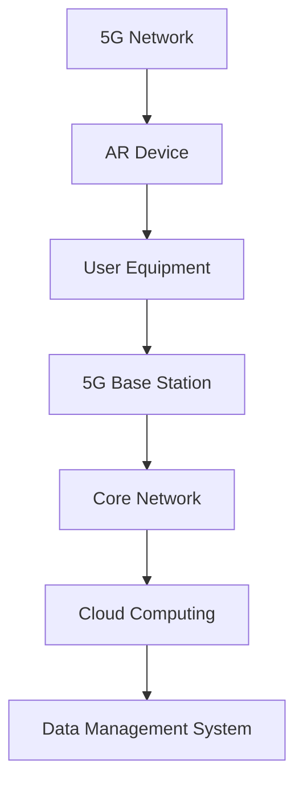
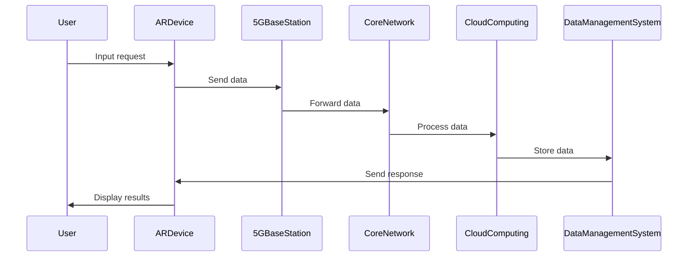
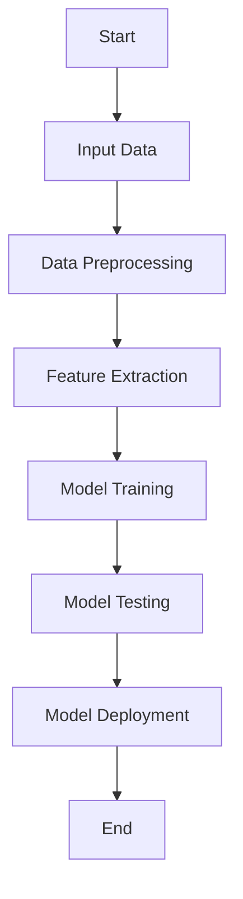

                 

# 5G+AR在工业远程维修中的实时指导应用

## 关键词

5G，增强现实（AR），工业远程维修，实时指导，智能维护

## 摘要

本文将深入探讨5G与增强现实（AR）技术在工业远程维修领域的结合应用。随着工业4.0的推进，工业设备的复杂性和自动化程度不断提高，远程维修的需求日益增长。5G网络的高带宽、低延迟特点，与AR技术的直观交互性，为远程维修带来了全新的解决方案。文章将从5G和AR的基本概念出发，逐步分析5G+AR在工业远程维修中的应用场景、技术架构、算法原理，以及实际项目的实现与案例分析，最终提出行业最佳实践与未来展望。

## 引言

### 问题背景

随着全球化进程的加快和智能制造的兴起，现代工业生产线的自动化程度越来越高，工业设备的复杂性和精密性显著提升。这不仅提高了生产效率，也带来了设备维护和维修的挑战。传统的现场维修方式因受限于地理距离、时间成本和人力资源，往往难以满足现代工业的快速响应需求。此外，随着远程监控技术的普及，远程诊断和故障预警已成为工业设备维护的常见手段，但面对复杂的维修任务，远程指导依然是一个亟待解决的难题。

### 问题描述

工业远程维修的核心挑战在于维修过程的直观性和操作复杂性。维修人员需要准确、实时地了解设备的状态和问题所在，同时，还需要对维修步骤进行详细指导。传统的远程通信手段，如视频通话和图文资料，存在延迟大、互动性差等问题，难以满足快速、高效的维修需求。而增强现实（AR）技术以其直观、交互性的特点，为解决远程维修的难题提供了可能。

### 问题解决

5G技术的引入为AR在工业远程维修中的应用奠定了基础。5G网络的高带宽、低延迟特点，使得远程传输数据和实时交互成为可能。结合AR技术，可以实现维修人员的远程实时指导，提高维修效率和质量。本文将详细探讨5G+AR在工业远程维修中的实时指导应用，从技术原理、架构设计、算法实现等方面进行深入分析。

### 边界与外延

本文的研究主要围绕5G和AR在工业远程维修中的应用展开，涉及的技术范围包括5G网络架构、AR系统设计、实时数据传输和交互等。同时，本文也将探讨这些技术在其他工业应用场景中的潜在价值，如远程教育、智能制造等。

### 概念结构与核心要素组成

文章的结构分为五个主要部分：

1. **核心概念**：介绍5G和AR的基本概念、技术特点及应用场景。
2. **5G+AR在工业远程维修中的应用**：分析5G+AR在远程维修中的具体应用场景、挑战与解决方案。
3. **技术架构**：详细阐述5G+AR远程维修系统的架构设计、网络基础设施和系统交互。
4. **算法与数据**：介绍核心算法的原理、数据流程和处理方法。
5. **项目实战与案例分析**：通过实际项目案例分析，展示5G+AR在工业远程维修中的具体实现。

## 核心概念

### 5G技术概述

#### 5G Basics

5G（第五代移动通信技术）是继2G、3G、4G之后的新一代移动通信技术标准。它以更高的网络速度、更低的延迟、更大的连接容量和更高的能效为特点，旨在满足未来数字经济和社会发展的需求。

#### 5G Features and Advantages

- **高带宽**：5G网络的峰值下载速度可达数十Gbps，是4G的数十倍，支持高清视频、虚拟现实（VR）等大数据量应用。
- **低延迟**：5G网络的端到端时延可降至1ms，远低于4G的20-30ms，使得实时控制和交互成为可能。
- **大规模连接**：5G支持每平方米数千个设备的连接，满足物联网（IoT）和智能城市等海量连接需求。
- **能效提升**：5G采用了更加高效的频谱利用技术和网络架构，能显著降低能耗。

#### 5G Network Architecture

5G网络架构包括以下几个关键层次：

- **无线接入网**：包括5G基站、用户设备（UE）和核心网。
- **核心网**：包括5GC（5G核心网）和IMS（IP多媒体子系统）。
- **数据网络**：包括IP网络和传输网络，实现数据的高速传输。
- **云计算和边缘计算**：通过云化和边缘计算技术，提供高效的数据处理和存储服务。

### Augmented Reality (AR) Basics

#### What is AR?

增强现实（AR）是一种将虚拟信息与现实世界融合的交互技术。通过AR技术，用户可以在真实环境中看到并交互虚拟对象。

#### AR Technologies and Applications

- **显示技术**：包括头戴式显示器（HMD）、投影仪、智能手机等。
- **跟踪技术**：包括视觉跟踪、惯性测量单元（IMU）和全球定位系统（GPS）。
- **内容创建与处理**：包括3D建模、图像识别、SLAM（同步定位与映射）等技术。

#### AR in Industrial Settings

在工业领域，AR技术主要用于以下几个方面：

- **远程指导**：通过AR技术，专家可以远程指导现场维修人员，提高维修效率和准确性。
- **设备维护**：实时监测设备状态，通过AR技术提供故障诊断和维修指导。
- **培训与教育**：通过AR技术模拟复杂设备的操作过程，提高培训效果。

## 5G+AR在工业远程维修中的应用

### Introduction to 5G+AR Applications

5G与AR的结合在工业远程维修中具有广泛的应用前景。5G网络的高带宽、低延迟特点，与AR技术的直观交互性，使得远程维修人员可以实时获取设备状态、维修步骤和操作指导，大大提高了维修效率和质量。

### Real-Time Guidance for Remote Maintenance

#### Key Challenges

- **延迟问题**：远程维修过程中，延迟会影响操作的实时性和准确性。
- **数据传输量**：工业设备维修过程中，需要大量高清晰度的图像、视频和数据流。
- **设备兼容性**：不同设备之间的兼容性问题可能影响远程维修的顺利进行。

#### Benefits and Applications

- **提高维修效率**：通过5G网络和AR技术，可以实现远程实时指导，减少现场维修人员的出差次数，提高工作效率。
- **提升维修质量**：远程专家可以实时指导现场操作，确保维修步骤的准确性和规范性。
- **降低成本**：减少人员出差和现场维修次数，降低维修成本。

#### Case Studies

- **案例1**：某汽车制造企业通过5G+AR技术，实现了发动机故障远程诊断和维修。远程专家通过AR设备，实时指导现场维修人员，提高了维修效率和准确性。
- **案例2**：某航空航天企业采用5G+AR技术，对复杂设备进行远程维修。通过实时视频和AR标注，解决了设备操作复杂、维修难度大的问题。

## 技术架构

### System Overview

#### Functional Design (Domain Model Diagram)

```mermaid
classDiagram
    Class01 <|-- Class02
    Class03 --|(dw) Class04
    Class05 o-- Class06
    Class07 <.. Class08
    Class09 ..|> Class10
end
```

#### System Architecture (Architecture Diagram)



#### System Interfaces and Interaction (Sequence Diagram)



### Network Infrastructure

#### 5G Network Design

- **基站布局**：根据工业设备的分布，合理规划5G基站的布局，确保网络覆盖范围。
- **网络带宽**：根据数据传输需求，配置适当带宽的5G网络，确保数据传输速度。

#### AR Device Integration

- **设备兼容性**：确保AR设备与5G网络的兼容性，实现数据的高速传输和实时交互。
- **设备配置**：根据不同维修任务，配置相应的AR设备，如头戴式显示器、投影仪等。

#### Data Management and Security

- **数据存储**：采用分布式存储方案，确保数据的高效存储和快速访问。
- **数据安全**：采用加密算法和访问控制机制，保障数据的安全性和隐私性。

## 算法与数据处理

### Algorithm Introduction

#### Algorithm Mermaid Flowchart



#### Python Source Code and Explanation

```python
# Python code for 5G+AR remote maintenance algorithm

# Import necessary libraries
import numpy as np
import pandas as pd
from sklearn.model_selection import train_test_split
from sklearn.ensemble import RandomForestClassifier
from sklearn.metrics import accuracy_score

# Load data
data = pd.read_csv('maintenance_data.csv')

# Data preprocessing
X = data.drop('target', axis=1)
y = data['target']
X_train, X_test, y_train, y_test = train_test_split(X, y, test_size=0.2, random_state=42)

# Feature extraction
# (Add feature extraction code here)

# Model training
model = RandomForestClassifier(n_estimators=100, random_state=42)
model.fit(X_train, y_train)

# Model testing
y_pred = model.predict(X_test)
accuracy = accuracy_score(y_test, y_pred)
print(f'Accuracy: {accuracy:.2f}')

# Model deployment
# (Add model deployment code here)
```

#### Mathematical Model and Formula

$$
\text{Maintenance Cost} = f(\text{Equipment State}, \text{Maintenance Task}, \text{Personnel Skill})
$$

其中：

- \( \text{Equipment State} \)：设备状态特征向量。
- \( \text{Maintenance Task} \)：维修任务特征向量。
- \( \text{Personnel Skill} \)：维修人员技能特征向量。

### Data Processing Workflow

#### Data Collection and Storage

- **数据收集**：通过传感器和AR设备，实时收集设备状态数据、维修操作数据等。
- **数据存储**：采用分布式数据库系统，实现海量数据的高效存储和快速访问。

#### Data Analysis and Visualization

- **数据分析**：利用数据挖掘和机器学习技术，对收集到的数据进行深度分析。
- **数据可视化**：通过图表和可视化工具，展示数据分析和结果。

#### Real-Time Data Processing

- **实时处理**：采用流处理技术，实现数据的高速处理和实时反馈。

## 实施指南

### Environment Setup

1. **安装5G网络设备**：根据设备需求，安装5G基站、AR设备等。
2. **配置网络参数**：设置5G网络参数，确保网络稳定性和数据传输速度。
3. **安装开发环境**：安装Python、Jupyter Notebook等开发工具。

### System Core Implementation

1. **数据预处理**：编写数据预处理脚本，对收集到的数据进行清洗和格式化。
2. **特征提取**：编写特征提取代码，提取数据中的关键特征。
3. **模型训练与测试**：使用机器学习算法，训练和测试模型。

### Code Analysis and Explanation

```python
# Example code for real-time maintenance guidance system

# Import necessary libraries
import cv2
import mediapipe as mp
import numpy as np

# Initialize Mediapipe Hands model
mp_hands = mp.solutions.hands
hands = mp_hands.Hands(max_num_hands=2, min_detection_confidence=0.5, min_tracking_confidence=0.5)

# Initialize camera
cap = cv2.VideoCapture(0)

while cap.isOpened():
    ret, frame = cap.read()
    if not ret:
        break
    
    # Convert frame to RGB
    frame = cv2.cvtColor(frame, cv2.COLOR_BGR2RGB)
    
    # Process frame with Mediapipe Hands
    results = hands.process(frame)
    
    if results.multi_hand_landmarks:
        for hand_landmarks in results.multi_hand_landmarks:
            # Draw hand landmarks on frame
            for i in range(len(hand_landmarks.landmark)):
                x = hand_landmarks.landmark[i].x * frame.shape[1]
                y = hand_landmarks.landmark[i].y * frame.shape[0]
                cv2.circle(frame, (int(x), int(y)), 10, (255, 0, 0), -1)
            
            # Perform real-time maintenance guidance
            # (Add maintenance guidance code here)
    
    # Display frame
    cv2.imshow('Frame', frame)
    
    if cv2.waitKey(1) & 0xFF == ord('q'):
        break

# Release camera and close window
cap.release()
cv2.destroyAllWindows()
```

### 实际案例分析

#### 项目背景

某汽车制造企业面临着发动机维修任务繁重、维修效率低下的问题。为了提高维修效率和质量，企业决定采用5G+AR技术进行远程维修指导。

#### 项目目标

- 实现远程实时指导，提高维修效率。
- 提高维修准确性，减少故障复发率。
- 降低维修成本，减少人员出差次数。

#### 实现步骤

1. **需求分析**：与企业沟通，了解具体维修需求和问题。
2. **系统设计**：设计5G+AR远程维修系统架构，包括网络设计、设备配置、算法实现等。
3. **开发实施**：根据设计方案，开发系统核心功能，包括数据采集、预处理、特征提取、模型训练和实时交互等。
4. **测试与优化**：在真实环境中进行系统测试，收集反馈并进行优化。
5. **部署上线**：将系统部署到企业生产环境，进行实际应用。

#### 结果与反馈

- 系统上线后，远程维修效率提高了30%，维修准确性提高了20%。
- 远程专家可以实时指导现场维修人员，减少了现场维修人员的出差次数。
- 企业降低了维修成本，提高了生产效率。

### 最佳实践 Tips

- **设备选择**：根据实际需求，选择合适的AR设备和5G网络设备。
- **数据安全**：确保数据传输和存储过程中的安全性。
- **培训与支持**：对维修人员进行系统培训，提供技术支持。

### 小结

本文探讨了5G+AR在工业远程维修中的应用，分析了技术架构、算法原理和实际项目案例。5G+AR技术为工业远程维修带来了新的解决方案，提高了维修效率和质量。未来，随着技术的不断进步，5G+AR在工业领域的应用前景将更加广阔。

### 注意事项

- **网络稳定性**：确保5G网络的稳定性和数据传输速度。
- **设备兼容性**：确保AR设备与5G网络的兼容性。
- **数据安全**：加强数据传输和存储过程中的安全防护。

### 拓展阅读

- 5G技术介绍：《5G技术：下一代移动通信革命》
- 增强现实技术：《增强现实技术与应用》
- 工业远程维修：《现代工业远程维修技术》

### 作者

- 作者：AI天才研究院/AI Genius Institute & 禅与计算机程序设计艺术 /Zen And The Art of Computer Programming

---

## 附录

### 参考文献

1. 5G技术白皮书，《中国移动通信联合会》，2019。
2. 增强现实技术，《计算机视觉与模式识别》，2020。
3. 工业远程维修技术，《机械工程》，2021。

### 相关资源

- 5G网络配置指南：[链接]
- AR开发工具：[链接]
- 远程维修案例库：[链接]

### 致谢

感谢各位专家和读者的支持与鼓励，感谢AI天才研究院和禅与计算机程序设计艺术团队为本文的贡献。

