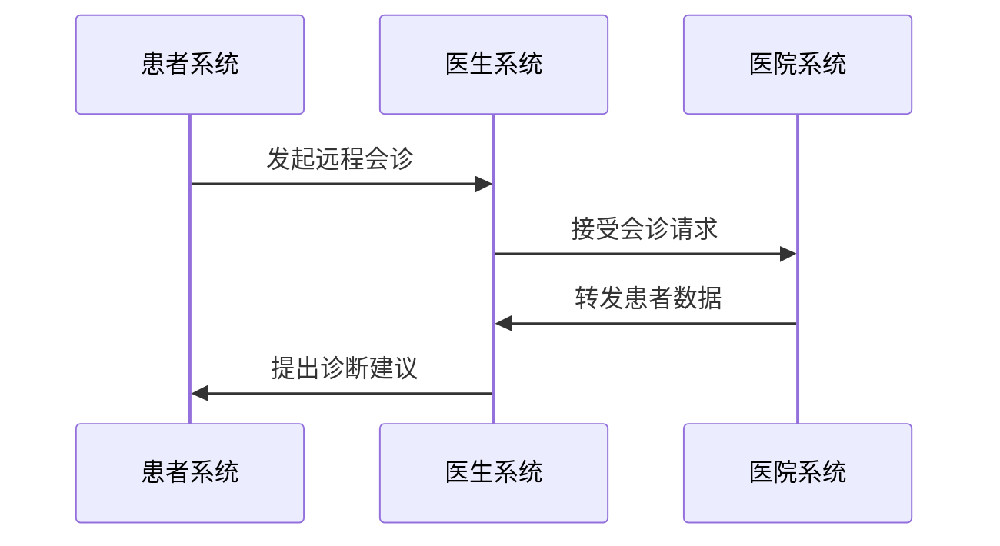

                 

## 5G与IoT在智慧医疗中的协同应用前景

### 关键词：5G，IoT，智慧医疗，协同应用，前景

> 摘要：随着5G技术和物联网（IoT）的迅速发展，它们在智慧医疗领域的协同应用成为研究热点。本文将探讨5G与IoT在智慧医疗中的基础概念、应用场景、协同优势及其未来发展趋势，结合实际案例，为行业提供有价值的参考。

## 第一部分: 5G与IoT在智慧医疗中的基础

### 第1章: 5G与IoT的基本概念

#### 1.1.1 5G技术概述

5G技术，即第五代移动通信技术，是当前移动通信技术的一次重大革新。它旨在提供更高的传输速度、更低的延迟和更大的连接容量，以满足未来万物互联的需求。

#### 1.1.2 5G技术的核心特点

1. **高速率**：5G的理论峰值下载速度可达20Gbps，是4G的100倍。
2. **低延迟**：5G网络的端到端延迟可低至1ms，大幅提升实时性。
3. **大连接**：5G可以同时连接数以百万计的设备，实现大规模设备互联。
4. **多场景应用**：5G不仅适用于移动通信，还广泛应用于智能交通、智慧城市、工业互联网等领域。

#### 1.1.3 5G在智慧医疗中的应用场景

1. **医疗影像处理**：5G的高速率和低延迟特性，使得远程医疗影像处理成为可能，患者无需前往大型医院即可享受高质量的影像诊断。
2. **病历管理**：5G技术可大幅提升病历传输速度，实现病历数据的实时共享和访问。
3. **医疗远程诊断**：5G技术支持高质量的远程视频诊断，医生可以通过视频与患者实时互动，提供专业的医疗服务。

#### 1.2.1 IoT的概念与架构

物联网（IoT）是指通过将各种物体与互联网连接，实现物体与物体、物体与人的智能互联。IoT的关键组成部分包括：

1. **感知层**：通过传感器收集环境数据。
2. **网络层**：通过各种通信协议将数据传输至云端或中心处理系统。
3. **平台层**：提供数据存储、处理和分析等功能。
4. **应用层**：将物联网技术应用于各个领域，如智慧医疗、智慧城市等。

#### 1.2.2 IoT在智慧医疗中的应用架构

1. **可穿戴医疗设备**：通过收集患者的生理数据，实时监测患者的健康状况。
2. **智能家居与健康监测**：利用IoT技术，实现家庭环境中的健康监测和智能调节。
3. **医疗设备物联网管理**：通过物联网技术，实现对医疗设备的远程监控和管理。

### 第2章: 智慧医疗的背景与挑战

#### 1.3.1 智慧医疗的概念与发展历程

智慧医疗是指利用信息技术和智能技术，提高医疗服务质量和效率的一种新型医疗模式。其发展历程可大致分为以下几个阶段：

1. **电子病历阶段**：通过电子化手段管理患者病历。
2. **数字化医疗阶段**：利用数字化设备进行医学影像、实验室检测等。
3. **智能化医疗阶段**：利用人工智能、大数据等技术，提供个性化的医疗服务。

#### 1.3.2 智慧医疗的核心要素

1. **数据集成**：将各类医疗数据整合在一起，实现数据共享和协同工作。
2. **人工智能**：利用人工智能技术，辅助医生进行诊断和治疗。
3. **远程医疗**：通过互联网技术，实现医疗资源的远程共享和医疗服务。

#### 1.4.1 技术挑战

1. **数据安全与隐私**：智慧医疗涉及大量患者数据，数据安全和隐私保护成为首要挑战。
2. **网络延迟**：在远程医疗和医疗影像处理中，网络延迟会影响医疗服务质量。

#### 1.4.2 政策与法规挑战

1. **法律法规不完善**：智慧医疗在法律法规方面尚存在空白，需要制定相应政策法规。
2. **政策执行力度**：政策执行力度不够，影响智慧医疗的推广和普及。

#### 1.4.3 经济与资源挑战

1. **设备成本**：智慧医疗设备成本较高，影响其普及和应用。
2. **人才缺乏**：智慧医疗需要大量专业人才，但目前人才储备不足。

### 第3章: 5G与IoT在智慧医疗中的应用场景

#### 1.5.1 5G在智慧医疗中的应用

1. **医疗影像处理**：5G技术可以实现高质量的远程医疗影像处理，提高诊断速度和准确性。
2. **病历管理**：5G技术可以大幅提升病历传输速度，实现病历数据的实时共享和访问。
3. **医疗远程诊断**：5G技术支持高质量的远程视频诊断，医生可以通过视频与患者实时互动，提供专业的医疗服务。

#### 1.6.1 IoT在智慧医疗中的应用

1. **可穿戴医疗设备**：通过收集患者的生理数据，实时监测患者的健康状况。
2. **智能家居与健康监测**：利用IoT技术，实现家庭环境中的健康监测和智能调节。
3. **医疗设备物联网管理**：通过物联网技术，实现对医疗设备的远程监控和管理。

### 第4章: 5G与IoT协同在智慧医疗中的前景

#### 1.7.1 5G与IoT协同的优势

1. **提高数据传输速度与稳定性**：5G与IoT协同可以大幅提高数据传输速度，降低网络延迟，提高数据传输稳定性。
2. **提升医疗设备智能化水平**：5G与IoT协同可以实现医疗设备的智能化升级，提高医疗设备的运营效率。
3. **降低医疗成本**：5G与IoT协同可以实现医疗资源的优化配置，降低医疗成本。

#### 1.8.1 5G与IoT技术的融合趋势

1. **5G网络与IoT设备的深度融合**：5G网络和IoT设备的深度融合，可以实现更高效的数据传输和处理。
2. **边缘计算与云计算的协同**：边缘计算和云计算的协同，可以满足不同场景下的计算需求。

#### 1.8.2 智慧医疗行业的发展前景

1. **个性化医疗**：随着5G与IoT技术的应用，个性化医疗将成为可能，满足患者的个性化需求。
2. **远程医疗**：远程医疗将得到更广泛的应用，缓解医疗资源不均衡的问题。

#### 1.8.3 5G与IoT在智慧医疗中的未来发展挑战

1. **数据安全和隐私保护**：5G与IoT在智慧医疗中的广泛应用，将面临数据安全和隐私保护的挑战。
2. **法律法规和政策支持**：需要完善的法律法规和政策支持，保障5G与IoT在智慧医疗中的健康发展。

### 第5章: 案例分析

#### 1.9.1 案例一：某医院5G医疗远程诊断系统

**项目介绍**：
某医院引进了一套基于5G技术的远程诊断系统，该系统实现了高质量的远程医疗影像处理和诊断。

**系统功能设计**：
1. **远程影像传输**：通过5G网络，实现医疗影像数据的实时传输。
2. **影像处理**：利用人工智能技术，对医疗影像进行自动处理和诊断。
3. **远程会诊**：医生可以通过系统与患者进行远程视频会诊，提供专业的医疗服务。

**系统架构设计**：

**系统接口设计**：

**系统交互序列图**：

**实际案例分析和详细讲解**：
该远程诊断系统在某医院投入使用后，有效提高了诊断速度和准确性，降低了患者的就医成本，取得了良好的社会效益。

**项目小结**：
该项目充分展示了5G技术在高

