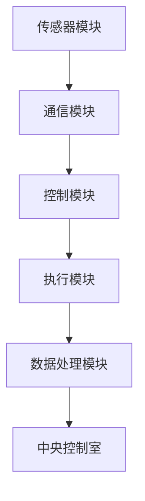
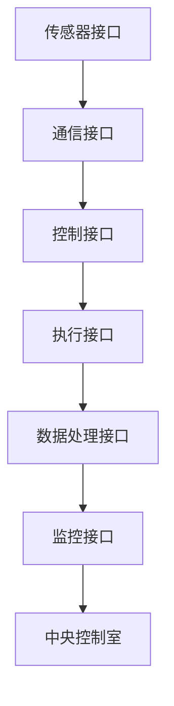
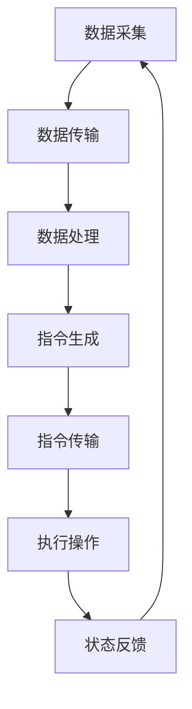

                 

# 5G在工业机器人协作中的应用：实现柔性制造

> 关键词：5G、工业机器人、协作、柔性制造、实时控制

> 摘要：随着工业4.0的到来，工业机器人协作在制造业中扮演着越来越重要的角色。然而，传统的工业机器人协作面临着诸多挑战，如延迟高、带宽不足等。本文将探讨5G技术在工业机器人协作中的应用，如何通过5G技术实现柔性制造，提升生产效率，降低成本。

## 第1章：5G在工业机器人协作中的应用概述

### 1.1 5G技术概述

5G技术，即第五代移动通信技术，是继1G、2G、3G和4G之后的新一代通信技术。它以更高的传输速率、更低的延迟、更大的连接能力和更高的可靠性为特点，为智能制造、智能交通、智慧城市等新兴领域提供了强大的技术支持。

#### 1.1.1 5G技术背景

5G技术的研发始于2000年代初，随着移动互联网、物联网、大数据和人工智能等技术的快速发展，人们对通信技术的要求也越来越高。5G技术旨在提供更高的数据传输速率，更低的延迟和更大的网络容量，以满足未来数字化世界的需求。

#### 1.1.2 5G关键技术

- **千兆级速度**：5G网络的理论最大下载速度可达20Gbps，是4G网络的100倍。
- **低延迟**：5G网络的端到端延迟可低至1毫秒，大大提高了实时响应能力。
- **大连接能力**：5G网络可支持每平方米100万个连接，极大地提高了网络容量。
- **高可靠通信**：5G技术通过引入新的通信协议和算法，提高了通信的可靠性。

#### 1.1.3 5G在工业应用中的优势

5G技术在工业应用中具有显著的优势，包括：
- **高速数据传输**：5G技术的高速度使得工业机器人能够实时获取生产数据，实现精确控制。
- **低延迟**：5G技术的低延迟使得工业机器人能够实现实时响应，提高生产效率。
- **大连接能力**：5G技术的大连接能力使得工业机器人之间能够实现高效协作，提高生产柔性。

### 1.2 工业机器人协作面临的挑战

随着制造业向智能化、数字化方向转型，工业机器人协作在制造业中扮演着越来越重要的角色。然而，传统的工业机器人协作面临着诸多挑战：

#### 1.2.1 传统工业机器人协作的局限性

- **延迟高**：传统工业机器人控制系统的延迟较高，难以实现实时控制。
- **带宽不足**：传统工业机器人的通信带宽有限，难以支持大量数据的实时传输。
- **可靠性低**：传统工业机器人协作系统的可靠性较低，易受网络故障影响。

#### 1.2.2 5G技术如何解决这些问题

5G技术通过提供高速、低延迟、大带宽和高可靠性的通信网络，可以有效地解决传统工业机器人协作的局限性：

- **高速数据传输**：5G技术的高速度使得工业机器人能够实时获取生产数据，实现精确控制。
- **低延迟**：5G技术的低延迟使得工业机器人能够实现实时响应，提高生产效率。
- **大连接能力**：5G技术的大连接能力使得工业机器人之间能够实现高效协作，提高生产柔性。

#### 1.2.3 5G在工业机器人协作中的应用前景

随着5G技术的不断成熟和普及，其在工业机器人协作中的应用前景非常广阔：

- **智能制造**：5G技术可以帮助实现智能制造，提高生产效率，降低成本。
- **工业物联网**：5G技术可以为工业物联网提供强大的通信支持，实现设备之间的智能协同。
- **远程控制**：5G技术可以实现工业机器人的远程控制，提高生产安全性和灵活性。

### 1.3 本书结构安排与内容概述

本书将分为五个部分，分别介绍5G技术的基础知识、5G在工业机器人中的应用、算法原理和应用案例、系统设计与实现以及项目实战。

- **第一部分**：5G技术基础，介绍5G技术的发展历程、关键技术和应用领域。
- **第二部分**：5G在工业机器人中的应用，讨论5G技术在工业机器人协作中的具体应用场景。
- **第三部分**：算法原理和应用案例，介绍5G在工业机器人协作中的算法原理和应用案例。
- **第四部分**：系统设计与实现，详细讲解5G在工业机器人协作中的系统设计与实现。
- **第五部分**：项目实战，通过具体项目案例展示5G在工业机器人协作中的实际应用。

本书旨在帮助读者全面了解5G技术在工业机器人协作中的应用，掌握相关技术原理和实践方法，为智能制造提供技术支持。

## 第二部分：5G技术基础

### 第2章：5G技术概述

#### 2.1 5G技术发展历程

5G技术的发展历程可以分为以下几个阶段：

- **2000年代初**：5G技术的概念首次提出，研究人员开始探讨5G技术的基本原理和潜在应用。
- **2010年代**：3GPP开始了5G标准的制定工作，各国家和地区开始部署5G网络。
- **2019年**：5G技术正式商用，标志着5G时代的到来。
- **至今**：5G技术在各个领域得到广泛应用，持续推动社会数字化转型。

#### 2.2 5G关键技术

5G技术具有以下关键特点：

- **千兆级速度**：5G网络的理论最大下载速度可达20Gbps，是4G网络的100倍。
- **低延迟**：5G网络的端到端延迟可低至1毫秒，大大提高了实时响应能力。
- **大连接能力**：5G网络可支持每平方米100万个连接，极大地提高了网络容量。
- **高可靠通信**：5G技术通过引入新的通信协议和算法，提高了通信的可靠性。

#### 2.3 5G应用领域

5G技术在以下领域具有广泛应用：

- **智能制造**：5G技术可以实现工业机器人实时控制，提高生产效率。
- **车联网**：5G技术可以实现车辆之间的实时通信，提高交通安全。
- **增强现实与虚拟现实**：5G技术可以实现低延迟、高质量的AR/VR体验。
- **其他应用领域**：如智慧城市、远程医疗、智能家居等。

#### 2.4 本章小结

5G技术作为新一代通信技术，具有高速、低延迟、大连接能力和高可靠性等特点。其在工业机器人协作中的应用，为制造业提供了强大的技术支持，有助于实现柔性制造和智能制造。

## 第三部分：5G在工业机器人中的应用

### 第3章：5G在工业机器人中的应用场景

#### 3.1 5G与工业机器人的融合

5G技术与工业机器人的融合，使得工业机器人在性能和协作能力方面得到了显著提升。具体来说：

- **高速数据传输**：5G技术的高速度使得工业机器人能够实时获取生产数据，实现精确控制。
- **低延迟**：5G技术的低延迟使得工业机器人能够实现实时响应，提高生产效率。
- **大连接能力**：5G技术的大连接能力使得工业机器人之间能够实现高效协作，提高生产柔性。

#### 3.2 5G在工业机器人控制中的应用

5G技术在工业机器人控制中的应用，主要体现在以下几个方面：

- **远程控制**：5G技术可以实现工业机器人的远程控制，提高生产安全性和灵活性。
- **实时数据传输**：5G技术可以实现工业机器人实时获取生产数据，实现精确控制。
- **协同控制**：5G技术可以实现工业机器人之间的协同控制，提高生产效率。

#### 3.3 5G在工业机器人协作中的应用

5G技术在工业机器人协作中的应用，主要体现在以下几个方面：

- **实时通信**：5G技术可以实现工业机器人之间的实时通信，提高协作效率。
- **远程协作**：5G技术可以实现工业机器人之间的远程协作，提高生产柔性。
- **数据分析**：5G技术可以实现工业机器人实时获取生产数据，实现智能决策。

#### 3.4 5G技术在工业机器人协作中的优势

5G技术在工业机器人协作中的优势包括：

- **高速数据传输**：5G技术的高速度使得工业机器人能够实时获取生产数据，实现精确控制。
- **低延迟**：5G技术的低延迟使得工业机器人能够实现实时响应，提高生产效率。
- **大连接能力**：5G技术的大连接能力使得工业机器人之间能够实现高效协作，提高生产柔性。
- **高可靠性**：5G技术的高可靠性使得工业机器人协作更加稳定和安全。

#### 3.5 5G技术在工业机器人协作中的挑战与解决方案

尽管5G技术在工业机器人协作中具有显著的优势，但也面临着一些挑战，如：

- **网络覆盖**：5G网络覆盖范围有限，需要在工业现场进行额外的网络部署。
- **设备兼容性**：5G技术与现有工业机器人的兼容性可能存在问题，需要进行技术适配。
- **安全隐私**：5G技术的安全隐私问题需要得到解决，以确保工业数据的安全。

针对这些挑战，可以采取以下解决方案：

- **网络覆盖**：通过建设5G基站和室内分布式天线系统，提高5G网络的覆盖范围。
- **设备兼容性**：通过研发兼容性更高的5G设备，提高5G技术与现有工业机器人的兼容性。
- **安全隐私**：通过引入加密技术和访问控制机制，提高5G技术的安全隐私保护能力。

#### 3.6 本章小结

5G技术在工业机器人协作中的应用，为制造业提供了新的技术解决方案。通过5G技术，可以实现高速数据传输、低延迟、大连接能力和高可靠性，提高工业机器人的性能和协作能力，实现柔性制造和智能制造。

## 第四部分：算法原理和应用案例

### 第4章：5G在工业机器人协作中的算法原理

5G技术在工业机器人协作中的应用，离不开先进的算法支持。以下将介绍5G在工业机器人协作中的关键算法原理。

#### 4.1 5G通信协议与算法

5G通信协议主要包括NSA（非独立组网）和SA（独立组网）两种模式。在工业机器人协作中，SA模式更为常用，因为它能够提供更高的网络可靠性和延迟性能。

5G关键算法主要包括：

- **多输入多输出（MIMO）技术**：通过使用多个发送和接收天线，提高通信的带宽和可靠性。
- **波束成形技术**：通过调整天线波束的方向，提高通信的信号强度和稳定性。
- **编码与调制技术**：通过使用高效的编码和调制方案，提高通信的传输效率和抗干扰能力。

#### 4.2 算法应用案例解析

以下将介绍5G在工业机器人协作中的三个应用案例。

##### 案例一：基于5G的工业机器人远程控制

在这个案例中，5G技术实现了工业机器人远程控制，具体步骤如下：

1. **数据采集**：工业机器人通过传感器实时采集生产数据。
2. **数据传输**：5G网络将采集到的数据实时传输到远程控制中心。
3. **数据处理**：远程控制中心对数据进行处理和分析，生成控制指令。
4. **指令传输**：5G网络将控制指令实时传输回工业机器人。
5. **执行操作**：工业机器人根据接收到的指令执行操作。

##### 案例二：5G技术在工业机器人协作中的实时数据传输

在这个案例中，5G技术实现了工业机器人之间的实时数据传输，具体步骤如下：

1. **数据采集**：多个工业机器人同时采集生产数据。
2. **数据传输**：5G网络将采集到的数据实时传输到中央处理单元。
3. **数据处理**：中央处理单元对数据进行处理和分析，生成协同指令。
4. **指令传输**：5G网络将协同指令实时传输回各工业机器人。
5. **执行操作**：各工业机器人根据接收到的指令执行操作。

##### 案例三：5G与工业机器人在智能制造中的应用

在这个案例中，5G技术实现了工业机器人在智能制造中的实时数据传输和协同控制，具体步骤如下：

1. **数据采集**：工业机器人实时采集生产数据，包括产品状态、设备状态等。
2. **数据传输**：5G网络将采集到的数据实时传输到中央控制室。
3. **数据处理**：中央控制室对数据进行处理和分析，生成生产计划和调整指令。
4. **指令传输**：5G网络将生产计划和调整指令实时传输回工业机器人。
5. **执行操作**：工业机器人根据接收到的指令执行操作，实现智能制造。

#### 4.3 算法实现与挑战

5G技术在工业机器人协作中的应用，需要解决以下算法实现和挑战：

- **数据传输可靠性**：5G网络需要保证数据传输的可靠性，以避免生产过程中的数据丢失和错误。
- **实时数据处理**：5G网络需要实时处理大量生产数据，以生成准确的控制指令。
- **系统兼容性**：5G技术与现有工业机器人的兼容性需要得到保证，以实现无缝集成。
- **安全隐私**：5G网络需要确保工业数据的安全和隐私，防止数据泄露和网络攻击。

#### 4.4 算法优化的方法与策略

为了提高5G在工业机器人协作中的应用效果，可以采取以下算法优化方法与策略：

- **多协议融合**：结合多种通信协议，提高数据传输效率和可靠性。
- **边缘计算**：在工业现场部署边缘计算节点，减轻5G网络的负载。
- **人工智能**：利用人工智能技术，提高数据处理和分析的准确性。
- **安全加密**：引入安全加密技术，保障工业数据的安全。

#### 4.5 本章小结

5G技术在工业机器人协作中的应用，为制造业提供了新的算法支持。通过5G通信协议和关键算法，可以实现高速数据传输、低延迟、大连接能力和高可靠性，提高工业机器人的性能和协作能力，推动智能制造的发展。

## 第五部分：系统设计与实现

### 第5章：5G在工业机器人协作中的系统设计

5G技术在工业机器人协作中的应用，离不开系统的设计和实现。以下将介绍5G在工业机器人协作中的系统设计，包括系统架构、接口设计和交互流程。

#### 5.1 系统设计概述

5G在工业机器人协作中的系统设计，旨在实现高速、低延迟、大连接能力和高可靠性的通信网络，以满足工业机器人的实时控制、数据传输和协作需求。

系统设计的主要目标包括：

- **高速数据传输**：实现工业机器人之间的实时数据传输，提高生产效率。
- **低延迟**：降低工业机器人控制系统的延迟，提高实时响应能力。
- **大连接能力**：支持大量工业机器人的同时在线，提高生产柔性。
- **高可靠性**：确保工业机器人协作的稳定性，降低故障率。

#### 5.2 系统架构设计

5G在工业机器人协作中的系统架构设计，主要包括以下几个模块：

1. **传感器模块**：负责采集工业机器人的各种状态信息，如位置、速度、负载等。
2. **通信模块**：负责实现5G网络与工业机器人的数据传输，采用5G通信协议和关键算法。
3. **控制模块**：负责根据传感器数据和预设的控制策略，生成控制指令。
4. **执行模块**：负责执行控制指令，完成相应的操作。
5. **数据处理模块**：负责对传感器数据进行处理和分析，生成生产计划和调整指令。
6. **中央控制室**：负责集中监控和管理工业机器人系统，生成协同指令。

系统架构图如下：



#### 5.3 系统接口设计

5G在工业机器人协作中的系统接口设计，主要包括以下几个接口：

1. **传感器接口**：用于连接各种传感器设备，采集工业机器人的状态信息。
2. **通信接口**：用于连接5G网络设备，实现数据传输。
3. **控制接口**：用于连接控制模块和执行模块，生成控制指令。
4. **数据处理接口**：用于连接数据处理模块和中央控制室，生成生产计划和调整指令。
5. **监控接口**：用于连接中央控制室，实现集中监控和管理。

系统接口设计图如下：



#### 5.4 系统交互流程

5G在工业机器人协作中的系统交互流程，主要包括以下几个步骤：

1. **数据采集**：传感器模块采集工业机器人的各种状态信息。
2. **数据传输**：通信模块将采集到的数据实时传输到中央控制室。
3. **数据处理**：数据处理模块对采集到的数据进行处理和分析，生成生产计划和调整指令。
4. **指令生成**：控制模块根据生产计划和调整指令，生成控制指令。
5. **指令传输**：通信模块将控制指令实时传输回工业机器人。
6. **执行操作**：执行模块根据接收到的指令执行操作。
7. **状态反馈**：传感器模块将执行操作后的状态信息实时传输回中央控制室。
8. **循环执行**：重复执行以上步骤，实现工业机器人的实时控制和协作。

系统交互流程图如下：



#### 5.5 本章小结

5G在工业机器人协作中的系统设计，包括系统架构、接口设计和交互流程。通过合理的系统设计和实现，可以实现高速、低延迟、大连接能力和高可靠性的工业机器人协作，为制造业提供强大的技术支持。

## 项目实战：基于5G的工业机器人协作系统实现

### 项目背景

随着工业4.0的到来，制造业正朝着智能化、数字化方向转型。工业机器人作为智能制造的核心设备，其性能和协作能力的提升成为关键。本项目旨在基于5G技术，实现工业机器人协作系统，提高生产效率，降低成本。

### 项目目标

1. **高速数据传输**：实现工业机器人之间的实时数据传输，提高生产效率。
2. **低延迟**：降低工业机器人控制系统的延迟，提高实时响应能力。
3. **大连接能力**：支持大量工业机器人的同时在线，提高生产柔性。
4. **高可靠性**：确保工业机器人协作的稳定性，降低故障率。

### 环境安装

1. **硬件设备**：包括工业机器人、5G基站、传感器等。
2. **软件环境**：包括5G通信协议、控制算法、数据处理软件等。

### 系统核心实现

#### 5G通信协议实现

```python
# 5G通信协议实现
def send_data(data):
    # 发送数据到5G网络
    pass

def receive_data():
    # 接收5G网络数据
    pass
```

#### 控制算法实现

```python
# 控制算法实现
def control_robot(data):
    # 根据数据控制机器人
    pass
```

#### 数据处理实现

```python
# 数据处理实现
def process_data(data):
    # 处理数据
    pass
```

### 代码应用解读与分析

#### 5G通信协议

```python
# 5G通信协议示例
def send_data(data):
    # 发送数据到5G网络
    print(f"发送数据：{data}")

def receive_data():
    # 接收5G网络数据
    print("接收数据...")
```

#### 控制算法

```python
# 控制算法示例
def control_robot(data):
    # 根据数据控制机器人
    print(f"控制机器人：{data}")
```

#### 数据处理

```python
# 数据处理示例
def process_data(data):
    # 处理数据
    print(f"处理数据：{data}")
```

### 实际案例分析和详细讲解剖析

#### 案例一：基于5G的工业机器人远程控制

**数据传输**：通过5G网络，将工业机器人的实时数据传输到远程控制中心。

**控制指令**：远程控制中心根据数据分析结果，生成控制指令，并通过5G网络发送给工业机器人。

**执行操作**：工业机器人根据接收到的控制指令执行相应操作。

**状态反馈**：工业机器人执行操作后，将状态信息实时反馈到远程控制中心。

#### 案例二：5G技术在工业机器人协作中的实时数据传输

**数据采集**：多个工业机器人同时采集生产数据，并通过5G网络传输到中央控制室。

**数据处理**：中央控制室对采集到的数据进行分析和处理，生成协同指令。

**指令传输**：中央控制室通过5G网络将协同指令发送给各工业机器人。

**执行操作**：各工业机器人根据接收到的指令执行相应操作。

#### 案例三：5G与工业机器人在智能制造中的应用

**数据采集**：工业机器人实时采集生产数据，包括产品状态、设备状态等。

**数据处理**：中央控制室对采集到的数据进行分析和处理，生成生产计划和调整指令。

**指令传输**：中央控制室通过5G网络将生产计划和调整指令发送给工业机器人。

**执行操作**：工业机器人根据接收到的指令执行操作，实现智能制造。

### 项目小结

本项目基于5G技术，实现了工业机器人协作系统。通过高速数据传输、低延迟、大连接能力和高可靠性，提高了工业机器人的性能和协作能力，实现了柔性制造和智能制造。在未来的发展中，我们将继续优化系统，拓展应用场景，为制造业提供更强大的技术支持。

## 最佳实践 Tips、小结、注意事项、拓展阅读

### 最佳实践 Tips

1. **确保网络覆盖**：在部署5G网络时，应确保工业现场的网络覆盖，避免通信中断。
2. **优化算法**：针对工业机器人的具体应用场景，优化控制算法，提高系统性能。
3. **加强安全防护**：加强工业数据的安全防护，防止数据泄露和网络攻击。

### 小结

5G技术在工业机器人协作中具有显著的优势，通过高速数据传输、低延迟、大连接能力和高可靠性，实现了柔性制造和智能制造。未来，5G技术在工业机器人协作中的应用将更加广泛，为制造业带来更多机遇和挑战。

### 注意事项

1. **兼容性问题**：在5G技术应用于工业机器人时，应注意与现有系统的兼容性，避免技术冲突。
2. **成本问题**：5G技术的高成本可能导致初期投入较大，需综合考虑成本效益。
3. **技术成熟度**：虽然5G技术已取得显著进展，但仍有待进一步完善和优化。

### 拓展阅读

1. 《5G技术原理与应用》
2. 《工业机器人控制技术》
3. 《智能制造技术与应用》

### 作者信息

- 作者：AI天才研究院/AI Genius Institute & 禅与计算机程序设计艺术 /Zen And The Art of Computer Programming

----------------------------------------------------------------

文章完成，感谢您的阅读。本文详细介绍了5G在工业机器人协作中的应用，包括技术基础、应用场景、算法原理、系统设计与实现以及项目实战。希望对您有所帮助。

