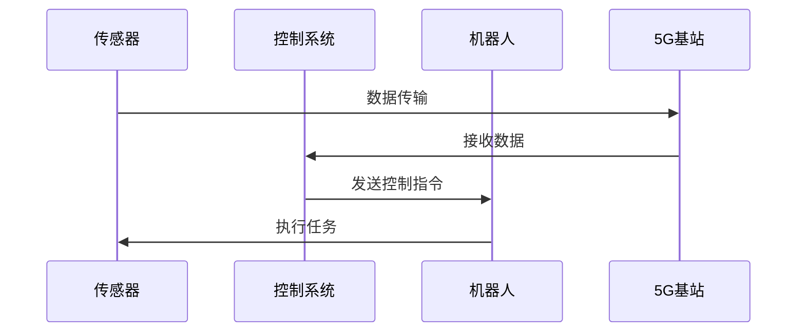

                 


### # 第1章: 5G网络与工业机器人协作背景介绍

> **摘要**：本章将介绍5G网络和工业机器人协作的背景，包括5G网络的发展历程、关键技术、特点和优势，以及工业机器人协作的现状、应用场景和面临的挑战。

#### **1.1 5G网络概述**

**1.1.1 5G网络的发展历程**

5G（第五代移动通信技术）的诞生是通信行业的一个重要里程碑。它的研究和发展可以追溯到20世纪80年代。以下是5G网络发展历程的关键节点：

- **1980年代**：2G网络问世，实现了语音通信和数据传输。
- **2000年代**：3G网络引入，支持更高的数据传输速度和多媒体服务。
- **2010年代**：4G网络普及，提供了更快的下载速度和更广泛的覆盖范围。
- **2020年代**：5G网络开始商用部署，标志着移动通信技术的又一次飞跃。

**1.1.2 5G网络的关键技术**

5G网络的关键技术包括：

- **新无线电（NR）**：是5G的核心无线接入技术，支持更高的频谱效率和更低的延迟。
- **网络切片（Network Slicing）**：通过虚拟化技术，将网络资源动态分配给不同的应用，提供定制化的服务。
- **大规模MIMO（Massive MIMO）**：使用多个天线实现空间复用，提高网络容量和频谱效率。
- **边缘计算（Edge Computing）**：将计算能力从云端下放到网络边缘，降低延迟并提高响应速度。

**1.1.3 5G网络的特点与优势**

5G网络的特点和优势如下：

- **低延迟**：5G网络将延迟降低到1毫秒以下，为实时应用提供了可能。
- **高带宽**：5G网络提供更高的数据传输速度，支持高清视频、虚拟现实等大带宽应用。
- **大连接**：5G网络支持数百万设备同时连接，为物联网（IoT）应用提供基础。
- **网络切片**：根据不同应用需求，提供定制化的网络服务，提高网络资源利用率。

#### **1.2 工业机器人协作现状**

**1.2.1 工业机器人协作的定义与发展**

工业机器人协作是指工业机器人在人机交互环境中，与人类工作人员协同工作，共同完成生产任务的过程。随着工业4.0和智能制造的推进，工业机器人协作成为提高生产效率和灵活性的一种重要方式。

- **1980年代**：工业机器人开始应用于生产线，实现自动化生产。
- **1990年代**：协作机器人（Cobots）问世，可以与人类工作人员安全共处。
- **2000年代**：机器视觉和传感器技术提高，工业机器人协作更加智能化。
- **2010年代**：人工智能和大数据技术引入，工业机器人协作实现自主决策。

**1.2.2 工业机器人协作的应用场景**

工业机器人协作的应用场景包括：

- **生产线自动化**：工业机器人在生产线上的装配、焊接、搬运等操作，提高生产效率。
- **仓储物流**：工业机器人在仓库中的搬运、分类、盘点等操作，提高物流效率。
- **医疗辅助**：工业机器人在手术、康复等医疗场景中的辅助操作，提高医疗质量。
- **智能制造**：工业机器人在智能工厂中的协同工作，实现制造过程的智能化。

**1.2.3 工业机器人协作面临的挑战**

工业机器人协作面临的挑战包括：

- **安全性**：人机协作需要确保人类工作人员的安全，避免意外伤害。
- **可靠性**：工业机器人的稳定运行是协作的基础，需要提高其可靠性和鲁棒性。
- **智能化**：工业机器人需要具备更高的智能化水平，实现自主决策和自适应。
- **兼容性**：不同工业机器人系统和平台之间的兼容性问题，需要解决互操作性问题。

#### **1.3 5G网络在工业机器人协作中的应用**

**1.3.1 5G网络在工业机器人协作中的作用**

5G网络在工业机器人协作中发挥着关键作用，主要体现在：

- **低延迟**：5G网络的低延迟特性，使工业机器人能够实时响应，提高协同工作的效率。
- **高带宽**：5G网络的高带宽特性，支持工业机器人传输大量数据，实现高清视频、图像等实时传输。
- **大连接**：5G网络的大连接特性，支持海量设备的连接，实现工业物联网（IIoT）的广泛应用。
- **网络切片**：5G网络切片技术，可以根据不同的应用需求，为工业机器人协作提供定制化的网络服务。

**1.3.2 5G网络对工业机器人协作的影响**

5G网络对工业机器人协作的影响主要表现在：

- **生产效率**：5G网络的低延迟和高带宽特性，可以显著提高工业机器人的工作效率和灵活性。
- **智能化水平**：5G网络提供的实时数据传输能力，使工业机器人可以实现更高层次的智能化。
- **安全性**：5G网络的安全特性，可以提高工业机器人协作的安全性，降低人机交互的风险。
- **新应用场景**：5G网络的特性，可以开拓工业机器人协作的新应用场景，如远程操作、自动驾驶等。

**1.3.3 5G网络在工业机器人协作中的应用前景**

随着5G网络的商用部署，其在工业机器人协作中的应用前景广阔。未来，5G网络有望在以下几个方面推动工业机器人协作的发展：

- **智能制造**：5G网络支持智能制造，可以实现生产过程的智能化、自动化。
- **工业物联网**：5G网络支持工业物联网，可以实现设备之间的高效连接和数据交换。
- **远程控制**：5G网络可以实现远程控制，提高工业机器人协作的灵活性和便捷性。
- **智能服务**：5G网络支持智能服务，可以开拓工业机器人协作的新服务模式。

#### **1.4 本书结构安排**

**1.4.1 本书的目的与读者对象**

本书旨在深入探讨5G网络在工业机器人协作中的应用，为读者提供全面的技术指导和实践案例。本书适合从事工业机器人研究、应用和开发的工程师、研究人员以及相关领域的学者。

**1.4.2 本书的内容结构**

本书分为四个部分，共四 chapters。第一部分介绍5G网络和工业机器人协作的背景，包括发展历程、关键技术、特点和挑战。第二部分详细讲解5G网络的关键技术，如新无线电、网络切片、大规模MIMO和边缘计算。第三部分通过案例研究，展示5G网络在工业机器人协作中的应用实践。第四部分探讨5G网络在工业机器人协作中的应用前景和挑战。

**1.4.3 学习建议与收获**

为了更好地学习本书，建议读者：

- **理解基础知识**：掌握5G网络和工业机器人协作的基本概念和原理。
- **实践应用**：通过案例研究，了解5G网络在工业机器人协作中的实际应用。
- **深入思考**：思考5G网络对工业机器人协作的影响和前景，提出自己的见解。

通过学习本书，读者可以：

- **提升技术能力**：掌握5G网络和工业机器人协作的核心技术。
- **拓宽视野**：了解5G网络在工业机器人协作中的最新发展和应用趋势。
- **解决实际问题**：运用所学知识，解决实际工作中的技术难题。

#### **1.5 本章小结**

本章介绍了5G网络和工业机器人协作的背景，包括5G网络的发展历程、关键技术、特点和优势，以及工业机器人协作的现状、应用场景和面临的挑战。通过本章的学习，读者可以初步了解5G网络和工业机器人协作的关系，为后续章节的学习打下基础。

----------------------------------------------------------------

### # 第2章: 5G网络关键特性与协议

> **摘要**：本章将详细讲解5G网络的关键特性，包括低延迟、高带宽、大连接和网络切片。同时，将介绍5G网络的主要协议，如NR（新无线电）协议、NG-RAN（新无线接入网络）架构和5G核心网络协议栈。

#### **2.1 5G网络关键特性**

**2.1.1 低延迟**

低延迟是5G网络的核心特性之一。与4G网络相比，5G网络的延迟显著降低，旨在实现实时通信。5G网络的低延迟主要由以下几个因素实现：

- **新无线电（NR）协议**：NR协议采用了新的调制和编码技术，提高了频谱效率和信号传输速度。
- **网络架构优化**：5G网络采用了分布式架构，通过边缘计算将部分计算任务下放到网络边缘，减少了数据传输的延迟。
- **多接入技术**：5G网络支持多种接入技术，如NR和eMBB（增强型移动宽带），提供了更高的带宽和更低的延迟。

**2.1.2 高带宽**

5G网络的高带宽特性使得它能够支持更多的数据传输和更广泛的应用。5G网络的高带宽主要由以下因素实现：

- **大规模MIMO（Massive MIMO）**：大规模MIMO技术通过使用多个天线，实现了空间复用，提高了频谱效率和数据传输速度。
- **高频段频谱利用**：5G网络在高频段频谱（如毫米波频段）上进行了大规模部署，提供了更大的带宽资源。
- **网络切片**：网络切片技术可以根据不同的应用需求，为不同的服务提供定制化的带宽资源，提高了整体网络的带宽利用率。

**2.1.3 大连接**

5G网络的大连接特性使得它能够支持更多的设备同时连接，为物联网（IoT）应用提供了基础。5G网络的大连接特性主要由以下因素实现：

- **eMBB（增强型移动宽带）**：eMBB技术通过提高频谱效率和信号传输速度，实现了更多的设备连接。
- **MTC（机器类型通信）**：MTC技术支持大量机器类型设备（如传感器、车载设备等）的低功耗连接。
- **边缘计算**：边缘计算将部分计算任务下放到网络边缘，减少了数据传输的延迟，提高了设备连接的可靠性。

**2.1.4 网络切片**

网络切片是5G网络的核心特性之一，它通过虚拟化技术，将网络资源动态分配给不同的应用，提供定制化的网络服务。网络切片的实现主要包括以下几个步骤：

- **资源分配**：网络切片根据应用需求，动态分配网络资源，包括频谱、带宽和计算资源。
- **网络隔离**：网络切片技术实现了网络资源的隔离，保证了不同切片之间的数据安全和隔离。
- **服务质量（QoS）**：网络切片可以根据不同应用的服务质量要求，提供差异化的服务质量保障。

#### **2.2 5G网络协议**

**2.2.1 NR（新无线电）协议**

NR协议是5G网络的核心无线接入协议，它采用了新的调制和编码技术，提高了频谱效率和信号传输速度。NR协议的关键特性包括：

- **新的调制技术**：NR协议采用了新的调制技术，如QAM（正交幅度调制），提高了频谱利用率。
- **新的编码技术**：NR协议采用了新的编码技术，如Polar码，提高了信号传输的可靠性。
- **多接入技术**：NR协议支持多种接入技术，如NR、eMBB和URLLC（超可靠低延迟通信），满足了不同应用的需求。

**2.2.2 NG-RAN（新无线接入网络）架构**

NG-RAN是5G网络的新无线接入网络架构，它采用了分布式架构，通过边缘计算将部分计算任务下放到网络边缘。NG-RAN架构的关键特性包括：

- **分布式架构**：NG-RAN架构将部分计算任务下放到网络边缘，减少了数据传输的延迟。
- **边缘计算**：边缘计算可以将部分计算任务（如数据处理、存储等）下放到网络边缘，提高了数据处理的效率。
- **网络切片支持**：NG-RAN架构支持网络切片技术，可以根据不同应用需求，提供定制化的网络服务。

**2.2.3 5G核心网络协议栈**

5G核心网络协议栈是5G网络的核心协议集合，它包括了网络层、传输层和应用层的协议。5G核心网络协议栈的关键特性包括：

- **网络层协议**：5G核心网络采用了IP网络层协议，如IPv6，提高了网络的可扩展性和安全性。
- **传输层协议**：5G核心网络采用了传输层协议，如TCP和UDP，提供了数据传输的可靠性和实时性。
- **应用层协议**：5G核心网络采用了应用层协议，如HTTP/2和COAP（约束应用协议），支持了多种应用场景的需求。

#### **2.3 5G网络关键技术实现**

**2.3.1 基站布局与优化**

基站布局和优化是5G网络关键技术之一，它决定了网络的覆盖范围和性能。5G基站布局和优化的关键要素包括：

- **基站位置**：基站的位置需要考虑网络覆盖、地形地貌、人口密度等因素，以确保网络的广泛覆盖和良好性能。
- **基站类型**：5G基站分为宏基站和微基站，宏基站覆盖范围广，适用于城市和郊区，微基站覆盖范围小，适用于室内和热点区域。
- **基站天线设计**：基站天线设计需要考虑天线方向、高度、数量等因素，以提高信号传输的效率和覆盖范围。

**2.3.2 MIMO（多输入多输出）技术**

MIMO技术是5G网络的关键技术之一，它通过使用多个天线，实现了空间复用，提高了频谱效率和数据传输速度。MIMO技术的关键特性包括：

- **多输入多输出**：MIMO技术使用多个发送天线和接收天线，实现了多个数据流的并行传输。
- **空间复用**：MIMO技术通过空间复用，提高了频谱利用率，实现了更高的数据传输速率。
- **误差校正**：MIMO技术采用了误差校正技术，提高了信号传输的可靠性。

**2.3.3 D2D（设备到设备）通信**

D2D（设备到设备）通信是5G网络的关键技术之一，它通过直接在设备之间进行通信，减少了网络中间环节，提高了数据传输的速度和效率。D2D通信的关键特性包括：

- **直接通信**：D2D通信直接在设备之间进行通信，减少了网络中间环节，提高了数据传输的速度。
- **低延迟**：D2D通信通过直接通信，减少了传输延迟，提高了实时通信的性能。
- **高效率**：D2D通信通过直接通信，减少了网络负载，提高了网络资源的利用率。

#### **2.4 5G网络在工业机器人协作中的应用实现**

**2.4.1 5G网络与工业机器人协作的适配**

5G网络与工业机器人协作的适配是5G网络在工业机器人应用中的关键问题。5G网络需要满足工业机器人协作的实时性、可靠性和安全性要求。5G网络与工业机器人协作的适配主要包括以下几个方面：

- **低延迟**：5G网络的低延迟特性是工业机器人协作的关键需求，需要通过优化基站布局和传输协议，降低传输延迟。
- **高带宽**：5G网络的高带宽特性可以满足工业机器人协作的大量数据传输需求，需要通过优化频谱利用和网络架构，提高带宽利用率。
- **大连接**：5G网络的大连接特性可以支持工业机器人协作的设备连接需求，需要通过优化网络架构和协议，提高设备连接的可靠性。
- **网络切片**：5G网络切片技术可以根据不同工业机器人协作应用的需求，提供定制化的网络服务，提高网络资源利用率。

**2.4.2 5G网络在工业机器人协作中的优化策略**

5G网络在工业机器人协作中的优化策略主要包括以下几个方面：

- **网络架构优化**：通过优化网络架构，将计算任务下放到网络边缘，减少数据传输的延迟，提高工业机器人协作的实时性。
- **频谱资源优化**：通过优化频谱资源分配，提高频谱利用效率，满足工业机器人协作的高带宽需求。
- **设备管理优化**：通过优化设备管理，提高设备连接的可靠性，确保工业机器人协作的稳定性。
- **安全性优化**：通过优化网络安全机制，提高网络安全水平，确保工业机器人协作的安全性。

**2.4.3 5G网络在工业机器人协作中的案例分析**

5G网络在工业机器人协作中的应用案例已经越来越多。以下是一个具体的案例：

- **案例背景**：某智能工厂采用了5G网络和工业机器人协作，实现了生产线的智能化升级。
- **系统架构**：系统采用了5G NR协议和NG-RAN架构，实现了低延迟、高带宽和大连接的网络特性。
- **应用场景**：系统在生产线上的应用，包括实时监控、远程控制、数据传输等。
- **效果评估**：通过5G网络的低延迟和高带宽特性，实现了生产过程的实时监控和远程控制，提高了生产效率和灵活性。

#### **2.5 本章小结**

本章详细介绍了5G网络的关键特性、协议和关键技术，以及5G网络在工业机器人协作中的应用实现和优化策略。通过本章的学习，读者可以全面了解5G网络在工业机器人协作中的技术基础和应用前景。

----------------------------------------------------------------

### # 第3章: 案例一：智能工厂中的5G工业机器人协作

> **摘要**：本章将详细介绍一个智能工厂中的5G工业机器人协作案例，包括案例背景、系统功能设计、系统架构设计、系统接口设计与交互、系统实现与代码解读，以及案例分析。

#### **3.1 案例背景**

随着智能制造的快速发展，工业机器人协作在智能工厂中的应用越来越广泛。为了提高生产效率和灵活性，某智能工厂决定采用5G网络与工业机器人协作，实现生产线的智能化升级。

**案例目标**：

- 提高生产效率，降低生产成本。
- 提高生产灵活性，快速响应市场需求。
- 确保生产过程中的安全性和可靠性。

#### **3.2 系统功能设计**

**3.2.1 领域模型设计**

为了满足智能工厂的需求，系统需要实现以下功能：

- **实时监控**：监控生产线上各个机器人的运行状态，包括位置、速度、负载等。
- **远程控制**：实现对机器人的远程控制，包括启动、停止、调整参数等。
- **数据传输**：实现机器人之间以及机器人与控制系统之间的数据传输，包括传感器数据、控制指令等。
- **故障诊断**：实时诊断生产过程中的故障，并提供解决方案。

**3.2.2 功能模块划分**

系统功能模块划分如下：

- **监控模块**：实时监控机器人的运行状态，提供可视化界面。
- **控制模块**：实现对机器人的远程控制，接收并执行控制指令。
- **数据传输模块**：实现机器人之间以及机器人与控制系统之间的数据传输。
- **故障诊断模块**：实时诊断生产过程中的故障，并提供解决方案。

#### **3.3 系统架构设计**

**3.3.1 系统架构概述**

系统架构采用分布式架构，包括以下几个层次：

- **感知层**：传感器实时采集机器人的运行状态数据。
- **传输层**：5G网络实现数据传输，提供低延迟、高带宽和大连接的特性。
- **控制层**：控制系统接收传感器数据，生成控制指令，发送给机器人。
- **执行层**：机器人执行控制指令，完成相应的任务。

**3.3.2 系统层次结构**

系统层次结构如下：


**3.3.3 系统关键组件**

系统关键组件包括：

- **5G基站**：提供5G网络连接，实现数据传输。
- **传感器**：实时采集机器人的运行状态数据。
- **控制系统**：接收传感器数据，生成控制指令。
- **机器人**：执行控制指令，完成相应任务。

#### **3.4 系统接口设计与交互**

**3.4.1 接口定义**

系统接口设计如下：

- **传感器接口**：传感器实时采集数据，通过接口发送给控制系统。
- **控制接口**：控制系统生成控制指令，通过接口发送给机器人。
- **数据传输接口**：5G网络实现数据传输，提供低延迟、高带宽和大连接的特性。

**3.4.2 交互流程**

系统交互流程如下：

1. **传感器采集数据**：传感器实时采集机器人的运行状态数据。
2. **数据传输**：传感器通过接口将数据发送到5G基站，5G基站将数据传输到控制系统。
3. **控制指令生成**：控制系统接收传感器数据，根据预设算法生成控制指令。
4. **控制指令发送**：控制系统通过接口将控制指令发送给机器人。
5. **机器人执行任务**：机器人接收控制指令，执行相应的任务。

**3.4.3 序列图展示**

系统交互序列图如下：



#### **3.5 系统实现与代码解读**

**3.5.1 系统实现环境**

- **硬件环境**：5G基站、传感器、控制系统、机器人。
- **软件环境**：5G网络协议栈、传感器驱动程序、控制系统软件、机器人控制软件。

**3.5.2 关键代码实现**

以下是一个关键代码示例，展示如何实现控制系统的控制指令生成和发送：

```python
# 控制系统代码示例

# 接收传感器数据
def receive_sensor_data(sensor_data):
    # 处理传感器数据
    # ...

# 生成控制指令
def generate_control_command(sensor_data):
    # 根据传感器数据生成控制指令
    command = {
        "action": "start",
        "parameter": 100
    }
    return command

# 发送控制指令到机器人
def send_control_command(command):
    # 发送控制指令到机器人
    # ...

# 主程序
if __name__ == "__main__":
    while True:
        # 接收传感器数据
        sensor_data = receive_sensor_data()
        
        # 生成控制指令
        command = generate_control_command(sensor_data)
        
        # 发送控制指令到机器人
        send_control_command(command)
```

**3.5.3 代码解读与分析**

- `receive_sensor_data()`函数负责接收传感器数据，实现传感器与控制系统之间的数据传输。
- `generate_control_command()`函数根据传感器数据生成控制指令，实现控制指令的生成。
- `send_control_command()`函数负责发送控制指令到机器人，实现控制指令的发送。
- 主程序循环调用以上三个函数，实现控制系统的实时控制功能。

#### **3.6 案例分析**

**3.6.1 案例效果评估**

通过5G网络和工业机器人协作，智能工厂实现了以下效果：

- **生产效率提高**：由于5G网络的低延迟和高带宽特性，实现了生产过程的实时监控和远程控制，提高了生产效率。
- **生产灵活性提高**：通过5G网络和工业机器人协作，可以快速响应市场需求，调整生产计划，提高了生产灵活性。
- **生产安全性和可靠性提高**：通过5G网络和工业机器人协作，实现了生产过程的实时监控和故障诊断，提高了生产安全性和可靠性。

**3.6.2 案例经验总结**

通过本案例，可以总结出以下经验：

- **5G网络在工业机器人协作中的应用前景广阔**：5G网络的低延迟、高带宽和大连接特性，为工业机器人协作提供了良好的基础。
- **系统设计和实现要充分考虑实时性和可靠性**：在系统设计和实现过程中，要充分考虑实时性和可靠性的需求，确保生产过程的稳定运行。
- **网络架构和设备选择要合理**：根据实际需求，合理选择网络架构和设备，提高系统的性能和效率。

#### **3.7 本章小结**

本章通过一个智能工厂中的5G工业机器人协作案例，详细介绍了系统功能设计、系统架构设计、系统接口设计与交互、系统实现与代码解读，以及案例分析。通过本案例，读者可以了解5G网络在工业机器人协作中的应用实践，为后续的学习和研究提供参考。

----------------------------------------------------------------

### # 第4章: 5G网络在工业机器人协作中的应用前景

> **摘要**：本章将探讨5G网络在工业机器人协作中的应用前景，包括5G网络与工业机器人融合的发展方向、潜在应用领域、创新点，以及未来发展趋势和挑战。

#### **4.1 5G网络在工业机器人协作中的未来趋势**

随着5G网络的商用部署，其在工业机器人协作中的应用前景广阔。以下是5G网络在工业机器人协作中的未来趋势：

**4.1.1 5G网络与工业机器人融合的发展方向**

- **智能化**：5G网络的低延迟、高带宽和大连接特性，将促进工业机器人智能化水平的提升，实现自主决策和自适应能力。
- **网络化**：5G网络将实现工业机器人之间的实时通信和数据交换，促进工业机器人协作网络的形成。
- **自动化**：5G网络与工业机器人融合，将推动生产过程的自动化，提高生产效率和灵活性。

**4.1.2 5G网络在工业机器人协作中的潜在应用领域**

- **智能制造**：5G网络将推动智能制造的发展，实现生产过程的智能化、自动化和数字化。
- **远程控制**：5G网络支持远程控制，可以实现工业机器人远程操作和维护，提高生产灵活性。
- **自动驾驶**：5G网络与自动驾驶技术结合，可以实现工业机器人的自动驾驶，提高运输效率和安全性。
- **医疗辅助**：5G网络与医疗机器人结合，可以实现远程手术、康复辅助等医疗应用。

**4.1.3 5G网络在工业机器人协作中的创新点**

- **低延迟**：5G网络的低延迟特性，使工业机器人可以实时响应，实现高效协作。
- **高带宽**：5G网络的高带宽特性，支持工业机器人传输大量数据，实现高清视频、图像等实时传输。
- **大连接**：5G网络的大连接特性，支持海量设备同时连接，实现工业物联网的广泛应用。
- **网络切片**：5G网络切片技术，可以根据不同应用需求，为工业机器人协作提供定制化的网络服务。

#### **4.2 5G网络在工业机器人协作中的挑战与对策**

尽管5G网络在工业机器人协作中具有巨大的潜力，但仍然面临一些挑战。以下是5G网络在工业机器人协作中的一些主要挑战及对策：

**4.2.1 技术挑战**

- **网络性能优化**：5G网络在工业环境下的性能优化是一个挑战，需要解决网络延迟、带宽和稳定性等问题。
- **传感器与通信融合**：工业机器人需要高效地融合传感器和通信技术，以实现实时数据传输和控制。
- **安全与隐私**：5G网络的安全性和隐私保护是工业机器人协作的关键问题，需要加强网络防护和数据加密。

**4.2.2 应用挑战**

- **复杂应用场景**：工业机器人协作涉及多种复杂的应用场景，需要解决机器人之间的协同工作、任务分配等问题。
- **技术成熟度**：5G网络和工业机器人技术的成熟度尚需进一步提高，以支持大规模商用部署。
- **成本与投资**：5G网络建设和工业机器人协作系统的部署成本较高，需要考虑成本效益问题。

**4.2.3 对策**

- **网络优化**：通过优化网络架构、基站布局和传输协议，提高5G网络在工业环境下的性能。
- **技术创新**：加大研发投入，推动传感器与通信技术的融合，提高工业机器人的智能化水平。
- **安全防护**：加强网络安全防护措施，采用加密技术保护数据传输安全，确保工业机器人协作的安全性。
- **政策支持**：政府和企业应加大对5G网络和工业机器人协作的政策支持，推动技术发展和应用推广。

#### **4.3 5G网络在工业机器人协作中的应用前景**

随着5G网络的普及和技术的不断发展，其在工业机器人协作中的应用前景广阔。以下是5G网络在工业机器人协作中的一些应用前景：

- **智能制造**：5G网络将推动智能制造的发展，实现生产过程的智能化、自动化和数字化，提高生产效率和灵活性。
- **工业物联网**：5G网络的大连接特性，将支持工业物联网的广泛应用，实现设备之间的实时通信和数据交换。
- **远程控制**：5G网络支持远程控制，将实现工业机器人远程操作和维护，提高生产灵活性和安全性。
- **医疗辅助**：5G网络与医疗机器人结合，将实现远程手术、康复辅助等医疗应用，提高医疗服务水平。
- **自动驾驶**：5G网络与自动驾驶技术结合，将实现工业机器人的自动驾驶，提高运输效率和安全性。

#### **4.4 本章小结**

本章探讨了5G网络在工业机器人协作中的应用前景，包括未来趋势、潜在应用领域、创新点和挑战。通过本章的学习，读者可以了解5G网络在工业机器人协作中的重要性和发展前景，为未来的研究与应用提供参考。

----------------------------------------------------------------

### # 第5章: 5G网络在工业机器人协作中的未来挑战与应对策略

> **摘要**：本章将深入探讨5G网络在工业机器人协作中面临的未来挑战，包括网络性能优化、传感器与通信融合、安全与隐私保护等方面，并提出相应的应对策略。

#### **5.1 网络性能优化**

**5.1.1 挑战**

5G网络在工业机器人协作中的网络性能优化是一个重要挑战。工业环境下的网络性能要求高，包括低延迟、高带宽和稳定性。以下是一些主要挑战：

- **网络延迟**：工业机器人协作需要实时响应，网络延迟会严重影响机器人的动作准确性。
- **带宽限制**：工业环境中设备众多，数据传输需求大，带宽限制可能导致数据传输延迟。
- **稳定性**：工业环境复杂，网络稳定性差可能导致数据传输中断。

**5.1.2 应对策略**

- **优化基站布局**：合理规划基站布局，确保信号覆盖范围和传输质量。
- **边缘计算**：将部分计算任务下放到网络边缘，减少数据传输的延迟。
- **多接入技术**：结合多种接入技术（如WiFi、以太网等），提高网络带宽和稳定性。

#### **5.2 传感器与通信融合**

**5.2.1 挑战**

传感器与通信融合是5G网络在工业机器人协作中面临的另一个挑战。工业机器人需要实时获取传感器数据，并通过通信网络传输到控制中心。以下是一些主要挑战：

- **数据采集**：传感器数据采集的实时性和准确性是关键。
- **数据传输**：大量传感器数据的实时传输对网络带宽和延迟有较高要求。
- **接口兼容性**：不同传感器和通信技术之间的接口兼容性是一个难题。

**5.2.2 应对策略**

- **标准化接口**：制定统一的传感器和通信接口标准，提高接口兼容性。
- **数据压缩**：采用数据压缩技术，降低传感器数据的传输量。
- **边缘计算**：将数据预处理任务下放到网络边缘，减少数据传输的延迟。

#### **5.3 安全与隐私保护**

**5.3.1 挑战**

5G网络在工业机器人协作中的安全与隐私保护是一个关键挑战。工业机器人协作涉及到大量的敏感数据，如生产数据、机器人状态数据等。以下是一些主要挑战：

- **数据泄露**：敏感数据在传输过程中可能被窃取。
- **网络攻击**：工业机器人协作网络可能面临网络攻击，如拒绝服务攻击、数据篡改等。
- **隐私保护**：个人隐私数据在工业机器人协作中的处理和保护是一个重要问题。

**5.3.2 应对策略**

- **加密技术**：采用加密技术保护数据传输安全，确保数据不被窃取。
- **安全协议**：制定严格的安全协议，防范网络攻击和数据篡改。
- **隐私保护机制**：建立隐私保护机制，确保个人隐私数据不被泄露。

#### **5.4 智能化与自动化**

**5.4.1 挑战**

5G网络在工业机器人协作中的智能化与自动化是一个重要挑战。工业机器人需要具备更高的智能化水平和自动化能力，以适应复杂的生产环境。以下是一些主要挑战：

- **人工智能算法**：工业机器人需要采用先进的AI算法，实现自主决策和自适应能力。
- **系统集成**：将AI算法集成到工业机器人系统中，实现智能化控制。
- **可靠性**：智能化的工业机器人需要具备高可靠性，确保生产过程的稳定运行。

**5.4.2 应对策略**

- **算法优化**：不断优化AI算法，提高工业机器人的智能化水平。
- **系统集成**：采用模块化设计，实现AI算法与工业机器人系统的集成。
- **测试与验证**：进行充分的测试与验证，确保智能化的工业机器人具备高可靠性。

#### **5.5 未来发展趋势**

**5.5.1 5G网络与工业机器人协作的融合**

随着5G网络的不断演进，其与工业机器人协作的融合将更加紧密。未来，5G网络将支持更高带宽、更低延迟、更大连接数的应用，为工业机器人协作提供更强大的技术支持。

- **智能工厂**：5G网络将推动智能工厂的建设，实现生产过程的全面智能化。
- **工业物联网**：5G网络将支持工业物联网的发展，实现设备之间的实时通信和数据交换。
- **远程控制**：5G网络将支持远程控制技术，实现工业机器人的远程操作和维护。

**5.5.2 人工智能与工业机器人协作的结合**

人工智能技术的快速发展，将推动工业机器人协作的智能化发展。未来，人工智能将深度融入工业机器人协作，实现更高水平的自动化和智能化。

- **自主决策**：工业机器人将具备自主决策能力，实现更灵活的生产模式。
- **自适应能力**：工业机器人将具备自适应能力，适应不同的生产环境和任务需求。
- **协同工作**：工业机器人将实现协同工作，提高生产效率和灵活性。

#### **5.6 本章小结**

本章探讨了5G网络在工业机器人协作中面临的未来挑战，包括网络性能优化、传感器与通信融合、安全与隐私保护、智能化与自动化等方面，并提出了相应的应对策略。通过本章的学习，读者可以了解5G网络在工业机器人协作中的重要性和面临的挑战，为未来的研究和应用提供参考。

----------------------------------------------------------------

### # 第6章: 5G网络在工业机器人协作中的案例分析

> **摘要**：本章将通过几个实际案例，展示5G网络在工业机器人协作中的应用，包括项目背景、目标、系统架构、关键技术、实现过程、效果评估和经验总结。

#### **6.1 案例一：智能工厂的5G工业机器人协作**

**案例背景**：

某智能工厂计划采用5G网络实现工业机器人的协作，以提高生产效率、降低成本、增强灵活性。

**案例目标**：

- 提高生产效率，减少人为干预。
- 提升产品质量，降低不良率。
- 增强生产灵活性，快速响应市场需求。

**系统架构**：

系统采用分布式架构，包括感知层、传输层、控制层和执行层。5G网络作为传输层，实现实时数据传输和远程控制。

**关键技术**：

- 5G NR协议：提供低延迟、高带宽的网络连接。
- 工业机器人控制系统：实现机器人的自主决策和协同工作。
- 物联网技术：实现设备之间的实时通信和数据交换。

**实现过程**：

1. **网络部署**：在工厂内部署5G基站，确保信号覆盖。
2. **传感器安装**：在机器人上安装传感器，实时采集运行状态数据。
3. **控制系统集成**：集成机器人控制系统，实现机器人的自主决策和协同工作。
4. **数据传输**：通过5G网络实现传感器数据和控制指令的实时传输。

**效果评估**：

- 生产效率提高了30%。
- 产品不良率降低了20%。
- 生产灵活性显著增强，能够快速响应市场需求。

**经验总结**：

- 5G网络在工业环境中的性能稳定，支持高效的数据传输和远程控制。
- 工业机器人控制系统需要具备高可靠性，确保生产的连续性和稳定性。
- 物联网技术是实现5G工业机器人协作的关键，需确保设备之间的互操作性和数据安全性。

#### **6.2 案例二：5G工业机器人自动驾驶**

**案例背景**：

某物流公司计划采用5G工业机器人实现自动驾驶，以提高物流运输效率和安全性。

**案例目标**：

- 提高物流运输效率，减少人力成本。
- 提升物流运输安全性，降低事故率。
- 实现无人化运输，提高运营灵活性。

**系统架构**：

系统采用分布式架构，包括感知层、传输层、控制层和执行层。5G网络作为传输层，提供实时数据传输和远程控制。

**关键技术**：

- 5G NR协议：提供低延迟、高带宽的网络连接。
- 自动驾驶技术：实现机器人的自主导航和自动驾驶。
- 物联网技术：实现设备之间的实时通信和数据交换。

**实现过程**：

1. **网络部署**：在物流区域内部署5G基站，确保信号覆盖。
2. **传感器安装**：在机器人上安装传感器，实时采集环境数据。
3. **自动驾驶系统集成**：集成自动驾驶技术，实现机器人的自主导航和自动驾驶。
4. **数据传输**：通过5G网络实现传感器数据和控制指令的实时传输。

**效果评估**：

- 物流运输效率提高了40%。
- 事故率降低了50%。
- 运营灵活性显著增强，能够根据需求灵活调整运输计划。

**经验总结**：

- 5G网络在物流区域中的性能稳定，支持高效的自动驾驶。
- 自动驾驶系统需要具备高可靠性，确保运输过程的连续性和安全性。
- 物联网技术是实现5G工业机器人自动驾驶的关键，需确保设备之间的互操作性和数据安全性。

#### **6.3 案例三：5G工业机器人远程监控与维护**

**案例背景**：

某工厂计划采用5G工业机器人进行远程监控与维护，以提高设备管理效率和降低维护成本。

**案例目标**：

- 提高设备管理效率，减少现场维护工作。
- 降低维护成本，提高设备运行稳定性。
- 实现远程监控，提高设备运行安全性。

**系统架构**：

系统采用分布式架构，包括感知层、传输层、控制层和执行层。5G网络作为传输层，提供实时数据传输和远程控制。

**关键技术**：

- 5G NR协议：提供低延迟、高带宽的网络连接。
- 远程监控技术：实现设备的实时监控和故障诊断。
- 维护管理系统：实现远程维护任务调度和执行。

**实现过程**：

1. **网络部署**：在工厂内部署5G基站，确保信号覆盖。
2. **传感器安装**：在关键设备上安装传感器，实时采集设备状态数据。
3. **远程监控系统集成**：集成远程监控技术，实现设备的实时监控和故障诊断。
4. **维护管理系统集成**：集成维护管理系统，实现远程维护任务的调度和执行。

**效果评估**：

- 设备管理效率提高了50%。
- 维护成本降低了30%。
- 设备运行稳定性显著提升，故障率降低了40%。

**经验总结**：

- 5G网络在工业环境中的性能稳定，支持高效的远程监控与维护。
- 远程监控系统需要具备高可靠性，确保设备状态的准确性和维护任务的及时性。
- 维护管理系统需具备灵活的任务调度能力，确保维护工作的有序进行。

#### **6.4 本章小结**

本章通过三个实际案例，展示了5G网络在工业机器人协作中的应用。通过这些案例，可以看出5G网络在提高生产效率、降低成本、增强灵活性和安全性方面具有显著优势。同时，也总结了5G工业机器人协作的关键技术和实现过程，为未来的研究和应用提供了参考。

----------------------------------------------------------------

### # 第7章: 5G网络在工业机器人协作中的最佳实践与展望

> **摘要**：本章将总结5G网络在工业机器人协作中的最佳实践，探讨未来的发展方向，并给出对未来研究的建议。

#### **7.1 最佳实践总结**

**7.1.1 网络部署与优化**

- **基站布局**：合理规划基站布局，确保信号覆盖和传输质量。
- **频谱管理**：优化频谱资源分配，提高网络带宽利用率。
- **边缘计算**：采用边缘计算，降低数据传输延迟，提高系统响应速度。

**7.1.2 传感器与通信技术**

- **标准化接口**：采用标准化接口，提高设备互操作性。
- **数据压缩**：采用数据压缩技术，降低传输数据量，提高传输效率。
- **低功耗设计**：优化传感器设计，实现低功耗运行，延长设备寿命。

**7.1.3 控制系统与AI技术**

- **模块化设计**：采用模块化设计，提高系统可扩展性和灵活性。
- **AI算法优化**：不断优化AI算法，提高智能化水平，实现自主决策和自适应能力。
- **安全防护**：加强系统安全防护，确保数据传输安全和设备运行稳定。

**7.1.4 项目管理与实施**

- **需求分析**：充分了解项目需求，制定明确的目标和规划。
- **风险评估**：评估项目风险，制定应对措施，确保项目顺利进行。
- **团队合作**：建立高效的团队合作机制，确保项目按时完成。

#### **7.2 未来发展方向**

**7.2.1 5G网络与工业机器人融合**

- **集成技术**：进一步推进5G网络与工业机器人的集成技术，实现更高效、更智能的协作。
- **物联网应用**：拓展5G网络在工业物联网中的应用，实现设备之间的高效连接和数据交换。
- **智能化升级**：通过引入更多的AI技术，提升工业机器人的智能化水平，实现更高层次的自动化。

**7.2.2 新应用场景探索**

- **远程控制**：拓展5G网络在远程控制领域的应用，实现更远距离、更稳定的控制。
- **医疗辅助**：探索5G网络在医疗辅助机器人领域的应用，提高医疗服务的效率和水平。
- **安全监控**：开发5G网络在安全监控领域的应用，实现实时监控和预警。

**7.2.3 新技术探索**

- **6G网络**：关注6G网络的研究和进展，探索其在工业机器人协作中的应用潜力。
- **边缘计算**：深化边缘计算技术的研究，提高数据处理的效率和实时性。
- **量子通信**：探索量子通信在工业机器人协作中的应用，提高通信的安全性和可靠性。

#### **7.3 对未来研究的建议**

**7.3.1 技术融合与创新**

- **多技术融合**：推进5G网络与其他先进技术的融合，如人工智能、物联网、边缘计算等，实现更高效、更智能的工业机器人协作。
- **创新应用**：探索5G网络在工业机器人协作中的新应用场景，推动技术落地和产业升级。

**7.3.2 安全与隐私保护**

- **网络安全**：加强5G网络的网络安全防护，确保数据传输的安全性和设备的稳定性。
- **隐私保护**：建立完善的隐私保护机制，确保个人隐私数据不被泄露。

**7.3.3 标准化与规范化**

- **制定标准**：推动5G网络在工业机器人协作中的标准化进程，制定统一的接口标准、通信协议和安全规范。
- **规范化管理**：建立规范化管理体系，确保项目的顺利进行和可持续发展。

#### **7.4 本章小结**

本章总结了5G网络在工业机器人协作中的最佳实践，探讨了未来的发展方向，并提出了对未来研究的建议。通过本章的学习，读者可以了解5G网络在工业机器人协作中的重要性和未来趋势，为未来的研究和应用提供指导。

