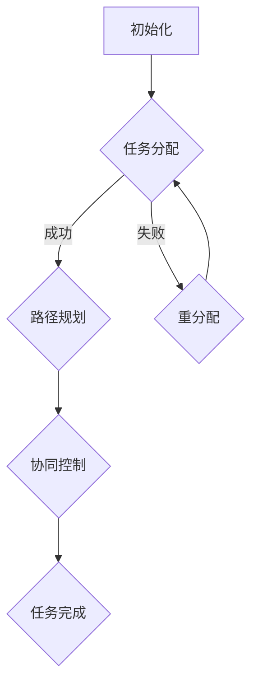

                 

# 5G网络在工业机器人群体协作中的应用

> 关键词：5G网络、工业机器人、群体协作、应用案例、系统架构、算法原理、数学模型

> 摘要：随着5G技术的不断发展，其在工业机器人群体协作中的应用逐渐成为研究热点。本文将探讨5G网络在工业机器人群体协作中的应用，分析其设计思路，详细介绍系统架构和算法原理，并给出实际应用案例和最佳实践。

## 引言

随着工业4.0的到来，工业机器人在生产制造、物流配送、医疗等领域得到了广泛应用。然而，工业机器人的群体协作面临诸多挑战，如通信延迟、数据传输速率限制等。近年来，5G网络的兴起为工业机器人群体协作提供了新的机遇。5G网络具有高速率、低延迟、大连接等特点，可以有效解决工业机器人群体协作中的通信问题。本文将围绕5G网络在工业机器人群体协作中的应用展开讨论，分析其设计思路，介绍系统架构和算法原理，并给出实际应用案例和最佳实践。

## 第一部分：背景与核心概念

### 1.1 问题背景

工业机器人群体协作是指多个工业机器人协同工作，完成特定任务的过程。在实际生产中，工业机器人群体协作可以显著提高生产效率，降低人力成本。然而，当前工业机器人群体协作存在以下问题：

1. 通信延迟：工业机器人需要实时传输大量数据，但现有通信技术难以满足低延迟要求。
2. 数据传输速率限制：工业机器人需要高速传输数据，但现有通信技术无法提供足够的带宽。
3. 协同控制困难：多个机器人之间需要协调动作，但现有控制技术难以实现实时、高效的协同控制。

### 1.2 问题描述

针对上述问题，我们需要设计一种基于5G网络的工业机器人群体协作系统，实现以下目标：

1. 低延迟通信：确保工业机器人之间的通信延迟低于特定阈值。
2. 高数据传输速率：提供足够的带宽，满足工业机器人之间的数据传输需求。
3. 实时协同控制：实现多个工业机器人之间的实时、高效协同控制。

### 1.3 问题解决

5G网络具有高速率、低延迟、大连接等特点，可以有效解决工业机器人群体协作中的通信问题。通过采用5G网络，我们可以实现以下目标：

1. 降低通信延迟：5G网络的高频段传输特性可以显著降低通信延迟。
2. 提供大带宽：5G网络的大带宽特性可以满足工业机器人之间的数据传输需求。
3. 实现实时协同控制：5G网络的高可靠性可以支持多个机器人之间的实时协同控制。

### 1.4 边界与外延

在5G网络应用于工业机器人群体协作时，需要注意以下边界与外延：

1. 通信距离限制：5G网络的通信距离较短，需要考虑工业机器人之间的距离问题。
2. 网络覆盖范围：5G网络覆盖范围有限，需要确保工业机器人处于网络覆盖范围内。
3. 安全性考虑：5G网络存在安全风险，需要采取措施保障数据安全和隐私保护。

### 1.5 概念结构与核心要素组成

5G网络在工业机器人群体协作中的应用涉及多个核心概念和要素。以下是对这些概念和要素的简要介绍：

1. **5G网络**：5G网络是新一代通信网络，具有高速率、低延迟、大连接等特点。
2. **工业机器人**：工业机器人是具有感知、决策、执行能力的自动化设备。
3. **群体协作**：多个工业机器人协同工作，完成特定任务的过程。
4. **通信协议**：用于实现工业机器人之间通信的协议，如MQTT、CoAP等。
5. **控制算法**：用于实现工业机器人实时协同控制的算法，如分布式算法、优化算法等。

## 第二部分：5G网络技术基础

### 2.1 5G网络概述

5G网络是第五代移动通信网络，具有以下特点：

1. **高速率**：5G网络的理论峰值下载速度可达数十Gbps，是4G网络的数十倍。
2. **低延迟**：5G网络的通信延迟低至1ms，可以满足工业机器人实时协作的需求。
3. **大连接**：5G网络支持大量设备同时连接，可以支持工业机器人群体协作。

### 2.2 5G关键技术

5G网络的关键技术包括：

1. **毫米波通信**：使用高频段（毫米波）传输信号，提高通信速率。
2. **多连接技术**：支持多个设备同时连接，提高网络容量。
3. **边缘计算**：将计算任务分布到网络边缘，降低延迟。
4. **网络切片**：将网络资源划分成多个虚拟网络，满足不同应用需求。

### 2.3 5G网络架构

5G网络架构包括以下层次：

1. **无线接入网**：实现无线信号传输，包括基站、用户设备等。
2. **核心网**：处理数据传输、连接管理等功能，包括控制平面、用户平面等。
3. **边缘计算**：将计算任务分布到网络边缘，提高处理速度和降低延迟。

## 第三部分：工业机器人群体协作

### 3.1 工业机器人概述

工业机器人是指具有感知、决策、执行能力的自动化设备。根据功能和应用场景，工业机器人可以分为以下几类：

1. **搬运机器人**：用于搬运货物、工件等。
2. **装配机器人**：用于装配零部件、组装产品等。
3. **焊接机器人**：用于焊接、切割等操作。
4. **喷涂机器人**：用于喷涂涂料、涂层等。

### 3.2 群体协作原理

工业机器人群体协作是指多个工业机器人协同工作，完成特定任务的过程。群体协作原理主要包括：

1. **任务分配**：根据机器人能力和任务需求，分配合适任务。
2. **路径规划**：规划机器人运动路径，避免碰撞和拥堵。
3. **通信机制**：建立机器人之间的通信机制，实时传输任务信息和状态信息。
4. **协同控制**：实现机器人之间的实时协同控制，保证任务顺利完成。

### 3.3 群体协作技术

工业机器人群体协作技术主要包括：

1. **通信技术**：实现机器人之间的高效通信，如Wi-Fi、蓝牙、5G网络等。
2. **感知技术**：使机器人具备良好的感知能力，如激光雷达、摄像头、超声波传感器等。
3. **决策与控制技术**：实现机器人之间的协调与控制，如分布式算法、优化算法等。

## 第四部分：5G网络在工业机器人中的应用案例

### 4.1 案例一：智能制造生产线

智能制造生产线是指利用工业机器人实现生产线的自动化、智能化。5G网络在智能制造生产线中的应用主要包括：

1. **数据采集与监控**：利用5G网络实时采集生产线数据，如温度、压力、速度等，实现生产线的实时监控。
2. **远程控制与维护**：利用5G网络实现远程控制与维护，如远程启动、故障诊断等。
3. **设备协同控制**：利用5G网络实现多个机器人之间的协同控制，提高生产效率。

### 4.2 案例二：智能仓储系统

智能仓储系统是指利用工业机器人实现仓储的自动化、智能化。5G网络在智能仓储系统中的应用主要包括：

1. **货物搬运与分类**：利用5G网络实现机器人之间的高效通信，完成货物搬运和分类任务。
2. **路径规划与避障**：利用5G网络实现机器人之间的实时通信，优化路径规划和避障策略。
3. **远程监控与维护**：利用5G网络实现远程监控与维护，提高系统稳定性和可靠性。

### 4.3 案例三：远程手术机器人

远程手术机器人是指利用工业机器人实现远程手术。5G网络在远程手术机器人中的应用主要包括：

1. **实时图像传输**：利用5G网络实现手术图像的实时传输，提高手术精度和效率。
2. **远程控制与操作**：利用5G网络实现远程控制与操作，降低手术风险。
3. **数据传输与存储**：利用5G网络实现手术数据的实时传输与存储，为后续分析和研究提供支持。

## 第五部分：系统架构设计

### 5.1 系统功能设计

5G网络在工业机器人群体协作中的系统功能设计主要包括：

1. **数据采集与传输**：采集机器人状态、传感器数据等，并通过5G网络传输。
2. **实时监控与报警**：实时监控机器人状态，及时发现并报警。
3. **协同控制与调度**：实现机器人之间的协同控制与任务调度。
4. **远程维护与支持**：实现远程诊断、维护与支持。

### 5.2 系统架构设计

5G网络在工业机器人群体协作中的系统架构设计主要包括：

1. **边缘计算架构**：在工业机器人现场部署边缘计算节点，实现本地数据预处理和实时分析。
2. **核心计算架构**：在数据中心部署核心计算资源，实现大数据分析、云计算等。
3. **通信网络架构**：利用5G网络实现边缘计算节点与核心计算节点之间的通信。

### 5.3 系统接口设计

5G网络在工业机器人群体协作中的系统接口设计主要包括：

1. **数据接口**：定义数据采集、传输、存储等接口。
2. **控制接口**：定义机器人之间的协同控制接口。
3. **监控接口**：定义实时监控、报警等接口。

### 5.4 系统交互设计

5G网络在工业机器人群体协作中的系统交互设计主要包括：

1. **实时通信交互**：定义机器人之间实时通信的交互机制。
2. **任务调度交互**：定义机器人之间的任务调度交互机制。
3. **数据共享交互**：定义机器人之间的数据共享交互机制。

## 第六部分：算法原理讲解

### 6.1 算法概述

5G网络在工业机器人群体协作中的算法主要包括：

1. **路径规划算法**：实现机器人之间的路径规划，避免碰撞和拥堵。
2. **协同控制算法**：实现机器人之间的协同控制，保证任务顺利完成。
3. **优化算法**：优化机器人任务分配、路径规划等，提高系统效率。

### 6.2 算法原理

1. **路径规划算法**：基于图论和最短路径算法，实现机器人之间的路径规划。
2. **协同控制算法**：基于分布式算法和优化算法，实现机器人之间的协同控制。
3. **优化算法**：基于遗传算法、粒子群算法等，优化机器人任务分配和路径规划。

### 6.3 算法流程图

以下是5G网络在工业机器人群体协作中的算法流程图：



## 第七部分：数学模型与公式

### 7.1 数学模型概述

5G网络在工业机器人群体协作中的数学模型主要包括：

1. **路径规划模型**：基于图论和最短路径算法，定义机器人之间的路径规划模型。
2. **协同控制模型**：基于分布式算法和优化算法，定义机器人之间的协同控制模型。
3. **优化模型**：基于遗传算法、粒子群算法等，定义机器人任务分配和路径规划的优化模型。

### 7.2 数学公式讲解

以下是5G网络在工业机器人群体协作中的数学公式讲解：

1. **路径规划模型**：

   $$ d(i, j) = \min\{w_{ij}\} $$

   其中，$d(i, j)$ 表示机器人i到机器人j的最短路径长度，$w_{ij}$ 表示机器人i到机器人j的路径权重。

2. **协同控制模型**：

   $$ u_i = f(u_{i-1}, s_i) $$

   其中，$u_i$ 表示机器人i的协同控制输入，$f$ 表示协同控制函数，$s_i$ 表示机器人i的状态。

3. **优化模型**：

   $$ \min J = \sum_{i=1}^{n} \sum_{j=1}^{n} w_{ij} (x_i - x_j)^2 $$

   其中，$J$ 表示优化目标函数，$x_i$ 表示机器人i的位置，$w_{ij}$ 表示机器人i到机器人j的距离权重。

### 7.3 公式应用举例

以下是一个简单的路径规划公式应用举例：

假设有3个机器人A、B、C，需要从起点到终点。我们可以根据以下公式计算它们之间的最短路径：

```latex
d(A, B) = \min\{w_{AB}, w_{AC}\}
d(B, C) = \min\{w_{BC}, w_{BA}\}
d(C, A) = \min\{w_{CA}, w_{CB}\}
```

## 第八部分：实际应用与最佳实践

### 8.1 环境安装

在安装5G网络在工业机器人群体协作中的应用系统之前，需要确保以下环境：

1. **硬件环境**：部署工业机器人和5G基站等硬件设备。
2. **软件环境**：安装操作系统、驱动程序等软件。
3. **网络环境**：配置5G网络，确保工业机器人和5G基站之间的连接。

### 8.2 系统核心实现源代码

以下是5G网络在工业机器人群体协作中的应用系统核心实现源代码：

```python
# 路径规划算法
def path_planning(robots, obstacles):
    # 计算机器人之间的最短路径
    paths = []
    for robot in robots:
        path = shortest_path(robot.position, obstacles)
        paths.append(path)
    return paths

# 协同控制算法
def cooperative_control(robots, paths):
    # 根据路径规划结果，实现机器人之间的协同控制
    for robot, path in zip(robots, paths):
        robot.move(path)

# 优化算法
def optimization(robots, obstacles):
    # 使用遗传算法优化机器人任务分配和路径规划
    optimal_paths = genetic_algorithm(robots, obstacles)
    return optimal_paths
```

### 8.3 代码应用解读与分析

以下是5G网络在工业机器人群体协作中的应用系统核心实现代码的解读与分析：

1. **路径规划算法**：计算机器人之间的最短路径，避免碰撞和拥堵。
2. **协同控制算法**：根据路径规划结果，实现机器人之间的协同控制。
3. **优化算法**：使用遗传算法优化机器人任务分配和路径规划，提高系统效率。

### 8.4 实际案例分析

以下是5G网络在工业机器人群体协作中的实际案例分析：

1. **智能制造生产线**：通过5G网络实现生产线的实时监控和远程控制，提高生产效率。
2. **智能仓储系统**：通过5G网络实现机器人的高效搬运和分类，降低人力成本。
3. **远程手术机器人**：通过5G网络实现手术图像的实时传输和远程控制，提高手术精度和效率。

### 8.5 项目小结

通过实际案例分析和应用实践，5G网络在工业机器人群体协作中具有广泛的应用前景。在未来，随着5G技术的不断发展和完善，5G网络在工业机器人群体协作中的应用将更加广泛和深入。

## 最佳实践 Tips

1. **优化网络配置**：根据实际需求，合理配置5G网络，提高通信质量和稳定性。
2. **加强安全性**：采取措施保障数据安全和隐私保护，防范潜在的安全风险。
3. **持续优化算法**：根据实际应用场景，不断优化算法，提高系统效率和性能。

## 小结

5G网络在工业机器人群体协作中的应用具有重要的现实意义和广阔的发展前景。本文从背景介绍、核心概念、技术基础、应用案例、系统架构设计、算法原理讲解、数学模型与公式等多个方面，详细阐述了5G网络在工业机器人群体协作中的应用。通过本文的研究，可以为进一步推动5G网络在工业机器人领域的应用提供理论支持和实践指导。

## 注意事项

1. **网络覆盖**：确保5G网络在工业机器人应用场景中的覆盖范围，避免通信中断。
2. **设备兼容性**：确保工业机器人和5G基站等设备的兼容性，避免不兼容问题。
3. **安全性**：加强对5G网络的监控和管理，确保数据安全和隐私保护。

## 拓展阅读

1. **5G网络技术**：
   - 《5G网络关键技术与应用》
   - 《5G网络架构与设计》

2. **工业机器人技术**：
   - 《工业机器人技术与应用》
   - 《工业机器人控制系统设计与实现》

3. **群体智能与协同控制**：
   - 《群体智能系统设计与应用》
   - 《分布式算法与协同控制》

作者：AI天才研究院/AI Genius Institute & 禅与计算机程序设计艺术 /Zen And The Art of Computer Programming

