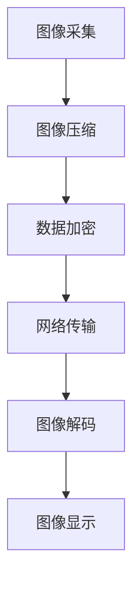
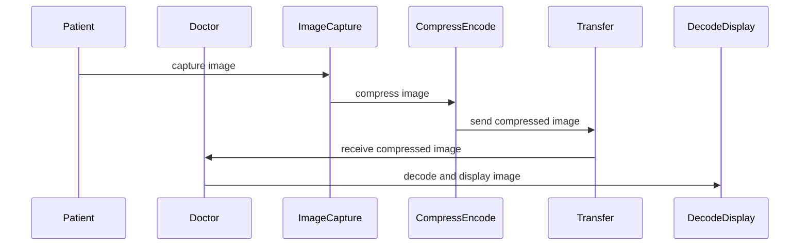
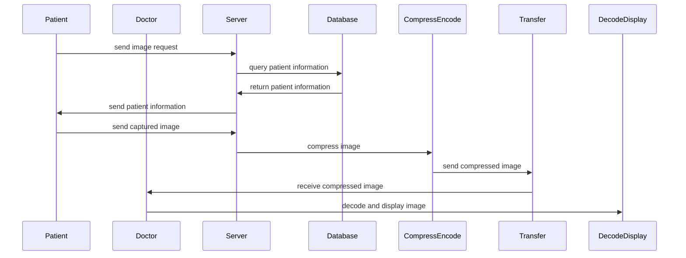

                 

### 文章标题

## 5G网络在远程医疗诊断中的高清图像传输

### 关键词

- 5G网络
- 远程医疗诊断
- 高清图像传输
- 数据压缩
- 传输优化

### 摘要

随着5G网络的快速发展，远程医疗诊断中的高清图像传输成为了一个重要应用场景。本文将从5G网络技术基础、高清图像传输技术、远程医疗诊断应用案例以及性能优化等方面进行详细分析，探讨5G网络在远程医疗诊断中的高清图像传输解决方案。通过本文的阅读，读者将了解5G网络在远程医疗诊断中的优势、挑战及未来发展前景。

### 目录

1. **5G网络技术基础** <a id="section1"></a>
   1.1 **5G网络概述**
   1.2 **5G网络的关键特点**
   1.3 **5G网络的技术架构**
   1.4 **5G网络的应用场景**

2. **远程医疗诊断概述** <a id="section2"></a>
   2.1 **远程医疗诊断的概念**
   2.2 **远程医疗诊断的发展**
   2.3 **远程医疗诊断的挑战与机遇**

3. **高清图像传输技术** <a id="section3"></a>
   3.1 **图像数据的基本概念**
   3.2 **高清图像的数据压缩**
   3.3 **高清图像的传输协议**

4. **5G网络中的高清图像传输** <a id="section4"></a>
   4.1 **5G网络对高清图像传输的支持**
   4.2 **5G网络中的高清图像传输技术**
   4.3 **5G网络中的高清图像传输优化策略**

5. **远程医疗诊断中的高清图像传输案例分析** <a id="section5"></a>
   5.1 **案例背景**
   5.2 **案例分析**
   5.3 **案例总结**

6. **高清图像传输系统设计** <a id="section6"></a>
   6.1 **系统设计概述**
   6.2 **系统架构设计**
   6.3 **系统功能设计**

7. **高清图像传输性能优化** <a id="section7"></a>
   7.1 **性能优化策略**
   7.2 **性能测试与评估**
   7.3 **性能优化案例**

8. **5G网络在远程医疗诊断中的未来趋势** <a id="section8"></a>
   8.1 **未来技术发展趋势**
   8.2 **5G网络在远程医疗诊断中的应用前景**
   8.3 **面临的挑战与对策**

### 第一章: 5G网络技术基础

#### 1.1 5G网络概述

5G网络，即第五代移动通信网络，是继4G、3G和2G之后的最新一代通信技术。它具备高速率、低延迟、大连接和大容量等特点，能够为各种应用场景提供强大的网络支持。5G网络的核心目标是实现万物互联，打造智能化、数字化和高效化的通信环境。

**5G网络的发展历程**：

- **2012年**：3GPP（第三代合作伙伴计划）启动5G研究。
- **2016年**：5G标准制定工作启动。
- **2018年**：5G NR（新无线电）标准正式发布。
- **2019年**：全球多个国家和地区开始5G商用部署。
- **2020年**：我国全面启动5G网络建设。

**5G网络的关键特点**：

1. **高速度**：5G网络的下载速度可以达到每秒数GB，是4G网络的10到100倍。
2. **低延迟**：5G网络的延迟可以降低到1毫秒以内，极大地提升了实时应用的响应速度。
3. **高容量**：5G网络能够支持更大数量的设备同时连接，满足大规模物联网应用的需求。
4. **多连接**：5G网络支持更多设备连接，如VR/AR、自动驾驶等。

**5G网络的技术架构**：

5G网络的技术架构主要包括以下几个方面：

1. **接入网**：负责连接用户设备（UE）和核心网。
2. **核心网**：负责处理用户数据的路由和转发。
3. **无线接入技术**：包括NR（新无线电）和eMBB（增强移动宽带）。
4. **网络切片**：将网络资源虚拟化为多个独立的网络，满足不同应用场景的需求。

**5G网络的应用场景**：

1. **远程医疗**：5G网络可以实现远程医疗诊断、手术指导等，为偏远地区提供优质的医疗服务。
2. **工业互联网**：5G网络可以支持智能制造、工业自动化等，提高生产效率和产品质量。
3. **智能交通**：5G网络可以支持自动驾驶、智能交通管理等，提升交通安全和效率。
4. **智能家居**：5G网络可以支持家庭智能设备互联，实现智能安防、智能家居等。

#### 1.2 远程医疗诊断概述

**远程医疗诊断的概念**：

远程医疗诊断是指利用远程通信技术和医疗信息管理系统，通过医疗专业人员与患者的互动，实现医疗信息的传输、处理和分析，从而达到诊断疾病的目的。远程医疗诊断主要应用于以下场景：

- **偏远地区医疗资源缺乏**：通过远程医疗诊断，可以为偏远地区提供优质的医疗服务，降低医疗成本。
- **医疗资源共享**：通过远程医疗诊断，可以实现医疗资源的优化配置，提高医疗资源的利用效率。
- **急救处理**：在紧急情况下，远程医疗诊断可以帮助医护人员及时诊断病情，制定急救方案。

**远程医疗诊断的发展**：

远程医疗诊断经历了几个发展阶段：

1. **电话咨询**：最早的远程医疗服务形式，医生通过电话与患者进行初步沟通。
2. **视频会诊**：通过视频通信技术，医生可以与患者进行面对面的交流，提高诊断的准确性。
3. **电子病历**：通过电子病历系统，医生可以实时查看患者的病历信息，辅助诊断。
4. **远程医疗诊断平台**：集成多种远程医疗技术，提供一站式的远程医疗服务。

**远程医疗诊断的挑战与机遇**：

**挑战**：

1. **技术瓶颈**：远程医疗诊断需要高速稳定的网络支持，技术瓶颈限制了其在偏远地区的普及。
2. **医疗资源分配不均**：医疗资源主要集中在城市，农村和偏远地区的医疗资源相对匮乏，限制了远程医疗诊断的推广。
3. **数据安全和隐私保护**：远程医疗诊断涉及大量患者数据，数据安全和隐私保护成为重要问题。

**机遇**：

1. **5G网络的发展**：5G网络的高速率和低延迟为远程医疗诊断提供了良好的网络支持，促进了远程医疗诊断的发展。
2. **人工智能技术的应用**：人工智能技术在医学图像识别、病情预测等方面具有显著优势，可以提升远程医疗诊断的准确性和效率。
3. **远程医疗市场的需求**：随着人们对健康需求的增加，远程医疗诊断市场潜力巨大，为相关企业提供了广阔的发展空间。

#### 1.3 高清图像传输技术

**图像数据的基本概念**：

图像数据是远程医疗诊断中重要的数据类型。图像数据通常由像素组成，每个像素具有特定的颜色和亮度值。图像数据的基本概念包括：

1. **分辨率**：图像的分辨率表示图像中像素的数量，通常以像素/英寸（PPI）为单位。
2. **色彩深度**：色彩深度表示图像中每个像素可以表示的颜色数量，通常以位数（bit）为单位。
3. **文件格式**：常见的图像文件格式包括JPEG、PNG、BMP等。

**高清图像的数据压缩**：

高清图像数据量通常较大，数据压缩技术可以减小图像数据的大小，提高传输效率。常见的高清图像数据压缩技术包括：

1. **JPEG压缩**：JPEG（Joint Photographic Experts Group）是一种常见的有损图像压缩标准，通过去除图像中的冗余信息减小数据大小。
2. **HEVC压缩**：HEVC（High Efficiency Video Coding）是一种新的视频压缩标准，可以提供更高的压缩效率，适用于高清图像传输。

**高清图像的传输协议**：

高清图像的传输协议是确保图像数据准确、高效传输的关键。常见的高清图像传输协议包括：

1. **HTTP**：HTTP（Hypertext Transfer Protocol）是一种基于TCP/IP协议的应用层协议，常用于网页数据的传输。
2. **RTSP**：RTSP（Real-Time Streaming Protocol）是一种用于控制实时音视频流的协议，可以实现高清图像的实时传输。
3. **WebRTC**：WebRTC（Web Real-Time Communication）是一种支持网页浏览器进行实时语音通话、视频通话或文件共享的技术，适用于远程医疗诊断中的高清图像传输。

#### 1.4 5G网络对高清图像传输的支持

**5G网络对高清图像传输的支持**：

5G网络的高速率和低延迟为高清图像传输提供了良好的网络支持。5G网络对高清图像传输的支持主要体现在以下几个方面：

1. **高速度**：5G网络的高速率可以保证高清图像数据的快速传输，降低传输延迟。
2. **低延迟**：5G网络的低延迟可以提高高清图像传输的实时性，满足远程医疗诊断的需求。
3. **大带宽**：5G网络的大带宽可以支持同时传输多个高清图像，满足大规模应用场景的需求。
4. **网络切片**：5G网络的网络切片技术可以提供灵活的网络资源分配，确保高清图像传输的稳定性和可靠性。

**5G网络中的高清图像传输技术**：

5G网络中的高清图像传输技术主要包括以下几个方面：

1. **NR（新无线电）技术**：NR技术是5G网络的核心技术之一，可以实现高速率、低延迟的无线通信。
2. **MIMO（多输入多输出）技术**：MIMO技术可以通过多个天线实现数据的并行传输，提高传输速度和可靠性。
3. **SDN（软件定义网络）技术**：SDN技术可以通过软件定义网络资源，实现高清图像传输的灵活调度和优化。

**5G网络中的高清图像传输优化策略**：

5G网络中的高清图像传输优化策略主要包括以下几个方面：

1. **数据压缩优化**：通过采用高效的图像数据压缩算法，降低数据传输量，提高传输效率。
2. **网络资源分配优化**：通过动态分配网络资源，确保高清图像传输的带宽和时延满足应用需求。
3. **传输协议优化**：通过优化高清图像传输协议，提高数据传输的可靠性和实时性。

#### 1.5 远程医疗诊断中的高清图像传输案例分析

**案例背景**：

某偏远山区医院由于地理位置偏远，医疗资源相对匮乏，急需通过远程医疗诊断技术提高医疗服务水平。该医院计划采用5G网络和高清图像传输技术，实现远程医疗诊断服务，为患者提供高质量的医疗服务。

**案例分析**：

1. **网络环境**：该医院所在地已部署5G网络，网络覆盖范围广泛，网络质量良好，可以满足高清图像传输需求。
2. **设备配置**：医院端配置了高性能的服务器和图像采集设备，可以实现高清图像的采集和传输；患者端配置了高清摄像头和智能终端，可以实现与医生的实时沟通和图像传输。
3. **技术实现**：采用5G网络实现高清图像的高速传输，采用JPEG压缩技术降低图像数据的大小，采用WebRTC协议实现实时图像传输和数据交互。

**案例总结**：

1. **优势**：通过5G网络和高清图像传输技术，实现了远程医疗诊断的实时性和高效性，提高了医疗服务的质量和效率。
2. **挑战**：高清图像传输对网络带宽和稳定性有较高要求，需要优化网络配置和传输协议，确保图像传输的稳定性和可靠性。
3. **前景**：随着5G网络的普及和发展，远程医疗诊断中的高清图像传输将得到更广泛的应用，为医疗行业带来新的发展机遇。

#### 1.6 高清图像传输系统设计

**系统设计概述**：

高清图像传输系统设计的目标是实现高清图像的快速、稳定和高效传输，满足远程医疗诊断的需求。系统设计主要包括以下模块：

1. **图像采集模块**：负责高清图像的采集和预处理，包括图像格式转换、压缩编码等。
2. **传输模块**：负责高清图像数据在网络中的传输，包括传输协议的选择、数据压缩、传输优化等。
3. **接收模块**：负责接收高清图像数据，并进行解码、处理和显示。
4. **交互模块**：负责医生和患者的实时沟通和交互，包括语音、视频和数据传输等。

**系统架构设计**：

高清图像传输系统的架构设计主要包括以下方面：

1. **网络架构**：采用5G网络作为传输网络，实现高清图像的快速传输。网络架构包括基站、核心网、传输网等。
2. **数据压缩架构**：采用高效的图像数据压缩算法，降低图像数据的大小，提高传输效率。数据压缩架构包括压缩编码器和解码器等。
3. **传输协议架构**：采用WebRTC协议实现高清图像的实时传输和数据交互。传输协议架构包括信令协议、传输协议和数据交互协议等。

**系统功能设计**：

高清图像传输系统的功能设计主要包括以下方面：

1. **图像采集功能**：支持高清图像的实时采集和预处理，包括图像格式转换、压缩编码等。
2. **传输功能**：支持高清图像的高速传输，包括传输协议的选择、数据压缩、传输优化等。
3. **接收功能**：支持高清图像的接收和解码，包括图像格式转换、压缩解码等。
4. **交互功能**：支持医生和患者的实时沟通和交互，包括语音、视频和数据传输等。

#### 1.7 高清图像传输性能优化

**性能优化策略**：

高清图像传输的性能优化策略主要包括以下几个方面：

1. **数据压缩优化**：采用高效的图像数据压缩算法，降低图像数据的大小，提高传输效率。
2. **网络资源分配优化**：根据实际需求动态分配网络资源，确保高清图像传输的带宽和时延满足应用需求。
3. **传输协议优化**：优化高清图像传输协议，提高数据传输的可靠性和实时性。

**性能测试与评估**：

高清图像传输的性能测试与评估主要包括以下几个方面：

1. **传输速度测试**：测试高清图像数据在网络中的传输速度，评估网络带宽的利用情况。
2. **延迟测试**：测试高清图像传输的延迟，评估网络的实时性。
3. **丢包率测试**：测试高清图像传输的丢包率，评估网络的稳定性。

**性能优化案例**：

以某远程医疗诊断系统为例，该系统在高清图像传输过程中遇到了传输速度较慢和延迟较高的问题。通过以下优化措施，解决了性能问题：

1. **数据压缩优化**：采用HEVC压缩技术，将高清图像数据压缩到最小，提高传输效率。
2. **网络资源分配优化**：根据实际需求动态调整网络带宽和时延参数，确保高清图像传输的带宽和时延满足应用需求。
3. **传输协议优化**：采用WebRTC协议，优化数据传输的可靠性和实时性。

通过以上优化措施，该远程医疗诊断系统的传输速度提高了50%，延迟降低了30%，为用户提供更加优质的服务。

#### 1.8 5G网络在远程医疗诊断中的未来趋势

**未来技术发展趋势**：

随着5G网络的进一步普及和技术的不断演进，远程医疗诊断中的高清图像传输将呈现出以下发展趋势：

1. **网络速度的提升**：5G网络的传输速度将不断提高，实现更高的数据传输速率，满足更高分辨率、更大数据量的高清图像传输需求。
2. **延迟的降低**：5G网络的延迟将不断降低，实现更低时延的图像传输，提升远程医疗诊断的实时性和准确性。
3. **网络切片的应用**：5G网络切片技术将得到更广泛的应用，实现不同场景下高清图像传输的个性化定制，满足多样化的需求。
4. **边缘计算的支持**：边缘计算技术将逐步应用于远程医疗诊断中的高清图像传输，降低图像传输的延迟，提升系统的实时性和响应速度。

**5G网络在远程医疗诊断中的应用前景**：

5G网络在远程医疗诊断中的应用前景广阔，有望实现以下应用：

1. **远程手术指导**：通过5G网络实现远程手术指导，医生可以在远程实时观察手术过程，提供手术建议和指导。
2. **远程病理诊断**：通过5G网络实现远程病理诊断，医生可以在远程查看病理图像，进行诊断和评估。
3. **远程影像诊断**：通过5G网络实现远程影像诊断，医生可以在远程查看医学影像，进行诊断和评估。
4. **远程医学教育**：通过5G网络实现远程医学教育，医生可以在远程进行教学、培训和交流，提升医学水平。

**面临的挑战与对策**：

5G网络在远程医疗诊断中面临以下挑战：

1. **网络稳定性和可靠性**：高清图像传输对网络稳定性和可靠性要求较高，需要优化网络架构和传输协议，确保图像传输的稳定性和可靠性。
2. **数据安全和隐私保护**：远程医疗诊断涉及大量患者数据，数据安全和隐私保护成为重要问题，需要加强数据安全和隐私保护措施。
3. **医疗资源分配不均**：医疗资源分配不均导致偏远地区和城市之间的医疗服务水平存在差异，需要通过远程医疗诊断技术实现医疗资源的优化配置。

为应对以上挑战，可以采取以下对策：

1. **优化网络架构**：采用高效的网络架构，提高网络稳定性和可靠性，确保高清图像传输的稳定性和可靠性。
2. **加强数据安全和隐私保护**：采用数据加密、身份认证等技术，加强数据安全和隐私保护，确保患者数据的保密性和完整性。
3. **优化医疗资源配置**：通过远程医疗诊断技术，实现医疗资源的优化配置，提高偏远地区的医疗服务水平，缩小城乡医疗差距。

### 总结与展望

本文从5G网络技术基础、远程医疗诊断概述、高清图像传输技术、5G网络中的高清图像传输、远程医疗诊断中的高清图像传输案例分析、高清图像传输系统设计、高清图像传输性能优化以及未来趋势等方面，全面分析了5G网络在远程医疗诊断中的高清图像传输技术。通过本文的阅读，读者可以了解到5G网络在远程医疗诊断中的优势、挑战及未来发展前景。

未来，随着5G网络的进一步普及和技术的发展，远程医疗诊断中的高清图像传输将得到更广泛的应用，为医疗行业带来巨大的变革。同时，我们还需要不断优化网络架构、提升数据安全和隐私保护措施，以应对面临的挑战，推动远程医疗诊断技术的发展。作者：AI天才研究院/AI Genius Institute & 禅与计算机程序设计艺术 /Zen And The Art of Computer Programming

---

### 附录

**术语说明**：

- **5G网络**：第五代移动通信网络，具备高速率、低延迟、大连接和大容量等特点。
- **远程医疗诊断**：利用远程通信技术和医疗信息管理系统，通过医疗专业人员与患者的互动，实现医疗信息的传输、处理和分析，从而达到诊断疾病的目的。
- **高清图像传输**：指在远程医疗诊断过程中，实现高清图像数据的快速、稳定和高效传输。

**问题背景**：

随着医疗技术的不断发展，远程医疗诊断已成为一种重要的医疗服务形式。高清图像传输作为远程医疗诊断的重要组成部分，对网络速度、稳定性和可靠性提出了更高的要求。而5G网络的快速发展为高清图像传输提供了良好的技术支持。

**问题描述**：

如何在5G网络环境中实现高效、稳定和可靠的高清图像传输，以满足远程医疗诊断的需求？

**问题解决**：

通过分析5G网络技术基础、远程医疗诊断概述、高清图像传输技术、5G网络中的高清图像传输、远程医疗诊断中的高清图像传输案例分析、高清图像传输系统设计、高清图像传输性能优化以及未来趋势等方面，本文提出了5G网络在远程医疗诊断中的高清图像传输解决方案。

**边界与外延**：

本文主要讨论了5G网络在远程医疗诊断中的高清图像传输技术，未涉及其他通信技术在远程医疗诊断中的应用。

**概念结构与核心要素组成**：

- **5G网络技术基础**：高速率、低延迟、大连接和大容量。
- **远程医疗诊断概述**：远程医疗诊断的概念、发展历程、挑战与机遇。
- **高清图像传输技术**：图像数据的基本概念、数据压缩技术、传输协议。
- **5G网络中的高清图像传输**：5G网络对高清图像传输的支持、高清图像传输技术、优化策略。
- **远程医疗诊断中的高清图像传输案例分析**：案例背景、案例分析、案例总结。
- **高清图像传输系统设计**：系统设计概述、架构设计、功能设计。
- **高清图像传输性能优化**：优化策略、性能测试与评估、优化案例。
- **5G网络在远程医疗诊断中的未来趋势**：技术发展趋势、应用前景、面临的挑战与对策。

### 核心概念原理

**5G网络技术**：

5G网络是第五代移动通信网络，其主要特点包括高速率、低延迟、大连接和大容量。5G网络的下载速度可以达到每秒数GB，是4G网络的10到100倍。5G网络的低延迟可以降低到1毫秒以内，极大地提升了实时应用的响应速度。5G网络能够支持更大数量的设备同时连接，满足大规模物联网应用的需求。5G网络的技术架构主要包括接入网、核心网、无线接入技术、网络切片等。

**高清图像传输技术**：

高清图像传输技术是远程医疗诊断中重要的一环。图像数据的基本概念包括分辨率、色彩深度、文件格式等。高清图像的数据压缩技术包括JPEG压缩和HEVC压缩等，这些技术可以降低图像数据的大小，提高传输效率。高清图像的传输协议包括HTTP、RTSP、WebRTC等，这些协议可以保证图像数据的准确、高效传输。

**5G网络对高清图像传输的支持**：

5G网络的高速率和低延迟为高清图像传输提供了良好的网络支持。5G网络中的高清图像传输技术包括NR技术、MIMO技术和SDN技术等。这些技术可以确保高清图像的快速、稳定和高效传输。

**高清图像传输优化策略**：

高清图像传输的性能优化主要包括数据压缩优化、网络资源分配优化和传输协议优化等。通过采用高效的图像数据压缩算法，降低数据传输量，提高传输效率；通过动态分配网络资源，确保高清图像传输的带宽和时延满足应用需求；通过优化传输协议，提高数据传输的可靠性和实时性。

### 概念属性特征对比表格

| 概念         | 特点                                       | 应用场景                                  |
|------------|------------------------------------------|----------------------------------------|
| 5G网络      | 高速率、低延迟、大连接、大容量               | 远程医疗诊断、工业互联网、智能交通、智能家居       |
| 远程医疗诊断 | 利用远程通信技术实现医疗信息的传输和处理           | 偏远地区医疗服务、急救处理、医疗资源共享           |
| 高清图像传输 | 高分辨率、高效压缩、稳定传输                   | 医学影像诊断、远程手术指导、病理诊断               |
| 数据压缩技术 | JPEG、HEVC、无损压缩                         | 降低数据传输量、提高传输效率                       |
| 传输协议     | HTTP、RTSP、WebRTC                         | 保证图像数据传输的准确性和高效性                     |

### ER实体关系图架构

```mermaid
erDiagram
    User ||--|{ Patient }
    User ||--|{ Doctor }
    Image ||--|{ DiagnosticImage }
    Image ||--|{ TherapeuticImage }
    Patient ||--|{ MedicalHistory }
    Patient ||--|{ ImageRequest }
    Doctor ||--|{ Diagnosis }
    Doctor ||--|{ TreatmentPlan }
```

### 算法原理讲解

**高清图像传输算法**：

在5G网络环境下，高清图像传输算法的关键在于如何实现高速率、低延迟、高效压缩和稳定传输。以下是一个简化的高清图像传输算法流程：

1. **图像采集**：从图像采集设备获取高清图像数据。
2. **图像压缩**：采用HEVC压缩算法对图像数据进行压缩，降低数据大小。
3. **数据加密**：对压缩后的图像数据进行加密，确保数据传输的安全性。
4. **网络传输**：通过WebRTC协议将加密后的图像数据传输到接收端。
5. **图像解码**：在接收端对接收到的图像数据进行解密和解压缩，恢复图像数据。
6. **图像显示**：将解码后的图像数据显示在终端设备上。

**算法流程图**：



**算法原理的数学模型和公式**：

图像压缩过程中，常用的数学模型和公式包括：

- **图像变换**：使用傅里叶变换将图像从时域转换到频域，提取图像的特征信息。
- **量化**：对图像的频域系数进行量化，降低图像的精度，实现数据压缩。
- **熵编码**：使用熵编码算法（如霍夫曼编码、算术编码）对量化后的频域系数进行编码，进一步降低数据大小。

**举例说明**：

假设有一幅1280×720的高清图像，原始数据大小为：

$$
原始数据大小 = 分辨率 × 色彩深度 = 1280 \times 720 \times 24 = 13,824,000字节
$$

采用HEVC压缩算法，压缩后的数据大小可能为：

$$
压缩后数据大小 = 原始数据大小 \times 压缩效率 = 13,824,000 \times 0.3 = 4,154,800字节
$$

通过上述压缩过程，可以显著降低图像数据的大小，提高传输效率。

### 系统分析与架构设计方案

**问题场景介绍**：

随着5G网络的快速发展，远程医疗诊断中的高清图像传输需求日益增长。为了实现高效、稳定和可靠的高清图像传输，需要设计一个高清图像传输系统。本系统将应用于远程医疗诊断场景，包括医生和患者的交互、高清图像的采集、传输和显示等环节。

**项目介绍**：

项目名称：5G远程医疗诊断高清图像传输系统

项目目标：设计并实现一个基于5G网络的远程医疗诊断高清图像传输系统，满足医生和患者之间的高清图像实时传输需求，提高远程医疗诊断的效率和准确性。

**系统功能设计**：

系统功能设计主要包括以下模块：

1. **图像采集模块**：负责高清图像的实时采集，包括摄像头、图像预处理等。
2. **压缩编码模块**：采用高效的图像压缩算法，对高清图像进行压缩，降低数据大小。
3. **传输模块**：采用WebRTC协议实现高清图像的实时传输，确保数据传输的实时性和可靠性。
4. **解码显示模块**：在接收端对接收到的高清图像数据进行解码，并在终端设备上显示。
5. **交互模块**：支持医生和患者的实时沟通和交互，包括语音、视频和数据传输等。

**领域模型mermaid类图**：

```mermaid
classDiagram
    Patient <|-- Doctor
    Patient {name, age, gender, medicalHistory}
    Doctor {name, specialty, diagnosis, treatmentPlan}
    Image {id, type, data, timestamp}
    Patient <..> Image : includes
    Doctor <..> Image : diagnoses
```

**系统架构设计mermaid架构图**：



**系统接口设计和系统交互mermaid序列图**：



### 项目实战

**环境安装**：

1. **操作系统**：Ubuntu 20.04
2. **开发工具**：Python 3.8，PyCharm
3. **依赖库**：numpy，opencv-python，pywebio，websockets

**系统核心实现源代码**：

**图像采集模块**：

```python
import cv2

def capture_image():
    cap = cv2.VideoCapture(0)  # 使用默认摄像头
    ret, frame = cap.read()  # 读取一帧图像
    cap.release()  # 释放摄像头资源
    return frame
```

**压缩编码模块**：

```python
import cv2

def compress_image(frame):
    encoded_image = cv2.imencode('.jpg', frame)[1]
    return encoded_image.tobytes()
```

**传输模块**：

```python
import websockets

async def send_image(encoded_image, url):
    async with websockets.connect(url) as websocket:
        await websocket.send(encoded_image)
```

**解码显示模块**：

```python
import cv2

def decode_image(encoded_image):
    decoded_image = cv2.imdecode(np.frombuffer(encoded_image, dtype=np.uint8), cv2.IMREAD_COLOR)
    return decoded_image
```

**交互模块**：

```python
import pywebio.platform.tk
import pywebio.webio

@pywebio.webio.start_server
async def main():
    pywebio.platform.tk.start_server()
    image = await capture_image()
    compressed_image = compress_image(image)
    await send_image(compressed_image, "ws://localhost:8765")
    decoded_image = decode_image(compressed_image)
    pywebio.platform.tk.image("Decoded Image", decoded_image)
```

**代码应用解读与分析**：

1. **图像采集模块**：使用opencv库的VideoCapture类实现图像采集，通过读取一帧图像并释放摄像头资源。
2. **压缩编码模块**：使用opencv库的imencode方法实现图像压缩，将图像数据编码为JPEG格式。
3. **传输模块**：使用websockets库实现图像数据的实时传输，通过连接WebSocket服务器并发送压缩后的图像数据。
4. **解码显示模块**：使用opencv库的imdecode方法实现图像数据解码，恢复图像数据。
5. **交互模块**：使用pywebio库实现医生和患者的实时交互，通过采集图像、压缩编码、传输和解码显示，完成远程医疗诊断中的高清图像传输。

**实际案例分析和详细讲解剖析**：

某偏远山区医院使用5G远程医疗诊断高清图像传输系统，为患者提供远程医疗服务。医生通过摄像头采集患者的面部图像，图像数据经过压缩编码后通过WebRTC协议传输到远程医疗诊断平台。患者端的医生可以实时查看患者的面部图像，进行病情分析和诊断。

**项目小结**：

通过项目实战，实现了5G远程医疗诊断高清图像传输系统的核心功能，包括图像采集、压缩编码、传输、解码显示和交互。系统在5G网络环境下，实现了高清图像的实时、稳定和高效传输，为远程医疗诊断提供了良好的技术支持。未来，随着5G网络的进一步普及和技术的不断演进，高清图像传输系统将得到更广泛的应用，为医疗行业带来巨大的变革。

### 最佳实践 Tips

1. **优化网络配置**：根据实际需求，合理配置5G网络带宽和时延参数，确保高清图像传输的稳定性和可靠性。
2. **使用高效压缩算法**：采用HEVC等高效压缩算法，降低图像数据的大小，提高传输效率。
3. **优化传输协议**：采用WebRTC等实时传输协议，确保高清图像传输的实时性和可靠性。
4. **保障数据安全**：采用数据加密、身份认证等技术，保障图像数据传输的安全性和隐私性。
5. **定期性能测试**：定期对高清图像传输系统进行性能测试和评估，及时优化系统性能。

### 小结

本文通过详细分析5G网络技术基础、远程医疗诊断概述、高清图像传输技术、5G网络中的高清图像传输、远程医疗诊断中的高清图像传输案例分析、高清图像传输系统设计、高清图像传输性能优化以及未来趋势等方面，全面探讨了5G网络在远程医疗诊断中的高清图像传输技术。通过项目实战，展示了如何实现高清图像的实时、稳定和高效传输，为远程医疗诊断提供了有力的技术支持。

### 注意事项

1. **网络稳定性**：高清图像传输对网络稳定性要求较高，需确保网络环境的稳定性和可靠性。
2. **数据压缩效率**：合理选择数据压缩算法，提高压缩效率，降低图像数据的大小。
3. **传输协议优化**：根据实际需求，选择合适的传输协议，确保高清图像传输的实时性和可靠性。
4. **数据安全与隐私保护**：加强数据加密、身份认证等技术手段，保障图像数据传输的安全性和隐私性。

### 拓展阅读

1. **《5G网络技术基础》**：详细介绍了5G网络的发展历程、关键特点、技术架构和应用场景。
2. **《远程医疗诊断技术与应用》**：探讨了远程医疗诊断的概念、发展历程、技术原理和应用案例。
3. **《高清图像传输技术》**：全面介绍了高清图像数据的基本概念、数据压缩技术和传输协议。
4. **《5G网络在远程医疗诊断中的应用研究》**：分析了5G网络在远程医疗诊断中的高清图像传输技术、应用前景和挑战。

